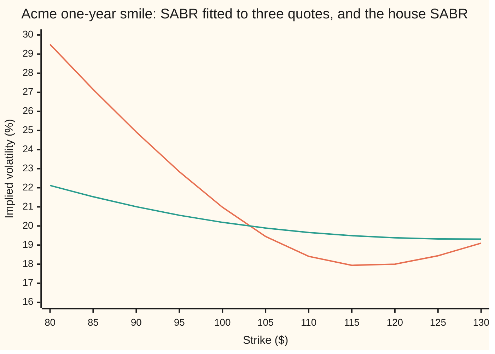
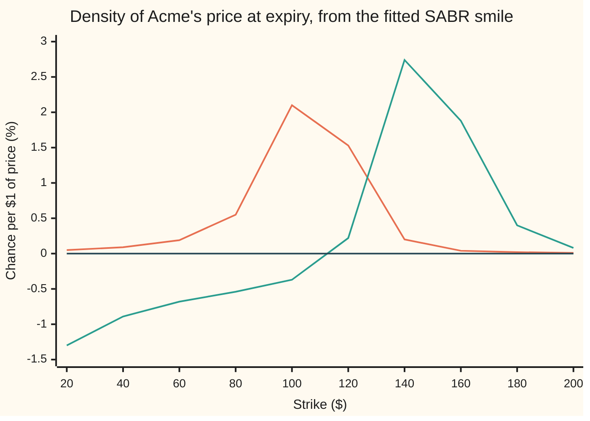

# SABR from three quotes: alpha from the ATM vol, rho and nu from the wings, and where the formula breaks

[Syllabus](../../../SYLLABUS.md) → [Financial mathematics](../../../SYLLABUS.md#w12) → [Stochastic volatility - Heston, SABR and their mix](../../../SYLLABUS.md#w12-s14) → SABR from three quotes

---

## General Overview

A desk holds three prices for one-year options on Acme shares, each quoted as an implied volatility: the volatility that makes the Black-76 formula reproduce that option's price ([Black-76](../05-Black-Scholes%20from%20the%20Ground%20Up/06-black-76-and-forward-level-pricing.md)). The $92.15 strike trades at 24%. The strike at the forward price, $103.05, the price agreed today for delivery in a year, trades at 20%. The $119.93 strike trades at 18%. The outer two are the house market's 25-delta put and call strikes ([Strike from delta](../11-Implied%20volatility%20and%20the%20vanilla%20inverses/03-strike-from-delta.md)). The middle one is **at the money**, which here means struck at the forward.

The desk runs SABR ([SABR and Hagan's formula](04-sabr-model-and-hagan-formula.md)): a model in which the forward price and its volatility both move at random. Its exponent sets how the forward's swings scale with its price. With the exponent fixed at 1, SABR has three free dials: a volatility level, a correlation and a volatility of volatility. Three quotes, three dials: a square system, as many equations as unknowns. The middle quote gives the level through a quadratic equation. The outer quotes, the **wings**, fix the other two dials. The fitted curve passes through all three quotes and fills in every strike between.

The fit is a one-year statement. Hagan's formula, the closed-form approximation that turns SABR's dials into a smile, is accurate while the expiry is short. Keep the dials, ask about ten years, and the formula prices a butterfly around the $40 strike, a position that never pays less than zero, at minus 54 cents. That implies a negative probability. The formula has failed there; the model has not.

**The at-the-money quote fixes the volatility level through a quadratic whose small positive root is the right one; the two wing quotes then fix the correlation, which tilts the smile, and the volatility of volatility, which curls it; and the fitted smile must be checked for a negative density before it is trusted at long expiries.**

**What kind of fact this is:** a method: three equations solved for three numbers. It runs on Hagan's formula, an approximation whose named failure, a negative density at low strikes for long expiries, is shown in Why it works, Step 4.

### The picture: three quotes in, a smile out



Orange: the SABR smile fitted to the quotes, through 24% at $92.15, 20% at $103.05 and 18% at $119.93, between the ticks. Green: the shelf's house SABR, correlation −0.3 and volatility of volatility 0.4. The quotes demand a steeper tilt and a deeper curl than the house dials give.

---

## The formula

Notation first, in words. $\sigma_B(K)$ is Hagan's implied volatility at strike $K$: the smile. $\sigma_{\text{ATM}}$, $\sigma_1$ and $\sigma_2$ are the quotes at the forward $F$ and at the wing strikes $K_1$ and $K_2$. $T$ is the time to expiry in years. SABR's dials are $\alpha$ (alpha, the level), $\rho$ (rho, the correlation), $\nu$ (nu, the volatility of volatility) and $\beta$ (beta, the exponent). At $\beta = 1$ Hagan's formula reads

$$\sigma_B(K) = \alpha\,\frac{z}{\chi(z)}\,\Big(1 + \big[\tfrac14\,\rho\,\nu\,\alpha + \tfrac{1}{24}\,(2 - 3\rho^2)\,\nu^2\big]\,T\Big), \qquad z = \frac{\nu}{\alpha}\,\ln\frac{F}{K}, \qquad \chi(z) = \ln\frac{\sqrt{1 - 2\rho z + z^2} + z - \rho}{1 - \rho}.$$

In words: the level, times a smile factor $z/\chi(z)$ that is 1 at the forward, times a time factor that is the same at every strike. The sibling card derives it; this card runs it backwards.

The calibration is three equations in three unknowns:

$$\sigma_B(F) = \sigma_{\text{ATM}}, \qquad \sigma_B(K_1) = \sigma_1, \qquad \sigma_B(K_2) = \sigma_2.$$

**Read it aloud:** choose alpha, rho and nu so that Hagan's smile passes through all three quotes.

At the forward, $z = 0$ and the smile factor is 1; the first equation, multiplied out, is a polynomial in $\alpha$. For a general exponent it is the **ATM cubic** (ATM: at the money):

$$c_3\,\alpha^3 + c_2\,\alpha^2 + c_1\,\alpha - \sigma_{\text{ATM}}\,F^{1-\beta} = 0, \qquad c_3 = \frac{(1-\beta)^2\,T}{24\,F^{2-2\beta}},\quad c_2 = \frac{\rho\,\beta\,\nu\,T}{4\,F^{1-\beta}},\quad c_1 = 1 + \frac{(2-3\rho^2)\,\nu^2\,T}{24}.$$

At $\beta = 1$ the cubic term vanishes, $c_2 = \rho\nu T/4$, and the equation is a quadratic. Its relevant root is

$$\alpha \;=\; \frac{-c_1 + \sqrt{c_1^2 + 4\,c_2\,\sigma_{\text{ATM}}}}{2\,c_2} \;=\; \frac{2\,\sigma_{\text{ATM}}}{c_1 + \sqrt{c_1^2 + 4\,c_2\,\sigma_{\text{ATM}}}}.$$

**Read it aloud:** the level is the at-the-money quote divided by the time factor, $c_1 + c_2\alpha$, that the correlation and the volatility of volatility add.

The second form is the first multiplied top and bottom by $c_1 + \sqrt{c_1^2 + 4c_2\sigma_{\text{ATM}}}$; it never divides by $c_2$, so it also works at $\rho = 0$. With $\alpha$ tied to $\rho$ and $\nu$ this way, the wing equations are two equations in two unknowns, with no closed form.

The fitted smile then has to pass one more test ([The butterfly and the implied density](../10-Digitals%20and%20the%20implied%20density/05-butterfly-and-the-implied-density.md)):

$$f(K) \;=\; \frac{1}{D(T)}\,\frac{\partial^2 C}{\partial K^2}(K) \;\ge\; 0.$$

**Read it aloud:** the bend of the call price curve in strike, divided by the discount factor, is a probability density and may not be negative.

| Symbol | Plain meaning | In our example | Push it up and the answer… |
| --- | --- | --- | --- |
| $F$, $S$, $r$, $q$ | forward $S e^{(r-q)T}$, the price fixed today for delivery at expiry; Acme's price; riskless rate; dividend yield | $103.05 at one year, $134.99 at ten; $100; 5%; 2% | the smile slides right |
| $K$, $K_1$, $K_2$ | strike, the price written into the option; the wing strikes | $92.15 and $119.93 | — |
| $T$ | years to expiry | 1; 10 for the failure | past 2.73 years the density at $40 turns negative |
| $\sigma_B$ | Hagan's implied volatility: the smile | 24%, 20%, 18% at the quotes | — |
| $\sigma_1$, $\sigma_2$ | the wing quotes; $\sigma_{\text{ATM}}$ is the middle one | 24% and 18%; 20% | a wider gap needs a more negative $\rho$ |
| $\alpha$ | the forward's volatility today: the level | 0.192250 | the whole smile rises |
| $\beta$ | exponent: how the forward's moves scale with its level | 1, fixed in advance | — |
| $\rho$ | correlation between the forward's shocks and its volatility's shocks | −0.508283 | the tilt flattens, then reverses |
| $\nu$ | volatility of volatility: how fast $\alpha$ itself moves | 1.159719 | the wings curl up; the density breaks sooner |
| $z$, $\chi$ | log-distance from forward to strike, in units of $\alpha/\nu$; the integral of $1/\sqrt{1 - 2\rho s + s^2}$ from 0 to $z$, which bends $z$ by the correlation | 0.674131 and 0.561776 at $92.15 | — |
| $c_1$, $c_2$, $c_3$ | coefficients of the ATM equation | 1.068645, −0.147366, 0 | — |
| $f$, $C$, $D$ | density: chance per dollar of finishing near $K$; call price; discount factor $e^{-rT}$ | at $40: +0.088614% per $1 at one year, −0.890784% at ten; D = 0.606531 at ten | — |

### When it holds

- **The exponent is fixed first.** Four dials, three quotes. The exponent and the correlation both tilt the smile, so three quotes cannot separate them, and fitting all four has no unique answer. Hagan and co-authors choose $\beta$ from how the at-the-money volatility moves with the forward, or by convention: 1 on many currency desks, 0 or one half on rate desks.
- **One expiry, at the money meaning at the forward.** Conventions verified 2026-09-24: in Hagan et al. (2002) the at-the-money volatility is $\sigma_B(F)$. Place the 20% quote at today's price, $100, instead, and the fitted smile misses it: 20.9785% there.
- **The quotes must be reachable.** At $\nu = 0.4$, even $\rho = -0.999$ tilts these strikes only 5.2212 points apart, short of the 6 quoted. With $\rho < 0$ the at-the-money quote must sit below the ceiling of Step 1. And $c_1$ stays positive at every $\rho$ only while $\nu^2 T$ is below 24; here it is 1.3449.
- **Hagan's formula is an approximation.** It keeps the first correction in $T$, so it is good while $\nu^2 T$ is small. At ten years, with $\nu^2 T$ = 13.4495, its density goes negative: Step 4.
- **One fit, locally unique, not a uniqueness theorem.** No second fit lies near this one, and 35 spread-out starts all reach it (Step 3). Whether every arbitrage-free triple of quotes has exactly one fit with $\rho$ strictly inside −1 to 1 is not settled here.

---

## Why it works

### Step 0: the middle quote carries the level, the wings carry the shape

At $\beta = 1$ the time factor does not depend on the strike. Divide a wing volatility by the at-the-money volatility and $\alpha$ and the time factor cancel:

$$\frac{\sigma_B(K)}{\sigma_B(F)} = \frac{z}{\chi(z)}.$$

So the wings see only $\rho$ and the ratio $\nu/\alpha$. At $92.15 the volatility ratio must be 24 over 20, and the worked table finds $z/\chi$ = 1.200000. The middle quote then sets the level.

Three quotes, three pieces of information. The **level** is the 20% at the forward. The **tilt**, called the risk reversal, is the high wing minus the low wing: 18% − 24% = −6.0000 volatility points. The **curvature**, called the butterfly, is the wings' average minus the middle: (24% + 18%)/2 − 20% = 1.0000 point. Currency desks quote the same three kinds of number at fixed deltas rather than fixed strikes, under conventions of their own ([Risk reversal and butterfly](../22-The%20FX%20smile%20-%20risk%20reversals%2C%20butterflies%20and%20vanna-volga/01-risk-reversal-and-butterfly.md)). Level goes with $\alpha$, tilt with $\rho$, curvature with $\nu$: that pairing is why three quotes are enough.

### Step 1: alpha from the middle quote, existence and uniqueness first

The at-the-money volatility is $\alpha$ times the time factor, and the time factor is $c_1 + c_2\alpha$. So the middle quote asks where the curve $c_1\alpha + c_2\alpha^2$ reaches 0.20. The curve starts at zero, rising with slope $c_1$. The rest depends on the sign of $c_2$, which is the sign of $\rho$:

- **$\rho > 0$:** the curve rises forever. Exactly one positive root.
- **$\rho = 0$:** a straight line. One root, $\sigma_{\text{ATM}}/c_1$: at the fitted $\nu$ that is 0.179843.
- **$\rho < 0$:** the curve rises to a peak, then falls. A quote above the peak has no root at all. A quote below it has two: one on the rising side, one on the falling side.

At the fitted dials, $c_2$ = −0.147366 and $c_1$ = 1.068645. The peak sits at $\alpha$ = 3.625815, where the at-the-money volatility is 1.937356: a ceiling of 193.74%, far above any real one-year quote. The two roots are 0.192250 and 7.059381.

The right one is the small root, on the rising side, where more level means more volatility. It is also the one that survives the edge case: with $\nu = 0$ SABR is Black's model, $\alpha$ must equal the quote, and the small root gives 0.200000. The large root runs off to infinity as $\nu$ shrinks, since the roots add to $c_1/|c_2|$.

<details>
<summary>Detailed proof: one root on the rising side, and the general cubic</summary>

The at-the-money volatility at $\beta = 1$ is $c_1\alpha + c_2\alpha^2$. It is 0 at $\alpha = 0$ and its slope is $c_1 + 2c_2\alpha$. Here $c_1 > 0$: since $2 - 3\rho^2 \ge -1$, $c_1 \ge 1 - \nu^2T/24$, which is positive while $\nu^2 T$ is below 24, as everywhere on this card.

If $c_2 \ge 0$ the slope stays positive and the curve grows without bound: exactly one positive root. If $c_2 < 0$ the slope is positive only for $\alpha < c_1/(2|c_2|)$. There the curve climbs from 0 to $c_1^2/(4|c_2|)$ without repeating a value, so a quote up to that peak has exactly one root on the rising side and a quote above it has none. Any second root lies past the peak. The quadratic formula's $+\sqrt{\;}$ root is the rising-side one for either sign of $c_2$.

For $\beta < 1$, $c_3 > 0$: the cubic's left side is negative at $\alpha = 0$ and grows without bound, so a positive root always exists. Descartes' rule of signs says the number of positive roots equals the number of sign changes along the coefficients, or falls short of it by an even number. The signs run $+$, sign of $c_2$, $+$, $-$: one change if $c_2 \ge 0$, so exactly one positive root; three if $c_2 < 0$, so one or three. Take the smallest, the first crossing on the rising stretch. West (2005) states the same rule: when the cubic has three real roots, keep the smallest positive one.

</details>

### Step 2: rho and nu from the wings, existence and edges first

With the small root in for $\alpha$, two equations remain, in $\rho$ and $\nu$. Their edges:

- **$\nu = 0$:** $z = 0$ at every strike and the smile is flat at $\alpha$. No tilt, no curl, and $\rho$ drops out, so no quote can recover it. A fit needs $\nu > 0$.
- **$\rho$ near −1:** the steepest tilt a given $\nu$ can make. At the house $\nu = 0.4$ and $\rho = -0.999$ it is 5.2212 points, short of the 6 quoted: no correlation fits these quotes with the house volatility of volatility.
- **$\rho$ near +1:** the denominator $1 - \rho$ goes to zero, so correlations stay strictly inside −1 to 1.

Inside those edges, lowering $\rho$ steepens the tilt at fixed $\nu$, and raising $\nu$, with $\rho$ reset to hold the tilt, deepens the curl. The second road below leans on both, so the first road checks it.

### Step 3: solve, twice each

**The level.** The quadratic formula gives 0.192250. Newton's method, which follows a curve's tangent line to where it meets the target ([Newton's method](../../06-Calculus%20and%20analysis/03-What%20Derivatives%20Tell%20You/06-newtons-method.md)), run on Hagan's own at-the-money volatility from 0.20, gives 0.192250 too. Started at 10, past the peak, it finds 7.059381.

**The shape.** Road one is Newton's method in two dimensions on the two wing misses, slopes found by nudging each dial, one linear solve per step; from $\rho = 0$, $\nu = 0.5$ it settles in 7 steps. Road two shares no solving step with it. For each trial $\nu$, bisection (halving an interval that brackets the answer) finds the $\rho$ that makes the tilt −6 points; an outer bisection on $\nu$ makes the curvature +1 point; its level comes from Newton. Both land on

$$\alpha = 0.192250, \qquad \rho = -0.508283, \qquad \nu = 1.159719.$$

**No second fit nearby.** At the fit, road one's 2-by-2 table of slopes, the two wing misses against $\rho$ and $\nu$, has determinant −0.004759. It is not zero, so close by, each pair of misses comes from one pair of dials. Restarted from 35 points, $\rho$ from −0.9 to 0.9 and $\nu$ from 0.2 to 3, road one lands here every time.

**A round trip.** The house SABR, $\rho = -0.3$ and $\nu = 0.4$ with 20% at the money, quotes 20.8066% and 19.3796% on the wings. Fit those and road one returns 0.198893, −0.300000 and 0.400000: the dials that made them.

### Step 4: check the density, and find where the formula breaks

The fitted smile gives a Black-76 call price at every strike, and the bend of those prices in strike is the density. Two roads compute it: a butterfly of closely spaced strikes divided by the tent's area, and Durrleman's formula, which builds the density from the smile and its first two slopes in log-strike without pricing anything ([The volatility surface](../12-The%20smile%20and%20the%20surface/03-volatility-surface-and-its-arbitrage-rules.md)). At one year both give +0.088614% per dollar at $40. Positive, as a probability must be.

Keep the dials and ask about ten years, on the ten-year forward, $134.99. The formula puts the $40 strike at 84.3977%, and both roads give a density of −0.890784% per dollar there.



Orange: one year, positive at every strike charted, peaked near the forward. Green: the same dials at ten years, below zero at every strike from $20 to $100; it crosses zero at $115.80, and back below at $220.01, past the chart's edge. Dark flat line: zero.

A negative density is a butterfly with a negative price. Buy the $30 and $50 calls, sell two $40 calls: at expiry that pays a tent, never below zero, up to $10. At one year the smile prices it at $0.09. At ten years, at −$0.54: the buyer is paid to hold a position that cannot lose. That is an arbitrage.

The break builds gradually. At $40 the density is +0.0886, +0.0655, −0.0292, −0.2782 and −0.8908% per dollar at 1, 2, 3, 5 and 10 years; it changes sign at 2.73 years.

The cause is the approximation. Hagan's formula comes from an expansion that keeps the first correction in $T$, and the dropped terms grow with $\nu^2 T$: 1.3449 at one year, 13.4495 at ten. The SABR model itself is a genuine random process, so its own density cannot be negative. The named repair is **arbitrage-free SABR** (Hagan et al., 2014), which solves a one-dimensional equation for the density itself, keeping it non-negative, and agrees with the explicit formula where that formula is sound.

With more than three quotes per expiry the square system becomes a best fit by least squares ([Calibration](../07-Greeks%20by%20Numbers%20and%20Calibration/06-calibration-as-least-squares.md)). A model that fits many expiries at once needs different machinery: Heston's is on [Heston Greeks and calibration](03-heston-greeks-and-calibration.md).

---

## Worked numbers, by hand

The level at the fitted $\rho$ and $\nu$, then the low wing rebuilt from the dials.

| Step | Arithmetic | Value |
| --- | --- | --- |
| $c_2 = \rho\nu T/4$ | $(-0.508283)(1.159719)(1)/4$ | −0.147366 |
| $c_1 = 1 + (2-3\rho^2)\nu^2T/24$ | $1 + (2 - 3\times0.508283^2)\times1.159719^2/24$ | 1.068645 |
| square root | $\sqrt{1.068645^2 + 4(-0.147366)(0.20)}$ | 1.011983 |
| **level** $\alpha$ | $2(0.20)/(1.068645 + 1.011983)$ | **0.192250** |
| log-distance to $92.15 | $\ln(103.045453/92.15)$ | 0.111753 |
| $\nu/\alpha$ | $1.159719/0.192250$ | 6.032361 |
| $z$ | $6.032361 \times 0.111753$ | 0.674131 |
| $\chi(z)$ | $\ln\big((\sqrt{1 - 2\rho z + z^2} + z - \rho)/(1-\rho)\big)$ | 0.561776 |
| smile factor $z/\chi$ | $0.674131/0.561776$ | 1.200000 |
| time factor $c_1 + c_2\alpha$ | $1.068645 - 0.147366 \times 0.192250$ | 1.040314 |
| **volatility at $92.15** | $0.192250 \times 1.200000 \times 1.040314$ | **0.240000** |

The level times the time factor is 0.20, the middle quote; the smile factor lifts it by a fifth to 24%. In dollars, discounted at 5% for the year, the fitted smile prices the $92.15 put at $4.62, the at-the-money call at $7.81 and the $119.93 call at $2.11, the same as the quotes themselves.

The ten-year butterfly, from three call prices at the fitted smile:

| Step | Arithmetic | Value |
| --- | --- | --- |
| discount factor | $e^{-0.05 \times 10}$ | 0.606531 |
| calls at $30, $40, $50, undiscounted | Black-76 at the smile's volatility, forward $134.99 | 127.457656, 122.439041, 116.525844 |
| **butterfly** | $0.606531 \times (127.457656 - 2 \times 122.439041 + 116.525844)$ | **−0.542591** |

A payoff that is never negative, priced at minus 54 cents: the fitted dials cannot be carried to ten years.

### What breaks if you drop a piece

| Mistake | Comes out at | What went wrong |
| --- | --- | --- |
| Take the large root, $\alpha$ = 7.059381 | 20% at the money, but 20.0940% and 19.8746% on the wings, not 24% and 18% | the falling side of the curve: the level is absurd and the smile goes flat |
| Set $\alpha$ to the quote, 0.20 | 20.7834% at the money | the time factor, 1.040314 at the fit, was left out |
| Read the 20% quote as struck at $100 | the fitted smile gives 20.9785% at $100 | at the money means at the forward, $103.05 |
| Hold $\nu$ at the house 0.4 and fit $\rho$ alone | tilt −5.2212 points even at $\rho = -0.999$, short of −6 | the tilt needs volatility of volatility |
| Carry the one-year dials to ten years | density −0.890784% per $1 at $40; butterfly −$0.54 | the expansion behind the formula has run out |

The code prints all five.

---

## Code, from first principles, and it actually runs

Nothing imported knows the answer; the bell-curve area is Marsaglia's series, written out. Each answer is reached by two roads that share no solving step: the level by the quadratic formula and by Newton's method; the other two dials by two-dimensional Newton and by nested bisection; $\chi$ by its closed form and by Simpson's rule on its slope, $1/\sqrt{1 - 2\rho z + z^2}$; the density by butterflies on prices and by Durrleman's formula; the ten-year butterfly by three call prices and by Simpson's rule on tent times density. A round trip through the house SABR checks that the fitter returns the dials it was given, and 35 restarts check that road one finds no other fit. Ten asserts compare the roads and test the card's claims; breaking $\chi$, the time factor, the Black-76 formula or Durrleman's formula makes the run fail.

### Python

```python
# SABR from three quotes -- the check behind the card.  Standard library only.  Nothing
# imported knows the answer: the normal CDF is Marsaglia's series, the roots come from the
# quadratic formula, Newton and bisection, the integrals from Simpson.  Every card number prints.
from math import log, sqrt, exp, pi

S, R, Q, T1 = 100.0, 0.05, 0.02, 1.0                   # the house market
QUOTES = ((92.15, 0.24), 0.20, (119.93, 0.18))        # low wing, ATM (at the forward), high wing
HOUSE = (-0.3, 0.4)                                   # the shelf's house SABR: rho, nu (beta = 1)
def fwd(T): return S * exp((R - Q) * T)
def ncdf(x):                                          # bell-curve area left of x, Marsaglia's series
    if x < 0 or x > 12: return 1.0 - ncdf(-x) if x < 0 else 1.0
    term, total, n = x, x, 1
    while term > 1e-17 * total: term *= x * x / (2 * n + 1); total += term; n += 1
    return 0.5 + total * exp(-0.5 * x * x) / sqrt(2 * pi)
def simpson(f, a, b, n=400):
    h = (b - a) / n
    return h / 3 * sum((1 if i in (0, n) else 4 if i % 2 else 2) * f(a + i * h) for i in range(n + 1))
def chi(z, rho): return log((sqrt(1 - 2 * rho * z + z * z) + z - rho) / (1 - rho))
def hagan(K, F, a, rho, nu, T):                       # Hagan's implied volatility, beta = 1
    z = nu / a * log(F / K)
    zx = 1 - rho * z / 2 if abs(z) < 1e-7 else z / chi(z, rho)
    return a * zx * (1 + (rho * nu * a / 4 + (2 - 3 * rho * rho) * nu * nu / 24) * T)
def coeffs(rho, nu, T): return rho * nu * T / 4, 1 + (2 - 3 * rho * rho) * nu * nu * T / 24
def alpha_quad(atm, rho, nu, T):                      # road 1 to alpha: quadratic formula, small root
    c2, c1 = coeffs(rho, nu, T); disc = c1 * c1 + 4 * c2 * atm
    return None if disc < 0 else 2 * atm / (c1 + sqrt(disc))
def alpha_newton(atm, F, rho, nu, T, a):              # road 2 to alpha: Newton on Hagan's ATM vol
    for _ in range(100):
        g = hagan(F, F, a, rho, nu, T) - atm
        a -= g / ((hagan(F, F, a + 1e-6, rho, nu, T) - hagan(F, F, a - 1e-6, rho, nu, T)) / 2e-6)
        if abs(g) < 1e-15: break
    return a
def fit_newton(quotes, F, T, rho=0.0, nu=0.5):        # road 1: 2-D Newton on the two wing gaps
    (k1, s1), s0, (k2, s2) = quotes
    def gaps(r, n):
        a = alpha_quad(s0, r, n, T)
        return hagan(k1, F, a, r, n, T) - s1, hagan(k2, F, a, r, n, T) - s2
    for it in range(1, 100):
        (g1, g2), (a1, a2), (b1, b2) = gaps(rho, nu), gaps(rho + 1e-7, nu), gaps(rho, nu + 1e-7)
        j11, j21, j12, j22 = (a1 - g1) / 1e-7, (a2 - g2) / 1e-7, (b1 - g1) / 1e-7, (b2 - g2) / 1e-7
        det = j11 * j22 - j12 * j21; dr, dn = (j22 * g1 - j12 * g2) / det, (j11 * g2 - j21 * g1) / det
        while abs(rho - dr) >= 0.999 or nu - dn <= 0.01: dr, dn = dr / 2, dn / 2   # stay legal
        rho, nu = rho - dr, nu - dn
        if abs(dr) + abs(dn) < 1e-14: break
    return alpha_quad(s0, rho, nu, T), rho, nu, it, det
def fit_bisect(quotes, F, T, lo=0.6, hi=2.5):         # road 2: rho for the tilt inside nu for the curve
    (k1, s1), s0, (k2, s2) = quotes
    def vols(r, n):
        a = alpha_newton(s0, F, r, n, T, s0)
        return a, hagan(k1, F, a, r, n, T), hagan(k2, F, a, r, n, T)
    def rho_for(n):                                   # the tilt steepens as rho falls
        rl, rh = -0.999, 0.999
        for _ in range(60):
            m = (rl + rh) / 2; _, v1, v2 = vols(m, n)
            rl, rh = (m, rh) if v1 - v2 > s1 - s2 else (rl, m)
        return (rl + rh) / 2
    for _ in range(60):                               # the curvature grows with nu
        n = (lo + hi) / 2; _, v1, v2 = vols(rho_for(n), n)
        lo, hi = (lo, n) if v1 + v2 > s1 + s2 else (n, hi)
    n = (lo + hi) / 2; r = rho_for(n); return vols(r, n)[0], r, n
def black(F, K, vol, T):                              # undiscounted Black-76 call
    v = vol * sqrt(T); d1 = log(F / K) / v + v / 2
    return F * ncdf(d1) - K * ncdf(d1 - v)
def call(K, F, p, T): return black(F, K, hagan(K, F, *p, T), T)   # ... at the SABR smile's vol
def density_prices(K, F, p, T, h=0.05):               # density road 1: butterfly on prices / h^2
    return (call(K - h, F, p, T) - 2 * call(K, F, p, T) + call(K + h, F, p, T)) / (h * h)
def density_g(K, F, p, T, e=1e-3):                    # density road 2: Durrleman's g, no prices
    k = log(K / F); w = lambda x: hagan(F * exp(x), F, *p, T) ** 2 * T
    w0, wp, wm = w(k), w(k + e), w(k - e)
    w1, w2 = (wp - wm) / (2 * e), (wp - 2 * w0 + wm) / (e * e)
    g = (1 - k * w1 / (2 * w0)) ** 2 - w1 * w1 / 4 * (1 / w0 + 0.25) + w2 / 2
    d2 = -k / sqrt(w0) - sqrt(w0) / 2; return exp(-d2 * d2 / 2) / sqrt(2 * pi) / (K * sqrt(w0)) * g
def bisect(f, lo, hi):                                # where f changes sign between lo and hi
    for _ in range(80): m = (lo + hi) / 2; lo, hi = (m, hi) if (f(m) > 0) == (f(lo) > 0) else (lo, m)
    return (lo + hi) / 2
def row(label, *vals, d=6): print(f"{label:<46}" + "".join(f"{v:>12.{d}f}" for v in vals))
F, F10 = fwd(T1), fwd(10.0); (K1, S1), S0, (K2, S2) = QUOTES
(a1, r1, n1, its, det), (a2, r2, n2) = fit_newton(QUOTES, F, T1), fit_bisect(QUOTES, F, T1)
P = (a1, r1, n1); c2, c1 = coeffs(r1, n1, T1); root = sqrt(c1 * c1 + 4 * c2 * S0)
big = (-c1 - root) / (2 * c2); z = n1 / a1 * log(F / K1)
chi_s = simpson(lambda s: 1 / sqrt(1 - 2 * r1 * s + s * s), 0.0, z)       # chi' = 1/sqrt(1 - 2 rho s + s^2)
print(f"quotes: {K1} at {100*S1:.0f}%, forward {F:.6f} at {100*S0:.0f}%, {K2} at {100*S2:.0f}%; T = 1")
row("risk reversal, butterfly (vol points)", 100 * (S2 - S1), 100 * ((S1 + S2) / 2 - S0), d=4)
row(f"road 1, 2-D Newton, {its} steps: a, rho, nu, det", a1, r1, n1, det)
row("road 2, nested bisection: a, rho, nu", a2, r2, n2)
row("road 1 from 35 starts: fits found elsewhere", strays := sum(abs(g[1] - r1) + abs(g[2] - n1) > 1e-9 for r in
    (-0.9, -0.6, -0.3, 0.0, 0.3, 0.6, 0.9) for n in (0.2, 0.5, 1.0, 2.0, 3.0) for g in [fit_newton(QUOTES, F, T1, r, n)]), d=0)
row("ATM equation: c2, c1, root of c1^2 + 4 c2 s", c2, c1, root)
row("alpha: quadratic, Newton from 0.20, large root", alpha_quad(S0, r1, n1, T1), alpha_newton(S0, F, r1, n1, T1, S0), big)
row("vertex alpha, peak ATM vol it allows", -c1 / (2 * c2), c1 * c1 / (-4 * c2))
row("edges: alpha at nu = 0, alpha at rho = 0", alpha_quad(S0, r1, 0.0, T1), alpha_quad(S0, 0.0, n1, T1))
aw = alpha_quad(S0, -0.999, 0.4, T1); tilt = hagan(K2, F, aw, -0.999, 0.4, T1) - hagan(K1, F, aw, -0.999, 0.4, T1)
row("widest tilt, nu 0.40, rho -0.999 (vol points)", 100 * tilt, d=4)
row("by hand at 92.15: ln(F/K), nu/alpha, z", log(F / K1), n1 / a1, z)
row("by hand at 92.15: chi, by Simpson, z/chi", chi(z, r1), chi_s, z / chi(z, r1))
row("by hand at 92.15: time factor, fitted vol", c1 + c2 * a1, hagan(K1, F, *P, T1))
for kind, K, q in (("put ", K1, S1), ("call", F, S0), ("call", K2, S2)):
    par = F - K if kind == "put " else 0.0                                   # put = call - (F - K)
    row(f"{kind} {K:6.2f}: fitted vol %, $ at fit, at quote", 100 * hagan(K, F, *P, T1),
        exp(-R * T1) * (call(K, F, P, T1) - par), exp(-R * T1) * (black(F, K, q, T1) - par))
ah = alpha_quad(S0, *HOUSE, T1); PH = (ah, *HOUSE); hv = [hagan(k, F, *PH, T1) for k in (K1, K2)]
hA, hR, hN, *_ = fit_newton(((K1, hv[0]), S0, (K2, hv[1])), F, T1)
row("house SABR: a, rho, nu, vols at the wings", ah, *HOUSE, 100 * hv[0], 100 * hv[1], d=4)
row("house round trip: a, rho, nu recovered", hA, hR, hN)
row("wrong: large root, vols at 92.15, 119.93 (%)", *[100 * hagan(k, F, big, r1, n1, T1) for k in (K1, K2)], d=4)
row("wrong: alpha = 0.20, ATM vol comes out (%)", 100 * hagan(F, F, S0, r1, n1, T1), d=4)
row("wrong: ATM read as $100, fitted vol there (%)", 100 * hagan(100.0, F, *P, T1), d=4)
(d1p, d1g), (d10p, d10g) = [(density_prices(40.0, Fw, P, T), density_g(40.0, Fw, P, T)) for Fw, T in ((F, T1), (F10, 10.0))]
row("nu^2 T at 1 year and at 10 years", n1 * n1, 10 * n1 * n1, d=4)
row("density at $40 x100, 1 year: prices, g", 100 * d1p, 100 * d1g)
row("density at $40 x100, 10 years: prices, g", 100 * d10p, 100 * d10g)
row("density at $40 x100, T = 1, 2, 3, 5, 10", *[100 * density_prices(40.0, fwd(t), P, t) for t in (1, 2, 3, 5, 10)], d=4)
row("10-year forward, fitted vol at $40 (%)", F10, 100 * hagan(40.0, F10, *P, 10.0), d=4)
row("10 years: D, calls at 30, 40, 50 (undiscounted)", exp(-R * 10), *[call(k, F10, P, 10.0) for k in (30, 40, 50)])
fly = lambda T, Fw: exp(-R * T) * (call(30, Fw, P, T) - 2 * call(40, Fw, P, T) + call(50, Fw, P, T))
simp = exp(-R * 10) * simpson(lambda x: (10 - abs(x - 40)) * density_g(x, F10, P, 10.0), 30.0, 50.0)
row("butterfly 30/40/50 today ($): 1 year, 10 years", fly(T1, F), fly(10.0, F10))
row("  10 years again, Simpson on tent x density", simp)
row("10 years: density changes sign at strikes", *[bisect(lambda k: density_prices(k, F10, P, 10.0), *ab) for ab in ((60, 130), (150, 300))], d=4)
row("at $40 density turns negative past T (years)", bisect(lambda t: density_prices(40, fwd(t), P, t), 1, 10), d=4)
row("try: Newton on the ATM vol from alpha = 10", alpha_newton(S0, F, r1, n1, T1, 10.0))
row("try: house, 10 years: x100 at $40, < 0 below", 100 * density_prices(40, F10, PH, 10), bisect(lambda k: density_prices(k, F10, PH, 10), 1, 40))
row("try: wings swapped (18% low, 24% high)", *fit_newton(((K1, S2), S0, (K2, S1)), F, T1)[:3])
print("chart strikes " + " ".join(f"{k:6d}" for k in range(80, 131, 5)))
print("chart fitted  " + " ".join(f"{100 * hagan(k, F, *P, T1):6.2f}" for k in range(80, 131, 5)))
print("chart house   " + " ".join(f"{100 * hagan(k, F, ah, *HOUSE, T1):6.2f}" for k in range(80, 131, 5)))
print("chart K       " + " ".join(f"{k:6d}" for k in range(20, 201, 20)))
print("chart 1y x100 " + " ".join(f"{100 * density_prices(k, F, P, T1):6.2f}" for k in range(20, 201, 20)))
print("chart 10y x100" + " ".join(f"{100 * density_prices(k, F10, P, 10.0):6.2f}" for k in range(20, 201, 20)))
assert max(abs(a1 - a2), abs(r1 - r2), abs(n1 - n2)) < 1e-9, "two roads to alpha, rho, nu"
assert max(abs(hagan(k, F, *P, T1) - s) for k, s in ((K1, S1), (F, S0), (K2, S2))) < 1e-12, "fit reprices the quotes"
assert abs(chi_s - chi(z, r1)) < 1e-10, "chi in closed form = its integral"
assert max(abs(hA - ah), abs(hR - HOUSE[0]), abs(hN - HOUSE[1])) < 1e-9, "house parameters recovered"
assert abs(d10p - d10g) < 1e-6 and abs(d1p - d1g) < 1e-6, "two density roads agree"
assert d10p < 0 < d1p, "negative at ten years, positive at one"
assert abs(simp - fly(10.0, F10)) < 1e-6, "butterfly price = discounted tent x density"
assert abs(det) > 1e-3 and strays == 0, "the fit is locally unique and every start finds it"
assert abs(alpha_newton(S0, F, r1, n1, T1, 10.0) - big) < 1e-9 and abs(hagan(F, F, big, r1, n1, T1) - S0) < 1e-12, "large root fits ATM too"
assert S2 - S1 < tilt < 0, "at nu = 0.4 even rho = -0.999 falls short of the quoted tilt"
print("ALL CHECKS PASS")
```

**Ran 2026-09-24 on macOS, Python 3.14.6, standard library only. All checks passed. Output, pasted from the run:**

```
quotes: 92.15 at 24%, forward 103.045453 at 20%, 119.93 at 18%; T = 1
risk reversal, butterfly (vol points)              -6.0000      1.0000
road 1, 2-D Newton, 7 steps: a, rho, nu, det      0.192250   -0.508283    1.159719   -0.004759
road 2, nested bisection: a, rho, nu              0.192250   -0.508283    1.159719
road 1 from 35 starts: fits found elsewhere              0
ATM equation: c2, c1, root of c1^2 + 4 c2 s      -0.147366    1.068645    1.011983
alpha: quadratic, Newton from 0.20, large root    0.192250    0.192250    7.059381
vertex alpha, peak ATM vol it allows              3.625815    1.937356
edges: alpha at nu = 0, alpha at rho = 0          0.200000    0.179843
widest tilt, nu 0.40, rho -0.999 (vol points)      -5.2212
by hand at 92.15: ln(F/K), nu/alpha, z            0.111753    6.032361    0.674131
by hand at 92.15: chi, by Simpson, z/chi          0.561776    0.561776    1.200000
by hand at 92.15: time factor, fitted vol         1.040314    0.240000
put   92.15: fitted vol %, $ at fit, at quote    24.000000    4.624115    4.624115
call 103.05: fitted vol %, $ at fit, at quote    20.000000    7.807839    7.807839
call 119.93: fitted vol %, $ at fit, at quote    18.000000    2.114594    2.114594
house SABR: a, rho, nu, vols at the wings           0.1989     -0.3000      0.4000     20.8066     19.3796
house round trip: a, rho, nu recovered            0.198893   -0.300000    0.400000
wrong: large root, vols at 92.15, 119.93 (%)       20.0940     19.8746
wrong: alpha = 0.20, ATM vol comes out (%)         20.7834
wrong: ATM read as $100, fitted vol there (%)      20.9785
nu^2 T at 1 year and at 10 years                    1.3449     13.4495
density at $40 x100, 1 year: prices, g            0.088614    0.088614
density at $40 x100, 10 years: prices, g         -0.890784   -0.890784
density at $40 x100, T = 1, 2, 3, 5, 10             0.0886      0.0655     -0.0292     -0.2782     -0.8908
10-year forward, fitted vol at $40 (%)            134.9859     84.3977
10 years: D, calls at 30, 40, 50 (undiscounted)    0.606531  127.457656  122.439041  116.525844
butterfly 30/40/50 today ($): 1 year, 10 years    0.085441   -0.542591
  10 years again, Simpson on tent x density      -0.542591
10 years: density changes sign at strikes         115.8031    220.0071
at $40 density turns negative past T (years)        2.7261
try: Newton on the ATM vol from alpha = 10        7.059381
try: house, 10 years: x100 at $40, < 0 below      0.196646    2.855801
try: wings swapped (18% low, 24% high)            0.190162    0.543224    0.813403
chart strikes     80     85     90     95    100    105    110    115    120    125    130
chart fitted   29.51  27.15  24.92  22.84  20.98  19.45  18.41  17.94  18.00  18.44  19.10
chart house    22.12  21.53  21.01  20.56  20.19  19.89  19.66  19.49  19.38  19.32  19.31
chart K           20     40     60     80    100    120    140    160    180    200
chart 1y x100   0.05   0.09   0.19   0.55   2.10   1.53   0.20   0.04   0.02   0.01
chart 10y x100 -1.30  -0.89  -0.68  -0.54  -0.37   0.22   2.74   1.88   0.40   0.08
ALL CHECKS PASS
```

### Rust

Same numbers, same labels, built with `rustc --edition 2021 -O`.

```rust
// SABR from three quotes -- the same check as the Python, in Rust.  No crates.  Nothing
// imported knows the answer: the normal CDF is Marsaglia's series, the roots come from the
// quadratic formula, Newton and bisection, the integrals from Simpson.  Every card number prints.
use std::f64::consts::PI;
const S: f64 = 100.0; const R: f64 = 0.05; const Q: f64 = 0.02; const T1: f64 = 1.0;   // house market
const QUOTES: [f64; 5] = [92.15, 0.24, 0.20, 119.93, 0.18];   // low wing, ATM at the forward, high wing
const HOUSE: (f64, f64) = (-0.3, 0.4);                        // the shelf's house SABR: rho, nu (beta = 1)
type P3 = (f64, f64, f64);                                    // alpha, rho, nu
fn fwd(t: f64) -> f64 { S * ((R - Q) * t).exp() }
fn ncdf(x: f64) -> f64 {                                      // bell-curve area left of x, Marsaglia's series
    if x < 0.0 { return 1.0 - ncdf(-x); } else if x > 12.0 { return 1.0; }
    let (mut term, mut total, mut n) = (x, x, 1.0);
    while term > 1e-17 * total { term *= x * x / (2.0 * n + 1.0); total += term; n += 1.0; }
    0.5 + total * (-0.5 * x * x).exp() / (2.0 * PI).sqrt()
}
fn simpson(f: &dyn Fn(f64) -> f64, a: f64, b: f64) -> f64 {
    let (n, h) = (400, (b - a) / 400.0);
    (0..=n).map(|i| (if i == 0 || i == n { 1.0 } else if i % 2 == 1 { 4.0 } else { 2.0 }) * f(a + i as f64 * h)).sum::<f64>() * h / 3.0
}
fn chi(z: f64, rho: f64) -> f64 { (((1.0 - 2.0 * rho * z + z * z).sqrt() + z - rho) / (1.0 - rho)).ln() }
fn hagan(k: f64, f: f64, a: f64, rho: f64, nu: f64, t: f64) -> f64 {   // Hagan's implied vol, beta = 1
    let z = nu / a * (f / k).ln();
    let zx = if z.abs() < 1e-7 { 1.0 - rho * z / 2.0 } else { z / chi(z, rho) };
    a * zx * (1.0 + (rho * nu * a / 4.0 + (2.0 - 3.0 * rho * rho) * nu * nu / 24.0) * t)
}
fn hp(k: f64, f: f64, p: P3, t: f64) -> f64 { hagan(k, f, p.0, p.1, p.2, t) }
fn coeffs(rho: f64, nu: f64, t: f64) -> (f64, f64) { (rho * nu * t / 4.0, 1.0 + (2.0 - 3.0 * rho * rho) * nu * nu * t / 24.0) }
fn alpha_quad(atm: f64, rho: f64, nu: f64, t: f64) -> f64 {   // road 1 to alpha: quadratic formula, small root
    let (c2, c1) = coeffs(rho, nu, t); let disc = c1 * c1 + 4.0 * c2 * atm;
    if disc < 0.0 { f64::NAN } else { 2.0 * atm / (c1 + disc.sqrt()) }
}
fn alpha_newton(atm: f64, f: f64, rho: f64, nu: f64, t: f64, mut a: f64) -> f64 {   // road 2: Newton
    for _ in 0..100 {
        let g = hagan(f, f, a, rho, nu, t) - atm;
        a -= g / ((hagan(f, f, a + 1e-6, rho, nu, t) - hagan(f, f, a - 1e-6, rho, nu, t)) / 2e-6);
        if g.abs() < 1e-15 { break; }
    }
    a
}
fn fit_newton(q: [f64; 5], f: f64, t: f64, r0: f64, n0: f64) -> (f64, f64, f64, usize, f64) {   // road 1: 2-D Newton
    let gaps = |r: f64, n: f64| {
        let a = alpha_quad(q[2], r, n, t);
        (hagan(q[0], f, a, r, n, t) - q[1], hagan(q[3], f, a, r, n, t) - q[4])
    };
    let (mut rho, mut nu, mut it, mut dt) = (r0, n0, 0, 0.0);
    for i in 1..100 {
        it = i; let ((g1, g2), (a1, a2), (b1, b2)) = (gaps(rho, nu), gaps(rho + 1e-7, nu), gaps(rho, nu + 1e-7));
        let (j11, j21, j12, j22) = ((a1 - g1) / 1e-7, (a2 - g2) / 1e-7, (b1 - g1) / 1e-7, (b2 - g2) / 1e-7);
        let det = j11 * j22 - j12 * j21; dt = det; let (mut dr, mut dn) = ((j22 * g1 - j12 * g2) / det, (j11 * g2 - j21 * g1) / det);
        while (rho - dr).abs() >= 0.999 || nu - dn <= 0.01 { dr /= 2.0; dn /= 2.0; }   // stay legal
        rho -= dr; nu -= dn;
        if dr.abs() + dn.abs() < 1e-14 { break; }
    }
    (alpha_quad(q[2], rho, nu, t), rho, nu, it, dt)
}
fn fit_bisect(q: [f64; 5], f: f64, t: f64) -> P3 {             // road 2: rho for the tilt inside nu for the curve
    let vols = |r: f64, n: f64| {
        let a = alpha_newton(q[2], f, r, n, t, q[2]);
        (a, hagan(q[0], f, a, r, n, t), hagan(q[3], f, a, r, n, t))
    };
    let rho_for = |n: f64| {                                  // the tilt steepens as rho falls
        let (mut rl, mut rh) = (-0.999, 0.999);
        for _ in 0..60 {
            let m = (rl + rh) / 2.0; let (_, v1, v2) = vols(m, n); if v1 - v2 > q[1] - q[4] { rl = m } else { rh = m }
        }
        (rl + rh) / 2.0
    };
    let (mut lo, mut hi) = (0.6, 2.5);
    for _ in 0..60 {                                          // the curvature grows with nu
        let n = (lo + hi) / 2.0; let (_, v1, v2) = vols(rho_for(n), n);
        if v1 + v2 > q[1] + q[4] { hi = n } else { lo = n }
    }
    let n = (lo + hi) / 2.0; let r = rho_for(n); (vols(r, n).0, r, n)
}
fn black(f: f64, k: f64, vol: f64, t: f64) -> f64 {           // undiscounted Black-76 call
    let v = vol * t.sqrt(); let d1 = (f / k).ln() / v + v / 2.0;
    f * ncdf(d1) - k * ncdf(d1 - v)
}
fn call(k: f64, f: f64, p: P3, t: f64) -> f64 { black(f, k, hp(k, f, p, t), t) }   // ... at the smile's vol
fn density_prices(k: f64, f: f64, p: P3, t: f64) -> f64 {   // density road 1: butterfly on prices / h^2
    let h = 0.05; (call(k - h, f, p, t) - 2.0 * call(k, f, p, t) + call(k + h, f, p, t)) / (h * h)
}
fn density_g(kk: f64, f: f64, p: P3, t: f64) -> f64 {       // density road 2: Durrleman's g, no prices
    let (k, e) = ((kk / f).ln(), 1e-3);
    let w = |x: f64| hp(f * x.exp(), f, p, t).powi(2) * t;
    let (w0, wp, wm) = (w(k), w(k + e), w(k - e));
    let (w1, w2) = ((wp - wm) / (2.0 * e), (wp - 2.0 * w0 + wm) / (e * e));
    let g = (1.0 - k * w1 / (2.0 * w0)).powi(2) - w1 * w1 / 4.0 * (1.0 / w0 + 0.25) + w2 / 2.0;
    let d2 = -k / w0.sqrt() - w0.sqrt() / 2.0; (-d2 * d2 / 2.0).exp() / (2.0 * PI).sqrt() / (kk * w0.sqrt()) * g
}
fn bisect(f: &dyn Fn(f64) -> f64, mut lo: f64, mut hi: f64) -> f64 {   // where f changes sign
    for _ in 0..80 { let m = (lo + hi) / 2.0; if (f(m) > 0.0) == (f(lo) > 0.0) { lo = m } else { hi = m } }
    (lo + hi) / 2.0
}
fn row(label: &str, vals: &[f64], d: usize) { println!("{:<46}{}", label, vals.iter().map(|v| format!("{:>12.*}", d, v)).collect::<String>()); }
fn chart(label: &str, vals: Vec<String>) { println!("{}{}", label, vals.join(" ")); }
fn main() {
    let (f, f10) = (fwd(T1), fwd(10.0));
    let (k1, s1, s0, k2, s2) = (QUOTES[0], QUOTES[1], QUOTES[2], QUOTES[3], QUOTES[4]);
    let (a1, r1, n1, its, det) = fit_newton(QUOTES, f, T1, 0.0, 0.5);
    let (a2, r2, n2) = fit_bisect(QUOTES, f, T1);
    let p: P3 = (a1, r1, n1); let (c2, c1) = coeffs(r1, n1, T1); let root = (c1 * c1 + 4.0 * c2 * s0).sqrt();
    let big = (-c1 - root) / (2.0 * c2); let z = n1 / a1 * (f / k1).ln();
    let chi_s = simpson(&|s: f64| 1.0 / (1.0 - 2.0 * r1 * s + s * s).sqrt(), 0.0, z);   // chi' = 1/sqrt(...)
    println!("quotes: {} at {:.0}%, forward {:.6} at {:.0}%, {} at {:.0}%; T = 1", k1, 100.0 * s1, f, 100.0 * s0, k2, 100.0 * s2);
    row("risk reversal, butterfly (vol points)", &[100.0 * (s2 - s1), 100.0 * ((s1 + s2) / 2.0 - s0)], 4);
    row(&format!("road 1, 2-D Newton, {} steps: a, rho, nu, det", its), &[a1, r1, n1, det], 6);
    row("road 2, nested bisection: a, rho, nu", &[a2, r2, n2], 6);
    let strays = [-0.9, -0.6, -0.3, 0.0, 0.3, 0.6, 0.9].iter().flat_map(|&r| [0.2, 0.5, 1.0, 2.0, 3.0].map(|n| fit_newton(QUOTES, f, T1, r, n)))
        .filter(|g| (g.1 - r1).abs() + (g.2 - n1).abs() > 1e-9).count();
    row("road 1 from 35 starts: fits found elsewhere", &[strays as f64], 0);
    row("ATM equation: c2, c1, root of c1^2 + 4 c2 s", &[c2, c1, root], 6);
    row("alpha: quadratic, Newton from 0.20, large root", &[alpha_quad(s0, r1, n1, T1), alpha_newton(s0, f, r1, n1, T1, s0), big], 6);
    row("vertex alpha, peak ATM vol it allows", &[-c1 / (2.0 * c2), c1 * c1 / (-4.0 * c2)], 6);
    row("edges: alpha at nu = 0, alpha at rho = 0", &[alpha_quad(s0, r1, 0.0, T1), alpha_quad(s0, 0.0, n1, T1)], 6);
    let aw = alpha_quad(s0, -0.999, 0.4, T1); let tilt = hagan(k2, f, aw, -0.999, 0.4, T1) - hagan(k1, f, aw, -0.999, 0.4, T1);
    row("widest tilt, nu 0.40, rho -0.999 (vol points)", &[100.0 * tilt], 4);
    row("by hand at 92.15: ln(F/K), nu/alpha, z", &[(f / k1).ln(), n1 / a1, z], 6);
    row("by hand at 92.15: chi, by Simpson, z/chi", &[chi(z, r1), chi_s, z / chi(z, r1)], 6);
    row("by hand at 92.15: time factor, fitted vol", &[c1 + c2 * a1, hp(k1, f, p, T1)], 6);
    for (kind, k, q) in [("put ", k1, s1), ("call", f, s0), ("call", k2, s2)] {
        let (par, disc) = (if kind == "put " { f - k } else { 0.0 }, (-R * T1).exp());   // put = call - (F - K)
        row(&format!("{} {:6.2}: fitted vol %, $ at fit, at quote", kind, k),
            &[100.0 * hp(k, f, p, T1), disc * (call(k, f, p, T1) - par), disc * (black(f, k, q, T1) - par)], 6);
    }
    let ph: P3 = (alpha_quad(s0, HOUSE.0, HOUSE.1, T1), HOUSE.0, HOUSE.1); let (ah, hv) = (ph.0, [hp(k1, f, ph, T1), hp(k2, f, ph, T1)]);
    let (h_a, h_r, h_n, _, _) = fit_newton([k1, hv[0], s0, k2, hv[1]], f, T1, 0.0, 0.5);
    row("house SABR: a, rho, nu, vols at the wings", &[ah, HOUSE.0, HOUSE.1, 100.0 * hv[0], 100.0 * hv[1]], 4);
    row("house round trip: a, rho, nu recovered", &[h_a, h_r, h_n], 6);
    row("wrong: large root, vols at 92.15, 119.93 (%)", &[100.0 * hagan(k1, f, big, r1, n1, T1), 100.0 * hagan(k2, f, big, r1, n1, T1)], 4);
    row("wrong: alpha = 0.20, ATM vol comes out (%)", &[100.0 * hagan(f, f, s0, r1, n1, T1)], 4);
    row("wrong: ATM read as $100, fitted vol there (%)", &[100.0 * hp(100.0, f, p, T1)], 4);
    let dd = |fw: f64, t: f64| (density_prices(40.0, fw, p, t), density_g(40.0, fw, p, t)); let ((d1p, d1g), (d10p, d10g)) = (dd(f, T1), dd(f10, 10.0));
    row("nu^2 T at 1 year and at 10 years", &[n1 * n1, 10.0 * n1 * n1], 4);
    row("density at $40 x100, 1 year: prices, g", &[100.0 * d1p, 100.0 * d1g], 6);
    row("density at $40 x100, 10 years: prices, g", &[100.0 * d10p, 100.0 * d10g], 6);
    row("density at $40 x100, T = 1, 2, 3, 5, 10", &[1.0, 2.0, 3.0, 5.0, 10.0].map(|t| 100.0 * density_prices(40.0, fwd(t), p, t)), 4);
    row("10-year forward, fitted vol at $40 (%)", &[f10, 100.0 * hp(40.0, f10, p, 10.0)], 4);
    let c10 = [30.0, 40.0, 50.0].map(|k| call(k, f10, p, 10.0));
    row("10 years: D, calls at 30, 40, 50 (undiscounted)", &[(-R * 10.0).exp(), c10[0], c10[1], c10[2]], 6);
    let fly = |t: f64, fw: f64| (-R * t).exp() * (call(30.0, fw, p, t) - 2.0 * call(40.0, fw, p, t) + call(50.0, fw, p, t));
    let simp = (-R * 10.0).exp() * simpson(&|x: f64| (10.0 - (x - 40.0).abs()) * density_g(x, f10, p, 10.0), 30.0, 50.0);
    row("butterfly 30/40/50 today ($): 1 year, 10 years", &[fly(T1, f), fly(10.0, f10)], 6);
    row("  10 years again, Simpson on tent x density", &[simp], 6);
    let d10 = |k: f64| density_prices(k, f10, p, 10.0);
    row("10 years: density changes sign at strikes", &[bisect(&d10, 60.0, 130.0), bisect(&d10, 150.0, 300.0)], 4);
    row("at $40 density turns negative past T (years)", &[bisect(&|t: f64| density_prices(40.0, fwd(t), p, t), 1.0, 10.0)], 4);
    row("try: Newton on the ATM vol from alpha = 10", &[alpha_newton(s0, f, r1, n1, T1, 10.0)], 6);
    let dh = |k: f64| density_prices(k, f10, ph, 10.0); row("try: house, 10 years: x100 at $40, < 0 below", &[100.0 * dh(40.0), bisect(&dh, 1.0, 40.0)], 6);
    let (sa, sr, sn, _, _) = fit_newton([k1, s2, s0, k2, s1], f, T1, 0.0, 0.5);
    row("try: wings swapped (18% low, 24% high)", &[sa, sr, sn], 6);
    let (grid, dg): (Vec<i32>, Vec<i32>) = ((80..=130).step_by(5).collect(), (20..=200).step_by(20).collect());
    chart("chart strikes ", grid.iter().map(|k| format!("{:6}", k)).collect());
    chart("chart fitted  ", grid.iter().map(|&k| format!("{:6.2}", 100.0 * hp(k as f64, f, p, T1))).collect());
    chart("chart house   ", grid.iter().map(|&k| format!("{:6.2}", 100.0 * hagan(k as f64, f, ah, HOUSE.0, HOUSE.1, T1))).collect());
    chart("chart K       ", dg.iter().map(|k| format!("{:6}", k)).collect());
    chart("chart 1y x100 ", dg.iter().map(|&k| format!("{:6.2}", 100.0 * density_prices(k as f64, f, p, T1))).collect());
    chart("chart 10y x100", dg.iter().map(|&k| format!("{:6.2}", 100.0 * density_prices(k as f64, f10, p, 10.0))).collect());
    assert!((a1 - a2).abs().max((r1 - r2).abs()).max((n1 - n2).abs()) < 1e-9, "two roads to alpha, rho, nu");
    assert!([(k1, s1), (f, s0), (k2, s2)].iter().all(|&(k, s)| (hp(k, f, p, T1) - s).abs() < 1e-12), "fit reprices the quotes");
    assert!((chi_s - chi(z, r1)).abs() < 1e-10, "chi in closed form = its integral");
    assert!((h_a - ah).abs().max((h_r - HOUSE.0).abs()).max((h_n - HOUSE.1).abs()) < 1e-9, "house parameters recovered");
    assert!((d10p - d10g).abs() < 1e-6 && (d1p - d1g).abs() < 1e-6, "two density roads agree");
    assert!(d10p < 0.0 && 0.0 < d1p, "negative at ten years, positive at one");
    assert!((simp - fly(10.0, f10)).abs() < 1e-6, "butterfly price = discounted tent x density");
    assert!(det.abs() > 1e-3 && strays == 0, "the fit is locally unique and every start finds it");
    assert!((alpha_newton(s0, f, r1, n1, T1, 10.0) - big).abs() < 1e-9 && (hagan(f, f, big, r1, n1, T1) - s0).abs() < 1e-12, "large root fits ATM too");
    assert!(s2 - s1 < tilt && tilt < 0.0, "at nu = 0.4 even rho = -0.999 falls short of the quoted tilt");
    println!("ALL CHECKS PASS");
}
```

**Ran 2026-09-24 on macOS, rustc 1.98.1, no crates. All checks passed. Output, pasted from the run:**

```
quotes: 92.15 at 24%, forward 103.045453 at 20%, 119.93 at 18%; T = 1
risk reversal, butterfly (vol points)              -6.0000      1.0000
road 1, 2-D Newton, 7 steps: a, rho, nu, det      0.192250   -0.508283    1.159719   -0.004759
road 2, nested bisection: a, rho, nu              0.192250   -0.508283    1.159719
road 1 from 35 starts: fits found elsewhere              0
ATM equation: c2, c1, root of c1^2 + 4 c2 s      -0.147366    1.068645    1.011983
alpha: quadratic, Newton from 0.20, large root    0.192250    0.192250    7.059381
vertex alpha, peak ATM vol it allows              3.625815    1.937356
edges: alpha at nu = 0, alpha at rho = 0          0.200000    0.179843
widest tilt, nu 0.40, rho -0.999 (vol points)      -5.2212
by hand at 92.15: ln(F/K), nu/alpha, z            0.111753    6.032361    0.674131
by hand at 92.15: chi, by Simpson, z/chi          0.561776    0.561776    1.200000
by hand at 92.15: time factor, fitted vol         1.040314    0.240000
put   92.15: fitted vol %, $ at fit, at quote    24.000000    4.624115    4.624115
call 103.05: fitted vol %, $ at fit, at quote    20.000000    7.807839    7.807839
call 119.93: fitted vol %, $ at fit, at quote    18.000000    2.114594    2.114594
house SABR: a, rho, nu, vols at the wings           0.1989     -0.3000      0.4000     20.8066     19.3796
house round trip: a, rho, nu recovered            0.198893   -0.300000    0.400000
wrong: large root, vols at 92.15, 119.93 (%)       20.0940     19.8746
wrong: alpha = 0.20, ATM vol comes out (%)         20.7834
wrong: ATM read as $100, fitted vol there (%)      20.9785
nu^2 T at 1 year and at 10 years                    1.3449     13.4495
density at $40 x100, 1 year: prices, g            0.088614    0.088614
density at $40 x100, 10 years: prices, g         -0.890784   -0.890784
density at $40 x100, T = 1, 2, 3, 5, 10             0.0886      0.0655     -0.0292     -0.2782     -0.8908
10-year forward, fitted vol at $40 (%)            134.9859     84.3977
10 years: D, calls at 30, 40, 50 (undiscounted)    0.606531  127.457656  122.439041  116.525844
butterfly 30/40/50 today ($): 1 year, 10 years    0.085441   -0.542591
  10 years again, Simpson on tent x density      -0.542591
10 years: density changes sign at strikes         115.8031    220.0071
at $40 density turns negative past T (years)        2.7261
try: Newton on the ATM vol from alpha = 10        7.059381
try: house, 10 years: x100 at $40, < 0 below      0.196646    2.855801
try: wings swapped (18% low, 24% high)            0.190162    0.543224    0.813403
chart strikes     80     85     90     95    100    105    110    115    120    125    130
chart fitted   29.51  27.15  24.92  22.84  20.98  19.45  18.41  17.94  18.00  18.44  19.10
chart house    22.12  21.53  21.01  20.56  20.19  19.89  19.66  19.49  19.38  19.32  19.31
chart K           20     40     60     80    100    120    140    160    180    200
chart 1y x100   0.05   0.09   0.19   0.55   2.10   1.53   0.20   0.04   0.02   0.01
chart 10y x100 -1.30  -0.89  -0.68  -0.54  -0.37   0.22   2.74   1.88   0.40   0.08
ALL CHECKS PASS
```

The two outputs match line for line.

> [!TIP]
> **Try changing**
> Guess first, then read the answer off the run's `try:` rows.
> - **Start Newton past the peak.** Call `alpha_newton` from 10 instead of 0.20. Same level? No: 7.059381, the falling-side root, which still matches the at-the-money quote.
> - **The house SABR at ten years.** Keep the house dials, volatility of volatility 0.4, and ask about ten years. Negative at $40? No: +0.196646% per dollar. The break has moved down, not gone: the density is negative below $2.86.
> - **Swap the wings.** Quote 18% at $92.15 and 24% at $119.93. Does $\rho$ just flip sign? Nearly: +0.543224 against −0.508283, with $\nu$ = 0.813403 and $\alpha$ = 0.190162. The strikes sit at different distances from the forward, so the mirror is not exact.

---

## The usual mistake

> [!warning]
> **Trusting a fit because it hits its quotes.** Three dials, three quotes: the fit hits them by construction, which proves nothing about other strikes or expiries. The same dials at ten years give a density of −0.890784% per dollar at $40 and a butterfly that pays its buyer $0.54 to hold it. Check the density before using a fitted smile away from where it was fitted.
>
> - **Smaller slips, each priced in What breaks above:** keeping the large root, 7.059381; reading $\alpha$, 0.192250, as the at-the-money volatility; placing at the money at today's $100 instead of the forward, $103.05.

---

## Where you meet it in real life

- **Interest-rate options.** Hagan et al. (2002) built SABR for rate options, fitted one expiry at a time with the exponent fixed in advance, often at one half on US rate desks.
- **Frequent re-marking.** The same paper quotes SABR by its at-the-money volatility with $\beta$, $\rho$ and $\nu$: the level is re-solved whenever the at-the-money quote moves, the shape dials refitted far less often. Step 1 is that re-solve.
- **Currency options.** Each expiry is quoted as an at-the-money volatility, a risk reversal and a butterfly: the same square system in delta terms ([Risk reversal and butterfly](../22-The%20FX%20smile%20-%20risk%20reversals%2C%20butterflies%20and%20vanna-volga/01-risk-reversal-and-butterfly.md)).
- **Long-dated and low-strike options.** Where the explicit formula's density goes negative, the arbitrage-free version takes over, or a model that fits the smile by construction ([Stochastic-local volatility](06-stochastic-local-volatility.md)).

> **Say it back**
> With the exponent fixed at 1, SABR has three dials, and three quotes pin them. The at-the-money quote gives the level through a quadratic; the right root is the small one, where more level means more volatility. The wings then give the correlation, which tilts the smile, and the volatility of volatility, which curls it. For Acme's quotes the dials are 0.192250, −0.508283 and 1.159719, found alike by two unrelated solvers. The fit is only as good as Hagan's formula: positive density at one year, a butterfly priced at minus 54 cents at ten.

---

## What this builds on

- [SABR and Hagan's formula](04-sabr-model-and-hagan-formula.md): the model and the formula this card runs backwards.
- [The butterfly and the implied density](../10-Digitals%20and%20the%20implied%20density/05-butterfly-and-the-implied-density.md): why the bend of call prices in strike is a probability density, and why a negative one is free money.
- [The quadratic formula](../../03-Algebra/02-Polynomials/03-quadratic-formula.md): the level's closed form at $\beta = 1$.
- [Newton's method](../../06-Calculus%20and%20analysis/03-What%20Derivatives%20Tell%20You/06-newtons-method.md): the second road to the level, and the first road to the wings.

## Where this goes next

- [Stochastic-local volatility](06-stochastic-local-volatility.md): a model that keeps stochastic volatility's dynamics and is built to fit every strike and expiry.
- [Heston Greeks and calibration](03-heston-greeks-and-calibration.md): fitting a stochastic volatility model that prices exactly, at the cost of a slower fit.

A three-quote fit pins one expiry and says nothing safe about the others; the question it leaves open is how to fit a whole surface of strikes and expiries without a negative density anywhere.

---

## Sources

Verified 2026-09-24: every link below resolves to the publisher's page.

- Patrick S. Hagan, Deep Kumar, Andrew S. Lesniewski and Diana E. Woodward, "Managing Smile Risk", *Wilmott Magazine*, September 2002, pp. 84–108. [Publisher page](https://www.wilmott.com/managing-smile-risk/). The model, the formula, the choice of exponent, and solving for the level from the at-the-money quote.
- Graeme West, "Calibration of the SABR Model in Illiquid Markets", *Applied Mathematical Finance* 12(4), 2005, pp. 371–385. [doi:10.1080/13504860500148672](https://doi.org/10.1080/13504860500148672). Fitting from sparse quotes, and which root of the at-the-money cubic to keep: the smallest positive one.
- Patrick S. Hagan, Deep Kumar, Andrew S. Lesniewski and Diana E. Woodward, "Arbitrage-Free SABR", *Wilmott* 2014(69), pp. 60–75. [doi:10.1002/wilm.10290](https://doi.org/10.1002/wilm.10290). The explicit formula's arbitrage at low strikes, and the repair.
- Douglas T. Breeden and Robert H. Litzenberger, "Prices of State-Contingent Claims Implicit in Option Prices", *Journal of Business* 51(4), 1978, pp. 621–651. [doi:10.1086/296025](https://doi.org/10.1086/296025). The density as the second strike derivative of call prices: the first density road.
- Jim Gatheral and Antoine Jacquier, "Arbitrage-free SVI volatility surfaces", *Quantitative Finance* 14(1), 2014, pp. 59–71. [doi:10.1080/14697688.2013.819986](https://doi.org/10.1080/14697688.2013.819986). Durrleman's formula for the density from the smile alone: the second density road.
