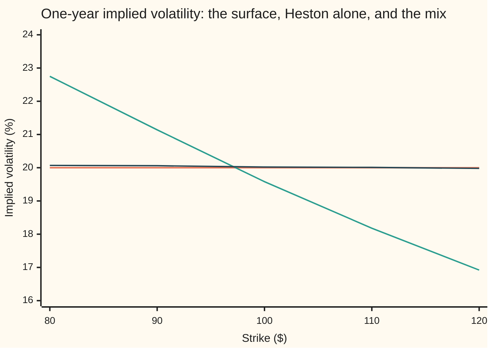
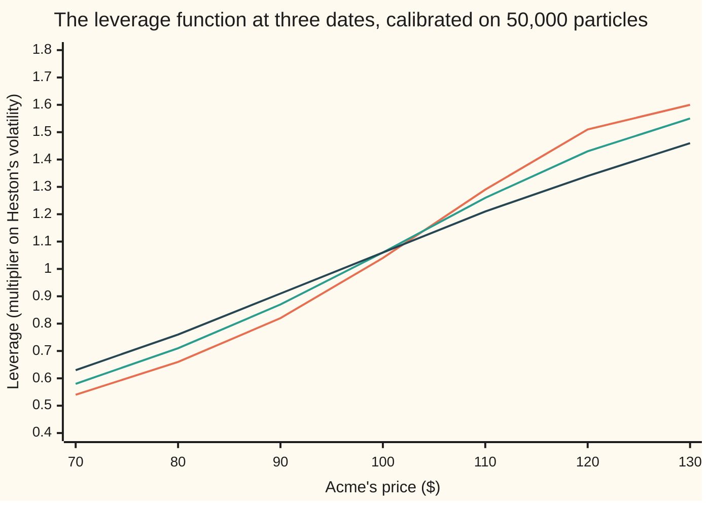
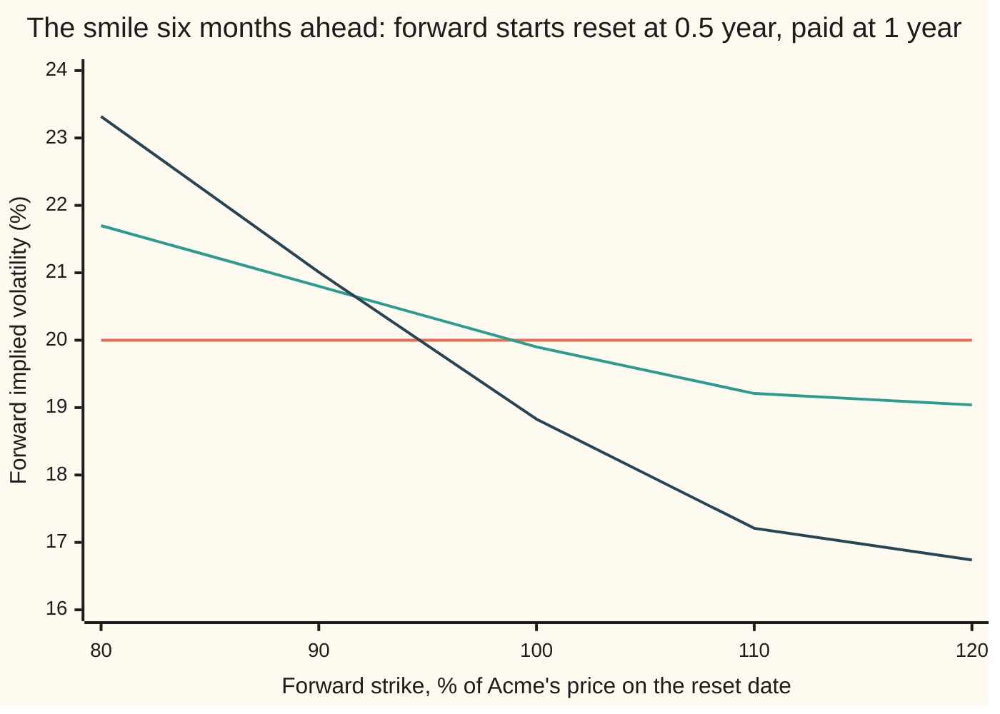

# Stochastic-local volatility: a leverage function that makes a stochastic-vol model reprice every vanilla

[Syllabus](../../../SYLLABUS.md) → [Financial mathematics](../../../SYLLABUS.md#w12) → [Stochastic volatility - Heston, SABR and their mix](../../../SYLLABUS.md#w12-s14) → Stochastic-local volatility

---

## General Overview

Acme shares trade at $100. In the house market every Acme option is priced at 20% volatility: the one-year call struck at $100 costs $9.23, the matching put $6.33, and the call struck at $120, $2.71. That flat grid of volatilities, across every strike and expiry, is the house surface.

A desk that wants volatility itself to move reaches for the Heston model, set to the shelf's house values ([The Heston model](01-heston-model.md)). Acme's variance, the square of its volatility, starts at 0.04, is pulled back toward 0.04, and takes shocks of its own. Those shocks lean against Acme's, with correlation −0.7: a fall in Acme tends to come with a rise in variance. Priced by Heston alone, the one-year $120 call costs $1.79, an implied volatility of 16.92%, and the $80 put carries 22.75%. Heston brings its own skew: implied volatility that falls as the strike rises. The surface has none.

Local volatility sets one volatility in advance for each price and date, and fits the surface exactly: here, 20% everywhere ([Dupire local volatility](../13-Local%20volatility%20and%20jumps/01-dupire-local-volatility.md)). Because that table is fixed, so are its future smiles, the implied volatilities by strike it predicts for later dates: flat at 20%.

The mix keeps Heston's wandering variance and multiplies Acme's volatility by a correction that depends only on price and date. Picture a dimmer at every price and date, turned down where Heston runs hot and up where it runs cold; its proper name, used from here on, is the **leverage function**. With it, 50,000 fresh simulated paths price the one-year $100 call at $9.25 ± 0.06 and the $120 call at $2.73 ± 0.04: the surface, within simulation error. Yet the model still expects a Heston-like skew six months ahead. A call that starts in six months, struck 10% above Acme's price on that day, costs $2.37 in the mix, between local volatility's $2.56 and Heston's $1.90.

**Divide the surface's local volatility by the root of the average Heston variance of the paths standing at each price and date, and the mix reprices every plain option while its variance keeps wandering the way Heston's does.**

**What kind of fact this is:** a model: an assumption about how Acme moves, not a law. Inside it, the leverage formula is a theorem, proved on this card in Why it works. Whether a leverage function exists for every arbitrage-free surface is an open question as of 24 Sep 2026; special cases are proved.

### The picture: one-year implied volatility, strike by strike



Orange: the house surface, 20.00% at every strike. Green: Heston alone, from 22.75% at $80 to 16.92% at $120. Dark blue: the mix, from 20.07% to 19.98%, on the surface within simulation error. Puts below $100, calls from $100 up.

---

## The formula

Notation first, in words. $S_t$ is Acme's price $t$ years from today. $v_t$ is the Heston variance on that date. $W^1_t$ and $W^2_t$ are two random drivers, one for the price and one for the variance, as on the Heston card; over a short step $dt$ each moves by a bell-curve amount with spread $\sqrt{dt}$, and the two moves are correlated by $\rho$. $\mathbb{E}[\,\cdot \mid S_t = S\,]$ is an average over only the paths standing at price $S$ on date $t$: an average given what is known ([Conditional expectation](../../09-Probability%20and%20statistics/02-Random%20Variables/05-conditional-expectation-in-tables.md)).

$$dS_t = (r - q)\,S_t\,dt + L(S_t, t)\,\sqrt{v_t}\,S_t\,dW^1_t, \qquad dv_t = \kappa\,(\theta - v_t)\,dt + \xi\,\sqrt{v_t}\,dW^2_t$$

**Read it aloud:** Acme drifts at the riskless rate less its dividend yield; its volatility is Heston's, the root of $v_t$, times a leverage looked up by price and date; the variance is pulled toward $\theta$ at speed $\kappa$ and shaken in proportion to $\xi$.

The leverage function that makes the mix reprice the surface:

$$L(S, t) = \frac{\sigma_{\text{loc}}(S, t)}{\sqrt{\mathbb{E}\big[\,v_t \mid S_t = S\,\big]}}$$

**Read it aloud:** the leverage at a price and a date is the surface's local volatility there, divided by the root of the average Heston variance over the paths standing there.

| Symbol | Plain meaning | In our example | Push it up and the answer… |
| --- | --- | --- | --- |
| $S$, $S_t$, $S_0$, $S_T$, $S_{t_1}$ | a price level; Acme's price on date $t$, today, at expiry, on the reset date | $100 today | — |
| $v$, $v_t$ | Heston variance: the square of Heston's volatility | 0.04 at the start; 0.051845 near $90 halfway | the leverage there falls |
| $L$ | the leverage function: a multiplier on Heston's volatility, one per price and date | 1 at the start; 0.8676 at $90 halfway | the mix's volatility there rises |
| $\sigma_{\text{loc}}$, $\sigma_t$, $\sigma$ | the surface's local volatility; any model's volatility on date $t$; one flat volatility | 20% everywhere | the leverage rises in step |
| $\kappa$, $\theta$ | Heston's pull: its speed per year, and the variance it pulls toward | 2; 0.04 | the leverage nears 1; it falls |
| $\xi$ | volatility of variance: how hard the variance is shaken | 0.3 | the leverage tilts more |
| $\rho$ | correlation of the price shocks with the variance shocks | −0.7 | less skew to undo; at zero the leverage is a dome |
| $W^1_t$, $W^2_t$, $dt$ | the two random drivers, and a short time step | 40 steps a year in the code | — |
| $r$, $q$ | riskless rate and dividend yield, continuously compounded | 5% and 2% | — |
| $K$, $T$, $t$, $t_1$, $k$ | strike; expiry; a date; a forward start's reset date, and its strike as a fraction of Acme's price then | $80 to $120; 1; any date up to 1; 0.5; 0.8 to 1.2 | — |
| $C$, $C_T$, $C_K$, $C_{KK}$ | a call's price in strike and expiry; its slope in expiry, slope in strike, bend in strike | as on the Dupire card | — |
| $C_{\text{BS}}$ | the Black-Scholes call price | 6.307635 for the half-year call on $100 | — |

Behind the formula sits one condition, in averaged form:

$$\mathbb{E}\big[\,L(S_t, t)^2\,v_t \mid S_t = S\,\big] = \sigma_{\text{loc}}^2(S, t)$$

At every price and date, the mix's squared volatility, averaged over the paths standing there, equals the surface's local variance. At one exact price $L$ is one number, comes out of the average, and gives the formula. On a coarse grid $L$ changes inside each node's neighbourhood, so the code solves this averaged form.

The test of future smiles is the forward start: it fixes its strike on the reset date $t_1$ at a fraction $k$ of Acme's price that day, and pays $\max(S_T - k\,S_{t_1},\ 0)$ at $T$. At one flat volatility $\sigma$ it is worth $S_0\,e^{-q t_1}\,C_{\text{BS}}(1,\ k,\ T - t_1,\ \sigma)$ ([Pricing with local volatility](../13-Local%20volatility%20and%20jumps/03-pricing-under-local-volatility-and-the-forward-smile.md)).

### When it holds

- **Continuous paths.** The proof applies Itô's lemma to paths without jumps; a jump adds terms the formula lacks ([Merton jump-diffusion](../13-Local%20volatility%20and%20jumps/04-merton-jump-diffusion.md)).
- **A finite leverage.** The formula divides by the average variance at each price. If Heston's variance can reach zero, as when the Feller condition $2\kappa\theta \ge \xi^2$ fails ([The Heston model](01-heston-model.md)), that average can sink toward zero and the leverage runs away. The house values pass the test.
- **Enough paths wherever it matters.** Where few paths arrive, the average is noise. The code trusts a node only when it carries the weight of 100 paths, and holds the leverage flat beyond.
- **A smooth, arbitrage-free surface.** The local volatility on top comes from Dupire's formula. A kink or an arbitrage in the surface makes that local variance negative or infinite, and the leverage with it.
- **A chosen variance model.** The surface fixes the leverage once $\kappa$, $\theta$, $\xi$ and $\rho$ are chosen, but not those four. Each choice reprices the same surface and predicts different future smiles.

---

## Why it works

### Step 0: plain options see one date at a time

A plain call expiring at $T$ pays on Acme's price at $T$ and nothing else. Two models that spread Acme's price the same way on every date give every plain option the same price, however differently their paths wander in between. That spread is governed by one function: the average squared volatility of the paths standing at each price on each date. Match it to the surface's local variance and every plain option comes back. How volatility moves between dates is left free, and that freedom is where Heston's dynamics live.

### Step 1: every model has a local-volatility twin

Let $\sigma_t$ be Acme's volatility in any model without jumps, random or not, kept between two positive bounds. István Gyöngy proved in 1986 that the local-volatility model whose squared volatility at price $K$ on date $T$ is $\mathbb{E}[\sigma_T^2 \mid S_T = K]$ spreads Acme's price exactly as the model does, date by date. The twin and the model agree on every plain call and put. The folded proof below reaches the same statement from call prices.

### Step 2: in the mix, the leverage comes out of the average

In the mix $\sigma_t = L(S_t, t)\sqrt{v_t}$. On the paths with $S_T = K$ the leverage is one known number, $L(K, T)$, and a known factor comes out of an average given that knowledge:

$$\mathbb{E}\big[\,L(S_T, T)^2\,v_T \mid S_T = K\,\big] = L(K, T)^2\;\mathbb{E}\big[\,v_T \mid S_T = K\,\big]$$

### Step 3: match the twin to the surface

The surface has exactly one local volatility wherever its density is positive: Dupire's formula reads it off the prices. The mix reprices the surface exactly when its twin is that local volatility:

$$L(K, T)^2\;\mathbb{E}\big[\,v_T \mid S_T = K\,\big] = \sigma_{\text{loc}}^2(K, T)$$

Divide by the average and take the root: the formula at the top of the card.

<details>
<summary>Detailed proof: call prices under a random volatility obey Dupire's equation with the conditional average</summary>

Let Acme follow $dS_t = (r - q)\,S_t\,dt + \sigma_t\,S_t\,dW^1_t$, with $\sigma_t$ random but bounded, and let $p(x, T)$ be the density of $S_T$: the chance per dollar of finishing at $x$. The call price is $C(K, T) = e^{-rT}\,\mathbb{E}\big[(S_T - K)^+\big]$.

Itô's lemma extended to the kink of $(S - K)^+$, Tanaka's formula, gives over a short step
$$d(S_t - K)^+ = \mathbf{1}\{S_t > K\}\,dS_t + \tfrac12\,\sigma_t^2\,S_t^2\,\delta(S_t - K)\,dt,$$
where $\mathbf{1}\{S_t > K\}$ is 1 above the strike and 0 below, and $\delta(S_t - K)$ is the spike that counts the paths standing at the strike.

Average both sides. The random part of the price step averages to zero. The drift part gives $(r - q)\,\mathbb{E}\big[S_T\,\mathbf{1}\{S_T > K\}\big] = (r - q)\,e^{rT}\,(C - K\,C_K)$, as in Step 2 of [Dupire local volatility](../13-Local%20volatility%20and%20jumps/01-dupire-local-volatility.md). Averaging against the spike reads the density at $K$, weighted by the average of $\sigma_T^2$ over the paths there: $\tfrac12\,K^2\,\mathbb{E}\big[\sigma_T^2 \mid S_T = K\big]\,p(K, T)$.

Differentiating $C$ in $T$, discounting adds $-rC$. Replace $e^{-rT}\,p(K, T)$ by $C_{KK}$, as on [The butterfly and the implied density](../10-Digitals%20and%20the%20implied%20density/05-butterfly-and-the-implied-density.md), and collect:
$$C_T = \tfrac12\,\mathbb{E}\big[\sigma_T^2 \mid S_T = K\big]\,K^2\,C_{KK} - (r - q)\,K\,C_K - q\,C.$$
This is Dupire's forward equation with the local variance replaced by the conditional average. So Dupire's formula, applied to this model's prices, returns $\mathbb{E}[\sigma_T^2 \mid S_T = K]$ wherever $C_{KK} > 0$.

For the mix, Step 2 turns that average into $L(K, T)^2\,\mathbb{E}[v_T \mid S_T = K]$. If it equals $\sigma_{\text{loc}}^2(K, T)$ everywhere, the mix's prices and the surface's solve the same forward equation from the same starting payoff $(S_0 - K)^+$, so they are equal. Conversely, equal prices give equal Dupire readings, so the condition holds wherever $C_{KK} > 0$. $\blacksquare$

</details>

### Step 4: the loop, and how simulated particles close it

The average $\mathbb{E}[v_t \mid S_t = S]$ is taken under the mix itself. The mix depends on $L$, and $L$ depends on the average: the price equation contains the distribution of its own solution. Such an equation is called a **McKean equation**. No table can be read off in advance.

**Exists, unique, and where it fails.** The leverage is solved for from prices, so three statements come first.

- *Exists:* not proved in general. Daniel Lacker, Mykhaylo Shkolnikov and Jiacheng Zhang proved it in 2020 for stationary cases, where the joint spread of price and variance does not change with time. Here the evidence is the fresh-path test in the code.
- *Unique:* given the average variance at each price, the formula gives one leverage wherever paths arrive; where none arrive it is free and changes no price. Whether the loop has only one solution is proved only in special cases, one of them in the same 2020 paper. The model itself is not unique (When it holds).
- *Where it fails:* at $t = 0$ only today's price is reachable, and the leverage there, $\sigma_{\text{loc}}(S_0, 0)/\sqrt{v_0}$, runs away as the starting variance goes to zero. Where variance can stick at zero, the leverage can explode. On a coarse grid, the formula read at the nodes alone is biased on the wings (What breaks).

The **particle method** of Julien Guyon and Pierre Henry-Labordère closes the loop one date at a time. Each simulated path is a particle, and at every date the particles pool what they know. Start 50,000 of them at $100 with variance 0.04. At each of 40 dates a year:

1. Assign each particle to the two nearest nodes of a coarse price grid, $40, $50, …, $200, with weights that fall off linearly with distance, like a hat.
2. Average the variance near each node; the first leverage there is 0.20 divided by the root of that average.
3. Rescale each node so the weighted average of $L^2 v$ near it comes to 0.04. Moving one node nudges its neighbours, so repeat; two passes bring every busy node close.
4. Move every particle one step, a fortieth of a year, with the leverage at its own price.

At the start every particle sits at $100 with variance 0.04, so the leverage is 0.20 / 0.20 = 1.



Orange: a quarter of a year in. Green: half a year. Dark blue: three quarters. The leverage rises with price. Paths that have fallen carry high Heston variance, because falls come with variance rises when $\rho$ is negative, and the leverage turns them down. Paths that have risen carry low variance and are turned up. The tilt eases as the variance drifts home: from 0.54 at $70 and 1.60 at $130 after a quarter, to 0.63 and 1.46 after three.

### Step 5: why the future smile keeps a Heston shape

A forward start pays on how far Acme moves after the reset date. The leverage depends on where Acme stands. It makes the squared volatility average 0.04 over all paths at each price, and it cannot see what variance a path carries.

After the reset, each path's variance still wanders, and still rises when the price falls. So a fall after the reset still meets rising volatility: the future smile keeps a downward skew. The leverage damps part of it, because a falling path also slides to prices where the leverage is lower. Local volatility has no variance to carry forward; on the flat house surface its future smile is flat at 20%. Heston keeps its full skew. On the house values the mix lands between; that ordering is what these numbers show, not a theorem.



Orange: local volatility, flat at 20.00%. Green: the mix, from 21.70% at 80% to 19.04% at 120%. Dark blue: Heston alone, from 23.32% to 16.74%. All three are priced on the same 50,000 paths and turned into volatilities with the forward-start formula.

The calibration can also be done without particles: solve the forward equation for the joint density of price and variance, and read the average variance at each price off it. That is a two-dimensional version of Dupire's equation.

---

## Worked numbers, by hand

### One node of the leverage table

The $90 node, half a year in, from the calibration run:

| Step | Arithmetic | Value |
| --- | --- | --- |
| paths near $90 | hat weights summed over 50,000 particles | 11,052.4 |
| their average variance | weighted sum of their variances ÷ 11,052.4 | 0.051845 |
| as a volatility | √0.051845 | 0.227696 |
| first leverage | 0.20 ÷ 0.227696 | 0.8784 |
| after two rescaling passes | average of $L^2 v$ near $90 set to 0.04 | **0.8676** |
| a path at $90 with Heston volatility 30% | 0.8676 × 0.30 | 0.2603 |
| a path at $90 with Heston volatility 10% | 0.8676 × 0.10 | 0.0868 |

The root of the average Heston variance near $90 is 22.77%, too hot for a 20% surface, because those paths got there by falling. The leverage cools each of them by the same factor: 30% becomes 26.03%, 10% becomes 8.68%. The spread between paths survives; only the level at $90 is corrected.

### The forward starts, three ways

Under local volatility on the house surface, the at-the-money forward start reset at half a year is the half-year call, 6.307635, times the dividend factor to the reset date, 0.990050: **6.244873**, as on the local-volatility card. The code prices it, and one struck at 110%, in all three models on the same paths:

| Forward start | Local volatility | The mix | Heston alone |
| --- | --- | --- | --- |
| struck at 100% | 6.2449 | 6.2164 ± 0.0174 | 5.9270 ± 0.0195 |
| struck at 110% | 2.5602 | 2.3683 ± 0.0156 | 1.8966 ± 0.0174 |

At 100% the mix is within two standard errors of local volatility: the surface fixes the average variance between the two dates, and an at-the-money option depends mostly on that. At 110% they separate, and the mix sits clearly between. Heston is lower for two reasons: its own at-the-money volatility is 19.58%, not 20%, and its future volatility is random.

### What breaks if you drop a piece

The mix reprices the one-year $100 call, 9.227006, and the $120 call, 2.7118, within simulation error. Four ways to miss:

| Mistake | Comes out at | What went wrong |
| --- | --- | --- |
| Leverage left at 1: pure Heston | $100 call 9.0681 (19.58%); $120 call 1.7932 (16.92%) | Heston's own skew stays in every price |
| Average variance taken from pure-Heston paths, not the mix's own | $100 call 9.0897 (19.64%) | The leverage moves the paths, which changes the variance found at each price |
| Node values used as read on the $10 grid, no rescaling | $120 call 2.6237 (19.72%) | The leverage changes between nodes, so the node reading misses: too high on the low wing, too low on the high one (at 0.75 year, 0.67 against 0.63 at $70, 1.44 against 1.46 at $130) |
| The 110% forward start priced with local volatility, since it fits the same surface | 2.5602 against the mix's 2.3683 | The surface fixes the spread of prices on each date, not how dates connect |

---

## Code, from first principles, and it actually runs

The check calibrates the leverage on 50,000 particles from one seed, then prices with 50,000 fresh paths from another, so the repricing is out of sample. Five independent comparisons back the card: the mix against the Black-Scholes formula at 20%; the mix against local volatility on the same random numbers, which cuts the noise in the gap ([Cheaper Monte Carlo](../06-Numerical%20Methods%20for%20Pricing/02-variance-reduction-for-pricing.md)); the average of $L^2 v$ at each price on the fresh paths against 0.04; Heston by plain paths against the mixing formula of Romano and Touzi, which prices each variance path with Black-Scholes; and the local-volatility forward start by paths against its closed form. The random numbers, the bell-curve area and the implied volatilities are all built in the code itself.

### Python

```python
# Stochastic-local volatility -- the check behind the card.  Standard library only.
# Random numbers: a 64-bit linear congruential generator and Marsaglia's polar method.
# Normal CDF: Marsaglia's series.  Implied volatility: bisection.  All written out below.
from math import sqrt, log, exp, pi
S0, R, Q, T, SIG = 100.0, 0.05, 0.02, 1.0, 0.20           # house market: flat 20% surface
V0, TH, KA, XI, RHO = 0.04, 0.04, 2.0, 0.3, -0.7          # Heston anchor
NP, NS, T1 = 50000, 40, 0.5                               # paths, dates, forward-start reset
DT, CR, D, TAU, state = T / NS, sqrt(1.0 - RHO * RHO), exp(-R * T), T - T1, [0]
def unif():                                               # uniform on (-1, 1], 64-bit LCG
    state[0] = (state[0] * 6364136223846793005 + 1442695040888963407) & 0xFFFFFFFFFFFFFFFF
    return ((state[0] >> 11) + 1) * 2.0 ** -52 - 1.0
def normals():                                            # polar method: two independent normals
    while True:
        a, b = unif(), unif(); s = a * a + b * b
        if 0.0 < s < 1.0: f = sqrt(-2.0 * log(s) / s); return a * f, b * f
def ncdf(x):                                              # bell-curve area left of x
    if abs(x) > 9.0: return 0.0 if x < 0.0 else 1.0
    s, t, i = x, x, 1.0
    while True:
        i += 2.0; t *= x * x / i; s2 = s + t
        if s2 == s: return 0.5 + s * exp(-0.5 * x * x) / sqrt(2.0 * pi)
        s = s2
def bs(s, k, tau, vol, call=True):                        # Black-Scholes call; put by parity
    sd = vol * sqrt(tau); d1 = (log(s / k) + (R - Q) * tau) / sd + 0.5 * sd
    c = s * exp(-Q * tau) * ncdf(d1) - k * exp(-R * tau) * ncdf(d1 - sd)
    return c if call else c - s * exp(-Q * tau) + k * exp(-R * tau)
def ivol(price, s, k, tau, call=True):                    # bisection: price in, volatility out
    lo, hi = 0.01, 1.0
    for _ in range(50):
        mid = 0.5 * (lo + hi); lo, hi = (lo, mid) if bs(s, k, tau, mid, call) > price else (mid, hi)
    return 0.5 * (lo + hi)
def hat(s):                                               # coarse grid: nodes $40, $50, ..., $200
    x = (min(max(s, 40.0), 199.999999) - 40.0) / 10.0; return int(x), x - int(x)
def interp(lev, s):
    j, a = hat(s); return (1.0 - a) * lev[j] + a * lev[j + 1]
def node_avg(ss, ys):                                     # hat-weighted average of ys near each node
    num, den = [0.0] * 17, [0.0] * 17
    for s, y in zip(ss, ys):
        j, a = hat(s); num[j] += (1.0 - a) * y; den[j] += 1.0 - a; num[j + 1] += a * y; den[j + 1] += a
    return [num[j] / den[j] if den[j] >= 100.0 else None for j in range(17)], den
def leverage(ss, vp, passes):                             # L = SIG / sqrt(E[v | S]) on the nodes
    ev, den = node_avg(ss, vp)
    ok = [j for j in range(17) if ev[j] is not None]
    lev = [SIG / sqrt(ev[min(max(j, ok[0]), ok[-1])]) for j in range(17)]; first = lev[5]
    for _ in range(passes):                               # rescale: local average of L^2 v -> SIG^2
        m = node_avg(ss, [(l := interp(lev, s)) * l * v for s, v in zip(ss, vp)])[0]
        lev = [lev[j] * SIG / sqrt(m[j]) if m[j] is not None else 0.0 for j in range(17)]
        lev = [lev[min(max(j, ok[0]), ok[-1])] for j in range(17)]
    return lev, (den[5], ev[5], first, lev[5])
def calibrate(seed, passes):                              # particle method: refit L at every date
    state[0] = seed; ss, vs, table = [S0] * NP, [V0] * NP, []
    for k in range(NS):
        vp = [max(v, 0.0) for v in vs]; lev, info = leverage(ss, vp, passes); table.append(lev)
        if k == 20: node90 = info
        for i in range(NP):
            zv, zp = normals(); l = interp(lev, ss[i]); sv = sqrt(vp[i] * DT)
            ss[i] *= exp((R - Q - 0.5 * l * l * vp[i]) * DT + l * sv * (RHO * zv + CR * zp))
            vs[i] += KA * (TH - vp[i]) * DT + XI * sv * zv
    return table, node90
(LF, node90), LN = calibrate(1, 2), calibrate(1, 0)[0]
state[0] = 2; S = [[S0] * NP for _ in range(5)]; vs, I, V = [V0] * NP, [0.0] * NP, [0.0] * NP
for k in range(NS):          # fresh paths: 0 SLV, 1 no rescaling, 2 L from Heston's cloud, 3 Heston, 4 LV
    vp = [max(v, 0.0) for v in vs]
    if k == NS // 2: S1, I1, V1 = [s[:] for s in S], I[:], V[:]
    if k == 30:
        cond_slv = node_avg(S[0], [(l := interp(LF[k], s)) * l * v for s, v in zip(S[0], vp)])[0]
        cond_h = node_avg(S[3], vp)[0]
    lf, ln, lw = LF[k], LN[k], leverage(S[3], vp, 2)[0]
    for i in range(NP):
        zv, zp = normals(); w = vp[i]; sv = sqrt(w * DT); zs = RHO * zv + CR * zp
        l = interp(lf, S[0][i]); S[0][i] *= exp((R - Q - 0.5 * l * l * w) * DT + l * sv * zs)
        l = interp(ln, S[1][i]); S[1][i] *= exp((R - Q - 0.5 * l * l * w) * DT + l * sv * zs)
        l = interp(lw, S[2][i]); S[2][i] *= exp((R - Q - 0.5 * l * l * w) * DT + l * sv * zs)
        S[3][i] *= exp((R - Q - 0.5 * w) * DT + sv * zs)
        S[4][i] *= exp((R - Q - 0.5 * SIG * SIG) * DT + SIG * sqrt(DT) * zs)
        I[i] += sv * zv; V[i] += w * DT; vs[i] += KA * (TH - w) * DT + XI * sv * zv
def stats(xs):                                            # mean and standard error, summed in order
    m, s2, n = 0.0, 0.0, len(xs)
    for x in xs: m += x / n
    for x in xs: s2 += (x - m) * (x - m)
    return m, sqrt(s2 / (n - 1) / n)
C_T, P_T, FS = bs(S0, 100.0, T, SIG), bs(S0, 100.0, T, SIG, False), S0 * exp(-Q * T1) * bs(1.0, 1.0, TAU, SIG)
sd = SIG * sqrt(TAU); d1 = (R - Q) * TAU / sd + 0.5 * sd
print(f"house targets: call {C_T:.6f}  put {P_T:.6f}  forward-start {FS:.6f}\nforward-start by hand: d1 {d1:.6f}"
      f"  d2 {d1 - sd:.6f}  N(d1) {ncdf(d1):.6f}  N(d2) {ncdf(d1 - sd):.6f}\n  half-year call"
      f" {bs(S0, 100.0, TAU, SIG):.6f}  e^-q t1 {exp(-Q * T1):.6f}\nnode $90, t 0.50: weight {node90[0]:.1f}"
      f"  E[v|S] {node90[1]:.6f}  sqrt {sqrt(node90[1]):.6f}  L first {node90[2]:.4f}  L final {node90[3]:.4f}"
      f"\n  L final x 30% vol {node90[3] * 0.3:.4f}   L final x 10% vol {node90[3] * 0.1:.4f}")
def row(label, xs, p=2): print(f"{label:<30}" + " ".join(f"{x:6.{p}f}" for x in xs))
row("leverage L(S, t), S =", [10.0 * j for j in range(7, 14)], 0)
for k in (10, 20, 30): row(f"  t = {k * DT:.2f}  rescaled", LF[k][3:10])
row("  t = 0.75  node values only", LN[30][3:10])
row("fresh paths, t = 0.75, vol %", [10.0 * j for j in range(7, 14)], 0)
row("  Heston  sqrt E[v | S]", [100 * sqrt(c) for c in cond_h[3:10]])
row("  SLV  sqrt E[L^2 v | S]", [100 * sqrt(c) for c in cond_slv[3:10]])
print("one year     target  SLV by paths      SLV - LV same paths   vol %: SLV  Heston")
rows, fwd = {}, {}
for K, call in ((80.0, False), (90.0, False), (100.0, False), (100.0, True), (110.0, True), (120.0, True)):
    f = (lambda s: max(s - K, 0.0)) if call else (lambda s: max(K - s, 0.0))
    tgt, plain = bs(S0, K, T, SIG, call), stats([D * f(s) for s in S[0]])
    rw = rows[(K, call)] = [stats([D * (f(a) - f(b)) for a, b in zip(S[m], S[4])]) for m in range(4)]
    iv = [100 * ivol(tgt + rw[m][0], S0, K, T, call) for m in range(4)]; rw.append((tgt, iv))
    print(f"{'call' if call else 'put '} {K:5.0f}  {tgt:7.4f}  {plain[0]:7.4f} ± {plain[1]:.4f}   "
          f"{rw[0][0]:+.4f} ± {rw[0][1]:.4f}   {iv[0]:10.2f} {iv[3]:7.2f}")
mix_c, mix_f = [], []                                     # Heston, second road: condition on the variance path
for i in range(NP):
    I2, V2 = I[i] - I1[i], V[i] - V1[i]
    mix_c.append(bs(S0 * exp(RHO * I[i] - 0.5 * RHO * RHO * V[i]), 120.0, T, CR * sqrt(V[i] / T)))
    mix_f.append(S0 * exp(-Q * T1 + RHO * I1[i] - 0.5 * RHO * RHO * V1[i])
                 * bs(exp(RHO * I2 - 0.5 * RHO * RHO * V2), 1.0, TAU, CR * sqrt(V2 / TAU)))
hc, mc, mf = stats([D * max(s - 120.0, 0.0) for s in S[3]]), stats(mix_c), stats(mix_f)
fsp = [stats([D * max(S[m][i] - S1[m][i], 0.0) for i in range(NP)]) for m in (3, 4)]
print(f"Heston call 120       paths {hc[0]:.4f} ± {hc[1]:.4f}   mixing formula {mc[0]:.4f} ± {mc[1]:.4f}\n"
      f"Heston forward-start  paths {fsp[0][0]:.4f} ± {fsp[0][1]:.4f}   mixing formula {mf[0]:.4f} ± {mf[1]:.4f}\n"
      f"local-vol forward-start  paths {fsp[1][0]:.4f} ± {fsp[1][1]:.4f}")
print("forward start  LV exact    SLV, same paths     Heston, same paths   fwd vol %: LV   SLV  Heston")
for kk in (0.8, 0.9, 1.0, 1.1, 1.2):
    ex = S0 * exp(-Q * T1) * bs(1.0, kk, TAU, SIG)
    fw = fwd[kk] = [stats([D * (max(S[m][i] - kk * S1[m][i], 0.0) - max(S[4][i] - kk * S1[4][i], 0.0))
                           for i in range(NP)]) for m in (0, 3)]
    iv = [100 * ivol((ex + x) / (S0 * exp(-Q * T1)), 1.0, kk, TAU) for x in (0.0, fw[0][0], fw[1][0])]
    print(f"  k = {kk:.1f}    {ex:8.4f}   {ex + fw[0][0]:8.4f} ± {fw[0][1]:.4f}   "
          f"{ex + fw[1][0]:8.4f} ± {fw[1][1]:.4f}   {iv[0]:8.2f} {iv[1]:6.2f} {iv[2]:6.2f}")
a, b = rows[(100.0, True)], rows[(120.0, True)]
print("what breaks, priced against LV on the same paths   call 100 (vol %)          call 120 (vol %)")
for m, name in ((3, "pure Heston, L = 1"), (2, "L fitted to pure-Heston paths"), (1, "node values, no rescaling")):
    print(f"  {name:<34} {a[4][0] + a[m][0]:.4f} ± {a[m][1]:.4f} ({a[4][1][m]:.2f})   "
          f"{b[4][0] + b[m][0]:.4f} ± {b[m][1]:.4f} ({b[4][1][m]:.2f})")
assert abs(C_T - 9.227005508154) < 1e-9, "own normal CDF vs the house call"
assert abs(FS - 6.244873136513) < 1e-9, "forward-start closed form vs the house anchor"
for key, rw in rows.items(): assert abs(rw[0][0]) < 3 * rw[0][1], f"SLV must reprice {key} within 3 s.e."
assert abs(rows[(120.0, True)][3][0]) > 10 * rows[(120.0, True)][3][1], "without leverage Heston misses"
assert abs(rows[(100.0, True)][2][0]) > 3 * rows[(100.0, True)][2][1], "leverage from the wrong cloud misses"
assert abs(hc[0] - mc[0]) < 3 * hc[1], "Heston call: paths vs mixing formula"
assert abs(fsp[0][0] - mf[0]) < 3 * fsp[0][1], "Heston forward-start: paths vs mixing formula"
assert abs(fsp[1][0] - FS) < 3 * fsp[1][1], "local-vol forward-start: paths vs closed form"
assert fwd[1.1][1][0] + 3 * fwd[1.1][1][1] < fwd[1.1][0][0] < -3 * fwd[1.1][0][1], "SLV between LV and Heston"
assert max(abs(sqrt(cond_slv[j]) - SIG) for j in range(4, 9)) < 0.005, "fresh paths: E[L^2 v | S] = SIG^2"
print("ALL CHECKS PASS")
```

**Ran 2026-09-24 on macOS, Python 3.14.6, standard library only. All checks passed. Output, pasted from the run:**

```
house targets: call 9.227006  put 6.330081  forward-start 6.244873
forward-start by hand: d1 0.176777  d2 0.035355  N(d1) 0.570158  N(d2) 0.514102
  half-year call 6.307635  e^-q t1 0.990050
node $90, t 0.50: weight 11052.4  E[v|S] 0.051845  sqrt 0.227696  L first 0.8784  L final 0.8676
  L final x 30% vol 0.2603   L final x 10% vol 0.0868
leverage L(S, t), S =             70     80     90    100    110    120    130
  t = 0.25  rescaled            0.54   0.66   0.82   1.04   1.29   1.51   1.60
  t = 0.50  rescaled            0.58   0.71   0.87   1.06   1.26   1.43   1.55
  t = 0.75  rescaled            0.63   0.76   0.91   1.06   1.21   1.34   1.46
  t = 0.75  node values only    0.67   0.78   0.91   1.05   1.19   1.33   1.44
fresh paths, t = 0.75, vol %      70     80     90    100    110    120    130
  Heston  sqrt E[v | S]        28.48  25.40  22.38  19.55  17.15  15.11  13.89
  SLV  sqrt E[L^2 v | S]       19.98  20.05  20.06  20.02  19.96  19.85  20.04
one year     target  SLV by paths      SLV - LV same paths   vol %: SLV  Heston
put     80   0.8426   0.8550 ± 0.0134   +0.0110 ± 0.0057        20.07   22.75
put     90   2.7145   2.7356 ± 0.0261   +0.0163 ± 0.0089        20.06   21.14
put    100   6.3301   6.3532 ± 0.0411   +0.0257 ± 0.0117        20.07   19.67
call   100   9.2270   9.2490 ± 0.0622   +0.0076 ± 0.0228        20.02   19.58
call   110   5.1886   5.2078 ± 0.0485   +0.0045 ± 0.0211        20.01   18.18
call   120   2.7118   2.7292 ± 0.0357   -0.0065 ± 0.0190        19.98   16.92
Heston call 120       paths 1.8171 ± 0.0228   mixing formula 1.8025 ± 0.0076
Heston forward-start  paths 5.9283 ± 0.0342   mixing formula 5.9237 ± 0.0191
local-vol forward-start  paths 6.2462 ± 0.0421
forward start  LV exact    SLV, same paths     Heston, same paths   fwd vol %: LV   SLV  Heston
  k = 0.8     21.0050    21.1177 ± 0.0203    21.2477 ± 0.0228      20.00  21.70  23.32
  k = 0.9     12.5459    12.6928 ± 0.0189    12.7322 ± 0.0214      20.00  20.80  21.01
  k = 1.0      6.2449     6.2164 ± 0.0174     5.9270 ± 0.0195      20.00  19.90  18.83
  k = 1.1      2.5602     2.3683 ± 0.0156     1.8966 ± 0.0174      20.00  19.21  17.21
  k = 1.2      0.8737     0.7355 ± 0.0124     0.4483 ± 0.0130      20.00  19.04  16.74
what breaks, priced against LV on the same paths   call 100 (vol %)          call 120 (vol %)
  pure Heston, L = 1                 9.0681 ± 0.0256 (19.58)   1.7932 ± 0.0209 (16.92)
  L fitted to pure-Heston paths      9.0897 ± 0.0226 (19.64)   2.6163 ± 0.0188 (19.69)
  node values, no rescaling          9.2056 ± 0.0227 (19.94)   2.6237 ± 0.0188 (19.72)
ALL CHECKS PASS
```

Out of sample, every option on the strip comes back: each gap to local volatility is inside three standard errors. On the fresh paths the root of the average of $L^2 v$ reads 19.85% to 20.06% from $70 to $130, where Heston alone reads 28.48% down to 13.89%. Heston's $120 call is estimated three ways: 1.7932 against local volatility on the same paths, 1.8171 by plain paths, 1.8025 by the mixing formula. They agree within their standard errors, and the mixing formula's is the smallest, 0.0076 against 0.0228 for plain paths.

### Rust

```rust
// Stochastic-local volatility -- the same check as stochastic_local_volatility_check.py, in Rust.
// Standard library only, no crates.  Same generator, polar method, normal-CDF series and summing
// order as the Python, so the two outputs agree digit for digit.
use std::f64::consts::PI;
const S0: f64 = 100.0; const R: f64 = 0.05; const Q: f64 = 0.02; const T: f64 = 1.0; const SIG: f64 = 0.20;
const V0: f64 = 0.04; const TH: f64 = 0.04; const KA: f64 = 2.0; const XI: f64 = 0.3; const RHO: f64 = -0.7;
const NP: usize = 50000; const NS: usize = 40; const T1: f64 = 0.5;
const DT: f64 = T / NS as f64; const TAU: f64 = T - T1;
type Pair = (f64, f64);
fn unif(x: &mut u64) -> f64 {                                        // uniform on (-1, 1], 64-bit LCG
    *x = x.wrapping_mul(6364136223846793005).wrapping_add(1442695040888963407);
    ((*x >> 11) + 1) as f64 * (1.0 / 4503599627370496.0) - 1.0
}
fn normals(x: &mut u64) -> Pair {                                    // polar method: two normals
    loop { let (a, b) = (unif(x), unif(x)); let s = a * a + b * b;
           if s > 0.0 && s < 1.0 { let f = (-2.0 * s.ln() / s).sqrt(); return (a * f, b * f); } }
}
fn ncdf(x: f64) -> f64 {                                             // bell-curve area left of x
    if x.abs() > 9.0 { return if x < 0.0 { 0.0 } else { 1.0 }; }
    let (mut s, mut t, mut i) = (x, x, 1.0);
    loop { i += 2.0; t *= x * x / i; if s + t == s { return 0.5 + s * (-0.5 * x * x).exp() / (2.0 * PI).sqrt(); } s += t; }
}
fn bs(s: f64, k: f64, tau: f64, vol: f64, call: bool) -> f64 {       // Black-Scholes; put by parity
    let sd = vol * tau.sqrt(); let d1 = ((s / k).ln() + (R - Q) * tau) / sd + 0.5 * sd;
    let c = s * (-Q * tau).exp() * ncdf(d1) - k * (-R * tau).exp() * ncdf(d1 - sd);
    if call { c } else { c - s * (-Q * tau).exp() + k * (-R * tau).exp() }
}
fn ivol(price: f64, s: f64, k: f64, tau: f64, call: bool) -> f64 {  // bisection
    let (mut lo, mut hi) = (0.01, 1.0);
    for _ in 0..50 { let mid = 0.5 * (lo + hi); if bs(s, k, tau, mid, call) > price { hi = mid } else { lo = mid } }
    0.5 * (lo + hi)
}
fn hat(s: f64) -> (usize, f64) { let x = (s.max(40.0).min(199.999999) - 40.0) / 10.0; (x as usize, x - (x as usize) as f64) }
fn interp(lev: &[f64], s: f64) -> f64 { let (j, a) = hat(s); (1.0 - a) * lev[j] + a * lev[j + 1] }
fn node_avg(ss: &[f64], ys: &[f64]) -> (Vec<Option<f64>>, Vec<f64>) {
    let (mut num, mut den) = (vec![0.0; 17], vec![0.0; 17]);
    for (s, y) in ss.iter().zip(ys) {
        let (j, a) = hat(*s); num[j] += (1.0 - a) * y; den[j] += 1.0 - a; num[j + 1] += a * y; den[j + 1] += a;
    }
    ((0..17).map(|j| if den[j] >= 100.0 { Some(num[j] / den[j]) } else { None }).collect(), den)
}
fn l2v(lev: &[f64], ss: &[f64], vp: &[f64]) -> Vec<f64> {
    ss.iter().zip(vp).map(|(s, v)| { let l = interp(lev, *s); l * l * v }).collect()
}
fn leverage(ss: &[f64], vp: &[f64], passes: usize) -> (Vec<f64>, [f64; 4]) {
    let (ev, den) = node_avg(ss, vp);
    let ok: Vec<usize> = (0..17).filter(|&j| ev[j].is_some()).collect();
    let cl = |j: usize| j.max(ok[0]).min(ok[ok.len() - 1]);
    let mut lev: Vec<f64> = (0..17).map(|j| SIG / ev[cl(j)].unwrap().sqrt()).collect();
    let first = lev[5];
    for _ in 0..passes {                                             // rescale: average L^2 v -> SIG^2
        let m = node_avg(ss, &l2v(&lev, ss, vp)).0;
        let raw: Vec<f64> = (0..17).map(|j| m[j].map_or(0.0, |x| lev[j] * SIG / x.sqrt())).collect();
        lev = (0..17).map(|j| raw[cl(j)]).collect();
    }
    let info = [den[5], ev[5].unwrap_or(0.0), first, lev[5]]; (lev, info)
}
fn calibrate(seed: u64, passes: usize, cr: f64) -> (Vec<Vec<f64>>, [f64; 4]) {
    let (mut g, mut ss, mut vs, mut table, mut node90) = (seed, vec![S0; NP], vec![V0; NP], Vec::new(), [0.0; 4]);
    for k in 0..NS {
        let vp: Vec<f64> = vs.iter().map(|v| v.max(0.0)).collect();
        let (lev, info) = leverage(&ss, &vp, passes); if k == 20 { node90 = info; }
        for i in 0..NP {
            let (zv, zp) = normals(&mut g); let l = interp(&lev, ss[i]); let sv = (vp[i] * DT).sqrt();
            ss[i] *= ((R - Q - 0.5 * l * l * vp[i]) * DT + l * sv * (RHO * zv + cr * zp)).exp();
            vs[i] += KA * (TH - vp[i]) * DT + XI * sv * zv;
        }
        table.push(lev);
    }
    (table, node90)
}
fn stats(xs: &[f64]) -> Pair {                                       // mean and standard error
    let n = xs.len() as f64; let (mut m, mut s2) = (0.0, 0.0);
    for x in xs { m += x / n; } for x in xs { s2 += (x - m) * (x - m); }
    (m, (s2 / (n - 1.0) / n).sqrt())
}
fn row(label: &str, xs: &[f64], p: usize) {
    println!("{:<30}{}", label, xs.iter().map(|x| format!("{:6.*}", p, x)).collect::<Vec<_>>().join(" "));
}
fn main() {
    let (cr, d) = ((1.0 - RHO * RHO).sqrt(), (-R * T).exp());
    let ((lf_t, node90), ln_t) = (calibrate(1, 2, cr), calibrate(1, 0, cr).0);
    let (mut g, mut s, mut vs, mut ii, mut vv) = (2u64, vec![vec![S0; NP]; 5], vec![V0; NP], vec![0.0; NP], vec![0.0; NP]);
    let (mut s1, mut i1, mut v1, mut cond_slv, mut cond_h) = (vec![], vec![], vec![], vec![], vec![]);
    for k in 0..NS {                     // fresh paths: 0 SLV, 1 no rescaling, 2 L from Heston's cloud, 3 Heston, 4 LV
        let vp: Vec<f64> = vs.iter().map(|v| v.max(0.0)).collect();
        if k == NS / 2 { s1 = s.clone(); i1 = ii.clone(); v1 = vv.clone(); }
        if k == 30 { cond_slv = node_avg(&s[0], &l2v(&lf_t[k], &s[0], &vp)).0; cond_h = node_avg(&s[3], &vp).0; }
        let lw = leverage(&s[3], &vp, 2).0;
        for i in 0..NP {
            let (zv, zp) = normals(&mut g); let w = vp[i]; let sv = (w * DT).sqrt(); let zs = RHO * zv + cr * zp;
            for (m, lev) in [(0, &lf_t[k]), (1, &ln_t[k]), (2, &lw)] {
                let l = interp(lev, s[m][i]); s[m][i] *= ((R - Q - 0.5 * l * l * w) * DT + l * sv * zs).exp();
            }
            s[3][i] *= ((R - Q - 0.5 * w) * DT + sv * zs).exp();
            s[4][i] *= ((R - Q - 0.5 * SIG * SIG) * DT + SIG * DT.sqrt() * zs).exp();
            ii[i] += sv * zv; vv[i] += w * DT; vs[i] += KA * (TH - w) * DT + XI * sv * zv;
        }
    }
    let (c_t, p_t) = (bs(S0, 100.0, T, SIG, true), bs(S0, 100.0, T, SIG, false));
    let fs = S0 * (-Q * T1).exp() * bs(1.0, 1.0, TAU, SIG, true);
    let sd = SIG * TAU.sqrt(); let d1 = (R - Q) * TAU / sd + 0.5 * sd;
    println!("house targets: call {:.6}  put {:.6}  forward-start {:.6}", c_t, p_t, fs);
    println!("forward-start by hand: d1 {:.6}  d2 {:.6}  N(d1) {:.6}  N(d2) {:.6}", d1, d1 - sd, ncdf(d1), ncdf(d1 - sd));
    println!("  half-year call {:.6}  e^-q t1 {:.6}", bs(S0, 100.0, TAU, SIG, true), (-Q * T1).exp());
    println!("node $90, t 0.50: weight {:.1}  E[v|S] {:.6}  sqrt {:.6}  L first {:.4}  L final {:.4}",
             node90[0], node90[1], node90[1].sqrt(), node90[2], node90[3]);
    println!("  L final x 30% vol {:.4}   L final x 10% vol {:.4}", node90[3] * 0.3, node90[3] * 0.1);
    let grid: Vec<f64> = (7..14).map(|j| 10.0 * j as f64).collect();
    row("leverage L(S, t), S =", &grid, 0);
    for k in [10usize, 20, 30] { row(&format!("  t = {:.2}  rescaled", k as f64 * DT), &lf_t[k][3..10], 2); }
    row("  t = 0.75  node values only", &ln_t[30][3..10], 2);
    row("fresh paths, t = 0.75, vol %", &grid, 0);
    row("  Heston  sqrt E[v | S]", &(3..10).map(|j| 100.0 * cond_h[j].unwrap().sqrt()).collect::<Vec<_>>(), 2);
    row("  SLV  sqrt E[L^2 v | S]", &(3..10).map(|j| 100.0 * cond_slv[j].unwrap().sqrt()).collect::<Vec<_>>(), 2);
    println!("one year     target  SLV by paths      SLV - LV same paths   vol %: SLV  Heston");
    let mut rows: Vec<(f64, Vec<Pair>, f64, Vec<f64>)> = Vec::new();
    for (kk, call) in [(80.0, false), (90.0, false), (100.0, false), (100.0, true), (110.0, true), (120.0, true)] {
        let f = |x: f64| if call { (x - kk).max(0.0) } else { (kk - x).max(0.0) };
        let (tgt, plain) = (bs(S0, kk, T, SIG, call), stats(&s[0].iter().map(|x| d * f(*x)).collect::<Vec<_>>()));
        let rw: Vec<Pair> = (0..4).map(|m| stats(&(0..NP).map(|i| d * (f(s[m][i]) - f(s[4][i]))).collect::<Vec<_>>())).collect();
        let iv: Vec<f64> = (0..4).map(|m| 100.0 * ivol(tgt + rw[m].0, S0, kk, T, call)).collect();
        println!("{} {:5.0}  {:7.4}  {:7.4} ± {:.4}   {:+.4} ± {:.4}   {:10.2} {:7.2}", if call { "call" } else { "put " },
                 kk, tgt, plain.0, plain.1, rw[0].0, rw[0].1, iv[0], iv[3]);
        rows.push((kk, rw, tgt, iv));
    }
    let (mut mix_c, mut mix_f) = (vec![], vec![]);                  // Heston, second road: condition on the variance path
    for i in 0..NP {
        let (i2, v2) = (ii[i] - i1[i], vv[i] - v1[i]);
        mix_c.push(bs(S0 * (RHO * ii[i] - 0.5 * RHO * RHO * vv[i]).exp(), 120.0, T, cr * (vv[i] / T).sqrt(), true));
        mix_f.push(S0 * (-Q * T1 + RHO * i1[i] - 0.5 * RHO * RHO * v1[i]).exp()
                   * bs((RHO * i2 - 0.5 * RHO * RHO * v2).exp(), 1.0, TAU, cr * (v2 / TAU).sqrt(), true));
    }
    let (hc, mc, mf) = (stats(&s[3].iter().map(|x| d * (x - 120.0).max(0.0)).collect::<Vec<_>>()), stats(&mix_c), stats(&mix_f));
    let fsp: Vec<Pair> = [3, 4].iter().map(|&m| stats(&(0..NP).map(|i| d * (s[m][i] - s1[m][i]).max(0.0)).collect::<Vec<_>>())).collect();
    println!("Heston call 120       paths {:.4} ± {:.4}   mixing formula {:.4} ± {:.4}", hc.0, hc.1, mc.0, mc.1);
    println!("Heston forward-start  paths {:.4} ± {:.4}   mixing formula {:.4} ± {:.4}", fsp[0].0, fsp[0].1, mf.0, mf.1);
    println!("local-vol forward-start  paths {:.4} ± {:.4}", fsp[1].0, fsp[1].1);
    println!("forward start  LV exact    SLV, same paths     Heston, same paths   fwd vol %: LV   SLV  Heston");
    let mut fwd11 = vec![];
    for kk in [0.8, 0.9, 1.0, 1.1, 1.2] {
        let ex = S0 * (-Q * T1).exp() * bs(1.0, kk, TAU, SIG, true);
        let fw: Vec<Pair> = [0, 3].iter().map(|&m| stats(&(0..NP)
            .map(|i| d * ((s[m][i] - kk * s1[m][i]).max(0.0) - (s[4][i] - kk * s1[4][i]).max(0.0))).collect::<Vec<_>>())).collect();
        let iv: Vec<f64> = [0.0, fw[0].0, fw[1].0].iter()
            .map(|x| 100.0 * ivol((ex + x) / (S0 * (-Q * T1).exp()), 1.0, kk, TAU, true)).collect();
        println!("  k = {:.1}    {:8.4}   {:8.4} ± {:.4}   {:8.4} ± {:.4}   {:8.2} {:6.2} {:6.2}",
                 kk, ex, ex + fw[0].0, fw[0].1, ex + fw[1].0, fw[1].1, iv[0], iv[1], iv[2]);
        if kk == 1.1 { fwd11 = fw; }
    }
    let (a, b) = (&rows[3], &rows[5]);
    println!("what breaks, priced against LV on the same paths   call 100 (vol %)          call 120 (vol %)");
    for (m, name) in [(3, "pure Heston, L = 1"), (2, "L fitted to pure-Heston paths"), (1, "node values, no rescaling")] {
        println!("  {:<34} {:.4} ± {:.4} ({:.2})   {:.4} ± {:.4} ({:.2})",
                 name, a.2 + a.1[m].0, a.1[m].1, a.3[m], b.2 + b.1[m].0, b.1[m].1, b.3[m]);
    }
    assert!((c_t - 9.227005508154).abs() < 1e-9, "own normal CDF vs the house call");
    assert!((fs - 6.244873136513).abs() < 1e-9, "forward-start closed form vs the house anchor");
    for r in &rows { assert!(r.1[0].0.abs() < 3.0 * r.1[0].1, "SLV must reprice K = {} within 3 s.e.", r.0); }
    assert!(b.1[3].0.abs() > 10.0 * b.1[3].1, "without leverage Heston misses");
    assert!(a.1[2].0.abs() > 3.0 * a.1[2].1, "leverage from the wrong cloud misses");
    assert!((hc.0 - mc.0).abs() < 3.0 * hc.1, "Heston call: paths vs mixing formula");
    assert!((fsp[0].0 - mf.0).abs() < 3.0 * fsp[0].1, "Heston forward-start: paths vs mixing formula");
    assert!((fsp[1].0 - fs).abs() < 3.0 * fsp[1].1, "local-vol forward-start: paths vs closed form");
    assert!(fwd11[1].0 + 3.0 * fwd11[1].1 < fwd11[0].0 && fwd11[0].0 < -3.0 * fwd11[0].1, "SLV between LV and Heston");
    assert!((4..9).all(|j| (cond_slv[j].unwrap().sqrt() - SIG).abs() < 0.005), "fresh paths: E[L^2 v | S] = SIG^2");
    println!("ALL CHECKS PASS");
}
```

**Ran 2026-09-24 on macOS, rustc 1.98.1, no crates. All checks passed. Output, pasted from the run:**

```
house targets: call 9.227006  put 6.330081  forward-start 6.244873
forward-start by hand: d1 0.176777  d2 0.035355  N(d1) 0.570158  N(d2) 0.514102
  half-year call 6.307635  e^-q t1 0.990050
node $90, t 0.50: weight 11052.4  E[v|S] 0.051845  sqrt 0.227696  L first 0.8784  L final 0.8676
  L final x 30% vol 0.2603   L final x 10% vol 0.0868
leverage L(S, t), S =             70     80     90    100    110    120    130
  t = 0.25  rescaled            0.54   0.66   0.82   1.04   1.29   1.51   1.60
  t = 0.50  rescaled            0.58   0.71   0.87   1.06   1.26   1.43   1.55
  t = 0.75  rescaled            0.63   0.76   0.91   1.06   1.21   1.34   1.46
  t = 0.75  node values only    0.67   0.78   0.91   1.05   1.19   1.33   1.44
fresh paths, t = 0.75, vol %      70     80     90    100    110    120    130
  Heston  sqrt E[v | S]        28.48  25.40  22.38  19.55  17.15  15.11  13.89
  SLV  sqrt E[L^2 v | S]       19.98  20.05  20.06  20.02  19.96  19.85  20.04
one year     target  SLV by paths      SLV - LV same paths   vol %: SLV  Heston
put     80   0.8426   0.8550 ± 0.0134   +0.0110 ± 0.0057        20.07   22.75
put     90   2.7145   2.7356 ± 0.0261   +0.0163 ± 0.0089        20.06   21.14
put    100   6.3301   6.3532 ± 0.0411   +0.0257 ± 0.0117        20.07   19.67
call   100   9.2270   9.2490 ± 0.0622   +0.0076 ± 0.0228        20.02   19.58
call   110   5.1886   5.2078 ± 0.0485   +0.0045 ± 0.0211        20.01   18.18
call   120   2.7118   2.7292 ± 0.0357   -0.0065 ± 0.0190        19.98   16.92
Heston call 120       paths 1.8171 ± 0.0228   mixing formula 1.8025 ± 0.0076
Heston forward-start  paths 5.9283 ± 0.0342   mixing formula 5.9237 ± 0.0191
local-vol forward-start  paths 6.2462 ± 0.0421
forward start  LV exact    SLV, same paths     Heston, same paths   fwd vol %: LV   SLV  Heston
  k = 0.8     21.0050    21.1177 ± 0.0203    21.2477 ± 0.0228      20.00  21.70  23.32
  k = 0.9     12.5459    12.6928 ± 0.0189    12.7322 ± 0.0214      20.00  20.80  21.01
  k = 1.0      6.2449     6.2164 ± 0.0174     5.9270 ± 0.0195      20.00  19.90  18.83
  k = 1.1      2.5602     2.3683 ± 0.0156     1.8966 ± 0.0174      20.00  19.21  17.21
  k = 1.2      0.8737     0.7355 ± 0.0124     0.4483 ± 0.0130      20.00  19.04  16.74
what breaks, priced against LV on the same paths   call 100 (vol %)          call 120 (vol %)
  pure Heston, L = 1                 9.0681 ± 0.0256 (19.58)   1.7932 ± 0.0209 (16.92)
  L fitted to pure-Heston paths      9.0897 ± 0.0226 (19.64)   2.6163 ± 0.0188 (19.69)
  node values, no rescaling          9.2056 ± 0.0227 (19.94)   2.6237 ± 0.0188 (19.72)
ALL CHECKS PASS
```

The two outputs are identical, byte for byte: both languages draw the same random numbers and add them in the same order.

> [!TIP]
> **Try changing**
> Guess first, then run.
> - **Stop the variance moving.** Set `XI = 0.0`. Variance stays at 0.04, the leverage is 1 everywhere, and the three models become one: the at-the-money forward start is 6.2449 in all three. Every same-path gap is then zero with zero standard error, so the first repricing assert stops the run.
> - **Remove the correlation.** Set `RHO = 0.0`. The average variance is high on both wings, so the leverage becomes a dome, below 1 on both wings. The mix's future smile loses its skew and keeps a curve. The run stops at the assert that pure Heston misses the $120 call: without correlation it no longer does.
> - **Skip the rescaling.** Change `calibrate(1, 2)` to `calibrate(1, 0)`. The mix becomes the "node values only" model, the $120 call reads 19.72%, and the repricing assert stops the run.

---

## The usual mistake

> [!warning]
> **Believing that a model fitting every plain option prices everything.** Local volatility and the mix give the same price to every plain call and put on the house surface, yet price the 110% forward start at 2.5602 and 2.3683. The surface fixes how Acme's price is spread on each date, not how two dates hang together. That is a modelling choice, made through $\kappa$, $\theta$, $\xi$ and $\rho$, and the desk owns it.
>
> - **Averaging under the wrong model.** Taking the average variance from pure-Heston paths ignores that the leverage moves the paths: the $100 call comes out at 9.0897.
> - **Averaging volatility instead of variance.** Dividing by the average of $\sqrt{v}$ instead of the root of the average of $v$ makes the leverage too large, since the average of a root is below the root of the average ([Jensen's inequality](../../09-Probability%20and%20statistics/02-Random%20Variables/06-jensens-inequality.md)). Every plain option comes out too dear.
> - **Reading the leverage as a volatility.** $L$ is a multiplier near 1. At 0.8676 it scales each path's Heston volatility at $90; it does not say Acme's volatility is 87%.
> - **Trusting the far wings.** Beyond the last busy node the leverage is held flat: a barrier deep out of the money sits where the calibration saw fewest paths.

---

## Where you meet it in real life

- **Currency barriers and touches.** Foreign-exchange desks price barrier and one-touch options (a fixed sum paid if a level is touched) with stochastic-local volatility, often scaling the volatility of variance down until liquid touch prices come out right ([Barriers on a smile](../23-FX%20exotics%20as%20desks%20use%20them%20-%20digitals%2C%20touches%20and%20barriers/07-barriers-with-the-smile.md)).
- **Model reserves.** Banks hold back part of an exotic trade's profit against model error. The gap between two models fitting the same surface, 2.5602 against 2.3683 for the 110% forward start, is one measure of that risk ([Model risk](../07-Greeks%20by%20Numbers%20and%20Calibration/07-model-risk-and-parameter-stability.md)).
- **The calibration pipeline.** Heston is fitted to the surface first, then the leverage takes up what Heston misses. The better Heston fits, the closer the leverage stays to 1.

> **Say it back**
> Plain options see only how the price is spread on each date, and that spread is set by the average squared volatility of the paths standing at each price. Stochastic-local volatility keeps Heston's wandering variance and multiplies it by a leverage function of price and date. Setting the leverage to the local volatility divided by the root of the average Heston variance at each price makes that average match the surface, so every plain option reprices. The average depends on the leverage, so both are solved together, date by date, with simulated particles. The variance still wanders after any future date, so the smile the model predicts for later keeps part of Heston's skew.

---

## What this builds on

- [Heston Greeks and calibration](03-heston-greeks-and-calibration.md): the Heston parameters the mix starts from, fitted before the leverage takes up the rest.
- [Pricing with local volatility](../13-Local%20volatility%20and%20jumps/03-pricing-under-local-volatility-and-the-forward-smile.md): Gyöngy's twin, and the flat future smile the mix is built to avoid.
- [Conditional expectation](../../09-Probability%20and%20statistics/02-Random%20Variables/05-conditional-expectation-in-tables.md): the average given what is known, and a known factor coming out of it, in Step 2.
- [Monte Carlo pricing](../06-Numerical%20Methods%20for%20Pricing/01-monte-carlo-pricing.md): simulated paths, averages and standard errors, the engine of the particle method.

## Where this goes next

- [Cliquets](../17-Averages%2C%20choosers%2C%20compounds%20and%20forward-starts/07-cliquets-and-ratchets.md): a chain of forward starts with capped and floored returns, priced on future smiles.

The surface cannot say which future smile is right; cliquets are where that choice costs money.

---

## Sources

Verified 24 Sep 2026: every link below resolves to the publisher's page.

- Gyöngy, I. "Mimicking the one-dimensional marginal distributions of processes having an Itô differential." *Probability Theory and Related Fields* 71 (1986): 501–516. [doi:10.1007/BF00699039](https://doi.org/10.1007/BF00699039). The local-volatility twin of Step 1.
- Gatheral, Jim. *The Volatility Surface: A Practitioner's Guide*. Wiley, 2006. [Publisher page](https://www.wiley.com/en-us/The+Volatility+Surface%3A+A+Practitioner%27s+Guide-p-9780471792512). Chapter 1, "Local variance as a conditional expectation of instantaneous variance": the argument of the folded proof.
- Guyon, Julien, and Pierre Henry-Labordère. *Nonlinear Option Pricing*. Chapman & Hall/CRC, 2014. [Publisher page](https://www.routledge.com/Nonlinear-Option-Pricing/Guyon-Henry-Labordere/p/book/9781466570337). McKean equations, the particle method, and calibrating local stochastic volatility models to market smiles.
- Lacker, Daniel, Mykhaylo Shkolnikov, and Jiacheng Zhang. "Inverting the Markovian projection, with an application to local stochastic volatility models." *Annals of Probability* 48, no. 5 (2020): 2189–2211. [doi:10.1214/19-AOP1420](https://doi.org/10.1214/19-AOP1420). Existence of the calibrated model in stationary cases, and the state of the theory.
- Romano, Marc, and Nizar Touzi. "Contingent Claims and Market Completeness in a Stochastic Volatility Model." *Mathematical Finance* 7, no. 4 (1997): 399–412. [doi:10.1111/1467-9965.00038](https://doi.org/10.1111/1467-9965.00038). The mixing formula with correlation, the second road to Heston's prices in the code.
