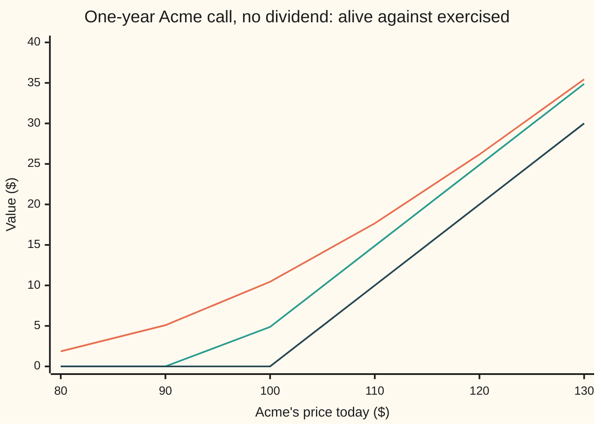
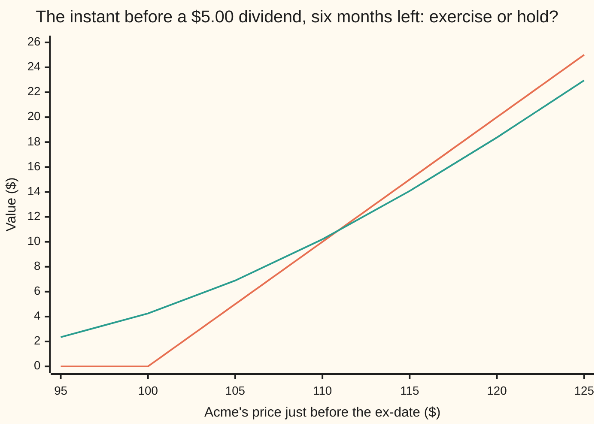

# Merton's theorem: never exercise a call early on a share that pays nothing, and the two places the rule stops

[Syllabus](../../../SYLLABUS.md) → [Financial mathematics](../README.md) → [American and Bermudan exercise](../README.md#s15) → Merton's theorem

---

## General Overview

Acme trades at $100.00 and pays no dividend. A one-year call on it gives the right to buy one share for $100.00, the **strike**. An **American** call lets the holder use that right on any day of the year. A **European** call allows it only on the last day. The American contract holds every right the European one holds, plus more. It looks as if it must cost more.

It does not. In the house market with the dividend yield set to zero (riskless rate 5%, volatility 20%), both calls are worth $10.45. A 2,000-step price tree checks every one of its 2,001,000 decision points and finds none where using the call early beats keeping it. The extra right is never used, so it is worth nothing.

The reason is a comparison, not a forecast. Exercising pays the share price minus the strike, today. Keeping the call alive keeps the strike money in the bank earning interest, and keeps the right to walk away if the share falls. So a holder who needs cash sells the call rather than exercising it.

Robert Merton proved this in 1973. The proof also shows where it stops. A share that pays a cash **dividend**, a payment from the company to its shareholders, can make exercise worthwhile just before the payment. And a **put**, the right to sell at the strike, can be worth exercising early whether or not there is a dividend.

**On a share that pays nothing before expiry, and with interest rates not below zero, a live call is always worth more than an exercised one, so the American call and the European call have the same price.**

**What kind of fact this is:** a theorem, proved on this card in Why it works. The price for the dividend case, Black's approximation, is an approximation, with its error measured against a tree.

### The picture: the live call, its floor, and what exercise pays



Top line: the live call, priced by the ordinary formula. Middle line: its floor, the share price minus the strike discounted back one year, and never below zero. Bottom line: what exercising today pays. The live call never touches the floor, and from $100 rightward the floor sits $4.88 above the exercise line. At $120 the call is worth $26.17 alive and $20.00 exercised.

---

## The formula

Notation first, in words. $S$ is Acme's price today, $K$ the strike and $r$ the riskless rate. $C_{\text{Am}}$ is the American call's price and $C_{\text{Eu}}$ the European call's, both on the same share, strike and expiry. $\tau$, read "tau", is the time left to expiry, in years. The house convention writes the discount factor, what a dollar due at expiry is worth today, as $e^{-r\tau}$.

$$C_{\text{Am}} \;\ge\; C_{\text{Eu}} \;\ge\; S - K e^{-r\tau} \;\ge\; S - K$$

**Read it aloud:** the American call is worth at least the European one, which is worth at least the share minus the discounted strike, which is at least what exercising pays today.

Every link in that chain says "live beats dead". The theorem closes the loop from the other side and proves

$$C_{\text{Am}} = C_{\text{Eu}} \qquad \text{when no dividend falls before expiry and } r \ge 0.$$

One cash dividend $D$ paid at time $t_1$ breaks the chain in one place. Exercise just before that payment can be worth it only if

$$D \;>\; K\left(1 - e^{-r(T - t_1)}\right)$$

**Read it aloud:** the dividend must be bigger than the interest the strike money would earn from the payment date to expiry.

When it is, Black's approximation prices the American call as the better of two European calls, one for each date on which exercise could make sense:

$$C_{\text{Am}} \;\approx\; \max\Big(C_{\text{Eu}}(S^{*}, K, T),\; C_{\text{Eu}}(S^{*}, K - D, t_1)\Big)$$

Here $C_{\text{Eu}}(\text{share}, \text{strike}, \text{time})$ is the European call priced by the Black-Scholes formula with those three inputs and no yield, and $S^{*}$, the **escrowed spot**, is today's price less the dividend's value today.

| Symbol | Plain meaning | In our example | Push it up and the early-exercise premium… |
| --- | --- | --- | --- |
| $S$ | Acme's price today | 100.00 | rises once a dividend is ahead: deep calls lose most to the drop |
| $K$ | the strike, the price the call may buy at | 100.00 | falls: more strike money left earning interest |
| $r$ | the riskless rate, continuously compounded | 5% | falls: waiting earns more; below zero the theorem fails |
| $\sigma$ | volatility, how jumpy the share is. Say "sigma". | 20% | falls: the right to walk away is worth more |
| $T$ | years from today to expiry | 1 | — |
| $\tau$ | years left to expiry at the moment of deciding | 1 today | — |
| $q$ | a continuous dividend yield, the house market's usual 2% | 0 here | rises: a yield is a dividend spread thin |
| $C_{\text{Am}}$, $C_{\text{Eu}}$ | American and European call prices | 10.45 and 10.45 | — |
| $P_{\text{Am}}$, $P_{\text{Eu}}$ | American and European put prices, the right to sell at $K$ | 6.09 and 5.57 | — |
| $D$ | one cash dividend, dollars a share | 2.00, then 5.00 | rises, once past the threshold |
| $t_1$ | when the share goes ex-dividend: from that date a buyer no longer gets the payment | 0.5 | — |
| $S^{*}$ | the **escrowed spot**: today's price less the dividend's value today | 98.05 for $D = 2$ | — |

### When it holds

- **No dividend before expiry.** A share that sheds cash drops in price, and the call holder gets none of the cash. With $D = 5.00$ at six months the premium is $0.35: American $7.93, European $7.58.
- **Rates not below zero.** The chain uses $K e^{-r\tau} \le K$. With a negative rate, paying the strike later costs money instead of earning it, and exercise can win.
- **A call, not a put.** A put holder *receives* the strike on exercise, and receiving money sooner is better. The American put here is worth $6.09 against $5.57 for the European.
- **No riskless profit and a market to sell in.** The proof compares prices. A holder who cannot sell the call, such as an employee with a stock grant, may still have reasons to exercise; the price does not change, only the holder's options.

---

## Why it works

### Step 0: a live call is worth more than a dead one

Exercising a call swaps it for its exercise value, the share price minus the strike. Selling it swaps it for its market price. The whole theorem is one inequality: the market price is always above the exercise value. So exercising is never the best way to turn a call into cash. A right that is never worth using adds nothing to the price.

### Step 1: the floor, from two parcels

Build two parcels today and hold both to expiry.

- **Parcel A:** one European call, plus $K e^{-r\tau}$ in the bank. At expiry the bank holds exactly $K$.
- **Parcel B:** one Acme share.

At expiry, if Acme is above $K$, parcel A exercises, pays $K$ from the bank and holds a share: the same as B. If Acme is at or below $K$, A lets the call lapse and keeps $K$ in cash, which is at least what B's share is worth. So A is worth at least B in every future. Anything that always pays at least as much must cost at least as much today, or buying A and selling B would be a riskless profit. So

$$C_{\text{Eu}} + K e^{-r\tau} \;\ge\; S, \qquad C_{\text{Eu}} \;\ge\; S - K e^{-r\tau}.$$

This is the lower bound from [Option price bounds](../08-The%20Black-Scholes%20call%20and%20put/04-option-price-bounds.md). It needed no model of how Acme moves. It did need "no dividend": parcel B is one share with nothing paid out along the way.

### Step 2: the floor beats the exercise value

When $r \ge 0$, the discounted strike $K e^{-r\tau}$ is at most $K$. So the floor $S - K e^{-r\tau}$ is at least $S - K$. A call is also never worth less than zero. Together:

$$C_{\text{Eu}} \;\ge\; \max(S - K e^{-r\tau},\, 0) \;\ge\; \max(S - K,\, 0).$$

When $r > 0$ and time is left, the floor sits strictly above the exercise value, by $K(1 - e^{-r\tau})$, the interest on the strike, $4.88 on a one-year $100 strike. On top of the floor sits the put that parity adds: $C_{\text{Eu}} = (S - K e^{-r\tau}) + P_{\text{Eu}}$. At $S = 100$ that is $4.88 of floor plus $5.57 of put, $10.45 in all. The interest is what early exercise throws away for certain; the put is the right to walk away, thrown away too.

### Step 3: the American call is worth no more than the European one

Step 2 says the European call is worth at least its exercise value at every moment and every share price. The American call can always copy the European one by never exercising, so $C_{\text{Am}} \ge C_{\text{Eu}}$. The other direction comes from working back from expiry. At the last moment both calls pay the same. One step earlier, the American holder chooses the larger of exercising now and waiting. Waiting is worth exactly what the European is worth, and Step 2 says that is at least the exercise value. So the American holder waits, and the two prices stay equal. Repeat back to today.

The check runs exactly this on a 2,000-step tree. It tests the choice at every node: 2,001,000 of them. Exercise wins at none. The American and European tree prices are both $10.449584, and the formula gives $10.450584, a tenth of a cent away.

<details>
<summary>Detailed proof: backward induction on the tree, and the continuous version</summary>

Take a recombining tree with steps of length $\Delta t$, up factor $u$ and down factor $1/u$, and pricing weight $p = (e^{r\Delta t} - 1/u)/(u - 1/u)$, which lies strictly between 0 and 1 because $1/u < e^{r\Delta t} < u$. Inside this proof only, E is the European value at a node and V the American value.

At expiry $V = E = \max(S - K, 0)$. Suppose $V = E$ at every node one step later. At the current node, waiting is worth $e^{-r\Delta t}\,[\,p\,V_{\text{up}} + (1-p)\,V_{\text{down}}\,] = e^{-r\Delta t}\,[\,p\,E_{\text{up}} + (1-p)\,E_{\text{down}}\,] = E$. Parity holds exactly inside such a tree, $E - P = S - K e^{-r\tau}$ with $P \ge 0$, so $E \ge S - K e^{-r\tau} \ge S - K$, and $E \ge 0$. Hence $V = \max(S - K,\, E) = E$. Induction back to today gives $V = E$ at the root.

In continuous time, any exercise policy is a random time, written θ (theta), chosen without seeing the future. Its value today is the average, in the risk-neutral world, of $e^{-r\theta}(S_\theta - K)^+$. At the moment θ, Step 2 says $(S_\theta - K)^+ \le C_{\text{Eu}}$ at that moment. The discounted European price is a fair game: its average future value, discounted, is its value today. So every policy is worth at most $C_{\text{Eu}}$ today. The American price is the best policy's value, hence $C_{\text{Am}} \le C_{\text{Eu}}$. With Step 3's other half, $C_{\text{Am}} = C_{\text{Eu}}$.

</details>

### Step 4: where a dividend breaks it, and why only just before the payment

Let Acme pay one cash dividend $D$ at $t_1$. Treat it as the [Known cash dividends](../08-The%20Black-Scholes%20call%20and%20put/08-known-cash-dividends.md) card does: the dividend's value today is set aside, and what is left, the escrowed spot $S^{*}$, is the part of the share that wanders.

**Most dates are still ruled out.** After the payment, no more dividends are due, so Steps 1 to 3 apply as they stand: no exercise between $t_1$ and expiry. Before the payment, the share pays nothing until $t_1$. Replace "expiry" with "just before $t_1$" and the same two-parcel argument says the call is worth more alive than dead at any earlier date. The only moment left is the instant before the share goes ex-dividend.

**At that instant, compare.** Exercising pays $S - K$ and collects a share that still carries the dividend. Holding keeps a call on a share about to drop by $D$, with $T - t_1$ left to run. Step 1's floor, applied to the dropped share, says holding is worth at least $S - D - K e^{-r(T - t_1)}$. That floor beats $S - K$ whenever $D \le K(1 - e^{-r(T - t_1)})$. Then exercise never pays, at any share price.

For Acme, $K(1 - e^{-0.05 \times 0.5}) = 2.47$. **A $2.00 dividend is under the line.** The tree, run on the escrowed share, finds no node where exercise wins, and prices the American call at $9.244880. The European formula gives $9.244684; the 0.02-cent gap is the tree's step error, not a premium. A dividend is necessary for early exercise, not sufficient.

**A $5.00 dividend is over it.** Now the tree exercises at 489 nodes, every one of them at step 1,000 of 2,000, the step just before the ex-date. The American call is worth $7.925722 against $7.577356 for the European.



The first line is what exercise pays, the share price less $100. The second is what holding is worth: a six-month European call on the share after it drops $5.00. Holding wins at $110, $10.20 against $10.00. Exercise wins at $115, $15.00 against $14.08. A bisection on the two curves puts the crossing at $110.75. The tree's lowest exercised node sits at $110.90, within one tree step of it.

**This also gives a second road to the price.** Since the only decision is at $t_1$, the American call is the discounted average, over where Acme's escrowed share lands at $t_1$, of the larger of those two lines. A single integral, split at the $110.75 boundary, gives $7.925118. The tree gives $7.925722. Two methods that share nothing but the model agree to within a tenth of a cent.

### Step 5: Black's approximation, the better of two fixed plans

Fischer Black's 1975 shortcut follows from Step 4. Only two exercise dates matter: the instant before $t_1$, and expiry. Price each as if it were fixed in advance.

- **Plan 1, hold to expiry.** A European call on the escrowed share: $C_{\text{Eu}}(S^{*}, K, T)$.
- **Plan 2, exercise just before the ex-date if the call is in the money.** That pays the share still carrying the dividend, $S^{*}_{t_1} + D$, less $K$. That is a call on the escrowed share with strike $K - D$ expiring at $t_1$: $C_{\text{Eu}}(S^{*}, K - D, t_1)$.

Take the larger. The American holder can follow either plan, so each is a lower bound on the true price, and so is their maximum. It falls short because the real holder does not commit today. At $t_1$ the holder sees the share price and picks the better line of the chart above.

| Dividend | European | Black | American (integral) | Premium over European |
| --- | --- | --- | --- | --- |
| $0.00 | 10.4506 | 10.4506 | 10.4506 | 0.0000 |
| $2.00 | 9.2447 | 9.2447 | 9.2447 | 0.0000 |
| $3.00 | 8.6696 | 8.6696 | 8.6943 | 0.0246 |
| $5.00 | 7.5774 | 7.5774 | 7.9251 | 0.3478 |
| $8.00 | 6.0884 | 6.4563 | 7.1929 | 1.1046 |

At the money, Black's second plan loses: for the $5.00 dividend it is worth $6.618302 against $7.577356 for holding, so Black returns the European price and misses the whole premium. At $8.00 plan 2 takes over, $6.4563 against $6.0884, yet Black still sits well below the integral's $7.1929. Deeper in the money Black captures most of the premium, as the experiments below show.

Textbooks often write plan 2 as $C_{\text{Eu}}(S, K, t_1)$, a call on today's full price. That is worth $6.888729 here, not $6.618302: it puts the 20% volatility on the whole share rather than on the escrowed part. Inside the escrowed model the $K - D$ version is the consistent one.

### Step 6: why puts are different

Mirror Step 1 for a put. Parcel A is a put plus one share; parcel B is $K e^{-r\tau}$ in the bank. The same reasoning gives $P_{\text{Eu}} \ge K e^{-r\tau} - S$. But that floor sits *below* the put's exercise value $K - S$, by the interest on the strike. The chain that protected the call runs the wrong way.

The reason is plain. A put holder who exercises receives $K$. Cash received now earns interest; cash received at expiry does not. Deep in the money, where the chance of a recovery is small, the lost interest outweighs the right to wait. At $S = 80$ the European put's floor is $15.122942$, below the $20.00 exercise value, and the American put tree exercises at once: it is worth exactly $20.000000. At $S = 100$ the American put is worth $6.089990 against $5.573526 for the European, and the tree exercises at 964,807 nodes. The put's exercise boundary belongs to [The exercise boundary and smooth pasting](04-exercise-boundary-and-smooth-pasting.md).

The exact price for one known dividend, by compound options, is the Roll-Geske-Whaley formula; the integral in Step 4 is its numerical twin. A continuous yield $q > 0$ can also make early exercise pay at any date, not only one; that is the house market's American call, though at $q = 2\%$ its premium is under a millionth of a dollar, and [Barone-Adesi-Whaley](06-barone-adesi-whaley-approximation.md) prices it.

---

## Worked numbers, by hand

Acme: $S = 100.00$, $K = 100.00$, $r = 5\%$, $\sigma = 20\%$, $T = 1$, $q = 0$.

| Step | Arithmetic | Value |
| --- | --- | --- |
| exercise value today | $\max(100 - 100, 0)$ | $0.00 |
| floor | $100 - 100\,e^{-0.05}$ | $4.877058 |
| European put, the right to walk away | the ordinary put formula | $5.573526 |
| European call | floor plus put, $4.877058 + 5.573526$ | $10.450584 |
| American call, tree with a choice at every node | no node exercises | **$10.449584, equal to the European tree** |
| same call, share at $120 | the ordinary formula | $26.169044 |
| thrown away by exercising at $120 | $26.169044 - 20.00$ | **$6.169044** |
| dividend threshold, $D$ at six months | $100\,(1 - e^{-0.05 \times 0.5})$ | $2.469009 |
| $D = 2.00$: escrowed spot | $100 - 2\,e^{-0.025}$ | $98.049380 |
| $D = 2.00$: American call | under the threshold, equals European | **$9.244684** |
| $D = 5.00$: escrowed spot | $100 - 5\,e^{-0.025}$ | $95.123450 |
| $D = 5.00$: European call | ordinary formula on $95.123450 | $7.577356 |
| $D = 5.00$: Black's plan 2 | call on $95.123450, strike $95, six months | $6.618302 |
| $D = 5.00$: Black's approximation | the larger | $7.577356 |
| $D = 5.00$: American call | integral split at $110.75 | **$7.925118** |

With no dividend, the American right is worth nothing, and exercising a call worth $26.17 for $20.00 destroys $6.17. With a $5.00 dividend the right is worth about 35 cents, and all of it is the choice made the instant before the ex-date.

### What breaks if you drop a piece

| Mistake | Comes out at | What went wrong |
| --- | --- | --- |
| Exercise the call at $120 to lock in the gain | $20.00, not $26.17 | Handed back the interest on the strike and the right to walk away |
| Assume any dividend makes early exercise pay | exercise at no node for $2.00 | $2.00 is below the $2.47 interest on the strike; the tree never exercises |
| Price the $5.00-dividend call as European | $7.58, not $7.93 | Ignores the one date on which exercise wins |
| Price the American put as European | $5.57, not $6.09 | Merton's chain runs the other way for a put |

Every number in this table is printed by the checks below.

---

## Code, from first principles, and it actually runs

Nothing is imported that already knows the answer: the bell-curve area and every average are Simpson's rule written out, the trees are loops, the boundary comes from bisection. The no-dividend call is reached three ways: the formula, a direct average of the payoff, and a 2,000-step tree that tests exercise at every node. The dividend call is reached two ways: a tree on the escrowed share that tests exercise at every node, and a single integral that decides once, at the ex-date. Black's approximation is computed on its own and asserted to sit below the integral. The put is priced by average and by tree.

### Python

```python
# Merton's no-early-exercise theorem -- the check behind the card.  Standard library
# only, and nothing imported that already knows the answer: the bell-curve area is
# thin slices under the curve (Simpson), every average is Simpson written out, the
# trees are loops, the exercise boundary comes from bisection.  Acme: S = K = 100,
# r = 5%, sigma = 20%, one year, no dividend yield; then one cash dividend D at
# six months, escrowed; then the put.
from math import log, sqrt, exp, pi
S, K, R, SIG, T, T1, STEPS = 100.0, 100.0, 0.05, 0.20, 1.0, 0.5, 2000

def phi(x): return exp(-0.5 * x * x) / sqrt(2.0 * pi)      # bell-curve height at x
def simpson(f, a, b, n):                                   # add up thin slices under f
    h = (b - a) / n
    tot = f(a) + f(b) + sum((4 if i % 2 else 2) * f(a + i * h) for i in range(1, n))
    return tot * h / 3.0
def ncdf(x):                                               # bell-curve area left of x
    if x < -9.0: return 0.0
    if x > 9.0: return 1.0
    return 0.5 + simpson(phi, 0.0, x, 400)
def bs_call(s, k, t):                                      # road 1: the formula, no yield
    if t <= 0.0: return max(s - k, 0.0)
    d1 = (log(s / k) + (R + 0.5 * SIG * SIG) * t) / (SIG * sqrt(t))
    return s * ncdf(d1) - k * exp(-R * t) * ncdf(d1 - SIG * sqrt(t))
def grow(s, t, z): return s * exp((R - 0.5 * SIG * SIG) * t + SIG * sqrt(t) * z)
def by_integral(payoff, s, t):                             # road 2: average the payoff
    return exp(-R * t) * simpson(lambda z: payoff(grow(s, t, z)) * phi(z), -10.0, 10.0, 4000)

def tree(D, sign=1.0, american=True, steps=STEPS, s=S):         # road 3: CRR tree on the escrowed share
    dt = T / steps
    u = exp(SIG * sqrt(dt)); p = (exp(R * dt) - 1.0 / u) / (u - 1.0 / u); disc = exp(-R * dt)
    s0, m = s - D * exp(-R * T1), round(T1 / dt)           # step m is the moment just before ex-date
    v = [max(sign * (s0 * u ** (2 * j - steps) - K), 0.0) for j in range(steps + 1)]
    count, when, lowest = 0, set(), None
    for n in range(steps - 1, -1, -1):
        cash = D * exp(-R * (T1 - n * dt)) if n <= m else 0.0   # dividend still inside the share
        for j in range(n + 1):
            keep = disc * (p * v[j + 1] + (1.0 - p) * v[j])
            share = s0 * u ** (2 * j - n) + cash
            if american and sign * (share - K) > keep + 1e-12:
                keep = sign * (share - K); count += 1; when.add(n)
                if n == m and (lowest is None or share < lowest): lowest = share
            v[j] = keep
    return v[0], count, sorted(when), lowest

def threshold(): return K * (1.0 - exp(-R * (T - T1)))    # interest saved by waiting after ex-date
def boundary(D):                                           # cum-dividend price where exercise = holding
    if D <= threshold(): return None
    lo, hi = K - D, 10.0 * K                               # escrowed price at ex-date, bisection
    for _ in range(200):
        mid = 0.5 * (lo + hi)
        if mid + D - K > bs_call(mid, K, T - T1): hi = mid
        else: lo = mid
    return 0.5 * (lo + hi) + D
def exact_american(D, s=S):                                # road 4: decide once, at the ex-date
    s0, b = s - D * exp(-R * T1), boundary(D)
    f = lambda z: max(grow(s0, T1, z) + D - K, bs_call(grow(s0, T1, z), K, T - T1)) * phi(z)
    if b is None: return exp(-R * T1) * simpson(f, -10.0, 10.0, 2000)
    zb = (log((b - D) / s0) - (R - 0.5 * SIG * SIG) * T1) / (SIG * sqrt(T1))
    return exp(-R * T1) * (simpson(f, -10.0, zb, 1000) + simpson(f, zb, 10.0, 1000))
def black(D, s=S):                                         # the better of two Europeans
    s0 = s - D * exp(-R * T1)
    return max(bs_call(s0, K, T), bs_call(s0, K - D, T1)), bs_call(s0, K, T), bs_call(s0, K - D, T1)

def row(label, v): print(f"{label:<40} {v:>12.6f}" if isinstance(v, float) else f"{label:<40} {v:>12}")
print("no dividend, house call")
c_f = bs_call(S, K, T); c_i = by_integral(lambda x: max(x - K, 0.0), S, T)
c_e, _, _, _ = tree(0.0, american=False); c_a, n0, _, _ = tree(0.0)
p_i = by_integral(lambda x: max(K - x, 0.0), S, T)
for lab, v in (("1 formula", c_f), ("2 Simpson average", c_i), ("3 tree, European", c_e),
               ("  tree, American", c_a), ("  nodes where exercise wins", n0), ("  nodes checked", STEPS * (STEPS + 1) // 2),
               ("floor S - K e^-rT", S - K * exp(-R * T)), ("at S=120: live call", bs_call(120.0, K, T)),
               ("  thrown away by exercising", bs_call(120.0, K, T) - 20.0)): row(lab, v)
print("one cash dividend at six months")
row("threshold K(1 - e^-r(T-t1))", threshold())
res = {}
for D in (2.0, 5.0):
    am, cnt, when, low = tree(D); bl, e1, e2 = black(D); ex = exact_american(D); res[D] = (am, cnt, when, low, bl, ex)
    for lab, v in ((f"D={D:.0f}: escrowed spot S*", S - D * exp(-R * T1)), ("  European to expiry", e1),
                   ("  European to ex-date, strike K-D", e2), ("  Black: the larger", bl),
                   ("  tree, American", am), ("  decide-at-ex-date integral", ex), ("  nodes where exercise wins", cnt)): row(lab, v)
    if when: row("  steps holding them", f"{when[0]}..{when[-1]}"); row("  lowest exercised share", low)
    if boundary(D): row("  boundary by bisection", boundary(D))
row("textbook Black leg, S not S*", bs_call(S, K, T1))
print("dividend   European      Black   American    premium")
for D in (0.0, 2.0, 3.0, 5.0, 8.0):
    bl, e1, _ = black(D); am = exact_american(D); print(f"{D:8.2f} {e1:10.4f} {bl:10.4f} {am:10.4f} {round(am - e1, 4) + 0.0:10.4f}")
bl120, e120, _ = black(5.0, 120.0); ex120 = exact_american(5.0, 120.0)
print(f"try S=120, D=5: European {e120:.4f}, Black {bl120:.4f}, American {ex120:.4f}")
print("the put, no dividend")
pa, pn, _, _ = tree(0.0, sign=-1.0); pa80, _, pw80, _ = tree(0.0, sign=-1.0, steps=400, s=80.0)
for lab, v in (("European put, Simpson average", p_i), ("  parity: C - P", c_f - p_i), ("American put, tree", pa), ("  early-exercise premium", pa - p_i),
               ("  nodes where exercise wins", pn), ("floor K e^-rT - S at S=80", K * exp(-R * T) - 80.0)): row(lab, v)
row("American put at S=80, 400 steps", pa80); row("  exercised at step 0", "yes" if 0 in pw80 else "no")
xs = [80.0, 90.0, 100.0, 110.0, 120.0, 130.0]
print("chart S       " + " ".join(f"{x:6.0f}" for x in xs))
print("chart live    " + " ".join(f"{bs_call(x, K, T):6.2f}" for x in xs))
print("chart floor   " + " ".join(f"{max(x - K * exp(-R * T), 0.0):6.2f}" for x in xs))
print("chart exercise" + " ".join(f"{max(x - K, 0.0):6.2f}" for x in xs))
ys = [95.0, 100.0, 105.0, 110.0, 115.0, 120.0, 125.0]
print("chart cum     " + " ".join(f"{y:6.0f}" for y in ys))
print("chart exer D5 " + " ".join(f"{max(y - K, 0.0):6.2f}" for y in ys))
print("chart hold D5 " + " ".join(f"{bs_call(y - 5.0, K, T - T1):6.2f}" for y in ys))

a2, a5 = res[2.0], res[5.0]
assert abs(c_i - c_f) < 1e-6 and abs(c_e - c_f) < 0.005,         "three roads to the no-dividend call"
assert n0 == 0 and abs(c_a - c_e) < 1e-12,                        "no node exercises; American equals European"
assert a2[1] == 0 and abs(a2[0] - a2[5]) < 0.005,                 "a 2.00 dividend is below the threshold"
assert a5[1] > 0 and a5[2] == [STEPS // 2] and abs(a5[0] - a5[5]) < 0.005, "5.00: exercise only just before ex-date"
assert abs(a5[3] - boundary(5.0)) < 0.5,                          "tree's lowest exercise node sits on the boundary"
assert a5[4] <= a5[5] and bl120 <= ex120,                         "Black is a lower bound"
assert pa > p_i + 0.4 and pn > 0 and abs(pa80 - 20.0) < 1e-9,     "the put carries a premium"
print("ALL CHECKS PASS")
```

**Ran 2026-09-24 on macOS, Python 3.14.6, standard library only. All checks passed. Output, pasted from the run:**

```
no dividend, house call
1 formula                                   10.450584
2 Simpson average                           10.450584
3 tree, European                            10.449584
  tree, American                            10.449584
  nodes where exercise wins                         0
  nodes checked                               2001000
floor S - K e^-rT                            4.877058
at S=120: live call                         26.169044
  thrown away by exercising                  6.169044
one cash dividend at six months
threshold K(1 - e^-r(T-t1))                  2.469009
D=2: escrowed spot S*                       98.049380
  European to expiry                         9.244684
  European to ex-date, strike K-D            6.780504
  Black: the larger                          9.244684
  tree, American                             9.244880
  decide-at-ex-date integral                 9.244684
  nodes where exercise wins                         0
D=5: escrowed spot S*                       95.123450
  European to expiry                         7.577356
  European to ex-date, strike K-D            6.618302
  Black: the larger                          7.577356
  tree, American                             7.925722
  decide-at-ex-date integral                 7.925118
  nodes where exercise wins                       489
  steps holding them                       1000..1000
  lowest exercised share                   110.901222
  boundary by bisection                    110.749795
textbook Black leg, S not S*                 6.888729
dividend   European      Black   American    premium
    0.00    10.4506    10.4506    10.4506     0.0000
    2.00     9.2447     9.2447     9.2447     0.0000
    3.00     8.6696     8.6696     8.6943     0.0246
    5.00     7.5774     7.5774     7.9251     0.3478
    8.00     6.0884     6.4563     7.1929     1.1046
try S=120, D=5: European 21.8959, Black 22.8630, American 23.2994
the put, no dividend
European put, Simpson average                5.573526
  parity: C - P                              4.877058
American put, tree                           6.089990
  early-exercise premium                     0.516464
  nodes where exercise wins                    964807
floor K e^-rT - S at S=80                   15.122942
American put at S=80, 400 steps             20.000000
  exercised at step 0                             yes
chart S           80     90    100    110    120    130
chart live      1.86   5.09  10.45  17.66  26.17  35.44
chart floor     0.00   0.00   4.88  14.88  24.88  34.88
chart exercise  0.00   0.00   0.00  10.00  20.00  30.00
chart cum         95    100    105    110    115    120    125
chart exer D5   0.00   0.00   5.00  10.00  15.00  20.00  25.00
chart hold D5   2.35   4.25   6.89  10.20  14.08  18.37  22.95
ALL CHECKS PASS
```

### Rust

The same checks, labels and inputs, in Rust with no crates. Both programs use the same Simpson grids, and the outputs agree line for line.

```rust
// Merton's no-early-exercise theorem -- the same check as the Python, in Rust.  Std
// only, no crates.  The bell-curve area is thin slices under the curve (Simpson),
// every average is Simpson written out, the trees are loops, the exercise boundary
// comes from bisection.  Acme: S = K = 100, r = 5%, sigma = 20%, one year, no
// dividend yield; then one cash dividend D at six months, escrowed; then the put.
use std::collections::BTreeSet;
use std::f64::consts::PI;
const S: f64 = 100.0; const K: f64 = 100.0; const R: f64 = 0.05; const SIG: f64 = 0.20;
const T: f64 = 1.0; const T1: f64 = 0.5; const STEPS: usize = 2000;

fn phi(x: f64) -> f64 { (-0.5 * x * x).exp() / (2.0 * PI).sqrt() }       // bell-curve height at x
fn simpson<F: Fn(f64) -> f64>(f: F, a: f64, b: f64, n: usize) -> f64 {  // add up thin slices under f
    let h = (b - a) / n as f64;
    let mut acc = 0.0;
    for i in 1..n { acc += if i % 2 == 1 { 4.0 } else { 2.0 } * f(a + i as f64 * h); }
    (f(a) + f(b) + acc) * h / 3.0
}
fn ncdf(x: f64) -> f64 {                                                 // bell-curve area left of x
    if x < -9.0 { return 0.0; }
    if x > 9.0 { return 1.0; }
    0.5 + simpson(phi, 0.0, x, 400)
}
fn bs_call(s: f64, k: f64, t: f64) -> f64 {                              // road 1: the formula, no yield
    if t <= 0.0 { return (s - k).max(0.0); }
    let d1 = ((s / k).ln() + (R + 0.5 * SIG * SIG) * t) / (SIG * t.sqrt());
    s * ncdf(d1) - k * (-R * t).exp() * ncdf(d1 - SIG * t.sqrt())
}
fn grow(s: f64, t: f64, z: f64) -> f64 { s * ((R - 0.5 * SIG * SIG) * t + SIG * t.sqrt() * z).exp() }
fn by_integral<F: Fn(f64) -> f64>(payoff: F, s: f64, t: f64) -> f64 {  // road 2: average the payoff
    (-R * t).exp() * simpson(|z| payoff(grow(s, t, z)) * phi(z), -10.0, 10.0, 4000)
}

// road 3: CRR tree on the escrowed share; returns price, exercise count, steps, lowest exercised share
fn tree(d: f64, sign: f64, american: bool, steps: usize, s: f64) -> (f64, usize, Vec<usize>, Option<f64>) {
    let dt = T / steps as f64;
    let u = (SIG * dt.sqrt()).exp();
    let p = ((R * dt).exp() - 1.0 / u) / (u - 1.0 / u);
    let disc = (-R * dt).exp();
    let (s0, m) = (s - d * (-R * T1).exp(), (T1 / dt).round() as usize);   // step m: just before ex-date
    let mut v: Vec<f64> = (0..=steps)
        .map(|j| (sign * (s0 * u.powf(2.0 * j as f64 - steps as f64) - K)).max(0.0)).collect();
    let (mut count, mut when, mut lowest) = (0usize, BTreeSet::new(), None::<f64>);
    for n in (0..steps).rev() {
        let cash = if n <= m { d * (-R * (T1 - n as f64 * dt)).exp() } else { 0.0 };  // dividend still inside
        for j in 0..=n {
            let mut keep = disc * (p * v[j + 1] + (1.0 - p) * v[j]);
            let share = s0 * u.powf(2.0 * j as f64 - n as f64) + cash;
            if american && sign * (share - K) > keep + 1e-12 {
                keep = sign * (share - K); count += 1; when.insert(n);
                if n == m && lowest.map_or(true, |l| share < l) { lowest = Some(share); }
            }
            v[j] = keep;
        }
    }
    (v[0], count, when.into_iter().collect(), lowest)
}
fn threshold() -> f64 { K * (1.0 - (-R * (T - T1)).exp()) }             // interest saved by waiting after ex-date
fn boundary(d: f64) -> Option<f64> {                                     // cum-dividend price where exercise = holding
    if d <= threshold() { return None; }
    let (mut lo, mut hi) = (K - d, 10.0 * K);
    for _ in 0..200 {
        let mid = 0.5 * (lo + hi);
        if mid + d - K > bs_call(mid, K, T - T1) { hi = mid; } else { lo = mid; }
    }
    Some(0.5 * (lo + hi) + d)
}
fn exact_american(d: f64, s: f64) -> f64 {                               // road 4: decide once, at the ex-date
    let s0 = s - d * (-R * T1).exp();
    let f = |z: f64| (grow(s0, T1, z) + d - K).max(bs_call(grow(s0, T1, z), K, T - T1)) * phi(z);
    match boundary(d) {
        None => (-R * T1).exp() * simpson(f, -10.0, 10.0, 2000),
        Some(b) => {
            let zb = (((b - d) / s0).ln() - (R - 0.5 * SIG * SIG) * T1) / (SIG * T1.sqrt());
            (-R * T1).exp() * (simpson(&f, -10.0, zb, 1000) + simpson(&f, zb, 10.0, 1000))
        }
    }
}
fn black(d: f64, s: f64) -> (f64, f64, f64) {                            // the better of two Europeans
    let s0 = s - d * (-R * T1).exp();
    let (e1, e2) = (bs_call(s0, K, T), bs_call(s0, K - d, T1));
    (e1.max(e2), e1, e2)
}
fn row(label: &str, v: f64) { println!("{:<40} {:>12.6}", label, v); }
fn rowi(label: &str, v: &str) { println!("{:<40} {:>12}", label, v); }
fn line(label: &str, xs: &[f64], dec: usize) {
    let cells: Vec<String> = xs.iter().map(|x| format!("{:6.*}", dec, x)).collect();
    println!("{}{}", label, cells.join(" "));
}

fn main() {
    println!("no dividend, house call");
    let c_f = bs_call(S, K, T);
    let c_i = by_integral(|x| (x - K).max(0.0), S, T);
    let (c_e, _, _, _) = tree(0.0, 1.0, false, STEPS, S);
    let (c_a, n0, _, _) = tree(0.0, 1.0, true, STEPS, S);
    let p_i = by_integral(|x| (K - x).max(0.0), S, T);
    row("1 formula", c_f); row("2 Simpson average", c_i); row("3 tree, European", c_e);
    row("  tree, American", c_a); rowi("  nodes where exercise wins", &n0.to_string());
    rowi("  nodes checked", &(STEPS * (STEPS + 1) / 2).to_string());
    row("floor S - K e^-rT", S - K * (-R * T).exp()); row("at S=120: live call", bs_call(120.0, K, T));
    row("  thrown away by exercising", bs_call(120.0, K, T) - 20.0);
    println!("one cash dividend at six months");
    row("threshold K(1 - e^-r(T-t1))", threshold());
    let mut res = Vec::new();
    for d in [2.0_f64, 5.0] {
        let (am, cnt, when, low) = tree(d, 1.0, true, STEPS, S);
        let (bl, e1, e2) = black(d, S);
        let ex = exact_american(d, S);
        row(&format!("D={:.0}: escrowed spot S*", d), S - d * (-R * T1).exp());
        row("  European to expiry", e1); row("  European to ex-date, strike K-D", e2);
        row("  Black: the larger", bl); row("  tree, American", am);
        row("  decide-at-ex-date integral", ex); rowi("  nodes where exercise wins", &cnt.to_string());
        if !when.is_empty() {
            rowi("  steps holding them", &format!("{}..{}", when[0], when[when.len() - 1]));
            row("  lowest exercised share", low.unwrap());
        }
        if let Some(b) = boundary(d) { row("  boundary by bisection", b); }
        res.push((am, cnt, when, low, bl, ex));
    }
    row("textbook Black leg, S not S*", bs_call(S, K, T1));
    println!("dividend   European      Black   American    premium");
    for d in [0.0_f64, 2.0, 3.0, 5.0, 8.0] {
        let (bl, e1, _) = black(d, S);
        let am = exact_american(d, S);
        println!("{:8.2} {:10.4} {:10.4} {:10.4} {:10.4}", d, e1, bl, am, ((am - e1) * 1e4).round() / 1e4 + 0.0);
    }
    let (bl120, e120, _) = black(5.0, 120.0);
    let ex120 = exact_american(5.0, 120.0);
    println!("try S=120, D=5: European {:.4}, Black {:.4}, American {:.4}", e120, bl120, ex120);
    println!("the put, no dividend");
    let (pa, pn, _, _) = tree(0.0, -1.0, true, STEPS, S);
    let (pa80, _, pw80, _) = tree(0.0, -1.0, true, 400, 80.0);
    row("European put, Simpson average", p_i); row("  parity: C - P", c_f - p_i);
    row("American put, tree", pa); row("  early-exercise premium", pa - p_i);
    rowi("  nodes where exercise wins", &pn.to_string()); row("floor K e^-rT - S at S=80", K * (-R * T).exp() - 80.0);
    row("American put at S=80, 400 steps", pa80);
    rowi("  exercised at step 0", if pw80.contains(&0) { "yes" } else { "no" });
    let xs = [80.0_f64, 90.0, 100.0, 110.0, 120.0, 130.0];
    line("chart S       ", &xs, 0);
    line("chart live    ", &xs.map(|x| bs_call(x, K, T)), 2);
    line("chart floor   ", &xs.map(|x| (x - K * (-R * T).exp()).max(0.0)), 2);
    line("chart exercise", &xs.map(|x| (x - K).max(0.0)), 2);
    let ys = [95.0_f64, 100.0, 105.0, 110.0, 115.0, 120.0, 125.0];
    line("chart cum     ", &ys, 0);
    line("chart exer D5 ", &ys.map(|y| (y - K).max(0.0)), 2);
    line("chart hold D5 ", &ys.map(|y| bs_call(y - 5.0, K, T - T1)), 2);

    let (a2, a5) = (&res[0], &res[1]);
    assert!((c_i - c_f).abs() < 1e-6 && (c_e - c_f).abs() < 0.005, "three roads to the no-dividend call");
    assert!(n0 == 0 && (c_a - c_e).abs() < 1e-12, "no node exercises; American equals European");
    assert!(a2.1 == 0 && (a2.0 - a2.5).abs() < 0.005, "a 2.00 dividend is below the threshold");
    assert!(a5.1 > 0 && a5.2 == vec![STEPS / 2] && (a5.0 - a5.5).abs() < 0.005, "5.00: exercise only just before ex-date");
    assert!((a5.3.unwrap() - boundary(5.0).unwrap()).abs() < 0.5, "tree's lowest exercise node sits on the boundary");
    assert!(a5.4 <= a5.5 && bl120 <= ex120, "Black is a lower bound");
    assert!(pa > p_i + 0.4 && pn > 0 && (pa80 - 20.0).abs() < 1e-9, "the put carries a premium");
    println!("ALL CHECKS PASS");
}
```

**Ran 2026-09-24 on macOS, rustc 1.98.1, no crates. All checks passed. Output, pasted from the run:**

```
no dividend, house call
1 formula                                   10.450584
2 Simpson average                           10.450584
3 tree, European                            10.449584
  tree, American                            10.449584
  nodes where exercise wins                         0
  nodes checked                               2001000
floor S - K e^-rT                            4.877058
at S=120: live call                         26.169044
  thrown away by exercising                  6.169044
one cash dividend at six months
threshold K(1 - e^-r(T-t1))                  2.469009
D=2: escrowed spot S*                       98.049380
  European to expiry                         9.244684
  European to ex-date, strike K-D            6.780504
  Black: the larger                          9.244684
  tree, American                             9.244880
  decide-at-ex-date integral                 9.244684
  nodes where exercise wins                         0
D=5: escrowed spot S*                       95.123450
  European to expiry                         7.577356
  European to ex-date, strike K-D            6.618302
  Black: the larger                          7.577356
  tree, American                             7.925722
  decide-at-ex-date integral                 7.925118
  nodes where exercise wins                       489
  steps holding them                       1000..1000
  lowest exercised share                   110.901222
  boundary by bisection                    110.749795
textbook Black leg, S not S*                 6.888729
dividend   European      Black   American    premium
    0.00    10.4506    10.4506    10.4506     0.0000
    2.00     9.2447     9.2447     9.2447     0.0000
    3.00     8.6696     8.6696     8.6943     0.0246
    5.00     7.5774     7.5774     7.9251     0.3478
    8.00     6.0884     6.4563     7.1929     1.1046
try S=120, D=5: European 21.8959, Black 22.8630, American 23.2994
the put, no dividend
European put, Simpson average                5.573526
  parity: C - P                              4.877058
American put, tree                           6.089990
  early-exercise premium                     0.516464
  nodes where exercise wins                    964807
floor K e^-rT - S at S=80                   15.122942
American put at S=80, 400 steps             20.000000
  exercised at step 0                             yes
chart S           80     90    100    110    120    130
chart live      1.86   5.09  10.45  17.66  26.17  35.44
chart floor     0.00   0.00   4.88  14.88  24.88  34.88
chart exercise  0.00   0.00   0.00  10.00  20.00  30.00
chart cum         95    100    105    110    115    120    125
chart exer D5   0.00   0.00   5.00  10.00  15.00  20.00  25.00
chart hold D5   2.35   4.25   6.89  10.20  14.08  18.37  22.95
ALL CHECKS PASS
```

> [!TIP]
> **Try changing**
> Guess the direction first, then run it.
> - **A dividend just over the line.** In the table loop, $3.00 sits just above the $2.47 threshold. Guess the premium. It is $0.0246: exercise now pays, but only at share prices far above the strike.
> - **A big dividend.** At $8.00 Black's plan 2, $6.4563, beats holding to expiry, $6.0884, so Black finally moves off the European price. The true American is $7.1929, a premium of $1.1046.
> - **Deep in the money.** Call `black(5.0, 120.0)` and `exact_american(5.0, 120.0)`: European $21.8959, Black $22.8630, American $23.2994. Black now moves most of the way from the European price to the American one, because exercise before the payment is close to certain.
> - **The put at $80.** Run `tree(0.0, sign=-1.0, steps=400, s=80.0)`. It returns exactly $20.000000 and records exercise at step 0: the tree exercises today.

---

## The usual mistake

> [!warning]
> **Exercising a call to "lock in" a gain.** Acme has run to $120 and the call shows $20.00 of profit. Exercising collects $20.00 for a call worth $26.17 in the market. The $6.17 difference is the interest on the strike plus the right to walk away, and exercise hands both back for nothing. The way out of a call is to sell it.
>
> Smaller traps:
> - **Treating every dividend as a reason to exercise.** The dividend must beat the interest on the strike from the payment to expiry. For Acme, $2.00 at six months does not; the tree exercises nowhere.
> - **Exercising on the wrong day.** Even when a dividend is large enough, the only date worth considering is the instant before the share goes ex. A day earlier gives up interest and gains nothing.
> - **Carrying the theorem over to puts.** An American put at $100 is worth $6.09 against $5.57 for the European. A put pricer that ignores early exercise is short by $0.52.
> - **Reading Black's approximation as the price.** It is a lower bound. At the money with a $5.00 dividend it returns $7.58, the European price, against a true $7.93.

---

## Where you meet it in real life

- **Listed calls on non-dividend shares.** Listed share options are mostly American. On shares that pay nothing, the European formula prices the calls with no correction.
- **Dividend-capture exercise.** The evening before a large dividend goes ex, deep in-the-money calls get exercised in bulk. A holder who misses that evening keeps a call on a share about to drop, and loses the difference.
- **Employee stock options.** They cannot be sold, so Step 0's "sell rather than exercise" is closed. Employees exercise early to diversify or to meet a tax date. The price has not changed; the holder's exit has.
- **Negative rates.** Several central banks set deposit rates below zero in the 2010s. The chain in The formula breaks at $K e^{-r\tau} \le K$, and early exercise of calls could pay without any dividend.
- **Puts.** At a positive rate every American put carries an early-exercise premium. Where the exercise line sits is mapped by [The perpetual American put](05-perpetual-american-put.md) for a put with no expiry and [The exercise boundary and smooth pasting](04-exercise-boundary-and-smooth-pasting.md) for the general case.

> **Say it back**
> A live call is worth at least the share minus the discounted strike, which is more than exercise pays. So on a share that pays nothing, an American call is never exercised early and costs the same as the European one. A cash dividend opens one window, the instant before the share goes ex, and only if the dividend beats the interest on the strike until expiry. Black's approximation prices that case as the better of two European calls and gives a lower bound. Puts are different because exercising a put collects cash early, and early cash earns interest.

---

## What this builds on

- [American options](01-american-options-and-early-exercise.md): the American contract, the tree with a choice at every node, and the early-exercise premium this card shows is zero for calls.
- [Known cash dividends](../08-The%20Black-Scholes%20call%20and%20put/08-known-cash-dividends.md): the escrowed spot $S^{*}$ and the European call on it, $9.244684 for the $2.00 dividend.
- [Option price bounds](../08-The%20Black-Scholes%20call%20and%20put/04-option-price-bounds.md): the floor $S - K e^{-r\tau}$ that carries Steps 1 and 2.

## Where this goes next

- [Bermudan options](03-bermudan-options.md): exercise allowed on a few fixed dates. The dividend case here is already Bermudan in disguise: only two dates matter.
- [The exercise boundary and smooth pasting](04-exercise-boundary-and-smooth-pasting.md): the $110.75 crossing generalised to a whole curve of share prices through time.
- [Barone-Adesi-Whaley](06-barone-adesi-whaley-approximation.md): a fast price for American options under a continuous yield, where exercise can pay on any day.
- [American Greeks and implied volatility](07-american-greeks-and-implied-volatility.md): sensitivities and implied volatility once the premium is not zero.

This card finds the one date a call might be exercised; what it leaves open is where the line between exercising and holding runs when every date is a candidate, as it is for a put.

---

## Sources

Verified 2026-09-24: every link below resolves to the publisher's page.

- Merton, Robert C. "Theory of Rational Option Pricing." *Bell Journal of Economics and Management Science* 4, no. 1 (1973): 141–183. [doi:10.2307/3003143](https://doi.org/10.2307/3003143). The floor, the two-parcel argument, and the proof that an American call on a share paying nothing is never exercised early.
- Black, Fischer. "Fact and Fantasy in the Use of Options." *Financial Analysts Journal* 31, no. 4 (1975): 36–41. [doi:10.2469/faj.v31.n4.36](https://doi.org/10.2469/faj.v31.n4.36). The better-of-two-Europeans shortcut for a call with a dividend ahead.
- Roll, Richard. "An Analytic Valuation Formula for Unprotected American Call Options on Stocks with Known Dividends." *Journal of Financial Economics* 5, no. 2 (1977): 251–258. [doi:10.1016/0304-405X(77)90021-6](https://doi.org/10.1016/0304-405X(77)90021-6). The exact one-dividend price that the card's integral computes numerically.
- Cox, John C., Stephen A. Ross, and Mark Rubinstein. "Option Pricing: A Simplified Approach." *Journal of Financial Economics* 7, no. 3 (1979): 229–263. [doi:10.1016/0304-405X(79)90015-1](https://doi.org/10.1016/0304-405X(79)90015-1). The tree with a choice at every node, used in the checks.
- Hull, John C. *Options, Futures, and Other Derivatives*, 11th ed. Pearson. [Publisher page](https://www.pearson.com/en-us/subject-catalog/p/options-futures-and-other-derivatives/P200000005938). The textbook treatment of early exercise, the dividend threshold, and Black's approximation.
