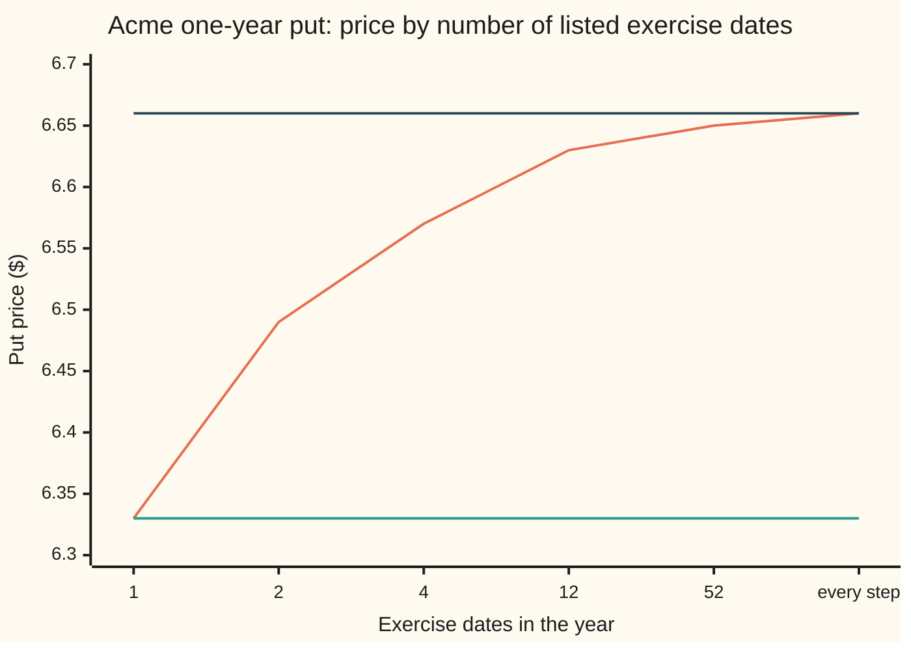

# Bermudan options: exercise on listed dates only, sitting between European and American

[Syllabus](../../../SYLLABUS.md) → [Financial mathematics](../../../SYLLABUS.md#w12) → [American and Bermudan exercise](../../../SYLLABUS.md#w12-s15) → Bermudan options

---

## General Overview

Acme trades at $100.00. A one-year put on Acme is the right, not the duty, to sell one share for $100.00, the **strike**. Three contracts share that payoff and differ only in the calendar. The European put may be used on the last day alone and is worth $6.33. The American put may be used on any day and is worth $6.66. A third contract lists four dates: the ends of the four quarters. On those four days the holder may sell at $100.00; on every other day the put can only be held. It is worth $6.57.

A contract that may be exercised only on a list of dates fixed in advance is a **Bermudan option**, the term used from here on. The name is a market joke: Bermuda lies between Europe and America, and so does the price.

The pricing rule changes by one line. Walk backwards from expiry as for a European option. On a listed date, compare two numbers, what exercising pays now and what holding is worth, and keep the larger. On any other date, make no comparison. With the last day as the only date, the rule is the European rule, and the price is the European price. List more dates and the price climbs: $6.49 for two, $6.57 for four, $6.63 for twelve, $6.65 for fifty-two, and $6.66 when every step of the tree is listed.

**A Bermudan option is priced by backward induction with the exercise check switched on at the listed dates only; one date gives the European price, and every added date lifts the price toward the American.**

**What kind of fact this is:** a method, backward induction with a gated comparison, carrying a theorem inside it: European ≤ Bermudan ≤ American, with more dates never worth less, proved on this card in Why it works.

### The picture: price against the number of dates



The climbing line is the Bermudan price, each on a binomial tree of about 2,000 steps. The flat lower line is the European put, $6.33; the flat upper line is the American put, $6.66. The climb is steep at first and flattens: nearly half the gap is closed at two dates, nine tenths at twelve.

---

## The formula

Notation first, in words. $K$ is the strike, $r$ the riskless rate and $S_{t_k}$ Acme's price on the $k$-th listed date. The listed dates are written $t_1 < t_2 < \dots < t_m$, the last one being expiry, and $\Delta_k = t_{k+1} - t_k$ is the gap after the $k$-th. The option's worth on the $k$-th listed date, when Acme stands at price $s$, is $V_k(s)$. The payoff of exercising at price $s$ is $g(s) = \max(K - s, 0)$ for a put. A **risk-neutral expectation** (the average over Acme's possible prices in the pricing world where everything drifts at the bank rate less the dividend) is written $\mathbb{E}$; the bar inside it, read "given", fixes the price on the current date.

$$V_m(s) = g(s), \qquad V_k(s) = \max\Big(\,g(s)\,,\;\; e^{-r\Delta_k}\,\mathbb{E}\big[\,V_{k+1}(S_{t_{k+1}}) \;\big|\; S_{t_k} = s\,\big]\Big)$$

$$P_B = e^{-r t_1}\,\mathbb{E}\big[\,V_1(S_{t_1})\,\big]$$

**Read it aloud:** on the last date the option is its payoff; on each earlier listed date it is the better of cashing in and holding to the next listed date, where holding is the discounted average of what it will be worth there; today's price is the discounted average of its worth on the first listed date.

Between two listed dates there is no choice, so nothing but a European roll-back happens there. On a tree that means the ordinary step-by-step average, with the $\max$ applied only at the steps that fall on a listed date.

The theorem the recursion carries, for two lists $D$ and $D'$ where every date of $D$ is also in $D'$:

$$P_E \;\le\; P_B(D) \;\le\; P_B(D') \;\le\; P_A$$

**Read it aloud:** a list of dates is worth at least the European and at most the American, and adding dates never lowers the price.

| Symbol | Plain meaning | In our example | Push it up and the answer… |
| --- | --- | --- | --- |
| $S$, $s$, $S_{t_k}$ | Acme's price today; a price level; Acme's price on date $t_k$ | $100.00 today | the put is worth less: less shortfall to sell into |
| $K$ | the strike, the price the put may sell at | $100.00 | the put is worth more |
| $r$ | the riskless rate, continuously compounded | 5% | the dates are worth more: cash taken early earns interest |
| $q$ | the dividend yield Acme pays out | 2% | the dates are worth less: holding the share pays |
| $\sigma$, $T$ | volatility, how jumpy Acme is (say "sigma"); the option's life in years | 20%; 1 | every price rises |
| $D$, $m$ | the list of exercise dates; how many there are | quarter ends; 4 | more dates: the price climbs toward the American |
| $t_k$, $t_1$, $k$, $\Delta_k$ | the $k$-th listed date in years, $t_1$ the first; the gap to the next one | 0.25, 0.5, 0.75, 1; gaps of 0.25 | — |
| $g$ | what exercising pays: $\max(K - s, 0)$ for a put | $13.19 at the $86.81 node of the hand tree below | — |
| $p$ | the tree's weight on an up step: a price weight, not a forecast | 0.517959 on the hand tree | — |
| $V_k$ | the option's worth on the $k$-th listed date, as a function of price | $V_4 = g$ | — |
| $\mathbb{E}$ | the risk-neutral average over Acme's possible prices | — | — |
| $P_E$, $P_B$, $P_A$ | European, Bermudan and American prices today | $6.33, $6.57, $6.66 | — |

### When it holds

- **The dates are fixed in the contract and known today.** A list that one side may change later is a different contract, with its own option inside.
- **The holder exercises well.** The seller must be funded for the best rule the holder could follow, so the price assumes that rule. A holder who exercises badly gets less; the seller still charged for the best.
- **The model behind the averages.** The numbers here assume Acme follows geometric Brownian motion (a log-price that drifts steadily and wiggles like a bell curve) with constant $r$, $q$ and $\sigma$. The recursion itself holds in any model; the numbers change with the model.
- **Listed dates fall on steps of the tree.** A date between two steps gets rounded, which prices a slightly different contract. Each tree here is sized so every date lands on a step.
- **A reason to exercise early.** For a call on a share paying no dividend, no listed date is ever used, and the Bermudan equals the European ([Merton's theorem](02-mertons-no-early-exercise-theorem.md)).

---

## Why it works

### Step 0: a right can always be refused

A holder with more exercise dates can do everything a holder with fewer can do: ignore the extra dates. So an extra date can add value and can never remove it. The price is the value of the best exercise rule, and a longer list only enlarges the set of rules to choose from.

The seller's side pins the price down. Whoever sold the option must be ready for whichever rule the holder follows, including the one that costs the seller most. So the seller charges for the best rule, and that is what $P_B$ is.

### Step 1: on the last date there is nothing to choose

At expiry the option pays $g(S_T)$ and ends. So $V_m = g$. This is the same starting row as any European or American roll-back.

### Step 2: between listed dates, the option is a European option

On a day not on the list the holder can only hold. From one listed date to the next, the option behaves like a European option that pays $V_{k+1}$ on date $t_{k+1}$. Its value is the discounted risk-neutral average of that payment, by the same replication argument that prices every European claim: shares and cash, rebalanced, reproduce the payment, so they must cost the same. That is the holding branch of the formula.

### Step 3: on a listed date, keep the larger number

On a listed date the holder faces two sums: $g(s)$ in hand, or the holding value from Step 2. A rational holder takes the larger. A seller holding the larger sum is covered either way; charging less would leave some rule the seller cannot pay. The general statement, that the price of a right to stop is the smallest process lying above the payoff whose discounted average never rises, is the Snell envelope ([Optimal stopping](../../11-Stochastic%20processes%20and%20calculus/08-Generators%2C%20Densities%20and%20Simulation/07-optimal-stopping-and-snell-envelope.md)); a Bermudan applies it to a list of dates.

The comparison draws a line. On each listed date there is a highest price at which exercising wins; below it the holder sells, above it the holder waits. For the quarterly put that **exercise boundary** stands at $83.62 after three months, $85.89 after six and $89.82 after nine (the highest tree node where exercise wins; the true line lies less than one node, 0.9 percent, above), then at the strike, $100.00, on the last day. It rises as expiry nears, because less time is left for Acme to recover.

### Step 4: one date returns the European price exactly

Put $m = 1$: the only listed date is expiry. There is no earlier $\max$, and the recursion reads $P_B = e^{-rT}\,\mathbb{E}[g(S_T)]$. That is the definition of the European put, term for term. On the tree the gate never opens, and the walk is the European walk: 6.329109. The closed form gives 6.330081, and the code's price grid, which adds up bell-curve weights and knows nothing of trees, gives 6.330017. The tree's shortfall of a tenth of a cent is its step error, the same in every row of the card ([Cox-Ross-Rubinstein](../04-Binomial%20Trees/04-crr-tree-and-convergence.md)).

### Step 5: more dates never cost less

Every exercise rule that uses only the dates in $D$ is also a rule for $D'$, since those dates are in $D'$ too. The best over a bigger set of rules is at least the best over the smaller set, so $P_B(D) \le P_B(D')$. The European is the list with expiry alone, and the American is the list with every date, so both ends of the sandwich follow.

<details>
<summary>Detailed proof</summary>

A **stopping rule** is a way of choosing an exercise date that uses only prices seen so far: "exercise on the first listed date Acme is below the strike" qualifies; "exercise on the date of the year's low" does not, since that date is known only later. Write $\mathcal{R}(D)$ for the stopping rules whose dates lie in $D$ and always include expiry as a last resort. By Steps 1 to 3 and backward induction on $k$, $V_k(s)$ is the largest discounted average payoff over rules in $\mathcal{R}(D)$ that start at $t_k$ with Acme at $s$: on the last date it is the payoff; on an earlier date the best rule either stops now, worth $g(s)$, or continues, and the best continuation is worth the discounted average of $V_{k+1}$ by the induction hypothesis. So $P_B(D) = \max$ over $\mathcal{R}(D)$ of the discounted average payoff.

If $D \subseteq D'$ then $\mathcal{R}(D) \subseteq \mathcal{R}(D')$, and a maximum over a larger set is no smaller. Equality is possible: an added date that is never worth using adds nothing, as for a call on a share paying no dividend. On a fixed tree the argument is exact. Comparing lists priced on different trees, as the chart does, also mixes in the trees' step errors, which here are about a tenth of a cent and all of one sign.

</details>

### Step 6: what one added date is worth

Start from the European and add one date $t_1$ before expiry. On that date the holder compares $g(S_{t_1})$ with the European put that still has $T - t_1$ to run, written $P_E(t_1, S_{t_1})$. The new right pays the excess, where there is one, and nothing elsewhere:

$$P_B(\{t_1, T\}) - P_E = e^{-r t_1}\,\mathbb{E}\Big[\big(g(S_{t_1}) - P_E(t_1, S_{t_1})\big)^+\Big]$$

The $(\,\cdot\,)^+$ keeps a positive number and turns a negative one to zero. Every term is a closed form or a one-dimensional average, so this price needs no tree at all. At six months the excess is positive below $88.09, the critical price where the two sums tie. The date is worth 0.159552, giving 6.489633 for the two-date put, against 6.488807 on the tree.

Placement matters as well as count. The same single extra date at three months is worth less, 6.398166 in all: early on, the put is rarely deep enough to beat holding. At nine months it gives 6.481936. Six months is close to the best single spot, which falls a little later.

Each further date is worth less than the one before, because the dates crowd each other. A path that dips into the exercise region for a month is already caught by a neighbouring date; a new date only catches shorter dips, which are rarer and shallower. The share of the American premium each list captures, from the tree:

```
share of the gap from European to American captured, percent
  1 date                                                            0.0
  2 dates     ████████████████████████                             48.2
  4 dates     ████████████████████████████████████                 71.7
  12 dates    █████████████████████████████████████████████        90.1
  52 dates    █████████████████████████████████████████████████    97.7
  every step  ██████████████████████████████████████████████████  100.0
```

### Step 7: toward the American, and past the tree

As the list fills in, the Bermudan approaches the American: weekly dates give 6.652468 against 6.660226 with every step listed. Delaying any American exercise to the next listed date loses only what Acme can do in one gap, and that shrinks as the gaps do. This card shows the limit numerically; how the boundary behaves once exercise is continuous is the next card's subject.

A tree needs one dimension of state; a contract on three assets, or one whose payoff remembers its path, will not fit. Then the tool is **least-squares Monte Carlo**: simulate many paths, and on each listed date estimate the holding value by fitting a curve to what paths from nearby prices went on to collect ([Longstaff-Schwartz](../06-Numerical%20Methods%20for%20Pricing/06-longstaff-schwartz-least-squares-monte-carlo.md)). A Bermudan suits it exactly, since the fit is needed only on the listed dates. On the quarterly put, a rule fitted on 40,000 simulated paths and run on 100,000 fresh ones gives 6.540195, with a standard error (the typical size of the sampling miss) of 0.025652. A fitted rule can be no better than the best rule, so this estimate leans low.

---

## Worked numbers, by hand

A 2,000-step tree is not a hand calculation, so shrink it to two steps of half a year each, with the listed dates at six months and at expiry. Same Acme: $S = K = 100$, $r = 5\%$, $q = 2\%$, $\sigma = 20\%$.

| Step | Arithmetic | Value |
| --- | --- | --- |
| up factor $u$ | $e^{0.20 \times \sqrt{0.5}}$ | 1.151910 |
| down factor $d$ | $1/u$ | 0.868123 |
| up chance $p$, a price weight, not a forecast | $(e^{0.03 \times 0.5} - 0.868123)/(1.151910 - 0.868123)$ | 0.517959 |
| half-year discount | $e^{-0.05 \times 0.5}$ | 0.975310 |
| Acme after one down step | $100 \times 0.868123$ | $86.81 |
| Acme after two down steps | $100 \times 0.868123^2$ | $75.36 |
| the put pays there | $100 - 75.36$ | $24.64 |
| holding at $86.81, six months in | $0.975310 \times (1 - 0.517959) \times 24.64$ | $11.58 |
| exercising at $86.81 | $100 - 86.81$ | **$13.19: exercise wins** |
| Bermudan today | $0.975310 \times (1 - 0.517959) \times 13.19$ | **$6.20** |
| European today, no comparison | $0.975310 \times (1 - 0.517959) \times 11.58$ | $5.45 |

Every node above the strike pays nothing, so only the down branch carries value. The comparison at $86.81 is the one line that separates the two prices: the holder who may act at six months takes $13.19 now rather than a position worth $11.58. Two steps are far too coarse for the real price; with 2,000 steps the same contract is 6.488807.

For the quarterly contract, the same walk on 2,000 steps with the comparison at the four quarter-end steps gives **6.566632**: the price of a put that may be used on four quarter-end days, in the Acme market.

### What breaks if you drop a piece

Quarterly contract, right answer 6.566632:

| Mistake | Comes out at | What went wrong |
| --- | --- | --- |
| Comparison at every step, not the listed dates | 6.660226 | That prices the American contract, a right the holder does not have |
| Exercise whenever in the money on a listed date | 4.993185 | Compared the payoff with zero instead of with holding; worth less even than the European, 6.330081 |
| Simulated paths decide using their own future | 9.123802 | Foresight: each path exercises at its best date, which no holder can know in advance |
| Two-date lists treated as equal | 6.398166 with three months, 6.481936 with nine | Where the date falls matters as well as how many there are |

Every number in the table is printed by the code below.

---

## Code, from first principles, and it actually runs

Nothing imported knows the answer: the normal curve's area, the random numbers, the root finder and the least-squares fit are all written out. The price is reached by four independent roads. A Cox-Ross-Rubinstein tree with the comparison switched on at the listed steps only. A grid in log-price, rolled back from one listed date to the previous by adding up the bell curve's weights, which never builds a tree. For one date the closed form, and for two dates the closed form plus the one-date integral of Step 6, with the critical price found by bisection. For the quarterly contract, least-squares Monte Carlo on its own simulated paths. The code also prices every wrong answer in the table above and the hand tree, and checks the hand arithmetic against the general tree.

### Python

```python
# Bermudan put -- the check behind the card.  Standard library only; nothing
# imported knows the answer.  House market: S = K = 100, r = 5%, q = 2%,
# sigma = 20%, one year.  Roads: a CRR tree with the exercise check gated to
# the listed dates; a log-price grid rolled back by quadrature; the closed form
# (one date) and a one-date-added integral (two dates); least-squares Monte Carlo.
from math import exp, log, sqrt, pi, cos, ceil
S, K, r, q, sig, T = 100.0, 100.0, 0.05, 0.02, 0.20, 1.0

def phi(x): return exp(-0.5 * x * x) / sqrt(2 * pi)
def simpson(f, a, b, n):
    h = (b - a) / n
    return (f(a) + f(b) + sum((4 if i % 2 else 2) * f(a + i * h) for i in range(1, n))) * h / 3
def N(x): return 0.5 + simpson(phi, 0.0, x, 200)          # normal CDF, built here
def bs_put(s, t):                                          # European put, closed form
    d1 = (log(s / K) + (r - q + 0.5 * sig * sig) * t) / (sig * sqrt(t))
    return K * exp(-r * t) * N(sig * sqrt(t) - d1) - s * exp(-q * t) * N(-d1)

def every(n, m): return [k * n // m for k in range(1, m + 1)]   # m evenly spaced dates as tree steps
def tree(n, listed, greedy=False):   # Road 1: CRR tree, exercise compared only on listed steps
    dt = T / n; u = exp(sig * sqrt(dt)); d = 1 / u
    p = (exp((r - q) * dt) - d) / (u - d); disc = exp(-r * dt); listed = set(listed); edge = {}
    v = [max(K - S * u ** j * d ** (n - j), 0.0) for j in range(n + 1)]
    for i in range(n - 1, -1, -1):
        v = [disc * (p * v[j + 1] + (1 - p) * v[j]) for j in range(i + 1)]
        if i in listed:                                     # the gate
            ex = [K - S * u ** j * d ** (i - j) for j in range(i + 1)]
            edge[i] = max([S * u ** j * d ** (i - j) for j in range(i + 1) if ex[j] > v[j]], default=0.0)
            v = [(e if e > 0 else c) if greedy else max(c, e) for c, e in zip(v, ex)]
    return v[0], edge

def grid(m, h=0.002, M=800):   # Road 2: log-price grid, rolled back date to date by quadrature
    dt = T / m; s = sig * sqrt(dt); mu = (r - q - 0.5 * sig * sig) * dt
    x = [log(S) + (i - M) * h for i in range(2 * M + 1)]
    w = [h * exp(-r * dt) * phi((k * h - mu) / s) / s for k in range(-2 * M, 2 * M + 1)]
    c = ceil(9 * s / h)
    v = [max(K - exp(xi), 0.0) for xi in x]
    for k in range(m - 1, -1, -1):
        new = [0.0] * (2 * M + 1)
        for i in range(max(0, M - k * c), min(2 * M, M + k * c) + 1):
            lo, hi = max(0, i - c), min(2 * M, i + c)
            new[i] = sum(v[j] * w[j - i + 2 * M] * (0.5 if j in (0, 2 * M) else 1.0) for j in range(lo, hi + 1))
            if k > 0: new[i] = max(new[i], K - exp(x[i]))
        v = new
    return v[M]

def s_half(z): return S * exp((r - q - 0.5 * sig * sig) * 0.5 + sig * sqrt(0.5) * z)
def gain(z): return K - s_half(z) - bs_put(s_half(z), 0.5)   # exercise at 6 months minus holding to expiry
lo, hi = -6.0, 0.0                                             # Road 3: bisection for where the gain turns positive
for _ in range(60):
    mid = 0.5 * (lo + hi)
    lo, hi = (mid, hi) if gain(mid) > 0 else (lo, mid)
z_star = lo
insert = exp(-r * 0.5) * simpson(lambda z: gain(z) * phi(z), -8.0, z_star, 2000)

state = 0x9E3779B97F4A7C15                                     # Road 4: least-squares Monte Carlo, quarterly
def uniform():                                                 # xorshift64*, a random-number generator written here
    global state
    state ^= state >> 12; state ^= (state << 25) & 0xFFFFFFFFFFFFFFFF; state ^= state >> 27
    return (((state * 0x2545F4914F6CDD1D) & 0xFFFFFFFFFFFFFFFF) >> 11) * 2.0 ** -53 + 2.0 ** -54
def paths(n, m=4):
    dt = T / m; out = []
    for _ in range(n):
        s, row = S, []
        for _ in range(m):
            z = sqrt(-2 * log(uniform())) * cos(2 * pi * uniform())
            s *= exp((r - q - 0.5 * sig * sig) * dt + sig * sqrt(dt) * z); row.append(s)
        out.append(row)
    return out
def fit(pts):                  # least squares of y on 1, x, x^2 via the 3x3 normal equations
    A = [[0.0] * 4 for _ in range(3)]
    for x, y in pts:
        f = (1.0, x, x * x)
        for a in range(3):
            for b in range(3): A[a][b] += f[a] * f[b]
            A[a][3] += f[a] * y
    for a in range(3):
        for b in range(a + 1, 3):
            t = A[b][a] / A[a][a]; A[b] = [A[b][c] - t * A[a][c] for c in range(4)]
    beta = [0.0] * 3
    for a in (2, 1, 0): beta[a] = (A[a][3] - sum(A[a][c] * beta[c] for c in range(a + 1, 3))) / A[a][a]
    return beta
def take(b, s): return s < K and K - s > b[0] + b[1] * (s / K) + b[2] * (s / K) ** 2
dq = exp(-r * T / 4); train = paths(40000); cash = [max(K - row[3], 0.0) for row in train]; betas = {}
for k in (2, 1, 0):
    cash = [c * dq for c in cash]
    betas[k] = b = fit([(row[k] / K, c) for row, c in zip(train, cash) if row[k] < K])
    cash = [K - row[k] if take(b, row[k]) else c for row, c in zip(train, cash)]
pay, peek = [], []
for row in paths(100000):      # fresh paths: follow the fitted rule; and, for contrast, peek at the future
    got = exp(-r * T) * max(K - row[3], 0.0)
    for k in (0, 1, 2):
        if take(betas[k], row[k]): got = exp(-r * T * (k + 1) / 4) * (K - row[k]); break
    pay.append(got); peek.append(max(exp(-r * T * (k + 1) / 4) * max(K - row[k], 0.0) for k in range(4)))
lsm = sum(pay) / len(pay); se = sqrt((sum(v * v for v in pay) / len(pay) - lsm * lsm) / len(pay))

eu = bs_put(S, T)
(t1, _), (t2, e2), (t4, e4) = tree(2000, every(2000, 1)), tree(2000, every(2000, 2)), tree(2000, every(2000, 4))
(t12, _), (t52, _), (tam, _) = tree(2400, every(2400, 12)), tree(2080, every(2080, 52)), tree(2000, range(2001))
greedy, early, late = tree(2000, every(2000, 4), True)[0], tree(2000, [500, 2000])[0], tree(2000, [1500, 2000])[0]
g1, g2, g4, g12 = grid(1), grid(2), grid(4), grid(12)
u2 = exp(sig * sqrt(0.5)); d2 = 1 / u2; p2 = (exp((r - q) * 0.5) - d2) / (u2 - d2); dc = exp(-r * 0.5)
hold = dc * (1 - p2) * (K - S * d2 * d2)                        # the by-hand tree: two half-year steps
berm2, euro2 = dc * (1 - p2) * max(hold, K - S * d2), dc * (1 - p2) * hold
rows = [("European put, closed form", eu), ("1 date, tree 2000 steps", t1), ("1 date, grid", g1),
        ("2 dates, tree 2000 steps", t2), ("2 dates, grid", g2), ("2 dates, closed form + insertion", eu + insert),
        ("4 dates, tree 2000 steps", t4), ("4 dates, grid", g4), ("4 dates, LSM 40000 fit/100000 run", lsm),
        ("  its standard error", se), ("12 dates, tree 2400 steps", t12), ("12 dates, grid", g12),
        ("52 dates, tree 2080 steps", t52), ("every step, tree 2000 steps", tam),
        ("value of the 6-month date alone", insert), ("6-month critical price", s_half(z_star)),
        ("  tree, highest node exercised", e2[1000]),
        ("quarterly boundary, 3 months", e4[500]), ("quarterly boundary, 6 months", e4[1000]),
        ("quarterly boundary, 9 months", e4[1500]),
        ("wrong: check at every step", tam), ("wrong: exercise whenever in money", greedy),
        ("wrong: peek at the future (MC)", sum(peek) / len(peek)),
        ("timing: dates at 3 months + expiry", early), ("timing: dates at 9 months + expiry", late),
        ("hand: up factor u", u2), ("hand: down factor d", d2), ("hand: up chance p", p2), ("hand: half-year discount", dc),
        ("hand: low price at 6 months", S * d2), ("hand: low price at expiry", S * d2 * d2), ("hand: put pays there", K - S * d2 * d2),
        ("hand: hold at the low 6-month node", hold), ("hand: exercise there", K - S * d2),
        ("hand: Bermudan today", berm2), ("hand: European today", euro2)]
for label, v in rows: print(f"{label:<36}{v:>12.6f}")
ladder = [t1, t2, t4, t12, t52, tam]
print("chart, price by dates  " + " ".join(f"{v:.2f}" for v in ladder))
print("share of American premium, %  " + " ".join(f"{100 * (v - t1) / (tam - t1):.1f}" for v in ladder))

assert abs(g1 - eu) < 1e-4, "grid with one date must return the closed-form European"
assert abs(t1 - eu) < 2e-3, "tree with one date must return the European, to tree accuracy"
assert abs(g2 - (eu + insert)) < 1e-4, "two dates: grid vs closed form plus insertion integral"
assert abs(t4 - g4) < 2e-3, "tree vs grid, quarterly"
assert abs(t12 - g12) < 2e-3, "tree vs grid, monthly"
assert t1 < t2 < t4 < t12 < t52 < tam, "more dates can never be worth less"
assert abs(lsm - g4) < 3 * se, "least squares within three standard errors of the grid"
assert e2[1000] <= s_half(z_star) < e2[1000] * exp(2 * sig * sqrt(T / 2000)), "tree edge brackets the critical price"
assert abs(berm2 - tree(2, [1, 2])[0]) < 1e-12, "hand arithmetic vs the general tree, two steps"
assert greedy < t4 < sum(peek) / len(peek), "a bad rule is worth less, foresight more"
print("ALL CHECKS PASS")
```

**Ran 2026-09-24 on macOS, Python 3.14.6, standard library only. All checks passed. Output, pasted from the run:**

```
European put, closed form               6.330081
1 date, tree 2000 steps                 6.329109
1 date, grid                            6.330017
2 dates, tree 2000 steps                6.488807
2 dates, grid                           6.489581
2 dates, closed form + insertion        6.489633
4 dates, tree 2000 steps                6.566632
4 dates, grid                           6.567243
4 dates, LSM 40000 fit/100000 run       6.540195
  its standard error                    0.025652
12 dates, tree 2400 steps               6.627352
12 dates, grid                          6.627778
52 dates, tree 2080 steps               6.652468
every step, tree 2000 steps             6.660226
value of the 6-month date alone         0.159552
6-month critical price                 88.093696
  tree, highest node exercised         87.444657
quarterly boundary, 3 months           83.620169
quarterly boundary, 6 months           85.894308
quarterly boundary, 9 months           89.822807
wrong: check at every step              6.660226
wrong: exercise whenever in money       4.993185
wrong: peek at the future (MC)          9.123802
timing: dates at 3 months + expiry      6.398166
timing: dates at 9 months + expiry      6.481936
hand: up factor u                       1.151910
hand: down factor d                     0.868123
hand: up chance p                       0.517959
hand: half-year discount                0.975310
hand: low price at 6 months            86.812345
hand: low price at expiry              75.363832
hand: put pays there                   24.636168
hand: hold at the low 6-month node     11.582444
hand: exercise there                   13.187655
hand: Bermudan today                    6.200042
hand: European today                    5.445368
chart, price by dates  6.33 6.49 6.57 6.63 6.65 6.66
share of American premium, %  0.0 48.2 71.7 90.1 97.7 100.0
ALL CHECKS PASS
```

The grid lands within a hundredth of a cent of the closed form with one date, and of the one-date integral with two. The trees sit less than a tenth of a cent under the grid in every row: that is the tree's own step error, the same sign each time, so the chart's comparisons still hold. The simulation is about one standard error under the grid, on the low side, as a fitted rule should be.

### Rust

The same four roads, the same random-number generator and the same labels. No crates.

```rust
// Bermudan put -- the same check as bermudan_options_check.py, in Rust, std only.
// House market: S = K = 100, r = 5%, q = 2%, sigma = 20%, one year.  Four roads:
// gated CRR tree, log-price grid by quadrature, closed form plus insertion
// integral, least-squares Monte Carlo with its own random numbers.
use std::collections::{HashMap, HashSet};
use std::f64::consts::PI;
const S: f64 = 100.0; const K: f64 = 100.0; const R: f64 = 0.05; const Q: f64 = 0.02; const SIG: f64 = 0.20; const T: f64 = 1.0;

fn phi(x: f64) -> f64 { (-0.5 * x * x).exp() / (2.0 * PI).sqrt() }
fn simpson<F: Fn(f64) -> f64>(f: F, a: f64, b: f64, n: usize) -> f64 {
    let h = (b - a) / n as f64;
    let mut s = f(a) + f(b);
    for i in 1..n { s += if i % 2 == 1 { 4.0 } else { 2.0 } * f(a + i as f64 * h); }
    s * h / 3.0
}
fn n_cdf(x: f64) -> f64 { 0.5 + simpson(phi, 0.0, x, 200) }            // normal CDF, built here
fn bs_put(s: f64, t: f64) -> f64 {
    let d1 = ((s / K).ln() + (R - Q + 0.5 * SIG * SIG) * t) / (SIG * t.sqrt());
    K * (-R * t).exp() * n_cdf(SIG * t.sqrt() - d1) - s * (-Q * t).exp() * n_cdf(-d1)
}
fn every(n: usize, m: usize) -> Vec<usize> { (1..=m).map(|k| k * n / m).collect() }
fn tree(n: usize, listed: &[usize], greedy: bool) -> (f64, HashMap<usize, f64>) {   // Road 1
    let dt = T / n as f64; let u = (SIG * dt.sqrt()).exp(); let d = 1.0 / u;
    let p = (((R - Q) * dt).exp() - d) / (u - d); let disc = (-R * dt).exp();
    let listed: HashSet<usize> = listed.iter().cloned().collect(); let mut edge = HashMap::new();
    let node = |i: usize, j: usize| S * u.powf(j as f64) * d.powf((i - j) as f64);
    let mut v: Vec<f64> = (0..=n).map(|j| (K - node(n, j)).max(0.0)).collect();
    for i in (0..n).rev() {
        v = (0..=i).map(|j| disc * (p * v[j + 1] + (1.0 - p) * v[j])).collect();
        if listed.contains(&i) {                                          // the gate
            let ex: Vec<f64> = (0..=i).map(|j| K - node(i, j)).collect();
            edge.insert(i, (0..=i).filter(|&j| ex[j] > v[j]).map(|j| node(i, j)).fold(0.0, f64::max));
            v = v.iter().zip(&ex).map(|(&c, &e)| if greedy { if e > 0.0 { e } else { c } } else { c.max(e) }).collect();
        }
    }
    (v[0], edge)
}
fn grid(m: usize) -> f64 {                                                 // Road 2
    let (h, mm) = (0.002_f64, 800usize); let top = 2 * mm;
    let dt = T / m as f64; let s = SIG * dt.sqrt(); let mu = (R - Q - 0.5 * SIG * SIG) * dt;
    let x: Vec<f64> = (0..=top).map(|i| S.ln() + (i as f64 - mm as f64) * h).collect();
    let w: Vec<f64> = (0..=2 * top).map(|k| h * (-R * dt).exp() * phi(((k as f64 - top as f64) * h - mu) / s) / s).collect();
    let c = (9.0 * s / h).ceil() as usize;
    let mut v: Vec<f64> = x.iter().map(|xi| (K - xi.exp()).max(0.0)).collect();
    for k in (0..m).rev() {
        let mut new = vec![0.0; top + 1];
        for i in mm.saturating_sub(k * c)..=(mm + k * c).min(top) {
            let mut acc = 0.0;
            for j in i.saturating_sub(c)..=(i + c).min(top) {
                acc += v[j] * w[j + top - i] * if j == 0 || j == top { 0.5 } else { 1.0 };
            }
            new[i] = if k > 0 { acc.max(K - x[i].exp()) } else { acc };
        }
        v = new;
    }
    v[mm]
}
fn s_half(z: f64) -> f64 { S * ((R - Q - 0.5 * SIG * SIG) * 0.5 + SIG * 0.5_f64.sqrt() * z).exp() }
fn gain(z: f64) -> f64 { K - s_half(z) - bs_put(s_half(z), 0.5) }
struct Rng(u64);                                                           // xorshift64*, written here
impl Rng {
    fn uniform(&mut self) -> f64 {
        self.0 ^= self.0 >> 12; self.0 ^= self.0 << 25; self.0 ^= self.0 >> 27;
        (self.0.wrapping_mul(0x2545F4914F6CDD1D) >> 11) as f64 * 2f64.powi(-53) + 2f64.powi(-54)
    }
    fn paths(&mut self, n: usize) -> Vec<[f64; 4]> {
        let dt = T / 4.0;
        (0..n).map(|_| {
            let (mut s, mut row) = (S, [0.0; 4]);
            for k in 0..4 {
                let z = (-2.0 * self.uniform().ln()).sqrt() * (2.0 * PI * self.uniform()).cos();
                s *= ((R - Q - 0.5 * SIG * SIG) * dt + SIG * dt.sqrt() * z).exp(); row[k] = s;
            }
            row
        }).collect()
    }
}
fn fit(pts: &[(f64, f64)]) -> [f64; 3] {                                    // 3x3 normal equations
    let mut a = [[0.0_f64; 4]; 3];
    for &(x, y) in pts {
        let f = [1.0, x, x * x];
        for i in 0..3 { for j in 0..3 { a[i][j] += f[i] * f[j]; } a[i][3] += f[i] * y; }
    }
    for i in 0..3 { for j in i + 1..3 { let t = a[j][i] / a[i][i]; for c in 0..4 { a[j][c] -= t * a[i][c]; } } }
    let mut beta = [0.0; 3];
    for i in (0..3).rev() { let mut s = a[i][3]; for c in i + 1..3 { s -= a[i][c] * beta[c]; } beta[i] = s / a[i][i]; }
    beta
}
fn take(b: &[f64; 3], s: f64) -> bool { s < K && K - s > b[0] + b[1] * (s / K) + b[2] * (s / K).powf(2.0) }

fn main() {
    let (mut lo, mut hi) = (-6.0_f64, 0.0_f64);                             // Road 3
    for _ in 0..60 { let mid = 0.5 * (lo + hi); if gain(mid) > 0.0 { lo = mid } else { hi = mid } }
    let z_star = lo;
    let insert = (-R * 0.5).exp() * simpson(|z| gain(z) * phi(z), -8.0, z_star, 2000);
    let mut rng = Rng(0x9E3779B97F4A7C15);                                   // Road 4
    let dq = (-R * T / 4.0).exp(); let train = rng.paths(40000);
    let mut cash: Vec<f64> = train.iter().map(|row| (K - row[3]).max(0.0)).collect();
    let mut betas = [[0.0; 3]; 3];
    for k in [2usize, 1, 0] {
        for c in cash.iter_mut() { *c *= dq; }
        let pts: Vec<(f64, f64)> = train.iter().zip(&cash).filter(|(row, _)| row[k] < K).map(|(row, &c)| (row[k] / K, c)).collect();
        betas[k] = fit(&pts);
        for (row, c) in train.iter().zip(cash.iter_mut()) { if take(&betas[k], row[k]) { *c = K - row[k]; } }
    }
    let (mut pay, mut peek) = (Vec::new(), Vec::new());
    for row in rng.paths(100000) {
        let mut got = (-R * T).exp() * (K - row[3]).max(0.0);
        for k in 0..3 { if take(&betas[k], row[k]) { got = (-R * T * (k + 1) as f64 / 4.0).exp() * (K - row[k]); break; } }
        pay.push(got);
        peek.push((0..4).map(|k| (-R * T * (k + 1) as f64 / 4.0).exp() * (K - row[k]).max(0.0)).fold(f64::MIN, f64::max));
    }
    let nn = pay.len() as f64; let lsm = pay.iter().sum::<f64>() / nn;
    let se = ((pay.iter().map(|v| v * v).sum::<f64>() / nn - lsm * lsm) / nn).sqrt();
    let peek_mean = peek.iter().sum::<f64>() / nn;

    let eu = bs_put(S, T);
    let (t1, _) = tree(2000, &every(2000, 1), false); let (t2, e2) = tree(2000, &every(2000, 2), false);
    let (t4, e4) = tree(2000, &every(2000, 4), false); let (t12, _) = tree(2400, &every(2400, 12), false);
    let (t52, _) = tree(2080, &every(2080, 52), false); let (tam, _) = tree(2000, &(0..=2000).collect::<Vec<_>>(), false);
    let greedy = tree(2000, &every(2000, 4), true).0;
    let early = tree(2000, &[500, 2000], false).0; let late = tree(2000, &[1500, 2000], false).0;
    let (g1, g2, g4, g12) = (grid(1), grid(2), grid(4), grid(12));
    let u2 = (SIG * 0.5_f64.sqrt()).exp(); let d2 = 1.0 / u2; let p2 = (((R - Q) * 0.5).exp() - d2) / (u2 - d2);
    let dc = (-R * 0.5).exp(); let hold = dc * (1.0 - p2) * (K - S * d2 * d2);   // the by-hand tree
    let (berm2, euro2) = (dc * (1.0 - p2) * hold.max(K - S * d2), dc * (1.0 - p2) * hold);
    let rows: Vec<(&str, f64)> = vec![("European put, closed form", eu), ("1 date, tree 2000 steps", t1), ("1 date, grid", g1),
        ("2 dates, tree 2000 steps", t2), ("2 dates, grid", g2), ("2 dates, closed form + insertion", eu + insert),
        ("4 dates, tree 2000 steps", t4), ("4 dates, grid", g4), ("4 dates, LSM 40000 fit/100000 run", lsm),
        ("  its standard error", se), ("12 dates, tree 2400 steps", t12), ("12 dates, grid", g12),
        ("52 dates, tree 2080 steps", t52), ("every step, tree 2000 steps", tam),
        ("value of the 6-month date alone", insert), ("6-month critical price", s_half(z_star)),
        ("  tree, highest node exercised", e2[&1000]),
        ("quarterly boundary, 3 months", e4[&500]), ("quarterly boundary, 6 months", e4[&1000]),
        ("quarterly boundary, 9 months", e4[&1500]),
        ("wrong: check at every step", tam), ("wrong: exercise whenever in money", greedy),
        ("wrong: peek at the future (MC)", peek_mean),
        ("timing: dates at 3 months + expiry", early), ("timing: dates at 9 months + expiry", late),
        ("hand: up factor u", u2), ("hand: down factor d", d2), ("hand: up chance p", p2), ("hand: half-year discount", dc),
        ("hand: low price at 6 months", S * d2), ("hand: low price at expiry", S * d2 * d2), ("hand: put pays there", K - S * d2 * d2),
        ("hand: hold at the low 6-month node", hold), ("hand: exercise there", K - S * d2),
        ("hand: Bermudan today", berm2), ("hand: European today", euro2)];
    for (label, v) in &rows { println!("{:<36}{:>12.6}", label, v); }
    let ladder = [t1, t2, t4, t12, t52, tam];
    println!("chart, price by dates  {}", ladder.iter().map(|v| format!("{:.2}", v)).collect::<Vec<_>>().join(" "));
    println!("share of American premium, %  {}", ladder.iter().map(|v| format!("{:.1}", 100.0 * (v - t1) / (tam - t1))).collect::<Vec<_>>().join(" "));

    assert!((g1 - eu).abs() < 1e-4, "grid with one date must return the closed-form European");
    assert!((t1 - eu).abs() < 2e-3, "tree with one date must return the European, to tree accuracy");
    assert!((g2 - (eu + insert)).abs() < 1e-4, "two dates: grid vs closed form plus insertion integral");
    assert!((t4 - g4).abs() < 2e-3, "tree vs grid, quarterly");
    assert!((t12 - g12).abs() < 2e-3, "tree vs grid, monthly");
    assert!(t1 < t2 && t2 < t4 && t4 < t12 && t12 < t52 && t52 < tam, "more dates can never be worth less");
    assert!((lsm - g4).abs() < 3.0 * se, "least squares within three standard errors of the grid");
    assert!(e2[&1000] <= s_half(z_star) && s_half(z_star) < e2[&1000] * (2.0 * SIG * (T / 2000.0).sqrt()).exp(), "tree edge brackets the critical price");
    assert!((berm2 - tree(2, &[1, 2], false).0).abs() < 1e-12, "hand arithmetic vs the general tree, two steps");
    assert!(greedy < t4 && t4 < peek_mean, "a bad rule is worth less, foresight more");
    println!("ALL CHECKS PASS");
}
```

**Ran 2026-09-24 on macOS, rustc 1.98.1, no crates. All checks passed. Output, pasted from the run:**

```
European put, closed form               6.330081
1 date, tree 2000 steps                 6.329109
1 date, grid                            6.330017
2 dates, tree 2000 steps                6.488807
2 dates, grid                           6.489581
2 dates, closed form + insertion        6.489633
4 dates, tree 2000 steps                6.566632
4 dates, grid                           6.567243
4 dates, LSM 40000 fit/100000 run       6.540195
  its standard error                    0.025652
12 dates, tree 2400 steps               6.627352
12 dates, grid                          6.627778
52 dates, tree 2080 steps               6.652468
every step, tree 2000 steps             6.660226
value of the 6-month date alone         0.159552
6-month critical price                 88.093696
  tree, highest node exercised         87.444657
quarterly boundary, 3 months           83.620169
quarterly boundary, 6 months           85.894308
quarterly boundary, 9 months           89.822807
wrong: check at every step              6.660226
wrong: exercise whenever in money       4.993185
wrong: peek at the future (MC)          9.123802
timing: dates at 3 months + expiry      6.398166
timing: dates at 9 months + expiry      6.481936
hand: up factor u                       1.151910
hand: down factor d                     0.868123
hand: up chance p                       0.517959
hand: half-year discount                0.975310
hand: low price at 6 months            86.812345
hand: low price at expiry              75.363832
hand: put pays there                   24.636168
hand: hold at the low 6-month node     11.582444
hand: exercise there                   13.187655
hand: Bermudan today                    6.200042
hand: European today                    5.445368
chart, price by dates  6.33 6.49 6.57 6.63 6.65 6.66
share of American premium, %  0.0 48.2 71.7 90.1 97.7 100.0
ALL CHECKS PASS
```

The two outputs agree line for line, the simulation included, because both use the same generator from the same seed.

> [!TIP]
> **Try changing**
> Guess the direction first. Then run it.
> - **Move the one early date.** Replace the six-month list with `tree(2000, [500, 2000])`, a date at three months. The two-date put falls from 6.488807 to **6.398166**. At `[1500, 2000]`, nine months, it is **6.481936**.
> - **Exercise whenever in the money.** Pass `greedy=True` for the quarterly list. The put drops to **4.993185**, below the European 6.330081: exercising at the first dip throws away a holding value larger than the payoff.
> - **Fill in the calendar.** `every(2080, 52)` lists every week: **6.652468**, against 6.660226 with every step. Fifty-two dates already capture 97.7 percent of the American premium.
> - **Let the simulation peek.** The `peek` list takes each path's best date after the fact: **9.123802**, far above any honest price.

---

## The usual mistake

> [!warning]
> **Exercising on a listed date because the put is in the money.** Being in the money is a reason to make the comparison, never a reason to exercise. On the quarterly Acme put, the rule "sell whenever Acme is below $100.00 on a quarter end" is worth 4.993185, less than the European 6.330081 that never exercises at all. Each early sale gives up a holding value that is larger than the cash it collects.
>
> Four smaller traps:
> - **Pricing a Bermudan with an American tool.** A tree that compares at every step prices 6.660226 for a contract worth 6.566632. The dates are the contract.
> - **Letting a date fall between tree steps.** Rounding it to the nearest step prices a slightly different contract. Choose the step count so every date lands on a step, as this card's 2,000, 2,400 and 2,080 do.
> - **Letting simulated paths see their own future.** Deciding on each path with what that path does next gives 9.123802, not a price. Least-squares Monte Carlo decides with a fitted curve built from other paths, then runs the rule on fresh ones.
> - **Counting dates and ignoring where they fall.** One early date at three months gives 6.398166; at nine months, 6.481936. Two contracts with the same count are not the same contract.

---

## Where you meet it in real life

- **Callable bonds.** An issuer who may repay a bond early on its coupon dates holds a Bermudan option against the bond's owner, and the bond's price is net of it.
- **Bermudan swaptions.** The right to enter an interest-rate swap on any of a list of reset dates: the most traded Bermudan contract. It is priced with the same gated recursion on a model of rates rather than a share.
- **Employee share options.** Many can be exercised only in windows after results are published, which makes them Bermudan, not American.
- **Contracts too big for a tree.** A Bermudan on a basket of shares is priced by least-squares Monte Carlo, run on the listed dates only.
- **The American limit and its shortcuts.** A dense list approaches the American put ([American options](01-american-options-and-early-exercise.md)); the formula-based estimate of that limit is [Barone-Adesi-Whaley](06-barone-adesi-whaley-approximation.md), and its sensitivities are on [American Greeks and implied volatility](07-american-greeks-and-implied-volatility.md). With no expiry at all the boundary stops moving: [The perpetual American put](05-perpetual-american-put.md).

> **Say it back**
> A Bermudan option may be exercised only on dates listed in the contract. Its price comes from walking back from expiry, taking the better of exercising and holding on each listed date and simply holding in between. With expiry as the only date that walk is the European one, so the price is the European price. Every added date is a right that can be refused, so the price never falls and climbs toward the American, by less with each date. When the state is too big for a tree, least-squares Monte Carlo does the same comparison on the listed dates.

---

## What this builds on

- [American options](01-american-options-and-early-exercise.md): why a put can be worth exercising early at all, and the American price this card climbs toward.
- [Cox-Ross-Rubinstein](../04-Binomial%20Trees/04-crr-tree-and-convergence.md): the tree used as the main road, and why its price sits a tenth of a cent under the true one.
- [Longstaff-Schwartz](../06-Numerical%20Methods%20for%20Pricing/06-longstaff-schwartz-least-squares-monte-carlo.md): the simulation road, the tool when a tree will not fit.

## Where this goes next

- [The exercise boundary and smooth pasting](04-exercise-boundary-and-smooth-pasting.md): the exercise line once every instant is listed, and the condition that fixes where it sits.

The quarterly boundary stood at $83.62, $85.89 and $89.82: as the dates crowd into a continuum, what curve do those points become, and how does the option's value meet the payoff along it?

---

## Sources

Verified 24 Sep 2026: every link below resolves to the publisher's page.

- Cox, John C., Stephen A. Ross, and Mark Rubinstein. "Option Pricing: A Simplified Approach." *Journal of Financial Economics* 7, no. 3 (1979): 229–263. [doi:10.1016/0304-405X(79)90015-1](https://doi.org/10.1016/0304-405X(79)90015-1). The tree of road one, with early exercise as a comparison at each node.
- Longstaff, Francis A., and Eduardo S. Schwartz. "Valuing American Options by Simulation: A Simple Least-Squares Approach." *Review of Financial Studies* 14, no. 1 (2001): 113–147. [doi:10.1093/rfs/14.1.113](https://doi.org/10.1093/rfs/14.1.113). The regression road, built on a finite list of exercise dates.
- Andricopoulos, Ari D., Martin Widdicks, Peter W. Duck, and David P. Newton. "Universal Option Valuation Using Quadrature Methods." *Journal of Financial Economics* 67, no. 3 (2003): 447–471. [doi:10.1016/S0304-405X(02)00257-X](https://doi.org/10.1016/S0304-405X(02)00257-X). Rolling back between exercise dates by quadrature, one step per gap: road two.
- Glasserman, Paul. *Monte Carlo Methods in Financial Engineering*. Springer, 2004. [Publisher page](https://link.springer.com/book/10.1007/978-0-387-21617-1). The chapter on American options sets out the Bermudan recursion, stopping rules and why a fitted rule gives a low estimate.
