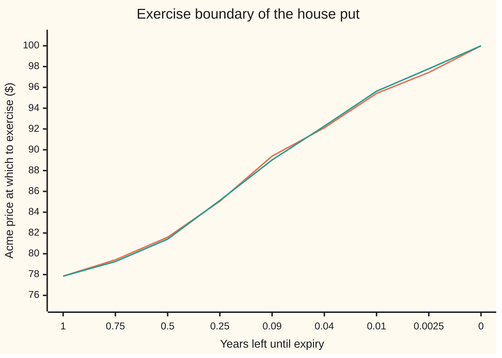

# The exercise boundary and smooth pasting: where to stop waiting, pinned by matching height and slope

Financial mathematics → American and Bermudan exercise → Where to stop waiting → The exercise boundary and smooth pasting

---

## General Overview

Acme trades at $100. A put on Acme gives the right to sell one share for $100, the **strike**, at any moment in the next year. Cash earns 5 percent a year, Acme pays a 2 percent dividend yield, and its volatility (the yearly spread of its log-returns) is 20 percent. Because the holder may exercise on any day, this is an **American** put, and it is worth $6.66 against $6.33 for the European twin that may only be used on the last day ([american-options-and-early-exercise](01-american-options-and-early-exercise.md)).

Every morning the holder faces one question: take the $100 now, or wait? The answer is a price line. Today it sits at $77.85. If Acme is at or below it, exercise; above it, wait. With nine months left the line is at $79.42; with three months left, $85.05; on the last day it reaches the strike, $100. That moving line is the **exercise boundary**.

Nobody writes the boundary into the contract; it comes out of the pricing with the price. A problem whose edge is part of the unknown is a **free-boundary problem**. Two conditions pin the edge: on the line the option is worth what exercising pays (same height), and it changes with Acme's price at the payoff's rate (same slope). The second is **smooth pasting**. The put's **delta**, its change in value per dollar of Acme, is −1 below the line and leaves −1 without a corner above it.

**The exercise boundary is the price line where waiting stops paying, and it is fixed by two conditions: on the line the option is worth exactly its payoff, and its slope there equals the payoff's slope.**

**What kind of fact this is:** a theorem inside the Black–Scholes model (the share wanders as geometric Brownian motion, an assumption, not a law): smooth pasting is proved on this card in Why it works, with the full argument in a folded proof; the boundary numbers are computed three ways in the code.

### The picture: the line rises to the strike as time runs out



Orange: the boundary from the early-exercise integral equation (road 2 in the code). Green: the highest price at which the 2,000-step tree exercises (road 1). Time is not to scale: the last four points crowd into the final five weeks, where the line bends hardest. Below the line, exercise; above it, wait.

---

## The formula

Notation first, in words. Write $\tau$ ("tau") for the years left until expiry, $V$ for the put's value as a function of Acme's price and $\tau$, and $B$ for the boundary, also a function of $\tau$. $\Delta$ and $\Gamma$ are the first and second rates of change of $V$ with Acme's price. The free-boundary problem is four lines:

$$\frac{\partial V}{\partial \tau} = \tfrac12\sigma^2 S^2\,\frac{\partial^2 V}{\partial S^2} + (r-q)\,S\,\frac{\partial V}{\partial S} - rV \qquad \text{for } S > B(\tau)$$

$$V(S,\tau) = K - S \qquad \text{for } S \le B(\tau)$$

$$V\big(B(\tau),\tau\big) = K - B(\tau) \qquad\qquad \frac{\partial V}{\partial S}\big(B(\tau),\tau\big) = -1$$

$$V(S,0) = \max(K - S,\,0), \qquad B(0) = K$$

**Read it aloud:** above the line the put obeys the Black–Scholes equation; on and below the line it is worth exactly its payoff; on the line the two pieces meet at the same height and the same slope; on the last day it pays its payoff, and the line starts at the strike.

| Symbol | Plain meaning | In our example | Push it up and the answer… |
| --- | --- | --- | --- |
| $S$ | Acme's price | $100 today | the put loses at most a dollar per dollar |
| $K$ | the strike: the price the put sells at | $100 | the line rises with it, in proportion |
| $r$ | the riskless rate, continuously compounded | 5% | the line rises: cash from exercising earns more |
| $q$ | Acme's dividend yield | 2% | the line falls: the carry of exercising, rK − qS, shrinks |
| $\sigma$ | volatility, the yearly spread of log-returns | 20% | the line falls: a jumpier share is worth waiting on |
| $\tau$ | years left until expiry | 1 today | the line falls, toward the perpetual floor of $64.92 |
| $V$ | the American put's value, a function of Acme's price and $\tau$ | $6.66 today | — |
| $B$ | the exercise boundary: exercise at or below it, wait above | $77.85 today | — |
| $\Delta$ | delta, $\partial V/\partial S$: dollars of put value per dollar of Acme | −1 on the line | — |
| $\Gamma$ | gamma, $\partial^2 V/\partial S^2$: how fast delta changes | just above the line, set by rK − qB | — |
| $L$ | the pricing operator: $\partial V/\partial \tau$ minus the right-hand side of the equation | zero above the line | — |
| $h$ | a small step in Acme's price, used to measure slopes | 2, 1, 0.5 dollars | — |

The first line is the Black–Scholes equation written in years left, so $\partial V/\partial \tau$ is how much more the put is worth with a little more time.

### When it holds

- **Acme moves without jumps.** Smooth pasting needs a path that, started just above the line, crosses it at once. If the price can gap down past the line, the value can meet the payoff at a genuine corner, and only value matching survives.
- **Exercise is allowed at every instant.** A Bermudan put, exercisable on listed dates only, has a boundary on each date but no slope condition: the value there is the larger of two curves and carries a kink ([bermudan-options](03-bermudan-options.md)).
- **The rate exceeds the dividend yield.** Then the line starts at the strike, $B(0) = K$. If the dividend yield were higher, exercising just before expiry would cost more in dividends than it earns in interest, and the line would start lower, at $rK/q$.
- **The payoff has a slope at the line.** A put's payoff is a straight line there. A payoff with its own kink at the boundary, such as a digital, breaks the slope condition.

---

## Why it works

### Step 0: the price is the best stopping rule, and stopping rules are regions

An American put is worth the best the holder can do by choosing when to stop, averaged in the pricing world. A stopping rule is, at each date, a set of prices at which to exercise. Where the holder waits, the hedge argument runs unchanged and the Black–Scholes equation holds. Where the holder stops, the value is the payoff. The problem is where one region ends.

### Step 1: the exercise region is everything below one price

Start Acme a dollar higher and follow the same rule. At exercise the share is dearer by one dollar times Acme's growth since today, and that growth, discounted in the pricing world, averages at most one. So the put loses at most a dollar per dollar Acme rises, and $V - (K - S)$, the value above the payoff, never falls as Acme rises. It is zero where the holder exercises and positive where the holder waits, so the exercise region is one stretch at the bottom, ending at the boundary. The tree finds it with one test per node: exercise when the payoff beats the discounted average of the next step.

### Step 2: the line rises to the strike as expiry nears

Exercising early buys a flow of interest on the $100 received, rK per year, minus the dividend on the share handed over, qS per year. Waiting keeps the chance that Acme falls further, the **time value**. As expiry nears, the time value shrinks to nothing while the carry stays. With a year left the carry wins only deep in the money, at $77.85. With about five weeks left it wins at $89.39. In the last instant, any in-the-money price qualifies, because rK − qS is positive whenever S is below K and r exceeds q. So the line climbs to $100.

### Step 3: value matching is continuity

On the line the value equals the payoff: $V(B,\tau) = K - B$. Step 1 showed the value moves at most a dollar per dollar of Acme, so it cannot jump; just above the line it tends to the payoff on the line. Value matching alone does not locate the line: any candidate line can be glued to a solution of the equation at matching height.

### Step 4: smooth pasting is optimality

Look at the slope just above the line, measured from the line out a small step $h$.

- **Steeper than −1 is impossible.** The value would dip below the payoff just above the line. But the holder can always exercise, so the put is never worth less than its payoff. Slope from the line outward is therefore at least −1.
- **Shallower than −1 is impossible too.** A holder starting on the line may copy the best rule for a start just above it. The copy hands over a slightly cheaper share at exercise and is otherwise identical, so the value gap per dollar of step is the discounted average growth of Acme until exercise. Started a hair above the line, the path crosses it almost at once, so that average tends to 1. The slope is therefore at most −1.

Both bounds meet: $\Delta = -1$ on the line. The code measures it without imposing it. The integral equation (road 2) enforces only value matching, yet its slope from the line outward is −0.9716 over two dollars, −0.9857 over one and −0.9926 over fifty cents. The gap to −1 halves each time the step halves: the contact is a tangent, not a corner.

<details>
<summary>Detailed proof: the slope on the line is exactly −1</summary>

Fix the years left and write $V(x)$ for the put's value at Acme price x. Under geometric Brownian motion the price path started at x is x times a random growth factor Z, whose law does not depend on x. The value is the best, over stopping times no later than expiry, of the average of $e^{-r\theta}(K - xZ_\theta)^+$, where $\theta \le \tau$ is the moment of exercise.

*Lower bound.* The holder can exercise at once, so $V(x) \ge K - x$ everywhere, with equality at B. For small positive $h$, $V(B+h) - V(B) \ge (K - B - h) - (K - B) = -h$. Divide by $h$: the slope from the line outward is at least −1.

*Upper bound.* Take the best stopping time for a start at $B + h$, and write it $\theta_h \le \tau$. Using the same rule from B is allowed and cannot beat the best, so $V(B)$ is at least the average of $e^{-r\theta_h}(K - BZ_{\theta_h})$. Subtract that from $V(B+h)$, the average of $e^{-r\theta_h}(K - (B+h)Z_{\theta_h})$: the strikes cancel, and $V(B+h) - V(B) \le -h$ times the average of $e^{-r\theta_h}Z_{\theta_h}$. A Brownian path started a distance $h$ above a line that does not drop suddenly hits it within a time that shrinks to zero with $h$, so $\theta_h \to 0$. In the pricing world $e^{-(r-q)t}Z_t$ averages exactly 1 at any stopping time, and the leftover factor $e^{-q\theta_h}$ tends to 1, so the average tends to 1. The slope from the line outward is at most −1.

The two bounds squeeze it to −1. Below the line $V = K - S$, so the slope from the other side is −1 too: $\Delta$ is continuous across the line. Where the proof used continuous paths is the hitting-time step; a jump could carry the path past the line and leave the hitting time away from zero, which is the case in When it holds.

</details>

### Step 5: what the tangent buys, measured at the line

Put the three facts about the line, $V = K - B$, $\Delta = -1$, and $\partial V/\partial \tau = 0$, into the Black–Scholes equation. The third follows from the first two: as $\tau$ changes, the value on the line changes by $\Delta$ times the line's move plus $\partial V/\partial \tau$, while the payoff changes by minus the line's move; with $\Delta = -1$ the two agree only if $\partial V/\partial \tau = 0$. Everything cancels except

$$\tfrac12\sigma^2 B^2\,\Gamma = rK - qB.$$

On the left, the gain from waiting: curvature times Acme's wobble. On the right, the net carry of exercising: interest on the strike minus dividends on the share. **The boundary is the price where the value of the wobble exactly pays the carry.** Today rK − qB is 3.4430; the integral road measures the left side as 3.4340 and the grid as 3.4339, both measured a little above the line where gamma is already slightly smaller.

### Step 6: the complementarity form, which needs no boundary at all

Write $L$ for the pricing operator: $\partial V/\partial \tau$ minus the right-hand side of the Black–Scholes equation. Above the line $LV = 0$. Below it the value is the payoff, and $L(K - S) = rK - qS$, positive there because S is below K and r exceeds q. Everywhere the value is at least the payoff, and at every price one of the two is tight. Three conditions, no boundary:

$$LV \ge 0, \qquad V - (K - S) \ge 0, \qquad LV \times \big(V - (K - S)\big) = 0.$$

This is the **linear complementarity problem**: two inequalities, at each point at least one an equality. On a grid, $L$ becomes the tridiagonal matrix of the implicit finite-difference scheme ([finite-differences-for-the-black-scholes-equation](../06-Numerical%20Methods%20for%20Pricing/07-finite-differences-for-the-black-scholes-equation.md)), and each date asks for a vector meeting the three conditions node by node. Projected successive over-relaxation, PSOR, solves it: [american-options-by-psor-and-lcp](../06-Numerical%20Methods%20for%20Pricing/08-american-options-by-psor-and-lcp.md) teaches the solver. The boundary is read off afterwards as the highest node where the value sits on the payoff: $77.88 on this grid, within one node spacing of $77.85. The grid never hears of smooth pasting, and its delta table below shows the tangent anyway.

### The other door: an equation for the line alone

Kim (1990) and Carr, Jarrow and Myneni (1992) split the American put into the European put plus an **early-exercise premium**: the discounted carry, rK − qS per year, collected whenever the price sits below the boundary. Put Acme on the line, where the value is the payoff, and the result is one equation per date in the boundary alone. Road 2 marches it back from expiry with a root finder.

<details>
<summary>The integral equation</summary>

With N the bell-curve area to the left of its argument, and for a price S, a boundary level b and a horizon u, $d_1 = \big(\ln(S/b) + (r - q + \tfrac12\sigma^2)u\big)/(\sigma\sqrt{u})$ and $d_2 = d_1 - \sigma\sqrt{u}$. The boundary satisfies, at every $\tau$,
$$K - B(\tau) = p_E\big(B(\tau),\tau\big) + \int_0^{\tau} \Big[rK e^{-ru} N(-d_2) - qB(\tau) e^{-qu} N(-d_1)\Big]\,du,$$
where the first term on the right is the European put, and inside the integral S is $B(\tau)$ and b is $B(\tau - u)$. The first term inside is the interest earned on the strike in the futures where the holder has exercised by time u; the second is the dividend given up. Putting any S in place of $B(\tau)$ gives the American price itself. The code solves it on 200 dates bunched toward expiry, where the line bends hardest.

</details>

---

## Worked numbers, by hand

| Step | Arithmetic | Value |
| --- | --- | --- |
| tree nodes near the line | neighbouring prices differ by a factor 1.008984 (the up move, squared) | 0.9% apart |
| tree: highest exercise node, 1 year left | payoff beats the average of the next step | $77.85 |
| tree: next node up | $77.85 × 1.008984 | $78.55, waits |
| integral equation, 1 year left | root of the boundary equation | **$77.85** |
| the same at 0.75, 0.5, 0.25 years left | tree node / integral | $79.25 / $79.42, $81.41 / $81.59, $85.13 / $85.05 |
| carry of exercising on the line | rK − qB = 5 − 0.02 × 77.85 | 3.443 |
| gamma on the line | 2 × 3.443 / (0.04 × 77.85 × 77.85) | 0.0284 |
| predicted slope, 1 dollar out | −1 + ½ × 0.0284 × 1 | −0.9858 |
| measured slope, 1 dollar out | from the integral road | **−0.9857** |
| European delta at the line | the European put's delta at $77.85 | −0.8252 |

The holder of the house put should exercise today if Acme stands at $77.85 or lower. On that line the American put moves dollar for dollar against Acme; its European twin moves 83 cents. The tree and the integral road differ by up to 37 cents, at 0.09 years left: under one node spacing there, since the tree reports only prices it has nodes at.

### What breaks if you drop a piece

Each wrong rule is priced on the same 2,000-step tree, against the true $6.66.

| Mistake | Comes out at | What went wrong |
| --- | --- | --- |
| Price it as European | $6.33 | No boundary at all; the $0.33 early-exercise premium is gone. |
| Freeze today's line at $77.85 for the whole year | $6.55 | The line should climb to $100 near expiry. Waiting past it in the last months throws away carry. |
| Use the perpetual line, $64.92 | $6.35 | Right for a put that never expires; for a one-year put it exercises almost never. |
| Exercise once the European twin is worth less than the payoff | $6.35 | That line is $86.56 today, too high: it forgets that the right to exercise later is itself worth something. |
| Hedge on the line with the European delta | −0.83 shares instead of −1 | About a sixth of a share short, at exactly the price where the put turns into cash. |

---

## Code, from first principles, and it actually runs

Three independent roads to the boundary and the price. Road 1: a 2,000-step coin-flip tree (Cox–Ross–Rubinstein), started 400 steps early so today's slice reaches below the line, recording the highest price it exercises at. Road 2: the integral equation, solved by bisection on 200 dates, with a normal-distribution function built from a power series. Road 3: an implicit grid in log-price, solved each date as a complementarity problem by PSOR. Then the delta table, the slope from the line at three steps, the Step 5 balance on two roads, and every wrong rule priced on the tree.

### Python

```python
# Exercise boundary and smooth pasting -- the check behind the card.  Standard library only.
# Three roads to the house put's exercise boundary: a 2000-step CRR tree, the early-exercise
# integral equation solved by a root finder, and a PSOR grid on the linear complementarity problem.
from math import log, exp, sqrt
S0, K, r, q, sig, T = 100.0, 100.0, 0.05, 0.02, 0.20, 1.0

def N(x):                                   # normal CDF from its Taylor series, no erf
    if abs(x) > 9: return 1.0 if x > 0 else 0.0
    s, t, k = x, x, 1
    while abs(t) > 1e-17 * abs(s):
        k += 2; t *= x * x / k; s += t
    return 0.5 + s * exp(-0.5 * x * x) / sqrt(2 * 3.141592653589793)
def d12(S, b, u):
    d1 = (log(S / b) + (r - q + 0.5 * sig * sig) * u) / (sig * sqrt(u)); return d1, d1 - sig * sqrt(u)
def euro(S, u):                             # European put, u years left
    d1, d2 = d12(S, K, u); return K * exp(-r * u) * N(-d2) - S * exp(-q * u) * N(-d1)
def root(f, lo, hi):                        # bisection: f(lo) and f(hi) have opposite signs
    flo = f(lo)
    for _ in range(60):
        m = 0.5 * (lo + hi); fm = f(m)
        if (fm > 0) == (flo > 0): lo, flo = m, fm
        else: hi = m
    return 0.5 * (lo + hi)

# ---- road 1: CRR tree, 2000 steps a year, started m steps early so the t = 0 slice is wide
def tree(n, m=0, rule=None, want=()):
    dt = T / n; u = exp(sig * sqrt(dt)); p = (exp((r - q) * dt) - 1 / u) / (u - 1 / u); D = exp(-r * dt)
    V = [max(K - S0 * u ** (2 * j - n - m), 0.0) for j in range(n + m + 1)]; edge = {}
    for i in range(n + m - 1, m - 1, -1):
        left = round((n + m - i) * dt, 6); bnd = rule(left) if rule else None; ex = None
        for j in range(i + 1):
            s = S0 * u ** (2 * j - i); c = D * (p * V[j + 1] + (1 - p) * V[j])
            stop = K - s > c if rule is None else s <= bnd
            V[j] = K - s if stop else c
            if stop: ex = s
        if left in want: edge[left] = ex
    return V[m // 2], edge, u * u
LEFT = (1.0, 0.75, 0.5, 0.25, 0.09, 0.04, 0.01, 0.0025)
A_tree, edge, gap = tree(2000, 400, want=LEFT)

# ---- road 2: the early-exercise integral equation, marched from expiry with bisection
def prem(S, taus, Bs, i):                   # early-exercise premium, trapezoid over the boundary
    tot, pu, pf = 0.0, None, None
    for j in range(i, -1, -1):
        u = taus[i] - taus[j]
        if u == 0: f = 0.5 * (r * K - q * S) if S == Bs[j] else (r * K - q * S) * (S < Bs[j])
        else:
            d1, d2 = d12(S, Bs[j], u); f = r * K * exp(-r * u) * N(-d2) - q * S * exp(-q * u) * N(-d1)
        if pu is not None: tot += 0.5 * (f + pf) * (u - pu)
        pu, pf = u, f
    return tot
n = 200; taus = [T * (i / n) ** 2 for i in range(n + 1)]; Bs = [K]
for i in range(1, n + 1):
    Bs.append(root(lambda b: K - b - euro(b, taus[i]) - prem(b, taus, Bs[:i] + [b], i), 40.0, Bs[-1]))
def B_int(t):                               # boundary at t years left, linear between grid dates
    i = max(k for k in range(n) if taus[k] <= t); w = (t - taus[i]) / (taus[i + 1] - taus[i])
    return Bs[i] + w * (Bs[i + 1] - Bs[i]) if i < n else Bs[n]
def V_int(S, m=800):                        # price anywhere: Simpson in v, where u = v^2 years from now
    if S <= Bs[n]: return K - S
    hv, tot = sqrt(T) / m, 0.0
    for k in range(1, m + 1):
        u = (k * hv) ** 2; d1, d2 = d12(S, B_int(T - u), u)
        f = r * K * exp(-r * u) * N(-d2) - q * S * exp(-q * u) * N(-d1)
        tot += (4 if k % 2 else 2 if k < m else 1) * f * 2 * k * hv
    return euro(S, T) + tot * hv / 3
A_int = V_int(S0)

# ---- road 3: implicit grid in log-price; PSOR solves the complementarity problem each step
dx, nt, w = 0.005, 1000, 1.5
Sg = [S0 * exp(k * dx) for k in range(-500, 401)]; M = len(Sg) - 1; g = [max(K - s, 0.0) for s in Sg]
dt = T / nt; a = 0.5 * sig * sig * dt / dx ** 2; b = (r - q - 0.5 * sig * sig) * dt / (2 * dx)
dn, up, dg = a - b, a + b, 1 + 2 * a + r * dt
V = g[:]
for step in range(nt):
    rhs = V[:]
    while True:
        err = 0.0
        for k in range(1, M):
            y = max(g[k], V[k] + w * ((rhs[k] + dn * V[k - 1] + up * V[k + 1]) / dg - V[k]))
            err = max(err, abs(y - V[k])); V[k] = y
        if err < 1e-11: break
res = [dg * V[k] - dn * V[k - 1] - up * V[k + 1] - rhs[k] for k in range(1, M)]
gapc = max(abs(min(V[k] - g[k], res[k - 1])) for k in range(1, M))
def V_grid(S):
    k = int(log(S / Sg[0]) / dx); f = (S - Sg[k]) / (Sg[k + 1] - Sg[k]); return V[k] + f * (V[k + 1] - V[k])
A_grid = V_grid(S0); B_grid = max(s for s, v, x in zip(Sg, V, g) if s < K and v - x < 1e-9)

# ---- smooth pasting at t = 0: slopes by nudging, and the curvature balance at the boundary
B1, h = Bs[n], 0.05
def slope(f, S): return (f(S + h) - f(S - h)) / (2 * h)
def eu_delta(S): return -exp(-q * T) * N(-d12(S, K, T)[0])
side = [(V_int(B1 + e) - (K - B1)) / e for e in (2.0, 1.0, 0.5)]
bal_int = 0.5 * sig * sig * B1 * B1 * (V_int(B1 + 0.75) - 2 * V_int(B1 + 0.5) + V_int(B1 + 0.25)) / 0.0625
j = Sg.index(B_grid) + 1; sl = [(V[i + 1] - V[i]) / (Sg[i + 1] - Sg[i]) for i in (j - 1, j)]
bal_grid = 0.5 * sig * sig * B1 * B1 * (sl[1] - sl[0]) / (0.5 * (Sg[j + 1] - Sg[j - 1]))
c = r - q - 0.5 * sig * sig; beta = (-c - sqrt(c * c + 2 * sig * sig * r)) / (sig * sig); B_perp = beta * K / (beta - 1)

# ---- what breaks: exercise rules that are not the free boundary, priced on the same tree
cross = lambda t: root(lambda s: euro(s, t) - (K - s), 20.0, K - 1e-9)
wrong = [tree(2000, rule=lambda t: B1)[0], tree(2000, rule=lambda t: B_perp)[0], tree(2000, rule=cross)[0]]

print("American put today   tree %.6f   integral %.6f   grid %.6f" % (A_tree, A_int, A_grid))
print("European put %.6f   early-exercise premium %.6f" % (euro(S0, T), A_int - euro(S0, T)))
print("boundary   years left   tree node   integral")
for t in LEFT: print("           %10.4f %11.2f %10.2f" % (t, edge[t], B_int(t)))
print("           %10.4f %11.2f %10.2f" % (0.0, K, K))
print("tree node spacing factor u^2 %.6f   grid exercise node %.3f" % (gap, B_grid))
print("grid complementarity gap %.1e   perpetual floor %.3f" % (gapc, B_perp))
print("today       S    value    K-S  delta int  delta grid  delta Euro")
for S in (70.0, 74.0, 78.0, 82.0, 86.0, 90.0, 94.0, 98.0):
    print("       %6.1f %8.3f %6.2f %10.4f %11.4f %11.4f" % (S, V_int(S), K - S, slope(V_int, S), slope(V_grid, S), eu_delta(S)))
print("chart delta American " + " ".join("%.2f" % slope(V_int, S) for S in range(70, 99, 4)))
print("chart delta European " + " ".join("%.2f" % eu_delta(S) for S in range(70, 99, 4)))
print("slope from B out by 2, 1, 0.5:  %.4f  %.4f  %.4f" % tuple(side))
print("European delta at B %.4f" % eu_delta(B1))
print("balance at B: integral %.4f  grid %.4f  rK - qB %.4f" % (bal_int, bal_grid, r * K - q * B1))
print("wrong: freeze today's B %.6f" % wrong[0])
print("wrong: perpetual floor  %.6f" % wrong[1])
print("wrong: European cross   %.6f   (cross today %.3f)" % (wrong[2], cross(T)))

assert abs(euro(S0, T) - 6.330080627550) < 1e-9, "series CDF against the pilot card's European put"
assert abs(A_int - A_tree) < 0.002 and abs(A_grid - A_tree) < 0.005, "three roads, one price"
assert all(abs(edge[t] - B_int(t)) < edge[t] * (gap - 1) for t in LEFT), "tree within one node"
assert abs(B_grid - B1) < B_grid * (exp(dx) - 1), "grid within one node"
assert all(B_int(a) < B_int(b) for a, b in zip(LEFT, LEFT[1:])) and B_perp < B1 and K - Bs[1] < 0.5, "rises to K"
g1, g2, g3 = (1 + x for x in side)
assert 1.8 < g1 / g2 < 2.2 and 1.8 < g2 / g3 < 2.2, "slope gap halves with the step: no corner"
assert abs(slope(V_int, 78.0) - slope(V_grid, 78.0)) < 0.005 and eu_delta(B1) > -0.9, "pasting"
assert abs(bal_int / (r * K - q * B1) - 1) < 0.01 and abs(bal_grid / (r * K - q * B1) - 1) < 0.01
assert gapc < 1e-9 and max(wrong) < A_tree - 0.1, "complementarity holds; wrong rules lose"
print("ALL CHECKS PASS")
```

**Ran 2026-09-24 on macOS, Python 3.14.6, standard library only. All checks passed. Output, pasted from the run:**

```
American put today   tree 6.660226   integral 6.660773   grid 6.658466
European put 6.330081   early-exercise premium 0.330692
boundary   years left   tree node   integral
               1.0000       77.85      77.85
               0.7500       79.25      79.42
               0.5000       81.41      81.59
               0.2500       85.13      85.05
               0.0900       89.02      89.39
               0.0400       92.27      92.11
               0.0100       95.63      95.42
               0.0025       97.79      97.43
               0.0000      100.00     100.00
tree node spacing factor u^2 1.008984   grid exercise node 77.880
grid complementarity gap 5.2e-12   perpetual floor 64.922
today       S    value    K-S  delta int  delta grid  delta Euro
         70.0   30.000  30.00    -1.0000     -1.0000     -0.9188
         74.0   26.000  26.00    -1.0000     -1.0000     -0.8776
         78.0   22.000  22.00    -0.9957     -0.9938     -0.8229
         82.0   18.243  18.00    -0.8832     -0.8811     -0.7558
         86.0   14.933  14.00    -0.7725     -0.7766     -0.6792
         90.0   12.059  10.00    -0.6649     -0.6680     -0.5970
         94.0    9.607   6.00    -0.5623     -0.5639     -0.5133
         98.0    7.551   2.00    -0.4672     -0.4690     -0.4321
chart delta American -1.00 -1.00 -1.00 -0.88 -0.77 -0.66 -0.56 -0.47
chart delta European -0.92 -0.88 -0.82 -0.76 -0.68 -0.60 -0.51 -0.43
slope from B out by 2, 1, 0.5:  -0.9716  -0.9857  -0.9926
European delta at B -0.8252
balance at B: integral 3.4340  grid 3.4339  rK - qB 3.4430
wrong: freeze today's B 6.549900
wrong: perpetual floor  6.351098
wrong: European cross   6.353622   (cross today 86.556)
ALL CHECKS PASS
```

### Rust

```rust
// Exercise boundary and smooth pasting -- the check behind the card.  Rust std only.
// Three roads to the house put's exercise boundary: a 2000-step CRR tree, the early-exercise
// integral equation solved by a root finder, and a PSOR grid on the linear complementarity problem.
const S0: f64 = 100.0; const K: f64 = 100.0; const R: f64 = 0.05; const Q: f64 = 0.02;
const SIG: f64 = 0.20; const T: f64 = 1.0;

fn nc(x: f64) -> f64 { // normal CDF from its Taylor series, no erf
    if x.abs() > 9.0 { return if x > 0.0 { 1.0 } else { 0.0 }; }
    let (mut s, mut t, mut k) = (x, x, 1.0);
    while t.abs() > 1e-17 * s.abs() { k += 2.0; t *= x * x / k; s += t; }
    0.5 + s * (-0.5 * x * x).exp() / (2.0 * std::f64::consts::PI).sqrt()
}
fn d12(s: f64, b: f64, u: f64) -> (f64, f64) {
    let d1 = ((s / b).ln() + (R - Q + 0.5 * SIG * SIG) * u) / (SIG * u.sqrt()); (d1, d1 - SIG * u.sqrt())
}
fn euro(s: f64, u: f64) -> f64 { let (d1, d2) = d12(s, K, u); K * (-R * u).exp() * nc(-d2) - s * (-Q * u).exp() * nc(-d1) }
fn root(f: &dyn Fn(f64) -> f64, mut lo: f64, mut hi: f64) -> f64 { // bisection
    let mut flo = f(lo);
    for _ in 0..60 {
        let m = 0.5 * (lo + hi); let fm = f(m);
        if (fm > 0.0) == (flo > 0.0) { lo = m; flo = fm; } else { hi = m; }
    }
    0.5 * (lo + hi)
}
// ---- road 1: CRR tree, 2000 steps a year, started m steps early so the t = 0 slice is wide
fn tree(n: usize, m: usize, rule: Option<&dyn Fn(f64) -> f64>, want: &[f64]) -> (f64, Vec<f64>, f64) {
    let dt = T / n as f64; let u = (SIG * dt.sqrt()).exp(); let p = (((R - Q) * dt).exp() - 1.0 / u) / (u - 1.0 / u);
    let disc = (-R * dt).exp(); let tot = n + m;
    let node = |j: usize, i: usize| S0 * u.powi(2 * j as i32 - i as i32);
    let mut v: Vec<f64> = (0..=tot).map(|j| (K - node(j, tot)).max(0.0)).collect();
    let mut edge = vec![0.0; want.len()];
    for i in (m..tot).rev() {
        let left = (tot - i) as f64 * dt; let bnd = rule.map(|f| f(left)); let mut ex = 0.0;
        for j in 0..=i {
            let s = node(j, i); let c = disc * (p * v[j + 1] + (1.0 - p) * v[j]);
            let stop = match bnd { None => K - s > c, Some(b) => s <= b };
            v[j] = if stop { K - s } else { c };
            if stop { ex = s; }
        }
        for (w, e) in want.iter().zip(edge.iter_mut()) { if ((w / dt).round() as usize) == tot - i { *e = ex; } }
    }
    (v[m / 2], edge, u * u)
}
// ---- road 2: the early-exercise integral equation, marched from expiry with bisection
fn prem(s: f64, taus: &[f64], bs: &[f64], last: f64, i: usize) -> f64 {
    let (mut tot, mut prev) = (0.0, None::<(f64, f64)>);
    for j in (0..=i).rev() {
        let u = taus[i] - taus[j]; let b = if j == i { last } else { bs[j] };
        let f = if u == 0.0 { if s == b { 0.5 * (R * K - Q * s) } else if s < b { R * K - Q * s } else { 0.0 } }
            else { let (d1, d2) = d12(s, b, u); R * K * (-R * u).exp() * nc(-d2) - Q * s * (-Q * u).exp() * nc(-d1) };
        if let Some((pu, pf)) = prev { tot += 0.5 * (f + pf) * (u - pu); }
        prev = Some((u, f));
    }
    tot
}
fn main() {
    let left_t = [1.0, 0.75, 0.5, 0.25, 0.09, 0.04, 0.01, 0.0025];
    let (a_tree, edge, gap) = tree(2000, 400, None, &left_t);
    let n = 200; let taus: Vec<f64> = (0..=n).map(|i| T * (i as f64 / n as f64).powi(2)).collect();
    let mut bs = vec![K];
    for i in 1..=n {
        let hi = bs[i - 1]; let bsr = &bs;
        let b = root(&|b: f64| K - b - euro(b, taus[i]) - prem(b, &taus, bsr, b, i), 40.0, hi); bs.push(b);
    }
    let b_int = |t: f64| { // boundary at t years left, linear between grid dates
        let i = (0..n).filter(|&k| taus[k] <= t).max().unwrap(); let w = (t - taus[i]) / (taus[i + 1] - taus[i]);
        bs[i] + w * (bs[i + 1] - bs[i]) };
    let b1 = bs[n];
    let v_int = |s: f64| -> f64 { // price anywhere: Simpson in v, where u = v^2 years from now
        if s <= b1 { return K - s; }
        let m = 800; let hv = T.sqrt() / m as f64; let mut tot = 0.0;
        for k in 1..=m {
            let u = (k as f64 * hv).powi(2); let (d1, d2) = d12(s, b_int(T - u), u);
            let f = R * K * (-R * u).exp() * nc(-d2) - Q * s * (-Q * u).exp() * nc(-d1);
            let wt = if k % 2 == 1 { 4.0 } else if k < m { 2.0 } else { 1.0 };
            tot += wt * f * 2.0 * k as f64 * hv;
        }
        euro(s, T) + tot * hv / 3.0 };
    let a_int = v_int(S0);
    // ---- road 3: implicit grid in log-price; PSOR solves the complementarity problem each step
    let (dx, nt, w) = (0.005, 1000, 1.5);
    let sg: Vec<f64> = (-500..=400).map(|k| S0 * (k as f64 * dx).exp()).collect(); let mm = sg.len() - 1;
    let g: Vec<f64> = sg.iter().map(|s| (K - s).max(0.0)).collect();
    let dt = T / nt as f64; let a = 0.5 * SIG * SIG * dt / (dx * dx); let bb = (R - Q - 0.5 * SIG * SIG) * dt / (2.0 * dx);
    let (dn, up, dg) = (a - bb, a + bb, 1.0 + 2.0 * a + R * dt);
    let mut v = g.clone(); let mut rhs = v.clone();
    for _ in 0..nt {
        rhs = v.clone();
        loop {
            let mut err: f64 = 0.0;
            for k in 1..mm {
                let y = g[k].max(v[k] + w * ((rhs[k] + dn * v[k - 1] + up * v[k + 1]) / dg - v[k]));
                err = err.max((y - v[k]).abs()); v[k] = y;
            }
            if err < 1e-11 { break; }
        }
    }
    let gapc = (1..mm).map(|k| (v[k] - g[k]).min(dg * v[k] - dn * v[k - 1] - up * v[k + 1] - rhs[k]).abs()).fold(0.0, f64::max);
    let v_grid = |s: f64| { let k = ((s / sg[0]).ln() / dx) as usize; let f = (s - sg[k]) / (sg[k + 1] - sg[k]); v[k] + f * (v[k + 1] - v[k]) };
    let a_grid = v_grid(S0);
    let jb = (0..=mm).filter(|&k| sg[k] < K && v[k] - g[k] < 1e-9).max().unwrap(); let b_grid = sg[jb];
    // ---- smooth pasting at t = 0: slopes by nudging, and the curvature balance at the boundary
    let h = 0.05;
    let slope = |f: &dyn Fn(f64) -> f64, s: f64| (f(s + h) - f(s - h)) / (2.0 * h);
    let eu_delta = |s: f64| -(-Q * T).exp() * nc(-d12(s, K, T).0);
    let side: Vec<f64> = [2.0, 1.0, 0.5].iter().map(|e| (v_int(b1 + e) - (K - b1)) / e).collect();
    let bal_int = 0.5 * SIG * SIG * b1 * b1 * (v_int(b1 + 0.75) - 2.0 * v_int(b1 + 0.5) + v_int(b1 + 0.25)) / 0.0625;
    let j = jb + 1; let sl: Vec<f64> = [j - 1, j].iter().map(|&i| (v[i + 1] - v[i]) / (sg[i + 1] - sg[i])).collect();
    let bal_grid = 0.5 * SIG * SIG * b1 * b1 * (sl[1] - sl[0]) / (0.5 * (sg[j + 1] - sg[j - 1]));
    let c = R - Q - 0.5 * SIG * SIG; let beta = (-c - (c * c + 2.0 * SIG * SIG * R).sqrt()) / (SIG * SIG);
    let b_perp = beta * K / (beta - 1.0);
    // ---- what breaks: exercise rules that are not the free boundary, priced on the same tree
    let cross = |t: f64| root(&|s: f64| euro(s, t) - (K - s), 20.0, K - 1e-9);
    let wrong = [tree(2000, 0, Some(&|_t: f64| b1), &[]).0, tree(2000, 0, Some(&|_t: f64| b_perp), &[]).0,
                 tree(2000, 0, Some(&cross), &[]).0];

    println!("American put today   tree {:.6}   integral {:.6}   grid {:.6}", a_tree, a_int, a_grid);
    println!("European put {:.6}   early-exercise premium {:.6}", euro(S0, T), a_int - euro(S0, T));
    println!("boundary   years left   tree node   integral");
    for (t, e) in left_t.iter().zip(edge.iter()) { println!("           {:10.4} {:11.2} {:10.2}", t, e, b_int(*t)); }
    println!("           {:10.4} {:11.2} {:10.2}", 0.0, K, K);
    println!("tree node spacing factor u^2 {:.6}   grid exercise node {:.3}", gap, b_grid);
    println!("grid complementarity gap {:.1e}   perpetual floor {:.3}", gapc, b_perp);
    println!("today       S    value    K-S  delta int  delta grid  delta Euro");
    for s in [70.0, 74.0, 78.0, 82.0, 86.0, 90.0, 94.0, 98.0] {
        println!("       {:6.1} {:8.3} {:6.2} {:10.4} {:11.4} {:11.4}", s, v_int(s), K - s, slope(&v_int, s), slope(&v_grid, s), eu_delta(s));
    }
    println!("chart delta American {}", (0..8).map(|i| format!("{:.2}", slope(&v_int, 70.0 + 4.0 * i as f64))).collect::<Vec<_>>().join(" "));
    println!("chart delta European {}", (0..8).map(|i| format!("{:.2}", eu_delta(70.0 + 4.0 * i as f64))).collect::<Vec<_>>().join(" "));
    println!("slope from B out by 2, 1, 0.5:  {:.4}  {:.4}  {:.4}", side[0], side[1], side[2]);
    println!("European delta at B {:.4}", eu_delta(b1));
    println!("balance at B: integral {:.4}  grid {:.4}  rK - qB {:.4}", bal_int, bal_grid, R * K - Q * b1);
    println!("wrong: freeze today's B {:.6}", wrong[0]);
    println!("wrong: perpetual floor  {:.6}", wrong[1]);
    println!("wrong: European cross   {:.6}   (cross today {:.3})", wrong[2], cross(T));

    assert!((euro(S0, T) - 6.330080627550).abs() < 1e-9, "series CDF against the pilot card's European put");
    assert!((a_int - a_tree).abs() < 0.002 && (a_grid - a_tree).abs() < 0.005, "three roads, one price");
    assert!(left_t.iter().zip(edge.iter()).all(|(t, e)| (e - b_int(*t)).abs() < e * (gap - 1.0)), "tree within one node");
    assert!((b_grid - b1).abs() < b_grid * (dx.exp() - 1.0), "grid within one node");
    assert!(left_t.windows(2).all(|p| b_int(p[0]) < b_int(p[1])) && b_perp < b1 && K - bs[1] < 0.5, "rises to K");
    let gp: Vec<f64> = side.iter().map(|x| 1.0 + x).collect();
    assert!(gp[0] / gp[1] > 1.8 && gp[0] / gp[1] < 2.2 && gp[1] / gp[2] > 1.8 && gp[1] / gp[2] < 2.2, "no corner");
    assert!((slope(&v_int, 78.0) - slope(&v_grid, 78.0)).abs() < 0.005 && eu_delta(b1) > -0.9, "pasting");
    assert!((bal_int / (R * K - Q * b1) - 1.0).abs() < 0.01 && (bal_grid / (R * K - Q * b1) - 1.0).abs() < 0.01);
    assert!(gapc < 1e-9 && wrong.iter().all(|&x| x < a_tree - 0.1), "complementarity holds; wrong rules lose");
    println!("ALL CHECKS PASS");
}
```

**Ran 2026-09-24 on macOS, rustc 1.98.1, no crates. All checks passed. Output, pasted from the run:**

```
American put today   tree 6.660226   integral 6.660773   grid 6.658466
European put 6.330081   early-exercise premium 0.330692
boundary   years left   tree node   integral
               1.0000       77.85      77.85
               0.7500       79.25      79.42
               0.5000       81.41      81.59
               0.2500       85.13      85.05
               0.0900       89.02      89.39
               0.0400       92.27      92.11
               0.0100       95.63      95.42
               0.0025       97.79      97.43
               0.0000      100.00     100.00
tree node spacing factor u^2 1.008984   grid exercise node 77.880
grid complementarity gap 5.2e-12   perpetual floor 64.922
today       S    value    K-S  delta int  delta grid  delta Euro
         70.0   30.000  30.00    -1.0000     -1.0000     -0.9188
         74.0   26.000  26.00    -1.0000     -1.0000     -0.8776
         78.0   22.000  22.00    -0.9957     -0.9938     -0.8229
         82.0   18.243  18.00    -0.8832     -0.8811     -0.7558
         86.0   14.933  14.00    -0.7725     -0.7766     -0.6792
         90.0   12.059  10.00    -0.6649     -0.6680     -0.5970
         94.0    9.607   6.00    -0.5623     -0.5639     -0.5133
         98.0    7.551   2.00    -0.4672     -0.4690     -0.4321
chart delta American -1.00 -1.00 -1.00 -0.88 -0.77 -0.66 -0.56 -0.47
chart delta European -0.92 -0.88 -0.82 -0.76 -0.68 -0.60 -0.51 -0.43
slope from B out by 2, 1, 0.5:  -0.9716  -0.9857  -0.9926
European delta at B -0.8252
balance at B: integral 3.4340  grid 3.4339  rK - qB 3.4430
wrong: freeze today's B 6.549900
wrong: perpetual floor  6.351098
wrong: European cross   6.353622   (cross today 86.556)
ALL CHECKS PASS
```

The two outputs agree line for line.

> [!TIP]
> **Try changing**
> - **Take the floor out of the grid.** Guess first: what does the grid price if its value may fall below the payoff? In the PSOR line, replace `max(g[k], …)` by the bracket alone. Answer: the European put, near $6.33; the "three roads, one price" assert stops the run.
> - **Shrink the slope steps toward zero.** Guess first: does the gap to −1 keep halving if the steps in `side` become 0.01? Answer: no. The integral road's quadrature error, divided by a tiny step, swamps the true gap.
> - **Raise the dividend yield above the rate.** Guess first: where does the line end at expiry if `q = 0.06`? Answer: below the strike, at rK/q, where the last instant's carry turns negative. The asserts pinned to the house market then fail, as they should.

---

## The usual mistake

> [!warning]
> **Choosing the line by a rule of thumb and checking only that the value meets the payoff.** Every candidate line can be made to meet the payoff; value matching says nothing about which line is right. The classic rule, exercise once the European twin is worth less than the payoff, puts the line at $86.56 today and prices the put at $6.35 instead of $6.66. The slope condition does the work.
>
> Three smaller traps:
> - **Reading the tree's line as exact.** A tree exercises only at its nodes, 0.9% apart here: $85.13 at three months left against $85.05 from the integral equation. The price converges long before the line does.
> - **Hedging with the European delta near the line.** It is −0.83 there, against −1: a sixth of a share short.
> - **Pasting where it does not hold.** On a Bermudan exercise date, or in a model where the price can jump, the value can meet the payoff at a corner. And for a call on a share paying no dividend there is no finite line to paste on at all ([mertons-no-early-exercise-theorem](02-mertons-no-early-exercise-theorem.md)).

---

## Where you meet it in real life

- **Exercise decisions.** Holders of deep in-the-money American puts compare the price with a boundary table like the one above: late costs carry, early throws away time value.
- **Hedging near the line.** Delta reaches −1 on the boundary and gamma jumps there: [american-greeks-and-implied-volatility](07-american-greeks-and-implied-volatility.md).
- **Fast approximations.** Barone-Adesi and Whaley impose value matching and smooth pasting on an approximate solution to find their line in microseconds: [barone-adesi-whaley-approximation](06-barone-adesi-whaley-approximation.md).
- **The put that never expires.** With no clock, the two conditions solve in closed form and the line is a single number, $64.92 for the house market: [perpetual-american-put](05-perpetual-american-put.md).
- **Grid pricers.** Every finite-difference engine for American contracts solves the complementarity form of Step 6 and reads the boundary off the answer: [american-options-by-psor-and-lcp](../06-Numerical%20Methods%20for%20Pricing/08-american-options-by-psor-and-lcp.md).
- **Real options and prepayment.** Building a plant, abandoning a mine, refinancing a mortgage: stop-or-wait problems whose trigger comes from the same two conditions.

> **Say it back**
> An American put has a price line below which the holder should exercise; it comes out with the price, not from the contract. Above the line the put obeys the Black–Scholes equation; on and below it the put is worth its payoff. On the line the two meet at the same height and, because the line is chosen optimally, at the same slope: delta is −1 there. The line rises to the strike as expiry nears, because the carry of exercising stays while the time value melts. A grid finds it unprompted by solving the complementarity form: value at least the payoff, pricing operator at least zero, one of them tight everywhere.

---

## What this builds on

- [bermudan-options](03-bermudan-options.md): a boundary on each listed date; this card lets the dates fill in until the line is continuous.
- [black-scholes-equation](../08-The%20Black-Scholes%20call%20and%20put/07-black-scholes-equation.md): the equation the put obeys wherever the holder waits.
- [finite-differences-for-the-black-scholes-equation](../06-Numerical%20Methods%20for%20Pricing/07-finite-differences-for-the-black-scholes-equation.md): the implicit grid that road 3 turns into a complementarity problem.

## Where this goes next

- [perpetual-american-put](05-perpetual-american-put.md): take the clock away and the free-boundary problem solves exactly; smooth pasting becomes one line of algebra.
- american-options-as-a-free-boundary-problem: the same problem as a variational inequality, with existence, uniqueness and the regularity that makes the tangent possible.

This card finds the line numerically and proves it is tangent; what it leaves open is whether any American put has a line that can be written down exactly, and the perpetual put is the one case where it can.

---

## Sources

Verified 24 Sep 2026: every link below resolves to the publisher's page.

- Kim, In Joon. "The Analytic Valuation of American Options." *Review of Financial Studies* 3, no. 4 (1990): 547–572. [doi:10.1093/rfs/3.4.547](https://doi.org/10.1093/rfs/3.4.547). The early-exercise premium and the integral equation for the boundary, road 2.
- Jacka, S. D. "Optimal Stopping and the American Put." *Mathematical Finance* 1, no. 2 (1991): 1–14. [doi:10.1111/j.1467-9965.1991.tb00007.x](https://doi.org/10.1111/j.1467-9965.1991.tb00007.x). The put as an optimal stopping problem: the boundary's existence, its shape, and the premium representation.
- Carr, Peter, Robert Jarrow, and Ravi Myneni. "Alternative Characterizations of American Put Options." *Mathematical Finance* 2, no. 2 (1992): 87–106. [doi:10.1111/j.1467-9965.1992.tb00040.x](https://doi.org/10.1111/j.1467-9965.1992.tb00040.x). The American put as European put plus the carry collected below the boundary.
- Cryer, Colin W. "The Solution of a Quadratic Programming Problem Using Systematic Overrelaxation." *SIAM Journal on Control* 9, no. 3 (1971): 385–392. [doi:10.1137/0309028](https://doi.org/10.1137/0309028). Projected over-relaxation, the solver of road 3.
- Peskir, Goran, and Albert Shiryaev. *Optimal Stopping and Free-Boundary Problems*. Birkhäuser, 2006. [Publisher page](https://link.springer.com/book/10.1007/978-3-7643-7390-0). Smooth fit proved in general, and when it fails; the proof in Step 4 follows its pattern.
