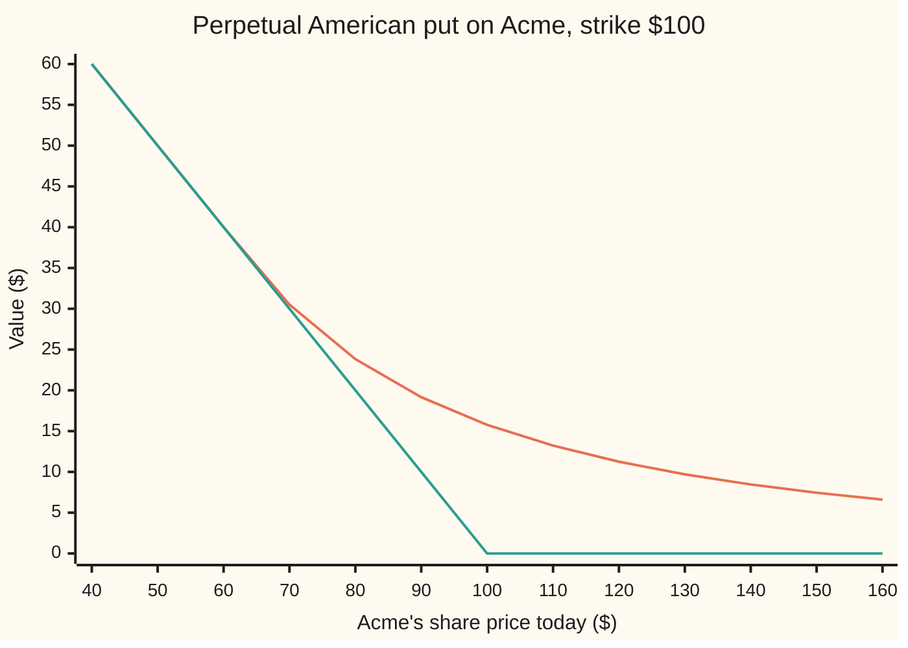
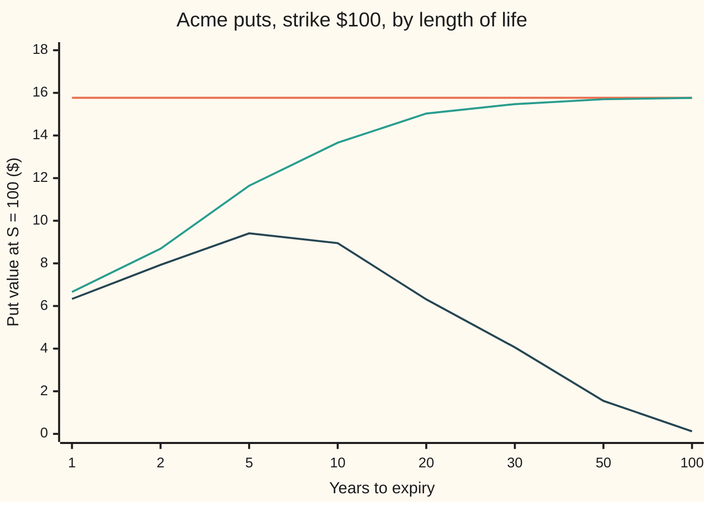

# The perpetual American put: the one American option with an exact answer, and the boundary it hands you

[Syllabus](../../../SYLLABUS.md) → [Financial mathematics](../README.md) → [American and Bermudan exercise](../README.md#s15) → The perpetual American put

---

## General Overview

Acme shares trade at $100. A put option gives its holder the right, not the duty, to sell one Acme share for a fixed $100, the strike. An American put allows that sale on any day up to expiry, not only on the last one ([American options](01-american-options-and-early-exercise.md)). The market is the house one: cash earns 5% a year, Acme pays a 2% dividend yield, and its volatility (how widely its price swings in a year) is 20%.

Now remove the expiry date. The holder may sell at $100 on any day, for ever. That contract is the **perpetual American put**. It sounds exotic, and few trade under that name. It matters because it is the only American option whose price has an exact formula. A one-year American put needs a tree or a grid; this one needs a quadratic equation.

The reason is the clock. A put with no expiry looks the same today as next year: either way, there is for ever left. So its price depends on the share price alone, never on the date. The pricing equation loses its time term and becomes one about a single curve. That curve is a power of the share price. Two conditions at the point where waiting stops pin down everything else.

The answer has two parts. The first is a trigger price: sell the moment Acme first falls to **$64.92**. The second is the price today: **$15.77**, against $6.33 for a one-year European put and $6.66 for a one-year American one.

**With no expiry the put's value depends on the share price alone, so the pricing equation shrinks to one whose solutions are powers of the price; matching the payoff's height and slope where exercise begins gives the trigger $64.92 and the price $15.77.**

**What kind of fact this is:** a theorem inside a model. The share is taken to follow geometric Brownian motion, which is an assumption, not a law; inside that model, the boundary and price below are proved on this card in Why it works.

### The picture: what the put is worth, and what exercising pays



The upper line is the perpetual put's value. The lower line is the payoff, $100 minus the share price, or zero: what exercising this second pays, and the payoff diagram of the contract. Left of $64.92 the two lines are one line: the holder has already exercised. Right of it the value curve peels away without a kink, rides above the payoff, and fades towards zero as the share climbs, since a sale at $100 matters less the further Acme sits above it.

---

## The formula

For a share price $S$ above the trigger $S^*$:

$$P(S) = (K - S^*)\left(\frac{S}{S^*}\right)^{\lambda}, \qquad S^* = \frac{K\lambda}{\lambda - 1},$$

and for $S$ at or below the trigger, $P(S) = K - S$: exercise now. The power $\lambda$ is the negative root of the quadratic

$$\tfrac12\sigma^2\lambda^2 + \left(r - q - \tfrac12\sigma^2\right)\lambda - r = 0 .$$

**Read it aloud:** the put is worth the cash it will pay at the trigger, times today's value of one dollar collected on the first day the share falls that far; below the trigger it is worth its payoff.

The quadratic's other root, $\mu$, is positive. It belongs to a solution that grows with the share price, which no put can do, so it is thrown away.

| Symbol | Plain meaning | In our example | Push it up and the answer… |
| --- | --- | --- | --- |
| $S$, $S_t$ | Acme's share price today, and at a later time t | $100 today | the put falls, along the curve above |
| $K$ | the strike: what the holder may sell for | $100 | the trigger rises in proportion; the put rises faster, as $K^{1-\lambda}$ |
| $r$ | the riskless rate, continuously compounded | 5% | the trigger rises and the put falls: waiting for cash costs more |
| $q$ | the dividend yield Acme pays out | 2% | the trigger falls and the put rises: the share sinks by what it pays out |
| $\sigma$ | volatility, the yearly spread of Acme's log-returns; say "sigma" | 20% | the trigger falls and the put rises: waiting is worth more |
| $P$ | the perpetual put's price, a function of $S$ | $15.77 at $S$ = 100 | — |
| $S^*$ | the exercise boundary, or trigger: sell the first time the share reaches it | $64.92 | — |
| $\lambda$ | the negative root of the quadratic; say "lambda" | −1.850781 | — |
| $\mu$ | the positive root, discarded; say "mu" | 1.350781 | — |
| $A$, $B$ | the constants in front of the two power solutions | $B$ = 0 | — |
| $L$ | a trial trigger: any level below the strike | $80 in the what-breaks table | — |
| $\Delta$, $\Gamma$ | delta, the slope of $P$ against $S$; gamma, the slope's own slope | −0.291856 and 0.008320 | — |

Delta falls straight out of the power: $\Delta = \lambda P / S$, negative because $\lambda$ is. Gamma is $\lambda(\lambda - 1)P/S^2$.

### When it holds

- **The share follows geometric Brownian motion with constant volatility** ([Geometric Brownian motion](../../11-Stochastic%20processes%20and%20calculus/05-Brownian%20Motion/07-geometric-brownian-motion.md)). If volatility moves, both the trigger and the price move with it: at 30% volatility the trigger is $47.38 and the put $26.85.
- **Constant rate and dividend yield.** Over the decades a perpetual contract spans, neither is constant. The formula prices the contract as if today's rates lasted for ever, which is its biggest weakness in practice.
- **The rate is positive.** Then the quadratic's two roots have product $-2r/\sigma^2$, which is negative, so exactly one is negative and the formula exists and is unique. At a zero rate the negative root shrinks to zero, the trigger falls to zero, and the put is worth the full strike: waiting costs nothing, so nobody exercises.
- **No expiry, ever.** A finite-life American put is always worth less: a 30-year one is $15.47 on the tree below, not $15.77.
- **The holder exercises at the best moment.** A holder who sells at another level gets another, lower price; the what-breaks table below prices one such holder.

---

## Why it works

### Step 0: without a clock, the price is a curve, not a surface

An ordinary American put's price depends on two things, the share price and the time left. Its exercise boundary moves as expiry nears, and that moving edge is why no exact formula exists. A perpetual put has for ever left on every date. Tomorrow's contract is the same contract as today's. So its price depends on $S$ alone, and the exercise boundary is a single number $S^*$, not a moving curve.

### Step 1: the pricing equation loses its time term

Every derivative on a share in this model obeys the Black–Scholes equation ([The Black-Scholes equation](../08-The%20Black-Scholes%20call%20and%20put/07-black-scholes-equation.md)) wherever the holder is still waiting. Written with $\partial P/\partial t$ for the change in price as the clock runs, $P'$ for the slope against $S$ and $P''$ for the slope's slope, it reads

$$\frac{\partial P}{\partial t} + \tfrac12\sigma^2S^2P'' + (r - q)SP' - rP = 0 .$$

Here the price does not change with the date, so the first term is zero. What is left is an ordinary differential equation in $S$ alone, holding above the trigger:

$$\tfrac12\sigma^2S^2P'' + (r - q)SP' - rP = 0 .$$

In words: the drift of the hedged position, from curvature and from the share's growth net of dividends, must pay exactly the riskless rate on the put's value. Theta, the time decay, is zero; the check confirms it by putting the card's delta and gamma back into the equation.

### Step 2: try a power of the share price

Every term has the same shape: $S^2$ with the second slope, $S$ with the first, a constant with $P$. A power of $S$ keeps that shape. Try $P = S^{\lambda}$. Its slope is $\lambda S^{\lambda-1}$ and its second slope is $\lambda(\lambda-1)S^{\lambda-2}$. Substitute, and every term carries the same factor $S^{\lambda}$, which cancels:

$$\tfrac12\sigma^2\lambda(\lambda - 1) + (r - q)\lambda - r = 0 .$$

Multiply out and this is the quadratic in The formula. Guessing a trial form and turning a differential equation into a polynomial is the move of [The characteristic equation](../../08-Differential%20equations%20and%20dynamics/03-Oscillators%20-%20Second-Order%20Linear%20Equations/02-the-characteristic-equation.md); there the trial is an exponential in time, here a power of the price. The [The quadratic formula](../../03-Algebra/02-Polynomials/03-quadratic-formula.md) gives the two roots, $\lambda$ = −1.850781 and $\mu$ = 1.350781.

### Step 3: throw away the root that grows

Any mix of the two powers solves the equation, so the general solution is $P = AS^{\lambda} + BS^{\mu}$. As the share climbs without limit, the put's worth must shrink to zero: the right to sell at $100 is useless for a share at $10,000. The positive power grows without limit, so its constant must be zero: $B$ = 0. That leaves $P = AS^{\lambda}$, a curve that falls towards zero as $S$ grows, as the picture above shows.

### Step 4: two conditions at the trigger fix $A$ and $S^*$

Two unknowns remain, $A$ and $S^*$. Two conditions hold where waiting meets exercising.

- **Value matching.** At the trigger the holder exercises, so the put is worth its payoff: $AS^{*\lambda} = K - S^*$.
- **Smooth pasting.** The slopes match too. The payoff $K - S$ has slope −1, so $\lambda AS^{*\lambda - 1} = -1$.

Divide the second by the first. $A$ cancels, leaving $\lambda / S^* = -1/(K - S^*)$, so $\lambda(K - S^*) = -S^*$, and

$$S^* = \frac{K\lambda}{\lambda - 1} .$$

Then $A = (K - S^*)S^{*-\lambda}$, which gives the formula. Why the slopes must match is the subject of [The exercise boundary and smooth pasting](04-exercise-boundary-and-smooth-pasting.md). This card shows it a second way in Step 5: it is the condition for choosing the best trigger.

### Step 5: the same trigger, found by picking the best one

Forget smooth pasting. Suppose the holder picks a trigger $L$ below the strike and sells the first time Acme touches it. That pays $K - L$ at an unknown future date. Today's value of one dollar paid on that date is $(S/L)^{\lambda}$: the folded proof below shows why. So that strategy is worth

$$(K - L)\left(\frac{S}{L}\right)^{\lambda} .$$

A trigger close to the strike gets paid soon but little. A trigger far below pays a lot but late, and often never. Somewhere between lies the best $L$. Set the slope of the logarithm of that value against $L$ to zero: $-1/(K - L) - \lambda/L = 0$. That is the Step 4 equation again, so the best trigger is $S^*$. **Smooth pasting is the first-order condition for choosing the trigger.** The check finds the best trigger by a golden-section search, a hunt that narrows an interval by a fixed ratio each time, and lands on $64.921894$ without being told the smooth-pasting condition.

<details>
<summary>Detailed proof: why a dollar at the trigger is worth $(S/L)^{\lambda}$ today, and why no other strategy beats $S^*$</summary>

**The discount.** Let $S_t$ be the share price at a later time t in the risk-neutral world ([The fundamental theorems](../05-Black-Scholes%20from%20the%20Ground%20Up/02-risk-neutral-measure-and-the-fundamental-theorems.md)), where it grows at $r - q$ on average. By Itô's lemma, the process $e^{-rt}S_t^{\lambda}$ has drift $e^{-rt}S_t^{\lambda}\left[\tfrac12\sigma^2\lambda(\lambda - 1) + (r - q)\lambda - r\right]$, which is zero exactly because $\lambda$ solves the quadratic. A process with no drift is a martingale: its expected future value is its value today. Stop it at the first time the share touches $L$. Before then $S_t$ stays above $L$, and since $\lambda$ is negative, $S_t^{\lambda}$ stays below $L^{\lambda}$, so the process is bounded and optional stopping applies: a bounded martingale stopped at a random time keeps its expected value. On paths that never touch $L$ the factor $e^{-rt}$ drives it to zero. So $S^{\lambda}$ equals $L^{\lambda}$ times the expected discount factor at the hitting time, which is therefore $(S/L)^{\lambda}$.

**No strategy beats the trigger.** Call $P$ the formula's value. Three facts hold. First, $P \ge K - S$ everywhere: equal below $S^*$, and above it $P$ is convex (it bends upward) with slope −1 at $S^*$, so it stays on or above the payoff's straight line. Second, above $S^*$ the Black–Scholes operator applied to $P$ is zero by Step 1. Third, below $S^*$, where $P = K - S$, the operator gives $qS - rK$, negative there: holding the share and the put instead of exercising earns the dividend $q\,S$ but forgoes the interest $r\,K$ on the strike, and at the trigger that shortfall is $3.70 a year. With smooth pasting, Itô's lemma applies across $S^*$ (the second slope jumps, but the first does not), so $e^{-rt}P(S_t)$ never drifts upward. For any exercise time the holder chooses, the expected discounted payoff is at most the expected discounted $P$, which is at most $P$ today. The trigger strategy attains $P$. So $P$ is the price.

</details>

A third road needs neither the power guess nor the optimisation. Start at a trial trigger with the payoff's height and slope, integrate the time-free equation outward step by step (the check uses the fourth-order Runge–Kutta rule), and see whether the solution dies away at large prices or blows up. Only one starting point gives a solution that dies away. The check hunts for it by halving an interval and finds $64.921894$ again, with $15.769332$ at $S$ = 100.

---

## Worked numbers, by hand

House market: $S = K = 100$, $r$ = 5%, $q$ = 2%, $\sigma$ = 20%. Write the quadratic as $a\lambda^2 + b\lambda + c = 0$, the letters of the [The quadratic formula](../../03-Algebra/02-Polynomials/03-quadratic-formula.md) card: $a = \tfrac12\sigma^2$, $b = r - q - \tfrac12\sigma^2$, $c = -r$.

| Step | Arithmetic | Value |
| --- | --- | --- |
| $a = \tfrac12\sigma^2$ | 0.5 × 0.2 × 0.2 | 0.02 |
| $b = r - q - \tfrac12\sigma^2$ | 0.05 − 0.02 − 0.02 | 0.01 |
| the quadratic | 0.02 λ^2 + 0.01 λ − 0.05 = 0 | — |
| discriminant, $b^2 - 4ac$ | 0.0001 + 4 × 0.02 × 0.05 | 0.0041 |
| its square root | | 0.064031 |
| $\lambda$, the negative root | (−0.01 − 0.064031) / 0.04 | −1.850781 |
| $\mu$, the positive root, discarded | (−0.01 + 0.064031) / 0.04 | 1.350781 |
| trigger $S^* = K\lambda/(\lambda - 1)$ | 100 × 1.850781 / 2.850781 | $64.92 |
| payoff at the trigger, $K - S^*$ | 100 − 64.921894 | $35.08 |
| $S/S^*$ | 100 / 64.921894 | 1.540312 |
| today's value of $1 paid at the trigger | 1.540312 raised to −1.850781 | 0.449549 |
| **the put** | 35.078106 × 0.449549 | **$15.77** |
| delta, $\lambda P/S$ | −1.850781 × 15.769332 / 100 | −0.291856 |

The holder should keep the put until Acme first falls to $64.92, then sell at $100 and collect $35.08. That collection might come in a year, in thirty, or never; weighing all those dates, a dollar at the trigger is worth 45 cents today. A buyer pays $15.77 for that prospect, and sees the put gain about 29 cents for each dollar Acme falls.

### The Greeks

| Greek | What it measures | Value | Where it comes from |
| --- | --- | --- | --- |
| Delta | change in $P$ per $1 rise in Acme | −0.291856 | $\lambda P/S$, confirmed by a bump of $S$ |
| Gamma | change in delta per $1 rise | 0.008320 | $\lambda(\lambda - 1)P/S^2$, confirmed by a bump |
| Theta | change per year with nothing else moving | 0.000000 | zero by Step 1; the check puts delta and gamma back into the equation |
| Vega | change per point of volatility | 1.122637 | bump of $\sigma$ in the formula |
| Rho | change per point of the rate | −3.032881 | bump of $r$ in the formula |

Theta is the striking entry. A finite-life option melts as its expiry nears. This one has no expiry to near.

### How long-dated trees climb to the formula

A tree prices a finite-life American put by stepping back from expiry and, at every node, taking the larger of exercising and waiting ([American options](01-american-options-and-early-exercise.md)). Lengthen the life and the American put should rise towards $15.77. The European put, which may only be used at expiry, does something else.



The flat top line is the perpetual formula, $15.77. The middle line is the American put by tree: $6.66 at one year, $15.47 at thirty, $15.76 at a hundred. The bottom line is the European put: it is highest of these at five years, $9.41, then decays to 12 cents at a hundred years, because a sale at $100 in the far future is worth little today, and early exercise is exactly what the European holder lacks.

A 30-year tree still gives $15.47 against the formula's $15.77. That gap is real, not a flaw in the tree: 30 years is not for ever, and the thirtieth year still bends the exercise boundary. At 100 years the tree is within a cent.

### What breaks if you drop a piece

| Mistake | Comes out at | What went wrong |
| --- | --- | --- |
| Using the positive root $\mu$ | a trigger of $385.08, above the strike | That solution grows with the price; exercising at $385.08 pays nothing |
| Forgetting the 2% dividend | trigger $71.43, put $12.32 | That is the no-dividend put: without the payout the share drifts up faster, so the put is cheaper and sold sooner |
| Value matching alone: exercising at $L$ = $80 | $13.23 | A legal strategy, but not the best: it sells too early |
| Pricing a 30-year European put instead | $4.06 | No early exercise, and a sale 30 years away is heavily discounted |

The code prints every one of these.

---

## Code, from first principles, and it actually runs

Nothing is imported that knows the answer. The boundary is reached by three independent roads: the quadratic formula with value matching and smooth pasting; a golden-section search for the best trigger, which never uses smooth pasting; and shooting, which integrates the time-free equation by Runge–Kutta from trial triggers and halves the interval until the solution dies away at a share price of a million, with no power ever guessed. A fourth road prices finite-life American puts on a Cox–Ross–Rubinstein tree, up to 100 years. The normal curve's area, needed for the European put, is built by Simpson's rule. Four asserts compare the roads; breaking the root choice, the slope at the trigger, the tree's exercise test or the dividend in the quadratic makes the run fail.

### Python

```python
# Perpetual American put -- the check behind the card.  Standard library only.
# Every number on the card is printed here.  Nothing imported knows the answer:
# the root finders, the ODE integrator, the tree and the normal CDF are all
# written out below.  House market: S = K = 100, r = 5%, q = 2%, sigma = 20%.
from math import exp, log, sqrt, pi

S, K, r, q, sig = 100.0, 100.0, 0.05, 0.02, 0.20

def roots(r, q, sig):                         # road 1: the quadratic formula
    a, b, c = 0.5 * sig * sig, r - q - 0.5 * sig * sig, -r
    disc = sqrt(b * b - 4 * a * c)
    return (-b - disc) / (2 * a), (-b + disc) / (2 * a)

def perp(s, K, r, q, sig):                    # the closed form: boundary and value
    lam = roots(r, q, sig)[0]
    b = K * lam / (lam - 1)
    return (b, K - s if s <= b else (K - b) * (s / b) ** lam)

def golden_max(f, lo, hi, n=200):             # road 2: best barrier, no smooth pasting
    g = (sqrt(5) - 1) / 2
    for _ in range(n):
        m1, m2 = hi - g * (hi - lo), lo + g * (hi - lo)
        if f(m1) < f(m2): lo = m1
        else: hi = m2
    return 0.5 * (lo + hi)

def shoot(b, x_end, n=4000):                  # road 3: RK4 on the time-free equation in x = ln s
    a, nu = 0.5 * sig * sig, r - q - 0.5 * sig * sig
    f = lambda u, v: (v, (r * u - nu * v) / a)          # u = price, v = s * slope
    x, u, v = log(b), K - b, -b                         # value matching and smooth pasting
    h = (x_end - x) / n
    for _ in range(n):
        k1 = f(u, v); k2 = f(u + h / 2 * k1[0], v + h / 2 * k1[1])
        k3 = f(u + h / 2 * k2[0], v + h / 2 * k2[1]); k4 = f(u + h * k3[0], v + h * k3[1])
        u += h / 6 * (k1[0] + 2 * k2[0] + 2 * k3[0] + k4[0])
        v += h / 6 * (k1[1] + 2 * k2[1] + 2 * k3[1] + k4[1])
    return u

def bisect(f, lo, hi, n=200):
    for _ in range(n):
        mid = 0.5 * (lo + hi)
        if (f(lo) > 0) == (f(mid) > 0): lo = mid
        else: hi = mid
    return 0.5 * (lo + hi)

def tree(T, n, american=True):                # road 4: Cox-Ross-Rubinstein tree, finite life T
    dt = T / n
    u = exp(sig * sqrt(dt)); d = 1 / u
    p = (exp((r - q) * dt) - d) / (u - d); df = exp(-r * dt)
    v = [max(K - S * u ** (2 * j - n), 0.0) for j in range(n + 1)]
    for m in range(n - 1, -1, -1):
        s, nv = S * u ** (-m), []
        for j in range(m + 1):
            c = df * (p * v[j + 1] + (1 - p) * v[j])
            if american and K - s > c: c = K - s
            nv.append(c); s *= u * u
        v = nv
    return v[0]

def ncdf(x, n=2000):                          # bell-curve area left of x, by Simpson's rule
    h = x / n
    ph = lambda z: exp(-0.5 * z * z) / sqrt(2 * pi)
    tot = ph(0.0) + ph(x) + sum((4 if i % 2 else 2) * ph(i * h) for i in range(1, n))
    return 0.5 + tot * h / 3

def euro_put(T):
    d1 = (log(S / K) + (r - q + 0.5 * sig * sig) * T) / (sig * sqrt(T)); d2 = d1 - sig * sqrt(T)
    return K * exp(-r * T) * ncdf(-d2) - S * exp(-q * T) * ncdf(-d1)

lam, mu = roots(r, q, sig)
bstar, P = perp(S, K, r, q, sig)
b_gold = golden_max(lambda b: (K - b) * (S / b) ** lam, 1.0, K)
b_shoot = bisect(lambda b: shoot(b, log(1e6)), 40.0, 90.0)
P_shoot = shoot(b_shoot, log(S))
steps = lambda T: max(1000, 50 * T)
mats = [1, 2, 5, 10, 20, 30, 50, 100]
amer = [tree(T, steps(T)) for T in mats]
euro = [euro_put(T) for T in mats]
h = 0.01
dP = lambda s: perp(s, K, r, q, sig)[1]
delta, gamma = lam * P / S, lam * (lam - 1) * P / S ** 2
delta_b = (dP(S + h) - dP(S - h)) / (2 * h)
gamma_b = (dP(S + h) - 2 * P + dP(S - h)) / h ** 2
theta = r * P - 0.5 * sig ** 2 * S ** 2 * gamma_b - (r - q) * S * delta_b   # what the clock takes: zero
assert abs(b_shoot - bstar) < 1e-6 and abs(b_gold - bstar) < 1e-6   # two roads to the boundary
assert abs(P_shoot - P) < 1e-6                                     # the ODE, no power guessed
assert 0 < P - amer[5] < 0.5 and abs(amer[7] - P) < 0.01           # tree rises to the formula
assert abs(delta_b - delta) < 1e-6 and abs(theta) < 1e-4           # slope, and no time decay
vega = (perp(S, K, r, q, sig + 1e-4)[1] - perp(S, K, r, q, sig - 1e-4)[1]) / 2e-4
rho = (perp(S, K, r + 1e-4, q, sig)[1] - perp(S, K, r - 1e-4, q, sig)[1]) / 2e-4
wrong_mu_b = K * mu / (mu - 1)
wrong_q0 = perp(S, K, r, 0.0, sig)
wrong_b80 = (K - 80.0) * (S / 80.0) ** lam

a2, b1 = 0.5 * sig * sig, r - q - 0.5 * sig * sig
rows = [("sigma^2 / 2", a2), ("r - q - sigma^2 / 2", b1),
        ("discriminant b^2 - 4ac", b1 * b1 + 4 * a2 * r), ("  its square root", sqrt(b1 * b1 + 4 * a2 * r)),
        ("lambda, the negative root", lam), ("mu, the positive root", mu),
        ("boundary S* = K lambda / (lambda - 1)", bstar), ("payoff at the boundary K - S*", K - bstar),
        ("S / S*", S / bstar), ("(S / S*)^lambda", (S / bstar) ** lam),
        ("1 formula, value at S = 100", P), ("2 best barrier, golden section", b_gold),
        ("3 boundary by shooting the ODE", b_shoot), ("3 value by shooting the ODE", P_shoot),
        ("4 tree, 30 years, 1500 steps", amer[5]), ("4 tree, 100 years, 5000 steps", amer[7]),
        ("delta = lambda P / S", delta), ("  delta by bump", delta_b),
        ("gamma = lambda (lambda - 1) P / S^2", gamma), ("  gamma by bump", gamma_b),
        ("theta from the equation, size", abs(theta)), ("vega, per point of sigma", vega / 100), ("rho, per point of r", rho / 100),
        ("r K - q S*, waiting cost at S*", r * K - q * bstar),
        ("wrong: positive root, boundary", wrong_mu_b), ("wrong: forgot q, boundary", wrong_q0[0]),
        ("wrong: forgot q, value", wrong_q0[1]), ("wrong: exercise at 80, value", wrong_b80),
        ("wrong: European 30-year put", euro[5]),
        ("try: sigma = 0.30, boundary", perp(S, K, r, q, 0.30)[0]), ("try: sigma = 0.30, value", perp(S, K, r, q, 0.30)[1]),
        ("try: r = 0.08, boundary", perp(S, K, 0.08, q, sig)[0]), ("try: r = 0.08, value", perp(S, K, 0.08, q, sig)[1]),
        ("try: q = 0, value at 200", perp(200.0, K, r, 0.0, sig)[1])]
for name, v in rows:
    print(f"{name:<38} {v:>12.6f}")
print()
print("maturity (years)  " + " ".join(f"{T:>7d}" for T in mats))
print("American, tree    " + " ".join(f"{v:>7.2f}" for v in amer))
print("European, formula " + " ".join(f"{v:>7.2f}" for v in euro))
spots = [40.0 + 10.0 * i for i in range(13)]
print("chart, share price" + " ".join(f"{s:>7.0f}" for s in spots))
print("chart, perpetual  " + " ".join(f"{dP(s):>7.2f}" for s in spots))
print("chart, exercise   " + " ".join(f"{max(K - s, 0.0):>7.2f}" for s in spots))

print("ALL CHECKS PASS")
```

**Ran 2026-09-24 on macOS, Python 3.14.6, standard library only. All checks passed. Output, pasted from the run:**

```
sigma^2 / 2                                0.020000
r - q - sigma^2 / 2                        0.010000
discriminant b^2 - 4ac                     0.004100
  its square root                          0.064031
lambda, the negative root                 -1.850781
mu, the positive root                      1.350781
boundary S* = K lambda / (lambda - 1)     64.921894
payoff at the boundary K - S*             35.078106
S / S*                                     1.540312
(S / S*)^lambda                            0.449549
1 formula, value at S = 100               15.769332
2 best barrier, golden section            64.921894
3 boundary by shooting the ODE            64.921894
3 value by shooting the ODE               15.769332
4 tree, 30 years, 1500 steps              15.465156
4 tree, 100 years, 5000 steps             15.761671
delta = lambda P / S                      -0.291856
  delta by bump                           -0.291856
gamma = lambda (lambda - 1) P / S^2        0.008320
  gamma by bump                            0.008320
theta from the equation, size              0.000000
vega, per point of sigma                   1.122637
rho, per point of r                       -3.032881
r K - q S*, waiting cost at S*             3.701562
wrong: positive root, boundary           385.078106
wrong: forgot q, boundary                 71.428571
wrong: forgot q, value                    12.320033
wrong: exercise at 80, value              13.233380
wrong: European 30-year put                4.059144
try: sigma = 0.30, boundary               47.382841
try: sigma = 0.30, value                  26.854525
try: r = 0.08, boundary                   76.393202
try: r = 0.08, value                       9.876298
try: q = 0, value at 200                   2.177895

maturity (years)        1       2       5      10      20      30      50     100
American, tree       6.66    8.69   11.64   13.66   15.03   15.47   15.70   15.76
European, formula    6.33    7.93    9.41    8.95    6.31    4.06    1.55    0.12
chart, share price     40      50      60      70      80      90     100     110     120     130     140     150     160
chart, perpetual    60.00   50.00   40.00   30.51   23.83   19.16   15.77   13.22   11.25    9.70    8.46    7.45    6.61
chart, exercise     60.00   50.00   40.00   30.00   20.00   10.00    0.00    0.00    0.00    0.00    0.00    0.00    0.00
ALL CHECKS PASS
```

### Rust

Same roads, same labels, built with `rustc --edition 2021 -O`.

```rust
// Perpetual American put -- the same check as the Python, in Rust.  No crates.
// Every number on the card is printed here.  Nothing imported knows the answer:
// the root finders, the ODE integrator, the tree and the normal CDF are all
// written out below.  House market: S = K = 100, r = 5%, q = 2%, sigma = 20%.
use std::f64::consts::PI;

const S: f64 = 100.0;
const K: f64 = 100.0;
const R: f64 = 0.05;
const Q: f64 = 0.02;
const SIG: f64 = 0.20;

fn roots(r: f64, q: f64, sig: f64) -> (f64, f64) {          // road 1: the quadratic formula
    let (a, b, c) = (0.5 * sig * sig, r - q - 0.5 * sig * sig, -r);
    let disc = (b * b - 4.0 * a * c).sqrt();
    ((-b - disc) / (2.0 * a), (-b + disc) / (2.0 * a))
}

fn perp(s: f64, k: f64, r: f64, q: f64, sig: f64) -> (f64, f64) {   // boundary and value
    let lam = roots(r, q, sig).0;
    let b = k * lam / (lam - 1.0);
    (b, if s <= b { k - s } else { (k - b) * (s / b).powf(lam) })
}

fn golden_max<F: Fn(f64) -> f64>(f: F, mut lo: f64, mut hi: f64) -> f64 {  // road 2: best barrier
    let g = (5.0_f64.sqrt() - 1.0) / 2.0;
    for _ in 0..200 {
        let (m1, m2) = (hi - g * (hi - lo), lo + g * (hi - lo));
        if f(m1) < f(m2) { lo = m1 } else { hi = m2 }
    }
    0.5 * (lo + hi)
}

fn shoot(b: f64, x_end: f64) -> f64 {        // road 3: RK4 on the time-free equation in x = ln s
    let (a, nu) = (0.5 * SIG * SIG, R - Q - 0.5 * SIG * SIG);
    let f = |u: f64, v: f64| (v, (R * u - nu * v) / a);        // u = price, v = s * slope
    let (mut u, mut v) = (K - b, -b);                           // value matching and smooth pasting
    let n = 4000;
    let h = (x_end - b.ln()) / n as f64;
    for _ in 0..n {
        let k1 = f(u, v);
        let k2 = f(u + h / 2.0 * k1.0, v + h / 2.0 * k1.1);
        let k3 = f(u + h / 2.0 * k2.0, v + h / 2.0 * k2.1);
        let k4 = f(u + h * k3.0, v + h * k3.1);
        u += h / 6.0 * (k1.0 + 2.0 * k2.0 + 2.0 * k3.0 + k4.0);
        v += h / 6.0 * (k1.1 + 2.0 * k2.1 + 2.0 * k3.1 + k4.1);
    }
    u
}

fn bisect<F: Fn(f64) -> f64>(f: F, mut lo: f64, mut hi: f64) -> f64 {
    for _ in 0..200 {
        let mid = 0.5 * (lo + hi);
        if (f(lo) > 0.0) == (f(mid) > 0.0) { lo = mid } else { hi = mid }
    }
    0.5 * (lo + hi)
}

fn tree(t: f64, n: usize) -> f64 {           // road 4: Cox-Ross-Rubinstein tree, finite life t
    let dt = t / n as f64;
    let u = (SIG * dt.sqrt()).exp();
    let d = 1.0 / u;
    let p = (((R - Q) * dt).exp() - d) / (u - d);
    let df = (-R * dt).exp();
    let mut v: Vec<f64> = (0..=n).map(|j| (K - S * u.powf(2.0 * j as f64 - n as f64)).max(0.0)).collect();
    for m in (0..n).rev() {
        let mut s = S * u.powf(-(m as f64));
        let mut nv = Vec::with_capacity(m + 1);
        for j in 0..=m {
            let mut c = df * (p * v[j + 1] + (1.0 - p) * v[j]);
            if K - s > c { c = K - s }
            nv.push(c);
            s *= u * u;
        }
        v = nv;
    }
    v[0]
}

fn ncdf(x: f64) -> f64 {                     // bell-curve area left of x, by Simpson's rule
    let n = 2000;
    let h = x / n as f64;
    let ph = |z: f64| (-0.5 * z * z).exp() / (2.0 * PI).sqrt();
    let mut tot = ph(0.0) + ph(x);
    for i in 1..n { tot += if i % 2 == 1 { 4.0 } else { 2.0 } * ph(i as f64 * h) }
    0.5 + tot * h / 3.0
}

fn euro_put(t: f64) -> f64 {
    let d1 = ((S / K).ln() + (R - Q + 0.5 * SIG * SIG) * t) / (SIG * t.sqrt());
    let d2 = d1 - SIG * t.sqrt();
    K * (-R * t).exp() * ncdf(-d2) - S * (-Q * t).exp() * ncdf(-d1)
}

fn main() {
    let (lam, mu) = roots(R, Q, SIG);
    let (bstar, p) = perp(S, K, R, Q, SIG);
    let b_gold = golden_max(|b| (K - b) * (S / b).powf(lam), 1.0, K);
    let b_shoot = bisect(|b| shoot(b, 1e6_f64.ln()), 40.0, 90.0);
    let p_shoot = shoot(b_shoot, S.ln());
    let mats = [1usize, 2, 5, 10, 20, 30, 50, 100];
    let amer: Vec<f64> = mats.iter().map(|&t| tree(t as f64, 1000.max(50 * t))).collect();
    let euro: Vec<f64> = mats.iter().map(|&t| euro_put(t as f64)).collect();
    let h = 0.01;
    let dp = |s: f64| perp(s, K, R, Q, SIG).1;
    let (delta, gamma) = (lam * p / S, lam * (lam - 1.0) * p / (S * S));
    let delta_b = (dp(S + h) - dp(S - h)) / (2.0 * h);
    let gamma_b = (dp(S + h) - 2.0 * p + dp(S - h)) / (h * h);
    let theta = R * p - 0.5 * SIG * SIG * S * S * gamma_b - (R - Q) * S * delta_b;  // zero
    assert!((b_shoot - bstar).abs() < 1e-6 && (b_gold - bstar).abs() < 1e-6);   // two roads to the boundary
    assert!((p_shoot - p).abs() < 1e-6);                                         // the ODE, no power guessed
    assert!(p - amer[5] > 0.0 && p - amer[5] < 0.5 && (amer[7] - p).abs() < 0.01); // tree rises to the formula
    assert!((delta_b - delta).abs() < 1e-6 && theta.abs() < 1e-4);              // slope, and no time decay
    let vega = (perp(S, K, R, Q, SIG + 1e-4).1 - perp(S, K, R, Q, SIG - 1e-4).1) / 2e-4;
    let rho = (perp(S, K, R + 1e-4, Q, SIG).1 - perp(S, K, R - 1e-4, Q, SIG).1) / 2e-4;
    let wrong_q0 = perp(S, K, R, 0.0, SIG);
    let (a2, b1) = (0.5 * SIG * SIG, R - Q - 0.5 * SIG * SIG);
    let rows: Vec<(&str, f64)> = vec![
        ("sigma^2 / 2", a2), ("r - q - sigma^2 / 2", b1),
        ("discriminant b^2 - 4ac", b1 * b1 + 4.0 * a2 * R), ("  its square root", (b1 * b1 + 4.0 * a2 * R).sqrt()),
        ("lambda, the negative root", lam), ("mu, the positive root", mu),
        ("boundary S* = K lambda / (lambda - 1)", bstar), ("payoff at the boundary K - S*", K - bstar),
        ("S / S*", S / bstar), ("(S / S*)^lambda", (S / bstar).powf(lam)),
        ("1 formula, value at S = 100", p), ("2 best barrier, golden section", b_gold),
        ("3 boundary by shooting the ODE", b_shoot), ("3 value by shooting the ODE", p_shoot),
        ("4 tree, 30 years, 1500 steps", amer[5]), ("4 tree, 100 years, 5000 steps", amer[7]),
        ("delta = lambda P / S", delta), ("  delta by bump", delta_b),
        ("gamma = lambda (lambda - 1) P / S^2", gamma), ("  gamma by bump", gamma_b),
        ("theta from the equation, size", theta.abs()), ("vega, per point of sigma", vega / 100.0), ("rho, per point of r", rho / 100.0),
        ("r K - q S*, waiting cost at S*", R * K - Q * bstar),
        ("wrong: positive root, boundary", K * mu / (mu - 1.0)), ("wrong: forgot q, boundary", wrong_q0.0),
        ("wrong: forgot q, value", wrong_q0.1), ("wrong: exercise at 80, value", (K - 80.0) * (S / 80.0).powf(lam)),
        ("wrong: European 30-year put", euro[5]),
        ("try: sigma = 0.30, boundary", perp(S, K, R, Q, 0.30).0), ("try: sigma = 0.30, value", perp(S, K, R, Q, 0.30).1),
        ("try: r = 0.08, boundary", perp(S, K, 0.08, Q, SIG).0), ("try: r = 0.08, value", perp(S, K, 0.08, Q, SIG).1),
        ("try: q = 0, value at 200", perp(200.0, K, R, 0.0, SIG).1),
    ];
    for (name, v) in &rows { println!("{:<38} {:>12.6}", name, v) }
    println!();
    let row = |label: &str, vals: Vec<String>| println!("{}{}", label, vals.join(" "));
    row("maturity (years)  ", mats.iter().map(|t| format!("{:>7}", t)).collect());
    row("American, tree    ", amer.iter().map(|v| format!("{:>7.2}", v)).collect());
    row("European, formula ", euro.iter().map(|v| format!("{:>7.2}", v)).collect());
    let spots: Vec<f64> = (0..13).map(|i| 40.0 + 10.0 * i as f64).collect();
    row("chart, share price", spots.iter().map(|s| format!("{:>7.0}", s)).collect());
    row("chart, perpetual  ", spots.iter().map(|&s| format!("{:>7.2}", dp(s))).collect());
    row("chart, exercise   ", spots.iter().map(|&s| format!("{:>7.2}", (K - s).max(0.0))).collect());

    println!("ALL CHECKS PASS");
}
```

**Ran 2026-09-24 on macOS, rustc 1.98.1, no crates. All checks passed. Output, pasted from the run:**

```
sigma^2 / 2                                0.020000
r - q - sigma^2 / 2                        0.010000
discriminant b^2 - 4ac                     0.004100
  its square root                          0.064031
lambda, the negative root                 -1.850781
mu, the positive root                      1.350781
boundary S* = K lambda / (lambda - 1)     64.921894
payoff at the boundary K - S*             35.078106
S / S*                                     1.540312
(S / S*)^lambda                            0.449549
1 formula, value at S = 100               15.769332
2 best barrier, golden section            64.921894
3 boundary by shooting the ODE            64.921894
3 value by shooting the ODE               15.769332
4 tree, 30 years, 1500 steps              15.465156
4 tree, 100 years, 5000 steps             15.761671
delta = lambda P / S                      -0.291856
  delta by bump                           -0.291856
gamma = lambda (lambda - 1) P / S^2        0.008320
  gamma by bump                            0.008320
theta from the equation, size              0.000000
vega, per point of sigma                   1.122637
rho, per point of r                       -3.032881
r K - q S*, waiting cost at S*             3.701562
wrong: positive root, boundary           385.078106
wrong: forgot q, boundary                 71.428571
wrong: forgot q, value                    12.320033
wrong: exercise at 80, value              13.233380
wrong: European 30-year put                4.059144
try: sigma = 0.30, boundary               47.382841
try: sigma = 0.30, value                  26.854525
try: r = 0.08, boundary                   76.393202
try: r = 0.08, value                       9.876298
try: q = 0, value at 200                   2.177895

maturity (years)        1       2       5      10      20      30      50     100
American, tree       6.66    8.69   11.64   13.66   15.03   15.47   15.70   15.76
European, formula    6.33    7.93    9.41    8.95    6.31    4.06    1.55    0.12
chart, share price     40      50      60      70      80      90     100     110     120     130     140     150     160
chart, perpetual    60.00   50.00   40.00   30.51   23.83   19.16   15.77   13.22   11.25    9.70    8.46    7.45    6.61
chart, exercise     60.00   50.00   40.00   30.00   20.00   10.00    0.00    0.00    0.00    0.00    0.00    0.00    0.00
ALL CHECKS PASS
```

The two outputs match line for line. The shooting road and the golden-section road agree with the formula to six decimals; the trees fall short by the value of the years they lack.

> [!TIP]
> **Try changing**
> Guess the direction first. The rows starting `try:` hold the answers.
> - **More volatility.** Raise $\sigma$ from 20% to 30%. The trigger falls to $47.38 and the put rises to $26.85: a jumpier share makes waiting for a deeper fall worth more.
> - **Dearer money.** Raise $r$ from 5% to 8%. The trigger rises to $76.39 and the put falls to $9.88: the strike's interest, forgone while waiting, now costs more, so the holder sells sooner.
> - **No dividend, share at $200.** Set $q$ to zero and $S$ to 200. The put is worth $2.18, a long way above the trigger but never quite zero.
> - **Shoot too short.** In the bisection line, stop the integration at a share price of 1,000 instead of a million. The perpetual put is still worth something there, so the "dies away" test aims at the wrong target; the boundary misses by 0.6 cents and the first assert stops the run.

---

## The usual mistake

> [!warning]
> **Exercising as soon as the put is in the money.** At $90 the payoff is $10, but the put is worth $19.16. Selling at $90 throws away the difference: the chance that Acme falls further before the holder needs to act. Exercise pays off only once the share reaches $64.92, where the value curve meets the payoff line.
>
> - **Keeping the wrong root.** The quadratic has two roots. The positive one, 1.350781, gives a trigger of $385.08, above the strike. The put's price must fall as the share rises, which only the negative root delivers.
> - **Matching height but not slope.** Any trigger meets the payoff in height. Only one meets it in slope. Exercising at $80 is worth $13.23, not $15.77.
> - **Dropping the dividend.** With $q$ = 0 the trigger is $71.43 and the put $12.32. That is a correct price for a different share.
> - **Treating a long American put as perpetual.** A 30-year American put is $15.47, not $15.77. Thirty years is long, but its end still bends the boundary.

---

## Where you meet it in real life

- **The benchmark for American puts.** The perpetual put is the ceiling any finite American put on the same terms approaches from below, and a first test for a new tree or grid.
- **The engine of the fast approximations.** The power $S^{\lambda}$ with its boundary condition is the correction term in [Barone-Adesi-Whaley](06-barone-adesi-whaley-approximation.md), applied to finite lives.
- **Real options.** A company that may abandon a project and sell its assets at a fixed salvage value holds a perpetual put on the project's worth. The trigger is the point at which to walk away.
- **Credit and default.** In structural credit models, a firm's owners stop paying and default when the firm's value first falls to a level chosen to make their stake worth the most. That choice is this card's Step 5.
- **Sensitivities.** The delta and gamma above come from one power; the finite-life versions need numerical bumps: [American Greeks and implied volatility](07-american-greeks-and-implied-volatility.md).

> **Say it back**
> A put that never expires has the same future on every date, so its value depends on the share price alone. Dropping the time term leaves an equation whose solutions are powers of the price. The power must be the negative root of a quadratic, so the value dies away as the share rises. Matching the payoff's height and slope at the trigger gives $S^* = K\lambda/(\lambda - 1)$: for Acme, sell at $64.92, and the put is worth $15.77 at $100. Matching the slope is the same as choosing the best trigger.

---

## What this builds on

- [The exercise boundary and smooth pasting](04-exercise-boundary-and-smooth-pasting.md): why the value curve meets the payoff with the same slope; here both conditions are solved in closed form.
- [The characteristic equation](../../08-Differential%20equations%20and%20dynamics/03-Oscillators%20-%20Second-Order%20Linear%20Equations/02-the-characteristic-equation.md): the move of guessing a trial solution and reading off a polynomial.
- [The quadratic formula](../../03-Algebra/02-Polynomials/03-quadratic-formula.md): the two roots, and the sign rule that makes one of them negative.

## Where this goes next

- [Barone-Adesi-Whaley](06-barone-adesi-whaley-approximation.md): the same power solution bolted onto a European price to approximate a finite-life American put.

This card prices an option that never expires; how much of the answer survives when the clock is put back, and how to recover the rest cheaply, is what Barone-Adesi–Whaley settles.

---

## Sources

Verified 2026-09-24: every link below resolves to the publisher's page.

- Merton, Robert C. "Theory of Rational Option Pricing." *The Bell Journal of Economics and Management Science* 4, no. 1 (1973): 141–183. [doi:10.2307/3003143](https://doi.org/10.2307/3003143). Solves the perpetual American put in closed form, for a share without dividends.
- Gerber, Hans U., and Elias S. W. Shiu. "Martingale Approach to Pricing Perpetual American Options." *ASTIN Bulletin* 24, no. 2 (1994): 195–220. [doi:10.2143/AST.24.2.2005065](https://doi.org/10.2143/AST.24.2.2005065). The discount-at-the-trigger argument of the folded proof, and the best-trigger route of Step 5.
- Cox, John C., Stephen A. Ross, and Mark Rubinstein. "Option Pricing: A Simplified Approach." *Journal of Financial Economics* 7, no. 3 (1979): 229–263. [doi:10.1016/0304-405X(79)90015-1](https://doi.org/10.1016/0304-405X(79)90015-1). The tree used as the fourth road.
- Shreve, Steven E. *Stochastic Calculus for Finance II: Continuous-Time Models*. Springer, 2004. [Publisher page](https://link.springer.com/book/9780387401010). The perpetual American put worked through carefully, with the optimality proof.
