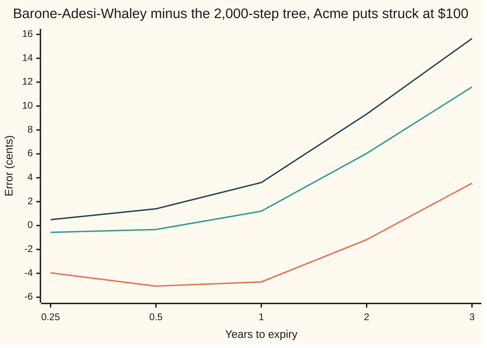
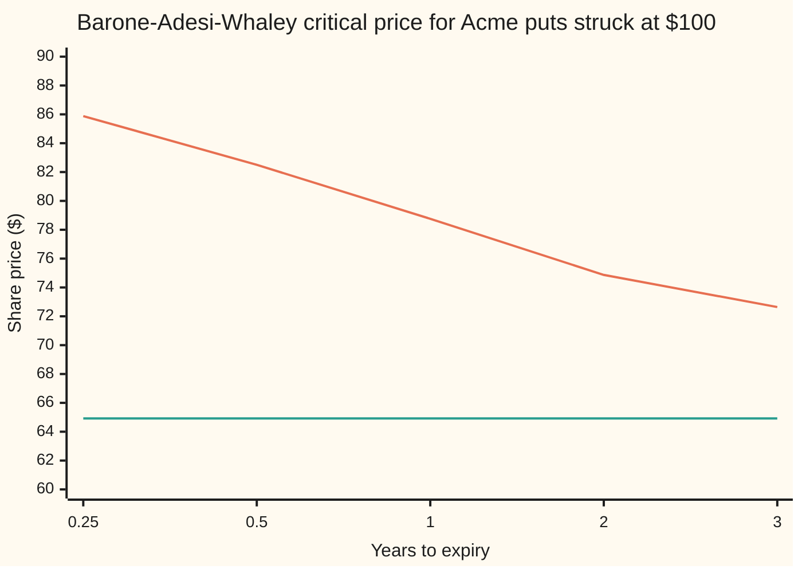

# Barone-Adesi-Whaley: an American price in a microsecond by bolting one lump onto the European price

Financial mathematics → American and Bermudan exercise → Quadratic approximation → Barone-Adesi-Whaley

---

## General Overview

Acme shares trade at $100. A one-year put lets its holder sell one share for $100. The riskless rate is 5 percent, Acme pays a 2 percent dividend yield, and its volatility is 20 percent. If the put can be used only on the last day (a European put), it is worth $6.33.

If it can be used on any day (an American put), it is worth more. A 2,000-step tree, which checks "use it now or keep it?" at each of its 2,001,000 nodes before expiry, says $6.66. The extra 33 cents is the **early-exercise premium**: the value of being allowed to stop waiting ([american-options-and-early-exercise](01-american-options-and-early-exercise.md)).

The tree is honest and slow. A desk repricing thousands of American options on every tick needs something faster. In 1987 Giovanni Barone-Adesi and Robert Whaley found it. Keep the European price, which has a formula. Add one lump for the premium, which also has a formula once one small term is thrown away. For Acme the lump is 34 cents and the American price comes out at $6.67, a little over one cent from the tree. The whole calculation is a quadratic equation, a handful of Newton steps and one power.

**An American price is the European price plus a premium; drop the one term in its equation that carries the clock's rate of change, and what is left is a power of the share price, sized so the price curve meets the exercise line tangentially at one critical share price.**

**What kind of fact this is:** an approximation, with its error stated: measured on this card against a tree, within about five cents out to one year and up to 16 cents at three years; no general bound is known.

### The picture: how far the shortcut is from the tree

Each line is one share price. Across are the put's lives, from three months to three years. Up is the formula's price minus the tree's price, in cents.



Orange: Acme at $90, in the money, where the formula runs cheap for short lives. Green: Acme at $100. Dark blue: Acme at $110, where the error climbs steadily with the life. Short puts sit within about five cents; three-year puts drift out to 16. The error changes sign, so it is not a bias that one fudge factor could remove.

---

## The formula

For a put, and a share price $S$ above the critical price $S^*$:

$$P(S) \;=\; p(S) \;+\; A\left(\frac{S}{S^*}\right)^{\beta_1}, \qquad P(S) = K - S \ \text{ when } S \le S^*$$

**Read it aloud: the American put is the European put plus a lump that is largest at the critical price and fades as a fixed power of the share price above it; at or below the critical price, the put is worth exactly what exercising pays.**

The lump's size at the critical price, fixed by making the curve meet the exercise line smoothly:

$$A = -\frac{S^*}{\beta_1}\Big(1 - e^{-qT}\,N\big(-d_1(S^*)\big)\Big)$$

The power, the negative root of a quadratic:

$$\beta_1 = \frac{-(n-1) - \sqrt{(n-1)^2 + 4m/h}}{2}, \qquad m = \frac{2r}{\sigma^2}, \quad n = \frac{2(r-q)}{\sigma^2}, \quad h = 1 - e^{-rT}$$

The critical price, the one share price where holding and exercising are worth the same:

$$K - S^* \;=\; p(S^*) - \Big(1 - e^{-qT}N\big(-d_1(S^*)\big)\Big)\frac{S^*}{\beta_1}$$

That last line has $S^*$ on both sides and inside $N$. It has no closed-form solution. Newton's method solves it in five steps ([newtons-method](../../06-Calculus%20and%20analysis/03-What%20Derivatives%20Tell%20You/06-newtons-method.md)).

| Symbol | Plain meaning | In our example | Push it up and the answer… |
| --- | --- | --- | --- |
| $P$, $p$, $V$ | the American put and its European twin, in dollars; $V$ is any option price in the derivation | $6.67 (formula), $6.33 | $P$ rises one for one with $p$ |
| $\varepsilon$, $f$, $f_h$ | the premium $P - p$; the premium with its life factored out, $\varepsilon = h f$; the rate $f$ changes with $h$ | 34 cents by formula, 33 by tree | — |
| $S$, $K$, $X$ | Acme's price today; the strike, the price the put lets its holder sell at; any trial share price | $100, $100 | $S$ up: put and premium fall; $K$ up: both rise |
| $r$, $q$ | the riskless rate and the dividend yield, both continuously compounded | 5%, 2% | $r$ up: premium rises, since exercising early starts interest on $K$ sooner; $q$ up: premium falls |
| $\sigma$ | volatility, the yearly spread of log returns | 20% | the put gets dearer; the premium moves much less |
| $T$, $\tau$ | years to expiry; in the derivation, time remaining as it runs down | 1 | premium rises, and so does the error |
| $h$ | the life factor $1 - e^{-rT}$: 0 on the last day, 1 for a put that never expires | 0.048771 | $\beta_1$ flattens towards its perpetual value |
| $m$, $n$ | the rate, and the rate less the dividend, each measured in units of $\sigma^2/2$ | 2.5, 1.5 | — |
| $\beta_1$, $\beta_2$ | the negative and positive roots of the quadratic; the put uses $\beta_1$ | −7.414001, 6.914001 | $\beta_1$ more negative: the lump dies faster above $S^*$ |
| $S^*$, $S_\infty$ | the critical price for this put; the same for a put that never expires | $78.76, $64.92 | — |
| $A$, $G$ | the lump's height at $S^*$; the matching gap $G(X)$ that Newton drives to zero | 2.008478 | — |
| $N$, $\varphi$, $d_1$, $d_2$ | the bell-curve area and height; the Black-Scholes distances, here evaluated at any share price | $d_1(S^*) = -0.943639$ | — |

The helpers, as on the pilot card: $d_1(X) = \big(\ln(X/K) + (r - q + \tfrac12\sigma^2)T\big)/(\sigma\sqrt{T})$ and $d_2 = d_1 - \sigma\sqrt{T}$. In words: the log distance from the strike to $X$, plus a drift term, counted in units of $\sigma\sqrt{T}$. The European put is $p(X) = K e^{-rT} N(-d_2) - X e^{-qT} N(-d_1)$ ([black-scholes-put](../08-The%20Black-Scholes%20call%20and%20put/02-black-scholes-put.md)).

A call has the same shape mirrored: the positive root $\beta_2$, a critical price above the strike, and every sign flipped. With no dividend the call's critical price runs off to infinity and the formula returns the European call, as [mertons-no-early-exercise-theorem](02-mertons-no-early-exercise-theorem.md) says it must.

### When it holds

- **Black-Scholes dynamics: constant rate, yield and volatility.** The European leg and the equation the lump solves both assume them. If volatility moves with the share, the lump is built on the wrong equation.
- **A smooth dividend yield, not dated cash dividends.** A lumpy dividend makes exercise cluster on the day before it is paid, which a smooth yield cannot represent. Use a tree with the actual dates.
- **Continuous exercise.** The formula prices an American put. A put exercisable only on set dates is Bermudan and worth less ([bermudan-options](03-bermudan-options.md)).
- **Short to medium lives.** The dropped term is zero at both ends of the life, with no known bound in between. Here the error stays under about five cents to one year and reaches 16 cents at three years.

---

## Why it works

### Step 0: the premium obeys the same equation as the option, almost without a clock

While the put is held, the American put and the European put both satisfy the Black-Scholes equation: a hedged position must earn the riskless rate ([black-scholes-equation](../08-The%20Black-Scholes%20call%20and%20put/07-black-scholes-equation.md)). The equation is linear, so their difference, the premium, satisfies it too.

The premium is simpler than the price: zero at expiry, almost zero far above the strike, all its structure near the critical price. Barone-Adesi and Whaley rewrote the equation so that the clock appears mostly as a parameter, then dropped the one small piece where it still appears as a rate of change. What remains is an equation in the share price alone, with no scale in it. Its solutions are powers.

### Step 1: write the premium as a life factor times a shape

Let $\tau$ be time remaining and $\varepsilon(S, \tau)$ the premium. Multiply the Black-Scholes equation by $2/\sigma^2$ and use $m$ and $n$:

$$S^2 \varepsilon_{SS} + n S \varepsilon_S - m \varepsilon - \frac{m}{r}\varepsilon_\tau = 0.$$

Subscripts mean derivatives: $\varepsilon_S$ is the premium's slope in the share price, $\varepsilon_{SS}$ its curvature, $\varepsilon_\tau$ its rate of change as time remaining grows.

Now change the clock to $h = 1 - e^{-r\tau}$, which runs from 0 on the last day to 1 for an endless life, and write $\varepsilon = h\,f(S, h)$. The time derivative splits in two. One piece joins the $f$ term. The other carries a factor $(1 - h)$ and a derivative of $f$ in $h$. With no approximation yet:

$$S^2 f_{SS} + n S f_S - \frac{m}{h} f \;-\; m(1-h)\, f_h \;=\; 0.$$

### Step 2: drop the one term

Drop $m(1-h) f_h$. That is the whole approximation.

It is exactly zero at $h = 1$, the put that never expires, because of the $(1-h)$ in front. At $h = 0$, the last day, the premium $\varepsilon = h f$ is zero anyway, so there is nothing to be wrong about. In between, $f_h$ is a real quantity nobody has bounded. That is where the error in the chart comes from, and why it grows with the life.

### Step 3: an equation with no scale has powers for solutions

What is left, $S^2 f'' + n S f' - (m/h) f = 0$, treats $h$ as a fixed number. Every term carries the same net power of $S$: two derivatives against $S^2$, one against $S$, none against none. Measure Acme in cents instead of dollars and the equation is unchanged. Powers are the functions with that property. Try $f = S^\beta$:

$$\beta(\beta - 1) + n\beta - \frac{m}{h} = 0 \quad\Longleftrightarrow\quad \beta^2 + (n-1)\beta - \frac{m}{h} = 0.$$

This quadratic gives the method its other name, the quadratic approximation. The roots multiply to $-m/h$, which is negative, so one root is negative and one positive. For Acme they are −7.414001 and 6.914001. The put's premium must vanish as $S$ grows large, where exercising a put is absurd, so the put keeps the negative root $\beta_1$.

### Step 4: two conditions at the critical price fix the two unknowns

Write the premium as $A (S/S^*)^{\beta_1}$, so $A$ is its height at $S^*$. Two unknowns, $A$ and $S^*$. Two conditions.

**Value matching.** At $S^*$ holding and exercising are worth the same: $p(S^*) + A = K - S^*$.

**Smooth pasting.** At $S^*$ the price curve runs tangent to the exercise line, slope −1, not at a corner ([exercise-boundary-and-smooth-pasting](04-exercise-boundary-and-smooth-pasting.md)). The European put's slope is $-e^{-qT}N(-d_1)$; the lump's slope at $S^*$ is $A\beta_1/S^*$. Setting their sum to −1 gives $A$. Putting that $A$ into value matching gives the equation for $S^*$ in The formula.

The check measures the slope of the finished curve just above $S^*$: −0.999999.

<details>
<summary>Detailed proof</summary>

**The equation.** For time remaining $\tau$, any option price $V$ in the hold region satisfies $\tfrac12\sigma^2 S^2 V_{SS} + (r - q) S V_S - rV - V_\tau = 0$. It holds for $P$ and for $p$, and it is linear, so it holds for $\varepsilon = P - p$. Multiplying by $2/\sigma^2$ gives $S^2\varepsilon_{SS} + nS\varepsilon_S - m\varepsilon - (m/r)\varepsilon_\tau = 0$, since $2r/\sigma^2 = m$.

**The clock change.** With $h = 1 - e^{-r\tau}$, $dh/d\tau = r e^{-r\tau} = r(1-h)$, so $\varepsilon_\tau = r(1-h)\varepsilon_h$. With $\varepsilon = h f$, $\varepsilon_h = f + h f_h$. So $(m/r)\varepsilon_\tau = m(1-h)f + m(1-h)h f_h$.

**Collect.** Substitute and divide by $h$: $S^2 f_{SS} + nS f_S - mf - m(1-h)f/h - m(1-h)f_h = 0$. Since $m + m(1-h)/h = m/h$, this is $S^2 f_{SS} + nSf_S - (m/h)f - m(1-h)f_h = 0$, exactly.

**Drop and solve.** Without $m(1-h)f_h$ the equation is an Euler equation in $S$. With $f = S^\beta$, $S^2 f'' = \beta(\beta-1)S^\beta$ and $S f' = \beta S^\beta$, so $\beta^2 + (n-1)\beta - m/h = 0$. The general solution is $a_1 S^{\beta_1} + a_2 S^{\beta_2}$. As $S$ grows, $S^{\beta_2}$ grows without limit while the put's premium must fall to zero, so $a_2 = 0$.

**Pasting.** Write the premium as $A(S/S^*)^{\beta_1}$. Its slope at $S^*$ is $A\beta_1/S^*$. The European put's slope is $-e^{-qT}N(-d_1)$. Smooth pasting: $-e^{-qT}N(-d_1(S^*)) + A\beta_1/S^* = -1$, so $A = -(S^*/\beta_1)\big(1 - e^{-qT}N(-d_1(S^*))\big)$.

**Matching.** $p(S^*) + A = K - S^*$. Substituting $A$ gives the critical-price equation. It is one equation in one unknown on the interval from 0 to $K$: at a share price near 0 the left side minus the right is about $K(e^{-rT} - 1)$, below zero, and at $K$ it is $p(K) + A(K) > 0$. The checks find the root there both by Newton and by bisection.

</details>

### Step 5: solving for the critical price by Newton

Write $G(X)$ for the European put plus the lump, minus the exercise value, all at share price $X$. The critical price is where $G$ is zero. Newton's method replaces $G$ by its tangent line and jumps to where that line crosses zero:

$$X_{\text{new}} = X - \frac{G(X)}{G'(X)}, \qquad G'(X) = 1 - e^{-qT}N(-d_1)\Big(1 - \frac{1}{\beta_1}\Big) - \frac{1}{\beta_1}\Big(1 + \frac{e^{-qT}\varphi(d_1)}{\sigma\sqrt{T}}\Big).$$

The start is Barone-Adesi and Whaley's seed. It sits near the strike for a short life and slides towards the perpetual boundary, $S_\infty$ = $64.92 for Acme, as the life grows. For Acme the seed is $77.14; five steps land on $78.762927$, and bisection, which knows nothing of slopes, lands on the same number.

<details>
<summary>Why the seed matters, and when it does not</summary>

Newton converges fast only near the root. The seed puts the first guess between the endless-life boundary and the strike, where the true $S^*$ lives. For Acme the first step overshoots to $78.87, the second lands at $78.763, and steps three to five agree to six decimals. A first guess far from the root can overshoot below zero, where $\ln(X/K)$ has no value; the seed keeps the search away from there.

</details>

### Step 6: the ends of the life are exact

At the far end, $h \to 1$ and the dropped term vanishes, so the formula must reproduce the exact perpetual put of [perpetual-american-put](05-perpetual-american-put.md): boundary $K\beta/(\beta-1)$ = $64.92, value $15.77 at $S = 100$. At a 200-year life the formula gives 15.769407 against the exact 15.769332. At the near end the premium is zero. The method is pinned at both ends and approximate in between.

The other fast route is Bjerksund and Stensland's (1993). They replace the moving boundary with a flat one, a single trigger price for the whole life, and price the put as the European value plus the value of exercising when that trigger is first hit. It needs no Newton search at all. It is named here and not worked; the checks do not compute it.

---

## Worked numbers, by hand

Acme: $S = K = 100$, $r = 5\%$, $q = 2\%$, $\sigma = 20\%$, $T = 1$ year.

| Step | Arithmetic | Value |
| --- | --- | --- |
| $m$, $n$ | $0.10/0.04$ and $0.06/0.04$ | 2.5, 1.5 |
| $h$ | $1 - e^{-0.05}$ | 0.048771 |
| $\beta_1$ | $\big(-0.5 - \sqrt{0.25 + 10/0.048771}\big)/2$ | −7.414001 |
| perpetual boundary | $100 \times \beta_\infty / (\beta_\infty - 1)$, with $h = 1$ | 64.921894 |
| Newton seed, then steps 1 to 4 | 77.138402 → 78.869629 → 78.763343 → 78.762927 → 78.762927 | $S^*$ = 78.762927 |
| $d_1(S^*)$ | $\big(\ln(78.762927/100) + 0.05\big)/0.20$ | −0.943639 |
| $A$ | $(78.762927 / 7.414001) \times \big(1 - e^{-0.02}N(-0.943639)\big)$ | 2.008478 |
| $(S/S^*)^{\beta_1}$ | $(100/78.762927)^{-7.414001}$ | 0.170345 |
| European put $p$ | Black-Scholes | 6.330081 |
| lump | $2.008478 \times 0.170345$ | 0.342135 |
| **American put** | $6.330081 + 0.342135$ | **6.672215** |
| tree, 2,000 steps | backward induction, exercise checked at every node | 6.660226 |
| error | $6.672215 - 6.660226$ | +0.011990 |

The right to exercise early is worth about 33 cents by the tree and 34 by the formula; the shortcut overstates the American put by 1.2 cents. Above $78.76 the put's holder waits; at or below it, the holder sells the share for $100 today and starts earning interest on the cash.

The same method across lives and share prices, against the tree:

| Life | $S^*$ | Acme $90: formula, tree | Acme $100: formula, tree | Acme $110: formula, tree |
| --- | --- | --- | --- | --- |
| 3 months | 85.88 | 10.2817, 10.3213 | 3.6491, 3.6548 | 0.8345, 0.8296 |
| 6 months | 82.50 | 10.9240, 10.9748 | 4.9733, 4.9766 | 1.8642, 1.8503 |
| 1 year | 78.76 | 12.0121, 12.0593 | 6.6722, 6.6602 | 3.4312, 3.3952 |
| 2 years | 74.87 | 13.5345, 13.5463 | 8.7496, 8.6892 | 5.5298, 5.4365 |
| 3 years | 72.64 | 14.5851, 14.5497 | 10.1045, 9.9885 | 6.9584, 6.8018 |

The largest error in the grid is +0.1566, on the three-year put with Acme at $110. The critical price falls as the life lengthens, towards the perpetual floor:



Orange: $S^*$, the share price at or below which the formula says to exercise today. Green: the perpetual boundary, $64.92, which $S^*$ approaches as the life grows without limit.

### What breaks if you drop a piece

Same Acme put. The formula gives 6.672215; the tree 6.660226.

| Mistake | Comes out at | What went wrong |
| --- | --- | --- |
| Drop the lump | 6.330081 | That is the European put. It says early exercise is worth nothing, false for every put when rates are positive. |
| Take the positive root $\beta_2$ | −4.890649 | A negative price. The lump grows with the share instead of dying away. |
| Set $h = 1$, the endless-life power | 7.955605, with $S^*$ at 70.166759 | The endless-life power is far too flat for a one-year life, and the lump reaches too far up. |
| Skip Newton, use $S^* = K$ | 14.512605 | The lump is pinned at the strike, so its height balloons. |
| Keep using the formula below $S^*$, at Acme $70 | 31.670206 against 30.000000 | Below $S^*$ the price is the exercise value; the formula is not the price there. |

---

## Code, from first principles, and it actually runs

The code prices the Acme put by the formula and by an independent 2,000-step Cox-Ross-Rubinstein tree (a coin-flip tree that checks early exercise at every node). It finds the critical price twice, by Newton and by bisection. It confirms the tree has settled by rerunning it at 4,000 steps, measures smooth pasting on the finished curve, and checks the 200-year limit against the exact perpetual put. Then it builds the error grid and every wrong number above. Python's bell-curve area is the series $\tfrac12 + \varphi(x)(x + x^3/3 + x^5/15 + \dots)$; Rust's is Simpson's rule, thin slices under the curve. No library is imported that knows the answer.

### Python

```python
# Barone-Adesi-Whaley American put -- the check behind the card.  Standard library only.
# Nothing imported knows the answer: the bell-curve area is a series written out here,
# the critical price is found twice (Newton, then bisection), and the honest reference
# is a Cox-Ross-Rubinstein tree that checks early exercise at every node.
from math import log, sqrt, exp, pi

def phi(x): return exp(-0.5 * x * x) / sqrt(2.0 * pi)      # bell-curve height at x
def N(x):                                # area left of x: 1/2 + phi(x) (x + x^3/3 + x^5/15 + ...)
    if x < -9.0: return 0.0
    if x > 9.0: return 1.0
    term, total, k = x, x, 1
    while abs(term) > 1e-17 * abs(total):
        term *= x * x / (2 * k + 1); total += term; k += 1
    return 0.5 + phi(x) * total

def d1(S, K, r, q, s, T): return (log(S / K) + (r - q + 0.5 * s * s) * T) / (s * sqrt(T))
def euro_put(S, K, r, q, s, T):
    a = d1(S, K, r, q, s, T)
    return K * exp(-r * T) * N(-(a - s * sqrt(T))) - S * exp(-q * T) * N(-a)

def beta(r, q, s, h, sign=-1):           # roots of b^2 + (n-1) b - m/h = 0; sign -1 = negative root
    m, n = 2 * r / (s * s), 2 * (r - q) / (s * s)
    return (-(n - 1) + sign * sqrt((n - 1) ** 2 + 4 * m / h)) / 2

def gap(X, K, r, q, s, T, b):            # value matching: European + lump - exercise value, at X
    lump = -(X / b) * (1 - exp(-q * T) * N(-d1(X, K, r, q, s, T)))
    return euro_put(X, K, r, q, s, T) + lump - (K - X)

def newton(K, r, q, s, T, b, trace=None):
    binf = beta(r, q, s, 1.0); Sinf = K * binf / (binf - 1)          # the perpetual boundary
    X = Sinf + (K - Sinf) * exp(((r - q) * T - 2 * s * sqrt(T)) * K / (K - Sinf))    # BAW's seed
    if trace is not None: trace.append((0, X))
    for it in range(1, 50):
        a, eq = d1(X, K, r, q, s, T), exp(-q * T)
        slope = -eq * N(-a) * (1 - 1 / b) - (1 + eq * phi(a) / (s * sqrt(T))) / b + 1
        new = X - gap(X, K, r, q, s, T, b) / slope
        if trace is not None: trace.append((it, new))
        if abs(new - X) < 1e-12 * K: return new, it
        X = new
    return X, it

def bisect(K, r, q, s, T, b):            # second road to the same critical price
    lo, hi = 1.0, K
    for _ in range(200):
        mid = 0.5 * (lo + hi)
        if gap(mid, K, r, q, s, T, b) < 0: lo = mid
        else: hi = mid
    return 0.5 * (lo + hi)

def baw_put(S, K, r, q, s, T, b=None, X=None):
    b = beta(r, q, s, 1 - exp(-r * T)) if b is None else b
    X = newton(K, r, q, s, T, b)[0] if X is None else X
    if S <= X: return K - S                                          # exercise now
    A = -(X / b) * (1 - exp(-q * T) * N(-d1(X, K, r, q, s, T)))
    return euro_put(S, K, r, q, s, T) + A * (S / X) ** b

def tree_put(S, K, r, q, s, T, steps=2000):      # the honest road: backward, exercise checked everywhere
    dt = T / steps; u = exp(s * sqrt(dt)); d = 1 / u
    p = (exp((r - q) * dt) - d) / (u - d); disc = exp(-r * dt)
    v = [max(K - S * u ** j * d ** (steps - j), 0.0) for j in range(steps + 1)]
    for i in range(steps - 1, -1, -1):
        v = [max(disc * (p * v[j + 1] + (1 - p) * v[j]), K - S * u ** j * d ** (i - j)) for j in range(i + 1)]
    return v[0]

S, K, r, q, s, T = 100.0, 100.0, 0.05, 0.02, 0.20, 1.0
h = 1 - exp(-r * T); m, n = 2 * r / s ** 2, 2 * (r - q) / s ** 2
b1, b2 = beta(r, q, s, h), beta(r, q, s, h, +1)
trace = []; X, _ = newton(K, r, q, s, T, b1, trace); Xb = bisect(K, r, q, s, T, b1)
A = -(X / b1) * (1 - exp(-q * T) * N(-d1(X, K, r, q, s, T)))
eu = euro_put(S, K, r, q, s, T); lump = A * (S / X) ** b1; baw = eu + lump
t2000, t4000 = tree_put(S, K, r, q, s, T), tree_put(S, K, r, q, s, T, 4000)
e = 1e-5; slope = (baw_put(X + 2 * e, K, r, q, s, T) - baw_put(X + e, K, r, q, s, T)) / e
binf = beta(r, q, s, 1.0); Sinf = K * binf / (binf - 1); perp = (K - Sinf) * (S / Sinf) ** binf
rows = [("m = 2r/sigma^2", m), ("n = 2(r-q)/sigma^2", n), ("h = 1 - e^-rT", h),
        ("beta1, negative root", b1), ("beta2, positive root", b2), ("perpetual boundary", Sinf)]
rows += [(f"Newton step {i}", x) for i, x in trace]
rows += [("S* by bisection", Xb), ("d1 at S*", d1(X, K, r, q, s, T)), ("A, lump at S*", A),
         ("(S/S*)^beta1", (S / X) ** b1), ("European put", eu), ("lump at S = 100", lump),
         ("BAW American put", baw), ("tree, 2000 steps", t2000), ("tree, 4000 steps", t4000),
         ("BAW - tree", baw - t2000), ("premium, tree", t2000 - eu),
         ("slope just above S*", slope), ("perpetual put, exact", perp),
         ("BAW at T = 200 years", baw_put(S, K, r, q, s, 200.0)),
         ("tree node visits", sum(range(1, 2001)))]
Xk = K; Ak = -(Xk / b1) * (1 - exp(-q * T) * N(-d1(Xk, K, r, q, s, T)))
bp = beta(r, q, s, 1.0); Xp = newton(K, r, q, s, T, bp)[0]
rows += [("wrong: positive root", eu - (X / b2) * (1 - exp(-q * T) * N(-d1(X, K, r, q, s, T))) * (S / X) ** b2),
         ("wrong: h = 1, own S*", baw_put(S, K, r, q, s, T, bp, Xp)), ("  its S*", Xp),
         ("wrong: S* = K, no Newton", eu + Ak * (S / Xk) ** b1),
         ("wrong: no floor, S = 70", euro_put(70.0, K, r, q, s, T) + A * (70.0 / X) ** b1),
         ("  tree at S = 70", tree_put(70.0, K, r, q, s, T))]
for name, v in rows: print(f"{name:<26}{v:>14}" if isinstance(v, int) else f"{name:<26}{v:>14.6f}")

print("\nerror table: K=100 r=5% q=2% sigma=20%, tree 2000 steps")
print(f"{'T':>5}{'S':>6}{'S*':>9}{'European':>10}{'BAW':>10}{'tree':>10}{'BAW-tree':>10}")
mats, spots, errs, worst = (0.25, 0.5, 1.0, 2.0, 3.0), (90.0, 100.0, 110.0), {}, 0.0
for Tm in mats:
    Xm = newton(K, r, q, s, Tm, beta(r, q, s, 1 - exp(-r * Tm)))[0]
    for Sp in spots:
        eu_m, b_m, t_m = euro_put(Sp, K, r, q, s, Tm), baw_put(Sp, K, r, q, s, Tm), tree_put(Sp, K, r, q, s, Tm)
        errs[(Tm, Sp)] = b_m - t_m; worst = max(worst, abs(b_m - t_m))
        print(f"{Tm:>5.2f}{Sp:>6.0f}{Xm:>9.2f}{eu_m:>10.4f}{b_m:>10.4f}{t_m:>10.4f}{b_m - t_m:>+10.4f}")
        assert b_m >= eu_m and b_m >= K - Sp, "American must beat European and exercise"
for Sp in spots:
    print(f"chart, error in cents, S = {Sp:.0f}: " + ", ".join(f"{100 * errs[(Tm, Sp)]:.2f}" for Tm in mats))

assert abs(X - Xb) < 1e-8, "Newton and bisection must find the same critical price"
assert abs(eu - 6.330080627550) < 1e-9, "European put against the house number"
assert abs(t2000 - 6.660226) < 5e-7 and abs(t4000 - t2000) < 1e-3, "tree: house number, and settled"
assert abs(baw - 6.672215293) < 1e-8, "BAW price against an independent implementation"
assert abs(baw - t2000) < 0.02, "BAW within two cents of the tree at the house option"
assert abs(slope + 1) < 1e-4, "smooth pasting: slope -1 just above S*"
assert abs(baw_put(S, K, r, q, s, 200.0) - perp) < 1e-3, "long life must reach the exact perpetual put"
assert 0.02 < worst < 0.20, "errors are cents, not zero and not dollars"
print("ALL CHECKS PASS")
```

**Ran 2026-09-24 on macOS, Python 3.14.6, standard library only. All checks passed. Output, pasted from the run:**

```
m = 2r/sigma^2                  2.500000
n = 2(r-q)/sigma^2              1.500000
h = 1 - e^-rT                   0.048771
beta1, negative root           -7.414001
beta2, positive root            6.914001
perpetual boundary             64.921894
Newton step 0                  77.138402
Newton step 1                  78.869629
Newton step 2                  78.763343
Newton step 3                  78.762927
Newton step 4                  78.762927
Newton step 5                  78.762927
S* by bisection                78.762927
d1 at S*                       -0.943639
A, lump at S*                   2.008478
(S/S*)^beta1                    0.170345
European put                    6.330081
lump at S = 100                 0.342135
BAW American put                6.672215
tree, 2000 steps                6.660226
tree, 4000 steps                6.660457
BAW - tree                      0.011990
premium, tree                   0.330145
slope just above S*            -0.999999
perpetual put, exact           15.769332
BAW at T = 200 years           15.769407
tree node visits                 2001000
wrong: positive root           -4.890649
wrong: h = 1, own S*            7.955605
  its S*                       70.166759
wrong: S* = K, no Newton       14.512605
wrong: no floor, S = 70        31.670206
  tree at S = 70               30.000000

error table: K=100 r=5% q=2% sigma=20%, tree 2000 steps
    T     S       S*  European       BAW      tree  BAW-tree
 0.25    90    85.88   10.0220   10.2817   10.3213   -0.0396
 0.25   100    85.88    3.5924    3.6491    3.6548   -0.0057
 0.25   110    85.88    0.8202    0.8345    0.8296   +0.0049
 0.50    90    82.50   10.5099   10.9240   10.9748   -0.0507
 0.50   100    82.50    4.8336    4.9733    4.9766   -0.0033
 0.50   110    82.50    1.8119    1.8642    1.8503   +0.0140
 1.00    90    78.76   11.2649   12.0121   12.0593   -0.0472
 1.00   100    78.76    6.3301    6.6722    6.6602   +0.0120
 1.00   110    78.76    3.2624    3.4312    3.3952   +0.0360
 2.00    90    74.87   12.0836   13.5345   13.5463   -0.0118
 2.00   100    74.87    7.9266    8.7496    8.6892   +0.0604
 2.00   110    74.87    5.0370    5.5298    5.4365   +0.0933
 3.00    90    72.64   12.4128   14.5851   14.5497   +0.0354
 3.00   100    72.64    8.7515   10.1045    9.9885   +0.1160
 3.00   110    72.64    6.0768    6.9584    6.8018   +0.1566
chart, error in cents, S = 90: -3.96, -5.07, -4.72, -1.18, 3.54
chart, error in cents, S = 100: -0.57, -0.33, 1.20, 6.04, 11.60
chart, error in cents, S = 110: 0.49, 1.40, 3.60, 9.33, 15.66
ALL CHECKS PASS
```

### Rust

Same roads, same labels. Rust has no erf, so the bell-curve area is added up slice by slice.

```rust
// Barone-Adesi-Whaley American put -- the same check as the Python, in Rust.  No crates.
// Rust has no erf, so the bell-curve area is built by adding thin slices under the curve
// (Simpson's rule).  The critical price is found twice (Newton, then bisection), and the
// honest reference is a Cox-Ross-Rubinstein tree that checks early exercise at every node.
use std::f64::consts::PI;

fn phi(x: f64) -> f64 { (-0.5 * x * x).exp() / (2.0 * PI).sqrt() }     // bell-curve height at x
fn n_cdf(x: f64) -> f64 {                                                // area left of x
    if x < -9.0 { return 0.0; }
    if x > 9.0 { return 1.0; }
    let n = 4000; let h = x / n as f64;
    let mut s = phi(0.0) + phi(x);
    for i in 1..n { s += if i % 2 == 1 { 4.0 } else { 2.0 } * phi(i as f64 * h); }
    0.5 + s * h / 3.0
}

fn d1(s: f64, k: f64, r: f64, q: f64, v: f64, t: f64) -> f64 {
    ((s / k).ln() + (r - q + 0.5 * v * v) * t) / (v * t.sqrt())
}
fn euro_put(s: f64, k: f64, r: f64, q: f64, v: f64, t: f64) -> f64 {
    let a = d1(s, k, r, q, v, t);
    k * (-r * t).exp() * n_cdf(-(a - v * t.sqrt())) - s * (-q * t).exp() * n_cdf(-a)
}
fn beta(r: f64, q: f64, v: f64, h: f64, sign: f64) -> f64 {   // roots of b^2 + (n-1) b - m/h = 0
    let (m, n) = (2.0 * r / (v * v), 2.0 * (r - q) / (v * v));
    (-(n - 1.0) + sign * ((n - 1.0).powi(2) + 4.0 * m / h).sqrt()) / 2.0
}
fn gap(x: f64, k: f64, r: f64, q: f64, v: f64, t: f64, b: f64) -> f64 {   // value matching at x
    let lump = -(x / b) * (1.0 - (-q * t).exp() * n_cdf(-d1(x, k, r, q, v, t)));
    euro_put(x, k, r, q, v, t) + lump - (k - x)
}
fn newton(k: f64, r: f64, q: f64, v: f64, t: f64, b: f64, trace: &mut Vec<(usize, f64)>) -> f64 {
    let binf = beta(r, q, v, 1.0, -1.0);
    let sinf = k * binf / (binf - 1.0);                                      // the perpetual boundary
    let mut x = sinf + (k - sinf) * (((r - q) * t - 2.0 * v * t.sqrt()) * k / (k - sinf)).exp();
    trace.push((0, x));
    for it in 1..50 {
        let (a, eq) = (d1(x, k, r, q, v, t), (-q * t).exp());
        let slope = -eq * n_cdf(-a) * (1.0 - 1.0 / b) - (1.0 + eq * phi(a) / (v * t.sqrt())) / b + 1.0;
        let new = x - gap(x, k, r, q, v, t, b) / slope;
        trace.push((it, new));
        if (new - x).abs() < 1e-12 * k { return new; }
        x = new;
    }
    x
}
fn crit(k: f64, r: f64, q: f64, v: f64, t: f64, b: f64) -> f64 { newton(k, r, q, v, t, b, &mut Vec::new()) }
fn bisect(k: f64, r: f64, q: f64, v: f64, t: f64, b: f64) -> f64 {   // second road to the same price
    let (mut lo, mut hi) = (1.0, k);
    for _ in 0..200 {
        let mid = 0.5 * (lo + hi);
        if gap(mid, k, r, q, v, t, b) < 0.0 { lo = mid } else { hi = mid }
    }
    0.5 * (lo + hi)
}
fn baw_with(s: f64, k: f64, r: f64, q: f64, v: f64, t: f64, b: f64, x: f64) -> f64 {
    if s <= x { return k - s; }                                              // exercise now
    let a = -(x / b) * (1.0 - (-q * t).exp() * n_cdf(-d1(x, k, r, q, v, t)));
    euro_put(s, k, r, q, v, t) + a * (s / x).powf(b)
}
fn baw_put(s: f64, k: f64, r: f64, q: f64, v: f64, t: f64) -> f64 {
    let b = beta(r, q, v, 1.0 - (-r * t).exp(), -1.0);
    baw_with(s, k, r, q, v, t, b, crit(k, r, q, v, t, b))
}
fn tree_put(s: f64, k: f64, r: f64, q: f64, v: f64, t: f64, steps: usize) -> f64 {
    let dt = t / steps as f64;
    let u = (v * dt.sqrt()).exp(); let d = 1.0 / u;
    let p = (((r - q) * dt).exp() - d) / (u - d); let disc = (-r * dt).exp();
    let node = |i: usize, j: usize| s * u.powi(j as i32) * d.powi((i - j) as i32);
    let mut w: Vec<f64> = (0..=steps).map(|j| (k - node(steps, j)).max(0.0)).collect();
    for i in (0..steps).rev() {
        w = (0..=i).map(|j| (disc * (p * w[j + 1] + (1.0 - p) * w[j])).max(k - node(i, j))).collect();
    }
    w[0]
}

fn main() {
    let (s, k, r, q, v, t) = (100.0_f64, 100.0_f64, 0.05_f64, 0.02_f64, 0.20_f64, 1.0_f64);
    let h = 1.0 - (-r * t).exp();
    let (m, n) = (2.0 * r / (v * v), 2.0 * (r - q) / (v * v));
    let (b1, b2) = (beta(r, q, v, h, -1.0), beta(r, q, v, h, 1.0));
    let mut trace = Vec::new();
    let x = newton(k, r, q, v, t, b1, &mut trace);
    let xb = bisect(k, r, q, v, t, b1);
    let na = n_cdf(-d1(x, k, r, q, v, t));
    let a = -(x / b1) * (1.0 - (-q * t).exp() * na);
    let eu = euro_put(s, k, r, q, v, t);
    let lump = a * (s / x).powf(b1);
    let baw = eu + lump;
    let (t2000, t4000) = (tree_put(s, k, r, q, v, t, 2000), tree_put(s, k, r, q, v, t, 4000));
    let e = 1e-5;
    let slope = (baw_put(x + 2.0 * e, k, r, q, v, t) - baw_put(x + e, k, r, q, v, t)) / e;
    let binf = beta(r, q, v, 1.0, -1.0);
    let sinf = k * binf / (binf - 1.0);
    let perp = (k - sinf) * (s / sinf).powf(binf);
    let long = baw_put(s, k, r, q, v, 200.0);
    let mut rows: Vec<(String, f64)> = vec![
        ("m = 2r/sigma^2".into(), m), ("n = 2(r-q)/sigma^2".into(), n), ("h = 1 - e^-rT".into(), h),
        ("beta1, negative root".into(), b1), ("beta2, positive root".into(), b2), ("perpetual boundary".into(), sinf)];
    for (i, xi) in &trace { rows.push((format!("Newton step {}", i), *xi)); }
    let bp = beta(r, q, v, 1.0, -1.0);
    let xp = crit(k, r, q, v, t, bp);
    let ak = -(k / b1) * (1.0 - (-q * t).exp() * n_cdf(-d1(k, k, r, q, v, t)));
    let wrong_root = eu - (x / b2) * (1.0 - (-q * t).exp() * na) * (s / x).powf(b2);
    let more: Vec<(&str, f64)> = vec![
        ("S* by bisection", xb), ("d1 at S*", d1(x, k, r, q, v, t)), ("A, lump at S*", a),
        ("(S/S*)^beta1", (s / x).powf(b1)), ("European put", eu), ("lump at S = 100", lump),
        ("BAW American put", baw), ("tree, 2000 steps", t2000), ("tree, 4000 steps", t4000),
        ("BAW - tree", baw - t2000), ("premium, tree", t2000 - eu),
        ("slope just above S*", slope), ("perpetual put, exact", perp), ("BAW at T = 200 years", long)];
    for (nm, val) in more { rows.push((nm.to_string(), val)); }
    for (nm, val) in &rows { println!("{:<26}{:>14.6}", nm, val); }
    println!("{:<26}{:>14}", "tree node visits", (1..=2000u64).sum::<u64>());
    let wrongs: Vec<(&str, f64)> = vec![
        ("wrong: positive root", wrong_root),
        ("wrong: h = 1, own S*", baw_with(s, k, r, q, v, t, bp, xp)), ("  its S*", xp),
        ("wrong: S* = K, no Newton", eu + ak * (s / k).powf(b1)),
        ("wrong: no floor, S = 70", euro_put(70.0, k, r, q, v, t) + a * (70.0 / x).powf(b1)),
        ("  tree at S = 70", tree_put(70.0, k, r, q, v, t, 2000))];
    for (nm, val) in &wrongs { println!("{:<26}{:>14.6}", nm, val); }

    println!("\nerror table: K=100 r=5% q=2% sigma=20%, tree 2000 steps");
    println!("{:>5}{:>6}{:>9}{:>10}{:>10}{:>10}{:>10}", "T", "S", "S*", "European", "BAW", "tree", "BAW-tree");
    let mats = [0.25_f64, 0.5, 1.0, 2.0, 3.0];
    let spots = [90.0_f64, 100.0, 110.0];
    let mut errs = vec![vec![0.0_f64; mats.len()]; spots.len()];
    let mut worst = 0.0_f64;
    for (ti, &tm) in mats.iter().enumerate() {
        let xm = crit(k, r, q, v, tm, beta(r, q, v, 1.0 - (-r * tm).exp(), -1.0));
        for (si, &sp) in spots.iter().enumerate() {
            let (eu_m, b_m, t_m) = (euro_put(sp, k, r, q, v, tm), baw_put(sp, k, r, q, v, tm), tree_put(sp, k, r, q, v, tm, 2000));
            errs[si][ti] = b_m - t_m;
            worst = worst.max((b_m - t_m).abs());
            println!("{:>5.2}{:>6.0}{:>9.2}{:>10.4}{:>10.4}{:>10.4}{:>+10.4}", tm, sp, xm, eu_m, b_m, t_m, b_m - t_m);
            assert!(b_m >= eu_m && b_m >= k - sp, "American must beat European and exercise");
        }
    }
    for (si, &sp) in spots.iter().enumerate() {
        let cells: Vec<String> = errs[si].iter().map(|e| format!("{:.2}", 100.0 * e)).collect();
        println!("chart, error in cents, S = {:.0}: {}", sp, cells.join(", "));
    }

    assert!((x - xb).abs() < 1e-8, "Newton and bisection must find the same critical price");
    assert!((eu - 6.330080627550).abs() < 1e-9, "European put against the house number");
    assert!((t2000 - 6.660226).abs() < 5e-7 && (t4000 - t2000).abs() < 1e-3, "tree: house number, and settled");
    assert!((baw - 6.672215293).abs() < 1e-8, "BAW price against an independent implementation");
    assert!((baw - t2000).abs() < 0.02, "BAW within two cents of the tree at the house option");
    assert!((slope + 1.0).abs() < 1e-4, "smooth pasting: slope -1 just above S*");
    assert!((long - perp).abs() < 1e-3, "long life must reach the exact perpetual put");
    assert!(0.02 < worst && worst < 0.20, "errors are cents, not zero and not dollars");
    println!("ALL CHECKS PASS");
}
```

**Ran 2026-09-24 on macOS, rustc 1.98.1, no crates. All checks passed. Output, pasted from the run:**

```
m = 2r/sigma^2                  2.500000
n = 2(r-q)/sigma^2              1.500000
h = 1 - e^-rT                   0.048771
beta1, negative root           -7.414001
beta2, positive root            6.914001
perpetual boundary             64.921894
Newton step 0                  77.138402
Newton step 1                  78.869629
Newton step 2                  78.763343
Newton step 3                  78.762927
Newton step 4                  78.762927
Newton step 5                  78.762927
S* by bisection                78.762927
d1 at S*                       -0.943639
A, lump at S*                   2.008478
(S/S*)^beta1                    0.170345
European put                    6.330081
lump at S = 100                 0.342135
BAW American put                6.672215
tree, 2000 steps                6.660226
tree, 4000 steps                6.660457
BAW - tree                      0.011990
premium, tree                   0.330145
slope just above S*            -0.999999
perpetual put, exact           15.769332
BAW at T = 200 years           15.769407
tree node visits                 2001000
wrong: positive root           -4.890649
wrong: h = 1, own S*            7.955605
  its S*                       70.166759
wrong: S* = K, no Newton       14.512605
wrong: no floor, S = 70        31.670206
  tree at S = 70               30.000000

error table: K=100 r=5% q=2% sigma=20%, tree 2000 steps
    T     S       S*  European       BAW      tree  BAW-tree
 0.25    90    85.88   10.0220   10.2817   10.3213   -0.0396
 0.25   100    85.88    3.5924    3.6491    3.6548   -0.0057
 0.25   110    85.88    0.8202    0.8345    0.8296   +0.0049
 0.50    90    82.50   10.5099   10.9240   10.9748   -0.0507
 0.50   100    82.50    4.8336    4.9733    4.9766   -0.0033
 0.50   110    82.50    1.8119    1.8642    1.8503   +0.0140
 1.00    90    78.76   11.2649   12.0121   12.0593   -0.0472
 1.00   100    78.76    6.3301    6.6722    6.6602   +0.0120
 1.00   110    78.76    3.2624    3.4312    3.3952   +0.0360
 2.00    90    74.87   12.0836   13.5345   13.5463   -0.0118
 2.00   100    74.87    7.9266    8.7496    8.6892   +0.0604
 2.00   110    74.87    5.0370    5.5298    5.4365   +0.0933
 3.00    90    72.64   12.4128   14.5851   14.5497   +0.0354
 3.00   100    72.64    8.7515   10.1045    9.9885   +0.1160
 3.00   110    72.64    6.0768    6.9584    6.8018   +0.1566
chart, error in cents, S = 90: -3.96, -5.07, -4.72, -1.18, 3.54
chart, error in cents, S = 100: -0.57, -0.33, 1.20, 6.04, 11.60
chart, error in cents, S = 110: 0.49, 1.40, 3.60, 9.33, 15.66
ALL CHECKS PASS
```

The two outputs match line for line, although the bell-curve areas come from different roads: a series in Python, slices in Rust.

> [!TIP]
> **Try changing**
> Guess the direction first, then run it.
> - **Double the tree.** Call `tree_put` with `4000` steps. Guess how far it moves: from 6.660226 to 6.660457, in the fourth decimal. The formula's 1.2-cent gap is not tree noise.
> - **Take the perpetual power.** Pass `bp` instead of `b1`, as the "wrong: h = 1" row does. The critical price drops from $78.76 to $70.17 and the put jumps to $7.96. A one-year put is not an endless one.
> - **Stretch the life to 200 years.** Set `T = 200.0`. The formula gives 15.769407; the exact perpetual put is 15.769332. The dropped term has almost vanished, so the formula has almost nothing left to be wrong about.
> - **Break the tree's exercise check.** Replace `K - S * u ** j * d ** (i - j)` inside `max` with `0.0`. The tree turns European, falls back towards the European put, and the tree assert stops the run.

---

## The usual mistake

> [!warning]
> **Treating the formula as a price to settle on.** It looks as exact as Black-Scholes and it is not. Its error has no known bound, changes sign, and grows with the life: from under a cent on the three-month at-the-money put to 16 cents on the three-year put with Acme at $110. It is for quoting fast, filling a surface, and seeding slower methods.
>
> - **Forgetting the switch to exercise.** Below $S^*$ the put is worth $K - S$. Run the formula there anyway and Acme at $70 prices at 31.670206 for a put that pays 30.000000 today.
> - **The wrong root.** The positive root makes the lump grow with the share: −4.890649, a negative price.
> - **Skipping the search.** Setting $S^* = K$ instead of solving for it gives 14.512605, more than twice the truth.
> - **The paper's letters.** Barone-Adesi and Whaley write the roots as q1 and q2 and the life factor as K(T). On this card $q$ is the dividend yield and $K$ the strike, so the roots are $\beta_1$, $\beta_2$ and the life factor is $h$.

---

## Where you meet it in real life

- **Listed single-stock options.** Exchange-traded single-stock options in the US are American. A desk quoting thousands of them, and requoting on every tick, needs a price in microseconds; this formula, or a descendant, often supplies it.
- **Implied volatility for American options.** Running a pricer backwards for $\sigma$ needs many prices per option. A fast formula makes that affordable, and the volatility it returns inherits its error ([american-greeks-and-implied-volatility](07-american-greeks-and-implied-volatility.md)).
- **Risk runs.** A bank revalues its book overnight and again under every stress scenario. The tree's 2,001,000 node visits per price, against five Newton steps, decide whether the report arrives on time.
- **Seeding better methods.** A finite-difference solver or a refined approximation can start from this critical price.
- **The tree it approximates.** The honest reference throughout is the tree of [american-exercise-on-a-tree](../04-Binomial%20Trees/05-american-exercise-on-a-tree.md).

> **Say it back**
> An American put is the European put plus a premium for the right to stop waiting. The premium satisfies the same Black-Scholes equation; drop the one small term that still carries the clock, and what is left has powers of the share price as solutions, with the power from a quadratic. Two conditions at the critical price, equal value and a smooth meeting with the exercise line, fix the lump's size and the critical price, which Newton finds in five steps. For Acme's one-year put it gives $6.67 against the tree's $6.66. The dropped term vanishes at both ends of the life, so the error is a few cents for short puts and grows to about 16 cents at three years.

---

## What this builds on

- [perpetual-american-put](05-perpetual-american-put.md): the endless-life put, where the power law is exact. This card bends it to a finite life, and its boundary seeds the Newton search.
- [newtons-method](../../06-Calculus%20and%20analysis/03-What%20Derivatives%20Tell%20You/06-newtons-method.md): tangent-line steps to a root, the only loop in the method.

## Where this goes next

- [american-greeks-and-implied-volatility](07-american-greeks-and-implied-volatility.md): the sensitivities of the American price, and the volatility that reproduces a quoted American price.

This card gives one fast American price; how that price moves when Acme, time and volatility move, and how to run it backwards from a market quote, is the next card's question.

---

## Sources

Verified 2026-09-24: every link below resolves to the publisher's page.

- Barone-Adesi, Giovanni, and Robert E. Whaley. "Efficient Analytic Approximation of American Option Values." *Journal of Finance* 42, no. 2 (1987): 301–320. [doi:10.1111/j.1540-6261.1987.tb02569.x](https://doi.org/10.1111/j.1540-6261.1987.tb02569.x). The method: the dropped term, the quadratic, the seed and the accuracy tables.
- Bjerksund, Petter, and Gunnar Stensland. "Closed-Form Approximation of American Options." *Scandinavian Journal of Management* 9 (1993): S87–S99. [doi:10.1016/0956-5221(93)90009-H](https://doi.org/10.1016/0956-5221(93)90009-H). The flat-boundary rival named in Why it works.
- Merton, Robert C. "Theory of Rational Option Pricing." *Bell Journal of Economics and Management Science* 4, no. 1 (1973): 141–183. [doi:10.2307/3003143](https://doi.org/10.2307/3003143). The perpetual American put that the formula reaches at long lives.
- Cox, John C., Stephen A. Ross, and Mark Rubinstein. "Option Pricing: A Simplified Approach." *Journal of Financial Economics* 7, no. 3 (1979): 229–263. [doi:10.1016/0304-405X(79)90015-1](https://doi.org/10.1016/0304-405X(79)90015-1). The tree used as the honest reference.
