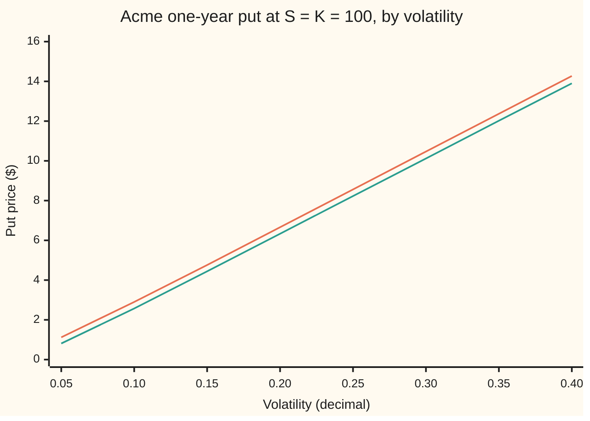
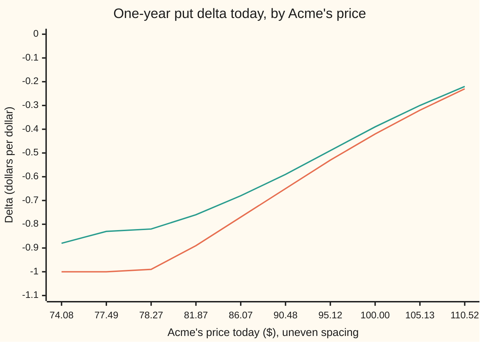
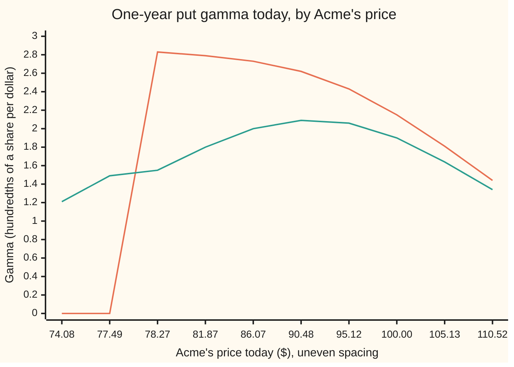

# American Greeks and implied volatility: sensitivities off the tree, a delta that hits -1, and a unique implied vol

[Syllabus](../../../SYLLABUS.md) → [Financial mathematics](../README.md) → [American and Bermudan exercise](../README.md#s15) → American Greeks and implied volatility

---

## General Overview

Acme shares trade at $100. A one-year American put on them, strike $100, gives the right to sell one share for $100 on any day of the coming year. Cash earns 5 percent, the shares pay a 2 percent dividend yield, and Acme's volatility (how jumpy its price is) is 20 percent. A 2,000-step coin-flip tree prices the put at $6.66, to full precision 6.660226. The European put, exercisable only at the end, is worth $6.33; the $0.33 gap is the early-exercise premium ([American options](01-american-options-and-early-exercise.md)).

A trading desk that sells this put needs its **Greeks**: the rates at which the price moves when one input moves. Delta is the share hedge, gamma how fast it drifts, vega the cost of a volatility move, theta of a day passing, rho of a rate move. The American put has no formula, so each Greek comes out of the pricer: read off neighbouring nodes, or found by nudging an input and pricing again.

The desk also runs the question backwards. A broker quotes the put at $6.660226; what volatility does that imply? Bisection on the tree, halving a bracket of volatilities until it pins the quote, answers 20.00 percent, and it is the only answer, because the American price rises strictly with volatility wherever holding the put beats exercising it.

Two features have no European counterpart. At or below about $77.88 the put is best exercised at once, so its price is strike minus share price: delta exactly −1, gamma exactly 0. Just above that line, gamma jumps to about 0.0283.

**The American put's Greeks are slopes of a price map the pricer has already drawn, pinned at delta −1 where exercise is optimal and with a jump in gamma at its edge; and because the price climbs strictly with volatility where the put is held, each quote in the right range implies exactly one volatility.**

**What kind of fact this is:** a theorem, proved on this card in Why it works (strict increase in volatility, hence one implied volatility; delta −1 in the exercise region; the size of the gamma jump), with a method around it: Greeks read off nodes or by bumping.

### The picture: price against volatility



Upper line: the American put, from the 2,000-step tree. Lower line: the European put, from the Black–Scholes formula. Both rise at every step, so a horizontal line at any quote meets each curve once. Reading an American quote off the lower curve lands to the right of the true volatility: the commonest mistake on this card.

---

## The formula

Notation first, in words. $P$ is the American put's price as a pricer computes it. A tree node is named by two counts, steps taken from today and how many were up moves: $V_n(j)$ is the put's worth there and $S_n(j)$ is Acme's price. One step lasts $\Delta t$ years, one two-thousandth of a year here. Delta, gamma and theta are written $\Delta$, $\Gamma$ and $\Theta$; $\Delta t$ is one symbol, not delta times a time.

Delta and gamma off the nodes, as on [Greeks from a tree or grid](../07-Greeks%20by%20Numbers%20and%20Calibration/04-greeks-from-a-tree-or-grid.md). Two steps in, $h_+ = S_2(2) - S_2(1)$ and $h_- = S_2(1) - S_2(0)$ are the dollar gaps above and below the middle node:

$$\Delta \approx \frac{V_1(1) - V_1(0)}{S_1(1) - S_1(0)}, \qquad \Gamma \approx \frac{2}{h_+ + h_-}\left(\frac{V_2(2) - V_2(1)}{h_+} - \frac{V_2(1) - V_2(0)}{h_-}\right)$$

**Read it aloud:** delta is the gap between the put's two worths one step in over the gap between Acme's two prices there; gamma is how much that slope changes, per dollar, across the three nodes two steps in.

The middle node two steps in sits at today's price again, so it gives theta: $\Theta \approx (V_2(1) - V_0(0))/(2\Delta t)$.

The tree has no volatility or rate direction to read a slope along, so vega $\mathcal{V}$ and rho $\rho$ come from pricing twice more:

$$\mathcal{V} \approx \frac{P(\sigma + \varepsilon) - P(\sigma - \varepsilon)}{2\varepsilon}, \qquad \rho \approx \frac{P(r + \varepsilon) - P(r - \varepsilon)}{2\varepsilon}, \qquad \varepsilon = 0.01$$

**Read it aloud:** price the put one volatility point higher and one lower, and divide the difference by the two points between them; the same for the rate.

Where exercising now is optimal, the exercise region, the put is worth its payoff:

$$P = K - S \quad\Longrightarrow\quad \Delta = -1, \qquad \Gamma = 0$$

**Read it aloud:** an exercised put is the strike minus the share price, so it loses a dollar for every dollar Acme gains, and its slope never bends.

At the edge of that region, the exercise boundary $S^*$, gamma jumps from 0 to

$$\Gamma(S^{*}\text{, from above}) = \frac{2\,(rK - qS^*)}{\sigma^2 {S^*}^2}$$

**Read it aloud:** twice the carry that exercise would earn, interest on the strike minus dividends on the share, over the volatility squared times the boundary price squared.

The inverse. Given a quote $Q$, the implied volatility $\sigma_{\text{imp}}$ is the volatility at which the pricer returns $Q$. Write $P(0^+)$ for the limit of the price as volatility falls to zero:

$$P(\sigma_{\text{imp}}) = Q, \qquad \text{exactly one solution when } \max\left(K - S,\ P(0^+)\right) < Q < K$$

**Read it aloud:** the implied volatility reproduces the quote, and there is exactly one when the quote sits above both the exercise value and the zero-volatility price, and below the strike.

$P(0^+)$ is the best discounted payoff of a share drifting at $r - q$ with no noise. At $S = K = 100$ it is 0, since a rising share never pays a put.

| Symbol | Plain meaning | In our example | Push it up and the answer… |
| --- | --- | --- | --- |
| $P$ | the American put's price from a pricer | $6.660226 on the 2,000-step tree | — |
| $S$, $K$ | Acme's price today; the strike the put may sell at | $100 and $100 | $S$ up: put cheaper, delta toward 0 |
| $r$, $q$ | the riskless rate; Acme's dividend yield, both continuously compounded | 0.05 and 0.02 | $r$ up: early exercise more tempting |
| $\sigma$ | volatility, how jumpy Acme is. Say "sigma". | 0.20 | price up, strictly, where the put is held |
| $T$, $\Delta t$ | the put's life in years; one tree step | 1; 1/2000 | — |
| $V_n(j)$, $S_n(j)$ | the put's worth and Acme's price at a node: steps taken, up moves among them | $V_0(0)$ = 6.660226 | — |
| $h_+$, $h_-$ | dollar gaps from the middle node two steps in to its neighbours | under a dollar each | wider: more bias in gamma |
| $\Delta$, $\Gamma$ | delta: dollars gained per dollar Acme gains; gamma: delta gained per dollar | −0.423041 and 0.021484 | — |
| $\Theta$, $\mathcal{V}$, $\rho$ | theta: dollars per year of calendar; vega: dollars per 1.00 of volatility; rho: dollars per 1.00 of rate | −2.694609, 38.031884, −34.369887 | — |
| $\varepsilon$ | the bump size for vega and rho | 0.01 | smaller: less bias, more tree jitter |
| $S^*$ | the exercise boundary today: at or below it, exercise at once | between $77.88 and $78.27 | — |
| $Q$, $\sigma_{\text{imp}}$ | a quoted price; the volatility that reproduces it | 6.660226; 0.200000 | $Q$ up: $\sigma_{\text{imp}}$ up |

### When it holds

- **Nodes on smooth ground.** Three nodes straddling the boundary straddle a jump in gamma and report a blend of 0 and 0.0283, true of neither side.
- **Bumps that keep the lattice still.** Tree nodes are laid out from today's price, so a one-cent spot bump moves every node against the strike. Dividing that jitter by a cent squared gives gamma 0.890311 against 0.021484 off the nodes. A volatility bump of 0.01 moves the nodes too, but is wide enough to swamp the jitter.
- **A quote inside the range.** Outside the range above, no volatility reproduces the quote. At the exercise value itself, deep in the money, a whole interval of volatilities does (Step 6).
- **One pricer, both ways.** The implied volatility belongs to its pricer: the tree maps 6.660226 to 0.200000, the grid to 0.199989, because the two disagree in the fourth decimal of price. Both assume one constant volatility; if the market's varies by strike, the implied number is only an average.

---

## Why it works

### Step 0: the pricer has already drawn the price map

Backward induction on a tree, or time-stepping on a grid, fills in the put's worth at every price and date it visits. A Greek is a slope of that map in one direction, so delta, gamma and theta are already in the numbers. Only directions the map never covers, volatility and the rate, need a second pricing.

The American map is split in two. Where holding beats exercising, the price obeys the Black–Scholes equation. Elsewhere it is the payoff and nothing else. The line between is the exercise boundary ([The exercise boundary and smooth pasting](04-exercise-boundary-and-smooth-pasting.md)). Every result below concerns one side of it, or the line itself.

### Step 1: delta, gamma and theta off the nodes

The tree keeps its nodes one and two steps in. They give delta −0.423041, gamma 0.021484 and theta −2.694609 dollars a year.

A grid reaches the same map by another road: prices stored against the log of Acme's price, stepped backward in small time slices, each lifted to the payoff wherever it falls below it (that lift is early exercise). Its delta is −0.423042, gamma 0.021475, theta −2.693732.

Node Greeks are dated a step or two in the future. At 2,000 steps a step is under half a day, and the dating error sits below the printed digits.

### Step 2: vega and rho by bumping

No node holds the put at another volatility, so the tree prices it again at 0.21 and 0.19: 7.040707 and 6.280069. Their difference over 0.02 is vega, 38.031884 per 1.00 of volatility. The grid, bumped alike, gives 38.042070. The same recipe on the rate gives rho: −34.369887 on the tree, −34.376124 on the grid. Rho is negative because a higher rate shrinks today's value of the strike received later.

A two-sided bump's error shrinks with the bump squared ([Bump and revalue](../07-Greeks%20by%20Numbers%20and%20Calibration/01-bump-and-revalue-and-common-random-numbers.md)), but on a tree it also moves the lattice, adding a jitter that does not shrink. Divided by 0.02 it moves vega by about a hundredth, against 38; divided by a cent squared, for gamma, it gives 0.890311. Node readings re-price nothing, so nothing jitters.

### Step 3: in the exercise region, delta is exactly −1

At $70 the one-year put lies in the exercise region: it is worth its payoff, $30. So is every node in the tree's first two steps from there, each holding strike minus share price. A chord through two such nodes has slope exactly −1, and three points on one line have no bend. The tree prints delta −1.000000 and gamma 0.000000.

An exercised put is a promise of $100 for a share: each dollar Acme gains is a dollar lost, so the hedge is one whole share and never changes.

Delta does not jump at the boundary. Smooth pasting makes the held price meet the payoff line with slope −1 from both sides (proved on the exercise-boundary card). The grid shows −1.00 at $77.49 and −0.99 at $78.27, the first held price.

### Step 4: at the boundary, gamma jumps by the carry

Just above the boundary the put is held, so the Black–Scholes equation holds. With the Greeks written in, it says the hedged put earns the riskless rate:

$$\Theta + (r - q)\,S\,\Delta + \tfrac12\sigma^2 S^2\,\Gamma = r\,P$$

Approach the boundary from above. The price tends to $K - S^*$. Delta tends to −1, by smooth pasting. Theta tends to 0: the exercised price does not depend on the date, and theta is continuous across the boundary. Only gamma is left:

$$\tfrac12\sigma^2 {S^*}^2\,\Gamma = r(K - S^*) + (r - q)S^* = rK - qS^*$$

The right side is the **carry** of exercising: exercise swaps a share paying $qS^*$ a year in dividends for $K$ of cash earning $r \times K$. The left side is the held put's income from volatility, half the variance times gamma. On the boundary they balance. That is what the boundary is: the last price at which volatility income still pays for the carry lost by waiting.

Below, gamma is 0; just above, it is $2(rK - qS^*)/(\sigma^2 {S^*}^2)$, positive because exercise happens only where the carry favours it. At the grid's last exercised price, $77.880078, the carry is 3.442398 a year, $\sigma^2 {S^*}^2$ is 242.612264, and the formula gives 0.028378. The grid's gamma one node above, at $78.270454, is 0.028329, found by differencing prices and never by this formula.

<details>
<summary>Detailed proof: why theta vanishes at the boundary, and what is taken as given</summary>

Strictly below the boundary the price is strike minus share price on every date, so its calendar slope is 0 there. That the held side's theta also tends to 0 needs the price to be continuously differentiable in time up to the boundary. This regularity is a result of free-boundary theory, taken here without proof; Kim (1990), in the Sources, develops the boundary's properties. Smooth pasting is the same regularity in the price direction.

Given the two limits, the display is exact: the equation holds at every held point, each term has a limit at the boundary, and the limits satisfy it.

</details>

### Step 5: the price rises strictly with volatility where the put is held

This makes an implied volatility well defined. Compare a lower volatility $\sigma_{\text{low}}$ with a higher one $\sigma_{\text{high}}$ (names used only in this step).

**Convexity.** Acme's future price is today's times a random factor independent of today's price, so each exercise rule gives a payoff that curves upward in today's price. The American price is the best over all rules, and the best of upward-curving functions curves upward: gamma is 0 or more. In the held region it is strictly positive, a known property taken here as given; the grid shows it at every held price charted below.

**Comparison.** Run the higher-volatility world but exercise by the lower-volatility rule. Along that path the lower-volatility price, discounted, drifts upward at exactly $\tfrac12(\sigma_{\text{high}}^2 - \sigma_{\text{low}}^2) S^2 \Gamma$: its own equation cancels everything else. So it starts below what the borrowed rule collects, and the higher-volatility price, the best over all rules, is higher still.

<details>
<summary>Detailed proof: strict increase in volatility</summary>

Let $P_{\text{low}}$ be the put's price at $\sigma_{\text{low}}$, let the share follow the risk-neutral model at $\sigma_{\text{high}}$, and let the stopping time, tau, be the first date at which $P_{\text{low}}$ equals the payoff, or the expiry if that never happens. Before it the share is in the held region of the lower problem, where $P_{\text{low}}$ satisfies $\Theta + (r - q) S \Delta + \tfrac12\sigma_{\text{low}}^2 S^2 \Gamma - rP_{\text{low}} = 0$. Ito's lemma for the discounted $P_{\text{low}}$ under $\sigma_{\text{high}}$ leaves a drift of $\tfrac12(\sigma_{\text{high}}^2 - \sigma_{\text{low}}^2) S^2\,\Gamma_{\text{low}}$, discounted, plus a martingale. Taking expectations up to tau:

$$P_{\text{low}}(S, 0) = \mathbb{E}_{\text{high}}\!\left[e^{-r\tau}(K - S_\tau)^+\right] - \mathbb{E}_{\text{high}}\!\left[\int_0^{\tau} e^{-rs}\,\tfrac12(\sigma_{\text{high}}^2 - \sigma_{\text{low}}^2) S_s^2\,\Gamma_{\text{low}}\,ds\right].$$

The first term is at most $P_{\text{high}}(S, 0)$, the supremum over all stopping times. The integral is non-negative by convexity; if $S$ starts in the held region, tau is positive almost surely and, with gamma strictly positive there, the integral is strictly positive. So $P_{\text{low}} < P_{\text{high}}$. This is the argument of El Karoui, Jeanblanc-Picqué and Shreve (1998), specialised to the put.

</details>

At $S = K = 100$ the tree's price climbs at every step of the opening chart. At $70 it reads 30.000000 at volatility 0.10 and at 0.20, then 30.157820 at 0.30 and 31.613439 at 0.40: flat while $70 is in the exercise region, exactly where the theorem promises nothing.

### Step 6: existence, uniqueness, and the edges

The price is continuous in volatility. As volatility falls to zero it tends to $P(0^+)$, which is 0 at the money; the tree gives 0.060987 at 0.01. As volatility grows without limit, Acme is driven towards zero and the put tends to the full strike; the tree gives 65.437436 at 2.00. A continuous curve crosses every level between its limits, so an implied volatility exists; Step 5 makes it unique.

The edges, stated before solving:

- **Below the floor**, $\max(K - S, P(0^+))$: no volatility works.
- **At the floor, at the money**: a quote of 0 is a limit, never reached; no volatility works.
- **At or above the strike**: no volatility works; the put never pays more than $K$.
- **At the floor, deep in the money**, where it is the exercise value: an interval works. At $70 a quote of $30 is matched by 0.10 and 0.20 alike.

Bisection then solves. The bracket 0.01 to 2.00 straddles the quote; price the middle, keep the half that still straddles, repeat until the bracket is a billionth wide. The tree returns 0.200000. The grid, solved by the secant method (Newton's method with the slope taken from the last two guesses), returns 0.199989. Bisection needs no vega and cannot leave its bracket, whatever lattice jitter the price carries.

A faster road inverts the Barone-Adesi–Whaley closed-form approximation instead of a tree ([Barone-Adesi-Whaley](06-barone-adesi-whaley-approximation.md)). Its implied volatility then belongs to that formula.

---

## Worked numbers, by hand

The house American put: $S = K = 100$, $r$ = 5%, $q$ = 2%, $\sigma$ = 20%, one year.

| Step | Arithmetic | Value |
| --- | --- | --- |
| early-exercise premium | 6.660226 − 6.330081 | $0.330145 |
| price one volatility point up | tree at $\sigma$ = 0.21 | $7.040707 |
| price one volatility point down | tree at $\sigma$ = 0.19 | $6.280069 |
| vega | (7.040707 − 6.280069) / 0.02 | 38.031884 |
| per volatility point | 38.031884 / 100 | $0.380319 |
| theta per day | −2.694609 / 365 | −$0.007382 |
| last exercised price today | grid | $77.880078 |
| carry of exercising there | 0.05 × 100 − 0.02 × 77.880078 | 3.442398 |
| volatility scale there | 0.20^2 × 77.880078^2 | 242.612264 |
| gamma just above the boundary | 2 × 3.442398 / 242.612264 | 0.028378 |
| implied volatility of $6.660226 | bisection on the tree price | **0.200000, 20.00%** |

A one-point rise in volatility adds 38 cents; an idle day costs three quarters of a cent. The boundary gamma, 0.028378, tops the at-the-money 0.021484: the hedge moves fastest just before exercise takes over.

### What breaks if you drop a piece

| Mistake | Comes out at | What went wrong |
| --- | --- | --- |
| Invert the American quote with the European formula | 0.208709, i.e. 20.87% | The $0.33 early-exercise premium is booked as extra volatility |
| Hedge with the European formula's delta | −0.393348 against −0.423041 | Ignores early exercise; the American put is more negative because exercise may come sooner |
| Gamma from a one-cent spot bump on the tree | 0.890311 against 0.021484 | The bump shifts the strike against the nodes; dividing by a cent squared magnifies the jitter |
| Correct the tree with the European error (control variate) | 6.661198 against the grid's 6.660658 | The European tree's error is not the American tree's error at the money; the correction overshoots |

The control variate adds the European tree's error, 6.330081 minus 6.329109, to the American tree price, betting the two trees err alike. At the money they do not. Richardson extrapolation, which assumes the tree's error falls like one over the step count, does better: twice the 2,000-step price minus the 1,000-step price is 6.660692, beside the grid's 6.660658.

---

## How the Greeks move across the boundary

Freeze the calendar at today and slide Acme's price through the boundary. The grid reads delta and gamma at each price.



First line: the American put, flat at −1.00 through $77.49, then leaving −1 smoothly: −0.99 at $78.27, the first held price. Second line: the European put, which cannot be exercised early and never reaches −1; at $74.08 it is −0.88. At $100 it reads −0.39 against the American −0.42.



First line: the American put. Zero through $77.49, then 2.83 hundredths at $78.27 with nothing between: the jump of Step 4. From there gamma falls as Acme rises. Second line: the European put, a smooth hump peaking at 2.09 near $90. The American gamma peaks on the boundary itself, where the carry formula puts it.

Through a sell-off, then, the hedge grows fastest as Acme nears $78. Past the boundary it is one share and stops moving, and the best move is to exercise.

---

## Code, from first principles, and it actually runs

Two pricers that share no arithmetic, a 2,000-step Cox–Ross–Rubinstein tree and an explicit finite-difference grid in the log of Acme's price, each give the price, the node Greeks, and vega and rho by bumping. The script checks delta −1 and gamma 0 at $70, the grid's boundary gamma against the carry formula, and inverts 6.660226 by bisection on the tree and the secant method on the grid. The European put uses a bell-curve area built by Simpson's rule. Every number on the card is printed.

### Python

```python
# American Greeks and implied volatility -- the check behind the card.
# Standard library only.  Nothing imported knows the answer: the bell-curve
# area is Simpson's rule, the tree, the grid and both root finders are loops.
from math import exp, sqrt, log, pi

def N(x, n=2000):                        # bell-curve area left of x, by Simpson
    h = x / n; f = lambda z: exp(-0.5 * z * z) / sqrt(2 * pi)
    s = f(0.0) + f(x) + sum((4 if i % 2 else 2) * f(i * h) for i in range(1, n))
    return 0.5 + s * h / 3

def bs_put(S, K, r, q, sig, T):          # European put, the pilot's formula
    d1 = (log(S / K) + (r - q + 0.5 * sig * sig) * T) / (sig * sqrt(T))
    return K * exp(-r * T) * N(-(d1 - sig * sqrt(T))) - S * exp(-q * T) * N(-d1), d1

def tree(S, K, r, q, sig, T, n=2000, american=True):
    # Road 1: Cox-Ross-Rubinstein tree.  Returns price and the node Greeks.
    dt = T / n; u = exp(sig * sqrt(dt)); d = 1 / u
    p = (exp((r - q) * dt) - d) / (u - d); disc = exp(-r * dt)
    s = [S * d ** n * u ** (2 * j) for j in range(n + 1)]
    v = [max(K - x, 0.0) for x in s]
    keep = {}
    for i in range(n - 1, -1, -1):
        s = [x * u for x in s[:-1]]                       # prices one step earlier
        v = [disc * (p * v[j + 1] + (1 - p) * v[j]) for j in range(i + 1)]
        if american: v = [max(v[j], K - s[j]) for j in range(i + 1)]
        if i <= 2: keep[i] = (s, v)
    (s1, v1), (s2, v2) = keep[1], keep[2]
    delta = (v1[1] - v1[0]) / (s1[1] - s1[0])
    gamma = bend(s2, v2, 1)
    return v[0], delta, gamma, (v2[1] - v[0]) / (2 * dt)

def bend(s, v, i):                       # three unevenly spaced prices -> gamma
    hp, hm = s[i + 1] - s[i], s[i] - s[i - 1]
    return 2 / (hp + hm) * ((v[i + 1] - v[i]) / hp - (v[i] - v[i - 1]) / hm)

def slope(s, v, i):                      # slope of the same parabola at the middle
    hp, hm = s[i + 1] - s[i], s[i] - s[i - 1]
    return ((v[i + 1] - v[i]) / hp * hm + (v[i] - v[i - 1]) / hm * hp) / (hp + hm)

def grid(S, K, r, q, sig, T, dx=0.005, L=1.5, M=2500):
    # Road 2: explicit finite differences in x = ln(S/100), early exercise
    # enforced after every time step.  Returns node prices now and one step later.
    n = round(L / dx); ss = [S * exp((i - n) * dx) for i in range(2 * n + 1)]
    g = [max(K - x, 0.0) for x in ss]; dt = T / M; nu = r - q - 0.5 * sig * sig
    a = dt * (0.5 * sig * sig / dx ** 2 - nu / (2 * dx))
    c = dt * (0.5 * sig * sig / dx ** 2 + nu / (2 * dx)); b = 1 - dt * (sig * sig / dx ** 2 + r)
    v = g[:]
    for m in range(M):
        prev = v
        v = [g[0]] + [max(g[i], a * prev[i - 1] + b * prev[i] + c * prev[i + 1])
                      for i in range(1, 2 * n)] + [0.0]
    return ss, v, prev, dt, g, n

def bisect(f, lo, hi, tol=1e-9):         # f(lo) < 0 < f(hi); halve until tiny
    while hi - lo > tol:
        mid = 0.5 * (lo + hi)
        lo, hi = (mid, hi) if f(mid) < 0 else (lo, mid)
    return 0.5 * (lo + hi)

def secant(f, x0, x1, tol=1e-10):
    f0, f1 = f(x0), f(x1)
    while abs(x1 - x0) > tol:
        x0, x1, f0 = x1, x1 - f1 * (x1 - x0) / (f1 - f0), f1
        f1 = f(x1)
    return x1

S, K, r, q, sig, T, QUOTE = 100.0, 100.0, 0.05, 0.02, 0.20, 1.0, 6.660226
P, D, G, TH = tree(S, K, r, q, sig, T)
PE_tree, DE_tree, _, _ = tree(S, K, r, q, sig, T, american=False)
PE, d1 = bs_put(S, K, r, q, sig, T); DE = -exp(-q * T) * N(-d1)
ss, v, prev, dt, g, n = grid(S, K, r, q, sig, T)
gp = lambda **kw: grid(**{**dict(S=S, K=K, r=r, q=q, sig=sig, T=T), **kw})[1][n]
tp = lambda **kw: tree(**{**dict(S=S, K=K, r=r, q=q, sig=sig, T=T), **kw})[0]
v21, v19 = tp(sig=sig + 0.01), tp(sig=sig - 0.01); vega_t = (v21 - v19) / 0.02
vega_g = (gp(sig=sig + 0.01) - gp(sig=sig - 0.01)) / 0.02
rho_t = (tp(r=r + 0.01) - tp(r=r - 0.01)) / 0.02
rho_g = (gp(r=r + 0.01) - gp(r=r - 0.01)) / 0.02
b = max(i for i in range(1, 2 * n) if v[i] == g[i])      # last node exercised today
jump = 2 * (r * K - q * ss[b]) / (sig * sig * ss[b] ** 2)
_, D70, G70, _ = tree(70.0, K, r, q, sig, T)
iv_tree = bisect(lambda x: tp(sig=x) - QUOTE, 0.01, 2.0)
iv_grid = secant(lambda x: gp(sig=x) - QUOTE, 0.18, 0.22)
iv_euro = bisect(lambda x: bs_put(S, K, r, q, x, T)[0] - QUOTE, 0.01, 2.0)
bump_gamma = (tp(S=S + 0.01) - 2 * P + tp(S=S - 0.01)) / 0.01 ** 2
P_rich = 2 * P - tp(n=1000)                              # Richardson: tree error ~ 1/steps
rows = [("price, tree 2000 steps", P), ("price, grid", v[n]), ("price, Richardson 1000/2000", P_rich),
        ("price, tree + control variate", P + PE - PE_tree),
        ("European put, formula", PE), ("European put, tree 2000 steps", PE_tree),
        ("delta, tree nodes", D), ("delta, grid", slope(ss, v, n)),
        ("gamma, tree nodes", G), ("gamma, grid", bend(ss, v, n)),
        ("theta per year, tree nodes", TH), ("theta per year, grid", (prev[n] - v[n]) / dt),
        ("theta per day, tree nodes", TH / 365), ("early-exercise premium, tree", P - PE),
        ("tree price at sigma 0.21", v21), ("tree price at sigma 0.19", v19),
        ("vega per 1.00, tree, bump 0.01", vega_t), ("vega per 1.00, grid, bump 0.01", vega_g),
        ("rho per 1.00, tree, bump 0.01", rho_t), ("rho per 1.00, grid, bump 0.01", rho_g), ("vega per vol point, tree", vega_t / 100),
        ("last exercised node today, grid", ss[b]), ("first held node today, grid", ss[b + 1]),
        ("carry rK - qS* there", r * K - q * ss[b]),
        ("sigma^2 S*^2 there", sig * sig * ss[b] ** 2), ("gamma one node above, grid", bend(ss, v, b + 1)), ("gamma jump 2(rK-qS*)/(s^2 S*^2)", jump),
        ("S = 70: delta, tree nodes", D70), ("S = 70: gamma, tree nodes", round(G70, 9) + 0.0),
        ("implied vol, bisection on tree", iv_tree), ("implied vol, secant on grid", iv_grid),
        ("wrong: European formula inverted", iv_euro), ("wrong: European delta", DE),
        ("wrong: gamma by 1-cent spot bump", bump_gamma),
        ("range: price at sigma 0.01", tp(sig=0.01)), ("range: price at sigma 2.00", tp(sig=2.0))]
for name, x in rows:
    print(f"{name:<36} {x:>12.6f}")
print("S = 70, sigma 0.10 0.20 0.30 0.40:" + "".join(f" {tp(S=70.0, sig=x):.6f}" for x in (0.1, 0.2, 0.3, 0.4)))
sigs = [0.05 * k for k in range(1, 9)]
print("chart, sigma        " + " ".join(f"{x:6.2f}" for x in sigs))
print("chart, American put " + " ".join(f"{tp(sig=x):6.2f}" for x in sigs))
print("chart, European put " + " ".join(f"{bs_put(S, K, r, q, x, T)[0]:6.2f}" for x in sigs))
idx = [n + k for k in (-60, -51, -49, -40, -30, -20, -10, 0, 10, 20)]
eu = [bs_put(ss[i], K, r, q, sig, T)[1] for i in idx]
print("chart, spot         " + " ".join(f"{ss[i]:7.2f}" for i in idx))
print("chart, Am. delta    " + " ".join(f"{slope(ss, v, i):7.2f}" for i in idx))
print("chart, Eu. delta    " + " ".join(f"{-exp(-q * T) * N(-x):7.2f}" for x in eu))
print("chart, Am. gamma x100" + " ".join(f"{100 * bend(ss, v, i):7.2f}" for i in idx))
print("chart, Eu. gamma x100" + " ".join(f"{100*exp(-q*T-x*x/2)/sqrt(2*pi)/(ss[i]*sig):7.2f}" for x, i in zip(eu, idx)))

assert abs(P - QUOTE) < 1e-6, "tree reproduces the house quote"
assert abs(PE - 6.330080627550) < 1e-9, "own bell curve reproduces the house European put"
assert abs(P_rich - v[n]) < 1e-4, "tree (extrapolated) and grid agree on the price"
assert abs(D - slope(ss, v, n)) < 1e-5, "delta: tree nodes vs grid"
assert abs(G - bend(ss, v, n)) < 1e-4, "gamma: tree nodes vs grid"
assert abs(TH - (prev[n] - v[n]) / dt) < 0.01, "theta: tree nodes vs grid"
assert abs(vega_t - vega_g) < 0.05, "vega: tree bump vs grid bump"
assert abs(rho_t - rho_g) < 0.05, "rho: tree bump vs grid bump"
assert abs(D70 + 1.0) < 1e-12, "delta is -1 inside the exercise region"
assert abs(G70) < 1e-12, "gamma is 0 inside the exercise region"
assert abs(bend(ss, v, b + 1) - jump) < 0.01 * jump, "gamma jump: grid vs 2(rK - qS*)/(sigma^2 S*^2)"
assert abs(iv_tree - sig) < 1e-6, "bisection on the tree recovers 20 percent"
assert abs(iv_grid - iv_tree) < 1e-4, "secant on the grid lands beside it"
assert iv_euro > iv_tree + 0.005, "European inversion books the premium as volatility"
assert all(abs(tp(S=70.0, sig=x) - 30.0) < 1e-9 for x in (0.1, 0.2)), "flat at $70: a plateau"
am = [tp(sig=x) for x in sigs]
assert all(x < y for x, y in zip(am, am[1:])), "American price strictly rises in volatility"
print("ALL CHECKS PASS")
```

**Ran 2026-09-24 on macOS, Python 3.14.6, standard library only. All checks passed. Output, pasted from the run:**

```
price, tree 2000 steps                   6.660226
price, grid                              6.660658
price, Richardson 1000/2000              6.660692
price, tree + control variate            6.661198
European put, formula                    6.330081
European put, tree 2000 steps            6.329109
delta, tree nodes                       -0.423041
delta, grid                             -0.423042
gamma, tree nodes                        0.021484
gamma, grid                              0.021475
theta per year, tree nodes              -2.694609
theta per year, grid                    -2.693732
theta per day, tree nodes               -0.007382
early-exercise premium, tree             0.330145
tree price at sigma 0.21                 7.040707
tree price at sigma 0.19                 6.280069
vega per 1.00, tree, bump 0.01          38.031884
vega per 1.00, grid, bump 0.01          38.042070
rho per 1.00, tree, bump 0.01          -34.369887
rho per 1.00, grid, bump 0.01          -34.376124
vega per vol point, tree                 0.380319
last exercised node today, grid         77.880078
first held node today, grid             78.270454
carry rK - qS* there                     3.442398
sigma^2 S*^2 there                     242.612264
gamma one node above, grid               0.028329
gamma jump 2(rK-qS*)/(s^2 S*^2)          0.028378
S = 70: delta, tree nodes               -1.000000
S = 70: gamma, tree nodes                0.000000
implied vol, bisection on tree           0.200000
implied vol, secant on grid              0.199989
wrong: European formula inverted         0.208709
wrong: European delta                   -0.393348
wrong: gamma by 1-cent spot bump         0.890311
range: price at sigma 0.01               0.060987
range: price at sigma 2.00              65.437436
S = 70, sigma 0.10 0.20 0.30 0.40: 30.000000 30.000000 30.157820 31.613439
chart, sigma          0.05   0.10   0.15   0.20   0.25   0.30   0.35   0.40
chart, American put   1.12   2.90   4.76   6.66   8.56  10.47  12.37  14.27
chart, European put   0.81   2.57   4.44   6.33   8.23  10.12  12.02  13.90
chart, spot           74.08   77.49   78.27   81.87   86.07   90.48   95.12  100.00  105.13  110.52
chart, Am. delta      -1.00   -1.00   -0.99   -0.89   -0.77   -0.65   -0.53   -0.42   -0.32   -0.23
chart, Eu. delta      -0.88   -0.83   -0.82   -0.76   -0.68   -0.59   -0.49   -0.39   -0.30   -0.22
chart, Am. gamma x100   0.00    0.00    2.83    2.79    2.73    2.62    2.43    2.15    1.81    1.44
chart, Eu. gamma x100   1.21    1.49    1.55    1.80    2.00    2.09    2.06    1.90    1.64    1.34
ALL CHECKS PASS
```

### Rust

The same checks, the same rows and labels. Built with `rustc --edition 2021 -O`.

```rust
// American Greeks and implied volatility -- the same check as the Python, in Rust.
// Standard library only, no crates.  The bell-curve area is Simpson's rule,
// the tree, the grid and both root finders are loops written out here.
use std::f64::consts::PI;

fn phi(z: f64) -> f64 { (-0.5 * z * z).exp() / (2.0 * PI).sqrt() }

fn n_cdf(x: f64) -> f64 {                 // bell-curve area left of x, by Simpson
    let n = 2000;
    let h = x / n as f64;
    let mut s = phi(0.0) + phi(x);
    for i in 1..n { s += if i % 2 == 1 { 4.0 } else { 2.0 } * phi(i as f64 * h); }
    0.5 + s * h / 3.0
}

fn bs_put(s: f64, k: f64, r: f64, q: f64, sig: f64, t: f64) -> (f64, f64) {
    let d1 = ((s / k).ln() + (r - q + 0.5 * sig * sig) * t) / (sig * t.sqrt());
    (k * (-r * t).exp() * n_cdf(-(d1 - sig * t.sqrt())) - s * (-q * t).exp() * n_cdf(-d1), d1)
}

#[derive(Clone, Copy)]
struct M { s: f64, k: f64, r: f64, q: f64, sig: f64, t: f64 }

fn bend(s: &[f64], v: &[f64], i: usize) -> f64 {   // three unevenly spaced prices -> gamma
    let (hp, hm) = (s[i + 1] - s[i], s[i] - s[i - 1]);
    2.0 / (hp + hm) * ((v[i + 1] - v[i]) / hp - (v[i] - v[i - 1]) / hm)
}

fn slope(s: &[f64], v: &[f64], i: usize) -> f64 {  // slope of the same parabola at the middle
    let (hp, hm) = (s[i + 1] - s[i], s[i] - s[i - 1]);
    ((v[i + 1] - v[i]) / hp * hm + (v[i] - v[i - 1]) / hm * hp) / (hp + hm)
}

// Road 1: Cox-Ross-Rubinstein tree.  Returns price, delta, gamma, theta off the nodes.
fn tree(m: M, n: usize, american: bool) -> (f64, f64, f64, f64) {
    let dt = m.t / n as f64;
    let u = (m.sig * dt.sqrt()).exp(); let d = 1.0 / u;
    let p = (((m.r - m.q) * dt).exp() - d) / (u - d);
    let disc = (-m.r * dt).exp();
    let mut s: Vec<f64> = (0..=n).map(|j| m.s * d.powi(n as i32) * u.powi(2 * j as i32)).collect();
    let mut v: Vec<f64> = s.iter().map(|x| (m.k - x).max(0.0)).collect();
    let (mut s1, mut v1, mut s2, mut v2) = (vec![], vec![], vec![], vec![]);
    for i in (0..n).rev() {
        s = s[..i + 1].iter().map(|x| x * u).collect();      // prices one step earlier
        v = (0..=i).map(|j| disc * (p * v[j + 1] + (1.0 - p) * v[j])).collect();
        if american { v = (0..=i).map(|j| v[j].max(m.k - s[j])).collect(); }
        if i == 1 { s1 = s.clone(); v1 = v.clone(); }
        if i == 2 { s2 = s.clone(); v2 = v.clone(); }
    }
    let delta = (v1[1] - v1[0]) / (s1[1] - s1[0]);
    (v[0], delta, bend(&s2, &v2, 1), (v2[1] - v[0]) / (2.0 * dt))
}
fn tp(m: M) -> f64 { tree(m, 2000, true).0 }

// Road 2: explicit finite differences in x = ln(S/100), early exercise enforced
// after every time step.  Returns node prices, prices now and one step later.
fn grid(m: M) -> (Vec<f64>, Vec<f64>, Vec<f64>, f64, Vec<f64>, usize) {
    let (dx, steps, n) = (0.005, 2500, (1.5_f64 / 0.005).round() as usize);
    let ss: Vec<f64> = (0..=2 * n).map(|i| m.s * ((i as f64 - n as f64) * dx).exp()).collect();
    let g: Vec<f64> = ss.iter().map(|x| (m.k - x).max(0.0)).collect();
    let (dt, nu) = (m.t / steps as f64, m.r - m.q - 0.5 * m.sig * m.sig);
    let a = dt * (0.5 * m.sig * m.sig / (dx * dx) - nu / (2.0 * dx));
    let c = dt * (0.5 * m.sig * m.sig / (dx * dx) + nu / (2.0 * dx));
    let b = 1.0 - dt * (m.sig * m.sig / (dx * dx) + m.r);
    let (mut v, mut prev) = (g.clone(), g.clone());
    for _ in 0..steps {
        prev = v;
        v = vec![g[0]];
        for i in 1..2 * n { v.push(g[i].max(a * prev[i - 1] + b * prev[i] + c * prev[i + 1])); }
        v.push(0.0);
    }
    (ss, v, prev, dt, g, n)
}
fn gp(m: M) -> f64 { let (_, v, _, _, _, n) = grid(m); v[n] }

fn bisect<F: Fn(f64) -> f64>(f: F, mut lo: f64, mut hi: f64) -> f64 {
    while hi - lo > 1e-9 {
        let mid = 0.5 * (lo + hi);
        if f(mid) < 0.0 { lo = mid } else { hi = mid }
    }
    0.5 * (lo + hi)
}

fn secant<F: Fn(f64) -> f64>(f: F, mut x0: f64, mut x1: f64) -> f64 {
    let (mut f0, mut f1) = (f(x0), f(x1));
    while (x1 - x0).abs() > 1e-10 {
        let x2 = x1 - f1 * (x1 - x0) / (f1 - f0);
        x0 = x1; x1 = x2; f0 = f1; f1 = f(x1);
    }
    x1
}

fn main() {
    let h = M { s: 100.0, k: 100.0, r: 0.05, q: 0.02, sig: 0.20, t: 1.0 };
    let quote = 6.660226;
    let (p, dl, gm, th) = tree(h, 2000, true);
    let (pe_tree, _, _, _) = tree(h, 2000, false);
    let (pe, d1) = bs_put(h.s, h.k, h.r, h.q, h.sig, h.t);
    let de = -(-h.q * h.t).exp() * n_cdf(-d1);
    let (ss, v, prev, dt, g, n) = grid(h);
    let (v21, v19) = (tp(M { sig: h.sig + 0.01, ..h }), tp(M { sig: h.sig - 0.01, ..h }));
    let vega_t = (v21 - v19) / 0.02;
    let vega_g = (gp(M { sig: h.sig + 0.01, ..h }) - gp(M { sig: h.sig - 0.01, ..h })) / 0.02;
    let rho_t = (tp(M { r: h.r + 0.01, ..h }) - tp(M { r: h.r - 0.01, ..h })) / 0.02;
    let rho_g = (gp(M { r: h.r + 0.01, ..h }) - gp(M { r: h.r - 0.01, ..h })) / 0.02;
    let b = (1..2 * n).filter(|&i| v[i] == g[i]).max().unwrap();   // last node exercised today
    let jump = 2.0 * (h.r * h.k - h.q * ss[b]) / (h.sig * h.sig * ss[b] * ss[b]);
    let (_, d70, g70, _) = tree(M { s: 70.0, ..h }, 2000, true);
    let iv_tree = bisect(|x| tp(M { sig: x, ..h }) - quote, 0.01, 2.0);
    let iv_grid = secant(|x| gp(M { sig: x, ..h }) - quote, 0.18, 0.22);
    let iv_euro = bisect(|x| bs_put(h.s, h.k, h.r, h.q, x, h.t).0 - quote, 0.01, 2.0);
    let bump_gamma = (tp(M { s: h.s + 0.01, ..h }) - 2.0 * p + tp(M { s: h.s - 0.01, ..h })) / (0.01 * 0.01);
    let p_rich = 2.0 * p - tree(h, 1000, true).0;                  // Richardson: tree error ~ 1/steps
    let theta_g = (prev[n] - v[n]) / dt;
    let rows: Vec<(&str, f64)> = vec![
        ("price, tree 2000 steps", p), ("price, grid", v[n]), ("price, Richardson 1000/2000", p_rich),
        ("price, tree + control variate", p + pe - pe_tree),
        ("European put, formula", pe), ("European put, tree 2000 steps", pe_tree),
        ("delta, tree nodes", dl), ("delta, grid", slope(&ss, &v, n)),
        ("gamma, tree nodes", gm), ("gamma, grid", bend(&ss, &v, n)),
        ("theta per year, tree nodes", th), ("theta per year, grid", theta_g),
        ("theta per day, tree nodes", th / 365.0), ("early-exercise premium, tree", p - pe),
        ("tree price at sigma 0.21", v21), ("tree price at sigma 0.19", v19),
        ("vega per 1.00, tree, bump 0.01", vega_t), ("vega per 1.00, grid, bump 0.01", vega_g),
        ("rho per 1.00, tree, bump 0.01", rho_t), ("rho per 1.00, grid, bump 0.01", rho_g), ("vega per vol point, tree", vega_t / 100.0),
        ("last exercised node today, grid", ss[b]), ("first held node today, grid", ss[b + 1]),
        ("carry rK - qS* there", h.r * h.k - h.q * ss[b]),
        ("sigma^2 S*^2 there", h.sig * h.sig * ss[b] * ss[b]), ("gamma one node above, grid", bend(&ss, &v, b + 1)), ("gamma jump 2(rK-qS*)/(s^2 S*^2)", jump),
        ("S = 70: delta, tree nodes", d70), ("S = 70: gamma, tree nodes", (g70 * 1e9).round() / 1e9 + 0.0),
        ("implied vol, bisection on tree", iv_tree), ("implied vol, secant on grid", iv_grid),
        ("wrong: European formula inverted", iv_euro), ("wrong: European delta", de),
        ("wrong: gamma by 1-cent spot bump", bump_gamma),
        ("range: price at sigma 0.01", tp(M { sig: 0.01, ..h })), ("range: price at sigma 2.00", tp(M { sig: 2.0, ..h })),
    ];
    for (name, x) in &rows { println!("{:<36} {:>12.6}", name, x); }
    let flat: Vec<String> = [0.1, 0.2, 0.3, 0.4].iter().map(|&x| format!(" {:.6}", tp(M { s: 70.0, sig: x, ..h }))).collect();
    println!("S = 70, sigma 0.10 0.20 0.30 0.40:{}", flat.concat());
    let sigs: Vec<f64> = (1..=8).map(|k| 0.05 * k as f64).collect();
    let am: Vec<f64> = sigs.iter().map(|&x| tp(M { sig: x, ..h })).collect();
    let line = |label: &str, xs: Vec<String>| println!("{}{}", label, xs.join(" "));
    line("chart, sigma        ", sigs.iter().map(|x| format!("{:6.2}", x)).collect());
    line("chart, American put ", am.iter().map(|x| format!("{:6.2}", x)).collect());
    line("chart, European put ", sigs.iter().map(|&x| format!("{:6.2}", bs_put(h.s, h.k, h.r, h.q, x, h.t).0)).collect());
    let idx: Vec<usize> = [-60i64, -51, -49, -40, -30, -20, -10, 0, 10, 20].iter().map(|k| (n as i64 + k) as usize).collect();
    let eu: Vec<f64> = idx.iter().map(|&i| bs_put(ss[i], h.k, h.r, h.q, h.sig, h.t).1).collect();
    line("chart, spot         ", idx.iter().map(|&i| format!("{:7.2}", ss[i])).collect());
    line("chart, Am. delta    ", idx.iter().map(|&i| format!("{:7.2}", slope(&ss, &v, i))).collect());
    line("chart, Eu. delta    ", eu.iter().map(|&x| format!("{:7.2}", -(-h.q * h.t).exp() * n_cdf(-x))).collect());
    line("chart, Am. gamma x100", idx.iter().map(|&i| format!("{:7.2}", 100.0 * bend(&ss, &v, i))).collect());
    line("chart, Eu. gamma x100", eu.iter().zip(&idx).map(|(&x, &i)| format!("{:7.2}", 100.0 * (-h.q * h.t).exp() * phi(x) / (ss[i] * h.sig))).collect());

    assert!((p - quote).abs() < 1e-6, "tree reproduces the house quote");
    assert!((pe - 6.330080627550).abs() < 1e-9, "own bell curve reproduces the house European put");
    assert!((p_rich - v[n]).abs() < 1e-4, "tree (extrapolated) and grid agree on the price");
    assert!((dl - slope(&ss, &v, n)).abs() < 1e-5, "delta: tree nodes vs grid");
    assert!((gm - bend(&ss, &v, n)).abs() < 1e-4, "gamma: tree nodes vs grid");
    assert!((th - theta_g).abs() < 0.01, "theta: tree nodes vs grid");
    assert!((vega_t - vega_g).abs() < 0.05, "vega: tree bump vs grid bump");
    assert!((rho_t - rho_g).abs() < 0.05, "rho: tree bump vs grid bump");
    assert!((d70 + 1.0).abs() < 1e-12, "delta is -1 inside the exercise region");
    assert!(g70.abs() < 1e-12, "gamma is 0 inside the exercise region");
    assert!((bend(&ss, &v, b + 1) - jump).abs() < 0.01 * jump, "gamma jump: grid vs 2(rK - qS*)/(sigma^2 S*^2)");
    assert!((iv_tree - h.sig).abs() < 1e-6, "bisection on the tree recovers 20 percent");
    assert!((iv_grid - iv_tree).abs() < 1e-4, "secant on the grid lands beside it");
    assert!(iv_euro > iv_tree + 0.005, "European inversion books the premium as volatility");
    assert!([0.1, 0.2].iter().all(|&x| (tp(M { s: 70.0, sig: x, ..h }) - 30.0).abs() < 1e-9), "flat at $70: a plateau");
    assert!(am.windows(2).all(|w| w[0] < w[1]), "American price strictly rises in volatility");
    println!("ALL CHECKS PASS");
}
```

**Ran 2026-09-24 on macOS, rustc 1.98.1, no crates. All checks passed. Output, pasted from the run:**

```
price, tree 2000 steps                   6.660226
price, grid                              6.660658
price, Richardson 1000/2000              6.660692
price, tree + control variate            6.661198
European put, formula                    6.330081
European put, tree 2000 steps            6.329109
delta, tree nodes                       -0.423041
delta, grid                             -0.423042
gamma, tree nodes                        0.021484
gamma, grid                              0.021475
theta per year, tree nodes              -2.694609
theta per year, grid                    -2.693732
theta per day, tree nodes               -0.007382
early-exercise premium, tree             0.330145
tree price at sigma 0.21                 7.040707
tree price at sigma 0.19                 6.280069
vega per 1.00, tree, bump 0.01          38.031884
vega per 1.00, grid, bump 0.01          38.042070
rho per 1.00, tree, bump 0.01          -34.369887
rho per 1.00, grid, bump 0.01          -34.376124
vega per vol point, tree                 0.380319
last exercised node today, grid         77.880078
first held node today, grid             78.270454
carry rK - qS* there                     3.442398
sigma^2 S*^2 there                     242.612264
gamma one node above, grid               0.028329
gamma jump 2(rK-qS*)/(s^2 S*^2)          0.028378
S = 70: delta, tree nodes               -1.000000
S = 70: gamma, tree nodes                0.000000
implied vol, bisection on tree           0.200000
implied vol, secant on grid              0.199989
wrong: European formula inverted         0.208709
wrong: European delta                   -0.393348
wrong: gamma by 1-cent spot bump         0.890311
range: price at sigma 0.01               0.060987
range: price at sigma 2.00              65.437436
S = 70, sigma 0.10 0.20 0.30 0.40: 30.000000 30.000000 30.157820 31.613439
chart, sigma          0.05   0.10   0.15   0.20   0.25   0.30   0.35   0.40
chart, American put   1.12   2.90   4.76   6.66   8.56  10.47  12.37  14.27
chart, European put   0.81   2.57   4.44   6.33   8.23  10.12  12.02  13.90
chart, spot           74.08   77.49   78.27   81.87   86.07   90.48   95.12  100.00  105.13  110.52
chart, Am. delta      -1.00   -1.00   -0.99   -0.89   -0.77   -0.65   -0.53   -0.42   -0.32   -0.23
chart, Eu. delta      -0.88   -0.83   -0.82   -0.76   -0.68   -0.59   -0.49   -0.39   -0.30   -0.22
chart, Am. gamma x100   0.00    0.00    2.83    2.79    2.73    2.62    2.43    2.15    1.81    1.44
chart, Eu. gamma x100   1.21    1.49    1.55    1.80    2.00    2.09    2.06    1.90    1.64    1.34
ALL CHECKS PASS
```

The two outputs agree line for line at the printed precision.

> [!TIP]
> **Try changing**
> Guess the direction first, then run it.
> - **Push volatility to 0.30 with Acme at $70.** Guess whether the put leaves its payoff. It does: 30.157820 instead of 30.000000. At 0.20 it stays exactly at the payoff, and its implied volatility would be an interval.
> - **Invert with the European formula.** Set the pricer inside the bisection to `bs_put`. The quote 6.660226 returns 0.208709 instead of 0.200000.
> - **Drop volatility to 0.01.** Guess how close the put gets to its zero-volatility floor of 0. The tree gives 0.060987: six cents, still positive, and still rising with volatility, so even a tiny quote has one implied volatility.
> - **Shrink the bracket.** Start bisection at 0.01 to 0.15 instead of 0.01 to 2.00. The quote is above the price at 0.15, 4.76, so the bracket no longer straddles it and bisection walks to the top end: check the ends before solving.

---

## The usual mistake

> [!warning]
> **Inverting an American quote with the European formula.** The European formula has no early-exercise value, so it explains the put's extra $0.33 the only way it can: more volatility. The Acme quote of 6.660226 comes out at 20.87 percent instead of 20.00. The premium differs from strike to strike, so across a chain the error bends a flat volatility into a false skew.
>
> Smaller traps:
> - **Reading a Greek at the boundary node.** The three nodes straddle a jump in gamma, and the reading is a blend of 0 and 0.0283 that belongs to neither side.
> - **Bumping spot on a tree.** One cent gives gamma 0.890311 against 0.021484. Read spot Greeks off the nodes; bump only inputs the tree has no direction for.
> - **Assuming every quote has an implied volatility.** At $70 a quote of $30 is matched by volatility 0.10 and 0.20 alike, and a quote below $30 by nothing.

---

## Where you meet it in real life

- **Listed single-stock options.** Exchange-traded options on individual US shares are American (conventions verified 2026-09-24), so the implied volatilities shown for them come from American pricers, often trees, inverted as in Step 6.
- **Risk reports.** With no formula to differentiate, desks report American delta and gamma off lattice or grid nodes and vega and rho by bump-and-revalue.
- **Deep in-the-money puts.** A put with delta −1, hedged with one share, is cash in all but name. A report showing delta pinned at −1 and gamma at 0 is showing a put that should be exercised ([American options](01-american-options-and-early-exercise.md)).
- **Volatility surfaces.** Surfaces built from American quotes need an American pricer inverted at every strike; skipping that leaves the false skew of the warning above.
- **Fewer exercise dates.** A Bermudan put, exercisable only on set dates, has a delta that reaches −1 only on those dates ([Bermudan options](03-bermudan-options.md)). With no expiry at all the boundary is fixed and has a formula ([The perpetual American put](05-perpetual-american-put.md)).

> **Say it back**
> An American put has no formula, so its Greeks come from the pricer: delta, gamma and theta off neighbouring nodes, vega and rho by pricing again one volatility point or one rate point either side. Where exercising now is optimal, the put is the strike minus the share price, so delta is exactly −1 and gamma 0. At the boundary gamma jumps to twice the carry of exercising, interest on the strike minus dividends on the share, over the volatility squared and the price squared. The price climbs strictly with volatility wherever the put is held, so a quote between the floor and the strike has exactly one implied volatility, and a bracket search finds it. Invert with the European formula instead and the early-exercise premium turns into false volatility.

---

## What this builds on

- [Barone-Adesi-Whaley](06-barone-adesi-whaley-approximation.md): a closed-form approximation to the American price, the fast thing to invert instead of a tree.
- [American options](01-american-options-and-early-exercise.md): the contract, the tree with its exercise check at every node, and the $0.33 premium.
- [Solving for implied volatility](../11-Implied%20volatility%20and%20the%20vanilla%20inverses/02-implied-volatility-by-newton-and-bisection.md): brackets, bisection and Newton steps, here carried to a pricer with no formula.
- [Greeks from a tree or grid](../07-Greeks%20by%20Numbers%20and%20Calibration/04-greeks-from-a-tree-or-grid.md): the node formulas for delta, gamma and theta, used here unchanged.
- [Bump and revalue](../07-Greeks%20by%20Numbers%20and%20Calibration/01-bump-and-revalue-and-common-random-numbers.md): why a two-sided bump beats a one-sided one.

## Where this goes next

Nothing on the ladder builds on this card directly; it closes the American shelf. Its siblings carry the same tools sideways: [Bermudan options](03-bermudan-options.md) for exercise on set dates only, and [Merton's theorem](02-mertons-no-early-exercise-theorem.md) for when the matching call carries no premium to hedge. The question left open is how the boundary $S^*$ itself shifts when volatility or rates move, which decides when a desk exercises; [The exercise boundary and smooth pasting](04-exercise-boundary-and-smooth-pasting.md) studies that boundary as an object in its own right.

---

## Sources

Verified 2026-09-24: every DOI below checked against Crossref for title and first author.

- Cox, John C., Stephen A. Ross, and Mark Rubinstein. "Option Pricing: A Simplified Approach." *Journal of Financial Economics* 7, no. 3 (1979): 229–263. [doi:10.1016/0304-405X(79)90015-1](https://doi.org/10.1016/0304-405X(79)90015-1). The tree used as the first pricer, with early exercise at every node.
- Brennan, Michael J., and Eduardo S. Schwartz. "The Valuation of American Put Options." *Journal of Finance* 32, no. 2 (1977): 449–462. [doi:10.2307/2326779](https://doi.org/10.2307/2326779). Finite differences for the American put, with exercise enforced after each time step: the second pricer.
- Hull, John, and Alan White. "The Use of the Control Variate Technique in Option Pricing." *Journal of Financial and Quantitative Analysis* 23, no. 3 (1988): 237–251. [doi:10.2307/2331065](https://doi.org/10.2307/2331065). The European-error correction tested in the what-breaks table.
- El Karoui, Nicole, Monique Jeanblanc-Picqué, and Steven E. Shreve. "Robustness of the Black and Scholes Formula." *Mathematical Finance* 8, no. 2 (1998): 93–126. [doi:10.1111/1467-9965.00047](https://doi.org/10.1111/1467-9965.00047). Convexity and monotonicity in volatility, American options included: the argument of Step 5.
- Kim, In Joon. "The Analytic Valuation of American Options." *Review of Financial Studies* 3, no. 4 (1990): 547–572. [doi:10.1093/rfs/3.4.547](https://doi.org/10.1093/rfs/3.4.547). The exercise boundary's properties and the early-exercise premium as an integral of the carry $rK - qS$ over the exercise region.
