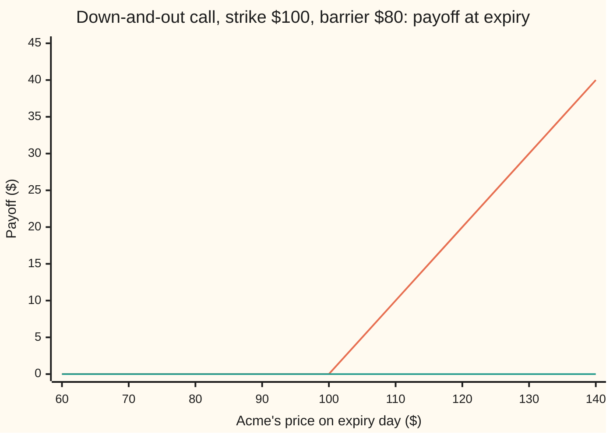
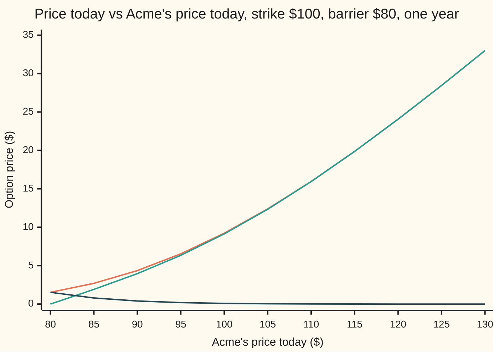

# Knock-out and knock-in options: a contract that dies or is born the first time the share touches a line

[Syllabus](../../../SYLLABUS.md) → [Financial mathematics](../../../SYLLABUS.md#w12) → [Barriers, touches and lookbacks](../../../SYLLABUS.md#w12-s16) → Knock-out and knock-in options

---

## General Overview

Acme shares trade at $100. A one-year call option gives its holder the right to buy one Acme share for $100 in a year's time. On the house market it costs $9.23.

Now add one clause. If Acme trades at $80 or lower at any moment during the year, the option is cancelled on the spot. Acme might crash to $79 in March and finish at $130 in December. The plain call pays $30. The cancelled one pays nothing.

That clause is a **barrier**: a price level written into the contract, here $80. A contract that dies at the first touch is a **knock-out**. Its twin, which does not exist until the first touch and then becomes a plain call, is a **knock-in**. The barrier looks at the whole path the share takes, not only where it ends, so these contracts are called **path-dependent**.

The knock-out can only lose payoffs, so it is cheaper than the plain call: $9.13 against $9.23. The knock-in costs the difference, $0.09. The two always add to the plain call, because every path either touches $80 or does not.

**A barrier splits every future into "touched" and "never touched", so knock-in plus knock-out equals the plain option; and in the Black-Scholes model the touched paths are a mirror image of other paths, so the knock-out is the plain call minus one reflected call.**

**What kind of fact this is:** a definition of the eight barrier contracts, and two theorems proved on this card in Why it works: in-out parity, which needs no model, and the reflection price, which holds inside the Black-Scholes model.

### The picture: two payoffs, and the path decides which one applies

At expiry the knock-out pays the plain call's payoff if Acme never touched $80, and zero if it did. The deciding event may lie months in the past.



Upper line (orange): the path never touched $80, so the contract pays like a plain call. Lower line (green): the path touched $80 at least once, so the contract died and pays zero at every final price. The knock-in's picture is the same two lines with the labels swapped.

---

## The formula

Notation first, in words. $C(x)$ means the Black-Scholes call price with today's share price set to $x$ and every other input left alone ([Black–Scholes call](../08-The%20Black-Scholes%20call%20and%20put/01-black-scholes-call.md)). So $C(S)$ is the plain call, and $C(H^2/S)$ is the same call priced as if the share stood at a different level. The subscripts "do" and "di" stand for down-and-out and down-and-in.

$$C_{\text{di}} + C_{\text{do}} = C(S)$$

**Read it aloud:** the knock-in plus the knock-out, same strike, same barrier, same expiry, costs exactly one plain call.

$$C_{\text{do}} = C(S) - \left(\frac{H}{S}\right)^{2\nu/\sigma^2} C\!\left(\frac{H^2}{S}\right), \qquad \nu = r - q - \tfrac12\sigma^2$$

**Read it aloud:** the knock-out is the plain call minus a reflected call, the reflected call started from the mirror image of today's price in the barrier and scaled down by a weight that accounts for drift.

By parity the subtracted piece is the knock-in: $C_{\text{di}} = (H/S)^{2\nu/\sigma^2}\, C(H^2/S)$.

| Symbol | Plain meaning | In our example | Push it up and the knock-out… |
| --- | --- | --- | --- |
| $S$ | Acme's price today | $100 | rises: more upside and more room above the barrier |
| $S_T$ | Acme's price on expiry day, $T$ years out | unknown today | — |
| $m_T$ | the running minimum: the lowest price Acme reaches between now and expiry | unknown today | — |
| $K$ | the strike, the price the holder may pay | $100 | falls |
| $H$ | the barrier, below today's price and at or below the strike | $80 | falls, steeply near $S$: at $H = S$ it is worth zero |
| $T$ | time to expiry, in years | 1 | rises here, a little less than a plain call: more time to climb, but also more time to touch |
| $r$, $q$ | the riskless rate and the dividend yield, both continuously compounded | 5%, 2% | $r$ up: rises; $q$ up: falls, since dividends pull the price toward the barrier |
| $\sigma$ | volatility: the yearly spread of log price moves | 20% | here rises; with a barrier close to $S$ it can fall |
| $\nu$ | the drift of the log price in the pricing world | 0.01 | — |
| $b$ | the barrier in log units, $\ln(H/S)$, negative because $H$ is below $S$ | $\ln 0.8$ | — |
| $C(x)$, $N$ | the Black-Scholes call with today's price $x$; inside it sit the bell-curve area $N$ and the discount factor $e^{-rT}$ | $C(100) = 9.227006$ | — |
| $C_{\text{do}}$, $C_{\text{di}}$ | today's price of the down-and-out and down-and-in call | 9.133306, 0.093699 | the out rises exactly as much as the in falls |

Two helper quantities have names of their own:

- $H^2/S$ is the **image spot**, $64 here. On a log scale it sits as far below the barrier as today's price sits above it: $\ln 64 = 2\ln 80 - \ln 100$.
- $(H/S)^{2\nu/\sigma^2}$ is the **reflection weight**, 0.894427 here. With no drift it would be 1. A small upward drift makes the mirrored paths a little rarer than their originals.

### The eight contracts

A barrier sits **down** (below today's price) or **up** (above it). Touching it knocks the option **out** or **in**. The option underneath is a **call** or a **put**. Two times two times two is eight.

| Barrier and effect | Call version | Put version | Its parity twin |
| --- | --- | --- | --- |
| down-and-out: dies if $m_T$ reaches $H$ | down-and-out call | down-and-out put | down-and-in |
| down-and-in: born if $m_T$ reaches $H$ | down-and-in call | down-and-in put | down-and-out |
| up-and-out: dies if the running maximum reaches the barrier | up-and-out call | up-and-out put | up-and-in |
| up-and-in: born if the running maximum reaches the barrier | up-and-in call | up-and-in put | up-and-out |

Parity pairs each row with its twin, so only four of the eight need their own formula. This card derives one, the down-and-out call with the barrier at or below the strike. All eight live on [The eight barrier formulas](02-reiner-rubinstein-barrier-formulas.md).

### When it holds

- **Parity holds in any model.** It uses only the payoffs and the rule that two things paying the same must cost the same. It fails only when the twins differ in small print: a cash **rebate** paid on knock-out, or a different watching rule on each leg.
- **The share is watched continuously.** The formula counts a touch at any instant. A contract that checks only daily closes misses touches between closes and is worth more: here about 0.019 more, as the simulation below measures. The fix is on [Daily monitoring](03-discrete-monitoring-correction.md).
- **Black-Scholes dynamics: constant volatility, rate and dividend yield.** The mirror argument needs the log price to be a Brownian motion with constant drift. Quoted option prices imply a volatility that changes with the price level; there the reflected formula misprices the barrier, and desks use other models.
- **The barrier sits at or below the strike, and below today's price.** With $H \le K$ every touched path's mirror ends below the strike, which is what makes one subtraction enough. A barrier above the strike needs extra terms. With $S \le H$ the knock-out is already dead, worth 0, and the knock-in is already a plain call.

---

## Why it works

### Step 0: every path touches or it does not

Hold a knock-in and a knock-out on the same terms, and take any path Acme might follow.

If the path touches $80, the knock-out died and the knock-in was born: the holder has a plain call at expiry. If the path never touches $80, the knock-in never came to life and the knock-out survived: again a plain call. There is no third case.

So the pair pays exactly a plain call's payoff on every path. Two holdings that pay the same in every future must cost the same today, or the cheaper one could be bought and the dearer one sold for a riskless gain ([Put-call parity](../08-The%20Black-Scholes%20call%20and%20put/03-put-call-parity.md) runs the same argument). That is in-out parity. It needed no model of how Acme moves.

### Step 1: price only the untouched paths

The knock-out pays $\max(S_T - K, 0)$ when $m_T > H$, and zero otherwise. Its price is the discounted average of that payoff in the pricing world, where Acme grows at the riskless rate less the dividend yield.

Work in log units. Let $x = \ln(S_T/S)$, the log of the year's growth factor. In the Black-Scholes pricing world $x$ is normally distributed (a bell curve) with centre $\nu T$ and spread $\sigma\sqrt{T}$. The barrier becomes the level $b = \ln(H/S)$ below zero.

The knock-out must drop the paths that touched $b$ on the way. So the task is to count, for each end point $x$, how many paths reaching it touched $b$ first.

### Step 2: with no drift, the touched paths are a mirror image

Take a path that starts at 0, touches $b$, and ends at $x$ above $b$. Flip everything after the first touch upside down about $b$. The new path ends at $2b - x$, below the barrier.

The flip is one-to-one and, with no drift, keeps probabilities. So "touched $b$ and ended at $x$" is exactly as likely as "ended at $2b - x$". The second event needs no path at all; it is one reading of the bell curve. This is the reflection principle ([Reflection principle](../../11-Stochastic%20processes%20and%20calculus/05-Brownian%20Motion/04-reflection-principle-and-running-maximum.md)).

### Step 3: drift tilts the mirror by a fixed weight

With drift $\nu$ the flip no longer keeps probabilities. An upward drift favours the original path, which climbs back up after the touch, over its mirror, which keeps falling.

The fix is a single factor. The chance density of a drifting path, compared with a driftless one, depends only on where the path ends. That turns the reflection into:

$$\text{density of touched paths ending at } x \;=\; e^{2\nu b/\sigma^2}\,\times\,\text{density of all paths ending at } x - 2b.$$

Since $e^{b} = H/S$, the factor $e^{2\nu b/\sigma^2}$ is the reflection weight $(H/S)^{2\nu/\sigma^2}$. Here $\nu = 0.01$, the exponent is 0.5, and the weight is $\sqrt{0.8} = 0.894427$.

<details>
<summary>Detailed proof: the drifted reflection</summary>

Write $x$ for the end point and $p_\nu(x)$ for the bell-curve density with centre $\nu T$ and spread $\sigma\sqrt T$; $p_0(x)$ is the same with centre 0.

**Driftless.** The reflection principle gives, for $x > b$: the density of paths that touch $b$ and end at $x$ equals $p_0(2b - x)$.

**Adding drift.** A path of $\sigma W_t + \nu t$ has, relative to the driftless path $\sigma W_t$, the likelihood ratio $\exp(\nu x/\sigma^2 - \nu^2 T/(2\sigma^2))$. That ratio depends on the path only through its end point $x$ (this is Girsanov's theorem in its simplest form, and it can be checked by completing the square in $p_\nu(x)/p_0(x)$). So the drifted density of touched paths ending at $x$ is
$$p_0(2b - x)\,\exp\!\left(\frac{\nu x}{\sigma^2} - \frac{\nu^2 T}{2\sigma^2}\right).$$

**Matching it to a shifted bell curve.** The same ratio at the point $y = x - 2b$ gives $p_\nu(y) = p_0(y)\exp(\nu y/\sigma^2 - \nu^2T/(2\sigma^2))$. Since $p_0(x)$ is symmetric about 0, $p_0(2b - x) = p_0(x - 2b) = p_0(y)$. Divide the two expressions: the touched density equals $p_\nu(x - 2b)\,e^{2\nu b/\sigma^2}$.

**Untouched paths.** Subtract from all paths: the density of paths ending at $x > b$ that never touched $b$ is $p_\nu(x) - e^{2\nu b/\sigma^2}\,p_\nu(x - 2b)$. At $x = b$ the two terms cancel: the bell curve's values at $b$ and at $-b$ differ by exactly the factor $e^{2\nu b/\sigma^2}$. An untouched path cannot end on the barrier.

</details>

### Step 4: the touched part is a call started from the image spot

The knock-out price is the plain call minus the touched part:

$$e^{-rT}\int (S e^{x} - K)^+\; e^{2\nu b/\sigma^2}\, p_\nu(x - 2b)\, dx.$$

Substitute $y = x - 2b$. Then $S e^{x} = S e^{2b} e^{y} = (H^2/S)\,e^{y}$, because $e^{2b} = H^2/S^2$. The integral becomes the plain call's own average with today's price $H^2/S$ in place of $S$. That is $C(H^2/S)$, times the weight.

One condition was used silently. Step 3 holds only for end points above the barrier, $x > b$. The call pays only when $S_T > K$, and with $K \ge H$ every such end point is above the barrier. With $H > K$ that fails, and extra terms appear.

### Step 5: subtract, and check the edges

$$C_{\text{do}} = C(S) - \left(\frac{H}{S}\right)^{2\nu/\sigma^2} C\!\left(\frac{H^2}{S}\right).$$

Two edge checks. At $S = H$ the weight is 1 and the image spot is $H$ itself, so the two terms cancel: a knock-out standing on its barrier is worth 0, as it must be. As $H$ falls toward zero, the image spot falls too, the reflected call is worth almost nothing, and the knock-out becomes the plain call.

A second door: the knock-out's price obeys the Black-Scholes pricing equation with value zero on the barrier. The mirrored call solves the same equation and cancels the plain call along the barrier, the method of images. Road 3 of the check solves that equation on a grid with no mirror in it.

---

## Worked numbers, by hand

House market: $S = K = 100$, $r = 5\%$, $q = 2\%$, $\sigma = 20\%$, $T = 1$, barrier $H = 80$.

| Step | Arithmetic | Value |
| --- | --- | --- |
| drift of the log price, $\nu$ | $0.05 - 0.02 - \tfrac12 (0.2)^2$ | 0.010000 |
| exponent, $2\nu/\sigma^2$ | $0.02 / 0.04$ | 0.500000 |
| reflection weight | $(80/100)^{0.5}$ | 0.894427 |
| image spot, $H^2/S$ | $80 \times 80 / 100$ | 64 |
| plain call, $C(100)$ | Black-Scholes | 9.227006 |
| reflected call, $C(64)$ | Black-Scholes, share at $64 | 0.104759 |
| down-and-in | $0.894427 \times 0.104759$ | **0.093699** |
| down-and-out | $9.227006 - 0.093699$ | **9.133306** |
| parity check | $9.133306 + 0.093699$ | 9.227006 |

The knock-out costs $9.13 and the knock-in $0.09. A 20% fall followed by a recovery above the strike is rare enough on this market that the clause removes only nine cents.

The barrier's distance is what matters. Move it and the knock-out price changes as follows, each bar $0.25 per block:

```
barrier H   down-and-out call, S = K = 100, one year
     $60   █████████████████████████████████████  $9.23
     $70   █████████████████████████████████████  $9.23
     $80   █████████████████████████████████████  $9.13
     $90   ██████████████████████████████         $7.59
     $95   ████████████████████                   $4.88
     $99   █████                                  $1.17
```

Far away, the barrier costs nothing that shows at the cent. Within $5 of the price it removes about half the value.

### What breaks if you drop a piece

Correct answer 9.133306.

| Mistake | Comes out at | What went wrong |
| --- | --- | --- |
| Leave out the reflection weight | 9.122247 | Treats the drifting share as driftless; the mirrored paths are overcounted. Still zero at the barrier, so it hides. |
| Put $+\tfrac12\sigma^2$ in the exponent's drift | 9.167038 | Uses $r - q + \tfrac12\sigma^2$, a Black-Scholes term that does not belong here; the mirror needs the drift of the log price itself |
| Place the image at $H$, not $H^2/S$ | 7.857856 | Reflection is multiplicative: $64 lies as far below $80 in log terms as $100 lies above |
| Check only the end price against the barrier | 9.227006 | With $K \ge H$ every paying end point is above $80 anyway; the clause about the path has been ignored |

---

## How the price moves with the share

The knock-out behaves like the plain call far above the barrier and collapses to zero on it. The knock-in does the opposite.



Orange: the plain call. Green: the down-and-out call, at 0.00 on the barrier and merging with the plain call by $120. Dark blue: the down-and-in call, equal to the plain call, 1.53, on the barrier, where it has just been born, and fading to nothing above. At every price the green and dark blue lines add to the orange one.

The sensitivities, by nudging the formula, show the barrier's pull at $100:

| Greek | Down-and-out | Plain call | Why they differ |
| --- | --- | --- | --- |
| delta, dollars per $1 move | 0.600658 (grid: 0.600669) | 0.586851 | a rise also moves the share away from the barrier |
| gamma, change in delta per $1 | 0.016972 | 0.018951 | the barrier trims the curvature of the price |
| vega, dollars per volatility point | 0.344293 | 0.378999 | more volatility also means more touches |

Near the barrier these numbers change fast and the delta jumps at the wall itself: [Barrier Greeks](04-barrier-greeks-at-the-wall.md).

---

## Code, from first principles, and it actually runs

The checks reach the down-and-out price by **four roads**. Road 1 is the reflection formula. Road 2 averages the payoff over the untouched-path density of Step 3 by Simpson's rule, with no Black-Scholes formula in it. Road 3 solves the pricing equation on a grid in log price, with the value held at zero on the barrier and no mirror anywhere. Road 4 simulates 10,000 one-year paths of 252 daily closes from a hand-written random number generator. Each simulated path is scored twice: knocked out at a close below $80 (the daily contract), and weighted by the chance that it stayed above $80 between every two closes, a Brownian-bridge correction that turns daily steps into continuous watching. Parity is checked by adding the grid's knock-out to the integral's knock-in, two roads that share no code.

### Python

```python
# Knock-out and knock-in options -- the check behind the card.  Standard library only.
# House market: S = K = 100, r = 5%, q = 2%, sigma = 20%, one year; barrier H = 80 below.
# Four roads to the down-and-out call: the reflection formula, a Simpson integral over the
# surviving-path density, a finite-difference grid that knows nothing of mirrors, and a
# 10,000-path daily simulation.  The normal CDF, integrator, solver and random numbers are here.
from math import log, exp, sqrt, pi, cos, sin

def phi(x): return exp(-0.5 * x * x) / sqrt(2.0 * pi)            # bell-curve height
def N(x):                                                          # bell-curve area, by its power series
    if x < -9.0: return 0.0
    if x > 9.0: return 1.0
    term, s, k = x, x, 0
    while k < 400 and abs(term) > 1e-17 * abs(s):
        k += 1; term *= x * x / (2 * k + 1); s += term
    return 0.5 + phi(x) * s

def call(S, K, r, q, v, T):                                        # Black-Scholes call
    d1 = (log(S / K) + (r - q + 0.5 * v * v) * T) / (v * sqrt(T)); d2 = d1 - v * sqrt(T)
    return S * exp(-q * T) * N(d1) - K * exp(-r * T) * N(d2)

def weight(S, H, r, q, v): return (H / S) ** (2.0 * (r - q - 0.5 * v * v) / (v * v))
def d_in(S, K, H, r, q, v, T): return weight(S, H, r, q, v) * call(H * H / S, K, r, q, v, T)
def d_out(S, K, H, r, q, v, T): return call(S, K, r, q, v, T) - d_in(S, K, H, r, q, v, T)

def simpson(f, a, b, n=20000):
    h = (b - a) / n; s = f(a) + f(b)
    for i in range(1, n): s += (4 if i % 2 else 2) * f(a + i * h)
    return s * h / 3.0

def by_density(S, K, H, r, q, v, T):
    # Road 2: average the payoff over where log-price ends, split into untouched and touched paths.
    nu, sd, b = r - q - 0.5 * v * v, v * sqrt(T), log(H / S)
    p = lambda x: phi((x - nu * T) / sd) / sd                       # free density of x = ln(S_T / S)
    pay = lambda x: S * exp(x) - K
    lo, hi = log(K / S), log(K / S) + 12.0 * sd
    touched = simpson(lambda x: pay(x) * exp(2 * nu * b / (v * v)) * p(x - 2 * b), lo, hi)
    alive = simpson(lambda x: pay(x) * p(x), lo, hi) - touched
    return exp(-r * T) * alive, exp(-r * T) * touched

def by_grid(S, K, H, r, q, v, T, below=50, M=400, steps=500):
    # Road 3: the pricing equation on a grid in ln S, value held at 0 on the barrier.  No mirror.
    dx = log(S / H) / below; dt = T / steps; nu = r - q - 0.5 * v * v
    xs = [log(H) + i * dx for i in range(M + 1)]
    V = [max(exp(x) - K, 0.0) for x in xs]
    a = 0.5 * v * v / dx ** 2 - 0.5 * nu / dx; c = 0.5 * v * v / dx ** 2 + 0.5 * nu / dx; bb = -v * v / dx ** 2 - r
    for n in range(steps):
        th = 1.0 if n < 4 else 0.5                                  # four plain steps smooth the kink
        tau = (n + 1) * dt
        rhs = [V[i] + (1 - th) * dt * (a * V[i - 1] + bb * V[i] + c * V[i + 1]) for i in range(1, M)]
        top = exp(xs[M] - q * tau) - K * exp(-r * tau)
        rhs[-1] += th * dt * c * top
        lo_, di_, up_ = -th * dt * a, 1 - th * dt * bb, -th * dt * c
        cp, dp = [0.0] * (M - 1), [0.0] * (M - 1)                   # Thomas algorithm
        for i in range(M - 1):
            den = di_ - (lo_ * cp[i - 1] if i else 0.0)
            cp[i] = up_ / den; dp[i] = (rhs[i] - (lo_ * dp[i - 1] if i else 0.0)) / den
        for i in range(M - 2, -1, -1):
            V[i + 1] = dp[i] - (cp[i] * V[i + 2] if i < M - 2 else 0.0)
        V[0], V[M] = 0.0, top
    return V[below], (V[below + 1] - V[below - 1]) / (exp(xs[below + 1]) - exp(xs[below - 1]))

def by_simulation(S, K, H, r, q, v, T, paths=10000, days=252, seed=20260924):
    # Road 4: simulate daily closes.  Count a knock-out at a close below H (the daily contract),
    # and separately weight each path by the chance it slipped under H between closes (continuous).
    state = [seed]
    def unif():                                                     # splitmix64, written out
        state[0] = (state[0] + 0x9E3779B97F4A7C15) & 0xFFFFFFFFFFFFFFFF
        z = state[0]
        z = ((z ^ (z >> 30)) * 0xBF58476D1CE4E5B9) & 0xFFFFFFFFFFFFFFFF
        z = ((z ^ (z >> 27)) * 0x94D049BB133111EB) & 0xFFFFFFFFFFFFFFFF
        return ((z ^ (z >> 31)) >> 11) * 2.0 ** -53 + 2.0 ** -54
    dt = T / days; mu = (r - q - 0.5 * v * v) * dt; sd = v * sqrt(dt); h = log(H / S)
    disc = exp(-r * T); sums = [[0.0, 0.0] for _ in range(5)]
    for _ in range(paths):
        x, daily_alive, surv, z2 = 0.0, True, 1.0, None
        for _ in range(days):
            if z2 is None:
                u1, u2 = unif(), unif(); rad = sqrt(-2.0 * log(u1))
                z, z2 = rad * cos(2 * pi * u2), rad * sin(2 * pi * u2)
            else: z, z2 = z2, None
            nx = x + mu + sd * z
            if nx <= h: daily_alive = False; surv = 0.0
            elif surv > 0.0: surv *= 1.0 - exp(-2.0 * (x - h) * (nx - h) / (v * v * dt))
            x = nx
        pay = disc * max(S * exp(x) - K, 0.0)
        for j, y in enumerate((pay, pay * daily_alive, pay * surv, pay * (daily_alive - surv), pay * (1 - surv))):
            sums[j][0] += y; sums[j][1] += y * y
    return [(s / paths, sqrt((s2 / paths - (s / paths) ** 2) / (paths - 1))) for s, s2 in sums]

S, K, H, r, q, v, T = 100.0, 100.0, 80.0, 0.05, 0.02, 0.20, 1.0
nu = r - q - 0.5 * v * v
C, w, img = call(S, K, r, q, v, T), weight(S, H, r, q, v), H * H / S
DO, DI = d_out(S, K, H, r, q, v, T), d_in(S, K, H, r, q, v, T)
bgk = d_out(S, K, H * exp(-0.5826 * v * sqrt(T / 252)), r, q, v, T) - DO; do_int, di_int = by_density(S, K, H, r, q, v, T)
do_grid, delta_grid = by_grid(S, K, H, r, q, v, T)
mc = by_simulation(S, K, H, r, q, v, T)
bump = lambda f, s, e: (f(s + e) - f(s - e)) / (2 * e); fo = lambda s: d_out(s, K, H, r, q, v, T); fc = lambda s: call(s, K, r, q, v, T)
rows = [("drift of ln S, nu = r - q - sigma^2/2", nu), ("exponent 2 nu / sigma^2", 2 * nu / v ** 2),
    ("reflection weight (H/S)^(2nu/sigma^2)", w), ("image spot H^2/S", img),
    ("vanilla call C(100)", C), ("image call C(64)", call(img, K, r, q, v, T)),
    ("1 down-and-in, formula", DI), ("1 down-and-out, formula", DO), ("  in + out", DI + DO),
    ("2 down-and-out, density integral", do_int), ("2 down-and-in, density integral", di_int),
    ("3 down-and-out, grid, no mirror", do_grid), ("  grid out + integral in", do_grid + di_int),
    ("4 vanilla, simulation", mc[0][0]), ("  its error bar (1 s.e.)", mc[0][1]),
    ("4 out, daily closes", mc[1][0]), ("  its error bar (1 s.e.)", mc[1][1]),
    ("4 in, daily closes = vanilla - out", mc[0][0] - mc[1][0]),
    ("4 out, continuous (bridge)", mc[2][0]), ("  its error bar (1 s.e.)", mc[2][1]),
    ("4 in, continuous (bridge)", mc[4][0]), ("  its error bar (1 s.e.)", mc[4][1]),
    ("4 daily minus continuous, same paths", mc[3][0]), ("  its error bar (1 s.e.)", mc[3][1]), ("  shifted-barrier estimate", bgk),
    ("greek: delta out, bump", bump(fo, S, 0.01)), ("greek: delta out, grid", delta_grid),
    ("greek: delta vanilla", bump(fc, S, 0.01)),
    ("greek: gamma out", (fo(S + 0.1) - 2 * fo(S) + fo(S - 0.1)) / 0.01),
    ("greek: gamma vanilla", (fc(S + 0.1) - 2 * fc(S) + fc(S - 0.1)) / 0.01),
    ("greek: vega out, per vol point", (d_out(S, K, H, r, q, .21, T) - d_out(S, K, H, r, q, .19, T)) / 2),
    ("greek: vega vanilla, per vol point", (call(S, K, r, q, .21, T) - call(S, K, r, q, .19, T)) / 2),
    ("wrong: weight left out", C - call(img, K, r, q, v, T)),
    ("wrong: exponent with +sigma^2/2", C - (H / S) ** (2 * (r - q + .5 * v * v) / v ** 2) * call(img, K, r, q, v, T)),
    ("wrong: image at H, not H^2/S", C - w * call(H, K, r, q, v, T)),
    ("wrong: only the end price checked", C),
    ("try: H = 90", d_out(S, K, 90.0, r, q, v, T)), ("try: sigma = 0.30, H = 80", d_out(S, K, H, r, q, .3, T)),
    ("try: S = 85, out", d_out(85.0, K, H, r, q, v, T)), ("try: S = 85, in", d_in(85.0, K, H, r, q, v, T))]
for name, val in rows: print(f"{name:<40} {val:>12.6f}")
print("bars, barrier H :" + "".join(f"{h:>8.0f}" for h in (60, 70, 80, 90, 95, 99)))
print("bars, out price :" + "".join(f"{d_out(S, K, h, r, q, v, T):>8.2f}" for h in (60, 70, 80, 90, 95, 99)))
sp = [80.0 + 5 * i for i in range(11)]
print("chart, spot     :" + "".join(f"{s:>7.0f}" for s in sp))
print("chart, vanilla  :" + "".join(f"{call(s, K, r, q, v, T):>7.2f}" for s in sp))
print("chart, out      :" + "".join(f"{d_out(s, K, H, r, q, v, T):>7.2f}" for s in sp))
print("chart, in       :" + "".join(f"{d_in(s, K, H, r, q, v, T):>7.2f}" for s in sp))
se = [60.0 + 10 * i for i in range(9)]
print("payoff, S_T     :" + "".join(f"{s:>7.0f}" for s in se) + "\npayoff, alive   :" + "".join(f"{max(s - K, 0.0):>7.0f}" for s in se))
assert abs(DO - 9.133306436498) < 1e-9, "formula vs the card's worked number"
assert abs(do_int - DO) < 1e-7, "density integral vs the reflection formula, out"
assert abs(di_int - DI) < 1e-7, "density integral vs the reflection formula, in"
assert abs(do_grid - DO) < 2e-3, "grid with no mirror vs the formula"
assert abs(do_grid + di_int - C) < 2e-3, "in-out parity from two independent roads"
assert abs(mc[2][0] - DO) < 3 * mc[2][1], "continuous simulated out within 3 error bars of the formula"
assert abs(mc[4][0] - DI) < 3 * mc[4][1], "continuous simulated in within 3 error bars of the formula"
assert abs(mc[3][0] - bgk) < 2 * mc[3][1] < mc[3][0], "daily premium: real, and within 2 error bars of the shifted barrier"
print("ALL CHECKS PASS")
```

**Ran 2026-09-24 on macOS, Python 3.14.6, standard library only. All checks passed. Output, pasted from the run:**

```
drift of ln S, nu = r - q - sigma^2/2        0.010000
exponent 2 nu / sigma^2                      0.500000
reflection weight (H/S)^(2nu/sigma^2)        0.894427
image spot H^2/S                            64.000000
vanilla call C(100)                          9.227006
image call C(64)                             0.104759
1 down-and-in, formula                       0.093699
1 down-and-out, formula                      9.133306
  in + out                                   9.227006
2 down-and-out, density integral             9.133306
2 down-and-in, density integral              0.093699
3 down-and-out, grid, no mirror              9.132790
  grid out + integral in                     9.226489
4 vanilla, simulation                        9.293414
  its error bar (1 s.e.)                     0.138221
4 out, daily closes                          9.211684
  its error bar (1 s.e.)                     0.138328
4 in, daily closes = vanilla - out           0.081730
4 out, continuous (bridge)                   9.192604
  its error bar (1 s.e.)                     0.138342
4 in, continuous (bridge)                    0.100810
  its error bar (1 s.e.)                     0.011862
4 daily minus continuous, same paths         0.019080
  its error bar (1 s.e.)                     0.004469
  shifted-barrier estimate                   0.018117
greek: delta out, bump                       0.600658
greek: delta out, grid                       0.600669
greek: delta vanilla                         0.586851
greek: gamma out                             0.016972
greek: gamma vanilla                         0.018951
greek: vega out, per vol point               0.344293
greek: vega vanilla, per vol point           0.378999
wrong: weight left out                       9.122247
wrong: exponent with +sigma^2/2              9.167038
wrong: image at H, not H^2/S                 7.857856
wrong: only the end price checked            9.227006
try: H = 90                                  7.586954
try: sigma = 0.30, H = 80                   12.087096
try: S = 85, out                             1.913654
try: S = 85, in                              0.787857
bars, barrier H :      60      70      80      90      95      99
bars, out price :    9.23    9.23    9.13    7.59    4.88    1.17
chart, spot     :     80     85     90     95    100    105    110    115    120    125    130
chart, vanilla  :   1.53   2.70   4.36   6.54   9.23  12.39  15.96  19.88  24.06  28.46  33.00
chart, out      :   0.00   1.91   3.96   6.34   9.13  12.34  15.94  19.87  24.06  28.45  33.00
chart, in       :   1.53   0.79   0.40   0.19   0.09   0.04   0.02   0.01   0.00   0.00   0.00
payoff, S_T     :     60     70     80     90    100    110    120    130    140
payoff, alive   :      0      0      0      0      0     10     20     30     40
ALL CHECKS PASS
```

Road 2 matches the formula to six decimals. The grid, which never heard of mirrors, agrees to within a tenth of a cent. Grid knock-out plus integral knock-in gives 9.226489 against the plain 9.227006: parity through independent code.

The simulation's plain call came out at 9.293414, error bar 0.138221: this set of paths runs slightly rich, and the knock-out estimates share that luck. The continuous knock-out, 9.192604, sits well inside one error bar of 9.133306. The knock-in is the sharper test, since it pays on few paths: 0.100810 plus or minus 0.011862 against 0.093699. The **monitoring bias** is measured on the same paths, so the luck cancels: the daily contract is worth 0.019080 more, error bar 0.004469, and the daily knock-in, 0.081730, is that much cheaper. Shifting the barrier down by $e^{-0.5826\,\sigma\sqrt{1/252}}$ and reusing the continuous formula predicts 0.018117, inside the error bar; that shift is the subject of [Daily monitoring](03-discrete-monitoring-correction.md).

### Rust

The same four roads, built with `rustc --edition 2021 -O`. The random number generator and the power series for the bell-curve area are written out again, so the two outputs agree to every printed digit.

```rust
// Knock-out and knock-in options -- the same check as the Python, in Rust.  No crates.
// House market: S = K = 100, r = 5%, q = 2%, sigma = 20%, one year; barrier H = 80 below.
// Four roads to the down-and-out call: the reflection formula, a Simpson integral over the
// surviving-path density, a finite-difference grid that knows nothing of mirrors, and a
// 10,000-path daily simulation.  The normal CDF, integrator, solver and random numbers are here.
use std::f64::consts::PI;

fn phi(x: f64) -> f64 { (-0.5 * x * x).exp() / (2.0 * PI).sqrt() }
fn n_cdf(x: f64) -> f64 {                                          // bell-curve area, by its power series
    if x < -9.0 { return 0.0; }
    if x > 9.0 { return 1.0; }
    let (mut term, mut s, mut k) = (x, x, 0);
    while k < 400 && term.abs() > 1e-17 * s.abs() { k += 1; term *= x * x / (2 * k + 1) as f64; s += term; }
    0.5 + phi(x) * s
}
fn call(s: f64, k: f64, r: f64, q: f64, v: f64, t: f64) -> f64 {
    let d1 = ((s / k).ln() + (r - q + 0.5 * v * v) * t) / (v * t.sqrt());
    let d2 = d1 - v * t.sqrt();
    s * (-q * t).exp() * n_cdf(d1) - k * (-r * t).exp() * n_cdf(d2)
}
fn weight(s: f64, h: f64, r: f64, q: f64, v: f64) -> f64 { (h / s).powf(2.0 * (r - q - 0.5 * v * v) / (v * v)) }
fn d_in(s: f64, k: f64, h: f64, r: f64, q: f64, v: f64, t: f64) -> f64 { weight(s, h, r, q, v) * call(h * h / s, k, r, q, v, t) }
fn d_out(s: f64, k: f64, h: f64, r: f64, q: f64, v: f64, t: f64) -> f64 { call(s, k, r, q, v, t) - d_in(s, k, h, r, q, v, t) }

fn simpson<F: Fn(f64) -> f64>(f: F, a: f64, b: f64, n: usize) -> f64 {
    let h = (b - a) / n as f64;
    let mut s = f(a) + f(b);
    for i in 1..n { s += if i % 2 == 1 { 4.0 } else { 2.0 } * f(a + i as f64 * h); }
    s * h / 3.0
}

fn by_density(s: f64, k: f64, h: f64, r: f64, q: f64, v: f64, t: f64) -> (f64, f64) {
    // Road 2: average the payoff over where log-price ends, split into untouched and touched paths.
    let (nu, sd, b) = (r - q - 0.5 * v * v, v * t.sqrt(), (h / s).ln());
    let p = |x: f64| phi((x - nu * t) / sd) / sd;
    let pay = |x: f64| s * x.exp() - k;
    let (lo, hi) = ((k / s).ln(), (k / s).ln() + 12.0 * sd);
    let touched = simpson(|x| pay(x) * (2.0 * nu * b / (v * v)).exp() * p(x - 2.0 * b), lo, hi, 20000);
    let alive = simpson(|x| pay(x) * p(x), lo, hi, 20000) - touched;
    ((-r * t).exp() * alive, (-r * t).exp() * touched)
}

fn by_grid(s: f64, k: f64, h: f64, r: f64, q: f64, v: f64, t: f64) -> (f64, f64) {
    // Road 3: the pricing equation on a grid in ln S, value held at 0 on the barrier.  No mirror.
    let (below, m, steps) = (50usize, 400usize, 500usize);
    let dx = (s / h).ln() / below as f64; let dt = t / steps as f64; let nu = r - q - 0.5 * v * v;
    let xs: Vec<f64> = (0..=m).map(|i| h.ln() + i as f64 * dx).collect();
    let mut vv: Vec<f64> = xs.iter().map(|x| (x.exp() - k).max(0.0)).collect();
    let a = 0.5 * v * v / (dx * dx) - 0.5 * nu / dx;
    let c = 0.5 * v * v / (dx * dx) + 0.5 * nu / dx;
    let bb = -v * v / (dx * dx) - r;
    for n in 0..steps {
        let th = if n < 4 { 1.0 } else { 0.5 };                    // four plain steps smooth the kink
        let tau = (n + 1) as f64 * dt;
        let mut rhs: Vec<f64> = (1..m).map(|i| vv[i] + (1.0 - th) * dt * (a * vv[i - 1] + bb * vv[i] + c * vv[i + 1])).collect();
        let top = (xs[m] - q * tau).exp() - k * (-r * tau).exp();
        let last = rhs.len() - 1; rhs[last] += th * dt * c * top;
        let (lo, di, up) = (-th * dt * a, 1.0 - th * dt * bb, -th * dt * c);
        let (mut cp, mut dp) = (vec![0.0; m - 1], vec![0.0; m - 1]);   // Thomas algorithm
        for i in 0..m - 1 {
            let den = di - if i > 0 { lo * cp[i - 1] } else { 0.0 };
            cp[i] = up / den; dp[i] = (rhs[i] - if i > 0 { lo * dp[i - 1] } else { 0.0 }) / den;
        }
        for i in (0..m - 1).rev() { vv[i + 1] = dp[i] - if i < m - 2 { cp[i] * vv[i + 2] } else { 0.0 }; }
        vv[0] = 0.0; vv[m] = top;
    }
    (vv[below], (vv[below + 1] - vv[below - 1]) / (xs[below + 1].exp() - xs[below - 1].exp()))
}

fn by_simulation(s: f64, k: f64, h: f64, r: f64, q: f64, v: f64, t: f64) -> Vec<(f64, f64)> {
    // Road 4: simulate daily closes.  Count a knock-out at a close below H (the daily contract),
    // and separately weight each path by the chance it slipped under H between closes (continuous).
    let (paths, days) = (10000usize, 252usize);
    let mut state: u64 = 20260924;
    let mut unif = || {                                              // splitmix64, written out
        state = state.wrapping_add(0x9E3779B97F4A7C15);
        let mut z = state;
        z = (z ^ (z >> 30)).wrapping_mul(0xBF58476D1CE4E5B9);
        z = (z ^ (z >> 27)).wrapping_mul(0x94D049BB133111EB);
        ((z ^ (z >> 31)) >> 11) as f64 * 2f64.powi(-53) + 2f64.powi(-54)
    };
    let dt = t / days as f64; let mu = (r - q - 0.5 * v * v) * dt; let sd = v * dt.sqrt(); let hl = (h / s).ln();
    let disc = (-r * t).exp();
    let mut sums = [[0.0f64; 2]; 5];
    for _ in 0..paths {
        let (mut x, mut daily_alive, mut surv, mut z2): (f64, f64, f64, Option<f64>) = (0.0, 1.0, 1.0, None);
        for _ in 0..days {
            let z = match z2.take() {
                Some(zz) => zz,
                None => {
                    let (u1, u2) = (unif(), unif()); let rad = (-2.0 * u1.ln()).sqrt();
                    z2 = Some(rad * (2.0 * PI * u2).sin()); rad * (2.0 * PI * u2).cos()
                }
            };
            let nx = x + mu + sd * z;
            if nx <= hl { daily_alive = 0.0; surv = 0.0; }
            else if surv > 0.0 { surv *= 1.0 - (-2.0 * (x - hl) * (nx - hl) / (v * v * dt)).exp(); }
            x = nx;
        }
        let pay = disc * (s * x.exp() - k).max(0.0);
        for (j, y) in [pay, pay * daily_alive, pay * surv, pay * (daily_alive - surv), pay * (1.0 - surv)].iter().enumerate() {
            sums[j][0] += y; sums[j][1] += y * y;
        }
    }
    let pn = paths as f64;
    sums.iter().map(|[s1, s2]| (s1 / pn, ((s2 / pn - (s1 / pn) * (s1 / pn)) / (pn - 1.0)).sqrt())).collect()
}

fn line(label: &str, vals: &[f64], width: usize, dp: usize) -> String {
    let mut out = String::from(label);
    for x in vals { out.push_str(&format!("{:>w$.p$}", x, w = width, p = dp)); }
    out
}

fn main() {
    let (s, k, h, r, q, v, t) = (100.0f64, 100.0f64, 80.0f64, 0.05f64, 0.02f64, 0.20f64, 1.0f64);
    let nu = r - q - 0.5 * v * v;
    let (c, w, img) = (call(s, k, r, q, v, t), weight(s, h, r, q, v), h * h / s);
    let (dout, din) = (d_out(s, k, h, r, q, v, t), d_in(s, k, h, r, q, v, t));
    let bgk = d_out(s, k, h * (-0.5826 * v * (t / 252.0).sqrt()).exp(), r, q, v, t) - dout;
    let (do_int, di_int) = by_density(s, k, h, r, q, v, t);
    let (do_grid, delta_grid) = by_grid(s, k, h, r, q, v, t);
    let mc = by_simulation(s, k, h, r, q, v, t);
    let fo = |x: f64| d_out(x, k, h, r, q, v, t); let fc = |x: f64| call(x, k, r, q, v, t);
    let rows: Vec<(&str, f64)> = vec![("drift of ln S, nu = r - q - sigma^2/2", nu), ("exponent 2 nu / sigma^2", 2.0 * nu / (v * v)),
        ("reflection weight (H/S)^(2nu/sigma^2)", w), ("image spot H^2/S", img),
        ("vanilla call C(100)", c), ("image call C(64)", call(img, k, r, q, v, t)),
        ("1 down-and-in, formula", din), ("1 down-and-out, formula", dout), ("  in + out", din + dout),
        ("2 down-and-out, density integral", do_int), ("2 down-and-in, density integral", di_int),
        ("3 down-and-out, grid, no mirror", do_grid), ("  grid out + integral in", do_grid + di_int),
        ("4 vanilla, simulation", mc[0].0), ("  its error bar (1 s.e.)", mc[0].1),
        ("4 out, daily closes", mc[1].0), ("  its error bar (1 s.e.)", mc[1].1),
        ("4 in, daily closes = vanilla - out", mc[0].0 - mc[1].0),
        ("4 out, continuous (bridge)", mc[2].0), ("  its error bar (1 s.e.)", mc[2].1),
        ("4 in, continuous (bridge)", mc[4].0), ("  its error bar (1 s.e.)", mc[4].1),
        ("4 daily minus continuous, same paths", mc[3].0), ("  its error bar (1 s.e.)", mc[3].1), ("  shifted-barrier estimate", bgk),
        ("greek: delta out, bump", (fo(s + 0.01) - fo(s - 0.01)) / 0.02), ("greek: delta out, grid", delta_grid),
        ("greek: delta vanilla", (fc(s + 0.01) - fc(s - 0.01)) / 0.02),
        ("greek: gamma out", (fo(s + 0.1) - 2.0 * fo(s) + fo(s - 0.1)) / 0.01),
        ("greek: gamma vanilla", (fc(s + 0.1) - 2.0 * fc(s) + fc(s - 0.1)) / 0.01),
        ("greek: vega out, per vol point", (d_out(s, k, h, r, q, 0.21, t) - d_out(s, k, h, r, q, 0.19, t)) / 2.0),
        ("greek: vega vanilla, per vol point", (call(s, k, r, q, 0.21, t) - call(s, k, r, q, 0.19, t)) / 2.0),
        ("wrong: weight left out", c - call(img, k, r, q, v, t)),
        ("wrong: exponent with +sigma^2/2", c - (h / s).powf(2.0 * (r - q + 0.5 * v * v) / (v * v)) * call(img, k, r, q, v, t)),
        ("wrong: image at H, not H^2/S", c - w * call(h, k, r, q, v, t)),
        ("wrong: only the end price checked", c),
        ("try: H = 90", d_out(s, k, 90.0, r, q, v, t)), ("try: sigma = 0.30, H = 80", d_out(s, k, h, r, q, 0.3, t)),
        ("try: S = 85, out", d_out(85.0, k, h, r, q, v, t)), ("try: S = 85, in", d_in(85.0, k, h, r, q, v, t))];
    for (name, val) in &rows { println!("{:<40} {:>12.6}", name, val); }
    let bars = [60.0, 70.0, 80.0, 90.0, 95.0, 99.0];
    println!("{}", line("bars, barrier H :", &bars, 8, 0));
    println!("{}", line("bars, out price :", &bars.map(|b| d_out(s, k, b, r, q, v, t)), 8, 2));
    let sp: Vec<f64> = (0..11).map(|i| 80.0 + 5.0 * i as f64).collect();
    println!("{}", line("chart, spot     :", &sp, 7, 0));
    println!("{}", line("chart, vanilla  :", &sp.iter().map(|&x| call(x, k, r, q, v, t)).collect::<Vec<_>>(), 7, 2));
    println!("{}", line("chart, out      :", &sp.iter().map(|&x| d_out(x, k, h, r, q, v, t)).collect::<Vec<_>>(), 7, 2));
    println!("{}", line("chart, in       :", &sp.iter().map(|&x| d_in(x, k, h, r, q, v, t)).collect::<Vec<_>>(), 7, 2));
    let se: Vec<f64> = (0..9).map(|i| 60.0 + 10.0 * i as f64).collect();
    println!("{}", line("payoff, S_T     :", &se, 7, 0));
    println!("{}", line("payoff, alive   :", &se.iter().map(|&x| (x - k).max(0.0)).collect::<Vec<_>>(), 7, 0));
    assert!((dout - 9.133306436498).abs() < 1e-9, "formula vs the card's worked number");
    assert!((do_int - dout).abs() < 1e-7, "density integral vs the reflection formula, out");
    assert!((di_int - din).abs() < 1e-7, "density integral vs the reflection formula, in");
    assert!((do_grid - dout).abs() < 2e-3, "grid with no mirror vs the formula");
    assert!((do_grid + di_int - c).abs() < 2e-3, "in-out parity from two independent roads");
    assert!((mc[2].0 - dout).abs() < 3.0 * mc[2].1, "continuous simulated out within 3 error bars of the formula");
    assert!((mc[4].0 - din).abs() < 3.0 * mc[4].1, "continuous simulated in within 3 error bars of the formula");
    assert!((mc[3].0 - bgk).abs() < 2.0 * mc[3].1 && 2.0 * mc[3].1 < mc[3].0, "daily premium: real, and within 2 error bars of the shifted barrier");
    println!("ALL CHECKS PASS");
}
```

**Ran 2026-09-24 on macOS, rustc 1.98.1, no crates. All checks passed. Output, pasted from the run:**

```
drift of ln S, nu = r - q - sigma^2/2        0.010000
exponent 2 nu / sigma^2                      0.500000
reflection weight (H/S)^(2nu/sigma^2)        0.894427
image spot H^2/S                            64.000000
vanilla call C(100)                          9.227006
image call C(64)                             0.104759
1 down-and-in, formula                       0.093699
1 down-and-out, formula                      9.133306
  in + out                                   9.227006
2 down-and-out, density integral             9.133306
2 down-and-in, density integral              0.093699
3 down-and-out, grid, no mirror              9.132790
  grid out + integral in                     9.226489
4 vanilla, simulation                        9.293414
  its error bar (1 s.e.)                     0.138221
4 out, daily closes                          9.211684
  its error bar (1 s.e.)                     0.138328
4 in, daily closes = vanilla - out           0.081730
4 out, continuous (bridge)                   9.192604
  its error bar (1 s.e.)                     0.138342
4 in, continuous (bridge)                    0.100810
  its error bar (1 s.e.)                     0.011862
4 daily minus continuous, same paths         0.019080
  its error bar (1 s.e.)                     0.004469
  shifted-barrier estimate                   0.018117
greek: delta out, bump                       0.600658
greek: delta out, grid                       0.600669
greek: delta vanilla                         0.586851
greek: gamma out                             0.016972
greek: gamma vanilla                         0.018951
greek: vega out, per vol point               0.344293
greek: vega vanilla, per vol point           0.378999
wrong: weight left out                       9.122247
wrong: exponent with +sigma^2/2              9.167038
wrong: image at H, not H^2/S                 7.857856
wrong: only the end price checked            9.227006
try: H = 90                                  7.586954
try: sigma = 0.30, H = 80                   12.087096
try: S = 85, out                             1.913654
try: S = 85, in                              0.787857
bars, barrier H :      60      70      80      90      95      99
bars, out price :    9.23    9.23    9.13    7.59    4.88    1.17
chart, spot     :     80     85     90     95    100    105    110    115    120    125    130
chart, vanilla  :   1.53   2.70   4.36   6.54   9.23  12.39  15.96  19.88  24.06  28.46  33.00
chart, out      :   0.00   1.91   3.96   6.34   9.13  12.34  15.94  19.87  24.06  28.45  33.00
chart, in       :   1.53   0.79   0.40   0.19   0.09   0.04   0.02   0.01   0.00   0.00   0.00
payoff, S_T     :     60     70     80     90    100    110    120    130    140
payoff, alive   :      0      0      0      0      0     10     20     30     40
ALL CHECKS PASS
```

The two outputs are identical line for line.

> [!TIP]
> **Try changing**
> Guess the direction first.
> - **Raise the barrier to $90.** Set `H = 90.0` in the house-market line. The first assert is pinned to the house number and fails on purpose; the other roads still agree with each other. The knock-out drops from 9.13 to **7.586954**: a 10% fall is far likelier than a 20% one.
> - **Raise volatility to 30%.** Set `v = 0.30`. The knock-out rises to **12.087096**. With the barrier 20% away, the extra upside outweighs the extra touches.
> - **Start near the barrier.** Set `S = 85.0`. The knock-out is **1.913654** and the knock-in **0.787857**; together they are the plain call at $85, 2.70 on the chart.

---

## The usual mistake

> [!warning]
> **Treating the barrier as a condition on the final price.** "Pays if Acme ends above $80" is a different contract. On this market it is priced at 9.227006, the plain call, because a call with strike $100 only pays when Acme ends above $80 anyway. The barrier's whole cost comes from paths that dip and recover. A price that ignores the path ignores the product.
>
> Smaller traps:
> - **Leaving out the reflection weight.** Gives 9.122247. The error is small here and does not show at the barrier, where the answer is zero either way, so it survives casual testing.
> - **Reusing the exponent from another convention.** Textbooks write the formula with $\lambda = (r - q + \tfrac12\sigma^2)/\sigma^2$ and the weight split as $(H/S)^{2\lambda}$ and $(H/S)^{2\lambda - 2}$. Mixing the two conventions gives 9.167038.
> - **Pricing a daily contract with the continuous formula.** Undercharges by 0.019080 here, and by far more when the barrier is close.
> - **Breaking parity with small print.** A rebate paid on knock-out, or a different watching rule on the in and out legs, means the pair no longer pays one plain call.

---

## Where you meet it in real life

- **Currency markets.** Barrier options on exchange rates are widely traded. A company hedging an import bill buys a knock-out to pay less for protection it hopes not to need.
- **Structured notes.** Many capital-at-risk notes sold to savers hold a down-and-in put: the investor loses capital only if the underlying index falls through a barrier, often 60% or 70% of its starting level.
- **Knock-out warrants.** Exchange-listed leveraged products that die when a stop level trades are knock-out calls and puts, usually with the barrier near the strike.
- **Touch payments.** Replace the call payoff with a fixed sum paid on the first touch and the result is a one-touch: [One-touch and no-touch](05-one-touch-and-no-touch.md).
- **Company default.** A company's shares behave like a down-and-out call on its assets: shareholders lose everything if asset value first hits a covenant level ([Black-Cox](../43-Structural%20Models%20-%20Default%20from%20the%20Balance%20Sheet/05-black-cox-first-passage-default.md)).
- **The extreme itself.** An option paying on the lowest or highest price reached is a lookback: [Lookback options](06-lookback-options.md). Solving for the barrier or volatility behind a quoted price: [Barrier inverses](07-barrier-inverses-level-and-volatility.md).

> **Say it back**
> A barrier option is a plain option that dies (knock-out) or is born (knock-in) the first time the share touches a set level. Every path touches or does not, so the in and the out together cost one plain option, in any model. In the Black-Scholes model the touched paths mirror other paths across the barrier, with a weight for drift, so the knock-out is the plain call minus a weighted call started from the image spot $H^2/S$. For Acme with a barrier at $80 that is 9.227006 minus 0.093699, giving 9.133306. A grid with no mirror and a simulation with continuous watching agree; a contract watched only at daily closes is worth a little more.

---

## What this builds on

- [Black–Scholes call](../08-The%20Black-Scholes%20call%20and%20put/01-black-scholes-call.md): the plain call $C(x)$ that appears twice in the formula, once at today's price and once at the image spot.
- [Put-call parity](../08-The%20Black-Scholes%20call%20and%20put/03-put-call-parity.md): the "same payoff, same price" argument that in-out parity repeats with a different pair.
- [Reflection principle](../../11-Stochastic%20processes%20and%20calculus/05-Brownian%20Motion/04-reflection-principle-and-running-maximum.md): the driftless mirror of Step 2 and the law of the running minimum.
- [Monte Carlo pricing](../06-Numerical%20Methods%20for%20Pricing/01-monte-carlo-pricing.md): simulated paths, averages and error bars, as used in road 4.

## Where this goes next

- [The eight barrier formulas](02-reiner-rubinstein-barrier-formulas.md): all eight contracts, barriers above the strike, and rebates, in one family of formulas.
- [One-touch and no-touch](05-one-touch-and-no-touch.md): the touch event priced on its own, with no option attached.
- [Black-Cox](../43-Structural%20Models%20-%20Default%20from%20the%20Balance%20Sheet/05-black-cox-first-passage-default.md): the same first-touch mathematics applied to a company's assets and its debt.

This card priced one barrier contract with one subtraction; what it leaves open is the other seven, and the barrier above the strike where one subtraction is no longer enough.

---

## Sources

Verified 2026-09-24: every link below resolves to the publisher's page.

- Merton, Robert C. "Theory of Rational Option Pricing." *Bell Journal of Economics and Management Science* 4, no. 1 (1973): 141–183. [doi:10.2307/3003143](https://doi.org/10.2307/3003143). Prices the down-and-out call in closed form, the first barrier formula.
- Broadie, Mark, Paul Glasserman, and Steven Kou. "A Continuity Correction for Discrete Barrier Options." *Mathematical Finance* 7, no. 4 (1997): 325–349. [doi:10.1111/1467-9965.00035](https://doi.org/10.1111/1467-9965.00035). Why a daily-watched contract is worth more than the continuous formula, and by how much.
- Shreve, Steven E. *Stochastic Calculus for Finance II: Continuous-Time Models*. Springer, 2004. [doi:10.1007/978-1-4757-4296-1](https://doi.org/10.1007/978-1-4757-4296-1). The reflection principle with drift and the barrier price derived from it, in the chapter on exotic options.
- Glasserman, Paul. *Monte Carlo Methods in Financial Engineering*. Springer, 2003. [Publisher page](https://link.springer.com/book/10.1007/978-0-387-21617-1). The Brownian-bridge crossing probability used in road 4.
- Hull, John C. *Options, Futures, and Other Derivatives*, 11th ed. Pearson. [Publisher page](https://www.pearson.com/en-us/subject-catalog/p/options-futures-and-other-derivatives/P200000005938). The eight barrier types and in-out parity as the market uses them.
