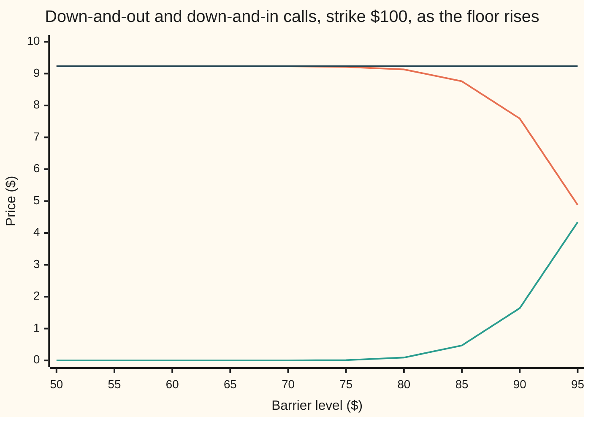

# The eight barrier formulas: up or down, in or out, call or put, all from the same six building blocks

[Syllabus](../../../SYLLABUS.md) → [Financial mathematics](../README.md) → [Barriers, touches and lookbacks](../README.md#s16) → The eight barrier formulas

---

## General Overview

Acme shares trade at $100. A one-year call struck at $100 costs $9.23 in the house market; the matching put costs $6.33. Now draw two lines on the price chart: a floor at $80 and a ceiling at $120.

A **barrier option** is a call or put with one extra clause about one line. A **knock-out** dies the moment Acme touches its line. A **knock-in** is born at that moment and is worthless otherwise. A line below today's price (a **down** barrier) or above it (an **up** barrier), times call or put, times in or out: eight contracts, set out on [Knock-out and knock-in options](01-knock-out-and-knock-in-options.md). This card prices all eight.

Here are the eight house prices, strike $100, barrier at $80 for the down contracts and $120 for the up ones. The short names read D or U (down, up), O or I (out, in), C or P (call, put): DOC is the down-and-out call.

```
eight house prices, dollars, one block = $0.25
DOC  80   █████████████████████████████████████   $9.13
DIC  80                                           $0.09
DOP  80   ███████                                 $1.73
DIP  80   ██████████████████                      $4.60
UOC 120   █████                                   $1.13
UIC 120   ████████████████████████████████        $8.09
UOP 120   ████████████████████████                $6.10
UIP 120   █                                       $0.23
```

The up-and-out call costs $1.13, an eighth of the plain call: a call earns most when Acme climbs, and every climb past $120 kills it. The paths that would pay are the paths that die. And each out-and-in pair adds back to the plain option, $9.13 + $0.09 = $9.23, because every path either touches the line or does not.

The formulas come from one idea, the **reflection principle**: a path that touches the barrier is paired with its mirror image across it, so touching paths can be counted with a second, reflected bell curve. Each price is then a signed sum of at most four Black-Scholes-shaped blocks, A to D, plus a rebate block, E or F.

**Every single-barrier price is read off two bell curves, the plain one and its mirror image across the barrier; four Reiner-Rubinstein blocks are those two readings cut at the strike and at the barrier, and two more price the rebate.**

**What kind of fact this is:** a theorem inside the Black-Scholes model, proved on this card in Why it works, with the reflection step in a folded Detailed proof; the model itself is an assumption, not a law.

### The picture: moving the floor



Orange: the down-and-out call. Green: the down-and-in call. Dark: the plain call, $9.23. A floor at $60 is almost never reached in a year, so the knock-out is the whole call. As the floor climbs toward $100 the two cross over, always adding to $9.23.

---

## The formula

Notation first, in words. Two switches carry the eight cases. $\phi$ (phi) is +1 for a call and −1 for a put. $\eta$ (eta) is +1 for a down barrier and −1 for an up barrier. Multiplying by a switch either leaves a term alone or flips its sign. The bell-curve area $N(x)$ is the chance that a standard bell-curve draw lands below $x$, as on the [Black–Scholes call](../08-The%20Black-Scholes%20call%20and%20put/01-black-scholes-call.md) card. $S$ is Acme's price today, $K$ the strike, $H$ the barrier; $r$, $q$, $\sigma$ and $T$ are the bank rate, dividend yield, volatility and years to expiry. The helpers $\mu$, $\lambda$, $x_1$, $x_2$, $y_1$, $y_2$ and $z$ are distances defined just below the blocks.

The four price blocks:

$$A = \phi S e^{-qT} N(\phi x_1) - \phi K e^{-rT} N(\phi x_1 - \phi\sigma\sqrt T)$$

$$B = \phi S e^{-qT} N(\phi x_2) - \phi K e^{-rT} N(\phi x_2 - \phi\sigma\sqrt T)$$

$$C = \phi S e^{-qT} (H/S)^{2\mu+2} N(\eta y_1) - \phi K e^{-rT} (H/S)^{2\mu} N(\eta y_1 - \eta\sigma\sqrt T)$$

$$D = \phi S e^{-qT} (H/S)^{2\mu+2} N(\eta y_2) - \phi K e^{-rT} (H/S)^{2\mu} N(\eta y_2 - \eta\sigma\sqrt T)$$

and the two rebate blocks, for a fixed cash rebate $R$:

$$E = R e^{-rT}\left[N(\eta x_2 - \eta\sigma\sqrt T) - (H/S)^{2\mu} N(\eta y_2 - \eta\sigma\sqrt T)\right]$$

$$F = R\left[(H/S)^{\mu+\lambda} N(\eta z) + (H/S)^{\mu-\lambda} N(\eta z - 2\eta\lambda\sigma\sqrt T)\right]$$

**Read it aloud:** A is the plain option. B is the same option counted only where Acme finishes beyond the barrier. C and D are A and B read off the mirror-image curve, weighted by the mirror's tilt $(H/S)^{2\mu}$, a drift correction explained in Step 0. E is the rebate's discounted chance of never touching; F is the rebate's discounted value if paid on the day of the touch.

How the eight contracts assemble them, depending on which side of the barrier the strike sits:

| Contract | Strike above barrier, $K > H$ | Strike below barrier, $K < H$ |
| --- | --- | --- |
| down-and-in call, DIC | `C + E` | `A − B + D + E` |
| up-and-in call, UIC | `A + E` | `B − C + D + E` |
| down-and-in put, DIP | `B − C + D + E` | `A + E` |
| up-and-in put, UIP | `A − B + D + E` | `C + E` |
| down-and-out call, DOC | `A − C + F` | `B − D + F` |
| up-and-out call, UOC | `F` | `A − B + C − D + F` |
| down-and-out put, DOP | `A − B + C − D + F` | `F` |
| up-and-out put, UOP | `B − D + F` | `A − C + F` |

Read any in-row and its out-row in the same column and add them, rebates aside: the result is `A` every time. That is in-out parity, built into the table.

| Symbol | Plain meaning | In our example | Push it up and the answer… |
| --- | --- | --- | --- |
| $S$ | Acme's price today | $100 | down-and-out call rises: further from the floor |
| $K$ | the strike | $100 | calls fall, puts rise, as for plain options |
| $H$ | the barrier level | $80 floor, $120 ceiling | a higher floor kills more often: down-and-out falls, down-and-in rises |
| $R$, $\tau$ | the cash rebate, and $\tau$ (tau) the moment of the first touch | $3 | out prices rise by the discounted rebate |
| $r$, $q$ | bank rate and dividend yield, continuously compounded | 5%, 2% | as for plain options |
| $\sigma$, $T$ | volatility and years to expiry | 20%, 1 | more touches: out prices usually fall, in prices rise |
| $\phi$, $\eta$ | the switches: call +1, put −1; down +1, up −1 | | |
| $\mu$, $\lambda$ | the drift in volatility units, and its rebate cousin | 0.25, 1.600781 | |
| $x_1$, $x_2$, $y_1$, $y_2$, $z$, $d_1$ | distances in "wiggle units" $\sigma\sqrt T$: to the strike, to the barrier, and their mirror images; $d_1$ is the Black-Scholes card's name for $x_1$ | $x_1 = 0.25$, $y_1 = −1.981436$ at the $80 floor | |
| $A$, $B$, $C$, $D$, $E$, $F$ | the four price blocks; the rebate paid at expiry if untouched, and paid at the touch | $E = \$2.14$, $F = \$0.73$ at the floor | |
| $u$, $b$, $f$ | log price at expiry, the barrier in log terms, and the bell-curve height of $u$ | $b = \ln 0.8$ at the floor | |
| $N$, $(H/S)^{2\mu}$ | bell-curve area; the mirror's tilt | $(H/S)^{2\mu} = 0.894427$ at the floor | |

The helpers, each a distance measured in wiggle units:

$$\mu = \frac{r - q - \tfrac12\sigma^2}{\sigma^2}, \qquad \lambda = \sqrt{\mu^2 + \frac{2r}{\sigma^2}}$$

$$x_1 = \frac{\ln(S/K)}{\sigma\sqrt T} + (1+\mu)\sigma\sqrt T, \qquad x_2 = \frac{\ln(S/H)}{\sigma\sqrt T} + (1+\mu)\sigma\sqrt T$$

$$y_1 = \frac{\ln\!\big(H^2/(SK)\big)}{\sigma\sqrt T} + (1+\mu)\sigma\sqrt T, \qquad y_2 = \frac{\ln(H/S)}{\sigma\sqrt T} + (1+\mu)\sigma\sqrt T, \qquad z = \frac{\ln(H/S)}{\sigma\sqrt T} + \lambda\sigma\sqrt T$$

In words: $x_1$ is the Black-Scholes $d_1$, since $(1+\mu)\sigma^2 = r - q + \tfrac12\sigma^2$; that is why $A$ is the plain option. $x_2$ measures to the barrier instead of the strike. $y_1$ and $y_2$ measure the same two distances from the mirror image of today's price, $H^2/S$, which sits as far beyond the barrier as $S$ sits before it. $\mu$ is the pretend-world drift of the log price over $\sigma^2$; $\lambda$ folds in the bank rate, needed only when money arrives on a random day.

### When it holds

- **Continuous monitoring.** A touch at any instant counts. A contract that checks one price a day is hit less often than the formula assumes; [Daily monitoring](03-discrete-monitoring-correction.md) fixes that.
- **Continuous paths.** The mirror needs a path that cannot skip over the line. A price that jumps crosses without touching, and the hit chance is wrong.
- **Constant volatility, rate and dividend yield.** Barrier prices lean on volatility near the barrier. With a volatility smile the flat-volatility price errs by more than a plain option's would.
- **The barrier not yet touched.** A down barrier needs $S > H$ today, an up barrier $S < H$. Otherwise the out-option is worth its rebate paid now and the in-option is the plain option.
- **Stated rebate timing.** $E$ pays at expiry, $F$ at the touch. An out-rebate paid at expiry needs a different block.

---

## Why it works

### Step 0: a mirror counts the paths that touch

Work with the log price $u = \ln(S_T/S)$, Acme's final price as a log-return from today. In the pretend world of the Black-Scholes card it ends on a bell curve with centre $(r - q - \tfrac12\sigma^2)T$ and spread $\sigma\sqrt T$. The barrier sits at $b = \ln(H/S)$, which is $\ln 0.8$ for the floor.

Take a path that touches the floor and ends at $u$ above it. Flip the part after the first touch across the floor: the flipped path ends at the mirror point $2b - u$, below the floor. The pairing is one-to-one, and without drift each pair is equally likely. So touching paths that end at $u$ are exactly as common as paths that end at $2b - u$, all of which touched.

With drift, the pair are not equally likely: one partner has drifted further than the other. The correction depends only on the two end points, and it comes out as one constant factor, $(H/S)^{2\mu}$, the **mirror's tilt**.

### Step 1: surviving paths are the bell curve minus its mirror image

Write $f(u)$ for the bell-curve height of the log price at $u$. On the live side of the barrier:

$$\text{touched and ended at } u \;=\; (H/S)^{2\mu} f(u - 2b), \qquad \text{never touched and ended at } u \;=\; f(u) - (H/S)^{2\mu} f(u - 2b).$$

On the dead side, every path touched: its weight is $f(u)$ in full. For an up barrier the live side is below the line; the same two formulas hold with the inequality turned round.

<details>
<summary>Detailed proof: the mirror's tilt</summary>

Let the log price be $X_t = \nu t + \sigma W_t$, with $\nu = r - q - \tfrac12\sigma^2$ and the last term $\sigma$ times a Brownian motion. Without drift ($\nu = 0$), the reflection principle for Brownian motion says: for $u > b$ and $b < 0$, the chance of touching $b$ and ending near $u$ equals the chance of ending near $2b - u$ ([Geometric Brownian motion](../../11-Stochastic%20processes%20and%20calculus/05-Brownian%20Motion/07-geometric-brownian-motion.md) has the process). The proof is the path flip of Step 0, which preserves Brownian likelihood because the flipped increments are again independent bell-curve draws.

Drift reweights each driftless path by $\exp(\nu X_T/\sigma^2 - \nu^2 T/(2\sigma^2))$, a factor depending only on where the path ends. So the drifted density of "touched, ended at $u$" is the driftless density at $2b - u$ times that factor at $u$. Rewrite the driftless density at $2b - u$ as the drifted density $f$ there, divided by the factor at $2b - u$. The two factors leave $\exp(2\nu(u - b)/\sigma^2)$. Finally compare $f(2b - u)$ with $f(u - 2b)$: their exponents differ by $4\nu T(2b - u)/(2\sigma^2 T)$. Multiplying out, every $u$ cancels and what remains is $\exp(2\nu b/\sigma^2) = \exp(2\mu\ln(H/S)) = (H/S)^{2\mu}$.

The up barrier is the same argument for $-X$. The code checks the result by integrating the surviving and touched densities numerically, with no use of the blocks.

</details>

### Step 2: each block is one half-line of one curve

A price is the discounted average payoff, and the payoff is "share minus cash" where the option pays. Over a half-line of a bell curve that average is always one Black-Scholes-shaped term: a share half and a cash half, one wiggle unit apart.

- **A:** the direct curve, over the region where the option pays. The plain option.
- **B:** the direct curve, over the region beyond the barrier instead of beyond the strike.
- **C:** the mirror curve, over the region beyond the strike.
- **D:** the mirror curve, over the region beyond the barrier.

The mirror curve's cash half carries the tilt $(H/S)^{2\mu}$. Its share half carries $(H/S)^{2\mu+2}$. The extra $(H/S)^2$ is the share's own value on the mirror: a share at $S e^{u}$ with $u = u' + 2b$ is worth $S e^{u'}(H/S)^2$. Mirroring also moves the strike test, so the distance to the strike becomes $\ln(H^2/(SK))$: that is $y_1$.

### Step 3: the strike decides which pieces are live

**Down-and-out call, strike above the floor.** It pays where Acme finishes above $100, which is all on the live side. Surviving weight is direct minus mirror, over that one region: `A − C`.

**Down-and-out call, strike below the floor.** Finishes between strike and floor are dead. The live paying region starts at the floor, so both readings are cut there: `B − D`.

**Up-and-out call, strike below the ceiling.** It pays only between $100 and $120. The direct reading of that slice is `A − B`. The mirror reading of it enters with a plus sign, `+ C − D`: with $\eta = -1$ every bell-curve argument in C and D is flipped, and C − D comes out as minus the mirror slice.

**Up-and-out call, strike above the ceiling.** Every survivor finishes below the ceiling, so below the strike. Nothing pays: the price is 0, plus any rebate.

Each knock-in is the touched weight over the same region: the direct curve on the dead side plus the mirror curve on the live side. That gives the in-column of the table. Puts follow by $\phi = -1$, which flips which side of the strike pays.

### Step 4: rebates, two timings

A rebate is cash paid when the option fails to deliver. For a knock-in, failure is known only at expiry: the rebate $R$ is paid then if Acme never touched. Its value is $R e^{-rT}$ times the survival chance, and the survival chance is Step 1's surviving weight over the whole live side. That is block $E$.

For a knock-out, failure happens at the touch. The rebate pays at that moment $\tau$, so it is discounted by $e^{-r\tau}$ with $\tau$ random. Averaging $e^{-r\tau}$ over the first-touch times gives block $F$.

<details>
<summary>Why a new exponent, λ, appears in F</summary>

The first-touch time of a drifting log price has a known density. Multiplying it by $e^{-rt}$ puts r times t into the exponent next to the drift term. Completing the square there turns the drift $\mu$ into $\sqrt{\mu^2 + 2r/\sigma^2}$, which is $\lambda$. The two terms of $F$, with tilts $(H/S)^{\mu+\lambda}$ and $(H/S)^{\mu-\lambda}$, are the two halves of that completed square. With $r = 0$, $\lambda = |\mu|$ and $F$ collapses to $R$ times the plain chance of touching.

</details>

### Step 5: parity is the check that costs nothing

Every path touches or does not. A knock-in plus its knock-out, same barrier, same strike, same payoff, holds the plain option on every path: in + out = plain. With rebates, in + out = plain + E + F, since exactly one of the two rebates pays on every path. The table's columns obey this by construction; the code confirms it against plain options computed with no barrier at all.

A second road: solve the Black-Scholes equation ([The Black-Scholes equation](../08-The%20Black-Scholes%20call%20and%20put/07-black-scholes-equation.md)) on the live side, with the option worth zero, or the rebate, on the barrier. The method of images solves it with the same mirror. A floor and a ceiling together need the mirror applied again and again: Kunitomo and Ikeda's double-barrier formula is an infinite alternating series of images bouncing between the two walls, named here, not derived.

---

## Worked numbers, by hand

House market: $S = K = 100$, $r = 5\%$, $q = 2\%$, $\sigma = 20\%$, $T = 1$. First the down-and-out call at the $80 floor. The strike is above the floor, so the table says `A − C`.

| Step | Arithmetic | Value |
| --- | --- | --- |
| drift in volatility units, $\mu$ | $(0.05 - 0.02 - 0.02)/0.04$ | $0.25$ |
| rebate exponent, $\lambda$ | $\sqrt{0.0625 + 2.5}$ | $1.600781$ |
| $x_1$ | $0 + 1.25 \times 0.20$, the pilot's $d_1$ | $0.25$ |
| block $A$ | the plain call | $\$9.227006$ |
| $y_1$ | $\ln(0.64)/0.20 + 0.25$ | $-1.981436$ |
| $N(y_1)$, $N(y_1 - 0.20)$ | bell-curve table | $0.023771$, $0.014576$ |
| tilts $(0.8)^{2.5}$, $(0.8)^{0.5}$ | powers | $0.572433$, $0.894427$ |
| share half of $C$ | $100 e^{-0.02} \times 0.572433 \times 0.023771$ | $\$1.333800$ |
| cash half of $C$ | $100 e^{-0.05} \times 0.894427 \times 0.014576$ | $\$1.240101$ |
| block $C$ | $1.333800 - 1.240101$ | $\$0.093699$ |
| **down-and-out call** | $9.227006 - 0.093699$ | **$\$9.133306$** |

Block $C$ on its own is the down-and-in call: $0.09. Few paths touch the floor and still climb back above $100.

Now the up-and-out call at the $120 ceiling, strike below it: `A − B + C − D`.

| Step | Arithmetic | Value |
| --- | --- | --- |
| blocks $A$, $B$ | the call, and the call counted only above $120 | $\$9.227006$, $\$6.411140$ |
| direct slice, $A - B$ | finishes between $100 and $120 | $\$2.815866$ |
| blocks $C$, $D$ | mirror readings, signs flipped by $\eta = -1$ | $-\$0.230613$, $\$1.452760$ |
| $C - D$ | minus the mirror slice | $-\$1.683374$ |
| **up-and-out call** | $2.815866 - 1.683374$ | **$\$1.132492$** |

Of the $9.23 plain call, $6.41 comes from finishes above $120, which a ceiling at $120 kills outright. Of the $2.82 left, $1.68 belongs to paths that touched $120 and fell back. The survivor keeps $1.13.

With a $3 rebate: the pretend-world chance of touching the floor within the year is 0.250014 and the ceiling 0.378622. Paid at the touch, $F$ is $0.73 at the floor, so the down-and-out call becomes $9.86. Paid at expiry to an untouched knock-in, $E$ is $2.14, so the down-and-in call becomes $2.23.

### What breaks if you drop a piece

Correct down-and-out call $9.13; correct up-and-out call $1.13.

| Mistake | Comes out at | What went wrong |
| --- | --- | --- |
| Down-and-out call at the $80 floor from the other column, `B − D` | $7.40 | That branch assumes the strike is below the floor. Here it is above. |
| Up-and-out call at $120 with $\eta$ left at +1 | $4.50 | The mirror blocks read the wrong side of the ceiling. |
| One tilt, $(H/S)^{2\mu}$, on both halves of $C$ | $8.38 | The share half needs the extra $(H/S)^2$: a share is worth less on the mirror. |
| $3 out-rebate valued as paid at expiry, not at the touch | $9.85 against $9.86 | A touch in month two pays ten months earlier; discounting is shorter. |

Each is printed by the code.

---

## Code, from first principles, and it actually runs

Four roads. Road 1 assembles the prices from blocks A to F through the table. Road 2 never sees a block: Simpson's rule integrates the payoff against Step 1's surviving or touched density, and the rebates against the first-touch-time density. Road 3 simulates 200,000 paths in twelve monthly steps; between steps it applies the Brownian-bridge chance of a touch, $\exp(-2\,g_0 g_1/(\sigma^2\Delta t))$, where the two gaps are the step's end points' log-distances from the barrier and $\Delta t$ is one month, so it prices continuous monitoring. Road 4 is parity against plain options. Strikes $60 under the floor and $140 over the ceiling reach the table's other column. The bell-curve area is built from Simpson slices, the random numbers from a 64-bit linear congruential generator, a multiply-and-add recipe that repeats exactly from its seed.

### Python

```python
# The eight barrier formulas -- the check behind the card.  Standard library only.
# Road 1: the Reiner-Rubinstein blocks A..F.  Road 2: Simpson's rule over the
# reflected density of the log price.  Road 3: a Monte Carlo of monthly steps
# with the Brownian-bridge chance of a touch between steps.  Road 4: parity.
from math import log, sqrt, exp, cos, pi
S, r, q, sig, T, R = 100.0, 0.05, 0.02, 0.20, 1.0, 3.0
CALL, PUT = 9.227005508154, 6.330080627550           # house prices, from the Black-Scholes card
def dens(x): return exp(-0.5 * x * x) / sqrt(2.0 * pi)
def simpson(f, a, b, n):
    h = (b - a) / n
    return h / 3.0 * (f(a) + f(b) + sum((4 if i % 2 else 2) * f(a + i * h) for i in range(1, n)))
def N(x):                                            # bell-curve area left of x, by slices
    if abs(x) > 9.0: return 0.0 if x < 0 else 1.0
    return 0.5 + simpson(dens, 0.0, x, 2000)
def blocks(K, H, phi, eta):                          # the six Reiner-Rubinstein terms
    v = sig * sqrt(T); mu = (r - q - 0.5 * sig * sig) / (sig * sig); lam = sqrt(mu * mu + 2 * r / (sig * sig))
    x1 = log(S / K) / v + (1 + mu) * v; x2 = log(S / H) / v + (1 + mu) * v
    y1 = log(H * H / (S * K)) / v + (1 + mu) * v; y2 = log(H / S) / v + (1 + mu) * v; z = log(H / S) / v + lam * v
    Sq, Kr, h = S * exp(-q * T), K * exp(-r * T), H / S
    A = phi * Sq * N(phi * x1) - phi * Kr * N(phi * (x1 - v))
    B = phi * Sq * N(phi * x2) - phi * Kr * N(phi * (x2 - v))
    C = phi * Sq * h ** (2 * mu + 2) * N(eta * y1) - phi * Kr * h ** (2 * mu) * N(eta * (y1 - v))
    D = phi * Sq * h ** (2 * mu + 2) * N(eta * y2) - phi * Kr * h ** (2 * mu) * N(eta * (y2 - v))
    E = R * exp(-r * T) * (N(eta * (x2 - v)) - h ** (2 * mu) * N(eta * (y2 - v)))
    F = R * (h ** (mu + lam) * N(eta * z) + h ** (mu - lam) * N(eta * (z - 2 * lam * v)))
    return A, B, C, D, E, F
# which blocks each contract adds, as coefficients on (A, B, C, D); key (in?, eta, phi, strike above barrier?)
MIX = {(1, 1, 1, 1): (0, 0, 1, 0), (1, 1, 1, 0): (1, -1, 0, 1), (1, -1, 1, 1): (1, 0, 0, 0), (1, -1, 1, 0): (0, 1, -1, 1),
       (1, 1, -1, 1): (0, 1, -1, 1), (1, 1, -1, 0): (1, 0, 0, 0), (1, -1, -1, 1): (1, -1, 0, 1), (1, -1, -1, 0): (0, 0, 1, 0),
       (0, 1, 1, 1): (1, 0, -1, 0), (0, 1, 1, 0): (0, 1, 0, -1), (0, -1, 1, 1): (0, 0, 0, 0), (0, -1, 1, 0): (1, -1, 1, -1),
       (0, 1, -1, 1): (1, -1, 1, -1), (0, 1, -1, 0): (0, 0, 0, 0), (0, -1, -1, 1): (0, 1, 0, -1), (0, -1, -1, 0): (1, 0, -1, 0)}
def rr(K, H, phi, eta, inn, rebate=False):
    b = blocks(K, H, phi, eta)
    val = sum(c * x for c, x in zip(MIX[(inn, eta, phi, int(K > H))], b[:4]))
    return val + ((b[4] if inn else b[5]) if rebate else 0.0)
def integral(K, H, phi, eta, inn, pay=None):         # road 2: reflected density, no blocks used
    nu, sd, bl = r - q - 0.5 * sig * sig, sig * sqrt(T), log(H / S)
    w = exp(2 * nu * bl / (sig * sig))
    f = lambda u: dens((u - nu * T) / sd) / sd
    def g(u):
        live = (u > bl) if eta == 1 else (u < bl)
        surv = f(u) - w * f(u - 2 * bl) if live else 0.0
        p = pay(u) if pay else max(phi * (S * exp(u) - K), 0.0)
        return p * ((f(u) - surv) if inn else surv)
    cuts = sorted({-3.0, bl, log(K / S), 3.0})
    return exp(-r * T) * sum(simpson(g, a, b, 4000) for a, b in zip(cuts, cuts[1:]))
def touch_pv(H):                                     # E[e^{-r tau}; tau <= T] from the first-passage density
    nu, bl = r - q - 0.5 * sig * sig, abs(log(H / S))
    sgn = 1.0 if H < S else -1.0
    g = lambda t: 0.0 if t == 0 else exp(-r * t) * bl / (sig * sqrt(2 * pi * t ** 3)) * exp(-(bl + sgn * nu * t) ** 2 / (2 * sig * sig * t))
    return simpson(g, 0.0, T, 4000)
CASES = [("DOC", 80, 1, 1, 0), ("DIC", 80, 1, 1, 1), ("DOP", 80, -1, 1, 0), ("DIP", 80, -1, 1, 1),
         ("UOC", 120, 1, -1, 0), ("UIC", 120, 1, -1, 1), ("UOP", 120, -1, -1, 0), ("UIP", 120, -1, -1, 1)]
STRIKES = (100.0, 60.0, 140.0)                       # 60 sits below the 80 barrier, 140 above the 120 one
# ---- road 3: Monte Carlo, 12 monthly steps, bridge chance of a touch between steps ----
state = 20260924
def uniform():
    global state
    state = (state * 6364136223846793005 + 1442695040888963407) % 2 ** 64
    return ((state >> 11) + 0.5) / 2 ** 53
PATHS, STEPS = 200000, 12
dt = T / STEPS; drift = (r - q - 0.5 * sig * sig) * dt; vol = sig * sqrt(dt)
bd, bu = log(0.8), log(1.2)
acc = {}; monthly = 0.0
for _ in range(PATHS):
    x = 0.0; sd_ = su = 1.0; alive_m = True
    for _ in range(STEPS):
        z = sqrt(-2 * log(uniform())) * cos(2 * pi * uniform())
        y = x + drift + vol * z
        sd_ *= 0.0 if y <= bd else 1 - exp(-2 * (x - bd) * (y - bd) / (vol * vol))
        su *= 0.0 if y >= bu else 1 - exp(-2 * (bu - x) * (bu - y) / (vol * vol))
        alive_m = alive_m and y > bd
        x = y
    ST = S * exp(x)
    for name, H, phi, eta, inn in CASES:
        for K in STRIKES:
            keep = sd_ if eta == 1 else su
            p = max(phi * (ST - K), 0.0) * ((1 - keep) if inn else keep)
            s = acc.setdefault((name, K), [0.0, 0.0]); s[0] += p; s[1] += p * p
    monthly += max(ST - 100.0, 0.0) * alive_m
def mc(name, K):
    s1, s2 = acc[(name, K)]; m = s1 / PATHS
    return exp(-r * T) * m, exp(-r * T) * sqrt(max(s2 / PATHS - m * m, 0.0) / PATHS)
print("house: S 100, r 5%, q 2%, sigma 20%, T 1; barriers 80 and 120; rebate 3")
print("blocks at K 100      A          B          C          D")
for lab, H, phi, eta in (("down call", 80, 1, 1), ("down put", 80, -1, 1), ("up call", 120, 1, -1), ("up put", 120, -1, -1)):
    print(f"{lab:<11}" + "".join(f"{v:11.6f}" for v in blocks(100.0, H, phi, eta)[:4]))
print("contract   K   formula    integral   simulated   +/- se")
prices, worst_int, worst_z = {}, 0.0, 0.0
for K in STRIKES:
    for name, H, phi, eta, inn in CASES:
        if K != 100.0 and (K == 60.0) != (eta == 1): continue
        f, i = rr(K, H, phi, eta, inn), integral(K, H, phi, eta, inn); m, se = mc(name, K)
        prices[(name, K)] = f; worst_int = max(worst_int, abs(f - i)); worst_z = max(worst_z, abs(f - m) / max(se, 1e-12))
        print(f"{name} {K:5.0f} {f:10.6f} {i:10.6f} {m:10.4f} {se:8.4f}")
van = {K: (integral(K, 1e-9, 1, 1, 0), integral(K, 1e-9, -1, 1, 0)) for K in (60.0, 140.0)}   # barrier far out of reach
PAIRS = [(100.0, "DOC", "DIC", CALL), (100.0, "DOP", "DIP", PUT), (100.0, "UOC", "UIC", CALL), (100.0, "UOP", "UIP", PUT),
         (60.0, "DOC", "DIC", van[60.0][0]), (60.0, "DOP", "DIP", van[60.0][1]), (140.0, "UOC", "UIC", van[140.0][0]), (140.0, "UOP", "UIP", van[140.0][1])]
for K, o, i, target in PAIRS:
    tot = prices[(o, K)] + prices[(i, K)]
    print(f"parity {o}+{i} K{K:4.0f}: {tot:10.6f}  plain option {target:10.6f}")
    assert abs(tot - target) < 1e-7, "in plus out must rebuild the plain option"
Qd, Qu = integral(100, 80, 0, 1, 0, lambda u: 1.0) * exp(r * T), integral(100, 120, 0, -1, 0, lambda u: 1.0) * exp(r * T)
for lab, H, eta, Q in (("80 ", 80, 1, Qd), ("120", 120, -1, Qu)):
    b = blocks(100.0, H, 1, eta)
    print(f"barrier {lab}: chance of touching {1 - Q:.6f}; F {b[5]:.6f} vs {R * touch_pv(H):.6f}; E {b[4]:.6f} vs {R * exp(-r * T) * Q:.6f}")
    assert abs(b[5] - R * touch_pv(H)) < 1e-7 and abs(b[4] - R * exp(-r * T) * Q) < 1e-7
print(f"DOC 80 with rebate 3 paid at the touch: {rr(100.0, 80, 1, 1, 0, True):.6f}; UOC 120: {rr(100.0, 120, 1, -1, 0, True):.6f}")
print(f"DIC 80 with rebate 3 paid at expiry if never touched: {rr(100.0, 80, 1, 1, 1, True):.6f}")
b80 = blocks(100.0, 80, 1, 1); b120w = blocks(100.0, 120, 1, 1)
print(f"wrong: DOC 80 by the strike-below-barrier branch B - D {b80[1] - b80[3]:.6f}")
print(f"wrong: UOC 120 with eta left at +1 {b120w[0] - b120w[1] + b120w[2] - b120w[3]:.6f}")
v, mu = sig * sqrt(T), (r - q - 0.5 * sig * sig) / (sig * sig); y1 = log(0.64) / v + (1 + mu) * v
wrongC = S * exp(-q * T) * 0.8 ** (2 * mu) * N(y1) - 100 * exp(-r * T) * 0.8 ** (2 * mu) * N(y1 - v)
lam, sh, ch = sqrt(mu * mu + 2 * r / (sig * sig)), S * exp(-q * T) * 0.8 ** (2 * mu + 2) * N(y1), 100 * exp(-r * T) * 0.8 ** (2 * mu) * N(y1 - v)
print(f"worked DOC 80: mu {mu:.6f} lambda {lam:.6f} y1 {y1:.6f} N(y1) {N(y1):.6f} N(y1-v) {N(y1 - v):.6f}")
print(f"worked DOC 80: (H/S)^(2mu+2) {0.8 ** (2 * mu + 2):.6f} (H/S)^2mu {0.8 ** (2 * mu):.6f} share {sh:.6f} cash {ch:.6f} C {sh - ch:.6f}")
bu_ = blocks(100.0, 120, 1, -1)
print(f"worked UOC 120: A-B {bu_[0] - bu_[1]:.6f} C-D {bu_[2] - bu_[3]:.6f} UOC {prices[('UOC', 100.0)]:.6f}")
print(f"wrong: DOC 80 with one image weight (H/S)^2mu on both halves of C {b80[0] - wrongC:.6f}")
print(f"wrong: DOC 80 rebate paid at expiry, not at the touch {prices[('DOC', 100.0)] + R * exp(-r * T) * (1 - Qd):.6f}")
m_mc = exp(-r * T) * monthly / PATHS
print(f"wrong: DOC 80 checked only at 12 month-ends, no bridge (simulated) {m_mc:.4f}")
hs = list(range(50, 100, 5))
print("chart, barrier   " + " ".join(f"{h:6d}" for h in hs))
print("chart, DOC       " + " ".join(f"{rr(100.0, h, 1, 1, 0):6.2f}" for h in hs))
print("chart, DIC       " + " ".join(f"{rr(100.0, h, 1, 1, 1):6.2f}" for h in hs))
print("chart, eight     " + " ".join(f"{prices[(c[0], 100.0)]:6.2f}" for c in CASES))
print(f"try: UOC barrier 150 {rr(100.0, 150, 1, -1, 0):.6f}; DOC barrier 99 {rr(100.0, 99, 1, 1, 0):.6f}; UIP barrier 105 {rr(100.0, 105, -1, -1, 1):.6f}")
assert abs(prices[("DOC", 100.0)] - 9.133306) < 1e-6 and abs(prices[("DIC", 100.0)] - 0.093699) < 1e-6
assert worst_int < 1e-7, "formula and reflected-density integral must agree"
assert worst_z < 4.0, "simulation within four standard errors of every formula price"
assert m_mc > prices[("DOC", 100.0)], "month-end checks miss touches, so the price comes out high"
print(f"worst formula-integral gap {worst_int:.1e}; worst simulation gap {worst_z:.2f} standard errors")
print("ALL CHECKS PASS")
```

**Ran 2026-09-24 on macOS, Python 3.14.6, standard library only. All checks passed. Output, pasted from the run:**

```
house: S 100, r 5%, q 2%, sigma 20%, T 1; barriers 80 and 120; rebate 3
blocks at K 100      A          B          C          D
down call     9.227006   6.057955   0.093699  -1.342674
down put      6.330081   3.161030  -0.093699   1.342674
up call       9.227006   6.411140  -0.230613   1.452760
up put        6.330081   3.514215   0.230613  -1.452760
contract   K   formula    integral   simulated   +/- se
DOC   100   9.133306   9.133306     9.1296   0.0310
DIC   100   0.093699   0.093699     0.0928   0.0022
DOP   100   1.732678   1.732678     1.7475   0.0079
DIP   100   4.597403   4.597403     4.5984   0.0204
UOC   100   1.132492   1.132492     1.1187   0.0061
UIC   100   8.094513   8.094513     8.1036   0.0315
UOP   100   6.099467   6.099467     6.1104   0.0204
UIP   100   0.230613   0.230613     0.2355   0.0032
DOC    60  35.936982  35.936982    35.9385   0.0562
DIC    60   5.024699   5.024699     5.0027   0.0205
DOP    60   0.000000   0.000000     0.0000   0.0000
DIP    60   0.015579   0.015579     0.0156   0.0007
UOC   140   0.000000   0.000000     0.0000   0.0000
UIC   140   0.619536   0.619536     0.6202   0.0083
UOP   140  28.609913  28.609913    28.6284   0.0531
UIP   140   7.161876   7.161876     7.1646   0.0251
parity DOC+DIC K 100:   9.227006  plain option   9.227006
parity DOP+DIP K 100:   6.330081  plain option   6.330081
parity UOC+UIC K 100:   9.227006  plain option   9.227006
parity UOP+UIP K 100:   6.330081  plain option   6.330081
parity DOC+DIC K  60:  40.961681  plain option  40.961681
parity DOP+DIP K  60:   0.015579  plain option   0.015579
parity UOC+UIC K 140:   0.619536  plain option   0.619536
parity UOP+UIP K 140:  35.771788  plain option  35.771788
barrier 80 : chance of touching 0.250014; F 0.729346 vs 0.729346; E 2.140227 vs 2.140227
barrier 120: chance of touching 0.378622; F 1.108174 vs 1.108174; E 1.773220 vs 1.773220
DOC 80 with rebate 3 paid at the touch: 9.862652; UOC 120: 2.240666
DIC 80 with rebate 3 paid at expiry if never touched: 2.233926
wrong: DOC 80 by the strike-below-barrier branch B - D 7.400629
wrong: UOC 120 with eta left at +1 4.499240
worked DOC 80: mu 0.250000 lambda 1.600781 y1 -1.981436 N(y1) 0.023771 N(y1-v) 0.014576
worked DOC 80: (H/S)^(2mu+2) 0.572433 (H/S)^2mu 0.894427 share 1.333800 cash 1.240101 C 0.093699
worked UOC 120: A-B 2.815866 C-D -1.683374 UOC 1.132492
wrong: DOC 80 with one image weight (H/S)^2mu on both halves of C 8.383044
wrong: DOC 80 rebate paid at expiry, not at the touch 9.846768
wrong: DOC 80 checked only at 12 month-ends, no bridge (simulated) 9.1889
chart, barrier       50     55     60     65     70     75     80     85     90     95
chart, DOC         9.23   9.23   9.23   9.23   9.23   9.21   9.13   8.76   7.59   4.88
chart, DIC         0.00   0.00   0.00   0.00   0.00   0.01   0.09   0.47   1.64   4.34
chart, eight       9.13   0.09   1.73   4.60   1.13   8.09   6.10   0.23
try: UOC barrier 150 6.934552; DOC barrier 99 1.170361; UIP barrier 105 3.284689
worst formula-integral gap 4.3e-11; worst simulation gap 2.25 standard errors
ALL CHECKS PASS
```

Formula and integral agree to $4.3 \times 10^{-11}$ on all sixteen prices. The simulation lands within 2.25 standard errors (its own measured noise, the `+/- se` column) of every one. The two zero rows are the empty branches: a down-and-out put struck at $60 under an $80 floor, and an up-and-out call struck at $140 over a $120 ceiling, cannot pay.

### Rust

Same roads, same labels, same random stream.

```rust
// The eight barrier formulas -- the same check as the Python, in Rust.  No crates.
// Road 1: the Reiner-Rubinstein blocks A..F.  Road 2: Simpson's rule over the
// reflected density of the log price.  Road 3: a Monte Carlo of monthly steps
// with the Brownian-bridge chance of a touch between steps.  Road 4: parity.
use std::collections::HashMap;
use std::f64::consts::PI;
const S: f64 = 100.0; const R_: f64 = 0.05; const Q_: f64 = 0.02; const SIG: f64 = 0.20; const T: f64 = 1.0; const REB: f64 = 3.0;
const CALL: f64 = 9.227005508154; const PUT: f64 = 6.330080627550;   // house prices, from the Black-Scholes card
fn dens(x: f64) -> f64 { (-0.5 * x * x).exp() / (2.0 * PI).sqrt() }
fn simpson<F: Fn(f64) -> f64>(f: F, a: f64, b: f64, n: usize) -> f64 {
    let h = (b - a) / n as f64;
    let mut s = 0.0;
    for i in 1..n { s += if i % 2 == 1 { 4.0 } else { 2.0 } * f(a + i as f64 * h); }
    h / 3.0 * (f(a) + f(b) + s)
}
fn ncdf(x: f64) -> f64 {                                   // bell-curve area left of x, by slices
    if x.abs() > 9.0 { return if x < 0.0 { 0.0 } else { 1.0 }; }
    0.5 + simpson(dens, 0.0, x, 2000)
}
fn blocks(k: f64, hb: f64, phi: f64, eta: f64) -> [f64; 6] {   // the six Reiner-Rubinstein terms
    let v = SIG * T.sqrt(); let mu = (R_ - Q_ - 0.5 * SIG * SIG) / (SIG * SIG); let lam = (mu * mu + 2.0 * R_ / (SIG * SIG)).sqrt();
    let x1 = (S / k).ln() / v + (1.0 + mu) * v; let x2 = (S / hb).ln() / v + (1.0 + mu) * v;
    let y1 = (hb * hb / (S * k)).ln() / v + (1.0 + mu) * v; let y2 = (hb / S).ln() / v + (1.0 + mu) * v; let z = (hb / S).ln() / v + lam * v;
    let (sq, kr, h) = (S * (-Q_ * T).exp(), k * (-R_ * T).exp(), hb / S);
    let a = phi * sq * ncdf(phi * x1) - phi * kr * ncdf(phi * (x1 - v));
    let b = phi * sq * ncdf(phi * x2) - phi * kr * ncdf(phi * (x2 - v));
    let c = phi * sq * h.powf(2.0 * mu + 2.0) * ncdf(eta * y1) - phi * kr * h.powf(2.0 * mu) * ncdf(eta * (y1 - v));
    let d = phi * sq * h.powf(2.0 * mu + 2.0) * ncdf(eta * y2) - phi * kr * h.powf(2.0 * mu) * ncdf(eta * (y2 - v));
    let e = REB * (-R_ * T).exp() * (ncdf(eta * (x2 - v)) - h.powf(2.0 * mu) * ncdf(eta * (y2 - v)));
    let f = REB * (h.powf(mu + lam) * ncdf(eta * z) + h.powf(mu - lam) * ncdf(eta * (z - 2.0 * lam * v)));
    [a, b, c, d, e, f]
}
// which blocks each contract adds, as coefficients on (A, B, C, D); key (in?, eta, phi, strike above barrier?)
fn mix(inn: i32, eta: i32, phi: i32, above: i32) -> [f64; 4] {
    match (inn, eta, phi, above) {
        (1, 1, 1, 1) | (1, -1, -1, 0) => [0.0, 0.0, 1.0, 0.0], (1, 1, 1, 0) | (1, -1, -1, 1) => [1.0, -1.0, 0.0, 1.0],
        (1, -1, 1, 1) | (1, 1, -1, 0) => [1.0, 0.0, 0.0, 0.0], (1, -1, 1, 0) | (1, 1, -1, 1) => [0.0, 1.0, -1.0, 1.0],
        (0, 1, 1, 1) | (0, -1, -1, 0) => [1.0, 0.0, -1.0, 0.0], (0, 1, 1, 0) | (0, -1, -1, 1) => [0.0, 1.0, 0.0, -1.0],
        (0, -1, 1, 1) | (0, 1, -1, 0) => [0.0; 4], _ => [1.0, -1.0, 1.0, -1.0],
    }
}
fn rr(k: f64, hb: f64, phi: i32, eta: i32, inn: i32, rebate: bool) -> f64 {
    let b = blocks(k, hb, phi as f64, eta as f64);
    let c = mix(inn, eta, phi, (k > hb) as i32);
    let val = (0..4).fold(0.0, |s, j| s + c[j] * b[j]);
    val + if rebate { if inn == 1 { b[4] } else { b[5] } } else { 0.0 }
}
fn integral(k: f64, hb: f64, phi: f64, eta: i32, inn: i32, pay: Option<fn(f64) -> f64>) -> f64 {   // road 2
    let (nu, sd, bl) = (R_ - Q_ - 0.5 * SIG * SIG, SIG * T.sqrt(), (hb / S).ln());
    let w = (2.0 * nu * bl / (SIG * SIG)).exp();
    let f = |u: f64| dens((u - nu * T) / sd) / sd;
    let g = |u: f64| {
        let live = if eta == 1 { u > bl } else { u < bl };
        let surv = if live { f(u) - w * f(u - 2.0 * bl) } else { 0.0 };
        let p = match pay { Some(pf) => pf(u), None => (phi * (S * u.exp() - k)).max(0.0) };
        p * if inn == 1 { f(u) - surv } else { surv }
    };
    let mut cuts = vec![-3.0, bl, (k / S).ln(), 3.0];
    cuts.sort_by(|a, b| a.partial_cmp(b).unwrap()); cuts.dedup();
    (-R_ * T).exp() * cuts.windows(2).map(|p| simpson(&g, p[0], p[1], 4000)).sum::<f64>()
}
fn touch_pv(hb: f64) -> f64 {                               // E[e^{-r tau}; tau <= T] from the first-passage density
    let (nu, bl) = (R_ - Q_ - 0.5 * SIG * SIG, (hb / S).ln().abs());
    let sgn = if hb < S { 1.0 } else { -1.0 };
    let g = |t: f64| if t == 0.0 { 0.0 } else {
        (-R_ * t).exp() * bl / (SIG * (2.0 * PI * t.powf(3.0)).sqrt()) * (-(bl + sgn * nu * t).powi(2) / (2.0 * SIG * SIG * t)).exp() };
    simpson(g, 0.0, T, 4000)
}
const CASES: [(&str, f64, i32, i32, i32); 8] = [("DOC", 80.0, 1, 1, 0), ("DIC", 80.0, 1, 1, 1), ("DOP", 80.0, -1, 1, 0), ("DIP", 80.0, -1, 1, 1),
    ("UOC", 120.0, 1, -1, 0), ("UIC", 120.0, 1, -1, 1), ("UOP", 120.0, -1, -1, 0), ("UIP", 120.0, -1, -1, 1)];
const STRIKES: [f64; 3] = [100.0, 60.0, 140.0];            // 60 sits below the 80 barrier, 140 above the 120 one
fn main() {
    // ---- road 3: Monte Carlo, 12 monthly steps, bridge chance of a touch between steps ----
    let mut state: u64 = 20260924;
    let mut uniform = || { state = state.wrapping_mul(6364136223846793005).wrapping_add(1442695040888963407);
        ((state >> 11) as f64 + 0.5) / 9007199254740992.0 };
    let (paths, steps) = (200000usize, 12usize);
    let dt = T / steps as f64; let drift = (R_ - Q_ - 0.5 * SIG * SIG) * dt; let vol = SIG * dt.sqrt();
    let (bd, bu) = (0.8f64.ln(), 1.2f64.ln());
    let mut acc: HashMap<(usize, usize), (f64, f64)> = HashMap::new(); let mut monthly = 0.0;
    for _ in 0..paths {
        let (mut x, mut sdn, mut sup, mut alive_m) = (0.0f64, 1.0f64, 1.0f64, true);
        for _ in 0..steps {
            let u1 = uniform(); let u2 = uniform();
            let z = (-2.0 * u1.ln()).sqrt() * (2.0 * PI * u2).cos();
            let y = x + drift + vol * z;
            sdn *= if y <= bd { 0.0 } else { 1.0 - (-2.0 * (x - bd) * (y - bd) / (vol * vol)).exp() };
            sup *= if y >= bu { 0.0 } else { 1.0 - (-2.0 * (bu - x) * (bu - y) / (vol * vol)).exp() };
            alive_m = alive_m && y > bd;
            x = y;
        }
        let st = S * x.exp();
        for (ci, &(_, _, phi, eta, inn)) in CASES.iter().enumerate() {
            for (ki, &k) in STRIKES.iter().enumerate() {
                let keep = if eta == 1 { sdn } else { sup };
                let p = (phi as f64 * (st - k)).max(0.0) * if inn == 1 { 1.0 - keep } else { keep };
                let e = acc.entry((ci, ki)).or_insert((0.0, 0.0)); e.0 += p; e.1 += p * p;
            }
        }
        if alive_m { monthly += (st - 100.0).max(0.0); }
    }
    let mc = |ci: usize, ki: usize| { let (s1, s2) = acc[&(ci, ki)]; let m = s1 / paths as f64;
        ((-R_ * T).exp() * m, (-R_ * T).exp() * ((s2 / paths as f64 - m * m).max(0.0) / paths as f64).sqrt()) };
    println!("house: S 100, r 5%, q 2%, sigma 20%, T 1; barriers 80 and 120; rebate 3");
    println!("blocks at K 100      A          B          C          D");
    for (lab, hb, phi, eta) in [("down call", 80.0, 1.0, 1.0), ("down put", 80.0, -1.0, 1.0), ("up call", 120.0, 1.0, -1.0), ("up put", 120.0, -1.0, -1.0)] {
        let b = blocks(100.0, hb, phi, eta);
        println!("{:<11}{}", lab, b[..4].iter().map(|v| format!("{:11.6}", v)).collect::<String>());
    }
    println!("contract   K   formula    integral   simulated   +/- se");
    let mut prices: HashMap<(&str, usize), f64> = HashMap::new(); let (mut worst_int, mut worst_z) = (0.0f64, 0.0f64);
    for (ki, &k) in STRIKES.iter().enumerate() {
        for (ci, &(name, hb, phi, eta, inn)) in CASES.iter().enumerate() {
            if ki != 0 && (ki == 1) != (eta == 1) { continue; }
            let f = rr(k, hb, phi, eta, inn, false); let i = integral(k, hb, phi as f64, eta, inn, None); let (m, se) = mc(ci, ki);
            prices.insert((name, ki), f); worst_int = worst_int.max((f - i).abs()); worst_z = worst_z.max((f - m).abs() / se.max(1e-12));
            println!("{} {:5.0} {:10.6} {:10.6} {:10.4} {:8.4}", name, k, f, i, m, se);
        }
    }
    let van = |k: f64, phi: f64| integral(k, 1e-9, phi, 1, 0, None);   // barrier far out of reach
    let pairs = [(0usize, "DOC", "DIC", CALL), (0, "DOP", "DIP", PUT), (0, "UOC", "UIC", CALL), (0, "UOP", "UIP", PUT),
        (1, "DOC", "DIC", van(60.0, 1.0)), (1, "DOP", "DIP", van(60.0, -1.0)), (2, "UOC", "UIC", van(140.0, 1.0)), (2, "UOP", "UIP", van(140.0, -1.0))];
    for (ki, o, i, target) in pairs {
        let tot = prices[&(o, ki)] + prices[&(i, ki)];
        println!("parity {}+{} K{:4.0}: {:10.6}  plain option {:10.6}", o, i, STRIKES[ki], tot, target);
        assert!((tot - target).abs() < 1e-7, "in plus out must rebuild the plain option");
    }
    let one: fn(f64) -> f64 = |_| 1.0;
    let qd = integral(100.0, 80.0, 0.0, 1, 0, Some(one)) * (R_ * T).exp();
    let qu = integral(100.0, 120.0, 0.0, -1, 0, Some(one)) * (R_ * T).exp();
    for (lab, hb, eta, q) in [("80 ", 80.0, 1.0, qd), ("120", 120.0, -1.0, qu)] {
        let b = blocks(100.0, hb, 1.0, eta);
        println!("barrier {}: chance of touching {:.6}; F {:.6} vs {:.6}; E {:.6} vs {:.6}", lab, 1.0 - q, b[5], REB * touch_pv(hb), b[4], REB * (-R_ * T).exp() * q);
        assert!((b[5] - REB * touch_pv(hb)).abs() < 1e-7 && (b[4] - REB * (-R_ * T).exp() * q).abs() < 1e-7);
    }
    println!("DOC 80 with rebate 3 paid at the touch: {:.6}; UOC 120: {:.6}", rr(100.0, 80.0, 1, 1, 0, true), rr(100.0, 120.0, 1, -1, 0, true));
    println!("DIC 80 with rebate 3 paid at expiry if never touched: {:.6}", rr(100.0, 80.0, 1, 1, 1, true));
    let b80 = blocks(100.0, 80.0, 1.0, 1.0); let b120w = blocks(100.0, 120.0, 1.0, 1.0);
    println!("wrong: DOC 80 by the strike-below-barrier branch B - D {:.6}", b80[1] - b80[3]);
    println!("wrong: UOC 120 with eta left at +1 {:.6}", b120w[0] - b120w[1] + b120w[2] - b120w[3]);
    let (v, mu) = (SIG * T.sqrt(), (R_ - Q_ - 0.5 * SIG * SIG) / (SIG * SIG)); let y1 = 0.64f64.ln() / v + (1.0 + mu) * v;
    let wrong_c = S * (-Q_ * T).exp() * 0.8f64.powf(2.0 * mu) * ncdf(y1) - 100.0 * (-R_ * T).exp() * 0.8f64.powf(2.0 * mu) * ncdf(y1 - v);
    let (lam, sh, ch) = ((mu * mu + 2.0 * R_ / (SIG * SIG)).sqrt(), S * (-Q_ * T).exp() * 0.8f64.powf(2.0 * mu + 2.0) * ncdf(y1), 100.0 * (-R_ * T).exp() * 0.8f64.powf(2.0 * mu) * ncdf(y1 - v));
    println!("worked DOC 80: mu {:.6} lambda {:.6} y1 {:.6} N(y1) {:.6} N(y1-v) {:.6}", mu, lam, y1, ncdf(y1), ncdf(y1 - v));
    println!("worked DOC 80: (H/S)^(2mu+2) {:.6} (H/S)^2mu {:.6} share {:.6} cash {:.6} C {:.6}", 0.8f64.powf(2.0 * mu + 2.0), 0.8f64.powf(2.0 * mu), sh, ch, sh - ch);
    let bu = blocks(100.0, 120.0, 1.0, -1.0);
    println!("worked UOC 120: A-B {:.6} C-D {:.6} UOC {:.6}", bu[0] - bu[1], bu[2] - bu[3], prices[&("UOC", 0)]);
    println!("wrong: DOC 80 with one image weight (H/S)^2mu on both halves of C {:.6}", b80[0] - wrong_c);
    println!("wrong: DOC 80 rebate paid at expiry, not at the touch {:.6}", prices[&("DOC", 0)] + REB * (-R_ * T).exp() * (1.0 - qd));
    let m_mc = (-R_ * T).exp() * monthly / paths as f64;
    println!("wrong: DOC 80 checked only at 12 month-ends, no bridge (simulated) {:.4}", m_mc);
    let hs: Vec<i32> = (50..100).step_by(5).collect();
    let row = |f: &dyn Fn(f64) -> f64| hs.iter().map(|&h| format!("{:6.2}", f(h as f64))).collect::<Vec<_>>().join(" ");
    println!("chart, barrier   {}", hs.iter().map(|h| format!("{:6}", h)).collect::<Vec<_>>().join(" "));
    println!("chart, DOC       {}", row(&|h| rr(100.0, h, 1, 1, 0, false)));
    println!("chart, DIC       {}", row(&|h| rr(100.0, h, 1, 1, 1, false)));
    println!("chart, eight     {}", CASES.iter().map(|c| format!("{:6.2}", prices[&(c.0, 0)])).collect::<Vec<_>>().join(" "));
    println!("try: UOC barrier 150 {:.6}; DOC barrier 99 {:.6}; UIP barrier 105 {:.6}", rr(100.0, 150.0, 1, -1, 0, false), rr(100.0, 99.0, 1, 1, 0, false), rr(100.0, 105.0, -1, -1, 1, false));
    assert!((prices[&("DOC", 0)] - 9.133306).abs() < 1e-6 && (prices[&("DIC", 0)] - 0.093699).abs() < 1e-6);
    assert!(worst_int < 1e-7, "formula and reflected-density integral must agree");
    assert!(worst_z < 4.0, "simulation within four standard errors of every formula price");
    assert!(m_mc > prices[&("DOC", 0)], "month-end checks miss touches, so the price comes out high");
    println!("worst formula-integral gap {:.1e}; worst simulation gap {:.2} standard errors", worst_int, worst_z);
    println!("ALL CHECKS PASS");
}
```

**Ran 2026-09-24 on macOS, rustc 1.98.1, no crates. All checks passed. Output, pasted from the run:**

```
house: S 100, r 5%, q 2%, sigma 20%, T 1; barriers 80 and 120; rebate 3
blocks at K 100      A          B          C          D
down call     9.227006   6.057955   0.093699  -1.342674
down put      6.330081   3.161030  -0.093699   1.342674
up call       9.227006   6.411140  -0.230613   1.452760
up put        6.330081   3.514215   0.230613  -1.452760
contract   K   formula    integral   simulated   +/- se
DOC   100   9.133306   9.133306     9.1296   0.0310
DIC   100   0.093699   0.093699     0.0928   0.0022
DOP   100   1.732678   1.732678     1.7475   0.0079
DIP   100   4.597403   4.597403     4.5984   0.0204
UOC   100   1.132492   1.132492     1.1187   0.0061
UIC   100   8.094513   8.094513     8.1036   0.0315
UOP   100   6.099467   6.099467     6.1104   0.0204
UIP   100   0.230613   0.230613     0.2355   0.0032
DOC    60  35.936982  35.936982    35.9385   0.0562
DIC    60   5.024699   5.024699     5.0027   0.0205
DOP    60   0.000000   0.000000     0.0000   0.0000
DIP    60   0.015579   0.015579     0.0156   0.0007
UOC   140   0.000000   0.000000     0.0000   0.0000
UIC   140   0.619536   0.619536     0.6202   0.0083
UOP   140  28.609913  28.609913    28.6284   0.0531
UIP   140   7.161876   7.161876     7.1646   0.0251
parity DOC+DIC K 100:   9.227006  plain option   9.227006
parity DOP+DIP K 100:   6.330081  plain option   6.330081
parity UOC+UIC K 100:   9.227006  plain option   9.227006
parity UOP+UIP K 100:   6.330081  plain option   6.330081
parity DOC+DIC K  60:  40.961681  plain option  40.961681
parity DOP+DIP K  60:   0.015579  plain option   0.015579
parity UOC+UIC K 140:   0.619536  plain option   0.619536
parity UOP+UIP K 140:  35.771788  plain option  35.771788
barrier 80 : chance of touching 0.250014; F 0.729346 vs 0.729346; E 2.140227 vs 2.140227
barrier 120: chance of touching 0.378622; F 1.108174 vs 1.108174; E 1.773220 vs 1.773220
DOC 80 with rebate 3 paid at the touch: 9.862652; UOC 120: 2.240666
DIC 80 with rebate 3 paid at expiry if never touched: 2.233926
wrong: DOC 80 by the strike-below-barrier branch B - D 7.400629
wrong: UOC 120 with eta left at +1 4.499240
worked DOC 80: mu 0.250000 lambda 1.600781 y1 -1.981436 N(y1) 0.023771 N(y1-v) 0.014576
worked DOC 80: (H/S)^(2mu+2) 0.572433 (H/S)^2mu 0.894427 share 1.333800 cash 1.240101 C 0.093699
worked UOC 120: A-B 2.815866 C-D -1.683374 UOC 1.132492
wrong: DOC 80 with one image weight (H/S)^2mu on both halves of C 8.383044
wrong: DOC 80 rebate paid at expiry, not at the touch 9.846768
wrong: DOC 80 checked only at 12 month-ends, no bridge (simulated) 9.1889
chart, barrier       50     55     60     65     70     75     80     85     90     95
chart, DOC         9.23   9.23   9.23   9.23   9.23   9.21   9.13   8.76   7.59   4.88
chart, DIC         0.00   0.00   0.00   0.00   0.00   0.01   0.09   0.47   1.64   4.34
chart, eight       9.13   0.09   1.73   4.60   1.13   8.09   6.10   0.23
try: UOC barrier 150 6.934552; DOC barrier 99 1.170361; UIP barrier 105 3.284689
worst formula-integral gap 4.3e-11; worst simulation gap 2.25 standard errors
ALL CHECKS PASS
```

The two outputs match line for line, simulation included, since both run the same generator and the same arithmetic.

> [!TIP]
> **Try changing**
> Guess first, then run it.
> - **Lift the ceiling to $150.** Up-and-out call, strike $100: guess between $1.13 and $9.23. It is **$6.93**. Most of the call's value lives below $150.
> - **Raise the floor to $99.** Down-and-out call: **$1.17**. A floor one dollar away leaves little alive.
> - **Put the ceiling at $105 on an up-and-in put.** It is **$3.28**, about half the $6.33 plain put: a put that needs Acme to rise first, then fall.
> - **Simulate in one step.** Set `STEPS` to 1. The simulated column still lands within its error bars, because the bridge chance is exact at any step size. The month-end row rises further, since a single check at expiry misses almost every touch.

---

## The usual mistake

> [!warning]
> **Picking a formula without checking which side of the barrier the strike sits.** Every contract has two formulas, one per column. Price the $80 down-and-out call with the strike-below-barrier branch and it comes out at $7.40, not $9.13, with no error message. Test $K > H$ first, every time.
>
> - **The up-and-out call as a cheap call with the same upside.** It is cheap because it has no big upside: every finish above $120 is a dead path. $1.13 buys a payoff capped near $20, and only for paths that never touch.
> - **One sign convention for both directions.** Leave $\eta$ at +1 on the up barrier and the up-and-out call comes out at $4.50, four times the truth.
> - **Daily fixings priced with this card's formula.** The formula counts touches between fixings that the contract ignores. Checking only at twelve month-ends, the simulation puts the down-and-out call at $9.19, not $9.13; see [Daily monitoring](03-discrete-monitoring-correction.md).

---

## Where you meet it in real life

- **Currency options.** Knock-outs and knock-ins on exchange rates trade in size, with the foreign interest rate in place of $q$. Desks start from this formula and adjust for the smile.
- **Reverse convertibles.** A high-coupon bank note usually hides a down-and-in put sold by the investor: touch a floor at 60 or 70 percent of today's price and the note repays in shares.
- **Turbo certificates.** European retail products that are down-and-out calls with the barrier near the strike: the knock-out strips out almost all time value.
- **The shelf.** Hedging near the barrier is on [Barrier Greeks](04-barrier-greeks-at-the-wall.md). Rebates alone, as contracts, are [One-touch and no-touch](05-one-touch-and-no-touch.md). The running maximum is [Lookback options](06-lookback-options.md). Running the formulas backwards to a barrier or a volatility is [Barrier inverses](07-barrier-inverses-level-and-volatility.md).

> **Say it back**
> A barrier option is a call or put that dies, or is born, when the price touches a line. The reflection principle counts touching paths with a mirror-image bell curve tilted by $(H/S)^{2\mu}$, so surviving weight is the bell curve minus its mirror. Share and cash over half-lines of the two curves give blocks A to D; the rebates give E and F. Which blocks a contract uses depends on direction, call or put, in or out, and the strike's side of the barrier. In and out always add back to the plain option.

---

## What this builds on

- [Knock-out and knock-in options](01-knock-out-and-knock-in-options.md): the eight contracts, their payoffs, and in-out parity as a statement about paths.
- [Black–Scholes call](../08-The%20Black-Scholes%20call%20and%20put/01-black-scholes-call.md): block A itself, and the share-half and cash-half split used for every block.

## Where this goes next

- [Daily monitoring](03-discrete-monitoring-correction.md): real barriers are checked once a day, not every instant, and a shifted barrier repairs these formulas for that.

---

## Sources

Verified 2026-09-24: every link below resolves to the publisher's page.

- Reiner, Eric, and Mark Rubinstein. "Breaking Down the Barriers." *Risk* 4, no. 8 (1991): 28–35. The eight formulas and the A to F blocks. A trade-journal article with no DOI or publisher page online; cited as the origin, and every formula on this card is verified by the code rather than taken from it.
- Merton, Robert C. "Theory of Rational Option Pricing." *Bell Journal of Economics and Management Science* 4, no. 1 (1973): 141–183. [doi:10.2307/3003143](https://doi.org/10.2307/3003143). The first closed-form down-and-out call.
- Kunitomo, Naoto, and Masayuki Ikeda. "Pricing Options with Curved Boundaries." *Mathematical Finance* 2, no. 4 (1992): 275–298. [doi:10.1111/j.1467-9965.1992.tb00033.x](https://doi.org/10.1111/j.1467-9965.1992.tb00033.x). The double-barrier series named in Step 5.
- Sbuelz, Alessandro. "A General Treatment of Barrier Options." SSRN working paper, 1998. [doi:10.2139/ssrn.103772](https://doi.org/10.2139/ssrn.103772). Plain/knock parities and the barrier density, the relations road 4 checks.
- Shreve, Steven E. *Stochastic Calculus for Finance II: Continuous-Time Models*. Springer, 2004. [Publisher page](https://link.springer.com/book/9780387401010). The reflection principle with drift and the up-and-out call, done carefully.
