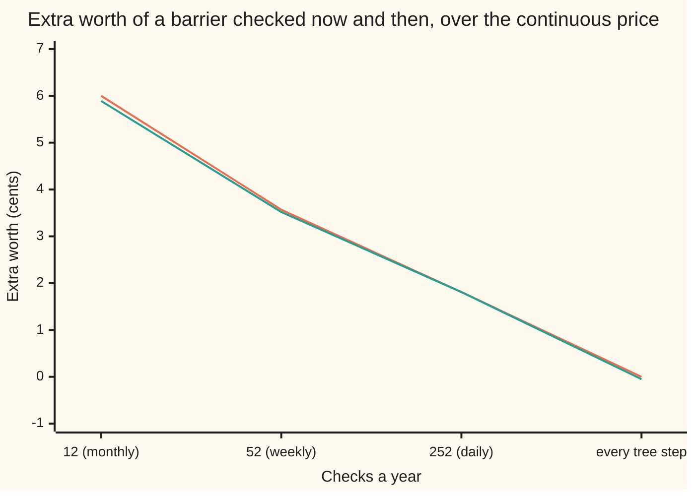

# Daily monitoring: a barrier checked once a day is worth more than the continuous formula says, and the fix is a shifted barrier

[Syllabus](../../../SYLLABUS.md) → [Financial mathematics](../README.md) → [Barriers, touches and lookbacks](../README.md#s16) → Daily monitoring

---

## General Overview

Acme shares trade at $100. A one-year call on them, strike $100, costs $9.23 in the house market. Now add a tripwire at $80: if Acme falls to $80, the call dies and pays nothing. That is a **down-and-out call** ([Knock-out and knock-in options](01-knock-out-and-knock-in-options.md)). The closed-form price is $9.13 ([The eight barrier formulas](02-reiner-rubinstein-barrier-formulas.md)).

That formula assumes someone watches the price every instant. Many real contracts do not. They check once a day, against the official closing price. Picture a guard who looks at the door at 4 pm and at no other time. Acme closes at $81 on Monday and at $81 again on Tuesday. In between it may have dipped to $80 and bounced; for that pair of closes the chance is 0.143070. If it did, a watched-every-instant contract is dead. The checked-at-the-close contract never saw the dip and lives on.

From here on the guard gets its proper name: **discrete monitoring**, meaning the barrier is checked only at fixed dates. The watched-every-instant kind is **continuous monitoring**. A discretely monitored knock-out dies less often, so it is worth more. How much more, and how to price it without a new formula, is this card.

The answer, found by Mark Broadie, Paul Glasserman and Steven Kou in 1997, is short. Keep the continuous formula. Move the barrier a little further from the spot. With 252 daily checks, the barrier at $80 becomes $79.41 and the price becomes $9.15, 1.81 cents above the continuous $9.13. A daily-checked tree and a daily simulation of 200,000 paths land on the same number.

**A barrier checked m times is priced by the continuous formula with the barrier pushed away from the spot by the factor e^{0.5826 σ √Δt}, where σ is the volatility and Δt is the time between checks.**

**What kind of fact this is:** an approximation, with its error stated: exact to first order, with a leftover that shrinks faster than one over the square root of the number of checks. Here it leaves 0.000024 dollars between the formula and a daily tree. Broadie, Glasserman and Kou prove it; this card gives the proof's shape in Why it works and checks the result three ways.

### The picture: how much a check schedule adds

Each point is the discretely monitored price minus the continuous price, in cents, for the $80 down-and-out call.



Orange line: the shifted-barrier formula. Teal line: a trinomial tree that checks the barrier only on the scheduled dates. The fewer the checks, the more the contract is worth. At the right end the formula has no shift (zero) and the tree checks every step, so both describe the continuous contract; the tree's −0.05 cents is its own small step error.

---

## The formula

$$V_m(H) \;\approx\; V\!\left(H\,e^{-\beta\,\sigma\sqrt{\Delta t}}\right), \qquad \Delta t = \frac{T}{m}, \qquad \beta = -\frac{\zeta(1/2)}{\sqrt{2\pi}} \approx 0.5826$$

**Read it aloud:** the price with m checks equals the continuous price at a barrier moved away from the spot by 0.5826 of one period's typical move.

For a barrier **above** the spot, the sign flips: $H\,e^{+\beta\sigma\sqrt{\Delta t}}$. The rule in words is the same both ways: move the barrier away from where the price is now.

The continuous price itself comes from the sibling card. For a down-and-out call with the barrier at or below the strike, it is the vanilla call minus a weighted mirror-image call:

$$V(H) = C(S) - \left(\frac{H}{S}\right)^{2\lambda} C\!\left(\frac{H^2}{S}\right), \qquad \lambda = \frac{r - q - \tfrac12\sigma^2}{\sigma^2}$$

In words: the plain call, minus the value of the paths that touched $H$, which the mirror trick counts as a call struck from the reflected spot $H^2/S$.

| Symbol | Plain meaning | In our example | Push it up and the answer… |
| --- | --- | --- | --- |
| $V_m$, $V$ | price of the down-and-out call with m checks; the continuous-monitoring price, read as a function of the barrier level | $9.15 daily; $9.13 continuous at $80 | — |
| $H$ | the barrier: the price that kills the option | $80 | falls: the tripwire sits closer |
| $H^*$ | the shifted barrier fed to the continuous formula, $H e^{-\beta\sigma\sqrt{\Delta t}}$ | $79.41 | — |
| $m$ | number of checks over the life | 252 (trading days) | falls toward $9.13: more chances to be caught |
| $\Delta t$ | time between checks, in years | 1/252 | rises: more dips go unseen |
| $a$, $b$ | log distances of two consecutive closes above the barrier, ln(close / H) | closes at $81 and $81 (Step 1) | the dip chance between them falls fast |
| $\beta$ | the average overshoot of a random walk past a far level, in units of one step's typical size | 0.5826 | rises: a bigger shift |
| $\zeta$ | the Riemann zeta function; $\zeta(1/2)$ is the alternating-sum value built in the checks | −1.460355 | — |
| $\sigma$ | volatility: the typical yearly size of Acme's moves | 20% | a bigger shift, and a cheaper knock-out |
| $S$, $K$ | today's price and the strike | $100, $100 | $S$ up: further from the barrier |
| $r$, $q$, $T$ | riskless rate, dividend yield, life in years | 5%, 2%, 1 | — |
| $C$, $\lambda$ | Black–Scholes call as a function of the spot; drift of the log price in units of variance | 9.227006; 2λ = 0.5 | — |

### When it holds

- **Evenly spaced checks.** The derivation assumes each gap is Δt. Uneven gaps (a long weekend, a missing fixing) need the gap that actually applies near the barrier; one average Δt misprices when the long gaps fall where the price is close.
- **A lognormal price between checks with steady volatility.** The shift is built from the size of one period's move. If volatility jumps, the shift should use the volatility that applies over that gap.
- **No jumps.** An overnight gap straight through the barrier is caught by both kinds of contract, so jumps shrink the difference between them. The formula does not see jumps and overstates the gap.
- **A barrier not too close to the spot.** The overshoot argument needs the barrier several typical moves away. At $95, five percent from the spot, the shifted formula gives 5.378029 against the tree's 5.401229, a far wider gap than at $80.
- **Many checks.** The error shrinks as checks grow. Even with monthly checks the formula (9.193273) stays close to the tree (9.192233).

---

## Why it works

### Step 0: a check at the close misses the dips between closes

The contract sees 252 prices a year. Between two closes, the price keeps moving. A path that dips below $80 and recovers before the close is dead under continuous monitoring and alive under daily monitoring. So the daily contract behaves as if its barrier were a little further away. The whole job is to say how much further.

### Step 1: how often a dip goes unseen

Between two closes the log price is a **Brownian bridge**: a random path pinned at both ends. For a bridge, the chance of dipping to the barrier has a closed form. With the two closes at log distances $a$ and $b$ above the barrier:

$$\Pr(\text{dip to } H \text{ between closes}) = e^{-2ab/(\sigma^2\Delta t)}$$

Two closes at $81 give a dip chance of 0.143070. Two closes at $82 give 0.000461. Missed touches live within a day's move of the barrier. Only paths that close near $80 can have an unseen dip.

This is also why the continuous contract touches more often. Under the pricing measure, the chance of ever touching $80 over the year, watched every instant, is 0.250014. The simulation below counts touches at daily closes only: 0.235765. The gap is the touches nobody saw.

### Step 2: a daily walk crosses the barrier with an overshoot

The daily closes form a **random walk**: a running sum of independent steps, each roughly normal with typical size $\sigma\sqrt{\Delta t}$, one day's wiggle. A continuous path that crosses $80$ touches it exactly. A daily walk that crosses does so between closes, and its first close below the barrier lands under it by some amount. That amount is the **overshoot**.

So a daily contract that finally sees a close below $80$ is, on average, looking at a price one overshoot below $80$. Its knock-out event is close to a continuous path touching that lower level. The daily contract with barrier $H$ therefore behaves like a continuous contract with the barrier moved down by the average overshoot.

### Step 3: the average overshoot is 0.5826 of one step

For a walk with normal steps, heading for a level many steps away, the average overshoot settles to a fixed fraction of one step's typical size. David Siegmund computed it:

$$\beta = -\frac{\zeta(1/2)}{\sqrt{2\pi}} = 0.582597$$

The **Riemann zeta function** $\zeta$ appears because the overshoot is built from sums over all step counts n of terms in $1/\sqrt{n}$, and $\sum 1/n^{s}$ is what $\zeta(s)$ means; at $s = 1/2$ that sum diverges, and the zeta function is its standard finite continuation. The checks build $\zeta(1/2) = -1.460355$ from the alternating sum $1 - 1/\sqrt2 + 1/\sqrt3 - \dots$, and reach the same 0.582597 by a second road, an integral from Siegmund's work.

In log price, one day's wiggle is $\sigma\sqrt{\Delta t} = 0.012599$. The shift is 0.5826 of that, 0.007340. The barrier moves from $\ln 80$ to $\ln 80 - 0.007340$, which is $80\,e^{-0.007340} = 79.414944$.

### Step 4: nothing else changes

The payoff at expiry depends only on the final price, not on the check schedule. Only the survival event changes, and Step 3 says it matches continuous survival above the shifted barrier. So the continuous formula, fed the shifted barrier, prices the daily contract.

<details>
<summary>Detailed proof</summary>

Work in log price: $x_t = \ln(S_t/S)$, barrier $b = \ln(H/S) < 0$. Under the pricing measure, $x$ is Brownian motion with drift $r - q - \tfrac12\sigma^2$ and volatility $\sigma$. The closes $x_{k\Delta t}$ form a random walk with normal steps.
1. **Rescale.** Divide by $\sigma\sqrt{\Delta t}$. The walk now has steps of size about 1 plus a drift that vanishes as the checks multiply, and the barrier sits at $b/(\sigma\sqrt{\Delta t})$ steps, which runs off to minus infinity as $\Delta t \to 0$.
2. **Corrected diffusion approximation** (Siegmund and Yuh, 1982). For such a walk, the chance of crossing a far level c within m steps equals the chance that Brownian motion with the same drift crosses c plus ρ, where ρ is the walk's limiting mean overshoot, up to an error smaller than $1/\sqrt m$.
3. **The constant.** Renewal theory gives the limiting mean overshoot as $\rho = \mathbb{E}[L^2] / (2\,\mathbb{E}[L])$, where L is a ladder height: the amount by which the walk beats its previous record each time it sets a new one. Spitzer's identity evaluates these moments for normal steps, and the result is $\rho = -\zeta(1/2)/\sqrt{2\pi}$, equal to Siegmund's integral $-\frac1\pi\int_0^\infty x^{-2}\ln\!\big(2(1-e^{-x^2/2})/x^2\big)\,dx$. Both roads are computed in the checks.
4. **Undo the rescaling.** An overshoot of $\beta$ steps is $\beta\sigma\sqrt{\Delta t}$ in log price. The discrete survival event $\{\text{every close} > b\}$ has the probability, to first order, of the continuous event $\{\text{path stays above } b - \beta\sigma\sqrt{\Delta t}\}$.
5. **From probabilities to prices.** The price is a discounted average of the expiry payoff over surviving paths. Broadie, Glasserman and Kou carry step 4 through that average, with the payoff attached, and show $V_m(H) = V(H e^{\mp\beta\sigma\sqrt{\Delta t}}) + o(1/\sqrt m)$: the leftover shrinks faster than one over the root of the number of checks.

</details>

### The other doors

A daily contract can be priced directly, without the shift. A trinomial tree ([Trinomial trees](../04-Binomial%20Trees/06-trinomial-trees-and-the-grid-connection.md)) checks the barrier only on the layers that fall on a close. A simulation ([Monte Carlo pricing](../06-Numerical%20Methods%20for%20Pricing/01-monte-carlo-pricing.md)) walks from close to close and kills a path whose close is at or below $80. Both are slower than one formula call, which is why desks use the shift, and both are in the code below as independent checks.

---

## Worked numbers, by hand

House market: $S = 100$, $K = 100$, $r = 5\%$, $q = 2\%$, $\sigma = 20\%$, $T = 1$, barrier $H = 80$, 252 daily checks.

| Step | Arithmetic | Value |
| --- | --- | --- |
| time between checks, Δt | 1/252 of a year | 1/252 |
| one day's wiggle, σ√Δt | 0.20 × √(1/252) | 0.012599 |
| the shift, βσ√Δt | 0.5826 × 0.012599 | 0.007340 |
| shifted barrier, H* | 80 × e^{−0.007340} | 79.414944 |
| 2λ | 2 × (0.05 − 0.02 − 0.02) / 0.04 | 0.5 |
| weight (H*/S)^{2λ} | (0.79414944)^{0.5} | 0.891151 |
| reflected spot H*^2/S | 79.414944^2 / 100 | 63.067334 |
| mirror-image call C(63.067334) | Black–Scholes call, spot 63.07, strike 100 | 0.084814 |
| weighted image | 0.891151 × 0.084814 | 0.075582 |
| vanilla call C(100) | the house call | 9.227006 |
| **daily-monitored down-and-out** | 9.227006 − 0.075582 | **9.151424** |

The daily contract is worth $9.15. The continuous formula at $80 says $9.13; the difference is 0.018117 dollars, 1.81 cents. The knock-in with the same daily checks is worth the weighted image, 0.075582, against 0.093699 for the continuous knock-in: in plus out is still the vanilla, with both halves moved.

### What breaks if you drop a piece

| Mistake | Comes out at | What went wrong |
| --- | --- | --- |
| No shift: the continuous formula on a daily contract | 9.133306 | Charges for touches the contract never sees; 1.81 cents too cheap |
| Shift toward the spot | 9.111362 | Wrong direction: the barrier must move away from the spot |
| Shift by βσ√T, a year's wiggle, not a day's | 9.225207 | Moves the barrier a whole year's wiggle away: nearly a plain call |
| Daily tree with the barrier on a node layer | 9.144478 | The node on the barrier is counted as dead, though half the prices around it survive the close |

---

## Code, from first principles, and it actually runs

The scripts reach the daily price three independent ways. **Road 1** is the shifted formula. **Road 2** is a trinomial tree with 3,276 steps (13 a day), checking the barrier only on the 252 layers that fall on a close. **Road 3** is a simulation: 100,000 pairs of mirror-image paths (200,000 paths), each walked close by close with random numbers from a home-made generator (a 64-bit linear congruential generator, turned into normal draws by the Box–Muller formula). The simulation uses a **control variate**: on each path it records the knock-out payoff minus the plain call's payoff, averages that difference, and adds back the known call price 9.227006. The difference is zero on most paths, so the average settles fast: a standard error of 0.002162 instead of 0.023282 for the raw average. Without it, the simulation's noise would be larger than the 1.81-cent effect it is meant to measure.

Two more checks keep the roads honest. The same tree, checked at every step with the barrier on a node layer, must land on the continuous formula. And β is built twice, from the zeta series and from Siegmund's integral.

A note on the tree. A daily check makes the option's value jump at the barrier, from nothing to something. A tree layer sitting exactly on the jump is misread. So the daily tree places $80 halfway between two layers. The every-step tree is the opposite case: there the barrier belongs on a layer, as on [Trinomial trees](../04-Binomial%20Trees/06-trinomial-trees-and-the-grid-connection.md).

### Python

```python
# Daily monitoring of a barrier: the Broadie-Glasserman-Kou shift, checked three ways.
# Standard library only.  Our own normal CDF (from erf), our own random numbers
# (a 64-bit linear congruential generator), our own tree.  Nothing imported knows the answer.
from math import log, sqrt, exp, expm1, erf, pi, cos, sin

S, K, r, q, sigma, T, H = 100.0, 100.0, 0.05, 0.02, 0.20, 1.0, 80.0
DAYS = 252

def N(x): return 0.5 * (1.0 + erf(x / sqrt(2.0)))

def call(s, k):                                     # plain Black-Scholes call on the house market
    d1 = (log(s / k) + (r - q + 0.5 * sigma * sigma) * T) / (sigma * sqrt(T))
    return s * exp(-q * T) * N(d1) - k * exp(-r * T) * N(d1 - sigma * sqrt(T))

LAM = (r - q - 0.5 * sigma * sigma) / (sigma * sigma)
def doc(h):                                         # continuous down-and-out call, barrier h <= K
    return call(S, K) - (h / S) ** (2 * LAM) * call(h * h / S, K)

def beta_from_zeta(terms=40):                       # beta = -zeta(1/2)/sqrt(2 pi), zeta built by hand
    sums, total = [], 0.0                           # eta(1/2) = 1 - 1/sqrt2 + 1/sqrt3 - ...
    for n in range(1, terms + 1):
        total += (-1) ** (n - 1) / sqrt(n); sums.append(total)
    while len(sums) > 1:                            # repeated averaging tames the alternating series
        sums = [0.5 * (a + b) for a, b in zip(sums, sums[1:])]
    zeta = sums[0] / (1.0 - sqrt(2.0))              # zeta(s) = eta(s) / (1 - 2^(1-s))
    return zeta, -zeta / sqrt(2.0 * pi)

def beta_from_integral(X=40.0, n=4000):            # the same constant as an integral (Siegmund's formula)
    def f(x): return -0.25 if x == 0 else log(-2.0 * expm1(-x * x / 2) / (x * x)) / (x * x)
    h = X / n                                       # Simpson on [0, X], then the tail past X exactly
    body = (f(0.0) + f(X) + sum((4 if i % 2 else 2) * f(i * h) for i in range(1, n))) * h / 3
    return -(body + (log(2.0) - 2 * log(X) - 2) / X) / pi

def bridge_dip(a_close, b_close, dt):               # chance a path dipped to H between two closes
    return exp(-2 * log(a_close / H) * log(b_close / H) / (sigma * sigma * dt))

def shifted(h, m, beta=0.5826, span=None):          # BGK: move a DOWN barrier down by beta sigma sqrt(dt)
    return h * exp(-beta * sigma * sqrt(span if span else T / m))

def tree(h, n, every, layer):
    # Trinomial tree on log price, n steps.  The barrier is checked only on steps that are
    # multiples of `every`.  layer=True puts the barrier ON a node layer; False puts it halfway
    # between two layers, which is where a check that happens only now and then belongs.
    dt = T / n; nu = r - q - 0.5 * sigma * sigma; lnh = log(h / S)
    j = round(lnh / (sigma * sqrt(3 * dt)))
    dx = lnh / j if layer else lnh / (j + 0.5)
    a = (sigma * sigma * dt + nu * nu * dt * dt) / (dx * dx)
    pu, pd, pm = 0.5 * (a + nu * dt / dx), 0.5 * (a - nu * dt / dx), 1.0 - a
    disc = exp(-r * dt)
    v = [max(S * exp(i * dx) - K, 0.0) for i in range(-n, n + 1)]
    for step in range(n - 1, -1, -1):               # nodes i = -step .. step, v[k] is i = k - step
        v = [disc * (pd * v[k] + pm * v[k + 1] + pu * v[k + 2]) for k in range(len(v) - 2)]
        if step > 0 and step % every == 0:
            for k in range(min(j + step + 1, len(v))):
                v[k] = 0.0                          # every node at or below layer j is knocked out
    return v[0]

def simulate(m, pairs, seed):
    # Daily-checked paths, antithetic pairs, our own normals (LCG + Box-Muller).
    # Control variate: the vanilla call on the same paths, whose price is known.
    x = seed; dt = T / m; drift = (r - q - 0.5 * sigma * sigma) * dt; vol = sigma * sqrt(dt)
    lnh = log(H / S); disc = exp(-r * T); M64 = (1 << 64) - 1
    sy = sy2 = sr = sr2 = 0.0; touched = 0
    for _ in range(pairs):
        a = b = mina = minb = 0.0
        for _ in range(m // 2):
            x = (6364136223846793005 * x + 1442695040888963407) & M64; u1 = ((x >> 11) + 0.5) / 2.0 ** 53
            x = (6364136223846793005 * x + 1442695040888963407) & M64; u2 = ((x >> 11) + 0.5) / 2.0 ** 53
            rad, th = sqrt(-2.0 * log(u1)), 2.0 * pi * u2
            for z in (rad * cos(th), rad * sin(th)):
                a += drift + vol * z; b += drift - vol * z
                if a < mina: mina = a
                if b < minb: minb = b
        y = rr = 0.0
        for end, low in ((a, mina), (b, minb)):
            pay = disc * max(S * exp(end) - K, 0.0)
            if low <= lnh: touched += 1; y -= 0.5 * pay        # knocked out: loses the vanilla payoff
            else: rr += 0.5 * pay
        sy += y; sy2 += y * y; sr += rr; sr2 += rr * rr
    my, mr = sy / pairs, sr / pairs
    return (call(S, K) + my, sqrt((sy2 / pairs - my * my) / pairs),
            mr, sqrt((sr2 / pairs - mr * mr) / pairs), touched / (2 * pairs))

def touch_prob(h):                                  # chance a continuous path ever reaches h below S
    nu, b, v = r - q - 0.5 * sigma * sigma, log(h / S), sigma * sqrt(T)
    return N((b - nu * T) / v) + exp(2 * nu * b / sigma ** 2) * N((b + nu * T) / v)

zeta, beta = beta_from_zeta()
cont = doc(H)
Hd = shifted(H, DAYS)
bgk = doc(Hd)
STEPS = 3276                                        # 13 tree steps a day; divisible by 12, 52 and 252
tree_daily = tree(H, STEPS, STEPS // DAYS, False)
tree_cont = tree(H, STEPS, 1, True)
mc, mc_se, raw, raw_se, touch_daily = simulate(DAYS, 100000, 20260924)
beta_int = beta_from_integral()
rows = [("zeta(1/2), by hand", zeta), ("beta = -zeta(1/2)/sqrt(2 pi)", beta), ("beta, by Siegmund's integral", beta_int),
        ("dip chance, closes 81 then 81", bridge_dip(81.0, 81.0, T / DAYS)), ("dip chance, closes 82 then 82", bridge_dip(82.0, 82.0, T / DAYS)),
        ("one day's wiggle sigma sqrt(dt)", sigma * sqrt(T / DAYS)), ("shift beta sigma sqrt(dt)", 0.5826 * sigma * sqrt(T / DAYS)),
        ("shifted barrier, daily", Hd), ("2 lambda", 2 * LAM), ("(H*/S)^(2 lambda)", (Hd / S) ** (2 * LAM)), ("H*^2/S", Hd * Hd / S),
        ("image call C(H*^2/S)", call(Hd * Hd / S, K)), ("vanilla call", call(S, K)),
        ("1 continuous formula, H = 80", cont), ("2 BGK shifted formula, daily", bgk),
        ("3 tree, checked daily", tree_daily), ("4 simulation, daily, 200,000 paths", mc), ("  std error", mc_se),
        ("  raw average, no control", raw), ("  std error, no control", raw_se),
        ("5 tree, checked every step", tree_cont), ("daily minus continuous", bgk - cont),
        ("BGK minus daily tree", bgk - tree_daily), ("down-and-in, daily", call(S, K) - bgk), ("down-and-in, continuous", call(S, K) - cont),
        ("touch chance, continuous at 80", touch_prob(H)), ("touch rate, daily simulation", touch_daily),
        ("touch chance, continuous at H*", touch_prob(Hd))]
extra_bgk, extra_tree = [], []                      # chart: cents above the continuous price
for months, label in ((12, "monthly"), (52, "weekly")):
    b_m, t_m = doc(shifted(H, months)), tree(H, STEPS, STEPS // months, False)
    rows += [(f"shifted barrier, {label}", shifted(H, months)), (f"BGK, {label}", b_m), (f"tree, checked {label}", t_m)]
    extra_bgk.append(100 * (b_m - cont)); extra_tree.append(100 * (t_m - cont))
extra_bgk += [100 * (bgk - cont), 0.0]; extra_tree += [100 * (tree_daily - cont), 100 * (tree_cont - cont)]
wrong_sign = doc(H * exp(0.5826 * sigma * sqrt(T / DAYS)))
wrong_T = doc(shifted(H, DAYS, span=T))
node_daily = tree(H, STEPS, STEPS // DAYS, True)
rows += [("wrong: no shift", cont), ("wrong: shift toward the spot", wrong_sign),
         ("wrong: sigma sqrt(T), not sigma sqrt(dt)", wrong_T), ("wrong: daily tree, barrier on a layer", node_daily),
         ("try: beta = 1", doc(shifted(H, DAYS, beta=1.0))), ("try: H = 95, continuous", doc(95.0)),
         ("try: H = 95, BGK daily", doc(shifted(95.0, DAYS))), ("try: H = 95, tree daily", tree(95.0, STEPS, STEPS // DAYS, False))]
for name, val in rows:
    print(f"{name:<42} {val:>12.6f}")
print("chart, checks a year        12      52     252   every")
print("chart, BGK cents  " + "".join(f"{v:8.2f}" for v in extra_bgk))
print("chart, tree cents " + "".join(f"{v:8.2f}" for v in extra_tree))

assert abs(call(S, K) - 9.227005508154) < 1e-9, "house call must match the pilot"
assert abs(cont - 9.133306) < 5e-7, "continuous down-and-out must match the barrier-formulas card"
assert abs(beta - 0.5826) < 5e-5, "hand-built zeta must give the published constant"
assert abs(beta - beta_int) < 1e-6, "zeta road and integral road to beta must agree"
assert abs(tree_cont - cont) < 0.002, "a tree checked every step must land on the continuous formula"
assert abs(bgk - tree_daily) < 0.001, "shifted formula vs a daily-checked tree"
assert abs(mc - bgk) < 3 * mc_se, "shifted formula vs the daily simulation"
assert mc - cont > 3 * mc_se, "daily checking must be worth measurably more than continuous"
assert abs(touch_daily - touch_prob(Hd)) < 0.003, "daily touch rate vs continuous touch at the shifted barrier"
print("ALL CHECKS PASS")
```

**Ran 2026-09-24 on macOS, Python 3.14.6, standard library only. All checks passed. Output, pasted from the run:**

```
zeta(1/2), by hand                            -1.460355
beta = -zeta(1/2)/sqrt(2 pi)                   0.582597
beta, by Siegmund's integral                   0.582597
dip chance, closes 81 then 81                  0.143070
dip chance, closes 82 then 82                  0.000461
one day's wiggle sigma sqrt(dt)                0.012599
shift beta sigma sqrt(dt)                      0.007340
shifted barrier, daily                        79.414944
2 lambda                                       0.500000
(H*/S)^(2 lambda)                              0.891151
H*^2/S                                        63.067334
image call C(H*^2/S)                           0.084814
vanilla call                                   9.227006
1 continuous formula, H = 80                   9.133306
2 BGK shifted formula, daily                   9.151424
3 tree, checked daily                          9.151448
4 simulation, daily, 200,000 paths             9.153967
  std error                                    0.002162
  raw average, no control                      9.159204
  std error, no control                        0.023282
5 tree, checked every step                     9.132782
daily minus continuous                         0.018117
BGK minus daily tree                          -0.000024
down-and-in, daily                             0.075582
down-and-in, continuous                        0.093699
touch chance, continuous at 80                 0.250014
touch rate, daily simulation                   0.235765
touch chance, continuous at H*                 0.235031
shifted barrier, monthly                      77.353839
BGK, monthly                                   9.193273
tree, checked monthly                          9.192233
shifted barrier, weekly                       78.717714
BGK, weekly                                    9.168965
tree, checked weekly                           9.168530
wrong: no shift                                9.133306
wrong: shift toward the spot                   9.111362
wrong: sigma sqrt(T), not sigma sqrt(dt)       9.225207
wrong: daily tree, barrier on a layer          9.144478
try: beta = 1                                  9.162386
try: H = 95, continuous                        4.883524
try: H = 95, BGK daily                         5.378029
try: H = 95, tree daily                        5.401229
chart, checks a year        12      52     252   every
chart, BGK cents      6.00    3.57    1.81    0.00
chart, tree cents     5.89    3.52    1.81   -0.05
ALL CHECKS PASS
```

Three roads, one price. The tree lands 0.000024 dollars from the shifted formula. The simulation, 9.153967, sits inside two standard errors of it. The touch rate at daily closes, 0.235765, matches the continuous chance of touching the shifted barrier, 0.235031, as Step 3 predicts.

### Rust

The same checks in Rust. Rust has no erf, so the bell-curve area is built by adding thin slices under the curve. The random numbers come from the same generator with the same seed.

```rust
// Daily monitoring of a barrier: the Broadie-Glasserman-Kou shift, checked three ways.
// Std only, no crates.  Rust has no erf, so N(x) adds up thin slices under the bell curve
// (Simpson).  Same random numbers as the Python check: a 64-bit LCG and Box-Muller.
use std::f64::consts::PI;

const S: f64 = 100.0; const K: f64 = 100.0; const R: f64 = 0.05; const Q: f64 = 0.02;
const SIGMA: f64 = 0.20; const T: f64 = 1.0; const H: f64 = 80.0; const DAYS: usize = 252;

fn n_cdf(x: f64) -> f64 {
    let n = 2000; let h = x / n as f64;
    let phi = |u: f64| (-0.5 * u * u).exp() / (2.0 * PI).sqrt();
    let mut s = phi(0.0) + phi(x);
    for i in 1..n { s += if i % 2 == 1 { 4.0 } else { 2.0 } * phi(i as f64 * h); }
    0.5 + s * h / 3.0
}

fn call(s: f64, k: f64) -> f64 {
    let v = SIGMA * T.sqrt();
    let d1 = ((s / k).ln() + (R - Q + 0.5 * SIGMA * SIGMA) * T) / v;
    s * (-Q * T).exp() * n_cdf(d1) - k * (-R * T).exp() * n_cdf(d1 - v)
}

fn lam() -> f64 { (R - Q - 0.5 * SIGMA * SIGMA) / (SIGMA * SIGMA) }
fn doc(h: f64) -> f64 { call(S, K) - (h / S).powf(2.0 * lam()) * call(h * h / S, K) }

fn beta_from_zeta(terms: usize) -> (f64, f64) {
    let mut sums = Vec::new(); let mut total = 0.0;
    for n in 1..=terms {
        let sign = if n % 2 == 1 { 1.0 } else { -1.0 };
        total += sign / (n as f64).sqrt(); sums.push(total);
    }
    while sums.len() > 1 { sums = sums.windows(2).map(|w| 0.5 * (w[0] + w[1])).collect(); }
    let zeta = sums[0] / (1.0 - 2f64.sqrt());
    (zeta, -zeta / (2.0 * PI).sqrt())
}

fn beta_from_integral(x_max: f64, n: usize) -> f64 {   // the same constant as an integral (Siegmund)
    let f = |x: f64| if x == 0.0 { -0.25 } else { (-2.0 * (-x * x / 2.0).exp_m1() / (x * x)).ln() / (x * x) };
    let h = x_max / n as f64;
    let mut body = f(0.0) + f(x_max);
    for i in 1..n { body += if i % 2 == 1 { 4.0 } else { 2.0 } * f(i as f64 * h); }
    -(body * h / 3.0 + (2f64.ln() - 2.0 * x_max.ln() - 2.0) / x_max) / PI
}

fn bridge_dip(a_close: f64, b_close: f64, dt: f64) -> f64 {   // chance of a dip to H between closes
    (-2.0 * (a_close / H).ln() * (b_close / H).ln() / (SIGMA * SIGMA * dt)).exp()
}

fn shifted(h: f64, span: f64, beta: f64) -> f64 { h * (-beta * SIGMA * span.sqrt()).exp() }

fn tree(h: f64, n: usize, every: usize, layer: bool) -> f64 {
    let dt = T / n as f64; let nu = R - Q - 0.5 * SIGMA * SIGMA; let lnh = (h / S).ln();
    let j = (lnh / (SIGMA * (3.0 * dt).sqrt())).round();
    let dx = if layer { lnh / j } else { lnh / (j + 0.5) };
    let a = (SIGMA * SIGMA * dt + nu * nu * dt * dt) / (dx * dx);
    let (pu, pd, pm) = (0.5 * (a + nu * dt / dx), 0.5 * (a - nu * dt / dx), 1.0 - a);
    let disc = (-R * dt).exp();
    let mut v: Vec<f64> = (0..=2 * n).map(|k| (S * ((k as f64 - n as f64) * dx).exp() - K).max(0.0)).collect();
    for step in (0..n).rev() {
        v = (0..v.len() - 2).map(|k| disc * (pd * v[k] + pm * v[k + 1] + pu * v[k + 2])).collect();
        if step > 0 && step % every == 0 {
            let top = j as i64 + step as i64 + 1;
            for k in 0..(top.max(0) as usize).min(v.len()) { v[k] = 0.0; }
        }
    }
    v[0]
}

fn simulate(m: usize, pairs: usize, seed: u64) -> (f64, f64, f64, f64, f64) {
    let mut x = seed; let dt = T / m as f64;
    let drift = (R - Q - 0.5 * SIGMA * SIGMA) * dt; let vol = SIGMA * dt.sqrt();
    let lnh = (H / S).ln(); let disc = (-R * T).exp();
    let (mut sy, mut sy2, mut sr, mut sr2, mut touched) = (0.0, 0.0, 0.0, 0.0, 0usize);
    let next = |x: &mut u64| {
        *x = x.wrapping_mul(6364136223846793005).wrapping_add(1442695040888963407);
        ((*x >> 11) as f64 + 0.5) / 2f64.powi(53)
    };
    for _ in 0..pairs {
        let (mut a, mut b, mut mina, mut minb) = (0.0f64, 0.0f64, 0.0f64, 0.0f64);
        for _ in 0..m / 2 {
            let u1 = next(&mut x); let u2 = next(&mut x);
            let (rad, th) = ((-2.0 * u1.ln()).sqrt(), 2.0 * PI * u2);
            for z in [rad * th.cos(), rad * th.sin()] {
                a += drift + vol * z; b += drift - vol * z;
                if a < mina { mina = a; }
                if b < minb { minb = b; }
            }
        }
        let (mut y, mut rr) = (0.0, 0.0);
        for (end, low) in [(a, mina), (b, minb)] {
            let pay = disc * (S * end.exp() - K).max(0.0);
            if low <= lnh { touched += 1; y -= 0.5 * pay; } else { rr += 0.5 * pay; }
        }
        sy += y; sy2 += y * y; sr += rr; sr2 += rr * rr;
    }
    let p = pairs as f64; let (my, mr) = (sy / p, sr / p);
    (call(S, K) + my, ((sy2 / p - my * my) / p).sqrt(), mr, ((sr2 / p - mr * mr) / p).sqrt(),
     touched as f64 / (2.0 * p))
}

fn touch_prob(h: f64) -> f64 {
    let (nu, b, v) = (R - Q - 0.5 * SIGMA * SIGMA, (h / S).ln(), SIGMA * T.sqrt());
    n_cdf((b - nu * T) / v) + (2.0 * nu * b / (SIGMA * SIGMA)).exp() * n_cdf((b + nu * T) / v)
}

fn main() {
    let day = T / DAYS as f64; let bb = 0.5826;
    let (zeta, beta) = beta_from_zeta(40);
    let beta_int = beta_from_integral(40.0, 4000);
    let cont = doc(H); let hd = shifted(H, day, bb); let bgk = doc(hd);
    let steps = 3276;
    let tree_daily = tree(H, steps, steps / DAYS, false);
    let tree_cont = tree(H, steps, 1, true);
    let (mc, mc_se, raw, raw_se, touch_daily) = simulate(DAYS, 100000, 20260924);
    let lm = 2.0 * lam();
    let mut rows: Vec<(String, f64)> = vec![
        ("zeta(1/2), by hand".into(), zeta), ("beta = -zeta(1/2)/sqrt(2 pi)".into(), beta),
        ("beta, by Siegmund's integral".into(), beta_int),
        ("dip chance, closes 81 then 81".into(), bridge_dip(81.0, 81.0, day)),
        ("dip chance, closes 82 then 82".into(), bridge_dip(82.0, 82.0, day)),
        ("one day's wiggle sigma sqrt(dt)".into(), SIGMA * day.sqrt()), ("shift beta sigma sqrt(dt)".into(), bb * SIGMA * day.sqrt()),
        ("shifted barrier, daily".into(), hd), ("2 lambda".into(), lm), ("(H*/S)^(2 lambda)".into(), (hd / S).powf(lm)), ("H*^2/S".into(), hd * hd / S),
        ("image call C(H*^2/S)".into(), call(hd * hd / S, K)), ("vanilla call".into(), call(S, K)),
        ("1 continuous formula, H = 80".into(), cont), ("2 BGK shifted formula, daily".into(), bgk),
        ("3 tree, checked daily".into(), tree_daily), ("4 simulation, daily, 200,000 paths".into(), mc), ("  std error".into(), mc_se),
        ("  raw average, no control".into(), raw), ("  std error, no control".into(), raw_se),
        ("5 tree, checked every step".into(), tree_cont), ("daily minus continuous".into(), bgk - cont),
        ("BGK minus daily tree".into(), bgk - tree_daily), ("down-and-in, daily".into(), call(S, K) - bgk), ("down-and-in, continuous".into(), call(S, K) - cont),
        ("touch chance, continuous at 80".into(), touch_prob(H)), ("touch rate, daily simulation".into(), touch_daily),
        ("touch chance, continuous at H*".into(), touch_prob(hd)),
    ];
    let (mut extra_bgk, mut extra_tree) = (Vec::new(), Vec::new());   // chart: cents above continuous
    for (months, label) in [(12usize, "monthly"), (52, "weekly")] {
        let hm = shifted(H, T / months as f64, bb);
        let (b_m, t_m) = (doc(hm), tree(H, steps, steps / months, false));
        rows.push((format!("shifted barrier, {}", label), hm));
        rows.push((format!("BGK, {}", label), b_m));
        rows.push((format!("tree, checked {}", label), t_m));
        extra_bgk.push(100.0 * (b_m - cont)); extra_tree.push(100.0 * (t_m - cont));
    }
    extra_bgk.extend([100.0 * (bgk - cont), 0.0]);
    extra_tree.extend([100.0 * (tree_daily - cont), 100.0 * (tree_cont - cont)]);
    let wrong_sign = doc(H * (bb * SIGMA * day.sqrt()).exp());
    let wrong_t = doc(shifted(H, T, bb));
    let node_daily = tree(H, steps, steps / DAYS, true);
    rows.push(("wrong: no shift".into(), cont));
    rows.push(("wrong: shift toward the spot".into(), wrong_sign));
    rows.push(("wrong: sigma sqrt(T), not sigma sqrt(dt)".into(), wrong_t));
    rows.push(("wrong: daily tree, barrier on a layer".into(), node_daily));
    rows.push(("try: beta = 1".into(), doc(shifted(H, day, 1.0))));
    rows.push(("try: H = 95, continuous".into(), doc(95.0)));
    rows.push(("try: H = 95, BGK daily".into(), doc(shifted(95.0, day, bb))));
    rows.push(("try: H = 95, tree daily".into(), tree(95.0, steps, steps / DAYS, false)));
    for (name, val) in &rows { println!("{:<42} {:>12.6}", name, val); }
    println!("chart, checks a year        12      52     252   every");
    let line = |v: &Vec<f64>| v.iter().map(|x| format!("{:8.2}", x)).collect::<String>();
    println!("chart, BGK cents  {}", line(&extra_bgk));
    println!("chart, tree cents {}", line(&extra_tree));

    assert!((call(S, K) - 9.227005508154).abs() < 1e-9, "house call must match the pilot");
    assert!((cont - 9.133306).abs() < 5e-7, "continuous down-and-out must match the barrier-formulas card");
    assert!((beta - 0.5826).abs() < 5e-5, "hand-built zeta must give the published constant");
    assert!((beta - beta_int).abs() < 1e-6, "zeta road and integral road to beta must agree");
    assert!((tree_cont - cont).abs() < 0.002, "a tree checked every step must land on the continuous formula");
    assert!((bgk - tree_daily).abs() < 0.001, "shifted formula vs a daily-checked tree");
    assert!((mc - bgk).abs() < 3.0 * mc_se, "shifted formula vs the daily simulation");
    assert!(mc - cont > 3.0 * mc_se, "daily checking must be worth measurably more than continuous");
    assert!((touch_daily - touch_prob(hd)).abs() < 0.003, "daily touch rate vs continuous touch at the shifted barrier");
    println!("ALL CHECKS PASS");
}
```

**Ran 2026-09-24 on macOS, rustc 1.98.1, no crates. All checks passed. Output, pasted from the run:**

```
zeta(1/2), by hand                            -1.460355
beta = -zeta(1/2)/sqrt(2 pi)                   0.582597
beta, by Siegmund's integral                   0.582597
dip chance, closes 81 then 81                  0.143070
dip chance, closes 82 then 82                  0.000461
one day's wiggle sigma sqrt(dt)                0.012599
shift beta sigma sqrt(dt)                      0.007340
shifted barrier, daily                        79.414944
2 lambda                                       0.500000
(H*/S)^(2 lambda)                              0.891151
H*^2/S                                        63.067334
image call C(H*^2/S)                           0.084814
vanilla call                                   9.227006
1 continuous formula, H = 80                   9.133306
2 BGK shifted formula, daily                   9.151424
3 tree, checked daily                          9.151448
4 simulation, daily, 200,000 paths             9.153967
  std error                                    0.002162
  raw average, no control                      9.159204
  std error, no control                        0.023282
5 tree, checked every step                     9.132782
daily minus continuous                         0.018117
BGK minus daily tree                          -0.000024
down-and-in, daily                             0.075582
down-and-in, continuous                        0.093699
touch chance, continuous at 80                 0.250014
touch rate, daily simulation                   0.235765
touch chance, continuous at H*                 0.235031
shifted barrier, monthly                      77.353839
BGK, monthly                                   9.193273
tree, checked monthly                          9.192233
shifted barrier, weekly                       78.717714
BGK, weekly                                    9.168965
tree, checked weekly                           9.168530
wrong: no shift                                9.133306
wrong: shift toward the spot                   9.111362
wrong: sigma sqrt(T), not sigma sqrt(dt)       9.225207
wrong: daily tree, barrier on a layer          9.144478
try: beta = 1                                  9.162386
try: H = 95, continuous                        4.883524
try: H = 95, BGK daily                         5.378029
try: H = 95, tree daily                        5.401229
chart, checks a year        12      52     252   every
chart, BGK cents      6.00    3.57    1.81    0.00
chart, tree cents     5.89    3.52    1.81   -0.05
ALL CHECKS PASS
```

The two outputs match line for line, simulation included: both programs draw the same random numbers from the same generator, and both reach the bell-curve area by different code.

> [!TIP]
> **Try changing**
> Guess the direction first. Then read the answer from the output.
> - **Check once a month.** The shift grows to put the barrier at $77.35. The price rises to 9.193273, and the monthly tree gives 9.192233. Fewer checks, more missed dips, a richer option; the formula still tracks the tree.
> - **Round β up to 1.** The price comes out at 9.162386, well above the tree's 9.151448. The constant is not a fudge: 0.5826 is the value that makes the roads agree.
> - **Move the barrier to $95.** Continuous price 4.883524; shifted formula 5.378029; daily tree 5.401229. Daily checks now matter far more, and the formula falls short of the tree by more than at $80. The barrier is only a few daily moves away, and the far-level argument of Step 3 is wearing thin.
> - **Put the daily tree's barrier on a layer.** Set `layer=True` in the daily call to `tree`. It gives 9.144478, below the true price. Adding steps closes the gap slowly; moving the barrier between layers closes it at once.

---

## The usual mistake

> [!warning]
> **Pricing a daily-checked barrier with the continuous formula.** The continuous formula counts every intraday dip as a knock-out. A contract checked at the close forgives the dips that recover. For the $80 knock-out the continuous price is 1.81 cents too cheap; for the matching knock-in it is 1.81 cents too dear, 0.093699 against 0.075582. On a book of barriers that error is systematic, all in one direction.
>
> Smaller traps:
> - **Shifting the wrong way.** The barrier always moves away from the spot: down for a down barrier, up for an up barrier. Toward the spot gives 9.111362, worse than no shift at all.
> - **Using the life instead of the gap.** The shift uses $\sigma\sqrt{\Delta t}$, one period's wiggle. Using $\sigma\sqrt{T}$ gives 9.225207, nearly the plain call.
> - **Mixing clocks.** Δt must be measured on the same clock as σ. If volatility is quoted per trading year of 252 days, one close is 1/252; counting 1/365 with the same σ understates the shift.
> - **Trusting a raw simulation.** With 200,000 paths the raw average carries a standard error of 0.023282, larger than the effect. Use a control variate ([Cheaper Monte Carlo](../06-Numerical%20Methods%20for%20Pricing/02-variance-reduction-for-pricing.md)). A simulation checked only at the closes prices the daily contract; pricing the continuous one by simulation needs the bridge dip chance of Step 1 ([Quasi-Monte Carlo](../06-Numerical%20Methods%20for%20Pricing/03-quasi-monte-carlo-and-brownian-bridge.md)).

---

## Where you meet it in real life

- **Term sheets.** A barrier product states how the barrier is observed: at each close, at a fixing time, or at any moment. The pricing follows the term sheet, and the shift converts one into the other.
- **Pricing systems.** Continuous barrier formulas are fast and exact. The shift lets a system price a daily-checked contract with one formula call instead of a tree or a simulation.
- **Touch bets.** A one-touch checked at closes is less likely to pay than one watched continuously: the touch chances above, 0.250014 against 0.235765. The same shift applies ([One-touch and no-touch](05-one-touch-and-no-touch.md)).
- **Lookbacks.** A lookback paid on the highest daily close sees a lower maximum than the continuous path. Broadie, Glasserman and Kou's 1999 paper extends the shift to that case ([Lookback options](06-lookback-options.md)).
- **Hedging near the barrier.** Close to the wall, the daily and continuous contracts differ most, and so do their deltas. That is where the Greeks misbehave ([Barrier Greeks](04-barrier-greeks-at-the-wall.md)).
- **Solving for a barrier.** Finding the barrier that gives a target price runs the same formula backwards; for a daily contract, solve for the shifted barrier and move it back ([Barrier inverses](07-barrier-inverses-level-and-volatility.md)).

> **Say it back**
> A barrier checked only at the close misses the dips that recover before the close, so a daily knock-out dies less often and is worth more than the continuous formula says. A daily walk that crosses the barrier overshoots it by 0.5826 of one day's typical move on average, so daily checks at H act like continuous watching at a barrier moved that far away from the spot. Feed the continuous formula the moved barrier and it prices the daily contract: $9.15 for the house knock-out at $80, against $9.13 continuous. A daily tree and a daily simulation agree. Move the barrier away from the spot, by one period's wiggle, never the whole life's.

---

## What this builds on

- [The eight barrier formulas](02-reiner-rubinstein-barrier-formulas.md): the continuous down-and-out formula this card feeds with a shifted barrier.
- [Monte Carlo pricing](../06-Numerical%20Methods%20for%20Pricing/01-monte-carlo-pricing.md): pricing as an average over simulated paths, road 3 here.
- [Cox-Ross-Rubinstein](../04-Binomial%20Trees/04-crr-tree-and-convergence.md): trees, backward induction and why step placement matters, road 2 here.

## Where this goes next

- [Barrier Greeks](04-barrier-greeks-at-the-wall.md): how the price of a barrier option moves with the spot and with time as the price nears the wall, where hedges are hardest to hold.

The price is now right for the check schedule the contract actually has; what remains open is how that price swings as Acme drifts toward $80, which decides whether the option can be hedged at all.

---

## Sources

Verified 2026-09-24: every link below resolves to the publisher's page.

- Broadie, Mark, Paul Glasserman, and Steven Kou. "A Continuity Correction for Discrete Barrier Options." *Mathematical Finance* 7, no. 4 (1997): 325–349. [doi:10.1111/1467-9965.00035](https://doi.org/10.1111/1467-9965.00035). The shift, its proof and the constant 0.5826.
- Broadie, Mark, Paul Glasserman, and Steven Kou. "Connecting Discrete and Continuous Path-Dependent Options." *Finance and Stochastics* 3 (1999): 55–82. [doi:10.1007/s007800050052](https://doi.org/10.1007/s007800050052). The shift extended to lookbacks, and a trinomial-tree method for discrete checks.
- Siegmund, David, and Yih-Shyh Yuh. "Brownian Approximations to First Passage Probabilities." *Zeitschrift für Wahrscheinlichkeitstheorie und verwandte Gebiete* 59 (1982): 239–248. [doi:10.1007/BF00531747](https://doi.org/10.1007/BF00531747). The corrected diffusion approximation behind Step 3.
- Glasserman, Paul. *Monte Carlo Methods in Financial Engineering*. Springer, 2003. [Publisher page](https://link.springer.com/book/10.1007/978-0-387-21617-1). Simulating barrier options, control variates and the bridge dip chance.
