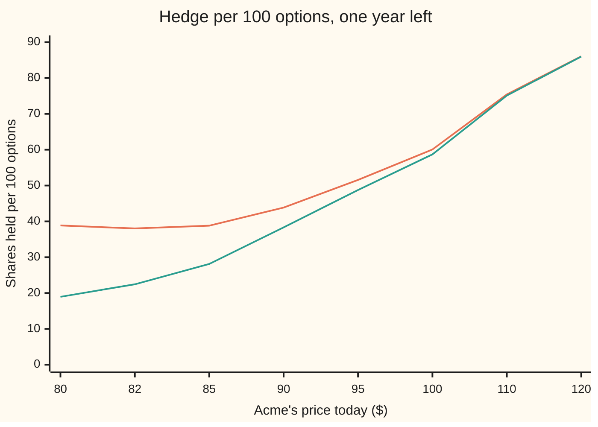

# Barrier Greeks: a delta that explodes at the wall and a vega that changes sign

Financial mathematics → Barriers, touches and lookbacks → Hedging beside a knock-out level → Barrier Greeks

---

## General Overview

Acme shares trade at $100. A bank sells a one-year call on Acme with strike $100, with one extra clause: if Acme ever trades at $80 or lower, the call dies on the spot and pays nothing. This is the house **down-and-out call**, a knock-out option: an option that is cancelled the moment the share touches a set price, the **barrier**. Its sibling card prices it at $9.13, against $9.23 for the plain call ([knock-out-and-knock-in-options](01-knock-out-and-knock-in-options.md)).

The bank does not keep the risk. It hedges: it holds shares so that the option and the shares move against each other. The number of shares is the option's **delta**, the change in its price per $1 move in Acme. With the plain call the hedge is calm. Near $80 the knock-out's hedge is not. Acme at $80.10: the option is worth 4 cents, yet its hedge is 0.39 shares, about $31 of stock. One more dime down and the option is gone, so those shares must be sold in the same instant, at whatever price the market gives.

Three things change beside the barrier, and this card derives each from the price formula. The delta does not fade as it does for the plain call; it stays near 0.39 and then drops to zero in one step. The **gamma**, the change in delta per $1 move, turns negative. And the **vega**, the change in price per unit change in volatility, shrinks to zero; for a knock-out deep in the money beside its barrier, vega turns negative. Hence the desk practices at the end: shifting the barrier, and hedging with other options instead of shares.

**Near a knock-out barrier the Greeks are still smooth derivatives of a formula, but the hedge they describe must jump to zero at the wall, and the wall is where volatility stops helping the holder.**

**What kind of fact this is:** a theorem inside the Black-Scholes model (Acme's price is assumed to wander with constant volatility, an assumption, not a law), proved on this card in Why it works; barrier shifting is a desk convention, not a theorem.

### The picture: how many shares the hedge holds



Orange (upper) line: the down-and-out call with its barrier at $80. Green (lower) line: the plain call. Far from the barrier the two agree. Towards $80 the plain call's hedge fades to 19 shares; the knock-out's hedge bottoms out near 38 at $82 and climbs back to 39 at the wall. Just below $80 the knock-out's hedge is zero. The ticks are unevenly spaced, crowding towards the barrier.

---

## The formula

The sibling card [reiner-rubinstein-barrier-formulas](02-reiner-rubinstein-barrier-formulas.md) proves the price. For a down-and-out call whose strike sits at or above the barrier it is the plain call minus a mirror-image call:

$$V(S) = C(S) - \left(\frac{B}{S}\right)^{a} C\!\left(\frac{B^2}{S}\right), \qquad a = \frac{2(r-q)}{\sigma^2} - 1.$$

**Read it aloud:** the knock-out is worth the plain call, minus a plain call on a mirror-image share priced at the barrier squared over today's price, scaled by a weight that corrects for drift.

Differentiating once in $S$ gives the delta; this card writes a prime for "rate of change as Acme's price moves" ([gamma](../09-The%20Greeks%2C%20one%20each/02-gamma.md) is the second one):

$$V'(S) = \Delta(S) + \left(\frac{B}{S}\right)^{a}\left[\frac{a}{S}\,C(x) + \frac{x}{S}\,\Delta(x)\right], \qquad x = \frac{B^2}{S}.$$

**Read it aloud:** the knock-out's delta is the plain delta plus a positive extra, because every dollar Acme rises also moves it away from the wall.

At the wall itself, $S = B$, the mirror share equals the real one and the expressions collapse to two short lines:

$$V'(B) = 2\,\Delta(B) + \frac{a\,C(B)}{B}, \qquad V''(B) = -\,\frac{1+a}{B}\,V'(B), \qquad \frac{\partial V}{\partial \sigma}\Big|_{S=B} = 0.$$

**Read it aloud:** at the wall the hedge is about twice the plain call's hedge there, the gamma is that hedge times a negative constant, and the vega is exactly zero.

| Symbol | Plain meaning | In our example | Push it up and the answer… |
| --- | --- | --- | --- |
| $S$ | Acme's price today | $100, then $90, $82 | delta rises, except near the wall, where it dips then climbs |
| $K$ | strike, the price the holder may pay | $100 | delta falls |
| $B$ | the down barrier: touch it and the call dies | $80 | the wall moves closer and its effects spread |
| $H$ | an up barrier, for the reverse knock-out below | $120 | the reverse option's hedge relaxes |
| $r$, $q$ | bank rate and dividend yield, continuously compounded | 5%, 2% | they set $a$ |
| $\sigma$ | volatility: the yearly spread of Acme's log-price | 20% | more touches, more chance of finishing high |
| $T$ | years to expiry | 1 | the wall's delta jump grows for this option |
| $a$ | drift exponent of the mirror weight | 0.5 | the mirror term weighs less away from the wall |
| $x$ | the mirror price, $B^2/S$ | 64 at $S = 100$ | — |
| $V$ | the down-and-out call's price | $9.13 | — |
| $C$ | the plain Black-Scholes call's price at a given spot | $9.23 at 100 | — |
| $\Delta$, $\Gamma$, $\nu$ | the plain call's delta, gamma and vega at a given spot | 0.587, 0.019, 37.9 at 100 | — |

The plain call's Greeks come from the [vega](../09-The%20Greeks%2C%20one%20each/03-vega.md) shelf: delta $e^{-qT}N(d_1)$, gamma $e^{-qT}\varphi(d_1)/(S\sigma\sqrt T)$ and vega $S e^{-qT}\varphi(d_1)\sqrt T$, where N is the bell-curve area to the left and φ its height. Vega here is per unit of $\sigma$: 37.9 means $0.379 per volatility point.

### When it holds

- **The barrier is watched continuously.** Real contracts check it once a day; the effective wall then sits slightly further away ([discrete-monitoring-correction](03-discrete-monitoring-correction.md)), and every Greek near the wall moves with it.
- **Volatility is one constant number.** With a volatility smile the vega near the wall depends on which part of the smile is bumped; the numbers here are for a parallel bump.
- **Acme moves without gaps.** The formula assumes the hedge can be sold at exactly $80. A gap through the wall turns the delta jump into a loss of shares times the gap.
- **Strike at or above the barrier, no rebate.** A strike below the barrier, or a cash rebate paid on touch, uses a different one of the eight formulas and different wall values.

---

## Why it works

### Step 0: the Greeks of a knock-out are derivatives of a difference

The knock-out is the plain call minus a mirror term. Both pieces are smooth functions of Acme's price, so their derivatives exist everywhere above the wall and follow the usual rules: product rule for the weight $(B/S)^a$, chain rule for the mirror price $x = B^2/S$. Nothing about the wall is special until $S = B$, where the two pieces are equal and the price is pinned to zero. The price is pinned there. Its slope is not. That single fact produces everything below. Read as chances: the plain call counts every path, the mirror term removes the paths that touch the wall, so the knock-out is the plain payoff weighted by the chance of surviving.

### Step 1: the delta carries a positive extra

The mirror term falls as $S$ rises: the weight $(B/S)^a$ shrinks, and the mirror price $x = B^2/S$ moves down, away from the strike. Subtracting something that falls adds to the slope. So the knock-out's delta is the plain delta plus the two terms in the square bracket, both positive when $a > 0$, as here.

In words: a dollar up is worth more to the knock-out than to the plain call, because it buys both a move towards the strike and a move away from the wall. At $100 that makes 0.601 against 0.587. At $82 it makes 0.380 against 0.224.

### Step 2: at the wall, the delta is about twice the plain delta

Put $S = B$. The weight is 1, the mirror price is $B$, and the chain rule contributes a factor of $-1$. The mirror term's slope becomes $-\Delta(B) - aC(B)/B$, and subtracting it gives

$$V'(B) = 2\,\Delta(B) + \frac{a\,C(B)}{B}.$$

The plain call at $80 has delta 0.189, so the knock-out holds about 0.379 shares plus a small drift term of 0.010: 0.389 in total. This is a finite number. What it means is not small: the price is zero at the wall, so a position worth nothing needs 0.389 shares of hedge. One step past the wall the option no longer exists and its delta is zero. **The hedge changes by 0.389 shares across zero distance.** That jump is the explosion: in the limit, gamma at the touch is infinite.

### Step 3: gamma turns negative before the wall

Differentiate the delta once more. At $S = B$ the terms regroup into

$$V''(B) = -\,\frac{1+a}{B}\,V'(B).$$

The wall delta is positive, and $1 + a$ is positive whenever $a > -1$, that is whenever the bank rate beats the dividend yield, as 5% beats 2% here. So the gamma at the wall is negative: $-0.0073$ for the house option. Negative gamma means the delta rises as Acme falls. The hedge that bottomed near 38 shares at $82 climbs back to 39 at the wall. A bank that sold this option is therefore long gamma near the wall, which sounds like a gift, until the wall is touched and the whole hedge must be dumped.

### Step 4: vega is zero at the wall

At $S = B$ the price is zero for every volatility, so its derivative in $\sigma$ is zero. Near the wall two effects fight. More volatility raises the chance of climbing past the strike; it also raises the chance of touching $80$. For the house down-and-out the first wins at every price above the wall, but by less and less near it: vega is 34.4 at $100 and 5.4 at $82, against the plain call's 37.9 and 24.3.

### Step 5: the reverse knock-out, where both effects are violent

Take instead an **up-and-out call**: strike $100, barrier $120 above. Just below $120 it is deep in the money: about $20 of payoff if it ended now. One touch wipes it out, so its price must fall to zero over the last few dollars; with a month left it is worth $5.88 at $115 and nothing at $120. Its delta there is large and negative. As expiry nears the drop gets steeper:

```
UO call, delta just below the wall at 119.9 (shares per option, sign dropped)
1 year     █                                        0.07
3 months   ████                                     0.45
1 month    █████████████                            1.33
1 week     ██████████████████████████████████████   3.78
```

With one week left the hedge is 3.78 shares per option, on an option that pays at most $20. The delta grows without limit as expiry approaches. And vega changes sign: with a month left, vega is +9.71 at $100, where more volatility helps reach the strike, and −42.16 at $115, where the option already holds most of its payoff and volatility only adds touches. With a year left the sign changes further out: +0.82 at $80, −12.42 at $100.

<details>
<summary>Detailed proof: delta, gamma and vega of the down-and-out formula</summary>

Write $p = (B/S)^a$ and $x = B^2/S$, so the mirror term is $M = p\,C(x)$. Then
$p' = -a\,p/S$, $p'' = a(a+1)\,p/S^2$, $x' = -x/S$, $x'' = 2x/S^2$.

Product and chain rule: $M' = p'\,C(x) + p\,\Delta(x)\,x'$ and
$M'' = p''\,C(x) + 2p'\,\Delta(x)\,x' + p\,\Gamma(x)\,x'^2 + p\,\Delta(x)\,x''$.
The knock-out's delta is $\Delta(S) - M'$ and its gamma is $\Gamma(S) - M''$.

At $S = B$: $p = 1$, $x = B$, $x' = -1$, $x'' = 2/B$, $p' = -a/B$, $p'' = a(a+1)/B^2$. So
$M'(B) = -aC(B)/B - \Delta(B)$, giving $V'(B) = 2\Delta(B) + aC(B)/B$; and
$M''(B) = a(a+1)C(B)/B^2 + 2a\Delta(B)/B + \Gamma(B) + 2\Delta(B)/B$, giving
$V''(B) = -\big[a(a+1)C(B)/B^2 + 2(a+1)\Delta(B)/B\big] = -\tfrac{1+a}{B}\big[aC(B)/B + 2\Delta(B)\big] = -\tfrac{1+a}{B}V'(B)$.
The plain gamma cancels exactly.

Vega: $a$ depends on $\sigma$, with $\partial a/\partial\sigma = -4(r-q)/\sigma^3$. So $\partial p/\partial\sigma = p\,\ln(B/S)\,\partial a/\partial\sigma$ and
$\partial M/\partial\sigma = p\,\ln(B/S)\,(\partial a/\partial\sigma)\,C(x) + p\,\nu(x)$.
At $S = B$ the logarithm is zero and $p = 1$, $x = B$, so $\partial M/\partial\sigma = \nu(B)$, the plain vega, and the knock-out's vega is $\nu(B) - \nu(B) = 0$.

</details>

### Step 6: what desks do about it

**Barrier shift.** The seller prices and hedges the contract as if the wall were further away: for the reverse knock-out, at $122 instead of $120. With a month left that costs the buyer a little: $2.41 instead of $2.39. The payoff comes at the real wall. When Acme touches $120 the real contract dies, but the shifted one on the seller's books is still worth $2.99. The seller holds a hedge of 1.45 shares against it, so that reserve covers buying the shares back at up to $2.06 each above the wall. The delta jump is still there. It has been moved to a price the contract never reaches, and paid for in advance. The daily-monitoring shift on [discrete-monitoring-correction](03-discrete-monitoring-correction.md) is the same device used for a different reason.

**Static replication, in outline.** Replace the share hedge with options that are worth the same as the knock-out on the wall. In the special market where $r = q$, the mirror term is exactly $K/B$ puts struck at $B^2/K$: for the house option, 1.25 puts struck at $64. The package "one call at $100 minus 1.25 puts at $64" pays the call if the wall is never touched, since the puts expire worthless above $80. At the wall the call alone and the 1.25 puts together are both worth $1.16, so the package can be closed for nothing. No shares to dump. With $r \neq q$ the mirror weight is not constant and the replication needs a strip of puts or options of several maturities, which is what Derman, Ergener and Kani and Carr, Ellis and Gupta work out.

<details>
<summary>Why 1.25 puts at $64 match the mirror call when r = q</summary>

With $r = q$ the exponent is $a = -1$, so the mirror term is $(S/B)\,C(B^2/S)$. Put-call symmetry with no drift says a call equals $K$ over the price times a put at the mirrored strike: $C(y, K) = (K/y)\,P(y, y^2/K)$. Scale both arguments of the put by $S^2/B^2$ (option prices scale with price and strike together) and $(S/B)\,C(B^2/S, K) = (K/B)\,P(S, B^2/K)$.

</details>

A second road to all of these Greeks is the grid: solve the pricing equation on a mesh of prices with the price held at zero on the wall, and read delta and gamma off neighbouring mesh points. The code does that and lands on the same numbers without using the formula.

---

## Worked numbers, by hand

House market: $S = K = 100$, $B = 80$, $r = 5\%$, $q = 2\%$, $\sigma = 20\%$, $T = 1$.

| Step | Arithmetic | Value |
| --- | --- | --- |
| drift exponent $a$ | $2(0.05 - 0.02)/0.04 - 1$ | 0.5 |
| mirror price $x$ | $80^2 / 100$ | 64 |
| mirror weight | $(80/100)^{0.5}$ | 0.894427 |
| mirror term | $0.894427 \times C(64)$, with $C(64) = 0.104759$ | 0.093699 |
| price | $9.227006 - 0.093699$ | $9.13 |
| plain delta at the wall | $\Delta(80)$, doubled | 0.378989 |
| drift piece | $0.5 \times 1.530756 / 80$ | 0.009567 |
| **wall delta** | $0.378989 + 0.009567$ | **0.388556** |
| **wall gamma** | $-(1.5/80) \times 0.388556$ | **−0.007285** |
| hedge per dollar of option at $80.10 | delta divided by the price, 0.038820 | 9.99 shares |

At $80.10 the hedge holds about 10 shares for every dollar of premium, and all of them must go one dime lower.

Delta and gamma across the approach, with vega at the two ends:

| Acme | Knock-out delta | Plain delta | Knock-out gamma | Plain gamma | Knock-out vega | Plain vega |
| --- | --- | --- | --- | --- | --- | --- |
| $100 | 0.601 | 0.587 | 0.0170 | 0.0190 | 34.4 | 37.9 |
| $90 | 0.439 | 0.383 | 0.0135 | 0.0209 | | 33.9 |
| $82 | 0.380 | 0.224 | −0.0012 | 0.0181 | 5.43 | 24.3 |
| $80, wall | 0.389 | 0.189 | −0.0073 | | 0 | |

### What breaks if you drop a piece

| Mistake | Comes out at | What went wrong |
| --- | --- | --- |
| Hedge the knock-out at $82 with the plain delta | 0.224 shares (right: 0.380) | ignores that each dollar up also moves Acme away from the wall |
| Bump the price by $5 each side at $82 | delta 0.270 (right: 0.380) | the lower bump at $77 lands past the wall, where the price is zero |
| Bump volatility but hold $a$ fixed, at $100 | vega 34.76 (right: 34.44) | $a$ contains $\sigma^2$; the mirror weight moves with volatility too |
| Use the plain vega at $82 | 24.34 (right: 5.43) | most of the volatility gain is eaten by extra touches |

---

## Code, from first principles, and it actually runs

The script prices the house down-and-out call and reaches every Greek by three independent roads: the formula differentiated by hand, bump-and-revalue on the formula ([bump-and-revalue-and-common-random-numbers](../07-Greeks%20by%20Numbers%20and%20Calibration/01-bump-and-revalue-and-common-random-numbers.md)), and a Crank-Nicolson grid (a mesh of prices stepped back through time, with the price held at zero on the wall) that never sees the formula. The reverse knock-out is priced by its mirror formula and checked against its own grid. A fourth road, static replication with $r = q$, checks the mirror term against real puts. Asserts compare formula against grid, the two-line wall formulas against the general ones, and the replication at the wall; mutating the drift exponent, the gamma algebra or the vega's dependence on $a$ each makes an assert fail.

### Python

```python
# Barrier Greeks at the wall -- the check behind the card.  Standard library only.
# Roads: (1) the down-and-out formula differentiated by hand, (2) bump and revalue
# on the formula, (3) a Crank-Nicolson grid that never sees the formula,
# (4) static replication when r = q.  The normal CDF is built from math.erf.
from math import log, sqrt, exp, erf, pi

def N(x):   return 0.5 * (1.0 + erf(x / sqrt(2.0)))
def phi(x): return exp(-0.5 * x * x) / sqrt(2.0 * pi)
def d12(S, K, r, q, s, T):
    d1 = (log(S / K) + (r - q + 0.5 * s * s) * T) / (s * sqrt(T)); return d1, d1 - s * sqrt(T)
def call(S, K, r, q, s, T):
    d1, d2 = d12(S, K, r, q, s, T); return S * exp(-q * T) * N(d1) - K * exp(-r * T) * N(d2)
def put(S, K, r, q, s, T):
    d1, d2 = d12(S, K, r, q, s, T); return K * exp(-r * T) * N(-d2) - S * exp(-q * T) * N(-d1)
def digital(S, K, r, q, s, T): return exp(-r * T) * N(d12(S, K, r, q, s, T)[1])
def vanilla_greeks(S, K, r, q, s, T):          # delta, gamma, vega of the plain call
    d1 = d12(S, K, r, q, s, T)[0]; e = exp(-q * T)
    return e * N(d1), e * phi(d1) / (S * s * sqrt(T)), S * e * phi(d1) * sqrt(T)

def down_out(S, K, B, r, q, s, T):             # K above B: call minus its mirror image
    if S <= B: return 0.0
    a = 2 * (r - q) / (s * s) - 1
    return call(S, K, r, q, s, T) - (B / S) ** a * call(B * B / S, K, r, q, s, T)
def up_out(S, K, H, r, q, s, T):               # K below H: capped payoff minus its mirror image
    if S >= H: return 0.0
    a = 2 * (r - q) / (s * s) - 1
    w = lambda x: call(x, K, r, q, s, T) - call(x, H, r, q, s, T) - (H - K) * digital(x, H, r, q, s, T)
    return w(S) - (H / S) ** a * w(H * H / S)

def down_out_greeks(S, K, B, r, q, s, T):      # road 1: the formula differentiated by hand
    a = 2 * (r - q) / (s * s) - 1
    x, p = B * B / S, (B / S) ** a
    dx, ddx, dp, ddp = -x / S, 2 * x / (S * S), -a * p / S, a * (a + 1) * p / (S * S)
    Dv, Gv, Vv = vanilla_greeks(S, K, r, q, s, T)
    Dx, Gx, Vx = vanilla_greeks(x, K, r, q, s, T); Cx = call(x, K, r, q, s, T)
    delta = Dv - (dp * Cx + p * Dx * dx)
    gamma = Gv - (ddp * Cx + 2 * dp * Dx * dx + p * Gx * dx * dx + p * Dx * ddx)
    vega = Vv - (p * log(B / S) * (-4 * (r - q) / s ** 3) * Cx + p * Vx)
    return delta, gamma, vega

def bump(f, S, s, h=0.01, hs=0.0001):          # road 2: nudge and reprice
    delta = (f(S + h, s) - f(S - h, s)) / (2 * h)
    gamma = (f(S + h, s) - 2 * f(S, s) + f(S - h, s)) / (h * h)
    return delta, gamma, (f(S, s + hs) - f(S, s - hs)) / (2 * hs)

def grid(lo, hi, M, n, payoff, edge, r, q, s, T):   # road 3: Crank-Nicolson, Rannacher start
    dS = (hi - lo) / M; S = [lo + i * dS for i in range(M + 1)]
    V = [payoff(x) for x in S]
    A = [0.5 * s * s * x * x / dS ** 2 - 0.5 * (r - q) * x / dS for x in S]
    C = [0.5 * s * s * x * x / dS ** 2 + 0.5 * (r - q) * x / dS for x in S]
    steps = [(T / n / 2, 1.0)] * 4 + [(T / n, 0.5)] * (n - 2); tau = 0.0
    for dt, th in steps:
        tau += dt
        rhs = [V[i] + (1 - th) * dt * (A[i] * V[i - 1] - (A[i] + C[i] + r) * V[i] + C[i] * V[i + 1])
               for i in range(1, M)]
        lo_v, hi_v = edge(tau)
        rhs[0] += th * dt * A[1] * lo_v; rhs[-1] += th * dt * C[M - 1] * hi_v
        sub = [-th * dt * A[i] for i in range(1, M)]; sup = [-th * dt * C[i] for i in range(1, M)]
        dia = [1 + th * dt * (A[i] + C[i] + r) for i in range(1, M)]
        for j in range(1, M - 1):                    # Thomas algorithm, forward sweep
            m = sub[j] / dia[j - 1]; dia[j] -= m * sup[j - 1]; rhs[j] -= m * rhs[j - 1]
        x = [0.0] * (M - 1); x[-1] = rhs[-1] / dia[-1]
        for j in range(M - 3, -1, -1): x[j] = (rhs[j] - sup[j] * x[j + 1]) / dia[j]
        V = [lo_v] + x + [hi_v]
    def at(Sv):
        i = round((Sv - lo) / dS)
        return V[i], (V[i + 1] - V[i - 1]) / (2 * dS), (V[i + 1] - 2 * V[i] + V[i - 1]) / dS ** 2
    return at

K, B, H, r, q, s, T = 100.0, 80.0, 120.0, 0.05, 0.02, 0.20, 1.0
do = lambda S, sv: down_out(S, K, B, r, q, sv, T)
def do_grid(sv):
    return grid(B, 400.0, 800, 500, lambda x: max(x - K, 0.0),
                lambda t: (0.0, 400.0 * exp(-q * t) - K * exp(-r * t)), r, q, sv, T)
g0, gu, gd = do_grid(s), do_grid(s + 0.005), do_grid(s - 0.005)
out = lambda f, w: print(f"{f:<38}" + "".join(f"{v:>13.6f}" for v in w))
out("price at 100: DO, DO grid, vanilla", [do(100.0, s), g0(100.0)[0], call(100.0, K, r, q, s, T)])
out("a, B^2/S, (B/S)^a, C(64), mirror", [2 * (r - q) / s ** 2 - 1, B * B / 100.0, (B / 100.0) ** 0.5, call(B * B / 100.0, K, r, q, s, T),
    (B / 100.0) ** 0.5 * call(B * B / 100.0, K, r, q, s, T)])
print("house down-and-out call, B = 80    formula      bump      grid")
res = {}
for Sv in (100.0, 90.0, 82.0):
    an, bu = down_out_greeks(Sv, K, B, r, q, s, T), bump(do, Sv, s)
    gv = (gu(Sv)[0] - gd(Sv)[0]) / 0.01
    res[Sv] = (an, g0(Sv)[1:] + (gv,))
    for k, name in enumerate(("delta", "gamma", "vega")):
        if name != "vega" or Sv != 90.0:
            out(f"{name} at {Sv:.0f}", [an[k], bu[k], res[Sv][1][k]])
print("vanilla call, same market             delta        gamma         vega")
for Sv in (100.0, 90.0, 82.0): out(f"vanilla at {Sv:.0f}", vanilla_greeks(Sv, K, r, q, s, T))
wall = down_out_greeks(B, K, B, r, q, s, T)
out("at the wall: delta, gamma, vega", wall)
out("price at 82, at 80.1", [do(82.0, s), do(80.1, s)])
out("shares per $ of premium at 82, 80.1", [res[82.0][0][0] / do(82.0, s),
    down_out_greeks(80.1, K, B, r, q, s, T)[0] / do(80.1, s)])
out("wall: C(80), 2 Delta(80), a C(80)/B", [call(B, K, r, q, s, T), 2 * vanilla_greeks(B, K, r, q, s, T)[0], 0.5 * call(B, K, r, q, s, T) / B])
print("reverse knock-out: up-and-out call, H = 120"); uo = lambda S, sv, t=T, h=H: up_out(S, K, h, r, q, sv, t)
for t, lab in ((1.0, "1 year"), (0.25, "3 months"), (1 / 12, "1 month"), (1 / 52, "1 week")):
    out(f"UO delta at 119.9, {lab}", [bump(lambda S, sv: uo(S, sv, t), 119.9, s)[0]])
m1 = lambda S, sv: uo(S, sv, 1 / 12)
out("UO 1 month: price 100, 115", [m1(100.0, s), m1(115.0, s)])
out("UO 1 month: vega at 100, 115", [bump(m1, 100.0, s)[2], bump(m1, 115.0, s)[2]])
ug = [grid(0.0, H, 480, 500, lambda x: max(x - K, 0.0) if x < H else 0.0,
           lambda t: (0.0, 0.0), r, q, sv, 1 / 12) for sv in (s, s + 0.005, s - 0.005)]
out("UO grid: price 115, delta 115", ug[0](115.0)[:2])
out("UO grid: vega at 100, 115", [(ug[1](x)[0] - ug[2](x)[0]) / 0.01 for x in (100.0, 115.0)])
out("UO 1 year: vega at 80, 100", [bump(uo, 80.0, s)[2], bump(uo, 100.0, s)[2]])
print("barrier shift, 1 month: price with H = 120 and 122")
out("UO price at 100, shifted at 100", [m1(100.0, s), uo(100.0, s, 1 / 12, 122.0)])
out("shifted option worth at 120", [uo(120.0, s, 1 / 12, 122.0)])
sh = bump(lambda S, sv: uo(S, sv, 1 / 12, 122.0), 120.0, s)[0]
out("shifted delta at 120, slippage covered", [sh, -uo(120.0, s, 1 / 12, 122.0) / sh])
print("static replication when r = q = 0.02: put strike B^2/K = 64, ratio K/B = 1.25"); rq = 0.02
out("formula, replication at 100", [down_out(100.0, K, B, rq, rq, s, T),
    call(100.0, K, rq, rq, s, T) - K / B * put(100.0, B * B / K, rq, rq, s, T)])
out("at the wall: call, 1.25 puts", [call(B, K, rq, rq, s, T), K / B * put(B, B * B / K, rq, rq, s, T)])
print("what breaks")
out("vega with a held fixed, at 100", [vanilla_greeks(100.0, K, r, q, s, T)[2]
    - (B / 100.0) ** 0.5 * vanilla_greeks(B * B / 100.0, K, r, q, s, T)[2]])
out("bump h = 5 across the wall, at 82", [bump(do, 82.0, s, h=5.0)[0]])
out("try: DO delta at wall, T = 0.25", [down_out_greeks(B, K, B, r, q, s, 0.25)[0]])
print("chart, S        " + "".join(f"{x:>7.0f}" for x in (80, 82, 85, 90, 95, 100, 110, 120)))
print("chart, DO x100  " + "".join(f"{100 * down_out_greeks(x, K, B, r, q, s, T)[0]:>7.2f}" for x in (80, 82, 85, 90, 95, 100, 110, 120)))
print("chart, van x100 " + "".join(f"{100 * vanilla_greeks(x, K, r, q, s, T)[0]:>7.2f}" for x in (80, 82, 85, 90, 95, 100, 110, 120)))

assert abs(do(100.0, s) - 9.133306) < 1e-6, "house down-and-out price"
for Sv in (100.0, 90.0, 82.0):
    assert abs(res[Sv][0][0] - res[Sv][1][0]) < 1e-3, "analytic delta vs grid"
    assert abs(res[Sv][0][1] - res[Sv][1][1]) < 1e-4, "analytic gamma vs grid"
    assert abs(res[Sv][0][2] - res[Sv][1][2]) < 0.05, "analytic vega vs grid"
Dw = 2 * vanilla_greeks(B, K, r, q, s, T)[0] + (2 * (r - q) / s ** 2 - 1) * call(B, K, r, q, s, T) / B
assert abs(wall[0] - Dw) < 1e-9, "wall delta = 2 Delta(B) + a C(B)/B"
assert abs(wall[1] + 2 * (r - q) / s ** 2 / B * Dw) < 1e-9, "wall gamma = -(1 + a)/B times wall delta"
assert res[82.0][1][1] < 0, "grid gamma negative at 82"
assert res[100.0][1][1] > 0, "grid gamma positive at 100"
assert abs(m1(115.0, s) - ug[0](115.0)[0]) < 5e-3, "up-and-out formula vs grid"
assert ug[1](115.0)[0] - ug[2](115.0)[0] < 0, "grid vega negative at 115"
assert ug[1](100.0)[0] - ug[2](100.0)[0] > 0, "grid vega positive at 100"
assert abs(call(B, K, rq, rq, s, T) - K / B * put(B, B * B / K, rq, rq, s, T)) < 1e-9, "replication at the wall"
print("ALL CHECKS PASS")
```

**Ran 2026-09-24 on macOS, Python 3.14.6, standard library only. All checks passed. Output, pasted from the run:**

```
price at 100: DO, DO grid, vanilla         9.133306     9.132873     9.227006
a, B^2/S, (B/S)^a, C(64), mirror           0.500000    64.000000     0.894427     0.104759     0.093699
house down-and-out call, B = 80    formula      bump      grid
delta at 100                               0.600658     0.600658     0.600658
gamma at 100                               0.016972     0.016972     0.016972
vega at 100                               34.444056    34.444054    34.442197
delta at 90                                0.438641     0.438641     0.438648
gamma at 90                                0.013479     0.013479     0.013480
delta at 82                                0.380242     0.380242     0.380269
gamma at 82                               -0.001210    -0.001210    -0.001210
vega at 82                                 5.426235     5.426235     5.427113
vanilla call, same market             delta        gamma         vega
vanilla at 100                             0.586851     0.018951    37.901158
vanilla at 90                              0.383224     0.020908    33.871072
vanilla at 82                              0.224433     0.018103    24.344591
at the wall: delta, gamma, vega            0.388556    -0.007285     0.000000
price at 82, at 80.1                       0.766773     0.038820
shares per $ of premium at 82, 80.1        0.495899     9.990900
wall: C(80), 2 Delta(80), a C(80)/B        1.530756     0.378989     0.009567
reverse knock-out: up-and-out call, H = 120
UO delta at 119.9, 1 year                 -0.072711
UO delta at 119.9, 3 months               -0.445632
UO delta at 119.9, 1 month                -1.325088
UO delta at 119.9, 1 week                 -3.784559
UO 1 month: price 100, 115                 2.389865     5.878437
UO 1 month: vega at 100, 115               9.714367   -42.158782
UO grid: price 115, delta 115              5.878747    -0.855288
UO grid: vega at 100, 115                  9.706842   -42.170436
UO 1 year: vega at 80, 100                 0.820885   -12.421052
barrier shift, 1 month: price with H = 120 and 122
UO price at 100, shifted at 100            2.389865     2.409848
shifted option worth at 120                2.986661
shifted delta at 120, slippage covered    -1.446339     2.064979
static replication when r = q = 0.02: put strike B^2/K = 64, ratio K/B = 1.25
formula, replication at 100                7.720620     7.720620
at the wall: call, 1.25 puts               1.162447     1.162447
what breaks
vega with a held fixed, at 100            34.757681
bump h = 5 across the wall, at 82          0.270400
try: DO delta at wall, T = 0.25            0.035297
chart, S             80     82     85     90     95    100    110    120
chart, DO x100    38.86  38.02  38.79  43.86  51.56  60.07  75.43  86.06
chart, van x100   18.95  22.44  28.12  38.32  48.76  58.69  75.11  85.99
ALL CHECKS PASS
```

Formula and bump agree to six decimals, as they must: both read the same function. The grid is the independent road, and it agrees with the formula's delta and gamma to the fourth decimal and with its vega to a few thousandths.

### Rust

Rust has no `erf`, so the bell-curve area is built by Simpson's rule on the bell curve's height. No crates.

```rust
// Barrier Greeks at the wall -- the same check as barrier_greeks_at_the_wall_check.py, in Rust.
// Standard library only, no crates.  Rust has no erf, so N(x) is built by adding thin
// slices under the bell curve (Simpson).  Four roads: the formula differentiated by hand,
// bump and revalue, a Crank-Nicolson grid that never sees the formula, static replication.
use std::f64::consts::PI;

fn phi(x: f64) -> f64 { (-0.5 * x * x).exp() / (2.0 * PI).sqrt() }
fn n_cdf(x: f64) -> f64 {
    if x.abs() > 12.0 { return if x > 0.0 { 1.0 } else { 0.0 }; }
    let (m, h) = (4000, x / 4000.0);
    let mut s = phi(0.0) + phi(x);
    for i in 1..m { s += if i % 2 == 1 { 4.0 } else { 2.0 } * phi(i as f64 * h); }
    0.5 + s * h / 3.0
}
fn d12(s: f64, k: f64, r: f64, q: f64, v: f64, t: f64) -> (f64, f64) {
    let d1 = ((s / k).ln() + (r - q + 0.5 * v * v) * t) / (v * t.sqrt()); (d1, d1 - v * t.sqrt())
}
fn call(s: f64, k: f64, r: f64, q: f64, v: f64, t: f64) -> f64 {
    let (d1, d2) = d12(s, k, r, q, v, t); s * (-q * t).exp() * n_cdf(d1) - k * (-r * t).exp() * n_cdf(d2)
}
fn put(s: f64, k: f64, r: f64, q: f64, v: f64, t: f64) -> f64 {
    let (d1, d2) = d12(s, k, r, q, v, t); k * (-r * t).exp() * n_cdf(-d2) - s * (-q * t).exp() * n_cdf(-d1)
}
fn digital(s: f64, k: f64, r: f64, q: f64, v: f64, t: f64) -> f64 { (-r * t).exp() * n_cdf(d12(s, k, r, q, v, t).1) }
fn vanilla_greeks(s: f64, k: f64, r: f64, q: f64, v: f64, t: f64) -> [f64; 3] {
    let d1 = d12(s, k, r, q, v, t).0; let e = (-q * t).exp();
    [e * n_cdf(d1), e * phi(d1) / (s * v * t.sqrt()), s * e * phi(d1) * t.sqrt()]
}
fn down_out(s: f64, k: f64, b: f64, r: f64, q: f64, v: f64, t: f64) -> f64 {
    if s <= b { return 0.0; }
    let a = 2.0 * (r - q) / (v * v) - 1.0;
    call(s, k, r, q, v, t) - (b / s).powf(a) * call(b * b / s, k, r, q, v, t)
}
fn up_out(s: f64, k: f64, h: f64, r: f64, q: f64, v: f64, t: f64) -> f64 {
    if s >= h { return 0.0; }
    let a = 2.0 * (r - q) / (v * v) - 1.0;
    let w = |x: f64| call(x, k, r, q, v, t) - call(x, h, r, q, v, t) - (h - k) * digital(x, h, r, q, v, t);
    w(s) - (h / s).powf(a) * w(h * h / s)
}
fn down_out_greeks(s: f64, k: f64, b: f64, r: f64, q: f64, v: f64, t: f64) -> [f64; 3] {
    let a = 2.0 * (r - q) / (v * v) - 1.0;
    let (x, p) = (b * b / s, (b / s).powf(a));
    let (dx, ddx, dp, ddp) = (-x / s, 2.0 * x / (s * s), -a * p / s, a * (a + 1.0) * p / (s * s));
    let gv = vanilla_greeks(s, k, r, q, v, t); let gx = vanilla_greeks(x, k, r, q, v, t);
    let cx = call(x, k, r, q, v, t);
    [gv[0] - (dp * cx + p * gx[0] * dx),
     gv[1] - (ddp * cx + 2.0 * dp * gx[0] * dx + p * gx[1] * dx * dx + p * gx[0] * ddx),
     gv[2] - (p * (b / s).ln() * (-4.0 * (r - q) / v.powi(3)) * cx + p * gx[2])]
}
fn bump<F: Fn(f64, f64) -> f64>(f: F, s: f64, v: f64, h: f64) -> [f64; 3] {
    let hs = 0.0001;
    [(f(s + h, v) - f(s - h, v)) / (2.0 * h), (f(s + h, v) - 2.0 * f(s, v) + f(s - h, v)) / (h * h),
     (f(s, v + hs) - f(s, v - hs)) / (2.0 * hs)]
}
struct Grid { lo: f64, ds: f64, v: Vec<f64> }
impl Grid {
    fn at(&self, s: f64) -> [f64; 3] {
        let i = ((s - self.lo) / self.ds).round() as usize; let v = &self.v;
        [v[i], (v[i + 1] - v[i - 1]) / (2.0 * self.ds), (v[i + 1] - 2.0 * v[i] + v[i - 1]) / self.ds.powi(2)]
    }
}
fn grid<P: Fn(f64) -> f64, E: Fn(f64) -> (f64, f64)>(lo: f64, hi: f64, m: usize, n: usize, payoff: P, edge: E,
        r: f64, q: f64, sg: f64, t: f64) -> Grid {
    let ds = (hi - lo) / m as f64;
    let s: Vec<f64> = (0..=m).map(|i| lo + i as f64 * ds).collect();
    let mut v: Vec<f64> = s.iter().map(|&x| payoff(x)).collect();
    let a: Vec<f64> = s.iter().map(|&x| 0.5 * sg * sg * x * x / (ds * ds) - 0.5 * (r - q) * x / ds).collect();
    let c: Vec<f64> = s.iter().map(|&x| 0.5 * sg * sg * x * x / (ds * ds) + 0.5 * (r - q) * x / ds).collect();
    let mut steps = vec![(t / n as f64 / 2.0, 1.0); 4]; steps.extend(vec![(t / n as f64, 0.5); n - 2]);
    let mut tau = 0.0;
    for (dt, th) in steps {
        tau += dt;
        let mut rhs: Vec<f64> = (1..m).map(|i| v[i] + (1.0 - th) * dt * (a[i] * v[i - 1] - (a[i] + c[i] + r) * v[i] + c[i] * v[i + 1])).collect();
        let (lv, hv) = edge(tau);
        rhs[0] += th * dt * a[1] * lv; rhs[m - 2] += th * dt * c[m - 1] * hv;
        let sub: Vec<f64> = (1..m).map(|i| -th * dt * a[i]).collect();
        let sup: Vec<f64> = (1..m).map(|i| -th * dt * c[i]).collect();
        let mut dia: Vec<f64> = (1..m).map(|i| 1.0 + th * dt * (a[i] + c[i] + r)).collect();
        for j in 1..m - 1 { let w = sub[j] / dia[j - 1]; dia[j] -= w * sup[j - 1]; rhs[j] -= w * rhs[j - 1]; }
        let mut x = vec![0.0; m - 1]; x[m - 2] = rhs[m - 2] / dia[m - 2];
        for j in (0..m - 2).rev() { x[j] = (rhs[j] - sup[j] * x[j + 1]) / dia[j]; }
        v = std::iter::once(lv).chain(x).chain(std::iter::once(hv)).collect();
    }
    Grid { lo, ds, v }
}
fn out(label: &str, w: &[f64]) { println!("{:<38}{}", label, w.iter().map(|v| format!("{:>13.6}", v)).collect::<String>()); }

fn main() {
    let (k, b, h, r, q, s, t) = (100.0, 80.0, 120.0, 0.05, 0.02, 0.20, 1.0);
    let dof = |x: f64, sv: f64| down_out(x, k, b, r, q, sv, t);
    let do_grid = |sv: f64| grid(b, 400.0, 800, 500, |x| (x - k).max(0.0),
        |tt| (0.0, 400.0 * (-q * tt).exp() - k * (-r * tt).exp()), r, q, sv, t);
    let (g0, gu, gd) = (do_grid(s), do_grid(s + 0.005), do_grid(s - 0.005));
    out("price at 100: DO, DO grid, vanilla", &[dof(100.0, s), g0.at(100.0)[0], call(100.0, k, r, q, s, t)]);
    out("a, B^2/S, (B/S)^a, C(64), mirror", &[2.0 * (r - q) / (s * s) - 1.0, b * b / 100.0, (b / 100.0f64).powf(0.5), call(b * b / 100.0, k, r, q, s, t),
        (b / 100.0f64).powf(0.5) * call(b * b / 100.0, k, r, q, s, t)]);
    println!("house down-and-out call, B = 80    formula      bump      grid");
    let mut res = Vec::new();
    for sv in [100.0, 90.0, 82.0] {
        let an = down_out_greeks(sv, k, b, r, q, s, t); let bu = bump(dof, sv, s, 0.01);
        let gg = g0.at(sv); let gr = [gg[1], gg[2], (gu.at(sv)[0] - gd.at(sv)[0]) / 0.01];
        for (i, name) in ["delta", "gamma", "vega"].iter().enumerate() {
            if *name != "vega" || sv != 90.0 { out(&format!("{} at {:.0}", name, sv), &[an[i], bu[i], gr[i]]); }
        }
        res.push((an, gr));
    }
    println!("vanilla call, same market             delta        gamma         vega");
    for sv in [100.0, 90.0, 82.0] { out(&format!("vanilla at {:.0}", sv), &vanilla_greeks(sv, k, r, q, s, t)); }
    out("at the wall: delta, gamma, vega", &down_out_greeks(b, k, b, r, q, s, t));
    out("price at 82, at 80.1", &[dof(82.0, s), dof(80.1, s)]);
    out("shares per $ of premium at 82, 80.1", &[res[2].0[0] / dof(82.0, s),
        down_out_greeks(80.1, k, b, r, q, s, t)[0] / dof(80.1, s)]);
    out("wall: C(80), 2 Delta(80), a C(80)/B", &[call(b, k, r, q, s, t), 2.0 * vanilla_greeks(b, k, r, q, s, t)[0], 0.5 * call(b, k, r, q, s, t) / b]);
    println!("reverse knock-out: up-and-out call, H = 120");
    let uo = |x: f64, sv: f64, tt: f64, hh: f64| up_out(x, k, hh, r, q, sv, tt);
    for (tt, lab) in [(1.0, "1 year"), (0.25, "3 months"), (1.0 / 12.0, "1 month"), (1.0 / 52.0, "1 week")] {
        out(&format!("UO delta at 119.9, {}", lab), &[bump(|x, sv| uo(x, sv, tt, h), 119.9, s, 0.01)[0]]);
    }
    let m1 = |x: f64, sv: f64| uo(x, sv, 1.0 / 12.0, h);
    out("UO 1 month: price 100, 115", &[m1(100.0, s), m1(115.0, s)]);
    out("UO 1 month: vega at 100, 115", &[bump(m1, 100.0, s, 0.01)[2], bump(m1, 115.0, s, 0.01)[2]]);
    let ug: Vec<Grid> = [s, s + 0.005, s - 0.005].iter().map(|&sv| grid(0.0, h, 480, 500,
        |x| if x < h { (x - k).max(0.0) } else { 0.0 }, |_| (0.0, 0.0), r, q, sv, 1.0 / 12.0)).collect();
    out("UO grid: price 115, delta 115", &ug[0].at(115.0)[..2]);
    let ugv = |x: f64| (ug[1].at(x)[0] - ug[2].at(x)[0]) / 0.01;
    out("UO grid: vega at 100, 115", &[ugv(100.0), ugv(115.0)]);
    let y1 = |x: f64, sv: f64| uo(x, sv, t, h);
    out("UO 1 year: vega at 80, 100", &[bump(y1, 80.0, s, 0.01)[2], bump(y1, 100.0, s, 0.01)[2]]);
    println!("barrier shift, 1 month: price with H = 120 and 122");
    out("UO price at 100, shifted at 100", &[m1(100.0, s), uo(100.0, s, 1.0 / 12.0, 122.0)]);
    out("shifted option worth at 120", &[uo(120.0, s, 1.0 / 12.0, 122.0)]);
    let sh = bump(|x, sv| uo(x, sv, 1.0 / 12.0, 122.0), 120.0, s, 0.01)[0];
    out("shifted delta at 120, slippage covered", &[sh, -uo(120.0, s, 1.0 / 12.0, 122.0) / sh]);
    println!("static replication when r = q = 0.02: put strike B^2/K = 64, ratio K/B = 1.25");
    let rq = 0.02;
    out("formula, replication at 100", &[down_out(100.0, k, b, rq, rq, s, t),
        call(100.0, k, rq, rq, s, t) - k / b * put(100.0, b * b / k, rq, rq, s, t)]);
    let (cw, pw) = (call(b, k, rq, rq, s, t), k / b * put(b, b * b / k, rq, rq, s, t));
    out("at the wall: call, 1.25 puts", &[cw, pw]);
    println!("what breaks");
    out("vega with a held fixed, at 100", &[vanilla_greeks(100.0, k, r, q, s, t)[2]
        - (b / 100.0f64).powf(0.5) * vanilla_greeks(b * b / 100.0, k, r, q, s, t)[2]]);
    out("bump h = 5 across the wall, at 82", &[bump(dof, 82.0, s, 5.0)[0]]);
    out("try: DO delta at wall, T = 0.25", &[down_out_greeks(b, k, b, r, q, s, 0.25)[0]]);
    let xs = [80.0, 82.0, 85.0, 90.0, 95.0, 100.0, 110.0, 120.0];
    println!("chart, S        {}", xs.iter().map(|x| format!("{:>7.0}", x)).collect::<String>());
    println!("chart, DO x100  {}", xs.iter().map(|&x| format!("{:>7.2}", 100.0 * down_out_greeks(x, k, b, r, q, s, t)[0])).collect::<String>());
    println!("chart, van x100 {}", xs.iter().map(|&x| format!("{:>7.2}", 100.0 * vanilla_greeks(x, k, r, q, s, t)[0])).collect::<String>());

    assert!((dof(100.0, s) - 9.133306).abs() < 1e-6, "house down-and-out price");
    for (an, gr) in &res {
        assert!((an[0] - gr[0]).abs() < 1e-3, "analytic delta vs grid");
        assert!((an[1] - gr[1]).abs() < 1e-4, "analytic gamma vs grid");
        assert!((an[2] - gr[2]).abs() < 0.05, "analytic vega vs grid");
    }
    let wall = down_out_greeks(b, k, b, r, q, s, t);
    let dw = 2.0 * vanilla_greeks(b, k, r, q, s, t)[0] + (2.0 * (r - q) / (s * s) - 1.0) * call(b, k, r, q, s, t) / b;
    assert!((wall[0] - dw).abs() < 1e-9, "wall delta = 2 Delta(B) + a C(B)/B");
    assert!((wall[1] + 2.0 * (r - q) / (s * s) / b * dw).abs() < 1e-9, "wall gamma = -(1 + a)/B times wall delta");
    assert!(res[2].1[1] < 0.0, "grid gamma negative at 82");
    assert!(res[0].1[1] > 0.0, "grid gamma positive at 100");
    assert!((m1(115.0, s) - ug[0].at(115.0)[0]).abs() < 5e-3, "up-and-out formula vs grid");
    assert!(ugv(115.0) < 0.0, "grid vega negative at 115");
    assert!(ugv(100.0) > 0.0, "grid vega positive at 100");
    assert!((cw - pw).abs() < 1e-9, "replication at the wall");
    println!("ALL CHECKS PASS");
}
```

**Ran 2026-09-24 on macOS, rustc 1.98.1, no crates. All checks passed. Output, pasted from the run:**

```
price at 100: DO, DO grid, vanilla         9.133306     9.132873     9.227006
a, B^2/S, (B/S)^a, C(64), mirror           0.500000    64.000000     0.894427     0.104759     0.093699
house down-and-out call, B = 80    formula      bump      grid
delta at 100                               0.600658     0.600658     0.600658
gamma at 100                               0.016972     0.016972     0.016972
vega at 100                               34.444056    34.444054    34.442197
delta at 90                                0.438641     0.438641     0.438648
gamma at 90                                0.013479     0.013479     0.013480
delta at 82                                0.380242     0.380242     0.380269
gamma at 82                               -0.001210    -0.001210    -0.001210
vega at 82                                 5.426235     5.426235     5.427113
vanilla call, same market             delta        gamma         vega
vanilla at 100                             0.586851     0.018951    37.901158
vanilla at 90                              0.383224     0.020908    33.871072
vanilla at 82                              0.224433     0.018103    24.344591
at the wall: delta, gamma, vega            0.388556    -0.007285     0.000000
price at 82, at 80.1                       0.766773     0.038820
shares per $ of premium at 82, 80.1        0.495899     9.990900
wall: C(80), 2 Delta(80), a C(80)/B        1.530756     0.378989     0.009567
reverse knock-out: up-and-out call, H = 120
UO delta at 119.9, 1 year                 -0.072711
UO delta at 119.9, 3 months               -0.445632
UO delta at 119.9, 1 month                -1.325088
UO delta at 119.9, 1 week                 -3.784559
UO 1 month: price 100, 115                 2.389865     5.878437
UO 1 month: vega at 100, 115               9.714367   -42.158782
UO grid: price 115, delta 115              5.878747    -0.855288
UO grid: vega at 100, 115                  9.706842   -42.170436
UO 1 year: vega at 80, 100                 0.820885   -12.421052
barrier shift, 1 month: price with H = 120 and 122
UO price at 100, shifted at 100            2.389865     2.409848
shifted option worth at 120                2.986661
shifted delta at 120, slippage covered    -1.446339     2.064979
static replication when r = q = 0.02: put strike B^2/K = 64, ratio K/B = 1.25
formula, replication at 100                7.720620     7.720620
at the wall: call, 1.25 puts               1.162447     1.162447
what breaks
vega with a held fixed, at 100            34.757681
bump h = 5 across the wall, at 82          0.270400
try: DO delta at wall, T = 0.25            0.035297
chart, S             80     82     85     90     95    100    110    120
chart, DO x100    38.86  38.02  38.79  43.86  51.56  60.07  75.43  86.06
chart, van x100   18.95  22.44  28.12  38.32  48.76  58.69  75.11  85.99
ALL CHECKS PASS
```

The two outputs are identical line for line, from two different normal CDFs and two separately written grids.

> [!TIP]
> **Try changing**
> Guess the direction first. Then run it.
> - **Shorten the house option to three months.** Set `T = 0.25` in `down_out_greeks` at the wall. The wall delta falls from 0.389 to **0.035**: with little time left, an option sitting $20 below its strike is nearly worthless near the wall, and so is its hedge. The explosion needs value at the wall.
> - **Run the reverse knock-out to its last week.** The wall delta is **3.78** shares per option, against 1.33 with a month left.
> - **Check the static hedge at the wall.** With `r = q = 0.02`, the call at $100 and 1.25 puts at $64, both valued with Acme at $80, print **1.162447** twice.
> - **Coarsen the grid.** Change `800` to `200` in `do_grid`. The mesh no longer has a point at $82, the grid reads its Greeks at the nearest point instead, and the delta assert fails. A grid near a wall needs mesh points placed on the prices that matter.

---

## The usual mistake

> [!warning]
> **Trusting a smooth delta through the wall.** Every Greek on this card is a finite, smooth number just above $80. The hedge they describe is not: it must drop from 0.389 shares to none in one tick. A risk report that shows only the live side's Greeks misses the largest trade the book will ever make, which happens at the worst possible moment, in a falling market, alongside everyone else hedging the same level.
>
> - **Bumping across the wall.** A $5 bump at $82 gives delta 0.270 instead of 0.380. Near a barrier, use a one-sided bump on the live side, or a bump smaller than the distance to the wall.
> - **Assuming vega is always positive.** For a plain option it is. The reverse knock-out at $115 with a month left has vega −42.16: the holder is short volatility without knowing it.
> - **Freezing $a$ when bumping volatility.** The mirror weight depends on $\sigma$; holding it fixed gives 34.76 instead of 34.44 at $100.
> - **Hedging a knock-out with the plain delta.** At $82 that is 0.224 shares where 0.380 are needed.

---

## Where you meet it in real life

- **Currency option desks.** Reverse knock-outs, calls that die above their strike, are cheap and popular with corporate hedgers. The desks selling them carry exactly the Step 5 delta near popular round-number levels.
- **Barrier defence.** When much knock-out risk sits at one level, sellers' hedging flows cluster there, and traders talk of a barrier being "defended" or "broken". The flows are the delta jump of Step 2, summed over a market.
- **Structured notes.** Many retail notes contain a down-and-in put: the investor loses capital only if the index touches a level. The issuer's hedge near that level has the same shape as this card's, mirrored.
- **Touch products.** A one-touch pays cash at the wall instead of dying there, and its delta peaks at the wall: [one-touch-and-no-touch](05-one-touch-and-no-touch.md).
- **Lookbacks.** An option on the running minimum has no wall and no jump; comparing its Greeks with these shows what the wall adds: [lookback-options](06-lookback-options.md).

> **Say it back**
> A knock-out's price is a plain call minus a mirror term, so its Greeks are plain Greeks minus the mirror's. At the wall the price is zero but the delta is not: about twice the plain delta, 0.389 shares for the house option, and it falls to nothing the instant the wall is touched. Gamma turns negative just before the wall, and vega is zero on it. For a knock-out that is deep in the money at its wall, delta grows without limit as expiry nears and vega turns negative. Desks move the wall on paper and charge for it, or hedge with options that are worth the same as the knock-out on the wall.

---

## What this builds on

- [discrete-monitoring-correction](03-discrete-monitoring-correction.md): real barriers are checked daily; the shifted wall used there is the same device desks use here for safety.
- [vega](../09-The%20Greeks%2C%20one%20each/03-vega.md): the plain call's vega, 37.9 for the house option, which the mirror term eats near the wall.
- [gamma](../09-The%20Greeks%2C%20one%20each/02-gamma.md): the second derivative, and why a short-gamma hedger pays when the market moves.
- [bump-and-revalue-and-common-random-numbers](../07-Greeks%20by%20Numbers%20and%20Calibration/01-bump-and-revalue-and-common-random-numbers.md): bumping by hand, and why a bump must not straddle a kink or a wall.

## Where this goes next

- [barrier-inverses-level-and-volatility](07-barrier-inverses-level-and-volatility.md): running the formula backwards, from a price to the barrier or the volatility. Because vega can change sign, one price can match two volatilities, and that card states when.

This card leaves one question open: given a knock-out's market price, which volatility does it imply, and is that volatility unique when vega can be zero or negative?

---

## Sources

Verified 2026-09-24: every link below resolves to the publisher's page.

- Merton, Robert C. "Theory of Rational Option Pricing." *Bell Journal of Economics and Management Science* 4, no. 1 (1973): 141–183. [doi:10.2307/3003143](https://doi.org/10.2307/3003143). Prices the down-and-out call for the first time, by the mirror argument this card differentiates.
- Derman, Emanuel, Deniz Ergener, and Iraj Kani. "Static Options Replication." *Journal of Derivatives* 2, no. 4 (1995): 78–95. [doi:10.3905/jod.1995.407927](https://doi.org/10.3905/jod.1995.407927). Hedging barrier options with a fixed portfolio of plain options instead of a moving share position.
- Carr, Peter, Katrina Ellis, and Vishal Gupta. "Static Hedging of Exotic Options." *Journal of Finance* 53, no. 3 (1998): 1165–1190. [doi:10.1111/0022-1082.00048](https://doi.org/10.1111/0022-1082.00048). Put-call symmetry and the call-minus-puts hedge of Step 6.
- Shreve, Steven E. *Stochastic Calculus for Finance II: Continuous-Time Models*. Springer, 2004. [Publisher page](https://link.springer.com/book/9780387401010). Barrier options priced by the reflection principle and by the pricing equation with a boundary at the wall.
