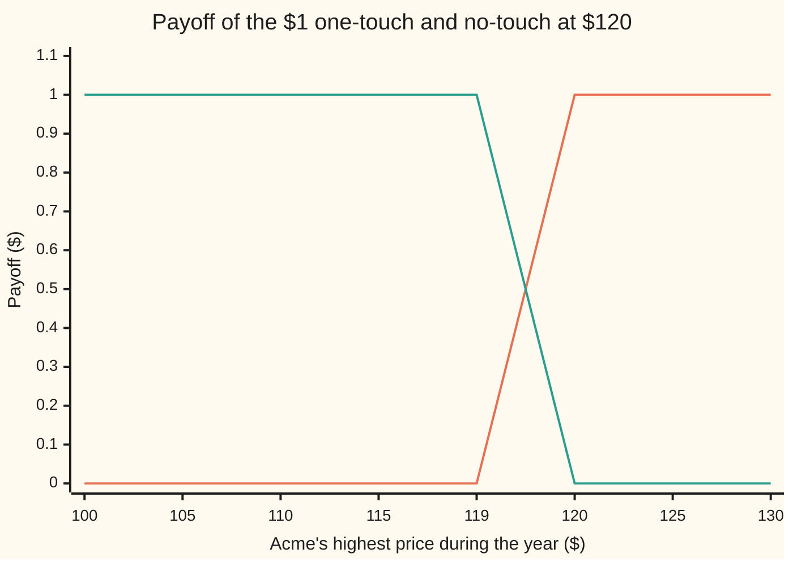
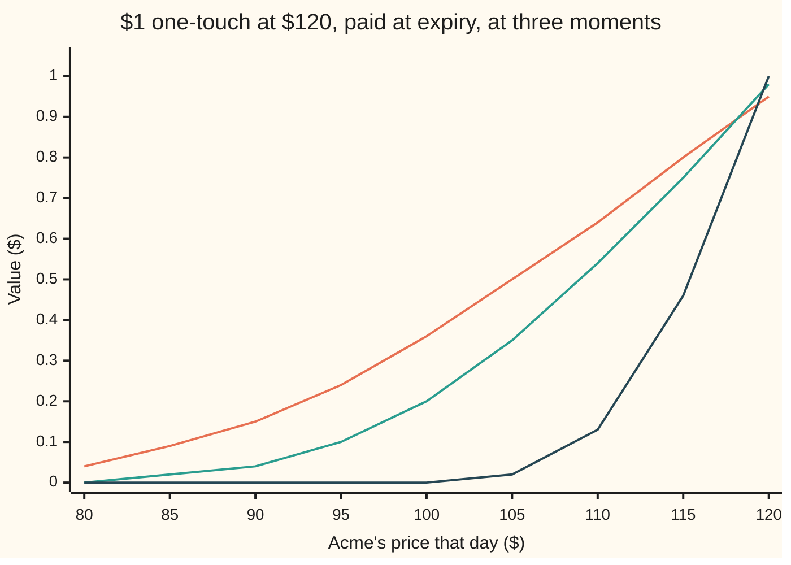

# One-touch and no-touch: a fixed sum if the line is ever reached, priced from the chance of touching

Financial mathematics → Barriers, touches and lookbacks → Paid on a touch → One-touch and no-touch

---

## General Overview

Acme shares trade at $100 today. A contract says: if Acme trades at $120 or higher at any moment in the next year, the holder is paid $1. It does not matter where Acme finishes. A spike to $120 in March followed by a slide to $90 by December still pays. A year spent between $101 and $119.99 pays nothing.

That contract is a **one-touch**: one touch of the line is enough. The $120 line is the **barrier**. Its mirror image pays $1 only if Acme never reaches $120 all year, and is called a **no-touch**. Holding both guarantees the dollar, because every year either contains a touch or does not.

The one-touch comes in two versions. One pays the dollar on the expiry date, a year from now, whenever the touch happened. The other pays the moment the line is hit. The second is worth more, because an early dollar is worth more than a late one.

In the house market (interest 5 percent a year, dividends 2 percent, volatility 20 percent) the one-touch paid at expiry costs **$0.360156**, the one paid at the hit costs **$0.369391**, and the no-touch costs **$0.591073**. The one-touch and the no-touch together cost **$0.951229**: exactly a dollar due in a year, discounted to today.

Under the prices sits one number: the chance that Acme touches $120 within the year, counted in the pretend world where every asset grows at the bank rate. That chance is **0.378622**. It is nearly double the chance that Acme *finishes* above $120, and the reason it doubles is a mirror.

**A one-touch is a digital (a fixed sum paid on an event) whose event is "the running high reached the line", so its price is the discounted chance of touching, and that chance is the chance of finishing past the line plus a mirror-image term that counts the paths which touched and came back.**

**What kind of fact this is:** a model: Acme's price is taken to wander as geometric Brownian motion with one fixed volatility, an assumption, not a law. Inside it the pricing formulas are theorems, proved on this card in Why it works. The rule that one-touch plus no-touch equals a discounted dollar is model-free.

### The picture: what each contract pays

The payoff of a touch contract depends on the year's highest price, not the final one. Along the bottom runs Acme's highest price during the year.



Orange: the one-touch, nothing until the year's high reaches $120, then $1. Green: the no-touch, $1 until the high reaches $120, then nothing. The sloped segment between $119 and $120 is the chart joining its points; the real payoff jumps at $120 exactly. The two lines always add to $1, which is the parity in picture form.

---

## The formula

Notation first, in words. $S$ is Acme's price today, $H$ the barrier, $T$ the years to expiry, $r$ the riskless rate, $q$ the dividend yield and $\sigma$ the volatility. $N(x)$ is the area under the standard bell curve left of $x$. $M_T$ is Acme's **running maximum**: the highest price it reaches between today and the expiry date. The one-touch pays when $M_T \ge H$. The chance of that event in the pretend world is written $Q$. The formulas below are for a line above today's price, $H > S$; for a line below, swap the signs of $b$ and $\nu$ in the $N$ terms, which counts touches from above.

$$Q \;=\; N\!\left(\frac{\nu T - b}{\sigma\sqrt{T}}\right) \;+\; \left(\frac{H}{S}\right)^{2\nu/\sigma^2} N\!\left(\frac{-b - \nu T}{\sigma\sqrt{T}}\right), \qquad b = \ln\frac{H}{S}, \quad \nu = r - q - \tfrac12\sigma^2$$

**Read it aloud: the chance of touching is the chance of finishing past the line, plus a weighted chance of finishing past the line's mirror image.**

Then the three prices:

$$\text{one-touch at expiry} = e^{-rT}\,Q, \qquad \text{no-touch} = e^{-rT}\,(1 - Q)$$

$$\text{one-touch at hit} \;=\; \left(\frac{H}{S}\right)^{(\nu - \tilde\nu)/\sigma^2} Q_{\tilde\nu}, \qquad \tilde\nu = \sqrt{\nu^2 + 2r\sigma^2}$$

**Read it aloud: paid at expiry, the one-touch is the touch chance discounted for a year; the no-touch is the rest of that discounted dollar; paid at the hit, it is the same touch formula run with a steeper drift, times a weight.**

$Q_{\tilde\nu}$ means the formula for $Q$ with the drift $\nu$ replaced by $\tilde\nu$ everywhere, including in the weight.

| Symbol | Plain meaning | In our example | Push it up and the one-touch… |
| --- | --- | --- | --- |
| $S$ | Acme's price today | $100 | rises: closer to the line |
| $H$ | the barrier: the line that must be touched | $120 | falls: further to climb |
| $T$, $t$ | time to expiry, in years; a moment along the way | 1 | rises: more time to wander up |
| $r$ | the riskless rate, continuously compounded | 5% | rises: the extra drift outweighs the extra discount |
| $q$ | Acme's dividend yield | 2% | falls: dividends leak out and slow the climb |
| $\sigma$ | volatility: how jumpy Acme is, per year | 20% | rises: a jumpier share reaches further |
| $b$ | the barrier's distance in log terms, $\ln(H/S)$ | 0.182322 | — |
| $\nu$, $\tilde\nu$ | the pretend-world drift of Acme's log price; the steeper drift used for payment at the hit | 0.010000 and 0.064031 | — |
| $M_T$, $\tau$, $X_t$, $X_T$ | the running maximum over the year; the first moment Acme reaches $H$; the log of Acme's price over today's, at time $t$ and at expiry | — | — |
| $Q$ | the pretend-world chance that $M_T \ge H$ | 0.378622 | — |
| $N(x)$, $\varphi(x)$ | the area under the standard bell curve left of $x$; the curve's height at $x$ | — | — |
| $e^{-rT}$, $D(T)$ | the discount factor: today's worth of $1 due at $T$ | 0.951229 | — |

The weight $(H/S)^{2\nu/\sigma^2}$ equals $e^{2\nu b/\sigma^2}$, and here it is 1.095445. It is 1 exactly when the drift $\nu$ is zero. The first bell-curve area is the cash-or-nothing digital's, with the strike moved to $H$.

**The Greeks** (how the price moves when one input is nudged; each is found by nudging the price in the code):

| Greek | What it measures | One-touch at expiry | No-touch |
| --- | --- | --- | --- |
| delta | change per $1 rise in Acme | 0.025305 | −0.025305 |
| gamma | change in delta per $1 rise | 0.000814 | −0.000814 |
| vega | change per 1 point of volatility | 0.019076 | −0.019076 |
| theta | change as one day passes | −0.000606 | 0.000736 |

Delta, gamma and vega are equal and opposite because the two contracts sum to a fixed discounted dollar, which does not care about Acme's price or jumpiness. Theta is not a mirror: a day's passing also moves that discounted dollar itself closer to $1, and the no-touch collects that too.

### When it holds

- **The barrier is watched every instant.** The formula counts a touch that lasts a millisecond. A contract that checks only the daily close misses touches between closes, so its one-touch is worth less; the correction is on [discrete-monitoring-correction](03-discrete-monitoring-correction.md).
- **Acme moves without jumps.** A share that gaps overnight from $118 to $125 still counts as touching, but the formula's paths are continuous. With jumps the touch chance changes and the at-hit version pays at a price past the line.
- **One fixed volatility.** Touch contracts depend on how jumpy Acme is near the barrier, not at the money. In a market that quotes different volatilities at different strikes, one number for the whole path misprices them; the market's adjustments are beyond this card.
- **A single riskless rate and a steady dividend yield.** The at-hit formula also needs $r \ge 0$ (Step 5). With a curve of rates, $e^{-rT}$ becomes the discount factor $D(T)$ for the payment date, and the at-hit version needs the curve at every possible hit date.

---

## Why it works

### Step 0: a touch contract is a digital on the path

The pilot card [black-scholes-call](../08-The%20Black-Scholes%20call%20and%20put/01-black-scholes-call.md) gives the recipe for any payoff. Pretend every asset grows at the bank rate. Average the payoff over what Acme could do in that pretend world, called the **risk-neutral** world. Discount the average to today.

A payoff of $1 on an event and $0 otherwise averages to the chance of the event. That is how [cash-or-nothing-digital](../10-Digitals%20and%20the%20implied%20density/01-cash-or-nothing-digital.md) is priced, with the event "Acme finishes above the strike". Here the event is "Acme's running maximum reaches $120". So a one-touch paid at expiry is worth $e^{-rT} Q$. Everything hard is in $Q$, which is a question about whole paths, not end points.

### Step 1: move to log prices, where the barrier is a flat wall

Write Acme's price as $S$ times $e^{X_t}$. In the pretend world $X_t$, the log of the price ratio, is a Brownian motion with drift (the reminder is on [geometric-brownian-motion](../../11-Stochastic%20processes%20and%20calculus/05-Brownian%20Motion/07-geometric-brownian-motion.md)). It starts at 0, drifts at $\nu$ per year and spreads with $\sigma$ per root year.

$$\nu = r - q - \tfrac12\sigma^2 = 0.05 - 0.02 - 0.02 = 0.010000$$

The $-\tfrac12\sigma^2$ is the drag that wiggling puts on a log price; the pilot's "Why logarithms?" callout explains it. Acme reaches $120 exactly when $X_t$ reaches $b = \ln(120/100) = 0.182322$. Touching is now a question about a drifting random walk and a flat wall at height $b$.

### Step 2: paths that finish past the wall certainly touched

Acme's path is continuous. A path that ends at or above $b$ must have crossed $b$ on the way. The chance of that ending is a single bell-curve area, the same one as the digital's:

$$P(X_T \ge b) = N\!\left(\frac{\nu T - b}{\sigma\sqrt{T}}\right) = N(-0.861608) = 0.194452$$

Stopping here prices a one-touch as a plain digital at $120. That misses every path that touched and fell back.

### Step 3: paths that touched and came back, counted by a mirror

Take a path that touches the wall and then ends at some point $x$ below it. Flip everything after the first touch, up for down, about the wall. The flipped path ends at $2b - x$, above the wall. Flipping twice gives back the original, so touched paths ending at $x$ pair off one for one with paths ending at $2b - x$. This is the **reflection principle**, proved for driftless Brownian motion on [reflection-principle-and-running-maximum](../../11-Stochastic%20processes%20and%20calculus/05-Brownian%20Motion/04-reflection-principle-and-running-maximum.md).

Without drift, both members of each pair are equally likely. So the touched-and-returned paths have the same total chance as the paths ending above the wall: $Q$ is exactly twice the chance of finishing past the line.

With drift, the pair is not fair. Flipping turns an upward stretch into a downward one, and the pretend-world drift favours one direction. The correction turns out to be one constant weight for every path: touched paths ending at $x$ are as likely as free paths ending at $x - 2b$, times $e^{2\nu b/\sigma^2}$. A free path ending at $x - 2b$ is the same as a path launched from the mirror image of today's price, $H^2/S = 144$, and ending at $x$. Adding over all endings below the wall:

$$P(\text{touched and } X_T < b) = e^{2\nu b/\sigma^2}\, N\!\left(\frac{-b - \nu T}{\sigma\sqrt{T}}\right) = 1.095445 \times N(-0.961608) = 0.184170$$

<details>
<summary>Detailed proof: the weighted mirror</summary>

Write $p(x)$ for the density of $X_T$, a bell curve with centre $\nu T$ and spread $\sigma\sqrt{T}$, and $p_0(x)$ for the same with no drift. Adding a drift $\nu$ reweights each path by a factor that depends only on its end point $x$ (Girsanov's change of measure): $G(x) = e^{\nu x/\sigma^2 - \nu^2 T/(2\sigma^2)}$.

Without drift, the reflection principle gives the density of "touched, ended at $x$" for $x < b$ as $p_0(2b - x)$. With drift, multiply by $G(x)$. Write out the exponent:
$$-\frac{(2b - x)^2}{2\sigma^2 T} + \frac{\nu x}{\sigma^2} - \frac{\nu^2 T}{2\sigma^2} = -\frac{(2b - x)^2 - 2\nu T x + \nu^2 T^2}{2\sigma^2 T}.$$
Now write out the exponent of $e^{2\nu b/\sigma^2}\,p(x - 2b)$:
$$\frac{2\nu b}{\sigma^2} - \frac{(x - 2b - \nu T)^2}{2\sigma^2 T} = -\frac{(x - 2b)^2 - 2\nu T x + 4\nu b T + \nu^2 T^2 - 4\nu b T}{2\sigma^2 T}.$$
The $4\nu bT$ terms cancel and $(x - 2b)^2 = (2b - x)^2$, so the two exponents agree, and the constants in front are the same $1/(\sigma\sqrt{2\pi T})$. So the touched density is $e^{2\nu b/\sigma^2}\,p(x - 2b)$: a free bell curve shifted by $2b$, times one constant.

Integrate over $x < b$. The shifted curve puts mass $N\big((b - 2b - \nu T)/(\sigma\sqrt{T})\big) = N\big((-b - \nu T)/(\sigma\sqrt{T})\big)$ below $b$. Add Step 2's term for $x \ge b$, and the formula for $Q$ follows. The same argument gives the surviving-path density $p(x) - e^{2\nu b/\sigma^2}\,p(x - 2b)$ for $x < b$, which the code integrates as its second road to the no-touch.

</details>

### Step 4: add, then discount

$$Q = 0.194452 + 0.184170 = 0.378622$$

The mirror term is almost as big as the direct term: the log drift is small against the spread, so the pairing is nearly fair.

Paid at expiry, the one-touch is $e^{-rT}Q = 0.951229 \times 0.378622 = 0.360156$.

The no-touch pays on the complementary event. Every path either touches or does not, so the one-touch plus the no-touch pays $1 at expiry in every future. Two things that always pay the same must cost the same. So the no-touch is $e^{-rT}(1 - Q) = 0.591073$, and the pair costs 0.951229. That step used no model at all: it is the same argument as in-out parity on [knock-out-and-knock-in-options](01-knock-out-and-knock-in-options.md), with $1 in place of a call.

### Step 5: paid at the hit, the discount rides along the path

Paid at the first touch time $\tau$, the dollar is discounted by $e^{-r\tau}$, not by $e^{-rT}$. Averaging that over paths that touch needs the chance of touching at each moment, the **first-passage density**:

$$f(t) = \frac{b}{\sigma\sqrt{2\pi t^3}}\; e^{-(b - \nu t)^2/(2\sigma^2 t)}$$

It is the rate at which $Q$ builds up as the year runs: adding $f(t)$ from 0 to $T$ gives $Q$ again, which is the code's second road.

Multiply $f(t)$ by $e^{-rt}$. The two exponents combine by completing the square. What comes out is the same density with a steeper drift $\tilde\nu = \sqrt{\nu^2 + 2r\sigma^2} = 0.064031$, times a constant $e^{b(\nu - \tilde\nu)/\sigma^2} = 0.781706$. So the at-hit price is that constant times the touch chance at the steeper drift, 0.472545:

$$0.781706 \times 0.472545 = 0.369391$$

That exceeds the at-expiry price, 0.360156, because every touch before the end date pays earlier and is discounted less. Both claims need $r \ge 0$. With a negative rate an early dollar is worth less, and $\nu^2 + 2r\sigma^2$ can turn negative, so $\tilde\nu$ does not exist; the discounted-density integral still prices it.

<details>
<summary>The algebra behind the steeper drift</summary>

The exponent of $e^{-rt} f(t)$ is
$$-\frac{(b - \nu t)^2}{2\sigma^2 t} - rt = -\frac{b^2 - 2b\nu t + (\nu^2 + 2r\sigma^2)t^2}{2\sigma^2 t} = \frac{b\nu}{\sigma^2} - \frac{b^2 + \tilde\nu^2 t^2}{2\sigma^2 t}.$$
Add and subtract $b\tilde\nu/\sigma^2$: the last fraction becomes $-\frac{b\tilde\nu}{\sigma^2} - \frac{(b - \tilde\nu t)^2}{2\sigma^2 t}$. So
$$e^{-rt} f(t) = e^{b(\nu - \tilde\nu)/\sigma^2} \times \frac{b}{\sigma\sqrt{2\pi t^3}}\, e^{-(b - \tilde\nu t)^2/(2\sigma^2 t)},$$
and the second factor is the first-passage density with drift $\tilde\nu$. Adding it from 0 to $T$ gives $Q_{\tilde\nu}$. Since $e^{b(\nu - \tilde\nu)/\sigma^2} = (H/S)^{(\nu - \tilde\nu)/\sigma^2}$, the formula on this card follows.

</details>

A different road reaches the same prices: write the price as a function of Acme's price and time, demand that a hedged position earn the bank rate, and solve that equation with value 1 on the barrier. That is the Black–Scholes equation with a boundary, the approach of [reiner-rubinstein-barrier-formulas](02-reiner-rubinstein-barrier-formulas.md); there the at-hit one-touch appears as the rebate paid when a knock-out dies.

---

## Worked numbers, by hand

Acme: $S = 100$, $H = 120$, $r = 5\%$, $q = 2\%$, $\sigma = 20\%$, $T = 1$ year, $1 paid.

| Step | Arithmetic | Value |
| --- | --- | --- |
| log distance $b$ | $\ln(120/100)$ | 0.182322 |
| log drift $\nu$ | $0.05 - 0.02 - 0.02$ | 0.010000 |
| direct z-score | $(0.01 - 0.182322)/0.20$ | −0.861608 |
| direct term, finish past $120 | $N(-0.861608)$ | 0.194452 |
| mirror weight | $1.2^{2 \times 0.01/0.04} = 1.2^{0.5}$ | 1.095445 |
| mirror z-score | $(-0.182322 - 0.01)/0.20$ | −0.961608 |
| mirror term | $1.095445 \times N(-0.961608)$ | 0.184170 |
| touch chance $Q$ | $0.194452 + 0.184170$ | **0.378622** |
| discount $e^{-0.05}$ | | 0.951229 |
| one-touch at expiry | $0.951229 \times 0.378622$ | **$0.360156** |
| no-touch | $0.951229 \times (1 - 0.378622)$ | **$0.591073** |
| steeper drift $\tilde\nu$ | $\sqrt{0.0001 + 2 \times 0.05 \times 0.04}$ | 0.064031 |
| at-hit weight | $e^{0.182322 \times (0.01 - 0.064031)/0.04}$ | 0.781706 |
| touch chance at $\tilde\nu$ | the $Q$ formula with 0.064031 | 0.472545 |
| one-touch at hit | $0.781706 \times 0.472545$ | **$0.369391** |

A promise that Acme stays below $120 all year costs $0.591073. The market treats a 20 percent rise at some point in the year as a bit better than a one-in-three chance, while a finish above $120 is below one in five.

### What breaks if you drop a piece

Same contract, correct one-touch at expiry $0.360156:

| Mistake | Comes out at | What went wrong |
| --- | --- | --- |
| Price it as a digital: no mirror term | $0.184968 | Counts only paths that finish past $120 and misses every path that touched and fell back. Half the price is gone. |
| Mirror weight set to 1 | $0.344892 | Treats the flipped paths as equally likely with the drift present. Here the weight is above 1, so this undercounts. |
| Drift $r - q$, forgetting the $-\tfrac12\sigma^2$ | $0.392584 | Uses the price's drift where the log price's drift belongs, overstating the climb. |
| Rule of thumb: two digitals at $120 | $0.369936 | Exact only when the log drift is zero; a quick estimate, not a price. |

Every number in the table is printed by the code below.

---

## How the price moves as the year runs down

Values of the $1 one-touch paid at expiry, barrier $120, against Acme's price that day, from the checks:

| Acme's price | $80 | $90 | $100 | $110 | $115 | $120 |
| --- | --- | --- | --- | --- | --- | --- |
| 12 months left | 0.04 | 0.15 | 0.36 | 0.64 | 0.80 | 0.95 |
| 6 months left | 0.00 | 0.04 | 0.20 | 0.54 | 0.75 | 0.98 |
| 1 month left | 0.00 | 0.00 | 0.00 | 0.13 | 0.46 | 1.00 |

At $100, six months of no touch cuts the price from 0.36 to 0.20: less time left to climb. At $120 the line is already touched and the contract is a sure dollar paid at expiry. Its value is just the discount factor, which rises to 1.00 as the payment date nears. Just below the line the curve steepens as the months pass: with a month left and Acme at $115, one good week decides it.



Orange: 12 months left, a gentle curve. Green: 6 months left. Dark blue: 1 month left, almost a step at $120. As expiry nears, the curve squeezes onto the step, just as a digital's does, but the step sits at the barrier and is reached by touching, not by finishing. The no-touch is the discounted dollar minus each of these curves. The steep slope just below the barrier near expiry is the seller's hedging problem, taken up on [barrier-greeks-at-the-wall](04-barrier-greeks-at-the-wall.md).

---

## Code, from first principles, and it actually runs

Both programs take three independent roads to the touch chance and the prices. Road 1 is the reflection formula. Road 2 adds up the first-passage density over the year by Simpson's rule (thin slices, each topped by a parabola), and separately adds up the density of paths that survive below the wall, which prices the no-touch without using the formula. Road 3 simulates 20,000 years of Acme in 250 daily steps with a home-made random number generator; between steps it asks, by the Brownian-bridge formula, whether the path could have touched $120 and come back unseen, so the simulation watches continuously, as the contract does. The bell-curve area $N(x)$ is built from thin slices, since nothing imported may know the answer. The asserts compare roads against each other, and the simulation against the formula within four standard errors.

### Python

```python
# One-touch and no-touch -- the check behind the card.  Standard library only.
# Roads: (1) reflection formulas, (2) Simpson integrals of the first-passage
# density and of the no-touch end density, (3) a simulation with its own random
# numbers.  The bell-curve area N(x) is Simpson's rule, written out below.
from math import log, sqrt, exp, cos, pi

def phi(x): return exp(-0.5 * x * x) / sqrt(2.0 * pi)            # bell-curve height at x
def simpson(f, a, b, n):
    h = (b - a) / n
    s = f(a) + f(b)
    for i in range(1, n): s += (4 if i % 2 else 2) * f(a + i * h)
    return s * h / 3.0
def N(x):                                                         # bell-curve area left of x
    if x < -12.0: return 0.0
    if x > 12.0: return 1.0
    return 0.5 + simpson(phi, 0.0, x, 2000)

def touch_prob(S, H, q_, r, sig, T, nu=None):                     # road 1: reflection formula
    b, v = log(H / S), (r - q_ - 0.5 * sig * sig) if nu is None else nu
    if b <= 0.0: return 1.0
    st = sig * sqrt(T)
    return N((v * T - b) / st) + exp(2 * v * b / sig ** 2) * N((-b - v * T) / st)
def one_touch_expiry(S, H, q_, r, sig, T): return exp(-r * T) * touch_prob(S, H, q_, r, sig, T)
def no_touch(S, H, q_, r, sig, T):                                # written out on its own
    b, v, st = log(H / S), r - q_ - 0.5 * sig * sig, sig * sqrt(T)
    if b <= 0.0: return 0.0
    return exp(-r * T) * (N((b - v * T) / st) - exp(2 * v * b / sig ** 2) * N((-b - v * T) / st))
def one_touch_hit(S, H, q_, r, sig, T):                           # paid the moment the line is hit
    b, v = log(H / S), r - q_ - 0.5 * sig * sig
    if b <= 0.0: return 1.0
    vt = sqrt(v * v + 2 * r * sig * sig)                          # the steeper drift
    return exp(b * (v - vt) / sig ** 2) * touch_prob(S, H, 0, 0, sig, T, nu=vt)

S, H, r, q, sig, T = 100.0, 120.0, 0.05, 0.02, 0.20, 1.0
b, nu, D = log(H / S), r - q - 0.5 * sig * sig, exp(-r * T)
w = exp(2 * nu * b / sig ** 2)
def fpt(t):                                                       # first-passage density at time t
    return 0.0 if t <= 0 else b / (sig * sqrt(2 * pi * t ** 3)) * exp(-(b - nu * t) ** 2 / (2 * sig * sig * t))
Q1, Q2 = touch_prob(S, H, q, r, sig, T), simpson(fpt, 0.0, T, 20000)
hit1, hit2 = one_touch_hit(S, H, q, r, sig, T), simpson(lambda t: exp(-r * t) * fpt(t), 0.0, T, 20000)
st = sig * sqrt(T)                                                # road 2 for the no-touch: end density of paths that never touched
alive = lambda x: (phi((x - nu * T) / st) - w * phi((x - 2 * b - nu * T) / st)) / st
NT1, NT2 = no_touch(S, H, q, r, sig, T), D * simpson(alive, b - 12 * st, b, 20000)

state = 20260924                                                  # road 3: simulation, own generator
def unif():
    global state
    state = (state * 6364136223846793005 + 1442695040888963407) % 2 ** 64
    return ((state >> 11) + 0.5) / 2 ** 53
paths, steps = 20000, 250
dt = T / steps
hits, pv, pv2 = 0, 0.0, 0.0
for _ in range(paths):
    x = 0.0
    for k in range(steps):
        z = sqrt(-2 * log(unif())) * cos(2 * pi * unif())
        y = x + nu * dt + sig * sqrt(dt) * z
        u = unif()                                                # bridge: did it touch between steps?
        if y >= b or u < exp(-2 * (b - x) * (b - y) / (sig * sig * dt)):
            hits += 1; g = exp(-r * (k + 0.5) * dt); pv += g; pv2 += g * g
            break
        x = y
Q3, hit3 = hits / paths, pv / paths
seQ, seH = sqrt(Q3 * (1 - Q3) / paths), sqrt((pv2 / paths - hit3 ** 2) / paths)

vt = sqrt(nu * nu + 2 * r * sig * sig)
def row(label, v): print(f"{label:<42} {v:>10.6f}")
print("house market, S=100 H=120 r=0.05 q=0.02 sigma=0.20 T=1, $1 paid")
for lab, v in (("log distance b = ln(H/S)", b), ("log drift nu = r - q - sigma^2/2", nu),
               ("reflection weight (H/S)^(2 nu/sigma^2)", w), ("mirror start H^2/S", H * H / S), ("discount D(T) = e^-rT", D),
               ("z-score, end beyond 120", (nu * T - b) / st), ("z-score, mirror term", (-b - nu * T) / st),
               ("paths ending beyond 120", N((nu * T - b) / st)), ("touched, ending below (mirror term)", w * N((-b - nu * T) / st)),
               ("touch prob, 1 reflection formula", Q1), ("touch prob, 2 first-passage integral", Q2),
               ("touch prob, 3 simulation", Q3), ("  simulation standard error", seQ),
               ("one-touch at expiry, D(T) x Q", D * Q1), ("no-touch, 1 formula", NT1), ("no-touch, 2 surviving-path integral", NT2),
               ("one-touch + no-touch", D * Q1 + NT2), ("one-touch at hit, 1 formula", hit1),
               ("one-touch at hit, 2 discounted density", hit2), ("one-touch at hit, 3 simulation", hit3),
               ("  simulation standard error", seH), ("steeper drift sqrt(nu^2 + 2 r sigma^2)", vt),
               ("at-hit weight e^(b(nu - nut)/sigma^2)", exp(b * (nu - vt) / sig ** 2)), ("touch prob with the steeper drift", touch_prob(S, H, 0, 0, sig, T, nu=vt)),
               ("wrong: no mirror term, D(T) x P(end>=120)", D * N((nu * T - b) / st)),
               ("wrong: mirror weight set to 1", D * (N((nu * T - b) / st) + N((-b - nu * T) / st))),
               ("wrong: drift r - q, no -sigma^2/2", D * touch_prob(S, H, q, r, sig, T, nu=r - q)),
               ("rule of thumb: 2 x digital at 120", 2 * D * N((nu * T - b) / st)),
               ("try: sigma = 0.30", one_touch_expiry(S, H, q, r, 0.30, T)), ("try: H = 110", one_touch_expiry(S, 110.0, q, r, sig, T)),
               ("try: T = 2", one_touch_expiry(S, H, q, r, sig, 2.0)), ("try: r=0.04, q=0.02 (nu=0), touch prob", touch_prob(S, H, q, 0.04, sig, T)),
               ("try: nu=0, 2 x P(end>=120)", 2 * N(-b / st))):
    row(lab, v)
print("greeks by nudging            one-touch(exp)    no-touch")
for lab, f in (("delta, per $1 of S", lambda g: (g(S + 0.01, H, q, r, sig, T) - g(S - 0.01, H, q, r, sig, T)) / 0.02),
               ("gamma, per $1 of S", lambda g: (g(S + 0.5, H, q, r, sig, T) - 2 * g(S, H, q, r, sig, T) + g(S - 0.5, H, q, r, sig, T)) / 0.25),
               ("vega, per 1 vol point", lambda g: (g(S, H, q, r, sig + 0.0001, T) - g(S, H, q, r, sig - 0.0001, T)) / 0.02),
               ("theta, per day", lambda g: g(S, H, q, r, sig, T - 1 / 365) - g(S, H, q, r, sig, T))):
    print(f"{lab:<28} {f(one_touch_expiry):>14.6f} {f(no_touch):>11.6f}")
spots = [80.0 + 5 * i for i in range(9)]
print("chart, Acme price       " + " ".join(f"{s:5.0f}" for s in spots))
for lab, t in (("chart, 12 months left", 1.0), ("chart, 6 months left", 0.5), ("chart, 1 month left", 1 / 12)):
    print(f"{lab:<24}" + " ".join(f"{one_touch_expiry(s, H, q, r, sig, t):5.2f}" for s in spots))
highs = [100, 105, 110, 115, 119, 120, 125, 130]
print("payoff, year's high     " + " ".join(f"{h:5d}" for h in highs))
print("payoff, one-touch       " + " ".join(f"{1 if h >= 120 else 0:5d}" for h in highs))
print("payoff, no-touch        " + " ".join(f"{0 if h >= 120 else 1:5d}" for h in highs))

assert abs(Q1 - 0.378622) < 5e-7, "formula vs the spec's touch probability"
assert abs(NT1 - NT2) < 1e-7, "no-touch formula vs surviving-path integral"
assert abs(Q1 - Q2) < 1e-7, "reflection formula vs integrated first-passage density"
assert abs(hit1 - hit2) < 1e-7, "at-hit formula vs discounted density integral"
assert abs(D * Q1 + NT2 - D) < 1e-7, "one-touch plus independently integrated no-touch is a sure dollar"
assert abs(Q3 - Q1) < 4 * seQ, "simulated touch probability within four standard errors"
assert abs(hit3 - hit1) < 4 * seH, "simulated at-hit price within four standard errors"
print("ALL CHECKS PASS")
```

**Ran 2026-09-24 on macOS, Python 3.14.6, standard library only. All checks passed. Output, pasted from the run:**

```
house market, S=100 H=120 r=0.05 q=0.02 sigma=0.20 T=1, $1 paid
log distance b = ln(H/S)                     0.182322
log drift nu = r - q - sigma^2/2             0.010000
reflection weight (H/S)^(2 nu/sigma^2)       1.095445
mirror start H^2/S                         144.000000
discount D(T) = e^-rT                        0.951229
z-score, end beyond 120                     -0.861608
z-score, mirror term                        -0.961608
paths ending beyond 120                      0.194452
touched, ending below (mirror term)          0.184170
touch prob, 1 reflection formula             0.378622
touch prob, 2 first-passage integral         0.378622
touch prob, 3 simulation                     0.379250
  simulation standard error                  0.003431
one-touch at expiry, D(T) x Q                0.360156
no-touch, 1 formula                          0.591073
no-touch, 2 surviving-path integral          0.591073
one-touch + no-touch                         0.951229
one-touch at hit, 1 formula                  0.369391
one-touch at hit, 2 discounted density       0.369391
one-touch at hit, 3 simulation               0.370014
  simulation standard error                  0.003348
steeper drift sqrt(nu^2 + 2 r sigma^2)       0.064031
at-hit weight e^(b(nu - nut)/sigma^2)        0.781706
touch prob with the steeper drift            0.472545
wrong: no mirror term, D(T) x P(end>=120)    0.184968
wrong: mirror weight set to 1                0.344892
wrong: drift r - q, no -sigma^2/2            0.392584
rule of thumb: 2 x digital at 120            0.369936
try: sigma = 0.30                            0.501158
try: H = 110                                 0.617074
try: T = 2                                   0.491207
try: r=0.04, q=0.02 (nu=0), touch prob       0.361975
try: nu=0, 2 x P(end>=120)                   0.361975
greeks by nudging            one-touch(exp)    no-touch
delta, per $1 of S                 0.025305   -0.025305
gamma, per $1 of S                 0.000814   -0.000814
vega, per 1 vol point              0.019076   -0.019076
theta, per day                    -0.000606    0.000736
chart, Acme price          80    85    90    95   100   105   110   115   120
chart, 12 months left    0.04  0.09  0.15  0.24  0.36  0.50  0.64  0.80  0.95
chart, 6 months left     0.00  0.02  0.04  0.10  0.20  0.35  0.54  0.75  0.98
chart, 1 month left      0.00  0.00  0.00  0.00  0.00  0.02  0.13  0.46  1.00
payoff, year's high       100   105   110   115   119   120   125   130
payoff, one-touch           0     0     0     0     0     1     1     1
payoff, no-touch            1     1     1     1     1     0     0     0
ALL CHECKS PASS
```

The formula and both integrals agree to six decimals. The simulation lands within one standard error of the formula on both the touch chance and the at-hit price. The one-touch plus the separately integrated no-touch returns the discount factor.

### Rust

Same roads, same labels, same random number generator.

```rust
// One-touch and no-touch -- the same check as one_touch_and_no_touch_check.py, in Rust.
// Standard library only, no crates.  Roads: reflection formulas, Simpson integrals
// of the first-passage and surviving-path densities, and a simulation.
use std::f64::consts::PI;

fn phi(x: f64) -> f64 { (-0.5 * x * x).exp() / (2.0 * PI).sqrt() }
fn simpson<F: Fn(f64) -> f64>(f: F, a: f64, b: f64, n: usize) -> f64 {
    let h = (b - a) / n as f64;
    let mut s = f(a) + f(b);
    for i in 1..n { s += if i % 2 == 1 { 4.0 } else { 2.0 } * f(a + i as f64 * h); }
    s * h / 3.0
}
fn n_cdf(x: f64) -> f64 {
    if x < -12.0 { return 0.0; }
    if x > 12.0 { return 1.0; }
    0.5 + simpson(phi, 0.0, x, 2000)
}
fn drift(r: f64, q: f64, sig: f64) -> f64 { r - q - 0.5 * sig * sig }
fn touch_prob_nu(s: f64, h: f64, sig: f64, t: f64, v: f64) -> f64 {     // road 1: reflection formula
    let b = (h / s).ln();
    if b <= 0.0 { return 1.0; }
    let st = sig * t.sqrt();
    n_cdf((v * t - b) / st) + (2.0 * v * b / sig.powf(2.0)).exp() * n_cdf((-b - v * t) / st)
}
fn touch_prob(s: f64, h: f64, q: f64, r: f64, sig: f64, t: f64) -> f64 { touch_prob_nu(s, h, sig, t, drift(r, q, sig)) }
fn one_touch_expiry(s: f64, h: f64, q: f64, r: f64, sig: f64, t: f64) -> f64 { (-r * t).exp() * touch_prob(s, h, q, r, sig, t) }
fn no_touch(s: f64, h: f64, q: f64, r: f64, sig: f64, t: f64) -> f64 {
    let (b, v, st) = ((h / s).ln(), drift(r, q, sig), sig * t.sqrt());
    if b <= 0.0 { return 0.0; }
    (-r * t).exp() * (n_cdf((b - v * t) / st) - (2.0 * v * b / sig.powf(2.0)).exp() * n_cdf((-b - v * t) / st))
}
fn one_touch_hit(s: f64, h: f64, q: f64, r: f64, sig: f64, t: f64) -> f64 {
    let (b, v) = ((h / s).ln(), drift(r, q, sig));
    if b <= 0.0 { return 1.0; }
    let vt = (v * v + 2.0 * r * sig * sig).sqrt();                        // the steeper drift
    (b * (v - vt) / sig.powf(2.0)).exp() * touch_prob_nu(s, h, sig, t, vt)
}

fn main() {
    let (s, h, r, q, sig, t) = (100.0_f64, 120.0_f64, 0.05_f64, 0.02_f64, 0.20_f64, 1.0_f64);
    let (b, nu, d) = ((h / s).ln(), drift(r, q, sig), (-r * t).exp());
    let w = (2.0 * nu * b / sig.powf(2.0)).exp();
    let fpt = |tt: f64| if tt <= 0.0 { 0.0 } else {
        b / (sig * (2.0 * PI * tt.powf(3.0)).sqrt()) * (-(b - nu * tt).powf(2.0) / (2.0 * sig * sig * tt)).exp() };
    let (q1, q2) = (touch_prob(s, h, q, r, sig, t), simpson(&fpt, 0.0, t, 20000));
    let (hit1, hit2) = (one_touch_hit(s, h, q, r, sig, t), simpson(|tt| (-r * tt).exp() * fpt(tt), 0.0, t, 20000));
    let st = sig * t.sqrt();
    let alive = |x: f64| (phi((x - nu * t) / st) - w * phi((x - 2.0 * b - nu * t) / st)) / st;
    let (nt1, nt2) = (no_touch(s, h, q, r, sig, t), d * simpson(alive, b - 12.0 * st, b, 20000));

    let mut state: u64 = 20260924;                                          // road 3: simulation
    let mut unif = || {
        state = state.wrapping_mul(6364136223846793005).wrapping_add(1442695040888963407);
        ((state >> 11) as f64 + 0.5) / 9007199254740992.0
    };
    let (paths, steps) = (20000usize, 250usize);
    let dt = t / steps as f64;
    let (mut hits, mut pv, mut pv2) = (0usize, 0.0_f64, 0.0_f64);
    for _ in 0..paths {
        let mut x = 0.0_f64;
        for k in 0..steps {
            let z = (-2.0 * unif().ln()).sqrt() * (2.0 * PI * unif()).cos();
            let y = x + nu * dt + sig * dt.sqrt() * z;
            let u = unif();                                                 // bridge: touched between steps?
            if y >= b || u < (-2.0 * (b - x) * (b - y) / (sig * sig * dt)).exp() {
                hits += 1; let g = (-r * (k as f64 + 0.5) * dt).exp(); pv += g; pv2 += g * g;
                break;
            }
            x = y;
        }
    }
    let (q3, hit3) = (hits as f64 / paths as f64, pv / paths as f64);
    let se_q = (q3 * (1.0 - q3) / paths as f64).sqrt();
    let se_h = ((pv2 / paths as f64 - hit3.powf(2.0)) / paths as f64).sqrt();

    let vt = (nu * nu + 2.0 * r * sig * sig).sqrt();
    let up = n_cdf((nu * t - b) / st);
    let rows: Vec<(&str, f64)> = vec![
        ("log distance b = ln(H/S)", b), ("log drift nu = r - q - sigma^2/2", nu),
        ("reflection weight (H/S)^(2 nu/sigma^2)", w), ("mirror start H^2/S", h * h / s), ("discount D(T) = e^-rT", d),
        ("z-score, end beyond 120", (nu * t - b) / st), ("z-score, mirror term", (-b - nu * t) / st),
        ("paths ending beyond 120", up), ("touched, ending below (mirror term)", w * n_cdf((-b - nu * t) / st)),
        ("touch prob, 1 reflection formula", q1), ("touch prob, 2 first-passage integral", q2),
        ("touch prob, 3 simulation", q3), ("  simulation standard error", se_q),
        ("one-touch at expiry, D(T) x Q", d * q1), ("no-touch, 1 formula", nt1), ("no-touch, 2 surviving-path integral", nt2),
        ("one-touch + no-touch", d * q1 + nt2), ("one-touch at hit, 1 formula", hit1),
        ("one-touch at hit, 2 discounted density", hit2), ("one-touch at hit, 3 simulation", hit3),
        ("  simulation standard error", se_h), ("steeper drift sqrt(nu^2 + 2 r sigma^2)", vt),
        ("at-hit weight e^(b(nu - nut)/sigma^2)", (b * (nu - vt) / sig.powf(2.0)).exp()), ("touch prob with the steeper drift", touch_prob_nu(s, h, sig, t, vt)),
        ("wrong: no mirror term, D(T) x P(end>=120)", d * up),
        ("wrong: mirror weight set to 1", d * (up + n_cdf((-b - nu * t) / st))),
        ("wrong: drift r - q, no -sigma^2/2", d * touch_prob_nu(s, h, sig, t, r - q)),
        ("rule of thumb: 2 x digital at 120", 2.0 * d * up),
        ("try: sigma = 0.30", one_touch_expiry(s, h, q, r, 0.30, t)), ("try: H = 110", one_touch_expiry(s, 110.0, q, r, sig, t)),
        ("try: T = 2", one_touch_expiry(s, h, q, r, sig, 2.0)), ("try: r=0.04, q=0.02 (nu=0), touch prob", touch_prob(s, h, q, 0.04, sig, t)),
        ("try: nu=0, 2 x P(end>=120)", 2.0 * n_cdf(-b / st)),
    ];
    println!("house market, S=100 H=120 r=0.05 q=0.02 sigma=0.20 T=1, $1 paid");
    for (lab, v) in &rows { println!("{:<42} {:>10.6}", lab, v); }
    println!("greeks by nudging            one-touch(exp)    no-touch");
    type P = fn(f64, f64, f64, f64, f64, f64) -> f64;
    let greeks: [(&str, Box<dyn Fn(P) -> f64>); 4] = [
        ("delta, per $1 of S", Box::new(move |g: P| (g(s + 0.01, h, q, r, sig, t) - g(s - 0.01, h, q, r, sig, t)) / 0.02)),
        ("gamma, per $1 of S", Box::new(move |g: P| (g(s + 0.5, h, q, r, sig, t) - 2.0 * g(s, h, q, r, sig, t) + g(s - 0.5, h, q, r, sig, t)) / 0.25)),
        ("vega, per 1 vol point", Box::new(move |g: P| (g(s, h, q, r, sig + 0.0001, t) - g(s, h, q, r, sig - 0.0001, t)) / 0.02)),
        ("theta, per day", Box::new(move |g: P| g(s, h, q, r, sig, t - 1.0 / 365.0) - g(s, h, q, r, sig, t))),
    ];
    for (lab, f) in &greeks { println!("{:<28} {:>14.6} {:>11.6}", lab, f(one_touch_expiry), f(no_touch)); }
    let spots: Vec<f64> = (0..9).map(|i| 80.0 + 5.0 * i as f64).collect();
    println!("chart, Acme price       {}", spots.iter().map(|x| format!("{:5.0}", x)).collect::<Vec<_>>().join(" "));
    for (lab, tt) in [("chart, 12 months left", 1.0), ("chart, 6 months left", 0.5), ("chart, 1 month left", 1.0 / 12.0)] {
        let v: Vec<String> = spots.iter().map(|&x| format!("{:5.2}", one_touch_expiry(x, h, q, r, sig, tt))).collect();
        println!("{:<24}{}", lab, v.join(" "));
    }
    let highs = [100, 105, 110, 115, 119, 120, 125, 130];
    let line = |f: &dyn Fn(i32) -> i32| highs.iter().map(|&x| format!("{:5}", f(x))).collect::<Vec<_>>().join(" ");
    println!("payoff, year's high     {}", line(&|x| x));
    println!("payoff, one-touch       {}", line(&|x| if x >= 120 { 1 } else { 0 }));
    println!("payoff, no-touch        {}", line(&|x| if x >= 120 { 0 } else { 1 }));

    assert!((q1 - 0.378622).abs() < 5e-7, "formula vs the spec's touch probability");
    assert!((nt1 - nt2).abs() < 1e-7, "no-touch formula vs surviving-path integral");
    assert!((q1 - q2).abs() < 1e-7, "reflection formula vs integrated first-passage density");
    assert!((hit1 - hit2).abs() < 1e-7, "at-hit formula vs discounted density integral");
    assert!((d * q1 + nt2 - d).abs() < 1e-7, "one-touch plus independently integrated no-touch is a sure dollar");
    assert!((q3 - q1).abs() < 4.0 * se_q, "simulated touch probability within four standard errors");
    assert!((hit3 - hit1).abs() < 4.0 * se_h, "simulated at-hit price within four standard errors");
    println!("ALL CHECKS PASS");
}
```

**Ran 2026-09-24 on macOS, rustc 1.98.1, no crates. All checks passed. Output, pasted from the run:**

```
house market, S=100 H=120 r=0.05 q=0.02 sigma=0.20 T=1, $1 paid
log distance b = ln(H/S)                     0.182322
log drift nu = r - q - sigma^2/2             0.010000
reflection weight (H/S)^(2 nu/sigma^2)       1.095445
mirror start H^2/S                         144.000000
discount D(T) = e^-rT                        0.951229
z-score, end beyond 120                     -0.861608
z-score, mirror term                        -0.961608
paths ending beyond 120                      0.194452
touched, ending below (mirror term)          0.184170
touch prob, 1 reflection formula             0.378622
touch prob, 2 first-passage integral         0.378622
touch prob, 3 simulation                     0.379250
  simulation standard error                  0.003431
one-touch at expiry, D(T) x Q                0.360156
no-touch, 1 formula                          0.591073
no-touch, 2 surviving-path integral          0.591073
one-touch + no-touch                         0.951229
one-touch at hit, 1 formula                  0.369391
one-touch at hit, 2 discounted density       0.369391
one-touch at hit, 3 simulation               0.370014
  simulation standard error                  0.003348
steeper drift sqrt(nu^2 + 2 r sigma^2)       0.064031
at-hit weight e^(b(nu - nut)/sigma^2)        0.781706
touch prob with the steeper drift            0.472545
wrong: no mirror term, D(T) x P(end>=120)    0.184968
wrong: mirror weight set to 1                0.344892
wrong: drift r - q, no -sigma^2/2            0.392584
rule of thumb: 2 x digital at 120            0.369936
try: sigma = 0.30                            0.501158
try: H = 110                                 0.617074
try: T = 2                                   0.491207
try: r=0.04, q=0.02 (nu=0), touch prob       0.361975
try: nu=0, 2 x P(end>=120)                   0.361975
greeks by nudging            one-touch(exp)    no-touch
delta, per $1 of S                 0.025305   -0.025305
gamma, per $1 of S                 0.000814   -0.000814
vega, per 1 vol point              0.019076   -0.019076
theta, per day                    -0.000606    0.000736
chart, Acme price          80    85    90    95   100   105   110   115   120
chart, 12 months left    0.04  0.09  0.15  0.24  0.36  0.50  0.64  0.80  0.95
chart, 6 months left     0.00  0.02  0.04  0.10  0.20  0.35  0.54  0.75  0.98
chart, 1 month left      0.00  0.00  0.00  0.00  0.00  0.02  0.13  0.46  1.00
payoff, year's high       100   105   110   115   119   120   125   130
payoff, one-touch           0     0     0     0     0     1     1     1
payoff, no-touch            1     1     1     1     1     0     0     0
ALL CHECKS PASS
```

The two outputs agree line for line, the simulation included, because both programs draw the same random numbers in the same order.

> [!TIP]
> **Try changing**
> Guess the direction first. Then run it.
> - **Raise the volatility.** Set `sig = 0.30` in the one-touch. The price goes from 0.360156 to **0.501158**. A jumpier share reaches further, and the one-touch has no downside to mind.
> - **Move the line closer.** Set `H = 110`. The price rises to **0.617074**. A 10 percent rise at some point in the year is more likely than not.
> - **Give it two years.** Set `T = 2`. The price is **0.491207**. More time to touch, partly eaten by a second year of discounting.
> - **Kill the drift.** Set `r = 0.04` with `q = 0.02`, so $\nu = 0$. The touch chance is **0.361975**, and twice the chance of finishing past $120 is also **0.361975**. With no drift the mirror is fair and the doubling is exact.

---

## The usual mistake

> [!warning]
> **Pricing a one-touch as a digital at the barrier.** The digital pays when Acme *finishes* past $120; the one-touch pays when Acme *ever reaches* $120. Every path that touches and falls back is missing from the digital. Here the digital's discounted chance is $0.184968 and the one-touch is $0.360156: the error is roughly half the price.
>
> Smaller traps:
> - **Mixing up the payment dates.** Paid at the hit it is $0.369391; paid at expiry, $0.360156. The contract says which. Quoting one for the other misprices it by the gap.
> - **Dropping the mirror weight, or using the price's drift $r - q$ for the log drift.** $0.344892 and $0.392584; see the table above.
> - **Forgetting how the barrier is watched.** The formula assumes every instant. A contract that looks only at daily closes touches less often, and paying the continuous price for it overpays.

---

## Where you meet it in real life

- **Currency markets.** One-touch and no-touch contracts trade most heavily on exchange rates: a payout if the euro ever reaches a stated dollar level within three months. Their prices are quoted as a percentage of the payout, which is the touch chance with its discount.
- **Structured notes.** Many retail notes pay a fixed coupon unless the underlying ever falls through a barrier. That coupon is a no-touch in the note's wrapper, priced with this card's formula turned upside down.
- **Rebates on barrier options.** A knock-out that pays a consolation sum when it dies is a knock-out plus an at-hit one-touch. See [reiner-rubinstein-barrier-formulas](02-reiner-rubinstein-barrier-formulas.md).
- **Hedging.** A seller of a one-touch near expiry, with the share just below the line, faces a delta that changes very fast: [barrier-greeks-at-the-wall](04-barrier-greeks-at-the-wall.md).
- **Setting a barrier to hit a price.** Choosing the line that makes a one-touch cost a given amount runs this card's formula backwards: [barrier-inverses-level-and-volatility](07-barrier-inverses-level-and-volatility.md).

> **Say it back**
> A one-touch pays a fixed sum if the share ever reaches a line before expiry; a no-touch pays it if the share never does. Together they are a sure payment, so their prices add to a discounted dollar. The one-touch is priced from the pretend-world chance of touching, which is the chance of finishing past the line plus a weighted mirror term for paths that touched and came back. Paid at the moment of touching, the same formula runs with a steeper drift and a weight, and the price is a little higher. Pricing a touch as a finish roughly halves the answer.

---

## What this builds on

- [knock-out-and-knock-in-options](01-knock-out-and-knock-in-options.md): what a barrier is, and the in-out argument that the one-touch and no-touch parity copies.
- [cash-or-nothing-digital](../10-Digitals%20and%20the%20implied%20density/01-cash-or-nothing-digital.md): a fixed sum on an event is worth the discounted pretend-world chance of the event; its bell-curve area, with the strike at $120, is this card's direct term.
- [reflection-principle-and-running-maximum](../../11-Stochastic%20processes%20and%20calculus/05-Brownian%20Motion/04-reflection-principle-and-running-maximum.md): the mirror pairing and the law of the running maximum, which Step 3 extends to a drift.

## Where this goes next

- [lookback-options](06-lookback-options.md): pays on the year's extreme price itself, not on whether it passed one line. Adding up this card's no-touch chance for every line below today's price gives the average low, and so the floating lookback's price.

This card prices a bet on whether the path reached one level; the open question is what the extreme itself is worth, which the lookback answers.

---

## Sources

Verified 2026-09-24: every link below resolves to the publisher's page.

- Karatzas, Ioannis, and Steven E. Shreve. *Brownian Motion and Stochastic Calculus*, 2nd ed. Springer, 1991. [doi:10.1007/978-1-4612-0949-2](https://doi.org/10.1007/978-1-4612-0949-2). The reflection principle, the first-passage density and its discounted form, done rigorously.
- Shreve, Steven E. *Stochastic Calculus for Finance II: Continuous-Time Models*. Springer, 2004. [Publisher page](https://link.springer.com/book/9780387401010). The running maximum of Brownian motion with drift, and barrier options priced from it.
- Ingersoll, Jonathan E., Jr. "Digital Contracts: Simple Tools for Pricing Complex Derivatives." *Journal of Business* 73, no. 1 (2000): 67–88. [doi:10.1086/209632](https://doi.org/10.1086/209632). Complex payoffs, barriers among them, built from digital contracts.
- Glasserman, Paul. *Monte Carlo Methods in Financial Engineering*. Springer, 2003. [doi:10.1007/978-0-387-21617-1](https://doi.org/10.1007/978-0-387-21617-1). Simulating barrier contracts, including the Brownian-bridge check between steps used in road 3.
