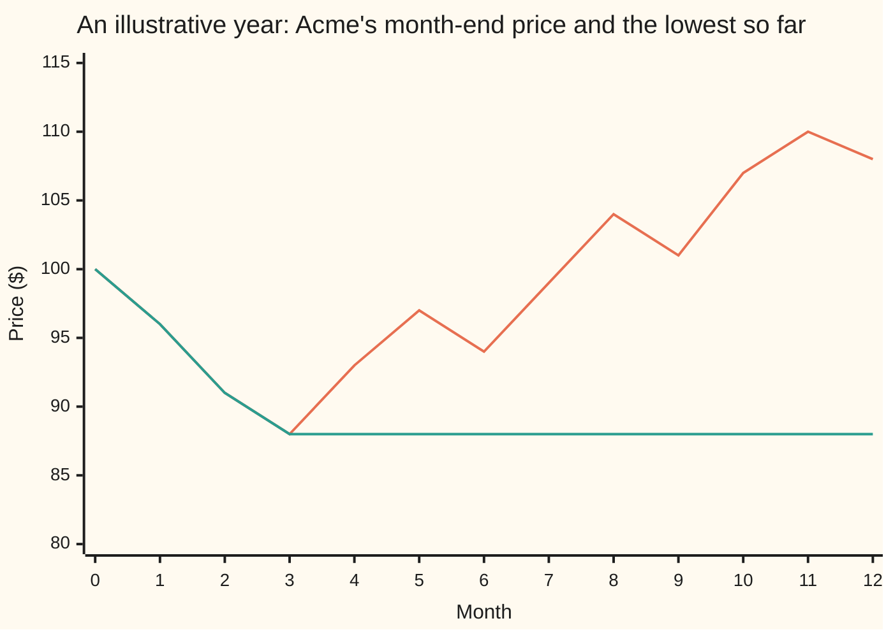
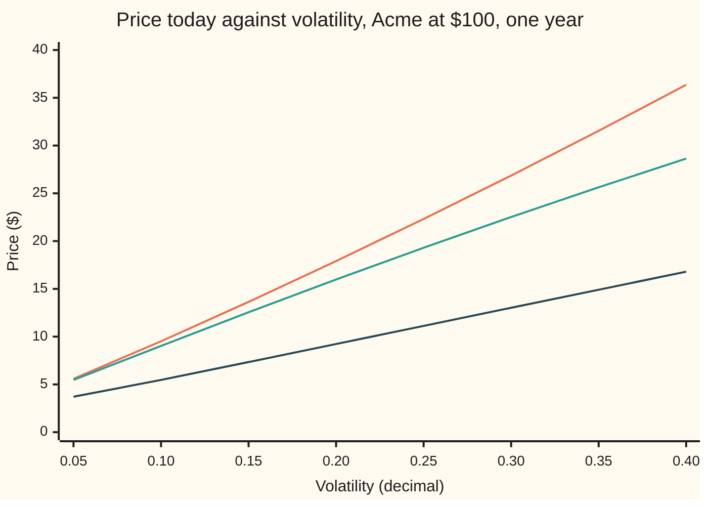

# Lookback options: buy at the lowest, sell at the highest, and what never regretting costs

[Syllabus](../../../SYLLABUS.md) → [Financial mathematics](../README.md) → [Barriers, touches and lookbacks](../README.md#s16) → Lookback options

---

## General Overview

Acme shares trade at $100 today. Over the next year they dip, recover, and finish at $108. Someone who bought at $100 made $8. Someone who bought in month three, at the low of $88, made $20. Nobody knows in advance which month is the low. Everyone who buys a share lives with that regret.

A **lookback option** removes it. The **floating-strike lookback call** pays, one year from now, the final share price minus the lowest price the share reached during the year. The strike is not fixed today; it floats down to the low, wherever the low turns out to be. On the path above it pays $20. A plain call struck at $100, the **vanilla** call, pays $8 on the same path.

Its mirror, the **floating-strike lookback put**, pays the highest price minus the final price: sell at the top, in hindsight. Two more contracts keep an ordinary strike but read the extreme instead of the final price. The **fixed-strike lookback call** pays the highest price minus the strike, if positive. The **fixed-strike lookback put** pays the strike minus the lowest price, if positive. On the path above, with strike $100, the fixed-strike call pays $10.

Hindsight has a price. In the house market (bank rate 5%, dividend yield 2%, volatility 20%, one year) the vanilla call costs $9.23 and the floating-strike lookback call costs **$15.98**. Only its fixed-strike cousin, at $17.91, costs more among the options on this shelf. Traded lookbacks read the price once a day, not every instant. Once-a-day watching can miss the true low, so the daily contract costs less: about $15.38.

**A floating-strike lookback call always pays the final price minus the lowest price, so it is worth the share, paid for today, minus today's value of the expected lowest price; the reflection principle gives that expected lowest price in closed form.**

**What kind of fact this is:** a theorem inside a model. The price formula is proved on this card in Why it works, with the full algebra folded under Detailed proof. It assumes Acme moves as the Black-Scholes model says, which is an assumption, not a law.

### The picture: one year of Acme and its lowest price so far



First line: Acme's month-end price. Second line: the lowest price so far, which only ever steps down. The floating lookback call pays the vertical gap between the two lines at month 12: $108 minus $88, or $20. A vanilla payoff diagram plots the payment against the final price alone; that is impossible here, because two paths that end at $108 can have different lows. The payment depends on the whole path.

---

## The formula

Notation first, in words. $S$ is Acme's price today and $m$ is the lowest price recorded so far; a fresh contract starts with $m = S$. $m_T$ is the lowest price over the whole life, recorded minimum included, and $M_T$ the highest. $E[\,\cdot\,]$ is an average in the pretend world where every asset grows at the bank rate (the risk-neutral world of [Black–Scholes call](../08-The%20Black-Scholes%20call%20and%20put/01-black-scholes-call.md)). The payoff is $S_T - m_T$, with no "if positive": the final price can never sit below the lowest price.

$$C_{LB} = S e^{-qT} N(a_1) - m\, e^{-rT} N(a_2) + S e^{-rT}\frac{\sigma^2}{2b}\left[\left(\frac{S}{m}\right)^{-2b/\sigma^2} N(-a_3) - e^{bT} N(-a_1)\right]$$

**Read it aloud:** a vanilla call struck at the lowest price so far, plus an extra that pays for any lower price still to come.

The first two terms are exactly the Black-Scholes call with strike $m$. The bracketed third term is the extra, and it is never negative. The formula is Goldman, Sosin and Gatto's (1979), written with a dividend yield.

| Symbol | Plain meaning | In our example | Push it up and the price… |
| --- | --- | --- | --- |
| $C_{LB}$ | price today of the floating-strike lookback call | $15.98 | is the answer |
| $S$, $S_T$ | Acme's price today; its price at expiry | $100 | rises in proportion, for a fresh contract |
| $m$ | lowest price recorded so far, never above $S$ | $100 | falls: a higher floor leaves less to gain (flat at $m = S$) |
| $m_T$, $M_T$ | lowest and highest price over the whole life | random | — |
| $K$ | the fixed strike of the fixed-strike lookbacks and the vanilla | $100 | — |
| $T$ | years to expiry | 1 | rises: more time to set a lower low |
| $r$, $q$ | bank rate and dividend yield, continuously compounded | 5% and 2% | $r$ up: price rises; $q$ up: price falls |
| $b$ | the carry, $r - q$: the pretend-world growth rate of Acme | 0.03 | — |
| $\sigma$ | volatility: the spread of Acme's yearly log return | 20% | rises strongly: wider swings, deeper lows |
| $a_1$, $a_2$, $a_3$ | distances in units of $\sigma\sqrt{T}$, defined below | 0.25, 0.05, −0.05 | — |
| $N$, $\varphi$, $E$ | bell-curve area to the left of a point; bell-curve height; pretend-world average | — | — |
| $h$, $Q(h)$, $\nu$ | a price level; the chance the low stays above it; the log drift $b - \tfrac12\sigma^2$ | — | — |

The three distances:

$$a_1 = \frac{\ln(S/m) + (b + \tfrac12\sigma^2)T}{\sigma\sqrt{T}}, \qquad a_2 = a_1 - \sigma\sqrt{T}, \qquad a_3 = a_1 - \frac{2b\sqrt{T}}{\sigma}$$

In words: $a_1$ and $a_2$ are the Black-Scholes distances d1 and d2 for a call struck at $m$. For a fresh contract they are the vanilla's own 0.25 and 0.05. The third, $a_3$, shifts $a_1$ back by $2b\sqrt{T}/\sigma$; it belongs to the reflected path in Step 1.

When $r = q$ the carry $b$ is zero and $\sigma^2/(2b)$ divides by zero. The price has a finite limit there, a separate short formula written out in both check programs and tested against the integral road.

### When it holds

- **Watching is continuous.** The formula reads the true lowest price. A contract that reads one closing price a day misses dips between closes and is worth less: about $15.38 against $15.98 here. The Broadie-Glasserman-Kou shift in Step 5 repairs most of the gap.
- **Acme follows geometric Brownian motion with constant volatility.** With a volatility smile, deep lows are priced by higher volatilities than 20%, and the formula's extra is off by roughly its vega times the volatility error.
- **Rates and dividend yield are constant and continuous.** A cash dividend drops the share price on a known day; that drop can set the minimum, and the yield version misses it.
- **The recorded minimum is carried over.** A contract already running must be priced with its true $m$. Resetting $m$ to today's price throws away a banked gain.

---

## Why it works

### Step 0: the payoff is always paid, so price the minimum

The final price is one of the prices the path visited, so it can never be below the lowest. The payoff $S_T - m_T$ is never negative and needs no "if positive". A payoff with no kink splits into two averages:

$$C_{LB} = e^{-rT}E[S_T] - e^{-rT}E[m_T] = S e^{-qT} - e^{-rT}E[m_T].$$

The first term is the share paid for today and delivered at expiry, less the dividends it leaks: $98.02. Everything else is one number, the expected lowest price. For Acme it is $86.25. Discounted at 5% that is $82.04, and $98.02 minus $82.04 is $15.98. The whole card is how to find $86.25.

### Step 1: the chance that the low stays above a level

Pick a level $h$ below today's price, say $90. The low stays above $90 exactly when the path never touches $90. That is a no-touch event, priced on [One-touch and no-touch](05-one-touch-and-no-touch.md). Its probability comes from the reflection principle ([Reflection principle](../../11-Stochastic%20processes%20and%20calculus/05-Brownian%20Motion/04-reflection-principle-and-running-maximum.md)): every path that touches the level and ends above it is matched with a mirror-image path that ends below it. Subtracting the mirror paths leaves only the paths that never touched. In log terms, with drift $\nu = b - \tfrac12\sigma^2$:

$$Q(h) = N\!\left(\frac{\ln(S/h) + \nu T}{\sigma\sqrt{T}}\right) - \left(\frac{h}{S}\right)^{2\nu/\sigma^2} N\!\left(\frac{\nu T - \ln(S/h)}{\sigma\sqrt{T}}\right).$$

The first term is the chance of ending above $h$. The second removes the paths that ended above $h$ after touching it. The power of $h/S$ is the price of reflecting a path that drifts: the mirror path runs against the drift, and that weight corrects for it.

### Step 2: add up the survival chances, level by level

A positive number equals the length of the stretch of levels below it. The lowest price $m_T$ is the length of the stretch from 0 up to $m_T$. Averaging turns "length of the levels below it" into "sum over levels of the chance the low is above that level":

$$E[m_T] = \int_0^{m} Q(h)\, dh.$$

This is the **layer-cake rule**: slice the minimum into thin horizontal layers and count each layer with the probability that the minimum reaches past it. The upper limit is $m$, not infinity, because the recorded minimum caps $m_T$ from above. The code evaluates this integral by Simpson's rule, as road 2, and gets $86.250441, matching the closed form to six decimals.

### Step 3: two integrals of bell curves give the closed form

Change variable from the level $h$ to its log distance below today, $u = \ln(S/h)$. The integral splits into two pieces: the ending-above term and the mirror term. Each is an exponential times a bell-curve area, integrated along a half-line. Integrating each by parts and completing the square, as [Black–Scholes call](../08-The%20Black-Scholes%20call%20and%20put/01-black-scholes-call.md) does for d1, turns each into bell-curve areas at the distances $a_1$, $a_2$ and $a_3$. Substituting into Step 0 gives the formula.

<details>
<summary>Detailed proof</summary>

Write $t = \sigma\sqrt{T}$, $\ell = \ln(S/m) \ge 0$ and $\lambda = 2b/\sigma^2$, so that $1 + 2\nu/\sigma^2 = \lambda$. With $h = S e^{-u}$ and $dh = -S e^{-u}du$, Step 2 becomes
$$E[m_T] = S\,(I_1 - I_2), \qquad I_1 = \int_\ell^\infty e^{-u} N\!\left(\tfrac{u + \nu T}{t}\right)du, \qquad I_2 = \int_\ell^\infty e^{-\lambda u} N\!\left(\tfrac{\nu T - u}{t}\right)du.$$
**First integral.** By parts, the boundary term at $u = \ell$ is $e^{-\ell}N(a_2) = (m/S)N(a_2)$, since $(\ell + \nu T)/t = a_2$. The remaining piece is $\int_\ell^\infty e^{-u}\varphi\big((u+\nu T)/t\big)\,du/t$, with $\varphi$ the bell-curve height. Put $z = (u + \nu T)/t$: it becomes $e^{\nu T}\int_{a_2}^\infty e^{-tz}\varphi(z)\,dz$. Completing the square, $e^{-tz}\varphi(z) = e^{t^2/2}\varphi(z + t)$, so the piece is $e^{\nu T + t^2/2}N(-a_2 - t) = e^{bT}N(-a_1)$. So $I_1 = (m/S)N(a_2) + e^{bT}N(-a_1)$.

**Second integral.** By parts, the boundary term at $u = \ell$ is $e^{-\lambda\ell}N(-a_3)/\lambda$, since $(\nu T - \ell)/t = -a_3$. The remaining piece is $-\tfrac{1}{\lambda}\int_\ell^\infty e^{-\lambda u}\varphi\big((u - \nu T)/t\big)\,du/t$. Put $w = (u - \nu T)/t$ and complete the square: the exponent collects to $-\lambda\nu T + \lambda^2 t^2/2 = bT$, and the lower limit shifts by $\lambda t$ to $(\ell - \nu T)/t + \lambda t = a_1$. So $I_2 = \big[e^{-\lambda\ell}N(-a_3) - e^{bT}N(-a_1)\big]/\lambda$. At infinity both boundary terms vanish, because a bell-curve tail beats any fixed exponential.

**Assemble.** $E[m_T] = m N(a_2) + S e^{bT}N(-a_1) - \tfrac{S}{\lambda}\big[(S/m)^{-\lambda}N(-a_3) - e^{bT}N(-a_1)\big]$. Put this into $C_{LB} = S e^{-qT} - e^{-rT}E[m_T]$ and use $1 - N(-a_1) = N(a_1)$ and $e^{-rT}e^{bT} = e^{-qT}$:
$$C_{LB} = S e^{-qT}N(a_1) - m e^{-rT}N(a_2) + \frac{S e^{-rT}}{\lambda}\Big[(S/m)^{-\lambda}N(-a_3) - e^{bT}N(-a_1)\Big],$$
which is the formula, since $1/\lambda = \sigma^2/(2b)$. When $b = 0$, $\lambda = 0$ and the second integral is taken directly instead of by the division; its value is $t\,[\varphi(a_1) - a_1 N(-a_1)]$, the zero-carry branch in the code.

</details>

### Step 4: read the answer as a vanilla plus an extra

Every path has $m_T \le m$, so the lookback pays at least $S_T - m$, and at least the vanilla payoff struck at $m$. The first two terms of the formula are that vanilla. The bracket is what the chance of a new, lower low adds. For a fresh Acme contract the vanilla is $9.23 and the extra is $6.75.

The same comparison ranks the shelf. On every path, the lookback pays at least the vanilla, and the vanilla pays at least the down-and-out call, which is the vanilla cancelled on paths that touch $80. So $15.98 ≥ $9.23 ≥ $9.13 is forced by the payoffs, before any model. The fixed-strike lookback call pays the highest price minus $100, which is at least the vanilla too. It is dearer still. At $K = S$ the high is never below $100, so "if positive" drops, and its payoff is the floating put's payoff plus $S_T - 100$:

$$(M_T - 100) = (M_T - S_T) + (S_T - 100),$$

and the second piece is worth $S e^{-qT} - K e^{-rT}$ = $2.90 today. So the fixed-strike call is $15.01 + $2.90 = $17.91. The same identity with the minimum makes the fixed-strike lookback put worth $15.98 − $2.90 = $13.08.

```
House market, one year, dollars (every value printed by both checks)
fixed-strike lookback call    ████████████████████████████████████  $17.91
floating lookback call        ████████████████████████████████      $15.98
floating call, watched daily  ███████████████████████████████       $15.38
floating lookback put         ██████████████████████████████        $15.01
vanilla call                  ███████████████████                   $9.23
down-and-out call, barrier 80 ██████████████████                    $9.13
```

The lookbacks top the shelf because each pays, on every path, at least what the vanilla pays.

### Step 5: daily watching sits lower, for the barrier's reason

A minimum over 252 closing prices is never below the minimum over every instant, and usually above it: the true low falls between closes. A higher recorded low means a smaller payoff on every path. So the daily lookback is cheaper. This is the same mechanism as [Daily monitoring](03-discrete-monitoring-correction.md), turned around: there a missed touch makes a knock-out dearer, here a missed low makes the lookback cheaper.

Broadie, Glasserman and Kou showed that, to first order in $\sqrt{\Delta t}$, the daily low behaves like the continuous low raised by the factor $e^{0.5826\,\sigma\sqrt{\Delta t}}$, with $\Delta t = 1/252$ a trading day. Applied to $E[m_T]$ this gives $15.37, against a simulated $15.38.

The other door is the hedging equation. The Black-Scholes equation holds with the recorded minimum as a second variable; on the line where today's price equals the minimum, the price must not change when the minimum moves by a hair, because the minimum is only just being set. Solving that equation gives the same formula. The simulation road is [Monte Carlo pricing](../06-Numerical%20Methods%20for%20Pricing/01-monte-carlo-pricing.md) with one addition: the exact continuous low of each path is drawn from its known law, not read off a grid.

---

## Worked numbers, by hand

Acme, fresh contract: $S = m = 100$, $r = 5\%$, $q = 2\%$, $\sigma = 20\%$, $T = 1$ year.

| Step | Arithmetic | Value |
| --- | --- | --- |
| carry $b$ | 0.05 − 0.02 | 0.03 |
| $a_1$ | (ln 1 + (0.03 + 0.02) × 1) / 0.20 | 0.25 |
| $a_2$, $a_3$ | 0.25 − 0.20; 0.25 − 2 × 0.03 / 0.20 | 0.05, −0.05 |
| $N(a_1)$, $N(a_2)$ | bell-curve table | 0.5987, 0.5199 |
| vanilla struck at $m$ | 100 × e^(−0.02) × 0.5987 − 100 × e^(−0.05) × 0.5199 (full precision) | $9.2270 |
| $(S/m)$ to any power | 1 to any power | 1 |
| $N(-a_3)$, $N(-a_1)$ | bell-curve table | 0.5199, 0.4013 |
| bracket | 0.5199 − e^(0.03) × 0.4013 = 0.5199 − 1.0305 × 0.4013 | 0.1064 |
| front factor | 100 × e^(−0.05) × 0.04 / 0.06 | 63.4153 |
| extra | 63.4153 × 0.1064 | $6.7489 |
| **lookback call** | 9.2270 + 6.7489 | **$15.9759** |
| expected minimum | (98.0199 − 15.9759) / e^(−0.05) | $86.2504 |

The floating lookback call on Acme costs $15.98: the $9.23 vanilla, plus $6.75 for the chance that Acme sets a lower low before expiry. In the pretend world Acme's low averages $86.25, against the $100 it starts from.

### What breaks if you drop a piece

Same contract, right answer $15.98. Every wrong number is printed by both checks.

| Mistake | Comes out at | What went wrong |
| --- | --- | --- |
| Price a daily-watched contract with the continuous formula | $15.98 (right: about $15.38) | Daily closes miss the true low; the recorded low is higher |
| Stop at the vanilla struck at the minimum so far | $9.23 | Drops the $6.75 extra for lows still to come |
| Use the original formula without the dividend yield | $17.22 | With $q = 0$ the share grows faster in the pretend world, and the share leg is overpaid |
| Drop the $e^{bT}$ in front of $N(-a_1)$ | $16.75 | The completed square in Step 3 leaves that factor behind |
| Reset a seasoned minimum of $90 to today's $100 | $15.98 (right: $17.99) | The $90 low is already banked; the vanilla struck at $90 alone is $15.12 |

### The Greeks

Sensitivities of the $15.98 price, by nudging the formula. The minimum stays at $100 when Acme rises and follows Acme down when it falls.

Conventions verified 2026-09-24: daily watching means 252 closing prices a year; theta counts one calendar day, 1/365 of a year.

| Greek | Plain meaning | Value |
| --- | --- | --- |
| delta | dollars gained per $1 on Acme today | 0.1598 |
| vega | dollars per one point of volatility | 0.6749 |
| rho | dollars per one point of the bank rate | 0.4419 |
| theta | change in price when one calendar day passes | −0.0213 |

Delta is small, not near 1. The bump gives 0.159760, and the price divided by the share price gives 0.159759. They agree because of two facts. Scaling Acme's price and the recorded minimum by the same factor scales the price by that factor. And at the moment the minimum is being set, a tiny change in it does not change the price. Together these say delta at issue equals price over spot. In words: the strike floats with Acme, so most of a move in Acme is cancelled by the same move in the low. Vega is large: the lookback is a position on how far Acme swings.

---

## Code, from first principles, and it actually runs

Both programs price the fresh lookback call four independent ways. Road 1 is the closed form. Road 2 never uses it: it integrates the no-touch probability of Step 1 over every level from 0 to $100 by Simpson's rule and applies Step 0. Road 3 simulates 200,000 year-end prices and, for each, draws the exact continuous low of the path in between, and separately its high, from the Brownian bridge law, so no dip is missed. Road 4 simulates 20,000 paths day by day and records both the daily low and, on the same paths, the continuous low between each pair of closes; the paired difference measures the daily discount with a tiny standard error. The same runs price the floating put and the fixed-strike call, check the shelf's down-and-out number, and print every Greek, wrong answer and chart point. The bell-curve area is Marsaglia's series written out; the random numbers come from a written-out splitmix64 generator and the Box-Muller transform.

### Python

```python
# Floating-strike lookback call -- the check behind the card.  Standard library only.
# Four roads: the closed form, the minimum's law integrated level by level, a simulation that
# draws the exact continuous minimum, and a daily-watched simulation on paired paths.
from math import exp, log, sqrt, pi, cos

def phi(x): return exp(-0.5 * x * x) / sqrt(2.0 * pi)            # bell-curve height
def N(x):                                                        # bell-curve area left of x (Marsaglia's series)
    if x < -8.0: return 0.0
    if x > 8.0: return 1.0
    s, t = x, x
    for k in range(1, 200):
        t *= x * x / (2 * k + 1); s += t
    return 0.5 + phi(x) * s

def vanilla(S, K, r, q, sig, T):
    d1 = (log(S / K) + (r - q + 0.5 * sig * sig) * T) / (sig * sqrt(T))
    return S * exp(-q * T) * N(d1) - K * exp(-r * T) * N(d1 - sig * sqrt(T))

def lookback_call(S, m, r, q, sig, T, keep_ebT=True):           # Road 1: Goldman-Sosin-Gatto, dividend yield q
    m = min(m, S); b = r - q; t = sig * sqrt(T)
    a1 = (log(S / m) + (b + 0.5 * sig * sig) * T) / t; a2 = a1 - t; a3 = a1 - 2.0 * b * T / t
    van = S * exp(-q * T) * N(a1) - m * exp(-r * T) * N(a2)
    if b == 0.0: return van + S * exp(-r * T) * t * (phi(a1) - a1 * N(-a1))
    ebT = exp(b * T) if keep_ebT else 1.0
    return van + S * exp(-r * T) * sig * sig / (2 * b) * ((S / m) ** (-2 * b / (sig * sig)) * N(-a3) - ebT * N(-a1))

def lookback_put(S, M, r, q, sig, T):                            # floating put: pays the maximum minus the last price
    b = r - q; t = sig * sqrt(T)
    a1 = (log(S / M) + (b + 0.5 * sig * sig) * T) / t; a2 = a1 - t; a3 = a1 - 2.0 * b * T / t
    van = M * exp(-r * T) * N(-a2) - S * exp(-q * T) * N(-a1)
    return van + S * exp(-r * T) * sig * sig / (2 * b) * (-(S / M) ** (-2 * b / (sig * sig)) * N(a3) + exp(b * T) * N(a1))

def expected_min(S, m, r, q, sig, T, n=4000):                  # Road 2: E[m_T] = integral over h of P(minimum > h)
    nu = r - q - 0.5 * sig * sig; t = sig * sqrt(T)
    def Q(h):                                                    # reflection principle: chance the path never touches h
        if h <= 0.0: return 1.0
        u = log(S / h)
        return N((u + nu * T) / t) - (h / S) ** (2 * nu / (sig * sig)) * N((nu * T - u) / t)
    w, tot = m / n, 0.0
    for i in range(n + 1): tot += (1 if i in (0, n) else 4 if i % 2 else 2) * Q(i * w)
    return w / 3 * tot

def by_integral(S, m, r, q, sig, T):
    return S * exp(-q * T) - exp(-r * T) * expected_min(S, m, r, q, sig, T)

MASK = (1 << 64) - 1
state = 20260924
def u01():                                                       # splitmix64, written out; a number in (0, 1)
    global state
    state = (state + 0x9E3779B97F4A7C15) & MASK
    z = ((state ^ (state >> 30)) * 0xBF58476D1CE4E5B9) & MASK
    z = ((z ^ (z >> 27)) * 0x94D049BB133111EB) & MASK
    return ((z ^ (z >> 31)) >> 11) * 2.0 ** -53 + 2.0 ** -54
def gauss(): return sqrt(-2.0 * log(u01())) * cos(2.0 * pi * u01())   # Box-Muller
def bridge_low(x0, x1, v): return 0.5 * (x0 + x1 - sqrt((x1 - x0) ** 2 - 2.0 * v * log(u01())))
def bridge_high(x0, x1, v): return 0.5 * (x0 + x1 + sqrt((x1 - x0) ** 2 - 2.0 * v * log(u01())))
def mean_se(xs):                                                 # plain running sums, the same in both languages
    mu = ss = 0.0
    for x in xs: mu += x
    mu /= len(xs)
    for x in xs: ss += (x - mu) ** 2
    return mu, sqrt(ss / (len(xs) - 1) / len(xs))

S, K, r, q, sig, T = 100.0, 100.0, 0.05, 0.02, 0.20, 1.0
D, nu = exp(-r * T), r - q - 0.5 * sig * sig
C = lookback_call(S, S, r, q, sig, T); V = vanilla(S, K, r, q, sig, T)
Emin = expected_min(S, S, r, q, sig, T); C2 = S * exp(-q * T) - D * Emin
P = lookback_put(S, S, r, q, sig, T); gap_fwd = S * exp(-q * T) - S * D
Cfix = P + gap_fwd                                               # (M_T - 100) = (M_T - S_T) + (S_T - 100) when K = S = M
lam = (r - q + 0.5 * sig * sig) / (sig * sig); B = 80.0          # the shelf's down-and-in call, barrier 80
y = log(B * B / (S * K)) / (sig * sqrt(T)) + lam * sig * sqrt(T)
DI = S * exp(-q * T) * (B / S) ** (2 * lam) * N(y) - K * D * (B / S) ** (2 * lam - 2) * N(y - sig * sqrt(T))

fl, pu, fx = [], [], []                                          # Road 3: exact continuous extremes, one step per path
for _ in range(200000):
    x = nu * T + sig * sqrt(T) * gauss(); ST = S * exp(x)
    fl.append(D * (ST - S * exp(min(0.0, bridge_low(0.0, x, sig * sig * T)))))
    hi = S * exp(max(0.0, bridge_high(0.0, x, sig * sig * T)))
    pu.append(D * (hi - ST)); fx.append(D * max(hi - K, 0.0))
(C3, se3), (P3, seP), (F3, seF) = mean_se(fl), mean_se(pu), mean_se(fx)

daily, cont, gap = [], [], []                                    # Road 4: 252 daily looks, same paths watched continuously too
dt = T / 252
for _ in range(20000):
    x = lo_d = lo_c = 0.0
    for _ in range(252):
        x1 = x + nu * dt + sig * sqrt(dt) * gauss()
        lo_c = min(lo_c, bridge_low(x, x1, sig * sig * dt)); x = x1; lo_d = min(lo_d, x)
    daily.append(D * (S * exp(x) - S * exp(lo_d))); cont.append(D * (S * exp(x) - S * exp(lo_c)))
    gap.append(cont[-1] - daily[-1])
(C4, se4), (C4c, se4c), (G4, seG) = mean_se(daily), mean_se(cont), mean_se(gap)
bgk = S * exp(-q * T) - D * Emin * exp(0.5826 * sig * sqrt(dt))  # Broadie-Glasserman-Kou shift of the minimum

h = 1e-4; price = lambda s, **k: lookback_call(s, S, **{**dict(r=r, q=q, sig=sig, T=T), **k})
rows = [("vanilla call, strike 100", V), ("1 lookback call, closed form", C), ("  extra over the vanilla", C - V),
    ("2 lookback call, integral of P(min > h)", C2), ("  expected minimum E[m_T]", Emin),
    ("3 lookback call, exact-minimum simulation", C3), ("  standard error", se3),
    ("4 lookback call, watched daily", C4), ("  standard error", se4), ("  same paths, watched continuously", C4c),
    ("  continuous minus daily, paired", G4), ("  standard error", seG), ("  daily, formula minus paired gap", C - G4),
    ("  daily, Broadie-Glasserman-Kou shift", bgk), ("prepaid share S e^-qT", S * exp(-q * T)), ("  S e^-qT - K e^-rT", gap_fwd),
    ("floating lookback put, formula", P), ("  simulation", P3), ("  standard error", seP),
    ("fixed-strike lookback call, parity", Cfix), ("  simulation", F3), ("  standard error", seF), ("fixed-strike lookback put, parity", C - gap_fwd),
    ("down-and-in call, barrier 80", DI), ("down-and-out call, barrier 80", V - DI),
    ("seasoned, minimum 90: formula", lookback_call(S, 90.0, r, q, sig, T)), ("  integral", by_integral(S, 90.0, r, q, sig, T)),
    ("  vanilla struck at 90", vanilla(S, 90.0, r, q, sig, T)),
    ("greek delta, bump", (price(S + h) - lookback_call(S - h, S - h, r, q, sig, T)) / (2 * h)), ("  C / S", C / S),
    ("greek vega per vol point", (price(S, sig=sig + 0.01) - price(S, sig=sig - 0.01)) / 2),
    ("greek rho per rate point", (price(S, r=r + 0.01) - price(S, r=r - 0.01)) / 2),
    ("greek theta, one day", price(S, T=T - 1 / 365) - C),
    ("wrong: dividend ignored, q = 0", price(S, q=0.0)), ("wrong: e^bT dropped", lookback_call(S, S, r, q, sig, T, False)),
    ("try: T = 0.25", price(S, T=0.25)), ("try: r = q = 5%, formula", price(S, q=0.05)),
    ("  integral", by_integral(S, S, r, 0.05, sig, T))]
for name, v in rows: print(f"{name:<42} {v:>12.6f}")
a1 = (r - q + 0.5 * sig * sig) * T / (sig * sqrt(T)); a2, a3 = a1 - sig * sqrt(T), a1 - 2 * (r - q) * sqrt(T) / sig
print(f"pieces: a1, a2, a3               {a1:9.6f} {a2:9.6f} {a3:9.6f}")
print(f"pieces: N(a1), N(a2), N(-a1), N(-a3)  {N(a1):.6f} {N(a2):.6f} {N(-a1):.6f} {N(-a3):.6f}")
print(f"pieces: e^bT, bracket, S e^-rT sig^2/2b  {exp((r - q) * T):.6f} {N(-a3) - exp((r - q) * T) * N(-a1):.6f} {S * D * sig * sig / (2 * (r - q)):.6f}")
sigs = [0.05 * i for i in range(1, 9)]
print("chart, sigma            " + " ".join(f"{s:6.2f}" for s in sigs))
for lab, f in (("fixed-strike", lambda s: lookback_put(S, S, r, q, s, T) + gap_fwd), ("floating", lambda s: price(S, sig=s)),
               ("vanilla", lambda s: vanilla(S, K, r, q, s, T))):
    print(f"chart, {lab:<17}" + " ".join(f"{f(s):6.2f}" for s in sigs))
path = [100, 96, 91, 88, 93, 97, 94, 99, 104, 101, 107, 110, 108]
lows = [min(path[:i + 1]) for i in range(len(path))]
print("path, month-end price  " + " ".join(f"{p:4d}" for p in path))
print("path, lowest so far    " + " ".join(f"{p:4d}" for p in lows))
print(f"path pays: lookback {path[-1] - lows[-1]}, vanilla {max(path[-1] - 100, 0)}, fixed-strike {max(max(path) - 100, 0)}")

assert abs(C - 15.975910) < 5e-7, "closed form vs the shelf's house number"
C90, I90 = lookback_call(S, 90.0, r, q, sig, T), by_integral(S, 90.0, r, q, sig, T)
assert abs(C - C2) < 1e-6 and abs(C90 - I90) < 1e-6, "closed form vs the level-by-level integral, fresh and seasoned"
assert abs(C3 - C) < 3 * se3, "exact-minimum simulation within three standard errors"
assert G4 > 5 * seG, "daily watching must price clearly below continuous watching"
assert abs(V - DI - 9.133306) < 5e-7, "down-and-out vs the shelf's house number"
assert abs(F3 - Cfix) < 3 * seF and abs(P3 - P) < 3 * seP, "fixed-strike and put vs simulation"
assert abs((price(S + h) - price(S)) / h - C / S) < 1e-5, "delta at issue is C/S: the minimum's own slope is zero"
assert abs(price(S, q=0.05) - by_integral(S, S, r, 0.05, sig, T)) < 1e-6, "zero-carry branch vs the integral"
print("ALL CHECKS PASS")
```

**Ran 2026-09-24 on macOS, Python 3.14.6, standard library only. All checks passed. Output, pasted from the run:**

```
vanilla call, strike 100                       9.227006
1 lookback call, closed form                  15.975910
  extra over the vanilla                       6.748904
2 lookback call, integral of P(min > h)       15.975910
  expected minimum E[m_T]                     86.250441
3 lookback call, exact-minimum simulation     15.978679
  standard error                               0.031121
4 lookback call, watched daily                15.351128
  standard error                               0.097770
  same paths, watched continuously            15.942672
  continuous minus daily, paired               0.591544
  standard error                               0.002210
  daily, formula minus paired gap             15.384366
  daily, Broadie-Glasserman-Kou shift         15.371486
prepaid share S e^-qT                         98.019867
  S e^-qT - K e^-rT                            2.896925
floating lookback put, formula                15.010268
  simulation                                  15.045632
  standard error                               0.022562
fixed-strike lookback call, parity            17.907193
  simulation                                  17.921731
  standard error                               0.033071
fixed-strike lookback put, parity             13.078985
down-and-in call, barrier 80                   0.093699
down-and-out call, barrier 80                  9.133306
seasoned, minimum 90: formula                 17.986967
  integral                                    17.986967
  vanilla struck at 90                        15.123708
greek delta, bump                              0.159760
  C / S                                        0.159759
greek vega per vol point                       0.674886
greek rho per rate point                       0.441936
greek theta, one day                          -0.021264
wrong: dividend ignored, q = 0                17.216802
wrong: e^bT dropped                           16.750922
try: T = 0.25                                  8.043982
try: r = q = 5%, formula                      14.253482
  integral                                    14.253482
pieces: a1, a2, a3                0.250000  0.050000 -0.050000
pieces: N(a1), N(a2), N(-a1), N(-a3)  0.598706 0.519939 0.401294 0.519939
pieces: e^bT, bracket, S e^-rT sig^2/2b  1.030455 0.106424 63.415295
chart, sigma              0.05   0.10   0.15   0.20   0.25   0.30   0.35   0.40
chart, fixed-strike       5.59   9.51  13.64  17.91  22.32  26.86  31.54  36.36
chart, floating           5.47   9.03  12.55  15.98  19.30  22.52  25.63  28.64
chart, vanilla            3.71   5.47   7.34   9.23  11.12  13.02  14.91  16.80
path, month-end price   100   96   91   88   93   97   94   99  104  101  107  110  108
path, lowest so far     100   96   91   88   88   88   88   88   88   88   88   88   88
path pays: lookback 20, vanilla 8, fixed-strike 10
ALL CHECKS PASS
```

Four roads, one price. The integral lands on the formula to six decimals, fresh and seasoned. The exact-minimum simulation gives $15.978679, within one standard error of the formula. The daily simulation gives $15.35 with a standard error of $0.10; on the same paths, watching continuously adds $0.59 with a standard error of $0.002, so the daily contract is worth the formula minus that gap, $15.38. The Broadie-Glasserman-Kou shift predicts $15.37.

### Rust

Same roads, same inputs, same random-number generator, same series. The two outputs are identical line for line.

```rust
// Floating-strike lookback call -- the same check as lookback_options_check.py, in Rust.  Std only.
// Four roads: the closed form, the minimum's law integrated level by level, a simulation that
// draws the exact continuous minimum, and a daily-watched simulation on paired paths.
use std::f64::consts::PI;

fn phi(x: f64) -> f64 { (-0.5 * x * x).exp() / (2.0 * PI).sqrt() }
fn n_cdf(x: f64) -> f64 {                                        // Marsaglia's series
    if x < -8.0 { return 0.0; }
    if x > 8.0 { return 1.0; }
    let (mut s, mut t) = (x, x);
    for k in 1..200 { t *= x * x / (2 * k + 1) as f64; s += t; }
    0.5 + phi(x) * s
}
fn vanilla(s: f64, k: f64, r: f64, q: f64, sig: f64, t: f64) -> f64 {
    let d1 = ((s / k).ln() + (r - q + 0.5 * sig * sig) * t) / (sig * t.sqrt());
    s * (-q * t).exp() * n_cdf(d1) - k * (-r * t).exp() * n_cdf(d1 - sig * t.sqrt())
}
fn lookback_call(s: f64, m: f64, r: f64, q: f64, sig: f64, tt: f64, keep_ebt: bool) -> f64 {   // Road 1
    let m = m.min(s); let b = r - q; let t = sig * tt.sqrt();
    let a1 = ((s / m).ln() + (b + 0.5 * sig * sig) * tt) / t; let a2 = a1 - t; let a3 = a1 - 2.0 * b * tt / t;
    let van = s * (-q * tt).exp() * n_cdf(a1) - m * (-r * tt).exp() * n_cdf(a2);
    if b == 0.0 { return van + s * (-r * tt).exp() * t * (phi(a1) - a1 * n_cdf(-a1)); }
    let ebt = if keep_ebt { (b * tt).exp() } else { 1.0 };
    van + s * (-r * tt).exp() * sig * sig / (2.0 * b) * ((s / m).powf(-2.0 * b / (sig * sig)) * n_cdf(-a3) - ebt * n_cdf(-a1))
}
fn lookback_put(s: f64, mx: f64, r: f64, q: f64, sig: f64, tt: f64) -> f64 {
    let b = r - q; let t = sig * tt.sqrt();
    let a1 = ((s / mx).ln() + (b + 0.5 * sig * sig) * tt) / t; let a2 = a1 - t; let a3 = a1 - 2.0 * b * tt / t;
    let van = mx * (-r * tt).exp() * n_cdf(-a2) - s * (-q * tt).exp() * n_cdf(-a1);
    van + s * (-r * tt).exp() * sig * sig / (2.0 * b) * (-(s / mx).powf(-2.0 * b / (sig * sig)) * n_cdf(a3) + (b * tt).exp() * n_cdf(a1))
}
fn expected_min(s: f64, m: f64, r: f64, q: f64, sig: f64, tt: f64) -> f64 {   // Road 2
    let (nu, t, n) = (r - q - 0.5 * sig * sig, sig * tt.sqrt(), 4000usize);
    let qh = |h: f64| -> f64 {
        if h <= 0.0 { return 1.0; }
        let u = (s / h).ln();
        n_cdf((u + nu * tt) / t) - (h / s).powf(2.0 * nu / (sig * sig)) * n_cdf((nu * tt - u) / t)
    };
    let (w, mut tot) = (m / n as f64, 0.0);
    for i in 0..=n { tot += (if i == 0 || i == n { 1.0 } else if i % 2 == 1 { 4.0 } else { 2.0 }) * qh(i as f64 * w); }
    w / 3.0 * tot
}
fn by_integral(s: f64, m: f64, r: f64, q: f64, sig: f64, tt: f64) -> f64 {
    s * (-q * tt).exp() - (-r * tt).exp() * expected_min(s, m, r, q, sig, tt)
}
struct Rng(u64);
impl Rng {
    fn u01(&mut self) -> f64 {                                   // splitmix64, written out
        self.0 = self.0.wrapping_add(0x9E3779B97F4A7C15);
        let mut z = (self.0 ^ (self.0 >> 30)).wrapping_mul(0xBF58476D1CE4E5B9);
        z = (z ^ (z >> 27)).wrapping_mul(0x94D049BB133111EB);
        ((z ^ (z >> 31)) >> 11) as f64 * 2f64.powi(-53) + 2f64.powi(-54)
    }
    fn gauss(&mut self) -> f64 { let u = self.u01(); (-2.0 * u.ln()).sqrt() * (2.0 * PI * self.u01()).cos() }
    fn low(&mut self, x0: f64, x1: f64, v: f64) -> f64 { 0.5 * (x0 + x1 - ((x1 - x0).powi(2) - 2.0 * v * self.u01().ln()).sqrt()) }
    fn high(&mut self, x0: f64, x1: f64, v: f64) -> f64 { 0.5 * (x0 + x1 + ((x1 - x0).powi(2) - 2.0 * v * self.u01().ln()).sqrt()) }
}
fn mean_se(xs: &[f64]) -> (f64, f64) {
    let (mut mu, mut ss) = (0.0, 0.0);
    for x in xs { mu += x; }
    mu /= xs.len() as f64;
    for x in xs { ss += (x - mu).powi(2); }
    (mu, (ss / (xs.len() - 1) as f64 / xs.len() as f64).sqrt())
}

fn main() {
    let (s, k, r, q, sig, tt) = (100.0_f64, 100.0_f64, 0.05_f64, 0.02_f64, 0.20_f64, 1.0_f64);
    let (d, nu) = ((-r * tt).exp(), r - q - 0.5 * sig * sig);
    let c = lookback_call(s, s, r, q, sig, tt, true); let v = vanilla(s, k, r, q, sig, tt);
    let emin = expected_min(s, s, r, q, sig, tt); let c2 = s * (-q * tt).exp() - d * emin;
    let p = lookback_put(s, s, r, q, sig, tt); let gap_fwd = s * (-q * tt).exp() - s * d;
    let cfix = p + gap_fwd;
    let (lam, bar) = ((r - q + 0.5 * sig * sig) / (sig * sig), 80.0_f64);
    let y = (bar * bar / (s * k)).ln() / (sig * tt.sqrt()) + lam * sig * tt.sqrt();
    let di = s * (-q * tt).exp() * (bar / s).powf(2.0 * lam) * n_cdf(y) - k * d * (bar / s).powf(2.0 * lam - 2.0) * n_cdf(y - sig * tt.sqrt());

    let mut rng = Rng(20260924);
    let (mut fl, mut pu, mut fx) = (Vec::new(), Vec::new(), Vec::new());       // Road 3
    for _ in 0..200000 {
        let x = nu * tt + sig * tt.sqrt() * rng.gauss(); let st = s * x.exp();
        fl.push(d * (st - s * rng.low(0.0, x, sig * sig * tt).min(0.0).exp()));
        let hi = s * rng.high(0.0, x, sig * sig * tt).max(0.0).exp();
        pu.push(d * (hi - st)); fx.push(d * (hi - k).max(0.0));
    }
    let ((c3, se3), (p3, sep), (f3, sef)) = (mean_se(&fl), mean_se(&pu), mean_se(&fx));
    let (mut daily, mut cont, mut gap) = (Vec::new(), Vec::new(), Vec::new());   // Road 4
    let dt = tt / 252.0;
    for _ in 0..20000 {
        let (mut x, mut lo_d, mut lo_c) = (0.0_f64, 0.0_f64, 0.0_f64);
        for _ in 0..252 {
            let x1 = x + nu * dt + sig * dt.sqrt() * rng.gauss();
            lo_c = lo_c.min(rng.low(x, x1, sig * sig * dt)); x = x1; lo_d = lo_d.min(x);
        }
        daily.push(d * (s * x.exp() - s * lo_d.exp())); cont.push(d * (s * x.exp() - s * lo_c.exp()));
        gap.push(cont[cont.len() - 1] - daily[daily.len() - 1]);
    }
    let ((c4, se4), (c4c, _), (g4, seg)) = (mean_se(&daily), mean_se(&cont), mean_se(&gap));
    let bgk = s * (-q * tt).exp() - d * emin * (0.5826 * sig * dt.sqrt()).exp();

    let h = 1e-4;
    let pr = |sp: f64, r2: f64, q2: f64, s2: f64, t2: f64| lookback_call(sp, s, r2, q2, s2, t2, true);
    let rows: Vec<(&str, f64)> = vec![("vanilla call, strike 100", v), ("1 lookback call, closed form", c), ("  extra over the vanilla", c - v),
        ("2 lookback call, integral of P(min > h)", c2), ("  expected minimum E[m_T]", emin),
        ("3 lookback call, exact-minimum simulation", c3), ("  standard error", se3),
        ("4 lookback call, watched daily", c4), ("  standard error", se4), ("  same paths, watched continuously", c4c),
        ("  continuous minus daily, paired", g4), ("  standard error", seg), ("  daily, formula minus paired gap", c - g4),
        ("  daily, Broadie-Glasserman-Kou shift", bgk), ("prepaid share S e^-qT", s * (-q * tt).exp()), ("  S e^-qT - K e^-rT", gap_fwd),
        ("floating lookback put, formula", p), ("  simulation", p3), ("  standard error", sep),
        ("fixed-strike lookback call, parity", cfix), ("  simulation", f3), ("  standard error", sef), ("fixed-strike lookback put, parity", c - gap_fwd),
        ("down-and-in call, barrier 80", di), ("down-and-out call, barrier 80", v - di),
        ("seasoned, minimum 90: formula", lookback_call(s, 90.0, r, q, sig, tt, true)), ("  integral", by_integral(s, 90.0, r, q, sig, tt)),
        ("  vanilla struck at 90", vanilla(s, 90.0, r, q, sig, tt)),
        ("greek delta, bump", (pr(s + h, r, q, sig, tt) - lookback_call(s - h, s - h, r, q, sig, tt, true)) / (2.0 * h)), ("  C / S", c / s),
        ("greek vega per vol point", (pr(s, r, q, sig + 0.01, tt) - pr(s, r, q, sig - 0.01, tt)) / 2.0),
        ("greek rho per rate point", (pr(s, r + 0.01, q, sig, tt) - pr(s, r - 0.01, q, sig, tt)) / 2.0),
        ("greek theta, one day", pr(s, r, q, sig, tt - 1.0 / 365.0) - c),
        ("wrong: dividend ignored, q = 0", pr(s, r, 0.0, sig, tt)), ("wrong: e^bT dropped", lookback_call(s, s, r, q, sig, tt, false)),
        ("try: T = 0.25", pr(s, r, q, sig, 0.25)), ("try: r = q = 5%, formula", pr(s, r, 0.05, sig, tt)),
        ("  integral", by_integral(s, s, r, 0.05, sig, tt))];
    for (name, val) in &rows { println!("{:<42} {:>12.6}", name, val); }
    let a1 = (r - q + 0.5 * sig * sig) * tt / (sig * tt.sqrt()); let (a2, a3) = (a1 - sig * tt.sqrt(), a1 - 2.0 * (r - q) * tt.sqrt() / sig);
    println!("pieces: a1, a2, a3               {:9.6} {:9.6} {:9.6}", a1, a2, a3);
    println!("pieces: N(a1), N(a2), N(-a1), N(-a3)  {:.6} {:.6} {:.6} {:.6}", n_cdf(a1), n_cdf(a2), n_cdf(-a1), n_cdf(-a3));
    let eb = ((r - q) * tt).exp();
    println!("pieces: e^bT, bracket, S e^-rT sig^2/2b  {:.6} {:.6} {:.6}", eb, n_cdf(-a3) - eb * n_cdf(-a1), s * d * sig * sig / (2.0 * (r - q)));
    let sigs: Vec<f64> = (1..9).map(|i| 0.05 * i as f64).collect();
    let line = |f: &dyn Fn(f64) -> f64, p2: usize| sigs.iter().map(|&x| format!("{:6.*}", p2, f(x))).collect::<Vec<_>>().join(" ");
    println!("chart, sigma            {}", line(&|x| x, 2));
    println!("chart, {:<17}{}", "fixed-strike", line(&|x| lookback_put(s, s, r, q, x, tt) + gap_fwd, 2));
    println!("chart, {:<17}{}", "floating", line(&|x| pr(s, r, q, x, tt), 2));
    println!("chart, {:<17}{}", "vanilla", line(&|x| vanilla(s, k, r, q, x, tt), 2));
    let path = [100i64, 96, 91, 88, 93, 97, 94, 99, 104, 101, 107, 110, 108];
    let lows: Vec<i64> = (0..path.len()).map(|i| *path[..=i].iter().min().unwrap()).collect();
    let fmt = |xs: &[i64]| xs.iter().map(|p| format!("{:4}", p)).collect::<Vec<_>>().join(" ");
    println!("path, month-end price  {}", fmt(&path));
    println!("path, lowest so far    {}", fmt(&lows));
    println!("path pays: lookback {}, vanilla {}, fixed-strike {}", path[12] - lows[12], (path[12] - 100).max(0), (path.iter().max().unwrap() - 100).max(0));

    assert!((c - 15.975910).abs() < 5e-7, "closed form vs the shelf's house number");
    let (c90, i90) = (lookback_call(s, 90.0, r, q, sig, tt, true), by_integral(s, 90.0, r, q, sig, tt));
    assert!((c - c2).abs() < 1e-6 && (c90 - i90).abs() < 1e-6, "closed form vs the level-by-level integral, fresh and seasoned");
    assert!((c3 - c).abs() < 3.0 * se3, "exact-minimum simulation within three standard errors");
    assert!(g4 > 5.0 * seg, "daily watching must price clearly below continuous watching");
    assert!((v - di - 9.133306).abs() < 5e-7, "down-and-out vs the shelf's house number");
    assert!((f3 - cfix).abs() < 3.0 * sef && (p3 - p).abs() < 3.0 * sep, "fixed-strike and put vs simulation");
    assert!(((pr(s + h, r, q, sig, tt) - pr(s, r, q, sig, tt)) / h - c / s).abs() < 1e-5, "delta at issue is C/S");
    assert!((pr(s, r, 0.05, sig, tt) - by_integral(s, s, r, 0.05, sig, tt)).abs() < 1e-6, "zero-carry branch vs the integral");
    println!("ALL CHECKS PASS");
}
```

**Ran 2026-09-24 on macOS, rustc 1.98.1, no crates. All checks passed. Output, pasted from the run:**

```
vanilla call, strike 100                       9.227006
1 lookback call, closed form                  15.975910
  extra over the vanilla                       6.748904
2 lookback call, integral of P(min > h)       15.975910
  expected minimum E[m_T]                     86.250441
3 lookback call, exact-minimum simulation     15.978679
  standard error                               0.031121
4 lookback call, watched daily                15.351128
  standard error                               0.097770
  same paths, watched continuously            15.942672
  continuous minus daily, paired               0.591544
  standard error                               0.002210
  daily, formula minus paired gap             15.384366
  daily, Broadie-Glasserman-Kou shift         15.371486
prepaid share S e^-qT                         98.019867
  S e^-qT - K e^-rT                            2.896925
floating lookback put, formula                15.010268
  simulation                                  15.045632
  standard error                               0.022562
fixed-strike lookback call, parity            17.907193
  simulation                                  17.921731
  standard error                               0.033071
fixed-strike lookback put, parity             13.078985
down-and-in call, barrier 80                   0.093699
down-and-out call, barrier 80                  9.133306
seasoned, minimum 90: formula                 17.986967
  integral                                    17.986967
  vanilla struck at 90                        15.123708
greek delta, bump                              0.159760
  C / S                                        0.159759
greek vega per vol point                       0.674886
greek rho per rate point                       0.441936
greek theta, one day                          -0.021264
wrong: dividend ignored, q = 0                17.216802
wrong: e^bT dropped                           16.750922
try: T = 0.25                                  8.043982
try: r = q = 5%, formula                      14.253482
  integral                                    14.253482
pieces: a1, a2, a3                0.250000  0.050000 -0.050000
pieces: N(a1), N(a2), N(-a1), N(-a3)  0.598706 0.519939 0.401294 0.519939
pieces: e^bT, bracket, S e^-rT sig^2/2b  1.030455 0.106424 63.415295
chart, sigma              0.05   0.10   0.15   0.20   0.25   0.30   0.35   0.40
chart, fixed-strike       5.59   9.51  13.64  17.91  22.32  26.86  31.54  36.36
chart, floating           5.47   9.03  12.55  15.98  19.30  22.52  25.63  28.64
chart, vanilla            3.71   5.47   7.34   9.23  11.12  13.02  14.91  16.80
path, month-end price   100   96   91   88   93   97   94   99  104  101  107  110  108
path, lowest so far     100   96   91   88   88   88   88   88   88   88   88   88   88
path pays: lookback 20, vanilla 8, fixed-strike 10
ALL CHECKS PASS
```

> [!TIP]
> **Try changing**
> Guess the direction first. Then run it.
> - **Shorten the life.** Set `T = 0.25`. The lookback drops from $15.98 to **$8.04**. Less time, fewer chances to set a low.
> - **Remove the carry.** Set `q = 0.05`, so $r = q$. The formula switches to its zero-carry branch and gives **$14.25**; the integral road gives the same.
> - **Start from a banked low.** Price with `m = 90`. The lookback is **$17.99**, against **$15.12** for the vanilla struck at $90. Most of the value is already in hand, and the extra for a still lower low shrinks.
> - **Double the volatility.** Use `sig = 0.40`. The lookback rises to **$28.64**, the vanilla to **$16.80**, the fixed-strike call to **$36.36**. The chart below shows the whole sweep.



Top line: the fixed-strike lookback call, strike $100. Middle: the floating-strike lookback call. Bottom: the vanilla call. The two lookbacks climb faster than the vanilla at every volatility: a wider swing both lifts the high and deepens the low, and a lookback is paid on exactly that.

---

## The usual mistake

> [!warning]
> **Pricing a daily-watched lookback with the continuous formula.** Traded lookbacks read one closing price a day. The true low often falls between closes, so the recorded low is higher and the payoff smaller on every path. The continuous formula charges $15.98 for a contract worth about $15.38. This is the reverse of the barrier error: there, a missed touch makes the daily knock-out dearer than its formula.
>
> Smaller traps:
> - **Expecting delta near 1.** The lookback always pays, so it is tempting to hedge it like a share. At issue its delta is 0.16: the strike floats with Acme and cancels most of the move.
> - **Resetting the minimum on a running contract.** A contract that has already seen $90 is worth $17.99, not the $15.98 of a fresh one.
> - **Copying the dividend-free formula.** Goldman, Sosin and Gatto's original has no yield. With Acme's 2% it gives $17.22 instead of $15.98.
> - **Dividing by zero carry.** When the bank rate equals the dividend yield, $\sigma^2/(2b)$ is undefined; the zero-carry branch must be used.

---

## Where you meet it in real life

- **Structured notes.** Retail notes sometimes promise "the best level reached" on an index over a window, which is a fixed-strike lookback on the high, often with the high read monthly.
- **Neighbours on this shelf.** The survival probability in Step 1 is the no-touch of [One-touch and no-touch](05-one-touch-and-no-touch.md). The ranking against the down-and-out uses [Knock-out and knock-in options](01-knock-out-and-knock-in-options.md), priced on [The eight barrier formulas](02-reiner-rubinstein-barrier-formulas.md). The daily discount is the lookback side of [Daily monitoring](03-discrete-monitoring-correction.md). A barrier's Greeks jump at the wall, [Barrier Greeks](04-barrier-greeks-at-the-wall.md); the lookback's stay smooth, because nothing is cancelled.

> **Say it back**
> A floating-strike lookback call pays the final price minus the lowest price, so it is always paid. Its price is the share, paid for today, minus today's value of the expected low. The reflection principle gives the chance the low stays above each level; adding those chances level by level gives the expected low, and two bell-curve integrals give the closed form: a vanilla struck at the low so far, plus an extra for lower lows to come. For Acme it costs $15.98 against the vanilla's $9.23. Watched once a day, it misses lows between closes and costs about $15.38.

---

## What this builds on

- [One-touch and no-touch](05-one-touch-and-no-touch.md): the chance that Acme never touches a level. Integrated over every level, it becomes the expected low.
- [Reflection principle](../../11-Stochastic%20processes%20and%20calculus/05-Brownian%20Motion/04-reflection-principle-and-running-maximum.md): the law of the running minimum, from mirror-image paths.
- [Monte Carlo pricing](../06-Numerical%20Methods%20for%20Pricing/01-monte-carlo-pricing.md): the simulation roads, here with the exact continuous low drawn between points.

## Where this goes next

The shelf closes with [Barrier inverses](07-barrier-inverses-level-and-volatility.md), which runs the barrier formulas backwards, from a quoted price to the level or the volatility that produces it.

This card priced a contract whose strike is set by the path; the open question is the reverse one, what input a quoted path-dependent price implies, and whether that input is unique.

---

## Sources

Verified 2026-09-24: every link below resolves to the publisher's page, and each page names the work.

- Goldman, M. Barry, Howard B. Sosin, and Mary Ann Gatto. "Path Dependent Options: 'Buy at the Low, Sell at the High'." *Journal of Finance* 34, no. 5 (1979): 1111–1127. [doi:10.1111/j.1540-6261.1979.tb00059.x](https://doi.org/10.1111/j.1540-6261.1979.tb00059.x). The floating-strike lookback call and put, without a dividend yield.
- Conze, Antoine, and Viswanathan. "Path Dependent Options: The Case of Lookback Options." *Journal of Finance* 46, no. 5 (1991): 1893–1907. [doi:10.1111/j.1540-6261.1991.tb04648.x](https://doi.org/10.1111/j.1540-6261.1991.tb04648.x). The fixed-strike lookbacks and partial lookback windows.
- Broadie, Mark, Paul Glasserman, and Steven Kou. "Connecting Discrete and Continuous Path-Dependent Options." *Finance and Stochastics* 3, no. 1 (1999): 55–82. [doi:10.1007/s007800050052](https://doi.org/10.1007/s007800050052). The 0.5826 shift that links daily and continuous watching.
- Shreve, Steven E. *Stochastic Calculus for Finance II: Continuous-Time Models*. Springer, 2004. [Publisher page](https://link.springer.com/book/9780387401010). The reflection principle, the joint law of a Brownian path and its minimum, and the lookback option derived from them.
