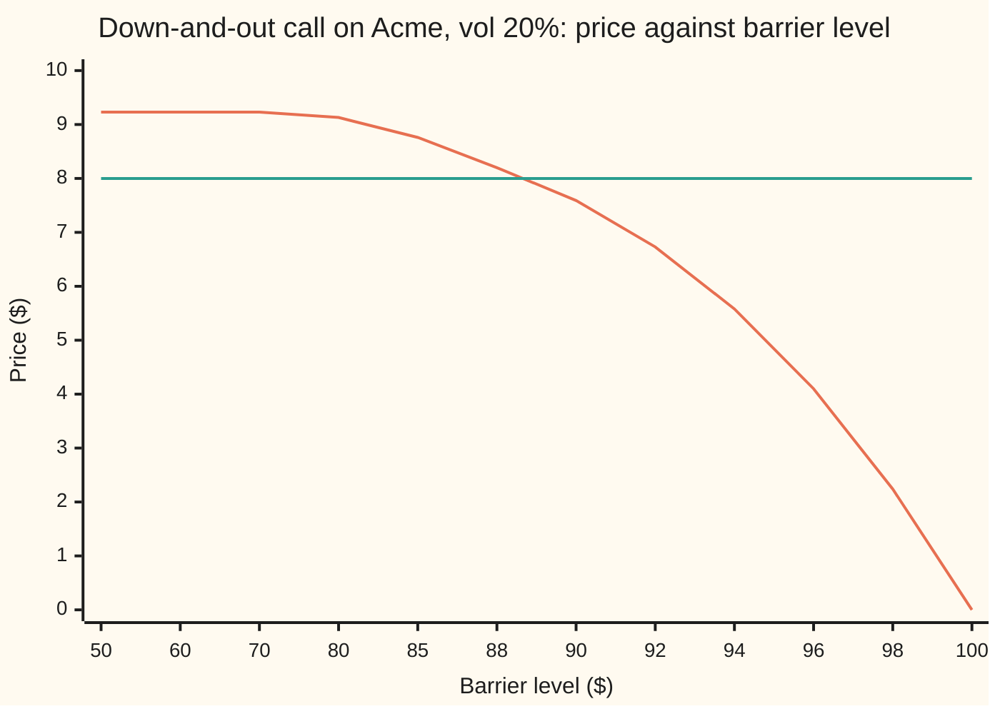
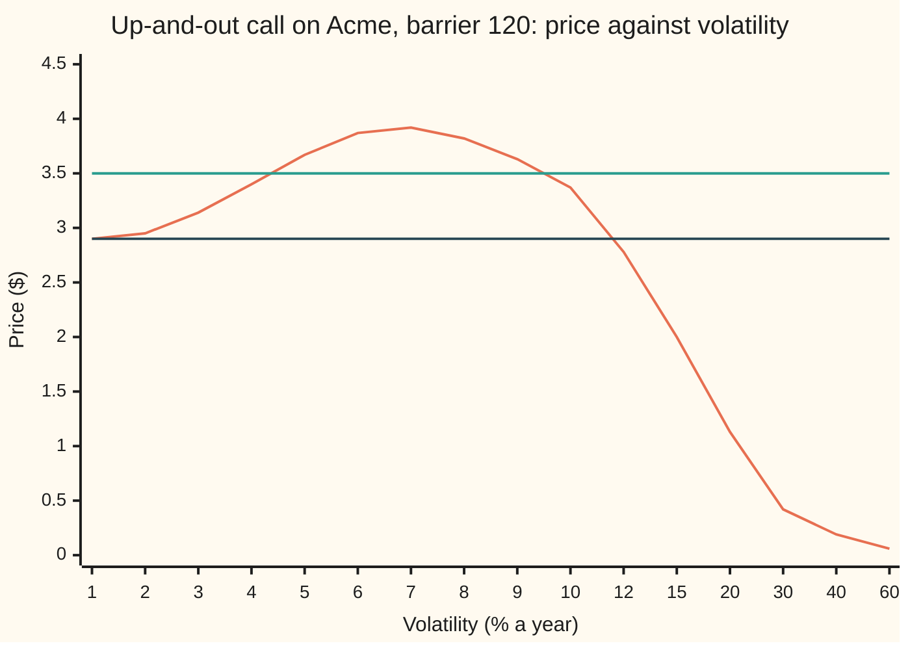

# Barrier inverses: the barrier level from a premium is unique, the volatility from a knock-out price is not

Financial mathematics → Barriers, touches and lookbacks → Running a barrier price backwards → Barrier inverses

---

## General Overview

Acme shares trade at $100. A plain one-year call on them, struck at $100, costs $9.23 in the house market. A **down-and-out call** is the same call with one extra clause: it dies, worthless, the first time Acme trades at or below a fixed price called the **barrier** ([knock-out-and-knock-in-options](01-knock-out-and-knock-in-options.md)). With the barrier at $80 it costs $9.13.

A buyer wants to pay exactly $8.00. Where should the barrier go? Raising it kills the option in more futures, so the price falls, and it falls at every step. One level does it: $88.73. Asking a pricing formula for its input, given its output, is called **inverting** it, and this inversion always has one answer when the target sits between zero and the plain call's price.

Now a different contract: an **up-and-out call**, which dies the first time Acme trades at or above $120. A dealer shows it at $3.50 and a risk system asks which volatility (the yearly size of Acme's swings) that price implies. There are two answers, 4.35 percent and 9.50 percent. At $4.00 there is none. More volatility widens the payoff, but it also drives Acme into the $120 wall more often, so the price rises, peaks at $3.92 and falls away.

**A knock-out's price moves one way as its barrier moves, so a target premium fixes one barrier level; its price need not move one way as volatility moves, so a quoted price can imply two volatilities or none, and the safe practice is to price the barrier at the plain option's volatility and quote the difference in dollars.**

**What kind of fact this is:** a theorem, proved on this card in Why it works: the level inverse exists and is unique inside stated bounds; the volatility inverse can fail both ways: at least two roots or none by the theorem, exactly two by the checks' sweep of the house numbers.

### The picture: the price falls as the barrier rises



Falling curve: the down-and-out call's price. Flat line: the $8.00 target. Far below Acme the barrier is almost never touched and the price sits at the plain call's $9.23. At $100 the barrier starts on Acme's price and the option is dead at birth. The curve never turns back, so the flat line crosses it once, between $88 and $90.

---

## The formula

Five inputs are the house market: Acme's price $S$, the strike $K$, the bank rate $r$, the dividend yield $q$ and the years to expiry $T$. The sixth is the volatility $\sigma$. Barrier formulas for all eight cases are on [reiner-rubinstein-barrier-formulas](02-reiner-rubinstein-barrier-formulas.md); this card needs the down-and-out call with its barrier $H$ at or below the strike:

$$C_{do}(H) = C \;-\; \Big[\, S e^{-qT}\,(H/S)^{2\lambda}\, N(y) \;-\; K e^{-rT}\,(H/S)^{2\lambda-2}\, N(y - \sigma\sqrt{T}) \,\Big]$$

**Read it aloud:** the down-and-out call is the plain call minus the part of it that lives in futures where Acme touched the barrier; that part is priced as a call seen in a mirror at the barrier.

The two inverse statements are the card's content. For the level:

$$\text{for } 0 < P < C:\quad \text{exactly one } H \text{ between } 0 \text{ and } S \text{ has } C_{do}(H) = P; \quad \text{for any other } P, \text{ none.}$$

For the volatility, write $U(\sigma)$ for the up-and-out call's price, barrier $120$, at volatility $\sigma$:

$$U(\sigma) = P \;\text{ has }\; \begin{cases} \text{two roots } \sigma_{lo} < \sigma_{hi} & \text{if } S e^{-qT} - K e^{-rT} < P < \max U \\ \text{one root} & \text{if } 0 < P \le S e^{-qT} - K e^{-rT} \text{ or } P = \max U \\ \text{no root} & \text{if } P > \max U \text{ or } P \le 0 \end{cases}$$

**Read it aloud:** above the zero-volatility floor and under the peak, a knock-out quote has two volatilities; under the floor, one; over the peak, none.

| Symbol | Plain meaning | In our example | Push it up and the answer… |
| --- | --- | --- | --- |
| $S$, $K$, $S_T$ | Acme's price today; the strike; Acme's price at expiry | $100, $100, unknown | — |
| $H$ | the barrier: touch it and the option dies | 80, 88.73, 120 | down-and-out: price falls |
| $r$, $q$ | bank rate; dividend yield, both continuously compounded | 5%, 2% | — |
| $\sigma$ | volatility: the yearly size of Acme's swings, as a fraction | 0.20 | up-and-out: price rises, then falls |
| $\sigma_{lo}$, $\sigma_{hi}$ | the two volatilities that reproduce one quote | 4.35%, 9.50% for $3.50 | they move apart as the quote falls |
| $T$ | years to expiry | 1 | — |
| $C$ | the plain call's price | $9.23 | ceiling for the level inverse |
| $C_{do}$, $U$ | the down-and-out call's price as a function of the barrier; the up-and-out call's price, barrier 120, as a function of volatility | $9.13 at 80; $1.13 at 20% | — |
| $m$ | the lowest price Acme reaches before expiry | depends on the path | — |
| $P$ | the premium or quote being inverted | $8.00; $3.50 | level falls; vol roots close in |
| $\lambda$, $y$, $d_1$ | helpers: $\lambda = (r - q + \tfrac12\sigma^2)/\sigma^2$; $y$ the mirrored call's distance to the strike in units of $\sigma\sqrt{T}$; $d_1$ the plain call's distance, as on the black-scholes-call card | 1.25; −1.981 at 80 | — |
| $N$, $e^{-rT}$ | the normal CDF, area under the bell curve left of a point ([black-scholes-call](../08-The%20Black-Scholes%20call%20and%20put/01-black-scholes-call.md)); the discount factor $D(T)$ | $e^{-0.05}$ | — |

The helper $y$ in full, in words the log-distance from the mirrored start $H^2/S$ to the strike, in swing units, plus $\lambda$ swing units:

$$y = \frac{\ln\!\big(H^2/(SK)\big)}{\sigma\sqrt{T}} + \lambda\,\sigma\sqrt{T}$$

### When it holds

- **Continuous monitoring.** The formula watches every instant. A contract that checks only daily closes is touched less often; a daily down barrier at $H$ behaves like a continuous one at $H e^{-0.5826\,\sigma\sqrt{1/252}}$, slightly lower ([discrete-monitoring-correction](03-discrete-monitoring-correction.md)). Solve in one convention and trade in the other, and the level is wrong: $88.73 against $89.38 here.
- **No rebate.** A rebate is cash paid when the barrier is touched. It is worth more as the barrier rises, which can offset the falling option value, and the level can stop being unique.
- **One volatility for the whole path.** A barrier's price depends on how Acme moves near the barrier, not just at the strike. With a smile ([volatility-smile-and-skew](../12-The%20smile%20and%20the%20surface/01-volatility-smile-and-skew.md)) no single number is the barrier's volatility, which is one more reason not to invert for one.
- **Barrier on the right side of Acme.** A down barrier sits under $100, an up barrier over it. On the wrong side the option is dead at birth and both inverses are meaningless.

---

## Why it works

### Step 0: raising the barrier can only kill, never revive

Fix one path Acme might take over the year. Put the barrier at $80 and the path either survives or not. Move the barrier up to $85. Any path that touched $80 also touched $85, so every death stays a death, and some survivors now die too. Path by path, the payoff at the higher barrier is never larger. An average of smaller payoffs is smaller. That is the whole reason the level inverse works, and no formula is needed for it.

### Step 1: the price falls strictly, and has fixed ends

"Never larger" is not yet "strictly smaller". The gap between the barrier-80 and barrier-85 prices is the value of the paths whose lowest point lies between $80 and $85 and that end above $100. A path that dips to $83 in March and finishes at $110 is one of them, and paths near it carry positive chance, so the gap is positive. The price is **strictly decreasing** in the barrier.

The ends pin the range. As the barrier sinks toward zero, touching it becomes impossible and the price climbs to the plain call, $9.23. As the barrier climbs to Acme's $100, the path starts on the wall; a random path started on a level crosses it at once, so the price drops to zero. The chart's $9.23 at the left and $0.00 at the right are those two ends.

<details>
<summary>Detailed proof: strictly decreasing, continuous, with limits C and 0</summary>

Write $m$ for the lowest price Acme reaches before expiry and $D(T) = e^{-rT}$. Then $C_{do}(H) = D(T)\,\mathbb{E}[(S_T - K)^+\,\mathbf{1}\{m > H\}]$, the average taken in the risk-neutral world, where $\mathbf{1}\{\cdot\}$ is 1 when the condition holds and 0 otherwise.

For $H_1 < H_2 < S$: $C_{do}(H_1) - C_{do}(H_2) = D(T)\,\mathbb{E}[(S_T - K)^+\,\mathbf{1}\{H_1 < m \le H_2\}]$. The joint law of the pair (lowest point, final price) has a positive density on the region where the lowest point is under both $S$ and the final price, so the event {lowest point in $(H_1, H_2]$, final price above $K + 1$} has positive probability, and the difference is at least $D(T)$ times that probability. Strictly positive.

Continuity: $C_{do}$ is built from powers, logs and $N$, all continuous in $H$ on $(0, S)$. Limits: as $H \to 0$, $(H/S)^{2\lambda} \to 0$ and $(H/S)^{2\lambda - 2} \to 0$ when $\lambda > 1$, true here, and for smaller $\lambda$ the factor $N(y)$ falls faster than the power grows, so $C_{do} \to C$. As $H \to S$, $y \to d_1$, the plain call's $d_1$, the bracket becomes the plain call itself and $C_{do} \to 0$.

</details>

### Step 2: the intermediate value theorem finishes the level

A continuous function that runs from $9.23 down to zero takes every value in between: that is the intermediate value theorem ([intermediate-value-theorem](../../06-Calculus%20and%20analysis/01-Limits%20and%20Continuity/06-intermediate-value-theorem.md)). So any target strictly between zero and $9.23 has a level. Strict decrease means it cannot be hit twice. Existence and uniqueness, together.

The boundary cases follow. A target of $9.30, above the plain call, has no level: no clause that only removes payoffs can make an option dearer. A target of zero is reached only in the limit of a barrier on Acme's price. The checks confirm the first: bisection on $9.30 finds no sign change and reports none.

Bisection is the natural solver here. It keeps an interval whose two ends give prices on opposite sides of the target and halves it. Monotone means the sign change can never hide.

### Step 3: volatility pulls the up-and-out call two ways

The up-and-out call pays $S_T - 100$ if Acme ends above $100 and never touched $120. Its best payoff, just under $20, sits right under the wall. It dies exactly where it is worth most, which is why desks call it a **reverse knock-out**.

Volatility does two things to it. It spreads Acme's final price wider, which lifts the call part, as for a plain call. It also makes a touch of $120 more likely, which kills the option. At low volatility the first effect wins; at high volatility the second.



Humped curve: the up-and-out call's price. Middle flat line: the $3.50 quote, crossing the hump twice. Bottom flat line: the zero-volatility floor, $2.90. The horizontal axis is not evenly spaced; the hump peaks at 6.82 percent.

### Step 4: the ends and the peak count the roots

**Zero volatility.** Acme then drifts up at the bank rate less the dividend, 3 percent a year, and ends a few dollars above $100, far under $120. No touch; the option is a plain call on a known outcome and is worth $S e^{-qT} - K e^{-rT}$, which is $2.896925. At 1 percent volatility the formula already gives $2.897294$.

**Endless volatility.** The payoff needs Acme to end above $100 without touching $120. With huge swings, almost every path either touches $120 or ends far below $100, so the price falls to zero. At 60 percent it is already $0.06.

**In between** the price reaches $3.917677 at 6.82 percent, above the floor. Apply the intermediate value theorem twice. On the rising stretch the price runs from $2.90 to $3.92, so a quote between them is hit once there. On the falling stretch it runs from $3.92 down to zero, so any quote under the peak is hit once there. A quote of $3.50 is hit on both: 4.35 percent and 9.50 percent. A quote of $2.00 is under the floor, so only the falling stretch reaches it: 14.98 percent. A quote of $4.00 is over the peak and nothing reaches it.

"Exactly two" also needs the curve to turn only once. On this contract it does: vega, the price's slope against volatility, is positive below 6.82 percent and negative above, as the sweep and the vega at each root show. Without that shape the theorem gives "at least two".

<details>
<summary>Detailed proof: the high-volatility limit is zero</summary>

The up-and-out payoff is at most $H - K = 20$, and it is paid only if Acme ends above $K$. So $U(\sigma) \le 20\,e^{-rT}\,\Pr(S_T > K)$, the chance taken in the risk-neutral world. That chance is $N\big((\ln(S/K) + (r - q - \tfrac12\sigma^2)T)/(\sigma\sqrt{T})\big)$. As $\sigma$ grows the argument behaves like $-\tfrac12\sigma\sqrt{T}$, which runs to minus infinity, so $N$ of it, and the price, go to zero. The chance of touching $H$ does not go to 1: in the risk-neutral world it tends to $S/H$. The price dies because the surviving paths end under the strike, not because every path touches.

</details>

### Step 5: the two roots are two different trades

The roots are not a curiosity. At 4.35 percent the vega is +28.18 (dollars per 1.00 of volatility, so $0.28 per percentage point): a holder gains as volatility rises. At 9.50 percent it is −26.22: it loses. A hedge built at one root is the wrong way round at the other. A system that reports "implied vol 4.35 percent" has made a choice the quote never contained.

So the safe practice keeps the barrier out of the inversion. Read the volatility off the plain call, where it is unique ([implied-volatility](../11-Implied%20volatility%20and%20the%20vanilla%20inverses/01-implied-volatility.md)): $9.227006 returns 20 percent. Price the barrier at that volatility: $1.132492. Quote the market price as a dollar **spread** over that model price: a dealer's $1.20 is the model price plus $0.067508. The spread is one number, always exists, and moves smoothly as the quote moves.

The down-and-out call from Step 2 shows the contrast. At the $88.73 level its price rises with volatility at every point the checks tried: $5.44 at 10 percent, $8.00 at 20, $9.21 at 30, $9.83 at 40. Its barrier sits under the strike, where the option is worth little, so the kill effect never wins. The level inverse is safe for any knock-out without a rebate; the volatility inverse is safe only when the contract's vega keeps one sign.

A third road reaches the level differently: price by the Brownian bridge integral in the code and solve by the secant method. It lands on the same $88.727307.

---

## Worked numbers, by hand

The level for $8.00, by bisection on $C_{do}$, starting from the interval $50 to $100. At each midpoint: price above $8.00 means the barrier can go higher, so the midpoint becomes the new low end; below, the new high end.

| Step | Arithmetic | Value |
| --- | --- | --- |
| house check | $C_{do}(80) = 9.227006 - 0.093699$ | $9.133306 |
| midpoint 1 | (50 + 100)/2 = 75; price 9.2149, above 8 | keep 75 to 100 |
| midpoint 2 | (75 + 100)/2 = 87.5; price 8.3162, above 8 | keep 87.5 to 100 |
| midpoint 3 | (87.5 + 100)/2 = 93.75; price 5.7434, below 8 | keep 87.5 to 93.75 |
| midpoint 4 | 90.625; price 7.3485, below 8 | keep 87.5 to 90.625 |
| midpoint 5 | 89.0625; price 7.9001, below 8 | keep 87.5 to 89.0625 |
| midpoint 6 | 88.28125; price 8.1236, above 8 | keep 88.28125 to 89.0625 |
| midpoint 7 | 88.671875; price 8.0159, above 8 | keep 88.671875 to 89.0625 |
| **level, 80 halvings** | continuous monitoring | **$88.727307** |
| daily-monitored contract | 88.727307 × $e^{0.5826 \times 0.2 \times \sqrt{1/252}}$ | $89.380968 |

A down-and-out call with its barrier at $88.73 costs $8.00: the buyer pays less than the plain call's $9.23 by accepting death if Acme touches $88.73 at any moment of the year. Written into a daily-monitored contract, the barrier must be $89.38 to cost the same.

### What breaks if you drop a piece

Same Acme up-and-out call, barrier $120, quote $3.50, whose true answers are 4.35 and 9.50 percent:

| Mistake | Comes out at | What went wrong |
| --- | --- | --- |
| Newton's method from 20% | 0.94%, then 257.05%, then below zero | vega at 20% is −12.4, half its size near the root, so step 1 overshoots both roots; at 0.94% vega is 0.24, near zero, so step 2 flies off |
| Bisection on 1% to 60% | no answer | both ends price under $3.50 ($2.90 and $0.06); two roots hide inside, and bisection only sees sign changes |
| Taking the low root to hedge | vega +28.18 | the high root's vega is −26.22; the hedge is the wrong way round |
| Solving the level for continuous watching, trading daily | $88.73 instead of $89.38 | the daily contract is touched less, so it is dearer at the same level |

The slope −12.4 is the bumped vega at 20 percent, printed by both checks as −12.42; every number in the table is.

---

## Code, from first principles, and it actually runs

The code prices barrier options three independent ways. Road 1 is the closed form. Road 2 averages the payoff over where Acme ends, weighting each end point by the Brownian-bridge chance that a path to it never touched the barrier, $1 - e^{-2\ln(S/H)\ln(S_T/H)/(\sigma^2 T)}$ with $S_T$ the final price, and integrates by Simpson's rule. Road 3 is an explicit finite-difference grid (a table of prices on a mesh of log prices and times, stepped back from expiry) with the barrier as a zero-value edge. The level is found by bisection on road 1 and by the secant method on road 2; the two volatilities likewise. The normal CDF is summed from its series; nothing imported knows the answer.

### Python

```python
# Barrier inverses -- the check behind the card.  Standard library only.
# Three roads to a barrier price: the closed form, an integral over where the share
# ends weighted by the Brownian-bridge chance of never touching, and a finite-difference
# grid.  The normal CDF, the integrator, the grid and both root finders are written here.
from math import log, exp, sqrt, pi

S, K, r, q, T = 100.0, 100.0, 0.05, 0.02, 1.0

def phi(x): return exp(-0.5 * x * x) / sqrt(2.0 * pi)
def N(x):                                   # 1/2 + phi(x) * (x + x^3/3 + x^5/(3*5) + ...)
    if abs(x) > 9.0: return 1.0 if x > 0 else 0.0
    s = t = x; n = 1
    while abs(t) > 1e-17 * abs(s):
        t *= x * x / (2 * n + 1); s += t; n += 1
    return 0.5 + phi(x) * s

def vanilla(sig):
    v = sig * sqrt(T); d1 = (log(S / K) + (r - q + 0.5 * sig * sig) * T) / v
    return S * exp(-q * T) * N(d1) - K * exp(-r * T) * N(d1 - v)

def down_out(H, sig):                       # road 1, closed form, barrier H <= strike K
    v = sig * sqrt(T); lam = (r - q + 0.5 * sig * sig) / (sig * sig)
    y = log(H * H / (S * K)) / v + lam * v
    d_in = S * exp(-q * T) * (H / S) ** (2 * lam) * N(y) - K * exp(-r * T) * (H / S) ** (2 * lam - 2) * N(y - v)
    return vanilla(sig) - d_in

def up_out(H, sig):                         # road 1, closed form, barrier H above strike K
    v = sig * sqrt(T); lam = (r - q + 0.5 * sig * sig) / (sig * sig)
    x1 = log(S / H) / v + lam * v; y = log(H * H / (S * K)) / v + lam * v; y1 = log(H / S) / v + lam * v
    u_in = (S * exp(-q * T) * N(x1) - K * exp(-r * T) * N(x1 - v)
            - S * exp(-q * T) * (H / S) ** (2 * lam) * (N(-y) - N(-y1))
            + K * exp(-r * T) * (H / S) ** (2 * lam - 2) * (N(-y + v) - N(-y1 + v)))
    return vanilla(sig) - u_in

def bridge(H, sig, up, n=4000):             # road 2: Simpson over the end point z
    v = sig * sqrt(T); m = (r - q - 0.5 * sig * sig) * T
    a = (log(K / S) - m) / v
    b = min((log(H / S) - m) / v, 12.0) if up else 12.0
    h = (b - a) / n; tot = 0.0
    for i in range(n + 1):
        z = a + i * h; ST = S * exp(m + v * z)
        alive = 1.0 - exp(-2.0 * log(S / H) * log(ST / H) / (sig * sig * T))
        w = 1 if i in (0, n) else (4 if i % 2 else 2)
        tot += w * (ST - K) * alive * phi(z)
    return exp(-r * T) * tot * h / 3.0

def grid(H, sig, up, m=40):                 # road 3: explicit finite differences in log price
    dx = abs(log(H / S)) / m; J = m + int(6.0 * sig * sqrt(T) / dx) + 2
    lo = log(H) - J * dx if up else log(H)
    xs = [lo + i * dx for i in range(J + 1)]
    V = [max(exp(x) - K, 0.0) for x in xs]
    V[J if up else 0] = 0.0
    steps = int(T * sig * sig / (0.9 * dx * dx)) + 1; dt = T / steps
    nu = r - q - 0.5 * sig * sig; a = 0.5 * sig * sig / (dx * dx); b = nu / (2 * dx)
    for k in range(1, steps + 1):
        W = [0.0] * (J + 1)
        for i in range(1, J):
            W[i] = V[i] + dt * (a * (V[i + 1] - 2 * V[i] + V[i - 1]) + b * (V[i + 1] - V[i - 1]) - r * V[i])
        if not up: W[J] = exp(xs[J] - q * k * dt) - K * exp(-r * k * dt)
        V = W
    return V[J - m if up else m]

def bisect(f, a, b, n=80):                  # keeps a sign change; returns None without one
    fa = f(a)
    if fa * f(b) > 0: return None
    for _ in range(n):
        c = 0.5 * (a + b); fc = f(c)
        if (fc > 0) == (fa > 0): a, fa = c, fc
        else: b = c
    return 0.5 * (a + b)

def secant(f, a, b, n=40):                  # a second root finder, run on road 2
    fa, fb = f(a), f(b)
    for _ in range(n):
        if fb == fa: break
        a, fa, b = b, fb, b - fb * (b - a) / (fb - fa); fb = f(b)
    return b

def out(label, x): print(f"{label:<40} " + ("        none" if x is None else f"{x:>12.6f}"))
sig = 0.20; C = vanilla(sig); do80 = down_out(80.0, sig); do80b = bridge(80.0, sig, False)
out("vanilla call, vol 20%", C); out("down-and-out, barrier 80, formula", do80)
out("down-and-out, barrier 80, bridge", do80b); out("down-and-in, barrier 80", C - do80)
lam = (r - q + 0.5 * sig * sig) / (sig * sig); out("lambda at vol 20%", lam)
out("y at barrier 80", log(80.0 * 80.0 / (S * K)) / (sig * sqrt(T)) + lam * sig * sqrt(T))
levels = [50.0, 60.0, 70.0, 80.0, 85.0, 88.0, 90.0, 92.0, 94.0, 96.0, 98.0, 100.0]
print("chart, barrier  " + " ".join(f"{h:6.0f}" for h in levels))
print("chart, DO price " + " ".join(f"{down_out(h, sig):6.2f}" for h in levels))
a, b, mids = 50.0, 100.0, []
for _ in range(7): c = 0.5 * (a + b); mids.append(c); a, b = (c, b) if down_out(c, sig) > 8.0 else (a, c)
print("bisection, midpoint " + " ".join(f"{h:.6f}" for h in mids)); print("bisection, DO price " + " ".join(f"{down_out(h, sig):9.4f}" for h in mids))
H1 = bisect(lambda h: down_out(h, sig) - 8.0, 50.0, 100.0)
H2 = secant(lambda h: bridge(h, sig, False) - 8.0, 85.0, 92.0)
out("level for 8.00, bisection on formula", H1); out("level for 8.00, secant on bridge", H2)
out("DO at that level, formula", down_out(H1, sig)); out("DO at that level, bridge", bridge(H1, sig, False))
gd = grid(H1, sig, False); out("DO at that level, grid", gd)
out("level for 9.30 (above vanilla)", bisect(lambda h: down_out(h, sig) - 9.30, 50.0, 99.999))
out("daily-monitored contract level", H1 * exp(0.5826 * sig * sqrt(1.0 / 252.0)))
print("DO at that level, vol 10 20 30 40%: " + " ".join(f"{down_out(H1, s):.4f}" for s in (0.1, 0.2, 0.3, 0.4)))
vols = [0.01, 0.02, 0.03, 0.04, 0.05, 0.06, 0.07, 0.08, 0.09, 0.10, 0.12, 0.15, 0.20, 0.30, 0.40, 0.60]
print("chart, vol %    " + " ".join(f"{100 * s:5.0f}" for s in vols))
print("chart, UO price " + " ".join(f"{up_out(120.0, s):5.2f}" for s in vols))
lim0 = S * exp(-q * T) - K * exp(-r * T)
out("UO limit as vol -> 0", lim0); out("UO at vol 1%", up_out(120.0, 0.01))
out("UO at vol 20%, formula", up_out(120.0, sig)); out("UO at vol 20%, bridge", bridge(120.0, sig, True))
g20 = grid(120.0, sig, True); out("UO at vol 20%, grid", g20)
vega = lambda s: (up_out(120.0, s + 1e-5) - up_out(120.0, s - 1e-5)) / 2e-5
vega_b = lambda s: (bridge(120.0, s + 1e-4, True) - bridge(120.0, s - 1e-4, True)) / 2e-4
pk = bisect(vega, 0.03, 0.12); out("peak vol", pk); out("peak price", up_out(120.0, pk))
lo1 = bisect(lambda s: up_out(120.0, s) - 3.5, 0.01, pk); hi1 = bisect(lambda s: up_out(120.0, s) - 3.5, pk, 1.0)
lo2 = secant(lambda s: bridge(120.0, s, True) - 3.5, 0.04, 0.05); hi2 = secant(lambda s: bridge(120.0, s, True) - 3.5, 0.09, 0.10)
out("quote 3.50: low vol, formula", lo1); out("quote 3.50: low vol, bridge", lo2)
out("quote 3.50: high vol, formula", hi1); out("quote 3.50: high vol, bridge", hi2)
glo, ghi = grid(120.0, lo1, True), grid(120.0, hi1, True)
out("grid price at low vol", glo); out("grid price at high vol", ghi)
out("vega at low vol, formula", vega(lo1)); out("vega at low vol, bridge", vega_b(lo1))
out("vega at high vol, formula", vega(hi1)); out("vega at high vol, bridge", vega_b(hi1))
out("quote 2.00: the one vol", bisect(lambda s: up_out(120.0, s) - 2.0, pk, 1.0))
out("quote 2.00: root below the peak", bisect(lambda s: up_out(120.0, s) - 2.0, 0.01, pk))
out("quote 4.00: root below the peak", bisect(lambda s: up_out(120.0, s) - 4.0, 0.01, pk))
out("quote 4.00: root above the peak", bisect(lambda s: up_out(120.0, s) - 4.0, pk, 1.0))
out("quote 3.50: bisection on 1% to 60%", bisect(lambda s: up_out(120.0, s) - 3.5, 0.01, 0.60))
s1 = sig - (up_out(120.0, sig) - 3.5) / vega(sig); s2 = s1 - (up_out(120.0, s1) - 3.5) / vega(s1)
s3 = s2 - (up_out(120.0, s2) - 3.5) / vega(s2)
out("vega at 20%, formula", vega(sig)); out("newton from 20%, step 1", s1); out("newton from 20%, step 2", s2)
print(f"{'newton from 20%, step 3 below zero':<40} " + ("         yes" if s3 < 0 else "          no"))
van_b = bridge(1e-9, sig, False)             # a barrier so low it is never touched
iv = bisect(lambda s: vanilla(s) - van_b, 0.01, 1.0)
out("vanilla quote, by integral", van_b); out("vanilla implied vol", iv)
out("UO at the vanilla vol", up_out(120.0, iv)); out("market UO 1.20: spread over model", 1.20 - up_out(120.0, iv))
out("try: level for 5.00", bisect(lambda h: down_out(h, sig) - 5.0, 50.0, 99.999))
b130 = bisect(lambda s: (up_out(130.0, s + 1e-5) - up_out(130.0, s - 1e-5)), 0.03, 0.2)
out("try: barrier 130, peak vol", b130); out("try: barrier 130, peak price", up_out(130.0, b130))

assert abs(do80 - 9.133306) < 1e-6 and abs(do80b - do80) < 1e-7, "barrier 80 on two roads and the shelf's number"
assert abs(H1 - H2) < 1e-6 and abs(gd - 8.0) < 0.01 and bisect(lambda h: bridge(h, sig, False) - 9.30, 50.0, 99.999) is None, "the level on three roads; none for 9.30"
assert abs(lo1 - lo2) < 1e-6 and abs(hi1 - hi2) < 1e-6, "two implied vols on two roads"
assert abs(glo - 3.5) < 0.01 and abs(ghi - 3.5) < 0.01 and abs(g20 - up_out(120.0, sig)) < 0.01, "grid agrees"
assert vega_b(lo1) > 0 > vega_b(hi1) and all(bisect(lambda s: bridge(120.0, s, True) - 4.0, a, b) is None for a, b in ((0.01, pk), (pk, 1.0))), "opposite vegas; no vol for 4.00"
assert abs(up_out(120.0, 0.01) - lim0) < 1e-3 and abs(iv - 0.2) < 1e-6, "low-vol limit; vanilla vol recovered"
print("ALL CHECKS PASS")
```

**Ran 2026-09-24 on macOS, Python 3.14.6, standard library only. All checks passed. Output, pasted from the run:**

```
vanilla call, vol 20%                        9.227006
down-and-out, barrier 80, formula            9.133306
down-and-out, barrier 80, bridge             9.133306
down-and-in, barrier 80                      0.093699
lambda at vol 20%                            1.250000
y at barrier 80                             -1.981436
chart, barrier      50     60     70     80     85     88     90     92     94     96     98    100
chart, DO price   9.23   9.23   9.23   9.13   8.76   8.20   7.59   6.73   5.58   4.10   2.24   0.00
bisection, midpoint 75.000000 87.500000 93.750000 90.625000 89.062500 88.281250 88.671875
bisection, DO price    9.2149    8.3162    5.7434    7.3485    7.9001    8.1236    8.0159
level for 8.00, bisection on formula        88.727307
level for 8.00, secant on bridge            88.727307
DO at that level, formula                    8.000000
DO at that level, bridge                     8.000000
DO at that level, grid                       8.000118
level for 9.30 (above vanilla)                   none
daily-monitored contract level              89.380968
DO at that level, vol 10 20 30 40%: 5.4402 8.0000 9.2056 9.8258
chart, vol %        1     2     3     4     5     6     7     8     9    10    12    15    20    30    40    60
chart, UO price  2.90  2.95  3.14  3.40  3.67  3.87  3.92  3.82  3.63  3.37  2.78  2.00  1.13  0.42  0.19  0.06
UO limit as vol -> 0                         2.896925
UO at vol 1%                                 2.897294
UO at vol 20%, formula                       1.132492
UO at vol 20%, bridge                        1.132492
UO at vol 20%, grid                          1.131504
peak vol                                     0.068230
peak price                                   3.917677
quote 3.50: low vol, formula                 0.043487
quote 3.50: low vol, bridge                  0.043487
quote 3.50: high vol, formula                0.095047
quote 3.50: high vol, bridge                 0.095047
grid price at low vol                        3.500542
grid price at high vol                       3.499535
vega at low vol, formula                    28.182210
vega at low vol, bridge                     28.182042
vega at high vol, formula                  -26.217984
vega at high vol, bridge                   -26.217926
quote 2.00: the one vol                      0.149782
quote 2.00: root below the peak                  none
quote 4.00: root below the peak                  none
quote 4.00: root above the peak                  none
quote 3.50: bisection on 1% to 60%               none
vega at 20%, formula                       -12.421049
newton from 20%, step 1                      0.009395
newton from 20%, step 2                      2.570527
newton from 20%, step 3 below zero                yes
vanilla quote, by integral                   9.227006
vanilla implied vol                          0.200000
UO at the vanilla vol                        1.132492
market UO 1.20: spread over model            0.067508
try: level for 5.00                         94.841579
try: barrier 130, peak vol                   0.107211
try: barrier 130, peak price                 5.018941
ALL CHECKS PASS
```

### Rust

```rust
// Barrier inverses -- the check behind the card.  Rust std only, no crates.
// Three roads to a barrier price: the closed form, an integral over where the share
// ends weighted by the Brownian-bridge chance of never touching, and a finite-difference
// grid.  The normal CDF, the integrator, the grid and both root finders are written here.
const S: f64 = 100.0; const K: f64 = 100.0; const R: f64 = 0.05; const Q: f64 = 0.02; const T: f64 = 1.0;

fn phi(x: f64) -> f64 { (-0.5 * x * x).exp() / (2.0 * std::f64::consts::PI).sqrt() }
fn n(x: f64) -> f64 { // 1/2 + phi(x) * (x + x^3/3 + x^5/(3*5) + ...)
    if x.abs() > 9.0 { return if x > 0.0 { 1.0 } else { 0.0 }; }
    let (mut s, mut t, mut k) = (x, x, 1.0);
    while t.abs() > 1e-17 * s.abs() { t *= x * x / (2.0 * k + 1.0); s += t; k += 1.0; }
    0.5 + phi(x) * s
}
fn vanilla(sig: f64) -> f64 {
    let v = sig * T.sqrt(); let d1 = ((S / K).ln() + (R - Q + 0.5 * sig * sig) * T) / v;
    S * (-Q * T).exp() * n(d1) - K * (-R * T).exp() * n(d1 - v)
}
fn down_out(h: f64, sig: f64) -> f64 { // road 1, closed form, barrier h <= strike K
    let v = sig * T.sqrt(); let lam = (R - Q + 0.5 * sig * sig) / (sig * sig);
    let y = (h * h / (S * K)).ln() / v + lam * v;
    let d_in = S * (-Q * T).exp() * (h / S).powf(2.0 * lam) * n(y) - K * (-R * T).exp() * (h / S).powf(2.0 * lam - 2.0) * n(y - v);
    vanilla(sig) - d_in
}
fn up_out(h: f64, sig: f64) -> f64 { // road 1, closed form, barrier h above strike K
    let v = sig * T.sqrt(); let lam = (R - Q + 0.5 * sig * sig) / (sig * sig);
    let x1 = (S / h).ln() / v + lam * v; let y = (h * h / (S * K)).ln() / v + lam * v; let y1 = (h / S).ln() / v + lam * v;
    let u_in = S * (-Q * T).exp() * n(x1) - K * (-R * T).exp() * n(x1 - v)
        - S * (-Q * T).exp() * (h / S).powf(2.0 * lam) * (n(-y) - n(-y1))
        + K * (-R * T).exp() * (h / S).powf(2.0 * lam - 2.0) * (n(-y + v) - n(-y1 + v));
    vanilla(sig) - u_in
}
fn bridge(h: f64, sig: f64, up: bool) -> f64 { // road 2: Simpson over the end point z
    let nn = 4000; let v = sig * T.sqrt(); let m = (R - Q - 0.5 * sig * sig) * T;
    let a = ((K / S).ln() - m) / v;
    let b = if up { (((h / S).ln() - m) / v).min(12.0) } else { 12.0 };
    let hh = (b - a) / nn as f64; let mut tot = 0.0;
    for i in 0..=nn {
        let z = a + i as f64 * hh; let st = S * (m + v * z).exp();
        let alive = 1.0 - (-2.0 * (S / h).ln() * (st / h).ln() / (sig * sig * T)).exp();
        let w = if i == 0 || i == nn { 1.0 } else if i % 2 == 1 { 4.0 } else { 2.0 };
        tot += w * (st - K) * alive * phi(z);
    }
    (-R * T).exp() * tot * hh / 3.0
}
fn grid(h: f64, sig: f64, up: bool) -> f64 { // road 3: explicit finite differences in log price
    let m = 40usize; let dx = (h / S).ln().abs() / m as f64; let j = m + (6.0 * sig * T.sqrt() / dx) as usize + 2;
    let lo = if up { h.ln() - j as f64 * dx } else { h.ln() };
    let xs: Vec<f64> = (0..=j).map(|i| lo + i as f64 * dx).collect();
    let mut v: Vec<f64> = xs.iter().map(|x| (x.exp() - K).max(0.0)).collect();
    v[if up { j } else { 0 }] = 0.0;
    let steps = (T * sig * sig / (0.9 * dx * dx)) as usize + 1; let dt = T / steps as f64;
    let nu = R - Q - 0.5 * sig * sig; let a = 0.5 * sig * sig / (dx * dx); let b = nu / (2.0 * dx);
    for k in 1..=steps {
        let mut w = vec![0.0; j + 1];
        for i in 1..j {
            w[i] = v[i] + dt * (a * (v[i + 1] - 2.0 * v[i] + v[i - 1]) + b * (v[i + 1] - v[i - 1]) - R * v[i]);
        }
        if !up { w[j] = (xs[j] - Q * k as f64 * dt).exp() - K * (-R * k as f64 * dt).exp(); }
        v = w;
    }
    v[if up { j - m } else { m }]
}
fn bisect(f: &dyn Fn(f64) -> f64, mut a: f64, mut b: f64) -> Option<f64> { // needs a sign change
    let mut fa = f(a);
    if fa * f(b) > 0.0 { return None; }
    for _ in 0..80 {
        let c = 0.5 * (a + b); let fc = f(c);
        if (fc > 0.0) == (fa > 0.0) { a = c; fa = fc; } else { b = c; }
    }
    Some(0.5 * (a + b))
}
fn secant(f: &dyn Fn(f64) -> f64, mut a: f64, mut b: f64) -> f64 { // second root finder, on road 2
    let (mut fa, mut fb) = (f(a), f(b));
    for _ in 0..40 {
        if fb == fa { break; }
        let c = b - fb * (b - a) / (fb - fa); a = b; fa = fb; b = c; fb = f(b);
    }
    b
}
fn out(label: &str, x: Option<f64>) {
    match x { Some(v) => println!("{:<40} {:>12.6}", label, v), None => println!("{:<40}         none", label) }
}
fn row(label: &str, xs: &[f64], w: usize, p: usize) {
    let parts: Vec<String> = xs.iter().map(|x| format!("{:w$.p$}", x, w = w, p = p)).collect();
    println!("{}{}", label, parts.join(" "));
}
fn main() {
    let sig = 0.20;
    let c = vanilla(sig); let do80 = down_out(80.0, sig); let do80b = bridge(80.0, sig, false);
    out("vanilla call, vol 20%", Some(c)); out("down-and-out, barrier 80, formula", Some(do80));
    out("down-and-out, barrier 80, bridge", Some(do80b)); out("down-and-in, barrier 80", Some(c - do80));
    let lam = (R - Q + 0.5 * sig * sig) / (sig * sig); out("lambda at vol 20%", Some(lam));
    out("y at barrier 80", Some((80.0f64 * 80.0 / (S * K)).ln() / (sig * T.sqrt()) + lam * sig * T.sqrt()));
    let levels = [50.0, 60.0, 70.0, 80.0, 85.0, 88.0, 90.0, 92.0, 94.0, 96.0, 98.0, 100.0];
    row("chart, barrier  ", &levels, 6, 0);
    row("chart, DO price ", &levels.iter().map(|&h| down_out(h, sig)).collect::<Vec<_>>(), 6, 2);
    let (mut a, mut b, mut mids) = (50.0, 100.0, Vec::new());
    for _ in 0..7 { let c = 0.5 * (a + b); mids.push(c); if down_out(c, sig) > 8.0 { a = c; } else { b = c; } }
    println!("bisection, midpoint {}", mids.iter().map(|h| format!("{:.6}", h)).collect::<Vec<_>>().join(" "));
    row("bisection, DO price ", &mids.iter().map(|&h| down_out(h, sig)).collect::<Vec<_>>(), 9, 4);
    let h1 = bisect(&|h| down_out(h, sig) - 8.0, 50.0, 100.0).unwrap();
    let h2 = secant(&|h| bridge(h, sig, false) - 8.0, 85.0, 92.0);
    out("level for 8.00, bisection on formula", Some(h1)); out("level for 8.00, secant on bridge", Some(h2));
    out("DO at that level, formula", Some(down_out(h1, sig))); out("DO at that level, bridge", Some(bridge(h1, sig, false)));
    let gd = grid(h1, sig, false); out("DO at that level, grid", Some(gd));
    out("level for 9.30 (above vanilla)", bisect(&|h| down_out(h, sig) - 9.30, 50.0, 99.999));
    out("daily-monitored contract level", Some(h1 * (0.5826 * sig * (1.0f64 / 252.0).sqrt()).exp()));
    let dv: Vec<String> = [0.1, 0.2, 0.3, 0.4].iter().map(|&s| format!("{:.4}", down_out(h1, s))).collect();
    println!("DO at that level, vol 10 20 30 40%: {}", dv.join(" "));
    let vols = [0.01, 0.02, 0.03, 0.04, 0.05, 0.06, 0.07, 0.08, 0.09, 0.10, 0.12, 0.15, 0.20, 0.30, 0.40, 0.60];
    row("chart, vol %    ", &vols.iter().map(|s| 100.0 * s).collect::<Vec<_>>(), 5, 0);
    row("chart, UO price ", &vols.iter().map(|&s| up_out(120.0, s)).collect::<Vec<_>>(), 5, 2);
    let lim0 = S * (-Q * T).exp() - K * (-R * T).exp();
    out("UO limit as vol -> 0", Some(lim0)); out("UO at vol 1%", Some(up_out(120.0, 0.01)));
    out("UO at vol 20%, formula", Some(up_out(120.0, sig))); out("UO at vol 20%, bridge", Some(bridge(120.0, sig, true)));
    let g20 = grid(120.0, sig, true); out("UO at vol 20%, grid", Some(g20));
    let vega = |s: f64| (up_out(120.0, s + 1e-5) - up_out(120.0, s - 1e-5)) / 2e-5;
    let vega_b = |s: f64| (bridge(120.0, s + 1e-4, true) - bridge(120.0, s - 1e-4, true)) / 2e-4;
    let pk = bisect(&vega, 0.03, 0.12).unwrap(); out("peak vol", Some(pk)); out("peak price", Some(up_out(120.0, pk)));
    let lo1 = bisect(&|s| up_out(120.0, s) - 3.5, 0.01, pk).unwrap(); let hi1 = bisect(&|s| up_out(120.0, s) - 3.5, pk, 1.0).unwrap();
    let lo2 = secant(&|s| bridge(120.0, s, true) - 3.5, 0.04, 0.05); let hi2 = secant(&|s| bridge(120.0, s, true) - 3.5, 0.09, 0.10);
    out("quote 3.50: low vol, formula", Some(lo1)); out("quote 3.50: low vol, bridge", Some(lo2));
    out("quote 3.50: high vol, formula", Some(hi1)); out("quote 3.50: high vol, bridge", Some(hi2));
    let (glo, ghi) = (grid(120.0, lo1, true), grid(120.0, hi1, true));
    out("grid price at low vol", Some(glo)); out("grid price at high vol", Some(ghi));
    out("vega at low vol, formula", Some(vega(lo1))); out("vega at low vol, bridge", Some(vega_b(lo1)));
    out("vega at high vol, formula", Some(vega(hi1))); out("vega at high vol, bridge", Some(vega_b(hi1)));
    out("quote 2.00: the one vol", bisect(&|s| up_out(120.0, s) - 2.0, pk, 1.0));
    out("quote 2.00: root below the peak", bisect(&|s| up_out(120.0, s) - 2.0, 0.01, pk));
    out("quote 4.00: root below the peak", bisect(&|s| up_out(120.0, s) - 4.0, 0.01, pk));
    out("quote 4.00: root above the peak", bisect(&|s| up_out(120.0, s) - 4.0, pk, 1.0));
    out("quote 3.50: bisection on 1% to 60%", bisect(&|s| up_out(120.0, s) - 3.5, 0.01, 0.60));
    let s1 = sig - (up_out(120.0, sig) - 3.5) / vega(sig); let s2 = s1 - (up_out(120.0, s1) - 3.5) / vega(s1);
    let s3 = s2 - (up_out(120.0, s2) - 3.5) / vega(s2);
    out("vega at 20%, formula", Some(vega(sig))); out("newton from 20%, step 1", Some(s1)); out("newton from 20%, step 2", Some(s2));
    println!("{:<40} {:>12}", "newton from 20%, step 3 below zero", if s3 < 0.0 { "yes" } else { "no" });
    let van_b = bridge(1e-9, sig, false); // a barrier so low it is never touched
    let iv = bisect(&|s| vanilla(s) - van_b, 0.01, 1.0).unwrap();
    out("vanilla quote, by integral", Some(van_b)); out("vanilla implied vol", Some(iv));
    out("UO at the vanilla vol", Some(up_out(120.0, iv))); out("market UO 1.20: spread over model", Some(1.20 - up_out(120.0, iv)));
    out("try: level for 5.00", bisect(&|h| down_out(h, sig) - 5.0, 50.0, 99.999));
    let b130 = bisect(&|s| up_out(130.0, s + 1e-5) - up_out(130.0, s - 1e-5), 0.03, 0.2).unwrap();
    out("try: barrier 130, peak vol", Some(b130)); out("try: barrier 130, peak price", Some(up_out(130.0, b130)));

    assert!((do80 - 9.133306).abs() < 1e-6 && (do80b - do80).abs() < 1e-7, "barrier 80 on two roads and the shelf's number");
    assert!((h1 - h2).abs() < 1e-6 && (gd - 8.0).abs() < 0.01 && bisect(&|h| bridge(h, sig, false) - 9.30, 50.0, 99.999).is_none(), "the level on three roads; none for 9.30");
    assert!((lo1 - lo2).abs() < 1e-6 && (hi1 - hi2).abs() < 1e-6, "two implied vols on two roads");
    assert!((glo - 3.5).abs() < 0.01 && (ghi - 3.5).abs() < 0.01 && (g20 - up_out(120.0, sig)).abs() < 0.01, "grid agrees");
    assert!(vega_b(lo1) > 0.0 && vega_b(hi1) < 0.0 && [(0.01, pk), (pk, 1.0)].iter().all(|&(a, b)| bisect(&|s| bridge(120.0, s, true) - 4.0, a, b).is_none()), "opposite vegas; no vol for 4.00");
    assert!((up_out(120.0, 0.01) - lim0).abs() < 1e-3 && (iv - 0.2).abs() < 1e-6, "low-vol limit; vanilla vol recovered");
    println!("ALL CHECKS PASS");
}
```

**Ran 2026-09-24 on macOS, rustc 1.98.1, no crates. All checks passed. Output, pasted from the run:**

```
vanilla call, vol 20%                        9.227006
down-and-out, barrier 80, formula            9.133306
down-and-out, barrier 80, bridge             9.133306
down-and-in, barrier 80                      0.093699
lambda at vol 20%                            1.250000
y at barrier 80                             -1.981436
chart, barrier      50     60     70     80     85     88     90     92     94     96     98    100
chart, DO price   9.23   9.23   9.23   9.13   8.76   8.20   7.59   6.73   5.58   4.10   2.24   0.00
bisection, midpoint 75.000000 87.500000 93.750000 90.625000 89.062500 88.281250 88.671875
bisection, DO price    9.2149    8.3162    5.7434    7.3485    7.9001    8.1236    8.0159
level for 8.00, bisection on formula        88.727307
level for 8.00, secant on bridge            88.727307
DO at that level, formula                    8.000000
DO at that level, bridge                     8.000000
DO at that level, grid                       8.000118
level for 9.30 (above vanilla)                   none
daily-monitored contract level              89.380968
DO at that level, vol 10 20 30 40%: 5.4402 8.0000 9.2056 9.8258
chart, vol %        1     2     3     4     5     6     7     8     9    10    12    15    20    30    40    60
chart, UO price  2.90  2.95  3.14  3.40  3.67  3.87  3.92  3.82  3.63  3.37  2.78  2.00  1.13  0.42  0.19  0.06
UO limit as vol -> 0                         2.896925
UO at vol 1%                                 2.897294
UO at vol 20%, formula                       1.132492
UO at vol 20%, bridge                        1.132492
UO at vol 20%, grid                          1.131504
peak vol                                     0.068230
peak price                                   3.917677
quote 3.50: low vol, formula                 0.043487
quote 3.50: low vol, bridge                  0.043487
quote 3.50: high vol, formula                0.095047
quote 3.50: high vol, bridge                 0.095047
grid price at low vol                        3.500542
grid price at high vol                       3.499535
vega at low vol, formula                    28.182210
vega at low vol, bridge                     28.182042
vega at high vol, formula                  -26.217984
vega at high vol, bridge                   -26.217926
quote 2.00: the one vol                      0.149782
quote 2.00: root below the peak                  none
quote 4.00: root below the peak                  none
quote 4.00: root above the peak                  none
quote 3.50: bisection on 1% to 60%               none
vega at 20%, formula                       -12.421049
newton from 20%, step 1                      0.009395
newton from 20%, step 2                      2.570527
newton from 20%, step 3 below zero                yes
vanilla quote, by integral                   9.227006
vanilla implied vol                          0.200000
UO at the vanilla vol                        1.132492
market UO 1.20: spread over model            0.067508
try: level for 5.00                         94.841579
try: barrier 130, peak vol                   0.107211
try: barrier 130, peak price                 5.018941
ALL CHECKS PASS
```

The two outputs agree byte for byte.

> [!TIP]
> **Try changing**
> - **A cheaper target.** Guess first: to pay $5.00 instead of $8.00, does the barrier move a little or a lot? Solve for 5.00. Answer: $94.84, well above $88.73, because near Acme's price the curve is steep.
> - **A farther wall.** Guess first: with the up barrier at $130, does the hump move to higher or lower volatility? Answer: it peaks at 10.72 percent and $5.02, both higher: a farther wall needs bigger swings before the kill effect wins.
> - **A quote under the floor.** Guess first: how many volatilities does $2.00 have? Answer: one, 14.98 percent, since $2.00 is under the $2.90 floor and only the falling stretch reaches it.
> - **A quote over the peak.** Guess first: what should a solver say for $4.00? Answer: nothing. Both halves of the curve report no root, and any number returned would be invented.

---

## The usual mistake

> [!warning]
> **Treating a barrier's implied volatility like a plain option's.** For a plain call, a price and a volatility are two names for one thing. For a reverse knock-out they are not: $3.50 names two volatilities with opposite hedges, and $4.00 names none. A risk report that stores "barrier implied vol" has stored a choice, not a fact.
>
> Smaller traps:
> - **Starting Newton's method at the plain option's volatility.** From 20 percent it jumps to 0.94 percent, then to 257 percent, then below zero.
> - **Bracketing without a sweep.** Bisection on 1 to 60 percent finds no sign change for $3.50, although two roots exist. Sweep first, then bracket each side of the peak.
> - **Forgetting the monitoring convention.** The level $88.73 is for continuous watching; a daily contract needs $89.38.
> - **Asking for a premium above the plain call.** $9.30 has no level. A solver that returns the edge of its interval has returned an error dressed as an answer.

---

## Where you meet it in real life

- **Structured notes.** A bank building a note with a fixed budget for the option solves for the barrier that makes the option cost exactly that budget. Step 2 guarantees the answer is one number.
- **Currency desks.** Barrier options are common in currency markets, and dealers commonly quote them against their theoretical value at the plain options' volatility, with the difference negotiated in money, the practice of Step 5.
- **Risk systems.** A system that backs out one volatility per trade must choose a root for reverse knock-outs, or fail. The safer design stores the vanilla volatility and the dollar spread.
- **The barrier's own Greeks.** Vega changing sign across the hump is the same wall effect that makes delta and gamma jump near the barrier ([barrier-greeks-at-the-wall](04-barrier-greeks-at-the-wall.md)).
- **Touch bets.** A no-touch pays when the barrier is never hit; its price also falls as volatility rises, but without the call part it never rises first ([one-touch-and-no-touch](05-one-touch-and-no-touch.md)).

> **Say it back**
> Raising a down barrier only ever kills more paths, so a knock-out's price falls strictly as its barrier rises, from the plain call's price to zero. By the intermediate value theorem, any premium strictly between those has exactly one barrier level; for Acme, $8.00 needs $88.73. An up-and-out call's price rises with volatility and then falls, because volatility both widens the payoff and drives Acme into the wall. So a quote between the zero-volatility floor and the peak has two volatilities, with opposite vegas, and a quote above the peak has none. Price barriers at the plain option's volatility and quote the difference in dollars.

---

## What this builds on

- [barrier-greeks-at-the-wall](04-barrier-greeks-at-the-wall.md): how a barrier price responds to its inputs near the wall; vega's sign change here is one of those responses.
- [implied-volatility](../11-Implied%20volatility%20and%20the%20vanilla%20inverses/01-implied-volatility.md): the plain call's inverse, which is unique; this card shows where that uniqueness stops.
- [intermediate-value-theorem](../../06-Calculus%20and%20analysis/01-Limits%20and%20Continuity/06-intermediate-value-theorem.md): the existence half of both inverses.

## Where this goes next

Its siblings price the contracts it inverts: [reiner-rubinstein-barrier-formulas](02-reiner-rubinstein-barrier-formulas.md) for all eight cases, [discrete-monitoring-correction](03-discrete-monitoring-correction.md) for daily watching, and [lookback-options](06-lookback-options.md) for the payoff that remembers the extreme instead of dying at it.

The question left open is which single volatility a barrier should carry when the smile says each price level has its own; that is the smile's and local volatility's job.

---

## Sources

Verified 2026-09-24: every link below resolves to the publisher's page.

- Merton, Robert C. "Theory of Rational Option Pricing." *Bell Journal of Economics and Management Science* 4, no. 1 (1973): 141–183. [doi:10.2307/3003143](https://doi.org/10.2307/3003143). The first closed form for a down-and-out call, the mirrored-call bracket on this card.
- Shreve, Steven E. *Stochastic Calculus for Finance II: Continuous-Time Models*. Springer, 2004. [Publisher page](https://link.springer.com/book/9780387401010). The up-and-out call derived from the reflection principle, and the joint law of the lowest point and the final price used in the detailed proof.
- Broadie, Mark, Paul Glasserman, and Steven Kou. "A Continuity Correction for Discrete Barrier Options." *Mathematical Finance* 7, no. 4 (1997): 325–349. [doi:10.1111/1467-9965.00035](https://doi.org/10.1111/1467-9965.00035). The 0.5826 shift that turns the continuous level into a daily one.
- Jäckel, Peter. "Let's Be Rational." *Wilmott* 2015, no. 75: 40–53. [doi:10.1002/wilm.10395](https://doi.org/10.1002/wilm.10395). Implied volatility for plain options to machine precision; the unique inverse that Step 5 relies on.
