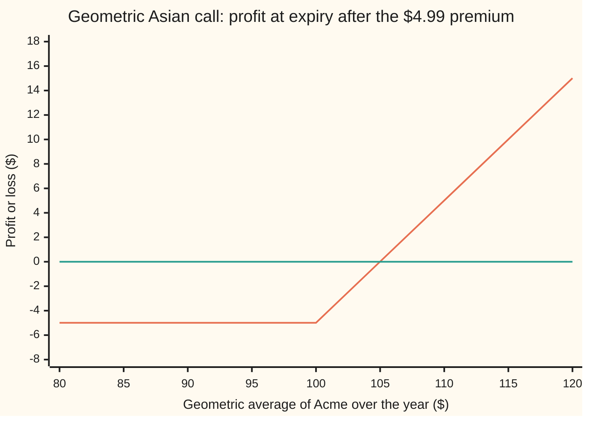
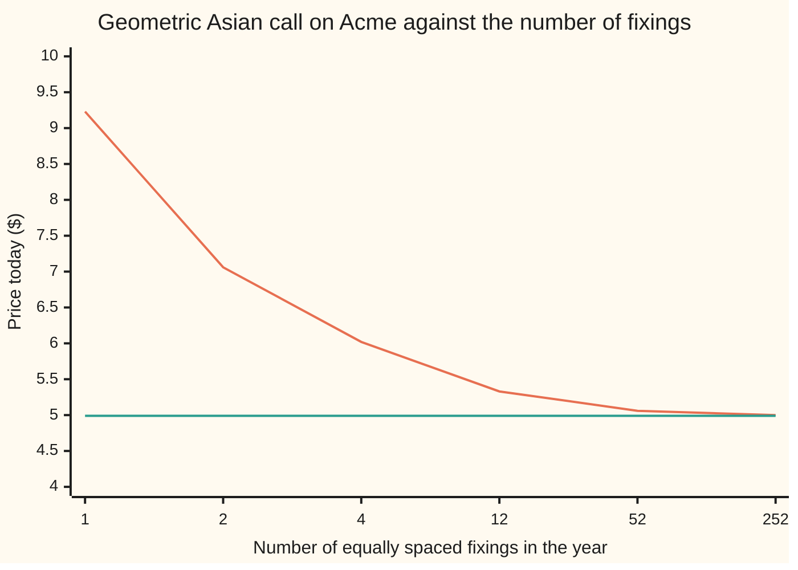

# The geometric Asian call: an average that stays lognormal, so Black-Scholes prices it with a smaller vol and a slower drift

Financial mathematics → Averages, choosers, compounds and forward-starts → Averaging the path → The geometric Asian call

---

## General Overview

Acme shares trade at $100 today. An ordinary one-year call on Acme, struck at $100, pays whatever Acme finishes above $100 on the last day. In the house market it costs $9.23.

Now change one word in the contract. Instead of the last day's price, the payoff looks at the **average** price over the whole year. A single wild closing print barely moves an average of a year of prices, so the contract is calmer, and it should cost less. A contract that settles on an average price is called an **Asian option**. Buyers who pay for fuel, metal or foreign currency week after week use them, because what they care about is the average they paid, not one day's price.

There are two ways to average. The ordinary, or **arithmetic**, average adds the prices and divides by how many there are. The **geometric** average multiplies them and takes the matching root: for the two prices 81 and 121, multiply and take the square root, 99, where the arithmetic average is 101. The geometric average never exceeds the arithmetic one. This card prices a call on the geometric average, and the answer for Acme is **$4.99**, a little over half the ordinary call.

Why bother with the geometric kind, when desks trade the arithmetic one? Because the geometric average has an exact price, and the arithmetic one does not. Taking logs turns a product into a sum, so the log of a geometric average is a plain average of log prices. In the Black-Scholes model, log prices are bell-curved, all driven by the same bell-curved shocks, and an average of such quantities is bell-curved. So the geometric average has the same kind of distribution as a single share price: lognormal. Black-Scholes prices it word for word, fed a smaller volatility and a slower growth rate. Kemna and Vorst published this in 1990, and used it to sharpen the simulated price of the arithmetic contract.

**The log of a geometric average is an average of normal quantities, so the geometric average is lognormal, and its call is a Black-Scholes call with the volatility divided by the square root of three and the growth rate cut to about half.**

**What kind of fact this is:** a theorem inside the Black-Scholes model, proved on this card in Why it works; the model itself is an assumption, not a law.

### The picture: what the holder walks away with

The geometric average over the year runs left to right. Profit after paying the $4.99 premium runs up the page. The flat line is break-even.



First line: profit after the premium, flat at −$4.99 until the average passes the $100 strike, then rising a dollar per dollar. Second line: zero. The shape is the ordinary call's hockey stick; only the horizontal axis has changed, from the last price to the average.

---

## The formula

Notation first. Write $G$ for the geometric average of Acme's price over the year, and $C_G$ for the price today of the call that pays $\max(G - K, 0)$ at the end. The continuous geometric average is the exponential of the time-average of the log price:

$$G = \exp\!\left(\frac{1}{T}\int_0^T \ln S_t\,dt\right)$$

Kemna and Vorst's result is the Black-Scholes call with two inputs replaced:

$$C_G = S\,e^{-\hat q T}\,N(d_1) \;-\; K\,e^{-rT}\,N(d_2)$$

$$\sigma_G = \frac{\sigma}{\sqrt{3}}, \qquad \hat q = \frac{r+q}{2} + \frac{\sigma^2}{12}$$

**Read it aloud:** price the average as if it were a share whose volatility is Acme's divided by √3 and whose growth is about half Acme's, then use the ordinary call formula on that share.

| Symbol | Plain meaning | In our example | Push it up and the answer… |
| --- | --- | --- | --- |
| $C_G$ | price today of the call on the geometric average | $4.99 | is the answer |
| $G$, $G_n$, $n$ | the geometric average over the year; the same average taken on $n$ fixing dates | continuous; weekly is 52 | more fixings: price falls toward the continuous $4.99 |
| $S$, $S_t$ | Acme's price today; its price at time t | $100 | rises: every path starts higher |
| $K$ | the strike the average is compared with | $100 | falls: further for the average to climb |
| $T$, $t$ | life of the contract in years; a time inside it | 1 | rises: more room for the average to travel |
| $r$, $q$ | bank rate and dividend yield, continuously compounded; $e^{-rT}$ discounts a dollar due at T | 5% and 2% | r up: rises; q up: falls |
| $\sigma$ | Acme's volatility: the spread of its yearly log return | 20% | rises: more spread in the average too |
| $\nu$, $W_t$ | the pretend-world drift of the log price, r − q − σ^2/2; the Brownian path, the random part of the log price | 0.01 | — |
| $\sigma_G$ | volatility of the average, σ divided by √3 | 0.1155 | is the vol the option sees |
| $\hat q$, $b$ | the stand-in yield that slows the average; b = r − q̂, the average's growth rate | 0.0383; 0.0117 | q̂ up: falls |
| $d_1$, $d_2$ | distances of the strike, counted in standard deviations of ln G | 0.1588; 0.0433 | — |
| $N$ | the bell-curve area to the left of a point | N(d1) 0.5631 | — |

The two distances are the Black-Scholes ones with the substitution made:

$$d_1 = \frac{\ln(S/K) + \left(r - \hat q + \tfrac12\sigma_G^2\right)T}{\sigma_G\sqrt{T}}, \qquad d_2 = d_1 - \sigma_G\sqrt{T}$$

In words: $d_2$ counts how far the average is expected to land above the strike, in units of its own spread; $d_1$ is one spread further.

The same price in forward form, the way a desk writes it. The expected average in the pretend world is $S e^{bT}$, with $b = \tfrac12(r - q) - \tfrac{1}{12}\sigma^2$:

$$C_G = e^{-rT}\left[\,S e^{bT} N(d_1) - K N(d_2)\,\right]$$

**Read it aloud:** the expected average times its share-counted chance, less the strike times its cash-counted chance, all discounted.

For $n$ equally spaced fixings, the last at T and today not counted, the log of the average has mean and variance

$$\ln S + \nu T\,\frac{n+1}{2n} \qquad\text{and}\qquad \sigma^2 T\,\frac{(n+1)(2n+1)}{6n^2},$$

and the same Black formula applies to that lognormal. At one fixing it is the vanilla call. As the fixings multiply, the two fractions fall to one half and one third, the continuous formula above.

### When it holds

- **Log prices bell-curved, with constant volatility, rates and dividends.** With a volatility smile the average sees a blend of volatilities across the year, and the single σ/√3 is wrong by roughly vega (price change per point of volatility) times the error in that blend.
- **The averaging window starts today and runs to expiry.** Part-way through a contract some prices are already fixed; the known part shifts the mean and shrinks the variance, and both must be recomputed.
- **The fixing schedule is the one priced.** A monthly-fixing contract is worth $5.33, not the continuous $4.99; use the n-fixing version for any real contract.
- **The average is geometric.** An arithmetic average of lognormal prices is not lognormal, and this formula gives only a floor under its price.
- **A fixed strike, paid in cash at T.** A floating strike, paying the last price minus the average, is a different contract with a different formula.

---

## Why it works

### Step 0: logs turn the average into a sum of normals

Taking the log of a geometric average turns a product into a sum: the log of a geometric average is the ordinary average of the log prices. In the pretend world where everything grows at the bank rate (the risk-neutral world of the Black-Scholes card), each log price is bell-curved, and all of them are built from the same bell-curved shocks. Any weighted sum of such quantities is bell-curved. So the log of the average is bell-curved, the average is lognormal, and everything Black-Scholes did for one lognormal price applies. Only the centre and the spread of the log average remain to be found.

### Step 1: the centre collects half the drift

In the pretend world the log price is a straight line plus a random path: $\ln S_t = \ln S + \nu t + \sigma W_t$. The random part has mean zero, so the centre of the log average is the average of the straight line, $\ln S$ plus the average of $\nu t$ over the year.

A line that climbs from 0 to $\nu T$ averages half its top: $\nu T/2$. So the log average is centred at $\ln S + \tfrac12\nu T$: half the drift. For Acme, ν = 0.05 − 0.02 − 0.02 = 0.01.

### Step 2: the spread is a third of the variance

Build the path from tiny independent shocks, one per instant. A shock that lands at time s lifts the log price from then on. It is in every later reading, so it enters the average with weight (T − s)/T: nearly 1 for a shock in January, nearly 0 for a shock on the last morning. The last price, by contrast, carries every shock at full weight.

Independent shocks add in variance, and a weight scales a variance by its square. The average of the squared weight over the year is

$$\frac{1}{T}\int_0^T \left(\frac{T-s}{T}\right)^2 ds = \frac{1}{3}.$$

So the log average carries a third of the variance of the last log price: $\sigma^2 T/3$, which is 0.013333 for Acme. A third of the variance is $1/\sqrt{3}$ of the volatility, which gives $\sigma_G = 0.20/\sqrt{3} = 0.1155$.

<details>
<summary>Detailed proof: the variance of the continuous and the discrete average</summary>

**Continuous.** The time integral of the Brownian path equals a weighted sum of its shocks. From $d(tW_t) = W_t\,dt + t\,dW_t$, integrating over the year gives $T W_T = \int_0^T W_t\,dt + \int_0^T t\,dW_t$. Since $W_T = \int_0^T dW_s$,
$$\int_0^T W_t\,dt = \int_0^T (T - s)\,dW_s.$$
Itô's isometry says the variance of such an integral is the integral of the squared weight: $\int_0^T (T-s)^2 ds = T^3/3$. The log average is $\ln S + \tfrac12\nu T + (\sigma/T)\int_0^T W_t\,dt$, so its variance is $(\sigma^2/T^2)(T^3/3) = \sigma^2 T/3$. The same number is the double integral of the covariance $\min(s, u)$ over the square, divided by $T^2$: the route the code takes, by brute-force summation.

**Discrete.** With fixings at $t_i = iT/n$, the shock in step k appears in the $n - k + 1$ fixings at or after it, so the log average is $\ln S + \nu T(n+1)/(2n)$ plus $(\sigma\sqrt{T/n}/n)\sum_{k=1}^n (n-k+1)\varepsilon_k$, with the $\varepsilon_k$ independent standard normals. The mean uses $1 + 2 + \dots + n = n(n+1)/2$. The variance is $(\sigma^2 T/n^3)\sum_{m=1}^n m^2 = \sigma^2 T (n+1)(2n+1)/(6n^2)$, using $\sum m^2 = n(n+1)(2n+1)/6$. As n grows the fraction tends to $2n^2/6n^2 = 1/3$. At $n = 1$ it is 1, the last price.

</details>

### Step 3: match the average to a stand-in share

A Black-Scholes share with yield $\hat q$ and volatility $\sigma_G$ has, at T, a log price centred at $\ln S + (r - \hat q - \tfrac12\sigma_G^2)T$ with variance $\sigma_G^2 T$. The variances already match. Setting the centres equal:

$$r - \hat q = \tfrac12\nu + \tfrac12\sigma_G^2 = \tfrac12(r - q) - \tfrac14\sigma^2 + \tfrac16\sigma^2 = \tfrac12(r - q) - \tfrac{1}{12}\sigma^2.$$

That is the growth rate b of the average: half the stock's carry, less a variance term. The −σ^2/12 comes from the −σ^2/2 inside the log drift being halved, then partly given back by the smaller volatility's own +σ_G^2/2. Rearranged, $\hat q = \tfrac12(r + q) + \tfrac{1}{12}\sigma^2$: 0.0383 for Acme.

### Step 4: price it as Black-Scholes

The average now has exactly the law of that stand-in share at T. The call on it is the Black-Scholes integral done on [black-scholes-call](../08-The%20Black-Scholes%20call%20and%20put/01-black-scholes-call.md), term for term: split the payoff into "receive the average" and "hand over the strike" on the event that the average ends above K; the cash half is $K e^{-rT} N(d_2)$, and counting in units of the average slides the bell curve by one spread, giving $S e^{-\hat q T} N(d_1)$. Nothing is approximated. Given the model, the price is exact.

### Step 5: fixing dates move it toward the vanilla

A real contract reads the price on dates, not continuously. The discrete mean and variance of Step 2's proof feed the same formula. Fewer fixings mean each reading carries more of the late shocks, so the average is jumpier and the call dearer:



First line: the n-fixing price, from the vanilla $9.23 at one fixing, through $5.33 monthly and $5.06 weekly, to $5.00 on daily fixings. Second line: the continuous Kemna-Vorst price, $4.99, the floor they approach.

Two other routes reach the same price: the hedging argument with an extra state, the running integral of the log price, gives a pricing equation whose solution is this formula; and simulation, as on [monte-carlo-pricing](../06-Numerical%20Methods%20for%20Pricing/01-monte-carlo-pricing.md), averages the payoff over simulated paths. The code below takes the simulation road.

---

## Worked numbers, by hand

Acme: S = K = 100, r = 5%, q = 2%, σ = 20%, T = 1 year, continuous averaging.

| Step | Arithmetic | Value |
| --- | --- | --- |
| volatility of the average, $\sigma_G$ | 0.20 / √3 | 0.1155 |
| stand-in yield, $\hat q$ | (0.05 + 0.02)/2 + 0.04/12 | 0.0383 |
| growth rate of the average, b | 0.05 − 0.0383 | 0.0117 |
| expected average | 100 × e^0.0117 | $101.17 |
| $d_1$ | (0 + 0.0117 + 0.1155^2/2) / 0.1155 | 0.1588 |
| $d_2$ | 0.1588 − 0.1155 | 0.0433 |
| N(d1), N(d2) | bell-curve table | 0.5631, 0.5173 |
| average half | 100 × e^−0.0383 × 0.5631 | $54.19 |
| cash half | 100 × e^−0.05 × 0.5173 | $49.20 |
| **premium** | 54.19 − 49.20 | **$4.99** |

A one-year call on Acme's geometric average costs $4.99, against $9.23 for the call on the last price. The cut comes from both substitutions: a volatility of 11.5 percent instead of 20, and an expected average of $101.17 instead of the $103.05 forward.

### What breaks if you drop a piece

Same contract, right answer $4.99. Every wrong number below is printed by both checks.

| Mistake | Comes out at | What went wrong |
| --- | --- | --- |
| Keep Acme's raw 20% volatility | $8.19 | The average is calmer than the last price; only a third of the variance survives |
| Divide the volatility by √3 but keep the yield at q | $6.04 | The average grows about half as fast as Acme; the carry must move too |
| Drop the −σ^2/12 from the yield | $5.17 | Halving the drift of the log is not halving the drift of the price |
| Treat 52 weekly fixings as independent, σ/√52 | $1.71 | The readings share every early shock; the factor tends to 1/√3, not to zero |
| Use the continuous formula on a monthly contract | $4.99 (right: $5.33) | Twelve readings are jumpier than a continuum |

### The Greeks

Sensitivities by bumping the formula, the house way of stating a product's risks. Their behaviour through the life of a contract, once some prices are fixed, is on [asian-greeks-and-implied-volatility](03-asian-greeks-and-implied-volatility.md).

| Greek | Plain meaning | Value |
| --- | --- | --- |
| delta | dollars gained per $1 on Acme today; equals e^(−q̂T) N(d1) | 0.5419 |
| gamma | change in delta per $1 on Acme | 0.0328 |
| vega | dollars per one point of Acme's volatility | 0.2008 |
| rho | dollars per one point of the bank rate | 0.2211 |

Theta is left to the Greeks card: as a live contract ages, its fixed prices change the law of the average, so the time decay of a fresh contract is not the right number.

---

## Code, from first principles, and it actually runs

Both programs price the continuous contract four ways and the weekly contract three ways. Road 1 is the Kemna-Vorst formula. Road 2 builds the law of the log average by brute force, summing the covariance min(s, u) of the Brownian path on a grid, with no 1/3 written anywhere, then averages the payoff over that bell curve by Simpson's rule, with no d1 and no d2. Road 3 simulates 100,000 paths of 52 weekly steps; inside each week, given the two end prices, the integral of the log price is the trapezoid plus an independent normal with variance σ^2h^3/12 (h is the week's length), so the continuous average is simulated exactly, not approximated. Road 4 prices the put by Simpson and checks the two against parity. The same paths give the arithmetic weekly average, for comparison. The normal CDF is a written-out series, and the random numbers come from a written-out generator (splitmix64 with the Box-Muller transform).

### Python

```python
# The geometric Asian call (Kemna-Vorst) -- the check behind the card.  Standard library only.
# Nothing imported knows the answer: the normal CDF is a series written out, the integrals
# are Simpson's rule and brute-force sums, the random numbers are splitmix64 + Box-Muller.
from math import log, sqrt, exp, cos, sin, pi

def phi(x): return exp(-0.5 * x * x) / sqrt(2.0 * pi)           # bell-curve height
def N(x):                                                       # bell-curve area left of x
    if x < -9.0: return 0.0
    if x > 9.0: return 1.0
    term = total = x; k = 1
    while abs(term) > 1e-17 * abs(total):
        k += 2; term *= x * x / k; total += term
    return 0.5 + phi(x) * total

def bs_call(S, K, r, q, sig, T):                               # the plain Black-Scholes call
    d1 = (log(S / K) + (r - q + 0.5 * sig * sig) * T) / (sig * sqrt(T))
    return S * exp(-q * T) * N(d1) - K * exp(-r * T) * N(d1 - sig * sqrt(T))

def kv_call(S, K, r, q, sig, T):                               # road 1: Kemna-Vorst substitution
    return bs_call(S, K, r, 0.5 * (r + q) + sig * sig / 12.0, sig / sqrt(3.0), T)

def fixings_call(S, K, r, q, sig, T, n):                       # n equal fixings, the last at T
    m = log(S) + (r - q - 0.5 * sig * sig) * T * (n + 1) / (2 * n)
    v = sig * sig * T * (n + 1) * (2 * n + 1) / (6.0 * n * n)
    d2 = (m - log(K)) / sqrt(v)
    return exp(-r * T) * (exp(m + 0.5 * v) * N(d2 + sqrt(v)) - K * N(d2))

def simpson_price(m, v, payoff, r, T, panels=200000):           # average payoff over ln G ~ normal(m, v)
    a, b = -10.0, 10.0; h = (b - a) / panels
    f = lambda z: payoff(exp(m + sqrt(v) * z)) * phi(z)
    tot = f(a) + f(b)
    for i in range(1, panels):
        tot += (4 if i % 2 else 2) * f(a + i * h)
    return exp(-r * T) * tot * h / 3.0

S, K, r, q, sig, T = 100.0, 100.0, 0.05, 0.02, 0.20, 1.0
nu, sigG, qhat = r - q - 0.5 * sig * sig, sig / sqrt(3.0), 0.5 * (r + q) + sig * sig / 12.0
b = r - qhat
d1 = (log(S / K) + (b + 0.5 * sigG * sigG) * T) / (sigG * sqrt(T)); d2 = d1 - sigG * sqrt(T)
C = kv_call(S, K, r, q, sig, T)

# road 2: the law of ln G by brute force -- covariance min(s, u) summed on a grid, no 1/3 anywhere
def cov_sum(m):
    h = T / m; s = [(i + 0.5) * h for i in range(m)]
    return sum(min(x, y) for x in s for y in s) * h * h / (T * T)
var_c = sig * sig * (4.0 * cov_sum(1200) - cov_sum(600)) / 3.0   # Richardson: error is exactly c/m^2
mean_c = log(S) + nu * sum((i + 0.5) / 1000 * T for i in range(1000)) / 1000
C_simp = simpson_price(mean_c, var_c, lambda G: max(G - K, 0.0), r, T)
P_simp = simpson_price(mean_c, var_c, lambda G: max(K - G, 0.0), r, T)
ts = [T * i / 52 for i in range(1, 53)]                                   # weekly fixings
var_w = sig * sig * sum(min(x, y) for x in ts for y in ts) / 52 ** 2
C_w_simp = simpson_price(log(S) + nu * sum(ts) / 52, var_w, lambda G: max(G - K, 0.0), r, T)
C_w = fixings_call(S, K, r, q, sig, T, 52)

# road 3: simulation.  Exact continuous average: over each week, given both ends, the integral
# of the log price is the trapezoid plus an independent normal with variance sig^2 h^3 / 12.
MASK = (1 << 64) - 1
state = 20260924
def uniform():
    global state
    state = (state + 0x9E3779B97F4A7C15) & MASK
    z = state
    z = ((z ^ (z >> 30)) * 0xBF58476D1CE4E5B9) & MASK
    z = ((z ^ (z >> 27)) * 0x94D049BB133111EB) & MASK
    return (((z ^ (z >> 31)) >> 11) + 1) * 2.0 ** -53
paths, steps = 100000, 52
h = T / steps; sh, sb = sig * sqrt(h), sig * sqrt(h ** 3 / 12.0)
disc = exp(-r * T)
acc = {"c": [0.0, 0.0], "w": [0.0, 0.0], "a": [0.0, 0.0]}; am_below_gm = 0
for _ in range(paths):
    x = log(S); integral = 0.0; sum_log = 0.0; sum_price = 0.0
    for _ in range(steps):
        rad = sqrt(-2.0 * log(uniform())); ang = 2.0 * pi * uniform()
        x_new = x + nu * h + sh * rad * cos(ang)
        integral += 0.5 * h * (x + x_new) + sb * rad * sin(ang)
        x = x_new; sum_log += x; sum_price += exp(x)
    gc, gw, aw = exp(integral / T), exp(sum_log / steps), sum_price / steps
    am_below_gm += aw < gw
    for key, avg in (("c", gc), ("w", gw), ("a", aw)):
        pay = disc * max(avg - K, 0.0); acc[key][0] += pay; acc[key][1] += pay * pay
mc = {k: (s1 / paths, sqrt((s2 / paths - (s1 / paths) ** 2) / paths)) for k, (s1, s2) in acc.items()}

# Greeks by bumping the formula, and the delta it predicts
bump = lambda **kw: kv_call(**{**dict(S=S, K=K, r=r, q=q, sig=sig, T=T), **kw})
delta = (bump(S=S + 0.01) - bump(S=S - 0.01)) / 0.02
gamma = (bump(S=S + 0.5) - 2 * C + bump(S=S - 0.5)) / 0.25
vega = (bump(sig=sig + 1e-4) - bump(sig=sig - 1e-4)) / 2e-4 / 100
rho = (bump(r=r + 1e-4) - bump(r=r - 1e-4)) / 2e-4 / 100

rows = [("toy: sqrt(81*121), vs (81+121)/2 = 101", sqrt(81.0 * 121.0)), ("nu = r - q - sigma^2/2", nu),
        ("forward S e^((r-q)T)", S * exp((r - q) * T)), ("sigma_G = sigma / sqrt 3", sigG), ("qhat = (r+q)/2 + sigma^2/12", qhat),
        ("b = r - qhat, carry of the average", b), ("E[G] = S e^(bT)", S * exp(b * T)),
        ("d1", d1), ("d2", d2), ("N(d1)", N(d1)), ("N(d2)", N(d2)),
        ("average half S e^-qhatT N(d1)", S * exp(-qhat * T) * N(d1)),
        ("cash half K e^-rT N(d2)", K * exp(-r * T) * N(d2)),
        ("1 Kemna-Vorst formula", C), ("2 var ln G, min(s,u) summed", var_c),
        ("  sigma^2 T / 3", sig * sig * T / 3), ("2 Simpson over that law", C_simp),
        ("3 simulation, 100000 paths", mc["c"][0]), ("  standard error", mc["c"][1]),
        ("4 put by Simpson", P_simp), ("  C - P", C_simp - P_simp),
        ("  e^-rT (E[G] - K)", disc * (S * exp(b * T) - K)),
        ("weekly: formula, 52 fixings", C_w), ("weekly: var ln G, 52x52 sum", var_w),
        ("weekly: Simpson over that law", C_w_simp), ("weekly: simulation", mc["w"][0]),
        ("  standard error", mc["w"][1]), ("arithmetic weekly: simulation", mc["a"][0]),
        ("  paths where AM < GM", am_below_gm), ("vanilla Black-Scholes call", bs_call(S, K, r, q, sig, T))]
rows += [(f"ladder: {n} fixings", fixings_call(S, K, r, q, sig, T, n)) for n in (1, 2, 4, 12, 52, 252, 10000)]
rows += [("delta by bump", delta), ("  e^-qhatT N(d1)", exp(-qhat * T) * N(d1)), ("gamma by bump", gamma),
         ("vega per vol point", vega), ("rho per rate point", rho)]
rows += [("wrong: raw sigma, qhat kept", bs_call(S, K, r, qhat, sig, T)),
         ("wrong: sigma/sqrt3, yield q kept", bs_call(S, K, r, q, sigG, T)),
         ("wrong: no -sigma^2/12 in qhat", bs_call(S, K, r, 0.5 * (r + q), sigG, T)),
         ("wrong: weekly as independent, sigma/sqrt52", bs_call(S, K, r, qhat, sig / sqrt(52), T))]
rows += [("try: sigma = 0.40", kv_call(S, K, r, q, 0.40, T)), ("try: K = 90", kv_call(S, 90.0, r, q, sig, T)),
         ("try: T = 2", kv_call(S, K, r, q, sig, 2.0)), ("try: q = 0", kv_call(S, K, r, 0.0, sig, T))]
for name, v in rows:
    print(f"{name:<42} {v:>12.6f}" if isinstance(v, float) else f"{name:<42} {v:>12}")
grid = [80.0 + 5.0 * i for i in range(9)]
print("chart, G at expiry " + " ".join(f"{g:6.0f}" for g in grid))
print("chart, profit      " + " ".join(f"{max(g - K, 0.0) - C:6.2f}" for g in grid))
fix = (1, 2, 4, 12, 52, 252)
print("chart, fixings     " + " ".join(f"{n:6d}" for n in fix))
print("chart, price       " + " ".join(f"{fixings_call(S, K, r, q, sig, T, n):6.2f}" for n in fix))

assert abs(C_simp - C) < 1e-7, "brute-force law of ln G must reproduce the formula"
assert abs(mc["c"][0] - C) < 3 * mc["c"][1], "exact-average simulation within 3 standard errors"
assert abs(C_w_simp - C_w) < 1e-7, "weekly: covariance sum and Simpson vs the fixings formula"
assert abs(mc["w"][0] - C_w) < 3 * mc["w"][1], "weekly simulation within 3 standard errors"
assert abs((C_simp - P_simp) - disc * (S * exp(b * T) - K)) < 1e-7, "parity with an independently priced put"
assert abs(fixings_call(S, K, r, q, sig, T, 1) - 9.227005508154) < 1e-9, "one fixing is the vanilla"
assert abs(delta - exp(-qhat * T) * N(d1)) < 1e-6, "bumped delta vs e^-qhatT N(d1)"
print("ALL CHECKS PASS")
```

**Ran 2026-09-24 on macOS, Python 3.14.6, standard library only. All checks passed. Output, pasted from the run:**

```
toy: sqrt(81*121), vs (81+121)/2 = 101        99.000000
nu = r - q - sigma^2/2                         0.010000
forward S e^((r-q)T)                         103.045453
sigma_G = sigma / sqrt 3                       0.115470
qhat = (r+q)/2 + sigma^2/12                    0.038333
b = r - qhat, carry of the average             0.011667
E[G] = S e^(bT)                              101.173499
d1                                             0.158771
d2                                             0.043301
N(d1)                                          0.563075
N(d2)                                          0.517269
average half S e^-qhatT N(d1)                 54.189939
cash half K e^-rT N(d2)                       49.204179
1 Kemna-Vorst formula                          4.985760
2 var ln G, min(s,u) summed                    0.013333
  sigma^2 T / 3                                0.013333
2 Simpson over that law                        4.985760
3 simulation, 100000 paths                     4.993099
  standard error                               0.023100
4 put by Simpson                               3.869493
  C - P                                        1.116267
  e^-rT (E[G] - K)                             1.116267
weekly: formula, 52 fixings                    5.064562
weekly: var ln G, 52x52 sum                    0.013720
weekly: Simpson over that law                  5.064562
weekly: simulation                             5.071524
  standard error                               0.023472
arithmetic weekly: simulation                  5.264758
  paths where AM < GM                                 0
vanilla Black-Scholes call                     9.227006
ladder: 1 fixings                              9.227006
ladder: 2 fixings                              7.063568
ladder: 4 fixings                              6.016111
ladder: 12 fixings                             5.327706
ladder: 52 fixings                             5.064562
ladder: 252 fixings                            5.002016
ladder: 10000 fixings                          4.986169
delta by bump                                  0.541899
  e^-qhatT N(d1)                               0.541899
gamma by bump                                  0.032829
vega per vol point                             0.200828
rho per rate point                             0.221092
wrong: raw sigma, qhat kept                    8.192594
wrong: sigma/sqrt3, yield q kept               6.043680
wrong: no -sigma^2/12 in qhat                  5.168520
wrong: weekly as independent, sigma/sqrt52     1.709075
try: sigma = 0.40                              8.831264
try: K = 90                                   11.478705
try: T = 2                                     7.086337
try: q = 0                                     5.546819
chart, G at expiry     80     85     90     95    100    105    110    115    120
chart, profit       -4.99  -4.99  -4.99  -4.99  -4.99   0.01   5.01  10.01  15.01
chart, fixings          1      2      4     12     52    252
chart, price         9.23   7.06   6.02   5.33   5.06   5.00
ALL CHECKS PASS
```

Four roads, one price. The brute-force law gives variance 0.013333, which is σ^2/3, and the Simpson price lands on $4.985760 to six decimals. The exact-average simulation gives $4.993099 with a standard error of 0.023100, well inside one standard error. Weekly, the formula and the covariance sum agree at $5.064562, and the simulation gives $5.071524. The put priced on its own satisfies parity: 1.116267 both ways. The arithmetic weekly average, on the same paths, prices at $5.264758 and never sat below the geometric one.

### Rust

The same checks, the same generator, the same inputs. No crates.

```rust
// The geometric Asian call (Kemna-Vorst) -- the same check as the Python, in Rust.  std only.
// Normal CDF as a written-out series, Simpson's rule, brute-force sums, splitmix64 + Box-Muller.
// Compile: rustc --edition 2021 -O geometric_asian_kemna_vorst_check.rs -o /tmp/gakv
use std::f64::consts::PI;

fn phi(x: f64) -> f64 { (-0.5 * x * x).exp() / (2.0 * PI).sqrt() }
fn n_cdf(x: f64) -> f64 {
    if x < -9.0 { return 0.0; }
    if x > 9.0 { return 1.0; }
    let (mut term, mut total, mut k) = (x, x, 1.0);
    while term.abs() > 1e-17 * total.abs() {
        k += 2.0; term *= x * x / k; total += term;
    }
    0.5 + phi(x) * total
}
fn bs_call(s: f64, k: f64, r: f64, q: f64, sig: f64, t: f64) -> f64 {
    let d1 = ((s / k).ln() + (r - q + 0.5 * sig * sig) * t) / (sig * t.sqrt());
    s * (-q * t).exp() * n_cdf(d1) - k * (-r * t).exp() * n_cdf(d1 - sig * t.sqrt())
}
fn kv_call(s: f64, k: f64, r: f64, q: f64, sig: f64, t: f64) -> f64 {
    bs_call(s, k, r, 0.5 * (r + q) + sig * sig / 12.0, sig / 3f64.sqrt(), t)
}
fn fixings_call(s: f64, k: f64, r: f64, q: f64, sig: f64, t: f64, n: f64) -> f64 {
    let m = s.ln() + (r - q - 0.5 * sig * sig) * t * (n + 1.0) / (2.0 * n);
    let v = sig * sig * t * (n + 1.0) * (2.0 * n + 1.0) / (6.0 * n * n);
    let d2 = (m - k.ln()) / v.sqrt();
    (-r * t).exp() * ((m + 0.5 * v).exp() * n_cdf(d2 + v.sqrt()) - k * n_cdf(d2))
}
fn simpson_price(m: f64, v: f64, payoff: &dyn Fn(f64) -> f64, r: f64, t: f64) -> f64 {
    let (a, b, panels) = (-10.0, 10.0, 200000);
    let h = (b - a) / panels as f64;
    let f = |z: f64| payoff((m + v.sqrt() * z).exp()) * phi(z);
    let mut tot = f(a) + f(b);
    for i in 1..panels { tot += (if i % 2 == 1 { 4.0 } else { 2.0 }) * f(a + i as f64 * h); }
    (-r * t).exp() * tot * h / 3.0
}
fn cov_sum(m: usize, t: f64) -> f64 {
    let h = t / m as f64;
    let s: Vec<f64> = (0..m).map(|i| (i as f64 + 0.5) * h).collect();
    let mut tot = 0.0;
    for x in &s { for y in &s { tot += x.min(*y); } }
    tot * h * h / (t * t)
}
struct Rng(u64);
impl Rng {
    fn uniform(&mut self) -> f64 {
        self.0 = self.0.wrapping_add(0x9E3779B97F4A7C15);
        let mut z = self.0;
        z = (z ^ (z >> 30)).wrapping_mul(0xBF58476D1CE4E5B9);
        z = (z ^ (z >> 27)).wrapping_mul(0x94D049BB133111EB);
        (((z ^ (z >> 31)) >> 11) + 1) as f64 * 2f64.powi(-53)
    }
}

fn main() {
    let (s, k, r, q, sig, t) = (100.0f64, 100.0f64, 0.05f64, 0.02f64, 0.20f64, 1.0f64);
    let (nu, sig_g, qhat) = (r - q - 0.5 * sig * sig, sig / 3f64.sqrt(), 0.5 * (r + q) + sig * sig / 12.0);
    let b = r - qhat;
    let d1 = ((s / k).ln() + (b + 0.5 * sig_g * sig_g) * t) / (sig_g * t.sqrt());
    let d2 = d1 - sig_g * t.sqrt();
    let c = kv_call(s, k, r, q, sig, t);
    let disc = (-r * t).exp();
    let call_pay = |g: f64| (g - k).max(0.0);
    let put_pay = |g: f64| (k - g).max(0.0);
    // road 2: the law of ln G by brute force
    let var_c = sig * sig * (4.0 * cov_sum(1200, t) - cov_sum(600, t)) / 3.0;
    let mean_c = s.ln() + nu * (0..1000).map(|i| (i as f64 + 0.5) / 1000.0 * t).sum::<f64>() / 1000.0;
    let c_simp = simpson_price(mean_c, var_c, &call_pay, r, t);
    let p_simp = simpson_price(mean_c, var_c, &put_pay, r, t);
    let ts: Vec<f64> = (1..=52).map(|i| t * i as f64 / 52.0).collect();
    let mut cw = 0.0;
    for x in &ts { for y in &ts { cw += x.min(*y); } }
    let var_w = sig * sig * cw / (52.0 * 52.0);
    let c_w_simp = simpson_price(s.ln() + nu * ts.iter().sum::<f64>() / 52.0, var_w, &call_pay, r, t);
    let c_w = fixings_call(s, k, r, q, sig, t, 52.0);
    // road 3: simulation with the exact continuous average (trapezoid plus bridge noise)
    let mut rng = Rng(20260924);
    let (paths, steps) = (100000usize, 52usize);
    let h = t / steps as f64;
    let (sh, sb) = (sig * h.sqrt(), sig * (h.powi(3) / 12.0).sqrt());
    let mut acc = [[0.0f64; 2]; 3];
    let mut am_below_gm = 0u64;
    for _ in 0..paths {
        let (mut x, mut integral, mut sum_log, mut sum_price) = (s.ln(), 0.0, 0.0, 0.0);
        for _ in 0..steps {
            let rad = (-2.0 * rng.uniform().ln()).sqrt();
            let ang = 2.0 * PI * rng.uniform();
            let x_new = x + nu * h + sh * rad * ang.cos();
            integral += 0.5 * h * (x + x_new) + sb * rad * ang.sin();
            x = x_new; sum_log += x; sum_price += x.exp();
        }
        let (gc, gw, aw) = ((integral / t).exp(), (sum_log / steps as f64).exp(), sum_price / steps as f64);
        if aw < gw { am_below_gm += 1; }
        for (i, avg) in [gc, gw, aw].iter().enumerate() {
            let pay = disc * (avg - k).max(0.0);
            acc[i][0] += pay; acc[i][1] += pay * pay;
        }
    }
    let np = paths as f64;
    let mc: Vec<(f64, f64)> = acc.iter().map(|a| (a[0] / np, ((a[1] / np - (a[0] / np).powi(2)) / np).sqrt())).collect();
    // Greeks by bumping the formula
    let delta = (kv_call(s + 0.01, k, r, q, sig, t) - kv_call(s - 0.01, k, r, q, sig, t)) / 0.02;
    let gamma = (kv_call(s + 0.5, k, r, q, sig, t) - 2.0 * c + kv_call(s - 0.5, k, r, q, sig, t)) / 0.25;
    let vega = (kv_call(s, k, r, q, sig + 1e-4, t) - kv_call(s, k, r, q, sig - 1e-4, t)) / 2e-4 / 100.0;
    let rho = (kv_call(s, k, r + 1e-4, q, sig, t) - kv_call(s, k, r - 1e-4, q, sig, t)) / 2e-4 / 100.0;
    let delta_an = (-qhat * t).exp() * n_cdf(d1);

    let mut rows: Vec<(String, f64)> = vec![
        ("toy: sqrt(81*121), vs (81+121)/2 = 101", (81.0f64 * 121.0).sqrt()), ("nu = r - q - sigma^2/2", nu),
        ("forward S e^((r-q)T)", s * ((r - q) * t).exp()), ("sigma_G = sigma / sqrt 3", sig_g), ("qhat = (r+q)/2 + sigma^2/12", qhat),
        ("b = r - qhat, carry of the average", b), ("E[G] = S e^(bT)", s * (b * t).exp()),
        ("d1", d1), ("d2", d2), ("N(d1)", n_cdf(d1)), ("N(d2)", n_cdf(d2)),
        ("average half S e^-qhatT N(d1)", s * (-qhat * t).exp() * n_cdf(d1)),
        ("cash half K e^-rT N(d2)", k * (-r * t).exp() * n_cdf(d2)),
        ("1 Kemna-Vorst formula", c), ("2 var ln G, min(s,u) summed", var_c),
        ("  sigma^2 T / 3", sig * sig * t / 3.0), ("2 Simpson over that law", c_simp),
        ("3 simulation, 100000 paths", mc[0].0), ("  standard error", mc[0].1),
        ("4 put by Simpson", p_simp), ("  C - P", c_simp - p_simp),
        ("  e^-rT (E[G] - K)", disc * (s * (b * t).exp() - k)),
        ("weekly: formula, 52 fixings", c_w), ("weekly: var ln G, 52x52 sum", var_w),
        ("weekly: Simpson over that law", c_w_simp), ("weekly: simulation", mc[1].0),
        ("  standard error", mc[1].1), ("arithmetic weekly: simulation", mc[2].0),
    ].into_iter().map(|(a, v)| (a.to_string(), v)).collect();
    rows.push(("  paths where AM < GM".to_string(), f64::NAN));
    rows.push(("vanilla Black-Scholes call".to_string(), bs_call(s, k, r, q, sig, t)));
    for n in [1.0, 2.0, 4.0, 12.0, 52.0, 252.0, 10000.0] {
        rows.push((format!("ladder: {} fixings", n), fixings_call(s, k, r, q, sig, t, n)));
    }
    for (a, v) in [
        ("delta by bump", delta), ("  e^-qhatT N(d1)", delta_an), ("gamma by bump", gamma),
        ("vega per vol point", vega), ("rho per rate point", rho),
        ("wrong: raw sigma, qhat kept", bs_call(s, k, r, qhat, sig, t)),
        ("wrong: sigma/sqrt3, yield q kept", bs_call(s, k, r, q, sig_g, t)),
        ("wrong: no -sigma^2/12 in qhat", bs_call(s, k, r, 0.5 * (r + q), sig_g, t)),
        ("wrong: weekly as independent, sigma/sqrt52", bs_call(s, k, r, qhat, sig / 52f64.sqrt(), t)),
        ("try: sigma = 0.40", kv_call(s, k, r, q, 0.40, t)), ("try: K = 90", kv_call(s, 90.0, r, q, sig, t)),
        ("try: T = 2", kv_call(s, k, r, q, sig, 2.0)), ("try: q = 0", kv_call(s, k, r, 0.0, sig, t)),
    ] { rows.push((a.to_string(), v)); }
    for (name, v) in &rows {
        if v.is_nan() { println!("{:<42} {:>12}", name, am_below_gm); } else { println!("{:<42} {:>12.6}", name, v); }
    }
    let grid: Vec<f64> = (0..9).map(|i| 80.0 + 5.0 * i as f64).collect();
    println!("chart, G at expiry {}", grid.iter().map(|g| format!("{:6.0}", g)).collect::<Vec<_>>().join(" "));
    println!("chart, profit      {}", grid.iter().map(|g| format!("{:6.2}", (g - k).max(0.0) - c)).collect::<Vec<_>>().join(" "));
    let fix = [1.0f64, 2.0, 4.0, 12.0, 52.0, 252.0];
    println!("chart, fixings     {}", fix.iter().map(|n| format!("{:6}", n)).collect::<Vec<_>>().join(" "));
    println!("chart, price       {}", fix.iter().map(|n| format!("{:6.2}", fixings_call(s, k, r, q, sig, t, *n))).collect::<Vec<_>>().join(" "));

    assert!((c_simp - c).abs() < 1e-7, "brute-force law of ln G must reproduce the formula");
    assert!((mc[0].0 - c).abs() < 3.0 * mc[0].1, "exact-average simulation within 3 standard errors");
    assert!((c_w_simp - c_w).abs() < 1e-7, "weekly: covariance sum and Simpson vs the fixings formula");
    assert!((mc[1].0 - c_w).abs() < 3.0 * mc[1].1, "weekly simulation within 3 standard errors");
    assert!(((c_simp - p_simp) - disc * (s * (b * t).exp() - k)).abs() < 1e-7, "parity with an independently priced put");
    assert!((fixings_call(s, k, r, q, sig, t, 1.0) - 9.227005508154).abs() < 1e-9, "one fixing is the vanilla");
    assert!((delta - delta_an).abs() < 1e-6, "bumped delta vs e^-qhatT N(d1)");
    println!("ALL CHECKS PASS");
}
```

**Ran 2026-09-24 on macOS, rustc 1.98.1, no crates. All checks passed. Output, pasted from the run:**

```
toy: sqrt(81*121), vs (81+121)/2 = 101        99.000000
nu = r - q - sigma^2/2                         0.010000
forward S e^((r-q)T)                         103.045453
sigma_G = sigma / sqrt 3                       0.115470
qhat = (r+q)/2 + sigma^2/12                    0.038333
b = r - qhat, carry of the average             0.011667
E[G] = S e^(bT)                              101.173499
d1                                             0.158771
d2                                             0.043301
N(d1)                                          0.563075
N(d2)                                          0.517269
average half S e^-qhatT N(d1)                 54.189939
cash half K e^-rT N(d2)                       49.204179
1 Kemna-Vorst formula                          4.985760
2 var ln G, min(s,u) summed                    0.013333
  sigma^2 T / 3                                0.013333
2 Simpson over that law                        4.985760
3 simulation, 100000 paths                     4.993099
  standard error                               0.023100
4 put by Simpson                               3.869493
  C - P                                        1.116267
  e^-rT (E[G] - K)                             1.116267
weekly: formula, 52 fixings                    5.064562
weekly: var ln G, 52x52 sum                    0.013720
weekly: Simpson over that law                  5.064562
weekly: simulation                             5.071524
  standard error                               0.023472
arithmetic weekly: simulation                  5.264758
  paths where AM < GM                                 0
vanilla Black-Scholes call                     9.227006
ladder: 1 fixings                              9.227006
ladder: 2 fixings                              7.063568
ladder: 4 fixings                              6.016111
ladder: 12 fixings                             5.327706
ladder: 52 fixings                             5.064562
ladder: 252 fixings                            5.002016
ladder: 10000 fixings                          4.986169
delta by bump                                  0.541899
  e^-qhatT N(d1)                               0.541899
gamma by bump                                  0.032829
vega per vol point                             0.200828
rho per rate point                             0.221092
wrong: raw sigma, qhat kept                    8.192594
wrong: sigma/sqrt3, yield q kept               6.043680
wrong: no -sigma^2/12 in qhat                  5.168520
wrong: weekly as independent, sigma/sqrt52     1.709075
try: sigma = 0.40                              8.831264
try: K = 90                                   11.478705
try: T = 2                                     7.086337
try: q = 0                                     5.546819
chart, G at expiry     80     85     90     95    100    105    110    115    120
chart, profit       -4.99  -4.99  -4.99  -4.99  -4.99   0.01   5.01  10.01  15.01
chart, fixings          1      2      4     12     52    252
chart, price         9.23   7.06   6.02   5.33   5.06   5.00
ALL CHECKS PASS
```

The two outputs agree line for line, simulation included: both languages run the same generator from the same seed.

> [!TIP]
> **Try changing**
> Guess the direction first.
> - **Double the volatility.** Set `sig = 0.40` in `kv_call`. The call rises from $4.99 to **$8.83**. Volatility still matters most, but at a third of the variance.
> - **Lower the strike.** Set `K = 90`. The call is worth **$11.48**: most of it is the gap between the expected average and the lower strike.
> - **Lengthen the contract.** Set `T = 2`. The call is **$7.09**, less than one and a half times the one-year price, because spread grows with the square root of time.
> - **Remove the dividend.** Set `q = 0`. The call is **$5.55**: without the dividend the price grows faster, and the average with it.

---

## The usual mistake

> [!warning]
> **Pricing a traded Asian with this formula.** Desks settle on arithmetic averages. The arithmetic average is never below the geometric one, path by path, so this formula gives a floor, not a price. On the weekly paths above, the arithmetic call simulates at $5.26 and the geometric at $5.07. The arithmetic call has no exact formula at all; its pricing is the next card.
>
> Smaller traps:
> - **Shrinking the volatility and nothing else.** Divide σ by √3 but leave the yield at q and the call comes out at $6.04. The average also grows more slowly, and the yield must move to $\hat q$.
> - **Forgetting the −σ^2/12.** Halving the carry without the variance term gives $5.17. The term is small, but it is the difference between halving the log drift and halving the price drift.
> - **Treating fixings as independent.** Fifty-two readings are not fifty-two separate coins: each shares all the earlier shocks. σ/√52 prices the weekly contract at $1.71 against the right $5.06.
> - **Using the continuous price on a monthly contract.** $4.99 against the right $5.33. Match the fixing count, and check whether today's price counts as a fixing: it changes both the mean and the variance.

---

## Where you meet it in real life

- **Control variates for arithmetic Asians.** Simulate the arithmetic and the geometric call on the same paths; the geometric one's simulation error is known exactly, because its true price is this formula, and subtracting it removes most of the arithmetic one's error. That was Kemna and Vorst's purpose, and it is the main use today: [arithmetic-asian-options](02-arithmetic-asian-options.md).
- **Commodity and currency hedges.** An airline buying fuel weekly hedges with an option on the average price. The contract is arithmetic, but the geometric price is the first sanity check on any quote.
- **A lower bound in risk systems.** Because the geometric call never exceeds the arithmetic one with the same fixings, any model that prices the arithmetic call below it has an error.
- **The rest of this shelf.** Other contracts that change what the payoff looks at, each priced with a Black-Scholes substitution of its own: [chooser-options](04-chooser-options.md), [compound-options](05-compound-options.md), [forward-start-options-and-forward-volatility](06-forward-start-options-and-forward-volatility.md) and [cliquets-and-ratchets](07-cliquets-and-ratchets.md).

> **Say it back**
> An Asian call pays on the average price over its life, not the last price. The log of a geometric average is an average of log prices, and in Black-Scholes those are normal, so the geometric average is lognormal. Its log carries half the drift and a third of the variance, so it behaves like a share with volatility σ/√3 and a yield raised to (r + q)/2 + σ^2/12. Black-Scholes on that share gives $4.99 for Acme, against $9.23 for the vanilla. Real contracts fix on dates and average arithmetically; this price is the exact benchmark for both.

---

## What this builds on

- [black-scholes-call](../08-The%20Black-Scholes%20call%20and%20put/01-black-scholes-call.md): the formula this card reuses, with its two halves and their two probabilities.
- [lognormal-distribution](../../09-Probability%20and%20statistics/04-Continuous%20Distributions/06-lognormal-distribution.md): a quantity whose log is bell-curved; its mean is the exponential of the log's mean plus half the log's variance.
- [brownian-motion](../../11-Stochastic%20processes%20and%20calculus/05-Brownian%20Motion/01-brownian-motion.md): the random path whose shocks, weighted and added, give the third.
- [monte-carlo-pricing](../06-Numerical%20Methods%20for%20Pricing/01-monte-carlo-pricing.md): pricing by averaging over simulated paths, the third road in the code.

## Where this goes next

- [arithmetic-asian-options](02-arithmetic-asian-options.md): the contract that trades, with no exact formula, priced by moment matching and by simulation with this card's price as the control.

This card prices the average that stays lognormal; the average the market actually uses is a sum of lognormals, which is not lognormal, and how to price it anyway is the next card's question.

---

## Sources

Verified 2026-09-24: every link below resolves to the publisher's page.

- Kemna, A. G. Z., and A. C. F. Vorst. "A Pricing Method for Options Based on Average Asset Values." *Journal of Banking & Finance* 14, no. 1 (1990): 113–129. [doi:10.1016/0378-4266(90)90039-5](https://doi.org/10.1016/0378-4266(90)90039-5). The closed geometric price and its use as a control for the arithmetic Asian.
- Glasserman, Paul. *Monte Carlo Methods in Financial Engineering*. Springer, 2003. [Publisher page](https://link.springer.com/book/10.1007/978-0-387-21617-1). Discrete and continuous geometric averages of a lognormal path, and the geometric control variate.
- Shreve, Steven E. *Stochastic Calculus for Finance II: Continuous-Time Models*. Springer, 2004. [Publisher page](https://link.springer.com/book/9780387401010). Itô's isometry and risk-neutral pricing of path-dependent payoffs, the tools of the detailed proof.
