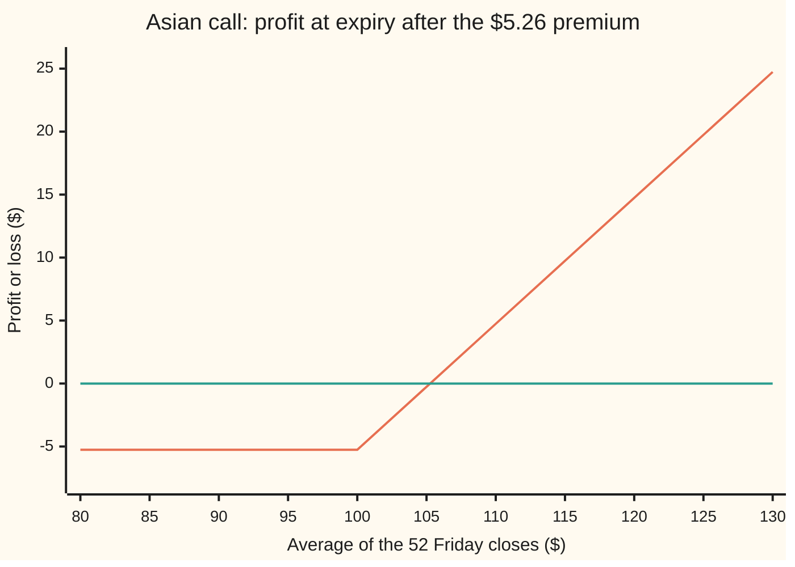
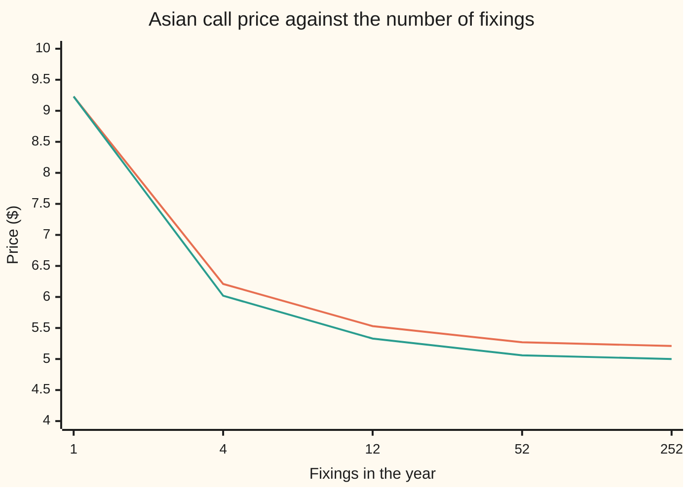

# Arithmetic Asian options: the average everyone trades has no formula, so simulate and let the geometric twin steer

[Syllabus](../../../SYLLABUS.md) → [Financial mathematics](../README.md) → [Averages, choosers, compounds and forward-starts](../README.md#s17) → Arithmetic Asian options

---

## General Overview

Acme shares trade at $100.00. A one-year contract reads Acme's closing price every Friday, 52 times, adds the 52 prices and divides by 52. At the end of the year it pays that average minus $100.00, or nothing if the average falls short. The first reading is one week out; the last is on the final day.

This is an **Asian call**: an option whose payoff looks at an average of prices over its life, not the price on one day. The ordinary add-and-divide average makes it **arithmetic**, and the fixed $100.00 makes it **fixed-strike**. The dates the price is read are the **fixings**. The same market's ordinary one-year call, which reads only the last day, costs $9.23 ([Black–Scholes call](../08-The%20Black-Scholes%20call%20and%20put/01-black-scholes-call.md)). The Asian costs $5.26, 57 percent of it.

Two things make it cheaper. An average of 52 prices spreads out less than the last price alone, because the early readings have had little time to move. And the average is taken while the expected price is still climbing, so it centres lower. The first effect is the larger.

No formula gives the $5.26. Each price follows a bell curve in its logarithm, a shape called **lognormal**. A sum of lognormal prices is not lognormal, and the Black-Scholes algebra needs it to be. So desks simulate: invent many possible years for Acme, read the payoff on each, discount, average. Plain simulation of 50,000 years gives $5.29 with an error bar of 3.4 cents. A close cousin does have a formula: the **geometric** average, which multiplies the 52 prices and takes the 52nd root ([The geometric Asian call](01-geometric-asian-kemna-vorst.md)). Price it on the same simulated years, see how far the batch missed its known answer, and correct the arithmetic price by that miss. The error bar falls to under a tenth of a cent: 37 times tighter, from the same paths.

**The arithmetic Asian has no closed form, so its price is simulated, and the geometric twin, which has one, cancels almost all of the simulation's noise.**

**What kind of fact this is:** a method: the price is a risk-neutral average with no closed form, estimated by simulation steered by an exact twin; the Turnbull-Wakeman formula beside it is an approximation, its error measured here at 1.5 cents.

### The picture: what the holder walks away with



The sloped line is the holder's profit; the flat line is break-even. The shape is the ordinary call's hockey stick. Only the horizontal axis changed: it is the year's average, not the last day's price. The profit line crosses zero just above an average of $105.

---

## The formula

Notation first, in words. A small subscript names a date: $S_{t_i}$ is Acme's price on the $i$-th fixing date $t_i$, counted in years from today. A capital sigma adds up a list, here over the fixings numbered $i = 1$ to $n$. A capital E with square brackets, $E[\;]$, is an average over all possible futures in the risk-neutral world, where every asset grows at the bank rate less its dividend ([Geometric Brownian motion](../../11-Stochastic%20processes%20and%20calculus/05-Brownian%20Motion/07-geometric-brownian-motion.md)). $N(x)$ is the bell-curve area left of $x$.

The contract and its price:

$$A = \frac{1}{n}\sum_{i=1}^{n} S_{t_i}, \qquad C_A = e^{-rT}\,E\big[\max(A - K,\,0)\big]$$

**Read it aloud:** average the price over the fixings; the call is worth today's value of the average's excess over the strike, averaged over every future.

The **floating-strike** version swaps the roles: the average becomes the strike, and the last price is compared to it.

$$\text{floating-strike call} = e^{-rT}\,E\big[\max(S_T - A,\,0)\big]$$

**Read it aloud:** the option pays however far the last price ends above the year's average.

The price is estimated by simulation, corrected by the geometric twin:

$$\widehat{C}_A = \bar X - \beta\,\big(\bar Y - C_G\big)$$

**Read it aloud:** the plain simulated price, minus a slope times however far the simulated twin missed its exact price.

Here $X$ is one simulated year's discounted arithmetic payoff and $Y$ the geometric one on the same year; a bar over a letter is its average across the simulated years.

The one-line approximation, **Turnbull-Wakeman**: pretend $A$ follows a bell curve in its logarithm, with its true mean and true mean square, and use Black's formula, the vanilla call formula written with a forward.

$$C_A \approx e^{-rT}\big(M_1\,N(e_1) - K\,N(e_2)\big)$$

**Read it aloud:** the average's expected value you might receive, minus the strike you might pay, each weighted by its own chance.

| Symbol | Plain meaning | In our example | Push it up and the answer… |
| --- | --- | --- | --- |
| $S$, $S_{t_i}$, $S_T$ | Acme today; on fixing $i$; on the last day | \$100.00 today | rises: every fixing starts higher |
| $K$ | the strike | \$100.00 | falls: further for the average to climb |
| $k$, $m$, $K^*$ | fixings already in; fixings still to come; the strike the remaining fixings must average | 0, 52 and \$100.00 today | $k$ up: less of the average left to move; $K^*$ up: falls |
| $r$, $q$ | bank rate; dividend yield, both continuous | 5% and 2% | $r$ up: dearer; $q$ up: cheaper, the price drifts less |
| $\sigma$ | volatility: yearly spread of Acme's log returns | 20% | rises, though less than a vanilla's: 22 cents per volatility point against 38 |
| $T$, $n$, $t_i$, $i$, $t$ | years to expiry; number of fixings; fixing dates, numbered by $i$; $t$ any date | 1; 52; one week to one year | $n$ up: cheaper, the average smooths harder |
| $A$, $G$ | arithmetic and geometric averages of the fixings | $G$ never exceeds $A$ | the payoff reads $A$ |
| $F$, $F_G$, $M_1$ | expected values: of $S_T$, of $G$, of $A$ | \$103.05, \$101.20, \$101.54 | rises: more to receive |
| $M_2$, $v_A$, $v$ | mean square of $A$; its fitted log-spread; $v$ any log-spread | 10,455.23; 0.118 | $v_A$ up: dearer |
| $e_1$, $e_2$, $d_1$, $d_2$, $N$ | cut-offs for the average, like the vanilla's $d_1$, $d_2$; bell-curve area | 0.189, 0.071 | — |
| $C_A$, $C_G$ | arithmetic call price; geometric twin's exact price | \$5.26; \$5.06 | — |
| $X$, $Y$, $\beta$, $\rho$ | discounted payoffs per path; slope; correlation | $\rho$ = 0.9996 | $\rho$ nearer one: tighter error bar |
| $e^{-rT}$ | the discount: a dollar at expiry, today | 0.951 | — |

The helpers, each exact:

$$M_1 = \frac{S}{n}\sum_{i=1}^{n} e^{(r-q)t_i}, \qquad M_2 = \frac{S^2}{n^2}\sum_{i=1}^{n}\sum_{j=1}^{n} e^{(r-q)(t_i + t_j) + \sigma^2 \min(t_i,\,t_j)}$$

In words: $M_1$ averages the forward prices of the 52 dates; $M_2$ adds up how each pair of dates moves together.

$$v_A = \sqrt{\ln\!\big(M_2 / M_1^2\big)}, \qquad e_1 = \frac{\ln(M_1/K) + \tfrac12 v_A^2}{v_A}, \qquad e_2 = e_1 - v_A$$

In words: $v_A$ is the log-spread a bell-curve-in-the-log variable would need to have those two moments; $e_1$ and $e_2$ are the vanilla's $d_1$ and $d_2$ with the average in place of the share.

### When it holds

- **Constant volatility.** The simulation and both formulas assume Acme's spread is the same at every fixing. With a volatility that changes by date, each pair of dates carries its own variance in $M_2$ and in the paths; keeping 20% everywhere misprices by roughly vega (the price change per volatility point) times the error: 22 cents a point.
- **Fixings fixed in advance.** The dates are written in the contract. A missed fixing or a holiday rule changes $n$ and the dates; fewer fixings make the option dearer, as the chart in Why it works shows.
- **Smooth dividends and rates.** A 2% yield paid continuously tilts every forward the same way. A lump dividend inside the window lowers the later fixings' forwards, and $M_1$ must be rebuilt date by date.
- **No fixings yet.** Once some fixings are known, part of the average is fixed cash. With $k$ of the $n$ fixings in and $m = n - k$ to come, the call is worth $m/n$ of a fresh Asian on the remaining dates, struck at $K^* = (nK - \text{sum of the fixings in})/m$: the level the remaining fixings must average for the whole average to reach $K$. $K^*$ is below $K$ only when the fixings in averaged above $K$, and above it when they averaged below. If $K^*$ is zero or less, the call is sure to pay and is worth a forward: today's value of the expected average minus $K$. Rerunning the formula with a shorter $T$ throws the known fixings away; dropping the $m/n$ weight overprices by $n/m$, double halfway through the fixings. The rewrite is exact: [Asian Greeks and implied volatility](03-asian-greeks-and-implied-volatility.md) derives it, and [Asian Greeks and the average already banked](../27-Averages%20-%20commodity%20swaps%20and%20Asian%20options/04-asian-greeks-and-the-running-average.md) works it on jet fuel.
- **A statistical answer.** The simulated price carries an error bar. Two prices that differ by less than about three bars are not different prices.

---

## Why it works

### Step 0: the price is still an average over futures

Nothing about pricing changes. In the risk-neutral world every asset grows at the bank rate less its dividend, and an option is worth its discounted average payoff ([Black–Scholes call](../08-The%20Black-Scholes%20call%20and%20put/01-black-scholes-call.md)). Only the payoff changed: it now reads 52 prices.

That change is what breaks the formula. On the vanilla card the log of the last price follows a bell curve, and the average over futures closes into $N(d_1)$ and $N(d_2)$. Here the payoff reads a sum. The log of a product is a sum of logs. The logs of the fixings are built from the same Brownian shoves, so their sum is again a bell curve, and the geometric average closes exactly. The log of a sum is not a sum of anything. The arithmetic average's distribution has no name and no formula. So the card attacks it three ways: exact moments, a simulation, and two bounds.

### Step 1: the average's first two moments are exact

The average itself has no formula, but its mean and mean square do. In the risk-neutral world, Acme's expected price on date $t$ is its forward, $S e^{(r-q)t}$. Averaging those over the 52 dates gives $M_1$ = \$101.54. The last date's forward alone is $F$ = \$103.05. The early fixings sit on a curve that has barely begun to climb.

For the mean square, two dates share every random shove up to the earlier one. That shared stretch is the $\sigma^2 \min(t_i, t_j)$ inside $M_2$. Summed over all 52 × 52 pairs, $M_2$ = 10,455.23.

<details>
<summary>Detailed proof: the two moments</summary>

Write Acme's price as $S_t = S\exp\big((r-q-\tfrac12\sigma^2)t + \sigma W_t\big)$, where the shove term $\sigma W_t$ is Brownian motion scaled by the volatility: a running total of independent shoves whose spread equals the time elapsed, and two dates share the spread up to the earlier one.

A bell-curve variable $Z$ with mean 0 and spread $v^2$ has $E[e^Z] = e^{v^2/2}$. Taking $Z = \sigma W_t$, with spread $\sigma^2 t$, gives $E[S_t] = S e^{(r-q)t}$. Average over the fixings: that is $M_1$.

For a pair of dates $a \le b$, $W_a + W_b$ has spread $a + b + 2\min(a,b)$, since the two share every shove up to the earlier date. So
$$E[S_a S_b] = S^2 e^{(r-q-\frac12\sigma^2)(a+b)}\,e^{\frac12\sigma^2(a+b) + \sigma^2\min(a,b)} = S^2 e^{(r-q)(a+b) + \sigma^2\min(a,b)}.$$
The square of the average is $\frac{1}{n^2}$ times the sum over all pairs of $S_a S_b$. Take the expectation term by term: that is $M_2$.

</details>

### Step 2: why averaging makes it cheaper

Hold the vanilla call's machinery and turn two dials. The vanilla uses the last day's forward, \$103.05, and the log-spread of one price, $\sigma\sqrt{T}$ = 0.20. The average has its own forward, \$101.54, and its own log-spread, 0.118 (Step 3 computes it).

```
Each bar is a price in dollars, one block per $0.25
vanilla, forward 103.05 and spread 0.20   █████████████████████████████████████  $9.23
lower forward only, 101.54 and 0.20       ██████████████████████████████████     $8.39
lower spread only, 103.05 and 0.118       █████████████████████████              $6.13
both, the Turnbull-Wakeman price          █████████████████████                  $5.27
arithmetic Asian, controlled simulation   █████████████████████                  $5.26
geometric twin, exact                     ████████████████████                   $5.06
```

The spread dial takes $9.23 to $6.13. The forward dial takes it to $8.39. The spread is most of the story. It is smaller because the early fixings are nearly known: the first reading is one week away and has barely had time to move. Averaging 52 readings, most of them partly known, leaves a number that wanders far less than the last reading alone. In the limit of continuous averaging the variance of the log-average is a third of the last price's; the sibling card works that sum ([The geometric Asian call](01-geometric-asian-kemna-vorst.md)).

Fewer fixings smooth less. One fixing is the vanilla itself.



Upper line: the arithmetic Asian by Turnbull-Wakeman. Lower line: the geometric twin, exact. Both start at the vanilla's $9.23 with one fixing and fall fast: quarterly readings already bring the arithmetic price to $6.21. At 252 daily fixings the twin reaches $5.00, near the continuous-averaging price the shelf quotes, $4.99.

### Step 3: Turnbull-Wakeman fits a bell curve to the log of the average

Suppose $A$ did follow a bell curve in its log, with log-spread $v$. Then its mean square over its squared mean would be exactly $e^{v^2}$. Run that backwards on the true moments: $M_2 / M_1^2$ = 1.013962, so $v_A$ = 0.117751.

Now treat the average as a share whose forward is $M_1$ and whose log-spread over the whole life is $v_A$, and apply Black's formula, which is the vanilla's formula written with a forward. The moments are exact. The bell-curve shape is the only guess. The true average is more lopsided than the fitted lognormal. Its skewness, a measure of lopsidedness that is zero for a bell curve, is 0.42 against the fit's 0.36. The true average has more chance below the strike and in the far tail, and less just above the strike, where this call earns most of its value. So the fit lands at \$5.27, 1.5 cents above the simulation. This two-moment form is Levy's (1992); software labelled Turnbull-Wakeman usually means it. That is close enough for a quote screen and not close enough to mark a large book.

### Step 4: simulate, and read the error bar honestly

In the risk-neutral world, one week of Acme's life multiplies its price by $e^{(r - q - \frac12\sigma^2)\Delta t + \sigma\sqrt{\Delta t}\,Z}$, with $\Delta t$ one week in years and $Z$ a fresh bell-curve draw. That step is exact, not an approximation, so 52 steps build one possible year with no discretisation error ([Monte Carlo pricing](../06-Numerical%20Methods%20for%20Pricing/01-monte-carlo-pricing.md)).

Build 50,000 years. On each, average the 52 prices, take the discounted payoff, and average those payoffs. The plain answer is $5.29. Its error bar is the spread of the payoffs over the square root of 50,000: 3.4 cents. The bar shrinks only with the square root of the number of paths, so tightening it by brute force is expensive.

### Step 5: the geometric twin as a control variate

A **control variate** is a companion quantity with a known price, simulated on the same paths so that its error reveals theirs. On every simulated year, compute the geometric average too, and its discounted payoff. That twin's exact price is known: \$5.06. This batch of years priced it at \$5.09. The batch ran rich. The arithmetic payoff rides the same paths, so it ran rich by nearly the same amount. Subtract a multiple $\beta$ of the twin's miss.

The correction adds nothing on average, for any $\beta$, because the twin's miss averages to zero. So it cannot bias the price. The best $\beta$ is the slope of the arithmetic payoff against the geometric one across the paths, and with that slope the remaining variance is $1 - \rho^2$ of the plain variance, where $\rho$ is their correlation. The proof is on [Cheaper Monte Carlo](../06-Numerical%20Methods%20for%20Pricing/02-variance-reduction-for-pricing.md).

Here $\rho$ = 0.9996. The two averages differ by little on any path, and their payoffs switch on together. The controlled price is \$5.2577 with an error bar of 0.09 cents. The bar is 37 times tighter, from the same paths.

<details>
<summary>Detailed proof: why the correction cannot bias the price</summary>

For any fixed number $\beta$, the estimator is $\bar X - \beta(\bar Y - C_G)$. Its expectation is $E[X] - \beta(E[Y] - C_G)$. The twin's exact price is its expected discounted payoff, $C_G = E[Y]$, so the bracket is zero and the expectation is $E[X] = C_A$. The variance is $\operatorname{var}(X) - 2\beta\operatorname{cov}(X,Y) + \beta^2\operatorname{var}(Y)$, a parabola in $\beta$ with its lowest point at $\beta = \operatorname{cov}(X,Y)/\operatorname{var}(Y)$. There it equals $(1-\rho^2)\operatorname{var}(X)$. Estimating $\beta$ from the same paths adds a bias that shrinks like one over the number of paths, far below the error bar here.

</details>

### Step 6: a floor and a ceiling, with no simulation at all

On every path, adding and dividing never gives less than multiplying and rooting: $A \ge G$, the arithmetic-geometric mean inequality. So the arithmetic payoff is never below the geometric one, and $C_A \ge C_G$ = \$5.06.

The gap between the two payoffs is never more than the gap between the averages: $\max(A-K,0) - \max(G-K,0) \le A - G$. Take the discounted average over futures: $C_A \le C_G + e^{-rT}(M_1 - F_G)$ = \$5.39. The simulation's \$5.26 sits inside \$5.06 to \$5.39, a window built from two exact numbers and one inequality.

### The floating strike

The same 50,000 years price the floating-strike call, which pays $\max(S_T - A, 0)$. Its natural control is the payoff without the floor, $S_T - A$, whose exact value is $e^{-rT}(F - M_1)$. Plain simulation gives \$5.11 with a 3.5-cent bar; controlled, \$5.15 with a 1.5-cent bar. The control helps less: a straight line tracks a kinked payoff worse than the geometric twin tracks its arithmetic sibling.

Other routes exist. A lattice (a tree of possible prices) or a partial differential equation (an equation in rates of change) in two variables, the price and the running average, prices the same contract. Quasi-random points, spread evenly on purpose, cut the error bar further than the control alone ([Quasi-Monte Carlo](../06-Numerical%20Methods%20for%20Pricing/03-quasi-monte-carlo-and-brownian-bridge.md)).

---

## Worked numbers, by hand

House market: $S$ = \$100, $K$ = \$100, $r$ = 5%, $q$ = 2%, $\sigma$ = 20%, $T$ = 1 year, $n$ = 52 weekly fixings from one week (0.019231 years) to one year.

| Step | Arithmetic | Value |
| --- | --- | --- |
| mean of the average | $M_1 = \frac{100}{52}\sum e^{0.03\,i/52}$ | 101.544399 |
| mean square of the average | $M_2$, the double sum over 52 × 52 pairs | 10,455.230120 |
| ratio | $M_2 / M_1^2$ | 1.013962 |
| fitted log-spread | $v_A = \sqrt{\ln 1.013962}$ | 0.117751 |
| first cut-off | $e_1 = (\ln 1.015444 + \tfrac12 v_A^2)/v_A$ | 0.189031 |
| second cut-off | $e_2 = 0.189031 - 0.117751$ | 0.071280 |
| chances | $N(e_1)$, $N(e_2)$ | 0.574966, 0.528412 |
| discount | $e^{-0.05}$ | 0.951229 |
| Turnbull-Wakeman | $0.951229 \times (101.544399 \times 0.574966 - 100 \times 0.528412)$ | 5.272956 |
| geometric twin, exact | sibling card's formula | 5.064562 |
| **controlled simulation** | 50,000 paths, twin as control | **$5.2577 ± 0.0009** |

The average-price call on Acme is worth $5.26 today, 57 percent of the $9.23 vanilla: the same strike and year, with the last-day gamble replaced by a year of readings.

### Greeks, by bumping the formula

Nudge Acme's price by 1% up and down, and the volatility by a hundredth of a point, and reprice by Turnbull-Wakeman. The sibling card treats them properly ([Asian Greeks and implied volatility](03-asian-greeks-and-implied-volatility.md)).

| Greek | Asian call | Vanilla call | Why they differ |
| --- | --- | --- | --- |
| delta, dollars per dollar of Acme | 0.5552 | 0.5868 | the average's forward rises less than the last day's |
| gamma, delta per dollar | 0.0321 | 0.0189 | a narrower spread concentrates the kink |
| vega, dollars per volatility point | 0.2236 | 0.3790 | the average feels only part of the spread |

### What breaks if you drop a piece

| Mistake | Comes out at | What went wrong |
| --- | --- | --- |
| Price the last day's price, not the average | $9.23 | That is the vanilla; the averaging is the whole contract |
| Keep the full spread 0.20 on the average's forward | $8.39 | An average of partly known prices spreads less than one price |
| Treat the 52 fixings as independent draws | $1.95 | Neighbouring Fridays share almost all their shoves; the spread is not 0.20 over root 52 |
| Quote the geometric twin as the price | \$5.06 | $G$ never exceeds $A$, so the twin is the floor, not the price |

The code prints all four.

---

## Code, from first principles, and it actually runs

Both programs build their own bell-curve area (Marsaglia's series), their own random numbers (the splitmix64 generator, and the Box-Muller transform, which turns two even draws between 0 and 1 into one bell-curve draw), and their own paths. They reach the arithmetic price by four roads: plain simulation, the controlled simulation, Turnbull-Wakeman's moments, and the floor and ceiling from the mean inequality. They also confirm that the paths reproduce two exact quantities, the twin's price and the average's mean; that one fixing gives the vanilla's $9.227006; and that ten million fixings give the shelf's continuous geometric price, $4.985760. A triple sum over the dates gives the average's exact skewness, and the checks confirm it exceeds the fitted lognormal's.

### Python

```python
# Arithmetic Asian options -- the check behind the card.  Standard library only.
# House market, 52 weekly fixings.  Nothing imported knows the answer: the
# bell-curve area is a series written out, the random numbers come from a
# splitmix64 generator written out, and the paths are simulated step by step.
from math import log, sqrt, exp, cos, pi

S, K, r, q, sigma, T, n = 100.0, 100.0, 0.05, 0.02, 0.20, 1.0, 52
disc = exp(-r * T)

def N(x):                                  # area left of x: Marsaglia's series
    if x < -9.0: return 0.0
    if x > 9.0: return 1.0
    s, t, b, i = x, 0.0, x, 1.0
    while s != t:
        i += 2.0
        b *= x * x / i
        t, s = s, s + b
    return 0.5 + s * exp(-0.5 * x * x - 0.91893853320467274178)

def black(F, v):                           # call on a lognormal with forward F, log-spread v
    d1 = (log(F / K) + 0.5 * v * v) / v
    return disc * (F * N(d1) - K * N(d1 - v))

def fixings(m):                            # m equally spaced dates, the last at T
    return [T * (i + 1) / m for i in range(m)]

def kemna_vorst(m, spot=S):                # geometric twin, exact (sibling card 01)
    tbar, var = T * (m + 1) / (2 * m), sigma * sigma * T * (m + 1) * (2 * m + 1) / (6 * m * m)
    F_G = spot * exp((r - q - 0.5 * sigma * sigma) * tbar + 0.5 * var)
    return black(F_G, sqrt(var)), F_G

def turnbull_wakeman(m, spot=S, vol=sigma):  # moment-matched lognormal for the average
    ts, M1, M2 = fixings(m), 0.0, 0.0
    for a in ts:                           # exact first and second moments of the average
        M1 += spot * exp((r - q) * a) / m
        for b in ts:
            M2 += spot * spot * exp((r - q) * (a + b) + vol * vol * min(a, b)) / (m * m)
    vA = sqrt(log(M2 / (M1 * M1)))
    return black(M1, vA), M1, vA, M2

state = 20260924                           # splitmix64: 64-bit integer mixing
def uniform():
    global state
    state = (state + 0x9E3779B97F4A7C15) & 0xFFFFFFFFFFFFFFFF
    z = state
    z = ((z ^ (z >> 30)) * 0xBF58476D1CE4E5B9) & 0xFFFFFFFFFFFFFFFF
    z = ((z ^ (z >> 27)) * 0x94D049BB133111EB) & 0xFFFFFFFFFFFFFFFF
    return ((z ^ (z >> 31)) >> 11) * 2.0 ** -53 + 2.0 ** -54

def normal():                              # Box-Muller, one draw per pair of uniforms
    return sqrt(-2.0 * log(uniform())) * cos(2.0 * pi * uniform())

# ---- roads 1 and 2: 50,000 weekly paths; the geometric payoff rides along as control
paths, dt = 50000, T / n
drift, step = (r - q - 0.5 * sigma * sigma) * dt, sigma * sqrt(dt)
kv, F_G = kemna_vorst(n)
tw, M1, vA, M2 = turnbull_wakeman(n)
e1 = (log(M1 / K) + 0.5 * vA * vA) / vA   # the two cut-offs, for the hand table
sx = sxx = sy = syy = sxy = sa = saa = sf = sff = sw = sww = sfw = 0.0
for _ in range(paths):
    x, tot, totlog = log(S), 0.0, 0.0
    for _ in range(n):
        x += drift + step * normal()
        tot += exp(x)
        totlog += x
    A, G, ST = tot / n, exp(totlog / n), exp(x)
    X, Y = disc * max(A - K, 0.0), disc * max(G - K, 0.0)    # arithmetic, geometric
    Fl, W = disc * max(ST - A, 0.0), disc * (ST - A)         # floating strike, its forward
    sx += X; sxx += X * X; sy += Y; syy += Y * Y; sxy += X * Y
    sa += A; saa += A * A; sf += Fl; sff += Fl * Fl; sw += W; sww += W * W; sfw += Fl * W

def cv(s1, s11, s2, s22, s12, known):      # mean, plain error bar, controlled mean and bar, rho
    m1, m2 = s1 / paths, s2 / paths
    v1, v2, c12 = s11 / paths - m1 * m1, s22 / paths - m2 * m2, s12 / paths - m1 * m2
    beta = c12 / v2
    return m1, sqrt(v1 / paths), m1 - beta * (m2 - known), sqrt((v1 - beta * c12) / paths), c12 / sqrt(v1 * v2), m2, sqrt(v2 / paths)

plain, se_plain, ctrl, se_ctrl, rho, geo_sim, se_geo = cv(sx, sxx, sy, syy, sxy, kv)
F_T = S * exp((r - q) * T)                 # floating strike: control S_T - A is worth disc*(F - M1)
fwd_known = disc * (F_T - M1)
fplain, fse, fctrl, fse_c, _, fwd_sim, fwd_se = cv(sf, sff, sw, sww, sfw, fwd_known)
mean_A, se_A = sa / paths, sqrt((saa / paths - (sa / paths) * (sa / paths)) / paths)
vanilla = turnbull_wakeman(1)[0]
upper = kv + disc * (M1 - F_G)             # A - G >= (A-K)+ - (G-K)+ >= 0, path by path
ts, M3 = fixings(n), 0.0                   # M3: exact third moment, each pair of three dates sharing shoves
for a, b, c in ((a, b, c) for a in ts for b in ts for c in ts):
    M3 += S * S * S * exp((r - q) * (a + b + c) + sigma * sigma * (min(a, b) + min(a, c) + min(b, c))) / (n * n * n)
skew, skew_fit = (M3 - 3 * M1 * M2 + 2 * M1 * M1 * M1) / (M2 - M1 * M1) ** 1.5, (M2 / (M1 * M1) + 2) * sqrt(M2 / (M1 * M1) - 1)

print(f"{'fixings, first and last (years)':<38}{fixings(n)[0]:>12.6f}{fixings(n)[-1]:>12.6f}")
rows = [("vanilla call, Black-Scholes", vanilla), ("mean of the average M1, exact", M1),
    ("  simulated", mean_A), ("  its error bar", se_A), ("second moment M2, exact", M2),
    ("M2 / M1^2", M2 / (M1 * M1)), ("log-spread of the average vA", vA),
    ("log-spread of one price, sigma*sqrt(T)", sigma * sqrt(T)),
    ("cut-off e1", e1), ("cut-off e2 = e1 - vA", e1 - vA), ("N(e1)", N(e1)), ("N(e2)", N(e1 - vA)),
    ("discount e^-rT", disc), ("geometric twin, Kemna-Vorst", kv), ("  simulated", geo_sim), ("  its error bar", se_geo),
    ("geometric forward F_G", F_G), ("1 plain simulation", plain), ("  its error bar", se_plain),
    ("2 control-variate simulation", ctrl), ("  its error bar", se_ctrl), ("  correlation rho", rho),
    ("  error bar shrinks by", se_plain / se_ctrl), ("3 Turnbull-Wakeman", tw),
    ("  minus road 2", tw - ctrl), ("  skewness of the average, exact", skew),
    ("  skewness of the fitted lognormal", skew_fit), ("4 floor: geometric twin", kv),
    ("  ceiling: twin + disc*(M1 - F_G)", upper), ("arithmetic / vanilla", ctrl / vanilla),
    ("floating strike, plain", fplain), ("  its error bar", fse), ("floating strike, controlled", fctrl),
    ("  its error bar", fse_c), ("expiry forward F", F_T),
    ("dial: lower spread only", black(F_T, vA)), ("dial: lower forward only", black(M1, sigma * sqrt(T))),
    ("wrong: fixings as independent draws", black(M1, sigma * sqrt(T / n))),
    ("house check: continuous geometric", kemna_vorst(10 ** 7)[0])]
for name, v in rows:
    print(f"{name:<38}{v:>12.6f}")

h, hv = 0.01, 0.0001                       # bumps for the Greeks, on Turnbull-Wakeman
def greeks(m):
    up, mid, dn = (turnbull_wakeman(m, S * (1 + s))[0] for s in (h, 0.0, -h))
    vup, vdn = turnbull_wakeman(m, S, sigma + hv)[0], turnbull_wakeman(m, S, sigma - hv)[0]
    return (up - dn) / (2 * S * h), (up - 2 * mid + dn) / ((S * h) * (S * h)), (vup - vdn) / (2 * hv) / 100
for label, m in (("greeks, Asian (delta gamma vega/pt)", n), ("greeks, vanilla", 1)):
    print(f"{label:<38}" + "".join(f"{g:>10.4f}" for g in greeks(m)))

print(f"{'chart, fixings n':<38}" + "".join(f"{m:>8d}" for m in (1, 4, 12, 52, 252)))
print(f"{'chart, Turnbull-Wakeman':<38}" + "".join(f"{turnbull_wakeman(m)[0]:>8.2f}" for m in (1, 4, 12, 52, 252)))
print(f"{'chart, Kemna-Vorst':<38}" + "".join(f"{kemna_vorst(m)[0]:>8.2f}" for m in (1, 4, 12, 52, 252)))
ladder = (vanilla, black(F_T, vA), black(M1, sigma * sqrt(T)), tw, ctrl, kv)
print(f"{'bars, price ladder':<38}" + "".join(f"{v:>8.2f}" for v in ladder))
avgs = [80 + 5 * i for i in range(11)]
print(f"{'chart, average at expiry':<38}" + "".join(f"{a:>7d}" for a in avgs))
print(f"{'chart, profit after premium':<38}" + "".join(f"{max(a - K, 0.0) - ctrl:>7.2f}" for a in avgs))

assert abs(vanilla - 9.227005508154) < 1e-9, "one fixing: the average is S_T, so Black-Scholes"
assert abs(kemna_vorst(10 ** 7)[0] - 4.985760) < 2e-6, "many fixings: the shelf's continuous geometric"
assert abs(geo_sim - kv) < 3 * se_geo, "the paths reproduce the exact geometric price"
assert abs(mean_A - M1) < 3 * se_A, "the paths reproduce the exact mean of the average"
assert kv < ctrl < upper, "controlled price inside the AM-GM floor and ceiling"
assert abs(ctrl - plain) < 3 * se_plain, "the control moves the price by less than the plain bar"
assert se_plain / se_ctrl > 10, "the control shrinks the error bar at least tenfold"
assert abs(tw - ctrl) < 0.03, "moment matching within three cents of the simulation"
assert abs(fwd_sim - fwd_known) < 3 * fwd_se, "the paths reproduce the exact value of S_T - A"
assert abs(fctrl - fplain) < 3 * fse, "floating strike: control agrees with plain"
assert skew > skew_fit, "the true average is more lopsided than the fitted lognormal"
print("ALL CHECKS PASS")
```

**Ran 2026-10-06 on macOS, Python 3.14.6, standard library only. All checks passed. Output, pasted from the run:**

```
fixings, first and last (years)           0.019231    1.000000
vanilla call, Black-Scholes               9.227006
mean of the average M1, exact           101.544399
  simulated                             101.571216
  its error bar                           0.053789
second moment M2, exact               10455.230120
M2 / M1^2                                 1.013962
log-spread of the average vA              0.117751
log-spread of one price, sigma*sqrt(T)    0.200000
cut-off e1                                0.189031
cut-off e2 = e1 - vA                      0.071280
N(e1)                                     0.574966
N(e2)                                     0.528412
discount e^-rT                            0.951229
geometric twin, Kemna-Vorst               5.064562
  simulated                               5.094204
  its error bar                           0.033290
geometric forward F_G                   101.202812
1 plain simulation                        5.288290
  its error bar                           0.034417
2 control-variate simulation              5.257657
  its error bar                           0.000927
  correlation rho                         0.999637
  error bar shrinks by                   37.108048
3 Turnbull-Wakeman                        5.272956
  minus road 2                            0.015299
  skewness of the average, exact          0.424533
  skewness of the fitted lognormal        0.356132
4 floor: geometric twin                   5.064562
  ceiling: twin + disc*(M1 - F_G)         5.389490
arithmetic / vanilla                      0.569812
floating strike, plain                    5.112717
  its error bar                           0.034995
floating strike, controlled               5.145044
  its error bar                           0.014677
expiry forward F                        103.045453
dial: lower spread only                   6.128551
dial: lower forward only                  8.392464
wrong: fixings as independent draws       1.953051
house check: continuous geometric         4.985760
greeks, Asian (delta gamma vega/pt)       0.5552    0.0321    0.2236
greeks, vanilla                           0.5868    0.0189    0.3790
chart, fixings n                             1       4      12      52     252
chart, Turnbull-Wakeman                   9.23    6.21    5.53    5.27    5.21
chart, Kemna-Vorst                        9.23    6.02    5.33    5.06    5.00
bars, price ladder                        9.23    6.13    8.39    5.27    5.26    5.06
chart, average at expiry                   80     85     90     95    100    105    110    115    120    125    130
chart, profit after premium             -5.26  -5.26  -5.26  -5.26  -5.26  -0.26   4.74   9.74  14.74  19.74  24.74
ALL CHECKS PASS
```

### Rust

Same numbers, same labels, built with `rustc --edition 2021 -O`.

```rust
// Arithmetic Asian options -- the same check as the Python, in Rust.  No crates.
// House market, 52 weekly fixings.  Nothing imported knows the answer: the
// bell-curve area is a series written out, the random numbers come from a
// splitmix64 generator written out, and the paths are simulated step by step.
use std::f64::consts::PI;

const S: f64 = 100.0; const K: f64 = 100.0;
const R: f64 = 0.05; const Q: f64 = 0.02;     // bank rate, dividend yield
const SIGMA: f64 = 0.20; const T: f64 = 1.0; const NF: usize = 52;
fn disc() -> f64 { (-R * T).exp() }

fn ncdf(x: f64) -> f64 {                   // area left of x: Marsaglia's series
    if x < -9.0 { return 0.0 }
    if x > 9.0 { return 1.0 }
    let (mut s, mut t, mut b, mut i) = (x, 0.0, x, 1.0);
    while s != t {
        i += 2.0;
        b *= x * x / i;
        t = s;
        s += b;
    }
    0.5 + s * (-0.5 * x * x - 0.91893853320467274178).exp()
}

fn black(f: f64, v: f64) -> f64 {          // call on a lognormal with forward f, log-spread v
    let d1 = ((f / K).ln() + 0.5 * v * v) / v;
    disc() * (f * ncdf(d1) - K * ncdf(d1 - v))
}

fn fixings(m: usize) -> Vec<f64> {         // m equally spaced dates, the last at T
    (0..m).map(|i| T * (i + 1) as f64 / m as f64).collect()
}

fn kemna_vorst(m: usize) -> (f64, f64) {   // geometric twin, exact (sibling card 01)
    let mf = m as f64;
    let tbar = T * (mf + 1.0) / (2.0 * mf);
    let var = SIGMA * SIGMA * T * (mf + 1.0) * (2.0 * mf + 1.0) / (6.0 * mf * mf);
    let f_g = S * ((R - Q - 0.5 * SIGMA * SIGMA) * tbar + 0.5 * var).exp();
    (black(f_g, var.sqrt()), f_g)
}

fn turnbull_wakeman(m: usize, spot: f64, vol: f64) -> (f64, f64, f64, f64) {
    let ts = fixings(m);                   // moment-matched lognormal for the average
    let (mf, mut m1, mut m2) = (m as f64, 0.0, 0.0);
    for &a in &ts {                        // exact first and second moments of the average
        m1 += spot * ((R - Q) * a).exp() / mf;
        for &b in &ts {
            m2 += spot * spot * ((R - Q) * (a + b) + vol * vol * a.min(b)).exp() / (mf * mf);
        }
    }
    let va = (m2 / (m1 * m1)).ln().sqrt();
    (black(m1, va), m1, va, m2)
}

fn uniform(state: &mut u64) -> f64 {       // splitmix64: 64-bit integer mixing
    *state = state.wrapping_add(0x9E3779B97F4A7C15);
    let mut z = *state;
    z = (z ^ (z >> 30)).wrapping_mul(0xBF58476D1CE4E5B9);
    z = (z ^ (z >> 27)).wrapping_mul(0x94D049BB133111EB);
    ((z ^ (z >> 31)) >> 11) as f64 * 2f64.powi(-53) + 2f64.powi(-54)
}

fn normal(state: &mut u64) -> f64 {        // Box-Muller, one draw per pair of uniforms
    let (u1, u2) = (uniform(state), uniform(state));
    (-2.0 * u1.ln()).sqrt() * (2.0 * PI * u2).cos()
}

// mean, plain error bar, controlled mean and bar, rho, control's mean and bar
fn cv(s1: f64, s11: f64, s2: f64, s22: f64, s12: f64, known: f64, p: f64) -> [f64; 7] {
    let (m1, m2) = (s1 / p, s2 / p);
    let (v1, v2, c12) = (s11 / p - m1 * m1, s22 / p - m2 * m2, s12 / p - m1 * m2);
    let beta = c12 / v2;
    [m1, (v1 / p).sqrt(), m1 - beta * (m2 - known), ((v1 - beta * c12) / p).sqrt(),
     c12 / (v1 * v2).sqrt(), m2, (v2 / p).sqrt()]
}

fn greeks(m: usize) -> [f64; 3] {          // bumps for the Greeks, on Turnbull-Wakeman
    let (h, hv) = (0.01, 0.0001);
    let [up, mid, dn] = [h, 0.0, -h].map(|s| turnbull_wakeman(m, S * (1.0 + s), SIGMA).0);
    let (vup, vdn) = (turnbull_wakeman(m, S, SIGMA + hv).0, turnbull_wakeman(m, S, SIGMA - hv).0);
    [(up - dn) / (2.0 * S * h), (up - 2.0 * mid + dn) / ((S * h) * (S * h)), (vup - vdn) / (2.0 * hv) / 100.0]
}

fn main() {
    // ---- roads 1 and 2: 50,000 weekly paths; the geometric payoff rides along as control
    let (paths, dt, disc) = (50000usize, T / NF as f64, disc());
    let (drift, step) = ((R - Q - 0.5 * SIGMA * SIGMA) * dt, SIGMA * dt.sqrt());
    let (kv, f_g) = kemna_vorst(NF);
    let (tw, m1, va, m2) = turnbull_wakeman(NF, S, SIGMA);
    let mut st: u64 = 20260924;
    let mut acc = [0.0f64; 12];            // sx sxx sy syy sxy sa saa sf sff sw sww sfw
    for _ in 0..paths {
        let (mut x, mut tot, mut totlog) = (S.ln(), 0.0, 0.0);
        for _ in 0..NF {
            x += drift + step * normal(&mut st);
            tot += x.exp();
            totlog += x;
        }
        let (a, g, st_t) = (tot / NF as f64, (totlog / NF as f64).exp(), x.exp());
        let (xa, yg) = (disc * (a - K).max(0.0), disc * (g - K).max(0.0));
        let (fl, w) = (disc * (st_t - a).max(0.0), disc * (st_t - a));
        for (k, v) in [xa, xa * xa, yg, yg * yg, xa * yg, a, a * a, fl, fl * fl, w, w * w, fl * w].iter().enumerate() {
            acc[k] += v;
        }
    }
    let p = paths as f64;
    let [plain, se_plain, ctrl, se_ctrl, rho, geo_sim, se_geo] = cv(acc[0], acc[1], acc[2], acc[3], acc[4], kv, p);
    let f_t = S * ((R - Q) * T).exp();    // floating strike: control S_T - A is worth disc*(F - M1)
    let fwd_known = disc * (f_t - m1);
    let fl = cv(acc[7], acc[8], acc[9], acc[10], acc[11], fwd_known, p);
    let (mean_a, se_a) = (acc[5] / p, ((acc[6] / p - (acc[5] / p) * (acc[5] / p)) / p).sqrt());
    let vanilla = turnbull_wakeman(1, S, SIGMA).0;
    let upper = kv + disc * (m1 - f_g);   // A - G >= (A-K)+ - (G-K)+ >= 0, path by path
    let (house, e1) = (kemna_vorst(10_000_000).0, ((m1 / K).ln() + 0.5 * va * va) / va);

    let (fx, mut m3) = (fixings(NF), 0.0); // m3: exact third moment, each pair of three dates sharing shoves
    for &a in &fx { for &b in &fx { for &c in &fx {
        m3 += S * S * S * ((R - Q) * (a + b + c) + SIGMA * SIGMA * (a.min(b) + a.min(c) + b.min(c))).exp() / (NF * NF * NF) as f64;
    } } }
    let (skew, skew_fit) = ((m3 - 3.0 * m1 * m2 + 2.0 * m1 * m1 * m1) / (m2 - m1 * m1).powf(1.5), (m2 / (m1 * m1) + 2.0) * (m2 / (m1 * m1) - 1.0).sqrt());
    println!("{:<38}{:>12.6}{:>12.6}", "fixings, first and last (years)", fx[0], fx[NF - 1]);
    let rows: [(&str, f64); 39] = [("vanilla call, Black-Scholes", vanilla), ("mean of the average M1, exact", m1),
        ("  simulated", mean_a), ("  its error bar", se_a), ("second moment M2, exact", m2),
        ("M2 / M1^2", m2 / (m1 * m1)), ("log-spread of the average vA", va),
        ("log-spread of one price, sigma*sqrt(T)", SIGMA * T.sqrt()),
        ("cut-off e1", e1), ("cut-off e2 = e1 - vA", e1 - va), ("N(e1)", ncdf(e1)), ("N(e2)", ncdf(e1 - va)),
        ("discount e^-rT", disc), ("geometric twin, Kemna-Vorst", kv), ("  simulated", geo_sim), ("  its error bar", se_geo),
        ("geometric forward F_G", f_g), ("1 plain simulation", plain), ("  its error bar", se_plain),
        ("2 control-variate simulation", ctrl), ("  its error bar", se_ctrl), ("  correlation rho", rho),
        ("  error bar shrinks by", se_plain / se_ctrl), ("3 Turnbull-Wakeman", tw),
        ("  minus road 2", tw - ctrl), ("  skewness of the average, exact", skew),
        ("  skewness of the fitted lognormal", skew_fit), ("4 floor: geometric twin", kv),
        ("  ceiling: twin + disc*(M1 - F_G)", upper), ("arithmetic / vanilla", ctrl / vanilla),
        ("floating strike, plain", fl[0]), ("  its error bar", fl[1]), ("floating strike, controlled", fl[2]),
        ("  its error bar", fl[3]), ("expiry forward F", f_t),
        ("dial: lower spread only", black(f_t, va)), ("dial: lower forward only", black(m1, SIGMA * T.sqrt())),
        ("wrong: fixings as independent draws", black(m1, SIGMA * (T / NF as f64).sqrt())),
        ("house check: continuous geometric", house)];
    for (name, v) in rows.iter() {
        println!("{:<38}{:>12.6}", name, v);
    }
    for (label, m) in [("greeks, Asian (delta gamma vega/pt)", NF), ("greeks, vanilla", 1)] {
        let g = greeks(m);
        println!("{:<38}{:>10.4}{:>10.4}{:>10.4}", label, g[0], g[1], g[2]);
    }
    let ns = [1usize, 4, 12, 52, 252];
    let line = |f: &dyn Fn(usize) -> f64| ns.iter().map(|&m| format!("{:>8.2}", f(m))).collect::<String>();
    println!("{:<38}{}", "chart, fixings n", ns.iter().map(|m| format!("{:>8}", m)).collect::<String>());
    println!("{:<38}{}", "chart, Turnbull-Wakeman", line(&|m| turnbull_wakeman(m, S, SIGMA).0));
    println!("{:<38}{}", "chart, Kemna-Vorst", line(&|m| kemna_vorst(m).0));
    println!("{:<38}{}", "bars, price ladder", [vanilla, black(f_t, va), black(m1, SIGMA * T.sqrt()), tw, ctrl, kv]
             .iter().map(|v| format!("{:>8.2}", v)).collect::<String>());
    let avgs: Vec<i32> = (0..11).map(|i| 80 + 5 * i).collect();
    println!("{:<38}{}", "chart, average at expiry", avgs.iter().map(|a| format!("{:>7}", a)).collect::<String>());
    println!("{:<38}{}", "chart, profit after premium",
             avgs.iter().map(|&a| format!("{:>7.2}", (a as f64 - K).max(0.0) - ctrl)).collect::<String>());

    assert!((vanilla - 9.227005508154).abs() < 1e-9, "one fixing: the average is S_T, so Black-Scholes");
    assert!((house - 4.985760).abs() < 2e-6, "many fixings: the shelf's continuous geometric");
    assert!((geo_sim - kv).abs() < 3.0 * se_geo, "the paths reproduce the exact geometric price");
    assert!((mean_a - m1).abs() < 3.0 * se_a, "the paths reproduce the exact mean of the average");
    assert!(kv < ctrl && ctrl < upper, "controlled price inside the AM-GM floor and ceiling");
    assert!((ctrl - plain).abs() < 3.0 * se_plain, "the control moves the price by less than the plain bar");
    assert!(se_plain / se_ctrl > 10.0, "the control shrinks the error bar at least tenfold");
    assert!((tw - ctrl).abs() < 0.03, "moment matching within three cents of the simulation");
    assert!((fl[5] - fwd_known).abs() < 3.0 * fl[6], "the paths reproduce the exact value of S_T - A");
    assert!((fl[2] - fl[0]).abs() < 3.0 * fl[1], "floating strike: control agrees with plain");
    assert!(skew > skew_fit, "the true average is more lopsided than the fitted lognormal");
    println!("ALL CHECKS PASS");
}
```

**Ran 2026-10-06 on macOS, rustc 1.98.1, no crates. All checks passed. Output, pasted from the run:**

```
fixings, first and last (years)           0.019231    1.000000
vanilla call, Black-Scholes               9.227006
mean of the average M1, exact           101.544399
  simulated                             101.571216
  its error bar                           0.053789
second moment M2, exact               10455.230120
M2 / M1^2                                 1.013962
log-spread of the average vA              0.117751
log-spread of one price, sigma*sqrt(T)    0.200000
cut-off e1                                0.189031
cut-off e2 = e1 - vA                      0.071280
N(e1)                                     0.574966
N(e2)                                     0.528412
discount e^-rT                            0.951229
geometric twin, Kemna-Vorst               5.064562
  simulated                               5.094204
  its error bar                           0.033290
geometric forward F_G                   101.202812
1 plain simulation                        5.288290
  its error bar                           0.034417
2 control-variate simulation              5.257657
  its error bar                           0.000927
  correlation rho                         0.999637
  error bar shrinks by                   37.108048
3 Turnbull-Wakeman                        5.272956
  minus road 2                            0.015299
  skewness of the average, exact          0.424533
  skewness of the fitted lognormal        0.356132
4 floor: geometric twin                   5.064562
  ceiling: twin + disc*(M1 - F_G)         5.389490
arithmetic / vanilla                      0.569812
floating strike, plain                    5.112717
  its error bar                           0.034995
floating strike, controlled               5.145044
  its error bar                           0.014677
expiry forward F                        103.045453
dial: lower spread only                   6.128551
dial: lower forward only                  8.392464
wrong: fixings as independent draws       1.953051
house check: continuous geometric         4.985760
greeks, Asian (delta gamma vega/pt)       0.5552    0.0321    0.2236
greeks, vanilla                           0.5868    0.0189    0.3790
chart, fixings n                             1       4      12      52     252
chart, Turnbull-Wakeman                   9.23    6.21    5.53    5.27    5.21
chart, Kemna-Vorst                        9.23    6.02    5.33    5.06    5.00
bars, price ladder                        9.23    6.13    8.39    5.27    5.26    5.06
chart, average at expiry                   80     85     90     95    100    105    110    115    120    125    130
chart, profit after premium             -5.26  -5.26  -5.26  -5.26  -5.26  -0.26   4.74   9.74  14.74  19.74  24.74
ALL CHECKS PASS
```

The two outputs match line for line: the same generator, the same arithmetic in the same order.

> [!TIP]
> **Try changing**
> Guess first, then run it.
> - **Fewer paths.** Set `paths` to 5000. Guess: both error bars widen by the square root of ten. They do, and every assert still passes; the control still beats the tenfold test.
> - **Flip the correction.** Change `m1 - beta * (m2 - known)` to `m1 + beta * (m2 - known)`. The twin's miss is now added instead of subtracted, doubling the batch's error; the price lands beyond three cents of Turnbull-Wakeman, and that assert stops the run.
> - **Share every shove.** Change `min(a, b)` to `max(a, b)` in the mean square. Every pair of dates now looks fully shared, the fitted spread grows, and the three-cent assert fails.
> - **A new seed.** Change `state` to any other number. The controlled price moves by about its 0.09-cent bar; the plain one by about its 3.4-cent bar.

---

## The usual mistake

> [!warning]
> **The average's spread is not the price's spread over root $n$.** Dividing by root 52 treats the Fridays as 52 independent coins. They are not: this Friday's price is last Friday's price plus one week of movement, so neighbouring fixings share almost everything. The honest log-spread is 0.118, not 0.20 over root 52, and the independent-draws price is \$1.95 against the true \$5.26.
>
> - **Quoting the twin.** The geometric price, $5.06, is the floor. Quoting it as the arithmetic price, $5.06 against $5.26, undersells every contract.
> - **Using the last day's forward.** The average centres on $101.54, not $103.05. With the full spread as well, the price comes out at $8.39.
> - **Reading a simulated price without its bar.** Plain simulation's $5.29 and the controlled $5.26 differ by less than one plain bar of 3.4 cents. They are the same price; only the controlled one is precise.
> - **Mixing up the two Asians.** Fixed-strike compares the average to $100.00; floating-strike compares the last price to the average. Here they happen to cost similar amounts, $5.26 and $5.15, but they hedge different risks.

---

## Where you meet it in real life

- **Commodity hedging.** An airline buying jet fuel every week pays the year's average price, not one day's. An average-price call caps that average. It costs less than 52 separate weekly calls, because good and bad weeks net out inside the average.
- **Currency hedging.** An exporter converting monthly receipts cares about the average exchange rate over the year; an Asian option on it matches the exposure with one contract.
- **Settlement that resists manipulation.** Pushing one closing price moves a vanilla's payoff fully. It moves an average of 52 by one fifty-second, which is why thin markets settle on averages.
- **Structured notes.** Many retail notes average the final few months of an index to soften a last-day crash. Related path readers on this shelf: [Forward-start options](06-forward-start-options-and-forward-volatility.md) and [Cliquets](07-cliquets-and-ratchets.md).

> **Say it back**
> An Asian call pays the average of the fixings minus the strike, if positive. It is cheaper than the vanilla mainly because an average of partly known prices spreads less, and partly because it centres on a lower forward. The arithmetic average has no closed-form price, because a sum of lognormal prices is not lognormal. Simulation prices it, and the geometric twin, whose price is exact, corrects each batch's luck and shrinks the error bar 37-fold. Turnbull-Wakeman matches the average's exact first two moments to a lognormal and lands 1.5 cents dear.

---

## What this builds on

- [The geometric Asian call](01-geometric-asian-kemna-vorst.md): the exact price of the geometric twin, which is the control here.
- [Cheaper Monte Carlo](../06-Numerical%20Methods%20for%20Pricing/02-variance-reduction-for-pricing.md): why a control variate stays unbiased and shrinks the variance by one minus the squared correlation.

## Where this goes next

- [Asian Greeks and implied volatility](03-asian-greeks-and-implied-volatility.md): the Asian's sensitivities, and the single volatility that makes a quoted Asian price match.

---

## Sources

Verified 2026-09-24: every link below resolves to the publisher's page.

- Kemna, A. G. Z., and A. C. F. Vorst. "A Pricing Method for Options Based on Average Asset Values." *Journal of Banking & Finance* 14, no. 1 (1990): 113–129. [doi:10.1016/0378-4266(90)90039-5](https://doi.org/10.1016/0378-4266(90)90039-5). The geometric twin's exact price, and its use as the arithmetic option's control variate.
- Turnbull, Stuart M., and Lee Macdonald Wakeman. "A Quick Algorithm for Pricing European Average Options." *Journal of Financial and Quantitative Analysis* 26, no. 3 (1991): 377–389. [doi:10.2307/2331213](https://doi.org/10.2307/2331213). The moment-matching approximation of Step 3.
- Levy, Edmond. "Pricing European Average Rate Currency Options." *Journal of International Money and Finance* 11, no. 5 (1992): 474–491. [doi:10.1016/0261-5606(92)90013-N](https://doi.org/10.1016/0261-5606(92)90013-N). The two-moment lognormal fit in the form used here.
- Glasserman, Paul. *Monte Carlo Methods in Financial Engineering*. Springer, 2003. [Publisher page](https://link.springer.com/book/10.1007/978-0-387-21617-1). Control variates, with the Asian option as the worked case.
- Marsaglia, George. "Evaluating the Normal Distribution." *Journal of Statistical Software* 11, no. 4 (2004). [doi:10.18637/jss.v011.i04](https://doi.org/10.18637/jss.v011.i04). The series both programs use for the bell-curve area.
- Steele, Guy L., Doug Lea, and Christine H. Flood. "Fast Splittable Pseudorandom Number Generators." *ACM SIGPLAN Notices* 49, no. 10 (2014): 453–472. [doi:10.1145/2714064.2660195](https://doi.org/10.1145/2714064.2660195). The splitmix64 generator behind the simulated years.
