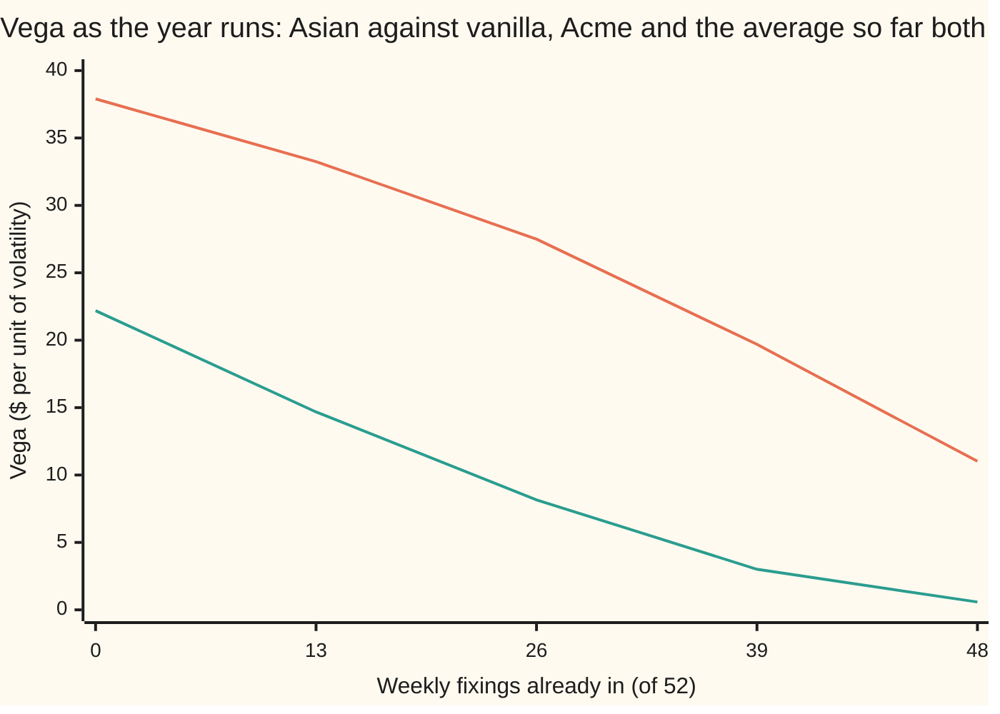
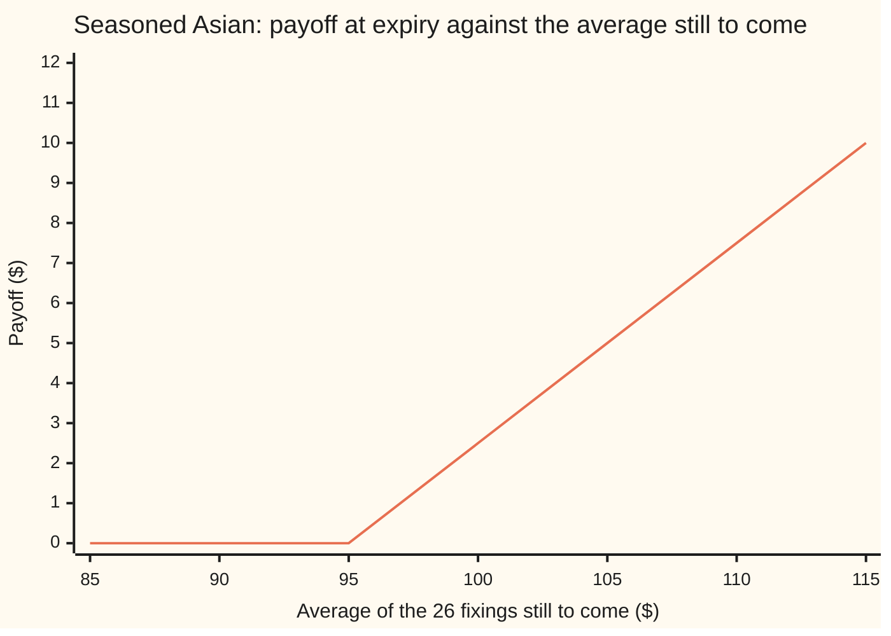

# Asian Greeks and implied volatility: averaging is a sedative, and the fixings already in are a fixed amount

[Syllabus](../../../SYLLABUS.md) → [Financial mathematics](../README.md) → [Averages, choosers, compounds and forward-starts](../README.md#s17) → Asian Greeks and implied volatility

---

## General Overview

A bank sells an airline a one-year call on Acme shares that settles on the average of 52 weekly closing prices. Acme trades at $100, the strike is $100, and the house market holds: 5 percent interest, 2 percent dividends, 20 percent volatility. This **arithmetic Asian call** is priced on [Arithmetic Asian options](02-arithmetic-asian-options.md): $5.26 simulated here, against $9.23 for the ordinary call that looks only at the last day.

The bank now has to hedge it. Hedging runs on the **Greeks**: the rates at which the price moves when one input moves. **Delta** is the dollars gained per dollar on Acme's price. **Gamma** is how fast delta itself changes. **Vega** is the dollars gained per unit of volatility, where one unit means volatility rising by 1.00 (from 20 percent to 120 percent). The ordinary call has delta 0.59 and vega $37.90. The Asian has delta 0.55 and vega $22.19. Averaging acts as a sedative: one wild week barely moves an average of 52.

Six months later, 26 fixings are in and they averaged $105. Those prices can no longer move: they are a fixed amount of money inside the payoff, and only the 26 fixings to come carry risk. With Acme back at $100 the vega is $6.21, under a quarter of the $27.50 on an ordinary six-month call.

The third job runs the other way: a broker quotes $5.26 and asks what volatility that implies. The price rises with volatility, so exactly one answer exists, and bisection (halving an interval that must contain it) returns 20 percent.

**The Asian's Greeks are the vanilla's Greeks seen through an average: delta and vega shrink because an average moves less than a last price, the fixings already in drop out of the risk as fixed money, and the price rises strictly with volatility, so each quote between two stated bounds has exactly one implied volatility.**

**What kind of fact this is:** a theorem inside the Black-Scholes model: the price rises strictly with volatility, proved on this card in Why it works, so the implied volatility is unique. The Greeks themselves are computed by a method, pathwise differentiation, whose correctness is proved on [Greeks inside the simulation](../07-Greeks%20by%20Numbers%20and%20Calibration/02-pathwise-and-likelihood-ratio-greeks.md).

### The picture: vega as the fixings come in



Top line: the ordinary call with the same time left, its vega shrinking roughly with the square root of that time. Bottom line: the Asian, simulated. It starts lower and falls faster, because two things shrink at once: the time left, and the share of the average that is still open.

---

## The formula

Notation first. A **fixing** is one of the dates whose closing price enters the average. There are $n$ fixings in all, one per week; $k$ are already in and $m = n - k$ are still to come. The fixings already in averaged $\bar a$. The fixings still to come will average $A_{\text{rest}}$, a random quantity today. The weight of the open part is $w = m/n$. $\mathbb{E}$ averages over Acme's paths in the risk-neutral world, where every asset earns the bank rate; Acme's price itself grows at $r - q$, since dividends leave it ([Black–Scholes call](../08-The%20Black-Scholes%20call%20and%20put/01-black-scholes-call.md)). The bold $\mathbf{1}\{\cdot\}$ is a switch: 1 when the statement inside is true, 0 when not.

The whole average splits into a fixed part and an open part:

$$A = \frac{k}{n}\,\bar a + w\,A_{\text{rest}}, \qquad (A - K)^+ = w\,\big(A_{\text{rest}} - K^*\big)^+, \qquad K^* = \frac{K - \tfrac{k}{n}\bar a}{w}$$

**Read it aloud:** the fixings already in are money in hand; subtract that from the strike, scale up by the open weight, and the contract is a smaller Asian on the fixings to come with a new strike.

The price and the two pathwise Greeks, with $\tau$ the time left and $t_j$ the time from today to the j-th fixing still to come:

$$V = e^{-r\tau}\,\mathbb{E}\big[(A-K)^+\big]$$

$$\Delta = e^{-r\tau}\,\mathbb{E}\Big[\mathbf{1}\{A > K\}\;\frac{w\,A_{\text{rest}}}{S}\Big], \qquad \mathcal{V} = e^{-r\tau}\,\mathbb{E}\Big[\mathbf{1}\{A > K\}\;\frac{w}{m}\sum_{j=1}^{m} S_j\,\big(W_j - \sigma t_j\big)\Big]$$

**Read it aloud:** on each paying path, count what the open average gains per dollar on Acme (delta) or per unit of volatility (vega); average and discount.

Gamma has no pathwise formula (Step 3 says why). It comes from bumping today's price by $h$ = $1:

$$\Gamma \approx \frac{V(S+h) - 2V(S) + V(S-h)}{h^2}$$

The inverse: the implied volatility is the $\sigma$ at which the model price equals a quote $Q$:

$$V(\sigma) = Q \quad\text{has exactly one root when}\quad e^{-r\tau}\big(w M_1 - wK^*\big)^+ < Q < e^{-r\tau}\,w M_1$$

**Read it aloud:** a quote above the zero-volatility floor and below the infinite-volatility ceiling pins down one volatility; outside that band there is none.

Here $M_1$ is the expected open average, $M_1 = \frac{S}{m}\sum_j e^{(r-q)t_j}$. For the fresh contract the band runs from $1.47 to $96.59.

| Symbol | Plain meaning | In our example | Push it up and the answer… |
| --- | --- | --- | --- |
| $V$, $Q$ | Asian call price today; a quoted price | $5.26 fresh; quote $5.26 | Q up: implied vol up |
| $A$, $A_{\text{rest}}$ | average of all 52 fixings; average of those still to come | settles at T | — |
| $S$, $S_j$ | Acme's price today; at the j-th fixing still to come | $100 | V rises; delta 0.55 |
| $K$, $K^*$ | the strike; the strike the open average must beat | $100; $95 after 26 fixings at $105 | V falls |
| $n$, $m$, $k$ | fixings in all, still to come, already in | 52; 26 and 26 when seasoned | more k: less risk left |
| $\bar a$, $w$ | average of the fixings already in; weight m/n of the open part | $105; 0.5 | ā up: V and delta rise |
| $r$, $q$, $\tau$ | bank rate, dividend yield, time left in years; $e^{-r\tau}$ discounts | 5%, 2%, 1 then 0.5 | τ down: vega shrinks |
| $\sigma$, $W$, $W_j$, $t_j$, $\eta$, $B$ | volatility; the Brownian path, its value at the j-th open fixing, and that fixing's time from today; in the proof, extra volatility and a second path | 20% | σ up: V rises, always |
| $\Delta$, $\Gamma$, $h$ | delta, dollars per dollar on Acme; gamma, change in delta per dollar; the bump size | 0.55; 0.032; $1 | — |
| $\mathcal{V}$ | vega, dollars per unit of volatility (divide by 100 for a volatility point) | $22.19 fresh, $6.21 seasoned | — |
| $M_1$, $M_2$, $v$, $c$ | expected open average and expected square; spread of its log in the moment road; share of log-variance an average keeps | $101.54 fresh; c 0.343 | — |
| $N$, $\varphi$, $d_1$ | bell-curve area and height; the moment road's distance to the strike | — | — |

A third road replaces the open average by a lognormal (a variable whose log is bell-curved) with the same mean $M_1$ and mean square $M_2 = \mathbb{E}[A_{\text{rest}}^2]$, so log-spread $v = \sqrt{\ln(M_2/M_1^2)}$:

$$V \approx e^{-r\tau}\,w\,\big[M_1 N(d_1) - K^* N(d_1 - v)\big], \qquad d_1 = \frac{\ln(M_1/K^*) + \tfrac12 v^2}{v}$$

In words: price the open average as a share with the right mean and spread. This is Lévy's approximation; since $M_1$ is proportional to $S$, it gives $\Delta \approx e^{-r\tau} w (M_1/S) N(d_1)$ and $\Gamma \approx e^{-r\tau} w (M_1/S)\varphi(d_1)/(S v)$.

### When it holds

- **Constant volatility, rates and dividends.** Under a smile each fixing sees its own volatility; the error is roughly vega times the gap between the flat number and the blend the average sees.
- **Draws held fixed.** Pathwise and bumped Greeks need the same random numbers at every input; fresh draws per bump turn a delta into the difference of two noisy prices.
- **A kink, not a jump.** Pathwise needs a payoff continuous in the average; for a digital Asian, paying a fixed sum above the strike, it returns zero.
- **A quote inside the band.** Outside it a solver returns the edge of its search interval, which means nothing.
- **Open strike positive.** If the average so far $\bar a$ reaches $(n/k)K$, then $K^* \le 0$: the call is certain to pay, its price no longer depends on volatility, and vega is zero. A quote at that price fits every volatility; any other quote fits none.

---

## Why it works

### Step 0: differentiate inside the average

A price is an average of payoffs over paths. Fix the random draws; each path's payoff is then an ordinary function of today's price and the volatility, with a slope by the chain rule. Averaging those slopes gives the price's slope: **pathwise differentiation**, one simulation for the price and every first-order Greek. Swapping slope and average is legitimate when each payoff is continuous with bounded slope, as the call's is ([Greeks inside the simulation](../07-Greeks%20by%20Numbers%20and%20Calibration/02-pathwise-and-likelihood-ratio-greeks.md)).

### Step 1: delta, because every fixing is a multiple of today's price

In the risk-neutral world each future price is today's price times a random factor that does not involve today's price:

$$S_j = S\,\exp\!\big((r - q - \tfrac12\sigma^2)\,t_j + \sigma W_j\big).$$

So the open average is proportional to $S$, and its slope in $S$ is $A_{\text{rest}}/S$. The payoff $(A - K)^+$ has slope 1 in $A$ where it pays and 0 where it does not. The chain rule gives the delta formula: the switch times $w A_{\text{rest}}/S$.

Why smaller than the vanilla's 0.59? Both are a discounted, share-weighted chance of paying. But the average grows about half as fast as Acme (expected $101.54 at the end), is discounted at the full bank rate (the vanilla's share only at the dividend yield), and has a narrower spread. Together these pull delta to 0.55.

### Step 2: vega, because volatility sits in two places in each fixing

Differentiate one fixing in $\sigma$, draws held fixed:

$$\frac{\partial S_j}{\partial\sigma} = S_j\,\big(W_j - \sigma t_j\big).$$

$W_j$ is the direct push: volatility stretches every random move. $-\sigma t_j$ is the drag from the drift's $-\tfrac12\sigma^2$, which keeps the expected price fixed. Average over the open fixings, switch on paying paths: the vega formula.

Why is it smaller than 37.90? The log of a weekly geometric average carries only a share $c = (n+1)(2n+1)/(6n^2) = 0.343$ of the last price's log-variance, as [The geometric Asian call](01-geometric-asian-kemna-vorst.md) proves; the arithmetic average behaves almost the same. An at-the-money price is close to proportional to the spread, so vega scales with $\sqrt{c}$ = 0.586. The vanilla's $37.90 times 0.586 is $22.20. The simulation gives $22.19.

### Step 3: gamma is where pathwise fails

Differentiate pathwise delta again, path by path. The factor $w A_{\text{rest}}/S$ does not depend on $S$, and the switch is flat except where the average exactly equals the strike. Every path's second slope is zero, so naive pathwise gamma is 0.000000. The true gamma sits in the switch's jump, which no single path sees.

Two repairs, both on shared draws: the second difference of the price, or the first difference of pathwise delta. They give 0.0324 and 0.0324; the moment road gives 0.0321.

That is *larger* than the vanilla's 0.0190. The sedative works on delta and vega, not on gamma at the money: a narrow spread makes the price curve bend tightly round the strike, as a vanilla's does near expiry. In the seasoned example Asian gamma is smaller: 0.0180 against 0.0275 for a six-month vanilla, because the weight halves it and the $95 strike moves the kink away from today's price.

### Step 4: the fixings in are a fixed amount

After 26 weekly fixings averaging $105, half the final average is already decided:

$$A = \tfrac{26}{52}\times 105 + \tfrac{26}{52}\,A_{\text{rest}} = 52.50 + 0.5\,A_{\text{rest}}.$$

The payoff $(A - 100)^+$ becomes $0.5\,(A_{\text{rest}} - 95)^+$: half a fresh six-month Asian on the 26 fixings to come, struck at $95. Every seasoned Greek is 0.5 times that contract's Greek. Three things shrink vega at once: the weight halves it, the time left is half a year, and the $95 strike puts the option in the money, where spread matters less. Vega falls to $6.21.



The kink sits at $95, not $100, and the slope is 0.5: the $52.50 already fixed moved the kink and halved the slope.

### Step 5: the price rises strictly with volatility

Take $\sigma$ and a larger $\sigma'$. Build the $\sigma'$ world from the $\sigma$ world by multiplying each price by independent noise with average 1, driven by a second Brownian path with volatility $\sqrt{\sigma'^2 - \sigma^2}$. Given the $\sigma$ path, the $\sigma'$ average is spread around the $\sigma$ average, centred on it.

A call payoff is **convex** (its graph bends upward), so averaging it over a spread of inputs gives at least the payoff at the centre: Jensen's inequality. Spreading can only raise the expected payoff, and strictly, since the spread straddles the kink with positive probability. Vega is never negative.

<details>
<summary>Detailed proof: monotonicity, the bounds, and existence</summary>

**Construction.** Let $\eta = \sqrt{\sigma'^2 - \sigma^2}$ and $B$ a Brownian motion independent of $W$. Then $\sigma W_t + \eta B_t$ is a Brownian motion scaled by $\sigma'$, so $S'_j = S_j\,e^{\eta B_j - \frac12\eta^2 t_j}$ has exactly the law of the $\sigma'$ prices. Each factor $e^{\eta B_j - \frac12\eta^2 t_j}$ has mean 1 and is independent of $W$, so $\mathbb{E}[A'_{\text{rest}} \mid W] = A_{\text{rest}}$.

**Jensen.** For the convex function $x \mapsto (x - K^*)^+$, conditional Jensen gives $\mathbb{E}[(A'_{\text{rest}} - K^*)^+ \mid W] \ge (A_{\text{rest}} - K^*)^+$. Take expectations: $V(\sigma') \ge V(\sigma)$. Equality would need $A'_{\text{rest}}$ to sit on one side of $K^*$ almost surely given $W$; but $A'_{\text{rest}}$ given $W$ has a continuous distribution on all of $(0, \infty)$, so the inequality is strict whenever $K^* > 0$. This is the argument of Carr, Ewald and Xiao (2008).

**Floor.** As $\sigma \to 0$ every path becomes the forward curve, $A_{\text{rest}} \to M_1$, and the price tends to $e^{-r\tau} w (M_1 - K^*)^+$. For the fresh contract that is $e^{-0.05} \times (101.54 - 100)$ = $1.47.

**Ceiling.** Write $(A - K^*)^+ = A - \min(A, K^*)$. As $\sigma \to \infty$ each $S_j \to 0$ in probability, so $\min(A_{\text{rest}}, K^*) \to 0$ in probability; it is bounded by $K^*$, so its expectation tends to 0. The price tends to $e^{-r\tau} w\,\mathbb{E}[A_{\text{rest}}] = e^{-r\tau} w M_1$, which is $96.59 for the fresh contract. It never reaches either bound.

**Existence.** $V$ is continuous in $\sigma$ (dominated convergence), strictly increasing, and runs between the two bounds. By the intermediate value theorem every $Q$ strictly between them is hit exactly once.

</details>

### Step 6: solve by bisection, or by Newton steered by the pathwise vega

**Bisection** starts with 1 to 100 percent, prices the midpoint, keeps the half that straddles the quote, and repeats; 24 rounds shrink the interval below one ten-millionth. Because the price is increasing, it cannot fail.

**Newton's method** steps by the price error over the slope, $\sigma \leftarrow \sigma - (V(\sigma) - Q)/\mathcal{V}(\sigma)$, with the slope being the pathwise vega the same simulation delivers free. From 30 percent it lands on 20 percent in three price evaluations; [Solving backwards](../07-Greeks%20by%20Numbers%20and%20Calibration/05-root-finding-for-inverses.md) covers both solvers properly.

Both solvers reuse the same draws at every trial volatility, so the simulated price is continuous in $\sigma$ and, with this many paths, increasing (the chart row in the output shows it). The quote made at 20 percent returns 20 percent exactly.

---

## Worked numbers, by hand

The fresh contract's vega from the vanilla's, and the seasoned contract rewritten:

| Step | Arithmetic | Value |
| --- | --- | --- |
| share of log-variance kept by 52 weekly fixings | $53 \times 105 / (6 \times 52^2)$ | 0.343 |
| its square root | $\sqrt{0.343}$ | 0.586 |
| vanilla vega, house call | from the vega card | $37.90 |
| Asian vega, estimated | $37.90 \times 0.586$ | $22.20 |
| Asian vega, simulated | pathwise | **$22.19** |
| fixed part after 26 fixings at $105 | $26/52 \times 105$ | $52.50 |
| open weight | $26/52$ | 0.5 |
| strike the open average must beat | $(100 - 52.50)/0.5$ | $95 |
| seasoned vega, simulated | pathwise | **$6.21** |
| expected average, fresh | $\tfrac{100}{52}\sum_j e^{0.03 j/52}$ | $101.54 |
| floor for a quote | $e^{-0.05} \times (101.54 - 100)$ | $1.47 |
| ceiling for a quote | $e^{-0.05} \times 101.54$ | $96.59 |

A one-point rise in volatility adds about 22 cents to the fresh Asian and 6 cents to the seasoned one, against 38 cents on the vanilla.

### The Greeks, three roads each

| Greek | Vanilla, 1 year | Asian, pathwise | Asian, bumped | Asian, moments | Vanilla, 6 months | Seasoned Asian, pathwise |
| --- | --- | --- | --- | --- | --- | --- |
| price | $9.23 | $5.26 (paths) | — | $5.27 | — | $3.38 |
| delta | 0.587 | 0.5514 | 0.5513 | 0.5554 | 0.564 | 0.3782 |
| gamma | 0.0190 | 0.0324 (bumped delta) | 0.0324 | 0.0321 | 0.0275 | 0.0180 (bumped) |
| vega | 37.90 | 22.19 | 22.19 | 22.36 | 27.50 | 6.21 |

Pathwise and bumped agree to the third decimal, because they share draws. The moment road is a different model of the average's shape and sits within 0.004 on delta and 0.17 on vega; its errors are the approximation's, not noise.

### What breaks if you drop a piece

| Mistake | Comes out at | What went wrong |
| --- | --- | --- |
| Ignore the 26 fixings in; price the rest as a fresh six-month Asian | vega $16.32, price $3.68 (right: $6.21 and $3.38) | The fixed $52.50 was dropped: weight 1 instead of 0.5, strike $100 instead of $95 |
| Take gamma pathwise, differentiating twice | 0.000000 (right: 0.0324) | Each path's second slope is zero; gamma lives in the jump of the switch |
| Hedge the Asian with the vanilla's delta | 0.587 shares, 0.0355 too many per option | The average responds less to today's price than the last fixing does |
| Invert the Asian quote with the vanilla formula | 9.42% (right: 20%) | The vanilla formula reads the Asian's calm as low volatility |

---

## As the fixings come in

Acme can sit still all year and the Asian's risk still drains away: each Friday one more price is locked into the average. One story, with Acme and the average so far both staying at $100:

| Fixings in | Time left | Asian vega, paths | Asian vega, moments | Vanilla vega, same time left |
| --- | --- | --- | --- | --- |
| 0 | 52 weeks | 22.19 | 22.36 | 37.90 |
| 13 | 39 weeks | 14.68 | 14.75 | 33.25 |
| 26 | 26 weeks | 8.16 | 8.19 | 27.50 |
| 39 | 13 weeks | 3.01 | 3.01 | 19.69 |
| 48 | 4 weeks | 0.58 | 0.58 | 11.02 |

Two forces act. **Time:** less room to wander; the vanilla feels only this, and its vega falls roughly as the square root of the time left. **Weight:** each fixing removes one fifty-second of the average from risk, and the open weight $w$ multiplies every Greek. The Asian feels both, so its vega falls roughly as the time left to the power one and a half. With four weeks to go the vanilla still has $11.02 of vega; the Asian has 58 cents.

The seasoned example differs on purpose: an average so far of $105 drops the open strike to $95, and vega is $6.21 rather than $8.16.

---

## Code, from first principles, and it actually runs

The code builds its own bell-curve area (a series), random numbers (splitmix64 and Box-Muller) and weekly paths, each draw used twice, as drawn and mirrored. Every Greek is reached three ways: pathwise, bumped on shared draws, and by the two-moment lognormal. The path machinery is first tested on one fixing, where it must reproduce the closed-form vanilla. The implied volatility is found by bisection and by Newton. Both programs use the same generator, so their outputs agree digit for digit.

### Python

```python
# Asian Greeks and implied volatility -- the check behind the card.  Standard library only.
# House market, 52 weekly fixings.  Nothing imported knows an answer: the bell-curve area
# is a series written out, the normal draws come from a splitmix64 generator written out,
# the paths are stepped by hand, and the root finders are bisection and Newton.
from math import exp, log, sqrt, pi, cos, sin

S, K, r, q, sig, n = 100.0, 100.0, 0.05, 0.02, 0.20, 52
dt, PAIRS = 1.0 / n, 65536                              # weekly step; antithetic pairs

def phi(x): return exp(-0.5 * x * x) / sqrt(2.0 * pi)   # bell-curve height
def N(x):                                               # bell-curve area left of x (series)
    if abs(x) > 9.0: return 1.0 if x > 0 else 0.0
    s, t, b, i = x, 0.0, x, 1.0
    while s != t:
        i += 2.0; b *= x * x / i; t, s = s, s + b
    return 0.5 + s * phi(x)

M64, state = (1 << 64) - 1, 20260924
def u01():                                              # splitmix64, uniform in (0, 1)
    global state
    state = (state + 0x9E3779B97F4A7C15) & M64
    z = ((state ^ (state >> 30)) * 0xBF58476D1CE4E5B9) & M64
    z = ((z ^ (z >> 27)) * 0x94D049BB133111EB) & M64
    return (((z ^ (z >> 31)) >> 11) + 0.5) / 9007199254740992.0
Z = []
while len(Z) < PAIRS * n:                               # Box-Muller: two normals per two uniforms
    rad, ang = sqrt(-2.0 * log(u01())), 2.0 * pi * u01()
    Z += [rad * cos(ang), rad * sin(ang)]

def paths(sg, m, h=dt):                                 # per path: A/S0 and (dA/dsigma)/S0
    c, sd, a, b = (r - q - 0.5 * sg * sg) * h, sqrt(h), [], []
    for p in range(PAIRS):
        for sgn in (1.0, -1.0):                         # each draw and its mirror image
            w = sa = sb = 0.0
            for j in range(m):
                w += sgn * sd * Z[p * n + j]
                e = exp(c * (j + 1) + sg * w)
                sa += e; sb += e * (w - sg * (j + 1) * h)
            a.append(sa / m); b.append(sb / m)
    return a, b

def value(ab, s0, wt, fx, tau):                         # price, pathwise delta, pathwise vega
    pay = dl = vg = 0.0
    for ai, bi in zip(*ab):
        x = fx + wt * s0 * ai - K                       # fixed part + weight * the rest - strike
        if x > 0.0: pay += x; dl += wt * ai; vg += wt * s0 * bi
    d = exp(-r * tau) / len(ab[0])
    return pay * d, dl * d, vg * d

def mc(m, fx, sg=sig, hs=1.0, hv=0.001):                # every Greek two ways, on one set of draws
    wt, tau, ab = m / n, m * dt, paths(sg, m)
    p0, dpw, vpw = value(ab, S, wt, fx, tau)
    pu, du, _ = value(ab, S + hs, wt, fx, tau); pd, dd, _ = value(ab, S - hs, wt, fx, tau)
    vu = value(paths(sg + hv, m), S, wt, fx, tau)[0]; vd = value(paths(sg - hv, m), S, wt, fx, tau)[0]
    tu, tv = value(ab, S + 1e-7, wt, fx, tau)[1], value(ab, S - 1e-7, wt, fx, tau)[1]
    return dict(p=p0, d_pw=dpw, d_b=(pu - pd) / (2 * hs), g_b=(pu - 2 * p0 + pd) / hs ** 2,
                g_pwb=(du - dd) / (2 * hs), g_naive=(tu - tv) / 2e-7, v_pw=vpw, v_b=(vu - vd) / (2 * hv), ab=ab)

def mm(m, fx, sg=sig, nn=n):                            # third road: lognormal with the average's two moments
    wt, h = m / nn, 1.0 / nn; tau, ks = m * h, (K - fx) * nn / m    # ks: strike the unfixed rest must beat
    M1 = S * sum(exp((r - q) * h * i) for i in range(1, m + 1)) / m
    M2 = S * S * sum(exp((r - q) * h * (i + j) + sg * sg * h * min(i, j))
                     for i in range(1, m + 1) for j in range(1, m + 1)) / (m * m)
    v = sqrt(log(M2 / (M1 * M1))); d1 = (log(M1 / ks) + 0.5 * v * v) / v; D = wt * exp(-r * tau)
    return D * (M1 * N(d1) - ks * N(d1 - v)), D * M1 / S * N(d1), D * M1 / S * phi(d1) / (S * v), M1
def mm_vega(m, fx, nn=n, h=1e-4): return (mm(m, fx, sig + h, nn)[0] - mm(m, fx, sig - h, nn)[0]) / (2 * h)

def bs(sg, tau):                                        # the vanilla yardstick: price, delta, gamma, vega
    d1 = (log(S / K) + (r - q + 0.5 * sg * sg) * tau) / (sg * sqrt(tau)); d2 = d1 - sg * sqrt(tau)
    return (S * exp(-q * tau) * N(d1) - K * exp(-r * tau) * N(d2), exp(-q * tau) * N(d1),
            exp(-q * tau) * phi(d1) / (S * sg * sqrt(tau)), S * exp(-q * tau) * phi(d1) * sqrt(tau))

def bisect(f, target, lo=0.01, hi=1.0, tol=1e-7):      # f rises in sigma: halve the bracket
    while hi - lo > tol:
        mid = 0.5 * (lo + hi)
        lo, hi = (mid, hi) if f(mid) < target else (lo, mid)
    return 0.5 * (lo + hi)

def out(label, *v): print(f"{label:<36}" + "".join(f"{x:>11.6f}" for x in v))
van = bs(sig, 1.0); pv = value(paths(sig, 1, 1.0), S, 1.0, 0.0, 1.0)
out("vanilla: price delta gamma vega", *van)
out("vanilla by paths: delta vega", pv[1], pv[2])
F, Fm = mc(n, 0.0), mm(n, 0.0)
out("fresh price: paths, moments", F["p"], Fm[0])
out("fresh delta: pathwise bump moments", F["d_pw"], F["d_b"], Fm[1])
out("fresh gamma: bump pw-bump moments", F["g_b"], F["g_pwb"], Fm[2])
out("fresh vega: pathwise bump moments", F["v_pw"], F["v_b"], mm_vega(n, 0.0))
c52 = (n + 1) * (2 * n + 1) / (6 * n * n)
out("by hand: share c, sqrt c, 37.90*sqrt c", c52, sqrt(c52), van[3] * sqrt(c52))
fx = 26 / n * 105.0
out("seasoned: fixed part, strike, weight", fx, (K - fx) * n / 26, 26 / n)
H, Hm = mc(26, fx), mm(26, fx)
out("seasoned price: paths, moments", H["p"], Hm[0])
out("seasoned delta: pathwise bump mom", H["d_pw"], H["d_b"], Hm[1])
out("seasoned gamma: bump pw-bump mom", H["g_b"], H["g_pwb"], Hm[2])
out("seasoned vega: pathwise bump mom", H["v_pw"], H["v_b"], mm_vega(26, fx))
out("vanilla 6 months: delta gamma vega", *bs(sig, 0.5)[1:])
ign = value(H["ab"], S, 1.0, 0.0, 0.5)
out("wrong: fixings ignored: price vega", ign[0], ign[2])
out("wrong: pathwise gamma, naive", F["g_naive"])
out("wrong: vanilla delta - Asian delta", van[1] - F["d_pw"])

Q = F["p"]; M1 = Fm[3]; D1 = exp(-r)                    # the quote: the paths price at 20%
out("quote; floor; ceiling; mean average", Q, D1 * max(M1 - K, 0.0), D1 * M1, M1)
def P(sg): return value(paths(sg, n), S, 1.0, 0.0, 1.0)
iv_b = bisect(lambda sg: P(sg)[0], Q)
sg, steps = 0.30, 0
while True:                                             # Newton, steered by the pathwise vega
    p, _, v = P(sg); steps += 1
    if abs(p - Q) < 1e-10 or steps > 10: break
    sg -= (p - Q) / v
out("implied vol: bisection, Newton, steps", iv_b, sg, steps)
iv_m = bisect(lambda s: mm(n, 0.0, s)[0], Q); iv_v = bisect(lambda s: bs(s, 1.0)[0], Q)
out("implied vol: moments; wrong: vanilla", iv_m, iv_v)
out("try: monthly vega; avg-in 90 vega", mm_vega(12, 0.0, 12), mm_vega(26, 26 / n * 90.0))

sgs = [0.05 * i for i in range(1, 9)]; curve = [P(s)[0] for s in sgs]
print("chart, sigma                  " + " ".join(f"{s:6.2f}" for s in sgs))
print("chart, price by paths         " + " ".join(f"{c:6.2f}" for c in curve))
ks = [0, 13, 26, 39, 48]
va_pw = [value(paths(sig, n - k), S, (n - k) / n, k / n * 100.0, (n - k) * dt)[2] for k in ks]
print("chart, fixings in             " + " ".join(f"{k:6d}" for k in ks))
print("chart, Asian vega, paths      " + " ".join(f"{v:6.2f}" for v in va_pw))
print("chart, Asian vega, moments    " + " ".join(f"{mm_vega(n - k, k / n * 100.0):6.2f}" for k in ks))
print("chart, vanilla vega, same left" + " ".join(f"{bs(sig, (n - k) * dt)[3]:6.2f}" for k in ks))
rest = [85.0 + 5.0 * i for i in range(7)]
print("chart, average of the rest    " + " ".join(f"{x:6.0f}" for x in rest))
print("chart, seasoned payoff        " + " ".join(f"{max(fx + 0.5 * x - K, 0.0):6.2f}" for x in rest))

assert abs(pv[2] - van[3]) < 0.5, "pathwise vega on one fixing vs the closed-form vanilla vega"
assert abs(F["d_pw"] - Fm[1]) < 0.01, "pathwise delta vs the moments road"
assert abs(H["d_pw"] - Hm[1]) < 0.01, "seasoned pathwise delta vs the moments road"
assert abs(F["v_pw"] - mm_vega(n, 0.0)) < 0.5, "pathwise vega vs the moments road"
assert abs(F["g_b"] - Fm[2]) < 0.002, "bumped gamma vs the moments gamma, fresh"
assert abs(H["g_b"] - Hm[2]) < 0.002, "bumped gamma vs the moments gamma, seasoned"
assert H["v_pw"] < F["v_pw"] < van[3], "averaging and seasoning both cut vega"
assert abs(iv_b - sig) < 1e-6, "bisection returns the vol that made the quote"
assert abs(sg - sig) < 1e-6, "Newton returns the vol that made the quote"
assert all(a < b for a, b in zip(curve, curve[1:])), "price rises with vol: the inverse is unique"
print("ALL CHECKS PASS")
```

**Ran 2026-09-24 on macOS, Python 3.14.6, standard library only. All checks passed. Output, pasted from the run:**

```
vanilla: price delta gamma vega        9.227006   0.586851   0.018951  37.901158
vanilla by paths: delta vega           0.586696  38.029448
fresh price: paths, moments            5.257422   5.272956
fresh delta: pathwise bump moments     0.551398   0.551335   0.555371
fresh gamma: bump pw-bump moments      0.032419   0.032368   0.032146
fresh vega: pathwise bump moments     22.190058  22.189861  22.357865
by hand: share c, sqrt c, 37.90*sqrt c   0.343010   0.585671  22.197603
seasoned: fixed part, strike, weight  52.500000  95.000000   0.500000
seasoned price: paths, moments         3.384096   3.392285
seasoned delta: pathwise bump mom      0.378185   0.378002   0.379167
seasoned gamma: bump pw-bump mom       0.017989   0.017882   0.017656
seasoned vega: pathwise bump mom       6.212271   6.211491   6.270941
vanilla 6 months: delta gamma vega     0.564485   0.027496  27.495794
wrong: fixings ignored: price vega     3.677406  16.319286
wrong: pathwise gamma, naive           0.000000
wrong: vanilla delta - Asian delta     0.035453
quote; floor; ceiling; mean average    5.257422   1.469078  96.592020 101.544399
implied vol: bisection, Newton, steps   0.200000   0.200000   3.000000
implied vol: moments; wrong: vanilla   0.199305   0.094168
try: monthly vega; avg-in 90 vega     23.396299   5.030328
chart, sigma                    0.05   0.10   0.15   0.20   0.25   0.30   0.35   0.40
chart, price by paths           2.01   3.05   4.15   5.26   6.37   7.48   8.59   9.70
chart, fixings in                  0     13     26     39     48
chart, Asian vega, paths       22.19  14.68   8.16   3.01   0.58
chart, Asian vega, moments     22.36  14.75   8.19   3.01   0.58
chart, vanilla vega, same left 37.90  33.25  27.50  19.69  11.02
chart, average of the rest        85     90     95    100    105    110    115
chart, seasoned payoff          0.00   0.00   0.00   2.50   5.00   7.50  10.00
ALL CHECKS PASS
```

On one fixing the paths give vanilla vega 38.03 against the exact 37.90: that 0.13 is simulation noise, and it sets the scale. The moment road differs by its own approximation error, 0.17 on vega.

### Rust

```rust
// Asian Greeks and implied volatility -- the same check in Rust.  Standard library only, no crates.
// Same splitmix64 draws, same paths, same three roads; the bell-curve area is the same series.
// Compile: rustc --edition 2021 -O asian_greeks_and_implied_volatility_check.rs -o /tmp/asian_iv
use std::f64::consts::PI;

const S: f64 = 100.0; const K: f64 = 100.0; const R: f64 = 0.05; const Q: f64 = 0.02; const SIG: f64 = 0.20;
const N: usize = 52; const PAIRS: usize = 65536; const DT: f64 = 1.0 / N as f64;

fn phi(x: f64) -> f64 { (-0.5 * x * x).exp() / (2.0 * PI).sqrt() }      // bell-curve height
fn ncdf(x: f64) -> f64 {                                                  // area left of x (series)
    if x.abs() > 9.0 { return if x > 0.0 { 1.0 } else { 0.0 }; }
    let (mut s, mut t, mut b, mut i) = (x, 0.0, x, 1.0);
    while s != t { i += 2.0; b *= x * x / i; t = s; s += b; }
    0.5 + s * phi(x)
}

struct Rng(u64);
impl Rng {                                                                // splitmix64, uniform in (0, 1)
    fn u01(&mut self) -> f64 {
        self.0 = self.0.wrapping_add(0x9E3779B97F4A7C15);
        let mut z = (self.0 ^ (self.0 >> 30)).wrapping_mul(0xBF58476D1CE4E5B9);
        z = (z ^ (z >> 27)).wrapping_mul(0x94D049BB133111EB);
        (((z ^ (z >> 31)) >> 11) as f64 + 0.5) / 9007199254740992.0
    }
}

struct Paths { a: Vec<f64>, b: Vec<f64> }                                 // A/S0 and (dA/dsigma)/S0
fn paths(z: &[f64], sg: f64, m: usize, h: f64) -> Paths {
    let (c, sd) = ((R - Q - 0.5 * sg * sg) * h, h.sqrt());
    let (mut a, mut b) = (Vec::with_capacity(2 * PAIRS), Vec::with_capacity(2 * PAIRS));
    for p in 0..PAIRS {
        for sgn in [1.0, -1.0] {                                          // each draw and its mirror image
            let (mut w, mut sa, mut sb) = (0.0, 0.0, 0.0);
            for j in 0..m {
                w += sgn * sd * z[p * N + j];
                let e = (c * (j + 1) as f64 + sg * w).exp();
                sa += e; sb += e * (w - sg * (j + 1) as f64 * h);
            }
            a.push(sa / m as f64); b.push(sb / m as f64);
        }
    }
    Paths { a, b }
}

fn value(ab: &Paths, s0: f64, wt: f64, fx: f64, tau: f64) -> (f64, f64, f64) {  // price, pathwise delta, vega
    let (mut pay, mut dl, mut vg) = (0.0, 0.0, 0.0);
    for (ai, bi) in ab.a.iter().zip(ab.b.iter()) {
        let x = fx + wt * s0 * ai - K;                                    // fixed part + weight * rest - strike
        if x > 0.0 { pay += x; dl += wt * ai; vg += wt * s0 * bi; }
    }
    let d = (-R * tau).exp() / ab.a.len() as f64;
    (pay * d, dl * d, vg * d)
}

struct Mc { p: f64, d_pw: f64, d_b: f64, g_b: f64, g_pwb: f64, g_naive: f64, v_pw: f64, v_b: f64, ab: Paths }
fn mc(z: &[f64], m: usize, fx: f64) -> Mc {                               // every Greek two ways, one set of draws
    let (wt, tau, hs, hv) = (m as f64 / N as f64, m as f64 * DT, 1.0, 0.001);
    let ab = paths(z, SIG, m, DT);
    let (p0, dpw, vpw) = value(&ab, S, wt, fx, tau);
    let ((pu, du, _), (pd, dd, _)) = (value(&ab, S + hs, wt, fx, tau), value(&ab, S - hs, wt, fx, tau));
    let vu = value(&paths(z, SIG + hv, m, DT), S, wt, fx, tau).0;
    let vd = value(&paths(z, SIG - hv, m, DT), S, wt, fx, tau).0;
    let (tu, tv) = (value(&ab, S + 1e-7, wt, fx, tau).1, value(&ab, S - 1e-7, wt, fx, tau).1);
    Mc { p: p0, d_pw: dpw, d_b: (pu - pd) / (2.0 * hs), g_b: (pu - 2.0 * p0 + pd) / (hs * hs),
         g_pwb: (du - dd) / (2.0 * hs), g_naive: (tu - tv) / 2e-7, v_pw: vpw, v_b: (vu - vd) / (2.0 * hv), ab }
}

fn mm(m: usize, fx: f64, sg: f64, nn: usize) -> (f64, f64, f64, f64) {   // third road: two-moment lognormal
    let (wt, h) = (m as f64 / nn as f64, 1.0 / nn as f64);
    let (tau, ks) = (m as f64 * h, (K - fx) * nn as f64 / m as f64);      // strike the unfixed rest must beat
    let mut m1 = 0.0; let mut m2 = 0.0;
    for i in 1..=m { m1 += ((R - Q) * h * i as f64).exp();
        for j in 1..=m { m2 += ((R - Q) * h * (i + j) as f64 + sg * sg * h * i.min(j) as f64).exp(); } }
    let m1 = S * m1 / m as f64; let m2 = S * S * m2 / (m * m) as f64;
    let v = (m2 / (m1 * m1)).ln().sqrt(); let d1 = ((m1 / ks).ln() + 0.5 * v * v) / v;
    let d = wt * (-R * tau).exp();
    (d * (m1 * ncdf(d1) - ks * ncdf(d1 - v)), d * m1 / S * ncdf(d1), d * m1 / S * phi(d1) / (S * v), m1)
}
fn mm_vega(m: usize, fx: f64, nn: usize) -> f64 { (mm(m, fx, SIG + 1e-4, nn).0 - mm(m, fx, SIG - 1e-4, nn).0) / 2e-4 }

fn bs(sg: f64, tau: f64) -> [f64; 4] {                                    // vanilla: price, delta, gamma, vega
    let d1 = ((S / K).ln() + (R - Q + 0.5 * sg * sg) * tau) / (sg * tau.sqrt()); let d2 = d1 - sg * tau.sqrt();
    [S * (-Q * tau).exp() * ncdf(d1) - K * (-R * tau).exp() * ncdf(d2), (-Q * tau).exp() * ncdf(d1),
     (-Q * tau).exp() * phi(d1) / (S * sg * tau.sqrt()), S * (-Q * tau).exp() * phi(d1) * tau.sqrt()]
}

fn bisect(f: &dyn Fn(f64) -> f64, target: f64) -> f64 {                  // f rises in sigma: halve the bracket
    let (mut lo, mut hi) = (0.01, 1.0);
    while hi - lo > 1e-7 { let mid = 0.5 * (lo + hi); if f(mid) < target { lo = mid } else { hi = mid } }
    0.5 * (lo + hi)
}

fn out(label: &str, v: &[f64]) {
    println!("{:<36}{}", label, v.iter().map(|x| format!("{:>11.6}", x)).collect::<String>());
}
fn row(label: &str, v: &[String]) { println!("{:<30}{}", label, v.join(" ")); }

fn main() {
    let mut rng = Rng(20260924);
    let mut z: Vec<f64> = Vec::with_capacity(PAIRS * N);
    while z.len() < PAIRS * N {                                           // Box-Muller: two normals per two uniforms
        let rad = (-2.0 * rng.u01().ln()).sqrt(); let ang = 2.0 * PI * rng.u01();
        z.push(rad * ang.cos()); z.push(rad * ang.sin());
    }
    let van = bs(SIG, 1.0); let pv = value(&paths(&z, SIG, 1, 1.0), S, 1.0, 0.0, 1.0);
    out("vanilla: price delta gamma vega", &van);
    out("vanilla by paths: delta vega", &[pv.1, pv.2]);
    let (f, fm) = (mc(&z, N, 0.0), mm(N, 0.0, SIG, N));
    out("fresh price: paths, moments", &[f.p, fm.0]);
    out("fresh delta: pathwise bump moments", &[f.d_pw, f.d_b, fm.1]);
    out("fresh gamma: bump pw-bump moments", &[f.g_b, f.g_pwb, fm.2]);
    out("fresh vega: pathwise bump moments", &[f.v_pw, f.v_b, mm_vega(N, 0.0, N)]);
    let c52 = ((N + 1) * (2 * N + 1)) as f64 / (6 * N * N) as f64;
    out("by hand: share c, sqrt c, 37.90*sqrt c", &[c52, c52.sqrt(), van[3] * c52.sqrt()]);
    let fx = 26.0 / N as f64 * 105.0;
    out("seasoned: fixed part, strike, weight", &[fx, (K - fx) * N as f64 / 26.0, 26.0 / N as f64]);
    let (h, hm) = (mc(&z, 26, fx), mm(26, fx, SIG, N));
    out("seasoned price: paths, moments", &[h.p, hm.0]);
    out("seasoned delta: pathwise bump mom", &[h.d_pw, h.d_b, hm.1]);
    out("seasoned gamma: bump pw-bump mom", &[h.g_b, h.g_pwb, hm.2]);
    out("seasoned vega: pathwise bump mom", &[h.v_pw, h.v_b, mm_vega(26, fx, N)]);
    out("vanilla 6 months: delta gamma vega", &bs(SIG, 0.5)[1..]);
    let ign = value(&h.ab, S, 1.0, 0.0, 0.5);
    out("wrong: fixings ignored: price vega", &[ign.0, ign.2]);
    out("wrong: pathwise gamma, naive", &[f.g_naive]);
    out("wrong: vanilla delta - Asian delta", &[van[1] - f.d_pw]);

    let (quote, m1, d1) = (f.p, fm.3, (-R).exp());                        // the quote: the paths price at 20%
    out("quote; floor; ceiling; mean average", &[quote, d1 * (m1 - K).max(0.0), d1 * m1, m1]);
    let price = |sg: f64| value(&paths(&z, sg, N, DT), S, 1.0, 0.0, 1.0);
    let iv_b = bisect(&|sg| price(sg).0, quote);
    let (mut sg, mut steps) = (0.30, 0);
    loop {                                                                // Newton, steered by the pathwise vega
        let (p, _, v) = price(sg); steps += 1;
        if (p - quote).abs() < 1e-10 || steps > 10 { break; }
        sg -= (p - quote) / v;
    }
    out("implied vol: bisection, Newton, steps", &[iv_b, sg, steps as f64]);
    let iv_m = bisect(&|s| mm(N, 0.0, s, N).0, quote); let iv_v = bisect(&|s| bs(s, 1.0)[0], quote);
    out("implied vol: moments; wrong: vanilla", &[iv_m, iv_v]);
    out("try: monthly vega; avg-in 90 vega", &[mm_vega(12, 0.0, 12), mm_vega(26, 26.0 / N as f64 * 90.0, N)]);

    let sgs: Vec<f64> = (1..=8).map(|i| 0.05 * i as f64).collect();
    let curve: Vec<f64> = sgs.iter().map(|&s| price(s).0).collect();
    row("chart, sigma", &sgs.iter().map(|s| format!("{:6.2}", s)).collect::<Vec<_>>());
    row("chart, price by paths", &curve.iter().map(|c| format!("{:6.2}", c)).collect::<Vec<_>>());
    let ks = [0usize, 13, 26, 39, 48];
    let va_pw: Vec<f64> = ks.iter().map(|&k| value(&paths(&z, SIG, N - k, DT), S, (N - k) as f64 / N as f64,
                                                   k as f64 / N as f64 * 100.0, (N - k) as f64 * DT).2).collect();
    row("chart, fixings in", &ks.iter().map(|k| format!("{:6}", k)).collect::<Vec<_>>());
    row("chart, Asian vega, paths", &va_pw.iter().map(|v| format!("{:6.2}", v)).collect::<Vec<_>>());
    row("chart, Asian vega, moments", &ks.iter().map(|&k| format!("{:6.2}", mm_vega(N - k, k as f64 / N as f64 * 100.0, N))).collect::<Vec<_>>());
    row("chart, vanilla vega, same left", &ks.iter().map(|&k| format!("{:6.2}", bs(SIG, (N - k) as f64 * DT)[3])).collect::<Vec<_>>());
    let rest: Vec<f64> = (0..7).map(|i| 85.0 + 5.0 * i as f64).collect();
    row("chart, average of the rest", &rest.iter().map(|x| format!("{:6.0}", x)).collect::<Vec<_>>());
    row("chart, seasoned payoff", &rest.iter().map(|x| format!("{:6.2}", (fx + 0.5 * x - K).max(0.0))).collect::<Vec<_>>());

    assert!((pv.2 - van[3]).abs() < 0.5, "pathwise vega on one fixing vs the closed-form vanilla vega");
    assert!((f.d_pw - fm.1).abs() < 0.01, "pathwise delta vs the moments road");
    assert!((h.d_pw - hm.1).abs() < 0.01, "seasoned pathwise delta vs the moments road");
    assert!((f.v_pw - mm_vega(N, 0.0, N)).abs() < 0.5, "pathwise vega vs the moments road");
    assert!((f.g_b - fm.2).abs() < 0.002, "bumped gamma vs the moments gamma, fresh");
    assert!((h.g_b - hm.2).abs() < 0.002, "bumped gamma vs the moments gamma, seasoned");
    assert!(h.v_pw < f.v_pw && f.v_pw < van[3], "averaging and seasoning both cut vega");
    assert!((iv_b - SIG).abs() < 1e-6, "bisection returns the vol that made the quote");
    assert!((sg - SIG).abs() < 1e-6, "Newton returns the vol that made the quote");
    assert!(curve.windows(2).all(|w| w[0] < w[1]), "price rises with vol: the inverse is unique");
    println!("ALL CHECKS PASS");
}
```

**Ran 2026-09-24 on macOS, rustc 1.98.1, no crates. All checks passed. Output, pasted from the run:**

```
vanilla: price delta gamma vega        9.227006   0.586851   0.018951  37.901158
vanilla by paths: delta vega           0.586696  38.029448
fresh price: paths, moments            5.257422   5.272956
fresh delta: pathwise bump moments     0.551398   0.551335   0.555371
fresh gamma: bump pw-bump moments      0.032419   0.032368   0.032146
fresh vega: pathwise bump moments     22.190058  22.189861  22.357865
by hand: share c, sqrt c, 37.90*sqrt c   0.343010   0.585671  22.197603
seasoned: fixed part, strike, weight  52.500000  95.000000   0.500000
seasoned price: paths, moments         3.384096   3.392285
seasoned delta: pathwise bump mom      0.378185   0.378002   0.379167
seasoned gamma: bump pw-bump mom       0.017989   0.017882   0.017656
seasoned vega: pathwise bump mom       6.212271   6.211491   6.270941
vanilla 6 months: delta gamma vega     0.564485   0.027496  27.495794
wrong: fixings ignored: price vega     3.677406  16.319286
wrong: pathwise gamma, naive           0.000000
wrong: vanilla delta - Asian delta     0.035453
quote; floor; ceiling; mean average    5.257422   1.469078  96.592020 101.544399
implied vol: bisection, Newton, steps   0.200000   0.200000   3.000000
implied vol: moments; wrong: vanilla   0.199305   0.094168
try: monthly vega; avg-in 90 vega     23.396299   5.030328
chart, sigma                    0.05   0.10   0.15   0.20   0.25   0.30   0.35   0.40
chart, price by paths           2.01   3.05   4.15   5.26   6.37   7.48   8.59   9.70
chart, fixings in                  0     13     26     39     48
chart, Asian vega, paths       22.19  14.68   8.16   3.01   0.58
chart, Asian vega, moments     22.36  14.75   8.19   3.01   0.58
chart, vanilla vega, same left 37.90  33.25  27.50  19.69  11.02
chart, average of the rest        85     90     95    100    105    110    115
chart, seasoned payoff          0.00   0.00   0.00   2.50   5.00   7.50  10.00
ALL CHECKS PASS
```

The two outputs are identical line for line.

> [!TIP]
> **Try changing**
> Guess the direction first. Then run it.
> - **Monthly fixings instead of weekly.** Set 12 fixings. Fewer, wider-spaced prices average less, so the contract is a little closer to the vanilla: the moment road's vega rises from $22.36 to **$23.40**.
> - **A lower average so far.** Put the 26 fixings in at $90 instead of $105. The open average must now beat $110, the option is out of the money, and the moment road's vega is **$5.03** instead of $6.27.
> - **A quote below the floor.** Ask for the implied volatility of a $1.00 quote on the fresh contract. It sits under the $1.47 floor, so no volatility exists; bisection returns the bottom of its interval, 1 percent, and that number is meaningless.
> - **Invert with the wrong pricer.** Feed the $5.26 quote to the moment road instead of the paths. It returns **19.93%**: a different model of the same contract gives a different volatility for the same dollars.

---

## The usual mistake

> [!warning]
> **Reading an Asian implied volatility as a vanilla one.** The Asian's implied volatility is the volatility of Acme that, fed to an Asian pricer, reproduces the quote. Feed the $5.26 Asian price to the vanilla formula instead and it returns 9.42 percent. Compared with the 20 percent on a vanilla screen, the Asian looks absurdly cheap. It is not cheap; it is calm.
>
> Smaller traps:
> - **Repricing the fixings already in.** Once a fixing is in, it is money, not risk. Ignoring them and pricing the rest as a fresh Asian at the old strike gives vega $16.32 instead of $6.21, and a hedge more than two and a half times too large.
> - **Assuming every Greek shrinks.** At the money on day one gamma grows: 0.0324 against the vanilla's 0.0190.
> - **Taking gamma pathwise.** It comes out at exactly zero on every path. Use a bump on shared draws, or the likelihood-ratio method.
> - **Trusting an implied volatility across pricers.** The same quote returns 20.00 percent by simulation and 19.93 percent by the moment road. A volatility quoted for an Asian is only meaningful alongside the pricer that produced it.

---

## Where you meet it in real life

- **Fuel hedges.** Average-price options on jet fuel and diesel are the core of airline and freight hedging; the seller hedges with this card's delta and vega and watches vega drain as each month fixes.
- **Commodity volatility books.** Average-price options are quoted by implied volatility and converted with an Asian pricer. Their vega is hedged with fewer vanillas than face value suggests, and fewer each week.
- **Exporters' currency hedges.** A company converting sales weekly cares about the average rate; Lévy's average-rate options match that exposure.
- **Other contracts on this shelf.** A chooser lets the holder pick call or put at a set date: [Chooser options](04-chooser-options.md). An option on an option: [Compound options](05-compound-options.md). A strike set later, at the money: [Forward-start options](06-forward-start-options-and-forward-volatility.md), and a chain of those: [Cliquets](07-cliquets-and-ratchets.md).

> **Say it back**
> An Asian's delta and vega are the vanilla's seen through an average: 0.55 and $22.19 against 0.59 and $37.90, because an average moves less than a last price. Pathwise differentiation computes them from one simulation by holding the draws fixed; gamma needs a bump, because every path's second slope is zero. Fixings already in are money, not risk, so the seasoned contract is a smaller Asian with a shifted strike, and its vega falls to $6.21. Price rises strictly with volatility, by Jensen's inequality, so a quote between the floor and the ceiling has exactly one implied volatility. That volatility belongs to the pricer that produced it, and bisection on the simulation returns 20 percent.

---

## What this builds on

- [Arithmetic Asian options](02-arithmetic-asian-options.md): the contract itself, its $5.26 price, and the moment-matched lognormal used here as the third road.
- [Vega](../09-The%20Greeks%2C%20one%20each/03-vega.md): the vanilla's $37.90 yardstick, and vega's role in steering an implied-volatility search.
- [Greeks inside the simulation](../07-Greeks%20by%20Numbers%20and%20Calibration/02-pathwise-and-likelihood-ratio-greeks.md): why differentiating inside the average is legitimate for a kink and fails for a jump.

## Where this goes next

The shelf moves on to other path-dependent contracts: [Chooser options](04-chooser-options.md) next, where the holder's choice at a set date plays the role the fixings play here.

This card leaves one question open: when volatility itself varies by strike and date, which single number should an Asian's vega be measured against? That belongs to smile models, beyond this shelf.

---

## Sources

Verified 2026-09-24: every link below resolves to the publisher's page.

- Broadie, Mark, and Paul Glasserman. "Estimating Security Price Derivatives Using Simulation." *Management Science* 42, no. 2 (1996): 269–285. [doi:10.1287/mnsc.42.2.269](https://doi.org/10.1287/mnsc.42.2.269). The pathwise and likelihood-ratio Greeks, with Asian options as a worked case.
- Lévy, Edmond. "Pricing European Average Rate Currency Options." *Journal of International Money and Finance* 11, no. 5 (1992): 474–491. [doi:10.1016/0261-5606(92)90013-N](https://doi.org/10.1016/0261-5606(92)90013-N). The two-moment lognormal approximation used as the third road.
- Carr, Peter, Christian-Oliver Ewald, and Yajun Xiao. "On the Qualitative Effect of Volatility and Duration on Prices of Asian Options." *Finance Research Letters* 5, no. 3 (2008): 162–171. [doi:10.1016/j.frl.2008.05.001](https://doi.org/10.1016/j.frl.2008.05.001). The proof that the Asian price rises with volatility, which makes the implied volatility unique.
- Kemna, A. G. Z., and A. C. F. Vorst. "A Pricing Method for Options Based on Average Asset Values." *Journal of Banking & Finance* 14, no. 1 (1990): 113–129. [doi:10.1016/0378-4266(90)90039-5](https://doi.org/10.1016/0378-4266(90)90039-5). The geometric average's variance share, behind the √c vega estimate.
- Glasserman, Paul. *Monte Carlo Methods in Financial Engineering*. Springer, 2003. [Publisher page](https://link.springer.com/book/10.1007/978-0-387-21617-1). Pathwise estimators, common random numbers and antithetic draws, as used in the code.
