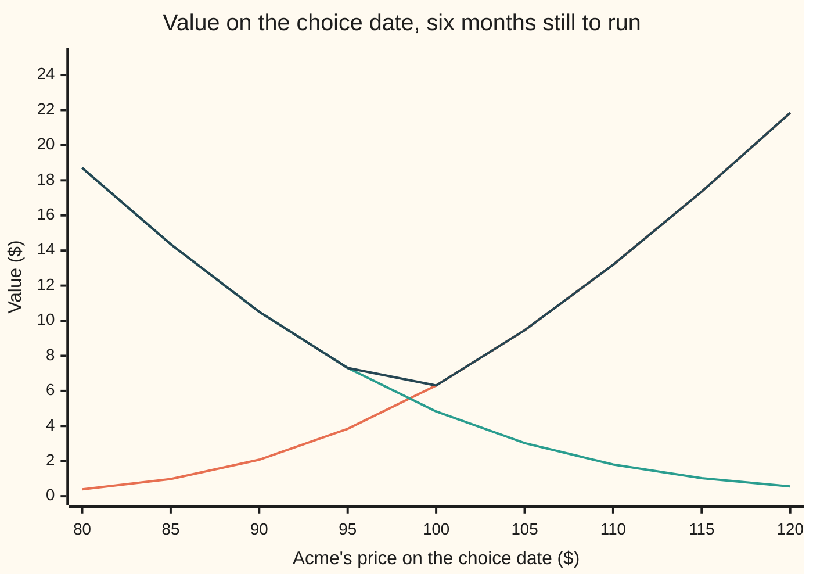
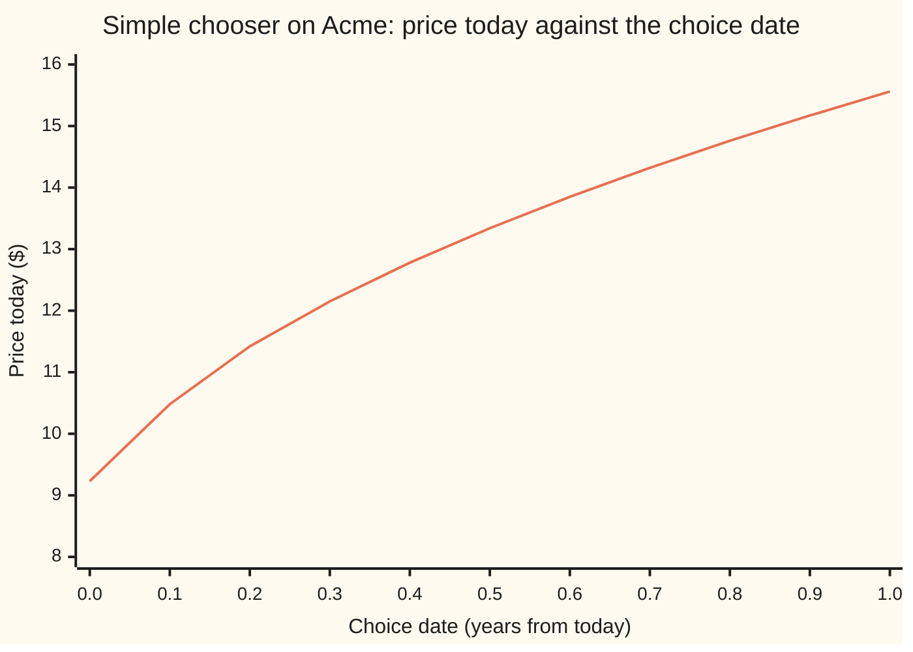

# Chooser options: decide later whether it is a call or a put, and parity prices it today

[Syllabus](../../../SYLLABUS.md) → [Financial mathematics](../../../SYLLABUS.md#w12) → [Averages, choosers, compounds and forward-starts](../../../SYLLABUS.md#w12-s17) → Chooser options

---

## General Overview

Acme shares trade at $100 today. A one-year call on Acme struck at $100 costs $9.23 in the house market. The matching put costs $6.33. A call pays if Acme rises; a put pays if it falls. Buying one means taking a side today.

Now suppose a big event lands in six months: a court ruling, an election, a drug trial. Acme will move hard after it, and nobody can say which way. A **chooser option** fits that view. It is bought today. In six months, on a fixed day called the **choice date**, its holder declares it a call or a put. From then on it is that ordinary option, with strike $100 and the same one-year expiry.

The holder will pick whichever is worth more on the choice date. So the chooser is worth at least the better of the two options, and less than owning both. For Acme it costs **$13.34**: more than the $9.23 call, less than the $15.56 that buys the call and the put together.

The surprise is how that price is found. The better of two options sounds like a hard thing to price. Put-call parity, the fixed link between a call and a put on the same strike and expiry, turns it into two ordinary options priced by Black-Scholes: the one-year call, plus a six-month put on a slightly lower strike, $98.51.

**At the choice date, parity makes the put equal to the call plus a known amount of cash minus a known amount of stock, so "the better of the two" is the call plus a put that pays exactly when the put would have been picked.**

**What kind of fact this is:** a theorem, proved on this card in Why it works. The split into a call plus a put holds in any market where put-call parity holds; the dollar prices then come from the Black-Scholes model, which is an assumption, not a law.

### The picture: what the holder has on the choice date

Acme's price on the choice date runs left to right. The value of each leg, with six months still to run, runs up the page. The chooser is worth whichever is higher.



First line, rising: the call's value on the choice date. Second line, falling: the put's value. Third line: the chooser, the higher of the two, a V with its corner where the legs cross. They cross at $98.51, not at the $100 strike. Above that price the holder says "call", below it "put". Why the crossing sits there is Step 3.

---

## The formula

A little notation first. $C(S, K, T)$ means the Black-Scholes price of a call on a share now at $S$, with strike $K$ and $T$ years to run; $P(S, K, T)$ is the matching put. The choice date is $\tau$ years from today (the Greek letter tau).

$$V = C(S,\,K,\,T) \;+\; e^{-q(T-\tau)}\,P\!\left(S,\,K',\,\tau\right), \qquad K' = K\,e^{-(r-q)(T-\tau)}$$

**Read it aloud:** a simple chooser is the full-life call, plus a slightly smaller amount of a put that expires on the choice date, struck at the strike pulled back by the carry over the remaining life.

| Symbol | Plain meaning | In our example | Push it up and the answer… |
| --- | --- | --- | --- |
| $V$ | price today of the simple chooser | $13.34 | is the answer |
| $S$, $S_\tau$ | Acme's price today; its price on the choice date | $100 | rises: the call leg gains more than the put leg loses |
| $K$ | the strike shared by the call and the put | $100 | falls slightly: the call leg loses more than the put leg gains |
| $T$ | years until both legs expire | 1 | rises: the call leg gains time; the put leg shrinks a little |
| $\tau$ | years until the choice date | 0.5 | rises: more is known before choosing, so the price rises |
| $r$, $q$ | bank rate and dividend yield, continuously compounded | 5% and 2% | $r$ up: rises; $q$ up: falls. Together they set the carry, and so $K'$ |
| $\sigma$ | Acme's volatility: the spread of its yearly log return | 20% | rises sharply: both legs gain |
| $C$, $P$ | Black-Scholes call and put prices, with the three inputs in brackets | $9.23 and $6.33 for one year | — |
| $K'$ | the put leg's strike, $K e^{-(r-q)(T-\tau)}$ | $98.51 | — |
| $d_1$, $d_2$, $N$, $E$ | the put leg's Black-Scholes distances; $N$ is the bell-curve area to the left of a point; $E$ is an average in the pretend (risk-neutral) world, where every asset grows at the bank rate | 0.2828, 0.1414 | — |
| $e^{-q(T-\tau)}$ | how many put legs: the dividend drag over the time after the choice date | 0.9900 | — |
| $S^*$ | the critical price: on the choice date, above it the call is worth more, below it the put | $98.51 | — |

The put leg's distances are the Black-Scholes ones with strike $K'$ and life $\tau$:

$$d_1 = \frac{\ln(S/K') + (r - q + \tfrac12\sigma^2)\,\tau}{\sigma\sqrt{\tau}}, \qquad d_2 = d_1 - \sigma\sqrt{\tau}$$

In words: $d_2$ counts how far Acme must travel to reach $K'$ by the choice date, in units of its spread over that time; $d_1$ is one spread further.

### When it holds

- **Both legs are European.** Parity is an exact equation only for options used on the expiry day. If either leg can be used early, parity becomes a pair of inequalities and the split into a call plus a put fails.
- **One strike and one expiry for both legs.** With different strikes or dates the cash in the parity equation no longer matches, and the chooser becomes the complex chooser below, with no two-option split.
- **A known, continuous dividend yield and a known bank rate over the life.** With cash dividends paid after the choice date, the $e^{-q(T-\tau)}$ drag and the strike $K'$ are replaced by the present value of those dividends; using the yield version then misprices the put leg.
- **The Black-Scholes model prices the two pieces.** The split itself is model-free. With a volatility smile, price the call at the volatility for strike $K$ and one year, and the put leg at the volatility for strike $K'$ and six months; one flat $\sigma$ is off by roughly each leg's vega times its volatility error.
- **The holder picks the dearer option.** A holder who picks by forecast rather than by value gets a payoff worth less than $V$.

---

## Why it works

### Step 0: parity turns "the better of two" into "one plus a top-up"

On the choice date the holder owns the better of a call and a put. The difference between a call and a put on the same strike and expiry is not random: parity fixes it as some shares minus some cash. So "the better of the two" is "the call, plus the amount by which the put beats it, when it does". That amount is a known quantity of cash minus a known quantity of shares, floored at zero. A payoff of the form "cash minus shares, floored at zero" is a put. Two plain options, two Black-Scholes prices.

### Step 1: on the choice date the chooser is worth the dearer leg

On the choice date both legs have a market price, $C_\tau$ for the call and $P_\tau$ for the put, each with $T - \tau$ years left. The holder can declare either and sell it at once. So the chooser is worth

$$V_\tau = \max(C_\tau,\; P_\tau).$$

Picking the dearer is the only rational choice: picking the cheaper one is the same as picking the dearer and throwing money away.

### Step 2: parity on the choice date

Put-call parity, on [Put-call parity](../08-The%20Black-Scholes%20call%20and%20put/03-put-call-parity.md), holds on every date, not only today. On the choice date it reads

$$C_\tau - P_\tau = S_\tau\,e^{-q(T-\tau)} - K\,e^{-r(T-\tau)}.$$

The right side is a share held to expiry, less its leaked dividends, minus the strike discounted back from expiry. Solve for the put and put it into Step 1:

$$\max(C_\tau, P_\tau) = C_\tau + \max\!\left(0,\; K e^{-r(T-\tau)} - S_\tau e^{-q(T-\tau)}\right).$$

The first term is the call. The second is zero when the call is the better leg, and exactly the put's advantage when it is not.

### Step 3: the top-up is a put that expires on the choice date

Pull $e^{-q(T-\tau)}$ out of the second term:

$$K e^{-r(T-\tau)} - S_\tau e^{-q(T-\tau)} = e^{-q(T-\tau)}\left(K e^{-(r-q)(T-\tau)} - S_\tau\right) = e^{-q(T-\tau)}\,(K' - S_\tau).$$

So the top-up pays, on the choice date, $e^{-q(T-\tau)}$ units of $\max(K' - S_\tau, 0)$. That is the payoff of a put struck at $K'$ that expires on the choice date, held in quantity $e^{-q(T-\tau)}$.

The same algebra says where the two legs cross. The put is picked when $S_\tau < K'$, so the critical price is $S^* = K'$. For Acme, $K' = 100\,e^{-0.03 \times 0.5}$ = $98.51. In words: the holder picks the call exactly when the forward price for the remaining six months, $S_\tau e^{(r-q)(T-\tau)}$, is above the strike. Not when the share is above the strike. Carry decides, not the spot price.

### Step 4: price the two pieces today

The call piece is the call held from today to expiry, whatever happens on the choice date: its price today is $C(S, K, T)$. The put piece is a put on Acme expiring on the choice date: its price today is $P(S, K', \tau)$, times the quantity $e^{-q(T-\tau)}$. Adding them gives the formula. Both prices come straight from [Black–Scholes call](../08-The%20Black-Scholes%20call%20and%20put/01-black-scholes-call.md) and [Black-Scholes put](../08-The%20Black-Scholes%20call%20and%20put/02-black-scholes-put.md).

<details>
<summary>Detailed proof</summary>

Work in the pretend world where every asset grows at the bank rate (the risk-neutral measure), so any price today is the discounted pretend-world average of what it is worth later.

1. On the choice date the chooser is worth $\max(C_\tau, P_\tau)$ (Step 1), so $V = e^{-r\tau}\,E[\max(C_\tau, P_\tau)]$, where $E$ is the pretend-world average.
2. Parity on the choice date (Step 2) gives $\max(C_\tau, P_\tau) = C_\tau + e^{-q(T-\tau)}\max(K' - S_\tau, 0)$, path by path, with nothing assumed about how Acme moves.
3. Averages add, so $V = e^{-r\tau}E[C_\tau] + e^{-q(T-\tau)}\,e^{-r\tau}E[\max(K' - S_\tau, 0)]$.
4. $C_\tau$ is itself the discounted average of the call's final payoff, $e^{-r(T-\tau)}E_\tau[\max(S_T - K, 0)]$. Averaging an average taken later gives the plain average (the tower rule), so $e^{-r\tau}E[C_\tau] = e^{-rT}E[\max(S_T - K, 0)] = C(S, K, T)$.
5. The second average is by definition the price of a put struck at $K'$ expiring at $\tau$: $e^{-r\tau}E[\max(K' - S_\tau, 0)] = P(S, K', \tau)$.

Steps 1 to 5 use only parity and averaging, so the split holds in any model with a known rate and yield. Black-Scholes enters only to evaluate $C$ and $P$. Some texts move the discount factors inside the put instead: $P(S e^{-q(T-\tau)}, K e^{-r(T-\tau)}, \tau)$, priced with the same yield. Expanding both gives the same number, because the ratio of spot to strike, and so every $d$, is unchanged.

</details>

### Step 5: the choice date slides the price from the call to both legs

Move the choice date and the price moves between two anchors. With the choice made today, $\tau = 0$, the holder picks the dearer option today: the $9.23 call, since Acme's forward is above the strike. With the choice made on the expiry day, $\tau = T$, the holder simply takes whichever pays, which is the call and the put together, $15.56. Every date in between lies on this curve:



One line: the chooser's price today for each choice date, from the $9.23 call at zero to the $15.56 call-plus-put at one year. The curve rises fastest early: waiting a tenth of a year lifts the price from $9.23 to $10.48, while the last tenth adds less than half a dollar, from $15.17 to $15.56. The put leg is an option on the first $\tau$ years of news, and like any option its value grows roughly with the square root of its life.

### The complex chooser: different strikes or dates

A **complex chooser** lets the two legs differ. Take a call struck at $105 and a put struck at $95, both expiring in one year, with the choice at six months. On the choice date it is still worth $\max(C_\tau, P_\tau)$, but parity no longer applies: parity links a call and a put on the *same* strike, so there is no call-plus-put split. The critical price must be found by solving $C_\tau = P_\tau$ numerically. A root exists and is unique: as the choice-date price rises the call leg rises and the put leg falls, and the gap runs from negative near zero to positive for large prices. For this contract it is $98.15. Pricing then means averaging the dearer leg over every choice-date price, which the code does two ways: $10.03 by integration over the bell curve, $10.08 by simulation with a standard error of $0.04. The price sits between the better of the two plain options, $6.99, and both together, $11.27. Rubinstein gave a closed form for it; it needs the bell curve in two variables (the bivariate normal), because the answer depends jointly on the price at the choice date and at expiry.

A second road to the simple chooser needs no parity at all: simulate Acme to the choice date, let each path pick the dearer leg by pricing both, simulate on to expiry, and pay the chosen option's payoff. That is [Monte Carlo pricing](../06-Numerical%20Methods%20for%20Pricing/01-monte-carlo-pricing.md) applied to a payoff with a decision in it. A coin-flip tree does the same by working backward from expiry and taking the larger leg at the choice-date step. The code takes both roads.

---

## Worked numbers, by hand

Acme: $S = K = 100$, $r = 5\%$, $q = 2\%$, $\sigma = 20\%$, $T = 1$ year, choice date $\tau = 0.5$ year.

| Step | Arithmetic | Value |
| --- | --- | --- |
| the one-year call $C(S, K, T)$ | from [Black–Scholes call](../08-The%20Black-Scholes%20call%20and%20put/01-black-scholes-call.md) | $9.2270 |
| put leg strike $K'$ | 100 × e^(−0.03 × 0.5) = 100 × e^(−0.015) | $98.5112 |
| $d_2$ of the put leg | (ln(S/K′) + (r − q − σ^2/2)τ) / (σ√τ) = (0.015 + 0.01 × 0.5) / (0.20 × √0.5) | 0.1414 |
| $d_1$ of the put leg | d2 + σ√τ = 0.1414 + 0.1414 | 0.2828 |
| N(−d2), N(−d1) | bell-curve table | 0.4438, 0.3886 |
| cash half | 98.5112 × e^(−0.025) × 0.4438 | $42.6368 |
| share half | 100 × e^(−0.01) × 0.3886 | $38.4782 |
| put leg $P(S, K', \tau)$ | 42.6368 − 38.4782 | $4.1587 |
| how many put legs | e^(−0.02 × 0.5) | 0.9900 |
| scaled put leg | 0.9900 × 4.1587 | $4.1173 |
| **chooser** | 9.2270 + 4.1173 | **$13.3443** |

The chooser on Acme costs $13.34: the call's $9.23, plus $4.12 for the right to switch to the put in six months. On the choice date the holder will pick the call if Acme is above $98.51; in the pretend world that happens with chance N(d2) = 0.556.

### What breaks if you drop a piece

Same contract, right answer $13.34. Every wrong number is printed by both checks.

| Mistake | Comes out at | What went wrong |
| --- | --- | --- |
| Strike the put leg at $K$ | $14.01 | The legs cross where the forward meets the strike, $98.51, not at $100 |
| Drop the $e^{-q(T-\tau)}$ in front of the put leg | $13.39 | The put's edge over the call is measured in shares that leak dividends for six more months |
| Use the no-dividend textbook form, $C + P(S, K e^{-r(T-\tau)}, \tau)$ | $12.97 | Right only when $q = 0$; with a yield both the strike and the quantity move |
| Choose today: price the better option now | $9.23 | That is a chooser with $\tau = 0$; waiting six months for news is worth $4.12 |
| Price it as the call plus the put | $15.56 | That is a chooser with $\tau = T$; the holder gives up one leg on the choice date |

### The Greeks

Sensitivities of the $13.34 price, by nudging the parity formula. The bumped delta matches, to six decimals, the two-leg formula printed beside it in the output: the call's delta minus the put leg's.

| Greek | Plain meaning | Value |
| --- | --- | --- |
| delta | dollars gained per $1 on Acme today: call delta minus the put leg's | 0.2059 |
| gamma | change in delta per $1 on Acme | 0.0455 |
| vega | dollars per one point of volatility | 0.6447 |
| rho | dollars per one point of the bank rate | 0.0725 |
| theta | dollars lost when one day passes, choice date and expiry both a day nearer | −0.0248 |

Small delta, large vega: near the money the chooser barely cares which way Acme goes and cares a great deal how far. It is a volatility position that costs less than the straddle, the call and put bought together.

---

## Code, from first principles, and it actually runs

Both programs price the simple chooser four independent ways. Road 1 is the parity formula. Road 2 never uses parity: it prices both legs by Black-Scholes at every choice-date price, takes the larger, and averages over the bell curve by Simpson's rule, split at the kink, which a bisection root finder locates without being told where it is. Road 3 is a 2,000-step coin-flip tree that works back from expiry and takes the larger leg at step 1,000. Road 4 simulates 100,000 paths to the choice date, lets each path pick by pricing both legs, simulates on to expiry, and pays the chosen payoff. The same paths and the same integral price the complex chooser. The normal CDF is Marsaglia's series written out; the random numbers come from a written-out splitmix64 generator with the Box-Muller transform.

### Python

```python
# Chooser options -- the check behind the card.  Standard library only.
# Nothing imported knows the answer: the normal CDF is a series written out, the root finder is
# bisection, the integral is Simpson's rule, the tree is a loop, the random numbers are splitmix64.
from math import log, sqrt, exp, cos, sin, pi

def phi(x): return exp(-0.5 * x * x) / sqrt(2.0 * pi)          # bell-curve height
def N(x):                                                      # bell-curve area left of x (Marsaglia)
    if x < -8.0: return 0.0
    if x > 8.0: return 1.0
    s, t, b, i = x, x, x * x, 3.0
    while s + t != s:
        t *= b / i; s += t; i += 2.0
    return 0.5 + s * phi(x)

def d12(S, K, r, q, sig, T):
    d1 = (log(S / K) + (r - q + 0.5 * sig * sig) * T) / (sig * sqrt(T))
    return d1, d1 - sig * sqrt(T)
def call(S, K, r, q, sig, T):
    d1, d2 = d12(S, K, r, q, sig, T); return S * exp(-q * T) * N(d1) - K * exp(-r * T) * N(d2)
def put(S, K, r, q, sig, T):
    d1, d2 = d12(S, K, r, q, sig, T); return K * exp(-r * T) * N(-d2) - S * exp(-q * T) * N(-d1)

def chooser(S, K, r, q, sig, tau, T):                           # road 1: parity at the choice date
    if tau <= 0.0: return max(call(S, K, r, q, sig, T), put(S, K, r, q, sig, T))
    Kp = K * exp(-(r - q) * (T - tau))
    return call(S, K, r, q, sig, T) + exp(-q * (T - tau)) * put(S, Kp, r, q, sig, tau)

def bisect(f, a, b):                                            # a root of f between a and b
    fa = f(a)
    for _ in range(200):
        m = 0.5 * (a + b)
        if (f(m) > 0.0) == (fa > 0.0): a, fa = m, f(m)
        else: b = m
    return 0.5 * (a + b)

def simpson(f, a, b, n=2000):
    h = (b - a) / n
    return h / 3.0 * (f(a) + f(b) + sum((4 if i % 2 else 2) * f(a + i * h) for i in range(1, n)))

S, K, r, q, sig, T, tau = 100.0, 100.0, 0.05, 0.02, 0.20, 1.0, 0.5
Kc, Kq = 105.0, 95.0                                            # complex chooser: call at 105, put at 95
St = lambda z: S * exp((r - q - 0.5 * sig * sig) * tau + sig * sqrt(tau) * z)   # price at the choice date

def by_integral(Kcall, Kput):                                   # road 2: average max(C, P) at tau over the bell curve
    gap = lambda z: call(St(z), Kcall, r, q, sig, T - tau) - put(St(z), Kput, r, q, sig, T - tau)
    zs = bisect(gap, -8.0, 8.0)                                 # the kink: where the two legs are worth the same
    f = lambda z: max(call(St(z), Kcall, r, q, sig, T - tau), put(St(z), Kput, r, q, sig, T - tau)) * phi(z)
    return exp(-r * tau) * (simpson(f, -8.0, zs) + simpson(f, zs, 8.0)), St(zs)

def by_tree(steps=2000):                                        # road 3: coin-flip tree, choose at the middle step
    dt = T / steps; u = exp(sig * sqrt(dt)); d = 1.0 / u
    p = (exp((r - q) * dt) - d) / (u - d); disc = exp(-r * dt); m = round(steps * tau / T)
    vc = [max(S * u ** j * d ** (steps - j) - K, 0.0) for j in range(steps + 1)]
    vp = [max(K - S * u ** j * d ** (steps - j), 0.0) for j in range(steps + 1)]
    for n in range(steps, m, -1):
        vc = [disc * (p * vc[j + 1] + (1 - p) * vc[j]) for j in range(n)]
        vp = [disc * (p * vp[j + 1] + (1 - p) * vp[j]) for j in range(n)]
    v = [max(a, b) for a, b in zip(vc, vp)]
    for n in range(m, 0, -1):
        v = [disc * (p * v[j + 1] + (1 - p) * v[j]) for j in range(n)]
    return v[0]

state = 20260924                                                # road 4: simulate through the choice date to expiry
def unif():
    global state
    state = (state + 0x9E3779B97F4A7C15) & 0xFFFFFFFFFFFFFFFF; z = state
    z = ((z ^ (z >> 30)) * 0xBF58476D1CE4E5B9) & 0xFFFFFFFFFFFFFFFF
    z = ((z ^ (z >> 27)) * 0x94D049BB133111EB) & 0xFFFFFFFFFFFFFFFF
    return ((z ^ (z >> 31)) >> 11) * 2.0 ** -53 + 2.0 ** -54
paths, acc, n_call = 100000, [0.0, 0.0, 0.0, 0.0], 0
for _ in range(paths):
    rad, ang = sqrt(-2.0 * log(unif())), 2.0 * pi * unif()
    s1 = St(rad * cos(ang))
    sT = s1 * exp((r - q - 0.5 * sig * sig) * (T - tau) + sig * sqrt(T - tau) * rad * sin(ang))
    pick_call = call(s1, K, r, q, sig, T - tau) > put(s1, K, r, q, sig, T - tau)
    n_call += pick_call
    x = exp(-r * T) * (max(sT - K, 0.0) if pick_call else max(K - sT, 0.0))
    pick_c2 = call(s1, Kc, r, q, sig, T - tau) > put(s1, Kq, r, q, sig, T - tau)
    y = exp(-r * T) * (max(sT - Kc, 0.0) if pick_c2 else max(Kq - sT, 0.0))
    acc[0] += x; acc[1] += x * x; acc[2] += y; acc[3] += y * y
mc, mc_se = acc[0] / paths, sqrt((acc[1] / paths - (acc[0] / paths) ** 2) / paths)
mcx, mcx_se = acc[2] / paths, sqrt((acc[3] / paths - (acc[2] / paths) ** 2) / paths)

C, P, V = call(S, K, r, q, sig, T), put(S, K, r, q, sig, T), chooser(S, K, r, q, sig, tau, T)
Kp = K * exp(-(r - q) * (T - tau)); p1, p2 = d12(S, Kp, r, q, sig, tau); c1, _ = d12(S, K, r, q, sig, T)
Pleg, scale = put(S, Kp, r, q, sig, tau), exp(-q * (T - tau))
V_int, S_star = by_integral(K, K); V_tree = by_tree()
X_int, X_star = by_integral(Kc, Kq)
f = lambda **kw: chooser(**{**dict(S=S, K=K, r=r, q=q, sig=sig, tau=tau, T=T), **kw})
delta = (f(S=S + 0.01) - f(S=S - 0.01)) / 0.02; delta_an = exp(-q * T) * (N(c1) - N(-p1))
gamma = (f(S=S + 0.5) - 2 * V + f(S=S - 0.5)) / 0.25
vega = (f(sig=sig + 1e-4) - f(sig=sig - 1e-4)) / 2e-4 / 100
rho = (f(r=r + 1e-4) - f(r=r - 1e-4)) / 2e-4 / 100
theta = f(tau=tau - 1 / 365, T=T - 1 / 365) - V

rows = [("house call C(S,K,T)", C), ("house put P(S,K,T)", P),
        ("put leg strike K' = K e^-(r-q)(T-tau)", Kp), ("put leg d1", p1), ("put leg d2", p2),
        ("put leg N(-d1)", N(-p1)), ("put leg N(-d2)", N(-p2)),
        ("put leg cash half K' e^-r.tau N(-d2)", Kp * exp(-r * tau) * N(-p2)),
        ("put leg share half S e^-q.tau N(-d1)", S * exp(-q * tau) * N(-p1)),
        ("put leg P(S,K',tau)", Pleg), ("scale e^-q(T-tau)", scale), ("put leg scaled", scale * Pleg),
        ("1 chooser, parity formula", V), ("2 chooser, integral over S_tau", V_int),
        ("3 chooser, tree 2000 steps", V_tree), ("4 chooser, simulation 100000 paths", mc),
        ("  simulation standard error", mc_se), ("critical price, root finder", S_star),
        ("chance of choosing the call, simulation", n_call / paths), ("  N(d2) of the put leg", N(p2)),
        ("call plus put, both legs kept", C + P),
        ("greek delta by bump", delta), ("  e^-qT (N(d1 call) - N(-d1 put leg))", delta_an),
        ("greek gamma", gamma), ("greek vega per vol point", vega), ("greek rho per rate point", rho),
        ("greek theta, one day passes", theta),
        ("wrong: put leg struck at K", C + scale * put(S, K, r, q, sig, tau)),
        ("wrong: no e^-q(T-tau) scale", C + Pleg),
        ("wrong: no-dividend textbook strike K e^-r(T-tau)", C + put(S, K * exp(-r * (T - tau)), r, q, sig, tau)),
        ("wrong: choose today, max(C,P)", max(C, P)),
        ("complex: critical price, root finder", X_star), ("complex: chooser by integral", X_int),
        ("complex: chooser by simulation", mcx), ("  simulation standard error", mcx_se),
        ("complex: floor, better of C(105) and P(95)", max(call(S, Kc, r, q, sig, T), put(S, Kq, r, q, sig, T))),
        ("complex: ceiling, C(105) plus P(95)", call(S, Kc, r, q, sig, T) + put(S, Kq, r, q, sig, T)),
        ("try: sigma = 0.40", f(sig=0.40)), ("try: S = 120", f(S=120.0)),
        ("try: S = 120, call alone", call(120.0, K, r, q, sig, T))]
for name, v in rows:
    print(f"{name:<48} {v:>12.6f}")
taus, grid = [i / 10 for i in range(11)], [80.0 + 5.0 * i for i in range(9)]
print("chart, choice date " + " ".join(f"{t:6.1f}" for t in taus))
print("chart, chooser     " + " ".join(f"{f(tau=t):6.2f}" for t in taus))
print("chart, S at tau    " + " ".join(f"{s:6.0f}" for s in grid))
print("chart, call at tau " + " ".join(f"{call(s, K, r, q, sig, T - tau):6.2f}" for s in grid))
print("chart, put at tau  " + " ".join(f"{put(s, K, r, q, sig, T - tau):6.2f}" for s in grid))
print("chart, chooser     " + " ".join(f"{max(call(s, K, r, q, sig, T - tau), put(s, K, r, q, sig, T - tau)):6.2f}" for s in grid))

assert abs(V - 13.344280) < 5e-7, "parity formula vs the shelf's house number"
assert abs(V_int - V) < 1e-7, "integral of max(C, P) at the choice date vs the parity formula"
assert abs(V_tree - V) < 0.01, "tree within a cent"
assert abs(mc - V) < 3 * mc_se, "simulation within 3 standard errors"
assert abs(n_call / paths - N(p2)) < 3 * sqrt(N(p2) * (1 - N(p2)) / paths), "simulated choice rate vs N(d2)"
assert abs(S_star - Kp) < 1e-8, "root-found critical price equals the put leg's strike"
assert abs(X_int - mcx) < 3 * mcx_se, "complex chooser: integral vs simulation"
assert abs(delta - delta_an) < 1e-6, "bumped delta vs the two-leg delta"
print("ALL CHECKS PASS")
```

**Ran 2026-09-24 on macOS, Python 3.14.6, standard library only. All checks passed. Output, pasted from the run:**

```
house call C(S,K,T)                                  9.227006
house put P(S,K,T)                                   6.330081
put leg strike K' = K e^-(r-q)(T-tau)               98.511194
put leg d1                                           0.282843
put leg d2                                           0.141421
put leg N(-d1)                                       0.388649
put leg N(-d2)                                       0.443769
put leg cash half K' e^-r.tau N(-d2)                42.636813
put leg share half S e^-q.tau N(-d1)                38.478159
put leg P(S,K',tau)                                  4.158654
scale e^-q(T-tau)                                    0.990050
put leg scaled                                       4.117275
1 chooser, parity formula                           13.344280
2 chooser, integral over S_tau                      13.344280
3 chooser, tree 2000 steps                          13.344295
4 chooser, simulation 100000 paths                  13.400131
  simulation standard error                          0.043694
critical price, root finder                         98.511194
chance of choosing the call, simulation              0.557240
  N(d2) of the put leg                               0.556231
call plus put, both legs kept                       15.557086
greek delta by bump                                  0.205898
  e^-qT (N(d1 call) - N(-d1 put leg))                0.205898
greek gamma                                          0.045514
greek vega per vol point                             0.644678
greek rho per rate point                             0.072455
greek theta, one day passes                         -0.024835
wrong: put leg struck at K                          14.012553
wrong: no e^-q(T-tau) scale                         13.385660
wrong: no-dividend textbook strike K e^-r(T-tau)    12.974694
wrong: choose today, max(C,P)                        9.227006
complex: critical price, root finder                98.150926
complex: chooser by integral                        10.031100
complex: chooser by simulation                      10.075838
  simulation standard error                          0.039732
complex: floor, better of C(105) and P(95)           6.986920
complex: ceiling, C(105) plus P(95)                 11.272375
try: sigma = 0.40                                   26.272228
try: S = 120                                        24.497420
try: S = 120, call alone                            24.061144
chart, choice date    0.0    0.1    0.2    0.3    0.4    0.5    0.6    0.7    0.8    0.9    1.0
chart, chooser       9.23  10.48  11.42  12.15  12.78  13.34  13.85  14.32  14.76  15.17  15.56
chart, S at tau        80     85     90     95    100    105    110    115    120
chart, call at tau   0.39   0.98   2.08   3.84   6.31   9.46  13.19  17.36  21.84
chart, put at tau   18.71  14.36  10.51   7.31   4.83   3.03   1.81   1.03   0.56
chart, chooser      18.71  14.36  10.51   7.31   6.31   9.46  13.19  17.36  21.84
ALL CHECKS PASS
```

Four roads, one price. The integral lands on the formula to six decimals, and its root finder puts the kink at $98.51, exactly $K'$. The tree is $13.3443 to four decimals. The simulation, $13.40, is within two standard errors, and it picks the call on 55.7% of paths against the formula's 55.6%.

### Rust

Same roads, same inputs, same random-number generator, same Marsaglia series. The two outputs are identical line for line.

```rust
// Chooser options -- the same check as chooser_options_check.py, in Rust.  Std only, no crates.
// The normal CDF is a series written out, the root finder is bisection, the integral is
// Simpson's rule, the tree is a loop, the random numbers are splitmix64 with Box-Muller.
use std::f64::consts::PI;

fn phi(x: f64) -> f64 { (-0.5 * x * x).exp() / (2.0 * PI).sqrt() }   // bell-curve height
fn n_cdf(x: f64) -> f64 {                                              // area left of x (Marsaglia)
    if x < -8.0 { return 0.0; }
    if x > 8.0 { return 1.0; }
    let (mut s, mut t, b, mut i) = (x, x, x * x, 3.0);
    while s + t != s { t *= b / i; s += t; i += 2.0; }
    0.5 + s * phi(x)
}

#[derive(Clone, Copy)]
struct M { s: f64, k: f64, r: f64, q: f64, sig: f64, tau: f64, t: f64 }

fn d12(s: f64, k: f64, r: f64, q: f64, sig: f64, t: f64) -> (f64, f64) {
    let d1 = ((s / k).ln() + (r - q + 0.5 * sig * sig) * t) / (sig * t.sqrt());
    (d1, d1 - sig * t.sqrt())
}
fn call(s: f64, k: f64, r: f64, q: f64, sig: f64, t: f64) -> f64 {
    let (d1, d2) = d12(s, k, r, q, sig, t);
    s * (-q * t).exp() * n_cdf(d1) - k * (-r * t).exp() * n_cdf(d2)
}
fn put(s: f64, k: f64, r: f64, q: f64, sig: f64, t: f64) -> f64 {
    let (d1, d2) = d12(s, k, r, q, sig, t);
    k * (-r * t).exp() * n_cdf(-d2) - s * (-q * t).exp() * n_cdf(-d1)
}
fn chooser(m: M) -> f64 {                                              // road 1: parity at the choice date
    let M { s, k, r, q, sig, tau, t } = m;
    if tau <= 0.0 { return call(s, k, r, q, sig, t).max(put(s, k, r, q, sig, t)); }
    let kp = k * (-(r - q) * (t - tau)).exp();
    call(s, k, r, q, sig, t) + (-q * (t - tau)).exp() * put(s, kp, r, q, sig, tau)
}

fn bisect<F: Fn(f64) -> f64>(f: F, mut a: f64, mut b: f64) -> f64 {  // a root of f between a and b
    let mut fa = f(a);
    for _ in 0..200 {
        let m = 0.5 * (a + b);
        if (f(m) > 0.0) == (fa > 0.0) { a = m; fa = f(m); } else { b = m; }
    }
    0.5 * (a + b)
}
fn simpson<F: Fn(f64) -> f64>(f: F, a: f64, b: f64, n: usize) -> f64 {
    let h = (b - a) / n as f64;
    let mut sum = 0.0;
    for i in 1..n { sum += if i % 2 == 1 { 4.0 } else { 2.0 } * f(a + i as f64 * h); }
    h / 3.0 * (f(a) + f(b) + sum)
}

// road 2: average max(C, P) at the choice date over the bell curve, split at the kink
fn by_integral(m: M, kcall: f64, kput: f64) -> (f64, f64) {
    let M { s, r, q, sig, tau, t, .. } = m;
    let st = |z: f64| s * ((r - q - 0.5 * sig * sig) * tau + sig * tau.sqrt() * z).exp();
    let gap = |z: f64| call(st(z), kcall, r, q, sig, t - tau) - put(st(z), kput, r, q, sig, t - tau);
    let zs = bisect(gap, -8.0, 8.0);
    let f = |z: f64| call(st(z), kcall, r, q, sig, t - tau).max(put(st(z), kput, r, q, sig, t - tau)) * phi(z);
    ((-r * tau).exp() * (simpson(f, -8.0, zs, 2000) + simpson(f, zs, 8.0, 2000)), st(zs))
}

fn by_tree(m: M, steps: usize) -> f64 {                               // road 3: coin-flip tree
    let M { s, k, r, q, sig, tau, t } = m;
    let dt = t / steps as f64; let u = (sig * dt.sqrt()).exp(); let d = 1.0 / u;
    let p = (((r - q) * dt).exp() - d) / (u - d); let disc = (-r * dt).exp();
    let mid = (steps as f64 * tau / t).round() as usize;
    let st = |j: usize| s * u.powf(j as f64) * d.powf((steps - j) as f64);
    let mut vc: Vec<f64> = (0..=steps).map(|j| (st(j) - k).max(0.0)).collect();
    let mut vp: Vec<f64> = (0..=steps).map(|j| (k - st(j)).max(0.0)).collect();
    for n in (mid + 1..=steps).rev() {
        vc = (0..n).map(|j| disc * (p * vc[j + 1] + (1.0 - p) * vc[j])).collect();
        vp = (0..n).map(|j| disc * (p * vp[j + 1] + (1.0 - p) * vp[j])).collect();
    }
    let mut v: Vec<f64> = vc.iter().zip(&vp).map(|(a, b)| a.max(*b)).collect();
    for n in (1..=mid).rev() { v = (0..n).map(|j| disc * (p * v[j + 1] + (1.0 - p) * v[j])).collect(); }
    v[0]
}

struct Rng(u64);
impl Rng {
    fn unif(&mut self) -> f64 {
        self.0 = self.0.wrapping_add(0x9E3779B97F4A7C15); let mut z = self.0;
        z = (z ^ (z >> 30)).wrapping_mul(0xBF58476D1CE4E5B9);
        z = (z ^ (z >> 27)).wrapping_mul(0x94D049BB133111EB);
        ((z ^ (z >> 31)) >> 11) as f64 * 2f64.powi(-53) + 2f64.powi(-54)
    }
}

fn main() {
    let h = M { s: 100.0, k: 100.0, r: 0.05, q: 0.02, sig: 0.20, tau: 0.5, t: 1.0 };
    let (M { s, k, r, q, sig, tau, t }, kc, kq) = (h, 105.0, 95.0); // complex chooser: call 105, put 95

    // road 4: simulate through the choice date to expiry
    let (mut g, paths) = (Rng(20260924), 100000);
    let (mut acc, mut n_call) = ([0.0f64; 4], 0u32);
    for _ in 0..paths {
        let (rad, ang) = ((-2.0 * g.unif().ln()).sqrt(), 2.0 * PI * g.unif());
        let s1 = s * ((r - q - 0.5 * sig * sig) * tau + sig * tau.sqrt() * (rad * ang.cos())).exp();
        let s_t = s1 * ((r - q - 0.5 * sig * sig) * (t - tau) + sig * (t - tau).sqrt() * rad * ang.sin()).exp();
        let pick_call = call(s1, k, r, q, sig, t - tau) > put(s1, k, r, q, sig, t - tau);
        n_call += pick_call as u32;
        let x = (-r * t).exp() * if pick_call { (s_t - k).max(0.0) } else { (k - s_t).max(0.0) };
        let pick_c2 = call(s1, kc, r, q, sig, t - tau) > put(s1, kq, r, q, sig, t - tau);
        let y = (-r * t).exp() * if pick_c2 { (s_t - kc).max(0.0) } else { (kq - s_t).max(0.0) };
        acc[0] += x; acc[1] += x * x; acc[2] += y; acc[3] += y * y;
    }
    let pf = paths as f64;
    let (mc, mc_se) = (acc[0] / pf, ((acc[1] / pf - (acc[0] / pf).powi(2)) / pf).sqrt());
    let (mcx, mcx_se) = (acc[2] / pf, ((acc[3] / pf - (acc[2] / pf).powi(2)) / pf).sqrt());

    let (c, p, v) = (call(s, k, r, q, sig, t), put(s, k, r, q, sig, t), chooser(h));
    let kp = k * (-(r - q) * (t - tau)).exp();
    let (p1, p2) = d12(s, kp, r, q, sig, tau); let (c1, _) = d12(s, k, r, q, sig, t);
    let (pleg, scale) = (put(s, kp, r, q, sig, tau), (-q * (t - tau)).exp());
    let (v_int, s_star) = by_integral(h, k, k); let v_tree = by_tree(h, 2000);
    let (x_int, x_star) = by_integral(h, kc, kq);
    let delta = (chooser(M { s: s + 0.01, ..h }) - chooser(M { s: s - 0.01, ..h })) / 0.02;
    let delta_an = (-q * t).exp() * (n_cdf(c1) - n_cdf(-p1));
    let gamma = (chooser(M { s: s + 0.5, ..h }) - 2.0 * v + chooser(M { s: s - 0.5, ..h })) / 0.25;
    let vega = (chooser(M { sig: sig + 1e-4, ..h }) - chooser(M { sig: sig - 1e-4, ..h })) / 2e-4 / 100.0;
    let rho = (chooser(M { r: r + 1e-4, ..h }) - chooser(M { r: r - 1e-4, ..h })) / 2e-4 / 100.0;
    let theta = chooser(M { tau: tau - 1.0 / 365.0, t: t - 1.0 / 365.0, ..h }) - v;

    let rows: Vec<(&str, f64)> = vec![
        ("house call C(S,K,T)", c), ("house put P(S,K,T)", p),
        ("put leg strike K' = K e^-(r-q)(T-tau)", kp), ("put leg d1", p1), ("put leg d2", p2),
        ("put leg N(-d1)", n_cdf(-p1)), ("put leg N(-d2)", n_cdf(-p2)),
        ("put leg cash half K' e^-r.tau N(-d2)", kp * (-r * tau).exp() * n_cdf(-p2)),
        ("put leg share half S e^-q.tau N(-d1)", s * (-q * tau).exp() * n_cdf(-p1)),
        ("put leg P(S,K',tau)", pleg), ("scale e^-q(T-tau)", scale), ("put leg scaled", scale * pleg),
        ("1 chooser, parity formula", v), ("2 chooser, integral over S_tau", v_int),
        ("3 chooser, tree 2000 steps", v_tree), ("4 chooser, simulation 100000 paths", mc),
        ("  simulation standard error", mc_se), ("critical price, root finder", s_star),
        ("chance of choosing the call, simulation", n_call as f64 / pf), ("  N(d2) of the put leg", n_cdf(p2)),
        ("call plus put, both legs kept", c + p),
        ("greek delta by bump", delta), ("  e^-qT (N(d1 call) - N(-d1 put leg))", delta_an),
        ("greek gamma", gamma), ("greek vega per vol point", vega), ("greek rho per rate point", rho),
        ("greek theta, one day passes", theta),
        ("wrong: put leg struck at K", c + scale * put(s, k, r, q, sig, tau)),
        ("wrong: no e^-q(T-tau) scale", c + pleg),
        ("wrong: no-dividend textbook strike K e^-r(T-tau)", c + put(s, k * (-r * (t - tau)).exp(), r, q, sig, tau)),
        ("wrong: choose today, max(C,P)", c.max(p)),
        ("complex: critical price, root finder", x_star), ("complex: chooser by integral", x_int),
        ("complex: chooser by simulation", mcx), ("  simulation standard error", mcx_se),
        ("complex: floor, better of C(105) and P(95)", call(s, kc, r, q, sig, t).max(put(s, kq, r, q, sig, t))),
        ("complex: ceiling, C(105) plus P(95)", call(s, kc, r, q, sig, t) + put(s, kq, r, q, sig, t)),
        ("try: sigma = 0.40", chooser(M { sig: 0.40, ..h })), ("try: S = 120", chooser(M { s: 120.0, ..h })),
        ("try: S = 120, call alone", call(120.0, k, r, q, sig, t)),
    ];
    for (name, x) in &rows { println!("{:<48} {:>12.6}", name, x); }
    let taus: Vec<f64> = (0..11).map(|i| i as f64 / 10.0).collect();
    let grid: Vec<f64> = (0..9).map(|i| 80.0 + 5.0 * i as f64).collect();
    let line = |label: &str, xs: Vec<String>| println!("{}{}", label, xs.join(" "));
    line("chart, choice date ", taus.iter().map(|x| format!("{:6.1}", x)).collect());
    line("chart, chooser     ", taus.iter().map(|x| format!("{:6.2}", chooser(M { tau: *x, ..h }))).collect());
    line("chart, S at tau    ", grid.iter().map(|x| format!("{:6.0}", x)).collect());
    line("chart, call at tau ", grid.iter().map(|x| format!("{:6.2}", call(*x, k, r, q, sig, t - tau))).collect());
    line("chart, put at tau  ", grid.iter().map(|x| format!("{:6.2}", put(*x, k, r, q, sig, t - tau))).collect());
    line("chart, chooser     ", grid.iter().map(|x| format!("{:6.2}", call(*x, k, r, q, sig, t - tau).max(put(*x, k, r, q, sig, t - tau)))).collect());

    assert!((v - 13.344280).abs() < 5e-7, "parity formula vs the shelf's house number");
    assert!((v_int - v).abs() < 1e-7, "integral of max(C, P) at the choice date vs the parity formula");
    assert!((v_tree - v).abs() < 0.01, "tree within a cent");
    assert!((mc - v).abs() < 3.0 * mc_se, "simulation within 3 standard errors");
    assert!((n_call as f64 / pf - n_cdf(p2)).abs() < 3.0 * (n_cdf(p2) * (1.0 - n_cdf(p2)) / pf).sqrt(), "simulated choice rate vs N(d2)");
    assert!((s_star - kp).abs() < 1e-8, "root-found critical price equals the put leg's strike");
    assert!((x_int - mcx).abs() < 3.0 * mcx_se, "complex chooser: integral vs simulation");
    assert!((delta - delta_an).abs() < 1e-6, "bumped delta vs the two-leg delta");
    println!("ALL CHECKS PASS");
}
```

**Ran 2026-09-24 on macOS, rustc 1.98.1, no crates. All checks passed. Output, pasted from the run:**

```
house call C(S,K,T)                                  9.227006
house put P(S,K,T)                                   6.330081
put leg strike K' = K e^-(r-q)(T-tau)               98.511194
put leg d1                                           0.282843
put leg d2                                           0.141421
put leg N(-d1)                                       0.388649
put leg N(-d2)                                       0.443769
put leg cash half K' e^-r.tau N(-d2)                42.636813
put leg share half S e^-q.tau N(-d1)                38.478159
put leg P(S,K',tau)                                  4.158654
scale e^-q(T-tau)                                    0.990050
put leg scaled                                       4.117275
1 chooser, parity formula                           13.344280
2 chooser, integral over S_tau                      13.344280
3 chooser, tree 2000 steps                          13.344295
4 chooser, simulation 100000 paths                  13.400131
  simulation standard error                          0.043694
critical price, root finder                         98.511194
chance of choosing the call, simulation              0.557240
  N(d2) of the put leg                               0.556231
call plus put, both legs kept                       15.557086
greek delta by bump                                  0.205898
  e^-qT (N(d1 call) - N(-d1 put leg))                0.205898
greek gamma                                          0.045514
greek vega per vol point                             0.644678
greek rho per rate point                             0.072455
greek theta, one day passes                         -0.024835
wrong: put leg struck at K                          14.012553
wrong: no e^-q(T-tau) scale                         13.385660
wrong: no-dividend textbook strike K e^-r(T-tau)    12.974694
wrong: choose today, max(C,P)                        9.227006
complex: critical price, root finder                98.150926
complex: chooser by integral                        10.031100
complex: chooser by simulation                      10.075838
  simulation standard error                          0.039732
complex: floor, better of C(105) and P(95)           6.986920
complex: ceiling, C(105) plus P(95)                 11.272375
try: sigma = 0.40                                   26.272228
try: S = 120                                        24.497420
try: S = 120, call alone                            24.061144
chart, choice date    0.0    0.1    0.2    0.3    0.4    0.5    0.6    0.7    0.8    0.9    1.0
chart, chooser       9.23  10.48  11.42  12.15  12.78  13.34  13.85  14.32  14.76  15.17  15.56
chart, S at tau        80     85     90     95    100    105    110    115    120
chart, call at tau   0.39   0.98   2.08   3.84   6.31   9.46  13.19  17.36  21.84
chart, put at tau   18.71  14.36  10.51   7.31   4.83   3.03   1.81   1.03   0.56
chart, chooser      18.71  14.36  10.51   7.31   6.31   9.46  13.19  17.36  21.84
ALL CHECKS PASS
```

> [!TIP]
> **Try changing**
> Guess the direction first. Then run it.
> - **Double the volatility.** Call `f(sig=0.40)`. The chooser jumps from $13.34 to **$26.27**, nearly double. Both legs gain, which is why it is bought before news.
> - **Start deep in the money.** Call `f(S=120.0)`. The chooser is **$24.50**, against **$24.06** for the call alone. At $120 the put is unlikely to win on the choice date, so the right to switch is worth only $0.44.
> - **Move the choice date.** Call `f(tau=0.1)`: the chooser is **$10.48**. Call `f(tau=0.9)`: **$15.17**. Most of the value of waiting arrives early.
> - **Close the gap between the complex strikes.** Set `Kc, Kq = 100.0, 100.0`. The complex chooser's integral and simulation now land on the simple chooser's **$13.34** and **$13.40**, and its critical price on $98.51.

---

## The usual mistake

> [!warning]
> **Treating the chooser as a call plus a put.** It is not. The holder keeps one leg, not both. The straddle, the call and put bought together, costs $15.56; the chooser costs $13.34. The chooser equals the straddle only when the choice is made on the expiry day, which is no choice at all.
>
> Smaller traps:
> - **Striking the put leg at $K$.** The legs cross at $K' = 98.51$, where the six-month forward equals the strike. Using $K$ gives $14.01.
> - **Copying the no-dividend formula.** $C + P(S, K e^{-r(T-\tau)}, \tau)$ is the version most tables print. With Acme's 2% yield it gives $12.97 instead of $13.34.
> - **Giving the put leg the full year.** The put leg expires on the choice date. After that date the chosen option is the ordinary call or put, already counted in the call leg.
> - **Picking by forecast.** A holder who declares "call" because the news looks good, while the put is worth more, gives away the difference on the spot. The price assumes the dearer leg is picked.

---

## Where you meet it in real life

- **Event trades.** Before a ruling, an election or a trial result, a chooser buys exposure to a big move without a view on its direction, and more cheaply than a straddle.
- **Rubinstein's "Options for the Undecided".** A 1991 article in *Risk* magazine, the reference usually cited for the parity split and for the complex chooser's closed form. Standard textbooks now repeat both.
- **Textbooks and desks.** Hull lists the chooser among the standard exotic options and prices it by this same split.
- **Neighbours on this shelf.** A compound option, [Compound options](05-compound-options.md), also makes a decision on a middle date, whether to pay a fee for an option. A forward-start option, [Forward-start options](06-forward-start-options-and-forward-volatility.md), fixes its strike on a middle date instead of its type.

> **Say it back**
> A chooser is bought today and declared a call or a put on a later choice date. On that date it is worth the dearer leg. Parity on the choice date writes the dearer leg as the call plus a put that pays exactly when the put would win. So the simple chooser is the full-life call plus a put that expires on the choice date, struck at the strike pulled back by six months of carry, in slightly less than one unit. For Acme: $9.23 plus $4.12, or $13.34, between the call alone and the call and put together.

---

## What this builds on

- [Put-call parity](../08-The%20Black-Scholes%20call%20and%20put/03-put-call-parity.md): the equation that fixes the gap between a call and a put. Applied on the choice date it does all the work.
- [Black-Scholes put](../08-The%20Black-Scholes%20call%20and%20put/02-black-scholes-put.md): the price of the put leg, with strike $K'$ and life $\tau$.
- [Monte Carlo pricing](../06-Numerical%20Methods%20for%20Pricing/01-monte-carlo-pricing.md): the simulation road, here with a decision taken halfway along each path.

## Where this goes next

- [Compound options](05-compound-options.md): an option whose underlying is itself an option. The decision on the middle date is whether to pay a second premium, and the critical price must be found by a root finder, as for the complex chooser.

The chooser's decision on the middle date cost nothing but a choice; the next card asks what an option is worth when the decision on the middle date means paying for another option.

---

## Sources

Verified 2026-09-24: every link below resolves to the publisher's or author's page.

- Rubinstein, Mark. "Options for the Undecided." *Risk* 4, April 1991. No DOI; listed in the author's [publication record at UC Berkeley Haas](https://haas.berkeley.edu/wp-content/uploads/rubinstein_mark.pdf). The reference usually cited for the simple chooser's parity split and the complex chooser's closed form.
- Stoll, Hans R. "The Relationship Between Put and Call Option Prices." *Journal of Finance* 24, no. 5 (1969): 801–824. [doi:10.1111/j.1540-6261.1969.tb01694.x](https://doi.org/10.1111/j.1540-6261.1969.tb01694.x). Put-call parity, the engine of Steps 2 and 3.
- Merton, Robert C. "Theory of Rational Option Pricing." *Bell Journal of Economics and Management Science* 4, no. 1 (1973): 141–183. [doi:10.2307/3003143](https://doi.org/10.2307/3003143). The Black-Scholes prices with a dividend yield, used for both legs.
- Cox, John C., Stephen A. Ross, and Mark Rubinstein. "Option Pricing: A Simplified Approach." *Journal of Financial Economics* 7, no. 3 (1979): 229–263. [doi:10.1016/0304-405X(79)90015-1](https://doi.org/10.1016/0304-405X(79)90015-1). The coin-flip tree used as road 3.
- Hull, John C. *Options, Futures, and Other Derivatives*, 11th ed. Pearson. [Publisher page](https://www.pearson.com/en-us/subject-catalog/p/options-futures-and-other-derivatives/P200000005938). The chooser among the exotic options, with the same decomposition.
