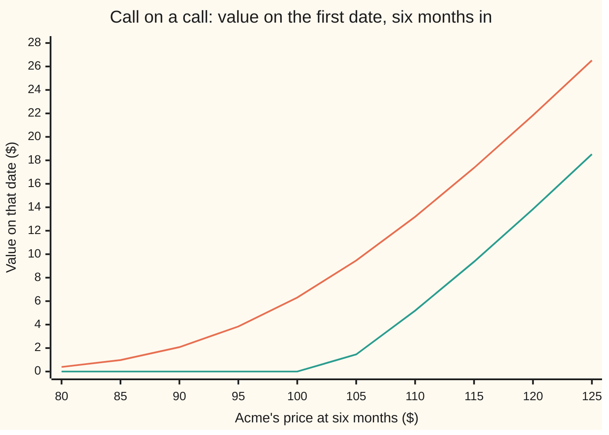
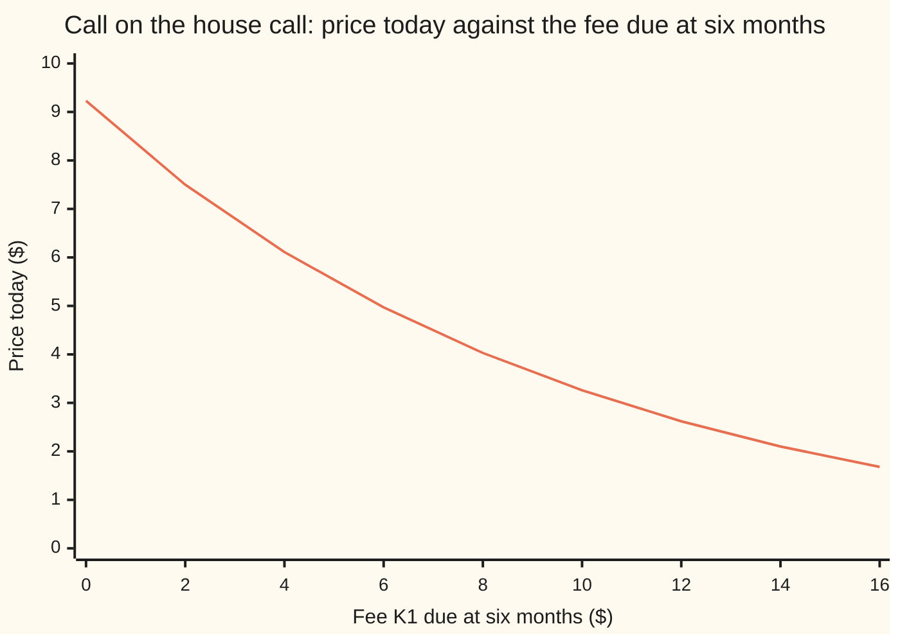

# Compound options: an option on an option, priced with a two-dimensional bell curve

[Syllabus](../../../SYLLABUS.md) → [Financial mathematics](../README.md) → [Averages, choosers, compounds and forward-starts](../README.md#s17) → Compound options

---

## General Overview

Acme shares trade at $100 today. The house call gives the right to buy one Acme share for $100 in one year. In the house market it costs $9.23.

Now a second contract. It gives the right, six months from today, to buy that call for a fee of $8. On that date the holder looks at the call. If the call is worth more than $8, the holder pays the fee and takes it. If the call is worth less, the holder walks away and loses only what the second contract cost. A contract like this, whose underlying asset is itself an option, is a **compound option**. This one, a call on a call, costs **$4.03**.

Six months in, half the year's uncertainty has resolved. If Acme has sagged, the holder skips the fee. If Acme has climbed, the holder pays $8 and owns a call with good prospects. The compound's price is the price of postponing that commitment.

Two dates make the problem two-dimensional. The holder pays the fee only if Acme is high enough at six months. The call then pays only if Acme is above $100 at one year. These two events are linked, because the year's path passes through the six-month point. Pricing them together needs a bell curve in two dimensions, with a correlation (a number between −1 and 1 measuring how strongly two quantities move together) that turns out to be the square root of the ratio of the two dates. Robert Geske published the formula in 1979.

**A compound call is worth the share it may end up delivering, less the strike it may end up collecting, less the fee it may collect halfway, each weighted by the chance of its event, and the two events are joined by a two-dimensional bell curve with correlation equal to the square root of the first date over the second.**

**What kind of fact this is:** a theorem inside the Black-Scholes model, proved on this card in Why it works; the model itself is an assumption, not a law.

### The picture: what the compound holds on the first date

Acme's price at six months runs left to right. The upper line is what the one-year call is then worth, with half a year left. The lower line is what the compound is worth on that day: the call's value less the $8 fee, or nothing.



First line: the underlying call, one year struck at $100, valued with six months left. It is a smooth curve, not a hockey stick, because the call still has time to run. Second line: the compound's payoff, flat at zero until the call is worth $8, then rising with the call. The kink sits at $102.81. That share price, where the call is worth exactly the fee, is the **critical share price**. Below it the holder walks away; above it the holder pays.

---

## The formula

Notation first. Write $T_1$ for the first date, when the fee is due, and $T_2$ for the second, when the call expires. Write $K_1$ for the fee and $K_2$ for the call's strike. Write $S^*$ for the critical share price. $N(x)$ is the one-dimensional bell-curve area to the left of $x$. The new symbol is $M(a, b; \rho)$: the chance that two standard bell-curve quantities, correlated by $\rho$ (say "rho"), land below $a$ and below $b$ at the same time.

$$V = S\,e^{-qT_2}\,M(a_1, b_1; \rho) \;-\; K_2\,e^{-rT_2}\,M(a_2, b_2; \rho) \;-\; K_1\,e^{-rT_1}\,N(a_2)$$

**Read it aloud:** the share that arrives only if both options are used, less the strike paid only if both are used, less the fee paid only if the first is used, each shrunk to today and weighted by its own chance.

| Symbol | Plain meaning | In our example | Push it up and the answer… |
| --- | --- | --- | --- |
| $V$ | price today of the call on the call | $4.03 | is the answer |
| $S$, $S_1$, $S_2$ | Acme's price today, on the first date, on the second | $100; unknown; unknown | $S$ up: rises, about 41 cents per dollar |
| $K_1$ | the fee to buy the call on the first date | $8 | falls: from $9.23 at no fee to $1.68 at $16 |
| $K_2$ | the strike of the underlying call | $100 | falls: the call is worth less |
| $T_1$, $T_2$ | the first date and the call's expiry, in years | 0.5 and 1 | $T_1$ up: rises, the decision waits longer |
| $r$, $q$ | bank rate and dividend yield, continuously compounded; $e^{-rT}$ is the discount | 5% and 2% | $r$ up: rises; $q$ up: falls |
| $\sigma$, $W$ | Acme's volatility: the spread of its yearly log return; $W$ the Brownian path that drives it | 20% | rises: $7.44 at 30% |
| $C$, $C_0$ | the underlying call's value on the first date, a function of $S_1$; its value today | $6.31 if Acme is at $100; $9.23 | — |
| $S^*$ | critical share price: where $C$ equals the fee | $102.81 | rises with the fee |
| $N$, $M$, $\phi$ | bell-curve area in one and in two dimensions; $\phi$ the bell curve's height | $N(a_2)$ = 0.4362 | — |
| $\rho$, $X$, $Y$ | correlation of $X$ and $Y$, the two dates' standardised returns: $\sqrt{T_1/T_2}$ | 0.7071 | — |
| $a$, $b$; $a_1$, $a_2$, $b_1$, $b_2$ | the two levels in $M$; distances to $S^*$ at $T_1$ and to $K_2$ at $T_2$, in standard deviations | −0.0192, −0.1606, 0.25, 0.05 | — |

The four distances are Black-Scholes distances, one pair per date:

$$a_2 = \frac{\ln(S/S^*) + (r - q - \tfrac12\sigma^2)\,T_1}{\sigma\sqrt{T_1}}, \quad a_1 = a_2 + \sigma\sqrt{T_1}$$

$$b_2 = \frac{\ln(S/K_2) + (r - q - \tfrac12\sigma^2)\,T_2}{\sigma\sqrt{T_2}}, \quad b_1 = b_2 + \sigma\sqrt{T_2}$$

In words: $a_2$ counts how far Acme is expected to land above the critical price at the first date, in units of its spread by then. The pair $b_1$, $b_2$ are the house call's own distances from [Black–Scholes call](../08-The%20Black-Scholes%20call%20and%20put/01-black-scholes-call.md).

The critical price comes first, from one equation with one unknown:

$$C(S^*) = K_1$$

It has no closed form, so it is solved numerically. The call's value on the first date rises steadily from 0 toward no ceiling as the share price grows, so every fee above zero has **exactly one** critical price. Boundary cases: a fee of zero makes the compound the call itself, $9.23; a first date equal to the second makes it a plain call struck at $K_2 + K_1$.

Three siblings use the same pieces. A **put on a call** is the right to *sell* the call for $K_1$ on the first date; a **call on a put** and a **put on a put** do the same with the one-year put underneath. Their formulas flip signs and are folded into Step 5. On the put the critical price is where the put is worth $8, $93.83. It exists only for a fee below the put's ceiling, the strike discounted over the last half year.

### When it holds

- **Acme follows the Black-Scholes model: constant volatility, rate and dividend yield.** If volatility itself moves, the call's value on the first date is not a fixed function of $S_1$, the critical price blurs into a band, and the formula misprices by roughly the compound's vega (its change per volatility point, 33 cents) times the error.
- **Both options are European.** The fee is paid, or refused, on exactly $T_1$; the call is used on exactly $T_2$. An American underlying call breaks the formula for $C$ and needs a tree.
- **The fee is paid on the first date, not later.** A fee due at $T_2$ is discounted over the whole year and changes the price.
- **The underlying option is delivered at its fair value on the first date.** If the call can only be resold at a bid below its fair value, the fee is worth paying only when the call clears $K_1$ plus that gap, and the critical price rises.

---

## Why it works

### Step 0: on the first date, the compound is an ordinary option on a known number

Stand at six months. Acme's price $S_1$ is known, and the Black-Scholes formula turns it into the call's value $C(S_1)$. The compound pays $\max(C(S_1) - K_1, 0)$ that day: a payoff on one date, depending only on that date's share price, like any European option. So today's price is the discounted pretend-world average of that payoff, where the pretend world is the one in which everything grows at the bank rate ([Black–Scholes call](../08-The%20Black-Scholes%20call%20and%20put/01-black-scholes-call.md)). The whole task is to do that average in closed form.

### Step 1: the exercise decision is a cutoff on the share price

The call's value $C(S_1)$ rises with $S_1$. So $C(S_1) > K_1$ exactly when $S_1 > S^*$. The payoff splits into two pieces on the event "Acme above $S^*$ at six months":

$$V = e^{-rT_1}\,\mathbb{E}\big[\,C(S_1)\,\mathbf{1}\{S_1 > S^*\}\big] \;-\; K_1\,e^{-rT_1}\,\mathbb{P}(S_1 > S^*)$$

Here $\mathbb{E}$ is the pretend-world average, $\mathbb{P}$ the pretend-world chance, and $\mathbf{1}\{\cdot\}$ a switch that reads 1 when its event happens and 0 otherwise. The fee term is a Black-Scholes cash leg with $S^*$ as its strike and $T_1$ as its date. Its chance is $N(a_2)$: 0.4362 for Acme.

### Step 2: the call's value is itself an average, so fold the two averages into one

On the first date, $C(S_1)$ is the discounted average of the call's final payoff, given what is known at six months. Averaging that again over the first half year gives the plain average over the whole year. This is the **tower rule**: an average of conditional averages is the overall average. The first term becomes

$$e^{-rT_2}\,\mathbb{E}\big[(S_2 - K_2)\,\mathbf{1}\{S_1 > S^*,\ S_2 > K_2\}\big],$$

with $S_2$ Acme's price at one year. The call pays only if both events happen: the fee was paid, and Acme then finished above $100. Split once more, into a share leg and a strike leg:

$$e^{-rT_2}\,\mathbb{E}\big[S_2\,\mathbf{1}\{\text{both}\}\big] \;-\; K_2\,e^{-rT_2}\,\mathbb{P}(\text{both}).$$

### Step 3: two dates, one path, so the two readings are correlated

In the pretend world, Acme's log price at any date is a straight line plus $\sigma$ times a Brownian path $W$ ([Prices as geometric Brownian motion](../05-Black-Scholes%20from%20the%20Ground%20Up/01-geometric-brownian-motion-for-prices.md)). The first event depends on $W$ at $T_1$, the second on $W$ at $T_2$. The later value is the earlier one plus an independent piece, so the two share their first half.

Standardise each by dividing by its own spread; call the results $X$ and $Y$. The covariance of the two path values is $T_1$, the variance they share. Their spreads are $\sqrt{T_1}$ and $\sqrt{T_2}$. The correlation is

$$\rho = \frac{T_1}{\sqrt{T_1}\sqrt{T_2}} = \sqrt{\frac{T_1}{T_2}} = \sqrt{0.5} = 0.7071.$$

Rewriting "$S_1 > S^*$" and "$S_2 > K_2$" in these standardised units gives, after swapping $(X, Y)$ for $(-X, -Y)$ to turn "above" into "below", the chance of both as $M(a_2, b_2; \rho)$: 0.3490 for Acme. That is the strike leg's weight.

### Step 4: counting in shares slides both readings

The share leg averages $S_2$ over the double event. As on the Black-Scholes card, weighting by the share's value slides the bell curve toward the good outcomes by one spread. In two dimensions the slide acts on both readings at once: the first by $\sigma\sqrt{T_1}$, the second by $\sigma\sqrt{T_2}$. The correlation is untouched, because a slide moves the curve without reshaping it. The thresholds become $a_1$ and $b_1$, and the share leg is $S\,e^{-qT_2}\,M(a_1, b_1; \rho)$: weight 0.4146 for Acme.

<details>
<summary>Detailed proof: the two-dimensional slide</summary>

Write $X = W_{T_1}/\sqrt{T_1}$ and $Y = W_{T_2}/\sqrt{T_2}$, standard normals with correlation $\rho$. Then $S_2 = S\,e^{(r - q - \frac12\sigma^2)T_2 + \sigma\sqrt{T_2}\,Y}$. The pretend-world average of $e^{\sigma\sqrt{T_2}\,Y}$ is $e^{\frac12\sigma^2 T_2}$, so $\mathbb{E}[S_2] = S\,e^{(r-q)T_2}$ and $e^{-rT_2}\mathbb{E}[S_2\,\mathbf{1}\{A\}] = S\,e^{-qT_2}\,\widetilde{\mathbb{P}}(A)$, where $\widetilde{\mathbb{P}}$ weights each outcome by $e^{\sigma\sqrt{T_2}Y - \frac12\sigma^2 T_2}$.

Under that weighting the pair $(X, Y)$ is still bell-shaped with the same spreads and correlation, and its centre moves. Complete the square in the joint density $\exp\!\big(-(x^2 - 2\rho xy + y^2)/(2(1-\rho^2))\big)$ times $e^{c y}$ with $c = \sigma\sqrt{T_2}$: the centre moves to $(\rho c,\ c)$. Now $\rho c = \sqrt{T_1/T_2}\,\sigma\sqrt{T_2} = \sigma\sqrt{T_1}$. So $X$ shifts by $\sigma\sqrt{T_1}$ and $Y$ by $\sigma\sqrt{T_2}$: exactly the steps from $a_2$ to $a_1$ and from $b_2$ to $b_1$. Hence $\widetilde{\mathbb{P}}(S_1 > S^*,\ S_2 > K_2) = M(a_1, b_1; \rho)$.

The event $S_1 > S^*$ reads $X > -a_2$ and $S_2 > K_2$ reads $Y > -b_2$. Replacing $(X, Y)$ by $(-X, -Y)$, which has the same law, turns both into "below": $M(a_2, b_2; \rho)$. Collecting the three legs from Steps 1 to 4 gives the formula.

</details>

### Step 5: the three siblings and parity

A put on the call pays $\max(K_1 - C(S_1), 0)$. The payoffs of the call on the call and the put on the call differ by $C(S_1) - K_1$ in every state. Averaging and discounting gives **compound parity**:

$$V_{\text{call on call}} - V_{\text{put on call}} = C_0 - K_1\,e^{-rT_1},$$

with $C_0$ the house call today, $9.23. The right side is $1.42. So the put on the call is $4.03 − $1.42 = $2.61. The fee is discounted from the first date; the strike $K_2$ stays inside $C_0$.

<details>
<summary>Detailed proof: the sibling formulas</summary>

Put on call: exercise when $S_1 < S^*$.
$$V = K_2 e^{-rT_2} M(-a_2, b_2; -\rho) - S e^{-qT_2} M(-a_1, b_1; -\rho) + K_1 e^{-rT_1} N(-a_2).$$
Call on put, with $S^*$ now the price where the put is worth $K_1$; exercise when $S_1 < S^*$.
$$V = K_2 e^{-rT_2} M(-a_2, -b_2; \rho) - S e^{-qT_2} M(-a_1, -b_1; \rho) - K_1 e^{-rT_1} N(-a_2).$$
Put on put, same $S^*$; exercise when $S_1 > S^*$.
$$V = S e^{-qT_2} M(a_1, -b_1; -\rho) - K_2 e^{-rT_2} M(a_2, -b_2; -\rho) + K_1 e^{-rT_1} N(a_2).$$
Each follows Steps 1 to 4 with the event signs changed. A reading "below" at one date and "above" at the other flips the sign of one standardised variable and so of $\rho$. Parity for the pair on the put reads the same way, with the house put in place of the call.

</details>

<details>
<summary>How a two-dimensional bell-curve area is computed</summary>

Condition on the first reading. If $X = z$, then $Y$ is bell-shaped with centre $\rho z$ and spread $\sqrt{1 - \rho^2}$ ([Bivariate normal](../../09-Probability%20and%20statistics/05-Transformations%20and%20Joint%20Laws/05-bivariate-normal-and-conditioning.md)). So
$$M(a, b; \rho) = \int_{-\infty}^{a} \phi(z)\,N\!\left(\frac{b - \rho z}{\sqrt{1 - \rho^2}}\right) dz.$$
One dimension of integration, one ordinary $N$ inside. The code does this with Simpson's rule. At $a = b = 0$ there is an exact answer, $\tfrac14 + \arcsin(\rho)/(2\pi)$, which is 0.375 at $\rho = 0.7071$; the code checks its routine against it.

</details>

A second route skips the two-dimensional curve. Step 0 already says the compound is an option on $C(S_1)$. Average $\max(C(S_1) - 8, 0)$ over the bell curve of $S_1$ directly, with the Black-Scholes formula inside the average. That is a one-dimensional integral over the first date, and the code does it as road 2. A third route builds one coin-flip tree to one year, values the call at the six-month layer, applies the fee there, and rolls back: road 3, which never computes $S^*$ at all.

---

## Worked numbers, by hand

Acme: $S = K_2 = 100$, $K_1 = 8$, $T_1 = 0.5$, $T_2 = 1$, $r = 5\%$, $q = 2\%$, $\sigma = 20\%$.

| Step | Arithmetic | Value |
| --- | --- | --- |
| critical price $S^*$ | Newton on $C(S^*) = 8$, from $100 | $102.81 |
| spread to $T_1$, $\sigma\sqrt{T_1}$ | $0.20 \times \sqrt{0.5}$ | 0.141421 |
| drift to $T_1$ | $(0.05 - 0.02 - 0.02) \times 0.5$ | 0.005 |
| $a_2$ | $(\ln(100/102.81) + 0.005)/0.141421 = (-0.027715 + 0.005)/0.141421$ | −0.160621 |
| $a_1$ | $-0.160621 + 0.141421$ | −0.019199 |
| $b_2$, $b_1$ | the house call's own two distances | 0.05, 0.25 |
| $\rho$ | $\sqrt{0.5/1}$ | 0.707107 |
| $N(a_2)$, chance the fee is paid | bell-curve area | 0.436196 |
| $M(a_2, b_2; \rho)$, chance both are used | two-dimensional area | 0.349048 |
| $M(a_1, b_1; \rho)$, the same counted in shares | two-dimensional area | 0.414567 |
| share leg | $100 \times 0.980199 \times 0.414567$ | 40.635757 |
| strike leg | $100 \times 0.951229 \times 0.349048$ | 33.202429 |
| fee leg | $8 \times 0.975310 \times 0.436196$ | 3.403411 |
| **call on call** | $40.635757 - 33.202429 - 3.403411$ | **$4.03** (4.029917) |

The right to decide in six months whether to pay $8 for the house call costs $4.03 today. The fee is paid in about 44 percent of pretend-world outcomes, and both options end up used in about 35 percent.

The other three contracts on the same numbers:

| Contract | Critical price | Price today |
| --- | --- | --- |
| call on call | $102.81 | $4.03 |
| put on call | $102.81 | $2.61 |
| call on put | $93.83 | $1.83 |
| put on put | $93.83 | $3.30 |

### What breaks if you drop a piece

Same contract, correct answer $4.03:

| Mistake | Comes out at | What went wrong |
| --- | --- | --- |
| Treat it as "the call less the fee", $9.23 − $7.80 | $1.42 | Assumes the fee is always paid. The right to refuse it is worth $2.61, the put on the call. |
| Correlation $T_1/T_2 = 0.5$ instead of $\sqrt{0.5}$ | $4.01 | Standardised returns share variance $T_1$; divided by two spreads, that is a square root. |
| Fee discounted from $T_2$, not $T_1$ | $4.11 | The fee is paid at six months; discounting it over a year understates it. |
| Pay the fee whenever Acme is above $100 | $3.96 | Between $100 and $102.81 the call is worth less than $8; paying for it loses money. |

The last row is small because the loss occurs only in a narrow band of outcomes near the critical price.

### How the price moves: Greeks against the call

Each Greek is the change in price for a small change in one input, found by nudging that input and repricing.

| Greek | Call on call | The house call | Reading |
| --- | --- | --- | --- |
| delta, per $1 of Acme | 0.4064 | 0.5869 | fewer cents per dollar |
| gamma, change in delta per $1 | 0.0252 | 0.0189 | delta moves faster |
| vega, per volatility point | $0.33 | $0.38 | slightly less |
| gearing, percent move per 1% of Acme | 10.08 | 6.36 | much more leverage |

Delta has a closed form, $e^{-qT_2}\,M(a_1, b_1; \rho)$, the share leg's weight shrunk by the dividend drag; the code checks it against the nudge. The last row is the reason buyers want compounds. A 1 percent rise in Acme moves the call about 6 percent and the compound about 10 percent: an option on an option is leverage on leverage.

### The fee sets the price



One line: the call-on-call price as the fee rises. At a fee of zero it is the house call, $9.23. Each extra dollar of fee costs less than a dollar today, because the fee is paid only in the outcomes where it is worth paying.

---

## Code, from first principles, and it actually runs

Nothing is imported that knows the answer. The one-dimensional bell-curve area is a power series; the two-dimensional one is Simpson's rule over the conditional formula in the tip above. The critical price is found by Newton's method, using the call's delta as the slope, and again by bisection. The price is reached **three independent ways**: Geske's formula, a Simpson integral over Acme's price at the first date with the Black-Scholes formula inside, and a 2,000-step coin-flip tree with no critical price. All four compound contracts are checked on all three roads, parity is checked, the bivariate routine is checked against its exact value at the origin, and delta is checked against a nudge.

### Python

```python
# Compound options -- the check behind the card.  Standard library only.
# Nothing imported knows the answer: the bell-curve area is a series, the
# two-dimensional bell curve is Simpson's rule, the critical share price is
# Newton's method checked by bisection, and the tree is a loop.
from math import exp, log, sqrt, pi, asin

S, K2, T2, K1, T1, r, q, SIG = 100.0, 100.0, 1.0, 8.0, 0.5, 0.05, 0.02, 0.20

def phi(x): return exp(-0.5 * x * x) / sqrt(2.0 * pi)      # bell-curve height at x

def N(x):                                                  # bell-curve area left of x, by series
    if x < -10.0: return 0.0
    if x > 10.0: return 1.0
    term, total, k = x, x, 1
    while abs(term) > 1e-17 * abs(total):
        term *= x * x / (2 * k + 1); total += term; k += 1
    return 0.5 + phi(x) * total

def simpson(f, a, b, n):
    h = (b - a) / n; s = f(a) + f(b)
    for i in range(1, n): s += (4 if i % 2 else 2) * f(a + i * h)
    return s * h / 3.0

def M(a, b, rho):                    # chance X <= a and Y <= b, standard normals, correlation rho
    if a < -10.0: return 0.0
    w = sqrt(1.0 - rho * rho)
    return simpson(lambda z: phi(z) * N((b - rho * z) / w), -10.0, a, 2000)

def bs(s, t, eta, sg=SIG):           # Black-Scholes call (eta = 1) or put (eta = -1), strike K2
    v = sg * sqrt(t); d1 = (log(s / K2) + (r - q + 0.5 * sg * sg) * t) / v
    return eta * (s * exp(-q * t) * N(eta * d1) - K2 * exp(-r * t) * N(eta * (d1 - v)))

def newton(eta, k1, tau, sg=SIG, trail=None):   # share price at T1 where the underlying is worth k1
    x = K2
    for i in range(50):
        d1 = (log(x / K2) + (r - q + 0.5 * sg * sg) * tau) / (sg * sqrt(tau))
        f = bs(x, tau, eta, sg) - k1; slope = eta * exp(-q * tau) * N(eta * d1)
        if trail is not None: trail.append((i, x, f))
        step = f / slope; x -= step
        if abs(step) < 1e-10: return x
    raise RuntimeError("Newton did not settle")

def bisect(eta, k1, tau, lo=1.0, hi=300.0):     # the same root with no derivative
    for _ in range(80):
        mid = 0.5 * (lo + hi)
        if eta * (bs(mid, tau, eta) - k1) > 0: hi = mid
        else: lo = mid
    return 0.5 * (lo + hi)

def geske(eps, eta, s=S, k1=K1, t1=T1, t2=T2, sg=SIG, x=None, rho=None, k1_disc=None):
    # eps: 1 compound call, -1 compound put; eta: 1 on a call, -1 on a put.
    if k1 == 0.0: return bs(s, t2, eta, sg) if eps == 1 else 0.0
    x = newton(eta, k1, t2 - t1, sg) if x is None else x
    rho = sqrt(t1 / t2) if rho is None else rho
    a2 = (log(s / x) + (r - q - 0.5 * sg * sg) * t1) / (sg * sqrt(t1)); a1 = a2 + sg * sqrt(t1)
    b2 = (log(s / K2) + (r - q - 0.5 * sg * sg) * t2) / (sg * sqrt(t2)); b1 = b2 + sg * sqrt(t2)
    j = eps * eta
    A, B, F = s * exp(-q * t2), K2 * exp(-r * t2), k1 * exp(-r * (t1 if k1_disc is None else k1_disc))
    return eps * (eta * (A * M(j * a1, eta * b1, j * eta * rho) - B * M(j * a2, eta * b2, j * eta * rho))
                  - F * N(j * a2))

def by_integral(eps, eta, x):        # road 2: average the first-date payoff over the bell curve
    v = SIG * sqrt(T1); cut = (log(x / S) - (r - q - 0.5 * SIG * SIG) * T1) / v
    lo, hi = (cut, 10.0) if eps * eta == 1 else (-10.0, cut)
    f = lambda z: max(eps * (bs(S * exp((r - q - 0.5 * SIG * SIG) * T1 + v * z), T2 - T1, eta) - K1), 0.0) * phi(z)
    return exp(-r * T1) * simpson(f, lo, hi, 4000)

def by_tree(eta, n=2000):            # road 3: one coin-flip tree, both dates on it, no critical price
    dt = T2 / n; up = SIG * sqrt(dt); p = (exp((r - q) * dt) - exp(-up)) / (exp(up) - exp(-up))
    disc = exp(-r * dt); m = int(round(n * T1 / T2))
    back = lambda a, i: [disc * (p * a[j + 1] + (1.0 - p) * a[j]) for j in range(i + 1)]
    u = [max(eta * (S * exp((2 * j - n) * up) - K2), 0.0) for j in range(n + 1)]
    for i in range(n - 1, m - 1, -1): u = back(u, i)
    c, pt = [max(x - K1, 0.0) for x in u], [max(K1 - x, 0.0) for x in u]
    for i in range(m - 1, -1, -1): c, pt = back(c, i), back(pt, i)
    return c[0], pt[0]

trail = []; xc = newton(1, K1, T2 - T1, trail=trail); xb = bisect(1, K1, T2 - T1)
xp = newton(-1, K1, T2 - T1); xpb = bisect(-1, K1, T2 - T1)
v1, rho = SIG * sqrt(T1), sqrt(T1 / T2)
a2 = (log(S / xc) + (r - q - 0.5 * SIG * SIG) * T1) / v1; a1 = a2 + v1
b2 = (log(S / K2) + (r - q - 0.5 * SIG * SIG) * T2) / (SIG * sqrt(T2)); b1 = b2 + SIG * sqrt(T2)
cc, pc, cp, pp = geske(1, 1), geske(-1, 1), geske(1, -1), geske(-1, -1)
cc_i, pc_i, cp_i, pp_i = by_integral(1, 1, xc), by_integral(-1, 1, xc), by_integral(1, -1, xp), by_integral(-1, -1, xp)
cc_t, pc_t = by_tree(1); cp_t, pp_t = by_tree(-1)
C0, h = bs(S, T2, 1), 0.01
delta_bump = (geske(1, 1, s=S + h) - geske(1, 1, s=S - h)) / (2 * h)
gamma = (geske(1, 1, s=S + 1.0) - 2 * cc + geske(1, 1, s=S - 1.0)) / 1.0
vega = (geske(1, 1, sg=SIG + 0.01) - geske(1, 1, sg=SIG - 0.01)) / 2.0
c_delta = (bs(S + h, T2, 1) - bs(S - h, T2, 1)) / (2 * h)
c_gamma = bs(S + 1.0, T2, 1) - 2 * C0 + bs(S - 1.0, T2, 1)
c_vega = (bs(S, T2, 1, SIG + 0.01) - bs(S, T2, 1, SIG - 0.01)) / 2.0

rows = [
    ("underlying call today, 1 year", C0),
    ("critical price x*, Newton", xc), ("critical price x*, bisection", xb),
    ("call at 6 months when Acme = x*", bs(xc, T2 - T1, 1)),
    ("a1", a1), ("a2", a2), ("b1", b1), ("b2", b2),
    ("N(a2)  chance the $8 is paid", N(a2)), ("M(a2, b2; rho)  both exercised", M(a2, b2, rho)),
    ("M(a1, b1; rho)  share-counted", M(a1, b1, rho)),
    ("share leg  S e^-qT2 M(a1,b1)", S * exp(-q * T2) * M(a1, b1, rho)),
    ("strike leg K2 e^-rT2 M(a2,b2)", K2 * exp(-r * T2) * M(a2, b2, rho)),
    ("fee leg    K1 e^-rT1 N(a2)", K1 * exp(-r * T1) * N(a2)),
    ("1 call on call, Geske formula", cc), ("2 call on call, Simpson integral", cc_i),
    ("3 call on call, tree 2000 steps", cc_t),
    ("put on call, formula", pc), ("put on call, integral", pc_i), ("put on call, tree", pc_t),
    ("  CoC - PoC", cc - pc), ("  C0 - K1 e^-rT1", C0 - K1 * exp(-r * T1)),
    ("critical price on the put, Newton", xp),
    ("call on put, formula", cp), ("call on put, integral", cp_i), ("call on put, tree", cp_t),
    ("put on put, formula", pp), ("put on put, integral", pp_i), ("put on put, tree", pp_t),
    ("check M(0,0;rho)", M(0.0, 0.0, rho)), ("  1/4 + asin(rho)/(2 pi)", 0.25 + asin(rho) / (2 * pi)),
    ("delta CoC, e^-qT2 M(a1,b1)", exp(-q * T2) * M(a1, b1, rho)), ("delta CoC, bump", delta_bump),
    ("gamma CoC, bump", gamma), ("vega CoC per vol point", vega), ("gearing CoC  S delta / V", S * delta_bump / cc),
    ("delta call, bump", c_delta), ("gamma call, bump", c_gamma), ("vega call per vol point", c_vega),
    ("gearing call  S delta / C", S * c_delta / C0),
    ("wrong: always pay the $8", C0 - K1 * exp(-r * T1)), ("wrong: rho = T1/T2", geske(1, 1, rho=T1 / T2)),
    ("wrong: $8 discounted from T2", geske(1, 1, k1_disc=T2)), ("wrong: exercise when Acme > 100", geske(1, 1, x=K2)),
    ("try: sigma = 0.30", geske(1, 1, sg=0.30)), ("try: T1 = 0.25", geske(1, 1, t1=0.25)),
]
for name, val in rows: print(f"{name:<40} {val:>12.6f}")
print(f"hand: sigma sqrt(T1) {v1:.6f}; drift T1 {(r - q - 0.5 * SIG * SIG) * T1:.6f}; ln(S/x*) {log(S / xc):.6f}; rho {rho:.6f}\n"
      f"hand: e^-qT2 {exp(-q * T2):.6f}; e^-rT2 {exp(-r * T2):.6f}; e^-rT1 {exp(-r * T1):.6f}; K1 e^-rT1 {K1 * exp(-r * T1):.6f}")
print("newton steps: " + "; ".join(f"{x:.4f} ({f:+.4f})" for i, x, f in trail))
xs = [80.0 + 5.0 * i for i in range(10)]
print("chart, Acme at 6 months " + " ".join(f"{x:6.0f}" for x in xs))
print("chart, call at 6 months " + " ".join(f"{bs(x, T2 - T1, 1):6.2f}" for x in xs))
print("chart, CoC payoff       " + " ".join(f"{max(bs(x, T2 - T1, 1) - K1, 0.0):6.2f}" for x in xs))
ks = [2.0 * i for i in range(9)]
print("chart, fee K1           " + " ".join(f"{k:6.0f}" for k in ks))
print("chart, CoC price        " + " ".join(f"{geske(1, 1, k1=k):6.2f}" for k in ks))

assert abs(xc - xb) < 1e-6, "Newton and bisection find one critical price, call underlying"
assert abs(xp - xpb) < 1e-6, "Newton and bisection find one critical price, put underlying"
assert abs(M(0.0, 0.0, rho) - (0.25 + asin(rho) / (2 * pi))) < 1e-10, "bivariate routine vs closed form"
for f_, i_ in ((cc, cc_i), (pc, pc_i), (cp, cp_i), (pp, pp_i)): assert abs(f_ - i_) < 1e-6, "formula vs integral"
for f_, t_ in ((cc, cc_t), (pc, pc_t), (cp, cp_t), (pp, pp_t)): assert abs(f_ - t_) < 0.01, "formula vs tree"
assert abs((cc - pc) - (C0 - K1 * exp(-r * T1))) < 1e-9, "compound parity with the tree-free call"
assert abs(exp(-q * T2) * M(a1, b1, rho) - delta_bump) < 1e-6, "delta formula vs bump"
assert abs(C0 - 9.227005508154) < 1e-9, "the house call"
print("ALL CHECKS PASS")
```

**Ran 2026-09-24 on macOS, Python 3.14.6, standard library only. All checks passed. Output, pasted from the run:**

```
underlying call today, 1 year                9.227006
critical price x*, Newton                  102.810284
critical price x*, bisection               102.810284
call at 6 months when Acme = x*              8.000000
a1                                          -0.019199
a2                                          -0.160621
b1                                           0.250000
b2                                           0.050000
N(a2)  chance the $8 is paid                 0.436196
M(a2, b2; rho)  both exercised               0.349048
M(a1, b1; rho)  share-counted                0.414567
share leg  S e^-qT2 M(a1,b1)                40.635757
strike leg K2 e^-rT2 M(a2,b2)               33.202429
fee leg    K1 e^-rT1 N(a2)                   3.403411
1 call on call, Geske formula                4.029917
2 call on call, Simpson integral             4.029917
3 call on call, tree 2000 steps              4.029226
put on call, formula                         2.605391
put on call, integral                        2.605391
put on call, tree                            2.605672
  CoC - PoC                                  1.424526
  C0 - K1 e^-rT1                             1.424526
critical price on the put, Newton           93.828405
call on put, formula                         1.831464
call on put, integral                        1.831464
call on put, tree                            1.831021
put on put, formula                          3.303862
put on put, integral                         3.303862
put on put, tree                             3.304391
check M(0,0;rho)                             0.375000
  1/4 + asin(rho)/(2 pi)                     0.375000
delta CoC, e^-qT2 M(a1,b1)                   0.406358
delta CoC, bump                              0.406358
gamma CoC, bump                              0.025238
vega CoC per vol point                       0.326463
gearing CoC  S delta / V                    10.083522
delta call, bump                             0.586851
gamma call, bump                             0.018948
vega call per vol point                      0.378999
gearing call  S delta / C                    6.360147
wrong: always pay the $8                     1.424526
wrong: rho = T1/T2                           4.009443
wrong: $8 discounted from T2                 4.113948
wrong: exercise when Acme > 100              3.963868
try: sigma = 0.30                            7.440674
try: T1 = 0.25                               2.990969
hand: sigma sqrt(T1) 0.141421; drift T1 0.005000; ln(S/x*) -0.027715; rho 0.707107
hand: e^-qT2 0.980199; e^-rT2 0.951229; e^-rT1 0.975310; K1 e^-rT1 7.802479
newton steps: 100.0000 (-1.6924); 102.9981 (+0.1204); 102.8110 (+0.0004); 102.8103 (+0.0000); 102.8103 (+0.0000)
chart, Acme at 6 months     80     85     90     95    100    105    110    115    120    125
chart, call at 6 months   0.39   0.98   2.08   3.84   6.31   9.46  13.19  17.36  21.84  26.52
chart, CoC payoff         0.00   0.00   0.00   0.00   0.00   1.46   5.19   9.36  13.84  18.52
chart, fee K1                0      2      4      6      8     10     12     14     16
chart, CoC price          9.23   7.50   6.11   4.97   4.03   3.26   2.62   2.10   1.68
ALL CHECKS PASS
```

Formula and integral agree to six decimals on all four contracts; the tree lands within a tenth of a cent. Newton settles on the critical price to four decimals by its third step from $100: the first step overshoots to $103.00, then the steps close in from above, as it does on any rising, bending-upward curve.

### Rust

Same checks, same labels, built with `rustc --edition 2021 -O`.

```rust
// Compound options -- the same check as compound_options_check.py, in Rust.
// Standard library only, no crates.  The bell-curve area is a series, the
// two-dimensional bell curve is Simpson's rule, the critical share price is
// Newton's method checked by bisection, and the tree is a loop.
use std::f64::consts::PI;

const S: f64 = 100.0; const K2: f64 = 100.0; const T2: f64 = 1.0; const K1: f64 = 8.0;
const T1: f64 = 0.5; const R: f64 = 0.05; const Q: f64 = 0.02; const SIG: f64 = 0.20;

fn phi(x: f64) -> f64 { (-0.5 * x * x).exp() / (2.0 * PI).sqrt() }

fn n_cdf(x: f64) -> f64 {                                   // bell-curve area left of x, by series
    if x.abs() > 10.0 { return if x > 0.0 { 1.0 } else { 0.0 }; }
    let (mut term, mut total, mut k) = (x, x, 1.0_f64);
    while term.abs() > 1e-17 * total.abs() {
        term *= x * x / (2.0 * k + 1.0); total += term; k += 1.0;
    }
    0.5 + phi(x) * total
}

fn simpson<F: Fn(f64) -> f64>(f: F, a: f64, b: f64, n: usize) -> f64 {
    let h = (b - a) / n as f64;
    let mut s = f(a) + f(b);
    for i in 1..n { s += if i % 2 == 1 { 4.0 } else { 2.0 } * f(a + i as f64 * h); }
    s * h / 3.0
}

fn m2(a: f64, b: f64, rho: f64) -> f64 {    // chance X <= a and Y <= b, correlation rho
    if a < -10.0 { return 0.0; }
    let w = (1.0 - rho * rho).sqrt();
    simpson(|z| phi(z) * n_cdf((b - rho * z) / w), -10.0, a, 2000)
}

fn bs(s: f64, t: f64, eta: f64, sg: f64) -> f64 {   // call (eta = 1) or put (eta = -1), strike K2
    let v = sg * t.sqrt(); let d1 = ((s / K2).ln() + (R - Q + 0.5 * sg * sg) * t) / v;
    eta * (s * (-Q * t).exp() * n_cdf(eta * d1) - K2 * (-R * t).exp() * n_cdf(eta * (d1 - v)))
}

fn newton(eta: f64, k1: f64, tau: f64, sg: f64, trail: &mut Vec<(f64, f64)>) -> f64 {
    let mut x = K2;
    for _ in 0..50 {
        let d1 = ((x / K2).ln() + (R - Q + 0.5 * sg * sg) * tau) / (sg * tau.sqrt());
        let f = bs(x, tau, eta, sg) - k1; let slope = eta * (-Q * tau).exp() * n_cdf(eta * d1);
        trail.push((x, f));
        let step = f / slope; x -= step;
        if step.abs() < 1e-10 { return x; }
    }
    panic!("Newton did not settle");
}

fn bisect(eta: f64, k1: f64, tau: f64) -> f64 {
    let (mut lo, mut hi) = (1.0_f64, 300.0_f64);
    for _ in 0..80 {
        let mid = 0.5 * (lo + hi);
        if eta * (bs(mid, tau, eta, SIG) - k1) > 0.0 { hi = mid; } else { lo = mid; }
    }
    0.5 * (lo + hi)
}

struct P { s: f64, k1: f64, t1: f64, sg: f64, x: Option<f64>, rho: Option<f64>, k1_disc: Option<f64> }
fn base() -> P { P { s: S, k1: K1, t1: T1, sg: SIG, x: None, rho: None, k1_disc: None } }

fn geske(eps: f64, eta: f64, p: &P) -> f64 {
    if p.k1 == 0.0 { return if eps == 1.0 { bs(p.s, T2, eta, p.sg) } else { 0.0 }; }
    let x = p.x.unwrap_or_else(|| newton(eta, p.k1, T2 - p.t1, p.sg, &mut Vec::new()));
    let rho = p.rho.unwrap_or((p.t1 / T2).sqrt());
    let a2 = ((p.s / x).ln() + (R - Q - 0.5 * p.sg * p.sg) * p.t1) / (p.sg * p.t1.sqrt());
    let a1 = a2 + p.sg * p.t1.sqrt();
    let b2 = ((p.s / K2).ln() + (R - Q - 0.5 * p.sg * p.sg) * T2) / (p.sg * T2.sqrt());
    let b1 = b2 + p.sg * T2.sqrt();
    let j = eps * eta;
    let (a, b, f) = (p.s * (-Q * T2).exp(), K2 * (-R * T2).exp(), p.k1 * (-R * p.k1_disc.unwrap_or(p.t1)).exp());
    eps * (eta * (a * m2(j * a1, eta * b1, j * eta * rho) - b * m2(j * a2, eta * b2, j * eta * rho)) - f * n_cdf(j * a2))
}

fn by_integral(eps: f64, eta: f64, x: f64) -> f64 {     // road 2: average the first-date payoff
    let (v, nu) = (SIG * T1.sqrt(), (R - Q - 0.5 * SIG * SIG) * T1);
    let cut = ((x / S).ln() - nu) / v;
    let (lo, hi) = if eps * eta == 1.0 { (cut, 10.0) } else { (-10.0, cut) };
    let f = |z: f64| (eps * (bs(S * (nu + v * z).exp(), T2 - T1, eta, SIG) - K1)).max(0.0) * phi(z);
    (-R * T1).exp() * simpson(f, lo, hi, 4000)
}

fn by_tree(eta: f64, n: usize) -> (f64, f64) {          // road 3: one tree, both dates, no critical price
    let dt = T2 / n as f64; let up = SIG * dt.sqrt();
    let p = (((R - Q) * dt).exp() - (-up).exp()) / (up.exp() - (-up).exp());
    let disc = (-R * dt).exp(); let m = (n as f64 * T1 / T2).round() as usize;
    let back = |a: &Vec<f64>, i: usize| -> Vec<f64> { (0..=i).map(|j| disc * (p * a[j + 1] + (1.0 - p) * a[j])).collect() };
    let mut u: Vec<f64> = (0..=n).map(|j| (eta * (S * ((2.0 * j as f64 - n as f64) * up).exp() - K2)).max(0.0)).collect();
    for i in (m..n).rev() { u = back(&u, i); }
    let mut c: Vec<f64> = u.iter().map(|x| (x - K1).max(0.0)).collect();
    let mut pt: Vec<f64> = u.iter().map(|x| (K1 - x).max(0.0)).collect();
    for i in (0..m).rev() { c = back(&c, i); pt = back(&pt, i); }
    (c[0], pt[0])
}

fn main() {
    let mut trail = Vec::new();
    let xc = newton(1.0, K1, T2 - T1, SIG, &mut trail); let xb = bisect(1.0, K1, T2 - T1);
    let xp = newton(-1.0, K1, T2 - T1, SIG, &mut Vec::new()); let xpb = bisect(-1.0, K1, T2 - T1);
    let (v1, rho) = (SIG * T1.sqrt(), (T1 / T2).sqrt());
    let a2 = ((S / xc).ln() + (R - Q - 0.5 * SIG * SIG) * T1) / v1; let a1 = a2 + v1;
    let b2 = ((S / K2).ln() + (R - Q - 0.5 * SIG * SIG) * T2) / (SIG * T2.sqrt()); let b1 = b2 + SIG * T2.sqrt();
    let bp = base();
    let (cc, pc, cp, pp) = (geske(1.0, 1.0, &bp), geske(-1.0, 1.0, &bp), geske(1.0, -1.0, &bp), geske(-1.0, -1.0, &bp));
    let (cc_i, pc_i) = (by_integral(1.0, 1.0, xc), by_integral(-1.0, 1.0, xc));
    let (cp_i, pp_i) = (by_integral(1.0, -1.0, xp), by_integral(-1.0, -1.0, xp));
    let (cc_t, pc_t) = by_tree(1.0, 2000); let (cp_t, pp_t) = by_tree(-1.0, 2000);
    let (c0, fee) = (bs(S, T2, 1.0, SIG), K1 * (-R * T1).exp());
    let (at_s, h) = (|s: f64| geske(1.0, 1.0, &P { s, ..base() }), 0.01);
    let delta_bump = (at_s(S + h) - at_s(S - h)) / (2.0 * h);
    let gamma = (at_s(S + 1.0) - 2.0 * cc + at_s(S - 1.0)) / 1.0;
    let vega = (geske(1.0, 1.0, &P { sg: SIG + 0.01, ..base() }) - geske(1.0, 1.0, &P { sg: SIG - 0.01, ..base() })) / 2.0;
    let c_delta = (bs(S + h, T2, 1.0, SIG) - bs(S - h, T2, 1.0, SIG)) / (2.0 * h);
    let c_gamma = bs(S + 1.0, T2, 1.0, SIG) - 2.0 * c0 + bs(S - 1.0, T2, 1.0, SIG);
    let c_vega = (bs(S, T2, 1.0, SIG + 0.01) - bs(S, T2, 1.0, SIG - 0.01)) / 2.0;
    let m00 = m2(0.0, 0.0, rho); let m00_exact = 0.25 + rho.asin() / (2.0 * PI);
    let delta_f = (-Q * T2).exp() * m2(a1, b1, rho);

    let rows: Vec<(&str, f64)> = vec![
        ("underlying call today, 1 year", c0),
        ("critical price x*, Newton", xc), ("critical price x*, bisection", xb),
        ("call at 6 months when Acme = x*", bs(xc, T2 - T1, 1.0, SIG)),
        ("a1", a1), ("a2", a2), ("b1", b1), ("b2", b2),
        ("N(a2)  chance the $8 is paid", n_cdf(a2)), ("M(a2, b2; rho)  both exercised", m2(a2, b2, rho)),
        ("M(a1, b1; rho)  share-counted", m2(a1, b1, rho)),
        ("share leg  S e^-qT2 M(a1,b1)", S * (-Q * T2).exp() * m2(a1, b1, rho)),
        ("strike leg K2 e^-rT2 M(a2,b2)", K2 * (-R * T2).exp() * m2(a2, b2, rho)),
        ("fee leg    K1 e^-rT1 N(a2)", fee * n_cdf(a2)),
        ("1 call on call, Geske formula", cc), ("2 call on call, Simpson integral", cc_i),
        ("3 call on call, tree 2000 steps", cc_t),
        ("put on call, formula", pc), ("put on call, integral", pc_i), ("put on call, tree", pc_t),
        ("  CoC - PoC", cc - pc), ("  C0 - K1 e^-rT1", c0 - fee),
        ("critical price on the put, Newton", xp),
        ("call on put, formula", cp), ("call on put, integral", cp_i), ("call on put, tree", cp_t),
        ("put on put, formula", pp), ("put on put, integral", pp_i), ("put on put, tree", pp_t),
        ("check M(0,0;rho)", m00), ("  1/4 + asin(rho)/(2 pi)", m00_exact),
        ("delta CoC, e^-qT2 M(a1,b1)", delta_f), ("delta CoC, bump", delta_bump),
        ("gamma CoC, bump", gamma), ("vega CoC per vol point", vega), ("gearing CoC  S delta / V", S * delta_bump / cc),
        ("delta call, bump", c_delta), ("gamma call, bump", c_gamma), ("vega call per vol point", c_vega),
        ("gearing call  S delta / C", S * c_delta / c0),
        ("wrong: always pay the $8", c0 - fee), ("wrong: rho = T1/T2", geske(1.0, 1.0, &P { rho: Some(T1 / T2), ..base() })),
        ("wrong: $8 discounted from T2", geske(1.0, 1.0, &P { k1_disc: Some(T2), ..base() })),
        ("wrong: exercise when Acme > 100", geske(1.0, 1.0, &P { x: Some(K2), ..base() })),
        ("try: sigma = 0.30", geske(1.0, 1.0, &P { sg: 0.30, ..base() })), ("try: T1 = 0.25", geske(1.0, 1.0, &P { t1: 0.25, ..base() })),
    ];
    for (name, val) in &rows { println!("{:<40} {:>12.6}", name, val); }
    println!("hand: sigma sqrt(T1) {:.6}; drift T1 {:.6}; ln(S/x*) {:.6}; rho {:.6}\nhand: e^-qT2 {:.6}; e^-rT2 {:.6}; e^-rT1 {:.6}; K1 e^-rT1 {:.6}",
        v1, (R - Q - 0.5 * SIG * SIG) * T1, (S / xc).ln(), rho, (-Q * T2).exp(), (-R * T2).exp(), (-R * T1).exp(), fee);
    let steps: Vec<String> = trail.iter().map(|(x, f)| format!("{:.4} ({:+.4})", x, f)).collect();
    println!("newton steps: {}", steps.join("; "));
    let xs: Vec<f64> = (0..10).map(|i| 80.0 + 5.0 * i as f64).collect();
    let row = |label: &str, v: Vec<String>| println!("{}{}", label, v.join(" "));
    row("chart, Acme at 6 months ", xs.iter().map(|x| format!("{:6.0}", x)).collect());
    row("chart, call at 6 months ", xs.iter().map(|x| format!("{:6.2}", bs(*x, T2 - T1, 1.0, SIG))).collect());
    row("chart, CoC payoff       ", xs.iter().map(|x| format!("{:6.2}", (bs(*x, T2 - T1, 1.0, SIG) - K1).max(0.0))).collect());
    let ks: Vec<f64> = (0..9).map(|i| 2.0 * i as f64).collect();
    row("chart, fee K1           ", ks.iter().map(|k| format!("{:6.0}", k)).collect());
    row("chart, CoC price        ", ks.iter().map(|k| format!("{:6.2}", geske(1.0, 1.0, &P { k1: *k, ..base() }))).collect());

    assert!((xc - xb).abs() < 1e-6, "Newton and bisection find one critical price, call underlying");
    assert!((xp - xpb).abs() < 1e-6, "Newton and bisection find one critical price, put underlying");
    assert!((m00 - m00_exact).abs() < 1e-10, "bivariate routine vs closed form");
    for (f, i) in [(cc, cc_i), (pc, pc_i), (cp, cp_i), (pp, pp_i)] { assert!((f - i).abs() < 1e-6, "formula vs integral"); }
    for (f, t) in [(cc, cc_t), (pc, pc_t), (cp, cp_t), (pp, pp_t)] { assert!((f - t).abs() < 0.01, "formula vs tree"); }
    assert!(((cc - pc) - (c0 - fee)).abs() < 1e-9, "compound parity with the tree-free call");
    assert!((delta_f - delta_bump).abs() < 1e-6, "delta formula vs bump");
    assert!((c0 - 9.227005508154).abs() < 1e-9, "the house call");
    println!("ALL CHECKS PASS");
}
```

**Ran 2026-09-24 on macOS, rustc 1.98.1, no crates. All checks passed. Output, pasted from the run:**

```
underlying call today, 1 year                9.227006
critical price x*, Newton                  102.810284
critical price x*, bisection               102.810284
call at 6 months when Acme = x*              8.000000
a1                                          -0.019199
a2                                          -0.160621
b1                                           0.250000
b2                                           0.050000
N(a2)  chance the $8 is paid                 0.436196
M(a2, b2; rho)  both exercised               0.349048
M(a1, b1; rho)  share-counted                0.414567
share leg  S e^-qT2 M(a1,b1)                40.635757
strike leg K2 e^-rT2 M(a2,b2)               33.202429
fee leg    K1 e^-rT1 N(a2)                   3.403411
1 call on call, Geske formula                4.029917
2 call on call, Simpson integral             4.029917
3 call on call, tree 2000 steps              4.029226
put on call, formula                         2.605391
put on call, integral                        2.605391
put on call, tree                            2.605672
  CoC - PoC                                  1.424526
  C0 - K1 e^-rT1                             1.424526
critical price on the put, Newton           93.828405
call on put, formula                         1.831464
call on put, integral                        1.831464
call on put, tree                            1.831021
put on put, formula                          3.303862
put on put, integral                         3.303862
put on put, tree                             3.304391
check M(0,0;rho)                             0.375000
  1/4 + asin(rho)/(2 pi)                     0.375000
delta CoC, e^-qT2 M(a1,b1)                   0.406358
delta CoC, bump                              0.406358
gamma CoC, bump                              0.025238
vega CoC per vol point                       0.326463
gearing CoC  S delta / V                    10.083522
delta call, bump                             0.586851
gamma call, bump                             0.018948
vega call per vol point                      0.378999
gearing call  S delta / C                    6.360147
wrong: always pay the $8                     1.424526
wrong: rho = T1/T2                           4.009443
wrong: $8 discounted from T2                 4.113948
wrong: exercise when Acme > 100              3.963868
try: sigma = 0.30                            7.440674
try: T1 = 0.25                               2.990969
hand: sigma sqrt(T1) 0.141421; drift T1 0.005000; ln(S/x*) -0.027715; rho 0.707107
hand: e^-qT2 0.980199; e^-rT2 0.951229; e^-rT1 0.975310; K1 e^-rT1 7.802479
newton steps: 100.0000 (-1.6924); 102.9981 (+0.1204); 102.8110 (+0.0004); 102.8103 (+0.0000); 102.8103 (+0.0000)
chart, Acme at 6 months     80     85     90     95    100    105    110    115    120    125
chart, call at 6 months   0.39   0.98   2.08   3.84   6.31   9.46  13.19  17.36  21.84  26.52
chart, CoC payoff         0.00   0.00   0.00   0.00   0.00   1.46   5.19   9.36  13.84  18.52
chart, fee K1                0      2      4      6      8     10     12     14     16
chart, CoC price          9.23   7.50   6.11   4.97   4.03   3.26   2.62   2.10   1.68
ALL CHECKS PASS
```

The two outputs match line for line.

> [!TIP]
> **Try changing**
> Guess first, then run it.
> - **Waive the fee.** Set `k1=0.0` in a call to `geske`. The compound becomes the house call: **$9.23**. The chart's first point.
> - **Double the fee.** Set `k1=16.0`. The price falls to **$1.68**, not to zero: Acme still clears the higher bar often enough.
> - **Raise volatility to 30%.** Set `sg=0.30`. The price rises from $4.03 to **$7.44**, nearly double. Volatility enters twice: once in the call's value on the first date, once in the spread of Acme up to it.
> - **Decide sooner.** Set `t1=0.25`. The price drops to **$2.99**. Less of the year has resolved when the fee falls due, so the right to refuse it is worth less.

---

## The usual mistake

> [!warning]
> **Pricing the compound as the call minus the fee.** That values a forward contract on the call: an obligation to pay $8 at six months. It comes out at $1.42. The compound is a right, not an obligation, and the right to refuse the fee is itself a put on the call, worth $2.61. Parity adds them: $1.42 + $2.61 = $4.03.
>
> Four smaller traps:
> - **The wrong correlation.** $\rho = \sqrt{T_1/T_2}$, not $T_1/T_2$. Using 0.5 instead of 0.7071 gives $4.01: close enough to pass a glance, wrong enough to fail a check.
> - **The wrong exercise cutoff.** The fee is worth paying when the *call's value* exceeds $8, which happens at Acme $102.81, not when Acme passes the call's strike of $100. Using $100 gives $3.96.
> - **Discounting the fee over the wrong time.** The fee is due at $T_1$. Discounting it from $T_2$ gives $4.11.
> - **Reusing one critical price for all four contracts.** Contracts on the call use $102.81; contracts on the put need their own root, $93.83, and for a large enough fee the put has no root at all.

---

## Where you meet it in real life

- **Bids in a foreign currency.** A company bidding for a contract priced in euros needs currency protection only if it wins. A call on a currency call lets it buy that protection later at a price fixed now.
- **Options on caps.** A cap protects a borrower against rising interest rates. A call on a cap, called a **caption**, lets the borrower wait before buying the protection. A floortion does the same for a floor, which protects a lender against falling rates.
- **Staged investment.** A drug trial or a mine is built in phases. Paying for phase one buys the right to pay for phase two: each payment is a fee for the next option. Real-options analysis starts here.
- **Shares as options.** Geske's original setting: a company's shares are a call on its assets, with the debt as the strike, so a call on the shares is a call on a call. The share's volatility then rises as its price falls, which plain Black-Scholes misses.
- **Its neighbours on this shelf.** [Chooser options](04-chooser-options.md) (Chooser options) also has a decision halfway, between a call and a put, and needs no second dimension. [Forward-start options](06-forward-start-options-and-forward-volatility.md) (Forward-start options) fixes a strike on the first date instead of charging a fee.

> **Say it back**
> A compound option is an option whose underlying asset is another option. A call on a call pays a fee on the first date only if the call is then worth more than the fee, which happens above one critical share price, found by Newton's method. The price splits into a share leg, a strike leg and a fee leg. The fee leg needs one bell curve; the other two need the chance that Acme clears two bars on two dates, a two-dimensional bell curve with correlation equal to the square root of the first date over the second. For the house call and an $8 fee at six months, the answer is $4.03, confirmed by an integral over the first date and by a tree.

---

## What this builds on

- [Chooser options](04-chooser-options.md): pricing a decision taken at an intermediate date, by valuing what the holder will hold then and averaging back.
- [Bivariate normal](../../09-Probability%20and%20statistics/05-Transformations%20and%20Joint%20Laws/05-bivariate-normal-and-conditioning.md): the two-dimensional bell curve, its correlation, and the conditional formula that reduces $M$ to one integral.
- [Newton's method](../../06-Calculus%20and%20analysis/03-What%20Derivatives%20Tell%20You/06-newtons-method.md): the root-finder for the critical price, and why it converges from above on a rising, bending-upward curve.

## Where this goes next

- [Rainbow options](../18-Many%20underlyings%20-%20exchange%2C%20spread%2C%20basket%20and%20rainbow/04-rainbow-best-of-and-worst-of.md): the same two-dimensional bell curve, now for two different shares on one date instead of one share on two dates.

This card's correlation came free from the calendar; a later card asks what happens when the correlation belongs to the market and must be estimated.

---

## Sources

Verified 2026-09-24: every link below resolves to the publisher's page.

- Geske, Robert. "The Valuation of Compound Options." *Journal of Financial Economics* 7, no. 1 (1979): 63–81. [doi:10.1016/0304-405X(79)90022-9](https://doi.org/10.1016/0304-405X(79)90022-9). The formula on this card, derived for a call on shares that are themselves a call on a firm's assets.
- Cox, John C., Stephen A. Ross, and Mark Rubinstein. "Option Pricing: A Simplified Approach." *Journal of Financial Economics* 7, no. 3 (1979): 229–263. [doi:10.1016/0304-405X(79)90015-1](https://doi.org/10.1016/0304-405X(79)90015-1). The coin-flip tree used as road 3.
- Genz, Alan. "Numerical Computation of Rectangular Bivariate and Trivariate Normal and t Probabilities." *Statistics and Computing* 14 (2004): 251–260. [doi:10.1023/B:STCO.0000035304.20635.31](https://doi.org/10.1023/B:STCO.0000035304.20635.31). How production code computes $M$; the one-integral form used here is its starting point.
- Hull, John C. *Options, Futures, and Other Derivatives*, 11th ed. Pearson. [Publisher page](https://www.pearson.com/en-us/subject-catalog/p/options-futures-and-other-derivatives/P200000005938). The textbook treatment of compound options, in the chapter on exotic options.
