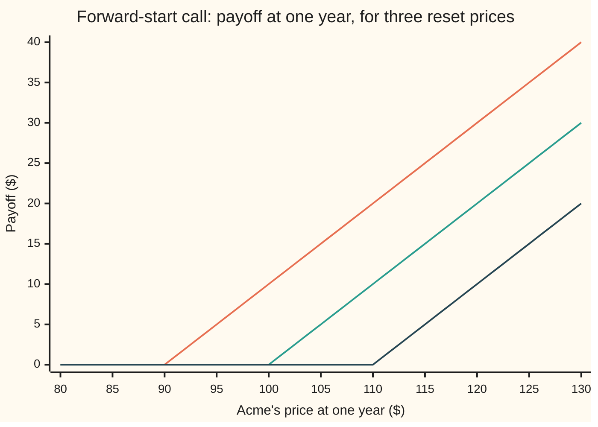
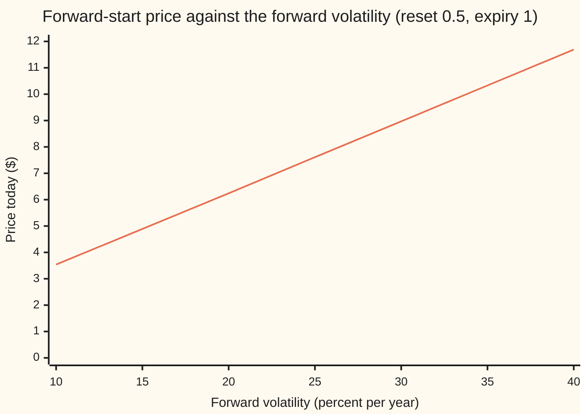

# Forward-start options: a strike fixed later, so the price is shares times a unit option, and it pays on the forward vol

Financial mathematics → Averages, choosers, compounds and forward-starts → Strikes set later → Forward-start options

---

## General Overview

Acme shares trade at $100 today. A company promises a manager a one-year call option on Acme, with a twist: the strike will not be set today. It will be set in six months, at whatever Acme trades at on that day. If Acme is at $110 in six months, the manager gets the right to buy at $110 at the end of the year. If Acme is at $90, the strike is $90.

A contract like this is a **forward-start option**: its dates are fixed today, but its strike is filled in on a later date, the **reset date**, as an agreed multiple of the share price then. With a multiple of one, the option starts **at the money**: its strike equals the share price on the day it is set. The contract here runs from today to one year, resets at half a year, and starts at the money.

Pricing it looks hard. The strike depends on a price nobody knows yet. But the unknown price cancels. On the reset date the contract becomes an ordinary six-month call, struck at the share price, and an ordinary call scales with its share: double the share and the strike together, and the call's value doubles. So on the reset date the contract is worth a fixed fraction of one Acme share, and a fraction of a share can be bought today. In the house market, with volatility flat at 20 percent, the price is **$6.24**, exactly the cost of a fixed fraction of one Acme share.

The second half of the story is which volatility to use. Only the six months after the reset matter, because before the reset the strike moves with the share. When the market quotes 18 percent to six months and 20 percent to one year, the volatility for the second half-year alone, the **forward volatility**, is 21.82 percent. That is the number the contract is priced on: $6.74. Run the other way, a forward-start quote reveals the market's forward volatility.

**A forward-start option is worth, today, a fixed number of shares: the price of an ordinary call on a one-dollar share over the life left after the reset, times today's share price, times the dividend drag to the reset; the only volatility in that price is the one between the reset and expiry, so its quote reads off the forward volatility.**

**What kind of fact this is:** a theorem inside the Black-Scholes model, proved on this card in Why it works; the model is an assumption, not a law. Backing out the forward volatility from a quote is a method, and its answer's existence and uniqueness are proved here too.

### The picture: the strike moves with the share

Acme's price at the end of the year runs left to right. What the contract pays runs up the page. Each line is one possible reset: Acme at $90, $100 or $110 in six months.



First line: reset at $90, so the kink sits at $90. Second line: reset at $100. Third line: reset at $110. The shape is the ordinary call's hockey stick every time. Only the position of the kink is unknown today, and it moves one for one with Acme's price on the reset date.

---

## The formula

Notation first, in words. $t_1$ is the reset date and $T$ the expiry, both in years from today; $\tau = T - t_1$ is the life the option has once its strike is set. $S_{t_1}$ is Acme's price on the reset date, and $\alpha$ is the agreed multiple, so the strike will be $K = \alpha\,S_{t_1}$. The payoff at expiry is $\max(S_T - \alpha S_{t_1},\,0)$.

$$C_{\text{fs}} \;=\; S\,e^{-q t_1}\;c, \qquad c \;=\; e^{-q\tau}N(d_1) \;-\; \alpha\,e^{-r\tau}N(d_2)$$

$$d_1 = \frac{-\ln\alpha + \left(r - q + \tfrac12\sigma^2\right)\tau}{\sigma\sqrt{\tau}}, \qquad d_2 = d_1 - \sigma\sqrt{\tau}$$

**Read it aloud: price an ordinary call on a share worth one dollar, struck at the multiple, over the life left after the reset; that is how many shares the contract is worth on the reset date; buy that many shares today, less the dividends they will earn on the way.**

In words, $c$ is the Black-Scholes call of [black-scholes-call](../08-The%20Black-Scholes%20call%20and%20put/01-black-scholes-call.md) with the share set to 1 and the strike to $\alpha$, so $\ln(S/K)$ becomes $-\ln\alpha$, which is zero at the money. $d_2$ counts how far the strike sits below the expected finish, in units of the spread $\sigma\sqrt{\tau}$; $d_1$ is one spread further.

The forward volatility comes from two quoted implied volatilities, $\sigma_1$ to the reset and $\sigma_2$ to expiry, through their total variances $w_1 = \sigma_1^2 t_1$ and $w_2 = \sigma_2^2 T$:

$$\sigma_f = \sqrt{\frac{w_2 - w_1}{T - t_1}}$$

In words: the variance the far quote carries beyond the near one, spread over the years between them ([term-structure-and-forward-volatility](../12-The%20smile%20and%20the%20surface/02-term-structure-and-forward-volatility.md) proves it). The forward-start formula takes $\sigma = \sigma_f$.

| Symbol | Plain meaning | In our example | Push it up and the answer… |
| --- | --- | --- | --- |
| $C_{\text{fs}}$ | price today of the forward-start call | $6.74 at 21.82%; $6.24 at flat 20% | is the answer |
| $S$, $S_{t_1}$, $S_T$ | Acme's price today, on the reset date, at expiry | $100; unknown; unknown | $S$ up: rises in exact proportion |
| $\alpha$, $K$ | the strike multiple; the strike $K = \alpha S_{t_1}$ once set | 1; unknown today | $\alpha$ up: falls; 1.10 gives $3.01 |
| $t_1$, $T$, $\tau$ | reset date; expiry; life after the reset, $T - t_1$ | 0.5; 1; 0.5 years | $t_1$ down with $T$ fixed: rises; reset at 0.25 gives $7.84 at flat 20% |
| $r$, $q$ | riskless rate and dividend yield, continuously compounded | 5% and 2% | $r$ up: rises a little; $q$ up: falls |
| $\sigma$, $\sigma_f$ | volatility between reset and expiry; the forward volatility the quotes imply for it | 21.82% | rises: $0.27 per volatility point |
| $\sigma_1$, $\sigma_2$, $w_1$, $w_2$ | implied volatility to the reset and to expiry; their total variances, volatility squared times years | 18%, 20%; 0.016200, 0.040000 | $\sigma_2$ up: $\sigma_f$ up; $\sigma_1$ up: $\sigma_f$ down |
| $c$ | the unit call: an ordinary call on a one-dollar share struck at $\alpha$, over $\tau$ | 0.068075 | rises with $\sigma$ |
| $e^{-q t_1}$ | the waiting drag: shares to hold today to own one share at the reset, dividends reinvested | 0.990050 | — |
| $d_1$, $d_2$ | distances of the strike, in spreads; share-counted and cash-counted | 0.176777, 0.035355 at 20% | — |
| $N$, $\varphi$ | the bell-curve area to the left of a point; the bell curve's height | $N(d_1)$ = 0.570158 at 20% | — |
| $Z_1$, $Z_2$, $R$ | independent standard bell-curve draws for the two half-years; the ratio $R = S_T / S_{t_1}$ | — | — |

### When it holds

- **Log returns bell-curved after the reset, at a volatility fixed in advance.** If volatility itself moves at random, the forward-start price depends on the smile the market will quote on the reset date, not only on $\sigma_f$; pricing at $\sigma_f$ then misses by the value of that future smile.
- **A strike set as a multiple of the share price.** A strike fixed in dollars today is an ordinary call, and the first half-year's moves then matter.
- **Known dividend yield and rates until the reset.** The waiting drag $e^{-q t_1}$ assumes a known dividend stream; a dividend cut before the reset makes the contract worth more than the formula says, and the parcel bought today falls short.
- **A flat smile at the reset.** At the money, the right volatility is the at-the-money forward volatility. For $\alpha$ far from one, a skewed market prices the unit call at a different volatility.

---

## Why it works

### Step 0: on the reset date, the contract becomes an ordinary call

Stand on the reset date. Acme is at some price, $S_{t_1}$. The strike is now set, at $\alpha S_{t_1}$, and $\tau$ years remain. Nothing about the contract is unusual any more: it is an ordinary European call. Everything before the reset date only decided how big that call is. So the plan is: value the contract on the reset date, then ask what that value costs today.

### Step 1: an ordinary call scales with its share

Suppose Acme's share and the strike are both doubled. Every future price of the share doubles too, because the model moves prices by percentages. So every payoff doubles, and the call's value doubles. The same holds for any factor. In the formula: $S$ and $K$ enter $d_1$ and $d_2$ only through their ratio $S/K$, and outside they multiply $N(d_1)$ and $N(d_2)$. Scale both by the same number and the $d$s do not move, while the whole price scales.

So an at-the-money call on a share at $S_{t_1}$ is worth $S_{t_1}$ times the same call on a share at one dollar: $S_{t_1}\,c$. The unit call $c$ contains no $S_{t_1}$ at all. It is known today. With flat 20 percent, $c = 0.063076$; at the forward volatility, $c = 0.068075$. The checks confirm the scaling directly: the Black-Scholes call at Acme $40, struck at $40, divided by 40, gives 0.068075; at $250, struck at $250, the same.

### Step 2: a known number of shares on the reset date costs shares today

On the reset date the contract is worth $c$ shares. That is certain; only the share price is not. The price today of anything paid on the reset date is the discounted average of it in the pricing world. Averaging in two stages is legitimate: first average over the second half-year with the reset price held fixed, then average over the reset price. That is the tower rule of [conditional-expectation-in-tables](../../09-Probability%20and%20statistics/02-Random%20Variables/05-conditional-expectation-in-tables.md). The inner average is Step 1's answer, $S_{t_1}\,c$. The outer average asks the price of $c$ shares delivered at $t_1$.

A share delivered at $t_1$ costs $S\,e^{-q t_1}$ today: buy $e^{-q t_1}$ of a share, reinvest every dividend, and it grows into exactly one share by $t_1$. So

$$C_{\text{fs}} = S\,e^{-q t_1}\,c = 100 \times 0.990050 \times 0.063076 = 6.244873 \text{ at flat 20\%}.$$

The argument is also a trade. Buy $c\,e^{-q t_1}$ shares today, 0.067397 shares at the forward volatility, costing $6.74. Reinvest the dividends. On the reset date the parcel has grown to $c$ shares, worth exactly the ordinary call the contract has just become, wherever Acme is. Sell the parcel and buy that call. No daily adjustment, no view on direction. Within the model, a contract selling above $6.74 is sold against the parcel, and one below is bought. The one assumption is that the call on the reset date costs $c\,S_{t_1}$, which holds only if the market then prices it at $\sigma_f$.

<details>
<summary>Detailed proof: the two-stage average, written out</summary>

In the pricing world, with $Z_1$ and $Z_2$ independent standard bell-curve draws,
$$S_{t_1} = S\,e^{(r - q - \frac12\sigma_1^2)t_1 + \sigma_1\sqrt{t_1}\,Z_1}, \qquad S_T = S_{t_1}\,e^{(r - q - \frac12\sigma^2)\tau + \sigma\sqrt{\tau}\,Z_2}.$$
The ratio $R = S_T/S_{t_1}$ depends on $Z_2$ only, so it is independent of $S_{t_1}$: Brownian moves over separate periods are independent. The payoff factors as $S_{t_1}\max(R - \alpha, 0)$. The price is
$$e^{-rT}\,\mathbb{E}\big[S_{t_1}\max(R - \alpha, 0)\big] = e^{-rT}\,\mathbb{E}[S_{t_1}]\;\mathbb{E}[\max(R-\alpha,0)],$$
because the average of a product of independent quantities is the product of their averages. The first average is the forward, $S\,e^{(r-q)t_1}$, whatever $\sigma_1$ is. The second, discounted by $e^{-r\tau}$, is the Black-Scholes call on a one-dollar share struck at $\alpha$: $e^{-r\tau}\,\mathbb{E}[\max(R - \alpha, 0)] = c$. Multiply: $e^{-rT} \cdot S e^{(r-q)t_1} \cdot e^{r\tau} c = S\,e^{-q t_1}\,c$, since $-rT + r t_1 + r\tau = 0$. The first half-year's volatility $\sigma_1$ has dropped out entirely.

</details>

### Step 3: only the volatility after the reset is in the price

The proof shows where the risk lives. $\sigma_1$, the volatility up to the reset, cancelled: before the reset, a rise in Acme raises the strike by the same percentage, so the option stays exactly at the money. Its value scales with Acme, as a parcel of shares does, and a parcel of shares carries no volatility risk. The contract is exposed only to the volatility between $t_1$ and $T$.

The market does not quote that volatility directly. It quotes 18 percent to six months and 20 percent to one year. The one-year quote blends both halves, and the six-month quote prices the first. Total variances add, so the second half alone carries $(0.040000 - 0.016200)/0.5 = 0.047600$ per year, whose square root is $\sigma_f = 0.218174$: 21.82 percent. That is the fair volatility for the forward-start, not 20 and not 18. The price is $100 \times 0.990050 \times 0.068075 = 6.739732$, or $6.74.

The checks confirm this by a road that uses no Black-Scholes formula: they average the payoff over both half-years directly, 18 percent then 21.82 percent, and get $6.74. With 40 percent in the first half they get $6.74 again. The same two-stage model prices the one-year ordinary call at 9.227006, the 20 percent Black-Scholes price, so the model matches both market quotes, and the forward-start price it gives is forced.

### Step 4: the inverse, from a quote back to the forward volatility

A dealer quotes the contract at $6.74. Which forward volatility does that price imply? Before solving, three questions.

**Existence.** The price moves continuously in $\sigma$. As $\sigma$ falls to zero, Acme's second-half ratio becomes certain, $R = e^{(r-q)\tau}$, and the unit call becomes $e^{-q\tau} - \alpha e^{-r\tau}$; the price tends to the floor $S e^{-q t_1}\max(e^{-q\tau} - \alpha e^{-r\tau}, 0) = 1.459326$. As $\sigma$ grows without bound, $N(d_1) \to 1$ and $N(d_2) \to 0$, and the price tends to the ceiling $S e^{-q t_1} e^{-q\tau} = S e^{-qT} = 98.019867$: one share delivered at expiry. Every quote strictly between $1.46 and $98.02 is reached.

**Uniqueness.** The slope of the unit call in $\sigma$ is its vega, $e^{-q\tau}\,\varphi(d_1)\sqrt{\tau}$, where $\varphi$ is the bell-curve height; it is positive for every $\sigma$. So the price rises strictly with volatility and no two volatilities give the same price.

**Boundaries.** A quote at or below $1.46 has no volatility: even a certain second half pays that much. A quote at or above $98.02 has none either: no option on a share is worth more than the share. A floor of zero is not the right floor: here the at-the-money forward sits above the strike ($r > q$), so the option is worth something even with no volatility at all.

With those settled, bisection (halving a bracket of volatilities until it closes) on the $6.74 quote returns 0.218174, the same number the total-variance subtraction gave. Two independent roads, one forward volatility.



The line is the forward-start price at each forward volatility. It rises steadily, about $0.27 per volatility point, so each price has one volatility. The $6.74 quote sits between the 20 and 25 percent points, at 21.82.

---

## Worked numbers, by hand

House market: $S = 100$, $r = 5\%$, $q = 2\%$, reset $t_1 = 0.5$, expiry $T = 1$, at the money ($\alpha = 1$). First with volatility flat at 20 percent, the shelf's cross-check number.

| Step | Arithmetic | Value |
| --- | --- | --- |
| life after the reset, $\tau$ | 1 − 0.5 | 0.5 |
| $d_1$ | (0 + (0.05 − 0.02 + 0.02) × 0.5) / (0.20 × √0.5) | 0.176777 |
| $d_2$ | 0.176777 − 0.20 × √0.5 | 0.035355 |
| $N(d_1)$, $N(d_2)$ | bell-curve table | 0.570158, 0.514102 |
| unit call $c$ | e^−0.01 × 0.570158 − e^−0.025 × 0.514102 | 0.063076 |
| waiting drag | e^(−0.02 × 0.5) | 0.990050 |
| **price, flat 20%** | 100 × 0.990050 × 0.063076 | **$6.24** (6.244873) |

Now with the market's term structure, 18 percent to six months and 20 percent to one year.

| Step | Arithmetic | Value |
| --- | --- | --- |
| total variance to the reset, $w_1$ | 0.18^2 × 0.5 | 0.016200 |
| total variance to expiry, $w_2$ | 0.20^2 × 1 | 0.040000 |
| forward volatility, $\sigma_f$ | √((0.040000 − 0.016200) / 0.5) | 0.218174 |
| unit call $c$ at $\sigma_f$ | same recipe, σ = 0.218174 | 0.068075 |
| shares to buy today | 0.068075 × 0.990050 | 0.067397 |
| **price** | 100 × 0.067397 | **$6.74** (6.739732) |

The contract costs $6.74, the price of 0.0674 of an Acme share. A dealer who prices it at the one-year screen volatility of 20 percent charges $6.24 for a contract worth $6.74.

### What breaks if you drop a piece

Same contract, term-structure market, right answer $6.74. Every wrong number is printed by both checks.

| Mistake | Comes out at | What went wrong |
| --- | --- | --- |
| Use the one-year quote, 20% | $6.24 | The one-year quote averages a calm first half into it; the option only sees the second |
| Use the six-month quote, 18% | $5.70 | That volatility belongs to the half-year the option ignores |
| Run the unit call over the full year | $9.82 | Nothing is at risk before the reset; only $\tau$ counts |
| Discount the waiting period at $r$ | $6.64 | The contract waits for a share, not for cash; a share earns dividends, $q$ |
| Leave out the waiting drag | $6.81 | Charges for the dividends paid before the reset, which the contract's holder never receives |
| Price a plain one-year call struck at $100 today | $9.23 | Keeps the first half-year's move, which the forward-start gives back |

### The Greeks

Sensitivities by bumping the formula at the forward volatility.

| Greek | Plain meaning | Value |
| --- | --- | --- |
| delta | dollars gained per $1 on Acme today; equals price / S | 0.067397 |
| gamma | change in delta per $1 on Acme | 0 |
| vega | dollars per point of forward volatility | 0.272337 |
| rho | dollars per point of the riskless rate | 0.245271 |
| theta | dollars per year as the calendar runs toward the reset | +0.134795 |

Gamma is zero because the price is a straight line in $S$. Theta is positive, and equals $q$ times the price exactly: before the reset the contract is a parcel of shares, and a parcel of shares collects its dividends as time passes.

---

## How it moves: a parcel of shares until the reset, a call after

The contract behaves like two different instruments, one after the other. Before the reset it is a fixed fraction of a share. After, it is an ordinary call.

One story, at the forward volatility:

| Moment | Acme | Contract's worth | What it is |
| --- | --- | --- | --- |
| Month 0 | $100 | $6.74 | 0.067397 shares |
| Month 3 | $110 | $7.45 | still a parcel: Acme up 10%, contract up about 10% |
| Month 6, reset | $110 | $7.49 | an at-the-money call, strike set at $110 |
| Month 9 | $115 | $8.29 | an ordinary call, $5 in the money, 3 months left |
| Month 12 | $118 | $8.00 | pays $118 − $110 |

Before the reset, a rise in Acme lifts the contract in exact proportion. Freeze the clock at month 3 and slide Acme:

```
contract's worth at month 3, one block = $0.25
Acme  80   ██████████████████████             $5.42
Acme  90   ████████████████████████           $6.10
Acme 100   ███████████████████████████        $6.77
Acme 110   ██████████████████████████████     $7.45
Acme 120   █████████████████████████████████  $8.13
```

Equal steps in Acme, equal steps in value: a straight line through zero, with no curvature. That is gamma zero. After the reset the curvature comes back, because the strike has stopped moving and the contract is an ordinary call with the ordinary call's bend.

---

## Code, from first principles, and it actually runs

Both programs reach the price by three independent roads and the forward volatility by two. Road 1 is the formula: shares times the unit call. Road 2 averages the payoff over both half-years by Simpson's rule, a nested integral with 18 percent in the first half and the forward volatility in the second, using no Black-Scholes formula; it runs again with 40 percent in the first half, and prices the one-year ordinary call with the same two-stage model. Road 3 simulates 200,000 two-step paths with a written-out random number generator (splitmix64, with the Box-Muller transform turning uniform draws into bell-curve draws). The forward volatility comes from the total-variance subtraction and, independently, from bisection on the quote. The scaling of Step 1 is checked at Acme $40 and $250. The normal CDF is a series written out.

### Python

```python
# Forward-start options and forward volatility -- the check behind the card.  Standard library only.
# Nothing imported knows the answer: the normal CDF is a series written out, the integrals are
# Simpson's rule, the root finder is bisection, the random numbers are splitmix64 + Box-Muller.
from math import log, sqrt, exp, cos, sin, pi

def phi(x): return exp(-0.5 * x * x) / sqrt(2.0 * pi)            # bell-curve height at x
def N(x):                                                        # bell-curve area left of x
    if x < -8.0: return 0.0
    if x > 8.0: return 1.0
    s, t, n = x, x, 0
    while abs(t) > 1e-17 * abs(s) + 1e-300:
        n += 1; t *= x * x / (2 * n + 1); s += t
    return 0.5 + phi(x) * s

def bs_call(S, K, r, q, sig, T):                                # plain Black-Scholes call
    d1 = (log(S / K) + (r - q + 0.5 * sig * sig) * T) / (sig * sqrt(T))
    return S * exp(-q * T) * N(d1) - K * exp(-r * T) * N(d1 - sig * sqrt(T))

def fwd_start(S, a, r, q, sig, t1, T):                          # road 1: shares times a unit call
    return S * exp(-q * t1) * bs_call(1.0, a, r, q, sig, T - t1)

def simpson(f, lo, hi, n):
    h = (hi - lo) / n
    return h / 3 * sum((1 if i in (0, n) else 4 if i % 2 else 2) * f(lo + i * h) for i in range(n + 1))

def two_stage(s1, s2, strike, n=400):                           # road 2: average over both halves
    def outer(z1):                                              # Acme at the reset, then the second half
        S1 = S * exp((r - q - 0.5 * s1 * s1) * t1 + s1 * sqrt(t1) * z1)
        K_ = strike(S1); m, v = (r - q - 0.5 * s2 * s2) * tau, s2 * sqrt(tau)
        cut = min(max((log(K_ / S1) - m) / v, -8.0), 8.0)       # where the payoff starts to be positive
        return phi(z1) * simpson(lambda z2: (S1 * exp(m + v * z2) - K_) * phi(z2), cut, 8.0, n)
    return exp(-r * T) * simpson(outer, -8.0, 8.0, n)

S, a, r, q, t1, T = 100.0, 1.0, 0.05, 0.02, 0.5, 1.0            # house market, reset at half a year
tau = T - t1
sig1, sig2 = 0.18, 0.20                                          # six-month and one-year implied vols
w1, w2 = sig1 ** 2 * t1, sig2 ** 2 * T
sf = sqrt((w2 - w1) / (T - t1))                                  # forward vol from total variances
d1 = (r - q + 0.5 * 0.04) * tau / (0.2 * sqrt(tau)); d2 = d1 - 0.2 * sqrt(tau)
c20, cf = bs_call(1.0, a, r, q, 0.20, tau), bs_call(1.0, a, r, q, sf, tau)
P20, Pf = fwd_start(S, a, r, q, 0.20, t1, T), fwd_start(S, a, r, q, sf, t1, T)
atm = lambda S1: a * S1
P20_int = two_stage(0.20, 0.20, atm)
Pf_int = two_stage(sig1, sf, atm)
Pf_int40 = two_stage(0.40, sf, atm)                              # the first half's vol changed to 40%
van_int = two_stage(sig1, sf, lambda S1: 100.0)                  # one-year vanilla, same two-stage model

# road 3: simulation, two normal draws per path, one for each half-year
MASK, state = (1 << 64) - 1, 20260924
def uniform():
    global state
    state = (state + 0x9E3779B97F4A7C15) & MASK
    z = state; z = ((z ^ (z >> 30)) * 0xBF58476D1CE4E5B9) & MASK
    z = ((z ^ (z >> 27)) * 0x94D049BB133111EB) & MASK
    return ((z ^ (z >> 31)) >> 11) * 2.0 ** -53
paths, s1_, s2_ = 200000, 0.0, 0.0
for _ in range(paths):
    u1, u2 = 1.0 - uniform(), uniform()
    rad = sqrt(-2.0 * log(u1)); z1, z2 = rad * cos(2 * pi * u2), rad * sin(2 * pi * u2)
    S1 = S * exp((r - q - 0.5 * sig1 * sig1) * t1 + sig1 * sqrt(t1) * z1)
    ST = S1 * exp((r - q - 0.5 * sf * sf) * tau + sf * sqrt(tau) * z2)
    x = exp(-r * T) * max(ST - a * S1, 0.0); s1_ += x; s2_ += x * x
mc = s1_ / paths; se = sqrt((s2_ / paths - mc * mc) / paths)

# the inverse: quote in, forward vol out, by bisection on a price that rises with vol
quote = Pf_int
floor_, ceil_ = S * exp(-q * t1) * (exp(-q * tau) - a * exp(-r * tau)), S * exp(-q * T)
def implied_fwd_vol(p):
    if not floor_ < p < ceil_: return None                      # no volatility reaches this price
    lo, hi = 1e-9, 20.0
    for _ in range(200):
        mid = 0.5 * (lo + hi)
        lo, hi = (mid, hi) if fwd_start(S, a, r, q, mid, t1, T) < p else (lo, mid)
    return 0.5 * (lo + hi)
iv = implied_fwd_vol(quote)

# hedge: the parcel of shares buys the reset-date call at any Acme price
hedge = [bs_call(x, a * x, r, q, sf, tau) / x for x in (40.0, 250.0)]
f = lambda **k: fwd_start(**{**dict(S=S, a=a, r=r, q=q, sig=sf, t1=t1, T=T), **k})
delta = (f(S=S + 0.01) - f(S=S - 0.01)) / 0.02
gamma = round(f(S=S + 1.0) - 2 * Pf + f(S=S - 1.0), 9) + 0.0
vega = (f(sig=sf + 1e-4) - f(sig=sf - 1e-4)) / 2e-4 / 100
rho = (f(r=r + 1e-4) - f(r=r - 1e-4)) / 2e-4 / 100
theta = (f(t1=t1 - 1e-4, T=T - 1e-4) - Pf) / 1e-4

rows = [("d1, flat 20%", d1), ("d2, flat 20%", d2), ("N(d1)", N(d1)), ("N(d2)", N(d2)),
        ("unit call c, flat 20%", c20), ("waiting drag e^-q t1", exp(-q * t1)),
        ("1 formula, flat 20%", P20), ("2 two-stage Simpson, flat 20%", P20_int),
        ("total variance to 0.5 yr, 18%", w1), ("total variance to 1 yr, 20%", w2),
        ("forward vol sigma_f", sf), ("unit call c at sigma_f", cf), ("shares to buy c e^-q t1", cf * exp(-q * t1)),
        ("1 formula at sigma_f", Pf), ("2 Simpson, 18% then sigma_f", Pf_int), ("2 Simpson, 40% then sigma_f", Pf_int40),
        ("3 simulation, 200000 paths", mc), ("  standard error", se),
        ("two-stage one-year vanilla", van_int), ("  Black-Scholes at 20%", bs_call(S, 100.0, r, q, 0.2, T)),
        ("inverse: floor, vol -> 0", floor_), ("inverse: ceiling, vol -> infinity", ceil_),
        ("inverse: vol from the quote", iv), ("inverse: vols that reach 1.00", 0.0 if implied_fwd_vol(1.0) is None else 1.0),
        ("hedge: call / Acme, Acme 40", hedge[0]), ("hedge: call / Acme, Acme 250", hedge[1]),
        ("delta by bump", delta), ("  price / S", Pf / S), ("gamma by bump", gamma), ("vega per vol point", vega),
        ("rho per rate point", rho), ("theta per year", theta), ("  q times price", q * Pf),
        ("wrong: 18% six-month quote", f(sig=sig1)), ("wrong: full year in unit call", S * exp(-q * t1) * bs_call(1.0, a, r, q, sf, T)),
        ("wrong: waiting drag at r", S * exp(-r * t1) * cf), ("wrong: no waiting drag", S * cf),
        ("try: reset at 0.25, flat 20%", fwd_start(S, a, r, q, 0.2, 0.25, T)), ("try: strike 110% of reset", f(a=1.1)),
        ("try: flat 40%", fwd_start(S, a, r, q, 0.4, t1, T))]
for name, v in rows: print(f"{name:<34} {v:>12.6f}")
for label, s, t in (("story: month 0", 100.0, 0.0), ("story: month 3", 110.0, 0.25), ("story: month 6 reset", 110.0, 0.5)):
    print(f"{label:<34} {s * exp(-q * (t1 - t)) * cf:>12.6f}")
print(f"{'story: month 9, Acme 115':<34} {bs_call(115.0, 110.0, r, q, sf, 0.25):>12.6f}")
print(f"{'story: month 12, Acme 118':<34} {max(118.0 - 110.0, 0.0):>12.6f}")
print("bars, Acme at month 3   " + " ".join(f"{x:7.0f}" for x in (80.0, 90.0, 100.0, 110.0, 120.0)))
print("bars, value at month 3  " + " ".join(f"{x * exp(-q * 0.25) * cf:7.2f}" for x in (80.0, 90.0, 100.0, 110.0, 120.0)))
grid = [80.0 + 5.0 * i for i in range(11)]
print("chart, Acme at expiry   " + " ".join(f"{x:6.0f}" for x in grid))
for s1 in (90.0, 100.0, 110.0):
    print(f"chart, reset at {s1:3.0f}     " + " ".join(f"{max(x - a * s1, 0.0):6.2f}" for x in grid))
vols = [0.10 + 0.05 * i for i in range(7)]
print("chart, forward vol %    " + " ".join(f"{100 * v:6.0f}" for v in vols))
print("chart, price            " + " ".join(f"{f(sig=v):6.2f}" for v in vols))

assert abs(P20 - 6.244873) < 1e-6, "formula vs the shelf's house number"
assert abs(P20_int - P20) < 1e-7 and abs(Pf_int - Pf) < 1e-7, "two-stage average vs shares times unit call"
assert abs(Pf_int40 - Pf_int) < 1e-7, "the first half's vol must not matter"
assert abs(mc - Pf) < 3 * se, "simulation within 3 standard errors"
assert abs(van_int - 9.227005508154) < 1e-7, "the two-stage model reproduces the one-year 20% quote"
assert abs(iv - 0.218174) < 1e-6, "the quote inverts to the forward vol"
assert abs(hedge[0] - cf) < 1e-12 and abs(hedge[1] - cf) < 1e-12, "call value at the reset is c shares"
print("ALL CHECKS PASS")
```

**Ran 2026-09-24 on macOS, Python 3.14.6, standard library only. All checks passed. Output, pasted from the run:**

```
d1, flat 20%                           0.176777
d2, flat 20%                           0.035355
N(d1)                                  0.570158
N(d2)                                  0.514102
unit call c, flat 20%                  0.063076
waiting drag e^-q t1                   0.990050
1 formula, flat 20%                    6.244873
2 two-stage Simpson, flat 20%          6.244873
total variance to 0.5 yr, 18%          0.016200
total variance to 1 yr, 20%            0.040000
forward vol sigma_f                    0.218174
unit call c at sigma_f                 0.068075
shares to buy c e^-q t1                0.067397
1 formula at sigma_f                   6.739732
2 Simpson, 18% then sigma_f            6.739732
2 Simpson, 40% then sigma_f            6.739732
3 simulation, 200000 paths             6.764326
  standard error                       0.022911
two-stage one-year vanilla             9.227006
  Black-Scholes at 20%                 9.227006
inverse: floor, vol -> 0               1.459326
inverse: ceiling, vol -> infinity     98.019867
inverse: vol from the quote            0.218174
inverse: vols that reach 1.00          0.000000
hedge: call / Acme, Acme 40            0.068075
hedge: call / Acme, Acme 250           0.068075
delta by bump                          0.067397
  price / S                            0.067397
gamma by bump                          0.000000
vega per vol point                     0.272337
rho per rate point                     0.245271
theta per year                         0.134795
  q times price                        0.134795
wrong: 18% six-month quote             5.700638
wrong: full year in unit call          9.817486
wrong: waiting drag at r               6.639391
wrong: no waiting drag                 6.807468
try: reset at 0.25, flat 20%           7.835978
try: strike 110% of reset              3.010207
try: flat 40%                         11.686483
story: month 0                         6.739732
story: month 3                         7.450867
story: month 6 reset                   7.488214
story: month 9, Acme 115               8.287058
story: month 12, Acme 118              8.000000
bars, Acme at month 3        80      90     100     110     120
bars, value at month 3     5.42    6.10    6.77    7.45    8.13
chart, Acme at expiry       80     85     90     95    100    105    110    115    120    125    130
chart, reset at  90       0.00   0.00   0.00   5.00  10.00  15.00  20.00  25.00  30.00  35.00  40.00
chart, reset at 100       0.00   0.00   0.00   0.00   0.00   5.00  10.00  15.00  20.00  25.00  30.00
chart, reset at 110       0.00   0.00   0.00   0.00   0.00   0.00   0.00   5.00  10.00  15.00  20.00
chart, forward vol %        10     15     20     25     30     35     40
chart, price              3.54   4.89   6.24   7.61   8.97  10.33  11.69
ALL CHECKS PASS
```

Three roads, one price: the formula and the two-stage integral agree to six decimals at $6.74, whether the first half runs at 18 or 40 percent. The simulation lands at 6.764326, about one standard error (0.022911) above. The bisection recovers 0.218174 from the quote, matching the subtraction.

### Rust

Same checks, same inputs, the same generator seed. No crates.

```rust
// Forward-start options and forward volatility -- the same check as the Python, in Rust.
// Standard library only, no crates.  The normal CDF is a series written out, the integrals are
// Simpson's rule, the root finder is bisection, the random numbers are splitmix64 + Box-Muller.
use std::f64::consts::PI;

fn phi(x: f64) -> f64 { (-0.5 * x * x).exp() / (2.0 * PI).sqrt() }
fn n_cdf(x: f64) -> f64 {
    if x < -8.0 { return 0.0; }
    if x > 8.0 { return 1.0; }
    let (mut s, mut t, mut n) = (x, x, 0.0);
    while t.abs() > 1e-17 * s.abs() + 1e-300 {
        n += 1.0; t *= x * x / (2.0 * n + 1.0); s += t;
    }
    0.5 + phi(x) * s
}
fn bs_call(s: f64, k: f64, r: f64, q: f64, sig: f64, t: f64) -> f64 {
    let d1 = ((s / k).ln() + (r - q + 0.5 * sig * sig) * t) / (sig * t.sqrt());
    s * (-q * t).exp() * n_cdf(d1) - k * (-r * t).exp() * n_cdf(d1 - sig * t.sqrt())
}
fn fwd_start(s: f64, a: f64, r: f64, q: f64, sig: f64, t1: f64, t: f64) -> f64 {
    s * (-q * t1).exp() * bs_call(1.0, a, r, q, sig, t - t1)
}
fn simpson<F: Fn(f64) -> f64>(f: F, lo: f64, hi: f64, n: usize) -> f64 {
    let h = (hi - lo) / n as f64;
    let mut sum = 0.0;
    for i in 0..=n {
        let w = if i == 0 || i == n { 1.0 } else if i % 2 == 1 { 4.0 } else { 2.0 };
        sum += w * f(lo + i as f64 * h);
    }
    h / 3.0 * sum
}
const S: f64 = 100.0; const A: f64 = 1.0; const R: f64 = 0.05; const Q: f64 = 0.02;
const T1: f64 = 0.5; const T: f64 = 1.0; const TAU: f64 = 0.5;
fn two_stage<K: Fn(f64) -> f64>(s1: f64, s2: f64, strike: K) -> f64 {
    let n = 400;
    let outer = |z1: f64| {
        let st1 = S * ((R - Q - 0.5 * s1 * s1) * T1 + s1 * T1.sqrt() * z1).exp();
        let k = strike(st1);
        let (m, v) = ((R - Q - 0.5 * s2 * s2) * TAU, s2 * TAU.sqrt());
        let cut = (((k / st1).ln() - m) / v).max(-8.0).min(8.0);
        phi(z1) * simpson(|z2| (st1 * (m + v * z2).exp() - k) * phi(z2), cut, 8.0, n)
    };
    (-R * T).exp() * simpson(outer, -8.0, 8.0, n)
}
struct Rng(u64);
impl Rng {
    fn uniform(&mut self) -> f64 {
        self.0 = self.0.wrapping_add(0x9E3779B97F4A7C15);
        let mut z = self.0;
        z = (z ^ (z >> 30)).wrapping_mul(0xBF58476D1CE4E5B9);
        z = (z ^ (z >> 27)).wrapping_mul(0x94D049BB133111EB);
        ((z ^ (z >> 31)) >> 11) as f64 * 2f64.powi(-53)
    }
}
fn f(s: f64, a: f64, r: f64, sig: f64, t1: f64, t: f64) -> f64 { fwd_start(s, a, r, Q, sig, t1, t) }

fn main() {
    let (sig1, sig2) = (0.18, 0.20);
    let (w1, w2) = (sig1 * sig1 * T1, sig2 * sig2 * T);
    let sf = ((w2 - w1) / (T - T1)).sqrt();
    let d1 = (R - Q + 0.5 * 0.04) * TAU / (0.2 * TAU.sqrt());
    let d2 = d1 - 0.2 * TAU.sqrt();
    let (c20, cf) = (bs_call(1.0, A, R, Q, 0.20, TAU), bs_call(1.0, A, R, Q, sf, TAU));
    let (p20, pf) = (fwd_start(S, A, R, Q, 0.20, T1, T), fwd_start(S, A, R, Q, sf, T1, T));
    let atm = |x: f64| A * x;
    let p20_int = two_stage(0.20, 0.20, atm);
    let pf_int = two_stage(sig1, sf, atm);
    let pf_int40 = two_stage(0.40, sf, atm);
    let van_int = two_stage(sig1, sf, |_x: f64| 100.0);
    // simulation, two normal draws per path, one for each half-year
    let mut rng = Rng(20260924);
    let paths = 200000;
    let (mut s1_, mut s2_) = (0.0, 0.0);
    for _ in 0..paths {
        let (u1, u2) = (1.0 - rng.uniform(), rng.uniform());
        let rad = (-2.0 * u1.ln()).sqrt();
        let (z1, z2) = (rad * (2.0 * PI * u2).cos(), rad * (2.0 * PI * u2).sin());
        let st1 = S * ((R - Q - 0.5 * sig1 * sig1) * T1 + sig1 * T1.sqrt() * z1).exp();
        let st = st1 * ((R - Q - 0.5 * sf * sf) * TAU + sf * TAU.sqrt() * z2).exp();
        let x = (-R * T).exp() * (st - A * st1).max(0.0);
        s1_ += x; s2_ += x * x;
    }
    let mc = s1_ / paths as f64;
    let se = ((s2_ / paths as f64 - mc * mc) / paths as f64).sqrt();
    // the inverse: quote in, forward vol out
    let quote = pf_int;
    let floor = S * (-Q * T1).exp() * ((-Q * TAU).exp() - A * (-R * TAU).exp());
    let ceil = S * (-Q * T).exp();
    let implied = |p: f64| -> Option<f64> {
        if !(floor < p && p < ceil) { return None; }
        let (mut lo, mut hi) = (1e-9, 20.0);
        for _ in 0..200 {
            let mid = 0.5 * (lo + hi);
            if fwd_start(S, A, R, Q, mid, T1, T) < p { lo = mid; } else { hi = mid; }
        }
        Some(0.5 * (lo + hi))
    };
    let iv = implied(quote).unwrap();
    let hedge = [bs_call(40.0, A * 40.0, R, Q, sf, TAU) / 40.0, bs_call(250.0, A * 250.0, R, Q, sf, TAU) / 250.0];
    let delta = (f(S + 0.01, A, R, sf, T1, T) - f(S - 0.01, A, R, sf, T1, T)) / 0.02;
    let g = f(S + 1.0, A, R, sf, T1, T) - 2.0 * pf + f(S - 1.0, A, R, sf, T1, T);
    let gamma = (g * 1e9).round() / 1e9 + 0.0;
    let vega = (f(S, A, R, sf + 1e-4, T1, T) - f(S, A, R, sf - 1e-4, T1, T)) / 2e-4 / 100.0;
    let rho = (f(S, A, R + 1e-4, sf, T1, T) - f(S, A, R - 1e-4, sf, T1, T)) / 2e-4 / 100.0;
    let theta = (f(S, A, R, sf, T1 - 1e-4, T - 1e-4) - pf) / 1e-4;
    let rows: Vec<(&str, f64)> = vec![
        ("d1, flat 20%", d1), ("d2, flat 20%", d2), ("N(d1)", n_cdf(d1)), ("N(d2)", n_cdf(d2)),
        ("unit call c, flat 20%", c20), ("waiting drag e^-q t1", (-Q * T1).exp()),
        ("1 formula, flat 20%", p20), ("2 two-stage Simpson, flat 20%", p20_int),
        ("total variance to 0.5 yr, 18%", w1), ("total variance to 1 yr, 20%", w2),
        ("forward vol sigma_f", sf), ("unit call c at sigma_f", cf), ("shares to buy c e^-q t1", cf * (-Q * T1).exp()),
        ("1 formula at sigma_f", pf), ("2 Simpson, 18% then sigma_f", pf_int), ("2 Simpson, 40% then sigma_f", pf_int40),
        ("3 simulation, 200000 paths", mc), ("  standard error", se),
        ("two-stage one-year vanilla", van_int), ("  Black-Scholes at 20%", bs_call(S, 100.0, R, Q, 0.2, T)),
        ("inverse: floor, vol -> 0", floor), ("inverse: ceiling, vol -> infinity", ceil),
        ("inverse: vol from the quote", iv), ("inverse: vols that reach 1.00", if implied(1.0).is_none() { 0.0 } else { 1.0 }),
        ("hedge: call / Acme, Acme 40", hedge[0]), ("hedge: call / Acme, Acme 250", hedge[1]),
        ("delta by bump", delta), ("  price / S", pf / S), ("gamma by bump", gamma), ("vega per vol point", vega),
        ("rho per rate point", rho), ("theta per year", theta), ("  q times price", Q * pf),
        ("wrong: 18% six-month quote", f(S, A, R, sig1, T1, T)),
        ("wrong: full year in unit call", S * (-Q * T1).exp() * bs_call(1.0, A, R, Q, sf, T)),
        ("wrong: waiting drag at r", S * (-R * T1).exp() * cf), ("wrong: no waiting drag", S * cf),
        ("try: reset at 0.25, flat 20%", f(S, A, R, 0.2, 0.25, T)), ("try: strike 110% of reset", f(S, 1.1, R, sf, T1, T)),
        ("try: flat 40%", f(S, A, R, 0.4, T1, T)),
    ];
    for (name, v) in &rows { println!("{:<34} {:>12.6}", name, v); }
    for (label, s, t) in [("story: month 0", 100.0, 0.0), ("story: month 3", 110.0, 0.25), ("story: month 6 reset", 110.0, 0.5)] {
        println!("{:<34} {:>12.6}", label, s * (-Q * (T1 - t)).exp() * cf);
    }
    println!("{:<34} {:>12.6}", "story: month 9, Acme 115", bs_call(115.0, 110.0, R, Q, sf, 0.25));
    println!("{:<34} {:>12.6}", "story: month 12, Acme 118", (118.0f64 - 110.0).max(0.0));
    let bars = [80.0, 90.0, 100.0, 110.0, 120.0];
    println!("bars, Acme at month 3   {}", bars.iter().map(|x| format!("{:7.0}", x)).collect::<Vec<_>>().join(" "));
    println!("bars, value at month 3  {}", bars.iter().map(|x| format!("{:7.2}", x * (-Q * 0.25).exp() * cf)).collect::<Vec<_>>().join(" "));
    let grid: Vec<f64> = (0..11).map(|i| 80.0 + 5.0 * i as f64).collect();
    println!("chart, Acme at expiry   {}", grid.iter().map(|x| format!("{:6.0}", x)).collect::<Vec<_>>().join(" "));
    for s1 in [90.0, 100.0, 110.0] {
        println!("chart, reset at {:3.0}     {}", s1, grid.iter().map(|x| format!("{:6.2}", (x - A * s1).max(0.0))).collect::<Vec<_>>().join(" "));
    }
    let vols: Vec<f64> = (0..7).map(|i| 0.10 + 0.05 * i as f64).collect();
    println!("chart, forward vol %    {}", vols.iter().map(|v| format!("{:6.0}", 100.0 * v)).collect::<Vec<_>>().join(" "));
    println!("chart, price            {}", vols.iter().map(|v| format!("{:6.2}", f(S, A, R, *v, T1, T))).collect::<Vec<_>>().join(" "));

    assert!((p20 - 6.244873).abs() < 1e-6, "formula vs the shelf's house number");
    assert!((p20_int - p20).abs() < 1e-7 && (pf_int - pf).abs() < 1e-7, "two-stage average vs shares times unit call");
    assert!((pf_int40 - pf_int).abs() < 1e-7, "the first half's vol must not matter");
    assert!((mc - pf).abs() < 3.0 * se, "simulation within 3 standard errors");
    assert!((van_int - 9.227005508154).abs() < 1e-7, "the two-stage model reproduces the one-year 20% quote");
    assert!((iv - 0.218174).abs() < 1e-6, "the quote inverts to the forward vol");
    assert!((hedge[0] - cf).abs() < 1e-12 && (hedge[1] - cf).abs() < 1e-12, "call value at the reset is c shares");
    println!("ALL CHECKS PASS");
}
```

**Ran 2026-09-24 on macOS, rustc 1.98.1, no crates. All checks passed. Output, pasted from the run:**

```
d1, flat 20%                           0.176777
d2, flat 20%                           0.035355
N(d1)                                  0.570158
N(d2)                                  0.514102
unit call c, flat 20%                  0.063076
waiting drag e^-q t1                   0.990050
1 formula, flat 20%                    6.244873
2 two-stage Simpson, flat 20%          6.244873
total variance to 0.5 yr, 18%          0.016200
total variance to 1 yr, 20%            0.040000
forward vol sigma_f                    0.218174
unit call c at sigma_f                 0.068075
shares to buy c e^-q t1                0.067397
1 formula at sigma_f                   6.739732
2 Simpson, 18% then sigma_f            6.739732
2 Simpson, 40% then sigma_f            6.739732
3 simulation, 200000 paths             6.764326
  standard error                       0.022911
two-stage one-year vanilla             9.227006
  Black-Scholes at 20%                 9.227006
inverse: floor, vol -> 0               1.459326
inverse: ceiling, vol -> infinity     98.019867
inverse: vol from the quote            0.218174
inverse: vols that reach 1.00          0.000000
hedge: call / Acme, Acme 40            0.068075
hedge: call / Acme, Acme 250           0.068075
delta by bump                          0.067397
  price / S                            0.067397
gamma by bump                          0.000000
vega per vol point                     0.272337
rho per rate point                     0.245271
theta per year                         0.134795
  q times price                        0.134795
wrong: 18% six-month quote             5.700638
wrong: full year in unit call          9.817486
wrong: waiting drag at r               6.639391
wrong: no waiting drag                 6.807468
try: reset at 0.25, flat 20%           7.835978
try: strike 110% of reset              3.010207
try: flat 40%                         11.686483
story: month 0                         6.739732
story: month 3                         7.450867
story: month 6 reset                   7.488214
story: month 9, Acme 115               8.287058
story: month 12, Acme 118              8.000000
bars, Acme at month 3        80      90     100     110     120
bars, value at month 3     5.42    6.10    6.77    7.45    8.13
chart, Acme at expiry       80     85     90     95    100    105    110    115    120    125    130
chart, reset at  90       0.00   0.00   0.00   5.00  10.00  15.00  20.00  25.00  30.00  35.00  40.00
chart, reset at 100       0.00   0.00   0.00   0.00   0.00   5.00  10.00  15.00  20.00  25.00  30.00
chart, reset at 110       0.00   0.00   0.00   0.00   0.00   0.00   0.00   5.00  10.00  15.00  20.00
chart, forward vol %        10     15     20     25     30     35     40
chart, price              3.54   4.89   6.24   7.61   8.97  10.33  11.69
ALL CHECKS PASS
```

The two outputs agree line for line at six decimals, including the simulation, which uses the same generator and seed in both languages.

> [!TIP]
> **Try changing**
> Guess the direction first. Then run it.
> - **Make the first half-year wild.** Road 2 already does it: 40 percent before the reset. The price stays **$6.74**. The first half's volatility is not in the contract.
> - **Reset earlier.** Set `t1 = 0.25` with volatility flat at 20 percent. The option now lives nine months instead of six, and the price rises to **$7.84**.
> - **Set the strike 10 percent above the reset price.** Set `a = 1.1`. The price falls to **$3.01**: Acme must climb 10 percent after the reset before the option pays.
> - **Double the volatility.** Flat 40 percent gives **$11.69**, not quite double the $6.24 at 20 percent: an at-the-money call is close to straight-line in volatility.

---

## The usual mistake

> [!warning]
> **Pricing the contract at the volatility quoted to its expiry.** The one-year quote, 20 percent, blends the first half-year, which the contract cannot feel, with the second, which is all it feels. The right number is the forward volatility, 21.82 percent. At 20 the contract comes out at $6.24 instead of $6.74, and the error grows with the gap between the two quotes. The only volatility a forward-start buys is forward volatility.
>
> Smaller traps:
> - **Letting the option live from today.** Running the unit call over the full year gives $9.82. Before the reset the strike moves with the share, so no volatility is being bought.
> - **Discounting the wait at the riskless rate.** $e^{-r t_1}$ in place of $e^{-q t_1}$ gives $6.64. What is delivered at the reset is a share, carried as a share.
> - **Taking delta to be zero because the strike floats.** Delta before the reset is 0.0674 shares per share: the parcel of shares. It is gamma that is zero.
> - **Treating the reset price as a risk.** Where Acme stands on the reset date changes the size of the call, not its value per share. That is why a parcel of shares, bought once, covers the contract until the reset.

---

## Where you meet it in real life

- **Employee option grants.** A plan that promises options next year, struck at next year's price, has granted forward-start calls today. This formula is their value today.
- **Forward volatility trading.** A desk that wants to trade the volatility of the second half-year buys forward-start at-the-money calls or straddles. Their quote, inverted as in Step 4, is the market's forward volatility.
- **Cliquets.** A chain of forward-start options, each resetting where the last one ended, paying the share's gain period by period. Each link is priced by this card: [cliquets-and-ratchets](07-cliquets-and-ratchets.md).
- **Other contracts that decide later.** A chooser lets its holder decide at a later date between a call and a put: [chooser-options](04-chooser-options.md). A compound option is an option to buy an option later: [compound-options](05-compound-options.md). All three use the same two-stage average.
- **Structured notes.** A note that pays "the market's rise over each year, starting from wherever the year starts" is a strip of forward-start calls.

> **Say it back**
> A forward-start option fixes its strike later, as a multiple of the share price then. On that date it becomes an ordinary call, and an ordinary call scales with its share, so it is worth a known number of shares. A known number of shares at a later date costs that many shares today, less the dividends they earn on the way. Only the volatility after the reset is in the price, so it is priced at the forward volatility, 21.82 percent here, not the quote to expiry. The price rises strictly with that volatility between a floor and a ceiling, so a quote gives back one forward volatility.

---

## What this builds on

- [term-structure-and-forward-volatility](../12-The%20smile%20and%20the%20surface/02-term-structure-and-forward-volatility.md): total variances add, so two quotes give the volatility between their expiries, 21.82 percent here.
- [black-scholes-call](../08-The%20Black-Scholes%20call%20and%20put/01-black-scholes-call.md): the ordinary call the contract becomes on the reset date, and the unit call $c$.
- [conditional-expectation-in-tables](../../09-Probability%20and%20statistics/02-Random%20Variables/05-conditional-expectation-in-tables.md): averaging in two stages, first over the second half-year and then over the reset price.

## Where this goes next

- [cliquets-and-ratchets](07-cliquets-and-ratchets.md): chains of forward-start options, with caps and floors on each period's gain.

One forward-start buys one period's volatility; what a string of them is worth once each period's gain is capped, floored and summed is the question the cliquet card answers.

---

## Sources

Verified 2026-09-24: every link below resolves to the publisher's page.

- Merton, Robert C. "Theory of Rational Option Pricing." *Bell Journal of Economics and Management Science* 4, no. 1 (1973): 141–183. [doi:10.2307/3003143](https://doi.org/10.2307/3003143). The call's scaling in share and strike, and volatility that varies with time entering only through its total.
- Gatheral, Jim. *The Volatility Surface: A Practitioner's Guide*. Wiley, 2006. [Publisher page](https://www.wiley.com/en-us/The+Volatility+Surface%3A+A+Practitioner%27s+Guide-p-9780471792512). Forward-start options and cliquets as trades on forward volatility and the forward smile.
- Hull, John C. *Options, Futures, and Other Derivatives*, 11th ed. Pearson. [Publisher page](https://www.pearson.com/en-us/subject-catalog/p/options-futures-and-other-derivatives/P200000005938). The forward-start formula in the exotic options chapter, with the employee stock option reading.
- Shreve, Steven E. *Stochastic Calculus for Finance II: Continuous-Time Models*. Springer, 2004. [Publisher page](https://link.springer.com/book/9780387401010). Conditional expectation and independence of Brownian increments, the two facts behind Step 2.
