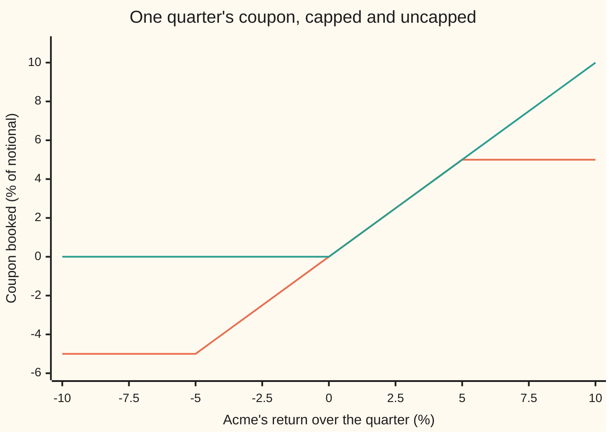
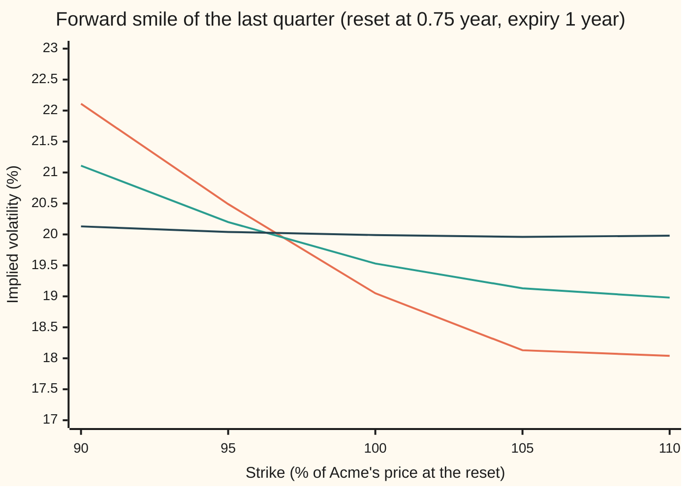

# Cliquets: a chain of forward-starts with local caps and a global floor, and why the forward smile prices it

Financial mathematics → Averages, choosers, compounds and forward-starts → Strips of forward-starts → Cliquets

---

## General Overview

Acme shares trade at $100 today, in the house market: riskless rate 5%, dividend yield 2%, volatility 20%. A bank sells a one-year note on Acme with $100 of notional, the sum the coupons are measured against. The year is cut into four quarters. At the end of each quarter the bank reads Acme's return over that quarter and books a coupon equal to it, but never more than +5% and never less than −5%. At the end of the year the four coupons are added up. If the total is positive, the holder is paid that percentage of $100. If it is negative, the holder is paid nothing.

Say Acme rises 8%, falls 3%, rises 2%, then falls 7%. The coupons are +5%, −3%, +2% and −5%. They add to −1%, so the holder gets $0. Without the caps and floors, counting only the gains, the same year would have paid 8% + 2% = 10%, or $10.

A contract like this is a **cliquet**, French for the click of a ratchet. Each quarter restarts from wherever Acme stands, the way a ratchet holds its position between clicks. The per-quarter limits are the **local cap** and **local floor**. The zero under the total is the **global floor**. From here on, these are the names.

Take away the caps and floors and the note is four forward-start calls end to end. Each is a call whose strike is set at the start of its quarter, at Acme's price that day ([forward-start-options-and-forward-volatility](06-forward-start-options-and-forward-volatility.md)). That uncapped strip has a closed form: $16.71. The capped note does not. Priced by simulation it is worth $3.50 in the flat Black-Scholes model (one volatility for everything), $4.07 under local volatility (one volatility per price and date) and $4.40 under Heston (a volatility that wanders at random). The last two agree on every one-year option price. They disagree on the cliquet because they disagree about the **smile**, the curve of implied volatilities across strikes, that options will show at the start of each future quarter.

**A cliquet is a sum of forward-start options on quarterly returns, clipped quarter by quarter and floored as a whole; the clipping makes it a bet on the shape of future smiles, so two models that price every vanilla alike can price the same cliquet 33 cents apart.**

**What kind of fact this is:** a model: the price depends on an assumption about how Acme moves, not a law. Inside it, one piece is a theorem that holds in every model: the uncapped cliquet equals the sum of its forward-start legs, proved on this card in Why it works.

### The picture: one quarter's coupon against that quarter's return



Orange: the capped coupon, flat at −5% below a −5% return, following the return in between, flat at +5% above. Green: the uncapped coupon of a forward-start call, zero for any fall and the full gain for any rise. The orange coupon can be negative; only the global floor at year end stops the total going below zero.

---

## The formula

$$V = 100\,e^{-rT}\,\mathbb{E}\!\left[\max\!\Big(\sum_{i=1}^{4} c_i,\; 0\Big)\right], \qquad c_i = \min\!\big(\max(R_i,\,-5\%),\;5\%\big), \qquad R_i = \frac{S_{t_i}}{S_{t_{i-1}}} - 1$$

**Read it aloud:** clip each quarter's return to between −5% and +5%, add the four clipped returns, floor the total at zero, and take the average of that payout over the model's paths, discounted from year end to today.

The symbol $\mathbb{E}$ is the average over the paths of the risk-neutral world, where every asset grows at the riskless rate ([monte-carlo-pricing](../06-Numerical%20Methods%20for%20Pricing/01-monte-carlo-pricing.md)). The large sigma sign adds the four quarters.

Without the caps and floors the payout is $100\sum_i \max(R_i, 0)$, and that version has a closed form:

$$V_{\text{uncapped}} = 4 \times 100\, e^{-r(T-\tau)}\, C_1(1,\tau), \qquad C_1(k,\tau) = e^{-q\tau}N(d_1) - k\,e^{-r\tau}N(d_2)$$

$$d_1 = \frac{-\ln k + (r - q + \tfrac12\sigma^2)\tau}{\sigma\sqrt{\tau}}, \qquad d_2 = d_1 - \sigma\sqrt{\tau}$$

In words: $C_1$ is the Black-Scholes call on a share worth $1, struck at $k$, running one quarter. Each quarter's uncapped coupon is worth that, per dollar of notional, discounted for the three quarters between its end and the year-end payment.

| Symbol | Plain meaning | In our example | Push it up and the answer… |
| --- | --- | --- | --- |
| $V$ | the cliquet's price today | $3.50 flat, $4.07 local vol, $4.40 Heston | is the answer |
| $S$, $S_{t_i}$ | Acme's price; $S_{t_i}$ is its price on reset date $t_i$ | $100 today | leaves the flat and Heston prices unchanged: only ratios enter |
| $t_i$, $T$ | the reset dates, in years; $T$ is the last one, when the note pays | 0, 0.25, 0.5, 0.75, 1 | more resets in the year: more coupons |
| $\tau$ | one quarter, the life of each leg | 0.25 year | each leg's return spreads wider |
| $i$ | the quarter's number, 1 to 4 | | |
| $R_i$ | Acme's return over quarter $i$ | +8%, −3%, +2%, −7% on the sample path | |
| $c_i$ | the coupon of quarter $i$, $R_i$ clipped to ±5% | +5%, −3%, +2%, −5% | |
| $r$ | riskless rate, continuously compounded | 5% | rises: +$0.15 per percentage point |
| $q$ | dividend yield, continuously compounded | 2% | falls: quarterly returns drift lower |
| $\sigma$ | flat volatility, the flat model's only dial | 20% | **falls**: −$0.02 per vol point |
| $C_1$, $k$ | Black-Scholes call on a $1 share, strike $k$, life one quarter | 0.043359 at $k = 1$ | |
| $d_1$, $d_2$ | the two standardised distances of the call formula | 0.125, 0.025 | |
| $N(x)$ | the bell-curve area to the left of $x$ | $N(d_1) = 0.5497$ | |

The negative push on $\sigma$ is not a typo. It is the first sign that this contract does not behave like an option.

### When it holds

- **Returns are read on the four dates only.** A cap or floor measured daily is a different contract with a different price.
- **The uncapped identity holds in every model.** It needs only that averages add. The closed form for each leg needs the flat model; in local volatility or Heston each leg is its forward-start price in that model instead.
- **The capped price needs a model of each future quarter's return distribution.** The flat model says every quarter has a flat smile. If the market's future smiles keep a skew like Heston's, the flat price is $0.90 too low.
- **Matching today's vanilla options does not fix the price.** Local volatility and Heston agree on every one-year option in the check and still differ by $0.33 ± 0.004 on the cliquet.
- **The bank pays.** The note is a promise by the issuer; its credit risk is left out.

---

## Why it works

### Step 0: a cliquet only sees ratios, so each quarter restarts

Every coupon is a ratio of two Acme prices. Double Acme's price on every date and nothing changes. So the price depends on one thing: how the model spreads each quarter's return, seen from the start of that quarter. An option's implied volatility is the flat volatility that reproduces its price; a **skew** is a smile that is higher at low strikes. The smile of options that start at a future date and run one quarter is the **forward smile**. A cliquet is a portfolio of bets on forward smiles.

### Step 1: the uncapped note is four forward-start calls

The payout $100\sum_i \max(R_i, 0)$ is a sum. The average of a sum is the sum of the averages, in any model. So the uncapped note is worth four legs, one per quarter.

Take one leg. At the start of its quarter, Acme stands at $S_{t_{i-1}}$ and the leg pays $100\max(S_{t_i}/S_{t_{i-1}} - 1, 0)$ at year end. Divide Acme's price by its level at the reset: the leg is 100 calls on a share worth $1, struck at $1, running one quarter. In the flat model that is worth $100\,C_1(1,\tau)$ at the reset, if paid at the quarter's end. Paying at year end instead costs interest from $t_i$ to $T$. The reset value is a fixed number, the same on every path, so taking it back to today costs interest from $0$ to $t_{i-1}$. The two gaps always add to three quarters, so the discount is $e^{-r(T-\tau)}$: 0.963194.

One leg is $100 \times 0.963194 \times 0.043359 = \$4.18$, the same for every quarter. Four legs: $16.71.

The sibling card's forward-start call is struck on a share, not on $100 of cash, so its waiting period is discounted at the dividend yield $q$ instead of $r$. Its house number, a call reset at half a year and expiring at one, is $6.244873; the check reproduces it with the same $C_1$.

<details>
<summary>Detailed proof: the uncapped identity, and why each leg is the same</summary>

Call one leg's value the price today of $100\max(R_i, 0)$ paid at $T$. In the pretend world a payment $x$ at $T$ is worth $e^{-rT}\mathbb{E}[x]$, and averages add, so $V_{\text{uncapped}}$ is the sum of the four leg values. That holds in every model.

In the flat model, $S_{t_i}/S_{t_{i-1}} = \exp\big((r - q - \tfrac12\sigma^2)\tau + \sigma\sqrt{\tau}\,Z_i\big)$ with $Z$ a standard bell-curve draw, a fresh one each quarter, independent of everything before the reset. So $\mathbb{E}[\max(R_i, 0)]$ is the same number for every quarter: the undiscounted average payoff of a call on a $1 share struck at $1 over one quarter, which is $e^{r\tau}C_1(1,\tau)$ by the Black-Scholes formula. Then
$$\text{one leg} = 100\,e^{-rT}\,e^{r\tau}\,C_1(1,\tau) = 100\,e^{-r(T-\tau)}\,C_1(1,\tau).$$
Summing four equal legs gives the formula. In a model where the return's spread depends on the path, such as Heston, $\mathbb{E}[\max(R_i, 0)]$ still exists and the sum still holds; only the closed form for each leg is lost.

</details>

### Step 2: each clipped coupon is a forward plus a put minus a call

A clipped return can be rebuilt from options on the same return:

$$\min\!\big(\max(R,\,-5\%),\,5\%\big) = R \;-\; \max(R - 5\%,\,0) \;+\; \max(-5\% - R,\,0)$$

Check it on three returns. At +8%: 8% − 3% + 0 = 5%. At −7%: −7% − 0 + 2% = −5%. At +2%: 2% − 0 + 0 = 2%.

So holding one quarter's coupon is holding the quarter's return, **short** a forward-start call struck 5% above the reset level, and **long** a forward-start put struck 5% below it. Without the global floor, the note is four of these and its price is linear: it depends on each quarter's forward smile at the 95% and 105% strikes only. In the flat model that version is worth $0.42. The average clipped coupon is small, 0.1112% of notional, because rises and falls nearly cancel.

### Step 3: the global floor is a put on the sum of the coupons

For any total $x$, $\max(x, 0) = x + \max(-x, 0)$. The global floor adds a put, struck at zero, on the sum of four coupons. This put is not linear in the quarters. Its value depends on how the four coupons move together, so no quarter can be priced alone. It is also most of the price: $0.42 of the flat $3.50 is the coupons, the rest is the floor. Since $\max(\sum c_i, 0)$ lies between $\sum c_i$ and $\sum \max(c_i, 0)$ on every path, the price must lie between $0.42 and $7.87, the what-breaks rows below; $3.50 does.

In the flat model the four quarters are independent and identical. A single quarter's coupon has a known distribution: 29.58% of the time it sits on the floor, 32.21% of the time on the cap, and 38.21% of the time in between. The distribution of the sum of four comes from combining that distribution with itself four times, a **convolution**: the chance of each total is the sum, over all ways of reaching it, of the product of the pieces' chances. The check does it on a grid of steps of 0.025 percentage points and gets $3.502734. A simulation of 100,000 flat paths gets $3.497501 ± 0.015427. Two roads, one price.

### Step 4: the forward smile decides the coupons

Heston's variance wanders and leans against the share, with correlation −0.7 ([heston-model](../14-Stochastic%20volatility%20-%20Heston%2C%20SABR%20and%20their%20mix/01-heston-model.md)). That produces a skew today, and it produces the same kind of skew at every future date, because the variance still wanders then. Local volatility gives Acme one volatility per price and date, fitted to today's smile ([dupire-local-volatility](../13-Local%20volatility%20and%20jumps/01-dupire-local-volatility.md)). Its future smiles are whatever that fixed table implies once the price has moved, and they come out flatter ([pricing-under-local-volatility-and-the-forward-smile](../13-Local%20volatility%20and%20jumps/03-pricing-under-local-volatility-and-the-forward-smile.md)).



Orange: Heston, 20.49% at the 95% strike and 18.13% at 105%. Green: local volatility, 20.20% and 19.13%, less than half the tilt. Dark blue: the flat model, 20% within simulation noise. Each point is a forward-start call on the last quarter's return, priced on the simulated paths and turned back into a volatility by bisection.

Now read Step 2 again. The coupon holder is long the 95% put and short the 105% call. A skew makes the put dear and the call cheap, so it raises the coupon's value on both sides. Heston has the steepest forward skew and the highest price; flat has none and the lowest.

| Model | Price | Chance a quarter hits the cap | Chance it hits the floor | Coupons alone, no global floor |
| --- | --- | --- | --- | --- |
| Flat, 20% | $3.50 | 32.07% | 29.53% | $0.41 |
| Local volatility | $4.07 | 33.35% | 27.06% | $1.39 |
| Heston | $4.40 | 33.45% | 25.65% | $1.93 |

The skew moves probability away from moderate falls: Heston's fat left tail carries its losses in rare deep drops, which the −5% floor ignores. The coupons gain; the global floor, needed less often, is worth less. The net is +$0.90 for Heston over flat.

### Step 5: why local volatility and Heston agree on every vanilla

Gyöngy's theorem: for a model without jumps, set the local variance at each price and date to the average variance of the model's paths standing at that price and date. The resulting local-volatility model gives the share the same distribution on each single date as the original. The check builds local volatility this way from the Heston paths, averaging over bins of price. It prices the one-year calls alike:

| Strike | 90 | 95 | 100 | 105 | 110 |
| --- | --- | --- | --- | --- | --- |
| Heston, one-year implied vol (%) | 20.96 | 20.21 | 19.48 | 18.77 | 18.08 |
| Local volatility (%) | 20.90 | 20.18 | 19.46 | 18.77 | 18.09 |

Same distribution on each date; different joins between dates. A cliquet's payout depends on four dates at once, so the joins are what it prices. On the same random numbers, Heston minus local volatility is $0.330527 ± 0.004206: far outside simulation error. The general recipe that fits both at once, a leverage function on top of Heston, is on [stochastic-local-volatility](../14-Stochastic%20volatility%20-%20Heston%2C%20SABR%20and%20their%20mix/06-stochastic-local-volatility.md).

---

## Worked numbers, by hand

House market, one quarter: $\tau = 0.25$, $\sigma = 20\%$, so a quarter's typical move is 10%.

| Step | Arithmetic | Value |
| --- | --- | --- |
| $d_1$ | $(0 + (0.05 - 0.02 + 0.02) \times 0.25) / 0.10$ | 0.125 |
| $d_2$ | $0.125 - 0.10$ | 0.025 |
| $N(d_1)$, $N(d_2)$ | bell-curve table | 0.549738, 0.509973 |
| $C_1(1, 0.25)$ | $e^{-0.005} \times 0.549738 - e^{-0.0125} \times 0.509973$ | 0.043359 |
| discount $e^{-r(T-\tau)}$ | $e^{-0.05 \times 0.75}$ | 0.963194 |
| one uncapped leg | $100 \times 0.963194 \times 0.043359$ | $4.18 |
| **uncapped cliquet** | $4 \times 4.176301$ | **$16.71** |
| chance a quarter's coupon hits −5% | $N\big((\ln 0.95 - 0.0025)/0.10\big)$, read on the check's grid | 0.295766 |
| chance it hits +5% | one minus the same at $\ln 1.05$, on the grid | 0.322144 |
| average clipped coupon | grid sum over the quarter's distribution | 0.1112% |
| capped, no global floor | $100 \times e^{-0.05} \times 4 \times 0.001112$ | $0.42 |
| **capped with the global floor, flat model** | four-fold convolution | **$3.50** |

The capped note costs far less than the uncapped one: the holder has given up every quarterly gain above 5% and taken losses down to −5%, keeping only a floor on the total.

### What breaks if you drop a piece

| Mistake | Comes out at | What went wrong |
| --- | --- | --- |
| Drop the global floor | $0.42 (right: $3.50) | The floor is most of the value; the clipped coupons nearly cancel |
| Floor each quarter at 0 instead of −5%, no global floor | $7.87 | That is a strip of call spreads: losses never count, so the price more than doubles |
| Discount each uncapped leg's wait at $q$, as if the $100 were a share | $16.89 (right: $16.71) | The notional is cash fixed today; only a share-struck forward-start waits at $q$ |
| Flat 20% when the market's future smiles look like Heston's | $3.50 (right: $4.40) | No forward skew, so the 95% put is too cheap and the 105% call too dear |
| Local volatility when the market looks like Heston | $4.07 (right: $4.40) | Right vanillas, forward skew too flat |

### The Greeks at the start

| Greek | Flat model | What it means |
| --- | --- | --- |
| Delta, per $1 of Acme | zero | only ratios enter, so the level of Acme does not matter; under Heston too, but not under local volatility, whose table depends on the level |
| Vega, per vol point | −$0.024371 | more volatility lowers the median quarterly return and pushes more quarters onto the floor |
| Rho, per rate point | +$0.153719 | a higher rate lifts every quarter's drift, which outweighs the extra discounting |

The flat price falls as volatility rises, at every level the check tried:

```
flat vol   cliquet price, flat model
   10%   ████████████████████████████████████  $3.70
   15%   ███████████████████████████████████   $3.62
   20%   ██████████████████████████████████    $3.50
   25%   ████████████████████████████████      $3.38
   30%   ███████████████████████████████       $3.27
```

The slope is gentle, which is the trap: a desk that marks the cliquet with one flat volatility sees almost no volatility risk, while the real risk sits in the skew of future smiles.

---

## Code, from first principles, and it actually runs

The code reaches the uncapped price two ways: four forward-start closed forms, and 100,000 simulated flat paths. It reaches the capped flat price two ways: a four-fold convolution on a grid, and the same simulation. It then simulates Heston with 32 steps a year, records the average variance at each price and date on the way, and uses that table as a local-volatility model driven by the same random shocks. From those paths it reads the forward smile and the one-year smile of each model, and every price on the card. Five asserts compare roads that share no arithmetic; four deliberate breaks of the maths each trip one. Python and Rust print identical output.

### Python

```python
# Cliquets -- the check behind the card.  Standard library only; nothing imported knows the answer: bell-curve area
# by its series, random numbers by a 64-bit congruential recurrence and Box-Muller, implied vol by bisection.
from math import log, exp, sqrt, cos, sin, pi

S0, r, q, sig, T = 100.0, 0.05, 0.02, 0.20, 1.0        # the house market
NQ, M = 4, 8; tau = T / NQ; dt = tau / M; NS = NQ * M   # four quarters, eight steps each
CAP, FLO = 0.05, -0.05                                  # local cap and floor; the global floor is 0
kap, th, xi, rho, v0 = 2.0, 0.04, 0.3, -0.7, 0.04       # the house Heston model
NP, NB, W = 100000, 50, 0.04                            # paths; local-vol table: 50 bins of 0.04 in ln(S/S0)
KS = (0.90, 0.95, 1.00, 1.05, 1.10)

def N(x):                                               # bell-curve area left of x, Marsaglia's series
    if x < -8.0: return 0.0
    if x > 8.0: return 1.0
    s, t, b, xx, i = x, 0.0, x, x * x, 1.0
    while s != t:
        t = s; i += 2.0; b *= xx / i; s = t + b
    return 0.5 + s * exp(-0.5 * xx - 0.91893853320467274178)

def unit_call(k, ta, sg, rr=r):                         # Black-Scholes call on a $1 share, strike k
    d1 = (-log(k) + (rr - q + 0.5 * sg * sg) * ta) / (sg * sqrt(ta)); d2 = d1 - sg * sqrt(ta)
    return exp(-q * ta) * N(d1) - k * exp(-rr * ta) * N(d2), d1, d2

def implied(price, k, ta):                              # bisection: the flat vol that gives this price
    lo, hi = 0.01, 1.0
    for _ in range(60):
        mid = 0.5 * (lo + hi)
        if unit_call(k, ta, mid)[0] > price: hi = mid
        else: lo = mid
    return 0.5 * (lo + hi)

def conv_price(sg, cap=CAP, flo=FLO, gf=0.0, rr=r, h=0.00025):
    # Road 2, flat model only: the quarter's capped coupon on a grid, four copies added by convolution
    mu, s = (rr - q - 0.5 * sg * sg) * tau, sg * sqrt(tau)
    F = lambda a: N((log(1.0 + a) - mu) / s)            # chance the quarter's return is below a
    m = int(round((cap - flo) / h))
    p = [F(flo + h / 2)] + [F(flo + i * h + h / 2) - F(flo + i * h - h / 2) for i in range(1, m)] + [1.0 - F(cap - h / 2)]
    d = p
    for _ in range(NQ - 1):
        out = [0.0] * (len(d) + m)
        for i, a in enumerate(d):
            for j, b in enumerate(p): out[i + j] += a * b
        d = out
    ev = sum(w * max(NQ * flo + n * h, gf) for n, w in enumerate(d))
    ec = sum(w * (flo + n * h) for n, w in enumerate(p)); ep = sum(w * max(flo + n * h, 0.0) for n, w in enumerate(p))
    return 100.0 * exp(-rr * T) * ev, 1.0 - p[-1] - p[0], p[0], p[-1], ec, ep

st = [0x2545F4914F6CDD1D]
def pair():                                             # two independent standard normal draws
    st[0] = (st[0] * 6364136223846793005 + 1442695040888963407) & 0xFFFFFFFFFFFFFFFF
    u1 = ((st[0] >> 11) + 0.5) / 9007199254740992.0
    st[0] = (st[0] * 6364136223846793005 + 1442695040888963407) & 0xFFFFFFFFFFFFFFFF
    u2 = ((st[0] >> 11) + 0.5) / 9007199254740992.0
    rr = sqrt(-2.0 * log(u1)); return rr * cos(2.0 * pi * u2), rr * sin(2.0 * pi * u2)

def payoffs(xs):                                        # xs = ln(S/S0) at 0, 0.25, 0.5, 0.75, 1
    R = [exp(xs[i + 1] - xs[i]) - 1.0 for i in range(NQ)]
    c = sum(min(max(x, FLO), CAP) for x in R)
    return (max(c, 0.0), sum(max(x, 0.0) for x in R), [max(1.0 + R[3] - k, 0.0) for k in KS],
            [max(exp(xs[NQ]) - k, 0.0) for k in KS], c, sum(x > CAP for x in R), sum(x < FLO for x in R))

# ---- Road 3: Heston paths; the same pass records the average variance at each price and date ----
rq = sqrt(1.0 - rho * rho)
sv = [[0.0] * NB for _ in range(NS)]; cn = [[0.0] * NB for _ in range(NS)]
H = []
for _ in range(NP):
    X, v, xs = 0.0, v0, [0.0]
    for j in range(NS):
        vp = v if v > 0.0 else 0.0
        b = min(max(int((X + 1.0) / W), 0), NB - 1)
        sv[j][b] += vp; cn[j][b] += 1.0
        z1, z2 = pair()
        X += (r - q - 0.5 * vp) * dt + sqrt(vp * dt) * z1
        v += kap * (th - vp) * dt + xi * sqrt(vp * dt) * (rho * z1 + rq * z2)
        if (j + 1) % M == 0: xs.append(X)
    H.append(payoffs(xs))
# local variance = average Heston variance of the paths at that price and date (Gyongy), shrunk to the date's mean
L = [[(sv[j][b] + 50.0 * sum(sv[j]) / NP) / (cn[j][b] + 50.0) for b in range(NB)] for j in range(NS)]

# ---- Roads 4 and 1b: local-vol paths and flat paths, driven by the same share shocks as Heston ----
st[0] = 0x2545F4914F6CDD1D
LV, FL = [], []
for _ in range(NP):
    X, Y, xs, ys = 0.0, 0.0, [0.0], [0.0]
    for j in range(NS):
        lv = L[j][min(max(int((X + 1.0) / W), 0), NB - 1)]
        z1, z2 = pair()
        X += (r - q - 0.5 * lv) * dt + sqrt(lv * dt) * z1
        Y += (r - q - 0.5 * sig * sig) * dt + sig * sqrt(dt) * z1
        if (j + 1) % M == 0: xs.append(X); ys.append(Y)
    LV.append(payoffs(xs)); FL.append(payoffs(ys))

D = exp(-r * T)
def stats(a):
    m = sum(a) / len(a); return m, sqrt(sum((x - m) * (x - m) for x in a) / (len(a) - 1) / len(a))
def show(label, *vals, dp=6): print(f"{label:<44}" + "".join(f"{v:>11.{dp}f}" for v in vals))

# ---- Road 1: the uncapped cliquet is four forward-start calls, closed form ----
u, d1, d2 = unit_call(1.0, tau, sig)
leg = 100.0 * exp(-r * (T - tau)) * u
fs_house = 100.0 * exp(-q * 0.5) * unit_call(1.0, 0.5, sig)[0]    # the shelf's forward-start, reset 0.5 year
show("d1, d2, N(d1), N(d2) (one quarter)", d1, d2, N(d1), N(d2))
show("unit call C(1,1,0.25), e^-r(T-tau)", u, exp(-r * (T - tau))); show("house check: forward-start reset 0.5y", fs_house)
show("uncapped leg, each of four", leg); show("uncapped: sum of four legs", 4 * leg)
unc, unc_se = stats([100 * D * a[1] for a in FL]); show("uncapped: flat simulation, std error", unc, unc_se)
show("wrong: notional carried as a share", sum(100 * exp(-q * i * tau - r * (T - (i + 1) * tau)) * u for i in range(NQ)))
show("monthly resets, uncapped (12 legs)", 12 * 100 * exp(-r * (T - T / 12)) * unit_call(1.0, T / 12, sig)[0])
cv, pin, pfl, pcap, ec, ep = conv_price(sig)
show("flat: P(floor), P(inside), P(cap), E[c]", pfl, pin, pcap, ec); show("capped: flat, convolution", cv)
fl, fl_se = stats([100 * D * a[0] for a in FL]); show("capped: flat simulation, std error", fl, fl_se)
he, he_se = stats([100 * D * a[0] for a in H]); show("capped: Heston simulation, std error", he, he_se)
lo, lo_se = stats([100 * D * a[0] for a in LV]); show("capped: local vol simulation, std error", lo, lo_se)
gap, gap_se = stats([100 * D * (H[i][0] - LV[i][0]) for i in range(NP)]); show("Heston minus local vol, std error", gap, gap_se)
show("Heston minus flat", he - fl)
for nm, A in (("Heston", H), ("local vol", LV), ("flat", FL)):
    show(f"{nm}: P(cap), P(floor), no floor", sum(a[5] for a in A) / (4 * NP), sum(a[6] for a in A) / (4 * NP), 100 * D * sum(a[4] for a in A) / NP)
show("wrong: no global floor", 100 * D * NQ * ec); show("wrong: local floor 0, no global", 100 * D * NQ * ep)
ivs = {}
for nm, A in (("Heston", H), ("local vol", LV), ("flat", FL)):
    ivs[nm] = [100 * implied(sum(a[2][i] for a in A) / NP * exp(-r * tau), KS[i], tau) for i in range(5)]
    show(f"forward smile Q4, {nm} (%)", *ivs[nm], dp=2)
for nm, A in (("Heston", H), ("local vol", LV)):
    ivs[nm + " 1y"] = [100 * implied(sum(a[3][i] for a in A) / NP * D, KS[i], T) for i in range(5)]
    show(f"1-year smile, {nm} (%)", *ivs[nm + " 1y"], dp=2)
show("flat price at vol 10,15,20,25,30%", *[conv_price(s)[0] for s in (0.10, 0.15, 0.20, 0.25, 0.30)], dp=2)
show("vega per vol point (19% to 21%)", (conv_price(0.21)[0] - conv_price(0.19)[0]) / 2)
show("rho per rate point (4% to 6%)", (conv_price(sig, rr=0.06)[0] - conv_price(sig, rr=0.04)[0]) / 2)
show("try: global floor 2%", conv_price(sig, gf=0.02)[0]); show("try: cap 10%, floor -10%", conv_price(sig, 0.10, -0.10)[0])
RS = (-10, -7.5, -5, -2.5, 0, 2.5, 5, 7.5, 10)
show("coupon (%) at return -10..10 by 2.5", *[100 * min(max(x / 100, FLO), CAP) for x in RS], dp=2)
show("uncapped coupon (%), same returns", *[100 * max(x / 100, 0.0) for x in RS], dp=2)
cs = sum(min(max(x, FLO), CAP) for x in (0.08, -0.03, 0.02, -0.07))
show("path +8,-3,+2,-7%: sum, paid, uncapped", 100 * cs, 100 * max(cs, 0.0), 100 * sum(max(x, 0.0) for x in (0.08, -0.03, 0.02, -0.07)))

assert abs(unc - 4 * leg) < 3 * unc_se, "uncapped: simulation must match four forward-start closed forms"
assert abs(fl - cv) < 3 * fl_se, "capped, flat: simulation must match convolution"
assert abs(fs_house - 6.244873) < 1e-6, "forward-start must match the shelf's house number"
assert abs(ivs["Heston 1y"][2] - ivs["local vol 1y"][2]) < 0.3, "local vol must reprice Heston's 1-year ATM call"
assert gap > 5 * gap_se, "Heston and local vol must disagree on the cliquet"
print("All checks passed.")
```

**Ran 2026-09-24 on macOS, Python 3.14.6, standard library only. All checks passed. Output, pasted from the run:**

```
d1, d2, N(d1), N(d2) (one quarter)             0.125000   0.025000   0.549738   0.509973
unit call C(1,1,0.25), e^-r(T-tau)             0.043359   0.963194
house check: forward-start reset 0.5y          6.244873
uncapped leg, each of four                     4.176301
uncapped: sum of four legs                    16.705203
uncapped: flat simulation, std error          16.637796   0.038742
wrong: notional carried as a share            16.894792
monthly resets, uncapped (12 legs)            27.774080
flat: P(floor), P(inside), P(cap), E[c]        0.295766   0.382090   0.322144   0.001112
capped: flat, convolution                      3.502734
capped: flat simulation, std error             3.497501   0.015427
capped: Heston simulation, std error           4.401358   0.016553
capped: local vol simulation, std error        4.070832   0.016021
Heston minus local vol, std error              0.330527   0.004206
Heston minus flat                              0.903857
Heston: P(cap), P(floor), no floor             0.334505   0.256528   1.931135
local vol: P(cap), P(floor), no floor          0.333540   0.270618   1.389829
flat: P(cap), P(floor), no floor               0.320670   0.295303   0.412006
wrong: no global floor                         0.422927
wrong: local floor 0, no global                7.865039
forward smile Q4, Heston (%)                      22.11      20.49      19.05      18.13      18.04
forward smile Q4, local vol (%)                   21.11      20.20      19.53      19.13      18.98
forward smile Q4, flat (%)                        20.13      20.04      19.99      19.96      19.98
1-year smile, Heston (%)                          20.96      20.21      19.48      18.77      18.08
1-year smile, local vol (%)                       20.90      20.18      19.46      18.77      18.09
flat price at vol 10,15,20,25,30%                  3.70       3.62       3.50       3.38       3.27
vega per vol point (19% to 21%)               -0.024371
rho per rate point (4% to 6%)                  0.153719
try: global floor 2%                           4.536485
try: cap 10%, floor -10%                       6.055651
coupon (%) at return -10..10 by 2.5               -5.00      -5.00      -5.00      -2.50       0.00       2.50       5.00       5.00       5.00
uncapped coupon (%), same returns                  0.00       0.00       0.00       0.00       0.00       2.50       5.00       7.50      10.00
path +8,-3,+2,-7%: sum, paid, uncapped        -1.000000   0.000000  10.000000
All checks passed.
```

### Rust

```rust
// Cliquets -- the check behind the card.  Rust std only; nothing imported knows the answer: bell-curve area
// by its series, random numbers by a 64-bit congruential recurrence and Box-Muller, implied vol by bisection.
use std::f64::consts::PI;

const R: f64 = 0.05; const Q: f64 = 0.02; const SIG: f64 = 0.20; const T: f64 = 1.0;   // the house market
const NQ: usize = 4; const M: usize = 8; const NS: usize = NQ * M;                    // four quarters, eight steps each
const CAP: f64 = 0.05; const FLO: f64 = -0.05;                                        // local cap and floor; global floor 0
const KAP: f64 = 2.0; const TH: f64 = 0.04; const XI: f64 = 0.3; const RHO: f64 = -0.7; const V0: f64 = 0.04;
const NP: usize = 100000; const NB: usize = 50; const W: f64 = 0.04;                 // paths; local-vol table bins
const KS: [f64; 5] = [0.90, 0.95, 1.00, 1.05, 1.10];

fn n(x: f64) -> f64 {                                   // bell-curve area left of x, Marsaglia's series
    if x < -8.0 { return 0.0; }
    if x > 8.0 { return 1.0; }
    let (mut s, mut t, mut b, xx, mut i) = (x, 0.0, x, x * x, 1.0);
    while s != t { t = s; i += 2.0; b *= xx / i; s = t + b; }
    0.5 + s * (-0.5 * xx - 0.91893853320467274178).exp()
}
fn unit_call(k: f64, ta: f64, sg: f64, rr: f64) -> (f64, f64, f64) {   // Black-Scholes call on a $1 share
    let d1 = (-k.ln() + (rr - Q + 0.5 * sg * sg) * ta) / (sg * ta.sqrt()); let d2 = d1 - sg * ta.sqrt();
    ((-Q * ta).exp() * n(d1) - k * (-rr * ta).exp() * n(d2), d1, d2)
}
fn implied(price: f64, k: f64, ta: f64) -> f64 {        // bisection: the flat vol that gives this price
    let (mut lo, mut hi) = (0.01, 1.0);
    for _ in 0..60 {
        let mid = 0.5 * (lo + hi);
        if unit_call(k, ta, mid, R).0 > price { hi = mid; } else { lo = mid; }
    }
    0.5 * (lo + hi)
}
fn conv_price(sg: f64, cap: f64, flo: f64, gf: f64, rr: f64) -> (f64, f64, f64, f64, f64, f64) {
    // Road 2, flat model only: the quarter's capped coupon on a grid, four copies added by convolution
    let (h, tau) = (0.00025, T / NQ as f64);
    let (mu, s) = ((rr - Q - 0.5 * sg * sg) * tau, sg * tau.sqrt());
    let f = |a: f64| n(((1.0 + a).ln() - mu) / s);     // chance the quarter's return is below a
    let m = ((cap - flo) / h).round() as usize;
    let mut p = vec![f(flo + h / 2.0)];
    for i in 1..m { p.push(f(flo + i as f64 * h + h / 2.0) - f(flo + i as f64 * h - h / 2.0)); }
    p.push(1.0 - f(cap - h / 2.0));
    let mut d = p.clone();
    for _ in 0..NQ - 1 {
        let mut out = vec![0.0; d.len() + m];
        for (i, a) in d.iter().enumerate() { for (j, b) in p.iter().enumerate() { out[i + j] += a * b; } }
        d = out;
    }
    let ev: f64 = d.iter().enumerate().map(|(k, w)| w * (NQ as f64 * flo + k as f64 * h).max(gf)).sum();
    let ec: f64 = p.iter().enumerate().map(|(k, w)| w * (flo + k as f64 * h)).sum();
    let ep: f64 = p.iter().enumerate().map(|(k, w)| w * (flo + k as f64 * h).max(0.0)).sum();
    (100.0 * (-rr * T).exp() * ev, 1.0 - p[m] - p[0], p[0], p[m], ec, ep)
}
struct Rng(u64);
impl Rng {
    fn u(&mut self) -> f64 {
        self.0 = self.0.wrapping_mul(6364136223846793005).wrapping_add(1442695040888963407);
        ((self.0 >> 11) as f64 + 0.5) / 9007199254740992.0
    }
    fn pair(&mut self) -> (f64, f64) {                  // two independent standard normal draws
        let (u1, u2) = (self.u(), self.u());
        let rr = (-2.0 * u1.ln()).sqrt(); (rr * (2.0 * PI * u2).cos(), rr * (2.0 * PI * u2).sin())
    }
}
struct Pay { capped: f64, unc: f64, fwd: [f64; 5], van: [f64; 5], c: f64, ncap: f64, nflo: f64 }
fn payoffs(xs: &[f64]) -> Pay {                         // xs = ln(S/S0) at 0, 0.25, 0.5, 0.75, 1
    let rt: Vec<f64> = (0..NQ).map(|i| (xs[i + 1] - xs[i]).exp() - 1.0).collect();
    let c: f64 = rt.iter().map(|x| x.max(FLO).min(CAP)).sum();
    Pay { capped: c.max(0.0), unc: rt.iter().map(|x| x.max(0.0)).sum(),
          fwd: KS.map(|k| (1.0 + rt[3] - k).max(0.0)), van: KS.map(|k| (xs[NQ].exp() - k).max(0.0)), c,
          ncap: rt.iter().filter(|&&x| x > CAP).count() as f64, nflo: rt.iter().filter(|&&x| x < FLO).count() as f64 }
}
fn stats(a: &[f64]) -> (f64, f64) {
    let nn = a.len() as f64; let m = a.iter().sum::<f64>() / nn;
    (m, (a.iter().map(|x| (x - m) * (x - m)).sum::<f64>() / (nn - 1.0) / nn).sqrt())
}
fn showp(label: &str, vals: &[f64], dp: usize) {
    let mut s = format!("{:<44}", label);
    for v in vals { s += &format!("{:>11.*}", dp, v); }
    println!("{}", s);
}
fn show(label: &str, vals: &[f64]) { showp(label, vals, 6) }
fn main() {
    let tau = T / NQ as f64; let dt = tau / M as f64; let bin = |x: f64| (((x + 1.0) / W) as i64).max(0).min(NB as i64 - 1) as usize;
    // ---- Road 3: Heston paths; the same pass records the average variance at each price and date ----
    let rq = (1.0 - RHO * RHO).sqrt();
    let row = [0.0f64; NB]; let (mut sv, mut cn) = (vec![row; NS], vec![row; NS]);
    let mut rng = Rng(0x2545F4914F6CDD1D); let mut hp = Vec::with_capacity(NP);
    for _ in 0..NP {
        let (mut x, mut v, mut xs) = (0.0f64, V0, vec![0.0]);
        for j in 0..NS {
            let vp = if v > 0.0 { v } else { 0.0 };
            let b = bin(x); sv[j][b] += vp; cn[j][b] += 1.0;
            let (z1, z2) = rng.pair();
            x += (R - Q - 0.5 * vp) * dt + (vp * dt).sqrt() * z1;
            v += KAP * (TH - vp) * dt + XI * (vp * dt).sqrt() * (RHO * z1 + rq * z2);
            if (j + 1) % M == 0 { xs.push(x); }
        }
        hp.push(payoffs(&xs));
    }
    // local variance = average Heston variance of the paths at that price and date (Gyongy), shrunk to the date's mean
    let l: Vec<Vec<f64>> = (0..NS).map(|j| { let tot: f64 = sv[j].iter().sum();
        (0..NB).map(|b| (sv[j][b] + 50.0 * tot / NP as f64) / (cn[j][b] + 50.0)).collect() }).collect();
    // ---- Roads 4 and 1b: local-vol paths and flat paths, driven by the same share shocks as Heston ----
    let mut rng = Rng(0x2545F4914F6CDD1D); let (mut lp, mut fp) = (Vec::with_capacity(NP), Vec::with_capacity(NP));
    for _ in 0..NP {
        let (mut x, mut y, mut xs, mut ys) = (0.0f64, 0.0f64, vec![0.0], vec![0.0]);
        for j in 0..NS {
            let lv = l[j][bin(x)];
            let (z1, _z2) = rng.pair();
            x += (R - Q - 0.5 * lv) * dt + (lv * dt).sqrt() * z1;
            y += (R - Q - 0.5 * SIG * SIG) * dt + SIG * dt.sqrt() * z1;
            if (j + 1) % M == 0 { xs.push(x); ys.push(y); }
        }
        lp.push(payoffs(&xs)); fp.push(payoffs(&ys));
    }
    let dd = (-R * T).exp(); let npf = NP as f64;
    // ---- Road 1: the uncapped cliquet is four forward-start calls, closed form ----
    let (u, d1, d2) = unit_call(1.0, tau, SIG, R);
    let leg = 100.0 * (-R * (T - tau)).exp() * u;
    let fs_house = 100.0 * (-Q * 0.5).exp() * unit_call(1.0, 0.5, SIG, R).0;   // the shelf's forward-start, reset 0.5 year
    show("d1, d2, N(d1), N(d2) (one quarter)", &[d1, d2, n(d1), n(d2)]);
    show("unit call C(1,1,0.25), e^-r(T-tau)", &[u, (-R * (T - tau)).exp()]);
    show("house check: forward-start reset 0.5y", &[fs_house]);
    show("uncapped leg, each of four", &[leg]); show("uncapped: sum of four legs", &[4.0 * leg]);
    let (unc, unc_se) = stats(&fp.iter().map(|a| 100.0 * dd * a.unc).collect::<Vec<_>>());
    show("uncapped: flat simulation, std error", &[unc, unc_se]);
    show("wrong: notional carried as a share", &[(0..NQ).map(|i| 100.0 * (-Q * i as f64 * tau - R * (T - (i + 1) as f64 * tau)).exp() * u).sum::<f64>()]);
    show("monthly resets, uncapped (12 legs)", &[1200.0 * (-R * (T - T / 12.0)).exp() * unit_call(1.0, T / 12.0, SIG, R).0]);
    let (cv, pin, pfl, pcap, ec, ep) = conv_price(SIG, CAP, FLO, 0.0, R);
    show("flat: P(floor), P(inside), P(cap), E[c]", &[pfl, pin, pcap, ec]); show("capped: flat, convolution", &[cv]);
    let st = |ps: &Vec<Pay>| stats(&ps.iter().map(|a| 100.0 * dd * a.capped).collect::<Vec<_>>());
    let (fl, fl_se) = st(&fp); show("capped: flat simulation, std error", &[fl, fl_se]);
    let (he, he_se) = st(&hp); show("capped: Heston simulation, std error", &[he, he_se]);
    let (lo, lo_se) = st(&lp); show("capped: local vol simulation, std error", &[lo, lo_se]);
    let (gap, gap_se) = stats(&(0..NP).map(|i| 100.0 * dd * (hp[i].capped - lp[i].capped)).collect::<Vec<_>>());
    show("Heston minus local vol, std error", &[gap, gap_se]); show("Heston minus flat", &[he - fl]);
    for (nm, a) in [("Heston", &hp), ("local vol", &lp), ("flat", &fp)] {
        show(&format!("{}: P(cap), P(floor), no floor", nm), &[a.iter().map(|p| p.ncap).sum::<f64>() / (4.0 * npf),
            a.iter().map(|p| p.nflo).sum::<f64>() / (4.0 * npf), 100.0 * dd * a.iter().map(|p| p.c).sum::<f64>() / npf]);
    }
    show("wrong: no global floor", &[100.0 * dd * 4.0 * ec]); show("wrong: local floor 0, no global", &[100.0 * dd * 4.0 * ep]);
    let mut atm1y = [0.0; 2];
    for (nm, a) in [("Heston", &hp), ("local vol", &lp), ("flat", &fp)] {
        let iv: Vec<f64> = (0..5).map(|i| 100.0 * implied(a.iter().map(|p| p.fwd[i]).sum::<f64>() / npf * (-R * tau).exp(), KS[i], tau)).collect();
        showp(&format!("forward smile Q4, {} (%)", nm), &iv, 2);
    }
    for (c, (nm, a)) in [("Heston", &hp), ("local vol", &lp)].into_iter().enumerate() {
        let iv: Vec<f64> = (0..5).map(|i| 100.0 * implied(a.iter().map(|p| p.van[i]).sum::<f64>() / npf * dd, KS[i], T)).collect();
        showp(&format!("1-year smile, {} (%)", nm), &iv, 2); atm1y[c] = iv[2];
    }
    let hump: Vec<f64> = [0.10, 0.15, 0.20, 0.25, 0.30].iter().map(|&s| conv_price(s, CAP, FLO, 0.0, R).0).collect();
    showp("flat price at vol 10,15,20,25,30%", &hump, 2);
    show("vega per vol point (19% to 21%)", &[(conv_price(0.21, CAP, FLO, 0.0, R).0 - conv_price(0.19, CAP, FLO, 0.0, R).0) / 2.0]);
    show("rho per rate point (4% to 6%)", &[(conv_price(SIG, CAP, FLO, 0.0, 0.06).0 - conv_price(SIG, CAP, FLO, 0.0, 0.04).0) / 2.0]);
    show("try: global floor 2%", &[conv_price(SIG, CAP, FLO, 0.02, R).0]); show("try: cap 10%, floor -10%", &[conv_price(SIG, 0.10, -0.10, 0.0, R).0]);
    let rs = [-10.0, -7.5, -5.0, -2.5, 0.0, 2.5, 5.0, 7.5, 10.0f64];
    showp("coupon (%) at return -10..10 by 2.5", &rs.map(|x| 100.0 * (x / 100.0).max(FLO).min(CAP)), 2);
    showp("uncapped coupon (%), same returns", &rs.map(|x| 100.0 * (x / 100.0).max(0.0)), 2);
    let path = [0.08, -0.03, 0.02, -0.07f64]; let cs: f64 = path.iter().map(|x| x.max(FLO).min(CAP)).sum();
    show("path +8,-3,+2,-7%: sum, paid, uncapped", &[100.0 * cs, 100.0 * cs.max(0.0), 100.0 * path.iter().map(|x| x.max(0.0)).sum::<f64>()]);

    assert!((unc - 4.0 * leg).abs() < 3.0 * unc_se, "uncapped: simulation must match four forward-start closed forms");
    assert!((fl - cv).abs() < 3.0 * fl_se, "capped, flat: simulation must match convolution");
    assert!((fs_house - 6.244873).abs() < 1e-6, "forward-start must match the shelf's house number");
    assert!((atm1y[0] - atm1y[1]).abs() < 0.3, "local vol must reprice Heston's 1-year ATM call");
    assert!(gap > 5.0 * gap_se, "Heston and local vol must disagree on the cliquet");
    println!("All checks passed.");
}
```

**Ran 2026-09-24 on macOS, rustc 1.98.1, no crates. All checks passed. Output, pasted from the run:**

```
d1, d2, N(d1), N(d2) (one quarter)             0.125000   0.025000   0.549738   0.509973
unit call C(1,1,0.25), e^-r(T-tau)             0.043359   0.963194
house check: forward-start reset 0.5y          6.244873
uncapped leg, each of four                     4.176301
uncapped: sum of four legs                    16.705203
uncapped: flat simulation, std error          16.637796   0.038742
wrong: notional carried as a share            16.894792
monthly resets, uncapped (12 legs)            27.774080
flat: P(floor), P(inside), P(cap), E[c]        0.295766   0.382090   0.322144   0.001112
capped: flat, convolution                      3.502734
capped: flat simulation, std error             3.497501   0.015427
capped: Heston simulation, std error           4.401358   0.016553
capped: local vol simulation, std error        4.070832   0.016021
Heston minus local vol, std error              0.330527   0.004206
Heston minus flat                              0.903857
Heston: P(cap), P(floor), no floor             0.334505   0.256528   1.931135
local vol: P(cap), P(floor), no floor          0.333540   0.270618   1.389829
flat: P(cap), P(floor), no floor               0.320670   0.295303   0.412006
wrong: no global floor                         0.422927
wrong: local floor 0, no global                7.865039
forward smile Q4, Heston (%)                      22.11      20.49      19.05      18.13      18.04
forward smile Q4, local vol (%)                   21.11      20.20      19.53      19.13      18.98
forward smile Q4, flat (%)                        20.13      20.04      19.99      19.96      19.98
1-year smile, Heston (%)                          20.96      20.21      19.48      18.77      18.08
1-year smile, local vol (%)                       20.90      20.18      19.46      18.77      18.09
flat price at vol 10,15,20,25,30%                  3.70       3.62       3.50       3.38       3.27
vega per vol point (19% to 21%)               -0.024371
rho per rate point (4% to 6%)                  0.153719
try: global floor 2%                           4.536485
try: cap 10%, floor -10%                       6.055651
coupon (%) at return -10..10 by 2.5               -5.00      -5.00      -5.00      -2.50       0.00       2.50       5.00       5.00       5.00
uncapped coupon (%), same returns                  0.00       0.00       0.00       0.00       0.00       2.50       5.00       7.50      10.00
path +8,-3,+2,-7%: sum, paid, uncapped        -1.000000   0.000000  10.000000
All checks passed.
```

> [!TIP]
> **Try changing**
> Guess first, then read the answer.
> - **Raise the global floor to 2%.** The holder is guaranteed $2 at year end. Guess the price. (Answer: $4.54, up from $3.50. The row `try: global floor 2%` prints it.)
> - **Widen the local cap and floor to ±10%.** More of each quarter's move gets through, both ways. (Answer: $6.06. The floor on the total is worth more when the total can swing further.)
> - **Price the flat model at 30% volatility.** An option would get dearer. (Answer: $3.27, cheaper than $3.50. The negative vega from the Greeks table.)
> - **Reset monthly, uncapped, twelve legs.** Twelve shorter calls or four longer ones? (Answer: $27.77 against $16.71. A call's value grows roughly with the square root of its life, so cutting the year into more pieces adds value.)

---

## The usual mistake

> [!warning]
> **Pricing a cliquet with the volatility that fits today's options.** A vanilla option depends on Acme's price on one date; a cliquet depends on the forward smile. Today's vanillas pin down each date's distribution but not how the dates join. Here local volatility and Heston match the one-year smile strike by strike and still differ by $0.33 on a $4 note. The flat model, blind to skew, misses by $0.90.
>
> Four smaller traps:
> - **Reading vega off a flat model.** It says −$0.02 per vol point: nearly no risk. The risk is in the skew of future smiles, which the flat model cannot move.
> - **Treating the uncapped legs as share-struck forward-starts.** The $100 notional is cash, so each leg waits at $r$. Waiting at $q$ gives $16.89 instead of $16.71.
> - **Forgetting the global floor makes the quarters interact.** Without it the price is a sum over quarters: $0.42. With it, a model of the joint path is needed.
> - **Comparing two models on separate random numbers.** Their errors add: about $0.023 on the gap here. Driving both with the same shocks cuts it to $0.004.

---

## Where you meet it in real life

- **Capital-protected equity notes.** Retail notes that pay "the index's gains, capped each period, with your money back guaranteed" are cliquets with a global floor. Gatheral's book works through a locally capped, globally floored cliquet of this kind.
- **Indexed annuities.** Insurers credit annual index returns with a cap and a floor of zero on each year, locking in each year's credit: a ratchet, the local-floor-at-zero case in the what-breaks table.
- **Model validation desks.** Cliquets are a standard test of whether a volatility model's future smiles are believable, because vanilla prices cannot settle it.
- **Forward-start options.** The uncapped leg is one: [forward-start-options-and-forward-volatility](06-forward-start-options-and-forward-volatility.md).
- **Other path contracts on this shelf.** An Asian option also reads the path on fixed dates but averages it: [geometric-asian-kemna-vorst](01-geometric-asian-kemna-vorst.md) and [arithmetic-asian-options](02-arithmetic-asian-options.md). A future decision is the subject of [chooser-options](04-chooser-options.md) and [compound-options](05-compound-options.md).

> **Say it back**
> A cliquet adds up a chain of quarterly returns, each clipped between a local floor and cap, and floors the total at zero. Without the clipping it is four forward-start calls, worth $16.71 in the house market by a closed form that holds leg by leg. Each clipped coupon is the return plus a put below minus a call above, so its value depends on the skew of the smile at each future reset; the global floor adds a put on the total that ties the quarters together. Heston and local volatility price every vanilla alike but disagree on those future smiles, and so on the cliquet: $4.40 against $4.07, with the flat model at $3.50.

---

## What this builds on

- [forward-start-options-and-forward-volatility](06-forward-start-options-and-forward-volatility.md): the one leg, and why a strike set at a future date removes the share's level from the price.
- [stochastic-local-volatility](../14-Stochastic%20volatility%20-%20Heston%2C%20SABR%20and%20their%20mix/06-stochastic-local-volatility.md): Heston, local volatility, and the average-variance table that makes them agree on vanillas.
- [monte-carlo-pricing](../06-Numerical%20Methods%20for%20Pricing/01-monte-carlo-pricing.md): prices as averages over simulated paths, and the standard error on each.

## Where this goes next

- [variance-swap-after-inception-and-forward-variance](../19-Variance%20swaps%2C%20the%20log%20contract%20and%20VIX/04-variance-swap-after-inception-and-forward-variance.md): forward variance traded outright, the quantity a cliquet's forward-starting options lean on.
It leaves the model open: once vanilla prices stop settling a value, how future smiles behave must be defended with market prices of forward-starts and cliquets themselves.

---

## Sources

Verified 2026-09-24: every link below resolves to the publisher's page.

- Gatheral, Jim. *The Volatility Surface: A Practitioner's Guide*. Wiley, 2006. [Publisher page](https://www.wiley.com/en-us/The+Volatility+Surface%3A+A+Practitioner%27s+Guide-p-9780471792512). Chapter 10, Exotic Cliquets: a locally capped, globally floored cliquet valued under Heston and local volatility.
- Bergomi, Lorenzo. *Stochastic Volatility Modeling*. Chapman and Hall/CRC, 2016. [Publisher page](https://www.routledge.com/Stochastic-Volatility-Modeling/Bergomi/p/book/9781482244069). Forward-start options in local volatility, and the future smiles of stochastic volatility models.
- Gyöngy, István. "Mimicking the One-Dimensional Marginal Distributions of Processes Having an Itô Differential." *Probability Theory and Related Fields* 71 (1986): 501–516. [doi:10.1007/BF00699039](https://doi.org/10.1007/BF00699039). The theorem in Step 5.
- Heston, Steven L. "A Closed-Form Solution for Options with Stochastic Volatility with Applications to Bond and Currency Options." *Review of Financial Studies* 6, no. 2 (1993): 327–343. [doi:10.1093/rfs/6.2.327](https://doi.org/10.1093/rfs/6.2.327). The stochastic-volatility model simulated here.
