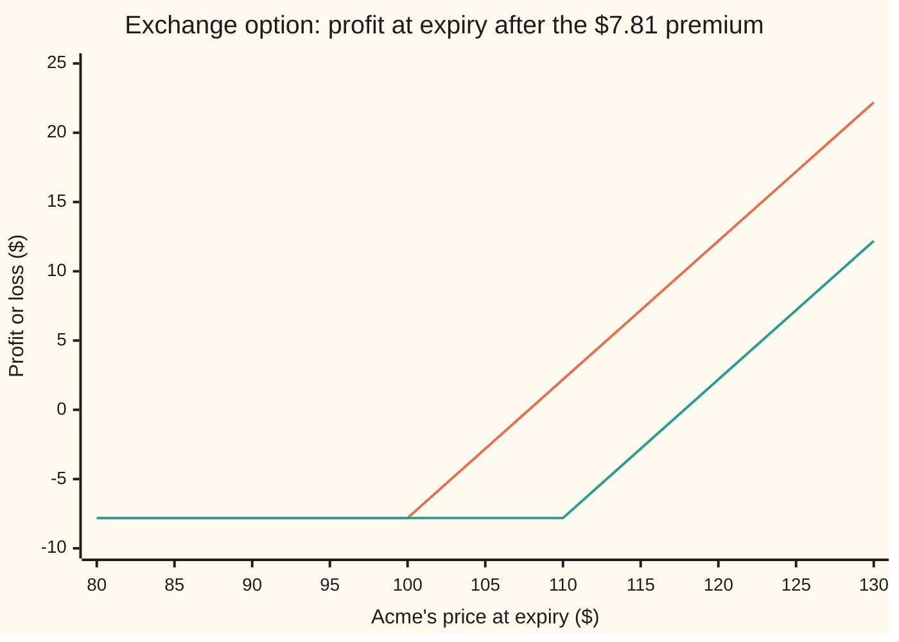
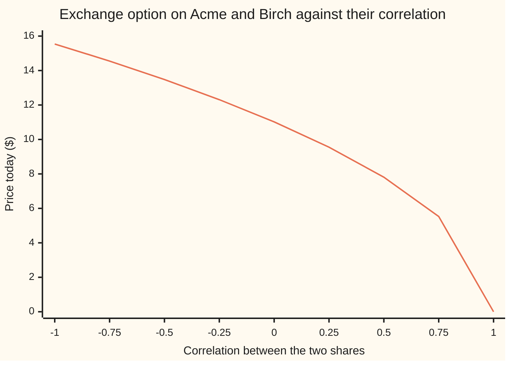

# The exchange option: the right to swap one share for another, priced with no interest rate at all

Financial mathematics → Many underlyings - exchange, spread, basket and rainbow → Swapping one share for another → The exchange option

---

## General Overview

Two companies, Acme and Birch, each have shares trading at $100 today. Each share moves about 20 percent a year, each pays a 2 percent dividend, and the two tend to move together: their correlation, a score from −1 (always opposite) to +1 (always together), is 0.5.

A contract says: one year from today, the holder may hand over one Birch share and receive one Acme share. The holder does it only if Acme is then worth more than Birch. If Acme ends at $120 and Birch at $110, the swap earns $10. If Acme ends below Birch, the holder walks away. That right is an **exchange option**, the name used from here on.

It looks like a call option on Acme whose strike, the price paid on exercise, is not a fixed sum of cash but a Birch share. A moving strike sounds harder to price. William Margrabe showed in 1978 that it is easier. Measure everything in Birch shares, and the contract becomes an ordinary call on one number, the price of Acme in Birch shares, with a strike of exactly one. In that unit the bank rate vanishes: a Birch share earns nothing measured against itself. The answer for Acme and Birch is **$7.81**, and the bank rate appears nowhere in it.

**Counted in units of the second share, the exchange option is a Black-Scholes call on the ratio of the two prices with a strike of one and no interest rate, and the ratio's volatility is the combined wiggle of the two shares net of what they share.**

**What kind of fact this is:** a theorem inside the Black-Scholes model, proved on this card in Why it works; the model itself, two lognormal prices with a fixed correlation, is an assumption, not a law.

### The picture: what the holder walks away with

The payoff depends on both prices at once. Fix Birch's closing price, and the contract is a call on Acme struck at that price. The chart shows profit after the $7.81 premium, for two ways Birch could end the year.



First line: Birch ends at $100, so the kink sits at $100 and the picture is a vanilla call's. Second line: Birch ends at $110, and the whole kink slides $10 to the right. The strike moves with Birch, and that movement is what the price must account for.

---

## The formula

Notation first, in words. A subscript 1 marks Acme, the share received; a subscript 2 marks Birch, the share handed over. $S_1(T)$ is Acme's price at the expiry date T. The Greek letter $\rho$ (rho) is the correlation between the two shares' random moves. $q_1$ and $q_2$ are dividend yields, $\sigma_1$ and $\sigma_2$ (sigma) volatilities, and $N(x)$ is the bell-curve area to the left of x, as on [black-scholes-call](../08-The%20Black-Scholes%20call%20and%20put/01-black-scholes-call.md). The table lists every symbol.

$$V = S_1 e^{-q_1 T} N(d_1) \;-\; S_2 e^{-q_2 T} N(d_2)$$

**Read it aloud:** the Acme share that might be received minus the Birch share that might be handed over, each trimmed for the dividends it pays before expiry, each weighted by its own chance.

The inputs that drive the chances:

$$\sigma = \sqrt{\sigma_1^2 + \sigma_2^2 - 2\rho\,\sigma_1\sigma_2}, \qquad d_1 = \frac{\ln\!\left(\dfrac{S_1 e^{-q_1 T}}{S_2 e^{-q_2 T}}\right) + \tfrac12\sigma^2 T}{\sigma\sqrt{T}}, \qquad d_2 = d_1 - \sigma\sqrt{T}$$

In words: $\sigma$ is the volatility of the ratio Acme over Birch. Each share adds its own variance, and the part they share cancels, twice the correlation times the two volatilities. $d_2$ counts, in units of the ratio's log-spread $\sigma\sqrt{T}$, how far the middle of the ratio's log lands above zero, the log of the strike 1; $d_1$ is one spread further.

| Symbol | Plain meaning | In our example | Push it up and the answer… |
| --- | --- | --- | --- |
| $V$ | price today of the right to swap one Birch share for one Acme share at T | $7.81 | is the answer |
| $S_1$, $S_2$ | Acme's and Birch's prices today | $100 each | Acme up: rises; Birch up: falls |
| $q_1$, $q_2$ | dividend yields, continuously compounded; $e^{-qT}$ is the share left after a year of dividends leak out | 2% each | Acme's up: falls; Birch's up: rises |
| $\sigma_1$, $\sigma_2$ | each share's volatility: the spread of its yearly log return | 20% each | usually rises, through $\sigma$ |
| $\rho$ | correlation of the two shares' random moves | 0.5 | falls: the shares move together, so the gap between them shrinks |
| $\sigma$ | the effective volatility: that of the ratio Acme over Birch | 20% | rises |
| $T$ | years to expiry | 1 | rises |
| $R$, $R_T$ | the ratio Acme over Birch, today and at T | 1 today | — |
| $d_1$, $d_2$, $N$ | distances of the ratio from 1 in units of its spread; $N$ is the bell-curve area to the left of a point | 0.1 and −0.1; N(d1) 0.5398 | — |
| $r$, $K$ | the bank rate, continuously compounded; a fixed cash strike, used only in the cash case | 5%; $100 | r: no effect at all |
| $Z_1$, $Z_2$, $Z_\perp$ | the two standard bell-curve shocks that move Acme and Birch, correlated as rho; $Z_\perp$ is a third shock independent of Birch's | — | — |

### When it holds

- **Both log prices bell-curved, with constant volatilities and a constant correlation.** Correlation is the input nobody quotes directly. If the true correlation is 0.01 higher than the one used, the price is off by $0.08, the correlation sensitivity below.
- **Exercise only at expiry.** When neither share pays dividends, swapping early never pays, and the American contract is worth the same. With dividends, early exercise can pay, and this formula is a floor.
- **Dividends paid as a steady yield.** A lump-sum dividend before expiry must be subtracted from that share's price today instead.
- **Both shares can be bought and sold short without cost.** The hedge in Step 4 holds both shares. If Birch cannot be borrowed, the replication argument fails, and so does the price.
- **One share for one share.** A contract swapping n Birch shares for one Acme share uses n times $S_2$ in every place; the formula is unchanged otherwise.

---

## Why it works

### Step 0: count in Birch shares, and the bank rate disappears

A price in dollars is a count of dollars. Nothing forces that unit. The payoff at expiry factors:

$$\max\big(S_1(T) - S_2(T),\,0\big) = S_2(T)\,\max(R_T - 1,\,0).$$

Read in Birch shares, the payoff is $\max(R_T - 1, 0)$ Birch shares: a call on the ratio, struck at 1. The unit of account, here a Birch share, is called the **numeraire**, the word used from here on ([change-of-numeraire](../../11-Stochastic%20processes%20and%20calculus/07-Changing%20Measure/05-change-of-numeraire.md)).

In dollars, a call is priced against a bank account that grows at r. In Birch shares, the "bank account" is a Birch share itself, dividends reinvested, and measured in Birch shares it earns nothing but those dividends. The bank rate has no job left to do. What remains is a zero-interest call on the ratio. Steps 1 and 2 find the ratio's spread and its centre; Step 3 prices it.

### Step 1: the ratio's volatility, net of what the shares share

The log of a ratio is a difference of logs: $\ln R_T = \ln S_1(T) - \ln S_2(T)$. Over the year, Acme's log price takes the random shock $\sigma_1\sqrt{T}Z_1$ and Birch's takes $\sigma_2\sqrt{T}Z_2$, where $Z_1$ and $Z_2$ are standard bell-curve draws with correlation $\rho$. The ratio takes their difference. The variance of a difference of two correlated shocks is each variance, minus twice the shared part:

$$\sigma^2 = \sigma_1^2 + \sigma_2^2 - 2\rho\,\sigma_1\sigma_2 = 0.04 + 0.04 - 2(0.5)(0.2)(0.2) = 0.04.$$

So the ratio moves 20 percent a year, as much as either share on its own. Correlation decides the price. At +1, two shares this alike take the same shock, the ratio never moves, and the option is worthless. With unequal volatilities the ratio still moves at $|\sigma_1 - \sigma_2|$, and the option keeps a value. At −1 they move in opposite directions, the ratio moves 40 percent a year, and the option costs about twice as much.



The one line is the Margrabe price at each correlation, everything else held at the house values. It falls from $15.54 at −1 to $11.02 at zero, $7.81 at 0.5, and exactly zero at +1. The fall steepens near +1, because the effective volatility is a square root of a quantity running down to zero. How that slope is traded and read back from prices is [correlation-greeks-and-implied-correlation](05-correlation-greeks-and-implied-correlation.md).

### Step 2: the ratio's centre, counted in Birch

Pricing in a numeraire rests on one rule: any traded holding, divided by the numeraire holding, is a fair game. Its expected future value, in the probabilities that go with that numeraire, is its value today. Acme with dividends reinvested is a traded holding, and so is Birch with dividends reinvested. Their ratio, $R\,e^{(q_1 - q_2)t}$ at time t, is therefore a fair game.

So the expected ratio at T is $R\,e^{(q_2 - q_1)T}$: today's ratio, pushed by the difference in dividends. Acme leaks dividends, which lowers the ratio; Birch leaks them too, which raises it. For Acme and Birch the two yields are equal, and the ratio is expected to stay at 1. The bank rate would push both shares up equally, and in a ratio it cancels.

### Step 3: price the ratio call, then convert back to dollars

The ratio is lognormal with centre $R\,e^{(q_2 - q_1)T}$ and volatility $\sigma$, and the call on it has strike 1 and zero interest. That is the Black-Scholes call from [black-scholes-call](../08-The%20Black-Scholes%20call%20and%20put/01-black-scholes-call.md), with the rate set to zero. In Birch shares at expiry, its value is

$$R\,e^{(q_2 - q_1)T} N(d_1) - N(d_2).$$

To bring that back to dollars today, multiply by what one Birch share delivered at T costs today: $S_2 e^{-q_2 T}$, a share bought now minus the dividends it pays out along the way. Multiplied out, $S_2 e^{-q_2T}\cdot R\,e^{(q_2-q_1)T} = S_1 e^{-q_1 T}$, and the formula appears:

$$V = S_1 e^{-q_1 T} N(d_1) - S_2 e^{-q_2 T} N(d_2).$$

<details>
<summary>Detailed proof: the same price by direct integration in dollars</summary>

In the dollar pretend world (risk-neutral), $\ln S_i(T) = \ln S_i + (r - q_i - \tfrac12\sigma_i^2)T + \sigma_i\sqrt{T}Z_i$ for i = 1, 2, where $Z_1$ and $Z_2$ are standard normal with correlation $\rho$. The price is $e^{-rT}$ times the average of $S_2(T)\max(R_T - 1, 0)$.

Write $S_2(T) = S_2 e^{(r - q_2)T} \cdot e^{\sigma_2\sqrt{T}Z_2 - \frac12\sigma_2^2 T}$. The first factor is a constant; times $e^{-rT}$ it is $S_2 e^{-q_2 T}$, and r is gone. The second factor has average 1 and reweights the bell curve. As on [black-scholes-call](../08-The%20Black-Scholes%20call%20and%20put/01-black-scholes-call.md), completing the square shows the reweighted $Z_2$ is a normal centred at $\sigma_2\sqrt{T}$ instead of 0. Since $Z_1 = \rho Z_2 + \sqrt{1-\rho^2}\,Z_\perp$ with $Z_\perp$ independent, $Z_1$ is centred at $\rho\sigma_2\sqrt{T}$.

Under the reweighting, $\ln R_T = \ln R + (q_2 - q_1)T - \tfrac12(\sigma_1^2 - \sigma_2^2)T + \sigma_1\sqrt{T}Z_1 - \sigma_2\sqrt{T}Z_2$ has centre shifted by $\rho\sigma_1\sigma_2 T - \sigma_2^2 T$, giving $\ln R + (q_2 - q_1)T - \tfrac12(\sigma_1^2 + \sigma_2^2 - 2\rho\sigma_1\sigma_2)T = \ln R + (q_2 - q_1)T - \tfrac12\sigma^2 T$. The reweighting shifts centres, not spreads, so its variance is still $\sigma_1^2 T + \sigma_2^2 T - 2\rho\sigma_1\sigma_2 T = \sigma^2 T$.

So $R_T$ is lognormal with average $R\,e^{(q_2 - q_1)T}$ and log-spread $\sigma\sqrt{T}$, and the price is $S_2 e^{-q_2 T}$ times the average of $\max(R_T - 1, 0)$. The lognormal call average, $F N(d_1) - N(d_2)$ with $F = R\,e^{(q_2 - q_1)T}$, is the Black-Scholes integral with no discount. Multiplying by $S_2 e^{-q_2 T}$ gives the formula. The reweighting is the change to Birch as numeraire, done by hand.

</details>

### Step 4: the hedge holds shares and no cash

Double both share prices and every payoff doubles, so the price doubles. A price with that property equals each input times its sensitivity, summed (Euler's identity for functions of degree one):

$$V = S_1 \cdot \Delta_1 + S_2 \cdot \Delta_2, \qquad \Delta_1 = e^{-q_1T}N(d_1),\quad \Delta_2 = -e^{-q_2T}N(d_2).$$

Here the Greek letter Δ (delta) is the dollars the price gains per dollar on a share. For Acme and Birch: 0.52914 × $100 − 0.45106 × $100 = $7.81. The replicating portfolio is 0.5291 Acme shares held and 0.4511 Birch shares sold short, with nothing in the bank. A hedge with no cash in it cannot care what cash earns. That is the second reason r is absent, seen from the trading desk.

### Step 5: the vanilla call is the case where Birch is cash

Replace Birch with a bond that pays $100 at expiry. Its price today is 100 × e^−0.05 = $95.12. It has no volatility, pays no dividend, and grows at the bank rate.

Put $S_2 = K e^{-rT}$, $q_2 = 0$ and $\sigma_2 = 0$ into the formula. The effective volatility becomes $\sigma_1$, $S_2 e^{-q_2T}$ becomes $K e^{-rT}$, and the result is the Black-Scholes call, $9.227006, the house vanilla. The bank rate returns only because the second asset is now a bond whose price contains it.

Two other roads reach the exchange price, and the code takes both. Fix Birch's shock; Acme is then lognormal with a known centre and spread, the inner average is a closed Black-Scholes-type expression, and one integral over Birch's shock finishes the job, with r written in. Or simulate the two shares together, correlating their shocks as on [correlated-paths-and-cholesky](../06-Numerical%20Methods%20for%20Pricing/04-correlated-paths-and-cholesky.md), and average the discounted payoff.

---

## Worked numbers, by hand

Acme and Birch: $S_1 = S_2 = 100$, $\sigma_1 = \sigma_2 = 20\%$, $q_1 = q_2 = 2\%$, $\rho = 0.5$, $r = 5\%$, $T = 1$ year.

| Step | Arithmetic | Value |
| --- | --- | --- |
| effective variance, $\sigma^2$ | 0.04 + 0.04 − 2 × 0.5 × 0.2 × 0.2 | 0.04 |
| effective volatility, $\sigma$ | √0.04 | 0.20 |
| Acme today net of dividends | 100 × e^−0.02 | $98.02 |
| Birch today net of dividends | 100 × e^−0.02 | $98.02 |
| $d_1$ | (ln 1 + 0.5 × 0.04) / 0.20 | 0.1 |
| $d_2$ | 0.1 − 0.20 | −0.1 |
| N(d1), N(d2) | bell-curve table | 0.5398, 0.4602 |
| Acme half | 98.020 × 0.53983 | $52.914 |
| Birch half | 98.020 × 0.46017 | $45.106 |
| **price** | 52.914 − 45.106 | **$7.81** |

The right to swap a Birch share for an Acme share in a year costs $7.81 today, less than a tenth of a share's price. The vanilla call on Acme at a fixed $100 costs $9.23. The gap is not volatility: at correlation 0.5 the ratio moves exactly as much as Acme alone. It is growth. A fixed $100 stays at $100 while Acme is expected to grow at the bank rate less its dividend, so the vanilla starts ahead. Birch is expected to grow at the same rate as Acme, so the swap starts level.

### What breaks if you drop a piece

Same contract, right answer $7.81. Every wrong number is printed by both checks.

| Mistake | Comes out at | What went wrong |
| --- | --- | --- |
| Treat Birch as a fixed $100 strike | $9.23 | Birch grows and moves with Acme; a cash strike does neither |
| Leave the correlation out, $\sigma^2 = \sigma_1^2 + \sigma_2^2$ | $11.02 | Priced as if the two shares moved independently |
| Flip the sign, $+2\rho\sigma_1\sigma_2$ | $13.48 | Positive correlation narrows the gap; the plus sign widens it, pricing the shares as if $\rho = -0.5$ |
| Drop the 2, $-\rho\sigma_1\sigma_2$ | $9.55 | The cross term of a squared difference comes twice |
| Drop both dividend yields | $7.97 | Each share delivered at T is worth $98.02 today, not $100 |

### The Greeks

Sensitivities by bumping the formula, printed by both checks.

| Greek | Plain meaning | Value |
| --- | --- | --- |
| delta, Acme | dollars gained per dollar on Acme; equals $e^{-q_1T}N(d_1)$ | 0.5291 |
| delta, Birch | dollars gained per dollar on Birch; equals $-e^{-q_2T}N(d_2)$ | −0.4511 |
| gamma, Acme | change in Acme's delta per dollar on Acme | 0.0195 |
| vega, Acme | dollars per one point of Acme's volatility | 0.1944 |
| correlation | dollars per 0.01 of correlation | −0.0778 |
| rho, the bank rate | dollars per point of r | 0 |

The last row is the title of the card.

---

## Code, from first principles, and it actually runs

Both programs reach the price three ways. Road 1 is Margrabe's formula, which contains no bank rate. Road 2 fixes Birch's shock, prices Acme's conditional payoff exactly, and integrates over Birch's shock by Simpson's rule; it discounts at r and uses no effective volatility, and it is run at r = 0%, 5% and 10%. Road 3 simulates a million correlated pairs of year-end prices, correlated by the Cholesky step $Z_1 = \rho Z_2 + \sqrt{1-\rho^2}\,Z_\perp$. Then the cash case is checked against the house vanilla, the deltas against Euler's identity, and every what-breaks, Greek, chart and try-changing number is printed. The normal CDF is a written-out series; the random numbers come from a written-out generator (splitmix64 with the Box-Muller transform).

### Python

```python
# The exchange option (Margrabe) -- the check behind the card.  Standard library only.
# Nothing imported knows the answer: the normal CDF is a series written out, the integral is
# Simpson's rule, the random numbers are splitmix64 + Box-Muller, correlated by Cholesky.
from math import log, sqrt, exp, cos, sin, pi

def phi(x): return exp(-0.5 * x * x) / sqrt(2.0 * pi)           # bell-curve height
def N(x):                                                       # bell-curve area left of x
    if x < -9.0: return 0.0
    if x > 9.0: return 1.0
    term = total = x; k = 1
    while abs(term) > 1e-17 * abs(total):
        k += 2; term *= x * x / k; total += term
    return 0.5 + phi(x) * total

def eff_vol(s1, s2, rho): return sqrt(max(s1 * s1 + s2 * s2 - 2.0 * rho * s1 * s2, 0.0))

def margrabe(S1, S2, q1, q2, s1, s2, rho, T):                   # road 1: the formula, no r in it
    v = eff_vol(s1, s2, rho) * sqrt(T)
    A, B = S1 * exp(-q1 * T), S2 * exp(-q2 * T)
    if v == 0.0: return max(A - B, 0.0)
    d1 = (log(A / B) + 0.5 * v * v) / v
    return A * N(d1) - B * N(d1 - v)

def bs_call(S, K, r, q, sig, T):                                # the plain Black-Scholes call
    d1 = (log(S / K) + (r - q + 0.5 * sig * sig) * T) / (sig * sqrt(T))
    return S * exp(-q * T) * N(d1) - K * exp(-r * T) * N(d1 - sig * sqrt(T))

def conditional(r, rho, panels=4000):
    # road 2: fix share 2's shock z.  Share 1 is then lognormal with a known centre and spread,
    # so the inner average is exact; Simpson's rule does the outer one.  The bank rate r is used.
    w = s1 * sqrt((1.0 - rho * rho) * T)
    def f(z):
        X2 = S2 * exp((r - q2 - 0.5 * s2 * s2) * T + s2 * sqrt(T) * z)
        m = log(S1) + (r - q1 - 0.5 * s1 * s1) * T + s1 * rho * sqrt(T) * z
        d = (m - log(X2)) / w
        return (exp(m + 0.5 * w * w) * N(d + w) - X2 * N(d)) * phi(z)
    a, b = -10.0, 10.0; h = (b - a) / panels
    tot = f(a) + f(b)
    for i in range(1, panels):
        tot += (4 if i % 2 else 2) * f(a + i * h)
    return exp(-r * T) * tot * h / 3.0

MASK = (1 << 64) - 1
def simulate(r, rho, paths=1000000):
    # road 3: correlated shares at expiry.  z1 = rho z2 + sqrt(1 - rho^2) z_other (Cholesky).
    state = 20260924; c = sqrt(1.0 - rho * rho); acc = acc2 = 0.0
    def uniform():
        nonlocal state
        state = (state + 0x9E3779B97F4A7C15) & MASK
        z = state
        z = ((z ^ (z >> 30)) * 0xBF58476D1CE4E5B9) & MASK
        z = ((z ^ (z >> 27)) * 0x94D049BB133111EB) & MASK
        return (((z ^ (z >> 31)) >> 11) + 1) * 2.0 ** -53
    m1, m2 = (r - q1 - 0.5 * s1 * s1) * T, (r - q2 - 0.5 * s2 * s2) * T
    for _ in range(paths):
        rad = sqrt(-2.0 * log(uniform())); ang = 2.0 * pi * uniform()
        z2, zo = rad * cos(ang), rad * sin(ang)
        z1 = rho * z2 + c * zo
        pay = max(S1 * exp(m1 + s1 * sqrt(T) * z1) - S2 * exp(m2 + s2 * sqrt(T) * z2), 0.0)
        acc += pay; acc2 += pay * pay
    mean = acc / paths
    return exp(-r * T) * mean, exp(-r * T) * sqrt((acc2 / paths - mean * mean) / paths)

# ---- two house shares: $100 each, 20% vol, 2% dividend, correlation 0.5; 5% rate, 1 year ----
S1, S2, q1, q2, s1, s2, rho, r, T = 100.0, 100.0, 0.02, 0.02, 0.20, 0.20, 0.5, 0.05, 1.0
sig = eff_vol(s1, s2, rho)
A, B = S1 * exp(-q1 * T), S2 * exp(-q2 * T)
d1 = (log(A / B) + 0.5 * sig * sig * T) / (sig * sqrt(T)); d2 = d1 - sig * sqrt(T)
V = margrabe(S1, S2, q1, q2, s1, s2, rho, T)
V_cond, V_cond0, V_cond10 = conditional(r, rho), conditional(0.0, rho), conditional(0.10, rho)
V_mc, se = simulate(r, rho)
V_mc1, _ = simulate(r, 1.0, 20000)
cash = 100.0 * exp(-r * T)                              # a zero-coupon bond paying $100 at T
V_cash = margrabe(S1, cash, q1, 0.0, s1, 0.0, 0.0, T)
C_bs = bs_call(S1, 100.0, r, q1, s1, T)
h = 0.01
g = lambda a, b: margrabe(a, b, q1, q2, s1, s2, rho, T)
dl1 = (g(S1 + h, S2) - g(S1 - h, S2)) / (2 * h); dl2 = (g(S1, S2 + h) - g(S1, S2 - h)) / (2 * h)
vega = (margrabe(S1, S2, q1, q2, s1 + h, s2, rho, T) - margrabe(S1, S2, q1, q2, s1 - h, s2, rho, T)) / 2.0
corr = (margrabe(S1, S2, q1, q2, s1, s2, rho + h, T) - margrabe(S1, S2, q1, q2, s1, s2, rho - h, T)) / 2.0
gam = (g(S1 + 1.0, S2) - 2.0 * V + g(S1 - 1.0, S2))

rows = [
    ("effective variance sigma^2", sig * sig), ("effective vol sigma", sig), ("effective vol, rho = -1", eff_vol(s1, s2, -1.0)),
    ("share 1 today, S1 e^-q1T", A), ("share 2 today, S2 e^-q2T", B),
    ("d1", d1), ("d2", d2), ("N(d1)", N(d1)), ("N(d2)", N(d2)), ("Acme half", A * N(d1)), ("Birch half", B * N(d2)),
    ("1 Margrabe formula", V), ("2 conditional integral, r = 5%", V_cond),
    ("3 simulation, 1000000 pairs", V_mc), ("  standard error", se),
    ("  conditional integral, r = 0%", V_cond0), ("  conditional integral, r = 10%", V_cond10),
    ("rho = 1, formula", margrabe(S1, S2, q1, q2, s1, s2, 1.0, T)), ("rho = 1, simulation", V_mc1),
    ("cash case: Margrabe, bond S2 = 95.12", V_cash), ("cash case: Black-Scholes call", C_bs),
    ("delta 1, bump", dl1), ("  e^-q1T N(d1)", A / S1 * N(d1)),
    ("delta 2, bump", dl2), ("  -e^-q2T N(d2)", -B / S2 * N(d2)),
    ("S1 delta1 + S2 delta2", S1 * dl1 + S2 * dl2), ("gamma 1, per $1", gam),
    ("vega of share 1, per vol point", vega), ("correlation, per 0.01", corr),
    ("wrong: correlation left out", margrabe(S1, S2, q1, q2, s1, s2, 0.0, T)),
    ("wrong: +2 rho instead of -2 rho", margrabe(S1, S2, q1, q2, sqrt(0.12), 0.0, 0.0, T)),
    ("wrong: rho s1 s2 without the 2", margrabe(S1, S2, q1, q2, sqrt(0.06), 0.0, 0.0, T)),
    ("wrong: share 2 as a fixed $100 strike", C_bs),
    ("wrong: dividends dropped", margrabe(S1, S2, 0.0, 0.0, s1, s2, rho, T)),
    ("try: rho = -1", margrabe(S1, S2, q1, q2, s1, s2, -1.0, T)),
    ("try: S1 = 110", margrabe(110.0, S2, q1, q2, s1, s2, rho, T)),
    ("try: share 2 vol 30%", margrabe(S1, S2, q1, q2, s1, 0.30, rho, T)),
]
for name, v in rows:
    print(f"{name:<40} {v:>12.6f}")
rhos = [-1.0 + 0.25 * i for i in range(9)]
print("chart, correlation " + " ".join(f"{x:6.2f}" for x in rhos))
print("chart, price       " + " ".join(f"{margrabe(S1, S2, q1, q2, s1, s2, x, T):6.2f}" for x in rhos))
ends = [80.0 + 5.0 * i for i in range(11)]
print("chart, share 1 end " + " ".join(f"{x:6.0f}" for x in ends))
for e2 in (100.0, 110.0):
    print(f"chart, profit {e2:.0f}  " + " ".join(f"{max(x - e2, 0.0) - V:6.2f}" for x in ends))

assert abs(V - 7.807839) < 1e-6,                  "formula vs the shelf's house number"
assert abs(V_cond - V) < 1e-8,                    "conditional integral lands on the formula"
assert abs(V_mc - V) < 4.0 * se,                  "simulation within four standard errors"
assert abs(V_cond10 - V) < 1e-8,                 "bank rate 10%: same price"
assert abs(V_cond0 - V) < 1e-8,                  "bank rate 0%: same price"
assert abs(V_cash - 9.227005508154) < 1e-9,       "cash case is the house vanilla"
assert V_mc1 == 0.0,                              "perfect correlation: every simulated payoff is zero"
assert abs(S1 * dl1 + S2 * dl2 - V) < 1e-6,       "the price is shares only: Euler's identity"
print("ALL CHECKS PASS")
```

**Ran 2026-09-24 on macOS, Python 3.14.6, standard library only. All checks passed. Output, pasted from the run:**

```
effective variance sigma^2                   0.040000
effective vol sigma                          0.200000
effective vol, rho = -1                      0.400000
share 1 today, S1 e^-q1T                    98.019867
share 2 today, S2 e^-q2T                    98.019867
d1                                           0.100000
d2                                          -0.100000
N(d1)                                        0.539828
N(d2)                                        0.460172
Acme half                                   52.913853
Birch half                                  45.106014
1 Margrabe formula                           7.807839
2 conditional integral, r = 5%               7.807839
3 simulation, 1000000 pairs                  7.830254
  standard error                             0.011724
  conditional integral, r = 0%               7.807839
  conditional integral, r = 10%              7.807839
rho = 1, formula                             0.000000
rho = 1, simulation                          0.000000
cash case: Margrabe, bond S2 = 95.12         9.227006
cash case: Black-Scholes call                9.227006
delta 1, bump                                0.529139
  e^-q1T N(d1)                               0.529139
delta 2, bump                               -0.451060
  -e^-q2T N(d2)                             -0.451060
S1 delta1 + S2 delta2                        7.807838
gamma 1, per $1                              0.019451
vega of share 1, per vol point               0.194362
correlation, per 0.01                       -0.077822
wrong: correlation left out                 11.023600
wrong: +2 rho instead of -2 rho             13.478689
wrong: rho s1 s2 without the 2               9.554658
wrong: share 2 as a fixed $100 strike        9.227006
wrong: dividends dropped                     7.965567
try: rho = -1                               15.538052
try: S1 = 110                               14.009010
try: share 2 vol 30%                        10.315920
chart, correlation  -1.00  -0.75  -0.50  -0.25   0.00   0.25   0.50   0.75   1.00
chart, price        15.54  14.55  13.48  12.31  11.02   9.55   7.81   5.53   0.00
chart, share 1 end     80     85     90     95    100    105    110    115    120    125    130
chart, profit 100   -7.81  -7.81  -7.81  -7.81  -7.81  -2.81   2.19   7.19  12.19  17.19  22.19
chart, profit 110   -7.81  -7.81  -7.81  -7.81  -7.81  -7.81  -7.81  -2.81   2.19   7.19  12.19
ALL CHECKS PASS
```

Three roads, one price. The conditional integral lands on the formula to the printed digit, at a bank rate of 0%, 5% and 10% alike: r goes in and comes out with no effect. The simulation gives $7.83 with a standard error of 0.0117, less than two standard errors from $7.81. At correlation 1, every one of the simulated payoffs is exactly zero. The cash case reproduces the house vanilla, and the bumped deltas rebuild the price with no cash term.

### Rust

The same checks, the same inputs, the same random-number generator, written again in Rust with no crates.

```rust
// The exchange option (Margrabe) -- the same check as exchange_option_margrabe_check.py, in Rust.
// Std only, no crates.  Normal CDF as a written-out series, Simpson's rule, splitmix64 +
// Box-Muller random numbers, correlated by Cholesky.
// Compile: rustc --edition 2021 -O exchange_option_margrabe_check.rs -o /tmp/margrabe_check
use std::f64::consts::PI;

fn phi(x: f64) -> f64 { (-0.5 * x * x).exp() / (2.0 * PI).sqrt() }
fn n_cdf(x: f64) -> f64 {
    if x < -9.0 { return 0.0; }
    if x > 9.0 { return 1.0; }
    let (mut term, mut total, mut k) = (x, x, 1.0);
    while term.abs() > 1e-17 * total.abs() {
        k += 2.0; term *= x * x / k; total += term;
    }
    0.5 + phi(x) * total
}
fn eff_vol(s1: f64, s2: f64, rho: f64) -> f64 { (s1 * s1 + s2 * s2 - 2.0 * rho * s1 * s2).max(0.0).sqrt() }

// road 1: the formula, no r in it
fn margrabe(x1: f64, x2: f64, q1: f64, q2: f64, s1: f64, s2: f64, rho: f64, t: f64) -> f64 {
    let v = eff_vol(s1, s2, rho) * t.sqrt();
    let (a, b) = (x1 * (-q1 * t).exp(), x2 * (-q2 * t).exp());
    if v == 0.0 { return (a - b).max(0.0); }
    let d1 = ((a / b).ln() + 0.5 * v * v) / v;
    a * n_cdf(d1) - b * n_cdf(d1 - v)
}
fn bs_call(s: f64, k: f64, r: f64, q: f64, sig: f64, t: f64) -> f64 {
    let d1 = ((s / k).ln() + (r - q + 0.5 * sig * sig) * t) / (sig * t.sqrt());
    s * (-q * t).exp() * n_cdf(d1) - k * (-r * t).exp() * n_cdf(d1 - sig * t.sqrt())
}

struct Mkt { s1: f64, s2: f64, q1: f64, q2: f64, v1: f64, v2: f64, t: f64 }

// road 2: fix share 2's shock z; share 1 is then lognormal, so the inner average is exact.
fn conditional(m: &Mkt, r: f64, rho: f64, panels: usize) -> f64 {
    let w = m.v1 * ((1.0 - rho * rho) * m.t).sqrt();
    let f = |z: f64| {
        let x2 = m.s2 * ((r - m.q2 - 0.5 * m.v2 * m.v2) * m.t + m.v2 * m.t.sqrt() * z).exp();
        let mu = m.s1.ln() + (r - m.q1 - 0.5 * m.v1 * m.v1) * m.t + m.v1 * rho * m.t.sqrt() * z;
        let d = (mu - x2.ln()) / w;
        ((mu + 0.5 * w * w).exp() * n_cdf(d + w) - x2 * n_cdf(d)) * phi(z)
    };
    let (a, b) = (-10.0, 10.0);
    let h = (b - a) / panels as f64;
    let mut tot = f(a) + f(b);
    for i in 1..panels { tot += if i % 2 == 1 { 4.0 } else { 2.0 } * f(a + i as f64 * h); }
    (-r * m.t).exp() * tot * h / 3.0
}

struct Rng(u64);
impl Rng {
    fn uniform(&mut self) -> f64 {
        self.0 = self.0.wrapping_add(0x9E3779B97F4A7C15);
        let mut z = self.0;
        z = (z ^ (z >> 30)).wrapping_mul(0xBF58476D1CE4E5B9);
        z = (z ^ (z >> 27)).wrapping_mul(0x94D049BB133111EB);
        (((z ^ (z >> 31)) >> 11) + 1) as f64 * 2f64.powi(-53)
    }
}

// road 3: correlated shares at expiry, z1 = rho z2 + sqrt(1 - rho^2) z_other (Cholesky).
fn simulate(m: &Mkt, r: f64, rho: f64, paths: usize) -> (f64, f64) {
    let mut rng = Rng(20260924);
    let c = (1.0 - rho * rho).sqrt();
    let (mut acc, mut acc2) = (0.0, 0.0);
    let m1 = (r - m.q1 - 0.5 * m.v1 * m.v1) * m.t;
    let m2 = (r - m.q2 - 0.5 * m.v2 * m.v2) * m.t;
    for _ in 0..paths {
        let rad = (-2.0 * rng.uniform().ln()).sqrt();
        let ang = 2.0 * PI * rng.uniform();
        let (z2, zo) = (rad * ang.cos(), rad * ang.sin());
        let z1 = rho * z2 + c * zo;
        let pay = (m.s1 * (m1 + m.v1 * m.t.sqrt() * z1).exp() - m.s2 * (m2 + m.v2 * m.t.sqrt() * z2).exp()).max(0.0);
        acc += pay; acc2 += pay * pay;
    }
    let mean = acc / paths as f64;
    ((-r * m.t).exp() * mean, (-r * m.t).exp() * ((acc2 / paths as f64 - mean * mean) / paths as f64).sqrt())
}

fn main() {
    let (s1, s2, q1, q2, v1, v2, rho, r, t) = (100.0, 100.0, 0.02, 0.02, 0.20, 0.20, 0.5, 0.05, 1.0);
    let m = Mkt { s1, s2, q1, q2, v1, v2, t };
    let sig = eff_vol(v1, v2, rho);
    let (a, b) = (s1 * (-q1 * t).exp(), s2 * (-q2 * t).exp());
    let d1 = ((a / b).ln() + 0.5 * sig * sig * t) / (sig * t.sqrt());
    let d2 = d1 - sig * t.sqrt();
    let v = margrabe(s1, s2, q1, q2, v1, v2, rho, t);
    let (v_cond, v_cond0, v_cond10) = (conditional(&m, r, rho, 4000), conditional(&m, 0.0, rho, 4000), conditional(&m, 0.10, rho, 4000));
    let (v_mc, se) = simulate(&m, r, rho, 1000000);
    let (v_mc1, _) = simulate(&m, r, 1.0, 20000);
    let cash = 100.0 * (-r * t).exp();                          // a zero-coupon bond paying $100 at T
    let v_cash = margrabe(s1, cash, q1, 0.0, v1, 0.0, 0.0, t);
    let c_bs = bs_call(s1, 100.0, r, q1, v1, t);
    let h = 0.01;
    let g = |x: f64, y: f64| margrabe(x, y, q1, q2, v1, v2, rho, t);
    let dl1 = (g(s1 + h, s2) - g(s1 - h, s2)) / (2.0 * h);
    let dl2 = (g(s1, s2 + h) - g(s1, s2 - h)) / (2.0 * h);
    let vega = (margrabe(s1, s2, q1, q2, v1 + h, v2, rho, t) - margrabe(s1, s2, q1, q2, v1 - h, v2, rho, t)) / 2.0;
    let corr = (margrabe(s1, s2, q1, q2, v1, v2, rho + h, t) - margrabe(s1, s2, q1, q2, v1, v2, rho - h, t)) / 2.0;
    let gam = g(s1 + 1.0, s2) - 2.0 * v + g(s1 - 1.0, s2);

    let rows: Vec<(&str, f64)> = vec![
        ("effective variance sigma^2", sig * sig), ("effective vol sigma", sig), ("effective vol, rho = -1", eff_vol(v1, v2, -1.0)),
        ("share 1 today, S1 e^-q1T", a), ("share 2 today, S2 e^-q2T", b),
        ("d1", d1), ("d2", d2), ("N(d1)", n_cdf(d1)), ("N(d2)", n_cdf(d2)), ("Acme half", a * n_cdf(d1)), ("Birch half", b * n_cdf(d2)),
        ("1 Margrabe formula", v), ("2 conditional integral, r = 5%", v_cond),
        ("3 simulation, 1000000 pairs", v_mc), ("  standard error", se),
        ("  conditional integral, r = 0%", v_cond0), ("  conditional integral, r = 10%", v_cond10),
        ("rho = 1, formula", margrabe(s1, s2, q1, q2, v1, v2, 1.0, t)), ("rho = 1, simulation", v_mc1),
        ("cash case: Margrabe, bond S2 = 95.12", v_cash), ("cash case: Black-Scholes call", c_bs),
        ("delta 1, bump", dl1), ("  e^-q1T N(d1)", a / s1 * n_cdf(d1)),
        ("delta 2, bump", dl2), ("  -e^-q2T N(d2)", -b / s2 * n_cdf(d2)),
        ("S1 delta1 + S2 delta2", s1 * dl1 + s2 * dl2), ("gamma 1, per $1", gam),
        ("vega of share 1, per vol point", vega), ("correlation, per 0.01", corr),
        ("wrong: correlation left out", margrabe(s1, s2, q1, q2, v1, v2, 0.0, t)),
        ("wrong: +2 rho instead of -2 rho", margrabe(s1, s2, q1, q2, 0.12f64.sqrt(), 0.0, 0.0, t)),
        ("wrong: rho s1 s2 without the 2", margrabe(s1, s2, q1, q2, 0.06f64.sqrt(), 0.0, 0.0, t)),
        ("wrong: share 2 as a fixed $100 strike", c_bs),
        ("wrong: dividends dropped", margrabe(s1, s2, 0.0, 0.0, v1, v2, rho, t)),
        ("try: rho = -1", margrabe(s1, s2, q1, q2, v1, v2, -1.0, t)),
        ("try: S1 = 110", margrabe(110.0, s2, q1, q2, v1, v2, rho, t)),
        ("try: share 2 vol 30%", margrabe(s1, s2, q1, q2, v1, 0.30, rho, t)),
    ];
    for (name, x) in &rows { println!("{:<40} {:>12.6}", name, x); }
    let rhos: Vec<f64> = (0..9).map(|i| -1.0 + 0.25 * i as f64).collect();
    let row = |xs: Vec<String>| xs.join(" ");
    println!("chart, correlation {}", row(rhos.iter().map(|x| format!("{:6.2}", x)).collect()));
    println!("chart, price       {}", row(rhos.iter().map(|x| format!("{:6.2}", margrabe(s1, s2, q1, q2, v1, v2, *x, t))).collect()));
    let ends: Vec<f64> = (0..11).map(|i| 80.0 + 5.0 * i as f64).collect();
    println!("chart, share 1 end {}", row(ends.iter().map(|x| format!("{:6.0}", x)).collect()));
    for e2 in [100.0f64, 110.0] {
        println!("chart, profit {:.0}  {}", e2, row(ends.iter().map(|x| format!("{:6.2}", (x - e2).max(0.0) - v)).collect()));
    }

    assert!((v - 7.807839).abs() < 1e-6, "formula vs the shelf's house number");
    assert!((v_cond - v).abs() < 1e-8, "conditional integral lands on the formula");
    assert!((v_mc - v).abs() < 4.0 * se, "simulation within four standard errors");
    assert!((v_cond10 - v).abs() < 1e-8, "bank rate 10%: same price");
    assert!((v_cond0 - v).abs() < 1e-8, "bank rate 0%: same price");
    assert!((v_cash - 9.227005508154).abs() < 1e-9, "cash case is the house vanilla");
    assert!(v_mc1 == 0.0, "perfect correlation: every simulated payoff is zero");
    assert!((s1 * dl1 + s2 * dl2 - v).abs() < 1e-6, "the price is shares only: Euler's identity");
    println!("ALL CHECKS PASS");
}
```

**Ran 2026-09-24 on macOS, rustc 1.98.1, no crates. All checks passed. Output, pasted from the run:**

```
effective variance sigma^2                   0.040000
effective vol sigma                          0.200000
effective vol, rho = -1                      0.400000
share 1 today, S1 e^-q1T                    98.019867
share 2 today, S2 e^-q2T                    98.019867
d1                                           0.100000
d2                                          -0.100000
N(d1)                                        0.539828
N(d2)                                        0.460172
Acme half                                   52.913853
Birch half                                  45.106014
1 Margrabe formula                           7.807839
2 conditional integral, r = 5%               7.807839
3 simulation, 1000000 pairs                  7.830254
  standard error                             0.011724
  conditional integral, r = 0%               7.807839
  conditional integral, r = 10%              7.807839
rho = 1, formula                             0.000000
rho = 1, simulation                          0.000000
cash case: Margrabe, bond S2 = 95.12         9.227006
cash case: Black-Scholes call                9.227006
delta 1, bump                                0.529139
  e^-q1T N(d1)                               0.529139
delta 2, bump                               -0.451060
  -e^-q2T N(d2)                             -0.451060
S1 delta1 + S2 delta2                        7.807838
gamma 1, per $1                              0.019451
vega of share 1, per vol point               0.194362
correlation, per 0.01                       -0.077822
wrong: correlation left out                 11.023600
wrong: +2 rho instead of -2 rho             13.478689
wrong: rho s1 s2 without the 2               9.554658
wrong: share 2 as a fixed $100 strike        9.227006
wrong: dividends dropped                     7.965567
try: rho = -1                               15.538052
try: S1 = 110                               14.009010
try: share 2 vol 30%                        10.315920
chart, correlation  -1.00  -0.75  -0.50  -0.25   0.00   0.25   0.50   0.75   1.00
chart, price        15.54  14.55  13.48  12.31  11.02   9.55   7.81   5.53   0.00
chart, share 1 end     80     85     90     95    100    105    110    115    120    125    130
chart, profit 100   -7.81  -7.81  -7.81  -7.81  -7.81  -2.81   2.19   7.19  12.19  17.19  22.19
chart, profit 110   -7.81  -7.81  -7.81  -7.81  -7.81  -7.81  -7.81  -2.81   2.19   7.19  12.19
ALL CHECKS PASS
```

The two outputs agree line for line, the simulated price included, because both programs draw the same random numbers in the same order.

> [!TIP]
> **Try changing**
> Guess the direction first. Then run it.
> - **Make the shares opposites.** Set `rho = -1.0`. The ratio's volatility doubles to 40 percent and the price rises to **$15.54**. A falling Birch now tends to come with a rising Acme, which is exactly when the swap pays.
> - **Give Acme a head start.** Set `S1 = 110.0`. The price rises to **$14.01**: the swap is already worth $9.80 on today's prices net of dividends, plus the chance of more.
> - **Change the bank rate.** Run road 2 at `r = 0.10`. The price stays at **$7.81**. Both shares drift faster, the discount is heavier, and the two effects cancel exactly.
> - **Make Birch jumpier.** Set Birch's volatility to `0.30`. The effective volatility rises and the price rises to **$10.32**, even though the correlation is still 0.5.

---

## The usual mistake

> [!warning]
> **Pricing the swap as a call with a fixed strike.** Birch at $100 today is not a $100 strike. Treat it as one and the price comes out at $9.23, the house vanilla, against the right $7.81. A cash strike stays put while Acme is expected to grow; Birch is expected to grow at the same rate. And when Acme rises, Birch tends to rise too, so the strike chases the share. Only the movement of the ratio is worth paying for, and the effective volatility measures that.
>
> Smaller traps:
> - **Leaving the correlation out.** Adding the two variances with no cross term prices the pair as independent: $11.02 instead of $7.81.
> - **The wrong sign or the missing 2 in the cross term.** A plus sign gives $13.48; a single cross term gives $9.55. The variance of a difference is each variance minus twice the covariance.
> - **Discounting at the bank rate.** No $e^{-rT}$ belongs in the formula. Each share's value delivered at expiry is already its price today net of dividends; discounting again counts the bank rate twice.
> - **Forgetting the dividends.** Dropping both yields gives $7.97. Equal yields cancel in the ratio, but not in the size of each share delivered.

---

## Where you meet it in real life

- **Share-for-share takeovers.** A bid that offers the acquirer's shares for the target's contains exchange options: a holder who may accept or decline the swap holds the right to exchange one share for another.
- **Outperformance options.** A fund manager's bonus that pays if one index beats another is an exchange option on the two indices, and its price depends on their correlation more than on either index alone.
- **Spread options on commodities.** Refiners and power producers hold options on the gap between two prices. With no fixed strike, that is this card; with one, it needs an approximation: [spread-options-and-kirk](02-spread-options-and-kirk.md).
- **Best-of and worst-of contracts.** The larger of two prices is Birch plus the right to swap Birch for Acme, so a best-of pays one share and one exchange option: [rainbow-best-of-and-worst-of](04-rainbow-best-of-and-worst-of.md).
- **Options on a basket.** Sums of lognormal prices have no exact formula; the exchange option has one because a ratio of lognormals is lognormal: [basket-options](03-basket-options.md).

> **Say it back**
> An exchange option is the right to hand over one share and receive another at expiry. Counted in units of the share handed over, it is a call on the ratio of the two prices with a strike of one, and in that unit no interest is earned, so the bank rate drops out. The ratio's volatility is each share's variance added, less twice the shared part. For two house shares at correlation 0.5 the price is $7.81; at correlation 1 it is zero. Replace the second share with a bond and the formula becomes the Black-Scholes call.

---

## What this builds on

- [black-scholes-call](../08-The%20Black-Scholes%20call%20and%20put/01-black-scholes-call.md): the call formula this card reuses at a zero rate, and the slide of the bell curve behind the reweighting.
- [change-of-numeraire](../../11-Stochastic%20processes%20and%20calculus/07-Changing%20Measure/05-change-of-numeraire.md): why prices counted in any traded asset are fair games under that asset's own probabilities.
- [correlated-paths-and-cholesky](../06-Numerical%20Methods%20for%20Pricing/04-correlated-paths-and-cholesky.md): how to draw two correlated shocks from two independent ones, the third road in the code.

## Where this goes next

- [spread-options-and-kirk](02-spread-options-and-kirk.md): the swap with a cash strike added, paying Acme minus Birch minus a fixed amount.

The ratio trick works because the payoff has no cash in it; add a fixed strike to the swap and the payoff is no longer a function of the ratio alone, and how to price it anyway is the next card's question.

---

## Sources

Verified 2026-09-24: every link below resolves to the publisher's page.

- Margrabe, William. "The Value of an Option to Exchange One Asset for Another." *Journal of Finance* 33, no. 1 (1978): 177–186. [doi:10.1111/j.1540-6261.1978.tb03397.x](https://doi.org/10.1111/j.1540-6261.1978.tb03397.x). The formula, the vanishing bank rate, and the early-exercise remark.
- Fischer, Stanley. "Call Option Pricing When the Exercise Price Is Uncertain, and the Valuation of Index Bonds." *Journal of Finance* 33, no. 1 (1978): 169–176. [doi:10.1111/j.1540-6261.1978.tb03396.x](https://doi.org/10.1111/j.1540-6261.1978.tb03396.x). The same result reached independently, in the same issue.
- Geman, Hélyette, Nicole El Karoui, and Jean-Charles Rochet. "Changes of Numéraire, Changes of Probability Measure and Option Pricing." *Journal of Applied Probability* 32, no. 2 (1995): 443–458. [doi:10.2307/3215299](https://doi.org/10.2307/3215299). The numeraire argument of Step 0 made rigorous, with the exchange option as a worked case.
- Shreve, Steven E. *Stochastic Calculus for Finance II: Continuous-Time Models*. Springer, 2004. [Publisher page](https://link.springer.com/book/9780387401010). Change of numeraire and multi-asset risk-neutral pricing, the tools of the detailed proof.
