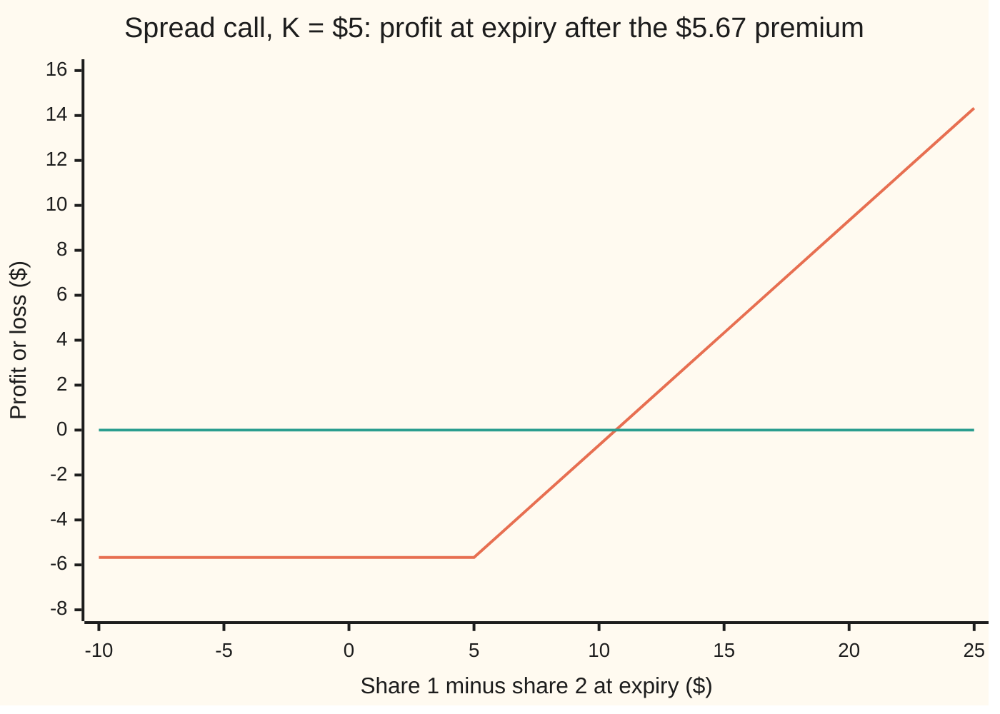
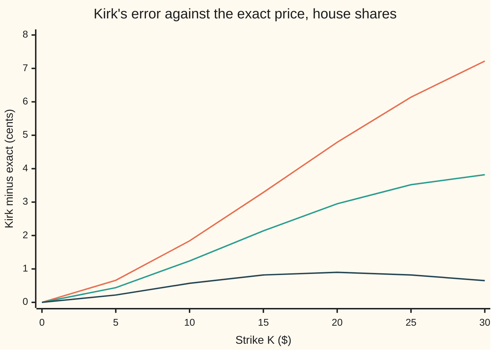

# Spread options: an option on the difference of two prices, with Kirk's shortcut and a simulation to keep it honest

Financial mathematics → Many underlyings - exchange, spread, basket and rainbow → Folding the strike into the second asset → Spread options

---

## General Overview

Two shares trade at $100 each. Both jump around by about 20 percent a year, both pay a 2 percent dividend, and they tend to move together: their correlation, a score from −1 (always opposite) to +1 (always together), is 0.5. Cash in the bank earns 5 percent.

A contract reads both closing prices one year from today. It pays the first price minus the second, minus $5, if that is positive, and nothing otherwise. The gap between two prices is a **spread**, so this is a **spread call**, and the $5 is its **strike**. It pays only if the first share beats the second by more than $5.

With the strike at zero the contract is the exchange option: hand over share 2, receive share 1. Its price has a closed form, Margrabe's formula, worth $7.81 here ([exchange-option-margrabe](01-exchange-option-margrabe.md)). Add the $5 and no closed form is known. The trick that made Margrabe work, measuring everything in units of share 2, breaks: the thing handed over is now share 2 *plus* $5, and that sum does not wander the way a share does.

Kirk's 1995 shortcut pretends that it does. It folds the $5 into share 2, treats "share 2 plus $5" as a new asset, and reuses Margrabe's formula with an adjusted volatility. It gives $5.67. An exact price, by one integral, is also $5.67: the two differ by a fifth of a cent. A million simulated years give $5.69, give or take one cent, and agree with both.

**A spread call has no closed form once the strike is not zero; Kirk's approximation folds the strike into the second asset and prices it with Margrabe's formula, and its error, tiny at small strikes and high correlation, grows as the strike rises and the correlation falls.**

**What kind of fact this is:** an approximation with its error stated, measured here against an exact one-dimensional integral and checked by simulation.

### The picture: what the holder walks away with



The sloped line is the holder's profit; the flat line is break-even. Left of a $5 spread the holder loses the premium and nothing more. Right of it, each extra dollar of spread is a dollar of payoff. The shape is an ordinary call's hockey stick, with the horizontal axis now a *difference* of two prices, which can be negative.

---

## The formula

Notation first, in words. A subscript 1 or 2 says which share a letter belongs to. A share's **forward**, $F_1$ or $F_2$, is the price agreed today for delivery in a year: today's price grown at the bank rate less the dividend. $N(x)$ is the bell-curve area left of $x$ ([normal-distribution](../../09-Probability%20and%20statistics/04-Continuous%20Distributions/04-normal-distribution.md)).

The contract:

$$\text{payoff} = \max(S_1 - S_2 - K,\ 0)\ \text{ at time } T$$

**Kirk's approximation:**

$$C \approx e^{-rT}\Big[F_1\,N(d_1) - (F_2 + K)\,N(d_2)\Big]$$

**Read it aloud:** the share you might receive, minus "share 2 plus the strike" that you might hand over, each weighted by its own chance and shrunk back to today.

It is Margrabe's formula with $F_2 + K$ standing where $F_2$ stood. The volatility changes to match:

$$\sigma_K = \sqrt{\sigma_1^2 - 2\rho\,\sigma_1\sigma_2\,w + \sigma_2^2\,w^2}, \qquad w = \frac{F_2}{F_2 + K}$$

In words: $w$ is the share of the folded asset that actually moves. Of $108.05, $103.05 is share 2 and $5 is fixed cash, so the folded asset is only 95 percent as jumpy as share 2. The volatility of the ratio uses that damped jumpiness.

$$d_1 = \frac{\ln\!\big(F_1/(F_2+K)\big) + \tfrac12\sigma_K^2\,T}{\sigma_K\sqrt{T}}, \qquad d_2 = d_1 - \sigma_K\sqrt{T}$$

In words: $d_2$ counts how many "wiggle units" of the ratio stand between the two forwards, as on [black-scholes-call](../08-The%20Black-Scholes%20call%20and%20put/01-black-scholes-call.md); $d_1$ is one wiggle unit more.

| Symbol | Plain meaning | In our example | Push it up and the answer… |
| --- | --- | --- | --- |
| $S_1$, $S_2$ | the two share prices; today, or at expiry when marked "at $T$" | $100, $100 | rises with $S_1$, falls with $S_2$ |
| $K$ | the strike: the margin share 1 must beat share 2 by | $5 | falls |
| $\rho$ | correlation of the two shares' moves, from −1 to +1 | 0.5 | falls: the gap between two shares that move together barely moves |
| $\sigma_1$, $\sigma_2$ | each share's volatility: how jumpy it is, per year | 0.20, 0.20 | rises |
| $r$, $q_1$, $q_2$ | bank rate; each share's dividend yield | 5%; 2%, 2% | $q_1$ lowers it, $q_2$ raises it |
| $T$ | time to expiry, in years | 1 | rises |
| $F_1$, $F_2$ | forwards, $S e^{(r-q)T}$ | 103.05, 103.05 | as $S_1$ and $S_2$ |
| $w$, $w_t$, $Y$ | $Y = F_2 + K$, the folded asset "share 2 plus strike"; $w$ is its moving part today, $w_t$ the same part at a later time | 0.9537; $108.05 | — |
| $\sigma_K$ | Kirk's volatility for the ratio of share 1 to "share 2 plus strike" | 0.1955 | rises |
| $d_1$, $d_2$ | the two cut-offs, in wiggle units | −0.1445, −0.3401 | — |
| $N(x)$ | bell-curve area left of $x$: a probability | 0.4425, 0.3669 | — |
| $C$, $P$ | spread call and spread put prices today | $5.67, $10.42 | — |

### When it holds

- **Both shares follow geometric Brownian motion with fixed volatilities and correlation** ([geometric-brownian-motion](../../11-Stochastic%20processes%20and%20calculus/05-Brownian%20Motion/07-geometric-brownian-motion.md)). If correlation itself moves, the price is off by roughly the correlation sensitivity, 7.5 cents per 0.01 here, times the move.
- **A strike small next to the second forward.** Kirk freezes $w$ at today's value. At $K = 5$ the error is 0.04 percent of the price; at $K = 30$ with correlation 0 it is 1.70 percent.
- **Correlation not near +1 with a large strike.** There the price itself is pennies and Kirk's relative error jumps: 6.42 percent of a one-cent price at correlation 0.9 and $K = 30$.
- **A folded asset $F_2 + K$ well above zero.** Kirk is built for $K \ge 0$. A negative strike pushes $w$ above 1, and once $F_2 + K \le 0$ the logarithm in $d_1$ is undefined.
- **European exercise, one date.** An early-exercise spread option needs a lattice or regression, not this formula.

---

## Why it works

### Step 0: at a zero strike, count in units of share 2

Margrabe's insight, proved on [exchange-option-margrabe](01-exchange-option-margrabe.md): measure every price in shares of asset 2 instead of dollars. Then asset 2 is worth exactly 1 forever, and the exchange option becomes an ordinary call on the ratio $S_1/S_2$ with strike 1. The ratio of two lognormal prices is lognormal (a price whose logarithm follows a bell curve), with volatility $\sqrt{\sigma_1^2 - 2\rho\sigma_1\sigma_2 + \sigma_2^2}$. Black-Scholes does the rest. Here that volatility is 0.20 and the price is $7.81.

Everything on this card tries to keep that trick alive once the strike is not zero.

### Step 1: why the strike breaks it

The call pays when $S_1 > S_2 + K$. Count in units of share 2 and the condition becomes $S_1/S_2 > 1 + K/S_2$: the hurdle now moves with share 2 itself. In logarithms, the line separating "pays" from "does not pay" is $\ln S_1 = \ln(S_2 + K)$. With $K = 0$ that is a straight line, and the chance of landing on one side of a straight line under a two-dimensional bell curve is a single $N(\cdot)$. With $K = 5$ the line bends, because $\ln(S_2 + 5)$ is not a straight function of $\ln S_2$. A bell curve cut by a curve has no single-$N$ answer.

A second way to see it: $S_2 + K$ is a lognormal share plus a fixed $5. A sum of a lognormal and a constant is not lognormal, so "share 2 plus strike" is not a Black-Scholes asset. No closed form is known for the spread call in general.

### Step 2: Kirk pretends the sum is lognormal

Kirk's move: treat $Y = F_2 + K$ as if it were a share. How jumpy is it? When share 2's forward moves by 1 percent, $Y$ moves by the same dollar amount, which is $w = F_2/(F_2 + K)$ percent of $Y$. So $Y$ behaves like a share with volatility $w\,\sigma_2$: 95 percent of share 2's jumpiness.

Freeze $w$ at today's value and $Y$ is lognormal. Margrabe's formula then applies with $F_2 + K$ in place of $F_2$ and $w\sigma_2$ in place of $\sigma_2$. The ratio volatility becomes $\sigma_K$ in the formula above. At $K = 0$, $w = 1$ and Kirk *is* Margrabe, exactly.

The error comes from the freezing. As share 2 moves over the year, the true weight moves with it: if share 2 falls, the fixed $5 is a bigger part of $Y$, and $Y$ becomes calmer than Kirk assumed; if it rises, jumpier. A larger strike makes the weight drift more, so the error grows with $K$. A lower correlation makes share 2's own randomness a larger part of the ratio's randomness, so misjudging it costs more.

<details>
<summary>Detailed proof: Kirk's volatility and where the approximation enters</summary>

In the risk-neutral world each forward is a martingale (a quantity whose expected future value is its value today): $dF_i = \sigma_i F_i\, dW_i$, the two Brownian increments (random shocks) having correlation $\rho$. Set $Y = F_2 + K$. Since $K$ is a constant, $dY = dF_2 = \sigma_2 F_2\, dW_2$, so $dY / Y = \sigma_2 \,\frac{F_2}{F_2 + K}\, dW_2 = \sigma_2\, w_t\, dW_2$. This is exact, with a weight $w_t$ that changes over time.

The one approximation: replace $w_t$ by today's weight $w$. Then $Y$ is a geometric Brownian motion with volatility $\sigma_2 w$. By Itô's lemma the ratio $F_1 / Y$ has log-increments with variance rate $\sigma_1^2 - 2\rho\sigma_1(\sigma_2 w) + (\sigma_2 w)^2 = \sigma_K^2$. Measuring in units of $Y$ (Step 0 with $Y$ as the unit), the call on $F_1 - Y$ is a Black-Scholes call on the ratio with strike 1, giving $e^{-rT}[F_1 N(d_1) - Y N(d_2)]$ with $d_1, d_2$ as stated. Every step after the freeze is exact; the whole error lives in $w_t \neq w$.

</details>

### Step 3: the exact price, by one integral

There is an exact route that needs one numerical integral instead of a formula. Fix the random draw $z$ that sets share 2's final price. Given $z$, share 2 at expiry is known, so the hurdle $X(z) = S_2 + K$ is just a number. Share 1, given $z$, is still lognormal: its correlated part is now fixed, and only its own leftover randomness remains, with log-spread $\sigma_1\sqrt{T}\sqrt{1-\rho^2}$. So given $z$ the spread call is an ordinary Black-Scholes call on share 1 with strike $X(z)$. Average that over the bell curve in $z$:

$$C = e^{-rT}\int_{-\infty}^{\infty} \frac{e^{-z^2/2}}{\sqrt{2\pi}}\ \mathrm{BS}\big(G(z),\, X(z)\big)\, dz$$

Here $G(z)$ is share 1's forward given $z$ and $\mathrm{BS}$ is the undiscounted Black-Scholes call. This is Pearson's 1995 method. The integrand is smooth, so Simpson's rule on 400 slices from −9 to 9 is accurate far beyond the printed digits. It is exact in the sense that matters: no modelling shortcut, only a quadrature (numerical area) whose error can be driven down at will. At $K = 0$ it returns Margrabe's $7.807839.

<details>
<summary>The algebra behind the conditional step</summary>

Write share 1's draw as $Z_1 = \rho z + \sqrt{1-\rho^2}\,W$, the draw in the last term independent of $z$ (the Cholesky step of [correlated-paths-and-cholesky](../06-Numerical%20Methods%20for%20Pricing/04-correlated-paths-and-cholesky.md)). Then $S_1(T) = F_1 \exp(-\tfrac12\sigma_1^2 T + \sigma_1\sqrt{T}\rho z)\cdot\exp(-\tfrac12\sigma_1^2(1-\rho^2)T + \sigma_1\sqrt{T}\sqrt{1-\rho^2}\,W)$. The second factor has mean 1, so the first factor, $G(z) = F_1\exp(\sigma_1\sqrt{T}\rho z - \tfrac12\sigma_1^2\rho^2 T)$, is share 1's forward given $z$. Share 2 at expiry is $F_2\exp(-\tfrac12\sigma_2^2 T + \sigma_2\sqrt{T} z)$. The call given $z$ is Black's formula with forward $G(z)$, strike $X(z)$ and log-spread $\sigma_1\sqrt{T}\sqrt{1-\rho^2}$. The same step with the put payoff gives the put independently, which is how the code tests parity.

</details>

### Step 4: simulation keeps both honest

The third road trusts no formula. Draw two independent bell-curve numbers, mix them by the Cholesky step so they have correlation 0.5, turn them into two share prices at expiry, and record the discounted payoff. Repeat a million times and average. The average is $5.69 with an error bar (one standard error, the typical miss of such an average) of one cent. The exact integral's $5.67 lies within two error bars. The simulation cannot see Kirk's fifth of a cent; its job is to confirm the integral, and the integral then measures Kirk to many decimals.

A parity identity closes the loop. The call minus the put on the same spread pays $S_1 - S_2 - K$ in every outcome, so today $C - P = e^{-rT}(F_1 - F_2 - K)$. The put priced by its own integral, $10.42, satisfies this to every printed decimal.

Other shortcuts exist. Treating the spread itself as a bell-curve variable (the Bachelier or normal-model view) is common on commodity desks; Carmona and Durrleman's survey compares it and several sharper refinements of Kirk.

---

## Worked numbers, by hand

House market, two shares: $S_1 = S_2 = 100$, $\sigma_1 = \sigma_2 = 0.20$, $q_1 = q_2 = 2\%$, $\rho = 0.5$, $r = 5\%$, $T = 1$, strike $K = 5$.

| Step | Arithmetic | Value |
| --- | --- | --- |
| forwards $F_1 = F_2$ | $100\,e^{(0.05-0.02)\times 1}$ | 103.0455 |
| folded asset $F_2 + K$ | $103.0455 + 5$ | 108.0455 |
| weight $w$ | $103.0455 / 108.0455$ | 0.9537 |
| Kirk volatility $\sigma_K$ | $\sqrt{0.04 - 2(0.5)(0.04)(0.9537) + 0.04(0.9537)^2}$ | 0.1955 |
| $d_1$ | $[\ln(103.0455/108.0455) + \tfrac12(0.1955)^2]/0.1955$ | −0.1445 |
| $d_2$ | $-0.1445 - 0.1955$ | −0.3401 |
| $N(d_1)$, $N(d_2)$ | bell-curve areas | 0.4425, 0.3669 |
| share leg | $e^{-0.05}\times 103.0455 \times 0.4425$ | $43.38 |
| cash-and-share leg | $e^{-0.05}\times 108.0455 \times 0.3669$ | $37.71 |
| **Kirk price** | $43.38 - 37.71$ | **$5.67** (5.668964) |
| exact price, by the integral | Simpson's rule, 400 slices | $5.67 (5.666758) |
| Kirk's error | $5.668964 - 5.666758$ | 0.22 cents |

A one-year right to receive share 1 in exchange for share 2 plus $5 costs $5.67, against $7.81 with no strike. The $5 hurdle takes less off the price than the $4.76 that $5 is worth today, because the call pays nothing in the outcomes where the hurdle would have been paid.

### How the error moves with the strike and the correlation

Exact prices, from the integral:

| Correlation | K = 0 | 5 | 10 | 15 | 20 | 25 | 30 |
| --- | --- | --- | --- | --- | --- | --- | --- |
| −0.5 | 13.48 | 11.24 | 9.26 | 7.55 | 6.09 | 4.85 | 3.82 |
| 0 | 11.02 | 8.81 | 6.93 | 5.36 | 4.08 | 3.06 | 2.25 |
| 0.5 | 7.81 | 5.67 | 3.98 | 2.71 | 1.79 | 1.15 | 0.72 |
| 0.9 | 3.50 | 1.64 | 0.66 | 0.24 | 0.08 | 0.02 | 0.01 |

Kirk minus exact, as a percent of the exact price:

| Correlation | K = 0 | 5 | 10 | 15 | 20 | 25 | 30 |
| --- | --- | --- | --- | --- | --- | --- | --- |
| −0.5 | 0.00 | 0.06 | 0.20 | 0.44 | 0.79 | 1.27 | 1.89 |
| 0 | 0.00 | 0.05 | 0.18 | 0.40 | 0.72 | 1.15 | 1.70 |
| 0.5 | 0.00 | 0.04 | 0.14 | 0.30 | 0.50 | 0.71 | 0.90 |
| 0.9 | 0.00 | 0.00 | −0.10 | −0.21 | 0.22 | 2.07 | 6.42 |

In cents, for the three lower correlations:



Top line: correlation −0.5. Middle: correlation 0. Bottom: correlation 0.5. All three start at zero, where Kirk is Margrabe. At correlation 0.5 and below, Kirk overprices, and its percent error grows with every step in the strike. In cents, lower correlation always means a bigger error. At correlation 0.5 the cents error peaks near $K = 20$ and then falls, only because the price itself is shrinking; the percent error keeps climbing. At correlation 0.9 the error changes sign and stays under a tenth of a cent, but on a one-cent price that is 6.42 percent.

At correlation −0.5 and $K = 20$, Kirk says $6.13 against the exact $6.09. The million-year simulation there gives $6.11, error bar 1.4 cents. It sits between the two and cannot tell them apart; only the integral can.

### Greeks, by nudging the inputs

Each sensitivity is found by nudging one input up and down, in both Kirk's formula and the exact integral, and dividing the price change by the nudge.

| Greek | Kirk | Exact | Plain meaning |
| --- | --- | --- | --- |
| delta, share 1 | 0.4338 | 0.4341 | dollars gained per $1 rise in share 1 |
| delta, share 2 | −0.3580 | −0.3584 | dollars lost per $1 rise in share 2 |
| correlation, per 0.01 | −0.0755 | −0.0755 | dollars lost when correlation rises by 0.01 |

The two deltas do not cancel, and Margrabe's do not either. At equal prices, adding $1 to both shares scales both by 1 percent, which scales the dollar swings of the gap, so the price rises. A hedger holds 0.43 of share 1 and is short 0.36 of share 2. Correlation sensitivity has a card of its own: [correlation-greeks-and-implied-correlation](05-correlation-greeks-and-implied-correlation.md).

### What breaks if you drop a piece

Same contract, right answer $5.67:

| Mistake | Comes out at | What went wrong |
| --- | --- | --- |
| Margrabe's price minus the strike's present value | $3.05 | That is a floor on the price, not the price: it charges the $5 even in outcomes where the call is not used |
| Kirk with $w = 1$, Margrabe's volatility 0.20 | $5.84 | Treats the $5 as jumpy as a share; the folded asset is only 95 percent as jumpy |
| Strike added to today's share price, then grown | $5.61 | The $5 is grown at the share's rate as if it were share 2; the hurdle comes out too high |
| Correlation left out ($\rho = 0$) | $8.81 | Treats the shares as unrelated; their tendency to move together makes the gap calmer and the call cheaper |

---

## Code, from first principles, and it actually runs

Both programs take three independent roads to the $K = 5$ price: Kirk's formula, the exact conditional integral by Simpson's rule, and a million simulated years. They also price the put by its own integral and test parity, bump both prices for the Greeks, fill the strike-by-correlation grids, and reproduce every "what breaks" number. The bell-curve area is Marsaglia's series written out; the random numbers come from a splitmix64 generator written out, turned into bell-curve draws by the Box-Muller recipe (two uniform numbers become two independent normal draws through a logarithm, a cosine and a sine). Both programs make the same draws in the same order, so their outputs match line for line.

### Python

```python
# Spread options and Kirk's approximation -- the check behind the card.  Standard library only.
# Two house shares, each at 100, 20% volatility, 2% dividend; correlation 0.5; r = 5%; one year.
# Nothing imported knows the answer: the bell-curve area is Marsaglia's series written out,
# the integral is Simpson's rule written out, the random numbers are splitmix64 written out.
from math import log, sqrt, exp, cos, sin, pi

S1, S2, v1, v2, q1, q2, r, T, RHO, K = 100.0, 100.0, 0.20, 0.20, 0.02, 0.02, 0.05, 1.0, 0.5, 5.0
disc = exp(-r * T)

def N(x):                                   # area left of x under the bell curve
    if x < -9.0: return 0.0
    if x > 9.0: return 1.0
    s, t, b, i = x, 0.0, x, 1.0
    while s != t:
        i += 2.0
        b *= x * x / i
        t, s = s, s + b
    return 0.5 + s * exp(-0.5 * x * x - 0.91893853320467274178)

def kirk(k, rho, a=S1, b=S2, fold=None, w_one=False):   # road 1: fold the strike into asset 2
    F1, F2 = a * exp((r - q1) * T), b * exp((r - q2) * T)
    Y = F2 + k if fold is None else fold                   # the forward of "asset 2 plus strike"
    w = 1.0 if w_one else F2 / Y
    vk = sqrt((v1 * v1 - 2.0 * rho * v1 * v2 * w + v2 * v2 * w * w) * T)
    d1 = (log(F1 / Y) + 0.5 * vk * vk) / vk
    return disc * (F1 * N(d1) - Y * N(d1 - vk)), w, vk, d1, F1, F2, Y

def margrabe(rho):                          # the K = 0 closed form, in spot terms (sibling card 01)
    v = sqrt(v1 * v1 + v2 * v2 - 2.0 * rho * v1 * v2)
    d1 = (log(S1 / S2) + (q2 - q1 + 0.5 * v * v) * T) / (v * sqrt(T))
    return S1 * exp(-q1 * T) * N(d1) - S2 * exp(-q2 * T) * N(d1 - v * sqrt(T))

def exact(k, rho, a=S1, b=S2, put=False, n=400):   # road 2: fix asset 2's draw, Black-Scholes on asset 1
    F1, F2, rt = a * exp((r - q1) * T), b * exp((r - q2) * T), sqrt(T)
    s = v1 * rt * sqrt(1.0 - rho * rho)             # asset 1's leftover spread once asset 2 is known
    def f(z):
        X = F2 * exp(-0.5 * v2 * v2 * T + v2 * rt * z) + k            # asset 2 at expiry, plus strike
        G = F1 * exp(-0.5 * v1 * v1 * rho * rho * T + v1 * rt * rho * z)   # asset 1's forward given z
        d1 = (log(G / X) + 0.5 * s * s) / s
        c = X * N(s - d1) - G * N(-d1) if put else G * N(d1) - X * N(d1 - s)
        return c * exp(-0.5 * z * z) / sqrt(2.0 * pi)
    h = 18.0 / n
    tot = f(-9.0) + f(9.0)
    for i in range(1, n): tot += (4.0 if i % 2 else 2.0) * f(-9.0 + i * h)
    return disc * tot * h / 3.0

state = 20260924                            # splitmix64: 64-bit integer mixing
def uniform():
    global state
    state = (state + 0x9E3779B97F4A7C15) & 0xFFFFFFFFFFFFFFFF
    z = state
    z = ((z ^ (z >> 30)) * 0xBF58476D1CE4E5B9) & 0xFFFFFFFFFFFFFFFF
    z = ((z ^ (z >> 27)) * 0x94D049BB133111EB) & 0xFFFFFFFFFFFFFFFF
    return ((z ^ (z >> 31)) >> 11) * 2.0 ** -53 + 2.0 ** -54

# road 3: simulate 1,000,000 expiries; Cholesky turns two independent draws into correlated ones
cells = ((0.5, 0.0), (0.5, 5.0), (-0.5, 20.0))
F1, F2 = S1 * exp((r - q1) * T), S2 * exp((r - q2) * T)
sm, sq, paths = [0.0] * 3, [0.0] * 3, 1000000
for _ in range(paths):
    rad, ang = sqrt(-2.0 * log(uniform())), 2.0 * pi * uniform()
    g1, g2 = rad * cos(ang), rad * sin(ang)           # Box-Muller: two independent bell-curve draws
    for c, (rho, k) in enumerate(cells):
        z1 = rho * g1 + sqrt(1.0 - rho * rho) * g2
        A = F1 * exp(-0.5 * v1 * v1 * T + v1 * sqrt(T) * z1)
        B = F2 * exp(-0.5 * v2 * v2 * T + v2 * sqrt(T) * g1)
        p = disc * max(A - B - k, 0.0)
        sm[c] += p; sq[c] += p * p
mc = [sm[c] / paths for c in range(3)]
se = [sqrt((sq[c] / paths - mc[c] * mc[c]) / (paths - 1)) for c in range(3)]

ck, w, vk, d1, F1, F2, Y = kirk(K, RHO)
ce, pe, mg = exact(K, RHO), exact(K, RHO, put=True), margrabe(RHO)
def bump(f, h): return (f(h) - f(-h)) / (2.0 * h)
greeks = [("delta, asset 1", lambda h: kirk(K, RHO, a=S1 + h)[0], lambda h: exact(K, RHO, a=S1 + h), 0.01, 1.0),
          ("delta, asset 2", lambda h: kirk(K, RHO, b=S2 + h)[0], lambda h: exact(K, RHO, b=S2 + h), 0.01, 1.0),
          ("correlation, per 0.01", lambda h: kirk(K, RHO + h)[0], lambda h: exact(K, RHO + h), 0.001, 0.01)]
rows = [("forward of each share, F1 = F2", F1), ("asset 2 plus strike, F2 + K", Y), ("weight w = F2/(F2+K)", w),
        ("Kirk volatility sigma_K", vk), ("Kirk d1", d1), ("Kirk d2", d1 - vk), ("N(d1)", N(d1)), ("N(d2)", N(d1 - vk)),
        ("share leg  e^-rT F1 N(d1)", disc * F1 * N(d1)), ("cash leg   e^-rT (F2+K) N(d2)", disc * Y * N(d1 - vk)),
        ("1 Kirk, K = 5", ck), ("2 exact integral, K = 5", ce), ("3 simulation, K = 5", mc[1]),
        ("  simulation error bar", se[1]), ("  Kirk minus exact, cents", 100.0 * (ck - ce)),
        ("Margrabe closed form, K = 0", mg), ("  ratio volatility, K = 0", kirk(0.0, RHO)[2]),
        ("  exact integral, K = 0", exact(0.0, RHO)),
        ("  simulation, K = 0", mc[0]), ("  simulation error bar", se[0]),
        ("put by integral, K = 5", pe), ("  C - P", ce - pe), ("  e^-rT (F1 - F2 - K)", disc * (F1 - F2 - K))]
for name, fk, fe, h, unit in greeks:
    rows += [(name + ", Kirk", bump(fk, h) * unit), ("  " + name + ", exact", bump(fe, h) * unit)]
rows += [("wrong: Margrabe minus e^-rT K", mg - disc * K), ("wrong: Kirk with w = 1", kirk(K, RHO, w_one=True)[0]),
         ("wrong: strike added to spot", kirk(K, RHO, fold=(S2 + K) * exp((r - q2) * T))[0]),
         ("wrong: correlation left out", exact(K, 0.0)), ("simulation, rho -0.5, K = 20", mc[2]),
         ("  simulation error bar", se[2]), ("  Kirk, rho -0.5, K = 20", kirk(20.0, -0.5)[0])]
for name, v in rows: print(f"{name:<36} {v:>12.6f}")

Ks, rhos = (0.0, 5.0, 10.0, 15.0, 20.0, 25.0, 30.0), (-0.5, 0.0, 0.5, 0.9)
grid = {(p, k): (kirk(k, p)[0], exact(k, p)) for p in rhos for k in Ks}
print("exact price    K:" + "".join(f"{k:>8.0f}" for k in Ks))
for p in rhos: print(f"  rho {p:>5.1f}      " + "".join(f"{grid[p, k][1]:>8.2f}" for k in Ks))
print("Kirk - exact, cents")
for p in rhos: print(f"  rho {p:>5.1f}      " + "".join(f"{round(100.0 * (grid[p, k][0] - grid[p, k][1]), 2) + 0.0:>8.2f}" for k in Ks))
print("Kirk - exact, percent of exact")
for p in rhos: print(f"  rho {p:>5.1f}      " + "".join(f"{round(100.0 * (grid[p, k][0] / grid[p, k][1] - 1.0), 2) + 0.0:>8.2f}" for k in Ks))
xs = (-10.0, -5.0, 0.0, 5.0, 10.0, 15.0, 20.0, 25.0)
print("chart, spread at expiry" + "".join(f"{x:>7.0f}" for x in xs))
print("chart, profit after 5.67" + "".join(f"{max(x - K, 0.0) - round(ce, 2):>7.2f}" for x in xs)[1:])

assert abs(exact(0.0, RHO) - 7.807839) < 1e-6,          "integral at K = 0 must land on Margrabe's house number"
assert abs(mg - exact(0.0, RHO)) < 1e-9,                "Margrabe formula vs the conditional integral"
assert all(abs(mc[c] - exact(k, p)) < 3.0 * se[c] for c, (p, k) in enumerate(cells)), "simulation within 3 error bars"
assert abs(ck - ce) < 0.001 * ce,                     "Kirk within a tenth of a percent at the house strike"
assert abs((ce - pe) - disc * (F1 - F2 - K)) < 1e-9,    "put-call parity with an independently priced put"
assert all(grid[p, a][0] / grid[p, a][1] < grid[p, b][0] / grid[p, b][1] for p in (-0.5, 0.0, 0.5)
           for a, b in zip(Ks[1:], Ks[2:])), "Kirk's percent error grows with the strike at correlation 0.5 and below"
assert all(grid[a, k][0] - grid[a, k][1] > grid[b, k][0] - grid[b, k][1] for k in Ks[1:]
           for a, b in ((-0.5, 0.0), (0.0, 0.5))), "Kirk's error in cents shrinks as correlation rises to 0.5"
print("ALL CHECKS PASS")
```

**Ran 2026-09-24 on macOS, Python 3.14.6, standard library only. All checks passed. Output, pasted from the run:**

```
forward of each share, F1 = F2         103.045453
asset 2 plus strike, F2 + K            108.045453
weight w = F2/(F2+K)                     0.953723
Kirk volatility sigma_K                  0.195537
Kirk d1                                 -0.144548
Kirk d2                                 -0.340085
N(d1)                                    0.442534
N(d2)                                    0.366896
share leg  e^-rT F1 N(d1)               43.377095
cash leg   e^-rT (F2+K) N(d2)           37.708130
1 Kirk, K = 5                            5.668964
2 exact integral, K = 5                  5.666758
3 simulation, K = 5                      5.685321
  simulation error bar                   0.010125
  Kirk minus exact, cents                0.220636
Margrabe closed form, K = 0              7.807839
  ratio volatility, K = 0                0.200000
  exact integral, K = 0                  7.807839
  simulation, K = 0                      7.830254
  simulation error bar                   0.011724
put by integral, K = 5                  10.422905
  C - P                                 -4.756147
  e^-rT (F1 - F2 - K)                   -4.756147
delta, asset 1, Kirk                     0.433771
  delta, asset 1, exact                  0.434113
delta, asset 2, Kirk                    -0.358046
  delta, asset 2, exact                 -0.358377
correlation, per 0.01, Kirk             -0.075499
  correlation, per 0.01, exact          -0.075453
wrong: Margrabe minus e^-rT K            3.051692
wrong: Kirk with w = 1                   5.841780
wrong: strike added to spot              5.611207
wrong: correlation left out              8.812766
simulation, rho -0.5, K = 20             6.111504
  simulation error bar                   0.013709
  Kirk, rho -0.5, K = 20                 6.132988
exact price    K:       0       5      10      15      20      25      30
  rho  -0.5         13.48   11.24    9.26    7.55    6.09    4.85    3.82
  rho   0.0         11.02    8.81    6.93    5.36    4.08    3.06    2.25
  rho   0.5          7.81    5.67    3.98    2.71    1.79    1.15    0.72
  rho   0.9          3.50    1.64    0.66    0.24    0.08    0.02    0.01
Kirk - exact, cents
  rho  -0.5          0.00    0.66    1.84    3.29    4.79    6.14    7.22
  rho   0.0          0.00    0.44    1.24    2.14    2.95    3.52    3.82
  rho   0.5          0.00    0.22    0.57    0.82    0.90    0.82    0.65
  rho   0.9          0.00    0.00   -0.07   -0.05    0.02    0.05    0.04
Kirk - exact, percent of exact
  rho  -0.5          0.00    0.06    0.20    0.44    0.79    1.27    1.89
  rho   0.0          0.00    0.05    0.18    0.40    0.72    1.15    1.70
  rho   0.5          0.00    0.04    0.14    0.30    0.50    0.71    0.90
  rho   0.9          0.00    0.00   -0.10   -0.21    0.22    2.07    6.42
chart, spread at expiry    -10     -5      0      5     10     15     20     25
chart, profit after 5.67 -5.67  -5.67  -5.67  -5.67  -0.67   4.33   9.33  14.33
ALL CHECKS PASS
```

### Rust

```rust
// Spread options and Kirk's approximation -- the same check as the Python, in Rust.  Std only, no crates.
// Two house shares, each at 100, 20% volatility, 2% dividend; correlation 0.5; r = 5%; one year.
// Same series for the bell-curve area, same Simpson rule, same splitmix64 draws, same rows.
use std::f64::consts::PI;

const S1: f64 = 100.0; const S2: f64 = 100.0; const V1: f64 = 0.20; const V2: f64 = 0.20;
const Q1: f64 = 0.02; const Q2: f64 = 0.02; const R: f64 = 0.05; const T: f64 = 1.0;
const RHO: f64 = 0.5; const K: f64 = 5.0;

fn disc() -> f64 { (-R * T).exp() }

fn n_cdf(x: f64) -> f64 {                   // area left of x: Marsaglia's series
    if x < -9.0 { return 0.0; }
    if x > 9.0 { return 1.0; }
    let (mut s, mut t, mut b, mut i) = (x, 0.0_f64, x, 1.0_f64);
    while s != t {
        i += 2.0;
        b *= x * x / i;
        t = s; s = s + b;
    }
    0.5 + s * (-0.5 * x * x - 0.91893853320467274178).exp()
}

// road 1: fold the strike into asset 2.  fold = Some(Y) forces the forward of "asset 2 plus strike".
fn kirk(k: f64, rho: f64, a: f64, b: f64, fold: Option<f64>, w_one: bool) -> (f64, f64, f64, f64, f64, f64, f64) {
    let (f1, f2) = (a * ((R - Q1) * T).exp(), b * ((R - Q2) * T).exp());
    let y = match fold { None => f2 + k, Some(v) => v };
    let w = if w_one { 1.0 } else { f2 / y };
    let vk = ((V1 * V1 - 2.0 * rho * V1 * V2 * w + V2 * V2 * w * w) * T).sqrt();
    let d1 = ((f1 / y).ln() + 0.5 * vk * vk) / vk;
    (disc() * (f1 * n_cdf(d1) - y * n_cdf(d1 - vk)), w, vk, d1, f1, f2, y)
}
fn kp(k: f64, rho: f64) -> f64 { kirk(k, rho, S1, S2, None, false).0 }

fn margrabe(rho: f64) -> f64 {              // the K = 0 closed form, in spot terms (sibling card 01)
    let v = (V1 * V1 + V2 * V2 - 2.0 * rho * V1 * V2).sqrt();
    let d1 = ((S1 / S2).ln() + (Q2 - Q1 + 0.5 * v * v) * T) / (v * T.sqrt());
    S1 * (-Q1 * T).exp() * n_cdf(d1) - S2 * (-Q2 * T).exp() * n_cdf(d1 - v * T.sqrt())
}

// road 2: fix asset 2's draw z, price asset 1 by Black-Scholes, average over z by Simpson's rule
fn exact(k: f64, rho: f64, a: f64, b: f64, put: bool) -> f64 {
    let (f1, f2, rt) = (a * ((R - Q1) * T).exp(), b * ((R - Q2) * T).exp(), T.sqrt());
    let s = V1 * rt * (1.0 - rho * rho).sqrt();
    let f = |z: f64| {
        let x = f2 * (-0.5 * V2 * V2 * T + V2 * rt * z).exp() + k;
        let g = f1 * (-0.5 * V1 * V1 * rho * rho * T + V1 * rt * rho * z).exp();
        let d1 = ((g / x).ln() + 0.5 * s * s) / s;
        let c = if put { x * n_cdf(s - d1) - g * n_cdf(-d1) } else { g * n_cdf(d1) - x * n_cdf(d1 - s) };
        c * (-0.5 * z * z).exp() / (2.0 * PI).sqrt()
    };
    let n = 400;
    let h = 18.0 / n as f64;
    let mut tot = f(-9.0) + f(9.0);
    for i in 1..n { tot += if i % 2 == 1 { 4.0 } else { 2.0 } * f(-9.0 + i as f64 * h); }
    disc() * tot * h / 3.0
}
fn ex(k: f64, rho: f64) -> f64 { exact(k, rho, S1, S2, false) }

struct Rng(u64);                            // splitmix64: 64-bit integer mixing
impl Rng {
    fn uniform(&mut self) -> f64 {
        self.0 = self.0.wrapping_add(0x9E3779B97F4A7C15);
        let mut z = self.0;
        z = (z ^ (z >> 30)).wrapping_mul(0xBF58476D1CE4E5B9);
        z = (z ^ (z >> 27)).wrapping_mul(0x94D049BB133111EB);
        ((z ^ (z >> 31)) >> 11) as f64 * (1.0 / 9007199254740992.0) + 0.5 / 9007199254740992.0
    }
}

fn r2(x: f64) -> f64 { (x * 100.0).round() / 100.0 + 0.0 }

fn main() {
    let d = disc();
    // road 3: simulate 1,000,000 expiries; Cholesky turns two independent draws into correlated ones
    let cells = [(0.5_f64, 0.0_f64), (0.5, 5.0), (-0.5, 20.0)];
    let (f1, f2) = (S1 * ((R - Q1) * T).exp(), S2 * ((R - Q2) * T).exp());
    let (mut sm, mut sq, paths) = ([0.0_f64; 3], [0.0_f64; 3], 1000000usize);
    let mut rng = Rng(20260924);
    for _ in 0..paths {
        let rad = (-2.0 * rng.uniform().ln()).sqrt();
        let ang = 2.0 * PI * rng.uniform();
        let (g1, g2) = (rad * ang.cos(), rad * ang.sin());
        for (c, &(rho, k)) in cells.iter().enumerate() {
            let z1 = rho * g1 + (1.0 - rho * rho).sqrt() * g2;
            let a = f1 * (-0.5 * V1 * V1 * T + V1 * T.sqrt() * z1).exp();
            let b = f2 * (-0.5 * V2 * V2 * T + V2 * T.sqrt() * g1).exp();
            let p = d * (a - b - k).max(0.0);
            sm[c] += p; sq[c] += p * p;
        }
    }
    let pf = paths as f64;
    let mc: Vec<f64> = (0..3).map(|c| sm[c] / pf).collect();
    let se: Vec<f64> = (0..3).map(|c| ((sq[c] / pf - mc[c] * mc[c]) / (pf - 1.0)).sqrt()).collect();

    let (ck, w, vk, d1, f1, f2, y) = kirk(K, RHO, S1, S2, None, false);
    let (ce, pe, mg) = (ex(K, RHO), exact(K, RHO, S1, S2, true), margrabe(RHO));
    let bump = |f: &dyn Fn(f64) -> f64, h: f64| (f(h) - f(-h)) / (2.0 * h);
    let g = [
        ("delta, asset 1", bump(&|h| kirk(K, RHO, S1 + h, S2, None, false).0, 0.01), bump(&|h| exact(K, RHO, S1 + h, S2, false), 0.01)),
        ("delta, asset 2", bump(&|h| kirk(K, RHO, S1, S2 + h, None, false).0, 0.01), bump(&|h| exact(K, RHO, S1, S2 + h, false), 0.01)),
        ("correlation, per 0.01", bump(&|h| kp(K, RHO + h), 0.001) * 0.01, bump(&|h| ex(K, RHO + h), 0.001) * 0.01),
    ];
    let mut rows: Vec<(String, f64)> = vec![
        ("forward of each share, F1 = F2".into(), f1), ("asset 2 plus strike, F2 + K".into(), y), ("weight w = F2/(F2+K)".into(), w),
        ("Kirk volatility sigma_K".into(), vk), ("Kirk d1".into(), d1), ("Kirk d2".into(), d1 - vk),
        ("N(d1)".into(), n_cdf(d1)), ("N(d2)".into(), n_cdf(d1 - vk)),
        ("share leg  e^-rT F1 N(d1)".into(), d * f1 * n_cdf(d1)), ("cash leg   e^-rT (F2+K) N(d2)".into(), d * y * n_cdf(d1 - vk)),
        ("1 Kirk, K = 5".into(), ck), ("2 exact integral, K = 5".into(), ce), ("3 simulation, K = 5".into(), mc[1]),
        ("  simulation error bar".into(), se[1]), ("  Kirk minus exact, cents".into(), 100.0 * (ck - ce)),
        ("Margrabe closed form, K = 0".into(), mg), ("  ratio volatility, K = 0".into(), kirk(0.0, RHO, S1, S2, None, false).2),
        ("  exact integral, K = 0".into(), ex(0.0, RHO)),
        ("  simulation, K = 0".into(), mc[0]), ("  simulation error bar".into(), se[0]),
        ("put by integral, K = 5".into(), pe), ("  C - P".into(), ce - pe), ("  e^-rT (F1 - F2 - K)".into(), d * (f1 - f2 - K)),
    ];
    for (name, gk, ge) in g.iter() { rows.push((format!("{}, Kirk", name), *gk)); rows.push((format!("  {}, exact", name), *ge)); }
    rows.extend(vec![
        ("wrong: Margrabe minus e^-rT K".to_string(), mg - d * K), ("wrong: Kirk with w = 1".into(), kirk(K, RHO, S1, S2, None, true).0),
        ("wrong: strike added to spot".into(), kirk(K, RHO, S1, S2, Some((S2 + K) * ((R - Q2) * T).exp()), false).0),
        ("wrong: correlation left out".into(), ex(K, 0.0)), ("simulation, rho -0.5, K = 20".into(), mc[2]),
        ("  simulation error bar".into(), se[2]), ("  Kirk, rho -0.5, K = 20".into(), kp(20.0, -0.5)),
    ]);
    for (name, v) in &rows { println!("{:<36} {:>12.6}", name, v); }

    let ks = [0.0_f64, 5.0, 10.0, 15.0, 20.0, 25.0, 30.0];
    let rhos = [-0.5_f64, 0.0, 0.5, 0.9];
    let grid: Vec<Vec<(f64, f64)>> = rhos.iter().map(|&p| ks.iter().map(|&k| (kp(k, p), ex(k, p))).collect()).collect();
    let line = |p: f64, vals: Vec<f64>| format!("  rho {:>5.1}      {}", p, vals.iter().map(|v| format!("{:>8.2}", v)).collect::<String>());
    println!("exact price    K:{}", ks.iter().map(|k| format!("{:>8.0}", k)).collect::<String>());
    for (i, &p) in rhos.iter().enumerate() { println!("{}", line(p, grid[i].iter().map(|c| c.1).collect())); }
    println!("Kirk - exact, cents");
    for (i, &p) in rhos.iter().enumerate() { println!("{}", line(p, grid[i].iter().map(|c| r2(100.0 * (c.0 - c.1))).collect())); }
    println!("Kirk - exact, percent of exact");
    for (i, &p) in rhos.iter().enumerate() { println!("{}", line(p, grid[i].iter().map(|c| r2(100.0 * (c.0 / c.1 - 1.0))).collect())); }
    let xs = [-10.0_f64, -5.0, 0.0, 5.0, 10.0, 15.0, 20.0, 25.0];
    println!("chart, spread at expiry{}", xs.iter().map(|x| format!("{:>7.0}", x)).collect::<String>());
    let prof: String = xs.iter().map(|x| format!("{:>7.2}", (x - K).max(0.0) - r2(ce))).collect();
    println!("chart, profit after 5.67{}", &prof[1..]);

    assert!((ex(0.0, RHO) - 7.807839).abs() < 1e-6, "integral at K = 0 must land on Margrabe's house number");
    assert!((mg - ex(0.0, RHO)).abs() < 1e-9, "Margrabe formula vs the conditional integral");
    for (c, &(p, k)) in cells.iter().enumerate() { assert!((mc[c] - ex(k, p)).abs() < 3.0 * se[c], "simulation within 3 error bars"); }
    assert!((ck - ce).abs() < 0.001 * ce, "Kirk within a tenth of a percent at the house strike");
    assert!(((ce - pe) - d * (f1 - f2 - K)).abs() < 1e-9, "put-call parity with an independently priced put");
    for i in 0..3 { for j in 1..ks.len() - 1 {
        assert!(grid[i][j].0 / grid[i][j].1 < grid[i][j + 1].0 / grid[i][j + 1].1, "Kirk's percent error grows with the strike at correlation 0.5 and below");
    } }
    for j in 1..ks.len() { for i in 0..2 {
        assert!(grid[i][j].0 - grid[i][j].1 > grid[i + 1][j].0 - grid[i + 1][j].1, "Kirk's error in cents shrinks as correlation rises to 0.5");
    } }
    println!("ALL CHECKS PASS");
}
```

**Ran 2026-09-24 on macOS, rustc 1.98.1, no crates. All checks passed. Output, pasted from the run:**

```
forward of each share, F1 = F2         103.045453
asset 2 plus strike, F2 + K            108.045453
weight w = F2/(F2+K)                     0.953723
Kirk volatility sigma_K                  0.195537
Kirk d1                                 -0.144548
Kirk d2                                 -0.340085
N(d1)                                    0.442534
N(d2)                                    0.366896
share leg  e^-rT F1 N(d1)               43.377095
cash leg   e^-rT (F2+K) N(d2)           37.708130
1 Kirk, K = 5                            5.668964
2 exact integral, K = 5                  5.666758
3 simulation, K = 5                      5.685321
  simulation error bar                   0.010125
  Kirk minus exact, cents                0.220636
Margrabe closed form, K = 0              7.807839
  ratio volatility, K = 0                0.200000
  exact integral, K = 0                  7.807839
  simulation, K = 0                      7.830254
  simulation error bar                   0.011724
put by integral, K = 5                  10.422905
  C - P                                 -4.756147
  e^-rT (F1 - F2 - K)                   -4.756147
delta, asset 1, Kirk                     0.433771
  delta, asset 1, exact                  0.434113
delta, asset 2, Kirk                    -0.358046
  delta, asset 2, exact                 -0.358377
correlation, per 0.01, Kirk             -0.075499
  correlation, per 0.01, exact          -0.075453
wrong: Margrabe minus e^-rT K            3.051692
wrong: Kirk with w = 1                   5.841780
wrong: strike added to spot              5.611207
wrong: correlation left out              8.812766
simulation, rho -0.5, K = 20             6.111504
  simulation error bar                   0.013709
  Kirk, rho -0.5, K = 20                 6.132988
exact price    K:       0       5      10      15      20      25      30
  rho  -0.5         13.48   11.24    9.26    7.55    6.09    4.85    3.82
  rho   0.0         11.02    8.81    6.93    5.36    4.08    3.06    2.25
  rho   0.5          7.81    5.67    3.98    2.71    1.79    1.15    0.72
  rho   0.9          3.50    1.64    0.66    0.24    0.08    0.02    0.01
Kirk - exact, cents
  rho  -0.5          0.00    0.66    1.84    3.29    4.79    6.14    7.22
  rho   0.0          0.00    0.44    1.24    2.14    2.95    3.52    3.82
  rho   0.5          0.00    0.22    0.57    0.82    0.90    0.82    0.65
  rho   0.9          0.00    0.00   -0.07   -0.05    0.02    0.05    0.04
Kirk - exact, percent of exact
  rho  -0.5          0.00    0.06    0.20    0.44    0.79    1.27    1.89
  rho   0.0          0.00    0.05    0.18    0.40    0.72    1.15    1.70
  rho   0.5          0.00    0.04    0.14    0.30    0.50    0.71    0.90
  rho   0.9          0.00    0.00   -0.10   -0.21    0.22    2.07    6.42
chart, spread at expiry    -10     -5      0      5     10     15     20     25
chart, profit after 5.67 -5.67  -5.67  -5.67  -5.67  -0.67   4.33   9.33  14.33
ALL CHECKS PASS
```

The two outputs agree to every printed digit: the same series, the same slices and the same random draws, in two languages.

> [!TIP]
> **Try changing**
> Guess the direction first. Then run it with a different `RHO` or `K`.
> - **Raise the correlation to 0.9 at the house strike.** The exact price falls from $5.67 to **$1.64**, and Kirk matches it to the printed cent. Shares that move together leave little gap to bet on.
> - **Drop the correlation to −0.5 and raise the strike to 20.** The exact price is **$6.09** and Kirk says **$6.13**, 0.79 percent high. At $K = 30$ the gap grows to 7.22 cents.
> - **Set the strike to 0.** Kirk's weight becomes 1, and Kirk, the integral and Margrabe all give **$7.81**.
> - **Correlation 0.9, strike 30.** The price is **$0.01**, and Kirk's error, under a twentieth of a cent, is **6.42 percent** of it. Small absolute errors on cheap options are large relative ones.

---

## The usual mistake

> [!warning]
> **Pricing the spread with Margrabe's formula and subtracting the strike.** $7.81 minus the $4.76 present value of $5 gives $3.05, far below the true $5.67. That subtraction charges the strike in every outcome, including the ones where the holder walks away and pays nothing. It is a lower bound, never a price.
>
> - **Keeping Margrabe's volatility.** Folding the strike in without damping the second share's volatility by $w$ gives $5.84 against $5.67. The $5 is cash; it does not wiggle.
> - **Folding the strike at face value.** Kirk's folded asset is the forward $F_2 + K$, or in today's money $S_2 e^{-q_2T} + Ke^{-rT}$. Adding $5 to the spot and growing the lot gives $5.61.
> - **Trusting a simulation's last digit.** A million paths give $5.69 ± $0.01. That cannot confirm or refute a fifth-of-a-cent error; the exact integral can.
> - **Reading Kirk's small cents error as small everywhere.** At correlation 0.9 and $K = 30$ it is 6.42 percent of the price. Quote errors as a share of the price, not only in cents.

---

## Where you meet it in real life

- **Oil refining: the crack spread.** A refiner earns the gasoline price minus the crude price. A call on that spread, struck at the refiner's operating cost, is the value of the right to run the refinery for a year. Kirk's formula is a common desk method for pricing it.
- **Power generation: the spark spread.** A gas-fired plant earns the power price minus the gas it burns. The plant is a strip of spread calls, one per hour it could run; the strike is the running cost.
- **Pairs and relative-value trades in shares.** A call on one share outperforming another by a fixed amount is exactly this card's contract.
- **Calendar and location spreads.** The same product on two dates, or in two places: a call on the difference prices the value of storage or of a pipeline.
- **Neighbours on this shelf.** The zero-strike case is [exchange-option-margrabe](01-exchange-option-margrabe.md); the sum instead of the difference is [basket-options](03-basket-options.md); the better or worse of the two is [rainbow-best-of-and-worst-of](04-rainbow-best-of-and-worst-of.md).

> **Say it back**
> A spread call pays the first price minus the second minus a strike, if positive. At a zero strike Margrabe's formula prices it exactly by counting in units of the second share. A nonzero strike bends the exercise boundary and no closed form is known. Kirk folds the strike into the second share, damps its volatility by the weight $w$, and reuses Margrabe; the house price is $5.67, a fifth of a cent above the exact integral and within a simulation's error bar. Kirk's error grows with the strike and with falling correlation, and is largest relative to cheap, far-out contracts.

---

## What this builds on

- [exchange-option-margrabe](01-exchange-option-margrabe.md): the zero-strike price and the change of unit that Kirk reuses.
- [correlated-paths-and-cholesky](../06-Numerical%20Methods%20for%20Pricing/04-correlated-paths-and-cholesky.md): how two independent draws become two correlated ones, used by the simulation and by the exact integral.

## Where this goes next

- [basket-options](03-basket-options.md): an option on a weighted sum of shares, where a sum of lognormals again has no closed form and a moment-matched lognormal takes Kirk's place.

This card leaves a sum of lognormal prices unpriced in closed form; the next card prices the most common such sum, a basket, by matching its first two moments.

---

## Sources

Verified 2026-09-24: every link below resolves to the publisher's page and names the cited work.

- Margrabe, William. "The Value of an Option to Exchange One Asset for Another." *The Journal of Finance* 33, no. 1 (1978): 177–186. [doi:10.1111/j.1540-6261.1978.tb03397.x](https://doi.org/10.1111/j.1540-6261.1978.tb03397.x). The zero-strike closed form that Kirk extends.
- Kirk, Ed. "Correlation in the Energy Markets." In *Managing Energy Price Risk*, 71–78. London: Risk Publications and Enron, 1995. No online copy; the formula as used here is restated in Carmona and Durrleman, below.
- Pearson, Neil D. "An Efficient Approach for Pricing Spread Options." *The Journal of Derivatives* 3, no. 1 (1995): 76–91. [doi:10.3905/jod.1995.407928](https://doi.org/10.3905/jod.1995.407928). The conditional one-dimensional integral used here as the exact price.
- Carmona, René, and Valdo Durrleman. "Pricing and Hedging Spread Options." *SIAM Review* 45, no. 4 (2003): 627–685. [doi:10.1137/S0036144503424798](https://doi.org/10.1137/S0036144503424798). Survey of spread-option methods, including Kirk's approximation, the normal-model view and their errors.
- Marsaglia, George. "Evaluating the Normal Distribution." *Journal of Statistical Software* 11, no. 4 (2004). [doi:10.18637/jss.v011.i04](https://doi.org/10.18637/jss.v011.i04). The series both programs use for the bell-curve area.
- Steele, Guy L., Doug Lea, and Christine H. Flood. "Fast Splittable Pseudorandom Number Generators." *ACM SIGPLAN Notices* 49, no. 10 (2014): 453–472. [doi:10.1145/2714064.2660195](https://doi.org/10.1145/2714064.2660195). The splitmix64 generator behind the simulated years.
