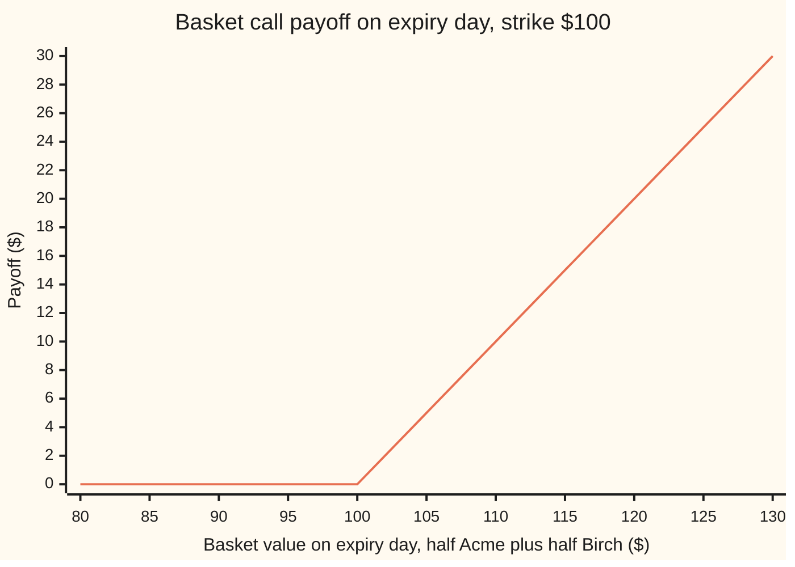
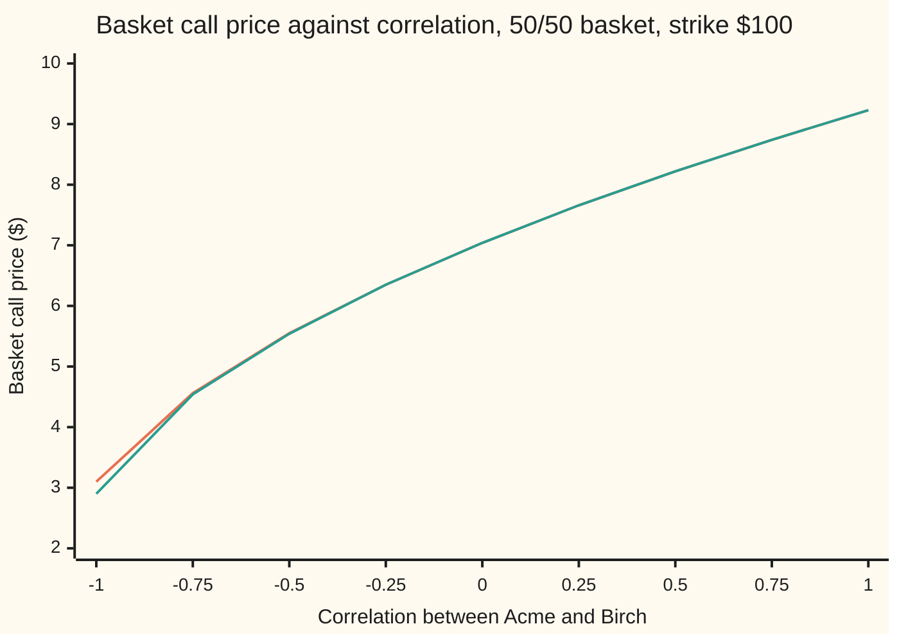

# Basket options: one option on a weighted group of shares, where correlation is the input that matters

Financial mathematics → Many underlyings - exchange, spread, basket and rainbow → Correlated sums → Basket options

---

## General Overview

Two shares trade at $100 each: Acme, and a second company, Birch. Both have the house market's numbers. Each wanders 20 percent a year, each pays a 2 percent dividend yield, cash earns 5 percent, and the two tend to move together with a correlation of 0.5 (a score from −1, always opposite, to +1, always together).

A fund must buy half a share of each in a year and wants to cap the cost. It buys one contract: in a year, it may buy the pair, half of Acme plus half of Birch, for $100. The pair is the **basket**. The contract is a **basket call**: one option on the weighted total, not one option per share. If Acme ends at $130 and Birch at $80, the basket is $105 and the call pays $5. Two separate half-options would have paid $15 on Acme and nothing on Birch.

That cancelling is what the price is made of. A good year on one share is partly undone by a bad year on the other, so the basket wanders less than either share. How much less depends on how often they move together: on the correlation. At 0.5 the call is worth $8.22. Make the two shares move in lockstep and it rises to $9.23, the price of an ordinary call on one share. Make them independent and it falls to $7.04.

There is no exact formula. A single share's future price is lognormal (its logarithm follows a bell curve), and that is what makes Black–Scholes work. A sum of two lognormals is not lognormal. So the card prices the basket three ways: by pretending the basket is one share with the right average and spread, by simulating the two shares together, and by an exact integral that serves as the referee.

**A basket call is priced by matching the basket's true mean and spread to a single lognormal share and pricing that share; over the ranges each input is really uncertain, the correlation moves that price more than any one share's volatility.**

**What kind of fact this is:** an approximation, with its error stated: inside the lognormal model, moment matching lands within a hundredth of a cent of the exact price here, and 20 cents off in the worst case on this card. That a sum of lognormals is not lognormal is a theorem, proved in Why it works.

### The picture: what the basket call pays



The one line is the payoff: flat at zero while the basket is at or below $100, then a dollar for every dollar above. It reads the basket's total only. Which share carried the total does not matter.

---

## The formula

Notation first, in words. The subscript 1 means Acme and 2 means Birch. $\mathbb{E}[\,\cdot\,]$ is the average over every possible future in the pretend world where every asset grows at the bank rate less its dividends ([black-scholes-call](../08-The%20Black-Scholes%20call%20and%20put/01-black-scholes-call.md), Step 0).

The contract, exact and on its own unusable:

$$B_T = w_1 S_1(T) + w_2 S_2(T), \qquad C = e^{-rT}\,\mathbb{E}\big[\max(B_T - K,\ 0)\big]$$

**Read it aloud:** the basket is the weighted total of the two shares on expiry day; the call is worth today the average of what it pays, pulled back a year.

The moment-matched price. First the basket's exact average and exact average square, where $F_1 = S_1 e^{(r-q)T}$ and $F_2 = S_2 e^{(r-q)T}$ are the two forward prices:

$$M_1 = w_1F_1 + w_2F_2$$

$$M_2 = w_1^2F_1^2\,e^{\sigma_1^2T} + w_2^2F_2^2\,e^{\sigma_2^2T} + 2\,w_1w_2F_1F_2\,e^{\rho\,\sigma_1\sigma_2T}$$

Then the single lognormal share with that average and that average square, and the ordinary call on it:

$$v = \ln\frac{M_2}{M_1^2}, \qquad \sigma_B = \sqrt{v/T}, \qquad C \approx e^{-rT}\big[M_1N(d_1) - K\,N(d_2)\big]$$

$$d_1 = \frac{\ln(M_1/K) + \tfrac12 v}{\sqrt{v}}, \qquad d_2 = d_1 - \sqrt{v}$$

**Read it aloud:** work out what the basket averages at expiry and how widely it spreads, pretend it is one share with exactly that average and spread, and price a plain call on the pretend share.

| Symbol | Plain meaning | In our example | Push it up and the answer… |
| --- | --- | --- | --- |
| $C$ | the basket call's price today | $8.22 | — |
| $B_T$ | the basket's value on expiry day | starts at $100 | — |
| $w_1$, $w_2$ | shares of Acme and Birch in the basket, fixed on day one | 0.5 and 0.5 | rises: more basket |
| $S_1$, $S_2$, $F_1$, $F_2$, $F$ | prices today; forward prices, today's grown at $r - q$ (F when both are equal) | $100; $103.05 | rises |
| $K$ | the strike: the level the whole basket must beat | $100 | falls |
| $\sigma_1$, $\sigma_2$ | each share's volatility: the yearly spread of its log price | 20% | rises, diluted by the weight |
| $\rho$ | the correlation between the two shares' log moves | 0.5 | rises: less cancelling, wider basket |
| $r$, $q$, $T$ | bank rate, dividend yield, years to expiry | 5%, 2%, 1 | as for one share |
| $Z_1$, $Z_2$; $a$, $k$, $s$ | two independent bell-curve draws, one per share; in Step 5, Birch's scale, the strike left for Birch, Birch's spread left once Acme's draw is fixed | — | — |
| $M_1$, $M_2$, $M_3$ | the basket's exact average, average square, average cube | $103.05; 10942.29 | $M_2$ rises: wider |
| $v$, $\sigma_B$ | the fitted share's total log-variance; its volatility | 0.030050; 17.33% | rises |
| $d_1$, $d_2$, $N(x)$, $e^{-rT}$ | the pilot's cut-offs; bell-curve area left of x; discount | 0.2597, 0.0864 | — |

The correlation appears in one place only: the last exponent of $M_2$. Everything the basket knows about the two shares moving together enters there.

### When it holds

- **Each share lognormal, volatilities and correlation constant.** Real correlation rises in a crash. A basket put, which pays in a crash, priced at one fixed $\rho$ is then too cheap.
- **Correlation that can happen.** Any $\rho$ from −1 to +1 is possible for two shares. With three or more, some mixes of pairwise correlations are impossible, and the simulation's factoring step fails.
- **A basket close to lognormal.** True when correlation is positive and the volatilities are similar. At $\rho = -1$ moment matching is 20 cents too dear; with unequal volatilities the gap grows too.
- **Fixed weights and one expiry date.** A basket that is rebalanced, or averaged over dates, is a different contract.

---

## Why it works

### Step 0: the price is an average; the trouble is the shape of a sum

Any option's price is its average payoff in the pretend world, pulled back to today. For one share that average has a closed form because the share's log price is a bell curve. The basket's log price is not. So the work is to find what can be known about a sum exactly, and to handle the rest honestly.

### Step 1: a sum of lognormals is not lognormal

Take the extreme case first: $\rho = -1$, Birch always moving opposite Acme. One draw $Z_1$ then drives both, and the basket is half of $F e^{-\sigma^2T/2}$ times $e^{\sigma\sqrt{T}Z_1} + e^{-\sigma\sqrt{T}Z_1}$. A number plus its reciprocal is never below 2. So the basket never ends below $101.005017.

A lognormal share can end below any positive level: its log is a bell curve, which reaches every value. A quantity with a hard floor above zero is not lognormal. That settles it for one case.

For the house correlation, 0.5, count moments. A lognormal is fixed by its average and average square; its average cube then follows, as $M_1^3(M_2/M_1^2)^3$. The basket's own average cube is 1197398.1535. The lognormal with the basket's first two moments has 1197396.9562. The two differ, so the basket is not that lognormal, and so not any lognormal. They part company in the seventh digit. The basket is not lognormal, but at this correlation it is very close, which is why the approximation works.

### Step 2: the first two moments are exact

The average is the easy part: each share averages its forward, so $M_1 = w_1F_1 + w_2F_2$ = 103.045453.

The average square multiplies the basket by itself, giving four products. The product of two lognormals is lognormal, since logs add. Its average is the two forwards times one correction, $e^{\rho\sigma_1\sigma_2T}$, set by how the two logs move together. A share times itself gets $e^{\sigma^2T}$.

<details>
<summary>The algebra behind this, if you want it</summary>

Write $S_i(T) = F_i\,e^{-\frac12\sigma_i^2T + \sigma_i\sqrt{T}X_i}$ with $X_1 = Z_1$ and $X_2 = \rho Z_1 + \sqrt{1-\rho^2}\,Z_2$. The sum $Y = \sigma_1\sqrt{T}X_1 + \sigma_2\sqrt{T}X_2$ is a bell curve with mean zero and variance $\sigma_1^2T + \sigma_2^2T + 2\rho\sigma_1\sigma_2T$ ([joint-distributions-and-covariance](../../09-Probability%20and%20statistics/02-Random%20Variables/04-joint-distributions-and-covariance.md)). A bell curve with variance $s^2$ has $\mathbb{E}[e^{Y}] = e^{s^2/2}$. So
$$\mathbb{E}[S_1(T)S_2(T)] = F_1F_2\,e^{-\frac12\sigma_1^2T - \frac12\sigma_2^2T}\,e^{\frac12(\sigma_1^2 + \sigma_2^2 + 2\rho\sigma_1\sigma_2)T} = F_1F_2\,e^{\rho\sigma_1\sigma_2T}.$$
Set the two shares equal and $\rho = 1$ to get $F^2e^{\sigma^2T}$. The average cube is the same step on three factors: one correction for each of the three pairs.

</details>

At the house numbers the four products group into three parts: Acme with itself, 2762.927295; Birch with itself, 2762.927295; the cross part, 5416.435338. The cross part is about half of $M_2$ = 10942.289929, and it is the only part that sees $\rho$.

### Step 3: fit one lognormal share and price it

A lognormal share with average $M_1$ and total log-variance $v$ has average square $M_1^2e^{v}$. Setting that equal to $M_2$ gives $v = \ln(M_2/M_1^2)$ = 0.030050, a volatility of 17.33 percent. Each share alone has 20.

A call on a lognormal quantity whose average at expiry is $M_1$ is the pilot's formula with $M_1$ in place of $Se^{(r-q)T}$: the share half $M_1N(d_1)$ minus the cash half $KN(d_2)$, discounted. That is the formula above. It is exactly right whenever the basket really is lognormal: at $\rho = 1$ with equal volatilities it returns the house call, 9.227006.

### Step 4: simulate the two shares together

The average can also be sampled. Draw two independent bell-curve numbers $Z_1$ and $Z_2$. Give Acme $Z_1$. Give Birch $\rho Z_1 + \sqrt{1-\rho^2}\,Z_2$: a share $\rho$ of Acme's draw plus a fresh piece. Independent variances add, so Birch's draw has variance $\rho^2 + (1 - \rho^2) = 1$ and correlation $\rho$ with Acme's. That mixing recipe is the two-share case of the Cholesky factor ([correlated-paths-and-cholesky](../06-Numerical%20Methods%20for%20Pricing/04-correlated-paths-and-cholesky.md)).

Build both shares, add them with the weights, record the payoff, repeat, average, discount. Nothing is assumed about the basket's shape. The cost is noise: 400,000 draws give 8.228716 with a standard error (the typical size of the sampling wobble) of 0.018879, which shrinks like one over the square root of the number of draws.

### Step 5: the referee, an exact integral

Freeze Acme's draw $Z_1$. Acme's price is then a number, and Birch is one lognormal share. The basket call becomes a plain call on Birch with strike $K$ minus Acme's part, which has a closed form. What remains is an average over the single draw $Z_1$, done by Simpson's rule on 2,000 slices. It gives 8.217922, and 1,000 slices give the same to six decimals.

<details>
<summary>Detailed proof: the inner call in closed form</summary>

Given $Z_1 = z$, Acme's part is $c = w_1F_1e^{-\frac12\sigma_1^2T + \sigma_1\sqrt{T}z}$ and Birch's part is $a\,e^{sZ_2}$, with $a = w_2F_2e^{-\frac12\sigma_2^2T + \rho\sigma_2\sqrt{T}z}$ and $s = \sigma_2\sqrt{T}\sqrt{1-\rho^2}$. The payoff is $\max(a e^{sZ_2} - k,\ 0)$ with $k = K - c$.

If $k \le 0$ the call always pays, and its average is $a e^{s^2/2} - k$.

If $k > 0$, it pays when $Z_2 > b$ with $b = \ln(k/a)/s$. The cash half is $k$ times the chance $Z_2 > b$, which is $kN(-b)$. The share half is $a$ times the average of $e^{sZ_2}$ over $Z_2 > b$. Completing the square, $e^{sz}e^{-z^2/2} = e^{s^2/2}e^{-(z-s)^2/2}$: the bell curve slides by $s$, as in the pilot's Step 3, and the share half is $a e^{s^2/2}N(s - b)$. So
$$\mathbb{E}\big[\max(ae^{sZ_2} - k, 0)\big] = a\,e^{s^2/2}\,N(s - b) - k\,N(-b).$$
The price is $e^{-rT}$ times the average of this over $z$, weighted by the bell curve's height. The integrand is smooth, so Simpson's rule converges fast. This conditioning idea is Curran's (1994).

</details>

### Step 6: why correlation, more than any one volatility, sets the price

An option is paid for spread. The basket's spread is the two shares' spreads combined with the cross part, and the cross part is where cancelling happens. Across correlations two of the roads trace this:



Orange: moment matching. Green: the exact integral. They are one line except toward the left, where the basket's floor makes the fitted lognormal wrong: it gives a 0.147628 chance of ending below $100 to a basket that never can, and prices the call at $3.10 against the true $2.90. At $\rho = -1$ the true price is plain arithmetic: the call always pays, so it is worth $e^{-rT}(M_1 - K)$ = 2.896925.

Now the claim. Each share's volatility can be read from that share's own traded options. Correlation mostly cannot: it is estimated from past prices, and the estimate changes with the window chosen. Take a doubt of 0.2 either way on correlation and one vol point either way on Acme's volatility:

| Input moved | Price moves by |
| --- | --- |
| correlation, 0.3 to 0.7 | 0.865634 |
| Acme's volatility, 19% to 21% | 0.328183 |

One share's volatility is diluted by its weight. The correlation acts on the cross part, which here is about half of the basket's average square.

Alternative routes: Levy's 1992 paper introduced moment matching for averages of prices, the same problem in time instead of across shares. Two shares of opposite sign give a spread, where Kirk's approximation replaces the lognormal fit ([spread-options-and-kirk](02-spread-options-and-kirk.md)). The one exact case with two shares is the exchange option, where a ratio of lognormals is lognormal ([exchange-option-margrabe](01-exchange-option-margrabe.md)).

---

## Worked numbers, by hand

Acme and Birch: each $100 today, 20% volatility, 2% dividend yield; correlation 0.5; r = 5%; one year; weights 0.5 and 0.5; strike $100.

| Step | Arithmetic | Value |
| --- | --- | --- |
| each forward, $F$ | $100\,e^{0.05 - 0.02}$ | 103.045453 |
| $M_1$ | $0.5F + 0.5F$ | 103.045453 |
| own parts of $M_2$ | $0.25F^2e^{0.04}$, twice | 2762.927295 each |
| cross part of $M_2$ | $2 \times 0.25F^2e^{0.5 \times 0.04}$ | 5416.435338 |
| $M_2$ | sum of the three | 10942.289929 |
| $M_2/M_1^2$ | ratio | 1.030506 |
| $v$ | $\ln 1.030506$ | 0.030050 |
| $\sigma_B$ | $\sqrt{0.030050}$ | 0.173349 |
| $d_1$ | $(0.03 + 0.030050/2)/0.173349$ | 0.259736 |
| $d_2$ | $d_1 - 0.173349$ | 0.086386 |
| $N(d_1)$, $N(d_2)$ | bell-curve areas | 0.602466, 0.534420 |
| **moment-matched call** | $e^{-0.05}(103.045453 \times 0.602466 - 100 \times 0.534420)$ | **8.218018** |
| exact integral | Step 5 | 8.217922 |
| simulation | 400,000 draws | 8.228716 ± 0.018879 |

The basket call costs about $8.22, a little over 8 percent of the basket. Moment matching is 0.000097 dear, a hundredth of a cent; the simulation is within one standard error of the referee.

### Its Greeks

At the house numbers, bumped on two roads:

| Greek | Moment matching | Exact integral | Meaning |
| --- | --- | --- | --- |
| delta to Acme | 0.295268 | 0.295263 | Acme shares to hold per call; Birch's is the same |
| vega to Acme, per vol point | 0.164119 | 0.164109 | dollars per point of Acme's volatility |
| correlation, per 0.01 | 0.021592 | 0.021598 | dollars per hundredth of correlation |

### What breaks if you drop a piece

| Mistake | Comes out at | What went wrong |
| --- | --- | --- |
| Buy two calls, half each, or price the basket at the 20% average vol | 9.227006 | No cancelling: the price of $\rho = 1$ |
| Correlation left at 0 | 7.039496 | The cross part loses its lift |
| Today's prices in $M_1$, not forwards | 6.570132 | The basket's average at expiry is too low |
| No discount | 8.639365 | The payoff arrives in a year, not now |
| Correlation matrix used as the mixer in the simulation | 8.648267 ± 0.019857 | Its rows are not length one: Birch's vol becomes 0.223607, the correlation 0.447214 |

The code prints every one.

---

## Code, from first principles, and it actually runs

The scripts import only log, exp, square root, sine, cosine and pi. The bell-curve area is Marsaglia's series written out; the random numbers come from a hand-written generator (splitmix64) turned into bell-curve draws by the Box–Muller recipe. Three independent roads reach the price: the moment formula, the simulation, and the conditional integral. Two closed forms referee the ends: the house call at $\rho = 1$ and the floor case at $\rho = -1$. The Greeks are bumped on two roads.

The asserts: simulation within three standard errors of the integral; the integral unchanged when its slices are halved; both roads at $\rho = 1$ equal to the typed-in house call; the integral at $\rho = -1$ equal to $e^{-rT}(M_1 - K)$, with moment matching more than 10 cents above it; the two roads' correlation Greek and price within a tenth of a cent. Each was broken on purpose (drop the $\sqrt{1-\rho^2}$, mix with the raw matrix, zero the cross correlation, drop the slide factor) and an assert stopped the run each time.

### Python

```python
# Basket options -- the check behind the card.  Nothing is imported but math's
# log, exp, sqrt, cos, sin and pi.  The normal CDF is a series written out
# here, the random numbers come from a hand-written generator, and the
# integral is Simpson's rule.  Three roads to one price: moment matching,
# correlated simulation, and an exact integral over the first share's shock.
from math import log, exp, sqrt, cos, sin, pi

def phi(x): return exp(-0.5 * x * x) / sqrt(2.0 * pi)      # bell-curve height

def N(x):                           # bell-curve area left of x: Marsaglia's series
    if x < -9.0: return 0.0
    if x > 9.0: return 1.0
    if x < 0.0: return 1.0 - N(-x)
    term, total, n = x, x, 1
    while term > 1e-17 * total:
        term *= x * x / (2 * n + 1); total += term; n += 1
    return 0.5 + phi(x) * total

S, SIG, Q, W = [100.0, 100.0], [0.20, 0.20], [0.02, 0.02], [0.5, 0.5]
R, T, K, RHO = 0.05, 1.0, 100.0, 0.5

def fwd(s, sig, q): return [s[i] * exp((R - q[i]) * T) for i in range(2)]
def cor(i, j, rho): return 1.0 if i == j else rho

def moments(s, sig, q, rho, w=W):   # exact E[B], E[B^2], E[B^3] of the basket at T
    F = fwd(s, sig, q); I = range(2)
    c = lambda i, j: cor(i, j, rho) * sig[i] * sig[j] * T
    m1 = sum(w[i] * F[i] for i in I)
    m2 = sum(w[i] * w[j] * F[i] * F[j] * exp(c(i, j)) for i in I for j in I)
    m3 = sum(w[i] * w[j] * w[k] * F[i] * F[j] * F[k] * exp(c(i, j) + c(i, k) + c(j, k))
             for i in I for j in I for k in I)
    return m1, m2, m3

def road1_mm(s=S, sig=SIG, q=Q, rho=RHO, k=K, w=W, spot=False):   # moment matching
    m1, m2, _ = moments(s, sig, q, rho, w)
    if spot: m2, m1 = m2 * (sum(w[i] * s[i] for i in range(2)) / m1) ** 2, sum(w[i] * s[i] for i in range(2))
    v = log(m2 / (m1 * m1))                  # total log-variance of the fitted share
    d1 = (log(m1 / k) + 0.5 * v) / sqrt(v); d2 = d1 - sqrt(v)
    return exp(-R * T) * (m1 * N(d1) - k * N(d2))

def road3_int(s=S, sig=SIG, q=Q, rho=RHO, k=K, w=W, n=2000):     # exact 1-D integral
    F = fwd(s, sig, q); rt = sqrt(T); sd = sig[1] * rt * sqrt(max(0.0, 1.0 - rho * rho))
    def f(z):                                 # share 2's own shock done in closed form
        c = w[0] * F[0] * exp(-0.5 * sig[0] ** 2 * T + sig[0] * rt * z)
        a = w[1] * F[1] * exp(-0.5 * sig[1] ** 2 * T + sig[1] * rt * rho * z)
        kk = k - c
        if kk <= 0.0: v = a * exp(0.5 * sd * sd) - kk
        elif sd < 1e-12: v = max(a - kk, 0.0)
        else:
            b = log(kk / a) / sd
            v = a * exp(0.5 * sd * sd) * N(sd - b) - kk * N(-b)
        return v * phi(z)
    lo, hi = -9.0, 9.0; h = (hi - lo) / n
    tot = f(lo) + f(hi) + sum((4 if i % 2 else 2) * f(lo + i * h) for i in range(1, n))
    return exp(-R * T) * tot * h / 3.0

state = [20260924]
def uniform():                               # splitmix64, then 53 bits into (0, 1)
    state[0] = (state[0] + 0x9E3779B97F4A7C15) & 0xFFFFFFFFFFFFFFFF
    z = state[0]
    z = ((z ^ (z >> 30)) * 0xBF58476D1CE4E5B9) & 0xFFFFFFFFFFFFFFFF
    z = ((z ^ (z >> 27)) * 0x94D049BB133111EB) & 0xFFFFFFFFFFFFFFFF
    return ((z ^ (z >> 31)) >> 11) / 9007199254740992.0 + 0.5 / 9007199254740992.0

def road2_mc(paths, rho=RHO, bug=False):     # correlated simulation, Cholesky by hand
    F = fwd(S, SIG, Q); state[0] = 20260924
    s1 = s2 = 0.0; l22 = 1.0 if bug else sqrt(1.0 - rho * rho)
    for _ in range(paths):
        u1, u2 = uniform(), uniform(); rad = sqrt(-2.0 * log(u1))
        z1, z2 = rad * cos(2.0 * pi * u2), rad * sin(2.0 * pi * u2)   # Box-Muller
        x2 = rho * z1 + l22 * z2
        b = sum(W[i] * F[i] * exp(-0.5 * SIG[i] ** 2 * T + SIG[i] * sqrt(T) * x)
                for i, x in ((0, z1), (1, x2)))
        p = max(b - K, 0.0); s1 += p; s2 += p * p
    mean = s1 / paths; se = sqrt((s2 / paths - mean * mean) / paths)
    return exp(-R * T) * mean, exp(-R * T) * se

m1, m2, m3 = moments(S, SIG, Q, RHO)
v = log(m2 / m1 ** 2); m3_logn = m1 ** 3 * (m2 / m1 ** 2) ** 3
mm, ex, ex_half = road1_mm(), road3_int(), road3_int(n=1000)
mc, se = road2_mc(400000)
bs_house = 9.227005508154                    # the pilot card's house call, typed in
print(f"forward of each share        {fwd(S, SIG, Q)[0]:.6f}")
print(f"E[B] and E[B^2]              {m1:.6f}  {m2:.6f}")
Fw = fwd(S, SIG, Q)[0]
print(f"E[B^2] own, own, cross       {W[0] ** 2 * Fw * Fw * exp(SIG[0] ** 2 * T):.6f}  "
      f"{W[1] ** 2 * Fw * Fw * exp(SIG[1] ** 2 * T):.6f}  {2 * W[0] * W[1] * Fw * Fw * exp(RHO * SIG[0] * SIG[1] * T):.6f}")
d1 = (log(m1 / K) + 0.5 * v) / sqrt(v)
print(f"E[B^2]/E[B]^2 and v = ln     {m2 / m1 ** 2:.6f}  {v:.6f}")
print(f"basket vol sigma_B           {sqrt(v / T):.6f}")
print(f"d1 d2 N(d1) N(d2)            {d1:.6f}  {d1 - sqrt(v):.6f}  {N(d1):.6f}  {N(d1 - sqrt(v)):.6f}")
print(f"E[B^3] exact                 {m3:.4f}")
print(f"E[B^3] fitted lognormal      {m3_logn:.4f}")
print(f"1 moment match               {mm:.6f}")
print(f"2 simulation, 400000 paths   {mc:.6f} +- {se:.6f}")
print(f"3 exact integral, n = 2000   {ex:.6f}")
print(f"  same, n = 1000             {ex_half:.6f}")
print(f"  moment match minus exact   {mm - ex:.6f}")
floor = fwd(S, SIG, Q)[0] * exp(-0.5 * SIG[0] ** 2 * T)      # rho = -1: B = floor * cosh(...)
m1n, m2n, _ = moments(S, SIG, Q, -1.0); sure = exp(-R * T) * (m1n - K)
vn = log(m2n / m1n ** 2); below = N(-(log(m1n / K) - 0.5 * vn) / sqrt(vn))
print(f"rho = -1: B never below      {floor:.6f}")
print(f"rho = -1: e^-rT (E[B] - K)   {sure:.6f}")
print(f"rho = -1: fit's P(B < K)     {below:.6f}")
print("rho    moment   exact    gap")
chart = []
for rho in [(-1.0 + 0.25 * i) for i in range(9)]:
    a, e = road1_mm(rho=rho), road3_int(rho=rho); chart.append((a, e))
    print(f"{rho:5.2f}  {a:7.4f}  {e:7.4f}  {a - e:7.4f}")
print("chart, moment match  " + " ".join(f"{a:.2f}" for a, _ in chart))
print("chart, exact         " + " ".join(f"{e:.2f}" for _, e in chart))
g = {}
for name, fn in (("moment", road1_mm), ("exact ", road3_int)):
    d = (fn(s=[100.01, 100.0]) - fn(s=[99.99, 100.0])) / 0.02
    vg = (fn(sig=[0.201, 0.2]) - fn(sig=[0.199, 0.2])) / 0.002 * 0.01
    rg = (fn(rho=0.51) - fn(rho=0.49)) / 0.02 * 0.01
    g[name] = (d, vg, rg)
    print(f"greeks {name} delta1 {d:.6f} vega1/pt {vg:.6f} rho/0.01 {rg:.6f}")
print(f"swing, rho 0.3 to 0.7        {road3_int(rho=0.7) - road3_int(rho=0.3):.6f}")
print(f"swing, sigma1 19% to 21%     {road3_int(sig=[0.21, 0.2]) - road3_int(sig=[0.19, 0.2]):.6f}")
print(f"wrong: rho set to 0          {road3_int(rho=0.0):.6f}")
print(f"wrong: spot not forward      {road1_mm(spot=True):.6f}")
print(f"wrong: no discount           {mm * exp(R * T):.6f}")
bug, bug_se = road2_mc(400000, bug=True)
print(f"wrong: rho matrix as mixer   {bug:.6f} +- {bug_se:.6f}")
print(f"  its share-2 vol and rho    {SIG[1] * sqrt(1 + RHO ** 2):.6f}  {RHO / sqrt(1 + RHO ** 2):.6f}")
print(f"wrong: two calls, half each  {0.5 * road1_mm(rho=1.0) + 0.5 * road1_mm(rho=1.0):.6f}")
print(f"try: K = 110                 {road3_int(k=110.0):.6f}")
print(f"try: weights 0.8/0.2         {road3_int(w=[0.8, 0.2]):.6f}")
print(f"try: sigma2 = 30%            {road3_int(sig=[0.2, 0.3]):.6f}  mm {road1_mm(sig=[0.2, 0.3]):.6f}")
print(f"story: Acme 130, Birch 80    basket {0.5 * 130 + 0.5 * 80:.0f}, call {max(0.5 * 130 + 0.5 * 80 - K, 0.0):.0f}, "
      f"two half calls {0.5 * max(130 - K, 0.0) + 0.5 * max(80 - K, 0.0):.0f}")
print("payoff at B = 80..130        " + " ".join(f"{max(b - K, 0.0):.0f}" for b in range(80, 131, 5)))
assert abs(mc - ex) < 3.0 * se, "simulation and exact integral disagree"
assert abs(ex - ex_half) < 1e-7, "integral not settled on its grid"
assert abs(road1_mm(rho=1.0) - bs_house) < 1e-9 and abs(road3_int(rho=1.0) - bs_house) < 1e-4
assert abs(road3_int(rho=-1.0) - sure) < 1e-9 and road1_mm(rho=-1.0) - sure > 0.1, "floor case"
assert abs(g["moment"][2] - g["exact "][2]) < 0.001 and abs(mm - ex) < 0.001
print("ALL CHECKS PASS")
```

**Ran 2026-09-24 on macOS, Python 3.14.6, standard library only. All checks passed. Output, pasted from the run:**

```
forward of each share        103.045453
E[B] and E[B^2]              103.045453  10942.289929
E[B^2] own, own, cross       2762.927295  2762.927295  5416.435338
E[B^2]/E[B]^2 and v = ln     1.030506  0.030050
basket vol sigma_B           0.173349
d1 d2 N(d1) N(d2)            0.259736  0.086386  0.602466  0.534420
E[B^3] exact                 1197398.1535
E[B^3] fitted lognormal      1197396.9562
1 moment match               8.218018
2 simulation, 400000 paths   8.228716 +- 0.018879
3 exact integral, n = 2000   8.217922
  same, n = 1000             8.217922
  moment match minus exact   0.000097
rho = -1: B never below      101.005017
rho = -1: e^-rT (E[B] - K)   2.896925
rho = -1: fit's P(B < K)     0.147628
rho    moment   exact    gap
-1.00   3.0993   2.8969   0.2024
-0.75   4.5622   4.5353   0.0270
-0.50   5.5533   5.5447   0.0086
-0.25   6.3520   6.3487   0.0032
 0.00   7.0407   7.0395   0.0012
 0.25   7.6561   7.6557   0.0004
 0.50   8.2180   8.2179   0.0001
 0.75   8.7389   8.7389   0.0000
 1.00   9.2270   9.2270  -0.0000
chart, moment match  3.10 4.56 5.55 6.35 7.04 7.66 8.22 8.74 9.23
chart, exact         2.90 4.54 5.54 6.35 7.04 7.66 8.22 8.74 9.23
greeks moment delta1 0.295268 vega1/pt 0.164119 rho/0.01 0.021592
greeks exact  delta1 0.295263 vega1/pt 0.164109 rho/0.01 0.021598
swing, rho 0.3 to 0.7        0.865634
swing, sigma1 19% to 21%     0.328183
wrong: rho set to 0          7.039496
wrong: spot not forward      6.570132
wrong: no discount           8.639365
wrong: rho matrix as mixer   8.648267 +- 0.019857
  its share-2 vol and rho    0.223607  0.447214
wrong: two calls, half each  9.227006
try: K = 110                 4.180487
try: weights 0.8/0.2         8.593167
try: sigma2 = 30%            9.901307  mm 9.934571
story: Acme 130, Birch 80    basket 105, call 5, two half calls 15
payoff at B = 80..130        0 0 0 0 0 5 10 15 20 25 30
ALL CHECKS PASS
```

### Rust

Same roads, same labels, built with `rustc --edition 2021 -O`. The generator uses the same integer arithmetic, so the simulation draws the same numbers.

```rust
// Basket options -- the same check as the Python, in Rust.  No crates.  The
// normal CDF is a series written out here, the random numbers come from a
// hand-written generator, and the integral is Simpson's rule.  Three roads to
// one price: moment matching, correlated simulation, and an exact integral
// over the first share's shock.
use std::f64::consts::PI;
const R: f64 = 0.05; const T: f64 = 1.0;                 // bank rate, years
const HOUSE_BS: f64 = 9.227005508154;         // the pilot card's house call, typed in

fn phi(x: f64) -> f64 { (-0.5 * x * x).exp() / (2.0 * PI).sqrt() }

fn n_cdf(x: f64) -> f64 {                      // Marsaglia's series
    if x < -9.0 { return 0.0 }
    if x > 9.0 { return 1.0 }
    if x < 0.0 { return 1.0 - n_cdf(-x) }
    let (mut term, mut total, mut n) = (x, x, 1.0);
    while term > 1e-17 * total { term *= x * x / (2.0 * n + 1.0); total += term; n += 1.0; }
    0.5 + phi(x) * total
}

#[derive(Clone, Copy)]
struct M { s: [f64; 2], sig: [f64; 2], q: [f64; 2], w: [f64; 2], rho: f64, k: f64 }
const HOUSE: M = M { s: [100.0, 100.0], sig: [0.2, 0.2], q: [0.02, 0.02], w: [0.5, 0.5], rho: 0.5, k: 100.0 };

fn fwd(m: &M, i: usize) -> f64 { m.s[i] * ((R - m.q[i]) * T).exp() }
fn cv(m: &M, i: usize, j: usize) -> f64 { (if i == j { 1.0 } else { m.rho }) * m.sig[i] * m.sig[j] * T }

fn moments(m: &M) -> (f64, f64, f64) {         // exact E[B], E[B^2], E[B^3] at T
    let (mut m1, mut m2, mut m3) = (0.0, 0.0, 0.0);
    let wf = |i: usize| m.w[i] * fwd(m, i);
    for i in 0..2 { m1 += wf(i);
        for j in 0..2 { m2 += wf(i) * wf(j) * cv(m, i, j).exp();
            for k in 0..2 { m3 += wf(i) * wf(j) * wf(k) * (cv(m, i, j) + cv(m, i, k) + cv(m, j, k)).exp(); } } }
    (m1, m2, m3)
}

fn road1_mm(m: &M, spot: bool) -> f64 {        // moment matching
    let (mut m1, mut m2, _) = moments(m);
    if spot { let b0 = m.w[0] * m.s[0] + m.w[1] * m.s[1]; m2 *= (b0 / m1).powi(2); m1 = b0; }
    let v = (m2 / (m1 * m1)).ln();
    let d1 = ((m1 / m.k).ln() + 0.5 * v) / v.sqrt();
    (-R * T).exp() * (m1 * n_cdf(d1) - m.k * n_cdf(d1 - v.sqrt()))
}

fn road3_int(m: &M, n: usize) -> f64 {         // exact 1-D integral
    let rt = T.sqrt();
    let sd = m.sig[1] * rt * (1.0 - m.rho * m.rho).max(0.0).sqrt();
    let f = |z: f64| -> f64 {                  // share 2's own shock done in closed form
        let c = m.w[0] * fwd(m, 0) * (-0.5 * m.sig[0].powi(2) * T + m.sig[0] * rt * z).exp();
        let a = m.w[1] * fwd(m, 1) * (-0.5 * m.sig[1].powi(2) * T + m.sig[1] * rt * m.rho * z).exp();
        let kk = m.k - c;
        let v = if kk <= 0.0 { a * (0.5 * sd * sd).exp() - kk }
            else if sd < 1e-12 { (a - kk).max(0.0) }
            else {
                let b = (kk / a).ln() / sd;
                a * (0.5 * sd * sd).exp() * n_cdf(sd - b) - kk * n_cdf(-b)
            };
        v * phi(z)
    };
    let (lo, hi) = (-9.0, 9.0);
    let (h, mut tot) = ((hi - lo) / n as f64, f(lo) + f(hi));
    for i in 1..n { tot += if i % 2 == 1 { 4.0 } else { 2.0 } * f(lo + i as f64 * h); }
    (-R * T).exp() * tot * h / 3.0
}

struct Rng(u64);
impl Rng {                                      // splitmix64, then 53 bits into (0, 1)
    fn uniform(&mut self) -> f64 {
        self.0 = self.0.wrapping_add(0x9E3779B97F4A7C15);
        let mut z = self.0;
        z = (z ^ (z >> 30)).wrapping_mul(0xBF58476D1CE4E5B9);
        z = (z ^ (z >> 27)).wrapping_mul(0x94D049BB133111EB);
        ((z ^ (z >> 31)) >> 11) as f64 / 9007199254740992.0 + 0.5 / 9007199254740992.0
    }
}

fn road2_mc(m: &M, paths: usize, bug: bool) -> (f64, f64) {   // Cholesky by hand
    let mut rng = Rng(20260924);
    let (mut s1, mut s2) = (0.0, 0.0);
    let l22 = if bug { 1.0 } else { (1.0 - m.rho * m.rho).sqrt() };
    for _ in 0..paths {
        let (u1, u2) = (rng.uniform(), rng.uniform());
        let rad = (-2.0 * u1.ln()).sqrt();
        let (z1, z2) = (rad * (2.0 * PI * u2).cos(), rad * (2.0 * PI * u2).sin());   // Box-Muller
        let x2 = m.rho * z1 + l22 * z2;
        let leg = |i: usize, x: f64| m.w[i] * fwd(m, i) * (-0.5 * m.sig[i].powi(2) * T + m.sig[i] * T.sqrt() * x).exp();
        let b = leg(0, z1) + leg(1, x2);
        let p = (b - m.k).max(0.0); s1 += p; s2 += p * p;
    }
    let (mean, np) = (s1 / paths as f64, paths as f64);
    ((-R * T).exp() * mean, (-R * T).exp() * ((s2 / np - mean * mean) / np).sqrt())
}

fn main() {
    let h = HOUSE;
    let with = |f: &dyn Fn(&mut M)| { let mut m = h; f(&mut m); m };
    let (m1, m2, m3) = moments(&h);
    let v = (m2 / (m1 * m1)).ln();
    let m3_logn = m1.powi(3) * (m2 / m1.powi(2)).powi(3);
    let (mm, ex, ex_half) = (road1_mm(&h, false), road3_int(&h, 2000), road3_int(&h, 1000));
    let (mc, se) = road2_mc(&h, 400000, false);
    let fw = fwd(&h, 0);
    println!("forward of each share        {:.6}", fw);
    println!("E[B] and E[B^2]              {:.6}  {:.6}", m1, m2);
    println!("E[B^2] own, own, cross       {:.6}  {:.6}  {:.6}", h.w[0].powi(2) * fw * fw * (h.sig[0].powi(2) * T).exp(),
             h.w[1].powi(2) * fw * fw * (h.sig[1].powi(2) * T).exp(), 2.0 * h.w[0] * h.w[1] * fw * fw * (h.rho * h.sig[0] * h.sig[1] * T).exp());
    let d1 = ((m1 / h.k).ln() + 0.5 * v) / v.sqrt();
    println!("E[B^2]/E[B]^2 and v = ln     {:.6}  {:.6}", m2 / m1.powi(2), v);
    println!("basket vol sigma_B           {:.6}", (v / T).sqrt());
    println!("d1 d2 N(d1) N(d2)            {:.6}  {:.6}  {:.6}  {:.6}", d1, d1 - v.sqrt(), n_cdf(d1), n_cdf(d1 - v.sqrt()));
    println!("E[B^3] exact                 {:.4}", m3);
    println!("E[B^3] fitted lognormal      {:.4}", m3_logn);
    println!("1 moment match               {:.6}", mm);
    println!("2 simulation, 400000 paths   {:.6} +- {:.6}", mc, se);
    println!("3 exact integral, n = 2000   {:.6}", ex);
    println!("  same, n = 1000             {:.6}", ex_half);
    println!("  moment match minus exact   {:.6}", mm - ex);
    let floor = fw * (-0.5 * h.sig[0].powi(2) * T).exp();         // rho = -1: B = floor * cosh(...)
    let anti = with(&|m| m.rho = -1.0);
    let (m1n, m2n, _) = moments(&anti);
    let sure = (-R * T).exp() * (m1n - h.k);
    let vn = (m2n / m1n.powi(2)).ln();
    let below = n_cdf(-((m1n / h.k).ln() - 0.5 * vn) / vn.sqrt());
    println!("rho = -1: B never below      {:.6}", floor);
    println!("rho = -1: e^-rT (E[B] - K)   {:.6}", sure);
    println!("rho = -1: fit's P(B < K)     {:.6}", below);
    println!("rho    moment   exact    gap");
    let (mut ca, mut ce): (Vec<String>, Vec<String>) = (Vec::new(), Vec::new());
    for i in 0..9 {
        let m = with(&|m| m.rho = -1.0 + 0.25 * i as f64);
        let (a, e) = (road1_mm(&m, false), road3_int(&m, 2000));
        println!("{:5.2}  {:7.4}  {:7.4}  {:7.4}", m.rho, a, e, a - e);
        ca.push(format!("{:.2}", a)); ce.push(format!("{:.2}", e));
    }
    println!("chart, moment match  {}", ca.join(" "));
    println!("chart, exact         {}", ce.join(" "));
    let mut g: Vec<(f64, f64, f64)> = Vec::new();
    for (name, road) in [("moment", 0), ("exact ", 1)] {
        let p = |m: M| if road == 0 { road1_mm(&m, false) } else { road3_int(&m, 2000) };
        let d = (p(with(&|m| m.s[0] = 100.01)) - p(with(&|m| m.s[0] = 99.99))) / 0.02;
        let vg = (p(with(&|m| m.sig[0] = 0.201)) - p(with(&|m| m.sig[0] = 0.199))) / 0.002 * 0.01;
        let rg = (p(with(&|m| m.rho = 0.51)) - p(with(&|m| m.rho = 0.49))) / 0.02 * 0.01;
        g.push((d, vg, rg));
        println!("greeks {} delta1 {:.6} vega1/pt {:.6} rho/0.01 {:.6}", name, d, vg, rg);
    }
    let ri = |f: &dyn Fn(&mut M)| road3_int(&with(f), 2000);
    println!("swing, rho 0.3 to 0.7        {:.6}", ri(&|m| m.rho = 0.7) - ri(&|m| m.rho = 0.3));
    println!("swing, sigma1 19% to 21%     {:.6}", ri(&|m| m.sig[0] = 0.21) - ri(&|m| m.sig[0] = 0.19));
    println!("wrong: rho set to 0          {:.6}", ri(&|m| m.rho = 0.0));
    println!("wrong: spot not forward      {:.6}", road1_mm(&h, true));
    println!("wrong: no discount           {:.6}", mm * (R * T).exp());
    let (bug, bug_se) = road2_mc(&h, 400000, true);
    println!("wrong: rho matrix as mixer   {:.6} +- {:.6}", bug, bug_se);
    println!("  its share-2 vol and rho    {:.6}  {:.6}", h.sig[1] * (1.0 + h.rho * h.rho).sqrt(), h.rho / (1.0 + h.rho * h.rho).sqrt());
    let one = road1_mm(&with(&|m| m.rho = 1.0), false);
    println!("wrong: two calls, half each  {:.6}", 0.5 * one + 0.5 * one);
    println!("try: K = 110                 {:.6}", ri(&|m| m.k = 110.0));
    println!("try: weights 0.8/0.2         {:.6}", ri(&|m| m.w = [0.8, 0.2]));
    println!("try: sigma2 = 30%            {:.6}  mm {:.6}", ri(&|m| m.sig[1] = 0.3), road1_mm(&with(&|m| m.sig[1] = 0.3), false));
    println!("story: Acme 130, Birch 80    basket {:.0}, call {:.0}, two half calls {:.0}", 0.5 * 130.0 + 0.5 * 80.0,
             (0.5 * 130.0 + 0.5 * 80.0 - h.k).max(0.0), 0.5 * (130.0 - h.k).max(0.0) + 0.5 * (80.0 - h.k).max(0.0));
    let pay: Vec<String> = (0..11).map(|i| format!("{:.0}", (80.0 + 5.0 * i as f64 - h.k).max(0.0))).collect();
    println!("payoff at B = 80..130        {}", pay.join(" "));
    assert!((mc - ex).abs() < 3.0 * se, "simulation and exact integral disagree");
    assert!((ex - ex_half).abs() < 1e-7, "integral not settled on its grid");
    assert!((one - HOUSE_BS).abs() < 1e-9 && (ri(&|m| m.rho = 1.0) - HOUSE_BS).abs() < 1e-4);
    assert!((ri(&|m| m.rho = -1.0) - sure).abs() < 1e-9 && road1_mm(&anti, false) - sure > 0.1, "floor case");
    assert!((g[0].2 - g[1].2).abs() < 0.001 && (mm - ex).abs() < 0.001);
    println!("ALL CHECKS PASS");
}
```

**Ran 2026-09-24 on macOS, rustc 1.98.1, no crates. All checks passed. Output, pasted from the run:**

```
forward of each share        103.045453
E[B] and E[B^2]              103.045453  10942.289929
E[B^2] own, own, cross       2762.927295  2762.927295  5416.435338
E[B^2]/E[B]^2 and v = ln     1.030506  0.030050
basket vol sigma_B           0.173349
d1 d2 N(d1) N(d2)            0.259736  0.086386  0.602466  0.534420
E[B^3] exact                 1197398.1535
E[B^3] fitted lognormal      1197396.9562
1 moment match               8.218018
2 simulation, 400000 paths   8.228716 +- 0.018879
3 exact integral, n = 2000   8.217922
  same, n = 1000             8.217922
  moment match minus exact   0.000097
rho = -1: B never below      101.005017
rho = -1: e^-rT (E[B] - K)   2.896925
rho = -1: fit's P(B < K)     0.147628
rho    moment   exact    gap
-1.00   3.0993   2.8969   0.2024
-0.75   4.5622   4.5353   0.0270
-0.50   5.5533   5.5447   0.0086
-0.25   6.3520   6.3487   0.0032
 0.00   7.0407   7.0395   0.0012
 0.25   7.6561   7.6557   0.0004
 0.50   8.2180   8.2179   0.0001
 0.75   8.7389   8.7389   0.0000
 1.00   9.2270   9.2270  -0.0000
chart, moment match  3.10 4.56 5.55 6.35 7.04 7.66 8.22 8.74 9.23
chart, exact         2.90 4.54 5.54 6.35 7.04 7.66 8.22 8.74 9.23
greeks moment delta1 0.295268 vega1/pt 0.164119 rho/0.01 0.021592
greeks exact  delta1 0.295263 vega1/pt 0.164109 rho/0.01 0.021598
swing, rho 0.3 to 0.7        0.865634
swing, sigma1 19% to 21%     0.328183
wrong: rho set to 0          7.039496
wrong: spot not forward      6.570132
wrong: no discount           8.639365
wrong: rho matrix as mixer   8.648267 +- 0.019857
  its share-2 vol and rho    0.223607  0.447214
wrong: two calls, half each  9.227006
try: K = 110                 4.180487
try: weights 0.8/0.2         8.593167
try: sigma2 = 30%            9.901307  mm 9.934571
story: Acme 130, Birch 80    basket 105, call 5, two half calls 15
payoff at B = 80..130        0 0 0 0 0 5 10 15 20 25 30
ALL CHECKS PASS
```

The two outputs match line for line.

> [!TIP]
> **Try changing**
> Guess first. The script already prints each answer on its `try:` lines.
> - **Raise the strike to $110.** Call `road3_int(k=110.0)`: 4.180487. The basket must climb 10 percent before the call pays.
> - **Tilt the weights to 0.8 and 0.2.** Call `road3_int(w=[0.8, 0.2])`: 8.593167. More weight on one share means less cancelling, so the price moves toward the one-share call.
> - **Make Birch wilder, 30% vol.** Call `road3_int(sig=[0.2, 0.3])`: 9.901307, against 9.934571 by moment matching. Unequal volatilities push the basket further from lognormal, and the gap grows from a hundredth of a cent to a few cents.
> - **Set correlation to −1.** In the sweep: moment matching 3.0993, exact 2.8969. The floor from Step 1 at work.

---

## The usual mistake

> [!warning]
> **Pricing the basket as the sum of its parts.** Two half-size calls, or one call at the average of the two volatilities, cost 9.227006. The basket call is 8.218018. The difference is what cancelling is worth, and it depends on correlation, which neither shortcut contains.
>
> - **Leaving correlation out.** A basket priced as if the shares were independent comes out at 7.039496 against 8.218018.
> - **Mixing draws with the correlation matrix itself.** Its rows are not length one, so Birch's volatility silently becomes 0.223607 and the correlation 0.447214; the simulation reports 8.648267.
> - **Averaging today's prices.** The basket's average at expiry is built from forwards; today's prices give 6.570132.
> - **Trusting moment matching everywhere.** At strongly negative correlation the basket has a floor no lognormal can copy: 3.0993 against the true 2.8969 at $\rho = -1$.

---

## Where you meet it in real life

- **Index options.** A stock index is a basket with hundreds of weights. Options on it are quoted with the index's own volatility, which already has correlation inside it.
- **Currency baskets.** A company paid in several currencies buys one basket put instead of one put per currency; it is cheaper by exactly the cancelling this card measures.
- **Structured notes.** Retail notes often pay a share of a basket's rise above a strike. The bank prices the embedded basket call, and the correlation it assumes moves that price more than any one volatility.
- **Implied correlation.** Comparing an index option's price with its members' options gives the market's correlation, the one input with no screen of its own: [correlation-greeks-and-implied-correlation](05-correlation-greeks-and-implied-correlation.md).

> **Say it back**
> A basket call is one option on a weighted total of shares. The total of lognormal shares is not lognormal, so there is no exact formula, but its average and average square are exact. Matching those two to one lognormal share and pricing that share gives $8.22 here, within a hundredth of a cent of the exact integral, with simulation agreeing. Correlation enters through the cross part of the average square, and over the ranges it is really uncertain, it moves the price more than any one share's volatility does.

---

## What this builds on

- [spread-options-and-kirk](02-spread-options-and-kirk.md): two shares in one payoff, and the first approximation that fits a lognormal where none is exact.
- [joint-distributions-and-covariance](../../09-Probability%20and%20statistics/02-Random%20Variables/04-joint-distributions-and-covariance.md): correlation, and the variance of a weighted sum.
- [correlated-paths-and-cholesky](../06-Numerical%20Methods%20for%20Pricing/04-correlated-paths-and-cholesky.md): the mixing recipe that makes the simulation's draws move together.

## Where this goes next

- [rainbow-best-of-and-worst-of](04-rainbow-best-of-and-worst-of.md): options on the best or worst of the shares, not their total.

A basket blends the shares; the next question is what an option is worth when it picks the winner or the loser instead, where correlation works in the opposite direction for one of them.

---

## Sources

Verified 2026-09-24: every link below resolves to the publisher's page.

- Levy, Edmond. "Pricing European Average Rate Currency Options." *Journal of International Money and Finance* 11, no. 5 (1992): 474–491. [doi:10.1016/0261-5606(92)90013-N](https://doi.org/10.1016/0261-5606(92)90013-N). The moment-matching lognormal, first for averages over time.
- Curran, Michael. "Valuing Asian and Portfolio Options by Conditioning on the Geometric Mean Price." *Management Science* 40, no. 12 (1994): 1705–1711. [doi:10.1287/mnsc.40.12.1705](https://doi.org/10.1287/mnsc.40.12.1705). Conditioning on one factor and integrating the rest exactly, the idea behind road 3.
- Glasserman, Paul. *Monte Carlo Methods in Financial Engineering*. Springer, 2003. [Publisher page](https://link.springer.com/book/10.1007/978-0-387-21617-1). Correlated simulation, Cholesky mixing and standard errors.
- Marsaglia, George. "Evaluating the Normal Distribution." *Journal of Statistical Software* 11, no. 4 (2004): 1–11. [doi:10.18637/jss.v011.i04](https://doi.org/10.18637/jss.v011.i04). The series the checks use for the bell-curve area.
- Hull, John C. *Options, Futures, and Other Derivatives*, 11th ed. Pearson. [Publisher page](https://www.pearson.com/en-us/subject-catalog/p/options-futures-and-other-derivatives/P200000005938). Basket options and moment matching among the exotic options.
