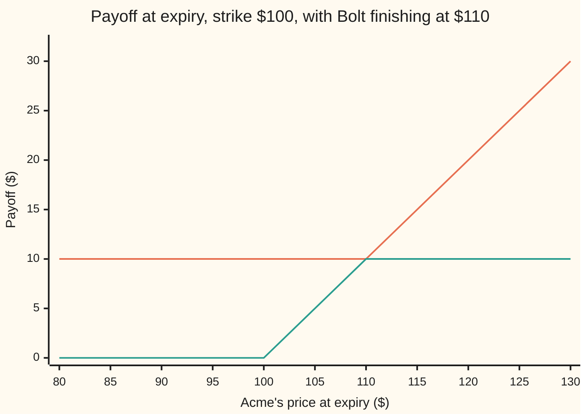
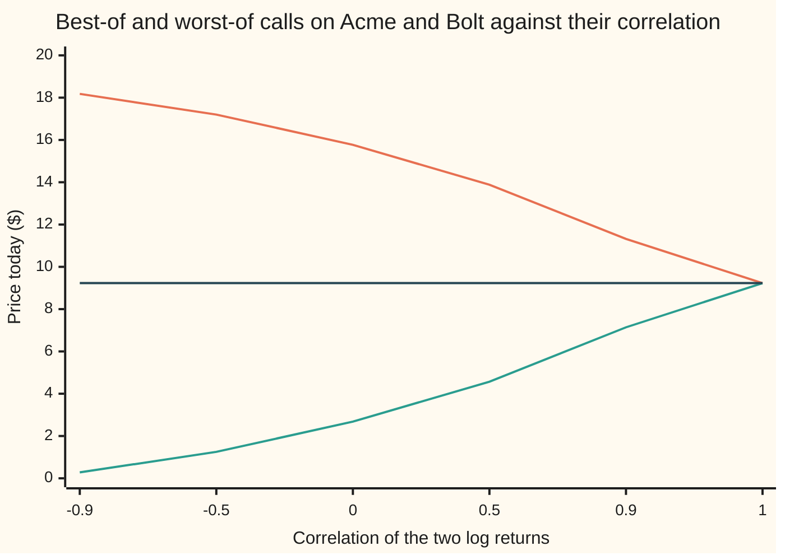

# Rainbow options: pay on the best or the worst of several shares, and the correlation sign flips between them

Financial mathematics → Many underlyings - exchange, spread, basket and rainbow → Options on the better or the worse share → Rainbow options

---

## General Overview

Two shares, Acme and Bolt, each trade at $100 today. Each has the house market's numbers: volatility 20 percent a year, dividend yield 2 percent, and the bank pays 5 percent. Over a year their prices tend to move together, but not in lockstep. Measured on their log returns (the log of each year's price ratio), their correlation is 0.5: halfway between moving independently and moving as one.

A one-year call on Acme struck at $100 pays whatever Acme finishes above $100. It costs $9.23. Now write a contract that looks at both shares on the last day, picks the **better** one, and pays whatever that one finishes above $100. If Acme ends at $120 and Bolt at $90, it pays $20. If Bolt ends at $130 and Acme at $105, it pays $30. The holder does not have to guess which share will win. The contract picks the winner after the fact. It costs **$13.88**.

The mirror contract picks the **worse** of the two and pays whatever that one finishes above $100. Acme at $120 and Bolt at $90 pays nothing, because the worse share, Bolt, finished below the strike. Both must clear $100 before a cent is paid. It costs **$4.57**.

Contracts that pay on the best or the worst of several prices are called **rainbow options**, one colour per share; here, the **best-of call** and the **worst-of call**. René Stulz priced the two-share case in 1982.

Correlation moves the two prices in opposite directions. When the shares move closely together, the best and the worst end near each other, and both contracts behave like a single vanilla call: at correlation 1 both cost $9.23. When the shares move apart, the best climbs away from the worst. The best-of gains and the worst-of loses. And through all of it the two prices add to the same $18.45, the price of two vanilla calls, because on every possible ending the two payoffs add to the two vanilla payoffs.

**A best-of call and a worst-of call split two vanilla calls between them; correlation decides the split, and Stulz's formula prices each piece exactly with the probabilities of two correlated bell curves.**

**What kind of fact this is:** a theorem inside the Black-Scholes model for two shares, proved on this card in Why it works; the model itself, two lognormal prices with a fixed correlation, is an assumption, not a law.

### The picture: what each contract pays

Two prices make a surface, not a line, so fix one. Say Bolt finishes the year at $110. Acme's finishing price runs left to right.



First line, the best-of call: a floor of $10 from Bolt, whatever Acme does, then a dollar per dollar once Acme passes Bolt at $110. Second line, the worst-of call: nothing until Acme clears the $100 strike, then a dollar per dollar, then capped at $10 once Acme passes Bolt and Bolt becomes the worse share. The best-of has a floor from the other share; the worst-of has a ceiling from it.

---

## The formula

Notation first. Write $S_1$ and $S_2$ for today's prices of Acme and Bolt, and $\rho$ (say "rho") for the correlation of their log returns. Write $M(a, b; \rho)$ for the chance that two standard bell-curve draws with correlation $\rho$ land below a and below b at the same time. It is the two-share version of $N(x)$, the chance that one draw lands below x, and it is built on [bivariate-normal-and-conditioning](../../09-Probability%20and%20statistics/05-Transformations%20and%20Joint%20Laws/05-bivariate-normal-and-conditioning.md).

Stulz's best-of call, the call on the maximum:

$$C_{\max} = S_1 e^{-q_1 T} M(d_1^+, d_{12}; \rho_1) + S_2 e^{-q_2 T} M(d_2^+, d_{21}; \rho_2) - K e^{-rT}\big[1 - M(-d_1^-, -d_2^-; \rho)\big]$$

**Read it aloud:** Acme, counted with the chance it is both the winner and above the strike; plus Bolt, counted the same way; minus the strike, counted with the chance that at least one share clears it.

The worst-of call, the call on the minimum:

$$C_{\min} = S_1 e^{-q_1 T} M(d_1^+, -d_{12}; -\rho_1) + S_2 e^{-q_2 T} M(d_2^+, -d_{21}; -\rho_2) - K e^{-rT} M(d_1^-, d_2^-; \rho)$$

**Read it aloud:** each share, counted with the chance it is the loser and still above the strike, minus the strike, counted with the chance that both shares clear it.

| Symbol | Plain meaning | In our example | Push it up and the answer… |
| --- | --- | --- | --- |
| $C_{\max}$, $C_{\min}$ | price today of the best-of call and of the worst-of call | $13.88; $4.57 | is the answer |
| $S_1$, $S_2$ | today's prices of Acme and Bolt | $100 each | best-of and worst-of both rise |
| $K$ | the strike the chosen share is compared with | $100 | both fall |
| $T$ | life of the contract, in years | 1 | both rise |
| $r$ | the bank rate, continuously compounded; $e^{-rT}$ discounts a dollar due at T | 5% | both rise, a little |
| $q_1$, $q_2$ | dividend yields of the two shares; $e^{-qT}$ is the dividend drag | 2% each | both fall |
| $\sigma_1$, $\sigma_2$ | volatilities: the spread of each share's yearly log return | 20% each | best-of rises strongly; worst-of rises less |
| $\rho$ | correlation of the two log returns, between −1 and 1 | 0.5 | best-of falls; worst-of rises |
| $\sigma_X$ | volatility of the ratio of the two prices, $\sqrt{\sigma_1^2 + \sigma_2^2 - 2\rho\sigma_1\sigma_2}$ | 0.20 | — |
| $d_1^+$, $d_1^-$, $d_2^+$, $d_2^-$ | each share's Black-Scholes distances from the strike, counted in share and in cash | 0.25; 0.05 | — |
| $d_{12}$, $d_{21}$, $\rho_1$, $\rho_2$ | the distances for "Acme beats Bolt" and "Bolt beats Acme", and the correlations between winning and clearing the strike | 0.10; 0.5 | — |
| $M$, $N$, $Z_1$, $Z_2$ | chance two correlated bell-curve draws both land low; chance one draw lands low; the two standardised draws | M values below | — |

The helper quantities, each one line of plain words:

$$d_i^+ = \frac{\ln(S_i/K) + (r - q_i + \tfrac12\sigma_i^2)T}{\sigma_i\sqrt{T}}, \qquad d_i^- = d_i^+ - \sigma_i\sqrt{T}$$

These are each share's own $d_1$ and $d_2$ from the [black-scholes-call](../08-The%20Black-Scholes%20call%20and%20put/01-black-scholes-call.md) card, with i standing for 1 or 2: how far the share must travel to clear the strike, counted in its own wiggles. One wiggle is $\sigma_i\sqrt{T}$, the standard deviation of the share's log return over the contract's life.

$$d_{12} = \frac{\ln(S_1/S_2) + (q_2 - q_1 + \tfrac12\sigma_X^2)T}{\sigma_X\sqrt{T}}, \qquad d_{21} = \frac{\ln(S_2/S_1) + (q_1 - q_2 + \tfrac12\sigma_X^2)T}{\sigma_X\sqrt{T}}$$

These are the distances from the [exchange-option-margrabe](01-exchange-option-margrabe.md) card: how far Acme must travel to beat Bolt, counted in wiggles of the ratio between them.

$$\rho_1 = \frac{\sigma_1 - \rho\,\sigma_2}{\sigma_X}, \qquad \rho_2 = \frac{\sigma_2 - \rho\,\sigma_1}{\sigma_X}$$

These are the correlations between "this share clears the strike" and "this share is the winner". They are high when the other share is calm or closely tied, because then clearing the strike and winning tend to happen together.

### When it holds

- **Both log prices bell-curved, with constant volatilities.** With a volatility smile on either share, each share's strike-clearing chance is off, and the error is roughly each share's vega times its volatility error.
- **One fixed correlation for the whole year.** Real correlations move, and tend to rise in sell-offs. A worst-of call priced at 0.5 is worth $7.14 at 0.9, so its seller has lost the difference; near 0.5 each 0.01 of correlation moves it about 4.6 cents.
- **European exercise, one look at the end.** A contract that checks the best share along the way, or that can be exercised early, is a different payoff.
- **Both prices in the same currency.** A best-of across currencies needs the exchange rate's own volatility and its correlation with each share, the quanto adjustment.
- **Two shares.** For three or more, Johnson (1987) runs the same argument in higher dimensions; desks simulate.

---

## Why it works

### Step 0: split the payoff by who wins, then price each piece in its own units

At expiry the best-of pays $\max(\max(S_{1,T}, S_{2,T}) - K, 0)$, where $S_{1,T}$ and $S_{2,T}$ are the two prices on the last day. Break it into three pieces with light switches, brackets that are 1 when a statement is true and 0 when not:

- receive Acme, in the endings where Acme is the winner and above K;
- receive Bolt, in the endings where Bolt is the winner and above K;
- hand over K, in the endings where at least one share is above K.

Each piece is priced the way the [black-scholes-call](../08-The%20Black-Scholes%20call%20and%20put/01-black-scholes-call.md) card priced its two halves. Work in the pretend world where every asset grows at the bank rate: each log price is bell-curved, and the two bell curves are tied by the correlation $\rho$. A cash piece is the discounted chance of its event. A share piece is the discounted share times the chance of its event, counted in units of that share, which slides the bell curves before the chance is taken. Only the volatilities and the correlation enter; nothing predicts the market.

### Step 1: the cash piece

In the pretend world, Acme finishes above K exactly when a standard bell-curve draw $Z_1$ lands above $-d_1^-$. Likewise Bolt with $Z_2$ and $-d_2^-$. The two draws have correlation $\rho$, because they are the standardised log returns.

"At least one above K" is the opposite of "both below K". Both below K means $Z_1 < -d_1^-$ and $Z_2 < -d_2^-$ together, which has chance $M(-d_1^-, -d_2^-; \rho)$. For Acme and Bolt that is 0.3136. So the best-of's cash piece is $K e^{-rT}[1 - M(-d_1^-, -d_2^-; \rho)]$.

The worst-of hands over K only when the worse share clears it, which means both do: chance $M(d_1^-, d_2^-; \rho)$, 0.3535 here.

### Step 2: the Acme piece, counted in Acme shares

The holder receives Acme in the endings where two things hold: Acme is above K, and Acme beats Bolt. Counting in units of Acme shares weights each ending by what Acme is worth there. As on the Black-Scholes card, that slides every bell curve tied to Acme by one wiggle of Acme, $\sigma_1\sqrt{T}$.

Under that weighting:

- Acme above K has chance $N(d_1^+)$, exactly as in the one-share formula.
- Acme beats Bolt means the ratio $S_{1,T}/S_{2,T}$ ends above 1. That ratio is itself lognormal with volatility $\sigma_X$, and counted in Acme shares its chance of ending above 1 is $N(d_{12})$. This is the exchange option's event, and it is why the exchange card's distance appears here.
- The two events are correlated. The log of Acme and the log of the ratio share Acme's own randomness, and their correlation works out to $\rho_1 = (\sigma_1 - \rho\sigma_2)/\sigma_X$.

So the chance of both is $M(d_1^+, d_{12}; \rho_1)$, and the Acme piece is $S_1 e^{-q_1 T} M(d_1^+, d_{12}; \rho_1)$. Bolt's piece is the same with the labels swapped.

<details>
<summary>Detailed proof: the share-counted chance and the correlation ρ1</summary>

Write the pretend-world logs as $\ln S_{i,T} = \ln S_i + (r - q_i - \tfrac12\sigma_i^2)T + \sigma_i\sqrt{T}\,Z_i$, with $Z_1, Z_2$ standard normal and correlation $\rho$.

**Counting in Acme.** The value of the claim "receive Acme on event A" is $e^{-rT}E[S_{1,T}\,1_A]$. Since $S_{1,T} = S_1 e^{(r-q_1)T} e^{\sigma_1\sqrt{T}Z_1 - \frac12\sigma_1^2 T}$, this is $S_1 e^{-q_1T}\,E[e^{\sigma_1\sqrt{T}Z_1 - \frac12\sigma_1^2T}\,1_A]$. The factor inside is a likelihood ratio: under the weighted measure, $Z_1$ has mean $\sigma_1\sqrt{T}$, and any variable correlated with $Z_1$ has its mean moved by (its covariance with $Z_1$) times $\sigma_1\sqrt{T}$. Variances and correlations do not change. So the value is $S_1 e^{-q_1T}\,P^{(1)}(A)$, the chance of A in the Acme-counted world.

**Acme above K.** $\ln S_{1,T} > \ln K$ becomes, with the shifted mean, $Z_1' > -d_1^+$, where $Z_1'$ is standard normal in the new world. Chance $N(d_1^+)$.

**Acme beats Bolt.** Let $Y = \ln(S_{1,T}/S_{2,T})$. Its random part is $\sqrt{T}(\sigma_1 Z_1 - \sigma_2 Z_2)$, with variance $\sigma_X^2 T$. In the pretend world its mean is $\ln(S_1/S_2) + (q_2 - q_1 - \tfrac12\sigma_1^2 + \tfrac12\sigma_2^2)T$. Its covariance with $\sigma_1\sqrt{T}Z_1$ is $(\sigma_1^2 - \rho\sigma_1\sigma_2)T$, so counting in Acme raises the mean by that amount. The new mean is $\ln(S_1/S_2) + (q_2 - q_1 + \tfrac12\sigma_1^2 + \tfrac12\sigma_2^2 - \rho\sigma_1\sigma_2)T = \ln(S_1/S_2) + (q_2 - q_1 + \tfrac12\sigma_X^2)T$. Standardising, $Y > 0$ has chance $N(d_{12})$.

**Their correlation.** The correlation of $Z_1$ with $(\sigma_1 Z_1 - \sigma_2 Z_2)/\sigma_X$ is $(\sigma_1 - \rho\sigma_2)/\sigma_X = \rho_1$, and it survives the change of weighting. So $P^{(1)}(\text{Acme above K and Acme beats Bolt}) = M(d_1^+, d_{12}; \rho_1)$.

**The worst-of pieces.** Receiving Acme as the loser means $Y < 0$: flip the sign of the second standardised variable. Its bound becomes $-d_{12}$ and its correlation with the first becomes $-\rho_1$, giving $M(d_1^+, -d_{12}; -\rho_1)$. The cash piece of Step 1 completes both formulas.

</details>

### Step 3: the worst-of by the same rules

The worst-of pays Acme when Acme is the loser and still above K, pays Bolt in the mirror case, and takes K when both clear it. Losing is winning with the sign flipped, so the bound $d_{12}$ becomes $-d_{12}$ and the correlation $\rho_1$ becomes $-\rho_1$. The cash chance is $M(d_1^-, d_2^-; \rho)$ from Step 1. Adding the three pieces gives the formula for $C_{\min}$.

### Step 4: the two contracts add up to two vanilla calls

On every ending, the pair (best, worst) is the pair (Acme, Bolt) in some order. So

$$\max(\text{best} - K, 0) + \max(\text{worst} - K, 0) = \max(S_{1,T} - K, 0) + \max(S_{2,T} - K, 0)$$

ending by ending. Prices are averages of payoffs, so the prices add too: $C_{\max} + C_{\min}$ is the price of a vanilla call on Acme plus one on Bolt, $18.45 here, whatever the correlation. Only one of the two formulas is needed; the other is two vanilla calls minus it. The code checks this identity against the two formulas separately.

So a best-of sits between one call and two: above $9.23, because it picks the better share with hindsight; below $18.45, because it pays only the larger gain. The $4.57 gap to two calls is exactly the worst-of.

### Step 5: why correlation moves them in opposite directions

At correlation 1, with identical inputs, Acme and Bolt end at the same price on every path. Best and worst coincide, and each contract is a vanilla call: $9.23. As the correlation falls, the two prices spread apart on the last day. The best climbs away from the worst. The best-of gains what the worst-of loses, because their sum is pinned at $18.45.



First line, the best-of call, falling from $18.18 at correlation −0.9 to $9.23 at 1. Second line, the worst-of, rising from $0.28 to $9.23. Third line, one vanilla call. The two curves mirror each other about it, because they always add to $18.45.

The shape follows from $\sigma_X$, the volatility of the ratio. It is 0 at correlation 1 and grows as the correlation falls. The more the ratio wiggles, the further apart the two shares end, and the more the hindsight choice is worth. So a buyer of a best-of is **short correlation**, meaning the position loses value when correlation rises, and a buyer of a worst-of is **long correlation**, gaining when it rises.

Two routes check the formula without using it. At a strike near zero the best-of pays the larger share outright, and the larger of two is one share plus the option to swap it for the other: $\max(S_{1,T}, S_{2,T}) = S_{2,T} + \max(S_{1,T} - S_{2,T}, 0)$. So the best-of at zero strike must equal Bolt's discounted price, $98.02, plus the Margrabe exchange option, $7.81: $105.83, which the formula reproduces. And simulation, as on [basket-options](03-basket-options.md), draws the two correlated prices directly and averages the payoffs. The code takes both.

---

## Worked numbers, by hand

Acme and Bolt: $S_1 = S_2 = 100$, K = 100, r = 5%, $q_1 = q_2 = 2\%$, $\sigma_1 = \sigma_2 = 20\%$, $\rho = 0.5$, T = 1 year. The M values come from a two-dimensional bell-curve table or from the code.

| Step | Arithmetic | Value |
| --- | --- | --- |
| ratio volatility, $\sigma_X$ | √(0.04 + 0.04 − 2 × 0.5 × 0.04) | 0.20 |
| $d_1^+ = d_2^+$ | (0 + (0.05 − 0.02 + 0.02) × 1) / 0.20 | 0.25 |
| $d_1^- = d_2^-$ | 0.25 − 0.20 | 0.05 |
| $d_{12} = d_{21}$ | (0 + (0 + 0.02) × 1) / 0.20 | 0.10 |
| $\rho_1 = \rho_2$ | (0.20 − 0.5 × 0.20) / 0.20 | 0.5 |
| Acme wins and clears K, counted in Acme | M(0.25, 0.10; 0.5) | 0.4039 |
| neither share clears K | M(−0.05, −0.05; 0.5) | 0.3136 |
| discounted share and strike | 100 × e^−0.02; 100 × e^−0.05 | $98.02; $95.12 |
| best-of: two share pieces | 2 × 98.02 × 0.4039 | $79.17 |
| best-of: cash piece | 95.12 × (1 − 0.3136) | $65.29 |
| **best-of call** | 79.17 − 65.29 | **$13.88** |
| Acme loses but clears K, counted in Acme | M(0.25, −0.10; −0.5) | 0.1948 |
| both clear K | M(0.05, 0.05; 0.5) | 0.3535 |
| worst-of: two share pieces | 2 × 98.02 × 0.1948 | $38.20 |
| worst-of: cash piece | 95.12 × 0.3535 | $33.63 |
| **worst-of call** | 38.20 − 33.63 | **$4.57** |
| check: best + worst | 13.88 + 4.57 | $18.45 = 2 × $9.23 |

The cash pieces show where the difference comes from: the best-of skips the strike only when neither share clears it, chance 0.3136; the worst-of pays it only when both clear it, chance 0.3535.

### What breaks if you drop a piece

Same contracts, right answers $13.88 and $4.57. Every wrong number below is printed by both checks.

| Mistake | Comes out at | What went wrong |
| --- | --- | --- |
| Price the best-of as two vanilla calls | $18.45 | Two calls pay both gains; the best-of pays one. The excess is the worst-of. |
| Price the best-of as one vanilla call | $9.23 | Ignores the hindsight choice between the shares |
| Assume the shares are independent, correlation 0 | best $15.77, worst $2.68 | The correlation sets the split; at 0.5 part of the best-of's value belongs to the worst-of |
| Use M(−d1−, −d2−; ρ) for the best-of's cash chance, not 1 minus it | $49.34 | That is the chance neither share clears K, the opposite of the best-of's exercise event |

### The Greeks

Sensitivities by bumping the formula; each delta is checked against its closed form, $e^{-q_1T}$ times the share-counted chance. By symmetry Bolt's numbers equal Acme's.

| Greek | Plain meaning | Best-of | Worst-of |
| --- | --- | --- | --- |
| delta to Acme | dollars gained per $1 on Acme | 0.3959 | 0.1910 |
| vega to Acme | dollars per one point of Acme's volatility | 0.3002 | 0.0788 |
| correlation sensitivity | dollars per 0.01 rise in ρ | −0.0460 | +0.0460 |

The two deltas to Acme add to the vanilla call's delta, as Step 4 says they must. The correlation sensitivities are equal and opposite for the same reason. Their measurement, and backing a correlation out of traded prices, belong to [correlation-greeks-and-implied-correlation](05-correlation-greeks-and-implied-correlation.md).

---

## Code, from first principles, and it actually runs

Both programs price the two contracts five ways. Road 1 is Stulz's formula, with the two-share chance $M$ computed by Simpson's rule: integrate the bell-curve height of the first draw times the one-share chance of the second, given the first. Road 2 simulates 200,000 pairs of correlated prices and averages the payoffs, with a standard error. Road 3 integrates the payoffs directly over a 601 by 601 grid of the two-share bell surface, with no M and no d anywhere; it also prices the correlation sweep, including correlation 1, where the formula's ratio volatility is zero. Road 4 checks best plus worst against two vanilla calls. Road 5 checks the best-of at a near-zero strike against one share plus the Margrabe exchange option. The one-share bell-curve area is a written-out series; the random numbers come from splitmix64 with the Box-Muller transform. Six asserts. Each of three deliberate breaks trips at least one: dropping the minus sign on $\rho_1$ in the worst-of, dropping the "1 −" from the cash chance, or setting the both-clear correlation to zero.

### Python

```python
# Rainbow options: best-of-two and worst-of-two calls -- the check behind the card.
# Standard library only. The normal CDF is a written-out series, the two-share CDF is
# Simpson's rule, the random numbers are splitmix64 + Box-Muller. Nothing imported knows the answer.
from math import exp, log, sqrt, pi, cos

S1 = S2 = 100.0; K = 100.0; r = 0.05; q = 0.02; sig = 0.20; rho = 0.5; T = 1.0

def phi(x): return exp(-0.5 * x * x) / sqrt(2.0 * pi)
def N(x):                                    # 1/2 + phi(x) (x + x^3/3 + x^5/15 + ...)
    if x < -8.0: return 0.0
    if x > 8.0: return 1.0
    s = t = x; k = 1
    while abs(t) > 1e-17 * abs(s):
        t *= x * x / (2 * k + 1); s += t; k += 1
    return 0.5 + phi(x) * s

def M(a, b, c, n=2000):                      # P(X < a, Y < b), X and Y standard normal, correlation c
    lo, hi = -8.0, min(a, 8.0)
    if hi <= lo: return 0.0
    h, w = (hi - lo) / n, sqrt(1.0 - c * c)
    f = lambda x: phi(x) * N((b - c * x) / w)
    tot = f(lo) + f(hi) + sum((4 if i % 2 else 2) * f(lo + i * h) for i in range(1, n))
    return tot * h / 3.0

def bs_call(S, K, r, q, s, T):
    d1 = (log(S / K) + (r - q + 0.5 * s * s) * T) / (s * sqrt(T))
    return S * exp(-q * T) * N(d1) - K * exp(-r * T) * N(d1 - s * sqrt(T))

def stulz(S1, S2, K, r, q1, q2, s1, s2, rho, T, parts=False):
    rt = sqrt(T)
    sx = sqrt(s1 * s1 + s2 * s2 - 2.0 * rho * s1 * s2)          # volatility of the ratio S1/S2
    d1p = (log(S1 / K) + (r - q1 + 0.5 * s1 * s1) * T) / (s1 * rt); d1m = d1p - s1 * rt
    d2p = (log(S2 / K) + (r - q2 + 0.5 * s2 * s2) * T) / (s2 * rt); d2m = d2p - s2 * rt
    d12 = (log(S1 / S2) + (q2 - q1 + 0.5 * sx * sx) * T) / (sx * rt)
    d21 = (log(S2 / S1) + (q1 - q2 + 0.5 * sx * sx) * T) / (sx * rt)
    r1, r2 = (s1 - rho * s2) / sx, (s2 - rho * s1) / sx
    A1, A2, D = S1 * exp(-q1 * T), S2 * exp(-q2 * T), K * exp(-r * T)
    mb1, mb2, mcash = M(d1p, d12, r1), M(d2p, d21, r2), M(-d1m, -d2m, rho)
    mw1, mw2, mboth = M(d1p, -d12, -r1), M(d2p, -d21, -r2), M(d1m, d2m, rho)
    best = A1 * mb1 + A2 * mb2 - D * (1.0 - mcash)
    worst = A1 * mw1 + A2 * mw2 - D * mboth
    if parts: return dict(sx=sx, d1p=d1p, d1m=d1m, d12=d12, r1=r1, mb1=mb1, mcash=mcash, mw1=mw1,
                          mboth=mboth, A1=A1, D=D, best=best, worst=worst, wrongcash=A1 * mb1 + A2 * mb2 - D * mcash)
    return best, worst

def grid(rho, n=600):                        # Road 3: Simpson over the two-share bell surface, payoff by payoff
    L, h, c = 8.0, 16.0 / n, sqrt(1.0 - rho * rho)
    wt = [1.0 if i in (0, n) else (4.0 if i % 2 else 2.0) for i in range(n + 1)]
    g = (r - q - 0.5 * sig * sig) * T
    X = [S1 * exp(g + sig * sqrt(T) * (-L + i * h)) for i in range(n + 1)]
    b = w_ = 0.0
    for i in range(n + 1):
        z = -L + i * h; pz = wt[i] * phi(z)
        for j in range(n + 1):
            y = -L + j * h
            x2 = S2 * exp(g + sig * sqrt(T) * (rho * z + c * y))
            k = pz * wt[j] * phi(y)
            hi, lo = (X[i], x2) if X[i] > x2 else (x2, X[i])
            if hi > K: b += k * (hi - K)
            if lo > K: w_ += k * (lo - K)
    f = exp(-r * T) * h * h / 9.0
    return b * f, w_ * f

state = 20260924
def u01():                                   # splitmix64, top 53 bits, never 0
    global state
    state = (state + 0x9E3779B97F4A7C15) & 0xFFFFFFFFFFFFFFFF
    z = state
    z = ((z ^ (z >> 30)) * 0xBF58476D1CE4E5B9) & 0xFFFFFFFFFFFFFFFF
    z = ((z ^ (z >> 27)) * 0x94D049BB133111EB) & 0xFFFFFFFFFFFFFFFF
    return ((z ^ (z >> 31)) >> 11) * 2.0 ** -53 + 2.0 ** -54
def mc(rho, paths=200000):                   # Road 2: simulate both shares, correlated through rho
    g, v, c, df = (r - q - 0.5 * sig * sig) * T, sig * sqrt(T), sqrt(1.0 - rho * rho), exp(-r * T)
    sb = sb2 = sw = sw2 = 0.0
    for _ in range(paths):
        z1 = sqrt(-2.0 * log(u01())) * cos(2.0 * pi * u01())
        z2 = rho * z1 + c * sqrt(-2.0 * log(u01())) * cos(2.0 * pi * u01())
        a, b = S1 * exp(g + v * z1), S2 * exp(g + v * z2)
        pb, pw = df * max(max(a, b) - K, 0.0), df * max(min(a, b) - K, 0.0)
        sb += pb; sb2 += pb * pb; sw += pw; sw2 += pw * pw
    mb, mw = sb / paths, sw / paths
    return mb, sqrt((sb2 / paths - mb * mb) / paths), mw, sqrt((sw2 / paths - mw * mw) / paths)

P = stulz(S1, S2, K, r, q, q, sig, sig, rho, T, parts=True)
best, worst = P["best"], P["worst"]
C = bs_call(S1, K, r, q, sig, T)
gb, gw = grid(rho)
mb, seb, mw, sew = mc(rho)
sx0 = sqrt(2.0) * sig * sqrt(1.0 - rho)
margrabe = S1 * exp(-q * T) * (N(0.5 * sx0) - N(-0.5 * sx0))
bestK0 = stulz(S1, S2, 1e-9, r, q, q, sig, sig, rho, T)[0]
e = 1e-4
def bw(**kw):
    a = dict(S1=S1, S2=S2, K=K, r=r, q1=q, q2=q, s1=sig, s2=sig, rho=rho, T=T); a.update(kw)
    return stulz(**a)
up, dn = bw(S1=S1 + 0.01), bw(S1=S1 - 0.01)
dlt = [(up[i] - dn[i]) / 0.02 for i in (0, 1)]
vup, vdn = bw(s1=sig + e), bw(s1=sig - e)
cup, cdn = bw(rho=rho + e), bw(rho=rho - e)
rows = [("sigma_X, vol of S1/S2", P["sx"]), ("d1+ = d2+", P["d1p"]), ("d1- = d2-", P["d1m"]),
        ("d12 = d21", P["d12"]), ("rho1 = rho2", P["r1"]), ("M(d1+, d12; rho1)", P["mb1"]),
        ("M(-d1-, -d2-; rho)  neither ends above K", P["mcash"]), ("M(d1+, -d12; -rho1)", P["mw1"]),
        ("M(d1-, d2-; rho)  both end above K", P["mboth"]), ("S e^-qT", P["A1"]), ("K e^-rT", P["D"]),
        ("best: share terms", best + P["D"] * (1 - P["mcash"])), ("best: cash term", P["D"] * (1 - P["mcash"])),
        ("worst: share terms", worst + P["D"] * P["mboth"]), ("worst: cash term", P["D"] * P["mboth"]),
        ("1 best-of, Stulz formula", best), ("1 worst-of, Stulz formula", worst),
        ("2 best-of, simulation", mb), ("  standard error", seb), ("2 worst-of, simulation", mw), ("  standard error", sew),
        ("3 best-of, Simpson grid", gb), ("3 worst-of, Simpson grid", gw),
        ("vanilla call on one share", C), ("4 best + worst", best + worst), ("  two vanilla calls", 2 * C),
        ("5 best-of, K -> 0", bestK0), ("  S e^-qT + Margrabe", S2 * exp(-q * T) + margrabe), ("  Margrabe exchange", margrabe),
        ("delta S1, best-of, bump", dlt[0]), ("  e^-qT M(d1+, d12; rho1)", exp(-q * T) * P["mb1"]),
        ("delta S1, worst-of, bump", dlt[1]), ("  e^-qT M(d1+, -d12; -rho1)", exp(-q * T) * P["mw1"]),
        ("vega S1 per vol point, best", (vup[0] - vdn[0]) / (2 * e) / 100), ("vega S1 per vol point, worst", (vup[1] - vdn[1]) / (2 * e) / 100),
        ("per 0.01 of rho, best", (cup[0] - cdn[0]) / (2 * e) / 100), ("per 0.01 of rho, worst", (cup[1] - cdn[1]) / (2 * e) / 100),
        ("wrong: 1 - M dropped from cash", P["wrongcash"]),
        ("try: sigma2 = 0.40, best", bw(s2=0.40)[0]), ("try: sigma2 = 0.40, worst", bw(s2=0.40)[1]),
        ("try: K = 120, best", bw(K=120.0)[0]), ("try: K = 120, worst", bw(K=120.0)[1])]
for name, v in rows: print(f"{name:<40} {v:>12.6f}")
sweep = [-0.9, -0.5, 0.0, 0.5, 0.9, 1.0]
line = [grid(c) for c in sweep]
print("chart, rho       " + " ".join(f"{c:6.2f}" for c in sweep))
print("chart, best-of   " + " ".join(f"{x[0]:6.2f}" for x in line))
print("chart, worst-of  " + " ".join(f"{x[1]:6.2f}" for x in line))
print("formula, best    " + " ".join(f"{bw(rho=c)[0]:6.2f}" for c in sweep[:-1]))
print("formula, worst   " + " ".join(f"{bw(rho=c)[1]:6.2f}" for c in sweep[:-1]))
xs = [80.0 + 5.0 * i for i in range(11)]
print("payoff, S1 at T  " + " ".join(f"{x:6.0f}" for x in xs))
print("payoff, best     " + " ".join(f"{max(max(x, 110.0) - K, 0.0):6.2f}" for x in xs))
print("payoff, worst    " + " ".join(f"{max(min(x, 110.0) - K, 0.0):6.2f}" for x in xs))

assert abs(gb - best) < 2e-3 and abs(gw - worst) < 2e-3, "grid road must land on the formula"
assert abs(mb - best) < 3 * seb and abs(mw - worst) < 3 * sew, "simulation within three standard errors"
assert abs(best + worst - 2 * bs_call(S1, K, r, q, sig, T)) < 1e-6, "best + worst = two vanilla calls"
assert abs(bestK0 - (S2 * exp(-q * T) + margrabe)) < 1e-6, "best-of at zero strike = share + exchange option"
assert abs(dlt[0] - exp(-q * T) * P["mb1"]) < 1e-5, "bumped delta vs its formula"
assert abs(line[-1][0] - C) < 2e-3 and abs(line[-1][1] - C) < 2e-3, "at rho = 1 both collapse to the vanilla"
print("ALL CHECKS PASS")
```

**Ran 2026-09-24 on macOS, Python 3.14.6, standard library only. All checks passed. Output, pasted from the run:**

```
sigma_X, vol of S1/S2                        0.200000
d1+ = d2+                                    0.250000
d1- = d2-                                    0.050000
d12 = d21                                    0.100000
rho1 = rho2                                  0.500000
M(d1+, d12; rho1)                            0.403860
M(-d1-, -d2-; rho)  neither ends above K     0.313624
M(d1+, -d12; -rho1)                          0.194846
M(d1-, d2-; rho)  both end above K           0.353502
S e^-qT                                     98.019867
K e^-rT                                     95.122942
best: share terms                           79.172629
best: cash term                             65.290096
worst: share terms                          38.197600
worst: cash term                            33.626122
1 best-of, Stulz formula                    13.882533
1 worst-of, Stulz formula                    4.571478
2 best-of, simulation                       13.877978
  standard error                             0.035923
2 worst-of, simulation                       4.573746
  standard error                             0.020334
3 best-of, Simpson grid                     13.882621
3 worst-of, Simpson grid                     4.571572
vanilla call on one share                    9.227006
4 best + worst                              18.454011
  two vanilla calls                         18.454011
5 best-of, K -> 0                          105.827706
  S e^-qT + Margrabe                       105.827706
  Margrabe exchange                          7.807839
delta S1, best-of, bump                      0.395863
  e^-qT M(d1+, d12; rho1)                    0.395863
delta S1, worst-of, bump                     0.190988
  e^-qT M(d1+, -d12; -rho1)                  0.190988
vega S1 per vol point, best                  0.300180
vega S1 per vol point, worst                 0.078831
per 0.01 of rho, best                       -0.046016
per 0.01 of rho, worst                       0.046016
wrong: 1 - M dropped from cash              49.339783
try: sigma2 = 0.40, best                    20.773391
try: sigma2 = 0.40, worst                    5.252980
try: K = 120, best                           4.576416
try: K = 120, worst                          0.847136
chart, rho        -0.90  -0.50   0.00   0.50   0.90   1.00
chart, best-of    18.18  17.20  15.77  13.88  11.32   9.23
chart, worst-of    0.28   1.25   2.68   4.57   7.14   9.23
formula, best     18.18  17.20  15.77  13.88  11.32
formula, worst     0.28   1.25   2.68   4.57   7.14
payoff, S1 at T      80     85     90     95    100    105    110    115    120    125    130
payoff, best      10.00  10.00  10.00  10.00  10.00  10.00  10.00  15.00  20.00  25.00  30.00
payoff, worst      0.00   0.00   0.00   0.00   0.00   5.00  10.00  10.00  10.00  10.00  10.00
ALL CHECKS PASS
```

Five roads, one pair of prices. The grid, which never sees the formula, lands within a hundredth of a cent of it; the simulation lands within one standard error; the sum and the zero-strike check agree to six decimals.

### Rust

The same five roads, the same generator and seed. No crates.

```rust
// Rainbow options: best-of-two and worst-of-two calls -- the check behind the card.
// std only. The normal CDF is a written-out series, the two-share CDF is Simpson's rule,
// the random numbers are splitmix64 + Box-Muller. Nothing imported knows the answer.
use std::f64::consts::PI;

const S1: f64 = 100.0; const S2: f64 = 100.0; const K: f64 = 100.0;
const R: f64 = 0.05; const Q: f64 = 0.02; const SIG: f64 = 0.20; const RHO: f64 = 0.5; const T: f64 = 1.0;

fn phi(x: f64) -> f64 { (-0.5 * x * x).exp() / (2.0 * PI).sqrt() }
fn n_cdf(x: f64) -> f64 { // 1/2 + phi(x) (x + x^3/3 + x^5/15 + ...)
    if x < -8.0 { return 0.0; }
    if x > 8.0 { return 1.0; }
    let (mut s, mut t, mut k) = (x, x, 1.0);
    while t.abs() > 1e-17 * s.abs() { t *= x * x / (2.0 * k + 1.0); s += t; k += 1.0; }
    0.5 + phi(x) * s
}
fn m2(a: f64, b: f64, c: f64) -> f64 { // P(X < a, Y < b), standard normals with correlation c
    let n = 2000;
    let (lo, hi) = (-8.0, a.min(8.0));
    if hi <= lo { return 0.0; }
    let (h, w) = ((hi - lo) / n as f64, (1.0 - c * c).sqrt());
    let f = |x: f64| phi(x) * n_cdf((b - c * x) / w);
    let mut acc = 0.0;
    for i in 1..n { acc += if i % 2 == 1 { 4.0 } else { 2.0 } * f(lo + i as f64 * h); }
    (f(lo) + f(hi) + acc) * h / 3.0
}
fn bs_call(s: f64, k: f64, r: f64, q: f64, v: f64, t: f64) -> f64 {
    let d1 = ((s / k).ln() + (r - q + 0.5 * v * v) * t) / (v * t.sqrt());
    s * (-q * t).exp() * n_cdf(d1) - k * (-r * t).exp() * n_cdf(d1 - v * t.sqrt())
}
struct Parts { sx: f64, d1p: f64, d1m: f64, d12: f64, r1: f64, mb1: f64, mcash: f64, mw1: f64,
               mboth: f64, a1: f64, d: f64, best: f64, worst: f64, wrongcash: f64 }
fn stulz(s1: f64, s2: f64, k: f64, r: f64, q1: f64, q2: f64, v1: f64, v2: f64, rho: f64, t: f64) -> Parts {
    let rt = t.sqrt();
    let sx = (v1 * v1 + v2 * v2 - 2.0 * rho * v1 * v2).sqrt(); // volatility of the ratio S1/S2
    let d1p = ((s1 / k).ln() + (r - q1 + 0.5 * v1 * v1) * t) / (v1 * rt); let d1m = d1p - v1 * rt;
    let d2p = ((s2 / k).ln() + (r - q2 + 0.5 * v2 * v2) * t) / (v2 * rt); let d2m = d2p - v2 * rt;
    let d12 = ((s1 / s2).ln() + (q2 - q1 + 0.5 * sx * sx) * t) / (sx * rt);
    let d21 = ((s2 / s1).ln() + (q1 - q2 + 0.5 * sx * sx) * t) / (sx * rt);
    let (r1, r2) = ((v1 - rho * v2) / sx, (v2 - rho * v1) / sx);
    let (a1, a2, d) = (s1 * (-q1 * t).exp(), s2 * (-q2 * t).exp(), k * (-r * t).exp());
    let (mb1, mb2, mcash) = (m2(d1p, d12, r1), m2(d2p, d21, r2), m2(-d1m, -d2m, rho));
    let (mw1, mw2, mboth) = (m2(d1p, -d12, -r1), m2(d2p, -d21, -r2), m2(d1m, d2m, rho));
    let best = a1 * mb1 + a2 * mb2 - d * (1.0 - mcash);
    let worst = a1 * mw1 + a2 * mw2 - d * mboth;
    Parts { sx, d1p, d1m, d12, r1, mb1, mcash, mw1, mboth, a1, d, best, worst, wrongcash: a1 * mb1 + a2 * mb2 - d * mcash }
}
fn grid(rho: f64) -> (f64, f64) { // Road 3: Simpson over the two-share bell surface, payoff by payoff
    let n = 600usize;
    let (l, h, c) = (8.0, 16.0 / n as f64, (1.0 - rho * rho).sqrt());
    let wt: Vec<f64> = (0..=n).map(|i| if i == 0 || i == n { 1.0 } else if i % 2 == 1 { 4.0 } else { 2.0 }).collect();
    let g = (R - Q - 0.5 * SIG * SIG) * T;
    let xs: Vec<f64> = (0..=n).map(|i| S1 * (g + SIG * T.sqrt() * (-l + i as f64 * h)).exp()).collect();
    let (mut b, mut w) = (0.0, 0.0);
    for i in 0..=n {
        let z = -l + i as f64 * h; let pz = wt[i] * phi(z);
        for j in 0..=n {
            let y = -l + j as f64 * h;
            let x2 = S2 * (g + SIG * T.sqrt() * (rho * z + c * y)).exp();
            let k = pz * wt[j] * phi(y);
            let (hi, lo) = if xs[i] > x2 { (xs[i], x2) } else { (x2, xs[i]) };
            if hi > K { b += k * (hi - K); }
            if lo > K { w += k * (lo - K); }
        }
    }
    let f = (-R * T).exp() * h * h / 9.0;
    (b * f, w * f)
}
struct Rng(u64);
impl Rng {
    fn u01(&mut self) -> f64 { // splitmix64, top 53 bits, never 0
        self.0 = self.0.wrapping_add(0x9E3779B97F4A7C15);
        let mut z = self.0;
        z = (z ^ (z >> 30)).wrapping_mul(0xBF58476D1CE4E5B9);
        z = (z ^ (z >> 27)).wrapping_mul(0x94D049BB133111EB);
        ((z ^ (z >> 31)) >> 11) as f64 * 2f64.powi(-53) + 2f64.powi(-54)
    }
}
fn mc(rho: f64, paths: usize, rng: &mut Rng) -> (f64, f64, f64, f64) { // Road 2: simulate both shares
    let (g, v, c, df) = ((R - Q - 0.5 * SIG * SIG) * T, SIG * T.sqrt(), (1.0 - rho * rho).sqrt(), (-R * T).exp());
    let (mut sb, mut sb2, mut sw, mut sw2) = (0.0, 0.0, 0.0, 0.0);
    for _ in 0..paths {
        let z1 = (-2.0 * rng.u01().ln()).sqrt() * (2.0 * PI * rng.u01()).cos();
        let z2 = rho * z1 + c * (-2.0 * rng.u01().ln()).sqrt() * (2.0 * PI * rng.u01()).cos();
        let (a, b) = (S1 * (g + v * z1).exp(), S2 * (g + v * z2).exp());
        let (pb, pw) = (df * (a.max(b) - K).max(0.0), df * (a.min(b) - K).max(0.0));
        sb += pb; sb2 += pb * pb; sw += pw; sw2 += pw * pw;
    }
    let p = paths as f64; let (mb, mw) = (sb / p, sw / p);
    (mb, ((sb2 / p - mb * mb) / p).sqrt(), mw, ((sw2 / p - mw * mw) / p).sqrt())
}
fn bw(s1: f64, k: f64, v1: f64, v2: f64, rho: f64) -> (f64, f64) {
    let p = stulz(s1, S2, k, R, Q, Q, v1, v2, rho, T); (p.best, p.worst)
}
fn row(v: &[f64]) -> String { v.iter().map(|x| format!("{:6.2}", x)).collect::<Vec<_>>().join(" ") }

fn main() {
    let p = stulz(S1, S2, K, R, Q, Q, SIG, SIG, RHO, T);
    let (best, worst) = (p.best, p.worst);
    let c = bs_call(S1, K, R, Q, SIG, T);
    let (gb, gw) = grid(RHO);
    let (mb, seb, mw, sew) = mc(RHO, 200000, &mut Rng(20260924));
    let sx0 = 2f64.sqrt() * SIG * (1.0 - RHO).sqrt();
    let margrabe = S1 * (-Q * T).exp() * (n_cdf(0.5 * sx0) - n_cdf(-0.5 * sx0));
    let best_k0 = bw(S1, 1e-9, SIG, SIG, RHO).0;
    let e = 1e-4;
    let (up, dn) = (bw(S1 + 0.01, K, SIG, SIG, RHO), bw(S1 - 0.01, K, SIG, SIG, RHO));
    let dlt = [(up.0 - dn.0) / 0.02, (up.1 - dn.1) / 0.02];
    let (vup, vdn) = (bw(S1, K, SIG + e, SIG, RHO), bw(S1, K, SIG - e, SIG, RHO));
    let (cup, cdn) = (bw(S1, K, SIG, SIG, RHO + e), bw(S1, K, SIG, SIG, RHO - e));
    let (s40, k120) = (bw(S1, K, SIG, 0.40, RHO), bw(S1, 120.0, SIG, SIG, RHO));
    let rows: Vec<(&str, f64)> = vec![("sigma_X, vol of S1/S2", p.sx), ("d1+ = d2+", p.d1p), ("d1- = d2-", p.d1m),
        ("d12 = d21", p.d12), ("rho1 = rho2", p.r1), ("M(d1+, d12; rho1)", p.mb1),
        ("M(-d1-, -d2-; rho)  neither ends above K", p.mcash), ("M(d1+, -d12; -rho1)", p.mw1),
        ("M(d1-, d2-; rho)  both end above K", p.mboth), ("S e^-qT", p.a1), ("K e^-rT", p.d),
        ("best: share terms", best + p.d * (1.0 - p.mcash)), ("best: cash term", p.d * (1.0 - p.mcash)),
        ("worst: share terms", worst + p.d * p.mboth), ("worst: cash term", p.d * p.mboth),
        ("1 best-of, Stulz formula", best), ("1 worst-of, Stulz formula", worst),
        ("2 best-of, simulation", mb), ("  standard error", seb), ("2 worst-of, simulation", mw), ("  standard error", sew),
        ("3 best-of, Simpson grid", gb), ("3 worst-of, Simpson grid", gw),
        ("vanilla call on one share", c), ("4 best + worst", best + worst), ("  two vanilla calls", 2.0 * c),
        ("5 best-of, K -> 0", best_k0), ("  S e^-qT + Margrabe", S2 * (-Q * T).exp() + margrabe), ("  Margrabe exchange", margrabe),
        ("delta S1, best-of, bump", dlt[0]), ("  e^-qT M(d1+, d12; rho1)", (-Q * T).exp() * p.mb1),
        ("delta S1, worst-of, bump", dlt[1]), ("  e^-qT M(d1+, -d12; -rho1)", (-Q * T).exp() * p.mw1),
        ("vega S1 per vol point, best", (vup.0 - vdn.0) / (2.0 * e) / 100.0), ("vega S1 per vol point, worst", (vup.1 - vdn.1) / (2.0 * e) / 100.0),
        ("per 0.01 of rho, best", (cup.0 - cdn.0) / (2.0 * e) / 100.0), ("per 0.01 of rho, worst", (cup.1 - cdn.1) / (2.0 * e) / 100.0),
        ("wrong: 1 - M dropped from cash", p.wrongcash),
        ("try: sigma2 = 0.40, best", s40.0), ("try: sigma2 = 0.40, worst", s40.1),
        ("try: K = 120, best", k120.0), ("try: K = 120, worst", k120.1)];
    for (name, v) in &rows { println!("{:<40} {:>12.6}", name, v); }
    let sweep = [-0.9, -0.5, 0.0, 0.5, 0.9, 1.0];
    let line: Vec<(f64, f64)> = sweep.iter().map(|&r| grid(r)).collect();
    println!("chart, rho       {}", row(&sweep));
    println!("chart, best-of   {}", row(&line.iter().map(|x| x.0).collect::<Vec<_>>()));
    println!("chart, worst-of  {}", row(&line.iter().map(|x| x.1).collect::<Vec<_>>()));
    let fs: Vec<(f64, f64)> = sweep[..5].iter().map(|&r| bw(S1, K, SIG, SIG, r)).collect();
    println!("formula, best    {}", row(&fs.iter().map(|x| x.0).collect::<Vec<_>>()));
    println!("formula, worst   {}", row(&fs.iter().map(|x| x.1).collect::<Vec<_>>()));
    let xs: Vec<f64> = (0..11).map(|i| 80.0 + 5.0 * i as f64).collect();
    println!("payoff, S1 at T  {}", xs.iter().map(|x| format!("{:6.0}", x)).collect::<Vec<_>>().join(" "));
    println!("payoff, best     {}", row(&xs.iter().map(|x| (x.max(110.0) - K).max(0.0)).collect::<Vec<_>>()));
    println!("payoff, worst    {}", row(&xs.iter().map(|x| (x.min(110.0) - K).max(0.0)).collect::<Vec<_>>()));

    assert!((gb - best).abs() < 2e-3 && (gw - worst).abs() < 2e-3, "grid road must land on the formula");
    assert!((mb - best).abs() < 3.0 * seb && (mw - worst).abs() < 3.0 * sew, "simulation within three standard errors");
    assert!((best + worst - 2.0 * bs_call(S1, K, R, Q, SIG, T)).abs() < 1e-6, "best + worst = two vanilla calls");
    assert!((best_k0 - (S2 * (-Q * T).exp() + margrabe)).abs() < 1e-6, "best-of at zero strike = share + exchange option");
    assert!((dlt[0] - (-Q * T).exp() * p.mb1).abs() < 1e-5, "bumped delta vs its formula");
    assert!((line[5].0 - c).abs() < 2e-3 && (line[5].1 - c).abs() < 2e-3, "at rho = 1 both collapse to the vanilla");
    println!("ALL CHECKS PASS");
}
```

**Ran 2026-09-24 on macOS, rustc 1.98.1, no crates. All checks passed. Output, pasted from the run:**

```
sigma_X, vol of S1/S2                        0.200000
d1+ = d2+                                    0.250000
d1- = d2-                                    0.050000
d12 = d21                                    0.100000
rho1 = rho2                                  0.500000
M(d1+, d12; rho1)                            0.403860
M(-d1-, -d2-; rho)  neither ends above K     0.313624
M(d1+, -d12; -rho1)                          0.194846
M(d1-, d2-; rho)  both end above K           0.353502
S e^-qT                                     98.019867
K e^-rT                                     95.122942
best: share terms                           79.172629
best: cash term                             65.290096
worst: share terms                          38.197600
worst: cash term                            33.626122
1 best-of, Stulz formula                    13.882533
1 worst-of, Stulz formula                    4.571478
2 best-of, simulation                       13.877978
  standard error                             0.035923
2 worst-of, simulation                       4.573746
  standard error                             0.020334
3 best-of, Simpson grid                     13.882621
3 worst-of, Simpson grid                     4.571572
vanilla call on one share                    9.227006
4 best + worst                              18.454011
  two vanilla calls                         18.454011
5 best-of, K -> 0                          105.827706
  S e^-qT + Margrabe                       105.827706
  Margrabe exchange                          7.807839
delta S1, best-of, bump                      0.395863
  e^-qT M(d1+, d12; rho1)                    0.395863
delta S1, worst-of, bump                     0.190988
  e^-qT M(d1+, -d12; -rho1)                  0.190988
vega S1 per vol point, best                  0.300180
vega S1 per vol point, worst                 0.078831
per 0.01 of rho, best                       -0.046016
per 0.01 of rho, worst                       0.046016
wrong: 1 - M dropped from cash              49.339783
try: sigma2 = 0.40, best                    20.773391
try: sigma2 = 0.40, worst                    5.252980
try: K = 120, best                           4.576416
try: K = 120, worst                          0.847136
chart, rho        -0.90  -0.50   0.00   0.50   0.90   1.00
chart, best-of    18.18  17.20  15.77  13.88  11.32   9.23
chart, worst-of    0.28   1.25   2.68   4.57   7.14   9.23
formula, best     18.18  17.20  15.77  13.88  11.32
formula, worst     0.28   1.25   2.68   4.57   7.14
payoff, S1 at T      80     85     90     95    100    105    110    115    120    125    130
payoff, best      10.00  10.00  10.00  10.00  10.00  10.00  10.00  15.00  20.00  25.00  30.00
payoff, worst      0.00   0.00   0.00   0.00   0.00   5.00  10.00  10.00  10.00  10.00  10.00
ALL CHECKS PASS
```

The two outputs agree line for line, simulation included: both languages run the same generator from the same seed.

> [!TIP]
> **Try changing**
> Guess the direction first.
> - **Tie the shares tighter.** Set `rho = 0.9`. The best-of falls to **$11.32** and the worst-of rises to **$7.14**. Closer shares leave less to choose between.
> - **Pull them apart.** Set `rho = -0.9`. The best-of is **$18.18**, nearly two calls, and the worst-of is **$0.28**: when one share rises the other usually falls, so both rarely clear the strike.
> - **Make Bolt wild.** Call `bw(s2=0.40)`, Bolt's volatility at 40 percent. The best-of jumps to **$20.77**; the worst-of moves only to **$5.25**. A wilder share makes big wins more likely, and the best-of keeps them, while the worst-of is held down by the calmer Acme.
> - **Raise the strike.** Set `K = 120`. The best-of is **$4.58** and the worst-of **$0.85**: the worst-of needs two shares to climb 20 percent, and pays little for that.

---

## The usual mistake

> [!warning]
> **Treating a worst-of as cheap diversification.** A worst-of looks like exposure to two shares for less than the price of one call. It is the opposite of diversification: it pays only when both shares do well, and it loses value exactly when the shares stop moving together. Its price at correlation 0.5 is $4.57; assume 0.9 and it is $7.14, assume 0 and it is $2.68. Whoever sells a worst-of call is short correlation: the contract grows dearer as the shares start moving together.
>
> Smaller traps:
> - **Adding the two calls for a best-of.** Two vanilla calls cost $18.45; the best-of costs $13.88. The difference, $4.57, is the second-best gain that the best-of never pays.
> - **Using the input correlation where $\rho_1$ belongs.** The share pieces need the correlation between clearing the strike and winning, $(\sigma_1 - \rho\sigma_2)/\sigma_X$, not $\rho$. With equal volatilities at correlation 0.5 the two happen to coincide, which hides the mistake until the volatilities differ.
> - **Flipping the cash event.** The best-of pays the strike when at least one share clears it, chance $1 - M(-d_1^-, -d_2^-; \rho)$. Using M itself gives $49.34.
> - **Plugging in correlation 1 directly.** At correlation 1 with equal volatilities $\sigma_X$ is zero and $d_{12}$ divides by zero. The limit is the vanilla call, $9.23; take it by the limit or by the payoff, not by the formula.

---

## Where you meet it in real life

- **Worst-of structured notes.** Retail notes that pay a high coupon unless the worst of three or four shares falls below a barrier. The investor has sold a put on the worst share. That put gains value as correlation falls and the worst share drifts further from the rest, so the investor loses when the shares stop moving together; the coupon is paid for by that sale. Banks' correlation books are built from these.
- **Best-of funds and outperformance bonuses.** A payout on the better of two indices, or the better of equities and bonds, is a best-of call. The buyer pays for the hindsight choice and is short correlation.
- **Stulz's original uses.** Debt repayable in whichever of two currencies is worth more, bonds convertible into either of two assets, and a manager's bonus tied to the better of two benchmarks: each a best-of or worst-of payoff.
- **The rest of this shelf.** The exchange option is the best-of at zero strike, less one share: [exchange-option-margrabe](01-exchange-option-margrabe.md). The spread option pays on the difference of the shares rather than the larger one: [spread-options-and-kirk](02-spread-options-and-kirk.md). The basket call pays on their average: [basket-options](03-basket-options.md).

> **Say it back**
> A best-of call pays on the better of two shares, a worst-of call on the worse. On every ending the two payoffs add to two vanilla call payoffs, so their prices add to two vanilla calls, $18.45 for Acme and Bolt. Stulz prices each piece with two-share bell-curve chances: each share counted with the chance it wins (or loses) and clears the strike, the cash with the chance that one (or both) shares clear it. Correlation decides the split: at 0.5 the best-of is $13.88 and the worst-of $4.57, and at correlation 1 both are the vanilla $9.23. The best-of buyer is short correlation and the worst-of buyer is long it.

---

## What this builds on

- [basket-options](03-basket-options.md): two correlated lognormal shares simulated together, and correlation as the input that sets a multi-share price.
- [compound-options](../17-Averages%2C%20choosers%2C%20compounds%20and%20forward-starts/05-compound-options.md): a Black-Scholes price that needs the two-dimensional bell-curve chance M, met there for the first time in pricing.
- [bivariate-normal-and-conditioning](../../09-Probability%20and%20statistics/05-Transformations%20and%20Joint%20Laws/05-bivariate-normal-and-conditioning.md): two correlated bell curves, and the conditioning step that turns M into a one-dimensional integral, the one the code uses.

## Where this goes next

- [correlation-greeks-and-implied-correlation](05-correlation-greeks-and-implied-correlation.md): the sensitivity to correlation measured properly, and a correlation read back out of the prices of best-of, worst-of and basket contracts.

This card prices a best-of and a worst-of given a correlation, but no exchange quotes a correlation the way it quotes a share price; how much a desk is exposed to it, and how to recover it from traded prices, is the next card's question.

---

## Sources

Verified 2026-09-24: every link below resolves to the publisher's page.

- Stulz, René M. "Options on the Minimum or the Maximum of Two Risky Assets: Analysis and Applications." *Journal of Financial Economics* 10, no. 2 (1982): 161–185. [doi:10.1016/0304-405X(82)90011-3](https://doi.org/10.1016/0304-405X(82)90011-3). The two-share formulas on this card and their applications to currency debt, option bonds and compensation.
- Johnson, Herb. "Options on the Maximum or the Minimum of Several Assets." *Journal of Financial and Quantitative Analysis* 22, no. 3 (1987): 277–283. [doi:10.2307/2330963](https://doi.org/10.2307/2330963). The extension to many shares, and the share-counted reading of each term used in Why it works.
- Margrabe, William. "The Value of an Option to Exchange One Asset for Another." *Journal of Finance* 33, no. 1 (1978): 177–186. [doi:10.1111/j.1540-6261.1978.tb03397.x](https://doi.org/10.1111/j.1540-6261.1978.tb03397.x). The exchange option, the best-of at zero strike, and the ratio volatility $\sigma_X$.
