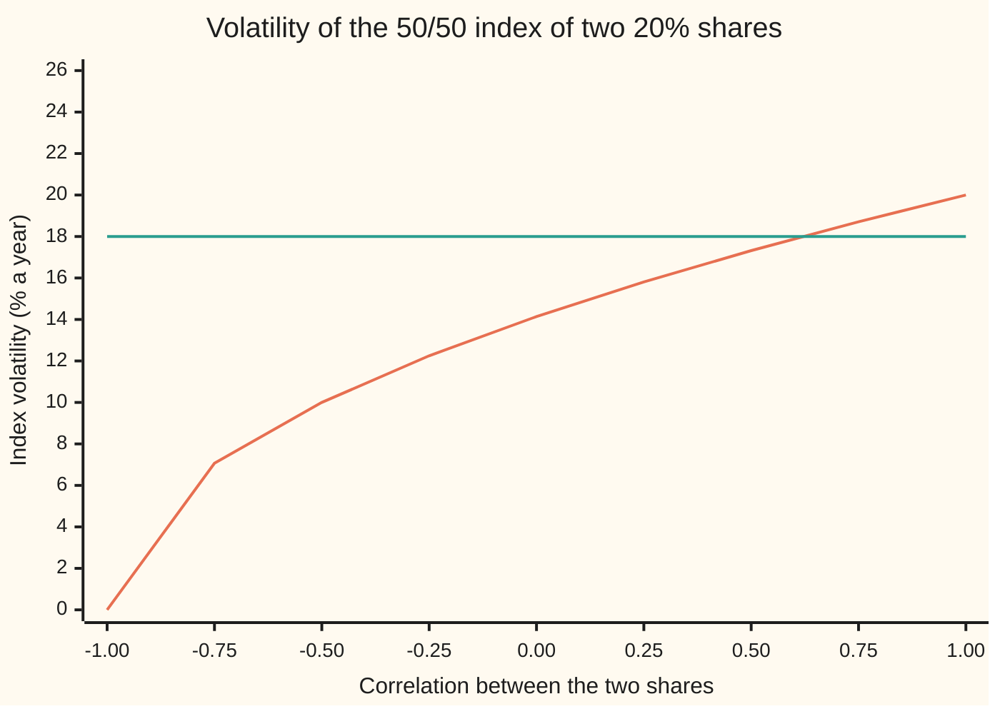
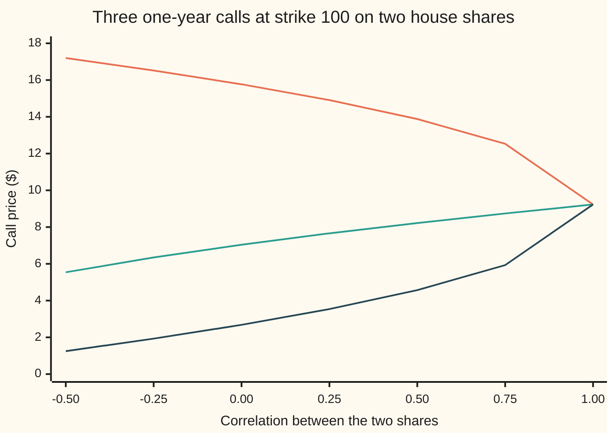

# Correlation Greeks and implied correlation: the sensitivity nobody can hedge directly, and the number an index option implies

Financial mathematics → Many underlyings - exchange, spread, basket and rainbow → Co-movement risk → Correlation Greeks and implied correlation

---

## General Overview

Two house shares each trade at 100 dollars. Each has volatility 20 percent a year: the yearly spread of its returns. The bank pays 5 percent, each share pays a 2 percent dividend, and the horizon is one year. The two shares move together with **correlation** 0.5: a number from −1 to 1 that says how far one share's daily moves line up with the other's.

Hold equal amounts of money in each and call the pair an **index**. The index wobbles less than either share, because on some days one share's rise cancels the other's fall. At correlation 0.5 the index's volatility is 17.32 percent, not 20.

Correlation is no share's price. Nobody sells it on a screen. Yet the three options this shelf prices all depend on it. A call on the 50/50 basket is worth 8.22 dollars at correlation 0.5. A call on the better of the two shares is worth 13.88 dollars; a call on the worse, 4.57. Move correlation from 0.5 to 0.51 and the basket gains about 2 cents, the best-of loses about 5, and the worst-of gains about 5. Those amounts are **correlation Greeks**: how much a price moves per step in correlation.

A desk that holds these options holds correlation risk. Buying or selling shares does not remove it, since shares have no correlation to sell. The one traded thing whose price leans on correlation is an option on the index. So the market's view of correlation is read backwards out of index option prices. If the index option is quoted at 18 percent volatility, the correlation that produces 18 percent is 0.62. That number is **implied correlation**.

A quote at 25 percent has no implied correlation. Even at correlation 1, when the two shares move as one, the index is only as jumpy as a share: 20 percent. Nothing makes it jumpier.

**The index's variance (its volatility squared) is the shares' own variances plus a cross term that grows in step with correlation, so an index option price pins down one correlation when its volatility sits between the bounds, and a correlation Greek is found by bumping correlation, or equivalently by bumping both share prices at once.**

**What kind of fact this is:** a method for the Greeks and for backing out correlation, resting on a theorem, the variance of a weighted sum, proved on this card in Why it works. Quoting an index option by one Black-Scholes volatility is a market convention.

### The picture: index volatility against correlation



The rising curve is the index's volatility at each correlation. The flat line is an index option quoted at 18 percent. They cross once, just past correlation 0.5: that crossing is the implied correlation, 0.62. The curve tops out at 20 percent, so a flat line drawn at 25 would never meet it. Below correlation 0 the curve keeps falling, to zero at −1, where one share's rise always cancels the other's fall exactly.

---

## The formula

Notation first, in words. A subscript names the share: $\sigma_1$ is share 1's volatility. A subscript I means the index. A **weight** is the fraction of the index's value sitting in one share.

$$\sigma_I^2 \;=\; w_1^2\sigma_1^2 \;+\; w_2^2\sigma_2^2 \;+\; 2\,w_1 w_2\,\rho\,\sigma_1\sigma_2$$

**Read it aloud:** the index's variance is each share's variance scaled by its weight squared, plus a cross term, and correlation enters only in the cross term.

Turned round, it gives the correlation an index quote implies:

$$\rho_{\text{impl}} \;=\; \frac{\sigma_I^2 - w_1^2\sigma_1^2 - w_2^2\sigma_2^2}{2\,w_1 w_2\,\sigma_1\sigma_2}$$

**Read it aloud:** take the quoted index variance, remove the part the shares carry on their own, and divide what is left by the cross term's size at correlation 1.

With many shares, numbered $i$ from 1 to $n$, desks assume one average correlation for every pair and use the same shape:

$$\sigma_I^2 = \sum_i w_i^2\sigma_i^2 + \bar\rho\sum_{i\ne j} w_i w_j\,\sigma_i\sigma_j, \qquad \bar\rho_{\text{impl}} = \frac{\sigma_I^2 - \sum_i w_i^2\sigma_i^2}{\sum_{i\ne j} w_i w_j\,\sigma_i\sigma_j}$$

The Greeks come from bumping. The **correlation Greek** reprices with correlation a step $\delta$ up and a step down. The **cross-gamma** $\Gamma_{12}$, how far the option's slope in share 1 moves when share 2 moves a dollar, bumps both share prices by $h$ in all four combinations of up and down:

$$\frac{\partial V}{\partial\rho} \approx \frac{V(\rho+\delta) - V(\rho-\delta)}{2\delta}, \qquad \Gamma_{12} \approx \frac{V_{++} - V_{+-} - V_{-+} + V_{--}}{4h^2}$$

Here $V_{+-}$ means the price with share 1 bumped up and share 2 bumped down. The two Greeks are tied exactly:

$$\frac{\partial V}{\partial\rho} \;=\; \sigma_1\sigma_2\,T\,S_1S_2\,\Gamma_{12}$$

**Read it aloud:** the price's slope in correlation is the cross-gamma, scaled by both share prices, both volatilities and the time left.

| Symbol | Plain meaning | In our example | Push it up and the answer… |
| --- | --- | --- | --- |
| $S_1$, $S_2$ | each share's price today | 100 dollars each | the bridge factor grows with both |
| $\sigma_1$, $\sigma_2$, $\sigma$ | each share's volatility, a year; $\sigma$ when all are equal | 20 percent | index volatility rises |
| $w_1$, $w_2$, $w_i$, $i$, $j$, $n$ | weights: fraction of the index in share $i$ (or $j$), for shares 1 to $n$ | 0.5 and 0.5, two shares | an unequal split needs less correlation to reach a quote |
| $\rho$, $\rho_{ij}$, $\bar\rho$ | correlation of the pair; of shares $i$ and $j$; the average over all pairs | 0.5 | basket and worst-of up, best-of down |
| $\rho_{\text{impl}}$ | the correlation a quoted index volatility implies | 0.62 at an 18 percent quote | rises with the quote |
| $\sigma_I$, $I$ | the index's volatility; $I$ is the index level | 17.32 percent at correlation 0.5 | index option dearer |
| $V$ | an option's price, as a function of its inputs | 8.22 dollars, basket call | — |
| $\Gamma_{12}$ | cross-gamma: how share 1's delta moves when share 2 moves a dollar | 0.005398, basket | the correlation Greek grows with it |
| $\delta$, $h$ | bump sizes: in correlation, and in each share price | 0.01 and 1 dollar | smaller is sharper until noise wins |
| $K$, $T$ | the strike, the level the payoff is measured from; years to expiry | 100 dollars; 1 | a higher strike makes every call here cheaper |
| $r$, $q$ | bank rate; dividend yield of each share | 5 percent; 2 percent | calls dearer; calls cheaper |
| $X$, $Y$, $m_X$, $m_Y$, $n_1$, $x_1$, $x_2$, $c$, $g$, $p$ | letters used only in the folded proofs, each defined there: two returns and their means, a share count, two log prices, a covariance, a payoff, a density | — | — |

The **correlation Greek** has no Greek letter of its own; desks say "correlation delta" (plain "rho" is taken: it means the slope in the interest rate), and quote it per 0.01 of correlation. This card does the same.

### When it holds

- **Weights measured in value, and only for an instant.** The identity holds for the index's next small move. As the shares drift apart, the weights drift too, so over a year the basket is not exactly one lognormal share: the index quoted at 17.32 percent costs 8.21 dollars, the exact basket 8.22.
- **One volatility per share.** The identity uses each share's own quoted volatility. If each share's volatility depends on its strike (a smile), the result depends on which strikes are used.
- **One correlation for every pair.** With fifty names the implied number is an average. Two indices with the same average can hide very different pairs.
- **Constant correlation over the option's life.** Bumping correlation assumes it is a fixed input. If correlation rises in a sell-off, and it tends to, the Greek measures only the first-order effect.

---

## Why it works

### Step 0: the index option is the only market price that contains correlation

A share option's price depends on that share alone. An option on the index depends on the index's variance. That variance contains the shares' own variances, which share options already price, plus one piece that nothing else prices: the cross term. So the index option carries exactly one extra number, and correlation can be read out of it.

### Step 1: the variance of a weighted sum

Over a short step, the index's return is $w_1$ times share 1's return plus $w_2$ times share 2's. Variance, the average squared distance from the mean, of a weighted sum expands like a square: $(a+b)^2 = a^2 + b^2 + 2ab$. The two squares are the shares' own variances times their weights squared. The cross piece is the **covariance**, how far the two returns rise and fall together, and correlation is covariance divided by the two volatilities. That gives the formula.

On the house pair: own terms 0.01 and 0.01, cross term 0.01 at correlation 0.5, total 0.03, and the square root of 0.03 is 17.32 percent.

<details>
<summary>Detailed proof: variance of a weighted sum</summary>

Let $X$ and $Y$ be the two shares' returns over a short step, with means $m_X$ and $m_Y$. The index's return is $w_1X + w_2Y$. Its distance from its mean is $w_1(X - m_X) + w_2(Y - m_Y)$. Square it:
$$w_1^2(X-m_X)^2 + w_2^2(Y-m_Y)^2 + 2w_1w_2(X-m_X)(Y-m_Y).$$
Average over all outcomes. The first average is $w_1^2\sigma_1^2$ per unit time, the second $w_2^2\sigma_2^2$. The third is $2w_1w_2$ times the covariance, and correlation is defined as covariance divided by $\sigma_1\sigma_2$, so the covariance is $\rho\sigma_1\sigma_2$. Nothing assumed the returns bell-shaped. The weights are value weights: if the index holds $n_1$ shares of the first stock, then $w_1 = n_1S_1/I$ where $I$ is the index level, which is why the identity is exact only instant by instant.

</details>

### Step 2: implied correlation exists inside the bounds, and is unique

The index variance is a straight line in correlation, with slope $2w_1w_2\sigma_1\sigma_2$. The weights and volatilities are positive, so the slope is positive: the variance **rises** as correlation rises. A rising line crosses any level at most once. That is uniqueness.

Existence needs the quoted variance inside the line's range. Correlation runs from −1 to 1, so the index variance runs from $(w_1\sigma_1 - w_2\sigma_2)^2$ up to $(w_1\sigma_1 + w_2\sigma_2)^2$. For the house pair that is 0 up to 20 percent squared. At the top, correlation 1, the index is one share scaled: 20 percent. A quote above the top has no root. At 25 percent the index call costs 11.12 dollars, and at correlation 1 it costs only 9.23. No correlation reaches it.

The floor matters more with many names. With $n$ shares, equal weights, equal volatility $\sigma$ and one average correlation, the index variance is $\sigma^2(1/n + (1 - 1/n)\bar\rho)$. Variance cannot be negative, so the average correlation cannot fall below $-1/(n-1)$. For two names that is −1. For fifty it is −0.020408: all but zero. So a broad index has an implied correlation only when its volatility lies between the zero-correlation level and the full-correlation level. The two-name house pair allows the whole range from 0 to 20 percent: below the zero-correlation level of 14.14 percent the implied number goes negative, and a 14 percent quote implies −0.02.

Boundary cases: a quote of exactly 20 percent implies correlation 1; exactly 14.14 percent implies 0. The quote arrives as a dollar price, not a volatility. The step from dollars to volatility is unique, because a call's Black-Scholes price rises with volatility. It exists when the price lies strictly between the zero-volatility value, $\max(S e^{-qT} - K e^{-rT}, 0) = 2.90$ dollars, and the infinite-volatility value $S e^{-qT} = 98.02$ dollars.

### Step 3: the correlation Greek by bumping

The correlation Greek is a slope in an input that has no market price, so bump and revalue ([bump-and-revalue-and-common-random-numbers](../07-Greeks%20by%20Numbers%20and%20Calibration/01-bump-and-revalue-and-common-random-numbers.md)): price at 0.51 and at 0.49, subtract, halve. When the pricer is a simulation, both prices must reuse the same random draws. Otherwise each price carries its own noise of about 2 cents, and the difference, about 2 cents for the basket, drowns.

### Step 4: the bridge from correlation to cross-gamma

Why should a slope in correlation equal a second slope in the two share prices? Look at expiry. The logs of the two share prices end up bell-shaped, and the only place correlation enters is their covariance, $\rho\sigma_1\sigma_2T$. The pretend-world drifts, $r - q - \tfrac12\sigma^2$, do not involve correlation at all.

A bell curve in two dimensions has a property the heat equation also has: raising the covariance between two coordinates changes the average of any payoff by the average of that payoff's **mixed second slope**, its bend when both coordinates move together. That mixed bend, measured in log prices, is $S_1S_2\Gamma_{12}$. Multiply by the covariance's rate of change in correlation, $\sigma_1\sigma_2T$, and the bridge follows.

The bridge factor for the house pair is $0.2 \times 0.2 \times 1 \times 100 \times 100 = 400$. The basket's cross-gamma is 0.005398, so the bridge predicts 400 × 0.005398 / 100 = 0.021594 per 0.01 of correlation. Bumping correlation directly gives 0.021598. Two unrelated bumps, one answer.

<details>
<summary>Detailed proof: the covariance bump equals the mixed second derivative</summary>

Let $(X_1, X_2)$ be bell-shaped with fixed means and variances and covariance $c$. Its density $p$ has Fourier transform $\exp(i t\cdot m - \tfrac12 t^\top\Sigma t)$, and $c$ appears in $t^\top\Sigma t$ as $2ct_1t_2$. Differentiating in $c$ multiplies the transform by $-t_1t_2$. Differentiating $p$ once in $x_1$ and once in $x_2$ multiplies it by $(-it_1)(-it_2) = -t_1t_2$. So $\partial p/\partial c = \partial^2 p/\partial x_1\partial x_2$.

For a payoff $g$, the discounted average is $e^{-rT}\int g\,p$. Its derivative in $c$ is $e^{-rT}\int g\,\partial_1\partial_2 p$. Integrate by parts twice (the density vanishes far out) to move both derivatives onto $g$: $e^{-rT}\int (\partial_1\partial_2 g)\,p$. For a kinked payoff $\partial_1\partial_2 g$ is a spike along the kink, and the identity still holds in the integrated sense.

Today's log prices $x_i = \ln S_i$ shift the means one for one, so the same average equals $\partial^2 V/\partial x_1\partial x_2$. Since $\partial/\partial x_i = S_i\,\partial/\partial S_i$, that is $S_1S_2\Gamma_{12}$. With $c = \rho\sigma_1\sigma_2T$, the chain rule gives $\partial V/\partial\rho = \sigma_1\sigma_2T\,S_1S_2\Gamma_{12}$.

</details>

The bridge explains the signs. The basket call bends upward when both shares rise together, so its cross-gamma and correlation Greek are positive. The best-of pays on whichever share leads. If one share has already risen, a rise in the other adds less, so the best-of's cross-gamma is negative, and so is its correlation Greek.

### Step 5: best-of and worst-of cancel

For any two finishing prices, the larger plus the smaller is the sum. The payoffs obey the same rule: $\max(\text{best} - K, 0) + \max(\text{worst} - K, 0) = \max(S_1 - K, 0) + \max(S_2 - K, 0)$. Check it on 120 and 90: 20 + 0 on the left, 20 + 0 on the right. So best-of plus worst-of is two ordinary calls, 2 × 9.23, and ordinary calls do not depend on correlation. Their correlation Greeks are equal and opposite, −0.046018 and +0.046018, to every printed digit.

### Step 6: the basket seen as an index

A third road to the basket's Greek treats the basket as a single share with volatility $\sigma_I$. Then the correlation Greek is the index option's vega (its slope in volatility), 37.81, times the slope of $\sigma_I$ in correlation, $w_1w_2\sigma_1\sigma_2/\sigma_I = 0.057735$. That gives 0.021828 per 0.01, against the exact 0.021598. The gap, 1 percent, is the price of pretending the basket is lognormal (its log bell-shaped), the approximation the sibling card on [basket-options](03-basket-options.md) studies. It is also why implied correlation read against the exact basket is 0.618564, not 0.62: the market convention prices the index as one lognormal share.

For the rainbow options a closed form exists, Stulz's two-dimensional bell-curve formula, done on [rainbow-best-of-and-worst-of](04-rainbow-best-of-and-worst-of.md). This card needs only prices it can bump, and reaches them by integration and by simulation.

---

## Worked numbers, by hand

The house pair: $S_1 = S_2 = 100$ dollars, $\sigma_1 = \sigma_2 = 20$ percent, $w_1 = w_2 = 0.5$, correlation 0.5, one year.

| Step | Arithmetic | Value |
| --- | --- | --- |
| own terms | $0.5^2 \times 0.2^2$, twice | 0.01 and 0.01 |
| cross term | $2 \times 0.5 \times 0.5 \times 0.5 \times 0.2 \times 0.2$ | 0.01 |
| index variance | $0.01 + 0.01 + 0.01$ | 0.03 |
| index volatility | $\sqrt{0.03}$ | **17.32 percent** |
| bounds | correlation 0: $\sqrt{0.02}$; correlation 1: $\sqrt{0.04}$ | 14.14 and 20 percent |
| 18 percent quote, as variance | $0.18^2$ | 0.0324 |
| less own terms | $0.0324 - 0.02$ | 0.0124 |
| cross term at correlation 1 | $2 \times 0.5 \times 0.5 \times 0.2 \times 0.2$ | 0.02 |
| implied correlation | $0.0124 / 0.02$ | **0.62** |
| 25 percent quote | above the 20 percent ceiling | **none** |
| bridge factor | $0.2 \times 0.2 \times 1 \times 100 \times 100$ | 400 |
| basket correlation Greek | $400 \times 0.005398 / 100$ | **0.0216 dollars per 0.01** |

An index option dealer quoting 18 percent is pricing the two shares as 0.62 correlated, above the 0.5 they were assumed to share. The same dealer quoting 25 percent is quoting something no pair of 20 percent shares can produce; either a share's volatility is mismeasured or the quote is wrong.

### What breaks if you drop a piece

| Mistake | Comes out at | What went wrong |
| --- | --- | --- |
| Take the index volatility as the average of the share volatilities, 20 percent | index call 9.23 dollars, not 8.21 | That silently sets correlation to 1: no cancelling between the shares. |
| Interpolate volatilities, not variances, between 14.14 and 20 percent | implied correlation 0.66, not 0.62 | Correlation is a straight line in variance, not in volatility. |
| Reprice the bumped simulation with fresh random draws | basket Greek 0.0087, not 0.0216; worst-of 0.0305, not 0.0460 | Two independent noises of about 2 cents each swamp a 2-cent difference. |
| Force a root for the 25 percent quote | an implied correlation above 1 | The quote's 11.12 dollars exceeds the 9.23-dollar ceiling at correlation 1; no correlation exists. |

---

## How the three prices move as correlation moves

The mystery: nothing about either share changed, their prices and volatilities stay put, yet three options on them move, two up and one down.



Top line: the best-of call, falling. Middle: the 50/50 basket call, rising gently. Bottom: the worst-of call, rising. All three meet at correlation 1, at 9.23 dollars, the one-share call: when the two shares move as one, best, worst and average are the same share. The best-of and worst-of curves steepen as they approach 1; the basket's does not.

The slopes at correlation 0.5, per 0.01 of correlation, from the Simpson road:

```
correlation Greek, dollars per 0.01 of correlation, at correlation 0.5
  best-of   ████████████████████████████████████████████  -$0.0460
  basket    █████████████████████                         +$0.0216
  worst-of  ████████████████████████████████████████████  +$0.0460
```

The Greeks side by side, at correlation 0.5:

| Call | Price | Correlation Greek, per 0.01 | Cross-gamma | Bridge: $400\,\Gamma_{12}/100$ |
| --- | --- | --- | --- | --- |
| basket | 8.22 | +0.0216 | +0.005398 | +0.0216 |
| best-of | 13.88 | −0.0460 | −0.011493 | −0.0460 |
| worst-of | 4.57 | +0.0460 | +0.011493 | +0.0460 |

The basket's slope is the smallest, because in a basket correlation only thins the index's variance. The rainbows depend on the gap between the two shares, which correlation controls directly. At correlation 0.9 the rainbow Greeks more than double while the basket's shrinks (see Try changing).

---

## Code, from first principles, and it actually runs

The scripts price the basket, best-of and worst-of calls two ways. **Road 1** fixes share 1's random draw, prices share 2's contribution in closed form given that draw (share 2 is still lognormal, with its spread cut to $\sigma\sqrt{T}\sqrt{1-\rho^2}$), and adds up over share 1's draw by Simpson's rule, split at the strike so no kink falls inside a slice. **Road 2** simulates 200,000 correlated pairs from a written-out random number generator. The correlation Greek is then reached three ways: bumping correlation on road 1, bumping it on road 2 with the same draws, and the cross-gamma bridge; the basket gets a fourth, the index-vega road. Implied correlation is reached by the closed form after inverting the price to a volatility, by bisection on correlation directly, and by bisection against the exact basket. The bell-curve area is a series written out; nothing imported knows an answer. Python and Rust print identical output.

### Python

```python
# Correlation Greeks and implied correlation -- the check behind the card.
# Standard library only.  Nothing imported holds an answer: the bell-curve area
# is a series written out here, the integrals are Simpson's rule, the root finder
# is bisection, and the random numbers come from a generator written out here.
from math import cos, exp, log, pi, sin, sqrt
S0, K, R, Q, SIG, T, RHO, W = 100.0, 100.0, 0.05, 0.02, 0.20, 1.0, 0.5, 0.5
MU, V, DISC = (R - Q - 0.5 * SIG * SIG) * T, SIG * sqrt(T), exp(-R * T)
def phi(x): return exp(-0.5 * x * x) / sqrt(2.0 * pi)      # bell-curve height at x
def N(x):                                          # bell-curve area left of x
    if x < -9.0: return 0.0
    if x > 9.0: return 1.0
    term = total = x                               # x + x^3/3 + x^5/(3*5) + ...
    for k in range(1, 160):
        term *= x * x / (2 * k + 1)
        total += term
    return 0.5 + phi(x) * total
def lncall(m, s, k):                   # E[(e^X - k)+] when X is normal, mean m, spread s
    if k <= 0.0: return exp(m + 0.5 * s * s) - k
    if s < 1e-12: return max(exp(m) - k, 0.0)
    d1 = (m + s * s - log(k)) / s
    return exp(m + 0.5 * s * s) * N(d1) - k * N(d1 - s)
def bs(s, vol):                        # one-asset call: the index quoted at one vol
    return DISC * lncall(log(s) + (R - Q - 0.5 * vol * vol) * T, vol * sqrt(T), K)
def simpson(f, a, b, n=200):
    h, tot = (b - a) / n, f(a) + f(b)
    for i in range(1, n): tot += (4 if i % 2 else 2) * f(a + i * h)
    return tot * h / 3.0
def exact(s1, s2, rho):
    # Road 1: fix share 1's draw z, price share 2 in closed form given z, add up over z.
    sc = V * sqrt(max(1.0 - rho * rho, 0.0))       # share 2's leftover spread once z is known
    zk = (log(K / s1) - MU) / V                    # share 1 ends exactly at the strike here
    s1T = lambda z: s1 * exp(MU + V * z)
    m2 = lambda z: log(s2) + MU + V * rho * z
    bask = lambda z: phi(z) * lncall(m2(z) + log(W), sc, K - W * s1T(z))
    best = lambda z: phi(z) * (max(s1T(z) - K, 0.0) + lncall(m2(z), sc, max(s1T(z), K)))
    worst = lambda z: phi(z) * (lncall(m2(z), sc, K) - lncall(m2(z), sc, s1T(z)))
    both = lambda f: simpson(f, -9.0, zk) + simpson(f, zk, 9.0)
    return [DISC * both(bask), DISC * both(best), DISC * simpson(worst, zk, 9.0)]
def normals(n, seed):
    # Road 2 draws: a 64-bit linear congruential generator, then Box-Muller.
    x, out = seed, []
    def u():
        nonlocal x
        x = (6364136223846793005 * x + 1442695040888963407) % 2 ** 64
        return ((x >> 11) + 0.5) / 2.0 ** 53
    for _ in range(n):
        a, b = sqrt(-2.0 * log(u())), 2.0 * pi * u()
        out.append((a * cos(b), a * sin(b)))
    return out
def mc(rho, zs):                       # antithetic pairs: each draw also used sign-flipped
    s, s2, c = [0.0] * 3, [0.0] * 3, sqrt(1.0 - rho * rho)
    for z1, z2 in zs:
        p = [0.0] * 3
        for g in (0.5, -0.5):
            a = S0 * exp(MU + 2 * V * g * z1)
            b = S0 * exp(MU + 2 * V * g * (rho * z1 + c * z2))
            p = [p[0] + 0.5 * max(W * a + W * b - K, 0.0), p[1] + 0.5 * max(max(a, b) - K, 0.0),
                 p[2] + 0.5 * max(min(a, b) - K, 0.0)]
        s, s2 = [x + y for x, y in zip(s, p)], [x + y * y for x, y in zip(s2, p)]
    n = len(zs)
    return [DISC * x / n for x in s], [DISC * sqrt((y / n - (x / n) ** 2) / n) for x, y in zip(s, s2)]
def ivol(rho): return sqrt(2 * W * W * SIG * SIG + 2 * W * W * rho * SIG * SIG)
def bisect(f, a, b):                   # f(a) < 0 < f(b), f rising
    for _ in range(100):
        m = 0.5 * (a + b)
        a, b = (m, b) if f(m) < 0.0 else (a, m)
    return 0.5 * (a + b)
def row(label, *vals): print(f"{label:<34}" + "".join(f"{v:>11.6f}" for v in vals))
NAMES = ("basket", "best-of", "worst-of")

print("--- 1. prices at correlation 0.5, two roads ---        basket    best-of   worst-of")
base, zs = exact(S0, S0, RHO), normals(100000, 20260924)
row("road 1: Simpson over one share", *base)
(m0, se), (mup, _), (mdn, _) = mc(RHO, zs), mc(RHO + 0.01, zs), mc(RHO - 0.01, zs)
row("road 2: simulation, 200000 paths", *m0)
row("  its standard error", *se)
row("one-share call (Black-Scholes)", bs(S0, SIG))
print("--- 2. correlation Greeks, per 0.01 of correlation ---")
up, dn = exact(S0, S0, RHO + 0.01), exact(S0, S0, RHO - 0.01)
crho = [(u - d) / 2.0 for u, d in zip(up, dn)]
row("bump rho +-0.01, Simpson", *crho)
cmc = [(u - d) / 2.0 for u, d in zip(mup, mdn)]
row("bump rho +-0.01, simulation, same draws", *cmc)
fresh = mc(RHO + 0.01, normals(100000, 7))[0]
row("same, fresh draws for the up price", *[(u - d) / 2.0 for u, d in zip(fresh, mdn)])
h = 1.0
pp, pm, mp, mm = (exact(S0 + a, S0 + b, RHO) for a, b in ((h, h), (h, -h), (-h, h), (-h, -h)))
xg = [(a - b - c + d) / (4 * h * h) for a, b, c, d in zip(pp, pm, mp, mm)]
row("cross-gamma, bump both shares +-1", *xg)
row("bridge factor sigma1 sigma2 T S1 S2", SIG * SIG * T * S0 * S0)
bridge = [SIG * SIG * T * S0 * S0 * g / 100.0 for g in xg]
row("sigma1 sigma2 T S1 S2 cross-gamma /100", *bridge)
row("best-of + worst-of, per 0.01", crho[1] + crho[2])
vega = (bs(S0, ivol(RHO) + 1e-4) - bs(S0, ivol(RHO) - 1e-4)) / 2e-4
dvol = 2 * W * W * SIG * SIG / (2.0 * ivol(RHO))
row("basket as index: vega, dvol/drho", vega, dvol)
row("  vega x dvol/drho /100", vega * dvol / 100.0)
print("--- 3. the index-variance identity ---")
row("variance: own, own, cross at 0.5", W * W * SIG * SIG, W * W * SIG * SIG, 2 * W * W * RHO * SIG * SIG)
row("index vol at rho 0, 0.5, 1", ivol(0.0), ivol(RHO), ivol(1.0))
row("index call at 17.32% vol / exact basket", bs(S0, ivol(RHO)), base[0])
print("--- 4. implied correlation from an index quote ---")
p18 = bs(S0, 0.18)
row("index call quoted at 18% vol, dollars", p18)
row("18%: variance, less own terms, per rho", 0.18 ** 2, 0.18 ** 2 - 2 * W * W * SIG * SIG, 2 * W * W * SIG * SIG)
row("lowest average rho, 2 and 50 names", -1.0 / (2 - 1), -1.0 / (50 - 1))
vol_back = bisect(lambda v: bs(S0, v) - p18, 0.01, 1.0)
rho_a = (vol_back ** 2 - 2 * W * W * SIG * SIG) / (2 * W * W * SIG * SIG)
row("road A: price -> vol -> identity", vol_back, rho_a)
rho_b = bisect(lambda p: bs(S0, ivol(p)) - p18, -1.0, 1.0)
row("road B: bisect rho on the price", rho_b)
rho_c = bisect(lambda p: exact(S0, S0, p)[0] - p18, -0.99, 0.99)
row("road C: bisect rho, exact basket", rho_c)
row("wrong: interpolate vols, not variances", (0.18 - ivol(0.0)) / (ivol(1.0) - ivol(0.0)))
p25 = bs(S0, 0.25)
row("quote at 25%: dollars, ceiling dollars", p25, bs(S0, ivol(1.0)))
print("  25% quote: price above the rho = 1 ceiling, so no implied correlation" if p25 > bs(S0, ivol(1.0)) else "  25% has a root")
row("wrong: average the vols, index call", bs(S0, 0.20))
tu, td = exact(S0, S0, 0.91), exact(S0, S0, 0.89)
row("try: rho 0.9, prices", *exact(S0, S0, 0.9))
row("try: rho 0.9, per 0.01", *[(u - d) / 2.0 for u, d in zip(tu, td)])
row("try: quotes 16% and 14%, implied rho", *[(v * v - 2 * W * W * SIG * SIG) / (2 * W * W * SIG * SIG) for v in (0.16, 0.14)])
print("--- 5. chart points ---")
grid = [-1.0 + 0.25 * i for i in range(9)]
print("chart, rho      " + " ".join(f"{g:6.2f}" for g in grid))
print("chart, vol %    " + " ".join(f"{100 * ivol(g):6.2f}" for g in grid))
cg = [-0.5 + 0.25 * i for i in range(7)]
print("chart2, rho     " + " ".join(f"{g:6.2f}" for g in cg))
cols = [exact(S0, S0, g) for g in cg]
for j, nm in enumerate(NAMES): print(f"chart2, {nm:<8}" + " ".join(f"{c[j]:6.2f}" for c in cols))

assert all(abs(b - m) < 3 * e for b, m, e in zip(base, m0, se)), "Simpson vs simulation"
assert abs(base[1] + base[2] - 2 * bs(S0, SIG)) < 1e-5, "best + worst = two calls, by separate integrals"
assert all(abs(c - b) < 2e-4 for c, b in zip(crho, bridge)), "rho bump vs cross-gamma bridge"
assert all(abs(c - m) < 1e-3 for c, m in zip(crho, cmc)), "rho Greek: Simpson vs simulation"
assert abs(rho_a - 0.62) < 1e-9 and abs(rho_c - rho_a) < 5e-3, "implied rho: hand value; identity vs exact basket"
assert abs(rho_b - rho_a) < 1e-9, "two roads to implied rho"
assert abs(vega * dvol / 100.0 - crho[0]) < 1e-3, "index view of the basket's rho Greek"
assert all(abs(v - bs(S0, SIG)) < 1e-5 for v in cols[-1]), "at rho = 1 all three are the one-share call"
print("ALL CHECKS PASS")
```

**Ran 2026-09-24 on macOS, Python 3.14.6, standard library only. All checks passed. Output, pasted from the run:**

```
--- 1. prices at correlation 0.5, two roads ---        basket    best-of   worst-of
road 1: Simpson over one share       8.217922  13.882533   4.571478
road 2: simulation, 200000 paths     8.242348  13.904609   4.593461
  its standard error                 0.019430   0.024816   0.017457
one-share call (Black-Scholes)       9.227006
--- 2. correlation Greeks, per 0.01 of correlation ---
bump rho +-0.01, Simpson             0.021598  -0.046018   0.046018
bump rho +-0.01, simulation, same draws   0.021196  -0.045760   0.046028
same, fresh draws for the up price   0.008684  -0.057261   0.030517
cross-gamma, bump both shares +-1    0.005398  -0.011493   0.011493
bridge factor sigma1 sigma2 T S1 S2 400.000000
sigma1 sigma2 T S1 S2 cross-gamma /100   0.021594  -0.045971   0.045971
best-of + worst-of, per 0.01         0.000000
basket as index: vega, dvol/drho    37.806523   0.057735
  vega x dvol/drho /100              0.021828
--- 3. the index-variance identity ---
variance: own, own, cross at 0.5     0.010000   0.010000   0.010000
index vol at rho 0, 0.5, 1           0.141421   0.173205   0.200000
index call at 17.32% vol / exact basket   8.212564   8.217922
--- 4. implied correlation from an index quote ---
index call quoted at 18% vol, dollars   8.469563
18%: variance, less own terms, per rho   0.032400   0.012400   0.020000
lowest average rho, 2 and 50 names  -1.000000  -0.020408
road A: price -> vol -> identity     0.180000   0.620000
road B: bisect rho on the price      0.620000
road C: bisect rho, exact basket     0.618564
wrong: interpolate vols, not variances   0.658579
quote at 25%: dollars, ceiling dollars  11.123762   9.227006
  25% quote: price above the rho = 1 ceiling, so no implied correlation
wrong: average the vols, index call   9.227006
try: rho 0.9, prices                 9.035296  11.318644   7.135367
try: rho 0.9, per 0.01               0.019397  -0.104474   0.104474
try: quotes 16% and 14%, implied rho   0.280000  -0.020000
--- 5. chart points ---
chart, rho       -1.00  -0.75  -0.50  -0.25   0.00   0.25   0.50   0.75   1.00
chart, vol %      0.00   7.07  10.00  12.25  14.14  15.81  17.32  18.71  20.00
chart2, rho      -0.50  -0.25   0.00   0.25   0.50   0.75   1.00
chart2, basket    5.54   6.35   7.04   7.66   8.22   8.74   9.23
chart2, best-of  17.20  16.52  15.77  14.91  13.88  12.53   9.23
chart2, worst-of  1.25   1.93   2.68   3.54   4.57   5.93   9.23
ALL CHECKS PASS
```

### Rust

```rust
// Correlation Greeks and implied correlation -- the same check in Rust, std only.
// Bell-curve area by series, integrals by Simpson's rule, roots by bisection,
// random numbers from a generator written out here.  No crates.
use std::f64::consts::PI;
const S0: f64 = 100.0; const K: f64 = 100.0; const R: f64 = 0.05; const Q: f64 = 0.02;
const SIG: f64 = 0.20; const T: f64 = 1.0; const RHO: f64 = 0.5; const W: f64 = 0.5;
fn mu() -> f64 { (R - Q - 0.5 * SIG * SIG) * T }
fn vv() -> f64 { SIG * T.sqrt() }
fn disc() -> f64 { (-R * T).exp() }
fn phi(x: f64) -> f64 { (-0.5 * x * x).exp() / (2.0 * PI).sqrt() }
fn n(x: f64) -> f64 {
    if x < -9.0 { return 0.0; }
    if x > 9.0 { return 1.0; }
    let (mut term, mut total) = (x, x); // x + x^3/3 + x^5/(3*5) + ...
    for k in 1..160 { term *= x * x / (2 * k + 1) as f64; total += term; }
    0.5 + phi(x) * total
}
fn lncall(m: f64, s: f64, k: f64) -> f64 { // E[(e^X - k)+], X normal, mean m, spread s
    if k <= 0.0 { return (m + 0.5 * s * s).exp() - k; }
    if s < 1e-12 { return (m.exp() - k).max(0.0); }
    let d1 = (m + s * s - k.ln()) / s;
    (m + 0.5 * s * s).exp() * n(d1) - k * n(d1 - s)
}
fn bs(s: f64, vol: f64) -> f64 { disc() * lncall(s.ln() + (R - Q - 0.5 * vol * vol) * T, vol * T.sqrt(), K) }
fn simpson<F: Fn(f64) -> f64>(f: &F, a: f64, b: f64) -> f64 {
    let nn = 200; let h = (b - a) / nn as f64; let mut tot = f(a) + f(b);
    for i in 1..nn { tot += (if i % 2 == 1 { 4.0 } else { 2.0 }) * f(a + i as f64 * h); }
    tot * h / 3.0
}
fn exact(s1: f64, s2: f64, rho: f64) -> [f64; 3] { // road 1: Simpson over share 1's draw
    let (m, v) = (mu(), vv());
    let sc = v * (1.0 - rho * rho).max(0.0).sqrt();
    let zk = ((K / s1).ln() - m) / v;
    let s1t = |z: f64| s1 * (m + v * z).exp();
    let m2 = |z: f64| s2.ln() + m + v * rho * z;
    let bask = |z: f64| phi(z) * lncall(m2(z) + W.ln(), sc, K - W * s1t(z));
    let best = |z: f64| phi(z) * ((s1t(z) - K).max(0.0) + lncall(m2(z), sc, s1t(z).max(K)));
    let worst = |z: f64| phi(z) * (lncall(m2(z), sc, K) - lncall(m2(z), sc, s1t(z)));
    [disc() * (simpson(&bask, -9.0, zk) + simpson(&bask, zk, 9.0)),
     disc() * (simpson(&best, -9.0, zk) + simpson(&best, zk, 9.0)), disc() * simpson(&worst, zk, 9.0)]
}
fn normals(cnt: usize, seed: u64) -> Vec<(f64, f64)> { // 64-bit LCG, then Box-Muller
    let mut x = seed; let mut out = Vec::with_capacity(cnt);
    let mut u = || { x = x.wrapping_mul(6364136223846793005).wrapping_add(1442695040888963407);
                     ((x >> 11) as f64 + 0.5) / 9007199254740992.0 };
    for _ in 0..cnt { let a = (-2.0 * u().ln()).sqrt(); let b = 2.0 * PI * u(); out.push((a * b.cos(), a * b.sin())); }
    out
}
fn mc(rho: f64, zs: &[(f64, f64)]) -> ([f64; 3], [f64; 3]) { // antithetic pairs
    let (mut s, mut s2, c) = ([0.0f64; 3], [0.0f64; 3], (1.0 - rho * rho).sqrt());
    for &(z1, z2) in zs {
        let mut p = [0.0f64; 3];
        for g in [0.5f64, -0.5] {
            let a = S0 * (mu() + 2.0 * vv() * g * z1).exp();
            let b = S0 * (mu() + 2.0 * vv() * g * (rho * z1 + c * z2)).exp();
            p = [p[0] + 0.5 * (W * a + W * b - K).max(0.0), p[1] + 0.5 * (a.max(b) - K).max(0.0),
                 p[2] + 0.5 * (a.min(b) - K).max(0.0)];
        }
        for j in 0..3 { s[j] += p[j]; s2[j] += p[j] * p[j]; }
    }
    let nf = zs.len() as f64; let (mut pr, mut se) = ([0.0; 3], [0.0; 3]);
    for j in 0..3 { pr[j] = disc() * s[j] / nf; se[j] = disc() * ((s2[j] / nf - (s[j] / nf).powi(2)) / nf).sqrt(); }
    (pr, se)
}
fn ivol(rho: f64) -> f64 { (2.0 * W * W * SIG * SIG + 2.0 * W * W * rho * SIG * SIG).sqrt() }
fn bisect<F: Fn(f64) -> f64>(f: F, mut a: f64, mut b: f64) -> f64 { // f(a) < 0 < f(b)
    for _ in 0..100 { let m = 0.5 * (a + b); if f(m) < 0.0 { a = m; } else { b = m; } }
    0.5 * (a + b)
}
fn row(label: &str, vals: &[f64]) {
    let mut s = format!("{:<34}", label);
    for v in vals { s += &format!("{:>11.6}", v); }
    println!("{}", s);
}
fn line(label: &str, vals: &[f64]) {
    let mut s = label.to_string();
    for (i, v) in vals.iter().enumerate() { s += &format!("{}{:6.2}", if i == 0 { "" } else { " " }, v); }
    println!("{}", s);
}
fn main() {
    println!("--- 1. prices at correlation 0.5, two roads ---        basket    best-of   worst-of");
    let base = exact(S0, S0, RHO); let zs = normals(100000, 20260924);
    row("road 1: Simpson over one share", &base);
    let ((m0, se), (mup, _), (mdn, _)) = (mc(RHO, &zs), mc(RHO + 0.01, &zs), mc(RHO - 0.01, &zs));
    row("road 2: simulation, 200000 paths", &m0);
    row("  its standard error", &se);
    row("one-share call (Black-Scholes)", &[bs(S0, SIG)]);
    println!("--- 2. correlation Greeks, per 0.01 of correlation ---");
    let (up, dn) = (exact(S0, S0, RHO + 0.01), exact(S0, S0, RHO - 0.01));
    let crho: Vec<f64> = (0..3).map(|j| (up[j] - dn[j]) / 2.0).collect();
    row("bump rho +-0.01, Simpson", &crho);
    let cmc: Vec<f64> = (0..3).map(|j| (mup[j] - mdn[j]) / 2.0).collect();
    row("bump rho +-0.01, simulation, same draws", &cmc);
    let fresh = mc(RHO + 0.01, &normals(100000, 7)).0;
    row("same, fresh draws for the up price", &(0..3).map(|j| (fresh[j] - mdn[j]) / 2.0).collect::<Vec<_>>());
    let h = 1.0;
    let (pp, pm, mp, mm) = (exact(S0 + h, S0 + h, RHO), exact(S0 + h, S0 - h, RHO),
                            exact(S0 - h, S0 + h, RHO), exact(S0 - h, S0 - h, RHO));
    let xg: Vec<f64> = (0..3).map(|j| (pp[j] - pm[j] - mp[j] + mm[j]) / (4.0 * h * h)).collect();
    row("cross-gamma, bump both shares +-1", &xg);
    row("bridge factor sigma1 sigma2 T S1 S2", &[SIG * SIG * T * S0 * S0]);
    let bridge: Vec<f64> = xg.iter().map(|g| SIG * SIG * T * S0 * S0 * g / 100.0).collect();
    row("sigma1 sigma2 T S1 S2 cross-gamma /100", &bridge);
    row("best-of + worst-of, per 0.01", &[crho[1] + crho[2]]);
    let vega = (bs(S0, ivol(RHO) + 1e-4) - bs(S0, ivol(RHO) - 1e-4)) / 2e-4;
    let dvol = 2.0 * W * W * SIG * SIG / (2.0 * ivol(RHO));
    row("basket as index: vega, dvol/drho", &[vega, dvol]);
    row("  vega x dvol/drho /100", &[vega * dvol / 100.0]);
    println!("--- 3. the index-variance identity ---");
    row("variance: own, own, cross at 0.5", &[W * W * SIG * SIG, W * W * SIG * SIG, 2.0 * W * W * RHO * SIG * SIG]);
    row("index vol at rho 0, 0.5, 1", &[ivol(0.0), ivol(RHO), ivol(1.0)]);
    row("index call at 17.32% vol / exact basket", &[bs(S0, ivol(RHO)), base[0]]);
    println!("--- 4. implied correlation from an index quote ---");
    let p18 = bs(S0, 0.18);
    row("index call quoted at 18% vol, dollars", &[p18]);
    row("18%: variance, less own terms, per rho", &[0.18f64.powi(2), 0.18f64.powi(2) - 2.0 * W * W * SIG * SIG, 2.0 * W * W * SIG * SIG]);
    row("lowest average rho, 2 and 50 names", &[-1.0 / (2.0 - 1.0), -1.0 / (50.0 - 1.0)]);
    let vol_back = bisect(|v| bs(S0, v) - p18, 0.01, 1.0);
    let rho_a = (vol_back * vol_back - 2.0 * W * W * SIG * SIG) / (2.0 * W * W * SIG * SIG);
    row("road A: price -> vol -> identity", &[vol_back, rho_a]);
    let rho_b = bisect(|p| bs(S0, ivol(p)) - p18, -1.0, 1.0);
    row("road B: bisect rho on the price", &[rho_b]);
    let rho_c = bisect(|p| exact(S0, S0, p)[0] - p18, -0.99, 0.99);
    row("road C: bisect rho, exact basket", &[rho_c]);
    row("wrong: interpolate vols, not variances", &[(0.18 - ivol(0.0)) / (ivol(1.0) - ivol(0.0))]);
    let p25 = bs(S0, 0.25);
    row("quote at 25%: dollars, ceiling dollars", &[p25, bs(S0, ivol(1.0))]);
    println!("{}", if p25 > bs(S0, ivol(1.0)) { "  25% quote: price above the rho = 1 ceiling, so no implied correlation" } else { "  25% has a root" });
    row("wrong: average the vols, index call", &[bs(S0, 0.20)]);
    let (tu, td) = (exact(S0, S0, 0.91), exact(S0, S0, 0.89));
    row("try: rho 0.9, prices", &exact(S0, S0, 0.9));
    row("try: rho 0.9, per 0.01", &(0..3).map(|j| (tu[j] - td[j]) / 2.0).collect::<Vec<_>>());
    row("try: quotes 16% and 14%, implied rho", &[0.16f64, 0.14].map(|v| (v * v - 2.0 * W * W * SIG * SIG) / (2.0 * W * W * SIG * SIG)));
    println!("--- 5. chart points ---");
    let grid: Vec<f64> = (0..9).map(|i| -1.0 + 0.25 * i as f64).collect();
    line("chart, rho      ", &grid);
    line("chart, vol %    ", &grid.iter().map(|&g| 100.0 * ivol(g)).collect::<Vec<_>>());
    let cg: Vec<f64> = (0..7).map(|i| -0.5 + 0.25 * i as f64).collect();
    line("chart2, rho     ", &cg);
    let cols: Vec<[f64; 3]> = cg.iter().map(|&g| exact(S0, S0, g)).collect();
    for (j, nm) in ["basket", "best-of", "worst-of"].iter().enumerate() {
        line(&format!("chart2, {:<8}", nm), &cols.iter().map(|c| c[j]).collect::<Vec<_>>());
    }
    assert!((0..3).all(|j| (base[j] - m0[j]).abs() < 3.0 * se[j]), "Simpson vs simulation");
    assert!((base[1] + base[2] - 2.0 * bs(S0, SIG)).abs() < 1e-5, "best + worst = two calls");
    assert!((0..3).all(|j| (crho[j] - bridge[j]).abs() < 2e-4), "rho bump vs cross-gamma bridge");
    assert!((0..3).all(|j| (crho[j] - cmc[j]).abs() < 1e-3), "rho Greek: Simpson vs simulation");
    assert!((rho_a - 0.62).abs() < 1e-9 && (rho_c - rho_a).abs() < 5e-3, "implied rho: hand value; identity vs exact basket");
    assert!((rho_b - rho_a).abs() < 1e-9, "two roads to implied rho");
    assert!((vega * dvol / 100.0 - crho[0]).abs() < 1e-3, "index view of the basket's rho Greek");
    assert!(cols[6].iter().all(|v| (v - bs(S0, SIG)).abs() < 1e-5), "at rho = 1 all three are the one-share call");
    println!("ALL CHECKS PASS");
}
```

**Ran 2026-09-24 on macOS, rustc 1.98.1, no crates. All checks passed. Output, pasted from the run:**

```
--- 1. prices at correlation 0.5, two roads ---        basket    best-of   worst-of
road 1: Simpson over one share       8.217922  13.882533   4.571478
road 2: simulation, 200000 paths     8.242348  13.904609   4.593461
  its standard error                 0.019430   0.024816   0.017457
one-share call (Black-Scholes)       9.227006
--- 2. correlation Greeks, per 0.01 of correlation ---
bump rho +-0.01, Simpson             0.021598  -0.046018   0.046018
bump rho +-0.01, simulation, same draws   0.021196  -0.045760   0.046028
same, fresh draws for the up price   0.008684  -0.057261   0.030517
cross-gamma, bump both shares +-1    0.005398  -0.011493   0.011493
bridge factor sigma1 sigma2 T S1 S2 400.000000
sigma1 sigma2 T S1 S2 cross-gamma /100   0.021594  -0.045971   0.045971
best-of + worst-of, per 0.01         0.000000
basket as index: vega, dvol/drho    37.806523   0.057735
  vega x dvol/drho /100              0.021828
--- 3. the index-variance identity ---
variance: own, own, cross at 0.5     0.010000   0.010000   0.010000
index vol at rho 0, 0.5, 1           0.141421   0.173205   0.200000
index call at 17.32% vol / exact basket   8.212564   8.217922
--- 4. implied correlation from an index quote ---
index call quoted at 18% vol, dollars   8.469563
18%: variance, less own terms, per rho   0.032400   0.012400   0.020000
lowest average rho, 2 and 50 names  -1.000000  -0.020408
road A: price -> vol -> identity     0.180000   0.620000
road B: bisect rho on the price      0.620000
road C: bisect rho, exact basket     0.618564
wrong: interpolate vols, not variances   0.658579
quote at 25%: dollars, ceiling dollars  11.123762   9.227006
  25% quote: price above the rho = 1 ceiling, so no implied correlation
wrong: average the vols, index call   9.227006
try: rho 0.9, prices                 9.035296  11.318644   7.135367
try: rho 0.9, per 0.01               0.019397  -0.104474   0.104474
try: quotes 16% and 14%, implied rho   0.280000  -0.020000
--- 5. chart points ---
chart, rho       -1.00  -0.75  -0.50  -0.25   0.00   0.25   0.50   0.75   1.00
chart, vol %      0.00   7.07  10.00  12.25  14.14  15.81  17.32  18.71  20.00
chart2, rho      -0.50  -0.25   0.00   0.25   0.50   0.75   1.00
chart2, basket    5.54   6.35   7.04   7.66   8.22   8.74   9.23
chart2, best-of  17.20  16.52  15.77  14.91  13.88  12.53   9.23
chart2, worst-of  1.25   1.93   2.68   3.54   4.57   5.93   9.23
ALL CHECKS PASS
```

> [!TIP]
> **Try changing**
> Guess first, then run.
> - **Move to correlation 0.9.** Guess which Greek grows. The prices become 9.04, 11.32 and 7.14 dollars; the rainbow Greeks jump to ∓0.1045 per 0.01, while the basket's eases to 0.0194. Near correlation 1 the gap between the two shares is small and very sensitive.
> - **Quote the index at 16 or 14 percent.** The implied correlation becomes 0.28, then −0.02: below the zero-correlation level of 14.14 percent the number goes negative, which two shares allow and a fifty-name index barely does.
> - **Change the simulation seed.** Replace `20260924` with any other number. The simulated prices move by about one standard error, 2 cents; the same-draws Greek barely moves; the fresh-draws Greek jumps about.
> - **Cut Simpson's slices.** Set `n=20` in `simpson`. The best-of plus worst-of check, which needs agreement to 0.00001, is the first to fail.

---

## The usual mistake

> [!warning]
> **Treating implied correlation as a forecast of how the shares will move.** It is the correlation that makes an index option's price consistent with its members' option prices. It includes whatever extra the market charges for bearing correlation risk. A desk that hedges an index option with members' options is short or long that number, and realised correlation (what the shares actually do) settles the bet.
>
> Smaller traps:
> - **Bumping one pair in a larger matrix.** With three or more shares, raising one correlation while holding the others can leave a table of correlations that no real set of shares could have, and the simulation then fails or prices nonsense. Bump every pair together, or repair the matrix after the bump.
> - **Quoting units.** 0.0216 is per 0.01 of correlation; per whole unit of correlation it is a hundred times larger. A correlation of 0.5 is 0.5, not 50.

---

## Where you meet it in real life

- **Index options against member options.** The gap between an index option's volatility and its members' volatilities is the implied correlation. Conventions verified 24 Sep 2026: Cboe publishes a 3-Month Implied Correlation Index, ticker COR3M, read off the same kind of gap.
- **Dispersion trading.** Sell index volatility and buy the members' volatility, or the reverse: a position that profits if the shares turn out less correlated than the index price implied. It is a trade on this card's number.
- **Structured notes on the worst of several shares.** A note that pays unless the worst of three shares falls below a level is built from worst-of options. The bank that sells it keeps a correlation Greek it cannot unwind share by share, only by trading other correlation-dependent products.
- **The rest of the shelf.** The exchange option ([exchange-option-margrabe](01-exchange-option-margrabe.md)) and the spread option ([spread-options-and-kirk](02-spread-options-and-kirk.md)) depend on the volatility of a difference, where the cross term enters with a minus sign: their correlation Greeks are negative, like the best-of's.

> **Say it back**
> An index's variance is its members' own variances, weighted, plus a cross term that grows in a straight line with correlation. Turned round, an index option's quoted volatility gives one implied correlation, provided the quote sits between the zero- and full-correlation levels; 18 percent on the house pair gives 0.62, and 25 percent gives none, since 20 percent is the ceiling. The correlation Greek is found by bumping correlation with the same random draws, and it equals the cross-gamma scaled by both prices, both volatilities and time. The best-of and worst-of Greeks cancel, because together they are two ordinary calls. Shares cannot hedge this risk; only other correlation-dependent options can.

---

## What this builds on

- [rainbow-best-of-and-worst-of](04-rainbow-best-of-and-worst-of.md): the best-of and worst-of calls whose correlation Greeks this card measures, and their closed-form prices.
- [bump-and-revalue-and-common-random-numbers](../07-Greeks%20by%20Numbers%20and%20Calibration/01-bump-and-revalue-and-common-random-numbers.md): bumping an input, choosing the bump size, and reusing random draws so the noise cancels.

---

## Where this goes next

The shelf's other cards price the options: [basket-options](03-basket-options.md) builds the basket price this card bumps.

The question it leaves open is what correlation will actually be: implied correlation is a price, and whether it is worth paying is a trading question about how correlations behave in calm and in crashes.

---

## Sources

Verified 2026-09-24: every link below resolves to the publisher's page.

- Stulz, René M. "Options on the minimum or the maximum of two risky assets." *Journal of Financial Economics* 10, no. 2 (1982): 161–185. [doi:10.1016/0304-405X(82)90011-3](https://doi.org/10.1016/0304-405X(82)90011-3). The closed form for best-of and worst-of calls whose correlation Greeks are bumped here.
- Levy, Edmond. "Pricing European average rate currency options." *Journal of International Money and Finance* 11, no. 5 (1992): 474–491. [doi:10.1016/0261-5606(92)90013-N](https://doi.org/10.1016/0261-5606(92)90013-N). Matching a sum of lognormal prices to one lognormal by its first two moments, the approximation behind quoting an index at one volatility.
- Glasserman, Paul. *Monte Carlo Methods in Financial Engineering*. Springer, 2003. [Publisher page](https://link.springer.com/book/10.1007/978-0-387-21617-1). Correlated simulation, and sensitivities by bumping with common random numbers.
- Cboe. *Cboe 3-Month Implied Correlation Index (COR3M) dashboard*. [Index page](https://www.cboe.com/us/indices/dashboard/cor3m/). A published implied correlation index: the market quoting this card's number directly.
