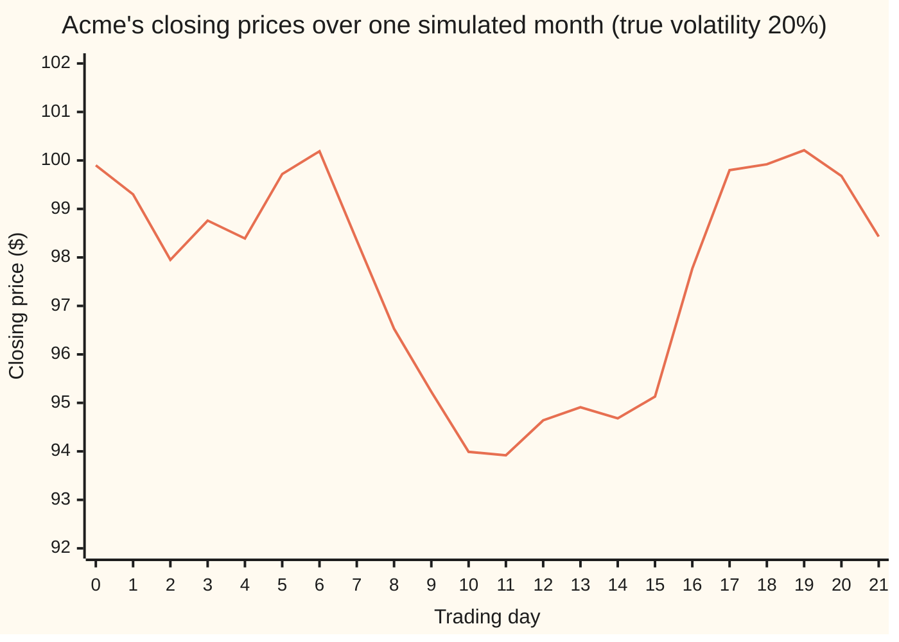
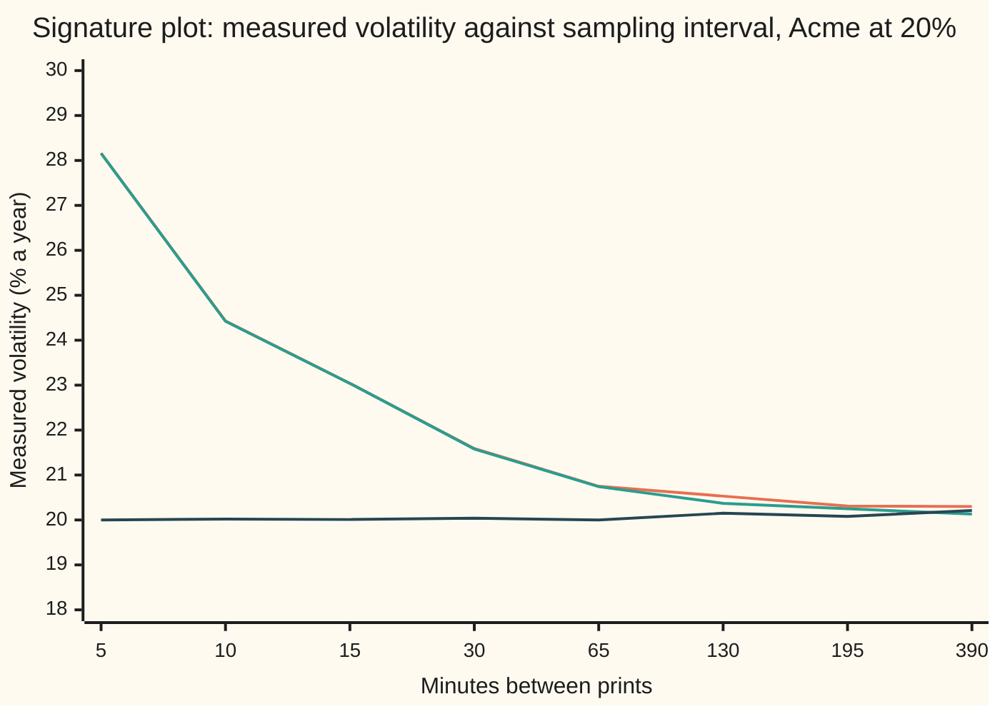

# Realised variance: add up squared daily returns, annualise, and know what the number is estimating

[Syllabus](../../../SYLLABUS.md) → [Financial mathematics](../README.md) → [Variance swaps, the log contract and VIX](../README.md#s19) → Realised variance

---

## General Overview

Acme shares, the house stock, start a month at $100. For 21 trading days a computer moves the price minute by minute with a volatility of exactly 20 percent a year. Volatility is how jumpy a price is: the typical size of its moves, scaled to a year. Every trade happens at the bid or the ask, 10 cents either side of the true price. At the end of the month the close is $98.43.

Now forget how the path was made. Only the 22 closing prices are left: the one before day 1 and the 21 closes after it. How jumpy was Acme this month? The recipe the market uses is short. Take each day's move as a log return, the natural log of today's close over yesterday's. Square each one, so that up and down both count. Add the 21 squares. Multiply by 252 over 21, to scale a month to a year of trading days. That number is **realised variance**. Its square root is **realised volatility**. For this month it reads 19.05 percent against the 20 percent that generated the path.

The same month, sampled every five minutes instead of once a day, gives 1,638 returns instead of 21. More data should mean a better answer. On the true prices it does: 19.75 percent. On the prices people actually traded at, it reads 28.04 percent. The extra eight points are not Acme. They are the price hopping between bid and ask.

This card defines the number, shows what it converges to, shows two estimators that use each day's high and low to squeeze more out of the same 21 days, and shows why sampling too finely measures the market's plumbing instead of the share.

**Realised variance is the sum of squared log returns, scaled to a year; for a share whose price wanders smoothly it estimates the variance the share actually delivered, more precisely the more returns it adds up, until the bid-ask spread starts adding its own squares.**

**What kind of fact this is:** a definition, with a market convention for the 252; that it converges to the variance actually delivered is a theorem, proved on this card in Why it works for a share with steady volatility, and the noise bias is exact for the simple bid-ask model and only roughly true of real markets.

### The picture: the month of closes



Orange: the close each day, as traded. Day 0 is the last print before the month starts: the true price is 100 dollars and that trade went through at the bid, $99.90. The path drifts down six dollars and back. Realised variance ignores the drift and adds up the size of each day's step.

---

## The formula

Notation first, in words. $\sum_{i=1}^{N}$ means "add up the next thing for $i = 1, 2, \dots, N$". A hat on a letter marks an estimate made from data: $\hat\sigma$ is read "sigma-hat", an estimate of the true volatility $\sigma$.

$$\hat\sigma^2 = \frac{252}{N}\sum_{i=1}^{N} r_i^2, \qquad r_i = \ln\frac{S_i}{S_{i-1}}$$

**Read it aloud:** take each day's log return, square it, add them up, and multiply by the number of trading days in a year over the number of days you added.

| Symbol | Plain meaning | In our example | Push it up and the answer… |
| --- | --- | --- | --- |
| $S_i$ | the closing price on day i; day 0 is the close before the window | $99.90 to $98.43 | only the ratios between closes matter |
| $r_i$ | the log return on day i: $\ln(S_i/S_{i-1})$, near the percentage move for small moves | day 2: −0.013758 | bigger moves, bigger variance, whichever sign |
| $N$ | how many daily returns are added | 21 | the estimate wobbles less, like $\sqrt{2/N}$ |
| $\hat\sigma^2$ | realised variance, per year | 0.036304 | — |
| $\sigma$ | the true volatility that drove the path | 20% | realised variance centres on $\sigma^2$ = 0.04 |
| $\mu$ | the share's drift, its average growth per year | 3% | almost no effect over a month |
| $T$ | the window's length in years, $N/252$ | 21/252 | — |
| $n$ | how many returns inside the window when sampling faster than daily | 1,638 five-minute returns | on true prices: less wobble; on traded prices: more noise |
| $\Delta t$ | the time between two prints, in years | 5 minutes, one 78th of a 6.5-hour trading day | — |
| $h$ | half the bid-ask spread, as a log: each trade lands at true price times $e^{\pm h}$ | 0.001, 10 cents on $100 | adds $2nh^2/T$ to the measured variance |
| $H_i$, $L_i$ | the highest and lowest price on day i | from minute prices | a wider range, a bigger range estimate |
| $O_i$, $C_i$ | the open and close on day i | open = yesterday's close here | — |

Two range estimators use more of each day. Each is annualised the same way, 252 over $N$ times a sum over days.

$$\hat\sigma^2_{\text{P}} = \frac{252}{N}\sum_{i=1}^{N}\frac{\big(\ln(H_i/L_i)\big)^2}{4\ln 2}$$

Parkinson's estimator: the square of each day's log range, the distance from low to high, divided by $4\ln 2$ = 2.7726, the average squared range of a random walk with unit variance per day.

$$\hat\sigma^2_{\text{GK}} = \frac{252}{N}\sum_{i=1}^{N}\Big[\tfrac12\big(\ln(H_i/L_i)\big)^2 - (2\ln 2 - 1)\big(\ln(C_i/O_i)\big)^2\Big]$$

Garman and Klass's estimator: half the squared range, less a fraction $2\ln 2 - 1$ = 0.3863 of the squared open-to-close move. Garman and Klass searched for the weights that make the estimate wobble least; this two-term form is their practical version, almost as good.

And the noise bias, for returns sampled $n$ times with every print off by $\pm h$:

$$\text{expected measured variance per year} = \sigma^2 + \frac{2nh^2}{T}$$

### When it holds

- **Steady volatility and no jumps.** Realised variance then centres on $\sigma^2$. If volatility changes during the month it centres on the month's average variance instead, which is exactly what a variance swap pays on. A jump adds its own square in full, however rare it was meant to be. The jump bias gets its own card: [The volatility swap and the jump bias](05-volatility-swap-and-jump-bias.md).
- **Enough returns.** With $N$ = 21 the estimate's spread is about 31 percent of its size. A single month reading 19.05 percent against a true 20 is inside the normal wobble, not evidence of anything.
- **Prices that are the share's price.** Every traded price carries bid-ask noise. At daily sampling it barely matters; at five-minute sampling it adds 0.039312 a year. The rule of thumb in practice is to sample no faster than every five to thirty minutes, or to use a noise-corrected estimator.
- **Trading through the day, and a true high and low.** The range estimators assume the price is watched continuously. Read from minute prices they miss the true extremes by a little and read low: across 400 simulated months, 19.43 percent for Parkinson and 19.12 percent for Garman-Klass against the true 20. They also assume the open equals yesterday's close: real overnight gaps need an extra term.

---

## Why it works

### Step 0: a squared move is an unbiased reading of variance

A random move with average zero has variance equal to its average square. One day's move tells almost nothing about direction. Its square, averaged over many days, tells the variance. Realised variance is that average, and the 252 turns a per-day number into a per-year one. Everything below is about how good that reading is and what spoils it.

### Step 1: each squared return averages $\sigma^2\Delta t$

Under geometric Brownian motion ([Quadratic variation](../../11-Stochastic%20processes%20and%20calculus/05-Brownian%20Motion/03-quadratic-variation.md) has the background), one step's log return is a fixed drift piece plus a bell-curve shock:

$$r_i = \big(\mu - \tfrac12\sigma^2\big)\Delta t + \sigma\sqrt{\Delta t}\,Z_i$$

where $Z$ is a standard bell-curve draw, a fresh one each step, average 0, average square 1. Square and average. The shock's square averages $\sigma^2\Delta t$. The cross term averages zero. The drift's square is of size $\Delta t^2$, the square of a small fraction of a year, far too small to matter.

So each squared return averages $\sigma^2\Delta t$. Add $N$ of them, one per day, and the total averages $\sigma^2 N\Delta t = \sigma^2 T$. For the month that is $0.04 \times 21/252$ = 0.003333. Divide by $T$ and the formula centres on $\sigma^2$: realised variance is unbiased, up to that negligible drift term. Its square root, the volatility, reads slightly low on average, because a square root bends down.

### Step 2: the wobble shrinks like $\sqrt{2/N}$

A squared bell-curve draw has variance 2 (its fourth moment is 3, less its mean squared, 1). So each $r_i^2$ wobbles by $\sqrt2\,\sigma^2\Delta t$ around its average. The $N$ days are independent, so their variances add: the sum wobbles by $\sqrt{2N}\,\sigma^2\Delta t$. Relative to its average $N\sigma^2\Delta t$, that is $\sqrt{2/N}$.

For 21 days: 0.3086. The simulation of 400 months measures 0.3053. For a year of 252 days: 0.0891. The same law as a sample mean's standard error ([Standard error](../../09-Probability%20and%20statistics/07-Sampling%20and%20Estimation/02-sample-mean-and-standard-error.md)), applied to squares.

### Step 3: sample faster and the sum converges on the quadratic variation

Keep the month fixed at $T$ and cut it into $n$ smaller steps. The average of the sum stays $\sigma^2 T$. The relative wobble is now $\sqrt{2/n}$, which goes to zero as $n$ grows. In the limit the sum of squared log returns stops being random: it equals $\sigma^2 T$ exactly. That limit is the **quadratic variation** of the log price, the variance the path actually delivered. If $\sigma$ itself moves, the same argument gives the time-integral of $\sigma^2$ over the window.

On the true Acme prices, 1,638 five-minute returns give 19.75 percent, within its much smaller wobble of 20.

<details>
<summary>Detailed proof: mean and variance of the realised sum</summary>

Write $a = (\mu - \tfrac12\sigma^2)\Delta t$ and $b = \sigma\sqrt{\Delta t}$, so $r_i = a + bZ_i$ with the draws independent and standard normal.

Mean: $E[r_i^2] = a^2 + 2ab\,E[Z_i] + b^2E[Z_i^2] = a^2 + b^2$.

Variance: $r_i^2 - E[r_i^2] = 2abZ_i + b^2(Z_i^2 - 1)$. These two pieces are uncorrelated because $E[Z^3] = 0$, so $\text{Var}(r_i^2) = 4a^2b^2 + b^4\,\text{Var}(Z^2) = 4a^2b^2 + 2b^4$.

Sum over $n$ steps with $n\Delta t = T$: mean $\sigma^2 T + (\mu - \tfrac12\sigma^2)^2 T\Delta t$, variance $2\sigma^4 T\Delta t + 4(\mu - \tfrac12\sigma^2)^2\sigma^2 T\Delta t^2$. Both correction terms carry a factor $\Delta t$, so as $\Delta t \to 0$ the mean tends to $\sigma^2 T$ and the variance to 0. A quantity whose mean tends to a limit and whose variance tends to zero converges to that limit in mean square. Relative to the mean, the leading standard deviation is $\sqrt{2\sigma^4 T\Delta t}/(\sigma^2 T) = \sqrt{2/n}$.

</details>

### Step 4: traded prices add the spread's squares

Now each print is the true log price plus a small error: $+h$ if the trade hit the ask, $-h$ if it hit the bid, each equally likely and independent of everything else. A measured return is the true return plus the difference of two errors. The difference is $0$ or $\pm 2h$, and its average square is $2h^2$. It is uncorrelated with the true return, so the cross term averages zero.

Neighbouring measured returns share an error, so they are not independent; averages still add. Each measured squared return therefore averages $\sigma^2\Delta t + 2h^2$. Add $n$ of them and divide by $T$:

$$\sigma^2 + \frac{2nh^2}{T}.$$

The true part is fixed as $n$ grows. The noise part grows in proportion to $n$. Sampling faster adds more bid-ask squares, not more information. For Acme at five minutes: $2 \times 1638 \times 0.001^2 \times 12$ = 0.039312, total 0.079312, a volatility of 28.16 percent. The one simulated month reads 28.04.

Plotting measured volatility against the sampling interval gives a **signature plot**. Each point below averages 400 simulated months.



Orange: traded prices, simulated. Green: the formula $\sqrt{\sigma^2 + 2nh^2/T}$, almost on top of orange. Dark blue: true prices, flat at 20. The 390-minute point is one sample a day. The orange line climbs as the interval shrinks; that climb is the bias, and its shape is how practitioners spot noise in real data.

### Step 5: a day's range carries more than its close

The close-to-close return uses two numbers per day. The day's high and low record where the price went in between. A day that swings far up, then far down, and closes where it opened has a close-to-close return of zero and a large range.

For a random walk with unit variance per day, the squared log range averages $4\ln 2$. Parkinson (1980) proved this from the known distribution of a random walk's range; dividing by it gives an unbiased variance estimate. Garman and Klass (1980) then combined the range with the open-to-close move, choosing weights to make the wobble as small as possible.

Efficiency here means how many days of close-to-close data one day of the other estimator is worth: the ratio of the two estimators' squared spread/mean. Spread relative to the mean, so an estimator that reads low does not look precise for that reason alone. Across 400 simulated months:

```
spread/mean of the monthly variance estimate, 400 months, one block = 0.01
close-to-close  ██████████████████████████████  0.3053
Parkinson       ██████████████                  0.1367
Garman-Klass    ███████████                     0.1136
```

Efficiency: 4.99 for Parkinson, 7.22 for Garman-Klass, near the theoretical 4.9 and 7.4. A month of ranges pins volatility down about as well as five to seven months of closes. The price: both lean on a true high and low and on no overnight gap, and both read low on minute data, as When it holds records.

### The other road: the delta-hedger's profit

A dealer who sells an option at 20 percent volatility and hedges daily earns, each day, half the gamma times the squared price times the gap between 0.04/252 and that day's squared return ([Theta pays for gamma](../09-The%20Greeks%2C%20one%20each/10-theta-pays-for-gamma-hedged-pnl.md)). Added up over the month, the dealer's profit is a gamma-weighted realised variance compared with the implied one. Realised variance is the quantity the hedging book already settles on; a variance swap removes the gamma weighting and pays it directly.

---

## Worked numbers, by hand

Acme's 22 closes, as traded. Log returns from the checks.

| Step | Arithmetic | Value |
| --- | --- | --- |
| day 1 log return | $\ln(99.3050 / 99.90)$ | −0.005974 |
| its square | $(-0.005974)^2$ | 0.00003569 |
| day 2 log return | $\ln(97.9481 / 99.3050)$ | −0.013758 |
| its square | | 0.00018928 |
| day 3 log return | $\ln(98.7640 / 97.9481)$ | +0.008295 |
| its square | | 0.00006880 |
| … 18 more days, same way | | |
| sum of 21 squares | | 0.003025 |
| annualise | × 252/21 = × 12 | 0.036304 |
| **realised volatility** | $\sqrt{0.036304}$ | **19.05%** |
| quadratic variation the path delivered | $0.04 \times 21/252$ | 0.003333 |
| five-minute prints, bounce term | $2 \times 1638 \times 0.001^2 \times 12$ | 0.039312 |
| five-minute prints, expected total | $0.04 + 0.039312$ | 0.079312, i.e. 28.16% |
| five-minute prints, this month | from the checks | 28.04% |

The daily sum, 0.003025, reads under the 0.003333 the path delivered. The shortfall is well inside the 31 percent wobble of a 21-day estimate. On the same month, Parkinson reads 19.74 percent and Garman-Klass 20.07 percent.

### What breaks if you drop a piece

Same 21 closes, correct answer 19.05 percent:

| Mistake | Comes out at | What went wrong |
| --- | --- | --- |
| Annualise with 365 | 22.93% | Calendar days; the returns came from trading days. Too high by $\sqrt{365/252}$. |
| Quote the variance as a volatility | 3.63% | 0.036304 is variance; its square root is the volatility. |
| Textbook sample variance: remove the mean, divide by $N - 1$ | 19.49% | Not wrong as statistics; wrong for a contract. Variance contracts assume mean zero and divide by $N$. |
| Simple returns, $S_i/S_{i-1} - 1$ | 19.09% | Small on quiet days, larger after big moves; contracts use logs. |
| Sample every five minutes on traded prices | 28.04% | Measures the bid-ask bounce as much as the share. |

---

## Code, from first principles, and it actually runs

The scripts build Acme's month minute by minute from their own random numbers (splitmix64 integers turned into bell-curve draws by the Box-Muller formula), put every five-minute print at the bid or the ask, and compute every number on the card. Three independent roads meet: the closed-form mean and wobble of Why it works ($\sigma^2$, $\sqrt{2/N}$, $\sigma^2 + 2nh^2/T$); a 400-month simulation that measures the same things; and the range estimators, which reach $\sigma$ from highs and lows instead of closes. Both languages draw the same random numbers, so the two outputs agree to the digit.

### Python

```python
# Realised variance from daily prices -- the check behind the card.  Standard library only.
# Nothing imported knows the answer: random numbers are splitmix64 + Box-Muller written out,
# the share's path is built minute by minute, every estimator is a loop.
from math import log, sqrt, cos, sin, pi, exp
M64 = (1 << 64) - 1

class Rng:                                   # splitmix64 uniforms, Box-Muller bell-curve draws
    def __init__(s, seed): s.x, s.spare = seed, None
    def u(s):
        s.x = (s.x + 0x9E3779B97F4A7C15) & M64
        z = s.x
        z = ((z ^ (z >> 30)) * 0xBF58476D1CE4E5B9) & M64
        z = ((z ^ (z >> 27)) * 0x94D049BB133111EB) & M64
        return (((z ^ (z >> 31)) >> 11) + 0.5) / 9007199254740992.0
    def z(s):
        if s.spare is not None:
            v, s.spare = s.spare, None
            return v
        r, t = sqrt(-2.0 * log(s.u())), 2.0 * pi * s.u()
        s.spare = r * sin(t)
        return r * cos(t)

SIG, MU, H, DAYS, M = 0.20, 0.03, 0.001, 21, 390   # true vol, drift, half-spread, days, minutes a day
T = DAYS / 252.0

def month(g):
    # One month of Acme, minute by minute.  Returns log prices every 5 minutes, and each
    # day's open, high, low, close (logs, high and low read from the minute prices).
    dt = 1.0 / (252 * M)
    a, b = (MU - 0.5 * SIG * SIG) * dt, SIG * sqrt(dt)
    x = log(100.0); prints, ohlc = [x], []
    for d in range(DAYS):
        o = hi = lo = x
        for j in range(M):
            x += a + b * g.z(); hi = max(hi, x); lo = min(lo, x)
            if (j + 1) % 5 == 0: prints.append(x)
        ohlc.append((o, hi, lo, x))
    return prints, ohlc

def rv(p, k):                                # annualised: squared log returns every k prints, x 252/N
    return 252.0 / DAYS * sum((p[i] - p[i - k]) ** 2 for i in range(k, len(p), k))
L4, GKW = 4.0 * log(2.0), 2.0 * log(2.0) - 1.0
def parkinson(ohlc): return 252.0 / DAYS * sum((h - l) ** 2 / L4 for o, h, l, c in ohlc)
def garman_klass(ohlc): return 252.0 / DAYS * sum(0.5 * (h - l) ** 2 - GKW * (c - o) ** 2 for o, h, l, c in ohlc)
def noise_formula(n, h): return SIG * SIG + 2.0 * n * h * h / T   # sigma^2 + 2 n h^2, per year

g = Rng(135)
clean, ohlc = month(g)
traded = [x + (H if g.u() < 0.5 else -H) for x in clean]      # each print at the bid or the ask
closes = traded[::78]
rets = [closes[i] - closes[i - 1] for i in range(1, DAYS + 1)]
ssq = sum(r * r for r in rets)
var_cc = 252.0 / DAYS * ssq
print("chart, closes " + " ".join(f"{exp(c):.2f}" for c in closes))
for i in range(3):
    print(f"day {i + 1}  close {exp(closes[i + 1]):8.4f}  log return {rets[i]:+.6f}  squared {rets[i] ** 2:.8f}")
print(f"sum of 21 squared log returns    {ssq:.6f}")
print(f"x 252/21 = realised variance      {var_cc:.6f}")
print(f"realised vol, closes              {100 * sqrt(var_cc):.2f}%")
mean = sum(rets) / DAYS
print(f"textbook: mean removed, N-1       {100 * sqrt(252.0 / (DAYS - 1) * sum((r - mean) ** 2 for r in rets)):.2f}%")
print(f"wrong: x 365 not 252              {100 * sqrt(365.0 / DAYS * ssq):.2f}%")
print(f"wrong: simple returns             {100 * sqrt(252.0 / DAYS * sum((exp(r) - 1) ** 2 for r in rets)):.2f}%")
print(f"wrong: variance read as vol       {100 * var_cc:.2f}%")
print(f"true quadratic variation 21 days  {SIG * SIG * T:.6f}")
print(f"5-min, true prices                {100 * sqrt(rv(clean, 1)):.2f}%   n = {len(clean) - 1}")
print(f"5-min, as traded                  {100 * sqrt(rv(traded, 1)):.2f}%   formula {100 * sqrt(noise_formula(1638, H)):.2f}%")
print(f"bounce adds 2 n h^2 / T           {2.0 * 1638 * H * H / T:.6f}   total {noise_formula(1638, H):.6f}")
print(f"constants  4 ln 2 = {L4:.4f}   2 ln 2 - 1 = {GKW:.4f}")
print(f"one month: Parkinson              {100 * sqrt(parkinson(ohlc)):.2f}%")
print(f"one month: Garman-Klass           {100 * sqrt(garman_klass(ohlc)):.2f}%")
# ---- many months: how much each estimator wobbles around the truth ----
P, KS = 400, (1, 2, 3, 6, 13, 26, 39, 78)
est = {"close-to-close": [], "Parkinson": [], "Garman-Klass": []}
sig_t, sig_c = [0.0] * len(KS), [0.0] * len(KS)          # signature plot: averages over the months
for _ in range(P):
    cl, oh = month(g)
    tr = [x + (H if g.u() < 0.5 else -H) for x in cl]
    for j, k in enumerate(KS):
        sig_t[j] += rv(tr, k) / P; sig_c[j] += rv(cl, k) / P
    est["close-to-close"].append(252.0 / DAYS * sum((c - o) ** 2 for o, h, l, c in oh))
    est["Parkinson"].append(parkinson(oh)); est["Garman-Klass"].append(garman_klass(oh))
stats = {}
for name, xs in est.items():
    m = sum(xs) / P
    sd = sqrt(sum((x - m) ** 2 for x in xs) / (P - 1))
    stats[name] = (m, sd)
cv_c = stats["close-to-close"][1] / stats["close-to-close"][0]   # spread/mean of close-to-close
print(f"{P} months       average    spread/mean   efficiency")
for name, (m, sd) in stats.items():
    print(f"{name:<15} {100 * sqrt(m):7.2f}%   {sd / m:11.4f}   {(cv_c * m / sd) ** 2:10.2f}")
print("signature, 400-month average  minutes  as traded  formula  true prices")
for j, k in enumerate(KS):
    print(f"signature  {5 * k:7d}  {100 * sqrt(sig_t[j]):9.2f}  {100 * sqrt(noise_formula(1638 // k, H)):7.2f}  {100 * sqrt(sig_c[j]):11.2f}")
print(f"theory, close-to-close spread/mean sqrt(2/21) = {sqrt(2.0 / DAYS):.4f}")
print(f"try: half-spread 5 cents, 5-min   {100 * sqrt(noise_formula(1638, 0.0005)):.2f}%")
print(f"try: 1-minute prints, 10 cents    {100 * sqrt(noise_formula(8190, H)):.2f}%")
print(f"try: 252 days, spread/mean        {sqrt(2.0 / 252):.4f}")

mc, sdc = stats["close-to-close"]
assert abs(mc - SIG * SIG) < 3 * sdc / sqrt(P) + 1e-4,         "close-to-close is unbiased for sigma^2"
assert abs(sdc / mc - sqrt(2.0 / DAYS)) < 0.15 * sqrt(2.0 / DAYS), "its wobble matches sqrt(2/N)"
assert abs(sqrt(sig_t[0]) - sqrt(noise_formula(1638, H))) < 0.003, "noise bias: simulation vs formula"
assert abs(sqrt(rv(clean, 1)) - SIG) < 0.01,                     "5-min true prices recover 20%"
for name in ("Parkinson", "Garman-Klass"):
    m, sd = stats[name]
    assert (cv_c * m / sd) ** 2 > 3,                                 "ranges beat closes"
    assert 0.85 * SIG * SIG < m < SIG * SIG,                         "minute ranges read a little low"
print("ALL CHECKS PASS")
```

**Ran 2026-09-27 on macOS, Python 3.14.6, standard library only. All checks passed. Output, pasted from the run:**

```
chart, closes 99.90 99.30 97.95 98.76 98.39 99.72 100.19 98.35 96.53 95.23 93.99 93.92 94.64 94.91 94.68 95.13 97.77 99.80 99.92 100.21 99.68 98.43
day 1  close  99.3050  log return -0.005974  squared 0.00003569
day 2  close  97.9481  log return -0.013758  squared 0.00018928
day 3  close  98.7640  log return +0.008295  squared 0.00006880
sum of 21 squared log returns    0.003025
x 252/21 = realised variance      0.036304
realised vol, closes              19.05%
textbook: mean removed, N-1       19.49%
wrong: x 365 not 252              22.93%
wrong: simple returns             19.09%
wrong: variance read as vol       3.63%
true quadratic variation 21 days  0.003333
5-min, true prices                19.75%   n = 1638
5-min, as traded                  28.04%   formula 28.16%
bounce adds 2 n h^2 / T           0.039312   total 0.079312
constants  4 ln 2 = 2.7726   2 ln 2 - 1 = 0.3863
one month: Parkinson              19.74%
one month: Garman-Klass           20.07%
400 months       average    spread/mean   efficiency
close-to-close    20.21%        0.3053         1.00
Parkinson         19.43%        0.1367         4.99
Garman-Klass      19.12%        0.1136         7.22
signature, 400-month average  minutes  as traded  formula  true prices
signature        5      28.16    28.16        20.00
signature       10      24.43    24.42        20.02
signature       15      23.04    23.04        20.01
signature       30      21.59    21.58        20.04
signature       65      20.75    20.74        20.00
signature      130      20.53    20.37        20.15
signature      195      20.31    20.25        20.08
signature      390      20.30    20.13        20.21
theory, close-to-close spread/mean sqrt(2/21) = 0.3086
try: half-spread 5 cents, 5-min   22.32%
try: 1-minute prints, 10 cents    48.64%
try: 252 days, spread/mean        0.0891
ALL CHECKS PASS
```

### Rust

```rust
// Realised variance from daily prices -- the same check as realised_variance_from_daily_prices_check.py.
// Standard library only, no crates.  Same splitmix64 + Box-Muller draws, so the same Acme month.
// Compile: rustc --edition 2021 -O realised_variance_from_daily_prices_check.rs -o /tmp/rv_check
use std::f64::consts::PI;

struct Rng { x: u64, spare: Option<f64> }
impl Rng {
    fn u(&mut self) -> f64 {
        self.x = self.x.wrapping_add(0x9E3779B97F4A7C15);
        let mut z = self.x;
        z = (z ^ (z >> 30)).wrapping_mul(0xBF58476D1CE4E5B9);
        z = (z ^ (z >> 27)).wrapping_mul(0x94D049BB133111EB);
        (((z ^ (z >> 31)) >> 11) as f64 + 0.5) / 9007199254740992.0
    }
    fn z(&mut self) -> f64 {
        if let Some(v) = self.spare.take() { return v; }
        let r = (-2.0 * self.u().ln()).sqrt();
        let t = 2.0 * PI * self.u();
        self.spare = Some(r * t.sin());
        r * t.cos()
    }
}

const SIG: f64 = 0.20; const MU: f64 = 0.03; const H: f64 = 0.001; const DAYS: usize = 21; const M: usize = 390;
const T: f64 = DAYS as f64 / 252.0;
type Ohlc = (f64, f64, f64, f64);

fn month(g: &mut Rng) -> (Vec<f64>, Vec<Ohlc>) {       // log prices every 5 minutes, daily open/high/low/close
    let dt = 1.0 / (252 * M) as f64;
    let (a, b) = ((MU - 0.5 * SIG * SIG) * dt, SIG * dt.sqrt());
    let mut x = 100.0_f64.ln();
    let (mut prints, mut ohlc) = (vec![x], Vec::new());
    for _ in 0..DAYS {
        let (o, mut hi, mut lo) = (x, x, x);
        for j in 0..M {
            x += a + b * g.z(); hi = hi.max(x); lo = lo.min(x);
            if (j + 1) % 5 == 0 { prints.push(x); }
        }
        ohlc.push((o, hi, lo, x));
    }
    (prints, ohlc)
}

fn rv(p: &[f64], k: usize) -> f64 {                    // annualised: squared log returns every k prints, x 252/N
    let mut s = 0.0;
    let mut i = k;
    while i < p.len() { s += (p[i] - p[i - k]).powi(2); i += k; }
    252.0 / DAYS as f64 * s
}
fn parkinson(oh: &[Ohlc]) -> f64 {
    let l4 = 4.0 * 2.0_f64.ln();
    252.0 / DAYS as f64 * oh.iter().fold(0.0, |s, &(_, h, l, _)| s + (h - l).powi(2) / l4)
}
fn garman_klass(oh: &[Ohlc]) -> f64 {
    let w = 2.0 * 2.0_f64.ln() - 1.0;
    252.0 / DAYS as f64 * oh.iter().fold(0.0, |s, &(o, h, l, c)| s + 0.5 * (h - l).powi(2) - w * (c - o).powi(2))
}
fn noise_formula(n: usize, h: f64) -> f64 { SIG * SIG + 2.0 * n as f64 * h * h / T }
fn bounce(g: &mut Rng, p: &[f64]) -> Vec<f64> { p.iter().map(|x| x + if g.u() < 0.5 { H } else { -H }).collect() }

fn main() {
    let mut g = Rng { x: 135, spare: None };
    let (clean, ohlc) = month(&mut g);
    let traded = bounce(&mut g, &clean);                 // each print at the bid or the ask
    let closes: Vec<f64> = traded.iter().step_by(78).cloned().collect();
    let rets: Vec<f64> = (1..=DAYS).map(|i| closes[i] - closes[i - 1]).collect();
    let ssq: f64 = rets.iter().map(|r| r * r).sum();
    let nd = DAYS as f64;
    let var_cc = 252.0 / nd * ssq;
    println!("chart, closes {}", closes.iter().map(|c| format!("{:.2}", c.exp())).collect::<Vec<_>>().join(" "));
    for i in 0..3 {
        println!("day {}  close {:8.4}  log return {:+.6}  squared {:.8}", i + 1, closes[i + 1].exp(), rets[i], rets[i] * rets[i]);
    }
    println!("sum of 21 squared log returns    {:.6}", ssq);
    println!("x 252/21 = realised variance      {:.6}", var_cc);
    println!("realised vol, closes              {:.2}%", 100.0 * var_cc.sqrt());
    let mean = rets.iter().sum::<f64>() / nd;
    let dm: f64 = rets.iter().map(|r| (r - mean).powi(2)).sum();
    println!("textbook: mean removed, N-1       {:.2}%", 100.0 * (252.0 / (nd - 1.0) * dm).sqrt());
    println!("wrong: x 365 not 252              {:.2}%", 100.0 * (365.0 / nd * ssq).sqrt());
    let simple: f64 = rets.iter().map(|r| (r.exp() - 1.0).powi(2)).sum();
    println!("wrong: simple returns             {:.2}%", 100.0 * (252.0 / nd * simple).sqrt());
    println!("wrong: variance read as vol       {:.2}%", 100.0 * var_cc);
    println!("true quadratic variation 21 days  {:.6}", SIG * SIG * T);
    println!("5-min, true prices                {:.2}%   n = {}", 100.0 * rv(&clean, 1).sqrt(), clean.len() - 1);
    println!("5-min, as traded                  {:.2}%   formula {:.2}%", 100.0 * rv(&traded, 1).sqrt(), 100.0 * noise_formula(1638, H).sqrt());
    println!("bounce adds 2 n h^2 / T           {:.6}   total {:.6}", 2.0 * 1638.0 * H * H / T, noise_formula(1638, H));
    println!("constants  4 ln 2 = {:.4}   2 ln 2 - 1 = {:.4}", 4.0 * 2.0_f64.ln(), 2.0 * 2.0_f64.ln() - 1.0);
    println!("one month: Parkinson              {:.2}%", 100.0 * parkinson(&ohlc).sqrt());
    println!("one month: Garman-Klass           {:.2}%", 100.0 * garman_klass(&ohlc).sqrt());

    // ---- many months: how much each estimator wobbles around the truth ----
    let p = 400usize;
    let ks = [1usize, 2, 3, 6, 13, 26, 39, 78];
    let mut est: Vec<Vec<f64>> = vec![Vec::new(), Vec::new(), Vec::new()];
    let (mut sig_t, mut sig_c) = (vec![0.0; ks.len()], vec![0.0; ks.len()]);
    for _ in 0..p {
        let (cl, oh) = month(&mut g);
        let tr = bounce(&mut g, &cl);
        for (j, &k) in ks.iter().enumerate() { sig_t[j] += rv(&tr, k) / p as f64; sig_c[j] += rv(&cl, k) / p as f64; }
        est[0].push(252.0 / nd * oh.iter().fold(0.0, |s, &(o, _, _, c)| s + (c - o).powi(2)));
        est[1].push(parkinson(&oh)); est[2].push(garman_klass(&oh));
    }
    let names = ["close-to-close", "Parkinson", "Garman-Klass"];
    let stats: Vec<(f64, f64)> = est.iter().map(|xs| {
        let m = xs.iter().sum::<f64>() / p as f64;
        (m, (xs.iter().map(|x| (x - m).powi(2)).sum::<f64>() / (p - 1) as f64).sqrt())
    }).collect();
    let cv_c = stats[0].1 / stats[0].0;                 // spread/mean of close-to-close
    println!("{} months       average    spread/mean   efficiency", p);
    for (name, &(m, sd)) in names.iter().zip(stats.iter()) {
        println!("{:<15} {:7.2}%   {:11.4}   {:10.2}", name, 100.0 * m.sqrt(), sd / m, (cv_c * m / sd).powi(2));
    }
    println!("signature, 400-month average  minutes  as traded  formula  true prices");
    for (j, &k) in ks.iter().enumerate() {
        println!("signature  {:7}  {:9.2}  {:7.2}  {:11.2}", 5 * k, 100.0 * sig_t[j].sqrt(), 100.0 * noise_formula(1638 / k, H).sqrt(), 100.0 * sig_c[j].sqrt());
    }
    println!("theory, close-to-close spread/mean sqrt(2/21) = {:.4}", (2.0 / nd).sqrt());
    println!("try: half-spread 5 cents, 5-min   {:.2}%", 100.0 * noise_formula(1638, 0.0005).sqrt());
    println!("try: 1-minute prints, 10 cents    {:.2}%", 100.0 * noise_formula(8190, H).sqrt());
    println!("try: 252 days, spread/mean        {:.4}", (2.0 / 252.0_f64).sqrt());

    let (mc, sdc) = stats[0];
    assert!((mc - SIG * SIG).abs() < 3.0 * sdc / (p as f64).sqrt() + 1e-4, "close-to-close is unbiased for sigma^2");
    assert!((sdc / mc - (2.0 / nd).sqrt()).abs() < 0.15 * (2.0 / nd).sqrt(), "its wobble matches sqrt(2/N)");
    assert!((sig_t[0].sqrt() - noise_formula(1638, H).sqrt()).abs() < 0.003, "noise bias: simulation vs formula");
    assert!((rv(&clean, 1).sqrt() - SIG).abs() < 0.01, "5-min true prices recover 20%");
    for &(m, sd) in &stats[1..] {
        assert!((cv_c * m / sd).powi(2) > 3.0, "ranges beat closes");
        assert!(0.85 * SIG * SIG < m && m < SIG * SIG, "minute ranges read a little low");
    }
    println!("ALL CHECKS PASS");
}
```

**Ran 2026-09-27 on macOS, rustc 1.98.1, no crates. All checks passed. Output, pasted from the run:**

```
chart, closes 99.90 99.30 97.95 98.76 98.39 99.72 100.19 98.35 96.53 95.23 93.99 93.92 94.64 94.91 94.68 95.13 97.77 99.80 99.92 100.21 99.68 98.43
day 1  close  99.3050  log return -0.005974  squared 0.00003569
day 2  close  97.9481  log return -0.013758  squared 0.00018928
day 3  close  98.7640  log return +0.008295  squared 0.00006880
sum of 21 squared log returns    0.003025
x 252/21 = realised variance      0.036304
realised vol, closes              19.05%
textbook: mean removed, N-1       19.49%
wrong: x 365 not 252              22.93%
wrong: simple returns             19.09%
wrong: variance read as vol       3.63%
true quadratic variation 21 days  0.003333
5-min, true prices                19.75%   n = 1638
5-min, as traded                  28.04%   formula 28.16%
bounce adds 2 n h^2 / T           0.039312   total 0.079312
constants  4 ln 2 = 2.7726   2 ln 2 - 1 = 0.3863
one month: Parkinson              19.74%
one month: Garman-Klass           20.07%
400 months       average    spread/mean   efficiency
close-to-close    20.21%        0.3053         1.00
Parkinson         19.43%        0.1367         4.99
Garman-Klass      19.12%        0.1136         7.22
signature, 400-month average  minutes  as traded  formula  true prices
signature        5      28.16    28.16        20.00
signature       10      24.43    24.42        20.02
signature       15      23.04    23.04        20.01
signature       30      21.59    21.58        20.04
signature       65      20.75    20.74        20.00
signature      130      20.53    20.37        20.15
signature      195      20.31    20.25        20.08
signature      390      20.30    20.13        20.21
theory, close-to-close spread/mean sqrt(2/21) = 0.3086
try: half-spread 5 cents, 5-min   22.32%
try: 1-minute prints, 10 cents    48.64%
try: 252 days, spread/mean        0.0891
ALL CHECKS PASS
```

The two outputs are identical line for line. The asserts compare simulation with theory: the 400-month average of close-to-close variance against 0.04, its measured wobble against $\sqrt{2/21}$, the five-minute traded average against the noise formula, the one month's five-minute true-price reading against 20 percent, and the range estimators' averages against a band just under 0.04. Breaking the annualisation, the factor 2 in the noise term, the step size or the constant $4\ln 2$ each makes an assert fail.

> [!TIP]
> **Try changing**
> Guess the direction first, then check the numbers the scripts print.
> - **Halve the spread.** Five-cent half-spread, `h = 0.0005`, five-minute prints: the expected reading drops from 28.16% to **22.32%**. The noise term goes with the square of the spread.
> - **Sample every minute.** Ten-cent half-spread, 8,190 one-minute returns: **48.64%**. More than double the truth.
> - **Use a year of closes.** 252 daily returns: the relative wobble falls from 0.3086 to **0.0891**. Twelve times the data, about a third of the wobble.

---

## The usual mistake

> [!warning]
> **Treating a month's realised volatility as the share's volatility.** It is one draw from a noisy estimate. With 21 daily returns its spread is about 31 percent of its size, so a share that truly runs at 20 percent will often print several points away from 20 in an ordinary month. Comparing one month's 19.05 with an implied 20 and calling the option dear is reading noise.
>
> - **Assuming more data always helps.** On traded prices, five-minute sampling reads 28.04 percent; one-minute sampling would read about 48.64. Past a point, finer sampling measures the spread.
> - **Mixing variance and volatility.** Variance is the square: 0.036304 a year. Volatility is its root: 19.05 percent. Variances add across days; volatilities do not.
> - **Annualising with the wrong day count.** Trading-day returns scale by 252, not 365: 22.93 percent instead of 19.05.
> - **Using range estimators on data that breaks their assumptions.** Minute-bar highs and lows and overnight gaps pull them low. Across 400 months Parkinson read 19.43 and Garman-Klass 19.12, against a true 20.

---

## Where you meet it in real life

- **Variance swap settlement.** A variance swap pays the difference between realised variance over its life and a strike fixed on day one, times a notional. The exchange-traded version, Cboe's S&P 500 variance futures, uses exactly this card's formula: daily log returns, mean taken as zero, 252 days a year, times 10,000 to quote in percent squared. Conventions verified 2026-09-27 against the Cboe contract specification in Sources. Pricing the strike is [The variance swap](03-variance-swap-fair-strike.md); marking one halfway through, with realised and implied pieces added, is [Marking a variance swap](04-variance-swap-after-inception-and-forward-variance.md).
- **Option desks.** Traders compare implied volatility, the number the option price implies, with realised volatility, the number the share delivered. The gap is what a delta-hedged book earns or loses.
- **The VIX against realised.** The VIX is a 30-day implied variance read off option prices ([The VIX](06-vix-index.md)). Realised variance over the following 30 days is what it is compared with after the fact.
- **Risk systems.** Position limits and value-at-risk models scale by recent realised volatility; forecasting models build tomorrow's variance out of today's squared returns.
- **High-frequency econometrics.** Research on intraday data uses realised variance from five-minute returns, a compromise between wobble and bid-ask noise, or two-scale estimators that subtract the noise term measured at the fastest sampling.

> **Say it back**
> Realised variance squares each day's log return, adds them up, and multiplies by 252 over the number of days. Each square averages the day's share of the true variance, so the sum is unbiased, and its relative wobble is $\sqrt{2/N}$: about 31 percent for a month. Sampling faster shrinks the wobble towards the quadratic variation, until bid-ask noise adds $2h^2$ to every return and the reading climbs. Using each day's high and low instead of just the close is worth five to seven months of closes per month, if the high and low are real. For Acme's month: 19.05 percent from closes, 28.04 from five-minute trades, against a true 20.

---

## What this builds on

- [Theta pays for gamma](../09-The%20Greeks%2C%20one%20each/10-theta-pays-for-gamma-hedged-pnl.md): why realised variance is money. A hedged option book earns half gamma times the squared price times implied variance less realised variance, day by day.
- [Standard error](../../09-Probability%20and%20statistics/07-Sampling%20and%20Estimation/02-sample-mean-and-standard-error.md): realised variance is a sample mean of squares, and its wobble shrinks the way a standard error does.
- [Quadratic variation](../../11-Stochastic%20processes%20and%20calculus/05-Brownian%20Motion/03-quadratic-variation.md): the limit the sum of squares converges to, for any path driven by Brownian motion.

## Where this goes next

- [The variance swap](03-variance-swap-fair-strike.md): a contract that pays realised variance, and the price of that promise today, from a strip of options through [Any payoff from a strip of options](02-carr-madan-spanning-and-the-log-contract.md).
- Persistence in practice: another way to summarise the shape of a price history from sliding windows of returns, used alongside realised variance to flag turbulent stretches.

Realised variance says what a month delivered; what the market charges today for the variance the next month will deliver, and how options replicate that payment, is the question variance-swap-fair-strike answers.

---

## Sources

Verified 2026-09-27: every link below resolves to the publisher's page.

- Parkinson, Michael. "The Extreme Value Method for Estimating the Variance of the Rate of Return." *Journal of Business* 53, no. 1 (1980): 61–65. [doi:10.1086/296071](https://doi.org/10.1086/296071). The range estimator and its $4\ln 2$.
- Garman, Mark B., and Michael J. Klass. "On the Estimation of Security Price Volatilities from Historical Data." *Journal of Business* 53, no. 1 (1980): 67–78. [doi:10.1086/296072](https://doi.org/10.1086/296072). Open, high, low and close combined with minimum-variance weights.
- Barndorff-Nielsen, Ole E., and Neil Shephard. "Econometric Analysis of Realized Volatility and Its Use in Estimating Stochastic Volatility Models." *Journal of the Royal Statistical Society Series B* 64, no. 2 (2002): 253–280. [doi:10.1111/1467-9868.00336](https://doi.org/10.1111/1467-9868.00336). Realised variance as an estimate of quadratic variation, with its error.
- Zhang, Lan, Per A. Mykland, and Yacine Aït-Sahalia. "A Tale of Two Time Scales." *Journal of the American Statistical Association* 100, no. 472 (2005): 1394–1411. [doi:10.1198/016214505000000169](https://doi.org/10.1198/016214505000000169). The noise bias $2nE[\varepsilon^2]$ and an estimator that removes it.
- Cboe Futures Exchange. *S&P 500 Variance Futures: Summary Product Specifications*. [Contract specification (PDF)](https://cdn.cboe.com/resources/futures/sp_500_variance_futures_contract.pdf). The settlement formula: daily log returns, zero mean, 252 business days a year.
