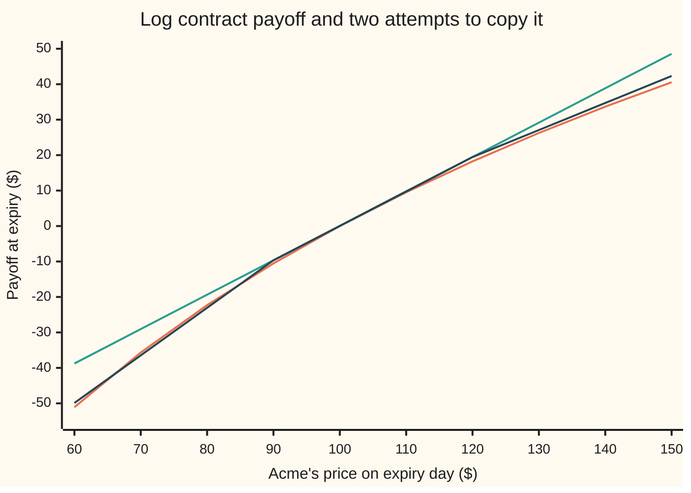
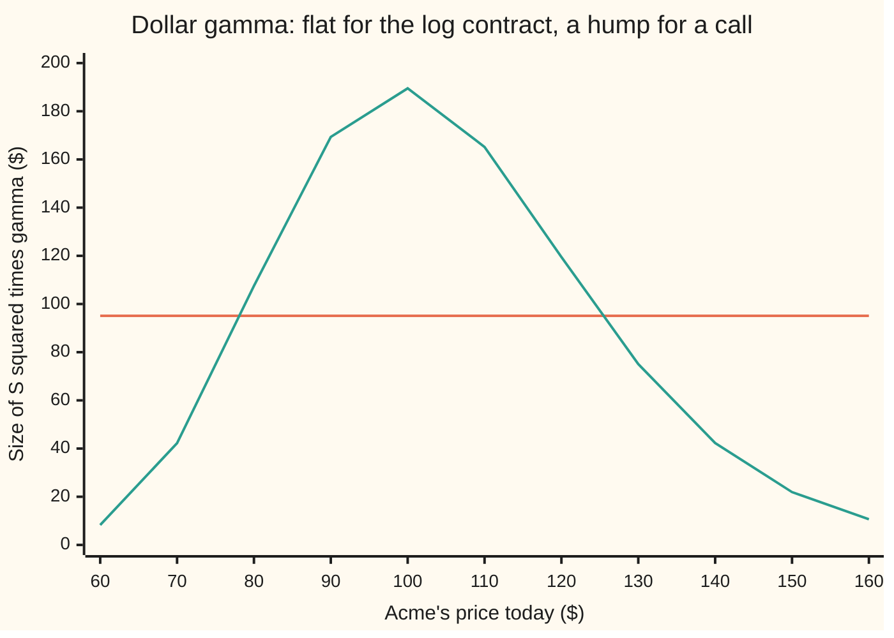

# Any payoff from a strip of options: integrate by parts twice, and the log contract is the case that trades variance

Financial mathematics → Variance swaps, the log contract and VIX → Building payoffs from vanillas → Any payoff from a strip of options

---

## General Overview

Acme shares trade at $100. A client wants a contract that no exchange lists: in one year it pays $100 times the natural log of Acme's price divided by 100. If Acme ends at $110 it pays $9.53. At $90 it costs the holder $10.54. At $100 it pays nothing. This is the **log contract**, and the job is to build it from things that do trade: cash, a forward on Acme, and ordinary one-year puts and calls.

The listed book has a 90-put at $2.71 and a 120-call at $2.71. A straight line through the forward price, $103.05, gets close to the log near the middle and badly wrong at the ends, because the log curves and a line does not. Each option is a single kink: flat on one side of its strike, sloped on the other. Kinks can bend a line. Sell a little of the 90-put and a little of the 120-call and the line bends down at both ends, toward the log.

Two kinks make a crude bend. Many kinks at many strikes make any bend at all. The right amount of each option is the payoff's **curvature** (its second derivative: how fast its slope changes) at that strike. For the log, the curvature is minus 100 divided by the strike squared. That weight, one over strike squared, is why the log contract matters: a strip weighted that way earns the same amount from every percent move, wherever the price sits, so it is a pure bet on how much Acme moves. Anthony Neuberger proposed the log contract in 1994; Peter Carr and Dilip Madan set out the general identity a few years later.

**Any smooth payoff at one expiry equals cash, plus a forward, plus puts below the forward and calls above it, each option held in proportion to the payoff's curvature at its strike; for the log payoff the weights are one over strike squared, and the options leg prices variance.**

**What kind of fact this is:** a theorem, proved on this card in Why it works. The identity is pathwise: it holds for every finishing price, in any model. Only the dollar value of the log contract, $0.95 here, uses the house lognormal model.

### The picture: a line, two kinks, and the curve they chase



Orange: the log payoff, $100 times ln(price/100). Green: the straight line through the forward, cash plus a forward. Dark: the two-strike book, the green line with 0.37 of a 90-put and 0.21 of a 120-call sold. The dark line bends toward the orange outside $90 and $120 and sits on the green line between them, where neither option pays. Between the strikes the log still curves and the book does not: that is the error a fine strip removes.

---

## The formula

Notation first, in words. $S_T$ is Acme's price on expiry day, unknown today. $F$ is the forward price, the price agreed today for delivery at expiry. A payoff is a rule $g$ that turns $S_T$ into dollars. Its slope at a point is written $g'$ and its curvature $g''$. A superscript plus means "keep it if positive, otherwise zero": $(S_T - K)^+$ is what a call struck at $K$ pays.

$$g(S_T) = g(F) + g'(F)\,(S_T - F) + \int_0^F g''(K)\,(K - S_T)^+\,dK + \int_F^\infty g''(K)\,(S_T - K)^+\,dK$$

**Read it aloud:** the payoff equals its value at the forward, plus its slope there times a forward position, plus puts at every strike below the forward and calls at every strike above, each bought in the amount of the payoff's curvature at that strike.

Take today's price of each piece. Cash of $g(F)$ at expiry costs $D\,g(F)$ today, where $D = e^{-rT}$ is the discount factor. A forward struck at $F$ costs nothing. A put or call at strike $K$ costs $P(K)$ or $C(K)$. So the price $V$ is

$$V = D\,g(F) + \int_0^F g''(K)\,P(K)\,dK + \int_F^\infty g''(K)\,C(K)\,dK$$

**Read it aloud:** the price of any payoff is discounted cash at the forward's payoff plus a curvature-weighted strip of out-of-the-money option prices. (Out of the money: a put below the forward, a call above it, each worth only its chance of a move.)

For the log contract, $g(x) = 100\ln(x/100)$, so $g'(x) = 100/x$ and $g''(x) = -100/x^2$:

$$V_{\log} = 100\,D\ln\frac{F}{100} \;-\; 100\left(\int_0^F \frac{P(K)}{K^2}\,dK + \int_F^\infty \frac{C(K)}{K^2}\,dK\right)$$

**Read it aloud:** the log contract is discounted cash of the log of the forward, minus a strip of puts and calls weighted one over strike squared.

A book of listed strikes $K_1, K_2, \ldots$ spaced $\Delta K$ apart replaces each integral by a sum: at each strike, hold $g''(K)\,\Delta K$ of the out-of-the-money option.

In the house lognormal model, the log of the finishing price has average $\ln F - \tfrac12\sigma^2 T$, which gives the closed form

$$V_{\log} = 100\,D\left(\ln\frac{F}{100} - \tfrac12\sigma^2 T\right) = 100\,D\,(r - q - \tfrac12\sigma^2)\,T$$

Compare it with the strip formula: the options leg is worth exactly $100\,D\cdot\tfrac12\sigma^2 T$. The strip prices variance.

| Symbol | Plain meaning | In our example | Push it up and the answer… |
| --- | --- | --- | --- |
| $S_T$, $S$ | Acme's price on expiry day; Acme's price today | unknown; $100 | a higher $S$ raises the forward and the log contract's price |
| $F$ | forward price, $S e^{(r-q)T}$: the price agreed now for delivery at expiry | $103.05 | the cash leg grows |
| $K$, $\Delta K$ | an option's strike; the gap between neighbouring strikes in the book | 90 and 120; 30 | a wider gap leaves more of the curve unbuilt |
| $g$, $g'$, $g''$ | the payoff rule; its slope; its curvature | 100 ln(x/100); 100/x; −100/x^2 | more curvature, more options |
| $P(K)$, $C(K)$ | today's put and call prices at strike K | 90-put $2.71, 120-call $2.71 | the strip costs more |
| $D$ | discount factor $e^{-rT}$: today's value of $1 paid at expiry | 0.951229 | every leg is worth more today |
| $r$, $q$ | riskless rate; dividend yield, both continuously compounded | 5%; 2% | r up or q down raises the forward |
| $\sigma$, $T$ | volatility per root year; years to expiry | 20%; 1 | the options leg grows as sigma squared times T |
| $V$, $V_{\log}$ | today's price of the payoff; of the log contract | $0.95 | — |
| $\Gamma$ | gamma: the curvature of today's price in today's share price | $-95.12/S^2$ for the log contract | — |

### When it holds

- **The payoff has a curvature at every strike.** A payoff with a kink, like a call itself, has all its curvature at one point: the recipe then says "one option at that strike", which is correct. A payoff that jumps, like a digital, has no curvature to read at the jump; it is built from a tight call spread instead ([digital-from-a-call-spread-and-the-skew-term](../10-Digitals%20and%20the%20implied%20density/04-digital-from-a-call-spread-and-the-skew-term.md)).
- **European options at every strike, all at the payoff's expiry.** Listed strikes are discrete and stop somewhere. The two-strike book misses the log by $0.33; a book stopping at $50 and $200 still misses by 0.008251.
- **Prices, not a model, for the strip.** The pathwise identity and the strip price use only market prices of options. The closed form, $0.95, is the house lognormal model; on a real smile the same strip gives a different number, and that number is the market's.
- **Static, not dynamic.** Nothing is rebalanced before expiry. The log contract's link to realised variance, in Step 5, does need a daily hedge and continuous price paths; a jump breaks that link while leaving the strip identity intact.

---

## Why it works

### Step 0: a curve is a line plus kinks

A put or call has no curvature anywhere except at its strike, where its slope jumps by exactly 1. Hold a small amount of an option at each strike and the slope of the book changes by that amount at each strike. So to copy a curve: start with the straight line that matches its height and slope at one point, then at every strike add an option in the amount the curve's slope changes there. Over a strike gap of width $\Delta K$, the slope changes by about $g''(K)\,\Delta K$. That is the weight.

The anchor point is the forward, for two reasons. A forward struck at the forward costs nothing, so the line costs only its cash. And on each side of the forward the out-of-the-money option is the cheap one, so the strip carries no large cash pieces that cancel.

### Step 1: above the forward, integrate by parts

Take a finishing price above the forward, $S_T > F$. Look at the calls between the forward and $S_T$, weighted by curvature. Each call at strike $K$ pays $S_T - K$. Their total payoff is

$$\int_F^{S_T} g''(K)\,(S_T - K)\,dK.$$

Integrate by parts ([integration-by-parts](../../06-Calculus%20and%20analysis/04-Integrals/04-integration-by-parts.md)): let $S_T - K$ be the part to differentiate, whose slope in $K$ is $-1$, and $g''$ the part to integrate, whose integral is $g'$. The first pass removes one derivative:

$$\Big[(S_T - K)\,g'(K)\Big]_F^{S_T} + \int_F^{S_T} g'(K)\,dK.$$

The bracket is zero at the top, because $S_T - S_T = 0$, and $-(S_T - F)\,g'(F)$ at the bottom. The second pass removes the other derivative: integrating a slope gives back the rise, so the integral is $g(S_T) - g(F)$. Together:

$$\int_F^{S_T} g''(K)\,(S_T - K)\,dK = g(S_T) - g(F) - g'(F)\,(S_T - F).$$

Move the two pieces across and $g(S_T)$ stands alone: its value at the forward, plus its slope times the move, plus the calls. Calls above $S_T$ pay nothing, so the upper limit may run to infinity. Puts below the forward also pay nothing when $S_T > F$, so adding them changes nothing. That is the spanning identity for $S_T > F$.

### Step 2: below the forward, the same with puts

For $S_T < F$ the puts between $S_T$ and $F$ pay $K - S_T$. The same two passes give

$$\int_{S_T}^{F} g''(K)\,(K - S_T)\,dK = g(S_T) - g(F) - g'(F)\,(S_T - F).$$

The calls above the forward pay nothing, so again one formula covers both sides. At $S_T = F$ every option pays nothing and the identity reads $g(F) = g(F)$.

<details>
<summary>Detailed proof: the spanning identity for every finishing price</summary>

Let $g$ have a continuous curvature on the positive prices. Fix $S_T > 0$.

Case $S_T \ge F$. Every put with strike $K \le F$ pays $(K - S_T)^+ = 0$, and every call with $K > S_T$ pays 0. So the options leg is $\int_F^{S_T} g''(K)(S_T - K)\,dK$. Integration by parts with $u = S_T - K$, $du = -dK$, $dv = g''(K)\,dK$, $v = g'(K)$ gives $[(S_T - K)g'(K)]_F^{S_T} + \int_F^{S_T} g'(K)\,dK = -(S_T - F)g'(F) + g(S_T) - g(F)$, the last step by the fundamental theorem of calculus ([fundamental-theorem-of-calculus](../../06-Calculus%20and%20analysis/04-Integrals/02-fundamental-theorem-of-calculus.md)). Rearranged, $g(S_T) = g(F) + g'(F)(S_T - F) + \text{options leg}$.

Case $S_T < F$. Every call with $K \ge F$ pays 0, and every put with $K < S_T$ pays 0. The options leg is $\int_{S_T}^F g''(K)(K - S_T)\,dK = [(K - S_T)g'(K)]_{S_T}^F - \int_{S_T}^F g'(K)\,dK = (F - S_T)g'(F) - g(F) + g(S_T)$. Rearranged, the same identity.

Both integrals are over a bounded range, so they exist. The infinite limits in the formula add only options that pay zero at this $S_T$. For a price, average the identity over finishing prices. The average and the strike integral may swap when $g''$ keeps one sign on each side of the forward (Tonelli's theorem), as it does for the log and the square; in general it suffices that $\int |g''(K)|$ times the option price is finite. Then the strip's price is the discounted average of the strip's payoff, which the identity says is the payoff minus the line. The log's average is finite for a lognormal price.

</details>

### Step 3: price each piece

Every leg is a traded thing, so the copy's price is the sum of the legs' prices. Cash of $g(F)$ at expiry costs $D\,g(F)$. The forward costs zero. The options cost $g''(K)\,P(K)$ or $g''(K)\,C(K)$ per unit of strike. If the payoff sold for anything else, selling the dearer one and buying the cheaper would lock in a profit with no risk. This step uses no model: it uses the prices of options on the screen.

### Step 4: the log payoff gives one over strike squared

For $g(x) = 100\ln(x/100)$ the curvature is $-100/K^2$. It is negative, because the log bends down, so the options are **sold**: short puts below the forward and short calls above. The weight falls as the strike rises. With strikes 30 apart, the book sells $100 \times 30/90^2 = 0.370370$ of the 90-put and $100 \times 30/120^2 = 0.208333$ of the 120-call. The two options cost almost the same, yet the put counts nearly twice as much.

The same recipe rebuilds any other payoff. For $(S_T - 100)^2$ the curvature is 2 at every strike, so the book is **long** 60 of each option: cash of $(F - 100)^2$, a forward of $2(F - 100)$ units, and an equal-weight strip.

### Step 5: why the log trades variance

Look at today's price of the log contract as a function of today's share price $S$, with the house model: $100\,D\,(\ln(S/100) + (r - q - \tfrac12\sigma^2)T)$. Its **delta** (slope in $S$) is $100\,D/S$. Its **gamma** (curvature in $S$) is $-100\,D/S^2$. Multiply gamma by $S^2$ and the answer, $-95.12$, does not depend on $S$ at all.

That product, dollar gamma, sets what a delta-hedged position earns or pays per move: about $\tfrac12 S^2\Gamma$ times the squared percent move ([theta-pays-for-gamma-hedged-pnl](../09-The%20Greeks%2C%20one%20each/10-theta-pays-for-gamma-hedged-pnl.md)). A call's dollar gamma peaks near its strike and fades away from it, so a hedged call earns from moves only while the price is nearby. The log contract's is flat, so a hedged short log contract collects the same amount from a 1% move at $60 or at $160. Summed over the year, its gains from moves add up to half the realised variance, times $100\,D$.

So the options leg of the strip, worth 1.902459, is $100\,D \times \tfrac12\sigma^2 T$. Solve for the variance: $2 \times 1.902459 / 95.1229 = 0.040000$, which is 20% squared. Reading the options leg as variance is what [variance-swap-fair-strike](03-variance-swap-fair-strike.md) does with market prices.

<details>
<summary>Why not the square payoff, whose weights are flat?</summary>

The square $(S_T - 100)^2$ has constant curvature in dollars, so it earns the same from every *dollar* move. A $1 move at $50 is a 2% move; at $150 it is under 1%. Measured in percent, the square contract cares more about high prices. Only the log, weighted one over strike squared, is indifferent to where the price sits when measured in percent.

</details>

The same spanning, differentiated twice in strike, is the butterfly reading of the implied density ([butterfly-and-the-implied-density](../10-Digitals%20and%20the%20implied%20density/05-butterfly-and-the-implied-density.md)): there the curvature of call prices gives probabilities; here the curvature of a payoff gives holdings. One is the other read backwards.

---

## Worked numbers, by hand

House market: $S = 100$, $r = 5\%$, $q = 2\%$, $\sigma = 20\%$, $T = 1$. The log contract pays $100\ln(S_T/100)$.

| Step | Arithmetic | Value |
| --- | --- | --- |
| forward $F$ | $100\,e^{0.03}$ | 103.045453 |
| discount $D$ | $e^{-0.05}$ | 0.951229 |
| cash leg | $100 \times 0.951229 \times \ln(1.030455)$ | 2.853688 |
| 90-put, 120-call | Black–Scholes | 2.714489, 2.711776 |
| weights | $100 \times 30 / 90^2$, $100 \times 30 / 120^2$ | 0.370370, 0.208333 |
| options sold | $0.370370 \times 2.714489 + 0.208333 \times 2.711776$ | 1.005366 + 0.564953 = 1.570320 |
| two-strike price | $2.853688 - 1.570320$ | 1.283369 |
| exact price | $100 \times 0.951229 \times (0.05 - 0.02 - 0.02)$ | **0.951229** |
| gap | $1.283369 - 0.951229$ | 0.332139 |

The two-strike book costs $1.28 against a true $0.95: it sells too few options, because two strikes cannot hold the curvature of the whole range. Finer and wider books close the gap:

```
log contract price, dollars; exact $0.95
90 & 120 only       (2)     █████████████████████████████████████  $1.2834
80 to 120 by 10     (5)     █████████████████████████████████      $1.1368
50 to 200 by 5      (31)    ███████████████████████████            $0.9595
20 to 400 by 1      (381)   ███████████████████████████            $0.9507
10 to 600 by 0.25   (2361)  ███████████████████████████            $0.9512
```

The 381-strike book lands at 0.950676, a hair under the truth; the 2,361-strike book at 0.951224. The same books rebuild the square payoff: 334.3984 with two strikes, 419.2779 from $50 to $200, 421.0328 with the finest book, against an exact 421.031743.

Pathwise, at one finishing price the identity is exact, not approximate. At $S_T = 110$: the log pays 9.531018, the line through the forward pays 9.749009, and the continuum of calls between $103.05 and $110 pays −0.217991. The sum is the log. The two-strike book pays 9.749009 there, because both of its options expire worthless: it is the line.

### What breaks if you drop a piece

The finest book, 2,361 strikes, correct price 0.951229:

| Mistake | Comes out at | What went wrong |
| --- | --- | --- |
| Strip bought instead of sold | 4.756152 | The log bends down, so its curvature is negative: the options are a short position |
| One weight, $1/F^2$, for every strike | 0.912663 | That strip copies a parabola, not the log: it sells too few low-strike puts and too many high-strike calls |
| Calls below the forward instead of puts | −673.402728 | A low-strike call is mostly a forward; with weights near $1/K^2$ that hidden forward is huge and the cash leg no longer offsets it |
| Cash leg dropped | −1.902464 | That prices $100\ln(S_T/F)$, a different contract: the log measured from the forward, not from $100 |

---

## Code, from first principles, and it actually runs

The script builds its own normal CDF from a series, prices the two listed options by Black–Scholes, and reaches the log contract's price by three independent roads: the closed form from the lognormal's average, a brute-force average of the payoff over the bell curve with no options in it (Simpson's rule), and the continuum strip of option prices integrated over strike. It then prices five discrete books for both the log and the square payoff, checks the spanning identity pathwise at four finishing prices for both payoffs, bumps the bell-curve price to recover delta, vega and a flat dollar gamma, and prints every chart point and every "what breaks" number.

### Python

```python
# Carr-Madan spanning and the log contract -- the check behind the card.
# Standard library only.  The normal CDF is a series written out below, the
# integrals are Simpson's rule written out, nothing imported knows an answer.
from math import log, exp, sqrt, pi

S0, r, q, sig, T = 100.0, 0.05, 0.02, 0.20, 1.0
F, D = S0 * exp((r - q) * T), exp(-r * T)          # forward price, discount factor

def N(x):                                          # bell-curve area left of x
    if x > 8.5: return 1.0
    if x < -8.5: return 0.0
    y = abs(x) / sqrt(2.0); term = y; total = y; n = 0
    while term > 1e-17 * total:                    # erf(y) = 2/sqrt(pi) e^(-y^2) sum 2^n y^(2n+1)/(2n+1)!!
        n += 1; term *= 2.0 * y * y / (2 * n + 1); total += term
    e = 2.0 / sqrt(pi) * exp(-y * y) * total
    return 0.5 * (1.0 + e) if x >= 0 else 0.5 * (1.0 - e)

def call(K, s=sig):
    v = s * sqrt(T); d1 = (log(S0 / K) + (r - q + 0.5 * s * s) * T) / v
    return S0 * exp(-q * T) * N(d1) - K * D * N(d1 - v)
def put(K, s=sig):  return call(K, s) - S0 * exp(-q * T) + K * D   # put-call parity
def otm(K):         return put(K) if K < F else call(K)             # put below F, call above

def simpson(f, a, b, n):
    h = (b - a) / n; s = f(a) + f(b)
    for i in range(1, n): s += (4 if i % 2 else 2) * f(a + i * h)
    return s * h / 3.0

# the two payoffs: g, its slope g1, its curvature g2
LOG = (lambda x: 100.0 * log(x / 100.0), lambda x: 100.0 / x, lambda x: -100.0 / (x * x))
SQR = (lambda x: (x - 100.0) ** 2,        lambda x: 2.0 * (x - 100.0), lambda x: 2.0)

def road1(name, s=sig):                            # closed form from the lognormal's moments
    if name == "log": return 100.0 * D * (r - q - 0.5 * s * s) * T
    return D * (F * F * exp(s * s * T) - 200.0 * F + 10000.0)
def road2(g, S=S0, s=sig):                         # average the payoff over the bell curve, no options
    m = (r - q - 0.5 * s * s) * T
    return D * simpson(lambda z: g(S * exp(m + s * sqrt(T) * z)) * exp(-0.5 * z * z) / sqrt(2 * pi), -10.0, 10.0, 4000)
def road3(p):                                      # bond + forward + continuum strip, in log-strike
    g, g1, g2 = p; w = 12.0 * sig * sqrt(T)
    f = lambda x: g2(exp(x)) * otm(exp(x)) * exp(x)
    return D * g(F) + simpson(f, log(F) - w, log(F), 3000) + simpson(f, log(F), log(F) + w, 3000)
def strip(p, lo, hi, dk):                          # the discrete book: bond + one OTM option per strike
    g, g1, g2 = p; n = int(round((hi - lo) / dk)); tot = D * g(F)
    for i in range(n + 1):
        K = lo + i * dk; tot += g2(K) * dk * otm(K)
    return tot
def rebuilt(p, ST):                                # payoff of bond + forward + continuum at one S_T
    g, g1, g2 = p; a, b = min(F, ST), max(F, ST)
    return g(F) + g1(F) * (ST - F) + simpson(lambda K: g2(K) * (b - K) if ST > F else g2(K) * (K - a), a, b, 2000)

print(f"house: S 100, r 0.05, q 0.02, sigma 0.20, T 1; forward F = {F:.6f}, discount D = {D:.6f}")
print(f"listed: 90-put {put(90):.6f}, 120-call {call(120):.6f}; call at F {call(F):.6f} = put at F {put(F):.6f}")
print(f"log strip holdings (short): 90-put {100*30/90**2:.6f}, 120-call {100*30/120**2:.6f}; square strip (long): {2*30:.0f} each")
r1, r2, r3 = road1("log"), road2(LOG[0]), road3(LOG)
print(f"log contract, road 1 closed form      {r1:.6f}")
print(f"log contract, road 2 bell-curve mean  {r2:.6f}")
print(f"log contract, road 3 continuum strip  {r3:.6f} = bond {D*LOG[0](F):.6f} - options {D*LOG[0](F)-r3:.6f}")
print(f"variance the strip prices: 2 x options / (100 D T) = {2*(D*LOG[0](F)-r3)/(100*D*T):.6f}")
hp, hc = 100*30/90**2 * put(90), 100*30/120**2 * call(120)
print(f"two-strike log book: options {hp:.6f} + {hc:.6f} = {hp+hc:.6f}; price {D*LOG[0](F)-hp-hc:.6f}")
print(f"two-strike square book: 60 x (put + call) = {60*(put(90)+call(120)):.6f}; price {D*SQR[0](F)+60*(put(90)+call(120)):.6f}")
s1, s2, s3 = road1("sqr"), road2(SQR[0]), road3(SQR)
print(f"square contract, roads 1, 2, 3        {s1:.6f}, {s2:.6f}, {s3:.6f}; bond {D*SQR[0](F):.6f}")
print("strip                  strikes   log price        gap   square price       gap")
BOOKS = [("90 & 120 only", 90, 120, 30), ("80 to 120 by 10", 80, 120, 10), ("50 to 200 by 5", 50, 200, 5),
         ("20 to 400 by 1", 20, 400, 1), ("10 to 600 by 0.25", 10, 600, 0.25)]
for lab, lo, hi, dk in BOOKS:
    a, b = strip(LOG, lo, hi, dk), strip(SQR, lo, hi, dk)
    print(f"{lab:<22} {int(round((hi-lo)/dk))+1:>7} {a:>11.6f} {a-r1:>+10.6f} {b:>14.4f} {b-s1:>+9.4f}")
fine = strip(LOG, 10, 600, 0.25)
print("pathwise, log payoff: S_T, exact, tangent (bond+forward), options pay, rebuilt")
worst = 0.0
for ST in (70.0, 90.0, 110.0, 140.0):
    ex, tan, rb = LOG[0](ST), LOG[0](F) + LOG[1](F) * (ST - F), rebuilt(LOG, ST)
    worst = max(worst, abs(rb - ex), abs(rebuilt(SQR, ST) - SQR[0](ST)))
    print(f"  S_T {ST:6.2f}: exact {ex:9.6f}, tangent {tan:9.6f}, options {rb-tan:9.6f}, rebuilt {rb:9.6f}")
print(f"  two-listed book at S_T 110: {LOG[0](F)+LOG[1](F)*(110-F):.6f} (both options expire worthless)")
print(f"pathwise, both payoffs rebuilt to within 1e-9 at every S_T: {'yes' if worst < 1e-9 else 'no'}")
print("chart: S_T, log payoff, tangent, two-strike book")
xs = [60, 70, 80, 90, 100, 110, 120, 130, 140, 150]
book = lambda x: LOG[0](F) + LOG[1](F) * (x - F) - 100*30/8100 * max(90 - x, 0) - 100*30/14400 * max(x - 120, 0)
print("  x " + ", ".join(f"{x}" for x in xs))
print("  log " + ", ".join(f"{LOG[0](x):.2f}" for x in xs))
print("  tangent " + ", ".join(f"{LOG[0](F)+LOG[1](F)*(x-F):.2f}" for x in xs))
print("  book " + ", ".join(f"{book(x):.2f}" for x in xs))
h = 0.01
def dgam(S): return S * S * (road2(LOG[0], S + h) - 2 * road2(LOG[0], S) + road2(LOG[0], S - h)) / (h * h)
cg = lambda S: S * S * exp(-q * T) * exp(-0.5 * ((log(S / 100) + (r - q + 0.5 * sig * sig) * T) / sig) ** 2) / sqrt(2 * pi) / (S * sig)
print(f"log delta at S 100: closed {D:.6f}, bumped {(road2(LOG[0], 100+h)-road2(LOG[0], 100-h))/(2*h):.6f}")
print(f"log vega per vol point: closed {-100*D*sig*T/100:.6f}, bumped {(road2(LOG[0], 100, sig+1e-4)-road2(LOG[0], 100, sig-1e-4))/2e-4/100:.6f}")
gs = [dgam(S) for S in (80.0, 100.0, 125.0)]
print(f"log dollar gamma S^2 x gamma: closed {-100*D:.4f}; bumped at S 80, 100, 125: " + ", ".join(f"{g:.4f}" for g in gs))
print("  chart S " + ", ".join(f"{s}" for s in range(60, 161, 10)))
print("  log |S^2 gamma| " + ", ".join(f"{100*D:.2f}" for s in range(60, 161, 10)))
print("  100-call S^2 gamma " + ", ".join(f"{cg(s):.2f}" for s in range(60, 161, 10)))
bond, opts = D * LOG[0](F), D * LOG[0](F) - fine
wrong = [("strip held long", bond + opts), ("one weight 1/F^2 for all", bond - sum(100 * 0.25 / F ** 2 * otm(10 + i * 0.25) for i in range(2361))),
         ("calls below F, not puts", bond - sum(100 * 0.25 / (10 + i * 0.25) ** 2 * call(10 + i * 0.25) for i in range(2361))),
         ("bond piece dropped", -opts)]
for lab, v in wrong: print(f"mistake, {lab:<24} {v:10.6f} (right {r1:.6f})")
assert abs(r1 - r2) < 1e-8 and abs(s1 - s2) < 1e-6, "closed form vs bell-curve average"
assert abs(r3 - r1) < 1e-6 and abs(s3 - s1) < 1e-4, "continuum strip vs closed form"
assert abs(fine - r1) < 1e-4 and abs(strip(LOG, 90, 120, 30) - r1) > 0.3, "fine strip closes the gap, two strikes do not"
assert worst < 1e-9, "spanning identity holds pathwise"
assert all(abs(g + 100 * D) < 1e-3 for g in gs), "dollar gamma is flat at -100 D"
print("ALL CHECKS PASS")
```

**Ran 2026-09-27 on macOS, Python 3.14.6, standard library only. All checks passed. Output, pasted from the run:**

```
house: S 100, r 0.05, q 0.02, sigma 0.20, T 1; forward F = 103.045453, discount D = 0.951229
listed: 90-put 2.714489, 120-call 2.711776; call at F 7.807839 = put at F 7.807839
log strip holdings (short): 90-put 0.370370, 120-call 0.208333; square strip (long): 60 each
log contract, road 1 closed form      0.951229
log contract, road 2 bell-curve mean  0.951229
log contract, road 3 continuum strip  0.951229 = bond 2.853688 - options 1.902459
variance the strip prices: 2 x options / (100 D T) = 0.040000
two-strike log book: options 1.005366 + 0.564953 = 1.570320; price 1.283369
two-strike square book: 60 x (put + call) = 325.575904; price 334.398354
square contract, roads 1, 2, 3        421.031743, 421.031743, 421.031743; bond 8.822450
strip                  strikes   log price        gap   square price       gap
90 & 120 only                2    1.283369  +0.332139       334.3984  -86.6334
80 to 120 by 10              5    1.136774  +0.185544       364.5732  -56.4585
50 to 200 by 5              31    0.959480  +0.008251       419.2779   -1.7539
20 to 400 by 1             381    0.950676  -0.000553       421.1490   +0.1173
10 to 600 by 0.25         2361    0.951224  -0.000005       421.0328   +0.0011
pathwise, log payoff: S_T, exact, tangent (bond+forward), options pay, rebuilt
  S_T  70.00: exact -35.667494, tangent -29.068813, options -6.598682, rebuilt -35.667494
  S_T  90.00: exact -10.536052, tangent -9.659902, options -0.876150, rebuilt -10.536052
  S_T 110.00: exact  9.531018, tangent  9.749009, options -0.217991, rebuilt  9.531018
  S_T 140.00: exact 33.647224, tangent 38.862375, options -5.215151, rebuilt 33.647224
  two-listed book at S_T 110: 9.749009 (both options expire worthless)
pathwise, both payoffs rebuilt to within 1e-9 at every S_T: yes
chart: S_T, log payoff, tangent, two-strike book
  x 60, 70, 80, 90, 100, 110, 120, 130, 140, 150
  log -51.08, -35.67, -22.31, -10.54, 0.00, 9.53, 18.23, 26.24, 33.65, 40.55
  tangent -38.77, -29.07, -19.36, -9.66, 0.04, 9.75, 19.45, 29.16, 38.86, 48.57
  book -49.88, -36.48, -23.07, -9.66, 0.04, 9.75, 19.45, 27.07, 34.70, 42.32
log delta at S 100: closed 0.951229, bumped 0.951229
log vega per vol point: closed -0.190246, bumped -0.190246
log dollar gamma S^2 x gamma: closed -95.1229; bumped at S 80, 100, 125: -95.1229, -95.1229, -95.1229
  chart S 60, 70, 80, 90, 100, 110, 120, 130, 140, 150, 160
  log |S^2 gamma| 95.12, 95.12, 95.12, 95.12, 95.12, 95.12, 95.12, 95.12, 95.12, 95.12, 95.12
  100-call S^2 gamma 8.25, 42.24, 107.53, 169.36, 189.51, 165.18, 119.50, 75.07, 42.31, 21.93, 10.65
mistake, strip held long            4.756152 (right 0.951229)
mistake, one weight 1/F^2 for all   0.912663 (right 0.951229)
mistake, calls below F, not puts  -673.402728 (right 0.951229)
mistake, bond piece dropped        -1.902464 (right 0.951229)
ALL CHECKS PASS
```

### Rust

Same roads, same labels, built with `rustc --edition 2021 -O`. The two outputs are identical.

```rust
// Carr-Madan spanning and the log contract -- the same check as the Python, in Rust.
// No crates.  The normal CDF is a series written out below, the integrals are
// Simpson's rule written out, nothing used knows an answer.
use std::f64::consts::PI;

const S0: f64 = 100.0; const R: f64 = 0.05; const Q: f64 = 0.02; const SIG: f64 = 0.20; const T: f64 = 1.0;
fn fwd() -> f64 { S0 * ((R - Q) * T).exp() }       // forward price
fn disc() -> f64 { (-R * T).exp() }                // discount factor

fn n_cdf(x: f64) -> f64 {                          // bell-curve area left of x
    if x > 8.5 { return 1.0; }
    if x < -8.5 { return 0.0; }
    let y = x.abs() / 2f64.sqrt(); let (mut term, mut total, mut n) = (y, y, 0.0);
    while term > 1e-17 * total {                   // erf(y) = 2/sqrt(pi) e^(-y^2) sum 2^n y^(2n+1)/(2n+1)!!
        n += 1.0; term *= 2.0 * y * y / (2.0 * n + 1.0); total += term;
    }
    let e = 2.0 / PI.sqrt() * (-y * y).exp() * total;
    if x >= 0.0 { 0.5 * (1.0 + e) } else { 0.5 * (1.0 - e) }
}
fn call(k: f64) -> f64 {
    let v = SIG * T.sqrt(); let d1 = ((S0 / k).ln() + (R - Q + 0.5 * SIG * SIG) * T) / v;
    S0 * (-Q * T).exp() * n_cdf(d1) - k * disc() * n_cdf(d1 - v)
}
fn put(k: f64) -> f64 { call(k) - S0 * (-Q * T).exp() + k * disc() }   // put-call parity
fn otm(k: f64) -> f64 { if k < fwd() { put(k) } else { call(k) } }     // put below F, call above

fn simpson(f: &dyn Fn(f64) -> f64, a: f64, b: f64, n: usize) -> f64 {
    let h = (b - a) / n as f64; let mut s = f(a) + f(b);
    for i in 1..n { s += (if i % 2 == 1 { 4.0 } else { 2.0 }) * f(a + i as f64 * h); }
    s * h / 3.0
}

// the two payoffs: g, its slope g1, its curvature g2
#[derive(Clone, Copy)] enum P { Log, Sqr }
fn g(p: P, x: f64) -> f64 { match p { P::Log => 100.0 * (x / 100.0).ln(), P::Sqr => (x - 100.0).powi(2) } }
fn g1(p: P, x: f64) -> f64 { match p { P::Log => 100.0 / x, P::Sqr => 2.0 * (x - 100.0) } }
fn g2(p: P, x: f64) -> f64 { match p { P::Log => -100.0 / (x * x), P::Sqr => 2.0 } }

fn road1(p: P) -> f64 {                            // closed form from the lognormal's moments
    let (f, d) = (fwd(), disc());
    match p { P::Log => 100.0 * d * (R - Q - 0.5 * SIG * SIG) * T,
              P::Sqr => d * (f * f * (SIG * SIG * T).exp() - 200.0 * f + 10000.0) }
}
fn road2(p: P, s: f64, sg: f64) -> f64 {           // average the payoff over the bell curve, no options
    let m = (R - Q - 0.5 * sg * sg) * T;
    disc() * simpson(&|z: f64| g(p, s * (m + sg * T.sqrt() * z).exp()) * (-0.5 * z * z).exp() / (2.0 * PI).sqrt(), -10.0, 10.0, 4000)
}
fn road3(p: P) -> f64 {                            // bond + forward + continuum strip, in log-strike
    let w = 12.0 * SIG * T.sqrt(); let lf = fwd().ln();
    let f = |x: f64| g2(p, x.exp()) * otm(x.exp()) * x.exp();
    disc() * g(p, fwd()) + simpson(&f, lf - w, lf, 3000) + simpson(&f, lf, lf + w, 3000)
}
fn strip(p: P, lo: f64, hi: f64, dk: f64) -> f64 { // the discrete book: bond + one OTM option per strike
    let n = ((hi - lo) / dk).round() as usize; let mut tot = disc() * g(p, fwd());
    for i in 0..=n { let k = lo + i as f64 * dk; tot += g2(p, k) * dk * otm(k); }
    tot
}
fn rebuilt(p: P, st: f64) -> f64 {                 // payoff of bond + forward + continuum at one S_T
    let f = fwd(); let (a, b) = (f.min(st), f.max(st));
    let inner = |k: f64| if st > f { g2(p, k) * (b - k) } else { g2(p, k) * (k - a) };
    g(p, f) + g1(p, f) * (st - f) + simpson(&inner, a, b, 2000)
}
fn join(v: &[f64], d: usize) -> String { v.iter().map(|x| format!("{:.*}", d, x)).collect::<Vec<_>>().join(", ") }

fn main() {
    let (f, d) = (fwd(), disc());
    println!("house: S 100, r 0.05, q 0.02, sigma 0.20, T 1; forward F = {:.6}, discount D = {:.6}", f, d);
    println!("listed: 90-put {:.6}, 120-call {:.6}; call at F {:.6} = put at F {:.6}", put(90.0), call(120.0), call(f), put(f));
    println!("log strip holdings (short): 90-put {:.6}, 120-call {:.6}; square strip (long): {:.0} each", 100.0 * 30.0 / 8100.0, 100.0 * 30.0 / 14400.0, 60.0);
    let (r1, r2, r3) = (road1(P::Log), road2(P::Log, S0, SIG), road3(P::Log));
    println!("log contract, road 1 closed form      {:.6}", r1);
    println!("log contract, road 2 bell-curve mean  {:.6}", r2);
    println!("log contract, road 3 continuum strip  {:.6} = bond {:.6} - options {:.6}", r3, d * g(P::Log, f), d * g(P::Log, f) - r3);
    println!("variance the strip prices: 2 x options / (100 D T) = {:.6}", 2.0 * (d * g(P::Log, f) - r3) / (100.0 * d * T));
    let (hp, hc) = (100.0 * 30.0 / 8100.0 * put(90.0), 100.0 * 30.0 / 14400.0 * call(120.0));
    println!("two-strike log book: options {:.6} + {:.6} = {:.6}; price {:.6}", hp, hc, hp + hc, d * g(P::Log, f) - hp - hc);
    println!("two-strike square book: 60 x (put + call) = {:.6}; price {:.6}", 60.0 * (put(90.0) + call(120.0)), d * g(P::Sqr, f) + 60.0 * (put(90.0) + call(120.0)));
    let (s1, s2, s3) = (road1(P::Sqr), road2(P::Sqr, S0, SIG), road3(P::Sqr));
    println!("square contract, roads 1, 2, 3        {:.6}, {:.6}, {:.6}; bond {:.6}", s1, s2, s3, d * g(P::Sqr, f));
    println!("strip                  strikes   log price        gap   square price       gap");
    let books = [("90 & 120 only", 90.0, 120.0, 30.0), ("80 to 120 by 10", 80.0, 120.0, 10.0), ("50 to 200 by 5", 50.0, 200.0, 5.0),
                 ("20 to 400 by 1", 20.0, 400.0, 1.0), ("10 to 600 by 0.25", 10.0, 600.0, 0.25)];
    for (lab, lo, hi, dk) in books {
        let (a, b) = (strip(P::Log, lo, hi, dk), strip(P::Sqr, lo, hi, dk));
        println!("{:<22} {:>7} {:>11.6} {:>+10.6} {:>14.4} {:>+9.4}", lab, ((hi - lo) / dk).round() as usize + 1, a, a - r1, b, b - s1);
    }
    let fine = strip(P::Log, 10.0, 600.0, 0.25);
    println!("pathwise, log payoff: S_T, exact, tangent (bond+forward), options pay, rebuilt");
    let mut worst: f64 = 0.0;
    for st in [70.0, 90.0, 110.0, 140.0] {
        let (ex, tan, rb) = (g(P::Log, st), g(P::Log, f) + g1(P::Log, f) * (st - f), rebuilt(P::Log, st));
        worst = worst.max((rb - ex).abs()).max((rebuilt(P::Sqr, st) - g(P::Sqr, st)).abs());
        println!("  S_T {:6.2}: exact {:9.6}, tangent {:9.6}, options {:9.6}, rebuilt {:9.6}", st, ex, tan, rb - tan, rb);
    }
    println!("  two-listed book at S_T 110: {:.6} (both options expire worthless)", g(P::Log, f) + g1(P::Log, f) * (110.0 - f));
    println!("pathwise, both payoffs rebuilt to within 1e-9 at every S_T: {}", if worst < 1e-9 { "yes" } else { "no" });
    println!("chart: S_T, log payoff, tangent, two-strike book");
    let xs: Vec<f64> = (6..=15).map(|i| i as f64 * 10.0).collect();
    let book = |x: f64| g(P::Log, f) + g1(P::Log, f) * (x - f) - 100.0 * 30.0 / 8100.0 * (90.0 - x).max(0.0) - 100.0 * 30.0 / 14400.0 * (x - 120.0).max(0.0);
    println!("  x {}", join(&xs, 0));
    println!("  log {}", join(&xs.iter().map(|&x| g(P::Log, x)).collect::<Vec<_>>(), 2));
    println!("  tangent {}", join(&xs.iter().map(|&x| g(P::Log, f) + g1(P::Log, f) * (x - f)).collect::<Vec<_>>(), 2));
    println!("  book {}", join(&xs.iter().map(|&x| book(x)).collect::<Vec<_>>(), 2));
    let h = 0.01;
    let dgam = |s: f64| s * s * (road2(P::Log, s + h, SIG) - 2.0 * road2(P::Log, s, SIG) + road2(P::Log, s - h, SIG)) / (h * h);
    let cg = |s: f64| s * s * (-Q * T).exp() * (-0.5 * (((s / 100.0).ln() + (R - Q + 0.5 * SIG * SIG) * T) / SIG).powi(2)).exp() / (2.0 * PI).sqrt() / (s * SIG);
    println!("log delta at S 100: closed {:.6}, bumped {:.6}", d, (road2(P::Log, 100.0 + h, SIG) - road2(P::Log, 100.0 - h, SIG)) / (2.0 * h));
    println!("log vega per vol point: closed {:.6}, bumped {:.6}", -100.0 * d * SIG * T / 100.0, (road2(P::Log, 100.0, SIG + 1e-4) - road2(P::Log, 100.0, SIG - 1e-4)) / 2e-4 / 100.0);
    let gs: Vec<f64> = [80.0, 100.0, 125.0].iter().map(|&s| dgam(s)).collect();
    println!("log dollar gamma S^2 x gamma: closed {:.4}; bumped at S 80, 100, 125: {}", -100.0 * d, join(&gs, 4));
    let ss: Vec<f64> = (6..=16).map(|i| i as f64 * 10.0).collect();
    println!("  chart S {}", join(&ss, 0));
    println!("  log |S^2 gamma| {}", join(&ss.iter().map(|_| 100.0 * d).collect::<Vec<_>>(), 2));
    println!("  100-call S^2 gamma {}", join(&ss.iter().map(|&s| cg(s)).collect::<Vec<_>>(), 2));
    let (bond, opts) = (d * g(P::Log, f), d * g(P::Log, f) - fine);
    let flat: f64 = (0..2361).map(|i| 100.0 * 0.25 / (f * f) * otm(10.0 + i as f64 * 0.25)).sum();
    let itm: f64 = (0..2361).map(|i| { let k = 10.0 + i as f64 * 0.25; 100.0 * 0.25 / (k * k) * call(k) }).sum();
    let wrong = [("strip held long", bond + opts), ("one weight 1/F^2 for all", bond - flat),
                 ("calls below F, not puts", bond - itm), ("bond piece dropped", -opts)];
    for (lab, v) in wrong { println!("mistake, {:<24} {:10.6} (right {:.6})", lab, v, r1); }
    assert!((r1 - r2).abs() < 1e-8 && (s1 - s2).abs() < 1e-6, "closed form vs bell-curve average");
    assert!((r3 - r1).abs() < 1e-6 && (s3 - s1).abs() < 1e-4, "continuum strip vs closed form");
    assert!((fine - r1).abs() < 1e-4 && (strip(P::Log, 90.0, 120.0, 30.0) - r1).abs() > 0.3, "fine strip closes the gap, two strikes do not");
    assert!(worst < 1e-9, "spanning identity holds pathwise");
    assert!(gs.iter().all(|g| (g + 100.0 * d).abs() < 1e-3), "dollar gamma is flat at -100 D");
    println!("ALL CHECKS PASS");
}
```

**Ran 2026-09-27 on macOS, rustc 1.98.1, no crates. All checks passed. Output, pasted from the run:**

```
house: S 100, r 0.05, q 0.02, sigma 0.20, T 1; forward F = 103.045453, discount D = 0.951229
listed: 90-put 2.714489, 120-call 2.711776; call at F 7.807839 = put at F 7.807839
log strip holdings (short): 90-put 0.370370, 120-call 0.208333; square strip (long): 60 each
log contract, road 1 closed form      0.951229
log contract, road 2 bell-curve mean  0.951229
log contract, road 3 continuum strip  0.951229 = bond 2.853688 - options 1.902459
variance the strip prices: 2 x options / (100 D T) = 0.040000
two-strike log book: options 1.005366 + 0.564953 = 1.570320; price 1.283369
two-strike square book: 60 x (put + call) = 325.575904; price 334.398354
square contract, roads 1, 2, 3        421.031743, 421.031743, 421.031743; bond 8.822450
strip                  strikes   log price        gap   square price       gap
90 & 120 only                2    1.283369  +0.332139       334.3984  -86.6334
80 to 120 by 10              5    1.136774  +0.185544       364.5732  -56.4585
50 to 200 by 5              31    0.959480  +0.008251       419.2779   -1.7539
20 to 400 by 1             381    0.950676  -0.000553       421.1490   +0.1173
10 to 600 by 0.25         2361    0.951224  -0.000005       421.0328   +0.0011
pathwise, log payoff: S_T, exact, tangent (bond+forward), options pay, rebuilt
  S_T  70.00: exact -35.667494, tangent -29.068813, options -6.598682, rebuilt -35.667494
  S_T  90.00: exact -10.536052, tangent -9.659902, options -0.876150, rebuilt -10.536052
  S_T 110.00: exact  9.531018, tangent  9.749009, options -0.217991, rebuilt  9.531018
  S_T 140.00: exact 33.647224, tangent 38.862375, options -5.215151, rebuilt 33.647224
  two-listed book at S_T 110: 9.749009 (both options expire worthless)
pathwise, both payoffs rebuilt to within 1e-9 at every S_T: yes
chart: S_T, log payoff, tangent, two-strike book
  x 60, 70, 80, 90, 100, 110, 120, 130, 140, 150
  log -51.08, -35.67, -22.31, -10.54, 0.00, 9.53, 18.23, 26.24, 33.65, 40.55
  tangent -38.77, -29.07, -19.36, -9.66, 0.04, 9.75, 19.45, 29.16, 38.86, 48.57
  book -49.88, -36.48, -23.07, -9.66, 0.04, 9.75, 19.45, 27.07, 34.70, 42.32
log delta at S 100: closed 0.951229, bumped 0.951229
log vega per vol point: closed -0.190246, bumped -0.190246
log dollar gamma S^2 x gamma: closed -95.1229; bumped at S 80, 100, 125: -95.1229, -95.1229, -95.1229
  chart S 60, 70, 80, 90, 100, 110, 120, 130, 140, 150, 160
  log |S^2 gamma| 95.12, 95.12, 95.12, 95.12, 95.12, 95.12, 95.12, 95.12, 95.12, 95.12, 95.12
  100-call S^2 gamma 8.25, 42.24, 107.53, 169.36, 189.51, 165.18, 119.50, 75.07, 42.31, 21.93, 10.65
mistake, strip held long            4.756152 (right 0.951229)
mistake, one weight 1/F^2 for all   0.912663 (right 0.951229)
mistake, calls below F, not puts  -673.402728 (right 0.951229)
mistake, bond piece dropped        -1.902464 (right 0.951229)
ALL CHECKS PASS
```

### Greeks of the log contract

| Greek | Closed form | At S = 100 | Bumped bell-curve price |
| --- | --- | --- | --- |
| Delta, per $1 of Acme | $100\,D/S$ | 0.951229 | 0.951229 |
| Dollar gamma, $S^2\Gamma$ | $-100\,D$ | −95.1229 | −95.1229 at 80, 100 and 125 |
| Vega, per volatility point | $-100\,D\,\sigma T/100$ | −0.190246 | −0.190246 |



Orange: the log contract's dollar gamma, in size, the same at every price. Green: a one-year 100-strike call's, largest at $100 and fading on both sides. A hedged call is a bet on moves near its strike; a hedged log contract is a bet on moves anywhere.

> [!TIP]
> **Try changing**
> - **Guess first: does a narrower book overprice or underprice the log?** Change the book "50 to 200 by 5" to "80 to 120 by 5". Answer: it overprices, because the low strikes carry the heaviest weights and they are gone; the gap grows well past the wider book's.
> - **Guess first: which road moves if volatility rises?** Set `sig` to 0.30. Answer: all three roads fall together, and the variance line prints the new sigma squared; the asserts still pass.
> - **Guess first: can calls replace the puts?** Make `otm` return `call(K)` for every strike. Answer: the continuum-strip assert fails, because the cash leg was built for out-of-the-money options.
> - **Guess first: what is the strip worth without its cash leg?** In `road3`, delete `D * g(F) +`. Answer: road 3 prints −1.902459, the options leg alone, and the continuum-strip assert fails.

---

## The usual mistake

> [!warning]
> **Treating the strip as a model result.** The spanning identity is calculus applied to one number, the finishing price. It holds in every model and needs no view about how Acme moves. What does depend on the model is the value of the options leg; on a real smile that value comes from the market's option prices, and it is the market's price of variance.
>
> - **Selling too few far options.** The weights grow as strikes fall, so the low-strike puts matter most. A book from $80 to $120 prices the log at 1.136774 against 0.951229.
> - **Buying the strip.** The log is concave, so the options are sold. Buying them gives 4.756152.
> - **Using in-the-money calls below the forward.** It gives −673.402728 on the finest book: the forward hidden inside each deep call is not cancelled by the cash leg.
> - **Confusing the log contract with the variance swap.** The log contract is the static half. The variance swap adds a daily delta hedge and a factor of 2/T; that is [variance-swap-fair-strike](03-variance-swap-fair-strike.md).

---

## Where you meet it in real life

- **Variance swaps.** Dealers quote a variance swap's strike from the one-over-strike-squared strip of listed options; the sibling [variance-swap-fair-strike](03-variance-swap-fair-strike.md) turns this card's options leg into that strike, and [variance-swap-after-inception-and-forward-variance](04-variance-swap-after-inception-and-forward-variance.md) marks it afterwards.
- **The VIX.** The published index is this strip on S&P 500 options, discretised with a fixed recipe: [vix-index](06-vix-index.md).
- **Hedging exotic European payoffs.** A structured-note desk that owes a curved payoff at one date hedges it statically with a strip, set up once, instead of rebalancing daily.
- **Pricing on a smile.** Any European payoff's price follows from the smile's option prices without choosing a model; the density shelf does the same trick in the other direction.
- **Measuring the realised side.** What the hedged log contract collects is the daily variance of [realised-variance-from-daily-prices](01-realised-variance-from-daily-prices.md); the square-root of it is not static, which is the problem of [volatility-swap-and-jump-bias](05-volatility-swap-and-jump-bias.md).

> **Say it back**
> Any smooth payoff at one expiry is a straight line through the forward plus a strip of options. The line is cash plus a forward; the options are puts below the forward and calls above, each held in the amount of the payoff's curvature at its strike. Integrating by parts twice proves it, for every finishing price, with no model. For the log payoff the curvature is minus 100 over strike squared, so the options are sold with weights that fall as strikes rise. That weighting makes the dollar gamma flat, so the options leg prices variance: $1.90 here, which reads back as 20% squared.

---

## What this builds on

- [butterfly-and-the-implied-density](../10-Digitals%20and%20the%20implied%20density/05-butterfly-and-the-implied-density.md): the curvature of option prices in strike, and why a book of strikes can stand for any payoff.
- [strike-and-calendar-shape](../08-The%20Black-Scholes%20call%20and%20put/05-strike-and-calendar-shape.md): how put and call prices fall away from the forward, which is what the strip integrates.
- [integration-by-parts](../../06-Calculus%20and%20analysis/04-Integrals/04-integration-by-parts.md): the one move behind the whole identity, used twice.

## Where this goes next

- [variance-swap-fair-strike](03-variance-swap-fair-strike.md): the log strip scaled by 2/T, plus a daily hedge, becomes a contract that pays realised variance.

---

## Sources

Verified 2026-09-27: every link below resolves to the publisher's page.

- Carr, Peter, and Dilip Madan. "Optimal Positioning in Derivative Securities." *Quantitative Finance* 1, no. 1 (2001): 19–37. [doi:10.1080/713665549](https://doi.org/10.1080/713665549). The spanning identity with its proof, bond plus forward plus out-of-the-money options.
- Neuberger, Anthony. "The Log Contract." *Journal of Portfolio Management* 20, no. 2 (1994): 74–80. [doi:10.3905/jpm.1994.409478](https://doi.org/10.3905/jpm.1994.409478). Proposes the log payoff as the instrument for trading volatility.
- Demeterfi, Kresimir, Emanuel Derman, Michael Kamal, and Joseph Zou. "A Guide to Volatility and Variance Swaps." *Journal of Derivatives* 6, no. 4 (1999): 9–32. [doi:10.3905/jod.1999.319129](https://doi.org/10.3905/jod.1999.319129). The one-over-strike-squared strip and its discrete version.
- Breeden, Douglas T., and Robert H. Litzenberger. "Prices of State-Contingent Claims Implicit in Option Prices." *Journal of Business* 51, no. 4 (1978): 621–651. [doi:10.1086/296025](https://doi.org/10.1086/296025). The curvature of option prices as a density, the other reading of this identity.
- Gatheral, Jim. *The Volatility Surface: A Practitioner's Guide*. Wiley, 2006. [Publisher page](https://www.wiley.com/en-us/The+Volatility+Surface%3A+A+Practitioner%27s+Guide-p-9780471792512). The chapter on volatility derivatives derives the log strip on a smile.
