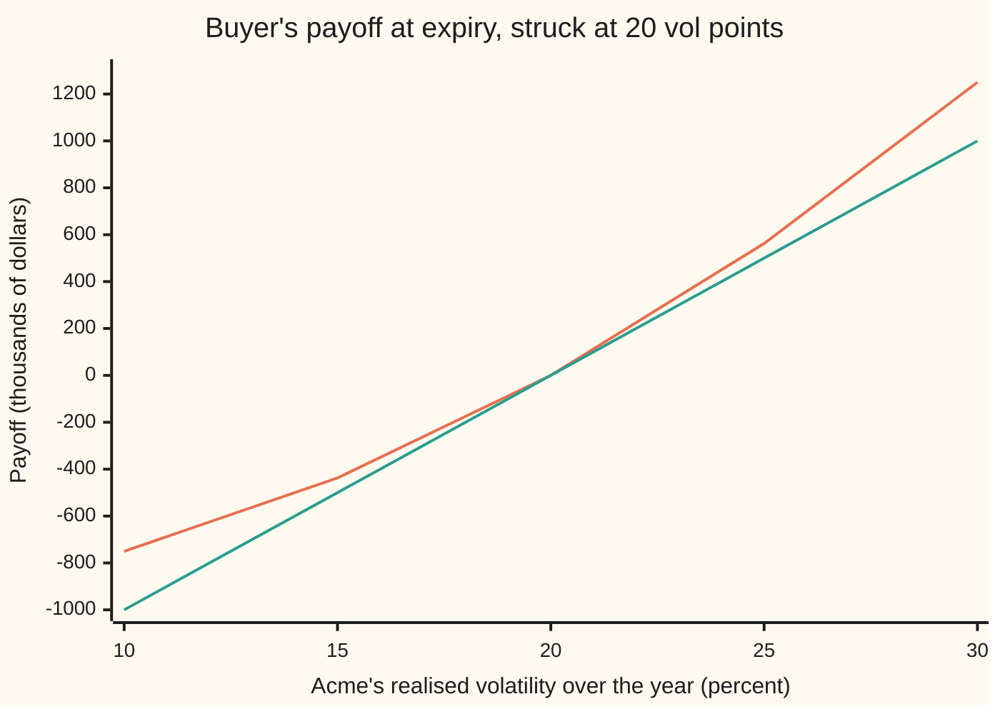

# The variance swap: pay realised variance, receive a fixed strike, and the strike comes from the option strip with no model

[Syllabus](../../../SYLLABUS.md) → [Financial mathematics](../../../SYLLABUS.md#w12) → [Variance swaps, the log contract and VIX](../../../SYLLABUS.md#w12-s19) → The variance swap

---

## General Overview

Acme shares trade at $100. Its options are all priced at the same 20 percent volatility, the house market of this wing: rates 5 percent, dividends 2 percent, one year to run. Two firms want to bet on how much Acme will move over that year, not on which way.

They sign a contract. In a year, count how much Acme actually moved: take each trading day's log return (the natural log of today's close over yesterday's), square it, add the 252 squares up. That total, per year, is **realised variance**, measured exactly as on [Realised variance](01-realised-variance-from-daily-prices.md). Its square root is realised volatility. One side pays realised variance; the other pays a fixed number agreed today, the **strike**. Only the difference changes hands. The contract is a **variance swap**, the name used from here on.

Sized at $100,000 per volatility point and struck at 20, the swap pays its buyer $562,500 if Acme moves 25 percent, and costs the buyer $437,500 if Acme moves 15 percent. Nobody pays anything on day one. So the strike must be the number that makes the bet fair today.

That number needs no forecast and no model of how Acme moves. It is read off Acme's option prices: every out-of-the-money put below the forward price, every out-of-the-money call above it, each weighted by one over its strike squared, summed, and scaled. For Acme that recipe returns **0.04000**, which is 20.00 percent volatility squared.

**The fair strike of a variance swap is the cost of a strip of options weighted one over strike squared, because that strip is a log contract, and a log contract hedged daily with the forward earns exactly the variance the price realises.**

**What kind of fact this is:** a theorem, proved on this card in Why it works, for any price path without jumps; the contract terms themselves are definitions and market conventions.

### The picture: what the buyer receives

Realised volatility across, payoff in thousands of dollars up. The variance swap is sized so that near 20 it moves $100,000 per volatility point, like a straight bet on volatility; away from 20 it bends upward.



Orange: the variance swap, $2,500 per variance point. Green: a straight line paying $100,000 per volatility point, for comparison. The two touch at 20 and share a slope there. The variance swap loses less when Acme is quiet and wins more when it is wild: it is curved, because variance is volatility squared.

---

## The formula

Notation first, in words. Volatility is quoted in **vol points**: 20 percent is 20. Variance is quoted in **variance points**, vol points squared: 20 squared is 400. In the maths, the same numbers appear as decimals: 0.20 and 0.04. $P(K)$ and $C(K)$ are today's prices of a put and a call on Acme struck at $K$ and expiring at $T$. The integral sign sums over every strike, as on [Any payoff from a strip of options](02-carr-madan-spanning-and-the-log-contract.md).

The contract pays the buyer, at expiry,

$$\text{payoff} = N_{var}\,\bigl(\sigma_R^2 - K_{vol}^2\bigr), \qquad N_{var} = \frac{N_{vega}}{2\,K_{vol}}$$

with both squares in variance points. The fair strike, in decimals, is

$$K_{var} = \frac{2\,e^{rT}}{T}\left[\int_0^{F}\frac{P(K)}{K^2}\,dK + \int_F^{\infty}\frac{C(K)}{K^2}\,dK\right], \qquad K_{vol} = 100\sqrt{K_{var}}$$

**Read it aloud:** buy every put below the forward and every call above it, one over strike squared of each; the strip's cost, grown to expiry and doubled, divided by the years, is the fair variance.

| Symbol | Plain meaning | In our example | Push it up and the answer… |
| --- | --- | --- | --- |
| $\sigma_R$ | realised volatility: what Acme actually did, in vol points | unknown today; 25 in the payoff story | the buyer gains, faster and faster |
| $K_{var}$ | the fair variance strike, as a decimal | 0.04000 | — |
| $K_{vol}$ | the same strike quoted in vol points | 20.00 | the buyer needs more movement to win |
| $N_{var}$ | variance notional: dollars per variance point | $2,500 | every payoff scales with it |
| $N_{vega}$ | vega notional: dollars per vol point near the strike | $100,000 | every payoff scales with it |
| $T$ | years to expiry | 1 | the strip is divided by more years |
| $r$, $q$ | the bank rate and Acme's dividend yield, continuously compounded | 5%, 2% | $r$ grows the strip's cost to expiry |
| $S$, $S_T$, $F$, $F_t$ | Acme today, Acme at expiry, the forward price $F = S e^{(r-q)T}$, and the forward at time t, with $F_0 = F$ and $F_T = S_T$ | $100, unknown, $103.05 | $F$ is where puts hand over to calls |
| $K$ | an option's strike, the variable being summed over | every price from near 0 upward | its weight $1/K^2$ falls fast |
| $P(K)$, $C(K)$ | today's put and call prices at strike $K$ | put 90: $2.71; call 120: $2.71 | more expensive options, higher strike |
| $\sigma$, $\sigma_t$ | the implied volatility the options are priced at; the volatility at moment t along a path | 20% on every strike; 20% in the simulation | fair variance rises as its square |
| $e^{rT}$ | grows today's cost to its value at expiry, when the swap settles | 1.051271 | — |

The $2e^{rT}/T$ in front is 2.102542 here. $K_{var}$ is a decimal; $K_{vol}$ multiplies its root by 100 to reach vol points.

Conventions verified 27 Sep 2026: strike quoted in vol points; variance notional equals vega notional over twice the strike; realised variance summed over 252 trading days a year with no average subtracted. A term sheet can override any of them.

### When it holds

- **Acme moves without jumps.** The proof needs a continuous path. Across a jump the hedged log contract earns a different amount from the squared jump that realised variance records: less for a fall, more for a rise, so the strip misprices the fair strike; [The volatility swap and the jump bias](05-volatility-swap-and-jump-bias.md) sizes that gap.
- **Options at every strike.** A real book stops somewhere and has gaps. Two strikes, 90 and 120, give 0.033017; strikes every $5 from 50 to 200 give 0.039827.
- **Realised variance sampled often, hedge rebalanced often.** The proof is for continuous time. Daily sampling and daily rebalancing leave a small gap: across 4,000 simulated years the worst path was off by 0.000121.
- **Known rates.** The hedge trades futures, whose daily margin earns interest until expiry; with a known rate the position is scaled to offset it, and a random rate breaks that.
- **European options that expire with the swap.** Early exercise changes the prices and breaks the strip.

---

## Why it works

### Step 0: a position whose gains are the squared moves

A call option held with its delta hedge earns, each day, an amount proportional to that day's squared move, less a daily rent, its time decay. Its **dollar gamma**, the share price squared times gamma (the rate at which delta changes), sets that rate. But a call's dollar gamma is large near its strike and dies away from it, so a call counts moves only while the price is nearby. A variance swap needs a position that counts every squared move equally, wherever the price wanders. That needs a flat dollar gamma. One payoff has it: the **log contract**, paying the natural log of the final price. Everything below follows from that.

Here is the flat dollar gamma, measured by moving Acme's price and re-pricing, per unit of decimal variance notional:

```
dollar gamma, Acme at   the 1/K^2 strip      calls struck at 100, scaled to match at $100
      60                ███████████  1.90    0.08
      80                ███████████  1.90    ██████  1.08
     100                ███████████  1.90    ███████████  1.90
     120                ███████████  1.90    ███████  1.20
     140                ███████████  1.90    ██  0.42
```

The strip holds 1.90 everywhere, which is $2e^{-rT}/T$ = 1.902459. The calls count moves well only near their strike: at $60 they count less than a twentieth as much.

### Step 1: the hedged log contract earns realised variance, path by path

Work with the forward $F$ rather than the share, so interest and dividends drop out: a forward moves only when the share's outlook moves. Itô's lemma ([Ito's lemma](../../11-Stochastic%20processes%20and%20calculus/06-Ito%20Calculus/02-itos-lemma.md)) compares the forward's log with its percentage change over a small time step dt, when the forward moves with a volatility that may itself change from moment to moment, written with a subscript t:

$$d(\ln F_t) = \frac{dF_t}{F_t} - \tfrac12\,\sigma_t^2\,dt$$

The square of the move is the only difference between the two. Rearrange and add up over the year:

$$\frac1T\int_0^T \sigma_t^2\,dt = \frac2T\left[\int_0^T \frac{dF_t}{F_t} - \ln\frac{F_T}{F_0}\right]$$

The left side is realised variance. The right side is a trading strategy. The first term: hold $2/(T F_t)$ forward contracts at each moment, rebalanced daily; each day it gains two over $T$ times the forward's percentage change. The second term: sell $2/T$ log contracts, which pay $\ln(F_T/F_0)$ at expiry. Nothing on the right assumes what that volatility is. The identity holds on every path, not on average.

The simulation in the code runs it. On 4,000 simulated years of daily prices, the hedged log contract and realised variance never differed by more than 0.000121. On 1,000 years where volatility was 10 percent for six months and then 30 percent, the worst gap was 0.000260. The hedge did not know volatility changed.

### Step 2: price the strategy

Forward contracts cost nothing to enter and, in the pricing world where every asset earns the bank rate, gain nothing on average. So the fair variance is two over $T$ times the value at expiry of the short log contract, which pays $-\ln(S_T/F)$ since $F_T = S_T$ and $F_0 = F$:

$$K_{var} = \frac2T\,\mathbb{E}\!\left[-\ln\frac{S_T}{F}\right]$$

Here $\mathbb{E}$ is the average in that pricing world. Grow a price to expiry by multiplying by $e^{rT}$, and this is $2e^{rT}/T$ times today's cost of the log contract.

### Step 3: the log contract is a strip of options

Nobody lists a log contract, but a strip of options builds one. The spanning result on [Any payoff from a strip of options](02-carr-madan-spanning-and-the-log-contract.md) says any smooth payoff is a bond, a forward and options, each option weighted by the payoff's curvature at its strike. The curvature of the negative log at $K$ is $1/K^2$. Cut at the forward:

$$-\ln\frac{S_T}{F} = -\frac{S_T - F}{F} + \int_0^F \frac{(K - S_T)^+}{K^2}\,dK + \int_F^\infty \frac{(S_T - K)^+}{K^2}\,dK$$

The first piece is a forward struck at $F$, which costs nothing today. The rest are puts below $F$ and calls above, each weighted $1/K^2$. Their cost is the bracket in the formula. Step 2 finishes the proof.

<details>
<summary>Detailed proof: the strip pays the log exactly</summary>

Take a final price below the forward, $S_T < F$. Every call in the strip expires worthless. The puts struck from $S_T$ up to $F$ pay:

$$\int_{S_T}^F \frac{K - S_T}{K^2}\,dK = \Bigl[\ln K + \frac{S_T}{K}\Bigr]_{S_T}^{F} = \ln\frac{F}{S_T} + \frac{S_T}{F} - 1$$

Add the forward's payoff $-(S_T - F)/F = 1 - S_T/F$. The sum is $\ln(F/S_T)$, the log contract. A final price above $F$ runs the same way with the calls from $F$ up to $S_T$. At $S_T = F$ everything pays zero, and so does the log.

</details>

### Step 4: a flat surface returns its own variance

If every option is priced at one volatility $\sigma$, then $\ln(S_T/F)$ is bell-shaped with average $-\tfrac12\sigma^2T$ in the pricing world (the drift correction of [Ito's lemma](../../11-Stochastic%20processes%20and%20calculus/06-Ito%20Calculus/02-itos-lemma.md) once more). Step 2 then gives $(2/T)\cdot\tfrac12\sigma^2T = \sigma^2$. For Acme: 0.04. The code gets there three ways: the strip, the log contract averaged against the bell curve with no options at all, and the simulated hedge.

The strip does not need the surface to be flat. If options are priced as though volatility were 10 percent for half a year and 30 percent for the other half, their average variance is 0.05, and the strip returns 0.050000. Simulating that world, realised variance averaged 0.050395, about two standard errors (0.000183) away: simulation noise. When the surface is not flat, the strip reads whatever the options say.

### Step 5: vega notional and variance notional

Near the strike, a small change in volatility changes variance by twice the volatility times the change: the slope of a square. So one vol point near the strike is worth about twice the strike in variance points. A desk that wants $100,000 per vol point near a strike of 20 divides by twice 20 and buys $2,500 per variance point. At 20.5 the swap pays $50,625 against the straight line's $50,000. Close, and the gap grows with distance, as the chart in the overview shows.

The alternative route to the fair strike is the continuous one: average realised variance directly in a model of the price. It gives the same answer in every model without jumps, because Step 1 is a path-by-path identity; the strip is simply the version that needs no model. [The VIX](06-vix-index.md) turns the same strip into a published index with a finite list of strikes.

---

## Worked numbers, by hand

The coarsest possible strip: one put at $90 and one call at $120, each standing in for a $30 band of strikes.

| Step | Arithmetic | Value |
| --- | --- | --- |
| forward | $100 × e^(0.05 − 0.02) | $103.05 |
| put at 90, below the forward | Black-Scholes at 20% | $2.71 (2.714489) |
| call at 120, above the forward | Black-Scholes at 20% | $2.71 (2.711776) |
| put weight | 30 / 90^2 | 0.003704 |
| call weight | 30 / 120^2 | 0.002083 |
| weighted put | 0.003704 × 2.714489 | 0.010054 |
| weighted call | 0.002083 × 2.711776 | 0.005650 |
| strip cost | 0.010054 + 0.005650 | 0.015703 |
| scale | 2 × e^0.05 / 1 | 2.102542 |
| two-strike fair variance | 2.102542 × 0.015703 | **0.033017** |
| every $5 from 50 to 200 | the same sum, 31 strikes | **0.039827** |
| the full strip | Simpson's rule over all strikes | **0.040000** |

Two strikes miss most of the curve and land at 0.033017, well short of 0.04. Thirty-one strikes get within a whisker. A seller who struck the swap off the two-strike strip would be selling variance far too cheaply.

<details>
<summary>Why the cheap put carries weight</summary>

The put at 90 and the call at 120 cost almost the same, yet the put's weight 0.003704 is nearly twice the call's 0.002083, so the put carries two thirds of the strip. One over strike squared leans on low strikes. A halving and a doubling are the same size in log terms, and the log contract pays for both equally; a halving lands among low strikes. Low strikes are where the downside log lives.

</details>

### What breaks if you drop a piece

| Mistake | Comes out at | What went wrong |
| --- | --- | --- |
| Leave out $e^{rT}$ | 0.038049 | The strip is paid for today and the swap settles in a year; the cost must be grown to expiry. |
| Cut at spot $100 instead of the forward, no correction | 0.040940 | Strikes between $100 and $103.05 are counted as calls, which are in the money there; their intrinsic value is not variance. |
| Two strikes only | 0.033017 | Most of the log's curve has no option under it. |
| ATM volatility squared, on a skewed surface | 0.040000 against a strip of 0.041146 | With a skew (volatility 1 point lower for every 10 percent a strike sits above the forward, 1 point higher for every 10 percent below), low-strike puts are richer, and the $1/K^2$ weights count them. |

The rule of thumb from Demeterfi and co-authors for that skew, $0.04 \times (1 + 3Tb^2)$ with slope b = 0.10, gives 0.041200, close to the strip's 0.041146.

### The Greeks

| Greek | Plain meaning | Value for Acme, $100,000 vega notional |
| --- | --- | --- |
| Value on day one | what the swap is worth when struck at the fair strike | $0 |
| Delta | dollars gained per $1 move in Acme, fair strike re-read from the strip | 0.000000 on a flat surface |
| Vega | dollars gained per vol point rise in implied volatility, by re-pricing the strip at 21% and 19% | $95,122.94, which is $e^{-rT}$ × $100,000 |
| Dollar gamma of the hedge strip | the strip's share price squared times gamma, per unit of decimal variance notional | 1.902459 at every spot |
| Theta | how the value drifts as days pass | set by the variance already realised; see [Marking a variance swap](04-variance-swap-after-inception-and-forward-variance.md) |

The vega is the vega notional, discounted: the notional was built to mean exactly that.

---

## Code, from first principles, and it actually runs

Both programs reach the fair variance three independent ways. Road 1 prices every out-of-the-money option on the flat 20 percent surface and integrates the strip by Simpson's rule in log-strike. Road 2 prices the log contract directly, averaging $-\ln(S_T/F)$ against the bell curve with no options at all. Road 3 simulates 4,000 years of daily prices, runs the hedged log contract of Step 1 on each, and compares it with realised variance path by path; then it repeats on 1,000 years where volatility jumps from 10 to 30 percent at mid-year. The programs also print the two-strike worked example, the what-breaks numbers, the notional conversion, the Greeks by bumping, the dollar-gamma bars and the chart points. The normal CDF is a written-out series; the random numbers come from a written-out generator (splitmix64 with the Box-Muller transform).

### Python

```python
from math import exp, log, sqrt, pi, cos
S, r, q, sig, T = 100.0, 0.05, 0.02, 0.20, 1.0            # the house market
F = S * exp((r - q) * T)                                   # forward, the strip's cut
M64 = (1 << 64) - 1

def N(x):                        # normal CDF from the erf series that converges everywhere
    z = abs(x) / sqrt(2.0)
    if z > 9.0:
        e = 1.0
    else:
        term, total, n = z, z, 0
        while term > 1e-17 * total:
            n += 1
            term *= 2.0 * z * z / (2 * n + 1)
            total += term
        e = 2.0 / sqrt(pi) * exp(-z * z) * total
    return 0.5 * (1.0 + e) if x >= 0 else 0.5 * (1.0 - e)

def bs(K, s, v):                 # Black-Scholes call and put with the house r, q, T
    sd = v * sqrt(T)
    d1 = (log(s / K) + (r - q + 0.5 * v * v) * T) / sd
    d2 = d1 - sd
    return (s * exp(-q * T) * N(d1) - K * exp(-r * T) * N(d2),
            K * exp(-r * T) * N(-d2) - s * exp(-q * T) * N(-d1))

def simpson(f, a, b, n=2000):
    h = (b - a) / n
    return h / 3 * (f(a) + f(b) + sum((4 if i % 2 else 2) * f(a + i * h) for i in range(1, n)))

def flat(v):
    return lambda K: v

def strip_pv(volf, s=S, cut=F):  # today's cost of the options: puts below the cut, calls above, 1/K^2 each
    def g(k):                    # in log-strike k = ln(K/cut): Q(K)/K^2 dK = Q(K)/K dk
        K = cut * exp(k)
        c, p = bs(K, s, volf(K))
        return (p if k < 0 else c) / K
    return simpson(g, -3.0, 0.0) + simpson(g, 0.0, 3.0)

def kvar(volf, s=S, cut=F):      # fair strike: 2 e^{rT} / T times the strip
    return 2.0 * exp(r * T) / T * strip_pv(volf, s, cut)

# road 1: the option strip on the flat 20% surface
k1 = kvar(flat(sig))
# road 2: the log contract priced with no options, (2/T) E[-ln(S_T/F)] against the bell curve
dens = lambda z: exp(-0.5 * z * z) / sqrt(2 * pi)
k2 = 2.0 / T * simpson(lambda z: -((-0.5 * sig * sig) * T + sig * sqrt(T) * z) * dens(z), -10.0, 10.0)
# road 3: simulate daily paths; short the log contract, hold 2/(T F_t) futures, compare with realised variance
st = [0x2545F4914F6CDD1D]
def u01():
    st[0] = (st[0] + 0x9E3779B97F4A7C15) & M64
    z = st[0]
    z = ((z ^ (z >> 30)) * 0xBF58476D1CE4E5B9) & M64
    z = ((z ^ (z >> 27)) * 0x94D049BB133111EB) & M64
    return (((z ^ (z >> 31)) >> 11) + 0.5) / 2.0 ** 53
def simulate(paths, volday, days=252):
    dt, rv_all, pl_all = T / days, [], []
    for _ in range(paths):
        rv = pl = 0.0
        for i in range(days):
            v = volday(i)
            y = -0.5 * v * v * dt + v * sqrt(dt) * sqrt(-2.0 * log(u01())) * cos(2.0 * pi * u01())
            x = y + (r - q) * dt                 # the share's daily log move; y is the forward's
            rv += x * x / T
            pl += 2.0 / T * ((exp(y) - 1.0) - y)  # futures gain minus the log contract's share of the day
        rv_all.append(rv)
        pl_all.append(pl)
    return rv_all, pl_all
def mean_se(a):
    m = sum(a) / len(a)
    return m, sqrt(sum((x - m) ** 2 for x in a) / (len(a) - 1) / len(a))
rv, pl = simulate(4000, lambda i: sig)
rv_m, rv_se = mean_se(rv)
pl_m, pl_se = mean_se(pl)
gap = max(abs(a - b) for a, b in zip(rv, pl))
rv2, pl2 = simulate(1000, lambda i: 0.10 if i < 126 else 0.30)   # a quiet half then a wild half
rv2_m, rv2_se = mean_se(rv2)
k_regime = kvar(flat(sqrt(0.5 * 0.01 + 0.5 * 0.09)))              # options priced off that average variance
gap2 = max(abs(a - b) for a, b in zip(rv2, pl2))
# worked by hand: a two-strike strip, $30 of strike each
c120 = bs(120.0, S, sig)[0]
p90 = bs(90.0, S, sig)[1]
two = 2.0 * exp(r * T) / T * (30.0 / 90.0 ** 2 * p90 + 30.0 / 120.0 ** 2 * c120)
five = 2.0 * exp(r * T) / T * sum(5.0 / K ** 2 * (bs(K, S, sig)[1] if K < F else bs(K, S, sig)[0])
                                  for K in [50.0 + 5.0 * i for i in range(31)])
# what breaks
skew = lambda K: max(0.05, sig - 0.10 * (K - F) / F)
k_skew = kvar(skew)
cut_spot = kvar(flat(sig), S, S)
no_erT = 2.0 / T * strip_pv(flat(sig))
# notionals: $100,000 per vol point, struck at 20 vol points
Nvega, Kvol = 100000.0, 20.0                  # the strike as quoted, in vol points
Nvar = Nvega / (2.0 * Kvol)
# Greeks: vega by re-pricing the strip at 21% and 19%; delta by moving spot; the strip's dollar gamma
vega = exp(-r * T) * Nvar * 1e4 * (kvar(flat(0.21)) - kvar(flat(0.19))) / 2.0
fwd = lambda s: s * exp((r - q) * T)            # a new spot moves the forward, so the cut moves with it
delta = exp(-r * T) * Nvar * 1e4 * (kvar(flat(sig), 101.0, fwd(101.0)) - kvar(flat(sig), 99.0, fwd(99.0))) / 2.0
def dollar_gamma(pv, s, h=0.1):
    return s * s * (pv(s + h) - 2.0 * pv(s) + pv(s - h)) / (h * h)
g_strip = [dollar_gamma(lambda x: 2.0 / T * strip_pv(flat(sig), x, F), s) for s in (60.0, 80.0, 100.0, 120.0, 140.0)]
g_call = [dollar_gamma(lambda x: bs(100.0, x, sig)[0], s) for s in (60.0, 80.0, 100.0, 120.0, 140.0)]
scale = g_strip[2] / g_call[2]

rows = [("forward F", F), ("1 option strip, fair variance", k1), ("  as a vol, percent", 100 * sqrt(k1)),
        ("2 log contract, no options", k2),
        ("3 hedged log P&L, mean of 4000", pl_m), ("  standard error", pl_se),
        ("  realised variance, mean", rv_m), ("  standard error", rv_se), ("  worst path, |P&L - realised|", gap),
        ("  10% then 30%: realised mean", rv2_m), ("  standard error", rv2_se), ("  strip at that average variance", k_regime),
        ("  10% then 30%: worst |P&L - realised|", gap2),
        ("put 90", p90), ("call 120", c120), ("weight 30/90^2", 30.0 / 90 ** 2), ("weight 30/120^2", 30.0 / 120 ** 2),
        ("  put 90 x weight", 30.0 / 90 ** 2 * p90), ("  call 120 x weight", 30.0 / 120 ** 2 * c120),
        ("  sum of the two", 30.0 / 90 ** 2 * p90 + 30.0 / 120 ** 2 * c120), ("2 e^rT / T", 2.0 * exp(r * T) / T), ("two-strike strip", two), ("strikes 50 to 200 every $5", five),
        ("wrong: no e^rT", no_erT), ("wrong: cut at spot 100", cut_spot),
        ("skewed surface: strip", k_skew), ("  ATM vol squared", sig * sig), ("  rule 0.04 (1 + 3 T b^2)", 0.04 * 1.03),
        ("variance notional per var point", Nvar), ("vega by bumping the strip", vega), ("  e^-rT times vega notional", exp(-r * T) * Nvega),
        ("delta by bumping spot", delta if abs(delta) > 5e-7 else 0.0), ("try: sigma = 30%", kvar(flat(0.30))),
        ("try: skew slope 0.20", kvar(lambda K: max(0.05, sig - 0.20 * (K - F) / F))),
        ("  strip dollar gamma, formula 2e^-rT/T", 2.0 * exp(-r * T) / T)]
for name, v in rows:
    print(f"{name:<40} {v:>14.6f}")
print("dollar gamma at spot   " + "".join(f"{s:>9.0f}" for s in (60, 80, 100, 120, 140)))
print("  strip                " + "".join(f"{g:>9.2f}" for g in g_strip))
print("  calls struck 100     " + "".join(f"{scale * g:>9.2f}" for g in g_call))
print("payoff, realised vol   " + "".join(f"{v:>9.0f}" for v in (10, 15, 20, 25, 30)))
print("  variance swap, $000  " + "".join(f"{Nvar * (v * v - Kvol * Kvol) / 1000:>9.2f}" for v in (10, 15, 20, 25, 30)))
print("  vega-linear, $000    " + "".join(f"{Nvega * (v - Kvol) / 1000:>9.2f}" for v in (10, 15, 20, 25, 30)))
print("  at 20.5: var, vega   " + f"{Nvar * (20.5 ** 2 - Kvol ** 2):>12.2f}{Nvega * (20.5 - Kvol):>12.2f}")

assert abs(k1 - sig * sig) < 1e-9, "strip must return the flat surface's variance"
assert abs(k1 - k2) < 1e-9, "strip and log contract are one payoff"
assert abs(pl_m - k1) < 4 * pl_se, "hedged log contract earns the strip on average"
assert abs(rv_m - k1) < 4 * rv_se + 1e-5, "realised variance averages to the strip"
assert gap < 0.002, "hedge tracks realised variance path by path"
assert gap2 < 0.002, "and still does when the volatility changes mid-year"
assert abs(rv2_m - k_regime) < 4 * rv2_se + 1e-5, "strip still reads the average variance when vol is not constant"
assert abs(vega - exp(-r * T) * Nvega) < 0.01, "vega notional is the dollar vega, discounted"
assert abs(delta) < 1e-3, "on a flat surface the fair strike ignores spot"
assert max(g_strip) - min(g_strip) < 1e-4, "the strip's dollar gamma is flat across spot"
assert abs(g_strip[2] - 2.0 * exp(-r * T) / T) < 1e-4, "and equals 2 e^-rT / T"
print("ALL CHECKS PASS")
```

**Ran 2026-09-27 on macOS, Python 3.14.6, standard library only. All checks passed. Output, pasted from the run:**

```
forward F                                    103.045453
1 option strip, fair variance                  0.040000
  as a vol, percent                           20.000000
2 log contract, no options                     0.040000
3 hedged log P&L, mean of 4000                 0.040072
  standard error                               0.000056
  realised variance, mean                      0.040072
  standard error                               0.000056
  worst path, |P&L - realised|                 0.000121
  10% then 30%: realised mean                  0.050395
  standard error                               0.000183
  strip at that average variance               0.050000
  10% then 30%: worst |P&L - realised|         0.000260
put 90                                         2.714489
call 120                                       2.711776
weight 30/90^2                                 0.003704
weight 30/120^2                                0.002083
  put 90 x weight                              0.010054
  call 120 x weight                            0.005650
  sum of the two                               0.015703
2 e^rT / T                                     2.102542
two-strike strip                               0.033017
strikes 50 to 200 every $5                     0.039827
wrong: no e^rT                                 0.038049
wrong: cut at spot 100                         0.040940
skewed surface: strip                          0.041146
  ATM vol squared                              0.040000
  rule 0.04 (1 + 3 T b^2)                      0.041200
variance notional per var point             2500.000000
vega by bumping the strip                  95122.942450
  e^-rT times vega notional                95122.942450
delta by bumping spot                          0.000000
try: sigma = 30%                               0.090000
try: skew slope 0.20                           0.044593
  strip dollar gamma, formula 2e^-rT/T         1.902459
dollar gamma at spot          60       80      100      120      140
  strip                     1.90     1.90     1.90     1.90     1.90
  calls struck 100          0.08     1.08     1.90     1.20     0.42
payoff, realised vol          10       15       20       25       30
  variance swap, $000    -750.00  -437.50     0.00   562.50  1250.00
  vega-linear, $000     -1000.00  -500.00     0.00   500.00  1000.00
  at 20.5: var, vega       50625.00    50000.00
ALL CHECKS PASS
```

### Rust

```rust
use std::f64::consts::PI;
const S: f64 = 100.0; const R: f64 = 0.05; const Q: f64 = 0.02; const SIG: f64 = 0.20; const T: f64 = 1.0;

fn n_cdf(x: f64) -> f64 {
    // normal CDF from the erf series that converges everywhere
    let z = x.abs() / 2f64.sqrt();
    let e = if z > 9.0 { 1.0 } else {
        let (mut term, mut total, mut n) = (z, z, 0.0);
        while term > 1e-17 * total {
            n += 1.0;
            term *= 2.0 * z * z / (2.0 * n + 1.0);
            total += term;
        }
        2.0 / PI.sqrt() * (-z * z).exp() * total
    };
    if x >= 0.0 { 0.5 * (1.0 + e) } else { 0.5 * (1.0 - e) }
}

fn bs(k: f64, s: f64, v: f64) -> (f64, f64) {
    let sd = v * T.sqrt();
    let d1 = ((s / k).ln() + (R - Q + 0.5 * v * v) * T) / sd;
    let d2 = d1 - sd;
    (s * (-Q * T).exp() * n_cdf(d1) - k * (-R * T).exp() * n_cdf(d2),
     k * (-R * T).exp() * n_cdf(-d2) - s * (-Q * T).exp() * n_cdf(-d1))
}

fn simpson(f: &dyn Fn(f64) -> f64, a: f64, b: f64, n: usize) -> f64 {
    let h = (b - a) / n as f64;
    let mut inner = 0.0;
    for i in 1..n { inner += if i % 2 == 1 { 4.0 } else { 2.0 } * f(a + i as f64 * h); }
    h / 3.0 * (f(a) + f(b) + inner)
}

fn strip_pv(volf: &dyn Fn(f64) -> f64, s: f64, cut: f64) -> f64 {
    // puts below the cut, calls above, each weighted 1/K^2; integrated in log-strike
    let g = |k: f64| {
        let kk = cut * k.exp();
        let (c, p) = bs(kk, s, volf(kk));
        (if k < 0.0 { p } else { c }) / kk
    };
    simpson(&g, -3.0, 0.0, 2000) + simpson(&g, 0.0, 3.0, 2000)
}

fn kvar(volf: &dyn Fn(f64) -> f64, s: f64, cut: f64) -> f64 {
    2.0 * (R * T).exp() / T * strip_pv(volf, s, cut)
}

struct Rng(u64);
impl Rng {
    fn u01(&mut self) -> f64 {
        self.0 = self.0.wrapping_add(0x9E3779B97F4A7C15);
        let mut z = self.0;
        z = (z ^ (z >> 30)).wrapping_mul(0xBF58476D1CE4E5B9);
        z = (z ^ (z >> 27)).wrapping_mul(0x94D049BB133111EB);
        (((z ^ (z >> 31)) >> 11) as f64 + 0.5) / 2f64.powi(53)
    }
}

fn simulate(rng: &mut Rng, paths: usize, volday: &dyn Fn(usize) -> f64) -> (Vec<f64>, Vec<f64>) {
    let dt = T / 252.0;
    let (mut rvs, mut pls) = (Vec::new(), Vec::new());
    for _ in 0..paths {
        let (mut rv, mut pl) = (0.0, 0.0);
        for i in 0..252 {
            let v = volday(i);
            let (u1, u2) = (rng.u01(), rng.u01());
            let y = -0.5 * v * v * dt + v * dt.sqrt() * (-2.0 * u1.ln()).sqrt() * (2.0 * PI * u2).cos();
            let x = y + (R - Q) * dt; // the share's daily log move; y is the forward's
            rv += x * x / T;
            pl += 2.0 / T * ((y.exp() - 1.0) - y); // futures gain minus the log contract's share of the day
        }
        rvs.push(rv); pls.push(pl);
    }
    (rvs, pls)
}

fn mean_se(a: &[f64]) -> (f64, f64) {
    let n = a.len() as f64;
    let m = a.iter().sum::<f64>() / n;
    (m, (a.iter().map(|x| (x - m).powi(2)).sum::<f64>() / (n - 1.0) / n).sqrt())
}

fn dollar_gamma(pv: &dyn Fn(f64) -> f64, s: f64) -> f64 {
    s * s * (pv(s + 0.1) - 2.0 * pv(s) + pv(s - 0.1)) / (0.1 * 0.1)
}

fn main() {
    let f = S * ((R - Q) * T).exp();
    let flat = |v: f64| move |_k: f64| v;
    // road 1: the option strip on the flat 20% surface
    let k1 = kvar(&flat(SIG), S, f);
    // road 2: the log contract priced with no options, (2/T) E[-ln(S_T/F)] against the bell curve
    let dens = |z: f64| (-0.5 * z * z).exp() / (2.0 * PI).sqrt();
    let k2 = 2.0 / T * simpson(&|z: f64| -((-0.5 * SIG * SIG) * T + SIG * T.sqrt() * z) * dens(z), -10.0, 10.0, 2000);
    // road 3: simulated daily paths, hedged log contract against realised variance
    let mut rng = Rng(0x2545F4914F6CDD1D);
    let (rv, pl) = simulate(&mut rng, 4000, &|_i| SIG);
    let (rv_m, rv_se) = mean_se(&rv);
    let (pl_m, pl_se) = mean_se(&pl);
    let gap = rv.iter().zip(&pl).map(|(a, b)| (a - b).abs()).fold(0.0, f64::max);
    let (rv2, pl2) = simulate(&mut rng, 1000, &|i| if i < 126 { 0.10 } else { 0.30 });
    let (rv2_m, rv2_se) = mean_se(&rv2);
    let k_regime = kvar(&flat((0.5 * 0.01 + 0.5 * 0.09f64).sqrt()), S, f);
    let gap2 = rv2.iter().zip(&pl2).map(|(a, b)| (a - b).abs()).fold(0.0, f64::max);
    // worked by hand: a two-strike strip, $30 of strike each
    let (c120, p90) = (bs(120.0, S, SIG).0, bs(90.0, S, SIG).1);
    let two = 2.0 * (R * T).exp() / T * (30.0 / 8100.0 * p90 + 30.0 / 14400.0 * c120);
    let five = 2.0 * (R * T).exp() / T * (0..31).map(|i| 50.0 + 5.0 * i as f64)
        .map(|k| { let (c, p) = bs(k, S, SIG); 5.0 / (k * k) * if k < f { p } else { c } }).sum::<f64>();
    // what breaks
    let skew = move |k: f64| f64::max(0.05, SIG - 0.10 * (k - f) / f);
    let skew2 = move |k: f64| f64::max(0.05, SIG - 0.20 * (k - f) / f);
    let k_skew = kvar(&skew, S, f);
    let cut_spot = kvar(&flat(SIG), S, S);
    let no_ert = 2.0 / T * strip_pv(&flat(SIG), S, f);
    // notionals: $100,000 per vol point, struck at 20 vol points
    let (nvega, kvol) = (100000.0, 20.0);
    let nvar = nvega / (2.0 * kvol);
    let disc = (-R * T).exp();
    let vega = disc * nvar * 1e4 * (kvar(&flat(0.21), S, f) - kvar(&flat(0.19), S, f)) / 2.0;
    let fwd = |s: f64| s * ((R - Q) * T).exp();
    let delta = disc * nvar * 1e4 * (kvar(&flat(SIG), 101.0, fwd(101.0)) - kvar(&flat(SIG), 99.0, fwd(99.0))) / 2.0;
    let spots = [60.0, 80.0, 100.0, 120.0, 140.0];
    let g_strip: Vec<f64> = spots.iter().map(|&s| dollar_gamma(&|x| 2.0 / T * strip_pv(&flat(SIG), x, f), s)).collect();
    let g_call: Vec<f64> = spots.iter().map(|&s| dollar_gamma(&|x| bs(100.0, x, SIG).0, s)).collect();
    let scale = g_strip[2] / g_call[2];

    let rows: Vec<(&str, f64)> = vec![("forward F", f), ("1 option strip, fair variance", k1), ("  as a vol, percent", 100.0 * k1.sqrt()),
        ("2 log contract, no options", k2),
        ("3 hedged log P&L, mean of 4000", pl_m), ("  standard error", pl_se),
        ("  realised variance, mean", rv_m), ("  standard error", rv_se), ("  worst path, |P&L - realised|", gap),
        ("  10% then 30%: realised mean", rv2_m), ("  standard error", rv2_se), ("  strip at that average variance", k_regime),
        ("  10% then 30%: worst |P&L - realised|", gap2),
        ("put 90", p90), ("call 120", c120), ("weight 30/90^2", 30.0 / 8100.0), ("weight 30/120^2", 30.0 / 14400.0),
        ("  put 90 x weight", 30.0 / 8100.0 * p90), ("  call 120 x weight", 30.0 / 14400.0 * c120),
        ("  sum of the two", 30.0 / 8100.0 * p90 + 30.0 / 14400.0 * c120), ("2 e^rT / T", 2.0 * (R * T).exp() / T), ("two-strike strip", two), ("strikes 50 to 200 every $5", five),
        ("wrong: no e^rT", no_ert), ("wrong: cut at spot 100", cut_spot),
        ("skewed surface: strip", k_skew), ("  ATM vol squared", SIG * SIG), ("  rule 0.04 (1 + 3 T b^2)", 0.04 * 1.03),
        ("variance notional per var point", nvar), ("vega by bumping the strip", vega), ("  e^-rT times vega notional", disc * nvega),
        ("delta by bumping spot", if delta.abs() > 5e-7 { delta } else { 0.0 }), ("try: sigma = 30%", kvar(&flat(0.30), S, f)),
        ("try: skew slope 0.20", kvar(&skew2, S, f)),
        ("  strip dollar gamma, formula 2e^-rT/T", 2.0 * disc / T)];
    for (name, v) in &rows { println!("{:<40} {:>14.6}", name, v); }
    let vols = [10.0, 15.0, 20.0, 25.0, 30.0];
    let line = |xs: Vec<f64>| xs.iter().map(|v| format!("{:>9.2}", v)).collect::<String>();
    println!("dollar gamma at spot   {}", spots.iter().map(|s| format!("{:>9.0}", s)).collect::<String>());
    println!("  strip                {}", line(g_strip.clone()));
    println!("  calls struck 100     {}", line(g_call.iter().map(|g| scale * g).collect()));
    println!("payoff, realised vol   {}", vols.iter().map(|v| format!("{:>9.0}", v)).collect::<String>());
    println!("  variance swap, $000  {}", line(vols.iter().map(|v| nvar * (v * v - kvol * kvol) / 1000.0).collect()));
    println!("  vega-linear, $000    {}", line(vols.iter().map(|v| nvega * (v - kvol) / 1000.0).collect()));
    println!("  at 20.5: var, vega   {:>12.2}{:>12.2}", nvar * (20.5f64.powi(2) - kvol * kvol), nvega * (20.5 - kvol));

    assert!((k1 - SIG * SIG).abs() < 1e-9, "strip must return the flat surface's variance");
    assert!((k1 - k2).abs() < 1e-9, "strip and log contract are one payoff");
    assert!((pl_m - k1).abs() < 4.0 * pl_se, "hedged log contract earns the strip on average");
    assert!((rv_m - k1).abs() < 4.0 * rv_se + 1e-5, "realised variance averages to the strip");
    assert!(gap < 0.002, "hedge tracks realised variance path by path");
    assert!(gap2 < 0.002, "and still does when the volatility changes mid-year");
    assert!((rv2_m - k_regime).abs() < 4.0 * rv2_se + 1e-5, "strip still reads the average variance");
    assert!((vega - disc * nvega).abs() < 0.01, "vega notional is the dollar vega, discounted");
    assert!(delta.abs() < 1e-3, "on a flat surface the fair strike ignores spot");
    let (gmax, gmin) = (g_strip.iter().cloned().fold(f64::MIN, f64::max), g_strip.iter().cloned().fold(f64::MAX, f64::min));
    assert!(gmax - gmin < 1e-4, "the strip's dollar gamma is flat across spot");
    assert!((g_strip[2] - 2.0 * disc / T).abs() < 1e-4, "and equals 2 e^-rT / T");
    println!("ALL CHECKS PASS");
}
```

**Ran 2026-09-27 on macOS, rustc 1.98.1, no crates. All checks passed. Output, pasted from the run:**

```
forward F                                    103.045453
1 option strip, fair variance                  0.040000
  as a vol, percent                           20.000000
2 log contract, no options                     0.040000
3 hedged log P&L, mean of 4000                 0.040072
  standard error                               0.000056
  realised variance, mean                      0.040072
  standard error                               0.000056
  worst path, |P&L - realised|                 0.000121
  10% then 30%: realised mean                  0.050395
  standard error                               0.000183
  strip at that average variance               0.050000
  10% then 30%: worst |P&L - realised|         0.000260
put 90                                         2.714489
call 120                                       2.711776
weight 30/90^2                                 0.003704
weight 30/120^2                                0.002083
  put 90 x weight                              0.010054
  call 120 x weight                            0.005650
  sum of the two                               0.015703
2 e^rT / T                                     2.102542
two-strike strip                               0.033017
strikes 50 to 200 every $5                     0.039827
wrong: no e^rT                                 0.038049
wrong: cut at spot 100                         0.040940
skewed surface: strip                          0.041146
  ATM vol squared                              0.040000
  rule 0.04 (1 + 3 T b^2)                      0.041200
variance notional per var point             2500.000000
vega by bumping the strip                  95122.942450
  e^-rT times vega notional                95122.942450
delta by bumping spot                          0.000000
try: sigma = 30%                               0.090000
try: skew slope 0.20                           0.044593
  strip dollar gamma, formula 2e^-rT/T         1.902459
dollar gamma at spot          60       80      100      120      140
  strip                     1.90     1.90     1.90     1.90     1.90
  calls struck 100          0.08     1.08     1.90     1.20     0.42
payoff, realised vol          10       15       20       25       30
  variance swap, $000    -750.00  -437.50     0.00   562.50  1250.00
  vega-linear, $000     -1000.00  -500.00     0.00   500.00  1000.00
  at 20.5: var, vega       50625.00    50000.00
ALL CHECKS PASS
```

The two outputs are identical to the printed precision.

> [!TIP]
> **Try changing**
> - **Volatility 30 percent on every strike.** Guess first. Change `flat(sig)` to `flat(0.30)` in road 1. The strip returns 0.090000: the square of 0.30, not a rise in proportion.
> - **A steeper skew.** Guess whether doubling the slope doubles the gap over 0.04. Set the skew slope to 0.20. The strip returns 0.044593: the gap over 0.04 grows far faster than the slope, as the rule of thumb's slope squared says.
> - **Strikes every $5 from 50 to 200.** Guess how close 31 strikes get. The sum returns 0.039827, short by the options outside 50 to 200 and by the coarse spacing.
> - **Half a year at 10 percent, half at 30.** Guess the fair variance. The strip, at the average variance, returns 0.050000; the simulated realised mean is 0.050395.

---

## The usual mistake

> [!warning]
> **Taking the fair strike to be at-the-money implied volatility squared.** On a flat surface the two agree, 0.040000 each. On a real equity surface, where low strikes trade at higher volatility, the $1/K^2$ weights lean on those expensive puts and the strip comes out higher: 0.041146 against 0.040000 for a gentle skew, 0.044593 for a steeper one. The fair strike is a weighted average over the whole smile, not one point on it.
>
> Smaller traps:
> - **Leaving out the growth factor $e^{rT}$.** The strip comes out at 0.038049 instead of 0.040000, because the options are paid for today and the swap settles at expiry.
> - **Cutting at spot instead of the forward.** 0.040940 instead of 0.040000; the options between $100 and $103.05 carry intrinsic value that is not variance. Cutting anywhere else needs a correction term.
> - **Treating variance notional as vega notional.** $2,500 per variance point is not $100,000 per vol point away from the strike: at 25 the swap pays $562,500, not $500,000; at 15 it costs $437,500, not $500,000.
> - **Reading the strike as a forecast.** It is the price of a replicating strip. Buyers pay for protection against wild markets, so the strike usually sits above the variance that later arrives.

---

## Where you meet it in real life

- **Index variance swaps.** Dealers quote variance swaps on the S&P 500 and the Euro Stoxx 50, struck off the listed option strip and hedged by holding that strip and trading futures daily.
- **The variance risk premium.** Over long samples of index options, the strip has averaged more than the variance later realised. Sellers of variance swaps earn that gap most years and lose heavily in crashes. Carr and Wu measured it across stock indices and individual shares.
- **The VIX.** The published "fear index" is this strip, computed from listed S&P 500 options with a 30-day horizon and a finite set of strikes: [The VIX](06-vix-index.md).
- **Volatility swaps.** A contract paying realised volatility rather than variance has no static strip and sits below the variance strike's root; [The volatility swap and the jump bias](05-volatility-swap-and-jump-bias.md).
- **Marking a live swap.** Midway through the year, the value mixes variance already realised with the strip for the time left: [Marking a variance swap](04-variance-swap-after-inception-and-forward-variance.md).

> **Say it back**
> A variance swap pays realised variance minus a strike agreed today, sized in variance notional, which is vega notional over twice the strike. Holding the forward in a quantity of two over T divided by its price, and selling two over T log contracts, earns realised variance on every path without jumps. A log contract is a strip of puts below the forward and calls above, each weighted one over strike squared. So the fair strike is that strip's cost, grown to expiry, times two over T. On Acme's flat 20 percent surface it is 0.04; on a skewed surface it is more than at-the-money volatility squared.

---

## What this builds on

- [Any payoff from a strip of options](02-carr-madan-spanning-and-the-log-contract.md): any payoff as a strip of options weighted by its curvature; here it builds the log contract.
- [Realised variance](01-realised-variance-from-daily-prices.md): the exact number the swap pays, computed from daily closes.
- [Ito's lemma](../../11-Stochastic%20processes%20and%20calculus/06-Ito%20Calculus/02-itos-lemma.md): the extra half-variance term that separates a log change from a percentage change, the whole of Step 1.

## Where this goes next

- [Marking a variance swap](04-variance-swap-after-inception-and-forward-variance.md): valuing the swap once some variance has already been realised, and the variance between two future dates.
- [The VIX](06-vix-index.md): the same strip with listed strikes, a 30-day horizon and a published recipe.

A variance swap is fair on the day it is struck; the open question is what it is worth a month later, when some of the year's variance is already in the books and the strip covers only what remains.

---

## Sources

Verified 2026-09-27: every DOI below resolves at doi.org and its Crossref record names the work; the Cambridge page was read directly.

- Demeterfi, Kresimir, Emanuel Derman, Michael Kamal, and Joseph Zou. "A Guide to Volatility and Variance Swaps." *Journal of Derivatives* 6, no. 4 (1999): 9–32. [doi:10.3905/jod.1999.319129](https://doi.org/10.3905/jod.1999.319129). The strip, the hedged log contract, discrete strikes and the skew rule of thumb.
- Neuberger, Anthony. "The Log Contract." *Journal of Portfolio Management* 20, no. 2 (1994): 74–80. [doi:10.3905/jpm.1994.409478](https://doi.org/10.3905/jpm.1994.409478). The log payoff as the instrument that isolates variance.
- Carr, Peter, and Dilip Madan. "Towards a Theory of Volatility Trading." In *Option Pricing, Interest Rates and Risk Management*, Cambridge University Press, 2001. [doi:10.1017/CBO9780511569708.013](https://doi.org/10.1017/CBO9780511569708.013). Spanning any payoff with options; the model-free variance strike.
- Carr, Peter, and Liuren Wu. "Variance Risk Premiums." *Review of Financial Studies* 22, no. 3 (2009): 1311–1341. [doi:10.1093/rfs/hhn038](https://doi.org/10.1093/rfs/hhn038). The strip against later realised variance, across indices and shares.
