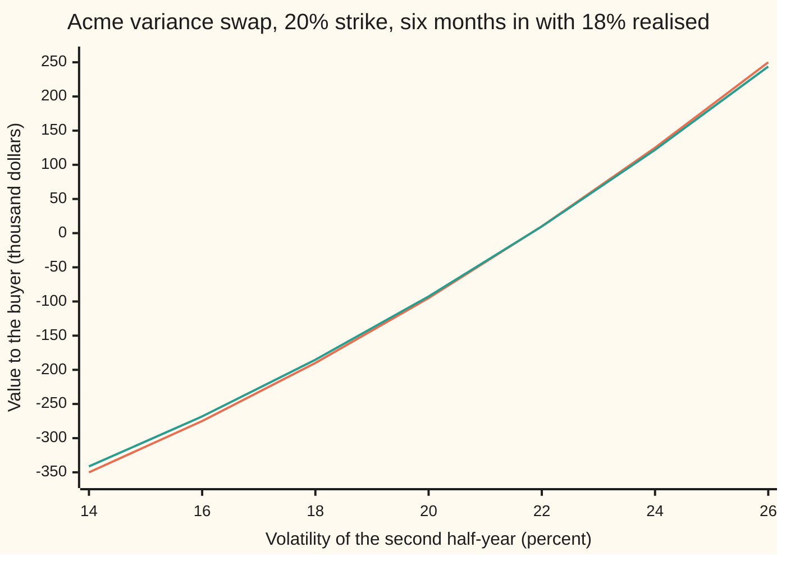

# Marking a variance swap: accrued realised plus the remaining forward variance, and the forward variance two expiries imply

[Syllabus](../../../SYLLABUS.md) → [Financial mathematics](../../../SYLLABUS.md#w12) → [Variance swaps, the log contract and VIX](../../../SYLLABUS.md#w12-s19) → Marking a variance swap

---

## General Overview

Acme trades at 100 dollars. A one-year variance swap on Acme was struck at inception at 20 percent volatility, which is 0.04 in variance (volatility squared). At expiry the buyer receives the year's realised variance, the average of Acme's squared daily returns scaled to a year ([Realised variance](01-realised-variance-from-daily-prices.md)), and pays 0.04. The size is 100,000 dollars of **vega notional**: roughly 100,000 dollars gained per volatility point that the year realises above 20.

Six months in, Acme has realised 18 percent. The buyer is behind. But half the year is still to come, and it could make the shortfall up. What is the position worth today? That number is the swap's **mark**, the price at which it would change hands now.

The answer splits the year into the half already lived and the half still ahead. The first half's variance is a known number. The second half's variance is unknown, but the option market prices it today through a strip of puts and calls ([The variance swap](03-variance-swap-fair-strike.md)). Weight each half by its share of the year, subtract the strike, discount. In the house market, where options for the next half-year are priced at a flat 20 percent, the mark is minus 92,654.44 dollars.

The same splitting, run on two quotes instead of one, prices a stretch of time that starts in the future. Six-month options at 18 percent and one-year options at 20 percent together imply a variance of 0.0476, a volatility of 21.82 percent, for the six months in between. That is the **forward variance**. It is also exactly the volatility the second half must deliver for the running swap above to break even.

**A running variance swap is worth the discounted notional times the time-weighted sum of the variance already realised and the fair variance quoted for the time left, minus the strike; the same time-weighting, applied to two quoted expiries, gives the forward variance between them.**

**What kind of fact this is:** a theorem, proved on this card in Why it works: once the market quotes a fair variance for the time left, the mark follows from no-arbitrage alone, with no model of how Acme moves; the forward variance is a definition built on the same split.

### The picture: the swap after six months at 18 percent



The line farther from zero is the payoff at expiry if the second half realises that volatility. The line nearer zero is today's mark if the market prices the second half at that volatility: the payoff shrunk by half a year's discounting. Both cross zero between 20 and 22, at 21.82 percent, the forward volatility. The curve bends upward because the swap pays on squared volatility: each extra volatility point is worth more than the last.

---

## The formula

Notation first, in words. Time runs in years: $t$ is the time already gone, $T$ the swap's whole life, and $\tau$ ("tau") the time left, $T - t$. A subscript names what a symbol belongs to: $K_{var}$ is the swap's strike in variance, $K_{rem}$ the fair variance the market quotes today for the time left. The realised volatility so far is $\sigma_R$, so its variance is $\sigma_R^2$. Here $N$ is the swap's notional, a dollar amount; this card never uses the normal CDF $N(x)$, so $D\,N\,(\ldots)$ below is a product.

$$V_t \;=\; D\,N\times\left(\frac{t}{T}\,\sigma_R^2 \;+\; \frac{\tau}{T}\,K_{rem} \;-\; K_{var}\right), \qquad D = e^{-r\tau}.$$

**Read it aloud: the value today is the discounted notional times the variance already banked, weighted by the share of the life gone, plus the variance quoted for the rest, weighted by the share left, minus the strike.**

The forward variance $\xi$ ("xi") between two expiries $T_1 < T_2$, with total variances $w_1 = \sigma_1^2 T_1$ and $w_2 = \sigma_2^2 T_2$, is

$$\xi \;=\; \frac{w_2 - w_1}{T_2 - T_1}.$$

**Read it aloud: the far total variance minus the near total variance, spread over the years between them.**

| Symbol | Plain meaning | In our example | Push it up and the mark… |
| --- | --- | --- | --- |
| $t$, $T$, $\tau$ | time gone, the swap's whole life, time left, in years | 0.5, 1, 0.5 | $t$ up with $\tau$ down: realised counts for more, the quote for less |
| $\sigma_R$, $\sigma$ | realised volatility so far: the square root of 252 times the average squared daily log return; $\sigma$ alone, the volatility quoted for the rest | 18%; 20% | $\sigma_R$ up: rises |
| $K_{var}$, $K$ | the swap's strike, in variance and in volatility points | 0.04; 20 | falls: the buyer pays more |
| $K_{rem}$ | fair variance for the time left, quoted today by a strip of options | 0.04 (20% flat) | rises |
| $N$ | **variance notional**: dollars per unit of variance | 2,500 dollars per variance point (volatility points squared); 25,000,000 per unit of decimal variance | scales it |
| $N_{vega}$ | **vega notional**, $2KN$: dollars per volatility point near the strike | 100,000 | — |
| $D$, $r$ | discount factor over the time left, and the riskless rate | 0.975310; 5% | $r$ up: the mark shrinks toward zero |
| $V_t$ | the mark: the swap's value to the buyer today | −92,654.44 dollars | — |
| $T_1$, $T_2$, $\sigma_1$, $\sigma_2$ | two expiries in years, and the variance-swap volatilities quoted to each | 0.5, 1; 18%, 20% | $\sigma_2$ up: $\xi$ rises |
| $w_1$, $w_2$ | **total variance** to each expiry, volatility squared times years | 0.016200, 0.040000 | — |
| $\xi$ | **forward variance** from $T_1$ to $T_2$, per year | 0.0476 (21.82%) | — |
| $S$, $F_0$, $\Gamma$, $r_i$, $i$ | Acme's price and its forward price for the end of the rest; **gamma**, how fast an option's hedge ratio changes as $S$ moves; $r_i$ the log return on trading day $i$ | 100 | — |

Three quantities built from these carry the swap's risk. **Vega**, the change in the mark per volatility point of the quote for the rest, is $D\,N\,(\tau/T)\,2\sqrt{K_{rem}}$, with $N$ in dollars per variance point and the root in volatility points: 48,765.50 dollars here. **Dollar gamma**, $S^2\Gamma$, is the hedge's gamma scaled to dollars per unit of squared return; for the strip hedging this swap it is $2ND/T$ with $N$ per unit of decimal variance, 48,765,496, the same at every Acme price. The **mark's sensitivity to realised**, $D\,N\,t/T$, is 1,219.14 dollars per variance point realised so far.

Conventions verified 27 Sep 2026: variance notional is vega notional divided by twice the strike in volatility points, realised variance is annualised with 252 trading days, and returns are daily closing log returns. These are the common equity terms; a confirmation may set other ones, and then 252 changes.

### When it holds

- **A quote for the time left that trades.** $K_{rem}$ must be a price at which a fresh swap on the rest can be dealt. If the strip of options is thin, the quote is a guess and so is the mark; a one-point error in the rest's volatility moves this mark by about the vega, 48,765.50 dollars.
- **No jumps for the strip to miss.** The strip prices the rest's variance exactly only when Acme moves without jumps. With jumps, the log contract and the squared returns part ways; the gap is on [The volatility swap and the jump bias](05-volatility-swap-and-jump-bias.md).
- **The same day count on both halves.** The split needs realised variance to be an average over the whole life. If the first half had 126 trading days and the rest has 125, the weights are 126 over 251 and 125 over 251, not a half each.
- **Forward variance needs rising total variance.** $\xi$ exists only if $w_2 \ge w_1$. Otherwise the two quotes carry an arbitrage and no forward variance fits them ([Term structure and forward volatility](../12-The%20smile%20and%20the%20surface/02-term-structure-and-forward-volatility.md)).

---

## Why it works

### Step 0: variance adds along the calendar

Realised variance is an average of squared daily returns. An average over a year is the average over the first half, weighted by its share of the days, plus the average over the second half, weighted by its share. The part already lived is a fixed number. Only the second part is still risky, and the market already has a price for it. The mark is those two facts put together.

### Step 1: split the payoff at today

With 252 trading days, 126 gone and 126 left, the realised variance at expiry is

$$\sigma_{year}^2 = \frac{252}{252}\sum_{i=1}^{252} r_i^2 = \frac{t}{T}\,\sigma_R^2 + \frac{\tau}{T}\,\sigma_{rest}^2,$$

where $\sigma_R^2$ is the first 126 squared returns scaled to a year, and $\sigma_{rest}^2$ the last 126 scaled the same way. For Acme, the first term is $0.5 \times 0.0324 = 0.016200$. The payoff at expiry is $N(\sigma_{year}^2 - K_{var})$.

### Step 2: price each piece

The payoff has three pieces, all paid at expiry.

- **The banked variance**, $N (t/T)\,\sigma_R^2$: a known number of dollars at $T$. Its value today is $D$ times it.
- **The fixed leg**, $-N K_{var}$: also known. Value today: $-D\,N K_{var}$.
- **The variance still to come**, $N (\tau/T)\,\sigma_{rest}^2$: unknown. But a fresh swap on the rest, struck at $K_{rem}$, costs nothing to enter. So receiving $\sigma_{rest}^2$ at expiry is worth exactly what receiving $K_{rem}$ is worth: $D$ times it. Any other price would let a trader enter the fresh swap against the running one and lock in the difference.

Add the three and factor out $D\,N$: that is the formula. No model of Acme entered; only the price of the rest did. For the house market, $K_{rem}$ is 0.04, the flat-20-percent strip. The expected year is $0.016200 + 0.5 \times 0.04 = 0.036200$, short of the strike by 0.003800, and the mark is $0.975310 \times 25{,}000{,}000 \times (-0.0038) = -92{,}654.44$ dollars.

### Step 3: two expiries imply the variance between them

Now take two variance swaps quoted today: six months at 18 percent, strike 0.0324, and one year at 20 percent, strike 0.04. The one-year swap's realised variance splits as in Step 1:

$$\sigma_{0,T_2}^2 = \frac{T_1}{T_2}\,\sigma_{0,T_1}^2 + \frac{T_2 - T_1}{T_2}\,\sigma_{T_1,T_2}^2 .$$

Multiply by $T_2/(T_2 - T_1)$, which is 2 here, and move the first term across. Receiving 2 one-year swaps and paying 1 six-month swap leaves exactly the realised variance of the second half-year, $\sigma_{T_1,T_2}^2$, against a fixed $2 \times 0.04 - 0.0324 = 0.0476$. Both swaps cost nothing to enter, so this combination is a swap on the second half-year, starting in six months, with a fair strike of 0.0476: the forward variance $\xi$. In total-variance terms, $\xi = (w_2 - w_1)/(T_2 - T_1) = (0.040000 - 0.016200)/0.5$. Its root, 21.82 percent, is the forward volatility.

This is an inverse: two quotes in, the variance of an unquoted period out. Before solving, the three questions every inverse gets.

- **Existence.** A forward variance is a variance, so it cannot be negative. It exists exactly when $w_2 \ge w_1$. Quotes of 24 percent to six months and 16 percent to a year give $w_1 = 0.028800$ and $w_2 = 0.025600$, a forward variance of −0.006400: no volatility fits, and the quotes are an arbitrage.
- **Uniqueness.** When it exists, $\xi$ is one number, fixed by one subtraction, and the forward volatility is its one non-negative root.
- **Boundary.** $w_2 = w_1$ gives $\xi = 0$: the quotes say Acme will not move between the expiries. That is the edge of consistency. If Acme can move at all, a forward swap struck at 0 pays something for nothing, so real quotes sit strictly above it.

### Step 4: where the two halves of the card meet

Put $K_{rem} = \xi$ into the mark: $0.5 \times 0.0324 + 0.5 \times 0.0476 - 0.04 = 0$. So the running swap breaks even exactly when the rest is quoted at the forward variance that the six-month and one-year quotes implied at inception. It has to: had the market at inception quoted 18 then 20, the plan for the year was 18 percent for six months and 21.82 percent after. The first half delivered its plan.

That gives a second reading of the same mark. Write it as

$$V_t = D\,N\left[\frac{t}{T}\left(\sigma_R^2 - \sigma_1^2\right) + \frac{\tau}{T}\left(K_{rem} - \xi\right)\right],$$

where $\sigma_1^2$ and $\xi$ are the plan from inception and the swap was struck at that plan's fair price, $K_{var} = (t/T)\,\sigma_1^2 + (\tau/T)\,\xi$. The first bracket is the realised surprise; the second is the repricing of the rest. In the flat house market the plan was 20 percent throughout: the whole loss is the first half's surprise. In an 18-then-20 market the first half matched the plan: the whole loss is the rest being repriced from 21.82 percent down to 20. Either story gives −92,654.44 dollars. The mark does not care which story was true; it sees only what was realised and what is quoted now.

### Step 5: vega, and the dollar-gamma reading

**Vega.** The quote for the rest enters with weight $\tau/T$ and as a square. Differentiate $D N (\tau/T) \sigma^2$ in $\sigma$ and the change per volatility point is $D\,N\,(\tau/T)\,2\sigma$. Here that is $0.975310 \times 2{,}500 \times 0.5 \times 40 = 48{,}765.50$ dollars. At inception it was 95,122.94: the vega notional, 100,000, discounted over a year. A variance swap's vega runs down in proportion to the time left, apart from discounting, because each day lived moves one day's variance from the quoted column to the banked one.

**Dollar gamma.** The hedge for the rest is the strip: out-of-the-money puts and calls, each weighted by one over its strike squared. That weighting has one property that matters: the strip's dollar gamma, $S^2\Gamma$, is the same at every Acme price. A delta-hedged option position earns, each day, about half its dollar gamma times the day's squared return, minus a fixed charge for the implied variance:

$$\text{day's profit} \approx \tfrac12\,S^2\Gamma\left(r_i^2 - \sigma^2\,\Delta t\right),$$

with $\Delta t$ one trading day, 1/252 of a year. With $S^2\Gamma$ constant, every day's squared return is paid at the same rate wherever Acme is: $N/T$ per unit of squared return, discounted. That is exactly what the swap's payoff does, day by day. The strip's dollar gamma is 48,765,496 at Acme 80, 100 and 120 alike; a stack of calls struck at 100 sized to match it at 100 has under a third of it at 80.

<details>
<summary>Detailed proof: the strip's dollar gamma is flat</summary>

The strip of puts below the forward $F_0$ and calls above, each weighted $2/(\tau K^2)$ per unit of strike, pays at the end of the rest $\frac{2}{\tau}\left(\frac{S_\tau - F_0}{F_0} - \ln\frac{S_\tau}{F_0}\right)$ ([Any payoff from a strip of options](02-carr-madan-spanning-and-the-log-contract.md)). The first term is a forward contract, a straight line in Acme's price, with no gamma. The second is the log contract. Its value today, with Acme at $S$, is $-\frac{2}{\tau}e^{-r\tau}\left(\ln S + \text{terms free of } S\right)$, because the average of $\ln S_\tau$ is $\ln S$ plus a drift. Differentiate twice in $S$: $\frac{2}{\tau}e^{-r\tau}\,\frac{1}{S^2}$. Multiply by $S^2$: $\frac{2}{\tau}e^{-r\tau}$, with no $S$ left. The running swap holds $N\tau/T$ of this strip, so its dollar gamma is $2ND/T$, for Acme $2 \times 25{,}000{,}000 \times 0.975310 = 48{,}765{,}496$.

Summing the daily profits over the rest gives $\frac{N D}{T}\sum (r_i^2 - \sigma^2\Delta t) = D N \frac{\tau}{T}(\sigma_{rest}^2 - \sigma^2)$: the swap's floating leg minus its fair strike, in present value. The hedge and the swap are the same claim.

</details>

A day with no move takes 3,968.25 dollars off the final payoff; the break-even daily move is $20\%/\sqrt{252} = 1.2599$ percent.

The alternative route to the rest's fair variance is the direct one: simulate Acme's daily path, average the payoff. The code does it as a third road; the strip and the formula belong to [The variance swap](03-variance-swap-fair-strike.md).

---

## Worked numbers, by hand

The house swap: strike 0.04, vega notional 100,000 dollars, six months gone at 18 percent realised, the rest quoted at a flat 20 percent, riskless rate 5 percent.

| Step | Arithmetic | Value |
| --- | --- | --- |
| variance notional $N$ | $100{,}000 / (2 \times 20)$ | 2,500 dollars per variance point |
| banked, $(t/T)\,\sigma_R^2$ | $0.5 \times 0.18^2$ | 0.016200 |
| quoted rest, $(\tau/T)\,K_{rem}$ | $0.5 \times 0.04$ | 0.020000 |
| expected year | $0.016200 + 0.020000$ | 0.036200 |
| minus the strike | $0.036200 - 0.04$ | −0.003800 |
| in variance points | $-0.0038 \times 10{,}000$ | −38 |
| payoff if the rest comes in at 20 | $2{,}500 \times (-38)$ | −95,000.00 dollars |
| discount factor $D$ | $e^{-0.05 \times 0.5}$ | 0.975310 |
| **mark** | $0.975310 \times (-95{,}000)$ | **−92,654.44 dollars** |
| forward variance, 18% then 20% | $(0.040000 - 0.016200) / 0.5$ | 0.047600 |
| forward volatility | $\sqrt{0.0476}$ | **21.82%** |

The buyer would pay 92,654.44 dollars today to be released from the swap. The rest would have to realise 21.82 percent, not 20, for the position to finish level.

### What breaks if you drop a piece

| Mistake | Comes out at | What went wrong |
| --- | --- | --- |
| Average the volatilities, 18 and 20, then square 19 | −95,092.72 dollars | Variances add along the calendar, volatilities do not: 19 squared is 361, not the 362 the year really expects |
| Mark only the rest against the strike | 0.00 | The banked half is dropped; the 38-point shortfall is still owed at expiry |
| Treat 18 percent as the whole year's realised | −185,308.88 dollars | Six months of data given a full year's weight |
| Forget the discount | −95,000.00 dollars | That is the payoff in a year, not its price today |
| Read the 100,000 vega notional as today's vega | 100,000 against 48,765.50 | Vega shrinks with the time left and is discounted |

The code prints every one.

---

## How the mark moves

Strike and notional are fixed, yet the mark moves daily, for two reasons. Each day moves one day's worth of variance from "quoted" to "banked", at whatever Acme actually did. And each day the quote for the rest can move.

### One swap, followed quarter by quarter

| Month | Realised so far | Quote for the rest | Mark |
| --- | --- | --- | --- |
| 0 | — | 20% | 0 |
| 3 | 16% | 20% | −86,687.50 |
| 6 | 18% | 20% | −92,654.44 |
| 9 | 19% | 26% | +98,140.54 |
| 12 | 20.5% | — | +50,625.00, paid |

At month 6 realised has risen to 18 percent, yet the mark fell: half a year at 18 is further below 20, weighted, than a quarter at 16. At month 9 the quote for the last quarter jumps to 26 percent and the swap flips to a profit of 98,140.54, most of it from the quote, not from anything realised. The last quarter came in calmer than 26, and the swap settled at 50,625.00.

### Force one: a day's move

The daily reading from Step 5, per trading day, added to the final payoff:

```
Acme's move that day     added to the final payoff, dollars
    0%   ░░░░░░░░                                   -3968.25
    1%   ░░░                                        -1468.25
    2%   ████████████                                6031.75
    3%   █████████████████████████████████████      18531.75
```

Shaded bars are losses, solid bars gains, one block per 500 dollars. The break-even move is 1.2599 percent a day. One 2 percent day earns back only about one and a half quiet days, and one 3 percent day nearly five, which is why a variance buyer wants large moves, not frequent ones.

### Force two: the dollar gamma does not care where Acme is

```
Acme at   dollar gamma, one block per 2,500,000
   80   strip  ████████████████████                        48766448
   80   calls  ██████                                      14852054
  100   strip  ████████████████████                        48766105
  100   calls  ████████████████████                        48765496
  120   strip  ████████████████████                        48765919
  120   calls  ████████                                    20300262
```

The strip earns the same on a 1 percent move at 80 as at 120; calls struck at 100 earn most near 100. That flatness lets the swap pay on squared returns whatever the price path.

---

## Code, from first principles, and it actually runs

Nothing imported contains the answer. The scripts write their own bell-curve area, Simpson integrator, bisection and random numbers. The mark is reached three ways: the formula; the formula with the rest's variance taken from a numerically integrated strip of Black-Scholes puts and calls; and 20,000 simulated daily paths for the last 126 trading days. Forward variance is reached three ways: the formula; two integrated strips; and a two-step bell-curve integral of the one-year call, solved by bisection for the second-half volatility that reproduces the 20 percent price. Vega is checked by bumping the strip, the flat dollar gamma by second differences at three Acme prices, and every "what breaks" and chart number is printed.

### Python

```python
# Marking a running variance swap, and forward variance between two expiries, by several roads.
import math
S, r, q, T, t, DAYS = 100.0, 0.05, 0.02, 1.0, 0.5, 252
KVOL, NVEGA = 20.0, 100000.0          # strike in vol points; vega notional, dollars per vol point
NVAR = NVEGA / (2 * KVOL)             # variance notional: dollars per variance point (vol point squared)
N = NVAR * 1e4                        # the same notional per unit of decimal variance
KVAR, DONE, IMP = 0.04, 0.18, 0.20    # strike; realised vol so far; implied vol for the rest
tau = T - t; D = math.exp(-r * tau)    # time left, and the discount factor over it
def ncdf(x):                          # own bell-curve area: 0.5 + pdf(x) (x + x^3/3 + x^5/15 + ...)
    if abs(x) > 9: return 0.0 if x < 0 else 1.0
    s, term, n = x, x, 1
    while abs(term) > 1e-17 * abs(s):
        n += 2; term *= x * x / n; s += term
    return 0.5 + s * math.exp(-0.5 * x * x) / math.sqrt(2 * math.pi)
def bs(s, k, sig, ta, call):
    v = sig * math.sqrt(ta); d1 = (math.log(s / k) + (r - q + 0.5 * sig * sig) * ta) / v; d2 = d1 - v
    if call: return s * math.exp(-q * ta) * ncdf(d1) - k * math.exp(-r * ta) * ncdf(d2)
    return k * math.exp(-r * ta) * ncdf(-d2) - s * math.exp(-q * ta) * ncdf(-d1)
def simpson(f, a, b, n):
    h, acc = (b - a) / n, 0.0
    for i in range(n + 1):
        acc += (1 if i in (0, n) else 4 if i % 2 else 2) * f(a + i * h)
    return h / 3 * acc
def strip_pv(s, f0, sig, ta, width, n):  # out-of-the-money puts and calls weighted 1/K^2, strikes K = f0 e^x
    g = lambda x: bs(s, f0 * math.exp(x), sig, ta, x > 0) / (f0 * math.exp(x))
    return simpson(g, -width, 0.0, n) + simpson(g, 0.0, width, n)
def strip_var(sig, ta):               # road 2: fair variance of a swap from the strip, no formula for it
    f0 = S * math.exp((r - q) * ta)
    return 2 * math.exp(r * ta) / ta * strip_pv(S, f0, sig, ta, 12 * sig * math.sqrt(ta), 400)
def mark(done, imp_var, ta=tau):      # road 1: the marking formula
    return math.exp(-r * ta) * N * ((T - ta) / T * done ** 2 + ta / T * imp_var - KVAR)
p = lambda label, x, d=6: print(f"{label:<44}{x:>16.{d}f}")
p("variance notional, $ per variance point", NVAR, 2)
p("  the same, $ per unit of decimal variance", N, 0)
p("discount factor D for the last half-year", D)
rem = strip_var(IMP, tau)
p("remaining fair variance, strip of options", rem)
p("realised so far, as total variance", t / T * DONE ** 2)
p("expected total variance at expiry", t / T * DONE ** 2 + tau / T * rem)
p("  short of the 0.04 strike by", KVAR - (t / T * DONE ** 2 + tau / T * rem))
m1, m2 = mark(DONE, IMP ** 2), mark(DONE, rem)
p("1 mark, formula", m1, 2)
p("2 mark, strip for the rest", m2, 2)
M64 = (1 << 64) - 1
state = 20260927
def u01():                            # splitmix64 random numbers, then a uniform in (0, 1)
    global state
    state = (state + 0x9E3779B97F4A7C15) & M64
    z = ((state ^ (state >> 30)) * 0xBF58476D1CE4E5B9) & M64
    z = ((z ^ (z >> 27)) * 0x94D049BB133111EB) & M64
    return (((z ^ (z >> 31)) >> 11) + 0.5) / 9007199254740992.0
dt = 1.0 / DAYS; mu = (r - q - 0.5 * IMP ** 2) * dt; vs = IMP * math.sqrt(dt)
paths, left, acc = 20000, DAYS // 2, DONE ** 2 * t   # 126 trading days left; squared returns so far
tot = tot2 = 0.0
for _ in range(paths):
    ss = 0.0
    for _ in range(left // 2):        # Box-Muller: two bell-curve draws per pair of uniforms
        rad = math.sqrt(-2 * math.log(u01())); ang = 2 * math.pi * u01()
        a, b = mu + vs * rad * math.cos(ang), mu + vs * rad * math.sin(ang)
        ss += a * a + b * b
    pay = N * ((acc + ss) / T - KVAR)
    tot += pay; tot2 += pay * pay
mean = tot / paths; se = math.sqrt((tot2 / paths - mean * mean) / paths)
p("3 mark, 20000 simulated daily paths", D * mean, 2)
p("  its standard error", D * se, 2)
assert abs(rem - IMP ** 2) < 1e-7, "strip must price the rest at 20% squared"
assert abs(D * mean - m1) < 4 * D * se, "simulation must land within 4 standard errors"
T1, T2, V1, V2 = 0.5, 1.0, 0.18, 0.20
w1, w2 = V1 ** 2 * T1, V2 ** 2 * T2
fv = (w2 - w1) / (T2 - T1)
p("total variance w1 to half a year", w1); p("total variance w2 to one year", w2)
p("  six-month swap strike, 18% squared", V1 ** 2)
p("1 forward variance, formula", fv); p("  forward vol, percent", 100 * math.sqrt(fv), 2)
fs = (T2 * strip_var(V2, T2) - T1 * strip_var(V1, T1)) / (T2 - T1)
p("2 forward variance, two strips", fs)
Z, NZ = 7.0, 160                      # road 3: two-step bell-curve integral, then bisection on the call
hz = 2 * Z / NZ
grid = [(-Z + i * hz, hz / 3 * (1 if i in (0, NZ) else 4 if i % 2 else 2) * math.exp(-0.5 * (-Z + i * hz) ** 2) / math.sqrt(2 * math.pi)) for i in range(NZ + 1)]
def call2(sf):                        # one-year call: 18% for six months, then sf for six
    a, b = V1 * math.sqrt(T1), sf * math.sqrt(T2 - T1)
    m = math.log(S) + (r - q) * T2 - 0.5 * (a * a + b * b)
    acc = 0.0
    for z, w in grid:
        for y, v in grid:
            acc += w * v * max(math.exp(m + a * z + b * y) - 100.0, 0.0)
    return math.exp(-r * T2) * acc
target = bs(S, 100.0, V2, T2, True)
lo, hi = 0.01, 0.60
for _ in range(40):
    mid = 0.5 * (lo + hi)
    lo, hi = (mid, hi) if call2(mid) < target else (lo, mid)
sf = 0.5 * (lo + hi)
p("  one-year call at 20%, target", target)
p("3 forward vol matching that call, percent", 100 * sf, 2)
p("3 forward variance from it", sf * sf)
assert abs(fs - fv) < 1e-6, "two strips must give the formula's forward variance"
assert abs(sf - math.sqrt(fv)) < 2e-4, "the two-step integral must give the forward vol"
lo, hi = 0.0, 0.6                     # break-even: the vol for the rest at which the mark is zero
for _ in range(60):
    mid = 0.5 * (lo + hi); lo, hi = (mid, hi) if mark(DONE, mid * mid) < 0 else (lo, mid)
p("break-even vol for the rest, percent", 100 * lo, 2)
assert abs(lo - math.sqrt(fv)) < 1e-9, "break-even must equal the forward vol"
p("no forward: w1 = 24% squared x 0.5", 0.24 ** 2 * 0.5); p("no forward: w2 = 16% squared x 1", 0.16 ** 2 * 1)
p("no forward: 24% to 0.5y, 16% to 1y, fwd var", (0.16 ** 2 * 1 - 0.24 ** 2 * 0.5) / 0.5)
vega = D * NVAR * tau / T * 2 * 100 * IMP
vb = (mark(DONE, strip_var(IMP + 1e-4, tau)) - mark(DONE, strip_var(IMP - 1e-4, tau))) / 2e-2
p("vega per vol point, formula", vega, 2)
p("vega per vol point, strip bumped", vb, 2)
p("vega per vol point at inception", math.exp(-r * T) * NVAR * 2 * 100 * IMP, 2)
p("per variance point of realised so far", D * NVAR * t / T, 2)
assert abs(vb - vega) < 0.05, "vega by bumping the strip"
f0, h = S * math.exp((r - q) * tau), 0.5
V = lambda s: N * (tau / T) * (2 / tau) * strip_pv(s, f0, IMP, tau, 3.0, 600)
C = lambda s: bs(s, 100.0, IMP, tau, True)
g2 = lambda f, s: s * s * (f(s + h) - 2 * f(s) + f(s - h)) / (h * h)
p("dollar gamma S^2 x Gamma, formula 2ND/T", 2 * N * D / T, 0)
k = 2 * N * D / T / g2(C, 100.0)      # calls needed to match the strip's dollar gamma at S = 100
for s in (80.0, 100.0, 120.0):
    gs = g2(V, s)
    print(f"  S = {s:5.1f}   strip {gs:12.0f}   {k:6.0f} calls struck at 100 {k * g2(C, s):12.0f}")
    assert abs(gs / (2 * N * D / T) - 1) < 1e-3, "strip dollar gamma must not depend on S"
p("break-even daily move, percent", 100 * IMP / math.sqrt(DAYS), 4)
for mv in (0.0, 1.0, 2.0, 3.0):
    p(f"  day with a {mv:.0f}% move adds to the payoff", N / T * ((mv / 100) ** 2 - IMP ** 2 / DAYS), 2)
for lab, v in (("wrong: average the vols, 19% squared", D * N * (0.19 ** 2 - KVAR)),
               ("wrong: drop the realised half", D * N * (IMP ** 2 - KVAR)),
               ("wrong: 18% as the whole year's", D * N * (DONE ** 2 - KVAR)),
               ("wrong: no discount", N * (t / T * DONE ** 2 + tau / T * IMP ** 2 - KVAR)),
               ("wrong: forward vol from vols, percent", (100 * V2 * T2 - 100 * V1 * T1) / (T2 - T1))):
    p(lab, v, 2)
print("story: month, realised so far %, implied for rest %, mark $")
for mo, rv, iv in ((3, 16.0, 20.0), (6, 18.0, 20.0), (9, 19.0, 26.0), (12, 20.5, 20.0)):
    ta = (12 - mo) / 12; mk = mark(rv / 100, (iv / 100) ** 2, ta)   # squared-return sums: done plus quoted rest
    assert abs(mk - math.exp(-r * ta) * N * (((rv / 100) ** 2 * mo / 12 + (iv / 100) ** 2 * ta) / T - KVAR)) < 1e-6, "sums"
    print(f"  month {mo:2d}   {rv:5.1f}   {iv:5.1f}   {mk:12.2f}")
print("chart, vol for the rest %      14       16       18       20       22       24       26")
print("chart, payoff if realised $k" + "".join(f"{N * (acc + tau / T * (x / 100) ** 2 - KVAR) / 1000:9.2f}" for x in range(14, 27, 2)))
print("chart, mark if implied $k   " + "".join(f"{mark(DONE, (x / 100) ** 2) / 1000:9.2f}" for x in range(14, 27, 2)))
print("ALL CHECKS PASS")
```

**Ran 2026-09-27 on macOS, Python 3.14.6, standard library only. All checks passed. Output, pasted from the run:**

```
variance notional, $ per variance point              2500.00
  the same, $ per unit of decimal variance          25000000
discount factor D for the last half-year            0.975310
remaining fair variance, strip of options           0.040000
realised so far, as total variance                  0.016200
expected total variance at expiry                   0.036200
  short of the 0.04 strike by                       0.003800
1 mark, formula                                    -92654.44
2 mark, strip for the rest                         -92654.44
3 mark, 20000 simulated daily paths                -92900.88
  its standard error                                  427.98
total variance w1 to half a year                    0.016200
total variance w2 to one year                       0.040000
  six-month swap strike, 18% squared                0.032400
1 forward variance, formula                         0.047600
  forward vol, percent                                 21.82
2 forward variance, two strips                      0.047600
  one-year call at 20%, target                      9.227006
3 forward vol matching that call, percent              21.82
3 forward variance from it                          0.047600
break-even vol for the rest, percent                   21.82
no forward: w1 = 24% squared x 0.5                  0.028800
no forward: w2 = 16% squared x 1                    0.025600
no forward: 24% to 0.5y, 16% to 1y, fwd var        -0.006400
vega per vol point, formula                         48765.50
vega per vol point, strip bumped                    48765.50
vega per vol point at inception                     95122.94
per variance point of realised so far                1219.14
dollar gamma S^2 x Gamma, formula 2ND/T             48765496
  S =  80.0   strip     48766448   177372 calls struck at 100     14852054
  S = 100.0   strip     48766105   177372 calls struck at 100     48765496
  S = 120.0   strip     48765919   177372 calls struck at 100     20300262
break-even daily move, percent                        1.2599
  day with a 0% move adds to the payoff             -3968.25
  day with a 1% move adds to the payoff             -1468.25
  day with a 2% move adds to the payoff              6031.75
  day with a 3% move adds to the payoff             18531.75
wrong: average the vols, 19% squared               -95092.72
wrong: drop the realised half                           0.00
wrong: 18% as the whole year's                    -185308.88
wrong: no discount                                 -95000.00
wrong: forward vol from vols, percent                  22.00
story: month, realised so far %, implied for rest %, mark $
  month  3    16.0    20.0      -86687.50
  month  6    18.0    20.0      -92654.44
  month  9    19.0    26.0       98140.54
  month 12    20.5    20.0       50625.00
chart, vol for the rest %      14       16       18       20       22       24       26
chart, payoff if realised $k  -350.00  -275.00  -190.00   -95.00    10.00   125.00   250.00
chart, mark if implied $k     -341.36  -268.21  -185.31   -92.65     9.75   121.91   243.83
ALL CHECKS PASS
```

The simulated mark lands within one standard error, 427.98 dollars, of the formula. The simulation also carries a tiny drift term in each daily return that the continuous strip leaves out, far below its noise. The strip's dollar gamma differs from $2ND/T$ in the fifth significant figure, the cost of cutting the strip off at finite strikes.

### Rust

Same roads, same labels, built with `rustc --edition 2021 -O`.

```rust
// Marking a running variance swap, and forward variance between two expiries, by several roads.
const S: f64 = 100.0; const R: f64 = 0.05; const Q: f64 = 0.02; const T: f64 = 1.0; const TT: f64 = 0.5; const DAYS: f64 = 252.0;
const KVOL: f64 = 20.0; const NVEGA: f64 = 100000.0;   // strike in vol points; vega notional, $ per vol point
const NVAR: f64 = NVEGA / (2.0 * KVOL);                 // variance notional: $ per variance point
const N: f64 = NVAR * 1e4;                              // the same notional per unit of decimal variance
const KVAR: f64 = 0.04; const DONE: f64 = 0.18; const IMP: f64 = 0.20; // strike; realised so far; implied for the rest
const TAU: f64 = T - TT;                                // time left
const TWO_PI: f64 = 2.0 * std::f64::consts::PI;
fn ncdf(x: f64) -> f64 {                                // own bell-curve area: 0.5 + pdf(x)(x + x^3/3 + x^5/15 + ...)
    if x.abs() > 9.0 { return if x < 0.0 { 0.0 } else { 1.0 }; }
    let (mut s, mut term, mut n) = (x, x, 1.0);
    while term.abs() > 1e-17 * s.abs() { n += 2.0; term *= x * x / n; s += term; }
    0.5 + s * (-0.5 * x * x).exp() / TWO_PI.sqrt()
}
fn bs(s: f64, k: f64, sig: f64, ta: f64, call: bool) -> f64 {
    let v = sig * ta.sqrt(); let d1 = ((s / k).ln() + (R - Q + 0.5 * sig * sig) * ta) / v; let d2 = d1 - v;
    if call { s * (-Q * ta).exp() * ncdf(d1) - k * (-R * ta).exp() * ncdf(d2) }
    else { k * (-R * ta).exp() * ncdf(-d2) - s * (-Q * ta).exp() * ncdf(-d1) }
}
fn simpson(f: &dyn Fn(f64) -> f64, a: f64, b: f64, n: usize) -> f64 {
    let (h, mut acc) = ((b - a) / n as f64, 0.0);
    for i in 0..=n { let w = if i == 0 || i == n { 1.0 } else if i % 2 == 1 { 4.0 } else { 2.0 }; acc += w * f(a + i as f64 * h); }
    h / 3.0 * acc
}
fn strip_pv(s: f64, f0: f64, sig: f64, ta: f64, width: f64, n: usize) -> f64 { // OTM puts and calls weighted 1/K^2
    let g = |x: f64| bs(s, f0 * x.exp(), sig, ta, x > 0.0) / (f0 * x.exp());
    simpson(&g, -width, 0.0, n) + simpson(&g, 0.0, width, n)
}
fn strip_var(sig: f64, ta: f64) -> f64 {               // road 2: fair variance from the strip, no formula for it
    let f0 = S * ((R - Q) * ta).exp();
    2.0 * (R * ta).exp() / ta * strip_pv(S, f0, sig, ta, 12.0 * sig * ta.sqrt(), 400)
}
fn mark(done: f64, imp_var: f64, ta: f64) -> f64 {      // road 1: the marking formula
    (-R * ta).exp() * N * ((T - ta) / T * done.powi(2) + ta / T * imp_var - KVAR)
}
fn p(label: &str, x: f64, d: usize) { println!("{:<44}{:>16.*}", label, d, x); }
struct Rng(u64);
impl Rng { fn u01(&mut self) -> f64 {                   // splitmix64, then a uniform in (0, 1)
    self.0 = self.0.wrapping_add(0x9E3779B97F4A7C15);
    let mut z = (self.0 ^ (self.0 >> 30)).wrapping_mul(0xBF58476D1CE4E5B9);
    z = (z ^ (z >> 27)).wrapping_mul(0x94D049BB133111EB);
    (((z ^ (z >> 31)) >> 11) as f64 + 0.5) / 9007199254740992.0
} }
fn main() {
    let d = (-R * TAU).exp();
    p("variance notional, $ per variance point", NVAR, 2);
    p("  the same, $ per unit of decimal variance", N, 0);
    p("discount factor D for the last half-year", d, 6);
    let rem = strip_var(IMP, TAU);
    p("remaining fair variance, strip of options", rem, 6);
    p("realised so far, as total variance", TT / T * DONE.powi(2), 6);
    p("expected total variance at expiry", TT / T * DONE.powi(2) + TAU / T * rem, 6);
    p("  short of the 0.04 strike by", KVAR - (TT / T * DONE.powi(2) + TAU / T * rem), 6);
    let (m1, m2) = (mark(DONE, IMP.powi(2), TAU), mark(DONE, rem, TAU));
    p("1 mark, formula", m1, 2);
    p("2 mark, strip for the rest", m2, 2);
    let mut rng = Rng(20260927);
    let dt = 1.0 / DAYS; let mu = (R - Q - 0.5 * IMP.powi(2)) * dt; let vs = IMP * dt.sqrt();
    let (paths, left, acc) = (20000usize, 126usize, DONE.powi(2) * TT); // 126 trading days left
    let (mut tot, mut tot2) = (0.0, 0.0);
    for _ in 0..paths {
        let mut ss = 0.0;
        for _ in 0..left / 2 {                          // Box-Muller: two bell-curve draws per pair of uniforms
            let rad = (-2.0 * rng.u01().ln()).sqrt(); let ang = TWO_PI * rng.u01();
            let (a, b) = (mu + vs * rad * ang.cos(), mu + vs * rad * ang.sin());
            ss += a * a + b * b;
        }
        let pay = N * ((acc + ss) / T - KVAR);
        tot += pay; tot2 += pay * pay;
    }
    let mean = tot / paths as f64; let se = ((tot2 / paths as f64 - mean * mean) / paths as f64).sqrt();
    p("3 mark, 20000 simulated daily paths", d * mean, 2);
    p("  its standard error", d * se, 2);
    assert!((rem - IMP.powi(2)).abs() < 1e-7, "strip must price the rest at 20% squared");
    assert!((d * mean - m1).abs() < 4.0 * d * se, "simulation must land within 4 standard errors");
    let (t1, t2, v1, v2) = (0.5f64, 1.0f64, 0.18f64, 0.20f64);
    let (w1, w2) = (v1.powi(2) * t1, v2.powi(2) * t2);
    let fv = (w2 - w1) / (t2 - t1);
    p("total variance w1 to half a year", w1, 6); p("total variance w2 to one year", w2, 6);
    p("  six-month swap strike, 18% squared", v1.powi(2), 6);
    p("1 forward variance, formula", fv, 6); p("  forward vol, percent", 100.0 * fv.sqrt(), 2);
    let fs = (t2 * strip_var(v2, t2) - t1 * strip_var(v1, t1)) / (t2 - t1);
    p("2 forward variance, two strips", fs, 6);
    let (z, nz) = (7.0f64, 160usize);                  // road 3: two-step bell-curve integral, then bisection
    let hz = 2.0 * z / nz as f64;
    let grid: Vec<(f64, f64)> = (0..=nz).map(|i| { let x = -z + i as f64 * hz;
        let w = if i == 0 || i == nz { 1.0 } else if i % 2 == 1 { 4.0 } else { 2.0 };
        (x, hz / 3.0 * w * (-0.5 * x.powi(2)).exp() / TWO_PI.sqrt()) }).collect();
    let call2 = |sf: f64| -> f64 {                      // one-year call: 18% for six months, then sf for six
        let (a, b) = (v1 * t1.sqrt(), sf * (t2 - t1).sqrt());
        let m = S.ln() + (R - Q) * t2 - 0.5 * (a * a + b * b);
        let mut acc = 0.0;
        for &(zz, w) in &grid { for &(y, v) in &grid { acc += w * v * ((m + a * zz + b * y).exp() - 100.0).max(0.0); } }
        (-R * t2).exp() * acc
    };
    let target = bs(S, 100.0, v2, t2, true);
    let (mut lo, mut hi) = (0.01f64, 0.60f64);
    for _ in 0..40 { let mid = 0.5 * (lo + hi); if call2(mid) < target { lo = mid } else { hi = mid } }
    let sf = 0.5 * (lo + hi);
    p("  one-year call at 20%, target", target, 6);
    p("3 forward vol matching that call, percent", 100.0 * sf, 2);
    p("3 forward variance from it", sf * sf, 6);
    assert!((fs - fv).abs() < 1e-6, "two strips must give the formula's forward variance");
    assert!((sf - fv.sqrt()).abs() < 2e-4, "the two-step integral must give the forward vol");
    let (mut lo, mut hi) = (0.0f64, 0.6f64);           // break-even: the vol for the rest at which the mark is zero
    for _ in 0..60 { let mid = 0.5 * (lo + hi); if mark(DONE, mid * mid, TAU) < 0.0 { lo = mid } else { hi = mid } }
    p("break-even vol for the rest, percent", 100.0 * lo, 2);
    assert!((lo - fv.sqrt()).abs() < 1e-9, "break-even must equal the forward vol");
    p("no forward: w1 = 24% squared x 0.5", 0.24f64.powi(2) * 0.5, 6); p("no forward: w2 = 16% squared x 1", 0.16f64.powi(2) * 1.0, 6);
    p("no forward: 24% to 0.5y, 16% to 1y, fwd var", (0.16f64.powi(2) * 1.0 - 0.24f64.powi(2) * 0.5) / 0.5, 6);
    let vega = d * NVAR * TAU / T * 2.0 * 100.0 * IMP;
    let vb = (mark(DONE, strip_var(IMP + 1e-4, TAU), TAU) - mark(DONE, strip_var(IMP - 1e-4, TAU), TAU)) / 2e-2;
    p("vega per vol point, formula", vega, 2);
    p("vega per vol point, strip bumped", vb, 2);
    p("vega per vol point at inception", (-R * T).exp() * NVAR * 2.0 * 100.0 * IMP, 2);
    p("per variance point of realised so far", d * NVAR * TT / T, 2);
    assert!((vb - vega).abs() < 0.05, "vega by bumping the strip");
    let (f0, h) = (S * ((R - Q) * TAU).exp(), 0.5);
    let vfun = |s: f64| N * (TAU / T) * (2.0 / TAU) * strip_pv(s, f0, IMP, TAU, 3.0, 600);
    let cfun = |s: f64| bs(s, 100.0, IMP, TAU, true);
    let g2 = |f: &dyn Fn(f64) -> f64, s: f64| s * s * (f(s + h) - 2.0 * f(s) + f(s - h)) / (h * h);
    let gam = 2.0 * N * d / T;
    p("dollar gamma S^2 x Gamma, formula 2ND/T", gam, 0);
    let k = gam / g2(&cfun, 100.0);                     // calls needed to match the strip's dollar gamma at S = 100
    for s in [80.0f64, 100.0, 120.0] {
        let gs = g2(&vfun, s);
        println!("  S = {:5.1}   strip {:12.0}   {:6.0} calls struck at 100 {:12.0}", s, gs, k, k * g2(&cfun, s));
        assert!((gs / gam - 1.0).abs() < 1e-3, "strip dollar gamma must not depend on S");
    }
    p("break-even daily move, percent", 100.0 * IMP / DAYS.sqrt(), 4);
    for mv in [0.0f64, 1.0, 2.0, 3.0] {
        p(&format!("  day with a {:.0}% move adds to the payoff", mv), N / T * ((mv / 100.0).powi(2) - IMP.powi(2) / DAYS), 2);
    }
    for (lab, v) in [("wrong: average the vols, 19% squared", d * N * (0.19f64.powi(2) - KVAR)),
                     ("wrong: drop the realised half", d * N * (IMP.powi(2) - KVAR)),
                     ("wrong: 18% as the whole year's", d * N * (DONE.powi(2) - KVAR)),
                     ("wrong: no discount", N * (TT / T * DONE.powi(2) + TAU / T * IMP.powi(2) - KVAR)),
                     ("wrong: forward vol from vols, percent", (100.0 * v2 * t2 - 100.0 * v1 * t1) / (t2 - t1))] { p(lab, v, 2); }
    println!("story: month, realised so far %, implied for rest %, mark $");
    for (mo, rv, iv) in [(3, 16.0f64, 20.0f64), (6, 18.0, 20.0), (9, 19.0, 26.0), (12, 20.5, 20.0)] {
        let ta = (12 - mo) as f64 / 12.0; let mk = mark(rv / 100.0, (iv / 100.0).powi(2), ta); // squared-return sums
        assert!((mk - (-R * ta).exp() * N * (((rv / 100.0).powi(2) * mo as f64 / 12.0 + (iv / 100.0).powi(2) * ta) / T - KVAR)).abs() < 1e-6, "sums");
        println!("  month {:2}   {:5.1}   {:5.1}   {:12.2}", mo, rv, iv, mk);
    }
    println!("chart, vol for the rest %      14       16       18       20       22       24       26");
    let xs = [14.0f64, 16.0, 18.0, 20.0, 22.0, 24.0, 26.0];
    println!("chart, payoff if realised $k{}", xs.iter().map(|x| format!("{:9.2}", N * (acc + TAU / T * (x / 100.0).powi(2) - KVAR) / 1000.0)).collect::<String>());
    println!("chart, mark if implied $k   {}", xs.iter().map(|x| format!("{:9.2}", mark(DONE, (x / 100.0).powi(2), TAU) / 1000.0)).collect::<String>());
    println!("ALL CHECKS PASS");
}
```

**Ran 2026-09-27 on macOS, rustc 1.98.1, no crates. All checks passed. Output, pasted from the run:**

```
variance notional, $ per variance point              2500.00
  the same, $ per unit of decimal variance          25000000
discount factor D for the last half-year            0.975310
remaining fair variance, strip of options           0.040000
realised so far, as total variance                  0.016200
expected total variance at expiry                   0.036200
  short of the 0.04 strike by                       0.003800
1 mark, formula                                    -92654.44
2 mark, strip for the rest                         -92654.44
3 mark, 20000 simulated daily paths                -92900.88
  its standard error                                  427.98
total variance w1 to half a year                    0.016200
total variance w2 to one year                       0.040000
  six-month swap strike, 18% squared                0.032400
1 forward variance, formula                         0.047600
  forward vol, percent                                 21.82
2 forward variance, two strips                      0.047600
  one-year call at 20%, target                      9.227006
3 forward vol matching that call, percent              21.82
3 forward variance from it                          0.047600
break-even vol for the rest, percent                   21.82
no forward: w1 = 24% squared x 0.5                  0.028800
no forward: w2 = 16% squared x 1                    0.025600
no forward: 24% to 0.5y, 16% to 1y, fwd var        -0.006400
vega per vol point, formula                         48765.50
vega per vol point, strip bumped                    48765.50
vega per vol point at inception                     95122.94
per variance point of realised so far                1219.14
dollar gamma S^2 x Gamma, formula 2ND/T             48765496
  S =  80.0   strip     48766448   177372 calls struck at 100     14852054
  S = 100.0   strip     48766105   177372 calls struck at 100     48765496
  S = 120.0   strip     48765919   177372 calls struck at 100     20300262
break-even daily move, percent                        1.2599
  day with a 0% move adds to the payoff             -3968.25
  day with a 1% move adds to the payoff             -1468.25
  day with a 2% move adds to the payoff              6031.75
  day with a 3% move adds to the payoff             18531.75
wrong: average the vols, 19% squared               -95092.72
wrong: drop the realised half                           0.00
wrong: 18% as the whole year's                    -185308.88
wrong: no discount                                 -95000.00
wrong: forward vol from vols, percent                  22.00
story: month, realised so far %, implied for rest %, mark $
  month  3    16.0    20.0      -86687.50
  month  6    18.0    20.0      -92654.44
  month  9    19.0    26.0       98140.54
  month 12    20.5    20.0       50625.00
chart, vol for the rest %      14       16       18       20       22       24       26
chart, payoff if realised $k  -350.00  -275.00  -190.00   -95.00    10.00   125.00   250.00
chart, mark if implied $k     -341.36  -268.21  -185.31   -92.65     9.75   121.91   243.83
ALL CHECKS PASS
```

The two outputs match line for line.

> [!TIP]
> **Try changing**
> Guess first, then run it.
> - **Realise the strike.** Set `DONE` to `0.20`. Guess: the first half matched the strike, so the mark prints 0.00 and the break-even vol for the rest prints 20.00; then the break-even assert stops the run, since it expects a first half that matched the 18 percent six-month quote.
> - **Quote the rest at the forward.** Set `IMP` to `0.218174`. Guess: the mark lands a dollar or two from zero, since Step 4 said the forward volatility is the break-even; vega rises with the quote, since it is proportional to it.
> - **Fewer paths.** Set `paths` to `2000`. Guess: the standard error grows by the square root of 10, to about three times 427.98, and the simulated mark wanders further from −92,654.44 while the assert still holds.
> - **Break the calendar.** Set `V1` to `0.30`. Guess: 0.30 squared times a half exceeds 0.04, the forward variance turns negative and no volatility fits: Python stops at the square root of a negative number, Rust prints NaN and an assert stops it.

---

## The usual mistake

> [!warning]
> **Marking the swap on volatility instead of variance.** The swap pays on squared returns, so its pieces add as variances. Averaging 18 and 20 percent to get 19 and squaring it marks this swap at −95,092.72 dollars instead of −92,654.44, and the error grows with the gap between realised and quoted.
>
> - **Dropping the banked half.** Marking only the rest against the strike prints 0.00 for a swap that is 92,654.44 dollars under water.
> - **Full weight to the realised so far.** Treating six months at 18 percent as the year's number doubles the loss, to −185,308.88.
> - **Vega notional as vega.** The 100,000 is the vega at inception, before discounting. Six months in, the swap moves 48,765.50 per volatility point of the quote for the rest; hedging 100,000 of vega overhedges by about double.
> - **Forward variance from volatilities.** Subtracting volatility times years, 20 minus 9, and spreading over the half-year gives 22.00 percent, not 21.82: the subtraction must be done in total variance.

---

## Where you meet it in real life

- **Daily marks on a derivatives desk.** Every running variance swap is revalued each evening exactly this way: banked realised from the day's closes ([Realised variance](01-realised-variance-from-daily-prices.md)), plus a fresh strip quote for the rest.
- **Forward-start variance swaps.** A swap on a period that starts in the future is struck at the forward variance, and dealers build it from two ordinary swaps, as Step 3 does with a long 2 and a short 1.
- **Forward variance models.** Lorenzo Bergomi's models take the whole curve of forward variances, one for each future instant, as the thing that moves at random; the running swap's mark is then a sum of today's forward variances over the time left.
- **VIX futures.** The index is a 30-day variance quote rebuilt every day ([The VIX](06-vix-index.md)); a future on it trades a quote that starts in the future, which is why forward variance is where VIX futures traders start.

> **Say it back**
> A variance swap's payoff is realised variance, and realised variance is a time-weighted sum of the part already lived and the part to come. The lived part is a fixed number; the part to come is worth its fair strike today, priced by a strip of options. So the mark is the discounted notional times banked plus quoted, weighted by time, minus the strike. Two quoted expiries, split the same way, give the forward variance between them, which is also the break-even for a swap whose first half went to plan. The swap's vega runs down with the time left, and its hedge has the same dollar gamma at every price, which is why it pays on every day's squared move alike.

---

## What this builds on

- [The variance swap](03-variance-swap-fair-strike.md): the swap's payoff, and the strip that prices its fair strike; this card uses that price for the time left.
- [Term structure and forward volatility](../12-The%20smile%20and%20the%20surface/02-term-structure-and-forward-volatility.md): total variance, why it adds along the calendar, and why it may not fall; this card turns it into a tradeable swap.

## Where this goes next

- [The volatility swap and the jump bias](05-volatility-swap-and-jump-bias.md): a swap on volatility itself, whose payoff is the square root of this card's, and what jumps do to the strip.

This card's mark is exact because variance splits cleanly along the calendar; volatility, its square root, does not split at all, and pricing a swap on it needs a view of how uncertain the variance still to come is.

---

## Sources

Verified 27 Sep 2026: every link below resolves to the publisher's page.

- Demeterfi, Kresimir, Emanuel Derman, Michael Kamal, and Joseph Zou. "A Guide to Volatility and Variance Swaps." *The Journal of Derivatives* 6, no. 4 (1999): 9–32. [doi:10.3905/jod.1999.319129](https://doi.org/10.3905/jod.1999.319129). The strip, the log contract and the constant dollar gamma behind Step 5.
- Carr, Peter, and Roger Lee. "Volatility Derivatives." *Annual Review of Financial Economics* 1 (2009): 319–339. [doi:10.1146/annurev.financial.050808.114304](https://doi.org/10.1146/annurev.financial.050808.114304). A survey of variance, forward variance and volatility contracts and their replication.
- Bergomi, Lorenzo. *Stochastic Volatility Modeling*. Chapman and Hall/CRC, 2016. [Publisher page](https://www.routledge.com/Stochastic-Volatility-Modeling/Bergomi/p/book/9781482244069). Forward variances as the state of a volatility model; variance swaps marked from them.
- Gatheral, Jim. *The Volatility Surface: A Practitioner's Guide*. Wiley, 2006. [Publisher page](https://www.wiley.com/en-us/The+Volatility+Surface%3A+A+Practitioner%27s+Guide-p-9780471792512). Variance swaps priced off the surface, and the term structure of total variance.
