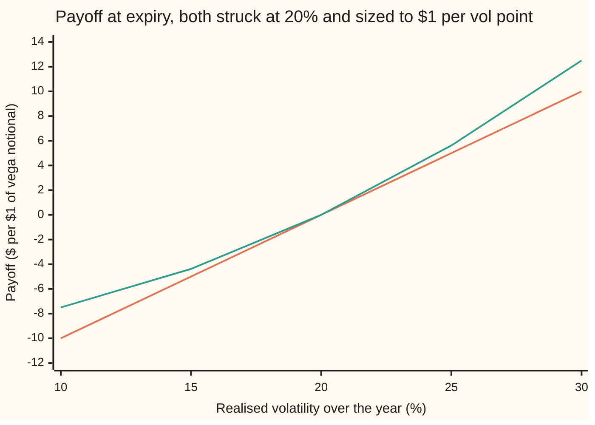
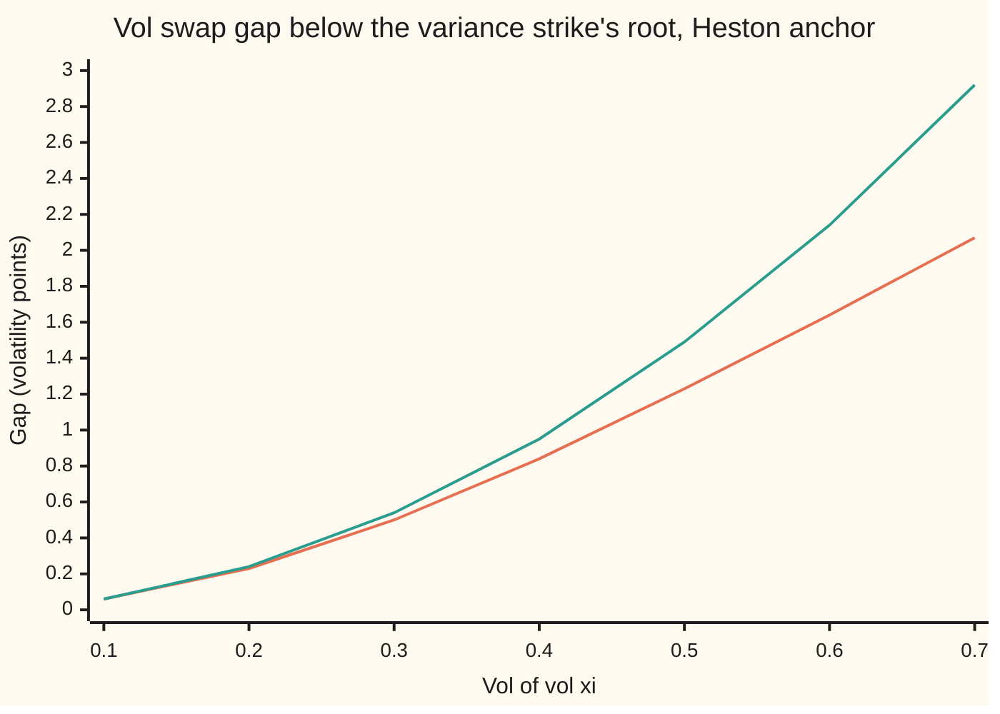
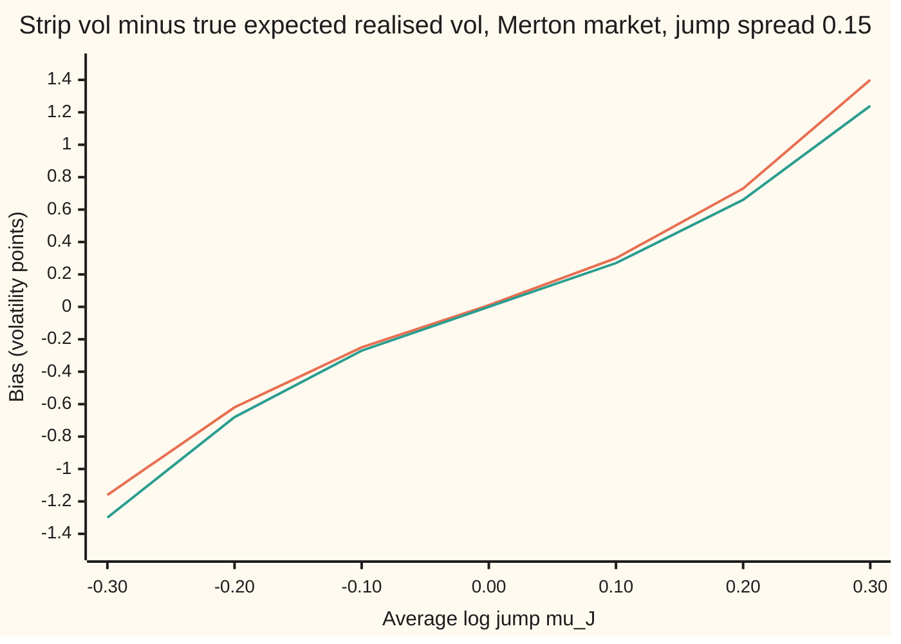

# The volatility swap and the jump bias: why a swap on vol is worth less than the root of the variance strike, and why gaps break the strip

[Syllabus](../../../SYLLABUS.md) → [Financial mathematics](../../../SYLLABUS.md#w12) → [Variance swaps, the log contract and VIX](../../../SYLLABUS.md#w12-s19) → The volatility swap and the jump bias

---

## General Overview

A one-year variance swap on Acme shares has a fair strike of 0.0400 in the house market. Variance is volatility squared, so 0.0400 is a volatility of 20.00%. At expiry the swap pays the gap between the variance Acme actually delivered over the year, its **realised variance**, and that strike ([The variance swap](03-variance-swap-fair-strike.md)).

A **volatility swap** pays realised volatility minus a fixed level instead. The natural guess for its fair level is the root of the variance strike, 20.00%. In the house Heston market, where volatility itself moves at random, it is worth 19.50%, half a volatility point less.

The reason is a curve. Suppose realised variance will be 0.02 or 0.06, each with even chance. The average variance is 0.04, whose root is 20.00%. The roots themselves are 14.14% and 24.49%, which average to 19.32%. Taking a square root before averaging gives less than taking it after. That is Jensen's inequality ([Jensen's inequality](../../09-Probability%20and%20statistics/02-Random%20Variables/06-jensens-inequality.md)), and the gap grows with how uncertain realised variance is: the **vol of vol**, the volatility of volatility itself.

A second flaw sits inside the variance swap itself. Its strike comes from a strip of options ([Any payoff from a strip of options](02-carr-madan-spanning-and-the-log-contract.md)), and the strip matches realised variance exactly only when the price moves without gaps. In a market where Acme can gap down, the strip prices variance at 0.055074 while the variance actually expected is 0.056250. The shortfall comes from the lopsidedness of the jumps: their third moment.

**A vol swap is worth less than the root of the variance strike, by roughly the spread of realised variance divided by eight times the strike to the power three halves; and when prices gap, the option strip misses the expected realised variance by a term led by the jumps' average cube.**

**What kind of fact this is:** two theorems, proved on this card in Why it works: the Jensen gap and the jump-bias identity. Their sizes are computed inside two models, Heston for the gap and Merton for the jumps, which are assumptions that fit markets well enough, not laws; the eighth-rule for the gap is an approximation, with its error shown.

### The picture: what each swap pays

Both swaps below are sized to pay $1 per volatility point for small moves near 20%; that size is the **vega notional**. The vol swap pays realised volatility minus 20, in points. The variance swap pays realised volatility squared minus 400, divided by 40. A **volatility point** is one percentage point of volatility; squared, 20% becomes 400 **variance points**.



Orange: the vol swap, a straight line. Green: the variance swap, a curve bending upward, touching the line at 20%. At 30% the variance swap pays $12.50 against $10.00; at 10% it loses $7.50 against $10.00. That extra payoff from big moves either way is **convexity**, the bonus a curved payoff earns. The vol swap lacks it, so it must be struck lower to be fair, by an amount set by the vol of vol.

---

## The formula

Notation first, in words. Over a life of $T$ years, the **realised variance** $\bar v$ is the average of the instantaneous variance along the path: $\bar v = \frac1T\int_0^T v_t\,dt$, with $v_t$ the variance at time $t$. Its root $\sigma_R = \sqrt{\bar v}$ is **realised volatility**. $E[\cdot]$ is the average in the pricing world, where every asset grows at the riskless rate; both swaps pay once at expiry, so each fair strike is the plain pricing-world average of what it pays on, with no discount.

$$K_{\mathrm{vol}} = E\big[\sqrt{\bar v}\,\big] \;\le\; \sqrt{E[\bar v]} = \sqrt{K_{\mathrm{var}}}, \qquad K_{\mathrm{vol}} \approx \sqrt{K_{\mathrm{var}}} - \frac{\mathrm{Var}(\bar v)}{8\,K_{\mathrm{var}}^{3/2}}$$

**Read it aloud:** the fair vol strike is the average realised volatility; it can never exceed the root of the fair variance strike, and it falls short by about the spread of realised variance over eight times the variance strike to the power one and a half.

Under Heston, variance is pulled toward a long-run level $\theta$ at speed $\kappa$ and shaken with vol of vol $\xi$. With today's variance $v_0$ equal to $\theta$, the spread of realised variance is exact ([The Heston model](../14-Stochastic%20volatility%20-%20Heston%2C%20SABR%20and%20their%20mix/01-heston-model.md) derives it):

$$\mathrm{Var}(\bar v) = \frac{\theta\xi^2}{\kappa^2T^2}\Big[T - \frac{1 - e^{-2\kappa T}}{2\kappa} - \frac{1 - e^{-\kappa T}}{\kappa} + \frac{e^{-\kappa T}(1 - e^{-\kappa T})}{\kappa}\Big]$$

In words: the vol of vol squared sets the scale, and a fast pull back to the long-run level shrinks it, because swings in variance die out before they add up.

The jump bias. Let $J$ be the log of the factor by which one gap multiplies the price, gaps arriving at rate $\lambda$ a year. The strip's variance strike and the true expected realised variance differ by

$$K_{\mathrm{strip}} - K_{\mathrm{true}} = 2\lambda\,E\big[e^{J} - 1 - J - \tfrac12 J^2\big] \;\approx\; \frac{\lambda}{3}\,E[J^3]$$

**Read it aloud:** each gap pays the strip a little more or less than it adds to realised variance, and on average the difference is led by one third of the jump rate times the average cube of the log jump.

With Merton's lognormal jumps of log-mean $\mu_J$ and spread $\delta$, over a diffusion volatility $\sigma$, both strikes are closed forms:

$$K_{\mathrm{strip}} = \sigma^2 + 2\lambda\big(e^{\mu_J + \frac12\delta^2} - 1 - \mu_J\big), \qquad K_{\mathrm{true}} = \sigma^2 + \lambda\big(\mu_J^2 + \delta^2\big)$$

| Symbol | Plain meaning | In our example | Push it up and the answer… |
| --- | --- | --- | --- |
| $K_{\mathrm{var}}$, $K_{\mathrm{vol}}$ | fair variance strike; fair vol strike | 0.0400 (20.00%); 19.50% | the vol strike follows the variance strike's root |
| $\bar v$, $\sigma_R$ | realised variance over the life; its root, realised volatility | random; average 0.0400 | — |
| $v_t$, $t$, $v_0$, $\theta$, $W_t$ | Heston variance at time $t$ (years from today); its value today; the long-run level it is pulled to; the random shake that drives it | 0.04; 0 to 1; 0.04; 0.04; random | vol strike rises: 21.54% at 0.0484 |
| $\kappa$ | pull speed back to $\theta$ | 2 | gap shrinks: 19.79% at 4, 19.13% at 1 |
| $\xi$ | vol of vol: the size of the variance's own shake | 0.3 | gap grows as its square: 0.50 points at 0.3, 2.07 at 0.7 |
| $\mathrm{Var}(\bar v)$, $m$ | spread of realised variance, as a variance; its mean, the point Step 2 expands around | 0.000343 (sd 0.0185); 0.04 | gap grows in proportion |
| $T$, $\sigma$ | years to expiry; Merton's no-gap volatility | 1; 20% | — |
| $\lambda$ | jump rate: gaps per year on average | 0.5 | jump bias grows in proportion |
| $J$, $\mu_J$, $\delta$ | log size of one gap; its average; its spread | random; −0.10; 0.15 | $\mu_J$ sets the sign: −0.25 points at −0.10, +0.30 at +0.10 |
| $S_T$, $F$, $F_t$, $X$ | Acme's price at expiry; the forward, today's price grown at the 5% rate less the 2% dividend yield; the forward at time $t$; the ratio $F_t/F$ | random; fixed today; random; starts at 1 | — |
| $E$, $L(s)$, $s$, $c$, $y$ | pricing-world average; the average of $e^{-s\bar v}$, used in the proof; a positive number; $s/T$; the code's integration variable, $s = e^{2y}$ | —; —; —; —; — | — |
| $K_{\mathrm{strip}}$, $K_{\mathrm{true}}$, $g$, $f$ | variance priced by the option strip; variance actually expected; a downward-bending function (Step 1); the strip's payoff as a function of $X$ (Step 6) | 0.055074; 0.056250; square root; $2(X-1) - 2\ln X$ | — |

### When it holds

- **Realised variance measured continuously.** Real contracts sum squared daily log returns ([Realised variance](01-realised-variance-from-daily-prices.md)); the daily simulation in the code lands within its noise of the continuous formulas.
- **The inequality needs nothing; the size needs a model.** Jensen holds whenever realised variance is uncertain. The 0.50-point gap is Heston's, with vol of vol 0.3; a market whose variance shakes harder has a bigger gap.
- **The eighth-rule needs a narrow spread.** It keeps the first two terms of a Taylor expansion. At vol of vol 0.7 it says 2.92 points where the exact gap is 2.07.
- **The strip is exact only without gaps.** With jumps it is off by the formula above. Jumps that are not lognormal change the size; the sign still follows the lopsidedness.
- **Fixed interest rates.** Both strikes are then plain pricing-world averages. With random rates, the payment date's discount factor moves with the payoff and a further correction appears.

---

## Why it works

### Step 0: the vol swap pays on a bent function of the variance swap's variable

Both contracts settle on the same random number, realised variance $\bar v$. The variance swap pays on it directly, a straight line in $\bar v$. The vol swap pays on its square root. A square root bends downward: from 0.02 to 0.04 it rises 5.86 points, from 0.04 to 0.06 only 4.49. A downward bend loses more on bad draws than it gains on good ones. So averaging over the uncertain outcome must cost the vol swap something.

### Step 1: Jensen turns the bend into an inequality

For any downward-bending function $g$ and any random $X$, $E[g(X)] \le g(E[X])$, with equality only if $X$ is certain ([Jensen's inequality](../../09-Probability%20and%20statistics/02-Random%20Variables/06-jensens-inequality.md)). Take $g$ as the square root and $X = \bar v$:

$$K_{\mathrm{vol}} = E[\sqrt{\bar v}] \le \sqrt{E[\bar v]} = \sqrt{K_{\mathrm{var}}}.$$

The variance strike is the pricing-world average of $\bar v$, fixed by the option strip with no model at all ([The variance swap](03-variance-swap-fair-strike.md)). So the strip hands the vol swap a ceiling, not a price.

### Step 2: a Taylor expansion sizes the gap

Expand the square root around the mean $m = E[\bar v]$ to second order:

$$\sqrt{x} \approx \sqrt{m} + \frac{x - m}{2\sqrt m} - \frac{(x - m)^2}{8\,m^{3/2}}.$$

Average both sides with $x = \bar v$. The middle term averages to zero, since $\bar v$ averages to $m$. The last term averages to $\mathrm{Var}(\bar v)/(8m^{3/2})$. That is the formula. The eighth is the second derivative of the square root at $m$, $-\tfrac14 m^{-3/2}$, times the half from Taylor's rule.

The rule ignores the third-order term, which carries the lopsidedness of $\bar v$. Realised variance cannot go below zero but can run far above its mean, so its long right tail partly offsets the bend and the rule overstates the gap. The overstatement grows with vol of vol (chart below).

### Step 3: vol of vol sets the spread

Heston's variance follows $dv_t = \kappa(\theta - v_t)\,dt + \xi\sqrt{v_t}\,dW_t$: a pull toward $\theta$ at speed $\kappa$ plus a shake of size $\xi$, with $W_t$ a Brownian motion ([The Heston model](../14-Stochastic%20volatility%20-%20Heston%2C%20SABR%20and%20their%20mix/01-heston-model.md)). The shake is what makes $\bar v$ uncertain. Its spread formula, in The formula above, is proportional to $\xi^2$. At the anchor, $v_0 = \theta = 0.04$, $\kappa = 2$, $\xi = 0.3$, $T = 1$, the spread is 0.000343, a standard deviation of 0.0185 around a mean of 0.04. The eighth-rule then gives 19.46%, a gap of 0.54 points.

The correlation between Acme's shake and the variance's shake plays no part: realised variance depends on the variance path alone.

### Step 4: the exact value, through a transform

The square root can be written as an integral of exponentials:

$$\sqrt{x} = \frac{1}{2\sqrt{\pi}}\int_0^\infty \frac{1 - e^{-s x}}{s^{3/2}}\,ds.$$

Put $x = \bar v$ and average inside the integral. What is needed is $L(s) = E[e^{-s\bar v}]$ for each positive $s$. For Heston's variance that average is known in closed form: it is the price of a zero-coupon bond in the Cox-Ingersoll-Ross interest-rate model, with variance in the role of the short rate. One integral over $s$ then gives $K_{\mathrm{vol}}$ with no simulation and no expansion: 19.50%, a gap of 0.498 points. The eighth-rule's 0.54 points overstates it by about 0.04 points, the size of the dropped higher-order terms.



Orange: the exact gap from the transform. Green: the eighth-rule. They agree to a hundredth of a point at vol of vol 0.1 and part steadily after: the rule grows as the square of vol of vol, the true gap more slowly.

<details>
<summary>Detailed proof: the root as an integral, and Heston's transform</summary>

**The integral.** Substitute $u = s x$: the right side becomes $\sqrt{x}\cdot\frac{1}{2\sqrt\pi}\int_0^\infty (1 - e^{-u})\,u^{-3/2}\,du$. Integrate by parts: $\int_0^\infty (1 - e^{-u})u^{-3/2}du = \big[-2u^{-1/2}(1 - e^{-u})\big]_0^\infty + 2\int_0^\infty u^{-1/2}e^{-u}du = 0 + 2\sqrt\pi$. So the right side is $\sqrt x$. Every term is positive, so averaging may pass inside the integral: $E[\sqrt{\bar v}] = \frac{1}{2\sqrt\pi}\int_0^\infty (1 - L(s))\,s^{-3/2}\,ds$.

**The transform.** Write $c = s/T$, gamma $= \sqrt{\kappa^2 + 2\xi^2 c}$, and $D = (\text{gamma} + \kappa)(e^{\text{gamma}\,T} - 1) + 2\,\text{gamma}$. The average of $e^{-c\int_0^T v_t dt}$ solves the pricing equation of a bond whose short rate is $c\,v_t$; the Cox-Ingersoll-Ross solution is
$$L(s) = \Big(\frac{2\,\text{gamma}\,e^{(\kappa + \text{gamma})T/2}}{D}\Big)^{2\kappa\theta/\xi^2}\exp\Big(-\frac{2c\,(e^{\text{gamma}\,T} - 1)}{D}\,v_0\Big).$$
Scaling $v_t$ by $c$ turns $\theta$ into $c\theta$ and $\xi$ into $\xi\sqrt c$, which leaves the exponent $2\kappa\theta/\xi^2$ unchanged and puts $c$ inside gamma. The code divides top and bottom by $e^{\text{gamma}\,T}$ so nothing overflows, and substitutes $s = e^{2y}$ so the integral runs over a finite window of $y$ with a smooth integrand.

</details>

### Step 5: why no strip can replicate the vol swap

The strip plus a rolling hedge in the forward delivers $\bar v$ exactly on gapless paths, so any payoff linear in $\bar v$ is replicated with no model. $\sqrt{\bar v}$ is not linear. A hedger must hold about $1/(2\sigma)$ of variance swap per unit of vol swap, with $\sigma$ the volatility expected at the time, and that amount changes as volatility moves. Re-sizing it costs money in proportion to vol of vol: the gap, seen from the hedger's side. That is why the vol strike needs a model and the variance strike does not.

### Step 6: a gap pays the strip differently from realised variance

The strip's variance strike rests on an identity for the forward $F_t$, the price for delivery at expiry. On a path with no gaps, Itô's lemma (the chain rule for random paths) gives

$$2\Big(\frac{S_T}{F} - 1\Big) - 2\ln\frac{S_T}{F} = \text{hedge gains} + T\,\bar v.$$

The left side is what the option strip pays ([Any payoff from a strip of options](02-carr-madan-spanning-and-the-log-contract.md)). The hedge gains average to zero. So the strip's price equals the expected realised variance.

A gap breaks the chain rule. When the forward jumps by the factor $e^J$, realised variance picks up $J^2$, the squared log return. The strip-plus-hedge position picks up $2(e^J - 1 - J)$. These differ. Expanding the exponential, $2(e^J - 1 - J) = J^2 + \tfrac13J^3 + \tfrac1{12}J^4 + \dots$, so the leftover per gap is $\tfrac13J^3 + \tfrac1{12}J^4 + \dots$. Gaps arrive at rate $\lambda$, so over a year the average leftover is $2\lambda\,E[e^J - 1 - J - \tfrac12J^2]$, the formula. Its leading term is $\tfrac{\lambda}{3}E[J^3]$: downward gaps have negative cubes and pull the strip below the true variance; upward gaps push it above.

<details>
<summary>Detailed proof: the jump accounting</summary>

Let $X_t = F_t/F$, the forward relative to today's. Hold $2(1 - 1/X_{t-})$ units of forward, rebalanced as it moves; $X_{t-}$ is the value just before any gap. The hedge gains are the sum of that holding times each move in $X$.

Between gaps, Itô's lemma on $f(X) = 2(X - 1) - 2\ln X$ gives $df = (2 - 2/X)\,dX + X^{-2}\,d\langle X\rangle$. The first term is the hedge; the second is $v_t\,dt$, because $d\langle X\rangle = X^2 v_t\,dt$ (the angle brackets mark the accumulated squared moves). Summed over the life, that is $T\bar v$ from the diffusion.

At a gap, $X$ jumps from $X_{t-}$ to $X_{t-}e^J$. The change in $f$ is $2X_{t-}(e^J - 1) - 2J$. The hedge gains $2(1 - 1/X_{t-})\,X_{t-}(e^J - 1) = 2(X_{t-} - 1)(e^J - 1)$. The residual, change in $f$ minus hedge gain, is $2(e^J - 1 - J)$, whatever $X_{t-}$ was. Realised variance gains $J^2$. So
$$f(X_T) = \text{hedge gains} + T\bar v + \sum_{\text{gaps}}\big[2(e^J - 1 - J) - J^2\big].$$
The forward has zero average drift in the pricing world, so hedge gains average to zero. Gaps come at rate $\lambda$, independent of their sizes, so the sum averages to $\lambda T\,E[2(e^J - 1 - J) - J^2]$. Divide by $T$: $K_{\mathrm{strip}} = K_{\mathrm{true}} + 2\lambda E[e^J - 1 - J - \tfrac12J^2]$. For lognormal $J$, $E[e^J] = e^{\mu_J + \delta^2/2}$ and $E[J^2] = \mu_J^2 + \delta^2$, which gives the two closed forms.

</details>

With the house Merton numbers the strip strike is 0.055074 and the true expected variance 0.056250: the strip is short by 0.001176, a quarter of a volatility point (23.47% against 23.72%). The third-moment term alone gives −0.001292; adding the fourth-moment term gives −0.001168.



Orange: the exact bias from the closed forms. Green: the third-moment term alone. Downward gaps put the strip below the truth, upward gaps above. At an average jump of zero the cube averages to zero, yet the exact bias is +0.01 points: the fourth-moment term is always positive.

A second road to the vol strike exists: Carr and Lee price a vol swap directly from the option smile when the variance moves independently of the price, without choosing a variance model. It needs the full smile and is left to the sources.

---

## Worked numbers, by hand

### The vol swap under the Heston anchor

$v_0 = \theta = 0.04$, $\kappa = 2$, $\xi = 0.3$, $T = 1$.

| Step | Arithmetic | Value |
| --- | --- | --- |
| variance strike | average of $\bar v$ with $v_0 = \theta$ | 0.040000 |
| its root | $\sqrt{0.04}$ | 20.00% |
| spread of realised variance | Heston formula | 0.000343 |
| denominator | $8 \times 0.04^{3/2} = 8 \times 0.008$ | 0.064 |
| eighth-rule gap | $0.000343 / 0.064$ | 0.00535, i.e. 0.54 points |
| eighth-rule vol strike | $20.00 - 0.54$ | 19.46% |
| **exact vol strike** | transform integral | **19.50%** |
| simulation, 50,000 paths | average of $\sqrt{\bar v}$ | 19.50%, standard error 0.02 |

Striking at 20.00% instead of 19.50% costs the buyer half a volatility point per dollar of vega notional.

### The jump bias under the Merton market

$\sigma = 0.20$, $\lambda = 0.5$, $\mu_J = -0.10$, $\delta = 0.15$.

| Step | Arithmetic | Value |
| --- | --- | --- |
| average jump factor | $e^{-0.10 + 0.01125} = e^{-0.08875}$ | 0.915075 |
| strip jump term | $2 \times 0.5 \times (0.915075 - 1 + 0.10)$ | 0.015074 |
| **strip strike** | $0.04 + 0.015074$ | **0.055074 (23.47%)** |
| average squared log jump | $0.01 + 0.0225$ | 0.0325 |
| **true expected variance** | $0.04 + 0.5 \times 0.0325$ | **0.056250 (23.72%)** |
| jump bias | $0.055074 - 0.056250$ | −0.001176 |
| third-moment term | $0.5 \times (-0.001 - 0.00675)/3$ | −0.001292 |
| plus fourth-moment term | $+\,0.5 \times 0.00296875/12$ | −0.001168 |

The strip prices a quarter of a volatility point less variance than the jumps deliver on average: a variance swap struck off the strip is cheap for the buyer in a market that gaps down.

### What moves the vol strike

The vol strike's sensitivities, each computed by the exact transform with one input changed:

| Change from the anchor | Vol strike | Why |
| --- | --- | --- |
| none | 19.50% | the anchor |
| $v_0 = \theta = 0.0484$ (22% level) | 21.54% | higher level; gap nearly unchanged |
| $\kappa = 1$ | 19.13% | slow pull: swings in variance last and add up |
| $\kappa = 4$ | 19.79% | fast pull: swings die out |
| $v_0 = 0.09$ | 24.36% | high start, pulled toward 0.04 over the year |

### What breaks if you drop a piece

| Mistake | Comes out at | What went wrong |
| --- | --- | --- |
| Quote the vol swap at the variance strike's root | 20.00% (right: 19.50%) | ignored the bend: Jensen's gap is 0.50 points |
| Use the eighth-rule at vol of vol 0.7 | gap 2.92 points (right: 2.07) | the dropped higher-order terms are no longer small |
| Ignore the pull, spread $\xi^2\theta T/3$ | 18.13% (right: 19.50%) | without mean reversion, variance swings add up for the whole year |
| Treat the strip strike as expected realised variance, Merton market | 23.47% (right: 23.72%) | a gap pays the strip $2(e^J - 1 - J)$, not $J^2$ |

---

## Code, from first principles, and it actually runs

The code takes three roads to each answer. For the vol strike: the eighth-rule with Heston's spread formula; the exact transform integral, by Simpson's rule on a smooth integrand; and a simulation of 50,000 variance paths of 100 steps, averaging $\sqrt{\bar v}$. For the jump bias: the closed forms; a numerical strip, integrating 1,600 Merton option prices weighted by one over strike squared; and a simulation of 40,000 years of 252 daily returns, which averages realised variance, the log-contract payoff, and the per-day leftover $2(e^u - 1 - u) - u^2$ of Step 6, with $u$ the day's log return of the forward. The normal curve area, the integrator and the random numbers are written out in both languages. The same no-jump strip returns 0.040000, the house market's variance strike.

### Python

```python
# Volatility swap and jump bias -- the check behind the card.  Standard library only.
# Part 1, Heston anchor: the fair vol strike E[sqrt(vbar)] by three roads -- the convexity
# formula, the exact Laplace-transform integral, a Monte Carlo of variance paths.
# Part 2, Merton jumps: the option-strip variance strike against the true expected realised
# variance -- closed forms, a numerical strip of option prices, a Monte Carlo of daily returns.
from math import exp, log, sqrt, pi, cos, sin, expm1

def N(x):                                    # normal CDF: 1/2 + phi(x) (x + x^3/3 + x^5/15 + ...)
    if abs(x) > 9.0: return 0.0 if x < 0 else 1.0
    term, s, n = x, x, 1
    while abs(term) > 1e-17 * abs(s):
        term *= x * x / (2 * n + 1); s += term; n += 1
    return 0.5 + s * exp(-0.5 * x * x) / sqrt(2.0 * pi)
def simpson(f, a, b, n):
    h = (b - a) / n
    return h / 3.0 * (f(a) + f(b) + sum((4 if i % 2 else 2) * f(a + i * h) for i in range(1, n)))
class Rng:                                   # 64-bit LCG; uniforms from the top 53 bits; Box-Muller pairs
    def __init__(s, seed): s.x, s.spare = seed, None
    def u(s):
        s.x = (6364136223846793005 * s.x + 1442695040888963407) & 0xFFFFFFFFFFFFFFFF
        return ((s.x >> 11) + 0.5) / 9007199254740992.0
    def z(s):
        if s.spare is not None: z, s.spare = s.spare, None; return z
        rad = sqrt(-2.0 * log(s.u())); ang = 2.0 * pi * s.u()
        s.spare = rad * sin(ang); return rad * cos(ang)

def mean_se(tot, tot2, n): return tot / n, sqrt((tot2 / n - (tot / n) ** 2) / n)

# ---------------- Part 1: the vol swap under the Heston anchor ----------------
T, V0, TH, KA, XI = 1.0, 0.04, 0.04, 2.0, 0.3
def var_vbar(th, ka, xi):                    # variance of the average variance, when v0 = theta
    e1, e2 = exp(-ka * T), exp(-2 * ka * T)
    return th * xi**2 / ka**2 * (T - (1 - e2) / (2 * ka) - (1 - e1) / ka + e1 * (1 - e1) / ka) / T**2
def convexity(m, var): return sqrt(m) - var / (8.0 * m ** 1.5)
def log_laplace(s, v0, th, ka, xi):          # ln E[exp(-s vbar)]: the CIR bond-price formula
    c = s / T; g = sqrt(ka * ka + 2 * xi * xi * c); em = exp(-g * T)
    den = (g + ka) * (1 - em) + 2 * g * em
    lnA = 2 * ka * th / xi**2 * (log(2 * g) + 0.5 * (ka - g) * T - log(den))
    return lnA - 2 * c * (1 - em) / den * v0
def vol_strike(v0, th, ka, xi):              # E sqrt(X) = (1/sqrt pi) * integral of (1 - L(e^2y)) e^-y dy
    f = lambda y: -expm1(log_laplace(exp(2 * y), v0, th, ka, xi)) * exp(-y)
    return simpson(f, -20.0, 25.0, 6000) / sqrt(pi)
def heston_mc(paths, steps, seed):           # full-truncation Euler; vbar = time-average of v
    g, dt, a = Rng(seed), T / steps, [0.0] * 4
    for _ in range(paths):
        v, acc = V0, 0.0
        for _ in range(steps):
            vp = max(v, 0.0); acc += vp * dt
            v += KA * (TH - vp) * dt + XI * sqrt(vp * dt) * g.z()
        x = acc / T; a[0] += sqrt(x); a[1] += x; a[2] += x * x
    return (*mean_se(a[0], a[1], paths), a[1] / paths, a[2] / paths - (a[1] / paths) ** 2)

kvar, var_x = V0, var_vbar(TH, KA, XI)
k_conv, k_exact = convexity(kvar, var_x), vol_strike(V0, TH, KA, XI)
mc_vol, mc_se, mc_mean, mc_var = heston_mc(50000, 100, 20260927)
two_pt = 0.5 * (sqrt(0.02) + sqrt(0.06))
print("PART 1  vol swap, Heston v0 = theta = 0.04, kappa 2, xi 0.3, one year")
for lab, v in (("two-point: root of 0.02", sqrt(0.02)), ("two-point: root of 0.06", sqrt(0.06)), ("two-point: mean of roots", two_pt),
               ("variance strike E[vbar]", kvar), ("  as a vol, %", 100 * sqrt(kvar)),
               ("Var(vbar), formula", var_x), ("sd(vbar), formula", sqrt(var_x)),
               ("1 convexity formula, %", 100 * k_conv), ("2 Laplace integral, %", 100 * k_exact),
               ("3 Monte Carlo, %", 100 * mc_vol), ("  standard error, %", 100 * mc_se),
               ("  MC mean of vbar", mc_mean), ("  MC Var(vbar)", mc_var),
               ("gap sqrt(Kvar) - Kvol, vol pts", 100 * (sqrt(kvar) - k_exact)),
               ("wrong: no pull, xi^2 th T / 3, %", 100 * convexity(kvar, XI**2 * TH * T / 3))):
    print(f"{lab:<34} {v:>12.6f}")
print("chart, xi     " + "".join(f"{x:>7.2f}" for x in (0.1, 0.2, 0.3, 0.4, 0.5, 0.6, 0.7)))
gx = [(100 * (0.2 - vol_strike(V0, TH, KA, x)), 100 * (0.2 - convexity(kvar, var_vbar(TH, KA, x))))
      for x in (0.1, 0.2, 0.3, 0.4, 0.5, 0.6, 0.7)]
print("chart, exact  " + "".join(f"{e:>7.2f}" for e, _ in gx))
print("chart, approx " + "".join(f"{c:>7.2f}" for _, c in gx))
for lab, args in (("level: v0 = theta = 0.0484, %", (0.0484, 0.0484, KA, XI)), ("pull: kappa = 1, %", (V0, TH, 1.0, XI)),
                  ("pull: kappa = 4, %", (V0, TH, 4.0, XI)), ("start: v0 = 0.09, %", (0.09, TH, KA, XI))):
    print(f"{lab:<34} {100 * vol_strike(*args):>12.6f}")
print("payoff, realised vol %  " + "".join(f"{s:>7.1f}" for s in (10, 15, 20, 25, 30)))
print("payoff, vol swap        " + "".join(f"{s - 20:>7.2f}" for s in (10, 15, 20, 25, 30)))
print("payoff, var swap        " + "".join(f"{(s * s - 400) / 40:>7.2f}" for s in (10, 15, 20, 25, 30)))

# ---------------- Part 2: the strip under Merton jumps ----------------
S, r, q, SIG, LAM, MU, DEL = 100.0, 0.05, 0.02, 0.20, 0.5, -0.10, 0.15
F = S * exp((r - q) * T)
def bs(K, sig, qq, call):                    # Black-Scholes on Acme with volatility sig, yield qq
    d1 = (log(S / K) + (r - qq + 0.5 * sig * sig) * T) / (sig * sqrt(T)); d2 = d1 - sig * sqrt(T)
    if call: return S * exp(-qq * T) * N(d1) - K * exp(-r * T) * N(d2)
    return K * exp(-r * T) * N(-d2) - S * exp(-qq * T) * N(-d1)
def merton(K, call):                         # Poisson-weighted Black-Scholes branches
    k, w, tot = exp(MU + 0.5 * DEL * DEL) - 1, exp(-LAM * T), 0.0
    for n in range(25):
        tot += w * bs(K, sqrt(SIG * SIG + n * DEL * DEL / T), q + LAM * k - n * log(1 + k) / T, call)
        w *= LAM * T / (n + 1)
    return tot
def strip(price):                            # (2/T) e^rT [int_0^F P/K^2 dK + int_F^inf C/K^2 dK], K = e^x
    lf = log(F)
    puts = simpson(lambda x: price(exp(x), False) * exp(-x), lf - 4.0, lf, 800)
    calls = simpson(lambda x: price(exp(x), True) * exp(-x), lf, lf + 4.0, 800)
    return 2.0 / T * exp(r * T) * (puts + calls)
def closed(mu, de):                          # (strip strike, true expected realised variance)
    return SIG**2 + 2 * LAM * (exp(mu + 0.5 * de * de) - 1 - mu), SIG**2 + LAM * (mu * mu + de * de)
def merton_mc(paths, days, seed):            # daily log returns; realised variance and log-contract payoff
    g, dt, a, k = Rng(seed), T / days, [0.0] * 6, exp(MU + 0.5 * DEL * DEL) - 1
    drift, p0 = (-LAM * k - 0.5 * SIG * SIG) * dt, exp(-LAM * dt)
    for _ in range(paths):
        lx, rv, gap = 0.0, 0.0, 0.0
        for _ in range(days):
            u = drift + SIG * sqrt(dt) * g.z()
            un, n, p, cum = g.u(), 0, p0, p0
            while un > cum: n += 1; p *= LAM * dt / n; cum += p
            for _ in range(n): u += MU + DEL * g.z()
            lx += u; rv += (u + (r - q) * dt) ** 2; gap += 2 * expm1(u) - 2 * u - u * u
        pay = 2 * (expm1(lx) - lx)
        for i, val in enumerate((rv, rv * rv, pay, pay * pay, gap, gap * gap)): a[i] += val
    return [mean_se(a[i], a[i + 1], paths) for i in (0, 2, 4)]

ks_bs, ks_m = strip(lambda K, c: bs(K, SIG, q, c)), strip(merton)
kc_strip, kc_true = closed(MU, DEL)
m3, m4 = LAM * (MU**3 + 3 * MU * DEL**2) / 3, LAM * (MU**4 + 6 * MU**2 * DEL**2 + 3 * DEL**4) / 12
(rv, rv_se), (lp, lp_se), (hg, hg_se) = merton_mc(40000, 252, 7)
print("PART 2  jump bias, Merton lambda 0.5, mu_J -0.10, delta 0.15, sigma 0.20")
for lab, v in (("strip, no jumps (house)", ks_bs), ("1 strip strike, closed form", kc_strip),
               ("2 strip strike, numerical strip", ks_m), ("3 MC log-contract payoff", lp),
               ("  standard error", lp_se), ("true E[realised var], closed", kc_true),
               ("  MC daily realised variance", rv), ("  standard error", rv_se),
               ("jump bias strip - true", kc_strip - kc_true), ("  MC hedged gap", hg), ("  standard error", hg_se),
               ("  third-moment term", m3), ("  plus fourth-moment term", m3 + m4),
               ("strip strike as a vol, %", 100 * sqrt(kc_strip)), ("true as a vol, %", 100 * sqrt(kc_true))):
    print(f"{lab:<34} {v:>12.6f}")
mus = (-0.3, -0.2, -0.1, 0.0, 0.1, 0.2, 0.3)
print("chart, mu_J   " + "".join(f"{m:>7.2f}" for m in mus))
print("chart, exact  " + "".join(f"{100 * (sqrt(closed(m, DEL)[0]) - sqrt(closed(m, DEL)[1])):>7.2f}" for m in mus))
print("chart, 3rd    " + "".join(f"{100 * (sqrt(closed(m, DEL)[1] + LAM * (m**3 + 3 * m * DEL**2) / 3) - sqrt(closed(m, DEL)[1])):>7.2f}" for m in mus))

assert abs(k_exact - mc_vol) < 4 * mc_se,            "exact Laplace road vs Monte Carlo"
assert abs(k_exact - k_conv) < 0.001,                "convexity formula within 0.1 vol point at xi = 0.3"
assert abs(mc_var - var_x) < 0.05 * var_x,           "simulated Var(vbar) vs the closed formula"
assert k_exact < sqrt(mc_mean),                      "Jensen: vol strike below root of the variance strike"
assert abs(ks_bs - SIG**2) < 1e-6,                   "no-jump strip returns sigma^2"
assert abs(ks_m - kc_strip) < 1e-6,                  "numerical strip vs closed-form strip strike"
assert abs(hg - (kc_strip - kc_true)) < 4 * hg_se + 2e-4, "hedged Monte Carlo gap vs closed-form jump bias"
assert abs(rv - kc_true) < 4 * rv_se + 2e-4 and abs(lp - kc_strip) < 4 * lp_se, "MC realised variance and log contract"
print("ALL CHECKS PASS")
```

**Ran 2026-09-27 on macOS, Python 3.14.6, standard library only. All checks passed. Output, pasted from the run:**

```
PART 1  vol swap, Heston v0 = theta = 0.04, kappa 2, xi 0.3, one year
two-point: root of 0.02                0.141421
two-point: root of 0.06                0.244949
two-point: mean of roots               0.193185
variance strike E[vbar]                0.040000
  as a vol, %                         20.000000
Var(vbar), formula                     0.000343
sd(vbar), formula                      0.018512
1 convexity formula, %                19.464561
2 Laplace integral, %                 19.501874
3 Monte Carlo, %                      19.504197
  standard error, %                    0.019908
  MC mean of vbar                      0.040023
  MC Var(vbar)                         0.000343
gap sqrt(Kvar) - Kvol, vol pts         0.498126
wrong: no pull, xi^2 th T / 3, %      18.125000
chart, xi        0.10   0.20   0.30   0.40   0.50   0.60   0.70
chart, exact     0.06   0.23   0.50   0.84   1.23   1.64   2.07
chart, approx    0.06   0.24   0.54   0.95   1.49   2.14   2.92
level: v0 = theta = 0.0484, %         21.541379
pull: kappa = 1, %                    19.131609
pull: kappa = 4, %                    19.786384
start: v0 = 0.09, %                   24.361283
payoff, realised vol %     10.0   15.0   20.0   25.0   30.0
payoff, vol swap         -10.00  -5.00   0.00   5.00  10.00
payoff, var swap          -7.50  -4.38   0.00   5.62  12.50
PART 2  jump bias, Merton lambda 0.5, mu_J -0.10, delta 0.15, sigma 0.20
strip, no jumps (house)                0.040000
1 strip strike, closed form            0.055074
2 strip strike, numerical strip        0.055074
3 MC log-contract payoff               0.055038
  standard error                       0.000412
true E[realised var], closed           0.056250
  MC daily realised variance           0.056163
  standard error                       0.000191
jump bias strip - true                -0.001176
  MC hedged gap                       -0.001160
  standard error                       0.000022
  third-moment term                   -0.001292
  plus fourth-moment term             -0.001168
strip strike as a vol, %              23.467917
true as a vol, %                      23.717082
chart, mu_J     -0.30  -0.20  -0.10   0.00   0.10   0.20   0.30
chart, exact    -1.16  -0.62  -0.25   0.01   0.30   0.73   1.40
chart, 3rd      -1.30  -0.68  -0.27   0.00   0.27   0.66   1.24
ALL CHECKS PASS
```

The roads agree. The transform gives 19.501874% and the simulation 19.504197%, a tenth of a standard error apart. The numerical strip matches the closed-form strip strike to six decimals. The simulated leftover, −0.001160 with standard error 0.000022, sits on the closed-form bias of −0.001176; it is simulated directly because the raw averages are noisier.

### Rust

Same roads, same random numbers, same labels. No crates.

```rust
// Volatility swap and jump bias -- the same check as volatility_swap_and_jump_bias_check.py, in Rust.
// Standard library only, no crates.  Part 1: Heston vol strike by the convexity formula, the exact
// Laplace-transform integral and a Monte Carlo.  Part 2: Merton strip strike against true expected
// realised variance by closed forms, a numerical option strip and a Monte Carlo of daily returns.
use std::f64::consts::PI;

fn n_cdf(x: f64) -> f64 {                     // 1/2 + phi(x) (x + x^3/3 + x^5/15 + ...)
    if x.abs() > 9.0 { return if x < 0.0 { 0.0 } else { 1.0 }; }
    let (mut term, mut s, mut n) = (x, x, 1.0);
    while term.abs() > 1e-17 * s.abs() { term *= x * x / (2.0 * n + 1.0); s += term; n += 1.0; }
    0.5 + s * (-0.5 * x * x).exp() / (2.0 * PI).sqrt()
}
fn simpson<F: Fn(f64) -> f64>(f: F, a: f64, b: f64, n: usize) -> f64 {
    let (h, mut s) = ((b - a) / n as f64, 0.0);
    for i in 1..n { s += if i % 2 == 1 { 4.0 } else { 2.0 } * f(a + i as f64 * h); }
    h / 3.0 * (f(a) + f(b) + s)
}
struct Rng { x: u64, spare: Option<f64> }     // 64-bit LCG; top 53 bits; Box-Muller pairs
impl Rng {
    fn u(&mut self) -> f64 {
        self.x = self.x.wrapping_mul(6364136223846793005).wrapping_add(1442695040888963407);
        ((self.x >> 11) as f64 + 0.5) / 9007199254740992.0
    }
    fn z(&mut self) -> f64 {
        if let Some(z) = self.spare.take() { return z; }
        let rad = (-2.0 * self.u().ln()).sqrt(); let ang = 2.0 * PI * self.u();
        self.spare = Some(rad * ang.sin());
        rad * ang.cos()
    }
}
fn mean_se(tot: f64, tot2: f64, n: f64) -> (f64, f64) { (tot / n, ((tot2 / n - (tot / n).powi(2)) / n).sqrt()) }
fn row(lab: &str, v: f64) { println!("{:<34} {:>12.6}", lab, v); }
fn line(lab: &str, xs: &[f64]) { println!("{}{}", lab, xs.iter().map(|v| format!("{:>7.2}", v)).collect::<String>()); }

// ---------------- Part 1: the vol swap under the Heston anchor ----------------
const T: f64 = 1.0; const V0: f64 = 0.04; const TH: f64 = 0.04; const KA: f64 = 2.0; const XI: f64 = 0.3;
fn var_vbar(th: f64, ka: f64, xi: f64) -> f64 { // variance of the average variance, when v0 = theta
    let (e1, e2) = ((-ka * T).exp(), (-2.0 * ka * T).exp());
    th * xi.powi(2) / ka.powi(2) * (T - (1.0 - e2) / (2.0 * ka) - (1.0 - e1) / ka + e1 * (1.0 - e1) / ka) / T.powi(2)
}
fn convexity(m: f64, var: f64) -> f64 { m.sqrt() - var / (8.0 * m.powf(1.5)) }
fn log_laplace(s: f64, v0: f64, th: f64, ka: f64, xi: f64) -> f64 { // ln E[exp(-s vbar)], CIR bond price
    let c = s / T; let g = (ka * ka + 2.0 * xi * xi * c).sqrt(); let em = (-g * T).exp();
    let den = (g + ka) * (1.0 - em) + 2.0 * g * em;
    let ln_a = 2.0 * ka * th / xi.powi(2) * ((2.0 * g).ln() + 0.5 * (ka - g) * T - den.ln());
    ln_a - 2.0 * c * (1.0 - em) / den * v0
}
fn vol_strike(v0: f64, th: f64, ka: f64, xi: f64) -> f64 { // E sqrt(X) = (1/sqrt pi) int (1 - L(e^2y)) e^-y dy
    let f = |y: f64| -(log_laplace((2.0 * y).exp(), v0, th, ka, xi).exp_m1()) * (-y).exp();
    simpson(f, -20.0, 25.0, 6000) / PI.sqrt()
}
fn heston_mc(paths: usize, steps: usize, seed: u64) -> (f64, f64, f64, f64) {
    let (mut g, dt, mut a) = (Rng { x: seed, spare: None }, T / steps as f64, [0.0f64; 3]);
    for _ in 0..paths {
        let (mut v, mut acc) = (V0, 0.0);
        for _ in 0..steps {
            let vp = v.max(0.0); acc += vp * dt;
            v += KA * (TH - vp) * dt + XI * (vp * dt).sqrt() * g.z();
        }
        let x = acc / T; a[0] += x.sqrt(); a[1] += x; a[2] += x * x;
    }
    let n = paths as f64; let (m, se) = mean_se(a[0], a[1], n);
    (m, se, a[1] / n, a[2] / n - (a[1] / n).powi(2))
}

// ---------------- Part 2: the strip under Merton jumps ----------------
const S: f64 = 100.0; const R: f64 = 0.05; const Q: f64 = 0.02; const SIG: f64 = 0.20;
const LAM: f64 = 0.5; const MU: f64 = -0.10; const DEL: f64 = 0.15;
fn bs(k: f64, sig: f64, qq: f64, call: bool) -> f64 {
    let d1 = ((S / k).ln() + (R - qq + 0.5 * sig * sig) * T) / (sig * T.sqrt()); let d2 = d1 - sig * T.sqrt();
    if call { S * (-qq * T).exp() * n_cdf(d1) - k * (-R * T).exp() * n_cdf(d2) }
    else { k * (-R * T).exp() * n_cdf(-d2) - S * (-qq * T).exp() * n_cdf(-d1) }
}
fn merton(k: f64, call: bool) -> f64 {        // Poisson-weighted Black-Scholes branches
    let kk = (MU + 0.5 * DEL * DEL).exp() - 1.0;
    let (mut w, mut tot) = ((-LAM * T).exp(), 0.0);
    for n in 0..25 {
        let nf = n as f64;
        tot += w * bs(k, (SIG * SIG + nf * DEL * DEL / T).sqrt(), Q + LAM * kk - nf * (1.0 + kk).ln() / T, call);
        w *= LAM * T / (nf + 1.0);
    }
    tot
}
fn strip<P: Fn(f64, bool) -> f64>(price: P, f: f64) -> f64 { // (2/T) e^rT [int P/K^2 + int C/K^2], K = e^x
    let lf = f.ln();
    let puts = simpson(|x| price(x.exp(), false) * (-x).exp(), lf - 4.0, lf, 800);
    let calls = simpson(|x| price(x.exp(), true) * (-x).exp(), lf, lf + 4.0, 800);
    2.0 / T * (R * T).exp() * (puts + calls)
}
fn closed(mu: f64, de: f64) -> (f64, f64) {   // (strip strike, true expected realised variance)
    (SIG.powi(2) + 2.0 * LAM * ((mu + 0.5 * de * de).exp() - 1.0 - mu), SIG.powi(2) + LAM * (mu * mu + de * de))
}
fn merton_mc(paths: usize, days: usize, seed: u64) -> [(f64, f64); 3] {
    let mut g = Rng { x: seed, spare: None };
    let dt = T / days as f64; let kk = (MU + 0.5 * DEL * DEL).exp() - 1.0;
    let (drift, p0) = ((-LAM * kk - 0.5 * SIG * SIG) * dt, (-LAM * dt).exp());
    let mut a = [0.0f64; 6];
    for _ in 0..paths {
        let (mut lx, mut rv, mut gap) = (0.0f64, 0.0f64, 0.0f64);
        for _ in 0..days {
            let mut u = drift + SIG * dt.sqrt() * g.z();
            let un = g.u(); let (mut n, mut p, mut cum) = (0usize, p0, p0);
            while un > cum { n += 1; p *= LAM * dt / n as f64; cum += p; }
            for _ in 0..n { u += MU + DEL * g.z(); }
            lx += u; rv += (u + (R - Q) * dt).powi(2); gap += 2.0 * u.exp_m1() - 2.0 * u - u * u;
        }
        let pay = 2.0 * (lx.exp_m1() - lx);
        for (i, val) in [rv, rv * rv, pay, pay * pay, gap, gap * gap].iter().enumerate() { a[i] += val; }
    }
    let n = paths as f64;
    [mean_se(a[0], a[1], n), mean_se(a[2], a[3], n), mean_se(a[4], a[5], n)]
}

fn main() {
    let (kvar, var_x) = (V0, var_vbar(TH, KA, XI));
    let (k_conv, k_exact) = (convexity(kvar, var_x), vol_strike(V0, TH, KA, XI));
    let (mc_vol, mc_se, mc_mean, mc_var) = heston_mc(50000, 100, 20260927);
    let two_pt = 0.5 * (0.02f64.sqrt() + 0.06f64.sqrt());
    println!("PART 1  vol swap, Heston v0 = theta = 0.04, kappa 2, xi 0.3, one year");
    for (lab, v) in [("two-point: root of 0.02", 0.02f64.sqrt()), ("two-point: root of 0.06", 0.06f64.sqrt()), ("two-point: mean of roots", two_pt),
        ("variance strike E[vbar]", kvar), ("  as a vol, %", 100.0 * kvar.sqrt()),
        ("Var(vbar), formula", var_x), ("sd(vbar), formula", var_x.sqrt()),
        ("1 convexity formula, %", 100.0 * k_conv), ("2 Laplace integral, %", 100.0 * k_exact),
        ("3 Monte Carlo, %", 100.0 * mc_vol), ("  standard error, %", 100.0 * mc_se),
        ("  MC mean of vbar", mc_mean), ("  MC Var(vbar)", mc_var),
        ("gap sqrt(Kvar) - Kvol, vol pts", 100.0 * (kvar.sqrt() - k_exact)),
        ("wrong: no pull, xi^2 th T / 3, %", 100.0 * convexity(kvar, XI.powi(2) * TH * T / 3.0))] { row(lab, v); }
    let xis = [0.1, 0.2, 0.3, 0.4, 0.5, 0.6, 0.7];
    line("chart, xi     ", &xis);
    line("chart, exact  ", &xis.map(|x| 100.0 * (0.2 - vol_strike(V0, TH, KA, x))));
    line("chart, approx ", &xis.map(|x| 100.0 * (0.2 - convexity(kvar, var_vbar(TH, KA, x)))));
    for (lab, (a, b, c, d)) in [("level: v0 = theta = 0.0484, %", (0.0484, 0.0484, KA, XI)), ("pull: kappa = 1, %", (V0, TH, 1.0, XI)),
        ("pull: kappa = 4, %", (V0, TH, 4.0, XI)), ("start: v0 = 0.09, %", (0.09, TH, KA, XI))] { row(lab, 100.0 * vol_strike(a, b, c, d)); }
    let sv = [10.0f64, 15.0, 20.0, 25.0, 30.0];
    println!("payoff, realised vol %  {}", sv.iter().map(|s| format!("{:>7.1}", s)).collect::<String>());
    line("payoff, vol swap        ", &sv.map(|s| s - 20.0));
    line("payoff, var swap        ", &sv.map(|s| (s * s - 400.0) / 40.0));

    let f = S * ((R - Q) * T).exp();
    let (ks_bs, ks_m) = (strip(|k, c| bs(k, SIG, Q, c), f), strip(merton, f));
    let (kc_strip, kc_true) = closed(MU, DEL);
    let m3 = LAM * (MU.powi(3) + 3.0 * MU * DEL.powi(2)) / 3.0;
    let m4 = LAM * (MU.powi(4) + 6.0 * MU.powi(2) * DEL.powi(2) + 3.0 * DEL.powi(4)) / 12.0;
    let [(rv, rv_se), (lp, lp_se), (hg, hg_se)] = merton_mc(40000, 252, 7);
    println!("PART 2  jump bias, Merton lambda 0.5, mu_J -0.10, delta 0.15, sigma 0.20");
    for (lab, v) in [("strip, no jumps (house)", ks_bs), ("1 strip strike, closed form", kc_strip),
        ("2 strip strike, numerical strip", ks_m), ("3 MC log-contract payoff", lp),
        ("  standard error", lp_se), ("true E[realised var], closed", kc_true),
        ("  MC daily realised variance", rv), ("  standard error", rv_se),
        ("jump bias strip - true", kc_strip - kc_true), ("  MC hedged gap", hg), ("  standard error", hg_se),
        ("  third-moment term", m3), ("  plus fourth-moment term", m3 + m4),
        ("strip strike as a vol, %", 100.0 * kc_strip.sqrt()), ("true as a vol, %", 100.0 * kc_true.sqrt())] { row(lab, v); }
    let mus = [-0.3, -0.2, -0.1, 0.0, 0.1, 0.2, 0.3];
    line("chart, mu_J   ", &mus);
    line("chart, exact  ", &mus.map(|m| { let (a, b) = closed(m, DEL); 100.0 * (a.sqrt() - b.sqrt()) }));
    line("chart, 3rd    ", &mus.map(|m| { let b = closed(m, DEL).1;
        100.0 * ((b + LAM * (m.powi(3) + 3.0 * m * DEL.powi(2)) / 3.0).sqrt() - b.sqrt()) }));

    assert!((k_exact - mc_vol).abs() < 4.0 * mc_se, "exact Laplace road vs Monte Carlo");
    assert!((k_exact - k_conv).abs() < 0.001, "convexity formula within 0.1 vol point at xi = 0.3");
    assert!((mc_var - var_x).abs() < 0.05 * var_x, "simulated Var(vbar) vs the closed formula");
    assert!(k_exact < mc_mean.sqrt(), "Jensen: vol strike below root of the variance strike");
    assert!((ks_bs - SIG.powi(2)).abs() < 1e-6, "no-jump strip returns sigma^2");
    assert!((ks_m - kc_strip).abs() < 1e-6, "numerical strip vs closed-form strip strike");
    assert!((hg - (kc_strip - kc_true)).abs() < 4.0 * hg_se + 2e-4, "hedged Monte Carlo gap vs closed-form jump bias");
    assert!((rv - kc_true).abs() < 4.0 * rv_se + 2e-4 && (lp - kc_strip).abs() < 4.0 * lp_se, "MC realised variance and log contract");
    println!("ALL CHECKS PASS");
}
```

**Ran 2026-09-27 on macOS, rustc 1.98.1, no crates. All checks passed. Output, pasted from the run:**

```
PART 1  vol swap, Heston v0 = theta = 0.04, kappa 2, xi 0.3, one year
two-point: root of 0.02                0.141421
two-point: root of 0.06                0.244949
two-point: mean of roots               0.193185
variance strike E[vbar]                0.040000
  as a vol, %                         20.000000
Var(vbar), formula                     0.000343
sd(vbar), formula                      0.018512
1 convexity formula, %                19.464561
2 Laplace integral, %                 19.501874
3 Monte Carlo, %                      19.504197
  standard error, %                    0.019908
  MC mean of vbar                      0.040023
  MC Var(vbar)                         0.000343
gap sqrt(Kvar) - Kvol, vol pts         0.498126
wrong: no pull, xi^2 th T / 3, %      18.125000
chart, xi        0.10   0.20   0.30   0.40   0.50   0.60   0.70
chart, exact     0.06   0.23   0.50   0.84   1.23   1.64   2.07
chart, approx    0.06   0.24   0.54   0.95   1.49   2.14   2.92
level: v0 = theta = 0.0484, %         21.541379
pull: kappa = 1, %                    19.131609
pull: kappa = 4, %                    19.786384
start: v0 = 0.09, %                   24.361283
payoff, realised vol %     10.0   15.0   20.0   25.0   30.0
payoff, vol swap         -10.00  -5.00   0.00   5.00  10.00
payoff, var swap          -7.50  -4.38   0.00   5.62  12.50
PART 2  jump bias, Merton lambda 0.5, mu_J -0.10, delta 0.15, sigma 0.20
strip, no jumps (house)                0.040000
1 strip strike, closed form            0.055074
2 strip strike, numerical strip        0.055074
3 MC log-contract payoff               0.055038
  standard error                       0.000412
true E[realised var], closed           0.056250
  MC daily realised variance           0.056163
  standard error                       0.000191
jump bias strip - true                -0.001176
  MC hedged gap                       -0.001160
  standard error                       0.000022
  third-moment term                   -0.001292
  plus fourth-moment term             -0.001168
strip strike as a vol, %              23.467917
true as a vol, %                      23.717082
chart, mu_J     -0.30  -0.20  -0.10   0.00   0.10   0.20   0.30
chart, exact    -1.16  -0.62  -0.25   0.01   0.30   0.73   1.40
chart, 3rd      -1.30  -0.68  -0.27   0.00   0.27   0.66   1.24
ALL CHECKS PASS
```

The outputs agree line for line: same random-number recipe, same order of arithmetic.

> [!TIP]
> **Try changing**
> Guess the direction first. Then run it.
> - **Shake the variance harder.** Set `XI = 0.5`. The exact gap grows from 0.50 to **1.23 points**; the eighth-rule says 1.49, so its 0.1-point assert fails, as it should.
> - **Slow the pull.** Set `KA = 1.0`. The vol strike falls to **19.13%**: variance swings last longer, so realised variance spreads wider.
> - **Start high.** Set `v0 = 0.09`, a 30% volatility today pulled toward 20%. The vol strike is **24.36%**.
> - **Flip the jumps.** Set `MU = 0.10`. The strip now prices **0.30 points** more volatility than the gaps deliver: the cube of an upward jump is positive.

---

## The usual mistake

> [!warning]
> **Taking the vol strike as the root of the variance strike.** The option strip prices variance, and variance is linear in what the strip delivers. Volatility is not. Its fair level is an average of square roots, which Jensen puts below the root of the average, by an amount only a model of vol of vol can size. At the Heston anchor the error is 0.50 points: 20.00% quoted, 19.50% fair.
>
> Smaller traps:
> - **Trusting the eighth-rule where vol of vol is high.** At 0.7 it overstates the gap by 0.85 points (2.92 against 2.07).
> - **Forgetting mean reversion in the spread.** A spread that lets variance swings add up for the whole year, $\xi^2\theta T/3$, prices the vol swap at 18.13% instead of 19.50%.
> - **Reading the strip as the expected realised variance when prices gap.** In the Merton market the strip says 23.47% and the jumps deliver 23.72% on average. The sign follows the jumps' lopsidedness: equity markets gap down, so the strip runs short.
> - **Hedging a vol swap with a fixed amount of variance swap.** The right amount changes with the level volatility has reached (Step 5). A fixed hedge is right only at the level it was set.

---

## Where you meet it in real life

- **Volatility swap quotes.** Dealers quote vol swaps below the matching variance swap's root. The distance they charge is their view of vol of vol.
- **Variance swap caps.** Single-stock variance swaps are often sold with a cap on realised variance. A cap limits exactly the tail that gaps create, where the strip hedge fails.
- **Marking variance books.** A desk long variance swaps and short the strip holds the jump bias as open risk. Marking the swap day by day ([Marking a variance swap](04-variance-swap-after-inception-and-forward-variance.md)) uses the strip and inherits its bias.
- **The VIX.** The VIX is a 30-day option strip, the same construction ([The VIX](06-vix-index.md)). In a market that gaps down it reads a little below the variance that is actually expected, and futures on it face the same Jensen gap, since the VIX is a volatility, not a variance.
- **Options on realised volatility.** Any payoff written on realised volatility rather than variance carries the same gap, and needs the same model of vol of vol.

> **Say it back**
> A variance swap pays on realised variance and is priced by a strip of options with no model. A vol swap pays on its square root, and a square root bends down, so by Jensen the vol strike sits below the root of the variance strike. The gap is about the spread of realised variance over eight times the variance strike to the three halves, and under the Heston anchor it is half a volatility point. The strip itself is exact only when prices move without gaps: each gap pays the strip $2(e^J - 1 - J)$ but adds only $J^2$ to realised variance. The leftover is led by the jumps' average cube, and with downward gaps the strip runs a quarter point short.

---

## What this builds on

- [Marking a variance swap](04-variance-swap-after-inception-and-forward-variance.md): the variance swap as a traded, marked position, and the strip that fixes its strike.
- [The Heston model](../14-Stochastic%20volatility%20-%20Heston%2C%20SABR%20and%20their%20mix/01-heston-model.md): the variance process, its pull and its shake, and the spread formula for realised variance used here.
- [Merton jump-diffusion](../13-Local%20volatility%20and%20jumps/04-merton-jump-diffusion.md): lognormal gaps at a steady rate, and the option prices the numerical strip integrates.
- [Jensen's inequality](../../09-Probability%20and%20statistics/02-Random%20Variables/06-jensens-inequality.md): the average of a bent function against the function of the average, the whole reason the vol strike sits low.

## Where this goes next

- [The VIX](06-vix-index.md): the same option strip, run on 30 days of S&P 500 options and published as an index.

The strip turns option prices into a variance number with no model; the open question is how that number is computed from a finite list of real quotes, with gaps between strikes and a last strike where quotes stop.

---

## Sources

Verified 2026-09-27: every link below resolves to the publisher's page.

- Demeterfi, Kresimir, Emanuel Derman, Michael Kamal, and Joseph Zou. "A Guide to Volatility and Variance Swaps." *The Journal of Derivatives* 6, no. 4 (1999): 9–32. [doi:10.3905/jod.1999.319129](https://doi.org/10.3905/jod.1999.319129). The strip replication of variance, the convexity of variance against volatility, and the jump error in the log contract.
- Carr, Peter, and Roger Lee. "Volatility Derivatives." *Annual Review of Financial Economics* 1 (2009): 319–339. [doi:10.1146/annurev.financial.050808.114304](https://doi.org/10.1146/annurev.financial.050808.114304). A survey: vol swaps against variance swaps, pricing vol swaps from the smile, and the effect of jumps.
- Gatheral, Jim. *The Volatility Surface: A Practitioner's Guide*. Wiley, 2006. [Publisher page](https://www.wiley.com/en-us/The+Volatility+Surface%3A+A+Practitioner%27s+Guide-p-9780471792512). The chapter on variance and volatility swaps: the convexity adjustment under Heston and the jump bias.
- Cox, John C., Jonathan E. Ingersoll, and Stephen A. Ross. "A Theory of the Term Structure of Interest Rates." *Econometrica* 53, no. 2 (1985): 385–407. [doi:10.2307/1911242](https://doi.org/10.2307/1911242). The bond-price formula that is Heston's transform of realised variance in Step 4.
- Merton, Robert C. "Option Pricing When Underlying Stock Returns Are Discontinuous." *Journal of Financial Economics* 3, no. 1–2 (1976): 125–144. [doi:10.1016/0304-405X(76)90022-2](https://doi.org/10.1016/0304-405X(76)90022-2). The jump market whose option prices the numerical strip integrates.
