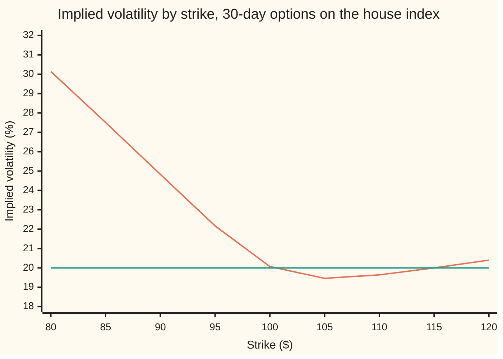
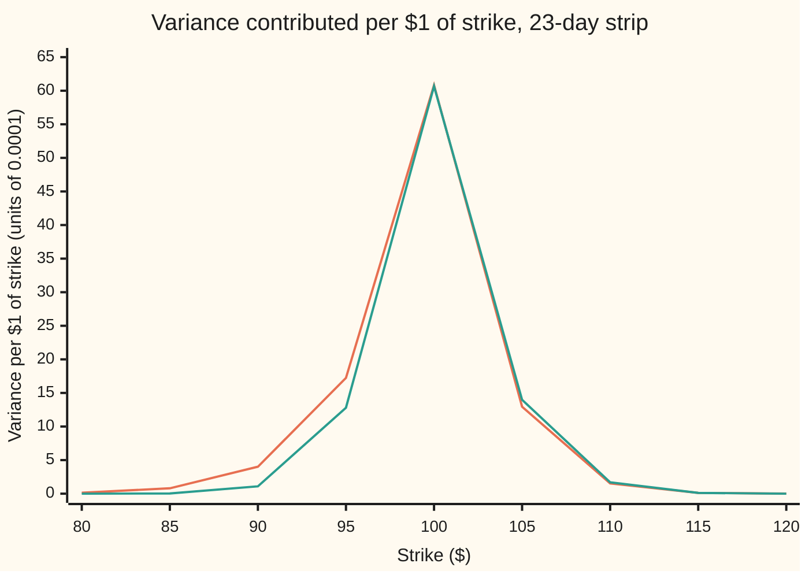

# The VIX: the published recipe that turns listed index options into a thirty-day volatility number

[Syllabus](../../../SYLLABUS.md) → [Financial mathematics](../README.md) → [Variance swaps, the log contract and VIX](../README.md#s19) → The VIX

---

## General Overview

An index stands at 100. Two sets of options on it are listed: one set expires in 23 days, the other in 37 days. Each set has hundreds of strikes (the fixed prices written into the contracts), ten cents apart near 100 and fifty cents apart further out. Every one of those options has a price on the screen. The question is how to turn all of those prices into one number that says how much the index is expected to swing over the next 30 days.

The Cboe Volatility Index, the VIX, is the exchange's answer. It is a recipe, published and followed to the letter: take the out-of-the-money options at each expiry (puts below the forward price, calls above it; the forward is the price agreed today for delivery at expiry), weight each price by one over its strike squared, add them up, and blend the two expiries to exactly 30 days. The answer is quoted in volatility points. On the S&P 500 it is the number the news calls "the fear gauge".

The recipe needs no model. It never asks what volatility is; it reads the price of the strip of options that replicates a variance swap ([The variance swap](03-variance-swap-fair-strike.md)), then takes the square root. On an index whose options all price at 20% volatility, the recipe prints **20.00**. On an index whose options show a skew (puts below the money priced at higher volatility than calls above it), with the at-the-money volatility (the implied vol of the option struck at the forward) still exactly 20%, it prints **21.18**. The VIX is not the at-the-money volatility; it is a weighted average across every strike, and the weights lean toward the puts.

**The VIX is the square root of the price of thirty days of variance, read off a discrete strip of listed options by a fixed recipe, then multiplied by 100.**

**What kind of fact this is:** a convention: the exchange defines the number by its recipe. That the recipe prices expected variance is a theorem, proved on [The variance swap](03-variance-swap-fair-strike.md); this card proves the recipe's two corrections (the forward switch and the blend) in Why it works.

### The picture: one at-the-money vol, two very different strips



The orange curve is the skewed surface used on this card: 30.14% at the $80 strike, falling to a trough near $105 and lifting slightly after. The green line is the flat 20% surface. The two agree at the 30-day forward, $100.25, which is why the orange curve reads 20.07 at the $100 strike rather than exactly 20. The flat surface returns a VIX of 20.00; the skewed one returns 21.18, because the recipe averages over the whole curve and the left side sits high.

---

## The formula

For one expiry, the recipe computes a variance:

$$\sigma_j^2 \;=\; \frac{2}{T_j}\sum_i \frac{\Delta K_i}{K_i^2}\, e^{rT_j}\, Q(K_i) \;-\; \frac{1}{T_j}\left(\frac{F_j}{K_0} - 1\right)^2$$

**Read it aloud:** for each listed strike, take the out-of-the-money option's price, grow it at the bank rate to the expiry, weight it by the strike gap over the strike squared, add them all up and double; then subtract a small correction for having switched from puts to calls at a listed strike instead of at the forward, and divide by the time.

Then two expiries, a near one and a next one, are blended to 30 days and quoted as a volatility:

$$\mathrm{VIX} \;=\; 100\,\sqrt{\Big(T_1\,\sigma_1^2\, w_1 \;+\; T_2\,\sigma_2^2\,(1 - w_1)\Big)\,\frac{N_{365}}{N_{30}}}, \qquad w_1 = \frac{N_2 - N_{30}}{N_2 - N_1}$$

**Read it aloud:** turn each expiry's variance into total variance (variance times time), take the straight-line blend of the two that lands at 30 days, convert back to a per-year rate, take the square root, and multiply by 100.

| Symbol | Plain meaning | In our example | Push it up and the VIX… |
| --- | --- | --- | --- |
| $\mathrm{VIX}$ | the published number: 30-day volatility, in points | 20.00 flat, 21.18 skewed | |
| $\sigma_j^2$, $\sigma_1^2$, $\sigma_2^2$ | the recipe's variance for expiry $j$, per year | 0.039995 flat; 0.043620 and 0.045595 skewed | rises with it |
| $T_1$, $T_2$, $T_j$, $T$, $j$ | time to each expiry in years: minutes to expiry over 525,600 | 23/365 = 0.063014 and 37/365 = 0.101370 | |
| $N_1$, $N_2$, $N_{30}$, $N_{365}$ | the same times counted in days (the exchange counts minutes); 30 and 365 are fixed | 23, 37, 30, 365 | |
| $w_1$ | weight on the near expiry | 0.50 | shifts the blend toward the near expiry |
| $F$, $F_j$, $S$, $q$, $S_T$ | the forward: the price agreed today for delivery at the expiry, $F = S e^{(r-q)T}$, with $S$ the index level today, $S_T$ its level at expiry, and $q$ its dividend yield | $S$ = 100, $q$ = 2%, $F$ = 100.189220 at 23 days | |
| $K_0$ | the listed strike at or just below the forward | 100.10 at 23 days, 100.30 at 37 | |
| $K_i$, $K$, $i$ | the $i$-th strike used, counting up from the lowest; $K$ is any strike | 85.50 to 117.60 at 23 days, flat | |
| $\Delta K_i$, $dK$ | the strike gap, the listed stand-in for the integral's $dK$: half the distance between its two neighbours, or the one gap at either end | $0.10 near the money, $0.50 further out | rises: coarser strikes overstate |
| $Q(K_i)$, $P$, $C$ | the out-of-the-money option's mid price: a put ($P$) below $K_0$, a call ($C$) above, the average of the two at $K_0$ | from Black-Scholes at the surface's vol | rises with every option price |
| $r$, $e^{rT}$ | the riskless rate, and the factor that grows a price paid today to the expiry | 5% | barely moves it |
| $k$ | log-moneyness, $\ln(K/F)$: how far a strike sits from the forward, as a log ratio | 0 at the forward | |

The skewed surface is one formula, quoted in annual variance by log-moneyness:

$$\sigma(k)^2 = 0.0325 + 0.15\left(-0.7\,k + \sqrt{k^2 + 0.0025}\right)$$

In words: at the forward ($k$ = 0) it gives 0.0325 + 0.15 × 0.05 = 0.04, a 20% vol; to the left it rises, to the right it dips and then lifts. The shape is the raw SVI curve ([The SVI smile](../12-The%20smile%20and%20the%20surface/04-svi-smile-fit.md)), applied here to annual variance rather than total variance, and used at both expiries.

**Conventions verified 27 Sep 2026** against Cboe's VIX Index Methodology (version 6.0) and Volatility Index Mathematics Methodology (version 5.0), both last revised 26 Feb 2026: time counted in minutes over 525,600; the near expiry is the last one on or before 30 days out and the next expiry the first after (the "bracket method"); the forward read from the strike where call and put mid prices are closest; $K_0$ the strike at or just below it; strikes walked outward from $K_0$ until two consecutive zero bids (or zero asks); separate Treasury-spline rates per expiry. The exchange could change any of these; the maths below does not depend on which.

### When it holds

The VIX is a definition, so it always equals its recipe. What can fail is reading it as the market's price of 30-day variance:

- **Prices move without gaps.** The strip prices variance exactly only when the index moves continuously. With jumps, the strip and expected variance differ by a third-moment term ([The volatility swap and the jump bias](05-volatility-swap-and-jump-bias.md)).
- **Strikes fine enough.** With $0.10 spacing the flat surface prints 20.00; with $5 spacing it prints 21.23. Coarse grids overstate.
- **Strikes wide enough.** The zero-bid rule cuts the tails. On the skewed surface keeping every strike moves the VIX from 21.1750 to 21.1791: small here, larger when puts far below the money carry real value.
- **Mid prices mean something.** The recipe uses the middle of bid and ask. Wide quotes in a panic feed noise straight into the number. The exchange therefore holds back any fall of 0.50 points or more for up to two minutes.
- **The two expiries bracket 30 days.** If they do not, the blend extrapolates rather than interpolates.

### Existence, uniqueness, edge cases

The VIX is an inverse: prices in, a volatility out. Existence: every out-of-the-money price is at least zero, so the strip term is at least zero; the correction is at most a hair (at most one strike gap squared over $K_0^2 T$), so the variance is positive whenever any option carries value. Uniqueness: the recipe is explicit arithmetic, one input set, one output; there is no equation to solve and no second root. Edge cases: if the forward lands exactly on a listed strike, $K_0 = F$ and the correction is zero; if the near expiry sits exactly 30 days out, $w_1$ = 1 and the second expiry drops out; if every out-of-the-money put, or every call, is excluded, the index cannot be calculated and the last valid value is republished.

---

## Why it works

### Step 0: the price of variance is a strip of options

A variance swap pays the realised variance of the index over a period, against a fixed strike. Its fair strike needs no model: it is the price of a strip of out-of-the-money options, each weighted by one over its strike squared ([The variance swap](03-variance-swap-fair-strike.md), built on [Any payoff from a strip of options](02-carr-madan-spanning-and-the-log-contract.md)):

$$\sigma^2_{\text{fair}} = \frac{2\,e^{rT}}{T}\left(\int_0^{F} \frac{P(K)}{K^2}\,dK + \int_F^{\infty} \frac{C(K)}{K^2}\,dK\right)$$

Here $P(K)$ and $C(K)$ are the put and call prices at strike $K$. The VIX takes that integral, which assumes a strike at every price, and makes it work on the strikes that actually exist. Three things need fixing: the integral becomes a sum, the switch from puts to calls happens at a listed strike rather than at the forward, and there is no expiry exactly 30 days out.

### Step 1: the integral becomes a sum over listed strikes

Replace $dK$ by the gap each strike covers. A strike with neighbours at 99.9 and 100.1 covers the band from 99.95 to 100.05, a width of $\Delta K_i$ = 0.10; at the two ends of the strip the width is the single gap to the neighbour. This is the midpoint rule of numerical integration. It is accurate when the strikes are close together relative to how fast the integrand changes. The integrand peaks sharply at the money (a put's price rises to it from the left, a call's falls from it to the right), so the spacing near the money is what matters. The chart below shows that peak.



The orange line is the skewed surface, the green line the flat one: each point is $(2e^{rT}/T)\,Q(K)/K^2$ in units of 0.0001, so the area under a curve is the variance in the same units, about 400 for the flat surface. Both peak at the money near 60.7. The difference is on the left: at the $90 strike the skewed strip contributes 4.01 against 1.09, at $85 it contributes 0.80 against 0.03. Those extra put contributions, less a little on the calls, make the gap between 20.00 and 21.18.

### Step 2: switching at a listed strike costs a correction term

The integral switches from puts to calls at the forward $F$. The recipe switches at $K_0$, the listed strike at or just below $F$. So on the band from $K_0$ to $F$ it uses calls where the integral wants puts. Put-call parity says how much too much that is: at every strike $C - P = e^{-rT}(F - K)$. The extra amount, carried through the formula, is

$$\frac{2e^{rT}}{T}\int_{K_0}^{F}\frac{e^{-rT}(F-K)}{K^2}\,dK \;\approx\; \frac{2}{T}\cdot\frac{(F-K_0)^2}{2K_0^2} \;=\; \frac{1}{T}\left(\frac{F}{K_0}-1\right)^2.$$

That is exactly the term the recipe subtracts. On the 23-day strip, $F$ = 100.189220 and $K_0$ = 100.10, so the term is 0.000013; on the 37-day strip, $F$ = 100.304572 and $K_0$ = 100.30, and it rounds to zero. It is small whenever the strikes are fine, and it is there so the recipe stays right when they are not.

<details>
<summary>Detailed proof: the correction, with the at-the-money average included</summary>

The recipe prices strike $K_0$ at the average $\tfrac12(P + C)$. Split its band into halves: below $K_0$ the band uses $P$, as the integral does for $K < F$. Above $K_0$ the recipe uses $C$ throughout, while the integral uses $P$ up to $F$ and $C$ after. On $[K_0, F]$ the recipe's excess is $C - P = e^{-rT}(F-K)$. Grown by $e^{rT}$ and weighted by $2/(TK^2)$, the excess is
$$E = \frac{2}{T}\int_{K_0}^{F}\frac{F-K}{K^2}\,dK = \frac{2}{T}\left(\frac{F}{K_0} - 1 - \ln\frac{F}{K_0}\right).$$
Write $x = F/K_0 - 1$, a small number when strikes are fine. Then $x - \ln(1+x) = \tfrac12 x^2 - \tfrac13 x^3 + \dots$, so $E = \tfrac{1}{T}x^2\,(1 - \tfrac23 x + \dots)$. The recipe subtracts the leading term $\tfrac1T x^2$; so the recipe over-subtracts by about $\tfrac{2}{3T}x^3$, third order in a number that is already small, and far below the fourth decimal of the VIX. The midpoint rule's own error from sampling the peak is a separate matter and shrinks with the square of the strike gap.

</details>

### Step 3: blend the two expiries in total variance

Variance adds over time: the variance for 37 days is the variance for the first 23 days plus the forward variance from day 23 to day 37 ([Marking a variance swap](04-variance-swap-after-inception-and-forward-variance.md)). So the quantity that grows in a straight line with time is total variance, $\sigma^2 T$, not volatility. The recipe interpolates total variance linearly in days to day 30: weight $w_1 = (37 - 30)/(37 - 23)$ = 0.50 on the near expiry, 0.50 on the next. That gives total variance for 30 days; multiplying by 365/30 turns it back into a per-year rate. The square root is the volatility, and the exchange multiplies by 100 so that 20% prints as 20.

Blending volatilities instead of variances gives a slightly different number, 21.1192 on the skewed surface instead of 21.1750. The gap is small here because the two expiries are close in variance; it grows when the term structure is steep.

### Step 4: why a skew lifts the VIX above the at-the-money vol

Every term in the strip is positive, and each one grows with its option's price. A skew makes the puts below the money dearer than a flat 20% would, and makes calls just above the money slightly cheaper. The weights $1/K^2$ favour low strikes, and the chart shows the puts carry most of the change. So the strip, and the VIX, rise above the at-the-money vol. On this surface at-the-money is 20.0000 and the VIX is 21.1750. A smile that lifts both wings does the same from both sides. The VIX is closer to an average of volatility across strikes, weighted toward the downside, than to any single option's vol.

### The other door: read the density, then average the log payoff

The same variance can be reached without the strip. Call prices, differentiated twice in the strike, give the market's risk-neutral density of the index at expiry ([The butterfly and the implied density](../10-Digitals%20and%20the%20implied%20density/05-butterfly-and-the-implied-density.md)). The fair variance is then $\tfrac{2}{T}$ times the average of $S_T/F - 1 - \ln(S_T/F)$ under that density, where $S_T$ is the index at expiry. Integrating by parts twice turns this into the strip formula, which is how the two roads meet. The code takes both, numerically, and they agree to six decimals.

---

## Worked numbers, by hand

The house index: $S$ = 100, $r$ = 5%, $q$ = 2%. Flat 20% surface, strikes $0.10 apart from 80 to 120 and $0.50 apart outside. The strip sums themselves run to hundreds of terms and come from the code; every step around them is arithmetic.

| Step | Arithmetic | Value |
| --- | --- | --- |
| near expiry in years, $T_1$ | 23 / 365 | 0.063014 |
| next expiry in years, $T_2$ | 37 / 365 | 0.101370 |
| forward at 23 days, from parity | strike with call and put closest, plus $e^{rT}(C - P)$ | 100.189220 |
| the same, from $S e^{(r-q)T}$ | $100 \times e^{0.03 \times 0.063014}$ | 100.189220 |
| $K_0$, 23 days | the listed strike at or just below 100.189220 | 100.10 |
| strikes kept, 23 days | walk out from 100.10 until two zero bids in a row | 322, from 85.50 to 117.60 |
| strip term, 23 days | $\tfrac{2}{T_1}\sum \tfrac{\Delta K_i}{K_i^2}e^{rT_1}Q(K_i)$ | 0.040007 |
| correction, 23 days | $\tfrac{1}{0.063014}(100.189220/100.10 - 1)^2$ | 0.000013 |
| $\sigma_1^2$ | 0.040007 − 0.000013 | 0.039995 |
| $\sigma_2^2$, 37 days, the same way | $K_0$ = 100.30, 390 strikes | 0.039995 |
| weight on the near expiry, $w_1$ | (37 − 30) / (37 − 23) | 0.50 |
| near part | 0.063014 × 0.039995 × 0.50 | 0.001260 |
| next part | 0.101370 × 0.039995 × 0.50 | 0.002027 |
| per-year 30-day variance | (0.001260 + 0.002027) × 365 / 30 | 0.039995 |
| **VIX** | 100 × √0.039995 | **19.9988, printed 20.00** |

On the skewed surface the same steps give $\sigma_1^2$ = 0.043620 and $\sigma_2^2$ = 0.045595, near part 0.001374, next part 0.002311, per-year variance 0.044838, and a **VIX of 21.1750, printed 21.18**, against an at-the-money vol of 20.00.

A flat 20% market reads 20.00 on the recipe to two decimals: the recipe returns the vol that generated the prices. The skewed market reads more than a point higher with the same at-the-money price, because the puts that protect against a fall cost more.

### What breaks if you drop a piece

| Mistake | VIX comes out at | What went wrong |
| --- | --- | --- |
| In-the-money calls below $K_0$ instead of out-of-the-money puts, flat | 68.9440 | Each in-the-money call carries its intrinsic value $F - K$, which is not volatility; parity says it adds $e^{-rT}(F-K)$ per strike |
| Strikes $5 apart everywhere | 21.2319 flat, 22.3435 skewed | The midpoint rule samples the at-the-money peak at full height across a whole $5 band |
| Blend the two vols instead of the two total variances, skewed | 21.1192 (right: 21.1750) | Variance adds over time; volatility does not |
| Use the 23-day strip alone, skewed | 20.8854 | The shorter strip reaches less far into the put wing; 30 days needs both expiries |

---

## Code, from first principles, and it actually runs

The code prices every listed option on both surfaces with its own normal CDF (Marsaglia's series), then reaches each expiry's variance three independent ways: **1** the exchange's recipe, with the forward from parity, $K_0$, the zero-bid walk, the strike gaps and the correction; **2** a fine Simpson integral of the continuous strip, switched at the exact forward; **3** the density read off call prices by second differences, averaged against the log payoff. It checks that no butterfly on a $0.50 grid has a negative price (the skewed surface is free of arbitrage), blends to 30 days, and reproduces every mistake in the table and every point in both charts.

### Python

```python
# The VIX recipe on the house index: Cboe's discrete strip, two expiries, 30-day blend.
# Roads: 1 the exchange's discrete sum, 2 a fine Simpson integral of the strip, 3 the
# density read off call prices (second difference) averaged against the log payoff.
from math import exp, log, sqrt, pi

S, r, q = 100.0, 0.05, 0.02          # house index level, rate, dividend yield
N1, N2, N30, N365 = 23, 37, 30, 365  # days to the two expiries, target, days per year
T1, T2 = N1 / N365, N2 / N365
CUT = 0.001                          # an option worth under a tenth of a cent has a zero bid

def ncdf(x):                         # normal CDF by Marsaglia's series, no library
    if x < -9.0: return 0.0
    if x > 9.0: return 1.0
    s, t, n = x, x, 1
    while abs(t) > 1e-17 * abs(s):
        n += 2; t *= x * x / n; s += t
    return 0.5 + s * exp(-0.5 * x * x) / sqrt(2 * pi)

def flat(k): return 0.20
def skew(k): return sqrt(0.0325 + 0.15 * (-0.7 * k + sqrt(k * k + 0.0025)))  # 20% at k = 0

def fwd(T): return S * exp((r - q) * T)
def price(K, T, vol, call):          # Black-Scholes on the forward, vol read at k = ln(K/F)
    F = fwd(T); sd = vol(log(K / F)) * sqrt(T)
    d1 = (log(F / K) + 0.5 * sd * sd) / sd; d2 = d1 - sd
    if call: return exp(-r * T) * (F * ncdf(d1) - K * ncdf(d2))
    return exp(-r * T) * (K * ncdf(-d2) - F * ncdf(-d1))

def listed(wide=False):             # $0.10 apart from 80 to 120 and $0.50 outside; or $5 everywhere
    if wide: return [10 + 5.0 * i for i in range(49)]
    return ([10 + 0.5 * i for i in range(140)] + [(800 + i) / 10 for i in range(400)]
            + [120 + 0.5 * i for i in range(261)])

def cboe(T, vol, Ks=None, fix=True, cut=CUT, itm=False):
    Ks = Ks or listed()
    C = [price(K, T, vol, True) for K in Ks]; P = [price(K, T, vol, False) for K in Ks]
    j = min(range(len(Ks)), key=lambda i: abs(C[i] - P[i]))      # where call and put are closest
    F = Ks[j] + exp(r * T) * (C[j] - P[j])                        # parity gives the forward
    i0 = max(i for i in range(len(Ks)) if Ks[i] <= F); K0 = Ks[i0]
    use = [i0]
    for step in (-1, 1):                 # walk outward; stop after two zero bids in a row
        i, zeros = i0 + step, 0
        while 0 <= i < len(Ks) and zeros < 2:
            if (P[i] if step < 0 else C[i]) < cut: zeros += 1
            else: zeros = 0; use.append(i)
            i += step
    use.sort(); total = 0.0
    for n, i in enumerate(use):
        K = Ks[i]; Q = C[i] if K > K0 or (itm and K < K0) else P[i] if K < K0 else 0.5 * (P[i] + C[i])
        lo = Ks[use[max(n - 1, 0)]]; hi = Ks[use[min(n + 1, len(use) - 1)]]
        dK = (hi - lo) / (2 if 0 < n < len(use) - 1 else 1)
        total += dK / (K * K) * exp(r * T) * Q
    corr = (F / K0 - 1) ** 2 / T
    return dict(F=F, K0=K0, n=len(use), lo=Ks[use[0]], hi=Ks[use[-1]], strip=2 * total / T,
                corr=corr, var=2 * total / T - (corr if fix else 0.0))

def simpson(f, a, b, n):
    h = (b - a) / n
    return h / 3 * (f(a) + f(b) + sum((4 if i % 2 else 2) * f(a + i * h) for i in range(1, n)))

def strip_integral(T, vol):          # (2 e^{rT}/T) * integral of Q(K)/K^2, K = F e^u, exact F
    F = fwd(T)
    put = lambda u: price(F * exp(u), T, vol, False) * exp(-u) / F
    call = lambda u: price(F * exp(u), T, vol, True) * exp(-u) / F
    return 2 * exp(r * T) / T * (simpson(put, -3.0, 0.0, 3000) + simpson(call, 0.0, 3.0, 3000))

def density_road(T, vol):            # q(K) = e^{rT} C''(K); average 2/T (K/F - 1 - ln K/F)
    F = fwd(T)
    def g(u):
        K = F * exp(u); h = 2e-4 * K
        dens = exp(r * T) * (price(K + h, T, vol, True) - 2 * price(K, T, vol, True)
                             + price(K - h, T, vol, True)) / (h * h)
        return dens * (K / F - 1 - u) * K          # dK = K du
    bad = sum(1 for i in range(1, 460) if price(20 + 0.5 * i - 0.5, T, vol, True) - 2 * price(20 + 0.5 * i, T, vol, True)
              + price(20 + 0.5 * i + 0.5, T, vol, True) < -1e-12)   # butterflies must not cost less than zero
    return 2 / T * simpson(g, -3.0, 3.0, 6000), bad

def vix(v1, v2, by_vol=False):       # interpolate in total variance to 30 days, annualise
    w1 = (N2 - N30) / (N2 - N1)
    if by_vol: return 100 * (w1 * sqrt(v1) + (1 - w1) * sqrt(v2))
    return 100 * sqrt((T1 * v1 * w1 + T2 * v2 * (1 - w1)) * N365 / N30)

rows = {}
for name, vol in (("flat", flat), ("skew", skew)):
    for T, lab in ((T1, "23d"), (T2, "37d")):
        c = cboe(T, vol); d, bad = density_road(T, vol)
        rows[name + " " + lab] = (T, c["F"], fwd(T), c["K0"], c["n"], c["lo"], c["hi"], c["strip"], c["corr"],
                                  c["var"], strip_integral(T, vol), d, bad)
labels = ("years to expiry T", "forward by parity", "forward S e^(r-q)T", "K0, strike below F", "strikes used", "lowest strike used",
          "highest strike used", "strip term (2/T) sum", "correction (F/K0-1)^2/T", "1 Cboe variance",
          "2 Simpson strip variance", "3 density road variance", "negative butterflies")
print(f"{'house index, per expiry':<26}" + "".join(f"{k:>11}" for k in rows))
for i, lab in enumerate(labels):
    print(f"{lab:<26}" + "".join((f"{v[i]:>11.0f}" if i in (4, 12) else f"{v[i]:>11.6f}") for v in rows.values()))

vx = {}
for name, vol in (("flat", flat), ("skew", skew)):
    a, b = rows[name + " 23d"], rows[name + " 37d"]
    vx[name] = [vix(a[9], b[9]), vix(a[10], b[10]), vix(a[11], b[11])]
print()
print(f"weights on 23d and 37d: {(N2 - N30) / (N2 - N1):.2f} and {(N30 - N1) / (N2 - N1):.2f}")
for name in vx:
    w1 = (N2 - N30) / (N2 - N1)
    p1, p2 = T1 * rows[name + " 23d"][9] * w1, T2 * rows[name + " 37d"][9] * (1 - w1)
    print(f"{name} blend: 23d part {p1:.6f}  37d part {p2:.6f}  times 365/30 {(p1 + p2) * N365 / N30:.6f}")
    print(f"{name} VIX: 1 Cboe {vx[name][0]:.4f}   2 Simpson {vx[name][1]:.4f}   3 density {vx[name][2]:.4f}")
print(f"at-the-money vol on both surfaces: {100 * skew(0.0):.4f}   30-day forward {fwd(N30 / N365):.4f}")

def broke(vol, **kw):
    return vix(cboe(T1, vol, **kw)["var"], cboe(T2, vol, **kw)["var"])
print()
print(f"wrong: in-the-money calls below K0, flat {broke(flat, itm=True):.4f}")
print(f"wrong: strikes $5 apart, flat            {broke(flat, Ks=listed(True)):.4f}")
print(f"wrong: strikes $5 apart, skew            {broke(skew, Ks=listed(True)):.4f}")
print(f"wrong: blend vols not variances, skew    {vix(rows['skew 23d'][9], rows['skew 37d'][9], True):.4f}")
print(f"wrong: 23-day strip alone, skew          {100 * sqrt(rows['skew 23d'][9]):.4f}")
print(f"try: keep near-zero bids too, skew       {broke(skew, cut=0.0):.4f}")
print(f"try: drop the (F/K0-1)^2 term, flat      {broke(flat, fix=False):.4f}")

print()
chart = [80 + 5 * i for i in range(9)]
F30 = fwd(N30 / N365)
print("chart, strike           " + " ".join(f"{K:6.0f}" for K in chart))
print("chart, skew vol %, 30d  " + " ".join(f"{100 * skew(log(K / F30)):6.2f}" for K in chart))
for name, vol in (("flat", flat), ("skew", skew)):
    F = fwd(T1)
    w = [2 * exp(r * T1) / T1 * price(K, T1, vol, K > F) / (K * K) * 1e4 for K in chart]
    print(f"chart, {name} weight x1e4 " + " ".join(f"{x:6.2f}" for x in w))

f23, s23 = rows["flat 23d"], rows["skew 23d"]
assert abs(f23[1] - f23[2]) < 1e-9, "parity forward must equal S e^(r-q)T"
assert abs(rows["flat 37d"][10] - 0.04) < 1e-7, "Simpson strip on a flat 20% surface must give 0.04"
assert abs(s23[10] - s23[11]) < 1e-6, "23-day strip integral vs density road"
assert abs(rows["skew 37d"][10] - rows["skew 37d"][11]) < 1e-6, "37-day strip integral vs density road"
assert abs(vx["flat"][0] - 20.0) < 0.005, "Cboe recipe on the flat surface must print 20.00"
assert abs(vx["skew"][0] - vx["skew"][1]) < 0.01, "discrete recipe within a hundredth of the integral"
assert vx["skew"][0] > 100 * skew(0.0) + 0.5, "skew must lift the VIX above the at-the-money vol"
e = lambda fix: abs(cboe(T1, flat, Ks=[0.4 + i for i in range(1, 300)], fix=fix)["var"] - f23[10])
assert e(True) < e(False) / 3, "on $1 strikes with K0 = 99.40 the (F/K0-1)^2 term must cut the error"
print("ALL CHECKS PASS")
```

**Ran 2026-09-27 on macOS, Python 3.14.6, standard library only. All checks passed. Output, pasted from the run:**

```
house index, per expiry      flat 23d   flat 37d   skew 23d   skew 37d
years to expiry T            0.063014   0.101370   0.063014   0.101370
forward by parity          100.189220 100.304572 100.189220 100.304572
forward S e^(r-q)T         100.189220 100.304572 100.189220 100.304572
K0, strike below F         100.100000 100.300000 100.100000 100.300000
strikes used                      322        390        385        433
lowest strike used          85.500000  81.800000  77.500000  68.500000
highest strike used        117.600000 123.500000 117.900000 124.500000
strip term (2/T) sum         0.040007   0.039995   0.043633   0.045595
correction (F/K0-1)^2/T      0.000013   0.000000   0.000013   0.000000
1 Cboe variance              0.039995   0.039995   0.043620   0.045595
2 Simpson strip variance     0.040000   0.040000   0.043634   0.045611
3 density road variance      0.040000   0.040000   0.043634   0.045611
negative butterflies                0          0          0          0

weights on 23d and 37d: 0.50 and 0.50
flat blend: 23d part 0.001260  37d part 0.002027  times 365/30 0.039995
flat VIX: 1 Cboe 19.9988   2 Simpson 20.0000   3 density 20.0000
skew blend: 23d part 0.001374  37d part 0.002311  times 365/30 0.044838
skew VIX: 1 Cboe 21.1750   2 Simpson 21.1786   3 density 21.1786
at-the-money vol on both surfaces: 20.0000   30-day forward 100.2469

wrong: in-the-money calls below K0, flat 68.9440
wrong: strikes $5 apart, flat            21.2319
wrong: strikes $5 apart, skew            22.3435
wrong: blend vols not variances, skew    21.1192
wrong: 23-day strip alone, skew          20.8854
try: keep near-zero bids too, skew       21.1791
try: drop the (F/K0-1)^2 term, flat      20.0000

chart, strike               80     85     90     95    100    105    110    115    120
chart, skew vol %, 30d   30.14  27.51  24.83  22.17  20.07  19.46  19.64  20.00  20.40
chart, flat weight x1e4   0.00   0.03   1.09  12.80  60.67  13.98   1.69   0.12   0.00
chart, skew weight x1e4   0.14   0.80   4.01  17.24  60.83  12.95   1.52   0.12   0.01
ALL CHECKS PASS
```

### Rust

```rust
// The VIX recipe on the house index: Cboe's discrete strip, two expiries, 30-day blend.
// Roads: 1 the exchange's discrete sum, 2 a fine Simpson integral of the strip, 3 the
// density read off call prices (second difference) averaged against the log payoff.
const S: f64 = 100.0; const R: f64 = 0.05; const Q: f64 = 0.02; // index level, rate, dividend yield
const N1: f64 = 23.0; const N2: f64 = 37.0; const N30: f64 = 30.0; const N365: f64 = 365.0;
const CUT: f64 = 0.001; // an option worth under a tenth of a cent has a zero bid
const PI: f64 = std::f64::consts::PI;

fn ncdf(x: f64) -> f64 { // normal CDF by Marsaglia's series, no library
    if x < -9.0 { return 0.0; }
    if x > 9.0 { return 1.0; }
    let (mut s, mut t, mut n) = (x, x, 1.0);
    while t.abs() > 1e-17 * s.abs() { n += 2.0; t *= x * x / n; s += t; }
    0.5 + s * (-0.5 * x * x).exp() / (2.0 * PI).sqrt()
}
fn flat(_k: f64) -> f64 { 0.20 }
fn skew(k: f64) -> f64 { (0.0325 + 0.15 * (-0.7 * k + (k * k + 0.0025).sqrt())).sqrt() } // 20% at k = 0
type Vol = fn(f64) -> f64;
fn fwd(t: f64) -> f64 { S * ((R - Q) * t).exp() }
fn price(k: f64, t: f64, vol: Vol, call: bool) -> f64 { // Black-Scholes on the forward
    let f = fwd(t); let sd = vol((k / f).ln()) * t.sqrt();
    let d1 = ((f / k).ln() + 0.5 * sd * sd) / sd; let d2 = d1 - sd;
    if call { (-R * t).exp() * (f * ncdf(d1) - k * ncdf(d2)) } else { (-R * t).exp() * (k * ncdf(-d2) - f * ncdf(-d1)) }
}
fn listed(wide: bool) -> Vec<f64> { // $0.10 apart from 80 to 120 and $0.50 outside; or $5 everywhere
    if wide { return (0..49).map(|i| 10.0 + 5.0 * i as f64).collect(); }
    let mut v: Vec<f64> = (0..140).map(|i| 10.0 + 0.5 * i as f64).collect();
    v.extend((0..400).map(|i| (800 + i) as f64 / 10.0));
    v.extend((0..261).map(|i| 120.0 + 0.5 * i as f64));
    v
}
struct Cb { f: f64, k0: f64, n: usize, lo: f64, hi: f64, strip: f64, corr: f64, var: f64 }
fn cboe(t: f64, vol: Vol, ks: &[f64], fix: bool, cut: f64, itm: bool) -> Cb {
    let c: Vec<f64> = ks.iter().map(|&k| price(k, t, vol, true)).collect();
    let p: Vec<f64> = ks.iter().map(|&k| price(k, t, vol, false)).collect();
    let mut j = 0; // where call and put are closest
    for i in 1..ks.len() { if (c[i] - p[i]).abs() < (c[j] - p[j]).abs() { j = i; } }
    let f = ks[j] + (R * t).exp() * (c[j] - p[j]); // parity gives the forward
    let i0 = (0..ks.len()).filter(|&i| ks[i] <= f).max().unwrap(); let k0 = ks[i0];
    let mut used = vec![i0];
    for step in [-1i64, 1] { // walk outward; stop after two zero bids in a row
        let (mut i, mut zeros) = (i0 as i64 + step, 0);
        while i >= 0 && (i as usize) < ks.len() && zeros < 2 {
            let u = i as usize;
            if (if step < 0 { p[u] } else { c[u] }) < cut { zeros += 1; } else { zeros = 0; used.push(u); }
            i += step;
        }
    }
    used.sort(); let m = used.len(); let mut total = 0.0;
    for (n, &i) in used.iter().enumerate() {
        let k = ks[i];
        let qv = if k > k0 || (itm && k < k0) { c[i] } else if k < k0 { p[i] } else { 0.5 * (p[i] + c[i]) };
        let lo = ks[used[n.saturating_sub(1)]]; let hi = ks[used[(n + 1).min(m - 1)]];
        let dk = (hi - lo) / (if n > 0 && n < m - 1 { 2.0 } else { 1.0 });
        total += dk / (k * k) * (R * t).exp() * qv;
    }
    let corr = (f / k0 - 1.0).powi(2) / t;
    Cb { f, k0, n: m, lo: ks[used[0]], hi: ks[used[m - 1]], strip: 2.0 * total / t, corr,
         var: 2.0 * total / t - if fix { corr } else { 0.0 } }
}
fn simpson(f: &dyn Fn(f64) -> f64, a: f64, b: f64, n: usize) -> f64 {
    let h = (b - a) / n as f64;
    let mut s = f(a) + f(b);
    for i in 1..n { s += (if i % 2 == 1 { 4.0 } else { 2.0 }) * f(a + i as f64 * h); }
    h / 3.0 * s
}
fn strip_integral(t: f64, vol: Vol) -> f64 { // (2 e^{rT}/T) * integral of Q(K)/K^2, K = F e^u
    let f = fwd(t);
    let put = |u: f64| price(f * u.exp(), t, vol, false) * (-u).exp() / f;
    let call = |u: f64| price(f * u.exp(), t, vol, true) * (-u).exp() / f;
    2.0 * (R * t).exp() / t * (simpson(&put, -3.0, 0.0, 3000) + simpson(&call, 0.0, 3.0, 3000))
}
fn density_road(t: f64, vol: Vol) -> (f64, usize) { // q(K) = e^{rT} C''(K)
    let f = fwd(t);
    let g = |u: f64| {
        let k = f * u.exp(); let h = 2e-4 * k;
        let dens = (R * t).exp() * (price(k + h, t, vol, true) - 2.0 * price(k, t, vol, true)
            + price(k - h, t, vol, true)) / (h * h);
        dens * (k / f - 1.0 - u) * k // dK = K du
    };
    let bad = (1..460).filter(|&i| { let k = 20.0 + 0.5 * i as f64;
        price(k - 0.5, t, vol, true) - 2.0 * price(k, t, vol, true) + price(k + 0.5, t, vol, true) < -1e-12 }).count();
    (2.0 / t * simpson(&g, -3.0, 3.0, 6000), bad)
}
fn vix(v1: f64, v2: f64, by_vol: bool) -> f64 { // interpolate in total variance to 30 days
    let (t1, t2) = (N1 / N365, N2 / N365); let w1 = (N2 - N30) / (N2 - N1);
    if by_vol { return 100.0 * (w1 * v1.sqrt() + (1.0 - w1) * v2.sqrt()); }
    100.0 * ((t1 * v1 * w1 + t2 * v2 * (1.0 - w1)) * N365 / N30).sqrt()
}
fn broke(vol: Vol, wide: bool, fix: bool, cut: f64, itm: bool) -> f64 {
    let ks = listed(wide);
    vix(cboe(N1 / N365, vol, &ks, fix, cut, itm).var, cboe(N2 / N365, vol, &ks, fix, cut, itm).var, false)
}
fn main() {
    let (t1, t2) = (N1 / N365, N2 / N365); let ks = listed(false);
    let surfaces: [(&str, Vol); 2] = [("flat", flat), ("skew", skew)];
    let mut names = vec![]; let mut rows: Vec<Vec<f64>> = vec![];
    for (name, vol) in surfaces.iter() {
        for (t, lab) in [(t1, "23d"), (t2, "37d")] {
            let c = cboe(t, *vol, &ks, true, CUT, false); let (d, bad) = density_road(t, *vol);
            names.push(format!("{} {}", name, lab));
            rows.push(vec![t, c.f, fwd(t), c.k0, c.n as f64, c.lo, c.hi, c.strip, c.corr, c.var,
                           strip_integral(t, *vol), d, bad as f64]);
        }
    }
    let labels = ["years to expiry T", "forward by parity", "forward S e^(r-q)T", "K0, strike below F", "strikes used",
        "lowest strike used", "highest strike used", "strip term (2/T) sum", "correction (F/K0-1)^2/T", "1 Cboe variance",
        "2 Simpson strip variance", "3 density road variance", "negative butterflies"];
    let mut line = format!("{:<26}", "house index, per expiry");
    for n in &names { line += &format!("{:>11}", n); }
    println!("{}", line);
    for (i, lab) in labels.iter().enumerate() {
        let mut line = format!("{:<26}", lab);
        for v in &rows { line += &if i == 4 || i == 12 { format!("{:>11.0}", v[i]) } else { format!("{:>11.6}", v[i]) }; }
        println!("{}", line);
    }
    let mut vx = vec![];
    for s in 0..2 {
        let (a, b) = (&rows[2 * s], &rows[2 * s + 1]);
        vx.push([vix(a[9], b[9], false), vix(a[10], b[10], false), vix(a[11], b[11], false)]);
    }
    let w1 = (N2 - N30) / (N2 - N1);
    println!();
    println!("weights on 23d and 37d: {:.2} and {:.2}", w1, (N30 - N1) / (N2 - N1));
    for s in 0..2 {
        let (p1, p2) = (t1 * rows[2 * s][9] * w1, t2 * rows[2 * s + 1][9] * (1.0 - w1));
        let nm = surfaces[s].0;
        println!("{} blend: 23d part {:.6}  37d part {:.6}  times 365/30 {:.6}", nm, p1, p2, (p1 + p2) * N365 / N30);
        println!("{} VIX: 1 Cboe {:.4}   2 Simpson {:.4}   3 density {:.4}", nm, vx[s][0], vx[s][1], vx[s][2]);
    }
    println!("at-the-money vol on both surfaces: {:.4}   30-day forward {:.4}", 100.0 * skew(0.0), fwd(N30 / N365));
    println!();
    println!("wrong: in-the-money calls below K0, flat {:.4}", broke(flat, false, true, CUT, true));
    println!("wrong: strikes $5 apart, flat            {:.4}", broke(flat, true, true, CUT, false));
    println!("wrong: strikes $5 apart, skew            {:.4}", broke(skew, true, true, CUT, false));
    println!("wrong: blend vols not variances, skew    {:.4}", vix(rows[2][9], rows[3][9], true));
    println!("wrong: 23-day strip alone, skew          {:.4}", 100.0 * rows[2][9].sqrt());
    println!("try: keep near-zero bids too, skew       {:.4}", broke(skew, false, true, 0.0, false));
    println!("try: drop the (F/K0-1)^2 term, flat      {:.4}", broke(flat, false, false, CUT, false));
    println!();
    let chart: Vec<f64> = (0..9).map(|i| 80.0 + 5.0 * i as f64).collect();
    let f30 = fwd(N30 / N365);
    let mut l1 = String::from("chart, strike           "); let mut l2 = String::from("chart, skew vol %, 30d  ");
    for (i, &k) in chart.iter().enumerate() {
        let sep = if i == 0 { "" } else { " " };
        l1 += &format!("{}{:6.0}", sep, k); l2 += &format!("{}{:6.2}", sep, 100.0 * skew((k / f30).ln()));
    }
    println!("{}", l1); println!("{}", l2);
    for (name, vol) in surfaces.iter() {
        let f = fwd(t1); let mut l = format!("chart, {} weight x1e4 ", name);
        for (i, &k) in chart.iter().enumerate() {
            let w = 2.0 * (R * t1).exp() / t1 * price(k, t1, *vol, k > f) / (k * k) * 1e4;
            l += &format!("{}{:6.2}", if i == 0 { "" } else { " " }, w);
        }
        println!("{}", l);
    }
    assert!((rows[0][1] - rows[0][2]).abs() < 1e-9, "parity forward must equal S e^(r-q)T");
    assert!((rows[1][10] - 0.04).abs() < 1e-7, "Simpson strip on a flat 20% surface must give 0.04");
    assert!((rows[2][10] - rows[2][11]).abs() < 1e-6, "23-day strip integral vs density road");
    assert!((rows[3][10] - rows[3][11]).abs() < 1e-6, "37-day strip integral vs density road");
    assert!((vx[0][0] - 20.0).abs() < 0.005, "Cboe recipe on the flat surface must print 20.00");
    assert!((vx[1][0] - vx[1][1]).abs() < 0.01, "discrete recipe within a hundredth of the integral");
    assert!(vx[1][0] > 100.0 * skew(0.0) + 0.5, "skew must lift the VIX above the at-the-money vol");
    let odd: Vec<f64> = (1..300).map(|i| 0.4 + i as f64).collect();
    let e = |fix: bool| (cboe(t1, flat, &odd, fix, CUT, false).var - rows[0][10]).abs();
    assert!(e(true) < e(false) / 3.0, "on $1 strikes with K0 = 99.40 the (F/K0-1)^2 term must cut the error");
    println!("ALL CHECKS PASS");
}
```

**Ran 2026-09-27 on macOS, rustc 1.98.1, no crates. All checks passed. Output, pasted from the run:**

```
house index, per expiry      flat 23d   flat 37d   skew 23d   skew 37d
years to expiry T            0.063014   0.101370   0.063014   0.101370
forward by parity          100.189220 100.304572 100.189220 100.304572
forward S e^(r-q)T         100.189220 100.304572 100.189220 100.304572
K0, strike below F         100.100000 100.300000 100.100000 100.300000
strikes used                      322        390        385        433
lowest strike used          85.500000  81.800000  77.500000  68.500000
highest strike used        117.600000 123.500000 117.900000 124.500000
strip term (2/T) sum         0.040007   0.039995   0.043633   0.045595
correction (F/K0-1)^2/T      0.000013   0.000000   0.000013   0.000000
1 Cboe variance              0.039995   0.039995   0.043620   0.045595
2 Simpson strip variance     0.040000   0.040000   0.043634   0.045611
3 density road variance      0.040000   0.040000   0.043634   0.045611
negative butterflies                0          0          0          0

weights on 23d and 37d: 0.50 and 0.50
flat blend: 23d part 0.001260  37d part 0.002027  times 365/30 0.039995
flat VIX: 1 Cboe 19.9988   2 Simpson 20.0000   3 density 20.0000
skew blend: 23d part 0.001374  37d part 0.002311  times 365/30 0.044838
skew VIX: 1 Cboe 21.1750   2 Simpson 21.1786   3 density 21.1786
at-the-money vol on both surfaces: 20.0000   30-day forward 100.2469

wrong: in-the-money calls below K0, flat 68.9440
wrong: strikes $5 apart, flat            21.2319
wrong: strikes $5 apart, skew            22.3435
wrong: blend vols not variances, skew    21.1192
wrong: 23-day strip alone, skew          20.8854
try: keep near-zero bids too, skew       21.1791
try: drop the (F/K0-1)^2 term, flat      20.0000

chart, strike               80     85     90     95    100    105    110    115    120
chart, skew vol %, 30d   30.14  27.51  24.83  22.17  20.07  19.46  19.64  20.00  20.40
chart, flat weight x1e4   0.00   0.03   1.09  12.80  60.67  13.98   1.69   0.12   0.00
chart, skew weight x1e4   0.14   0.80   4.01  17.24  60.83  12.95   1.52   0.12   0.01
ALL CHECKS PASS
```

The two outputs are identical line for line.

> [!TIP]
> **Try changing**
> - **Keep the options the zero-bid rule throws away.** Guess first: does the skewed VIX move in the second decimal? Set `cut=0.0`. It moves from 21.1750 to 21.1791, the fourth decimal; the discarded tails are worth almost nothing on this surface.
> - **Drop the correction term.** Guess first: how far off is the flat VIX? Call `cboe` with `fix=False`. It reads 20.0000 instead of 19.9988: with ten-cent strikes the switch costs almost nothing. On $1 strikes with $K_0$ = 99.40 the check asserts the term cuts the error at least threefold.
> - **List strikes $5 apart.** Guess first: which way does the error go? Pass `listed(True)`. Up, to 21.2319 on the flat surface and 22.3435 on the skewed one.
> - **Only the near expiry.** Guess first: higher or lower than 21.18 on the skewed surface? Lower: 20.8854, because a shorter strip gives the put wing less room.

---

## The usual mistake

> [!warning]
> **Reading the VIX as the at-the-money volatility.** It is not. It is the square root of a strip of prices across every strike, weighted toward the low ones. On a flat surface the two agree. On a skewed surface with at-the-money exactly 20.00, the VIX is 21.18. The gap between the VIX and at-the-money vol is itself a reading of the skew.
>
> Smaller traps:
> - **Reading it as a forecast of realised volatility.** It is a price. Variance swap buyers pay a premium for protection, so the VIX has usually sat above the volatility that followed. The spread is the variance risk premium, not an error in the recipe.
> - **Using in-the-money options.** Swap an out-of-the-money put for the in-the-money call at the same strike and the flat VIX comes out at 68.9440.
> - **Averaging volatilities across the two expiries.** Total variance is what adds over time: 21.1192 against the right 21.1750.
> - **Thinking the VIX can be bought.** No one trades the index itself. What trades are VIX futures and options, which settle on a special opening quotation from a single 30-day expiry, and whose prices depend on where the market expects the VIX to be later.

---

## Where you meet it in real life

- **The S&P 500.** The VIX runs on SPX and SPXW options, the weekly expiries included so that two expiries bracket 30 days almost every day.
- **VIX futures and their term structure.** Futures on the VIX for each coming month trace a curve, usually rising (contango) in calm markets and falling in stress; the curve is the market's forecast of future VIX levels plus a premium.
- **Other volatility indices.** The same recipe, with a different underlying or target length, produces shorter and longer VIX horizons, and volatility indices on other stock indices, gold and single stocks. The exchange's mathematics methodology is written once for all of them.
- **Variance swaps.** Dealers mark 30-day index variance off the same strip. The VIX squared, turned from points back into a decimal, is close to a 30-day variance swap strike, differing by strike spacing and by the tails cut off by the zero-bid rule.
- **Settlement.** VIX futures and options settle on the Special Opening Quotation, the recipe run on opening prices of a single expiry exactly 30 days out, with no blend.

> **Say it back**
> The VIX is the exchange's recipe for the price of 30 days of variance. At each of two expiries it adds up out-of-the-money put and call prices weighted by the strike gap over the strike squared, with a small correction for switching at a listed strike instead of the forward. It then blends the two expiries' total variances to exactly 30 days, takes the square root, and multiplies by 100. On a flat 20% market it prints 20.00; on a skewed one it prints more than the at-the-money vol, because the low-strike puts weigh heavily.

---

## What this builds on

- [The variance swap](03-variance-swap-fair-strike.md): the $1/K^2$ strip that prices variance with no model. The VIX is that strip on listed strikes.
- [The volatility surface](../12-The%20smile%20and%20the%20surface/03-volatility-surface-and-its-arbitrage-rules.md): what a surface of implied vols is, and the no-butterfly rule the skewed surface is checked against.
- [Any payoff from a strip of options](02-carr-madan-spanning-and-the-log-contract.md): why a strip of options can rebuild the log payoff at all.
- [Marking a variance swap](04-variance-swap-after-inception-and-forward-variance.md): why total variance adds over time, the reason the blend is linear in variance.

## Where this goes next

- [The volatility swap and the jump bias](05-volatility-swap-and-jump-bias.md): why the square root of a variance price overstates a fair price for volatility, and how gaps in the index break the strip.
- [The Heston model](../14-Stochastic%20volatility%20-%20Heston%2C%20SABR%20and%20their%20mix/01-heston-model.md): a model in which variance itself moves, the setting for pricing futures and options on the VIX.

The VIX prices today's view of the next 30 days; what the market will pay today for the VIX a month from now needs a model of how variance itself moves, which is where [The Heston model](../14-Stochastic%20volatility%20-%20Heston%2C%20SABR%20and%20their%20mix/01-heston-model.md) begins.

---

## Sources

Verified 2026-09-27: every link below resolves to the publisher's page.

- Cboe Global Indices. *Cboe Volatility Index Methodology*, version 6.0, last revised 26 Feb 2026. [cdn.cboe.com](https://cdn.cboe.com/api/global/us_indices/governance/Volatility_Index_Methodology_Cboe_Volatility_Index.pdf). The VIX's selection of expiries, the zero-bid filter, and a worked sample calculation.
- Cboe Global Indices. *Cboe Volatility Index Mathematics Methodology*, version 5.0, last revised 26 Feb 2026. [cdn.cboe.com](https://cdn.cboe.com/api/global/us_indices/governance/Cboe_Volatility_Index_Mathematics_Methodology.pdf). The single-term formula, the forward and $K_0$ rule, the strike gaps, time in minutes, and the 30-day blend.
- Demeterfi, Kresimir, Emanuel Derman, Michael Kamal, and Joseph Zou. "A Guide to Volatility and Variance Swaps." *The Journal of Derivatives* 6, no. 4 (1999): 9–32. [doi:10.3905/jod.1999.319129](https://doi.org/10.3905/jod.1999.319129). The strip that the VIX discretises, and the effect of skew on the variance strike.
- Britten-Jones, Mark, and Anthony Neuberger. "Option Prices, Implied Price Processes, and Stochastic Volatility." *The Journal of Finance* 55, no. 2 (2000): 839–866. [doi:10.1111/0022-1082.00228](https://doi.org/10.1111/0022-1082.00228). Model-free implied variance: the strip prices expected variance under any continuous price process.
- Carr, Peter, and Liuren Wu. "A Tale of Two Indices." *The Journal of Derivatives* 13, no. 3 (2006): 13–29. [doi:10.3905/jod.2006.616865](https://doi.org/10.3905/jod.2006.616865). The old at-the-money VXO against the strip-based VIX, and why the new recipe prices variance.
