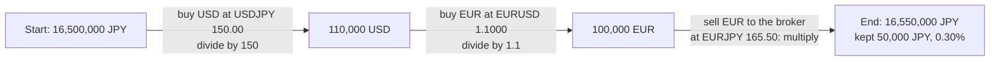
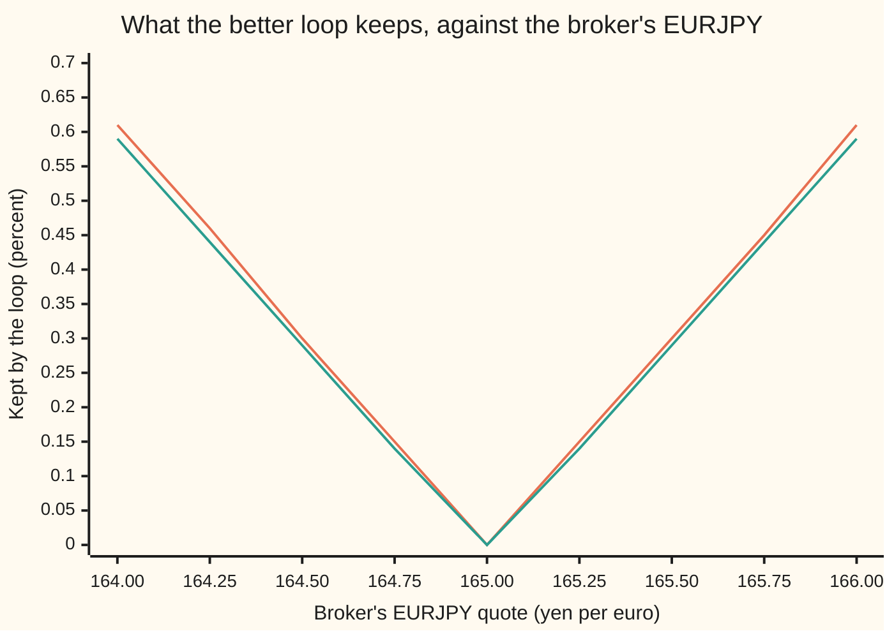

# Reading a currency quote: which currency is the price, which is the thing, and how to flip and cross it

Financial mathematics → FX spot, forwards and interest parity → Which side is the money → Reading a currency quote

---

## General Overview

A trading screen shows three lines. EURUSD 1.1000. USDJPY 150.00. EURJPY 165.50.

The first line says one euro costs 1.1000 US dollars. The second says one dollar costs 150.00 Japanese yen. The third comes from a broker and says one euro costs 165.50 yen.

Those three numbers cannot all be right. Turn one euro into dollars and get 1.1000 dollars. Turn those dollars into yen and get 1.1000 × 150.00 = 165.00 yen. So the euro costs 165.00 yen by the long road and 165.50 yen at the broker. The broker is 0.50 yen too high: 50 pips, in the market's unit of a hundredth of a yen. A trader who sells euros to the broker for yen, buys dollars with the yen, and buys euros back with the dollars ends where they started, plus 0.30 percent. No forecast was needed. Only the three quotes, read the right way round.

Every quote on a currency screen is a price tag. The first currency in the name is the thing being priced. The second is the money the price is counted in. Read that way, a quote can be flipped (the price of a dollar in euros), chained (the price of a euro in yen, via dollars), and checked for a loop that pays.

**A currency pair AB quoted at a price means one unit of A costs that many units of B; flipping it gives one over the price, chaining two pairs multiplies them with the middle currency cancelling, and any loop of quotes whose product is not 1 is free money.**

**What kind of fact this is:** a convention (which currency is written first, and how small a step the price moves in) plus one theorem proved on this card in Why it works: without free money, a cross rate equals the product of the two quotes it is built from.

### The picture: the loop that pays



Each arrow either multiplies or divides, and the quote's name decides which. Selling the first-named currency multiplies by the price. Buying it divides.

---

## The formula

Notation first, in words. Write a currency pair as two three-letter codes run together, AB, with A first. The price of that pair is written $S_{AB}$: the number of units of B that one unit of A costs. The letter S is the finance habit for "spot": the price for the earliest standard delivery, one or two business days after the trade.

The three-letter codes are the international standard ones: EUR for the euro, USD for the US dollar, JPY for the yen, GBP for the pound.

$$S_{BA} = \frac{1}{S_{AB}}, \qquad S_{AC} = S_{AB} \times S_{BC}, \qquad S_{AB}\,S_{BC}\,S_{CA} = 1$$

**Read it aloud:** the flipped quote is one over the quote; a cross is the two legs multiplied, with the shared currency cancelling; and going round a triangle of quotes brings one unit back as exactly one unit.

The same rules in units: $S_{AB}$ is "B per A". Then "USD per EUR" times "JPY per USD" is "JPY per EUR". The dollars cancel like metres in "metres per second times seconds".

| Symbol | Plain meaning | In our example | Push it up and the answer… |
| --- | --- | --- | --- |
| $A$ | the **base** currency, written first: the thing with the price tag. Pricing papers call it **foreign**. | EUR | — |
| $B$ | the **quote** currency, written second: the money the price is counted in. Pricing papers call it **domestic**. | USD | — |
| $C$ | a third currency, used to build a cross | JPY | — |
| $S_{AB}$ | price of one A, in units of B | EURUSD 1.1000 | the euro is dearer, the dollar cheaper |
| $S_{BC}$ | price of one B, in units of C | USDJPY 150.00 | the dollar is dearer, the yen cheaper |
| $S_{BA}$ | the flipped quote: price of one B in A | 0.909091 euros per dollar | falls whenever $S_{AB}$ rises |
| $S_{AC}$ | the **cross**: price of one A in C, built through B | EURJPY 165.00 | rises with either leg |
| $S_{CA}$ | price of one C in A, the leg that closes a triangle | 1/165.50 euros per yen, at the broker | — |
| $e$ | the **edge**: how far a quoted cross sits from the built one, as a fraction | 165.50/165.00 − 1 = 0.3030% | a bigger free loop |
| $b$, $a$ | the **bid** and **ask**: the prices at which a dealer buys and sells the base currency | EURUSD 1.0999 and 1.1001 | a wider gap eats more of any loop |
| $q$ | a cross price quoted directly by a dealer, to be checked against the built one | broker EURJPY 165.50 | above the band, selling euros to the dealer pays |
| $p$ | a **pip**: the smallest customary step in the price | 0.0001 for EURUSD, 0.01 for any pair against yen | — |

A cross between two currencies that are both quoted against the same money currency divides instead of multiplying. The pound is quoted as GBPUSD 1.2500, dollars per pound. Flip it to get pounds per dollar, then multiply: EURGBP = 1.1000 × (1/1.2500) = 1.1000 / 1.2500 = 0.8800. The rule never changes; only where the flip hides does.

With a dealer's two prices, the flip swaps them. The dealer's bid for dollars in euros is one over the ask for euros in dollars:

$$b_{BA} = \frac{1}{a_{AB}}, \qquad a_{BA} = \frac{1}{b_{AB}}$$

In words: the dealer who sells euros at 1.1001 dollars is, from the other side, buying dollars at 1/1.1001 euros each.

### When it holds

- **One settlement date for every leg.** A spot trade settles a day or two after it is agreed, depending on the pair. Mix a spot leg with a leg for a later date and the product is off by the interest earned in between, which is the whole subject of [covered-interest-parity](02-covered-interest-parity.md).
- **Prices you can deal at, both ways.** The product rule holds exactly for mid prices, the average of bid and ask. With bid and ask the cross has its own bid and ask, and a loop only pays when the quoted cross lies outside that band. With two-pip spreads on both legs (EURUSD 1.0999/1.1001, USDJPY 149.99/150.01), the example's 0.3030% edge shrinks to 0.2872%.
- **All legs at the same instant.** Quotes move many times a second. A loop that pays on a stale screen may not pay by the time the third order arrives.
- **Money that moves freely.** Where a government limits conversion, two prices for one currency can sit side by side for years. The rule says a loop would pay; the law says it cannot be run.

---

## Why it works

### Step 0: two roads to the same euro must cost the same

The idea that makes every rule on this card work is the law of one price ([no-arbitrage-and-the-law-of-one-price](../03-Contracts%20and%20No-Arbitrage/02-no-arbitrage-and-the-law-of-one-price.md)): two ways of getting the same thing at the same moment must cost the same, or a trader buys the cheap way, sells the dear way, and keeps the difference. A euro bought with yen directly and a euro bought with yen via dollars are the same euro. So their prices must match.

### Step 1: a quote is a price tag, and the money is always the second currency

Take EURUSD 1.1000. The thing is one euro. The price is 1.1000 dollars. This does not depend on who reads it. A dealer in Tokyo reads it the same way as one in New York. Pricing papers call the second currency "domestic" and the first "foreign", and the words still mean only "the money" and "the thing". The Tokyo dealer's EURUSD has domestic currency USD.

Which currency goes first is a market habit, not a law. Dealers keep a pecking order: EUR, then GBP, then AUD and NZD, then USD, then CAD, CHF and JPY. The higher-ranked currency is written first. So the euro, pound, Australian and New Zealand dollars are quoted in dollars per unit. The Canadian dollar, Swiss franc and yen are quoted in units per dollar.

**Conventions verified 27 Sep 2026** against the Federal Reserve's H.10 release of 21 September 2026: the euro, pound, Australian and New Zealand dollars are listed in US dollars per unit, and the yen, Swiss franc and Canadian dollar in units per US dollar.

### Step 2: flipping a quote is the same trade seen from the other side

Selling one euro for 1.1000 dollars is buying 1.1000 dollars for one euro. Divide both sides by 1.1000: one dollar costs 1/1.1000 = 0.909091 euros. That is USDEUR. No market was consulted. The flip is an identity, true for every quote.

With a dealer's two prices, the sides swap. The dealer sells euros at the ask, 1.1001. The same trade, seen as the dealer buying dollars, happens at 1/1.1001 = 0.909008 euros per dollar. So that number is the USDEUR bid, and the USDEUR ask is 1/1.0999 = 0.909174. Flip without swapping and the "bid" comes out above the "ask", a price at which the dealer would pay more than they charge.

### Step 3: a cross is two trades in a row, and the middle currency cancels

Sell one euro for 1.1000 dollars. Sell those dollars at 150.00 yen each. The euro became 1.1000 × 150.00 = 165.00 yen. In units: (USD per EUR) × (JPY per USD) = JPY per EUR. The dollar appears once on top and once underneath, and cancels.

When both pairs have the dollar second, one of them must be flipped first. EURUSD 1.1000 and GBPUSD 1.2500: a euro buys 1.1000 dollars, and a pound costs 1.2500 dollars, so a euro buys 1.1000/1.2500 = 0.8800 pounds. When both have the dollar first (USDJPY and USDCHF), the other one flips. A cross has three shapes and one rule: write each quote as "B per A", flip whichever one points the wrong way, and chain.

Step 0 then says the directly quoted EURJPY must equal the chained 165.00. Step 4 proves it.

### Step 4: a loop whose product is not 1 is free money

Go round the triangle. Start with 16,500,000 yen. Buy dollars at 150.00: 110,000 dollars. Buy euros at 1.1000: 100,000 euros. Sell the euros to the broker at 165.50: 16,550,000 yen. The trader holds 50,000 yen more than at the start, 0.3030% of it, and no currency is left over.

The loop's growth factor is the product of the three rates, each read in the direction travelled: (1/150.00) × (1/1.1000) × 165.50 = 165.50/165.00 = 1.003030. A product above 1 pays. The reverse loop multiplies the flipped rates, so its product is one over the first: 1/1.003030, a loss of 0.3021%. Exactly one direction wins, and it wins from any starting currency: the code tries all six loops and finds three winners, the same loop from three starting points.

So without free money, the product round the triangle is exactly 1, which is the third formula. Rearranged, the direct cross equals the product of the legs.

<details>
<summary>Detailed proof: without free loops, the cross sits inside the band built from the legs</summary>

Let every leg carry a bid and an ask, and suppose a dealer quotes the cross at a single price $q$, dealt both ways. Selling one euro through dollars into yen gives $b_{AB} \times b_{BC}$ yen, since each sale happens at a dealer's bid. Buying one euro through dollars with yen costs $a_{AB} \times a_{BC}$ yen, since each purchase happens at an ask.

If $q > a_{AB}\,a_{BC}$: buy a euro the long way for $a_{AB}\,a_{BC}$ yen and sell it to the cross dealer for $q$. The euro is gone, the yen gained is $q - a_{AB}\,a_{BC} > 0$. Free money.

If $q < b_{AB}\,b_{BC}$: buy a euro from the cross dealer for $q$ yen and sell it the long way for $b_{AB}\,b_{BC}$. Free money again.

So no free loop exists exactly when $b_{AB}\,b_{BC} \le q \le a_{AB}\,a_{BC}$. With the example's legs, that band is 164.974001 to 165.026001 yen. When bid and ask meet at one mid price, the band closes to a single point, $q = S_{AB}\,S_{BC}$, which is the cross formula. The edge a loop keeps is $q / (a_{AB}\,a_{BC}) - 1$ above the band, 0.2872% for a broker at 165.50, and $(b_{AB}\,b_{BC})/q - 1$ below it.

If the cross dealer also quotes a bid and an ask, a loop pays only when the dealer's bid is above $a_{AB}\,a_{BC}$ or the dealer's ask is below $b_{AB}\,b_{BC}$. A broker quoting 165.00/166.00 has mid 165.50, yet its bid sits below 165.026001 and its ask above 164.974001: no loop pays.

</details>

The chart shows what a loop keeps as the broker's EURJPY moves. The upper line uses mid prices for the legs; the lower line pays the legs' spreads.



Orange line: legs at mid prices, so any broker quote other than 165.00 pays. Green line: legs dealt at bid and ask, so the loop pays nothing while the broker sits inside the band from 164.974001 to 165.026001, and a little less than the orange line outside it. Right of 165.00 the winning loop sells euros to the broker; left of it, the loop buys euros from the broker.

The same result has a second route through logarithms, used by programs that watch hundreds of pairs: take the logarithm of each rate, and a loop pays when the logarithms round it add up to more than zero. That turns a search for free loops into a search for a cycle in a network of currencies.

---

## Worked numbers, by hand

EURUSD 1.1000, USDJPY 150.00, broker EURJPY 165.50.

| Step | Arithmetic | Value |
| --- | --- | --- |
| read EURUSD | one euro costs, in dollars | 1.1000 |
| flip it: USDEUR | 1 / 1.1000 | 0.909091 |
| cross: EURJPY | 1.1000 × 150.00, dollars cancel | 165.00 |
| broker's excess, in price | 165.50 − 165.00 | 0.50 yen |
| in pips (0.01 on a yen pair) | 0.50 / 0.01 | 50 pips |
| as a fraction: the edge | 165.50 / 165.00 − 1 | 0.3030% |
| loop leg 1: buy USD | 16,500,000 / 150.00 | 110,000 USD |
| loop leg 2: buy EUR | 110,000 / 1.1000 | 100,000 EUR |
| loop leg 3: sell EUR to the broker | 100,000 × 165.50 | 16,550,000 JPY |
| kept | 16,550,000 − 16,500,000 | **50,000 JPY, 0.3030%** |
| same, counted in pips | 50 pips × 0.01 × 100,000 euros | 50,000 JPY |

The broker overpays for euros by 50 pips, and the loop turns every euro it sells there into half a yen of profit, with no view on any currency.

A second case, the division shape: EURUSD 1.1000 and GBPUSD 1.2500 give EURGBP = 1.1000 / 1.2500 = 0.8800 pounds per euro.

### What breaks if you drop a piece

| Mistake | Comes out at | What went wrong |
| --- | --- | --- |
| Multiply EURUSD by GBPUSD for EURGBP | 1.3750 (right: 0.8800) | GBPUSD is dollars per pound; it needed flipping first. The units come out as dollars squared per euro-pound. |
| Divide EURUSD by USDJPY for EURJPY | 0.007333 (right: 165.00) | Dividing flips USDJPY into dollars per yen, and the dollars no longer cancel. |
| Flip a bid and ask without swapping them | USDEUR bid 0.909174 above ask 0.909008 | The dealer's side changes when the pair flips; the old bid becomes the new ask. |
| Count yen pips at 0.0001 | 5,000 pips (right: 50) | Yen pairs move in steps of 0.01, because one yen is worth about a hundredth of a dollar. |
| Run the loop backwards | −0.3021% (right: +0.3030%) | Selling euros where they are cheap and buying them where they are dear. |

---

## Code, from first principles, and it actually runs

The code reaches every number by three independent roads. Road 1 writes the formulas by hand: flip, multiply, divide. Road 2 is a ledger: a single function that sells an amount of one currency for another, looks up whichever way round the pair is quoted, and multiplies or divides accordingly; every cross and every loop is walked through it trade by trade. Road 3 tries all six loops through the three currencies and picks the best. The asserts check that the ledger lands on the formulas, that the search finds the formula's edge, that the reverse loop loses exactly 1/(1 + e) − 1, and that pips times pip size times euros equals the ledger's yen profit. The same is done with bid and ask.

### Python

```python
# Reading a currency quote -- the check behind the card.  Standard library only.
# A pair "AB" at price q means: 1 unit of A (the base, the thing) costs q units of B (the money).
# Road 1: the cross-rate formulas written by hand (multiply, divide, invert).
# Road 2: a ledger that walks real amounts through each trade, reading each quote's direction.
# Road 3: every possible loop through the three currencies, tried one by one.
from itertools import permutations

def convert(amount, frm, to, book):
    # Sell `amount` of frm for to, using whichever way round the pair is quoted.
    if frm + to in book: return amount * book[frm + to]     # selling the base: multiply
    if to + frm in book: return amount / book[to + frm]     # buying the base: divide
    raise KeyError(frm + to)

EURUSD, USDJPY, GBPUSD, BROKER = 1.1000, 150.00, 1.2500, 165.50
book = {"EURUSD": EURUSD, "USDJPY": USDJPY, "GBPUSD": GBPUSD, "EURJPY": BROKER}
fair = {"EURUSD": EURUSD, "USDJPY": USDJPY, "GBPUSD": GBPUSD}

# ---- Road 1: formulas ----
usdeur    = 1.0 / EURUSD                    # invert: euros per dollar
eurjpy    = EURUSD * USDJPY                 # USD cancels: (USD/EUR) x (JPY/USD)
eurgbp    = EURUSD / GBPUSD                 # USD on the money side of both: divide
edge      = BROKER / eurjpy - 1.0           # how rich the broker is, as a fraction
pips      = (BROKER - eurjpy) / 0.01        # a yen-pair pip is 0.01
# ---- Road 2: ledger ----
eurjpy_l  = convert(convert(1.0, "EUR", "USD", fair), "USD", "JPY", fair)
eurgbp_l  = convert(convert(1.0, "EUR", "USD", fair), "USD", "GBP", fair)
usdeur_l  = convert(1.0, "USD", "EUR", fair)
jpy0 = 16_500_000.0
usd1 = convert(jpy0, "JPY", "USD", book)    # buy dollars with yen
eur2 = convert(usd1, "USD", "EUR", book)    # buy euros with dollars
jpy3 = convert(eur2, "EUR", "JPY", book)    # sell euros for yen at the broker
profit_l  = jpy3 / jpy0 - 1.0
pip_pnl   = 50 * 0.01 * eur2                # 50 pips on the euros sold, in yen
# ---- Road 3: every loop ----
loops = []
for a, b, c in permutations(["EUR", "USD", "JPY"]):
    end = convert(convert(convert(1.0, a, b, book), b, c, book), c, a, book)
    loops.append((f"{a}>{b}>{c}>{a}", end - 1.0))
best = max(loops, key=lambda t: t[1])      # first winner found, in permutation order

# ---- bid and ask: a dealer buys the base at the bid, sells it at the ask ----
eb, ea, jb, ja = 1.0999, 1.1001, 149.99, 150.01
x_bid, x_ask = eb * jb, ea * ja             # cross: bid x bid, ask x ask
inv_bid, inv_ask = 1.0 / ea, 1.0 / eb       # inverting swaps the sides
inv_bid_l = convert(1.0, "USD", "EUR", {"EURUSD": ea})        # euros got for 1 USD sold to the dealer
inv_ask_l = 1.0 / convert(1.0, "EUR", "USD", {"EURUSD": eb})  # euros paid per USD bought from the dealer
sold = convert(convert(1.0, "EUR", "USD", {"EURUSD": eb}), "USD", "JPY", {"USDJPY": jb})
bought = convert(convert(1.0, "JPY", "USD", {"USDJPY": ja}), "USD", "EUR", {"EURUSD": ea})
profit_sp = BROKER / x_ask - 1.0

# ---- what breaks ----
w_mult  = EURUSD * GBPUSD                   # multiplied where it should divide
w_div   = EURUSD / USDJPY                   # divided where it should multiply
w_ib, w_ia = 1.0 / eb, 1.0 / ea             # inverted without swapping sides
w_pips  = (BROKER - eurjpy) / 0.0001        # counted yen pips at 0.0001
worst = min(loops, key=lambda t: t[1])
up_eur = 1.12 / 1.10 - 1.0                  # EURUSD 1.10 -> 1.12: the euro's gain
dn_usd = (1 / 1.12) / (1 / 1.10) - 1.0      # the same move, the dollar's loss

rows = [
    ("EURUSD, USD per EUR", EURUSD), ("USDJPY, JPY per USD", USDJPY), ("GBPUSD, USD per GBP", GBPUSD),
    ("USDEUR = 1/EURUSD", usdeur), ("  ledger: 1 USD -> EUR", usdeur_l),
    ("EURJPY = EURUSD x USDJPY", eurjpy), ("  ledger: 1 EUR -> USD -> JPY", eurjpy_l),
    ("EURGBP = EURUSD / GBPUSD", eurgbp), ("  ledger: 1 EUR -> USD -> GBP", eurgbp_l),
    ("broker EURJPY", BROKER), ("broker rich by, yen", BROKER - eurjpy), ("broker rich by, pips of 0.01", pips), ("broker rich by, %", 100 * edge),
    ("loop: start JPY", jpy0), ("  -> USD", usd1), ("  -> EUR", eur2), ("  -> JPY", jpy3),
    ("  kept, JPY", jpy3 - jpy0), ("  kept, %", 100 * profit_l), ("  50 pips on the euros, JPY", pip_pnl),
    ("spread: EURUSD bid", eb), ("spread: EURUSD ask", ea), ("spread: USDJPY bid", jb), ("spread: USDJPY ask", ja),
    ("spread: EURJPY bid = bid x bid", x_bid), ("  ledger: sell 1 EUR", sold),
    ("spread: EURJPY ask = ask x ask", x_ask), ("  ledger: buy 1 EUR costs", 1.0 / bought),
    ("spread: USDEUR bid = 1/ask", inv_bid), ("spread: USDEUR ask = 1/bid", inv_ask),
    ("spread: loop kept, %", 100 * profit_sp),
    ("wrong: EURGBP multiplied", w_mult), ("wrong: EURJPY divided", w_div),
    ("wrong: USDEUR bid not swapped", w_ib), ("wrong: USDEUR ask not swapped", w_ia),
    ("wrong: yen pips at 0.0001", w_pips), ("wrong: loop run backwards, %", 100 * worst[1]),
    ("EURUSD 1.10 -> 1.12: euro, %", 100 * up_eur), ("  same move: dollar, %", 100 * dn_usd),
    ("try: USDJPY 140 -> EURJPY", EURUSD * 140.0), ("try: GBPUSD 1.35 -> EURGBP", EURUSD / 1.35),
    ("try: broker 164.50 -> kept, %", 100 * (eurjpy / 164.50 - 1.0)),
]
for name, v in rows:
    print(f"{name:<34} {v:>18.6f}")
print()
print("every loop, starting with 1 unit       kept, %")
for name, p in loops:
    print(f"  {name:<32} {100 * p:>+10.4f}")
print(f"  best: {best[0]}")
qs = [164.00 + 0.25 * i for i in range(9)]
print("chart, broker EURJPY  " + " ".join(f"{q:7.2f}" for q in qs))
print("chart, kept % no sprd " + " ".join(f"{100 * max(q / eurjpy - 1, eurjpy / q - 1):7.2f}" for q in qs))
print("chart, kept % spread  " + " ".join(f"{100 * max(q / x_ask - 1, x_bid / q - 1, 0):7.2f}" for q in qs))

assert abs(eurjpy - eurjpy_l) < 1e-9,                "cross: formula vs ledger"
assert abs(eurgbp - eurgbp_l) < 1e-12,               "divide: formula vs ledger"
assert abs(usdeur - usdeur_l) < 1e-12,               "invert: formula vs ledger"
assert abs(profit_l - edge) < 1e-12,                 "ledger loop keeps what the formula says"
assert abs(best[1] - edge) < 1e-12,                  "search: best loop keeps the formula's edge"
assert sum(p > 0 for _, p in loops) == 3,            "search: one direction wins, from any start"
assert abs(worst[1] - (1 / (1 + edge) - 1)) < 1e-12, "backwards loop loses 1/(1+e) - 1"
assert abs(pip_pnl - (jpy3 - jpy0)) < 1e-6,          "pips x pip size x euros = ledger profit"
assert abs(sold - x_bid) < 1e-9,                     "cross bid: formula vs ledger"
assert abs(1 / bought - x_ask) < 1e-9,               "cross ask: formula vs ledger"
assert abs(inv_bid - inv_bid_l) < 1e-12,             "inverted bid: formula vs ledger"
assert abs(inv_ask - inv_ask_l) < 1e-12,             "inverted ask: formula vs ledger"
assert inv_bid_l < inv_ask_l,                        "inverted quote keeps bid below ask"
assert abs((jpy3 - jpy0) - 50_000.0) < 1e-6,         "the card's loop keeps 50,000 yen"
assert not (165.00 > x_ask or 166.00 < x_bid),     "two-sided broker 165.00/166.00: no loop pays"
print("ALL CHECKS PASS")
```

**Ran 2026-09-27 on macOS, Python 3.14.6, standard library only. All checks passed. Output, pasted from the run:**

```
EURUSD, USD per EUR                          1.100000
USDJPY, JPY per USD                        150.000000
GBPUSD, USD per GBP                          1.250000
USDEUR = 1/EURUSD                            0.909091
  ledger: 1 USD -> EUR                       0.909091
EURJPY = EURUSD x USDJPY                   165.000000
  ledger: 1 EUR -> USD -> JPY              165.000000
EURGBP = EURUSD / GBPUSD                     0.880000
  ledger: 1 EUR -> USD -> GBP                0.880000
broker EURJPY                              165.500000
broker rich by, yen                          0.500000
broker rich by, pips of 0.01                50.000000
broker rich by, %                            0.303030
loop: start JPY                       16500000.000000
  -> USD                                110000.000000
  -> EUR                                100000.000000
  -> JPY                              16550000.000000
  kept, JPY                              50000.000000
  kept, %                                    0.303030
  50 pips on the euros, JPY              50000.000000
spread: EURUSD bid                           1.099900
spread: EURUSD ask                           1.100100
spread: USDJPY bid                         149.990000
spread: USDJPY ask                         150.010000
spread: EURJPY bid = bid x bid             164.974001
  ledger: sell 1 EUR                       164.974001
spread: EURJPY ask = ask x ask             165.026001
  ledger: buy 1 EUR costs                  165.026001
spread: USDEUR bid = 1/ask                   0.909008
spread: USDEUR ask = 1/bid                   0.909174
spread: loop kept, %                         0.287227
wrong: EURGBP multiplied                     1.375000
wrong: EURJPY divided                        0.007333
wrong: USDEUR bid not swapped                0.909174
wrong: USDEUR ask not swapped                0.909008
wrong: yen pips at 0.0001                 5000.000000
wrong: loop run backwards, %                -0.302115
EURUSD 1.10 -> 1.12: euro, %                 1.818182
  same move: dollar, %                      -1.785714
try: USDJPY 140 -> EURJPY                  154.000000
try: GBPUSD 1.35 -> EURGBP                   0.814815
try: broker 164.50 -> kept, %                0.303951

every loop, starting with 1 unit       kept, %
  EUR>USD>JPY>EUR                     -0.3021
  EUR>JPY>USD>EUR                     +0.3030
  USD>EUR>JPY>USD                     +0.3030
  USD>JPY>EUR>USD                     -0.3021
  JPY>EUR>USD>JPY                     -0.3021
  JPY>USD>EUR>JPY                     +0.3030
  best: EUR>JPY>USD>EUR
chart, broker EURJPY   164.00  164.25  164.50  164.75  165.00  165.25  165.50  165.75  166.00
chart, kept % no sprd    0.61    0.46    0.30    0.15    0.00    0.15    0.30    0.45    0.61
chart, kept % spread     0.59    0.44    0.29    0.14    0.00    0.14    0.29    0.44    0.59
ALL CHECKS PASS
```

### Rust

The same checks, the same inputs, with the currency book held in a hash map. No crates.

```rust
// Reading a currency quote -- the same check as currency_quotes_and_cross_rates_check.py, in Rust.
// Standard library only, no crates.  A pair "AB" at price q: 1 unit of A (the base) costs q of B.
// Road 1: the cross-rate formulas by hand.  Road 2: a ledger that walks real amounts through
// each trade.  Road 3: every possible loop through the three currencies, tried one by one.
use std::collections::HashMap;

type Book = HashMap<String, f64>;

fn book(pairs: &[(&str, f64)]) -> Book {
    pairs.iter().map(|(k, v)| (k.to_string(), *v)).collect()
}

// Sell `amount` of frm for to, using whichever way round the pair is quoted.
fn convert(amount: f64, frm: &str, to: &str, b: &Book) -> f64 {
    if let Some(q) = b.get(&format!("{}{}", frm, to)) { return amount * q; } // selling the base
    if let Some(q) = b.get(&format!("{}{}", to, frm)) { return amount / q; } // buying the base
    panic!("no quote for {}{}", frm, to);
}

fn main() {
    let (eurusd, usdjpy, gbpusd, broker) = (1.1000_f64, 150.00_f64, 1.2500_f64, 165.50_f64);
    let bk = book(&[("EURUSD", eurusd), ("USDJPY", usdjpy), ("GBPUSD", gbpusd), ("EURJPY", broker)]);
    let fair = book(&[("EURUSD", eurusd), ("USDJPY", usdjpy), ("GBPUSD", gbpusd)]);

    // ---- Road 1: formulas ----
    let usdeur = 1.0 / eurusd;
    let eurjpy = eurusd * usdjpy;          // USD cancels
    let eurgbp = eurusd / gbpusd;          // USD on the money side of both: divide
    let edge = broker / eurjpy - 1.0;
    let pips = (broker - eurjpy) / 0.01;   // a yen-pair pip is 0.01
    // ---- Road 2: ledger ----
    let eurjpy_l = convert(convert(1.0, "EUR", "USD", &fair), "USD", "JPY", &fair);
    let eurgbp_l = convert(convert(1.0, "EUR", "USD", &fair), "USD", "GBP", &fair);
    let usdeur_l = convert(1.0, "USD", "EUR", &fair);
    let jpy0 = 16_500_000.0_f64;
    let usd1 = convert(jpy0, "JPY", "USD", &bk);
    let eur2 = convert(usd1, "USD", "EUR", &bk);
    let jpy3 = convert(eur2, "EUR", "JPY", &bk);
    let profit_l = jpy3 / jpy0 - 1.0;
    let pip_pnl = 50.0 * 0.01 * eur2;
    // ---- Road 3: every loop, in the same order as Python's permutations ----
    let cur = ["EUR", "USD", "JPY"];
    let mut loops: Vec<(String, f64)> = Vec::new();
    for i in 0..3 { for j in 0..3 { for k in 0..3 {
        if i == j || j == k || i == k { continue; }
        let (a, b, c) = (cur[i], cur[j], cur[k]);
        let end = convert(convert(convert(1.0, a, b, &bk), b, c, &bk), c, a, &bk);
        loops.push((format!("{}>{}>{}>{}", a, b, c, a), end - 1.0));
    }}}
    let mut best = loops[0].clone();
    let mut worst = loops[0].clone();
    for l in &loops {
        if l.1 > best.1 { best = l.clone(); }
        if l.1 < worst.1 { worst = l.clone(); }
    }

    // ---- bid and ask ----
    let (eb, ea, jb, ja) = (1.0999_f64, 1.1001_f64, 149.99_f64, 150.01_f64);
    let (x_bid, x_ask) = (eb * jb, ea * ja);
    let (inv_bid, inv_ask) = (1.0 / ea, 1.0 / eb);
    let inv_bid_l = convert(1.0, "USD", "EUR", &book(&[("EURUSD", ea)]));       // euros got for 1 USD sold
    let inv_ask_l = 1.0 / convert(1.0, "EUR", "USD", &book(&[("EURUSD", eb)])); // euros paid per USD bought
    let sold = convert(convert(1.0, "EUR", "USD", &book(&[("EURUSD", eb)])), "USD", "JPY", &book(&[("USDJPY", jb)]));
    let bought = convert(convert(1.0, "JPY", "USD", &book(&[("USDJPY", ja)])), "USD", "EUR", &book(&[("EURUSD", ea)]));
    let profit_sp = broker / x_ask - 1.0;

    // ---- what breaks ----
    let w_mult = eurusd * gbpusd;
    let w_div = eurusd / usdjpy;
    let (w_ib, w_ia) = (1.0 / eb, 1.0 / ea);
    let w_pips = (broker - eurjpy) / 0.0001;
    let up_eur = 1.12 / 1.10 - 1.0;
    let dn_usd = (1.0 / 1.12) / (1.0 / 1.10) - 1.0;

    let rows: Vec<(&str, f64)> = vec![
        ("EURUSD, USD per EUR", eurusd), ("USDJPY, JPY per USD", usdjpy), ("GBPUSD, USD per GBP", gbpusd),
        ("USDEUR = 1/EURUSD", usdeur), ("  ledger: 1 USD -> EUR", usdeur_l),
        ("EURJPY = EURUSD x USDJPY", eurjpy), ("  ledger: 1 EUR -> USD -> JPY", eurjpy_l),
        ("EURGBP = EURUSD / GBPUSD", eurgbp), ("  ledger: 1 EUR -> USD -> GBP", eurgbp_l),
        ("broker EURJPY", broker), ("broker rich by, yen", broker - eurjpy), ("broker rich by, pips of 0.01", pips), ("broker rich by, %", 100.0 * edge),
        ("loop: start JPY", jpy0), ("  -> USD", usd1), ("  -> EUR", eur2), ("  -> JPY", jpy3),
        ("  kept, JPY", jpy3 - jpy0), ("  kept, %", 100.0 * profit_l), ("  50 pips on the euros, JPY", pip_pnl),
        ("spread: EURUSD bid", eb), ("spread: EURUSD ask", ea), ("spread: USDJPY bid", jb), ("spread: USDJPY ask", ja),
        ("spread: EURJPY bid = bid x bid", x_bid), ("  ledger: sell 1 EUR", sold),
        ("spread: EURJPY ask = ask x ask", x_ask), ("  ledger: buy 1 EUR costs", 1.0 / bought),
        ("spread: USDEUR bid = 1/ask", inv_bid), ("spread: USDEUR ask = 1/bid", inv_ask),
        ("spread: loop kept, %", 100.0 * profit_sp),
        ("wrong: EURGBP multiplied", w_mult), ("wrong: EURJPY divided", w_div),
        ("wrong: USDEUR bid not swapped", w_ib), ("wrong: USDEUR ask not swapped", w_ia),
        ("wrong: yen pips at 0.0001", w_pips), ("wrong: loop run backwards, %", 100.0 * worst.1),
        ("EURUSD 1.10 -> 1.12: euro, %", 100.0 * up_eur), ("  same move: dollar, %", 100.0 * dn_usd),
        ("try: USDJPY 140 -> EURJPY", eurusd * 140.0), ("try: GBPUSD 1.35 -> EURGBP", eurusd / 1.35),
        ("try: broker 164.50 -> kept, %", 100.0 * (eurjpy / 164.50 - 1.0)),
    ];
    for (name, v) in &rows { println!("{:<34} {:>18.6}", name, v); }
    println!();
    println!("every loop, starting with 1 unit       kept, %");
    for (name, p) in &loops { println!("  {:<32} {:>+10.4}", name, 100.0 * p); }
    println!("  best: {}", best.0);
    let qs: Vec<f64> = (0..9).map(|i| 164.00 + 0.25 * i as f64).collect();
    let line = |f: &dyn Fn(f64) -> f64| qs.iter().map(|q| format!("{:7.2}", f(*q))).collect::<Vec<_>>().join(" ");
    println!("chart, broker EURJPY  {}", line(&|q| q));
    println!("chart, kept % no sprd {}", line(&|q| 100.0 * (q / eurjpy - 1.0).max(eurjpy / q - 1.0)));
    println!("chart, kept % spread  {}", line(&|q| 100.0 * (q / x_ask - 1.0).max(x_bid / q - 1.0).max(0.0)));

    assert!((eurjpy - eurjpy_l).abs() < 1e-9, "cross: formula vs ledger");
    assert!((eurgbp - eurgbp_l).abs() < 1e-12, "divide: formula vs ledger");
    assert!((usdeur - usdeur_l).abs() < 1e-12, "invert: formula vs ledger");
    assert!((profit_l - edge).abs() < 1e-12, "ledger loop keeps what the formula says");
    assert!((best.1 - edge).abs() < 1e-12, "search: best loop keeps the formula's edge");
    assert!(loops.iter().filter(|l| l.1 > 0.0).count() == 3, "search: one direction wins, from any start");
    assert!((worst.1 - (1.0 / (1.0 + edge) - 1.0)).abs() < 1e-12, "backwards loop loses 1/(1+e) - 1");
    assert!((pip_pnl - (jpy3 - jpy0)).abs() < 1e-6, "pips x pip size x euros = ledger profit");
    assert!((sold - x_bid).abs() < 1e-9, "cross bid: formula vs ledger");
    assert!((1.0 / bought - x_ask).abs() < 1e-9, "cross ask: formula vs ledger");
    assert!((inv_bid - inv_bid_l).abs() < 1e-12, "inverted bid: formula vs ledger");
    assert!((inv_ask - inv_ask_l).abs() < 1e-12, "inverted ask: formula vs ledger");
    assert!(inv_bid_l < inv_ask_l, "inverted quote keeps bid below ask");
    assert!(((jpy3 - jpy0) - 50_000.0).abs() < 1e-6, "the card's loop keeps 50,000 yen");
    assert!(!(165.00 > x_ask || 166.00 < x_bid), "two-sided broker 165.00/166.00: no loop pays");
    println!("ALL CHECKS PASS");
}
```

**Ran 2026-09-27 on macOS, rustc 1.98.1, no crates. All checks passed. Output, pasted from the run:**

```
EURUSD, USD per EUR                          1.100000
USDJPY, JPY per USD                        150.000000
GBPUSD, USD per GBP                          1.250000
USDEUR = 1/EURUSD                            0.909091
  ledger: 1 USD -> EUR                       0.909091
EURJPY = EURUSD x USDJPY                   165.000000
  ledger: 1 EUR -> USD -> JPY              165.000000
EURGBP = EURUSD / GBPUSD                     0.880000
  ledger: 1 EUR -> USD -> GBP                0.880000
broker EURJPY                              165.500000
broker rich by, yen                          0.500000
broker rich by, pips of 0.01                50.000000
broker rich by, %                            0.303030
loop: start JPY                       16500000.000000
  -> USD                                110000.000000
  -> EUR                                100000.000000
  -> JPY                              16550000.000000
  kept, JPY                              50000.000000
  kept, %                                    0.303030
  50 pips on the euros, JPY              50000.000000
spread: EURUSD bid                           1.099900
spread: EURUSD ask                           1.100100
spread: USDJPY bid                         149.990000
spread: USDJPY ask                         150.010000
spread: EURJPY bid = bid x bid             164.974001
  ledger: sell 1 EUR                       164.974001
spread: EURJPY ask = ask x ask             165.026001
  ledger: buy 1 EUR costs                  165.026001
spread: USDEUR bid = 1/ask                   0.909008
spread: USDEUR ask = 1/bid                   0.909174
spread: loop kept, %                         0.287227
wrong: EURGBP multiplied                     1.375000
wrong: EURJPY divided                        0.007333
wrong: USDEUR bid not swapped                0.909174
wrong: USDEUR ask not swapped                0.909008
wrong: yen pips at 0.0001                 5000.000000
wrong: loop run backwards, %                -0.302115
EURUSD 1.10 -> 1.12: euro, %                 1.818182
  same move: dollar, %                      -1.785714
try: USDJPY 140 -> EURJPY                  154.000000
try: GBPUSD 1.35 -> EURGBP                   0.814815
try: broker 164.50 -> kept, %                0.303951

every loop, starting with 1 unit       kept, %
  EUR>USD>JPY>EUR                     -0.3021
  EUR>JPY>USD>EUR                     +0.3030
  USD>EUR>JPY>USD                     +0.3030
  USD>JPY>EUR>USD                     -0.3021
  JPY>EUR>USD>JPY                     -0.3021
  JPY>USD>EUR>JPY                     +0.3030
  best: EUR>JPY>USD>EUR
chart, broker EURJPY   164.00  164.25  164.50  164.75  165.00  165.25  165.50  165.75  166.00
chart, kept % no sprd    0.61    0.46    0.30    0.15    0.00    0.15    0.30    0.45    0.61
chart, kept % spread     0.59    0.44    0.29    0.14    0.00    0.14    0.29    0.44    0.59
ALL CHECKS PASS
```

The two outputs agree line for line.

> [!TIP]
> **Try changing**
> Guess the direction first. Then run it.
> - **Strengthen the yen.** Set USDJPY to 140.00. Guess: does EURJPY rise or fall? It falls to **154.00**: each dollar now buys fewer yen, so each euro does too.
> - **Strengthen the pound.** Set GBPUSD to 1.35. A dearer pound means fewer pounds per euro: EURGBP drops to **0.814815**.
> - **Make the broker cheap instead of rich.** Set the broker to 164.50. The winning loop now runs the other way, buying euros from the broker, and keeps **0.303951%**, slightly more than the 0.3030% at 165.50, because the same 50 pips is a larger fraction of a smaller price.

---

## The usual mistake

> [!warning]
> **Reading "EUR/USD" as a fraction of units.** Screens write the pair as EUR/USD, and it looks like "euros per dollar". It means the opposite: dollars per euro. The slash names the pair; it is not a division of units. Every sign error on this shelf starts here. A forward on EURUSD above spot means the euro is dearer forward, not the dollar; read the slash as units and the sentence comes out reversed.
>
> Smaller traps:
> - **Percent moves are not symmetric.** EURUSD rising from 1.10 to 1.12 is a 1.8182% gain for the euro but a 1.7857% loss for the dollar, because the dollar's price is the flipped quote.
> - **Pip size depends on the pair.** 0.0001 for most pairs, 0.01 when the yen is the quote currency. Many platforms also show a fifth decimal, a tenth of a pip, which looks like a pip if the decimals are not counted.
> - **"Domestic" is not where you live.** In EURUSD the dollar is domestic for everyone, including a dealer in Frankfurt. The option-pricing formulas in [garman-kohlhagen](../21-FX%20vanilla%20options%20-%20Garman-Kohlhagen%20and%20the%20desk%20conventions/01-garman-kohlhagen.md) discount with the domestic currency's interest rate, so swapping the two words swaps the two rates.
> - **A loop on the screen is not a loop in the account.** Spreads, fees and the time between orders eat the edge. The 0.3030% becomes 0.2872% after two-pip spreads, and nothing once the broker is back inside the band.

---

## Where you meet it in real life

- **Bank and airport exchange boards.** A board that lists "we buy" and "we sell" is a bid and an ask. The gap between them is the booth's fee, and a loop through two booths almost never pays because each booth's gap is wide.
- **Card payments abroad.** A purchase in a currency the card is not billed in is converted at a quote read exactly as on this card, usually with a spread added; when no direct market exists between the two currencies, the rate is a cross through a third.
- **Central bank reference rates.** The European Central Bank publishes daily reference rates as units of each currency per one euro, so every ECB rate has the euro as base. The Federal Reserve's H.10 release lists most currencies per dollar, with the euro, pound, Australian and New Zealand dollars the other way round.
- **Why the dollar sits in the middle.** Most currency trading has the dollar on one side, as the BIS survey of currency markets documents every three years. Pairs without the dollar are often priced as crosses through it, which is why EURJPY is built from EURUSD and USDJPY and not the other way round.
- **Arbitrage programs.** Banks run code that watches every triangle of pairs and trades the instant a product round a loop leaves the bid–ask band. Their speed is why a quote like 165.50 against a built 165.00 would last milliseconds on a real screen.
- **Forwards and options on currencies.** Every later card on this shelf reads a forward or an option through the quote's direction: the forward in [covered-interest-parity](02-covered-interest-parity.md), its points in [forward-points-and-fx-swaps](03-forward-points-and-fx-swaps.md), its value later in [fx-forward-value-after-inception](04-fx-forward-value-after-inception.md), and the rate it implies in [implied-yield-and-cross-currency-basis](05-implied-yield-and-cross-currency-basis.md).

> **Say it back**
> A currency pair is a price tag: the first currency is the thing, the second is the money, whoever reads it. Flipping a quote gives one over it, and flipping a dealer's bid and ask also swaps them. A cross chains two quotes, the middle currency cancelling, so EURUSD 1.1000 and USDJPY 150.00 make EURJPY 165.00. A quote of 165.50 is 50 pips rich, and the loop through all three currencies keeps 0.30 percent without any view. With spreads, the cross has its own bid and ask, and only a quote outside that band pays.

---

## What this builds on

- [ratios-and-rates](../../01-Foundations/01-Everyday%20Arithmetic/09-ratios-and-rates.md): a quote is a rate, "dollars per euro", and chaining rates cancels the unit in the middle.
- [decimals](../../01-Foundations/01-Everyday%20Arithmetic/08-decimals.md): pips are the fourth or second decimal place, and counting them is counting decimal places.
- [percentages](../../01-Foundations/01-Everyday%20Arithmetic/10-percentages.md): the edge of a loop, and why a rise in one currency is not the same percent fall in the other.
- [no-arbitrage-and-the-law-of-one-price](../03-Contracts%20and%20No-Arbitrage/02-no-arbitrage-and-the-law-of-one-price.md): the rule that two routes to the same thing must cost the same, which is the whole proof of the cross formula.

## Where this goes next

- [covered-interest-parity](02-covered-interest-parity.md): the same triangle with time as the third corner. Dollars today, euros today and euros in a year must close a loop, and the interest rates set the forward price.
- [garman-kohlhagen](../21-FX%20vanilla%20options%20-%20Garman-Kohlhagen%20and%20the%20desk%20conventions/01-garman-kohlhagen.md): an option on EURUSD, priced with the domestic and foreign rates this card names.

Every quote on this card is for delivery now; what a euro for delivery in a year should cost in dollars is the question covered interest parity answers.

---

## Sources

Verified 27 Sep 2026: every link below resolves to the publisher's page.

- Board of Governors of the Federal Reserve System. *Foreign Exchange Rates, H.10*. [Current release](https://www.federalreserve.gov/releases/h10/current/). The conventions check: which currencies are listed in dollars per unit and which in units per dollar.
- European Central Bank. *Euro foreign exchange reference rates*. [ECB page](https://www.ecb.europa.eu/stats/policy_and_exchange_rates/euro_reference_exchange_rates/html/index.en.html). Daily rates with the euro as base, and the caution that they are for information, not for dealing.
- Bank for International Settlements. *Triennial Central Bank Survey of foreign exchange and OTC derivatives markets in 2025*. [BIS page](https://www.bis.org/statistics/rpfx25.htm). The three-yearly census of currency trading: which pairs trade, where, and how much of it runs through the dollar.
- Clark, Iain J. *Foreign Exchange Option Pricing: A Practitioner's Guide*. Wiley, 2011. [Publisher page](https://www.wiley.com/en-us/Foreign+Exchange+Option+Pricing%3A+A+Practitioner%27s+Guide-p-9780470683682). The market's quoting habits: base and quote currency, pips, domestic and foreign.
- Hull, John C. *Options, Futures, and Other Derivatives*, 11th ed. Pearson. [Publisher page](https://www.pearson.com/en-us/subject-catalog/p/options-futures-and-other-derivatives/P200000005938). The textbook treatment of currency quotes and the forwards that follow.
