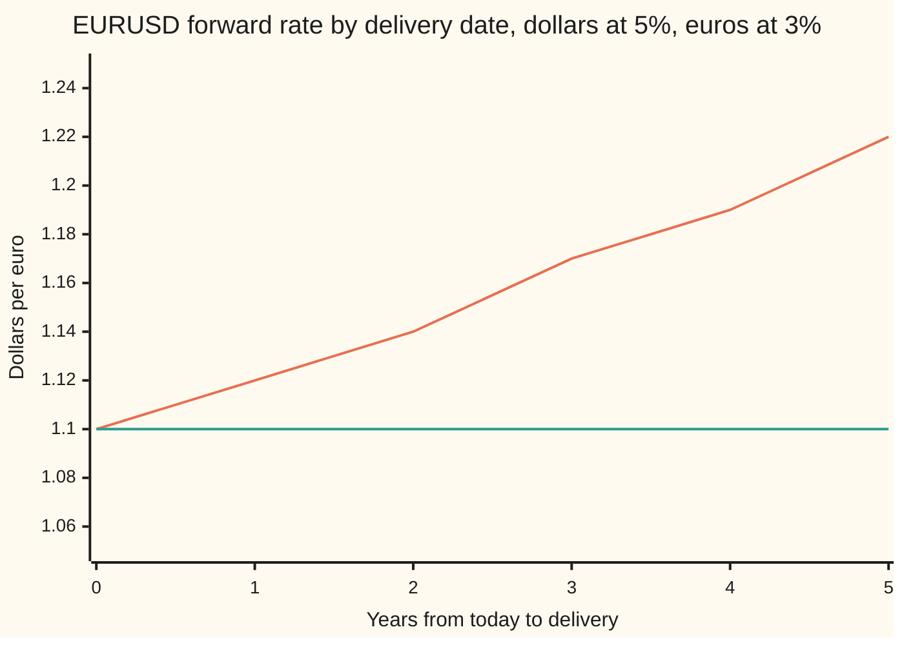
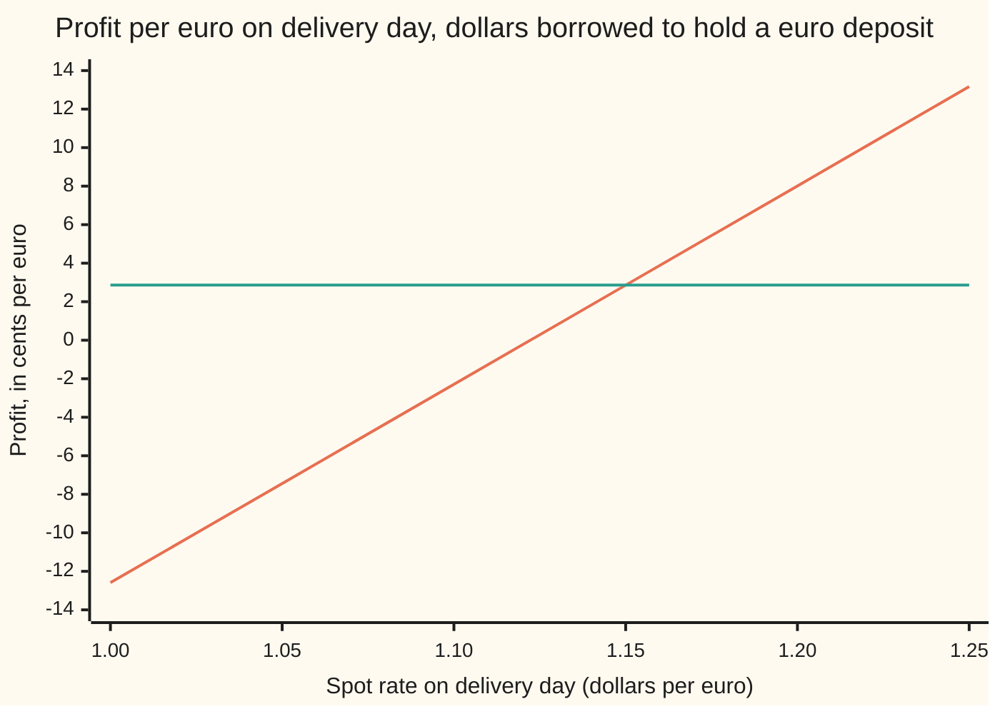

# Covered interest parity: the forward exchange rate from today's rate and the two interest rates

[Syllabus](../../../SYLLABUS.md) → [Financial mathematics](../../../SYLLABUS.md#w12) → [FX spot, forwards and interest parity](../../../SYLLABUS.md#w12-s20) → Covered interest parity

---

## General Overview

One euro costs 1.10 dollars today. That is the **spot rate**: the price for swapping the two currencies now, quoted as dollars per euro ([Reading a currency quote](01-currency-quotes-and-cross-rates.md)). A dollar deposit pays 5 percent a year. A euro deposit pays 3 percent a year.

A bank and an importer agree this morning to swap euros for dollars one year from today, at a rate written down now. No money moves until then. The agreement is an **FX forward**, and the rate in it is the **forward rate**. There is exactly one forward rate that neither side can beat by trading around it: 1.122221 dollars per euro.

That number is not a guess about next year. It is what two bank deposits force. Buying a euro today and leaving it in a euro account ends a year later in euros. So does agreeing the forward and leaving the dollars in a dollar account until delivery. Both routes start in dollars, end in euros, and carry no risk. They must cost the same, and the only thing that differs between them is which currency's interest rate the money earned on the way.

Quote any other forward and a trader can lock in cash for nothing. That is an **arbitrage**: a certain profit from no outlay. At 1.15 the seller of the forward, the side that delivers the euros, collects 2.86 cents on delivery day for each euro bought today, whatever the euro does. At 1.10 the buyer collects 2.29 cents on the same basis.

**The forward exchange rate is today's rate grown by the gap between the two currencies' interest rates, because that is the only rate at which borrowing in one currency and lending in the other earns nothing extra.**

**What kind of fact this is:** a theorem, proved on this card in Why it works, inside a stated model: one rate to borrow and lend in each currency, no fees, both sides deliver. Loosen the model and the single rate widens into a band, as When it holds sets out.

### The picture: one spot rate, a forward for every delivery date



The rising line is the forward rate for delivery 0 to 5 years out. The flat line is today's spot rate, 1.10. The forward climbs because every extra year is another year of the 2-percentage-point gap between the dollar and euro deposit rates. The currency paying more interest, the dollar here, buys fewer euros forward than it does today.

---

## The formula

Notation first, in words. A small letter after a symbol, written low, labels which currency it belongs to: $r_d$ is the **domestic** rate, the rate on the currency prices are counted in (dollars); $r_f$ is the **foreign** rate, on the currency being priced (euros). Both are continuously compounded ([Compounding more often, and the number e](../../01-Foundations/04-Compound%20Growth%20and%20Discounting/04-compounding-frequency-and-e.md)): a deposit of 1 grows to $e^{rT}$ in $T$ years.

$$F = S\,e^{(r_d - r_f)\,T}$$

**Read it aloud: the forward rate is today's rate, grown for the life of the contract at the dollar rate minus the euro rate.**

| Symbol | Plain meaning | In our example | Push it up and the forward… |
| --- | --- | --- | --- |
| $S$ | spot rate: dollars for one euro, swapped today | 1.10 | rises in proportion |
| $F$ | forward rate: dollars for one euro, agreed today, swapped at $T$ | 1.122221 | (the answer) |
| $r_d$ | domestic rate: what a dollar deposit pays, per year, continuously compounded | 5% | rises: dollars held earn more, so euros must cost more forward |
| $r_f$ | foreign rate: what a euro deposit pays, same basis | 3% | falls: euros held earn more, so they must cost less forward |
| $T$ | years until delivery | 1 | moves further from spot, in the direction of the rate gap |
| $e^{(r_d - r_f)T}$ | the carry factor: how far the forward sits from spot, as a multiple | 1.020201 | (built from the three above) |
| $e^{-r_d T}$, $e^{-r_f T}$ | discount factors, D(T): today's value of one dollar, or one euro, due at $T$ | (for the proof) | |
| $F_q$ | a forward rate someone quotes, which may differ from $F$ | 1.15 or 1.10 | above $F$ the seller profits; below, the buyer |
| $S_T$ | the spot rate that turns up on delivery day | unknown today | does not appear in $F$ at all |
| $R_d$, $R_f$ | money-market rates: simple interest, the way deposits are quoted on a desk | 5.0569%, 3.0037% | (a different unit for $r_d$, $r_f$) |
| $\tau$ | day-count fraction: days in the deposit over the convention's year | 365/360 | (fixed by convention) |
| pip | one ten-thousandth of a dollar per euro, 0.0001; forward points are $F - S$ counted in pips | forward points 222.21 pips | |

**The money-market form.** Desks quote deposit rates as simple interest over a day count, not continuously. A dollar deposit of 1 then grows to $1 + R_d\tau$, and the same argument gives

$$F = S\,\frac{1 + R_d\,\tau}{1 + R_f\,\tau}.$$

In words: dollars grown for the term, divided by euros grown for the term. Converting between the two units is one line each way: $r = \ln(1 + R\tau)/T$ and $R = (e^{rT} - 1)/\tau$. The house rates of 5% and 3% continuous are 5.0569% and 3.0037% on a money-market quote for 365 days counted over 360.

**Conventions verified 27 Sep 2026:** EURUSD is quoted in dollars per euro; dollar and euro deposits count actual days over a 360-day year, sterling over 365; a pip on EURUSD is 0.0001. Markets could change these; the formula does not care, provided the rate and its day count travel together.

### When it holds

- **One rate to borrow and one to lend, the same, in each currency.** Real banks borrow dearer than they lend, and pay a bid–offer spread (the gap between the buying and selling price) at spot and forward. The single $F$ then widens into a band; a quote inside it offers no free money.
- **Both sides deliver.** A forward is a promise. If default risk or collateral differs between the two deposits and the forward, the rates in the formula are not the rates the trader actually faces, and the gap shows up as the cross-currency basis ([The interest rate a forward implies](05-implied-yield-and-cross-currency-basis.md)).
- **Money can move freely.** Capital controls, or limits on a bank's balance sheet, stop the arbitrage from being run at size. Since 2008 the euro, yen and sterling forwards against the dollar have sat tens of basis points (hundredths of a percent) off this formula for years.
- **Rates for exactly the forward's term, on one compounding basis.** A 1-year forward needs 1-year deposit rates. Mixing money-market quotes into the continuous formula shifts the one-year forward by 5.74 pips here (What breaks, below).

---

## Why it works

### Step 0: two riskless ways to own a euro next year must cost the same today

Nobody needs to know where the euro is going. There are two ways to hold one euro on delivery day, both fixed today.

- **Route A, through the forward.** Agree today to pay $F$ dollars for one euro at $T$. To be sure of the dollars, set aside $F e^{-r_d T}$ dollars now in a dollar deposit; it grows to exactly $F$.
- **Route B, through spot and a deposit.** Buy $e^{-r_f T}$ euros today at spot and leave them in a euro deposit; they grow to exactly one euro. The cost today is $S e^{-r_f T}$ dollars.

Both deliver the same euro on the same day with no risk. So

$$F\,e^{-r_d T} = S\,e^{-r_f T} \quad\Longrightarrow\quad F = S\,e^{(r_d - r_f)T}.$$

At the house numbers both routes cost 1.067490 dollars today. This is the forward-price argument from [Forward price](../03-Contracts%20and%20No-Arbitrage/03-forward-price-by-cash-and-carry.md) with one change: the euro, held, pays interest at $r_f$ the way a share pays a dividend. Put $r_f$ where that card has the dividend yield and the two formulas coincide.

### Step 1: the seller's ledger, when the quote is too high

Say the market quotes $F_q$ = 1.15, above 1.122221. Sell the forward and cover it. All figures are per euro bought today.

| Step | Today | On delivery day |
| --- | --- | --- |
| Borrow 1.10 dollars at 5% | +1.100000 dollars | −1.156398 dollars |
| Buy 1 euro at spot 1.10 | −1.100000 dollars, +1 euro | |
| Deposit the euro at 3% | −1 euro | +1.030455 euros |
| Sell 1.030455 euros forward at 1.15 | nothing | −1.030455 euros, +1.185023 dollars |
| **Net** | **0** | **+0.028625 dollars** |

Nothing paid today. Every delivery-day amount was fixed this morning. The profit is 2.86 cents per euro, 286,245.08 dollars on a 10-million-euro trade. The spot rate on delivery day, $S_T$, appears nowhere in the table: the forward already disposed of every euro the trader would ever hold.

### Step 2: the buyer's ledger, when the quote is too low

Now $F_q$ = 1.10, below 1.122221. Run every leg the other way.

| Step | Today | On delivery day |
| --- | --- | --- |
| Borrow 1 euro at 3% | +1 euro | −1.030455 euros |
| Sell it at spot 1.10 | −1 euro, +1.100000 dollars | |
| Deposit the dollars at 5% | −1.100000 dollars | +1.156398 dollars |
| Buy 1.030455 euros forward at 1.10 | nothing | +1.030455 euros, −1.133500 dollars |
| **Net** | **0** | **+0.022898 dollars** |

2.29 cents per euro, 228,982.19 dollars on 10 million. A quote that is too high is picked off by sellers; one too low, by buyers. The only quote nobody can pick off is the one where both ledgers net to zero.

### Step 3: close the gap in general

Write the seller's ledger with any quote $F_q$. On delivery day the forward pays $F_q e^{r_f T}$ dollars and the loan costs $S e^{r_d T}$. Pull out $e^{r_f T}$:

$$\text{profit} = F_q e^{r_f T} - S e^{r_d T} = e^{r_f T}\,(F_q - F).$$

$e^{r_f T}$ is always positive, so the sign of the profit is the sign of $F_q - F$. The buyer's ledger gives $e^{r_f T}(F - F_q)$. At 1.15 the formula gives 0.028625, and at 1.10 it gives 0.022898: the ledgers above, to the last digit.

<details>
<summary>Detailed proof: no quote other than F survives</summary>

Assume one continuously compounded rate for borrowing and lending in each currency, no fees, and contracts that are honoured. Let the market quote $F_q$.

Seller's strategy at time 0: borrow $S$ dollars, buy one euro, deposit it at $r_f$, and sell $e^{r_f T}$ euros forward at $F_q$. Net cash at time 0 is zero. At $T$ the deposit returns $e^{r_f T}$ euros, which are delivered into the forward for $F_q e^{r_f T}$ dollars; the loan costs $S e^{r_d T}$ dollars. Net cash at $T$ is $e^{r_f T}(F_q - F)$, with $F = S e^{(r_d - r_f)T}$. No term depends on $S_T$.

Buyer's strategy: borrow one euro, sell it for $S$ dollars, deposit them at $r_d$, and buy $e^{r_f T}$ euros forward at $F_q$. Net cash at 0 is zero; at $T$ it is $S e^{r_d T} - F_q e^{r_f T} = e^{r_f T}(F - F_q)$.

If $F_q > F$, the seller's strategy costs nothing and pays a positive amount for certain: an arbitrage. If $F_q < F$, the buyer's does. A market with no arbitrage therefore has $F_q = F$. The same steps with simple interest, a deposit of 1 growing to $1 + R\tau$, give the money-market form.

</details>

### Step 4: a break-even, not a forecast

Drop the forward. Borrow 1.10 dollars, buy a euro, deposit it, and on delivery day convert the 1.030455 euros back at whatever spot turns out to be. That unhedged trade does depend on $S_T$:



The sloping line is the unhedged trade: it wins if the euro rises and loses if it falls. The flat line is the same trade covered by a forward sold at 1.15: 2.86 cents at every landing spot. The sloping line crosses zero at exactly 1.122221, the forward. So the forward is the landing spot at which holding the high-rate currency and holding the low-rate one tie. It is where the trade breaks even, which is a statement about today's deposit rates, not about next year's exchange rate.

A dealer who expects the euro at 1.30 and one who expects 0.95 quote the same forward. Neither view enters the ledger.

### The other door: money-market rates

Replace each continuous deposit by a simple-interest deposit with its day count. Route A sets aside $F/(1 + R_d\tau)$ dollars; route B buys $1/(1 + R_f\tau)$ euros. Equating them gives the money-market form. With the house rates converted to 5.0569% and 3.0037%, it returns 1.122221 again. The formula does not depend on how interest is counted, only on each rate being counted consistently. The same carry, read as a number of pips and traded as a two-legged ticket, is [Forward points and the FX swap](03-forward-points-and-fx-swaps.md).

---

## Worked numbers, by hand

EURUSD spot $S$ = 1.10, $r_d$ = 5%, $r_f$ = 3%, one year and three months.

| Step | Arithmetic | Value |
| --- | --- | --- |
| the carry | 0.05 − 0.03, times 1 year | 0.020000 |
| carry factor | $e^{0.02}$ | 1.020201 |
| **one-year forward** | 1.10 × 1.020201 | **1.122221** |
| forward points | (1.122221 − 1.10) × 10,000 | +222.21 pips |
| dollar loan at delivery | 1.10 × $e^{0.05}$ | 1.156398 |
| euro deposit at delivery | 1 × $e^{0.03}$ | 1.030455 |
| cross-check | 1.156398 / 1.030455 | 1.122221 |
| **three-month forward** | 1.10 × $e^{0.02 \times 0.25}$ | **1.105514** |
| three-month points | (1.105514 − 1.10) × 10,000 | +55.14 pips |
| seller's profit, quote 1.15 | 1.030455 × (1.15 − 1.122221) | 0.028625 |
| buyer's profit, quote 1.10 | 1.030455 × (1.122221 − 1.10) | 0.022898 |

The cross-check row is the whole card in one division: dollars grown for a year, divided by euros grown for a year. An importer who must pay euros next year locks in 1.122221 today, and pays 222.21 pips over spot for the privilege of not holding euros in the meantime, earning 5% on dollars instead of 3% on euros.

**From desk quotes.** A money-market desk quotes 5.00% on dollars and 3.00% on euros, simple interest, 365 days counted over 360. The forward is 1.10 × (1 + 0.05 × 365/360) / (1 + 0.03 × 365/360) = 1.121647. The continuous rates that give the same forward are 4.9451% and 2.9963%.

### What breaks if you drop a piece

Correct one-year forward: 1.122221. Correct three-month forward: 1.105514. Money-market forward from 5%/3% desk quotes: 1.121647.

| Mistake | Comes out at | What went wrong |
| --- | --- | --- |
| Drop the euro rate | 1.156398 | Euros held earn 3%; forgetting it prices the forward as if they sat idle |
| Drop the dollar rate | 1.067490 | The dollars committed could have earned 5% |
| Rates the wrong way round | 1.078219 | The high-rate currency made dearer forward, not cheaper; also what an inverted quote with unswapped rates gives |
| Desk quotes 5%/3% used in the exponent | 1.122221 (right: 1.121647) | Simple act/360 rates are not continuous rates; 5.74 pips off |
| Drop the time, three-month deal | 1.122221 (right: 1.105514) | The rate gap is per year and must be multiplied by the years |

Every number in the table is printed by both checks below.

---

## Code, from first principles, and it actually runs

The script reaches the one-year forward by **four roads**. Road 1 is the formula with the library exponential. Road 2 never calls it: it grows both deposits with a hand-summed series for $e^x$, writes the seller's ledger for any quoted rate, and finds by bisection (halving an interval until it is a point) the quote at which the ledger nets zero. Road 3 starts from money-market quotes. Road 4 carries the three-month forward nine more months. Then both ledgers are checked against the closed form, the unhedged break-even is found by the same root finder, and every wrong number in the table above is reproduced. Mutation tests were run: swapping the rate gap for a sum, breaking the series, and dropping either deposit's growth each fail an assert, and so does a wrong day count.

### Python

```python
# Covered interest parity -- the check behind the card.  Standard library only.
# EURUSD, quoted in dollars per euro.  Every number on the card is printed here.
# Road 1: the formula, with math.exp.  Road 2: never calls math.exp; it grows
# both deposits with a hand-summed series and finds, by bisection, the quote at
# which the cash-and-carry ledger nets zero.  Road 3: money-market quotes.
# Road 4: the three-month forward, carried nine more months.
from math import exp, log

def ex(x):                                    # e^x as 1 + x + x^2/2! + ... (roads 2 and 3)
    term, total, k = 1.0, 1.0, 0
    while abs(term) > 1e-18:
        k += 1; term *= x / k; total += term
    return total

def forward(S, rd, rf, T):                    # road 1: covered interest parity
    return S * exp((rd - rf) * T)

def sell_ledger(S, rd, rf, T, Fq):            # borrow dollars, buy 1 euro, deposit it, sell the euros forward
    euros_at_T = ex(rf * T)
    dollars_in = Fq * euros_at_T
    loan_due = S * ex(rd * T)
    return dollars_in - loan_due, euros_at_T, dollars_in, loan_due

def buy_ledger(S, rd, rf, T, Fq):             # borrow 1 euro, sell it spot, deposit dollars, buy the euros back forward
    dollars_at_T = S * ex(rd * T)
    dollars_out = Fq * ex(rf * T)
    return dollars_at_T - dollars_out, dollars_at_T, dollars_out

def bisect(f, lo, hi):                        # root finder: halve the bracket until it is a point
    for _ in range(200):
        mid = 0.5 * (lo + hi)
        if (f(lo) > 0) == (f(mid) > 0): lo = mid
        else: hi = mid
    return 0.5 * (lo + hi)

S, rd, rf, T = 1.10, 0.05, 0.03, 1.0          # dollars per euro; dollar rate; euro rate; years
F = forward(S, rd, rf, T)
F_led = bisect(lambda q: sell_ledger(S, rd, rf, T, q)[0], 0.5, 2.0)
tau = 365 / 360                               # one year of 365 days, counted actual/360
Rd_mm, Rf_mm = (ex(rd * T) - 1) / tau, (ex(rf * T) - 1) / tau
F_mm = S * (1 + Rd_mm * tau) / (1 + Rf_mm * tau)
F_3m = forward(S, rd, rf, 0.25)
F_roll = F_3m * ex((rd - rf) * 0.75)

p_hi, eur_T, usd_in, loan = sell_ledger(S, rd, rf, T, 1.15)
p_lo, usd_T, usd_out = buy_ledger(S, rd, rf, T, 1.10)
cf_hi, cf_lo = exp(rf * T) * (1.15 - F), exp(rf * T) * (F - 1.10)

# a desk quotes money-market rates: 5.00% dollars, 3.00% euros, actual/360, 365 days
F_desk = S * (1 + 0.05 * tau) / (1 + 0.03 * tau)
rd_c, rf_c = log(1 + 0.05 * tau) / T, log(1 + 0.03 * tau) / T
unhedged = lambda ST: ST * ex(rf * T) - S * ex(rd * T)       # buy and deposit a euro, no forward
breakeven = bisect(unhedged, 0.5, 2.0)

rows = [
    ("S spot, dollars per euro", S), ("carry (rd - rf) T", (rd - rf) * T), ("carry factor e^(rd-rf)T", exp((rd - rf) * T)),
    ("1 formula F", F), ("2 ledger nets zero at", F_led), ("3 money-market road", F_mm), ("4 3M carried to 1Y", F_roll),
    ("  forward points, pips", (F - S) * 1e4), ("  3M forward", F_3m), ("  3M points, pips", (F_3m - S) * 1e4),
    ("  dollars today, route A", F * exp(-rd * T)), ("  dollars today, route B", S * exp(-rf * T)),
    ("  Rd money-market, act/360", Rd_mm), ("  Rf money-market, act/360", Rf_mm),
    ("at 1.15: euros at T", eur_T), ("  dollars from forward", usd_in), ("  dollar loan due", loan),
    ("  seller's profit per euro", p_hi), ("  closed form e^rfT(Fq-F)", cf_hi), ("  on EUR 10m", p_hi * 1e7),
    ("at 1.10: dollar deposit at T", usd_T), ("  dollars paid on forward", usd_out),
    ("  buyer's profit per euro", p_lo), ("  closed form e^rfT(F-Fq)", cf_lo), ("  on EUR 10m", p_lo * 1e7),
    ("unhedged breakeven landing", breakeven),
    ("desk: F from 5%/3% act/360", F_desk), ("  rd continuous", rd_c), ("  rf continuous", rf_c),
    ("  F from continuous rates", forward(S, rd_c, rf_c, T)),
    ("wrong: drop rf", forward(S, rd, 0.0, T)), ("wrong: drop rd", forward(S, 0.0, rf, T)),
    ("wrong: rates flipped", forward(S, rf, rd, T)), ("wrong: desk rates in exponent", forward(S, 0.05, 0.03, T)),
    ("  gap to desk F, pips", (forward(S, 0.05, 0.03, T) - F_desk) * 1e4),
    ("wrong: T dropped, 3M deal", forward(S, rd, rf, 1.0)),
    ("try: rf = 0.07", forward(S, rd, 0.07, T)), ("  points, pips", (forward(S, rd, 0.07, T) - S) * 1e4),
    ("try: rd = rf = 0.04", forward(S, 0.04, 0.04, T)), ("try: T = 5", forward(S, rd, rf, 5.0)),
    ("try: one pip rich, EUR 10m", sell_ledger(S, rd, rf, T, F + 1e-4)[0] * 1e7),
]
for name, v in rows:
    print(f"{name:<30} {v:>16.6f}")
print("chart, years to delivery    " + " ".join(f"{t:7d}" for t in range(6)))
print("chart, forward F(T)         " + " ".join(f"{forward(S, rd, rf, t):7.2f}" for t in range(6)))
spots = [1.00 + 0.05 * i for i in range(6)]
print("chart, landing spot         " + " ".join(f"{s:7.2f}" for s in spots))
print("chart, unhedged, cents      " + " ".join(f"{100 * unhedged(s):7.2f}" for s in spots))
print("chart, hedged at 1.15, cents" + " ".join(f"{100 * p_hi:7.2f}" for s in spots))

assert abs(F - 1.122221) < 5e-7, "formula against the house number"
assert abs(F_led - F) < 1e-12, "ledger road (series e^x, bisection) lands on the formula"
assert abs(F_mm - F) < 1e-12, "money-market road lands on the formula"
assert abs(F_roll - F) < 1e-12, "3M forward carried nine months lands on the 1Y forward"
assert abs(p_hi - cf_hi) < 1e-12, "seller's ledger against the closed form"
assert abs(p_lo - cf_lo) < 1e-12, "buyer's ledger against the closed form"
assert abs(breakeven - F) < 1e-12, "unhedged trade breaks even at the forward"
assert abs(forward(S, rd_c, rf_c, T) - F_desk) < 1e-12, "desk quotes converted to continuous"
assert abs(F_desk - 1.121647) < 5e-7 and abs(F_3m - 1.105514) < 5e-7, "desk and 3M house numbers"
assert abs(p_hi - 0.028625) < 5e-7 and abs(p_lo - 0.022898) < 5e-7, "ledger profits at 1.15 and 1.10"
print("ALL CHECKS PASS")
```

**Ran 2026-09-27 on macOS, Python 3.14.6, standard library only. All checks passed. Output, pasted from the run:**

```
S spot, dollars per euro               1.100000
carry (rd - rf) T                      0.020000
carry factor e^(rd-rf)T                1.020201
1 formula F                            1.122221
2 ledger nets zero at                  1.122221
3 money-market road                    1.122221
4 3M carried to 1Y                     1.122221
  forward points, pips               222.214740
  3M forward                           1.105514
  3M points, pips                     55.137729
  dollars today, route A               1.067490
  dollars today, route B               1.067490
  Rd money-market, act/360             0.050569
  Rf money-market, act/360             0.030037
at 1.15: euros at T                    1.030455
  dollars from forward                 1.185023
  dollar loan due                      1.156398
  seller's profit per euro             0.028625
  closed form e^rfT(Fq-F)              0.028625
  on EUR 10m                      286245.080329
at 1.10: dollar deposit at T           1.156398
  dollars paid on forward              1.133500
  buyer's profit per euro              0.022898
  closed form e^rfT(F-Fq)              0.022898
  on EUR 10m                      228982.186648
unhedged breakeven landing             1.122221
desk: F from 5%/3% act/360             1.121647
  rd continuous                        0.049451
  rf continuous                        0.029963
  F from continuous rates              1.121647
wrong: drop rf                         1.156398
wrong: drop rd                         1.067490
wrong: rates flipped                   1.078219
wrong: desk rates in exponent          1.122221
  gap to desk F, pips                  5.743518
wrong: T dropped, 3M deal              1.122221
try: rf = 0.07                         1.078219
  points, pips                      -217.814594
try: rd = rf = 0.04                    1.100000
try: T = 5                             1.215688
try: one pip rich, EUR 10m          1030.454534
chart, years to delivery          0       1       2       3       4       5
chart, forward F(T)            1.10    1.12    1.14    1.17    1.19    1.22
chart, landing spot            1.00    1.05    1.10    1.15    1.20    1.25
chart, unhedged, cents       -12.59   -7.44   -2.29    2.86    8.01   13.17
chart, hedged at 1.15, cents   2.86    2.86    2.86    2.86    2.86    2.86
ALL CHECKS PASS
```

### Rust

The same roads and the same rows. Rust's `f64::exp` plays road 1; road 2 again sums the series by hand. No crates.

```rust
// Covered interest parity -- the same check as covered_interest_parity_check.py, in Rust.
// Standard library only, no crates.  EURUSD, quoted in dollars per euro.
// Road 1: the formula, with f64::exp.  Road 2: never calls f64::exp; it grows
// both deposits with a hand-summed series and finds, by bisection, the quote at
// which the cash-and-carry ledger nets zero.  Road 3: money-market quotes.
// Road 4: the three-month forward, carried nine more months.

fn ex(x: f64) -> f64 {                        // e^x as 1 + x + x^2/2! + ... (roads 2 and 3)
    let (mut term, mut total, mut k) = (1.0_f64, 1.0_f64, 0.0_f64);
    while term.abs() > 1e-18 {
        k += 1.0;
        term *= x / k;
        total += term;
    }
    total
}

fn forward(s: f64, rd: f64, rf: f64, t: f64) -> f64 { s * ((rd - rf) * t).exp() }   // road 1

// borrow dollars, buy 1 euro, deposit it, sell the euros forward
fn sell_ledger(s: f64, rd: f64, rf: f64, t: f64, fq: f64) -> (f64, f64, f64, f64) {
    let euros_at_t = ex(rf * t);
    let dollars_in = fq * euros_at_t;
    let loan_due = s * ex(rd * t);
    (dollars_in - loan_due, euros_at_t, dollars_in, loan_due)
}

// borrow 1 euro, sell it spot, deposit dollars, buy the euros back forward
fn buy_ledger(s: f64, rd: f64, rf: f64, t: f64, fq: f64) -> (f64, f64, f64) {
    let dollars_at_t = s * ex(rd * t);
    let dollars_out = fq * ex(rf * t);
    (dollars_at_t - dollars_out, dollars_at_t, dollars_out)
}

fn bisect<G: Fn(f64) -> f64>(f: G, mut lo: f64, mut hi: f64) -> f64 {   // halve the bracket
    for _ in 0..200 {
        let mid = 0.5 * (lo + hi);
        if (f(lo) > 0.0) == (f(mid) > 0.0) { lo = mid; } else { hi = mid; }
    }
    0.5 * (lo + hi)
}

fn main() {
    let (s, rd, rf, t) = (1.10_f64, 0.05_f64, 0.03_f64, 1.0_f64);
    let f = forward(s, rd, rf, t);
    let f_led = bisect(|q| sell_ledger(s, rd, rf, t, q).0, 0.5, 2.0);
    let tau = 365.0 / 360.0;                  // one year of 365 days, counted actual/360
    let (rd_mm, rf_mm) = ((ex(rd * t) - 1.0) / tau, (ex(rf * t) - 1.0) / tau);
    let f_mm = s * (1.0 + rd_mm * tau) / (1.0 + rf_mm * tau);
    let f_3m = forward(s, rd, rf, 0.25);
    let f_roll = f_3m * ex((rd - rf) * 0.75);

    let (p_hi, eur_t, usd_in, loan) = sell_ledger(s, rd, rf, t, 1.15);
    let (p_lo, usd_t, usd_out) = buy_ledger(s, rd, rf, t, 1.10);
    let (cf_hi, cf_lo) = ((rf * t).exp() * (1.15 - f), (rf * t).exp() * (f - 1.10));

    // a desk quotes money-market rates: 5.00% dollars, 3.00% euros, actual/360, 365 days
    let f_desk = s * (1.0 + 0.05 * tau) / (1.0 + 0.03 * tau);
    let (rd_c, rf_c) = ((1.0 + 0.05 * tau).ln() / t, (1.0 + 0.03 * tau).ln() / t);
    let unhedged = |st: f64| st * ex(rf * t) - s * ex(rd * t);   // buy and deposit a euro, no forward
    let breakeven = bisect(unhedged, 0.5, 2.0);

    let rows: Vec<(&str, f64)> = vec![
        ("S spot, dollars per euro", s), ("carry (rd - rf) T", (rd - rf) * t), ("carry factor e^(rd-rf)T", ((rd - rf) * t).exp()),
        ("1 formula F", f), ("2 ledger nets zero at", f_led), ("3 money-market road", f_mm), ("4 3M carried to 1Y", f_roll),
        ("  forward points, pips", (f - s) * 1e4), ("  3M forward", f_3m), ("  3M points, pips", (f_3m - s) * 1e4),
        ("  dollars today, route A", f * (-rd * t).exp()), ("  dollars today, route B", s * (-rf * t).exp()),
        ("  Rd money-market, act/360", rd_mm), ("  Rf money-market, act/360", rf_mm),
        ("at 1.15: euros at T", eur_t), ("  dollars from forward", usd_in), ("  dollar loan due", loan),
        ("  seller's profit per euro", p_hi), ("  closed form e^rfT(Fq-F)", cf_hi), ("  on EUR 10m", p_hi * 1e7),
        ("at 1.10: dollar deposit at T", usd_t), ("  dollars paid on forward", usd_out),
        ("  buyer's profit per euro", p_lo), ("  closed form e^rfT(F-Fq)", cf_lo), ("  on EUR 10m", p_lo * 1e7),
        ("unhedged breakeven landing", breakeven),
        ("desk: F from 5%/3% act/360", f_desk), ("  rd continuous", rd_c), ("  rf continuous", rf_c),
        ("  F from continuous rates", forward(s, rd_c, rf_c, t)),
        ("wrong: drop rf", forward(s, rd, 0.0, t)), ("wrong: drop rd", forward(s, 0.0, rf, t)),
        ("wrong: rates flipped", forward(s, rf, rd, t)), ("wrong: desk rates in exponent", forward(s, 0.05, 0.03, t)),
        ("  gap to desk F, pips", (forward(s, 0.05, 0.03, t) - f_desk) * 1e4),
        ("wrong: T dropped, 3M deal", forward(s, rd, rf, 1.0)),
        ("try: rf = 0.07", forward(s, rd, 0.07, t)), ("  points, pips", (forward(s, rd, 0.07, t) - s) * 1e4),
        ("try: rd = rf = 0.04", forward(s, 0.04, 0.04, t)), ("try: T = 5", forward(s, rd, rf, 5.0)),
        ("try: one pip rich, EUR 10m", sell_ledger(s, rd, rf, t, f + 1e-4).0 * 1e7),
    ];
    for (name, v) in &rows { println!("{:<30} {:>16.6}", name, v); }
    let years: Vec<String> = (0..6).map(|y| format!("{:7}", y)).collect();
    println!("chart, years to delivery    {}", years.join(" "));
    let fwd: Vec<String> = (0..6).map(|y| format!("{:7.2}", forward(s, rd, rf, y as f64))).collect();
    println!("chart, forward F(T)         {}", fwd.join(" "));
    let spots: Vec<f64> = (0..6).map(|i| 1.00 + 0.05 * i as f64).collect();
    let land: Vec<String> = spots.iter().map(|x| format!("{:7.2}", x)).collect();
    println!("chart, landing spot         {}", land.join(" "));
    let unh: Vec<String> = spots.iter().map(|x| format!("{:7.2}", 100.0 * unhedged(*x))).collect();
    println!("chart, unhedged, cents      {}", unh.join(" "));
    let hed: Vec<String> = spots.iter().map(|_| format!("{:7.2}", 100.0 * p_hi)).collect();
    println!("chart, hedged at 1.15, cents{}", hed.join(" "));

    assert!((f - 1.122221).abs() < 5e-7, "formula against the house number");
    assert!((f_led - f).abs() < 1e-12, "ledger road (series e^x, bisection) lands on the formula");
    assert!((f_mm - f).abs() < 1e-12, "money-market road lands on the formula");
    assert!((f_roll - f).abs() < 1e-12, "3M forward carried nine months lands on the 1Y forward");
    assert!((p_hi - cf_hi).abs() < 1e-12, "seller's ledger against the closed form");
    assert!((p_lo - cf_lo).abs() < 1e-12, "buyer's ledger against the closed form");
    assert!((breakeven - f).abs() < 1e-12, "unhedged trade breaks even at the forward");
    assert!((forward(s, rd_c, rf_c, t) - f_desk).abs() < 1e-12, "desk quotes converted to continuous");
    assert!((f_desk - 1.121647).abs() < 5e-7 && (f_3m - 1.105514).abs() < 5e-7, "desk and 3M house numbers");
    assert!((p_hi - 0.028625).abs() < 5e-7 && (p_lo - 0.022898).abs() < 5e-7, "ledger profits at 1.15 and 1.10");
    println!("ALL CHECKS PASS");
}
```

**Ran 2026-09-27 on macOS, rustc 1.98.1, no crates. All checks passed. Output, pasted from the run:**

```
S spot, dollars per euro               1.100000
carry (rd - rf) T                      0.020000
carry factor e^(rd-rf)T                1.020201
1 formula F                            1.122221
2 ledger nets zero at                  1.122221
3 money-market road                    1.122221
4 3M carried to 1Y                     1.122221
  forward points, pips               222.214740
  3M forward                           1.105514
  3M points, pips                     55.137729
  dollars today, route A               1.067490
  dollars today, route B               1.067490
  Rd money-market, act/360             0.050569
  Rf money-market, act/360             0.030037
at 1.15: euros at T                    1.030455
  dollars from forward                 1.185023
  dollar loan due                      1.156398
  seller's profit per euro             0.028625
  closed form e^rfT(Fq-F)              0.028625
  on EUR 10m                      286245.080329
at 1.10: dollar deposit at T           1.156398
  dollars paid on forward              1.133500
  buyer's profit per euro              0.022898
  closed form e^rfT(F-Fq)              0.022898
  on EUR 10m                      228982.186648
unhedged breakeven landing             1.122221
desk: F from 5%/3% act/360             1.121647
  rd continuous                        0.049451
  rf continuous                        0.029963
  F from continuous rates              1.121647
wrong: drop rf                         1.156398
wrong: drop rd                         1.067490
wrong: rates flipped                   1.078219
wrong: desk rates in exponent          1.122221
  gap to desk F, pips                  5.743518
wrong: T dropped, 3M deal              1.122221
try: rf = 0.07                         1.078219
  points, pips                      -217.814594
try: rd = rf = 0.04                    1.100000
try: T = 5                             1.215688
try: one pip rich, EUR 10m          1030.454534
chart, years to delivery          0       1       2       3       4       5
chart, forward F(T)            1.10    1.12    1.14    1.17    1.19    1.22
chart, landing spot            1.00    1.05    1.10    1.15    1.20    1.25
chart, unhedged, cents       -12.59   -7.44   -2.29    2.86    8.01   13.17
chart, hedged at 1.15, cents   2.86    2.86    2.86    2.86    2.86    2.86
ALL CHECKS PASS
```

The two outputs agree line for line. Four roads land on 1.122221 to the printed digit, and the ledgers match $e^{r_f T}(F_q - F)$ to twelve decimals.

> [!TIP]
> **Try changing**
> Guess the direction first. Then run it.
> - **Make the euro the high-rate currency.** Set `rf = 0.07`. The forward falls to **1.078219**, points **−217.81 pips**. The euro now pays more, so it buys fewer dollars forward.
> - **Equal rates.** Set `rd = rf = 0.04`. The forward is **1.100000**, spot exactly. No gap, no carry: the first sanity test when a forward looks wrong.
> - **Stretch the delivery.** Set `T = 5`. The forward is **1.215688**, the last point on the first chart. The gap compounds, so long-dated forwards are where a rate error costs most.
> - **Quote one pip rich.** Sell at `F + 0.0001`. On 10 million euros the seller's ledger nets **1,030.45 dollars**. That is why FX desks argue over the fourth decimal.

---

## The usual mistake

> [!warning]
> **Reading the forward as the market's forecast.** It is not one. 1.122221 is where two deposits tie; the ledger in Step 1 earns the same at every landing spot. The claim that the forward predicts next year's spot is a different claim, **uncovered interest parity**, and no trade enforces it. The evidence has run against it since Fama's 1984 paper: the currency at a forward discount has on average fallen less than the forward implied, and often risen. Borrowing the low-rate currency to hold the high-rate one on that bet is the **carry trade**. It pays the rate gap for years and then loses much of it in weeks. The unhedged line on the second chart is that trade run backwards: it borrows the high-rate dollar to hold the low-rate euro.
>
> - **The quote direction.** $S$ and $F$ must be dollars per euro when $r_d$ is the dollar rate. Swap the rates and the forward comes out at 1.078219, a number that still looks like an exchange rate. Test: the higher-rate currency must be the one that is cheaper forward.
> - **Mixing rate units.** A 5% money-market quote is not a 5% continuous rate. Put desk quotes in the exponent and the one-year forward moves 5.74 pips.
> - **The wrong interest rate.** The rates belong to deposits the trader can actually borrow and lend at, for exactly this term. A government bond yield nobody lends at gives a forward nobody trades.
> - **Assuming the market obeys it to the pip.** Since 2008 the major currencies have shown a persistent cross-currency basis. The formula is still how forwards are quoted; the residual is priced separately.

---

## Where you meet it in real life

- **Corporate hedging.** An importer paying euros next year buys them forward at 1.122221. The 222.21 pips over spot are not an insurance premium: they match the extra interest the dollars earn until delivery.
- **FX swaps and forward points.** Dealers quote forwards as points over spot, and trade spot plus an opposite forward as one ticket, which is this card's ledger in a single contract: [Forward points and the FX swap](03-forward-points-and-fx-swaps.md).
- **Contracts already on the books.** A forward signed last month at an old rate is now worth something to one side. Its value comes from today's forward and discount factor: [Valuing an old currency forward](04-fx-forward-value-after-inception.md).
- **Currency options.** The Garman–Kohlhagen formula is Black–Scholes with the foreign rate in the dividend slot, and it prices off this card's forward: [Garman-Kohlhagen](../21-FX%20vanilla%20options%20-%20Garman-Kohlhagen%20and%20the%20desk%20conventions/01-garman-kohlhagen.md).
- **Funding-stress monitors.** Central banks watch how far quoted forwards sit from this formula. Run backwards, a forward implies an interest rate, and the gap to the quoted deposit rate is the cross-currency basis: [The interest rate a forward implies](05-implied-yield-and-cross-currency-basis.md).
- **Gold.** Gold lent out earns a lease rate the way a euro earns its deposit rate, and the gold forward is the same formula with the lease rate in place of $r_f$: [Gold forward](../25-Commodity%20forwards%20-%20carry%2C%20storage%2C%20convenience%20yield%20and%20the%20curve/01-gold-forward-and-the-lease-rate.md).

> **Say it back**
> A currency forward fixes today the rate for a swap on a later date. Buying the foreign currency now and depositing it reaches the same place as agreeing the forward and depositing the home currency, so both must cost the same. That forces the forward to equal spot grown at the home rate minus the foreign rate. Any other quote lets one side lock in cash with no exposure to the exchange rate. The forward is where the two deposits tie, not a forecast of where the rate will land.

---

## What this builds on

- [Reading a currency quote](01-currency-quotes-and-cross-rates.md): which currency is priced in which, and what a pip is.
- [Compound interest](../../01-Foundations/04-Compound%20Growth%20and%20Discounting/03-compound-interest.md): why a deposit multiplies rather than adds.
- [Compounding more often, and the number e](../../01-Foundations/04-Compound%20Growth%20and%20Discounting/04-compounding-frequency-and-e.md): where $e^{rT}$ comes from, and how simple and continuous rates convert.
- [Discounting](../../01-Foundations/04-Compound%20Growth%20and%20Discounting/06-discounting-and-present-value.md): the discount factors that price routes A and B today.
- [Forward price](../03-Contracts%20and%20No-Arbitrage/03-forward-price-by-cash-and-carry.md): the same argument for a share; the euro's interest takes the dividend's place.

## Where this goes next

- [Forward points and the FX swap](03-forward-points-and-fx-swaps.md): the forward as the market quotes it, in points, and the swap that trades it.
- [The interest rate a forward implies](05-implied-yield-and-cross-currency-basis.md): this formula run backwards, and what the leftover gap measures.
- [Garman-Kohlhagen](../21-FX%20vanilla%20options%20-%20Garman-Kohlhagen%20and%20the%20desk%20conventions/01-garman-kohlhagen.md): options on the exchange rate, priced off this forward.
- [The quanto adjustment](../24-Quantos%20and%20composites/01-quanto-forward-and-adjustment.md): a forward paid in the wrong currency, where the exchange rate's wobble adds a correction.
- [Gold forward](../25-Commodity%20forwards%20-%20carry%2C%20storage%2C%20convenience%20yield%20and%20the%20curve/01-gold-forward-and-the-lease-rate.md): the same carry with a metal's lease rate as the foreign rate.
- [Cross-currency swaps](../28-Swaps/06-cross-currency-swaps-and-basis.md): a string of these forwards, exchanged as interest payments over many years.

This card fixes the forward from quoted deposit rates; what it leaves open is how the market actually quotes and trades that forward, in points over spot, which the forward-points card takes up.

---

## Sources

Verified 27 Sep 2026: every link below resolves to the publisher's page.

- Frenkel, Jacob A., and Richard M. Levich. "Covered Interest Arbitrage: Unexploited Profits?" *Journal of Political Economy* 83, no. 2 (1975): 325–338. [doi:10.1086/260325](https://doi.org/10.1086/260325). Apparent parity profits vanish once transaction costs are counted: the band under When it holds.
- Fama, Eugene F. "Forward and Spot Exchange Rates." *Journal of Monetary Economics* 14, no. 3 (1984): 319–338. [doi:10.1016/0304-3932(84)90046-1](https://doi.org/10.1016/0304-3932(84)90046-1). The forward as a biased predictor of the future spot rate: the uncovered claim failing while the covered one holds.
- Du, Wenxin, Alexander Tepper, and Adrien Verdelhan. "Deviations from Covered Interest Rate Parity." *Journal of Finance* 73, no. 3 (2018): 915–957. [doi:10.1111/jofi.12620](https://doi.org/10.1111/jofi.12620). The post-2008 cross-currency basis, measured.
- Borio, Claudio, Robert McCauley, Patrick McGuire, and Vladyslav Sushko. "Covered Interest Parity Lost: Understanding the Cross-Currency Basis." *BIS Quarterly Review*, September 2016. [BIS page](https://www.bis.org/publ/qtrpdf/r_qt1609e.htm). Why the arbitrage stopped being run at size: bank balance sheets and dollar funding.
- Hull, John C. *Options, Futures, and Other Derivatives*, 11th ed. Pearson. [Publisher page](https://www.pearson.com/en-us/subject-catalog/p/options-futures-and-other-derivatives/P200000005938). The textbook derivation of the currency forward, and the day-count conventions.
