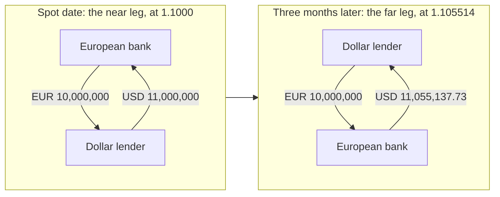
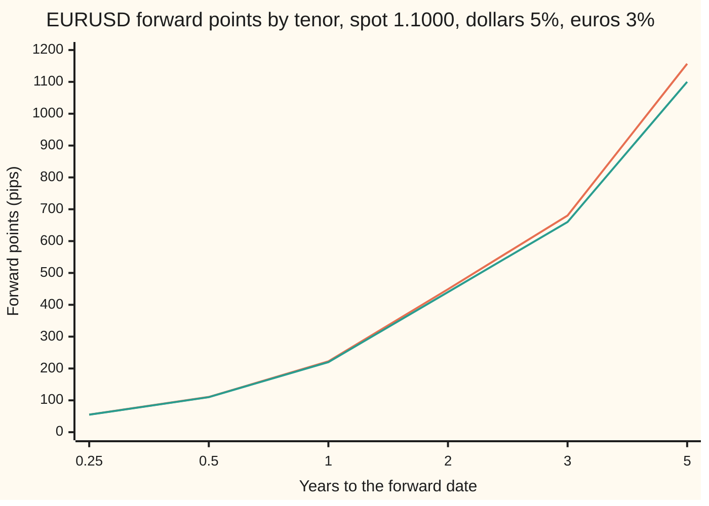

# Forward points and the FX swap: the forward quoted as pips over spot, and the trade that carries them

Financial mathematics → FX spot, forwards and interest parity → Quoting and trading the carry → Forward points and the FX swap

---

## General Overview

A euro costs 1.1000 dollars today. Dollar deposits pay 5 percent a year, euro deposits 3 percent. The fair price for euros delivered in one year is 1.122221 dollars, and for euros delivered in three months, 1.105514 ([covered-interest-parity](02-covered-interest-parity.md)).

A dealer does not quote those numbers. The dealer quotes the gap. One year is "plus 222.21", three months "plus 55.14". The unit is the **pip**, one ten-thousandth of a dollar per euro, 0.0001. The gap in pips is the **forward points**. Add the points to today's rate and the result is the **outright**: the full forward rate. The reason for quoting the gap is practical. Today's rate, the **spot rate**, changes several times a second. The gap is set by two interest rates, which change a few times a year.

The points are also the price of a trade. A European bank holds 10 million euros and needs dollars for three months. It sells the euros today at 1.1000 and receives 11,000,000 dollars. In the same ticket it agrees to buy the euros back in three months at 1.105514, paying 11,055,137.73 dollars. That two-legged ticket is an **FX swap**, the most traded instrument in the currency market. It is a dollar loan with the euros held as security. The extra 55,137.73 dollars on the way back is the 55.14 points, and it pays the dollar lender the 2-percentage-point gap between the two interest rates for a quarter.

**Forward points are the forward rate minus the spot rate, counted in pips; they are the interest-rate gap turned into exchange-rate units, and an FX swap is a loan that pays exactly that gap.**

**What kind of fact this is:** a convention for quoting the forward, and a definition of the swap. The number inside both is covered interest parity, a theorem proved on [covered-interest-parity](02-covered-interest-parity.md); the claim that the swap is a secured loan paying the rate gap is proved on this card in Why it works.

### The picture: one ticket, two dates



The euros go out and come back unchanged. The dollars go out as 11,000,000 and come back 55,137.73 larger. That difference is the swap's whole price, and it equals 55.14 pips on 10 million euros, at 1,000 dollars a pip.

---

## The formula

Notation first, in words. A small letter written low after a symbol labels its currency: $r_d$ is the **domestic** rate, on the currency prices are counted in (dollars); $r_f$ is the **foreign** rate, on the currency being priced (euros). Both are continuously compounded: a deposit of 1 grows to $e^{rT}$ in $T$ years.

$$P = \frac{F - S}{p} = \frac{S\,\bigl(e^{(r_d - r_f)T} - 1\bigr)}{p}, \qquad F = S + P\,p$$

**Read it aloud: the points are the forward minus spot, counted in pips; and they come from spot times the carry factor minus one, where the carry factor grows spot by the gap between the two rates.**

| Symbol | Plain meaning | In our example | Push it up and the points… |
| --- | --- | --- | --- |
| $S$ | spot rate: dollars for one euro, exchanged on the spot date | 1.1000 | rise in proportion: 224.23 at 1.1100 |
| $F$ | outright forward rate: dollars for one euro, agreed today, exchanged at $T$ | 1.105514 (3M), 1.122221 (1Y) | (the answer, in full) |
| $P$ | forward points: $F - S$ counted in pips; positive is a **premium**, negative a **discount** | +55.14 (3M), +222.21 (1Y) | (the answer, as quoted) |
| $p$ | pip size: the smallest customary step in the rate | 0.0001 for EURUSD | (fixed by convention) |
| $r_d$ | dollar deposit rate, per year, continuously compounded | 5% | rise |
| $r_f$ | euro deposit rate, same basis | 3% | fall, and turn negative once above $r_d$ |
| $T$ | years from the spot date to the forward date | 0.25 and 1 | grow a little faster than in proportion |
| $e^{(r_d - r_f)T}$ | the carry factor: the forward as a multiple of spot | 1.020201 (1Y) | (built from the three above) |
| $N$ | the swap's amount in euros, the same on both legs | 10,000,000 | scale the dollar amounts |
| $R_d$, $R_f$ | the same two rates quoted as simple interest, the way a deposit desk quotes them | (see the money-market form) | |
| $\tau$ | day-count fraction: the deposit's days over the convention's year | 0.25 | |

**The rule of thumb.** For short dates and small rate gaps, $e^{x} - 1$ is close to $x$, so

$$P \approx \frac{S\,(r_d - r_f)\,T}{p}.$$

In words: spot, times the rate gap, times the years, in pips. It gives 55.00 for three months and 220.00 for a year, against the exact 55.14 and 222.21.

**The money-market form.** With deposit rates quoted as simple interest over a day count,

$$F - S = S\,\frac{(R_d - R_f)\,\tau}{1 + R_f\,\tau}.$$

In words: spot times the gap in the two deposits' interest, shrunk by the euro deposit's growth. It is the same forward in a desk's units. With $R = (e^{rT} - 1)/\tau$, the simple rate that grows a deposit as much as the continuous one, it returns 55.14 again.

**The swap.** On the near date one side hands over $N$ euros for $N S$ dollars. On the far date the euros come back for $N F$ dollars. The dollar lender's gain on the dollars is $N(F - S) = N P p$: points times pip size times the euro amount.

**Conventions verified 27 Sep 2026:** EURUSD is quoted in dollars per euro and a pip is 0.0001; dollar and euro deposits count days as actual days over 360; spot settles two business days after the trade, and forward dates are counted from the spot date; points are quoted two-way, a bid and an ask, and are added to spot when the first number is smaller, subtracted when it is larger. Markets could change these conventions; the formula does not depend on them.

### When it holds

- **The forward is fair.** Points computed from rates assume covered interest parity. Since 2008 dollar points against the euro and yen have sat away from the rate-based number, by tens of basis points (hundredths of a percent) a year, and the swap price then carries that extra gap, the cross-currency basis ([implied-yield-and-cross-currency-basis](05-implied-yield-and-cross-currency-basis.md)).
- **Rates for the forward's own term.** Three-month points need three-month rates. Filling in a date between two quoted dates by a straight line misprices it slightly, because the points curve bends upward (Step 3).
- **One pip size.** The formula counts in 0.0001. A pair against the yen counts in 0.01; a points quote read with the wrong pip size is off by a factor of 100 ([currency-quotes-and-cross-rates](01-currency-quotes-and-cross-rates.md)).
- **The swap is a loan only if both legs settle.** Each side holds the other's currency as security. If one side fails between the legs, the other keeps collateral worth roughly the loan, which is why swap lenders lose far less on a default than unsecured lenders do.

---

## Why it works

### Step 0: the forward is spot plus carry, and carry is what gets quoted

Covered interest parity says the forward is spot grown by the gap between the two deposit rates: $F = S\,e^{(r_d - r_f)T}$. Split that into two parts. Spot moves with every trade. The growth part moves only when an interest rate moves. Dealers price the two parts separately, on separate desks, and the points are the growth part on its own:

$$F - S = S\,e^{(r_d - r_f)T} - S = S\,\bigl(e^{(r_d - r_f)T} - 1\bigr).$$

Divide by the pip size and the result is the quoted points. At the house numbers, 1.1000 times 0.020201, over 0.0001, is 222.21.

The points are proportional to spot, so they move with it, a little: spot up 100 pips, from 1.1000 to 1.1100, lifts the one-year points from 222.21 to 224.23.

### Step 1: the rule of thumb, and what it drops

The exponential written as a sum is $e^{x} = 1 + x + x^2/2 + \dots$ So $e^{x} - 1 = x + x^2/2 + \dots$ With $x = (r_d - r_f)T$, the first term gives the rule of thumb, and the second gives its error:

$$P - \frac{S\,x}{p} \approx \frac{S\,x^2}{2p}.$$

For one year, $x$ = 0.02, and the square term is 1.1 times 0.0004 over 2, over 0.0001: 2.20 pips. The actual gap is 2.21. The small rest is the cube term. At three months the square term is far smaller, which is why 55.00 and 55.14 look almost equal. At five years they do not: 1156.88 exact, 1100.00 by the rule.



Orange: the exact points. Green: the rule of thumb, a straight line. The two agree at short dates and part as the curve bends up, because carry compounds: each year's points earn the rate gap too.

### Step 2: the sign says which currency pays more

$e^{x} - 1$ has the sign of $x$. So the points are positive exactly when the dollar rate is above the euro rate, and negative when it is below.

Positive points mean the euro costs more forward than today: the euro trades at a **forward premium**. That is compensation, not a forecast. Whoever gives up dollars to hold euros earns the lower rate, and the forward rate is where the gap is paid back.

Swap the two rates, euros at 5 and dollars at 3, and the three-month points are −54.86: a **forward discount**. The size is not 55.14 again, because $e^{-x} - 1$ is not the mirror of $e^{x} - 1$. It is smaller by the square term, which now has the opposite effect.

### Step 3: from a points quote to an outright, for any date

**Two-way quotes.** A dealer quotes points as a bid and an ask, like spot. Spot 1.0999 bid, 1.1001 ask, and three-month points "55.0/55.3". The first number is smaller, so add: the outright bid is 1.0999 plus 55.0 pips, 1.105400, and the ask is 1.1001 plus 55.3 pips, 1.105630.

If the points were "55.3/55.0", the first number is larger, and the convention is to subtract: bid 1.0999 minus 55.3 pips, 1.094370; ask 1.1001 minus 55.0 pips, 1.094600. The rule keeps the outright spread wider than the spot spread, since a dealer quoting forward carries interest-rate risk as well. Add a high/low quote by mistake and the outright comes out at 1.105430 bid and 1.105600 ask, a spread narrower than spot's, which no dealer would quote. A narrow outright spread is the tell of a misread quote.

**Dates between the quoted ones.** Dealers quote standard dates: one week, one, two, three, six and twelve months. A payment due on any other date, a **broken date**, needs points of its own. The usual shortcut draws a straight line between the neighbouring quotes. Between three months at 55.14 and one year at 222.21, the straight line reads 110.83 at six months. The formula gives 110.55. The line is always a little high, because the points curve bends upward between any two dates, as the chart shows. For short dates the difference is a fraction of a pip; desks that care interpolate the rates rather than the points.

**Chaining dates.** With the same rates at every date, the carry factor multiplies across time: growing for three months and then nine is growing for twelve. So the one-year outright is the three-month carry applied four times over. Spot times 1.105514 over 1.1000, raised to the fourth power, gives 222.21 points again. Points do not add across periods; carry factors multiply.

### Step 4: the FX swap is a secured loan paying the rate gap

Follow the dollar lender through the three-month swap on 10 million euros.

| Date | Dollar lender pays | Dollar lender receives |
| --- | --- | --- |
| Spot date | 11,000,000.00 dollars | 10,000,000 euros |
| Meanwhile | | 75,281.95 euros of interest, by depositing the euros at 3% |
| Three months on | 10,000,000 euros | 11,055,137.73 dollars |

Compare lending the 11,000,000 dollars without security at 5 percent for the quarter: that earns 138,362.97 dollars. The swap earns two things instead. The points leg pays 55,137.73. The euro interest, sold forward at 1.105514, is worth 83,225.24 dollars. Together they make 138,362.97: the full 5 percent. So the swap lender earns the dollar rate, collected in two pieces, and the points piece is exactly the gap between the two rates:

$$N\,(F - S) = N S\,\bigl(e^{r_d T} - 1\bigr) - N\,\bigl(e^{r_f T} - 1\bigr)\,F.$$

The rule of thumb, the 2 percent gap on 11,000,000 dollars for a quarter, gives 55,000.00; the exact figure is 55,137.73.

The European bank has, from its side, borrowed dollars at 5 percent and lent euros at 3, each loan securing the other. The points are its net interest bill.

<details>
<summary>Detailed proof: the points leg is the dollar interest minus the euro interest at the forward rate</summary>

Let one continuously compounded rate apply to borrowing and lending in each currency, and let covered interest parity hold: $F = S\,e^{(r_d - r_f)T}$, so $F\,e^{r_f T} = S\,e^{r_d T}$.

The dollar lender's position at $T$, in dollars, when the euros received at the start are deposited at $r_f$ and the interest on them is sold forward at $F$: $N F$ from the far leg, plus $N(e^{r_f T} - 1)F$ from the euro interest. The total is $N F e^{r_f T} = N S e^{r_d T}$, which is what $N S$ dollars lent at $r_d$ returns. So the swap, with the collateral invested, is a dollar deposit at $r_d$.

Subtract the principal $N S$ from both sides and move the euro interest across:
$$N F - N S = N S\,(e^{r_d T} - 1) - N\,(e^{r_f T} - 1)\,F.$$
The left side is the points leg, $N P p$. The right side is dollar interest on the loan minus euro interest on the collateral, valued at the forward. At the house numbers: 138,362.97 minus 83,225.24 is 55,137.73.

At inception the swap costs nothing to enter. The near leg exchanges equal values at spot. The far leg is worth $N F e^{-r_d T} - N S e^{-r_f T}$ today, which is zero by the same parity identity.

</details>

### Step 5: the swap barely feels spot

An outright forward to buy 10 million euros at 1.105514 is a bet on the euro. If spot jumps to 1.2000 the moment after the trade, it gains 992,528.05 dollars in today's money.

The swap on the same amount gains 7,471.95. The dollar lender already holds the euros from the near leg and owes the same euros back on the far leg, so the two cancel. What is left is exposure on the euro interest only, the 3 percent on 10 million for a quarter. That is why the swap is a funding and hedging tool, not a currency bet: it swaps which currency a firm holds for a period, and its price is an interest rate.

The same carry in a different wrapper is the cross-currency swap, which exchanges interest payments over years as well as principal at both ends ([cross-currency-swaps-and-basis](../28-Swaps/06-cross-currency-swaps-and-basis.md)).

---

## Worked numbers, by hand

EURUSD spot 1.1000, dollars 5%, euros 3%, three months = 0.25 years, swap on 10 million euros.

| Step | Arithmetic | Value |
| --- | --- | --- |
| rate gap for the term | (0.05 − 0.03) × 0.25 | 0.005 |
| carry factor minus one | e to the 0.005, minus 1 | 0.005013 |
| forward minus spot | 1.1000 × 0.005013 | 0.005514 |
| **three-month points** | 0.005514 / 0.0001 | **+55.14 pips** |
| outright | 1.1000 + 55.14 × 0.0001 | 1.105514 |
| rule of thumb | 1.1000 × 0.02 × 0.25 / 0.0001 | 55.00 pips |
| one-year points, same steps with T = 1 | 1.1000 × (e to the 0.02, minus 1) / 0.0001 | +222.21 pips |
| near leg | 10,000,000 × 1.1000 | 11,000,000.00 dollars |
| far leg, unrounded rate | 10,000,000 × 1.10551377 | 11,055,137.73 dollars |
| one pip on the swap | 10,000,000 × 0.0001 | 1,000.00 dollars |
| **dollar lender's points leg** | 55.1377 pips × 1,000 | **55,137.73 dollars** |

The far leg uses the unrounded points; a ticket would round the rate to a stated number of places, which moves the far leg by a few dollars. The answer means the European bank pays 55,137.73 dollars for three months' use of 11 million dollars, on top of giving up the euro interest it would otherwise have paid: in net terms, a 2 percent loan.

### What breaks if you drop a piece

Correct three-month points: +55.14, outright 1.105514. Correct one-year points: +222.21.

| Mistake | Comes out at | What went wrong |
| --- | --- | --- |
| Rule of thumb at five years | 1100.00 pips (right: 1156.88) | The square term, negligible at three months, is not at five years. Carry compounds. |
| High/low points "55.3/55.0" added to spot | 1.105430 / 1.105600 (right: 1.094370 / 1.094600) | The euro is at a discount; the points must come off. The narrow spread gives it away. |
| Points read with pip 0.001 | 1.155138 (right: 1.105514) | A EURUSD pip is 0.0001; the wrong pip size multiplies the points by ten. |
| Straight line for a six-month broken date | 110.83 pips (right: 110.55) | The points curve bends up; the line between 3M and 1Y sits above it. |
| Flipped rates taken as −55.14 | −55.14 (right: −54.86) | The discount is not the premium with its sign changed; $e^{-x} - 1$ is smaller in size than $x$. |

Every number in that table is printed by both checks below.

---

## Code, from first principles, and it actually runs

The script reaches the points by **four independent roads**. Road 1 is the formula with the library exponential. Road 2 never calls it: it sums $e^{x}$ by hand as a series, writes the dollar lender's ledger for any far-leg rate, and finds by bisection (halving an interval until it is a point) the rate at which the swap with its collateral invested pays exactly what an unsecured dollar loan pays. Road 3 uses the money-market form with simple rates. Road 4 rolls the three-month carry four times into a year. Then it builds two-way outrights, the broken date, the swap's legs, the two-loan split, the swap's reaction to a jump in spot against an outright's, and every wrong number in the table. Eleven asserts compare values reached by different routes.

### Python

```python
# Forward points and the FX swap -- the check behind the card.  Standard library only.
# Road 1 is the formula.  Road 2 sums e^x by hand and finds the far-leg rate by bisection
# on the dollar lender's ledger.  Road 3 is the money-market form.  Road 4 rolls 3M forwards.
from math import exp

S, rd, rf, PIP, N = 1.10, 0.05, 0.03, 0.0001, 10_000_000.0   # USD per EUR, USD rate, EUR rate, pip, EUR notional

def ex(x, terms=40):                        # e^x as 1 + x + x^2/2! + ..., summed by hand
    total, term = 1.0, 1.0
    for k in range(1, terms):
        term *= x / k
        total += term
    return total

def pts(S, rd, rf, T):                      # road 1: the formula, in pips
    return S * (exp((rd - rf) * T) - 1.0) / PIP

def lender_gap(Fq, S, rd, rf, T):           # dollar lender, per euro, at T: swap far leg plus
    far_leg = Fq                            # interest on the euro collateral sold at Fq,
    euro_int = (ex(rf * T) - 1.0) * Fq      # minus what an unsecured dollar deposit pays
    return far_leg + euro_int - S * ex(rd * T)

def bisect(f, lo, hi, n=200):
    for _ in range(n):
        mid = 0.5 * (lo + hi)
        if (f(lo) < 0) == (f(mid) < 0): lo = mid
        else: hi = mid
    return 0.5 * (lo + hi)

def pts_ledger(S, rd, rf, T):               # road 2: the far rate at which the ledger nets zero
    return (bisect(lambda F: lender_gap(F, S, rd, rf, T), 0.5 * S, 2.0 * S) - S) / PIP

def pts_mm(S, rd, rf, T):                   # road 3: simple rates R = (e^{rT} - 1)/T, tau = T
    Rd, Rf = (ex(rd * T) - 1.0) / T, (ex(rf * T) - 1.0) / T
    return S * (Rd - Rf) * T / (1.0 + Rf * T) / PIP

p1y, p3m = pts(S, rd, rf, 1.0), pts(S, rd, rf, 0.25)
F1y, F3m = S + p1y * PIP, S + p3m * PIP
p1y_roll = (S * (F3m / S) ** 4 - S) / PIP  # road 4: the 3M carry, four times over
rule1y, rule3m = S * (rd - rf) * 1.0 / PIP, S * (rd - rf) * 0.25 / PIP
second = S * ((rd - rf) * 1.0) ** 2 / 2 / PIP     # the square term the rule of thumb drops
p6m = pts(S, rd, rf, 0.5)
p6m_lin = p3m + (0.5 - 0.25) / (1.0 - 0.25) * (p1y - p3m)   # straight line between quoted dates
p1y_s111 = pts(1.11, rd, rf, 1.0)
flip3m, flip1y = pts(S, rf, rd, 0.25), pts(S, rf, rd, 1.0)  # euro pays 5%, dollar 3%

# a dealer's two-way quote: spot bid/ask, points bid/ask; low/high adds, high/low subtracts
sb, sa = 1.0999, 1.1001
def outright(pb, pa):
    return (sb + pb * PIP, sa + pa * PIP) if pb <= pa else (sb - pb * PIP, sa - pa * PIP)
up_b, up_a = outright(55.0, 55.3)
dn_b, dn_a = outright(55.3, 55.0)
wr_b, wr_a = sb + 55.3 * PIP, sa + 55.0 * PIP     # wrong: high/low added anyway

# the 3M swap on EUR 10m: sell euros at spot, buy them back at the 3M outright
T = 0.25
near_usd, far_usd = N * S, N * F3m
points_leg = far_usd - near_usd
usd_int = N * S * (ex(rd * T) - 1.0)             # an unsecured 5% dollar loan for the quarter
eur_int = N * (ex(rf * T) - 1.0)                 # 3% earned on the euro collateral
two_loans = usd_int - eur_int * F3m
gap_rule = N * S * (rd - rf) * T

def lender_value(S_new):                         # dollar lender just after the trade, spot jumps
    held = N * S_new - near_usd                  # euros held now, dollars paid out
    far = far_usd * ex(-rd * T) - N * S_new * ex(-rf * T)   # get dollars, hand back euros, at T
    return held + far
swap_move = lender_value(1.20) - lender_value(S)
fwd_move = N * (1.20 - S) * ex(-rf * T)          # an outright: buy EUR 10m forward at F3m
ndf = N * (1.12 - F3m)                           # cash-settled on a 1.1200 fixing

rows = [
    ("1Y points, formula", p1y), ("1Y points, ledger + bisection", pts_ledger(S, rd, rf, 1.0)),
    ("1Y points, money-market form", pts_mm(S, rd, rf, 1.0)), ("1Y points, 3M rolled 4 times", p1y_roll),
    ("1Y outright", F1y),
    ("3M points, formula", p3m), ("3M points, ledger + bisection", pts_ledger(S, rd, rf, 0.25)),
    ("3M points, money-market form", pts_mm(S, rd, rf, 0.25)), ("3M outright", F3m),
    ("3M carry factor minus one", exp((rd - rf) * 0.25) - 1), ("3M forward minus spot", F3m - S),
    ("1Y carry factor", exp(rd - rf)), ("wrong: 3M points added 4 times", 4 * p3m),
    ("rule of thumb 1Y, S(rd-rf)T", rule1y), ("rule of thumb 3M", rule3m),
    ("1Y exact minus rule", p1y - rule1y), ("  square term S((rd-rf)T)^2/2", second),
    ("6M points, formula", p6m), ("6M points, straight line 3M-1Y", p6m_lin),
    ("1Y points at spot 1.1100", p1y_s111),
    ("flipped rates: 3M points", flip3m), ("flipped rates: 3M ledger", pts_ledger(S, rf, rd, 0.25)),
    ("flipped rates: 1Y points", flip1y),
    ("spot bid", sb), ("spot ask", sa),
    ("quote 55.0/55.3: outright bid", up_b), ("  outright ask", up_a),
    ("quote 55.3/55.0: outright bid", dn_b), ("  outright ask", dn_a),
    ("wrong: 55.3/55.0 added, bid", wr_b), ("  ask", wr_a),
    ("wrong: pip read as 0.001, 3M", S + p3m * 0.001),
    ("swap near leg, USD", near_usd), ("swap far leg, USD", far_usd),
    ("one pip on EUR 10m, USD", N * PIP), ("points leg, USD", points_leg), ("  USD interest on 11m, 5%", usd_int),
    ("  EUR interest on 10m, 3%", eur_int), ("  EUR interest, in USD at F", eur_int * F3m),
    ("  USD interest minus EUR interest", two_loans), ("  rule: 2% gap on 11m, a quarter", gap_rule),
    ("lender value at trade", lender_value(S)), ("spot to 1.20: swap moves", swap_move),
    ("spot to 1.20: outright moves", fwd_move), ("NDF paid on a 1.1200 fixing", ndf),
]
for name, v in rows:
    print(f"{name:<36} {v:>16.6f}")
print()
print("chart, years          " + " ".join(f"{t:>8.2f}" for t in (0.25, 0.5, 1, 2, 3, 5)))
print("chart, points exact   " + " ".join(f"{pts(S, rd, rf, t):>8.2f}" for t in (0.25, 0.5, 1, 2, 3, 5)))
print("chart, rule of thumb  " + " ".join(f"{S * (rd - rf) * t / PIP:>8.2f}" for t in (0.25, 0.5, 1, 2, 3, 5)))

assert abs(p1y - pts_ledger(S, rd, rf, 1.0)) < 1e-6, "formula and ledger must agree, 1Y"
assert abs(p3m - pts_ledger(S, rd, rf, 0.25)) < 1e-6, "formula and ledger must agree, 3M"
assert abs(p1y - pts_mm(S, rd, rf, 1.0)) < 1e-6, "money-market form must agree"
assert abs(p1y - p1y_roll) < 1e-6, "the forward curve is multiplicative"
assert abs((p1y - rule1y) - second) < 0.02, "rule of thumb misses the square term, and little else"
assert abs(flip3m - pts_ledger(S, rf, rd, 0.25)) < 1e-6, "flipped rates: the ledger agrees"
assert p6m_lin > p6m, "points curve bends up, so a straight line overstates a broken date"
grid = [(b / 10, a / 10) for b in range(0, 900, 37) for a in range(0, 900, 41) if b != a]
assert all(outright(b, a)[1] - outright(b, a)[0] > sa - sb for b, a in grid), "the add/subtract rule always widens the spread"
assert abs(points_leg - two_loans) < 1e-4, "points leg = dollar interest minus euro interest"
assert abs(lender_value(S)) < 1e-4, "a swap at market is worth nothing at inception"
assert abs(swap_move - N * (1.20 - S) * (1 - exp(-rf * T))) < 1e-4, "swap feels spot only through euro interest"
print("all checks passed")
```

**Ran 2026-09-27 on macOS, Python 3.14.6, standard library only. All checks passed. Output, pasted from the run:**

```
1Y points, formula                         222.214740
1Y points, ledger + bisection              222.214740
1Y points, money-market form               222.214740
1Y points, 3M rolled 4 times               222.214740
1Y outright                                  1.122221
3M points, formula                          55.137729
3M points, ledger + bisection               55.137729
3M points, money-market form                55.137729
3M outright                                  1.105514
3M carry factor minus one                    0.005013
3M forward minus spot                        0.005514
1Y carry factor                              1.020201
wrong: 3M points added 4 times             220.550918
rule of thumb 1Y, S(rd-rf)T                220.000000
rule of thumb 3M                            55.000000
1Y exact minus rule                          2.214740
  square term S((rd-rf)T)^2/2                2.200000
6M points, formula                         110.551838
6M points, straight line 3M-1Y             110.830066
1Y points at spot 1.1100                   224.234874
flipped rates: 3M points                   -54.862729
flipped rates: 3M ledger                   -54.862729
flipped rates: 1Y points                  -217.814594
spot bid                                     1.099900
spot ask                                     1.100100
quote 55.0/55.3: outright bid                1.105400
  outright ask                               1.105630
quote 55.3/55.0: outright bid                1.094370
  outright ask                               1.094600
wrong: 55.3/55.0 added, bid                  1.105430
  ask                                        1.105600
wrong: pip read as 0.001, 3M                 1.155138
swap near leg, USD                    11000000.000000
swap far leg, USD                     11055137.729453
one pip on EUR 10m, USD                   1000.000000
points leg, USD                          55137.729453
  USD interest on 11m, 5%               138362.966947
  EUR interest on 10m, 3%                75281.954445
  EUR interest, in USD at F              83225.237494
  USD interest minus EUR interest        55137.729453
  rule: 2% gap on 11m, a quarter         55000.000000
lender value at trade                        0.000000
spot to 1.20: swap moves                  7471.945181
spot to 1.20: outright moves            992528.054819
NDF paid on a 1.1200 fixing             144862.270547

chart, years              0.25     0.50     1.00     2.00     3.00     5.00
chart, points exact      55.14   110.55   222.21   448.92   680.20  1156.88
chart, rule of thumb     55.00   110.00   220.00   440.00   660.00  1100.00
all checks passed
```

### Rust

```rust
// Forward points and the FX swap -- the check behind the card.  std only.
// Road 1 is the formula.  Road 2 sums e^x by hand and finds the far-leg rate by bisection
// on the dollar lender's ledger.  Road 3 is the money-market form.  Road 4 rolls 3M forwards.
const PIP: f64 = 0.0001;
const N: f64 = 10_000_000.0; // EUR notional

fn ex(x: f64) -> f64 { // e^x as 1 + x + x^2/2! + ..., summed by hand
    let (mut total, mut term) = (1.0, 1.0);
    for k in 1..40 { term *= x / k as f64; total += term; }
    total
}

fn pts(s: f64, rd: f64, rf: f64, t: f64) -> f64 { s * (((rd - rf) * t).exp() - 1.0) / PIP } // road 1

fn lender_gap(fq: f64, s: f64, rd: f64, rf: f64, t: f64) -> f64 {
    let far_leg = fq; // hand back 1 euro, receive fq dollars
    let euro_int = (ex(rf * t) - 1.0) * fq; // interest on the euro collateral, sold at fq
    far_leg + euro_int - s * ex(rd * t) // minus an unsecured dollar deposit
}

fn bisect<F: Fn(f64) -> f64>(f: F, mut lo: f64, mut hi: f64) -> f64 {
    for _ in 0..200 {
        let mid = 0.5 * (lo + hi);
        if (f(lo) < 0.0) == (f(mid) < 0.0) { lo = mid; } else { hi = mid; }
    }
    0.5 * (lo + hi)
}

fn pts_ledger(s: f64, rd: f64, rf: f64, t: f64) -> f64 { // road 2
    (bisect(|f| lender_gap(f, s, rd, rf, t), 0.5 * s, 2.0 * s) - s) / PIP
}

fn pts_mm(s: f64, rd: f64, rf: f64, t: f64) -> f64 { // road 3: simple rates, tau = t
    let (rdm, rfm) = ((ex(rd * t) - 1.0) / t, (ex(rf * t) - 1.0) / t);
    s * (rdm - rfm) * t / (1.0 + rfm * t) / PIP
}

fn main() {
    let (s, rd, rf) = (1.10_f64, 0.05_f64, 0.03_f64);
    let (p1y, p3m) = (pts(s, rd, rf, 1.0), pts(s, rd, rf, 0.25));
    let (f1y, f3m) = (s + p1y * PIP, s + p3m * PIP);
    let p1y_roll = (s * (f3m / s).powi(4) - s) / PIP; // road 4
    let (rule1y, rule3m) = (s * (rd - rf) * 1.0 / PIP, s * (rd - rf) * 0.25 / PIP);
    let second = s * ((rd - rf) * 1.0).powi(2) / 2.0 / PIP;
    let p6m = pts(s, rd, rf, 0.5);
    let p6m_lin = p3m + (0.5 - 0.25) / (1.0 - 0.25) * (p1y - p3m);
    let p1y_s111 = pts(1.11, rd, rf, 1.0);
    let (flip3m, flip1y) = (pts(s, rf, rd, 0.25), pts(s, rf, rd, 1.0));

    // two-way quote: low/high adds, high/low subtracts
    let (sb, sa) = (1.0999_f64, 1.1001_f64);
    let outright = |pb: f64, pa: f64| -> (f64, f64) {
        if pb <= pa { (sb + pb * PIP, sa + pa * PIP) } else { (sb - pb * PIP, sa - pa * PIP) }
    };
    let (up_b, up_a) = outright(55.0, 55.3);
    let (dn_b, dn_a) = outright(55.3, 55.0);
    let (wr_b, wr_a) = (sb + 55.3 * PIP, sa + 55.0 * PIP);

    // the 3M swap on EUR 10m
    let t = 0.25;
    let (near_usd, far_usd) = (N * s, N * f3m);
    let points_leg = far_usd - near_usd;
    let usd_int = N * s * (ex(rd * t) - 1.0);
    let eur_int = N * (ex(rf * t) - 1.0);
    let two_loans = usd_int - eur_int * f3m;
    let gap_rule = N * s * (rd - rf) * t;
    let lender_value = |s_new: f64| -> f64 {
        let held = N * s_new - near_usd;
        let far = far_usd * ex(-rd * t) - N * s_new * ex(-rf * t);
        held + far
    };
    let swap_move = lender_value(1.20) - lender_value(s);
    let fwd_move = N * (1.20 - s) * ex(-rf * t);
    let ndf = N * (1.12 - f3m);

    let rows: Vec<(&str, f64)> = vec![
        ("1Y points, formula", p1y), ("1Y points, ledger + bisection", pts_ledger(s, rd, rf, 1.0)),
        ("1Y points, money-market form", pts_mm(s, rd, rf, 1.0)), ("1Y points, 3M rolled 4 times", p1y_roll),
        ("1Y outright", f1y),
        ("3M points, formula", p3m), ("3M points, ledger + bisection", pts_ledger(s, rd, rf, 0.25)),
        ("3M points, money-market form", pts_mm(s, rd, rf, 0.25)), ("3M outright", f3m),
        ("3M carry factor minus one", ((rd - rf) * 0.25).exp() - 1.0), ("3M forward minus spot", f3m - s),
        ("1Y carry factor", (rd - rf).exp()), ("wrong: 3M points added 4 times", 4.0 * p3m),
        ("rule of thumb 1Y, S(rd-rf)T", rule1y), ("rule of thumb 3M", rule3m),
        ("1Y exact minus rule", p1y - rule1y), ("  square term S((rd-rf)T)^2/2", second),
        ("6M points, formula", p6m), ("6M points, straight line 3M-1Y", p6m_lin),
        ("1Y points at spot 1.1100", p1y_s111),
        ("flipped rates: 3M points", flip3m), ("flipped rates: 3M ledger", pts_ledger(s, rf, rd, 0.25)),
        ("flipped rates: 1Y points", flip1y),
        ("spot bid", sb), ("spot ask", sa),
        ("quote 55.0/55.3: outright bid", up_b), ("  outright ask", up_a),
        ("quote 55.3/55.0: outright bid", dn_b), ("  outright ask", dn_a),
        ("wrong: 55.3/55.0 added, bid", wr_b), ("  ask", wr_a),
        ("wrong: pip read as 0.001, 3M", s + p3m * 0.001),
        ("swap near leg, USD", near_usd), ("swap far leg, USD", far_usd),
        ("one pip on EUR 10m, USD", N * PIP), ("points leg, USD", points_leg), ("  USD interest on 11m, 5%", usd_int),
        ("  EUR interest on 10m, 3%", eur_int), ("  EUR interest, in USD at F", eur_int * f3m),
        ("  USD interest minus EUR interest", two_loans), ("  rule: 2% gap on 11m, a quarter", gap_rule),
        ("lender value at trade", lender_value(s)), ("spot to 1.20: swap moves", swap_move),
        ("spot to 1.20: outright moves", fwd_move), ("NDF paid on a 1.1200 fixing", ndf),
    ];
    for (name, v) in &rows { println!("{:<36} {:>16.6}", name, v); }
    let ts = [0.25_f64, 0.5, 1.0, 2.0, 3.0, 5.0];
    println!();
    println!("chart, years          {}", ts.iter().map(|t| format!("{:>8.2}", t)).collect::<Vec<_>>().join(" "));
    println!("chart, points exact   {}", ts.iter().map(|&t| format!("{:>8.2}", pts(s, rd, rf, t))).collect::<Vec<_>>().join(" "));
    println!("chart, rule of thumb  {}", ts.iter().map(|&t| format!("{:>8.2}", s * (rd - rf) * t / PIP)).collect::<Vec<_>>().join(" "));

    assert!((p1y - pts_ledger(s, rd, rf, 1.0)).abs() < 1e-6, "formula and ledger must agree, 1Y");
    assert!((p3m - pts_ledger(s, rd, rf, 0.25)).abs() < 1e-6, "formula and ledger must agree, 3M");
    assert!((p1y - pts_mm(s, rd, rf, 1.0)).abs() < 1e-6, "money-market form must agree");
    assert!((p1y - p1y_roll).abs() < 1e-6, "the forward curve is multiplicative");
    assert!(((p1y - rule1y) - second).abs() < 0.02, "rule of thumb misses the square term, and little else");
    assert!((flip3m - pts_ledger(s, rf, rd, 0.25)).abs() < 1e-6, "flipped rates: the ledger agrees");
    assert!(p6m_lin > p6m, "points curve bends up, so a straight line overstates a broken date");
    let grid: Vec<(f64, f64)> = (0..900).step_by(37).flat_map(|b| (0..900).step_by(41).map(move |a| (b as f64 / 10.0, a as f64 / 10.0))).filter(|(b, a)| b != a).collect();
    assert!(grid.iter().all(|&(b, a)| { let (ob, oa) = outright(b, a); oa - ob > sa - sb }), "the add/subtract rule always widens the spread");
    assert!((points_leg - two_loans).abs() < 1e-4, "points leg = dollar interest minus euro interest");
    assert!(lender_value(s).abs() < 1e-4, "a swap at market is worth nothing at inception");
    assert!((swap_move - N * (1.20 - s) * (1.0 - (-rf * t).exp())).abs() < 1e-4, "swap feels spot only through euro interest");
    println!("all checks passed");
}
```

**Ran 2026-09-27 on macOS, rustc 1.98.1, no crates. All checks passed. Output, pasted from the run:**

```
1Y points, formula                         222.214740
1Y points, ledger + bisection              222.214740
1Y points, money-market form               222.214740
1Y points, 3M rolled 4 times               222.214740
1Y outright                                  1.122221
3M points, formula                          55.137729
3M points, ledger + bisection               55.137729
3M points, money-market form                55.137729
3M outright                                  1.105514
3M carry factor minus one                    0.005013
3M forward minus spot                        0.005514
1Y carry factor                              1.020201
wrong: 3M points added 4 times             220.550918
rule of thumb 1Y, S(rd-rf)T                220.000000
rule of thumb 3M                            55.000000
1Y exact minus rule                          2.214740
  square term S((rd-rf)T)^2/2                2.200000
6M points, formula                         110.551838
6M points, straight line 3M-1Y             110.830066
1Y points at spot 1.1100                   224.234874
flipped rates: 3M points                   -54.862729
flipped rates: 3M ledger                   -54.862729
flipped rates: 1Y points                  -217.814594
spot bid                                     1.099900
spot ask                                     1.100100
quote 55.0/55.3: outright bid                1.105400
  outright ask                               1.105630
quote 55.3/55.0: outright bid                1.094370
  outright ask                               1.094600
wrong: 55.3/55.0 added, bid                  1.105430
  ask                                        1.105600
wrong: pip read as 0.001, 3M                 1.155138
swap near leg, USD                    11000000.000000
swap far leg, USD                     11055137.729453
one pip on EUR 10m, USD                   1000.000000
points leg, USD                          55137.729453
  USD interest on 11m, 5%               138362.966947
  EUR interest on 10m, 3%                75281.954445
  EUR interest, in USD at F              83225.237494
  USD interest minus EUR interest        55137.729453
  rule: 2% gap on 11m, a quarter         55000.000000
lender value at trade                        0.000000
spot to 1.20: swap moves                  7471.945181
spot to 1.20: outright moves            992528.054819
NDF paid on a 1.1200 fixing             144862.270547

chart, years              0.25     0.50     1.00     2.00     3.00     5.00
chart, points exact      55.14   110.55   222.21   448.92   680.20  1156.88
chart, rule of thumb     55.00   110.00   220.00   440.00   660.00  1100.00
all checks passed
```

The two outputs agree line for line.

> [!TIP]
> **Try changing**
> - **Spot up a big figure.** Guess first: do the one-year points move? Call `pts(1.11, rd, rf, 1.0)`. They go from 222.21 to 224.23: proportional to spot, but only by about two pips for a hundred-pip move.
> - **Swap the rates.** Guess first: is the three-month discount 55.14? Call `pts(S, rf, rd, 0.25)`. It is −54.86, and the one-year is −217.81, not −222.21.
> - **Five years.** Guess first: how far is the rule of thumb off? Call `pts(S, rd, rf, 5)` against `S * (rd - rf) * 5 / PIP`. 1156.88 against 1100.00.
> - **A spot jump after the swap.** Guess first: what does a ten-cent jump to 1.20 do to the dollar lender? The swap moves 7,471.95 dollars; an outright forward on the same 10 million euros moves 992,528.05.

---

## The usual mistake

> [!warning]
> **Reading positive points as a forecast that the euro will rise.** The points are the interest gap, paid back. A euro at a 222.21-pip premium says only that dollars earn 2 percent more than euros this year. Forecasters and dealers who disagree about the euro's direction quote the same points. The idea that the forward predicts the future spot rate is uncovered interest parity, which no trade enforces and which the data rejected long ago.
>
> Four smaller traps:
> - **Treating an FX swap as a currency position.** It is a pair of loans. A ten-cent jump in spot moves the 10-million-euro swap by 7,471.95 dollars, not 992,528.05.
> - **Adding a high/low points quote.** "55.3/55.0" is a discount and comes off spot: 1.094370 / 1.094600, not 1.105430 / 1.105600.
> - **Adding points across periods.** Three-month points of 55.14, taken four times, make 220.55, not the one-year 222.21. Carry factors multiply; points do not add.
> - **Wrong pip size.** EURUSD points are in 0.0001; yen pairs in 0.01. The wrong one puts the outright at 1.155138 instead of 1.105514.

---

## Where you meet it in real life

- **The interbank swap market.** FX swaps are the most traded currency instrument: 3.8 trillion dollars a day in the April 2022 survey by the Bank for International Settlements, 51 percent of all currency turnover, most of it one week or shorter. Banks use them to fund dollar assets with euro or yen deposits.
- **Corporate hedging.** An importer who owes euros in three months buys them forward at spot plus points. When the payment date slips, one swap rolls the hedge: its near leg settles the old forward, its far leg sets the new one.
- **Central banks.** During the 2008 and 2020 dollar shortages, the Federal Reserve lent dollars to other central banks through swap lines built on the same two legs.
- **Non-deliverable forwards.** Where a currency cannot be freely delivered abroad, such as the Indian rupee or Korean won, the forward is cash-settled. On the maturity date an official **fixing** rate is published, and only the difference between the agreed forward and the fixing is paid, in dollars. On the house numbers, a forward to buy 10 million euros at 1.105514 against a 1.1200 fixing pays the buyer 144,862.27 dollars and moves no euros at all.
- **Valuing yesterday's forward.** A forward agreed last month at an old outright has a value today that the points and discount factors give: [fx-forward-value-after-inception](04-fx-forward-value-after-inception.md).
- **Reading dollar funding stress.** Run the swap backwards: from spot, points and the euro rate, solve for the dollar rate the swap implies. When it sits above the dollar deposit rate, dollars are scarce ([implied-yield-and-cross-currency-basis](05-implied-yield-and-cross-currency-basis.md)).

> **Say it back**
> The forward rate is quoted as spot plus forward points, the gap counted in pips. The points are spot times the carry factor minus one, roughly spot times the rate gap times the years. They are positive when the pricing currency pays more interest, and they are compensation, not a forecast. An FX swap sells a currency at spot and buys it back at the outright, which makes it a loan secured by the other currency; the points leg pays exactly the dollar interest minus the euro interest. Because the euros go out and come back, the swap carries interest-rate risk, and almost no currency risk.

---

## What this builds on

- [covered-interest-parity](02-covered-interest-parity.md): the forward rate itself, $F = S e^{(r_d - r_f)T}$, and why no other rate survives arbitrage. Every point on this card is that forward minus spot.
- [percentages](../../01-Foundations/01-Everyday%20Arithmetic/10-percentages.md): rates as fractions of an amount, and the difference between percent and percentage points, which is the rate gap the points carry.

## Where this goes next

- [fx-forward-value-after-inception](04-fx-forward-value-after-inception.md): a forward or a swap agreed earlier, marked to today's spot and points.
- [implied-yield-and-cross-currency-basis](05-implied-yield-and-cross-currency-basis.md): the swap run backwards, points in and an interest rate out, and the gap when that rate disagrees with the deposit market.

The points price a swap on the day it is struck; what a swap or forward struck last month is worth now, after spot and rates have moved, is the question the card on valuing an old forward answers.

---

## Sources

Verified 27 Sep 2026: every link below resolves to the publisher's page.

- Bank for International Settlements. "OTC foreign exchange turnover in April 2022." Triennial Central Bank Survey, 2022. [bis.org](https://www.bis.org/statistics/rpfx22.htm). The turnover figures: FX swaps at 3.8 trillion dollars a day and 51 percent of the market, mostly seven days or shorter.
- Borio, Claudio, Robert N. McCauley, and Patrick McGuire. "FX swaps and forwards: missing global debt?" *BIS Quarterly Review*, September 2017. [bis.org](https://www.bis.org/publ/qtrpdf/r_qt1709e.htm). The FX swap read as a collateralised loan, and the size of the dollar debt it carries.
- Hull, John C. *Options, Futures, and Other Derivatives*, 11th ed. Pearson. [Publisher page](https://www.pearson.com/en-us/subject-catalog/p/options-futures-and-other-derivatives/P200000005938). The textbook treatment of currency forwards, forward points and interest rate parity.
