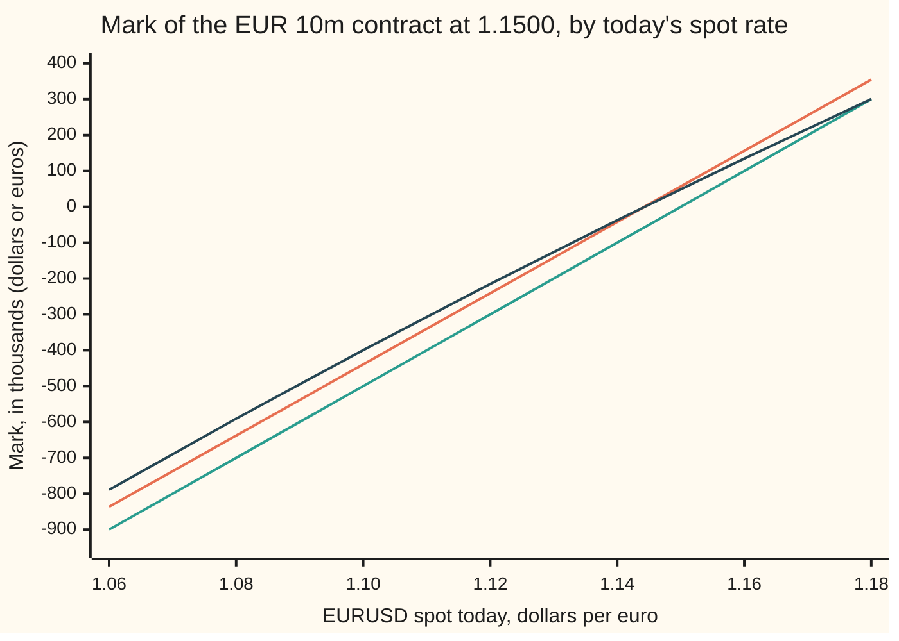

# Valuing an old currency forward: the gap to today's forward, discounted, in whichever currency you count

[Syllabus](../../../SYLLABUS.md) → [Financial mathematics](../README.md) → [FX spot, forwards and interest parity](../README.md#s20) → Valuing an old currency forward

---

## General Overview

A year ago a US importer agreed to buy 10 million euros from its bank, for delivery fifteen months later, at 1.1500 dollars per euro. That agreement is an **FX forward** ([Covered interest parity](02-covered-interest-parity.md)). Nothing was paid on the day. The rate, 1.1500, was the fair forward rate that morning, so the contract was worth nothing to either side.

Today three months are left. The euro costs 1.1000 dollars for delivery now, the **spot rate**. A new three-month forward is quoted at 1.1055. The importer is locked into paying 1.1500 for euros that anyone else can contract for at 1.1055. The contract has become a liability.

How big? Not 445,000 dollars, the gap times 10 million: that gap is paid on delivery day, three months off, and a dollar then is worth less than a dollar now. Discounted at the dollar rate, the contract is worth **−439,472.12 dollars** today. That figure is its **mark**: what it would cost to walk away this afternoon.

Currencies add one question a share forward never raises. The importer's European parent keeps its books in euros. Counted in euros, the same contract is worth **−399,520.11 euros**, which is the dollar mark divided by today's spot rate. Divide by the forward rate or the contract rate instead and the books are wrong by thousands.

**An old currency forward is worth the gap between today's forward rate and its own rate, times the euro amount, discounted at the dollar rate; counted in euros, it is that same value divided by today's spot rate.**

**What kind of fact this is:** a theorem, proved on this card in Why it works, inside the covered-interest-parity model set out under When it holds. No forecast of the euro appears in it.

### The picture: the mark against today's spot rate



Orange: the mark in thousands of dollars with three months left. Green: what the contract pays on delivery day if spot is still there, in thousands of dollars. Dark blue: the three-month mark counted in thousands of euros. The dollar lines are straight: each pip of spot (0.0001 dollars per euro) is worth the same. The euro line bends, because it divides by the spot rate as well. The two three-month lines cross zero at spot 1.144279, where today's forward would equal the contract's 1.1500.

---

## The formula

Notation first, in words. A small letter written low labels a currency: $r_d$ is the **domestic** rate, on the currency the prices are counted in (dollars); $r_f$ is the **foreign** rate, on the currency being bought (euros). Both are continuously compounded: a deposit of 1 grows to $e^{r\tau}$ over $\tau$ years. A subscript $t$ means "as of today"; $T$ is delivery day; $\tau = T - t$ is the years left.

$$V_d = A\,(F_t - K)\,e^{-r_d \tau}$$

**Read it aloud: the dollar value of the contract is the euro amount, times today's forward rate minus the contract rate, shrunk back from delivery day at the dollar rate.**

Counted in euros:

$$V_f = \frac{V_d}{S_t} = A\left(1 - \frac{K}{F_t}\right)e^{-r_f \tau}$$

**Read it aloud: the euro value is the dollar value at today's spot rate; equivalently, the euros bought minus the euros the owed dollars are worth forward, shrunk back at the euro rate.**

| Symbol | Plain meaning | In our example | Push it up and the mark… |
| --- | --- | --- | --- |
| $A$ | euro amount bought under the contract (negative if sold) | 10,000,000 | grows in size, same sign |
| $K$ | contract rate: dollars per euro written in the contract | 1.1500 | falls: more dollars owed |
| $F_t$ | today's forward rate for the same delivery day | 1.1055 | rises, by 987.58 dollars per pip |
| $S_t$ | today's spot rate, dollars per euro | 1.1000 | rises (with both interest rates held) |
| $S_T$ | spot rate on delivery day | unknown today | does not appear |
| $r_d$ | dollar interest rate, continuously compounded | 5% | rises, with spot held: the forward climbs |
| $r_f$ | euro interest rate, continuously compounded, as the quote implies | 3.0050% | falls, with spot held: the forward drops |
| $\tau$, with $T$ and $t$ | years left to delivery, $\tau = T - t$ | 0.25 | moves the mark toward its delivery value |
| $e^{-r_d \tau}$, $e^{-r_f \tau}$ | discount factors D(T): today's value of one dollar, or one euro, due on delivery day | 0.987578, 0.992516 | |
| $V_d$, $P$ | the mark counted in dollars; $P$ is any trial price for the old contract, in the folded proof | −439,472.12 | (the answer) |
| $V_f$ | the mark counted in euros | −399,520.11 | (the answer, restated) |
| $A_i$, $K_i$, $F^*$ | a book's legs, each an amount and a contract rate; the forward rate at which the book is worth zero | +10m at 1.1500, −4m at 1.1300; 1.163333 | |

Two helper facts from the shelf. Today's forward obeys parity, $F_t = S_t\,e^{(r_d - r_f)\tau}$ ([Covered interest parity](02-covered-interest-parity.md)). Solved for the euro rate, it gives the rate the quote implies: $r_f = r_d - \ln(F_t/S_t)/\tau$, which is 3.0050% here. The shelf's house rates, 5% and 3%, give a three-month forward of 1.105514; the market quotes it to the pip as 1.1055, and 3.0050% is the euro rate that rounded quote carries. Reading the rate out of a quote is the job of [The interest rate a forward implies](05-implied-yield-and-cross-currency-basis.md).

**Conventions verified 27 Sep 2026:** EURUSD is quoted in dollars per euro; a pip is 0.0001 dollars per euro; outright forwards are quoted to the pip, as spot plus forward points ([Forward points and the FX swap](03-forward-points-and-fx-swaps.md)). Markets could change these; the formula does not care, provided the rate and its quoting unit travel together.

### When it holds

- **The contract and the new forward settle on the same day, both sides deliver.** Then the close-out below leaves a sure sum. If the bank might default, the sum is not sure, and the mark needs a charge for that risk ([An old forward](../03-Contracts%20and%20No-Arbitrage/04-forward-value-after-inception.md) marks the default-free case).
- **One dollar rate to discount with, for exactly the time left.** A three-month dollar rate discounts a three-month sum. Borrowing dearer than lending opens a narrow band around −439,472.12, not a different answer.
- **Parity links spot, forward and the two rates.** The dollar formula needs only $F_t$ and $r_d$. The euro restatement at spot needs parity to hold between the quote and the euro rate used. Where banks' funding costs split the two (the cross-currency basis), take the euro discount from the forward, as Step 3 does, not from a euro deposit rate.
- **A forward, not a future.** A future settles each day's gain in cash and restarts at zero, so its mark is not this number.

---

## Why it works

### Step 0: an old promise is cancelled by a new opposite one that costs nothing

The importer need not guess where the euro goes. It can sign a second forward today: sell 10 million euros to the bank for the same delivery day at today's rate, 1.1055. A new forward at today's rate costs nothing to sign. The two contracts together leave the importer with no euros coming or going, and one dollar sum fixed today. So the old contract is worth exactly what that fixed sum is worth.

### Step 1: the cancelling ledger

| Leg | Dollars on delivery day | Euros on delivery day |
| --- | --- | --- |
| Old contract: buy EUR 10m at 1.1500 | −11,500,000 | +10,000,000 |
| New contract: sell EUR 10m at 1.1055 | +11,055,000 | −10,000,000 |
| **Net** | **−445,000** | **0** |

The euros cancel. The net is fixed this morning, whatever spot does by delivery: $A(F_t - K)$, or −0.0445 dollars per euro. The spot rate on delivery day, $S_T$, appears nowhere.

### Step 2: a sure dollar sum is worth its dollar-discounted value

A sum of dollars due in three months is worth today what a dollar deposit needs to hold now to reach it. Three months at 5% grows a deposit by a factor of 1.012578, so the sum is worth −445,000 divided by that factor today, which is −445,000 × $e^{-0.0125}$ = −439,472.12. That is the formula, with 0.987578 as the dollar discount factor. The check reaches the same figure a second way, by compounding a dollar deposit in 100,000 small steps instead of using the exponential.

The rate is the dollar rate because the sum is in dollars. The euro rate never touches it.

<details>
<summary>Detailed proof: why any other price for the old contract gives free money</summary>

Let $P$ be a price at which the old contract changes hands today, in dollars paid to its holder. A buyer who pays $P$, signs the offsetting forward at $F_t$, and deposits or borrows dollars to meet the fixed net sum ends with nothing on delivery day. That sum, $A(F_t - K)$, is met by a deposit of $A(F_t - K)e^{-r_d\tau}$ today (a loan, when negative), so the buyer's whole position costs $P - A(F_t - K)e^{-r_d\tau}$ today and pays nothing later.

If $P$ were below $A(F_t - K)e^{-r_d\tau}$, buying the contract and running this recipe would pay the gap today and owe nothing, riskless: buyers would bid $P$ up. If $P$ were above it, the holder would run the recipe itself instead of selling, and a seller of a copy (the recipe run in reverse) would pocket the gap: $P$ falls. Only $P = A(F_t - K)e^{-r_d\tau}$ leaves no free money. Nothing in the argument used the spot rate on delivery day or its spread.

</details>

### Step 3: counting in euros gives the same value, divided by spot

A euro-based parent could run the same ledger in euros. The old contract owes 11,500,000 dollars on delivery day. Bought forward today at 1.1055, each dollar owed per euro costs 1.1500 ÷ 1.1055 = 1.040253 euros on that day: that ratio is $K/F_t$. Against the 10,000,000 euros the contract delivers, the net is 10,000,000 × (1 − 1.1500 ÷ 1.1055) = −402,532.79 euros on delivery day, fixed today. A sure euro sum discounts at the euro rate, 3.0050%: times $e^{-r_f\tau}$ = 0.992516, it gives **−399,520.11 euros**.

That is the dollar mark divided by 1.1000, to the cent. The reason is parity. Parity says $F_t e^{-r_d\tau} = S_t e^{-r_f\tau}$: one euro delivered forward costs the same today by either route. Substitute it into the euro value:

$$A\left(1 - \frac{K}{F_t}\right)e^{-r_f\tau} = \frac{A(F_t - K)}{F_t}\,e^{-r_f\tau} = \frac{A(F_t - K)\,e^{-r_d\tau}}{S_t} = \frac{V_d}{S_t}.$$

So a value today converts at today's exchange rate, spot. The forward rate converts delivery-day money; the contract rate converts nothing at all. This is the FX-specific point of the card: the mark has one size, and two currencies to state it in, linked by spot.

### Step 4: where the volatility went

The euro's jumpiness does not appear. The contract pays $A(S_T - K)$ dollars on delivery day, a straight line in $S_T$. In the pricing world, the pretend world in which a euro deposit, counted in dollars, earns exactly the dollar rate ([State prices](../03-Contracts%20and%20No-Arbitrage/07-state-prices-and-risk-neutral-pricing-in-one-period.md)), the average of $S_T$ is the forward rate. So the average payoff is $A(F_t - K)$, whatever the spread around it. The check averages the payoff over a bell curve on the log of $S_T$, by Simpson's rule (a weighted sum of samples that approximates an integral), at 8% and at 16% volatility. Both give −439,472.12.

### Step 5: the rate at which a book is flat

A treasurer rarely holds one forward. Say the importer later also sold 4 million euros for the same delivery day at 1.1300. The book has legs $A_i$ at rates $K_i$: +10,000,000 at 1.1500 and −4,000,000 at 1.1300. Each leg's mark is Step 2 again, so the book is worth

$$e^{-r_d\tau}\sum_i A_i\,(F_t - K_i),$$

which at 1.1055 is −342,689.50 dollars. As a function of the forward rate this is a straight line with slope $e^{-r_d\tau}\sum_i A_i$.

Before solving for the flat rate, when does one exist?

- **Net euro amount not zero.** Exactly one flat rate: $F^* = \sum_i A_i K_i \big/ \sum_i A_i$, the amount-weighted average of the contract rates. Here (10,000,000 × 1.1500 − 4,000,000 × 1.1300) ÷ (10,000,000 − 4,000,000) = 1.163333. The book gains above it and loses below it, since it is net long euros.
- **Net euro amount zero.** The line is flat. The book is then a fixed dollar sum: worth zero at every forward rate if the weighted rates also cancel, and at none if they do not. No rate can rescue it.
- **A flat rate at or below zero.** It solves the equation but is no exchange rate: the book then keeps one sign at every positive rate.

The check finds 1.163333 a second way, by bisection: halve an interval of forward rates eighty times, keeping the half where the book's value changes sign. For the single contract, the spot rate at which it is flat is $K e^{-(r_d - r_f)\tau}$ = 1.144279, the crossing in the overview chart.

The general version of all this, for a share with a dividend yield, is [An old forward](../03-Contracts%20and%20No-Arbitrage/04-forward-value-after-inception.md); the euro rate plays the dividend yield's part.

---

## Worked numbers, by hand

EUR 10,000,000 bought at 1.1500; three months left; spot 1.1000; three-month forward 1.1055; dollar rate 5%.

| Step | Arithmetic | Value |
| --- | --- | --- |
| gap per euro, $F_t - K$ | 1.1055 − 1.1500 | −0.0445 |
| net on delivery day | −0.0445 × 10,000,000 | −445,000.00 dollars |
| dollar discount, $e^{-r_d\tau}$ | $e^{-0.05 \times 0.25} = e^{-0.0125}$ | 0.987578 |
| per euro today | −0.0445 × $e^{-0.0125}$ | −0.043947 dollars |
| **mark in dollars** | −445,000 × $e^{-0.0125}$ | **−439,472.12 dollars** |
| **mark in euros** | −439,472.12 ÷ 1.1000 | **−399,520.11 euros** |
| cross-check: implied euro rate | 0.05 − ln(1.1055/1.1000) ÷ 0.25 = 0.05 − 0.019950 | 3.0050% |
| cross-check: euro discount | $e^{-0.030050 \times 0.25}$ | 0.992516 |
| cross-check: euros on delivery day | 10,000,000 − 11,500,000 ÷ 1.1055 | −402,532.79 euros |
| cross-check: mark in euros | −402,532.79 × $e^{-0.030050 \times 0.25}$ | −399,520.11 euros |

To leave the contract today, the importer pays its bank 439,472.12 dollars, or 399,520.11 euros at spot. Or it signs the offsetting forward and pays 445,000 dollars on delivery day. Those are the same cost at two dates.

### What breaks if you drop a piece

Correct: −439,472.12 dollars, −399,520.11 euros.

| Mistake | Comes out at | What went wrong |
| --- | --- | --- |
| No discount | −445,000.00 dollars | Charged today for a sum due in three months |
| Discounted at the euro rate | −441,669.48 dollars | The sum is in dollars; the euro rate discounts euros |
| Spot in place of the forward | −493,788.90 dollars | Compared today's price with a delivery-day price |
| Restated at the forward rate | −397,532.45 euros | Converted a today value at a delivery-day rate |
| Restated at the contract rate | −382,149.67 euros | 1.1500 is a term of the contract, not a market rate |

---

## How the mark moves

The euro stays at 1.1000 for three months. Nothing happens in the market. The mark still slides from −439,472.12 to −500,000.00 dollars. Two things change with the calendar alone: the forward rate converges to spot, since the interest gap has less time to work, and the discount on the sum fades to one.

### One force at a time: the clock, with spot frozen at 1.1000

```
months left   mark, thousands of dollars (bar = size of the loss)
     3        ███████████████████████████████████      -439.47
     2        █████████████████████████████████████    -459.52
     1        ██████████████████████████████████████   -479.69
     0        ████████████████████████████████████████ -500.00
```

At zero months the mark is the payoff: 10,000,000 × (1.1000 − 1.1500). The drift is the carry. In spot form the contract is a euro deposit earning 3.0050% against a loan of about 11.4 million dollars at 5%. The loan's interest outruns the deposit's by about 20,000 dollars a month.

The other force, spot moving, is the overview chart: the three-month dollar mark moves 992.52 dollars per pip of spot, the slope of the orange line.

### How the mark answers a nudge

| Nudge | Change in the mark | Formula |
| --- | --- | --- |
| forward rate up one pip, rates held | +987.58 dollars | $A\,e^{-r_d\tau} \times 0.0001$ |
| spot up one pip, both rates held | +992.52 dollars | $A\,e^{-r_f\tau} \times 0.0001$ |
| dollar rate up one basis point (0.01%), spot held | +283.93 dollars | $A\,K\,\tau\,e^{-r_d\tau} \times 0.0001$ |
| euro rate up one basis point, spot held | −272.94 dollars | $-A\,S_t\,\tau\,e^{-r_f\tau} \times 0.0001$ |
| spot up one pip, mark counted in euros | +938.61 euros | $A\,K\,e^{-r_d\tau}/S_t^2 \times 0.0001$ |

The checks confirm each slope by nudging the rate both ways and halving the difference. The last row is the two-currency point again: the euro-counted mark moves with spot not by $A\,e^{-r_f\tau}$, a flat 10 million euros' worth, but by the contract's dollar leg divided by spot squared, because spot now sits in the denominator.

---

## Code, from first principles, and it actually runs

The scripts price the contract five ways that share no shortcut. The formula. A close-out whose fixed dollar sum is discounted by compounding a deposit in 100,000 steps. A ledger run entirely in euros, discounted at the euro rate the quote implies. A pricing-world average of the payoff by Simpson's rule at two volatilities. And a bisection for the book's flat rate against the weighted-average formula. They also rebuild every sensitivity by nudging, and print every wrong answer in the table above and every value in both charts. Nine asserts compare independent roads; a tenth ties the quote to the house forward. Breaking the maths fails an assert.

### Python

```python
# Valuing an old currency forward -- the check behind the card.  Standard
# library only.  Nothing imported holds the answer: the pricing-world average
# is Simpson's rule written out, the discount is also rebuilt by compounding a
# deposit step by step, and the flat rate of a book is found by bisection.
# A year ago: bought EUR 10,000,000 for delivery in 15 months at 1.1500 USD/EUR.
# Today: three months left, spot 1.1000, three-month forward quoted 1.1055.
from math import exp, log, sqrt, pi

A, K, tau = 10_000_000.0, 1.1500, 0.25     # euros bought, contract rate, years left
S, F, rd = 1.1000, 1.1055, 0.05            # spot, today's forward quote, dollar rate
rf = rd - log(F / S) / tau                 # euro rate the quote implies (parity)
F_house = S * exp((rd - 0.03) * tau)       # the shelf's house forward at 3% euros
Dd, Df = exp(-rd * tau), exp(-rf * tau)    # discount factors, dollars and euros

def mark_usd(s, t, a=A, k=K):              # spot form: euros on deposit minus dollar loan
    return a * (s * exp(-rf * t) - k * exp(-rd * t))

# Road 1: the formula, gap to today's forward discounted at the dollar rate
per_eur = (F - K) * Dd
V_usd = A * per_eur
V_eur = V_usd / S                          # restated at today's spot
# Road 2: close out.  Sell EUR 10m forward at 1.1055: the euros cancel and a
# fixed dollar sum is left for delivery day.  Discount it by compounding a
# dollar deposit in 100,000 small steps instead of calling exp.
locked = A * F - A * K
grow = 1.0
for _ in range(100_000):
    grow *= 1.0 + rd * tau / 100_000
V_close = locked / grow
# Road 3: count in euros from the start.  The dollars owed at delivery, turned
# into euros at the forward, then discounted at the euro rate.
locked_eur = A - A * K / F
V_eur_road = locked_eur * Df
# Road 4: the pricing-world average of the payoff, by Simpson, at two vols
def by_simpson(vol, n=4000):
    lo, hi = -10.0, 10.0
    h = (hi - lo) / n
    def f(z):
        ST = S * exp((rd - rf - 0.5 * vol * vol) * tau + vol * sqrt(tau) * z)
        return (ST - K) * exp(-0.5 * z * z) / sqrt(2.0 * pi)
    tot = f(lo) + f(hi)
    for i in range(1, n):
        tot += (4 if i % 2 else 2) * f(lo + i * h)
    return A * exp(-rd * tau) * tot * h / 3.0
V_simp8, V_simp16 = by_simpson(0.08), by_simpson(0.16)
# Road 5: sensitivities by formula, then by nudging the spot form
pip, bp = 0.0001, 0.0001
dF_pip = A * Dd * pip
dS_pip = A * Df * pip
dS_bump = (mark_usd(S + pip, tau) - mark_usd(S - pip, tau)) / 2.0
drd_bp = A * K * tau * Dd * bp
rd_bump = (A * K * exp(-(rd - bp) * tau) - A * K * exp(-(rd + bp) * tau)) / 2.0
drf_bp = -A * S * tau * Df * bp
rf_bump = (A * S * exp(-(rf + bp) * tau) - A * S * exp(-(rf - bp) * tau)) / 2.0
eur_dS = A * K * Dd / (S * S) * pip        # the euro-counted mark moves too
eur_bump = (mark_usd(S + pip, tau) / (S + pip) - mark_usd(S - pip, tau) / (S - pip)) / 2.0
# The book: long EUR 10m at 1.1500, short EUR 4m at 1.1300, same delivery day
legs = [(10_000_000.0, 1.1500), (-4_000_000.0, 1.1300)]
def book(f): return sum(a * (f - k) for a, k in legs) * Dd
F_flat = sum(a * k for a, k in legs) / sum(a for a, _ in legs)
lo, hi = 0.5, 2.0                          # bisection: value rises with f, one root
for _ in range(80):
    mid = 0.5 * (lo + hi)
    lo, hi = (mid, hi) if book(mid) < 0 else (lo, mid)
S_flat = K * exp(-(rd - rf) * tau)         # spot at which the single contract is flat

rows = [("house forward, 3% euros", F_house), ("forward premium ln(F/S)/tau", log(F / S) / tau),
        ("implied euro rate", rf), ("gap F - K", F - K), ("K / F", K / F),
        ("dollar discount", Dd), ("euro discount", Df),
        ("1 per euro, USD", per_eur), ("1 mark, USD", V_usd), ("  restated, EUR", V_eur),
        ("2 USD paid, old contract", A * K),
        ("  USD received, new contract", A * F), ("  locked at delivery, USD", locked), ("  compounded deposit", grow),
        ("  close-out today, USD", V_close), ("3 locked at delivery, EUR", locked_eur),
        ("  counted in euros, EUR", V_eur_road), ("4 Simpson, vol 8%, USD", V_simp8),
        ("  Simpson, vol 16%, USD", V_simp16), ("5 per pip of forward, USD", dF_pip),
        ("  per pip of spot, USD", dS_pip), ("  by bump", dS_bump),
        ("  per bp dollar rate, USD", drd_bp), ("  by bump", rd_bump),
        ("  per bp euro rate, USD", drf_bp), ("  by bump", rf_bump),
        ("  EUR mark per pip of spot", eur_dS), ("  by bump", eur_bump),
        ("6 book value, USD", book(F)), ("  flat forward, weights", F_flat),
        ("  flat forward, bisection", hi), ("  flat spot, one contract", S_flat),
        ("wrong: no discount", locked), ("wrong: euro discount", A * (F - K) * Df),
        ("wrong: spot for forward", A * (S - K) * Dd),
        ("wrong: to EUR at forward", V_usd / F), ("wrong: to EUR at contract", V_usd / K)]
for name, v in rows:
    print(f"{name:<28} {v:>17.6f}")
print()
print("mark in thousands, by spot today (3 months left, at delivery, EUR count)")
for s in (1.06, 1.08, 1.10, 1.12, 1.14, 1.16, 1.18):
    print(f"spot {s:.2f}  {mark_usd(s, tau) / 1e3:9.2f}  {A * (s - K) / 1e3:9.2f}"
          f"  {mark_usd(s, tau) / s / 1e3:9.2f}")
print("mark in thousands USD, spot stuck at 1.1000, by months left")
for m in (3, 2, 1, 0):
    print(f"months {m}  {mark_usd(S, m / 12.0) / 1e3:9.2f}")

assert abs(V_close - V_usd) < 0.01, "close-out by compounding must match the formula"
assert abs(V_eur_road - V_eur) < 0.01, "counting in euros must match the dollar mark over spot"
assert abs(V_simp8 - V_usd) < 0.01, "pricing-world average must match, vol 8%"
assert abs(V_simp16 - V_usd) < 0.01, "pricing-world average must match, vol 16%"
assert abs(dS_bump - dS_pip) < 1e-6, "spot nudge must match the spot slope"
assert abs(rd_bump - drd_bp) < 1e-3, "dollar-rate nudge must match its slope"
assert abs(rf_bump - drf_bp) < 1e-3, "euro-rate nudge must match its slope"
assert abs(eur_bump - eur_dS) < 1e-3, "euro-count nudge must match its slope"
assert abs(hi - F_flat) < 1e-12, "bisection must find the weighted delivery rate"
assert abs(round(F_house, 4) - F) < 1e-12, "the quote is the house forward rounded to the pip"
print("PASS")
```

**Ran 2026-09-27 on macOS, Python 3.14.6, standard library only. All checks passed. Output, pasted from the run:**

```
house forward, 3% euros               1.105514
forward premium ln(F/S)/tau           0.019950
implied euro rate                     0.030050
gap F - K                            -0.044500
K / F                                 1.040253
dollar discount                       0.987578
euro discount                         0.992516
1 per euro, USD                      -0.043947
1 mark, USD                     -439472.121220
  restated, EUR                 -399520.110200
2 USD paid, old contract       11500000.000000
  USD received, new contract   11055000.000000
  locked at delivery, USD       -445000.000000
  compounded deposit                  1.012578
  close-out today, USD          -439472.121567
3 locked at delivery, EUR       -402532.790592
  counted in euros, EUR         -399520.110200
4 Simpson, vol 8%, USD          -439472.121220
  Simpson, vol 16%, USD         -439472.121220
5 per pip of forward, USD           987.577800
  per pip of spot, USD              992.515689
  by bump                           992.515689
  per bp dollar rate, USD           283.928618
  by bump                           283.928618
  per bp euro rate, USD            -272.941815
  by bump                          -272.941815
  EUR mark per pip of spot          938.607000
  by bump                           938.607008
6 book value, USD               -342689.496771
  flat forward, weights               1.163333
  flat forward, bisection             1.163333
  flat spot, one contract             1.144279
wrong: no discount              -445000.000000
wrong: euro discount            -441669.481826
wrong: spot for forward         -493788.900247
wrong: to EUR at forward        -397532.447960
wrong: to EUR at contract       -382149.670626

mark in thousands, by spot today (3 months left, at delivery, EUR count)
spot 1.06    -836.48    -900.00    -789.13
spot 1.08    -637.98    -700.00    -590.72
spot 1.10    -439.47    -500.00    -399.52
spot 1.12    -240.97    -300.00    -215.15
spot 1.14     -42.47    -100.00     -37.25
spot 1.16     156.04     100.00     134.51
spot 1.18     354.54     300.00     300.46
mark in thousands USD, spot stuck at 1.1000, by months left
months 3    -439.47
months 2    -459.52
months 1    -479.69
months 0    -500.00
PASS
```

### Rust

```rust
// Valuing an old currency forward -- the check behind the card.  Rust std only.
// Nothing used holds the answer: the pricing-world average is Simpson's rule
// written out, the discount is also rebuilt by compounding a deposit step by
// step, and the flat rate of a book is found by bisection.
// A year ago: bought EUR 10,000,000 for delivery in 15 months at 1.1500 USD/EUR.
// Today: three months left, spot 1.1000, three-month forward quoted 1.1055.

const A: f64 = 10_000_000.0; // euros bought
const K: f64 = 1.1500; // contract rate, dollars per euro
const TAU: f64 = 0.25; // years left
const S: f64 = 1.1000; // spot today
const F: f64 = 1.1055; // today's three-month forward quote
const RD: f64 = 0.05; // dollar rate, continuously compounded

fn rf() -> f64 {
    RD - (F / S).ln() / TAU // euro rate the quote implies (parity)
}

// spot form: euros on deposit minus a dollar loan
fn mark_usd(s: f64, t: f64) -> f64 {
    A * (s * (-rf() * t).exp() - K * (-RD * t).exp())
}

// Road 4: the pricing-world average of the payoff, by Simpson's rule
fn by_simpson(vol: f64, n: usize) -> f64 {
    let (lo, hi) = (-10.0_f64, 10.0_f64);
    let h = (hi - lo) / n as f64;
    let f = |z: f64| {
        let st = S * ((RD - rf() - 0.5 * vol * vol) * TAU + vol * TAU.sqrt() * z).exp();
        (st - K) * (-0.5 * z * z).exp() / (2.0 * std::f64::consts::PI).sqrt()
    };
    let mut tot = f(lo) + f(hi);
    for i in 1..n {
        let w = if i % 2 == 1 { 4.0 } else { 2.0 };
        tot += w * f(lo + i as f64 * h);
    }
    A * (-RD * TAU).exp() * tot * h / 3.0
}

fn main() {
    let rf = rf();
    let f_house = S * ((RD - 0.03) * TAU).exp(); // the shelf's house forward at 3% euros
    let (dd, df) = ((-RD * TAU).exp(), (-rf * TAU).exp());

    // Road 1: the formula
    let per_eur = (F - K) * dd;
    let v_usd = A * per_eur;
    let v_eur = v_usd / S;
    // Road 2: close out, discount by compounding a deposit in 100,000 steps
    let locked = A * F - A * K;
    let mut grow = 1.0_f64;
    for _ in 0..100_000 {
        grow *= 1.0 + RD * TAU / 100_000.0;
    }
    let v_close = locked / grow;
    // Road 3: count in euros from the start
    let locked_eur = A - A * K / F;
    let v_eur_road = locked_eur * df;
    // Road 4: Simpson at two vols
    let (v_simp8, v_simp16) = (by_simpson(0.08, 4000), by_simpson(0.16, 4000));
    // Road 5: sensitivities by formula, then by nudging
    let (pip, bp) = (0.0001_f64, 0.0001_f64);
    let df_pip = A * dd * pip;
    let ds_pip = A * df * pip;
    let ds_bump = (mark_usd(S + pip, TAU) - mark_usd(S - pip, TAU)) / 2.0;
    let drd_bp = A * K * TAU * dd * bp;
    let rd_bump = (A * K * (-(RD - bp) * TAU).exp() - A * K * (-(RD + bp) * TAU).exp()) / 2.0;
    let drf_bp = -A * S * TAU * df * bp;
    let rf_bump = (A * S * (-(rf + bp) * TAU).exp() - A * S * (-(rf - bp) * TAU).exp()) / 2.0;
    let eur_ds = A * K * dd / (S * S) * pip;
    let eur_bump =
        (mark_usd(S + pip, TAU) / (S + pip) - mark_usd(S - pip, TAU) / (S - pip)) / 2.0;
    // The book: long EUR 10m at 1.1500, short EUR 4m at 1.1300, same delivery day
    let legs = [(10_000_000.0_f64, 1.1500_f64), (-4_000_000.0, 1.1300)];
    let book = |f: f64| legs.iter().map(|&(a, k)| a * (f - k)).sum::<f64>() * dd;
    let f_flat = legs.iter().map(|&(a, k)| a * k).sum::<f64>()
        / legs.iter().map(|&(a, _)| a).sum::<f64>();
    let (mut lo, mut hi) = (0.5_f64, 2.0_f64); // value rises with f: one root
    for _ in 0..80 {
        let mid = 0.5 * (lo + hi);
        if book(mid) < 0.0 { lo = mid } else { hi = mid }
    }
    let s_flat = K * (-(RD - rf) * TAU).exp();

    let rows: Vec<(&str, f64)> = vec![
        ("house forward, 3% euros", f_house), ("forward premium ln(F/S)/tau", (F / S).ln() / TAU),
        ("implied euro rate", rf), ("gap F - K", F - K), ("K / F", K / F),
        ("dollar discount", dd), ("euro discount", df),
        ("1 per euro, USD", per_eur), ("1 mark, USD", v_usd), ("  restated, EUR", v_eur),
        ("2 USD paid, old contract", A * K),
        ("  USD received, new contract", A * F), ("  locked at delivery, USD", locked), ("  compounded deposit", grow),
        ("  close-out today, USD", v_close), ("3 locked at delivery, EUR", locked_eur),
        ("  counted in euros, EUR", v_eur_road), ("4 Simpson, vol 8%, USD", v_simp8),
        ("  Simpson, vol 16%, USD", v_simp16), ("5 per pip of forward, USD", df_pip),
        ("  per pip of spot, USD", ds_pip), ("  by bump", ds_bump),
        ("  per bp dollar rate, USD", drd_bp), ("  by bump", rd_bump),
        ("  per bp euro rate, USD", drf_bp), ("  by bump", rf_bump),
        ("  EUR mark per pip of spot", eur_ds), ("  by bump", eur_bump),
        ("6 book value, USD", book(F)), ("  flat forward, weights", f_flat),
        ("  flat forward, bisection", hi), ("  flat spot, one contract", s_flat),
        ("wrong: no discount", locked), ("wrong: euro discount", A * (F - K) * df),
        ("wrong: spot for forward", A * (S - K) * dd),
        ("wrong: to EUR at forward", v_usd / F), ("wrong: to EUR at contract", v_usd / K),
    ];
    for (name, v) in &rows {
        println!("{:<28} {:>17.6}", name, v);
    }
    println!();
    println!("mark in thousands, by spot today (3 months left, at delivery, EUR count)");
    for s in [1.06_f64, 1.08, 1.10, 1.12, 1.14, 1.16, 1.18] {
        let m = mark_usd(s, TAU);
        println!("spot {:.2}  {:9.2}  {:9.2}  {:9.2}", s, m / 1e3, A * (s - K) / 1e3, m / s / 1e3);
    }
    println!("mark in thousands USD, spot stuck at 1.1000, by months left");
    for m in [3, 2, 1, 0] {
        println!("months {}  {:9.2}", m, mark_usd(S, m as f64 / 12.0) / 1e3);
    }

    assert!((v_close - v_usd).abs() < 0.01, "close-out by compounding must match the formula");
    assert!((v_eur_road - v_eur).abs() < 0.01, "counting in euros must match the dollar mark over spot");
    assert!((v_simp8 - v_usd).abs() < 0.01, "pricing-world average must match, vol 8%");
    assert!((v_simp16 - v_usd).abs() < 0.01, "pricing-world average must match, vol 16%");
    assert!((ds_bump - ds_pip).abs() < 1e-6, "spot nudge must match the spot slope");
    assert!((rd_bump - drd_bp).abs() < 1e-3, "dollar-rate nudge must match its slope");
    assert!((rf_bump - drf_bp).abs() < 1e-3, "euro-rate nudge must match its slope");
    assert!((eur_bump - eur_ds).abs() < 1e-3, "euro-count nudge must match its slope");
    assert!((hi - f_flat).abs() < 1e-12, "bisection must find the weighted delivery rate");
    assert!(((f_house * 1e4).round() / 1e4 - F).abs() < 1e-12, "the quote is the house forward rounded to the pip");
    println!("PASS");
}
```

**Ran 2026-09-27 on macOS, rustc 1.98.1, no crates. All checks passed. Output, pasted from the run:**

```
house forward, 3% euros               1.105514
forward premium ln(F/S)/tau           0.019950
implied euro rate                     0.030050
gap F - K                            -0.044500
K / F                                 1.040253
dollar discount                       0.987578
euro discount                         0.992516
1 per euro, USD                      -0.043947
1 mark, USD                     -439472.121220
  restated, EUR                 -399520.110200
2 USD paid, old contract       11500000.000000
  USD received, new contract   11055000.000000
  locked at delivery, USD       -445000.000000
  compounded deposit                  1.012578
  close-out today, USD          -439472.121567
3 locked at delivery, EUR       -402532.790592
  counted in euros, EUR         -399520.110200
4 Simpson, vol 8%, USD          -439472.121220
  Simpson, vol 16%, USD         -439472.121220
5 per pip of forward, USD           987.577800
  per pip of spot, USD              992.515689
  by bump                           992.515689
  per bp dollar rate, USD           283.928618
  by bump                           283.928618
  per bp euro rate, USD            -272.941815
  by bump                          -272.941815
  EUR mark per pip of spot          938.607000
  by bump                           938.607008
6 book value, USD               -342689.496771
  flat forward, weights               1.163333
  flat forward, bisection             1.163333
  flat spot, one contract             1.144279
wrong: no discount              -445000.000000
wrong: euro discount            -441669.481826
wrong: spot for forward         -493788.900247
wrong: to EUR at forward        -397532.447960
wrong: to EUR at contract       -382149.670626

mark in thousands, by spot today (3 months left, at delivery, EUR count)
spot 1.06    -836.48    -900.00    -789.13
spot 1.08    -637.98    -700.00    -590.72
spot 1.10    -439.47    -500.00    -399.52
spot 1.12    -240.97    -300.00    -215.15
spot 1.14     -42.47    -100.00     -37.25
spot 1.16     156.04     100.00     134.51
spot 1.18     354.54     300.00     300.46
mark in thousands USD, spot stuck at 1.1000, by months left
months 3    -439.47
months 2    -459.52
months 1    -479.69
months 0    -500.00
PASS
```

The two outputs agree line for line.

> [!TIP]
> **Try changing**
> - **Run the clock out.** Guess first: with spot still at 1.1000, what is the mark on delivery day? Read the `months 0` row, which calls `mark_usd(S, 0.0)`. Answer: −500.00 thousand dollars, the payoff itself; both discount factors are 1.
> - **Let the euro recover.** Guess first: is the contract an asset again at spot 1.16? Look at the `spot 1.16` row. Answer: yes, +156.04 thousand dollars, +134.51 thousand euros; it turned at 1.144279.
> - **Triple the jumpiness.** Guess first: does the Simpson road move at 24% volatility? Change `by_simpson(0.08)` to `by_simpson(0.24)`. Answer: no, −439,472.12 again: a straight-line payoff has no use for spread.
> - **Square the book.** Guess first: what does bisection find if the second leg sells 10,000,000 euros? Change `-4_000_000.0` to `-10_000_000.0`. Answer: the Python script stops at the weighted-average line with a division by zero. The net euro amount is zero, the book is a fixed dollar sum at every forward rate, and no flat rate exists: the boundary case of Step 5.

---

## The usual mistake

> [!warning]
> **Converting the mark at the wrong exchange rate.** The mark is a value today, so it converts at today's rate, spot. Converting −439,472.12 dollars at the forward 1.1055 gives −397,532.45 euros, and at the contract's 1.1500 gives −382,149.67 euros: both too small a loss. The forward converts delivery-day money; the contract rate converts nothing, since it is a term the market no longer offers.
>
> - **Discounting at the wrong currency's rate.** The dollar sum takes the dollar rate: the euro rate gives −441,669.48 dollars.
> - **Using spot where the forward belongs.** The gap is between two delivery-day rates: spot against the contract gives −493,788.90 dollars.
> - **Dropping the discount.** −445,000.00 dollars is delivery-day money, not today's.
> - **Getting the sign from the wrong side.** A firm that sold euros forward holds −10,000,000 in $A$; its mark at these rates is +439,472.12 dollars, the bank's mirror of the importer.

---

## Where you meet it in real life

- **Corporate hedge accounting.** A firm that hedges a euro bill with a forward carries the forward on its balance sheet at this mark, restated at spot into whichever currency it reports in, every quarter until the cash moves.
- **Unwinding a hedge early.** If the underlying bill is cancelled, the bank quotes a close-out: the dollar mark today, or the undiscounted sum on delivery day. The importer here pays 439,472.12 now or 445,000.00 in three months.
- **Collateral between banks.** Two dealers exchange collateral each day equal to the net mark of every forward between them, counted in the currency their agreement names.
- **A dealer's position report.** A book of forwards on one date collapses to a net euro amount and a flat rate, $F^*$: long euros above it, short below. The whole book's risk is one number and one level.
- **Swaps.** An FX swap is a spot trade and a forward reversing it; its forward leg is marked by this formula ([Forward points and the FX swap](03-forward-points-and-fx-swaps.md)).

> **Say it back**
> An old currency forward is cancelled by signing the opposite forward today at no cost, which leaves a fixed dollar sum on delivery day. That sum, discounted at the dollar rate, is the contract's value today. Counted in euros, the value is the same sum turned into euros at the forward and discounted at the euro rate, which equals the dollar value divided by today's spot. The euro's volatility does not enter, because the payoff is a straight line. A book of same-day forwards is flat at the amount-weighted average of its contract rates, when its net euro amount is not zero.

---

## What this builds on

- [Forward points and the FX swap](03-forward-points-and-fx-swaps.md): how the three-month forward rate is quoted, as spot plus points, and the offsetting trade that closes a forward.
- [An old forward](../03-Contracts%20and%20No-Arbitrage/04-forward-value-after-inception.md): the one-currency mark, the discounted gap, proved for a share; this card adds the second currency.

---

## Where this goes next

- [Commodity swap](../27-Averages%20-%20commodity%20swaps%20and%20Asian%20options/01-commodity-swap-and-average-price-forward.md): a row of forwards at one shared price, one per payment date, marked leg by leg with this card's discounted gap and summed.

This card marks forwards that all settle on one day; the open question is how to value and find the flat price of a contract whose legs settle on many days, which is what the commodity swap answers.

---

## Sources

Verified 27 Sep 2026: every link below resolves to the publisher's page.

- Hull, John C. *Options, Futures, and Other Derivatives*, 11th ed. Pearson. [Publisher page](https://www.pearson.com/en-us/subject-catalog/p/options-futures-and-other-derivatives/P200000005938). The value of a forward after inception, and its currency version with the foreign rate in the dividend yield's place.
- Garman, Mark B., and Steven W. Kohlhagen. "Foreign Currency Option Values." *Journal of International Money and Finance* 2, no. 3 (1983): 231–237. [doi:10.1016/S0261-5606(83)80001-1](https://doi.org/10.1016/S0261-5606(83)80001-1). Treats the foreign rate as a yield on the foreign currency; its zero-volatility case is this card's formula.
- Clark, Iain J. *Foreign Exchange Option Pricing: A Practitioner's Guide*. Wiley, 2011. [doi:10.1002/9781119208679](https://doi.org/10.1002/9781119208679). Market conventions for FX forwards, and the choice of currency a value is stated in.
- Baxter, Martin, and Andrew Rennie. *Financial Calculus: An Introduction to Derivative Pricing*. Cambridge University Press, 1996. [doi:10.1017/CBO9780511806636](https://doi.org/10.1017/cbo9780511806636). The foreign-exchange section works the same claim priced from both currencies' sides.
