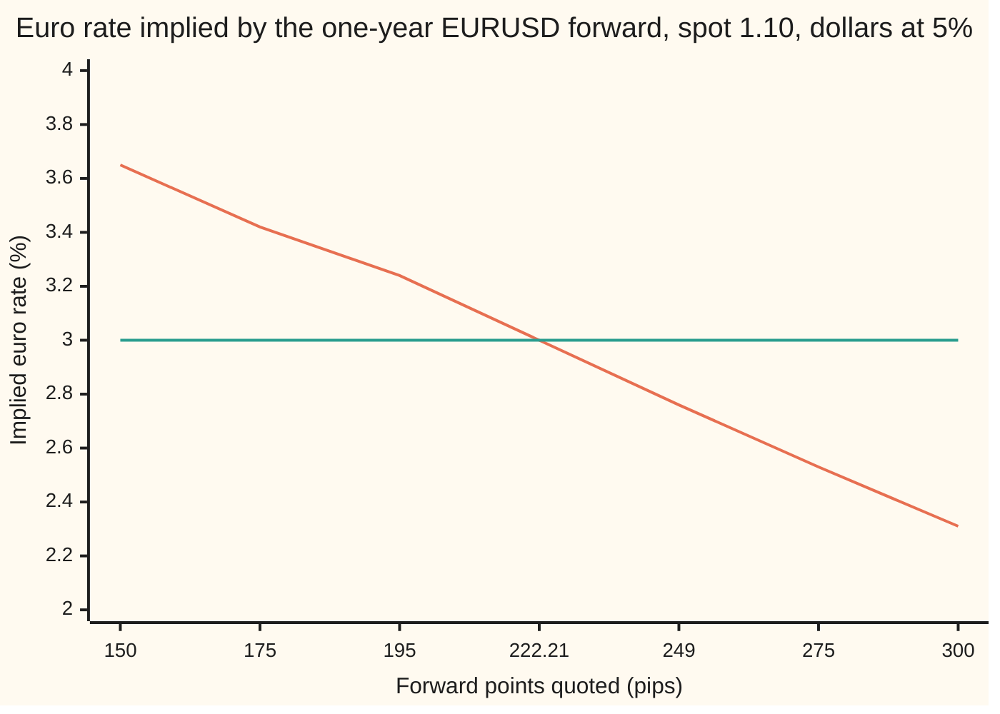

# The interest rate a forward implies: parity run backwards, and the cross-currency basis where the market says no

[Syllabus](../../../SYLLABUS.md) → [Financial mathematics](../README.md) → [FX spot, forwards and interest parity](../README.md#s20) → The interest rate a forward implies

---

## General Overview

One euro costs 1.10 dollars today. A dollar deposit pays 5 percent a year. A bank screen shows the one-year EURUSD forward at **+222.21 pips**. A pip is one ten-thousandth of a dollar per euro, so the rate agreed today for swapping euros and dollars in a year is 1.10 plus 0.022221: 1.122221 dollars per euro.

Covered interest parity turned two deposit rates into that forward. This card runs the machine the other way. Feed in the spot rate, the forward and the dollar rate, and out comes the euro rate the forward is charging: **3.000 percent**, the house euro rate, to the quote's precision. The forward already contains an interest rate. Solving for it is called reading the **implied yield**.

Now a different screen. The forward shows **+195 pips**, not +222.21. Run the same machine: the euro rate built into that forward is **3.24 percent**, while a euro deposit pays 3 percent. Or the forward shows **+249 pips**: the implied euro rate is **2.76 percent**. Either way the forward and the deposit disagree about what euros earn. The gap between the rate a forward implies and the rate a deposit pays has a name: the **cross-currency basis**. Before 2008 it was close to zero for the big currencies. Since 2008 it has sat tens of basis points (hundredths of a percent) away from zero for years at a time, with the sign of the +249 screen: borrowing dollars through the FX market costs more than borrowing them directly.

**A forward is an interest rate in disguise: solve parity for the rate it hides, compare that rate with what a deposit pays, and the gap, the cross-currency basis, is the price the market puts on getting one currency by swapping for it instead of borrowing it.**

**What kind of fact this is:** a method: parity solved for a rate, with existence and uniqueness proved on this card in Why it works. The basis it reveals is a fact of the market since 2008, measured, not derived.

### The picture: one forward, one implied rate



The falling line is the euro rate each forward quote implies. The flat line is the euro deposit rate, 3 percent. They cross at +222.21 pips, the house forward, where the basis is zero. Left of the crossing the forward implies euros earn more than a deposit pays; right of it, less. More points mean a lower implied euro rate: a forward that climbs further above spot says the dollar side earns more relative to the euro side.

---

## The formula

Notation, in words first. $r_d$ and $r_f$ are the dollar and euro deposit rates, continuously compounded, as on [Covered interest parity](02-covered-interest-parity.md). The letter y in place of r marks a rate **read out of a forward** rather than paid by a deposit: $y_f$ is the implied euro yield, $y_d$ the implied dollar yield. $\ln$ is the natural logarithm, the power the number e must be raised to ([Natural log and doubling time](../../01-Foundations/04-Compound%20Growth%20and%20Discounting/05-natural-log-and-doubling-time.md)).

Parity says $F = S\,e^{(r_d - r_f)T}$. Solved for the euro rate:

$$y_f = r_d - \frac{\ln(F/S)}{T}$$

**Read it aloud: the euro rate a forward implies is the dollar rate, minus the forward's premium over spot, turned into a rate per year.**

Solved for the dollar rate instead, with the euro rate known:

$$y_d = r_f + \frac{\ln(F/S)}{T}$$

And the basis, the gap the inverse reveals:

$$b = y_f - r_f = r_d - y_d$$

In words: the basis is how much more the forward pays on euros than a euro deposit does; equivalently, how much less the forward charges for dollars than a dollar loan does. The two readings are the same number because both come from one forward.

| Symbol | Plain meaning | In our example | Push it up and the implied rate… |
| --- | --- | --- | --- |
| $S$ | spot rate: dollars for one euro, swapped today | 1.10 | $y_f$ rises: the same forward is now a smaller premium over spot |
| $F$ | forward rate: dollars for one euro, agreed today, swapped at $T$ | 1.1249 (+249 pips) | $y_f$ falls, $y_d$ rises |
| $T$ | years until delivery | 1 | the premium is spread over more years, so each pip moves the rate less |
| $r_d$ | dollar deposit rate, per year, continuously compounded | 5% | $y_f$ rises one for one |
| $r_f$ | euro deposit rate, same basis | 3% | $y_d$ rises one for one; $y_f$ does not move |
| $y_f$ | implied euro yield: the euro rate the forward charges | 2.761604% | (the answer) |
| $y_d$ | implied dollar yield: the dollar rate the forward charges, also called the synthetic dollar rate | 5.238396% | (the answer, dollar side) |
| $b$ | cross-currency basis: $y_f - r_f$, in basis points | −23.84 bp | (the gap the inverse reveals) |
| $\ln(F/S)$ | the forward premium: how far the forward sits above spot, as a continuously compounded growth | 0.022384 | |
| $g$ and $y$ | the forward as a function of a trial euro rate $y$, used in the proof | $g(0.03) = 1.122221$ | $g$ falls as $y$ rises |
| pip | 0.0001 dollars per euro; forward points are $F - S$ counted in pips | 249 | |
| bp | basis point: 0.01 percent, a hundredth of a percent | | |

**Conventions verified 27 Sep 2026:** EURUSD is quoted in dollars per euro and a pip on it is 0.0001. The basis sign on this card is the one Du, Tepper and Verdelhan use: negative means dollars cost more through the FX market than in the dollar money market. Quote screens for cross-currency basis swaps use the same sign for EURUSD. Markets could change these; the algebra does not care, provided the sign travels with the number.

### Before solving: does an answer exist, and is it the only one?

- **Existence.** For any positive spot $S$, any positive forward $F$ and any positive term $T$, there is a rate $y_f$ that makes parity hold. It can be negative. A forward of +700 pips over one year implies a euro rate of −1.17 percent, and euro deposit rates were in fact below zero from 2014 to 2022.
- **Uniqueness.** There is exactly one such rate. A higher euro rate always gives a lower forward, so no two euro rates can give the same forward.
- **Boundaries.** $F = S$ gives $y_f = r_d$: no points, no rate gap. $F \le 0$ or $S \le 0$ has no answer; neither can happen on a real screen. As $T$ shrinks to zero the formula divides by nearly nothing, so any error in the points is magnified into the rate (the section after Worked numbers counts it).

### When it holds

- **A clean, same-moment quote.** A stale forward against a fresh spot, or a mid mixed with a bid, gives a rate nobody can trade, and the error scales as one over $T$.
- **Rates for exactly the forward's term, on one compounding basis.** The dollar rate must be the one-year rate for a one-year forward, continuously compounded. Money-market quotes (simple interest over a day count, as on [Covered interest parity](02-covered-interest-parity.md)) must be converted first, or a few basis points of fake basis appear.
- **The deposit rate compared is one the same bank can actually use.** A basis measured against a rate the trader cannot borrow at is not a price anyone can capture. Du, Tepper and Verdelhan measure against interbank and overnight-index rates for that reason.
- **Parity itself.** The solve is exact algebra. Whether the implied rate *should* equal the deposit rate is covered parity's claim, and that claim is what the basis tests. When it fails, the solve still works; its answer is the market's rate, not the textbook's.

---

## Why it works

### Step 0: parity is one equation in five numbers

Covered interest parity ties together five numbers: spot, forward, term and two interest rates. Know any four and the fifth is forced. Desks usually trust the dollar rate most, dollar money markets being the deepest, and read the other currency's rate off the forward. This is what rearranging a formula ([Rearranging a formula](../../03-Algebra/01-Letters%20and%20Equations/03-rearranging-formulas.md)) is for.

### Step 1: undo the exponential with a logarithm

Start from parity with the unknown euro rate written $y_f$:

$$F = S\,e^{(r_d - y_f)T}.$$

Divide by $S$: $F/S = e^{(r_d - y_f)T}$. The unknown sits in an exponent. The natural logarithm undoes the exponential: $\ln(e^x) = x$ ([Logarithms](../../01-Foundations/03-Powers%2C%20Roots%20and%20Logarithms/05-logarithms.md)). Take it of both sides:

$$\ln(F/S) = (r_d - y_f)\,T.$$

Divide by $T$ and move $y_f$ across: $y_f = r_d - \ln(F/S)/T$. Solving for $y_d$ with $r_f$ known is the same two moves.

### Step 2: there is always exactly one answer

Picture the forward as a function of the euro rate: $g(y) = S\,e^{(r_d - y)T}$. Raise $y$ and the exponent falls, so $g$ falls. It never flattens and never turns back. As $y$ runs to very large values $g$ sinks toward zero; as $y$ runs to very negative values $g$ grows without limit. A curve that falls without a break from arbitrarily high to arbitrarily near zero crosses every positive height once and only once. So each positive forward belongs to exactly one euro rate.

<details>
<summary>Detailed proof</summary>

Fix $S > 0$, $T > 0$ and $r_d$. Let $g(y) = S\,e^{(r_d - y)T}$ for real $y$.
- **Strictly decreasing.** If $y_1 < y_2$ then $(r_d - y_1)T > (r_d - y_2)T$, and $e^x$ is strictly increasing, so $g(y_1) > g(y_2)$. Hence $g$ is one-to-one: at most one $y$ per forward.
- **Onto the positive numbers.** Given any $F > 0$, put $y^* = r_d - \ln(F/S)/T$, which is defined because $F/S > 0$. Then $g(y^*) = S\,e^{\ln(F/S)} = F$. So at least one $y$ per forward.
- **Nothing else.** If $F \le 0$ no $y$ works, because $g(y) > 0$ for every $y$. If $T = 0$ then $g(y) = S$ for every $y$: the forward carries no information about rates, and the inverse does not exist.

Together: for $S, F, T > 0$ the implied rate exists, is unique, and is given by the closed form. The code's second road finds the same number by halving an interval, which relies only on $g$ falling.

</details>

### Step 3: the implied rate is a rate someone can actually pay

The number $y_f$ is not only algebra. It is the rate on a loan built from spot and forward trades. Take the +249-pip screen. A bank borrows one euro at the 3 percent deposit rate, sells it spot for 1.10 dollars, and buys forward the 1.030455 euros it will owe in a year, at 1.1249. In a year it pays 1.159158 dollars for those euros. So it has borrowed 1.10 dollars today and repays 1.159158 dollars in a year. That is a dollar loan, made out of a euro loan and an FX swap (a spot trade and the opposite forward trade, booked together; see [Forward points and the FX swap](03-forward-points-and-fx-swaps.md)). Its rate is $\ln(1.159158/1.10) = 5.238396$ percent: the **synthetic dollar rate**, $y_d$.

A direct dollar loan costs 5 percent. The swap route costs 5.24 percent. Dollars are dearer through the FX market by 23.84 basis points.

### Step 4: the basis is the gap, and its sign says who pays

Define the basis as $b = y_f - r_f$. On the +249 screen, $y_f = 2.761604$ percent and $r_f = 3$ percent, so $b = -23.84$ bp. Step 3 reached the same number from the dollar side: $r_d - y_d = 5 - 5.238396 = -23.84$ bp. The two agree for a reason: $y_d = r_f + \ln(F/S)/T$ and $y_f = r_d - \ln(F/S)/T$ add up to $r_d + r_f$, so $y_f - r_f = r_d - y_d$ always.

Reading the sign:

- **Negative basis** (the +249 screen, and the market's normal state since 2008 for euro, yen and sterling against the dollar): the forward implies a *lower* euro rate than deposits pay, and a *higher* dollar rate than dollar loans charge. Dollars are dear through the FX market. Someone holding euros and needing dollars pays extra to swap for them.
- **Positive basis** (the +195 screen): the forward implies euros at 3.24 percent and dollars at 4.757198 percent. Dollars are *cheap* through the FX market by 24.28 bp.
- **Zero basis** (the +222.21 screen): covered interest parity holds.

### Why a negative basis survives

Step 3 is also an arbitrage: a trade that locks in profit with no risk. On the +249 screen a bank that can borrow dollars at 5 percent borrows 1.10 of them, buys one euro spot, deposits it at 3 percent, and sells the 1.030455 euros forward at 1.1249. In a year it receives 1.159158 dollars and repays 1.156398. Profit: 0.002760 dollars per euro, or 27,600.99 dollars on 10 million euros, whatever the euro does.

Before 2008 such profits were competed away; Frenkel and Levich found apparent ones vanished once transaction costs were counted. Since 2008 they persist. The trade is riskless but not free: it puts both a loan and a deposit on the bank's balance sheet, and capital rules charge for balance-sheet size whether the assets are risky or not. Borio and co-authors at the BIS and Du, Tepper and Verdelhan trace the basis to that cost, plus heavy one-way demand for dollars from non-US banks, insurers and borrowers hedging dollar assets. The basis is the price of scarce balance sheet, and it jumps around quarter ends, when many banks report their balance sheets.

The other road to an implied rate uses money-market quotes instead of continuous rates: solve $F = S\,(1 + R_d\tau)/(1 + R_f\tau)$ for the euro money-market rate, where $R_d\tau$ is simple interest over the deposit's day-count fraction. It gives the same rate in a different unit. Desks quote it that way; the conversion is on [Covered interest parity](02-covered-interest-parity.md).

---

## Worked numbers, by hand

Spot $S = 1.10$ dollars per euro, dollar rate $r_d = 5\%$, euro deposit rate $r_f = 3\%$, one year.

| Step | Arithmetic | Value |
| --- | --- | --- |
| house forward | $1.10 + 222.21 \times 0.0001$ | 1.122221 |
| its premium, $\ln(F/S)$ | $\ln(1.122221 / 1.10)$ | 0.020000 |
| house implied euro rate | $0.05 - 0.020000$ | 3.000042%, which is 3.000% to the quote's precision |
| market forward, +249 pips | $1.10 + 0.0249$ | 1.124900 |
| $F/S$ | $1.1249 / 1.10$ | 1.022636 |
| $\ln(F/S)$ | natural log of 1.022636 | 0.022384 |
| implied euro rate $y_f$ | $0.05 - 0.022384$ | 2.761604% |
| basis $b = y_f - r_f$ | $2.761604\% - 3\%$ | −23.84 bp |
| synthetic dollar rate $y_d$ | $0.03 + 0.022384$ | 5.238396% |
| same basis, dollar side | $5\% - 5.238396\%$ | **−23.84 bp** |
| the other screen, +195 pips: $\ln(1.1195/1.10)$ | natural log of 1.017727 | 0.017572 |
| its implied euro rate | $0.05 - 0.017572$ | 3.242802%, basis **+24.28 bp** |

The house forward gives back the house euro rate; the extra 0.000042 percentage points is rounding in "222.21 pips". The +249 screen says euros earn 2.76 percent through the forward while a deposit pays 3; dollars cost 5.24 percent through the swap while a loan charges 5. The three-month house forward, +55.14 pips, gives back 2.999918 percent: 3.000 again.

### What breaks if you drop a piece

Same +249 screen, correct answer 2.761604 percent and a basis of −23.84 bp:

| Mistake | Comes out at | What went wrong |
| --- | --- | --- |
| Sign flipped: $r_d + \ln(F/S)$ | 7.238396% | More points must mean a *lower* foreign rate; the flip reads the premium backwards |
| $T$ dropped, on the three-month house forward | 4.499979% (right: 3.00%) | A quarter's premium was read as a year's rate. Dividing by $T = 0.25$ multiplies it by four. |
| Points over spot used for the log, $(F - S)/S$ | 2.736364% | 2.5 bp off: $(F-S)/S$ is a simple return, 0.022636, not the continuous 0.022384. Enough to fake a tenth of the basis. |
| Basis taken as deposit minus implied | +23.84 bp | Right size, wrong sign: it now says dollars are cheap through the FX market when they are dear |

---

## Why short forwards give wild rates

The formula divides the forward premium by $T$. So a fixed error in the forward, one pip, becomes a rate error of about one pip over $F$ times one over $T$. Around the house forward for each term:

```
one pip of error in the forward, moved into the implied euro rate (basis points per pip)
  1 week    ██████████████████████████████████████████████  47.38
  1 month   ███████████                                     10.89
  3 months  ████                                             3.62
  1 year    █                                                0.89
```

A one-week forward quoted one pip off moves the implied euro rate by 47 basis points: twice the whole basis on the one-year screen. That is why short-dated basis readings are noisy.

---

## Code, from first principles, and it actually runs

The code solves for the implied euro rate by **three independent roads**. The closed form uses the logarithm. The bisection never takes a logarithm: it guesses a euro rate, rebuilds the forward with the exponential, and halves the interval of possible rates 200 times, relying only on the forward falling as the rate rises. The ledger books the swap as cash flows, borrowing euros at the deposit rate and buying them back forward, and reads off the dollar rate paid. Every number on the card is printed. The asserts check the uniqueness claim (the forward falls strictly as the rate rises), that closed form and bisection agree at one year and three months, that the ledger's basis equals the formula's, and that the basis sign follows the points.

### Python

```python
# Implied yield and cross-currency basis -- the check behind the card.  Standard library only.
# EURUSD quoted in dollars per euro.  Rates continuously compounded, as decimals; time in years.
# Road 1: the closed form rf = rd - ln(F/S)/T.
# Road 2: bisection on the parity formula itself, using exp only: no logarithm in it.
# Road 3: the cash ledger of borrowing dollars through the FX market, read off as a rate.
from math import exp, log

S, rd, rf_dep = 1.10, 0.05, 0.03          # spot, dollar deposit rate, euro deposit rate
PIP = 0.0001

def implied_rf(S, F, rd, T):              # road 1: parity run backwards
    return rd - log(F / S) / T

def implied_rd(S, F, rf, T):              # the same inverse, solved for the dollar rate
    return rf + log(F / S) / T

def bisect_rf(S, F, rd, T, lo=-1.0, hi=1.0):
    # road 2: the forward S e^{(rd - rf)T} falls as rf rises, so halve the bracket 200 times.
    for _ in range(200):
        mid = 0.5 * (lo + hi)
        if S * exp((rd - mid) * T) > F: lo = mid   # forward too high: euro rate must be higher
        else: hi = mid
    return 0.5 * (lo + hi)

def ledger(S, F, rf, T):
    # road 3: borrow one euro at the deposit rate, sell it at spot, buy the repayment forward.
    usd_now = S                                      # dollars in hand today
    usd_owed = exp(rf * T) * F                       # dollars needed at T to buy the euros owed
    return usd_now, usd_owed

def show(label, v, fmt="{:>14.6f}"):
    print(f"{label:<40}" + fmt.format(v))

# ---- the house forward, run backwards ----
F_house, F_house3m = S + 222.21 * PIP, S + 55.14 * PIP
r_house = implied_rf(S, F_house, rd, 1.0)
r_house3m = implied_rf(S, F_house3m, rd, 0.25)
show("house F, 1 year (+222.21 pips)", F_house)
show("  ln(F / S)", log(F_house / S))
show("  implied euro rate, %", 100 * r_house)
show("house F, 3 months (+55.14 pips)", F_house3m)
show("  implied euro rate, %", 100 * r_house3m)

# ---- two market quotes either side of fair, 1 year ----
cases = {}
for pips in (195.0, 249.0):
    F = S + pips * PIP
    r1, r2 = implied_rf(S, F, rd, 1.0), bisect_rf(S, F, rd, 1.0)
    usd_now, usd_owed = ledger(S, F, rf_dep, 1.0)
    synth_usd = log(usd_owed / usd_now)              # dollar rate paid through the FX route
    basis = r1 - rf_dep                              # the basis, Du-Tepper-Verdelhan sign
    cases[pips] = (F, r1, r2, synth_usd, basis, usd_owed)
    print()
    show(f"market +{pips:.0f} pips: F", F)
    show("  F / S", F / S)
    show("  ln(F / S)", log(F / S))
    show("  1 closed form, implied euro %", 100 * r1)
    show("  2 bisection, implied euro %", 100 * r2)
    show("  basis = implied - deposit, bp", 1e4 * basis, "{:>14.2f}")
    show("  3 ledger: dollars owed per euro", usd_owed)
    show("    synthetic dollar rate, %", 100 * synth_usd)
    show("    basis = 5% - synthetic, bp", 1e4 * (rd - synth_usd), "{:>14.2f}")
    show("  implied dollar rate at 3% euro, %", 100 * implied_rd(S, F, rf_dep, 1.0))

# ---- the trade a bank with spare dollars sees at +249, per euro and on EUR 10m ----
F249, usd_owed249 = cases[249.0][0], cases[249.0][5]
repay = S * exp(rd)                                  # borrowed dollars repaid at 5%
print()
show("euros owed at T per euro borrowed at 3%", exp(rf_dep))
show("+249: lend dollars via swap, receive", usd_owed249)
show("  repay the dollar loan", repay)
show("  profit per euro", usd_owed249 - repay)
show("  profit on EUR 10m", 1e7 * (usd_owed249 - repay), "{:>14.2f}")

# ---- what breaks, on the +249 quote ----
print()
show("wrong: sign flipped, rd + ln(F/S), %", 100 * (rd + log(F249 / S)))
show("wrong: 3M house, T dropped, %", 100 * (rd - log(F_house3m / S)))
show("wrong: points/spot, no log, %", 100 * (rd - (F249 - S) / S))
show("wrong: basis as deposit - implied, bp", 1e4 * (rf_dep - cases[249.0][1]), "{:>14.2f}")

# ---- try changing ----
print()
show("try: +700 pips, implied euro %", 100 * implied_rf(S, S + 700 * PIP, rd, 1.0))
show("try: F = S, implied euro %", 100 * implied_rf(S, S, rd, 1.0))
show("try: +249 over 2 years, implied %", 100 * implied_rf(S, F249, rd, 2.0))

# ---- one pip of noise, by tenor, around the house forward for that tenor ----
print()
for name, T in (("1 week", 7 / 365), ("1 month", 1 / 12), ("3 months", 0.25), ("1 year", 1.0)):
    Ft = S * exp((rd - rf_dep) * T)
    move = implied_rf(S, Ft, rd, T) - implied_rf(S, Ft + PIP, rd, T)
    show(f"bar, bp per pip, {name}", 1e4 * move, "{:>14.2f}")

# ---- chart: implied euro rate against the quoted points, 1 year ----
print()
grid = (150.0, 175.0, 195.0, 222.21, 249.0, 275.0, 300.0)
print("chart, points  " + " ".join(f"{p:7.2f}" for p in grid))
print("chart, euro %  " + " ".join(f"{100 * implied_rf(S, S + p * PIP, rd, 1.0):7.2f}" for p in grid))

# ---- uniqueness: the forward falls strictly as the euro rate rises, so one rate per forward ----
fwd = [S * exp((rd - r) * 1.0) for r in [-0.05 + 0.001 * i for i in range(201)]]
assert all(a > b for a, b in zip(fwd, fwd[1:])),          "forward must fall as the euro rate rises"
assert abs(r_house - rf_dep) < 5e-6,                      "house points give back 3% to the quote's precision"
assert abs(r_house3m - bisect_rf(S, F_house3m, rd, 0.25)) < 1e-12, "3-month closed form and bisection agree"
for F, r1, r2, synth, basis, _ in cases.values():
    assert abs(r1 - r2) < 1e-12,                          "closed form and bisection agree"
    assert abs((rd - synth) - basis) < 1e-12,             "ledger basis equals implied minus deposit"
    assert abs(S * exp((rd - r2) * 1.0) - F) < 1e-12,     "bisection's rate rebuilds the quoted forward"
assert cases[195.0][4] > 0 > cases[249.0][4],             "fewer points than fair: basis up; more: down"
print("ALL CHECKS PASS")
```

**Ran 2026-09-27 on macOS, Python 3.14.6, standard library only. All checks passed. Output, pasted from the run:**

```
house F, 1 year (+222.21 pips)                1.122221
  ln(F / S)                                   0.020000
  implied euro rate, %                        3.000042
house F, 3 months (+55.14 pips)               1.105514
  implied euro rate, %                        2.999918

market +195 pips: F                           1.119500
  F / S                                       1.017727
  ln(F / S)                                   0.017572
  1 closed form, implied euro %               3.242802
  2 bisection, implied euro %                 3.242802
  basis = implied - deposit, bp                  24.28
  3 ledger: dollars owed per euro             1.153594
    synthetic dollar rate, %                  4.757198
    basis = 5% - synthetic, bp                   24.28
  implied dollar rate at 3% euro, %           4.757198

market +249 pips: F                           1.124900
  F / S                                       1.022636
  ln(F / S)                                   0.022384
  1 closed form, implied euro %               2.761604
  2 bisection, implied euro %                 2.761604
  basis = implied - deposit, bp                 -23.84
  3 ledger: dollars owed per euro             1.159158
    synthetic dollar rate, %                  5.238396
    basis = 5% - synthetic, bp                  -23.84
  implied dollar rate at 3% euro, %           5.238396

euros owed at T per euro borrowed at 3%       1.030455
+249: lend dollars via swap, receive          1.159158
  repay the dollar loan                       1.156398
  profit per euro                             0.002760
  profit on EUR 10m                           27600.99

wrong: sign flipped, rd + ln(F/S), %          7.238396
wrong: 3M house, T dropped, %                 4.499979
wrong: points/spot, no log, %                 2.736364
wrong: basis as deposit - implied, bp            23.84

try: +700 pips, implied euro %               -1.169357
try: F = S, implied euro %                    5.000000
try: +249 over 2 years, implied %             3.880802

bar, bp per pip, 1 week                          47.38
bar, bp per pip, 1 month                         10.89
bar, bp per pip, 3 months                         3.62
bar, bp per pip, 1 year                           0.89

chart, points   150.00  175.00  195.00  222.21  249.00  275.00  300.00
chart, euro %     3.65    3.42    3.24    3.00    2.76    2.53    2.31
ALL CHECKS PASS
```

Mutation tests: dropping the division by $T$ fails the three-month assert, flipping the sign fails the one-year asserts, and booking the ledger at the dollar rate fails the basis assert.

### Rust

Same roads, same labels, std only.

```rust
// Implied yield and cross-currency basis -- the same check as the Python, in Rust.  std only.
// EURUSD quoted in dollars per euro.  Rates continuously compounded, as decimals; time in years.
// Road 1: the closed form rf = rd - ln(F/S)/T.
// Road 2: bisection on the parity formula itself, using exp only: no logarithm in it.
// Road 3: the cash ledger of borrowing dollars through the FX market, read off as a rate.
// Compile: rustc --edition 2021 -O implied_yield_and_cross_currency_basis_check.rs -o /tmp/<dir>/chk

const S: f64 = 1.10;
const RD: f64 = 0.05;
const RF_DEP: f64 = 0.03;
const PIP: f64 = 0.0001;

fn implied_rf(s: f64, f: f64, rd: f64, t: f64) -> f64 { rd - (f / s).ln() / t }   // road 1
fn implied_rd(s: f64, f: f64, rf: f64, t: f64) -> f64 { rf + (f / s).ln() / t }

fn bisect_rf(s: f64, f: f64, rd: f64, t: f64) -> f64 {
    // road 2: the forward s e^{(rd - rf)t} falls as rf rises, so halve the bracket 200 times.
    let (mut lo, mut hi) = (-1.0_f64, 1.0_f64);
    for _ in 0..200 {
        let mid = 0.5 * (lo + hi);
        if s * ((rd - mid) * t).exp() > f { lo = mid; } else { hi = mid; }
    }
    0.5 * (lo + hi)
}

fn ledger(s: f64, f: f64, rf: f64, t: f64) -> (f64, f64) {
    // road 3: borrow one euro at the deposit rate, sell it at spot, buy the repayment forward.
    (s, (rf * t).exp() * f)
}

fn show(label: &str, v: f64) { println!("{:<40}{:>14.6}", label, v); }
fn show2(label: &str, v: f64) { println!("{:<40}{:>14.2}", label, v); }

fn main() {
    let (f_house, f_house3m) = (S + 222.21 * PIP, S + 55.14 * PIP);
    let r_house = implied_rf(S, f_house, RD, 1.0);
    let r_house3m = implied_rf(S, f_house3m, RD, 0.25);
    show("house F, 1 year (+222.21 pips)", f_house);
    show("  ln(F / S)", (f_house / S).ln());
    show("  implied euro rate, %", 100.0 * r_house);
    show("house F, 3 months (+55.14 pips)", f_house3m);
    show("  implied euro rate, %", 100.0 * r_house3m);

    let mut cases: Vec<(f64, f64, f64, f64, f64, f64)> = Vec::new();
    for pips in [195.0_f64, 249.0] {
        let f = S + pips * PIP;
        let (r1, r2) = (implied_rf(S, f, RD, 1.0), bisect_rf(S, f, RD, 1.0));
        let (usd_now, usd_owed) = ledger(S, f, RF_DEP, 1.0);
        let synth = (usd_owed / usd_now).ln();
        let basis = r1 - RF_DEP;
        cases.push((f, r1, r2, synth, basis, usd_owed));
        println!();
        show(&format!("market +{:.0} pips: F", pips), f);
        show("  F / S", f / S);
        show("  ln(F / S)", (f / S).ln());
        show("  1 closed form, implied euro %", 100.0 * r1);
        show("  2 bisection, implied euro %", 100.0 * r2);
        show2("  basis = implied - deposit, bp", 1e4 * basis);
        show("  3 ledger: dollars owed per euro", usd_owed);
        show("    synthetic dollar rate, %", 100.0 * synth);
        show2("    basis = 5% - synthetic, bp", 1e4 * (RD - synth));
        show("  implied dollar rate at 3% euro, %", 100.0 * implied_rd(S, f, RF_DEP, 1.0));
    }

    let (f249, usd_owed249) = (cases[1].0, cases[1].5);
    let repay = S * RD.exp();
    println!();
    show("euros owed at T per euro borrowed at 3%", RF_DEP.exp());
    show("+249: lend dollars via swap, receive", usd_owed249);
    show("  repay the dollar loan", repay);
    show("  profit per euro", usd_owed249 - repay);
    show2("  profit on EUR 10m", 1e7 * (usd_owed249 - repay));

    println!();
    show("wrong: sign flipped, rd + ln(F/S), %", 100.0 * (RD + (f249 / S).ln()));
    show("wrong: 3M house, T dropped, %", 100.0 * (RD - (f_house3m / S).ln()));
    show("wrong: points/spot, no log, %", 100.0 * (RD - (f249 - S) / S));
    show2("wrong: basis as deposit - implied, bp", 1e4 * (RF_DEP - cases[1].1));

    println!();
    show("try: +700 pips, implied euro %", 100.0 * implied_rf(S, S + 700.0 * PIP, RD, 1.0));
    show("try: F = S, implied euro %", 100.0 * implied_rf(S, S, RD, 1.0));
    show("try: +249 over 2 years, implied %", 100.0 * implied_rf(S, f249, RD, 2.0));

    println!();
    for (name, t) in [("1 week", 7.0 / 365.0), ("1 month", 1.0 / 12.0), ("3 months", 0.25), ("1 year", 1.0)] {
        let ft = S * ((RD - RF_DEP) * t).exp();
        let mv = implied_rf(S, ft, RD, t) - implied_rf(S, ft + PIP, RD, t);
        show2(&format!("bar, bp per pip, {}", name), 1e4 * mv);
    }

    println!();
    let grid = [150.0_f64, 175.0, 195.0, 222.21, 249.0, 275.0, 300.0];
    let pts: Vec<String> = grid.iter().map(|p| format!("{:7.2}", p)).collect();
    let rts: Vec<String> = grid.iter().map(|p| format!("{:7.2}", 100.0 * implied_rf(S, S + p * PIP, RD, 1.0))).collect();
    println!("chart, points  {}", pts.join(" "));
    println!("chart, euro %  {}", rts.join(" "));

    let fwd: Vec<f64> = (0..201).map(|i| S * (RD - (-0.05 + 0.001 * i as f64)).exp()).collect();
    assert!(fwd.windows(2).all(|w| w[0] > w[1]), "forward must fall as the euro rate rises");
    assert!((r_house - RF_DEP).abs() < 5e-6, "house points give back 3% to the quote's precision");
    assert!((r_house3m - bisect_rf(S, f_house3m, RD, 0.25)).abs() < 1e-12, "3-month closed form and bisection agree");
    for &(f, r1, r2, synth, basis, _) in &cases {
        assert!((r1 - r2).abs() < 1e-12, "closed form and bisection agree");
        assert!(((RD - synth) - basis).abs() < 1e-12, "ledger basis equals implied minus deposit");
        assert!((S * (RD - r2).exp() - f).abs() < 1e-12, "bisection's rate rebuilds the quoted forward");
    }
    assert!(cases[0].4 > 0.0 && 0.0 > cases[1].4, "fewer points than fair: basis up; more: down");
    println!("ALL CHECKS PASS");
}
```

**Ran 2026-09-27 on macOS, rustc 1.98.1, no crates. All checks passed. Output, pasted from the run:**

```
house F, 1 year (+222.21 pips)                1.122221
  ln(F / S)                                   0.020000
  implied euro rate, %                        3.000042
house F, 3 months (+55.14 pips)               1.105514
  implied euro rate, %                        2.999918

market +195 pips: F                           1.119500
  F / S                                       1.017727
  ln(F / S)                                   0.017572
  1 closed form, implied euro %               3.242802
  2 bisection, implied euro %                 3.242802
  basis = implied - deposit, bp                  24.28
  3 ledger: dollars owed per euro             1.153594
    synthetic dollar rate, %                  4.757198
    basis = 5% - synthetic, bp                   24.28
  implied dollar rate at 3% euro, %           4.757198

market +249 pips: F                           1.124900
  F / S                                       1.022636
  ln(F / S)                                   0.022384
  1 closed form, implied euro %               2.761604
  2 bisection, implied euro %                 2.761604
  basis = implied - deposit, bp                 -23.84
  3 ledger: dollars owed per euro             1.159158
    synthetic dollar rate, %                  5.238396
    basis = 5% - synthetic, bp                  -23.84
  implied dollar rate at 3% euro, %           5.238396

euros owed at T per euro borrowed at 3%       1.030455
+249: lend dollars via swap, receive          1.159158
  repay the dollar loan                       1.156398
  profit per euro                             0.002760
  profit on EUR 10m                           27600.99

wrong: sign flipped, rd + ln(F/S), %          7.238396
wrong: 3M house, T dropped, %                 4.499979
wrong: points/spot, no log, %                 2.736364
wrong: basis as deposit - implied, bp            23.84

try: +700 pips, implied euro %               -1.169357
try: F = S, implied euro %                    5.000000
try: +249 over 2 years, implied %             3.880802

bar, bp per pip, 1 week                          47.38
bar, bp per pip, 1 month                         10.89
bar, bp per pip, 3 months                         3.62
bar, bp per pip, 1 year                           0.89

chart, points   150.00  175.00  195.00  222.21  249.00  275.00  300.00
chart, euro %     3.65    3.42    3.24    3.00    2.76    2.53    2.31
ALL CHECKS PASS
```

The two outputs agree line for line.

> [!TIP]
> **Try changing**
> Guess first, then run.
> - **Push the points to +700.** Set the market forward to `S + 700 * PIP`. Guess: the implied euro rate goes below zero. It is **−1.17 percent**. A big enough premium implies a negative rate, and the solve does not mind.
> - **No points at all.** Set `F = S`. The implied euro rate is **5.00 percent**, the dollar rate: with no premium, the forward says the two currencies earn the same.
> - **Same +249 pips, two years.** Set `T = 2.0`. The same premium spread over two years is half the rate gap, so the implied euro rate is **3.88 percent**, above the deposit rate. Points only mean something next to their term.
> - **Starve the bisection.** Change `range(200)` to `range(10)`. Ten halvings of a 2-point interval leave a bracket about 0.2 percent wide, and the closed-form assert fails.

---

## The usual mistake

> [!warning]
> **Treating a nonzero basis as a pricing error, or as free money.** It is neither. The implied rate is the rate the FX market actually charges; the deposit rate is the rate the money market charges; since 2008 they differ, and the difference has persisted for years. The 27,600.99 dollars on the +249 screen is real, but capturing it takes balance sheet the bank's regulators charge for. A desk that values euro cash flows paid against dollar collateral discounts them at the euro rate adjusted by the basis, not at the plain deposit rate, because that is the rate at which it can actually move money between the currencies.
>
> Four smaller traps:
> - **The sign.** Negative basis means dollars are *dear* through the FX market. Quoting it as deposit minus implied flips the sign, so −23.84 bp is reported as +23.84 bp and the story reverses.
> - **Which way the points push.** More points mean a lower implied foreign rate. The flipped formula gives 7.24 percent instead of 2.76 percent on the +249 screen.
> - **Forgetting the term.** Three-month points read as a one-year premium give 4.50 percent instead of 3.00 percent on the house forward.
> - **A simple return in place of the log.** Using $(F - S)/S$ puts the rate 2.5 bp off, a tenth of the basis being measured. On long-dated forwards the gap grows.

---

## Where you meet it in real life

- **FX swap desks.** An FX swap is a loan in one currency secured by the other. Desks price the swap by its implied yield and compare it with deposit rates all day. See [Forward points and the FX swap](03-forward-points-and-fx-swaps.md).
- **Central bank dollar lines.** In 2008 and again in March 2020 the Federal Reserve lent dollars to other central banks through swap lines, when the basis showed non-US banks paying far above dollar rates to swap for dollars. The BIS 2008 study below documents the first episode.
- **Hedged foreign bond buying.** A Japanese or European insurer buying US bonds and hedging the currency pays the synthetic dollar rate, not the plain one. A negative basis eats into the hedged yield, and it is often the deciding number.
- **Cross-currency swaps.** Long-dated versions of the same trade exchange floating interest in two currencies, and the basis is quoted as a spread on one leg: [Cross-currency swaps](../28-Swaps/06-cross-currency-swaps-and-basis.md).
- **Valuing old forwards.** Marking a forward agreed months ago needs discount factors in both currencies; which rate to discount with is exactly the basis question. See [Valuing an old currency forward](04-fx-forward-value-after-inception.md).

> **Say it back**
> Covered interest parity links spot, forward, term and two interest rates; knowing four fixes the fifth. Solving for the foreign rate gives $y_f = r_d - \ln(F/S)/T$, and for every positive spot and forward the answer exists and is unique. At the house forward it gives back 3 percent. On real screens since 2008 the implied rate and the deposit rate differ, and that gap, the cross-currency basis, is negative when dollars cost more through the FX market than directly. It persists because the arbitrage is riskless but uses scarce balance sheet.

---

## What this builds on

- [Covered interest parity](02-covered-interest-parity.md): the formula this card solves backwards, and the two-route argument that makes it hold.
- [Forward points and the FX swap](03-forward-points-and-fx-swaps.md): how forwards are quoted as points, and the FX swap that the ledger in Step 3 books.
- [Logarithms](../../01-Foundations/03-Powers%2C%20Roots%20and%20Logarithms/05-logarithms.md): the logarithm as the undo button for a power, used in Step 1.
- [Natural log and doubling time](../../01-Foundations/04-Compound%20Growth%20and%20Discounting/05-natural-log-and-doubling-time.md): the natural log as the continuously compounded rate hidden in a growth factor, which is what $\ln(F/S)$ is.
- [Rearranging a formula](../../03-Algebra/01-Letters%20and%20Equations/03-rearranging-formulas.md): solving one equation for a different letter, the whole of Step 0.

## Where this goes next

- [Valuing an old currency forward](04-fx-forward-value-after-inception.md): marking an existing forward to market, where the choice of discount rate is the basis question in another form.
- [Cross-currency swaps](../28-Swaps/06-cross-currency-swaps-and-basis.md): the basis quoted as a spread on a long-dated swap, and the curve of it across maturities.
- [Garman-Kohlhagen](../21-FX%20vanilla%20options%20-%20Garman-Kohlhagen%20and%20the%20desk%20conventions/01-garman-kohlhagen.md): currency options, which need a foreign rate; desks feed them the implied one, so the option agrees with the forward.

This card reads one number, the basis, at one term; the question it leaves open is how that number varies across terms from a week to thirty years, and how a desk builds a discount curve that carries it.

---

## Sources

Verified 27 Sep 2026: every link below resolves to the publisher's page.

- Du, Wenxin, Alexander Tepper, and Adrien Verdelhan. "Deviations from Covered Interest Rate Parity." *Journal of Finance* 73, no. 3 (2018): 915–957. [doi:10.1111/jofi.12620](https://doi.org/10.1111/jofi.12620). The basis measured across currencies after 2008, its sign convention, and its quarter-end jumps.
- Borio, Claudio, Robert N. McCauley, Patrick McGuire, and Vladyslav Sushko. "Covered Interest Parity Lost: Understanding the Cross-Currency Basis." *BIS Quarterly Review*, September 2016. [BIS page](https://www.bis.org/publ/qtrpdf/r_qt1609e.htm). Why the basis persists: hedging demand for dollars meets limited balance sheet.
- Baba, Naohiko, Frank Packer, and Teppei Nagano. "The Spillover of Money Market Turbulence to FX Swap and Cross-Currency Swap Markets." *BIS Quarterly Review*, March 2008. [BIS page](https://www.bis.org/publ/qtrpdf/r_qt0803h.htm). The 2007–08 break from covered parity, as non-US banks swapped for scarce dollars.
- Frenkel, Jacob A., and Richard M. Levich. "Covered Interest Arbitrage: Unexploited Profits?" *Journal of Political Economy* 83, no. 2 (1975): 325–338. [doi:10.1086/260325](https://doi.org/10.1086/260325). The pre-2008 benchmark: apparent parity gaps fit inside transaction costs.
