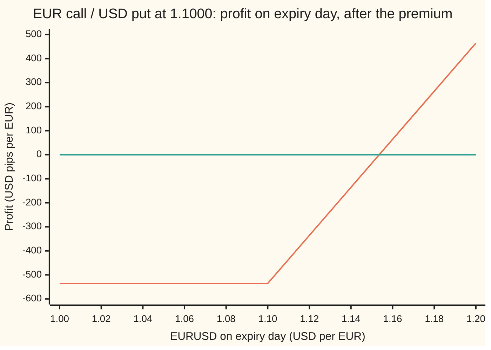
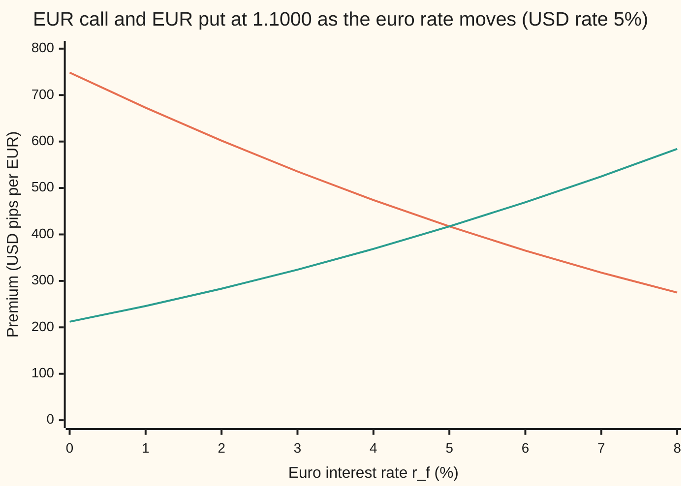

# Garman-Kohlhagen: pricing a currency option by treating foreign cash as a share that pays the foreign rate

Financial mathematics → FX vanilla options - Garman-Kohlhagen and the desk conventions → Foreign cash as a dividend share → Garman-Kohlhagen

---

## General Overview

EURUSD trades at 1.1000: one euro costs 1.10 US dollars. A firm in Boston owes a supplier in Lyon 10 million euros, due in one year. If the euro climbs to 1.20 dollars, the bill grows by a million dollars. The firm buys a contract: the right, one year from today, to buy 10 million euros at 1.1000 dollars each. It does not have to. It may.

Dealers call this a **EUR call / USD put**. It is a call on euros and, in the same breath, a put on dollars, because buying euros with dollars is selling dollars for euros. The rate written into the contract, 1.1000, is the **strike**. The contract size, 10 million euros, is the **notional**. The price paid today is the **premium**. For this contract the premium is 535,558 US dollars.

Two words carry the whole card. The **domestic** currency is the one the price is counted in: the dollars in "1.10 dollars per euro". The **foreign** currency is the thing with the price tag: the euro. The words say nothing about where anyone lives. They say which currency is money and which is the thing being bought.

A euro left in a bank earns euro interest, 3 percent a year in this example. So the euro behaves like a share that pays a dividend, and the dividend is paid in more euros. The Black-Scholes formula already prices options on a share that pays a steady dividend. Put the euro rate where the dividend goes, the dollar rate where the bank rate goes, and the formula prices the currency option. Mark Garman and Steven Kohlhagen published that mapping in 1983; J. Orlin Grabbe published it in the same journal issue.

**A currency option is a Black-Scholes option on a share whose dividend yield is the foreign interest rate, priced and discounted in the domestic currency.**

**What kind of fact this is:** a model: the exchange rate is *assumed* to wander with steady jumpiness, which fits markets only roughly. Inside that model, the price is a theorem, proved on this card in Why it works.

### The picture: what the firm walks away with

The spot rate on expiry day runs left to right. The profit per euro, after paying the premium, runs up the side, in **pips**: a pip is 0.0001 of the quote, so 535.56 pips is 0.053556 dollars per euro.



The sloping line is the option's profit per euro; the flat line is zero, break even. Below 1.1000 the option lapses and the loss is the premium, 535.56 pips. Above it, each pip the euro gains is a pip to the holder. The profit crosses zero at 1.1536, strike plus premium.

---

## The formula

$$C = S\,e^{-r_f T}\,N(d_1) - K\,e^{-r_d T}\,N(d_2), \qquad P = K\,e^{-r_d T}\,N(-d_2) - S\,e^{-r_f T}\,N(-d_1)$$

**Read it aloud: the euro received, discounted at the euro rate, weighted by its chance counted in euros, minus the dollars handed over, discounted at the dollar rate, weighted by its chance counted in dollars.**

Both prices come out in domestic currency per one unit of foreign notional: US dollars per euro.

| Symbol | Plain meaning | In our example | Push it up and the call… |
| --- | --- | --- | --- |
| $S$, $S_T$ | the spot rate: dollars per euro today, and on expiry day | 1.1000 today | rises: the euro is dearer to start with |
| $K$ | the strike: dollars paid per euro if the option is used | 1.1000 | falls: more dollars to hand over |
| $T$, $t$ | time to expiry, in years; $t$ is any moment before it | 1 | rises here: more time for a big move |
| $r_d$ | the domestic rate: what dollars earn, continuously compounded | 5% | rises: the forward climbs and the dollars paid later cost less today |
| $r_f$, $q$ | the foreign rate: what euros earn, continuously compounded; $q$ is a share's dividend yield, the slot $r_f$ fills | 3% | falls: the euro "dividend" leaks value out of the spot |
| $\sigma$ | volatility: how jumpy EURUSD is, per square root of a year. Say "sigma". | 10% | rises: bigger moves, and the downside is capped |
| $F$ | the forward rate, $S\,e^{(r_d - r_f)T}$: the rate agreed today for exchange at $T$ | 1.122221 | rises: the euro is dearer for delivery |
| $D_d$, $D_f$ | discount factors $e^{-r_d T}$ and $e^{-r_f T}$: today's value of one dollar, or one euro, due at $T$ | 0.951229, 0.970446 | — |
| $N(x)$ | the bell-curve area to the left of $x$: a probability between 0 and 1 | — | — |
| $d_1$, $d_2$ | the forward's distance above the strike, $\ln(F/K) = 0.02$, in units of $\sigma\sqrt{T}$, plus and minus half a unit | 0.25 and 0.15 | — |
| $C$, $P$ | the EUR call / USD put, and the EUR put / USD call, in dollars per euro | 0.053556, 0.032418 | — |
| $Z$, $\varphi(z)$ | one standard bell-curve draw, and the curve's height $e^{-z^2/2}/\sqrt{2\pi}$ | — | — |

The two helpers:

$$d_1 = \frac{\ln(S/K) + (r_d - r_f + \tfrac12\sigma^2)\,T}{\sigma\sqrt{T}}, \qquad d_2 = d_1 - \sigma\sqrt{T}$$

In words: the top of $d_2$ is how far the log of the spot is expected to travel past the strike in the pricing world below; the bottom is one year's worth of wiggle. $d_1$ is one wiggle unit more. The forward form, $C = D_d\,[F\,N(d_1) - K\,N(d_2)]$, is the same price written from the forward instead of the spot.

### When it holds

- **Constant volatility.** The market charges a different vol at each strike, the smile; one flat $\sigma$ misprices options away from the money. Desks keep this formula as the quoting language and feed it the smile's vol per strike: [fx-implied-volatility](07-fx-implied-volatility.md).
- **Constant, known interest rates.** A rate move shifts the forward, and the price follows it. Long-dated currency options need random rates.
- **No jumps.** A pegged currency that devalues overnight breaks the smooth wandering the bell curve assumes; the formula underprices the crash.
- **Covered interest parity holds.** The model's forward is $S\,e^{(r_d-r_f)T}$. Since 2008 the traded forward has differed from it by a spread, the cross-currency basis; desks price off the traded forward, which is the Black-76 form of the formula.
- **Negative rates are allowed.** Nothing in the derivation needs $r_d$ or $r_f$ above zero; euro rates sat below zero from 2014 to 2022.
- **European exercise, no frictions.** Used only on expiry day, with money free to cross the border. Capital controls break the replication.

---

## Why it works

### Step 0: nobody needs to predict the euro

The option's payoff depends on where EURUSD ends up, and nobody knows that. The way round it is the one Black-Scholes uses. A dealer who sells the option can copy it by holding a changing amount of euros on deposit, financed with dollars. The copy costs a definite amount. That cost is the price, whatever anyone thinks about the euro's direction.

The shortcut that computes the cost: **pretend every asset, counted in dollars, grows on average at the dollar rate; average the payoff in that pretend world; discount the average at the dollar rate.** Finance calls it the risk-neutral, or pricing, world. The only thing left to work out is how spot drifts in it, and that is where the euro rate enters.

### Step 1: a euro on deposit is a share that pays a dividend

To own 1 euro in one year, nobody buys a whole euro today. Buying $e^{-r_f T}$ euros and leaving them on deposit at 3 percent grows them to exactly 1 euro. That is $D_f = 0.970446$ euros, costing $S\,D_f = 1.10 \times 0.970446$ dollars today.

A share with a steady dividend yield $q$, dividends reinvested, behaves the same way: $e^{-qT}$ shares today become one share at $T$. So the euro is a share with dividend yield $q = r_f$, paid in euros. Everywhere Black-Scholes writes $e^{-qT}$ next to the spot, the currency formula writes $e^{-r_f T}$.

### Step 2: spot drifts at the rate gap

In dollars, the euro deposit is worth $S_t\,e^{r_f t}$ at time $t$: the spot rate times the growing pile of euros. It is a traded asset, so in the pricing world its dollar value must grow at $r_d$. The deposit supplies $r_f$ of that growth itself. The spot rate supplies the rest: it drifts at $r_d - r_f$.

With lognormal wandering at volatility $\sigma$ (see [geometric-brownian-motion](../../11-Stochastic%20processes%20and%20calculus/05-Brownian%20Motion/07-geometric-brownian-motion.md)):

$$S_T = S\,\exp\!\Big((r_d - r_f - \tfrac12\sigma^2)\,T + \sigma\sqrt{T}\,Z\Big).$$

The $-\tfrac12\sigma^2$ corrects for the average of a lognormal running ahead of its median. With it, the average of $S_T$ is $S\,e^{(r_d-r_f)T} = F$, which is the forward from covered interest parity ([covered-interest-parity](../20-FX%20spot%2C%20forwards%20and%20interest%20parity/02-covered-interest-parity.md)). The check computes both: the brute-force average of $S_T$ is 1.122221, and the parity forward is 1.122221. It also averages the deposit's dollar value and discounts it: 1.100000, today's spot, as a fairly priced asset must.

Dollar rates at 5 percent, euro rates at 3 percent: the euro drifts up by 2 percent a year in the pricing world. That is no forecast. It is the rate gap, which any deposit arbitrage enforces.

### Step 3: split the payoff into two legs

On expiry day the call pays $\max(S_T - K, 0)$ dollars per euro. Split it:

- the **euro leg**: receive one euro, worth $S_T$ dollars, if $S_T > K$;
- the **dollar leg**: hand over $K$ dollars, if $S_T > K$.

The option finishes above the strike when $Z > -d_2$, and the bell curve's symmetry makes that chance $N(d_2)$. So the dollar leg is worth $K\,D_d\,N(d_2)$: $1.10 \times 0.951229 \times 0.559618 = 0.585557$ dollars.

### Step 4: the euro leg gets its own probability

A euro is worth more in exactly the futures where it is received, the ones where the euro rose. Averaging "one euro, if above the strike" weights each good future by the euro's value there. That weighting slides the bell curve right by one wiggle unit, $\sigma\sqrt{T}$, and the chance becomes $N(d_1)$. The euro leg is $S\,D_f\,N(d_1) = 1.10 \times 0.970446 \times 0.598706 = 0.639113$ dollars.

Subtract: $0.639113 - 0.585557 = 0.053556$ dollars per euro. That is the formula.

<details>
<summary>Detailed proof</summary>

Write $v = \sigma\sqrt{T}$ and $m = (r_d - r_f - \tfrac12\sigma^2)T$, so $S_T = S\,e^{m + vZ}$ and the option pays when $Z > -d_2$, with $d_2 = (\ln(S/K) + m)/v$.

The price is $C = D_d \int_{-d_2}^{\infty} (S\,e^{m + vz} - K)\,\varphi(z)\,dz$.

The dollar leg: $D_d\,K \int_{-d_2}^{\infty} \varphi(z)\,dz = K\,D_d\,N(d_2)$, since the curve is symmetric.

The euro leg: $D_d\,S\,e^{m}\int_{-d_2}^{\infty} e^{vz}\,\varphi(z)\,dz$. Complete the square: $vz - \tfrac12 z^2 = \tfrac12 v^2 - \tfrac12(z - v)^2$, so $e^{vz}\varphi(z) = e^{v^2/2}\,\varphi(z - v)$. Substitute $u = z - v$; the lower limit $-d_2$ becomes $-d_2 - v = -d_1$, and the integral is $e^{v^2/2}N(d_1)$.

Collect the constants: $D_d\,e^{m}\,e^{v^2/2} = e^{-r_d T}\,e^{(r_d - r_f)T} = e^{-r_f T} = D_f$. The euro leg is $S\,D_f\,N(d_1)$.

So $C = S\,D_f\,N(d_1) - K\,D_d\,N(d_2)$. The put is the same integral over $Z < -d_2$ with payoff $K - S_T$, giving $P = K\,D_d\,N(-d_2) - S\,D_f\,N(-d_1)$. $\blacksquare$

</details>

### Step 5: parity with two discount factors

A call bought and a put sold at the same strike pay $S_T - K$ dollars on every path: receive a euro, hand over $K$ dollars. That is a forward contract, so its value today needs no model:

$$C - P = S\,D_f - K\,D_d.$$

Two discount factors, one per currency: the euro leg at the euro rate, the dollar leg at the dollar rate. For the house example, $1.10 \times 0.970446 - 1.10 \times 0.951229 = 0.021138$, and the call minus an independently averaged put is 0.021138. See [put-call-parity](../08-The%20Black-Scholes%20call%20and%20put/03-put-call-parity.md) for the share version.

### The other door: Black-76 on the forward

Substitute $S\,D_f = F\,D_d$, which is covered interest parity rewritten. The formula becomes $C = D_d\,[F\,N(d_1) - K\,N(d_2)]$ with $d_1 = (\ln(F/K) + \tfrac12\sigma^2 T)/(\sigma\sqrt{T})$: Black's 1976 formula for an option on a forward, discounted at the domestic rate. The code prices it this way from $F = 1.122221$ and gets 0.053556 again. Desks prefer this form, because the traded forward already carries both rates and the basis: [black-76-and-forward-level-pricing](../05-Black-Scholes%20from%20the%20Ground%20Up/06-black-76-and-forward-level-pricing.md).

---

## Worked numbers, by hand

EURUSD: $S = 1.10$, $K = 1.10$, $r_d = 5\%$ (USD), $r_f = 3\%$ (EUR), $\sigma = 10\%$, $T = 1$ year.

| Step | Arithmetic | Value |
| --- | --- | --- |
| $\ln(S/K)$ | $\ln 1$ | 0 |
| drift plus half variance | $0.05 - 0.03 + 0.005$ | 0.025 |
| one wiggle unit, $\sigma\sqrt{T}$ | $0.10 \times 1$ | 0.10 |
| $d_1$ | $0.025 / 0.10$ | 0.25 |
| $d_2$ | $0.25 - 0.10$ | 0.15 |
| $N(d_1)$, $N(d_2)$ | bell-curve table | 0.598706, 0.559618 |
| $D_f = e^{-0.03}$ | euro discount | 0.970446 |
| $D_d = e^{-0.05}$ | dollar discount | 0.951229 |
| euro leg | $1.10 \times 0.970446 \times 0.598706$ | 0.639113 |
| dollar leg | $1.10 \times 0.951229 \times 0.559618$ | 0.585557 |
| **EUR call / USD put** | $0.639113 - 0.585557$ | **0.053556 USD per EUR** |
| in USD pips | $0.053556 \times 10{,}000$ | 536 |
| as a share of the EUR notional | $0.053556 / 1.10$ | 4.87% |
| on EUR 10 million | $0.053556 \times 10{,}000{,}000$ | USD 535,558 |
| EUR put / USD call | same legs, $N(-d_2)$ and $N(-d_1)$ | 0.032418 |

So insuring a 10-million-euro bill against a rising euro, for one year, at today's rate, costs about 536 thousand dollars: 5.36 US cents on each euro of cover, or 4.87% of the notional's value. The same quantity has four names on a dealing screen, which is its own card: [premium-currency-and-foreign-domestic-symmetry](02-premium-currency-and-foreign-domestic-symmetry.md).

The call costs more than the put although spot equals the strike. The rate gap pushes the forward to 1.122221, above the strike, so the call is in the money against the forward.

### What breaks if you drop a piece

Correct answer 0.053556 dollars per euro.

| Mistake | Comes out at | What went wrong |
| --- | --- | --- |
| Rates the wrong way round: dollar rate on the spot, euro rate on the strike | 0.032418 | 40% light. With spot at the strike, it lands exactly on the put's price. |
| Euro rate left out, $r_f = 0$ | 0.074855 | The euro is priced as a share with no dividend, so the forward is overstated |
| Black-76 on the forward, discounted at the euro rate | 0.054638 | The premium is dollars paid today; only the dollar rate discounts it |

Every number in the table is printed by both checks.

The chart below shows why the direction matters. Hold the dollar rate at 5 percent and slide the euro rate from 0 to 8 percent.



The falling line is the EUR call; the rising line is the EUR put. They cross at 417.26 pips, where the two rates are equal, the forward equals spot, and call equals put. A higher euro rate is a fatter dividend: it drags the forward down, cheapens the call and lifts the put. At 3 percent, the house example, the call is 535.56 pips.

---

## Code, from first principles, and it actually runs

The scripts reach the price by **four independent roads**: the formula; a brute-force average of the payoff over the bell curve by Simpson's rule, which uses no $d_1$ or $d_2$; Black-76 on the forward built from covered interest parity; and a 2,000-step coin-flip tree whose steps grow at $r_d - r_f$. Then they price the put by its own average and test parity with two discount factors, check that the average future spot equals the parity forward and that the euro deposit is fairly priced, bump the spot to confirm the spot delta, and reproduce every "what breaks" number and chart point. Two cross-checks tie the card to its neighbours: the house share market, $S = K = 100$, $r_d = 5\%$, $r_f = 2\%$, $\sigma = 20\%$, must give the share call 9.227006 of [black-scholes-call](../08-The%20Black-Scholes%20call%20and%20put/01-black-scholes-call.md); and a second currency case, EURUSD 1.20, dollar rate 4%, euro rate 2%, vol 10%, must give 0.059012.

### Python

The bell-curve area comes from a series written out term by term, with every term of one sign so no digits cancel.

```python
# Garman-Kohlhagen -- the check behind the card.  Standard library only.
# Every number quoted on the card is printed here.  Nothing imported knows the answer:
# the normal CDF is a series written out, the integral is Simpson's rule, the tree is a loop.
from math import log, sqrt, exp, pi

def phi(x): return exp(-0.5 * x * x) / sqrt(2.0 * pi)        # bell-curve height at x

def N(x):                                                     # bell-curve area left of x
    if x > 9.0: return 1.0
    if x < -9.0: return 0.0
    term, total, n = x, x, 0                                  # sum of x^(2n+1) / (1*3*...*(2n+1))
    while abs(term) > 1e-17 * abs(total):
        n += 1
        term *= x * x / (2 * n + 1)
        total += term
    return 0.5 + phi(x) * total

def d1d2(S, K, rd, rf, vol, T):
    d1 = (log(S / K) + (rd - rf + 0.5 * vol * vol) * T) / (vol * sqrt(T))
    return d1, d1 - vol * sqrt(T)

def gk_call(S, K, rd, rf, vol, T):     # right to BUY 1 EUR for K USD; USD per EUR
    d1, d2 = d1d2(S, K, rd, rf, vol, T)
    return S * exp(-rf * T) * N(d1) - K * exp(-rd * T) * N(d2)

def gk_put(S, K, rd, rf, vol, T):      # right to SELL 1 EUR for K USD; USD per EUR
    d1, d2 = d1d2(S, K, rd, rf, vol, T)
    return K * exp(-rd * T) * N(-d2) - S * exp(-rf * T) * N(-d1)

def average(S, rd, rf, vol, T, f, n=20000):
    # Road 2: Simpson's rule over the bell curve, spot drifting at rd - rf.  No d1, no d2.
    a, b = -10.0, 10.0
    h = (b - a) / n
    def g(z): return f(S * exp((rd - rf - 0.5 * vol * vol) * T + vol * sqrt(T) * z)) * phi(z)
    tot = g(a) + g(b)
    for i in range(1, n):
        tot += (4 if i % 2 else 2) * g(a + i * h)
    return tot * h / 3.0

def tree(S, K, rd, rf, vol, T, steps=2000):
    # Road 4: coin-flip tree; each step the expected spot grows at rd - rf.
    dt = T / steps
    u = exp(vol * sqrt(dt)); d = 1.0 / u
    p = (exp((rd - rf) * dt) - d) / (u - d)
    disc = exp(-rd * dt)
    v = [max(S * u ** j * d ** (steps - j) - K, 0.0) for j in range(steps + 1)]
    for m in range(steps, 0, -1):
        v = [disc * (p * v[j + 1] + (1.0 - p) * v[j]) for j in range(m)]
    return v[0]

# ---- house example: EURUSD 1.1000, strike 1.1000, USD 5%, EUR 3%, vol 10%, one year ----
S, K, rd, rf, vol, T = 1.10, 1.10, 0.05, 0.03, 0.10, 1.0
d1, d2 = d1d2(S, K, rd, rf, vol, T)
C, P = gk_call(S, K, rd, rf, vol, T), gk_put(S, K, rd, rf, vol, T)
Dd, Df = exp(-rd * T), exp(-rf * T)
C_int = Dd * average(S, rd, rf, vol, T, lambda x: max(x - K, 0.0))
P_int = Dd * average(S, rd, rf, vol, T, lambda x: max(K - x, 0.0))
F = S * exp((rd - rf) * T)                                    # covered interest parity
dF1 = (log(F / K) + 0.5 * vol * vol * T) / (vol * sqrt(T))
C_b76 = Dd * (F * N(dF1) - K * N(dF1 - vol * sqrt(T)))          # Road 3: Black-76 on F
C_tree = tree(S, K, rd, rf, vol, T)
mean_ST = average(S, rd, rf, vol, T, lambda x: x)
deposit = Dd * average(S, rd, rf, vol, T, lambda x: x * exp(rf * T))
h = 1e-4
delta_bump = (gk_call(S + h, K, rd, rf, vol, T) - gk_call(S - h, K, rd, rf, vol, T)) / (2 * h)

rows = [("d1", d1), ("d2", d2), ("N(d1)", N(d1)), ("N(d2)", N(d2)),
        ("D_f = e^-rf T", Df), ("D_d = e^-rd T", Dd),
        ("euro leg  S D_f N(d1)", S * Df * N(d1)), ("dollar leg  K D_d N(d2)", K * Dd * N(d2)),
        ("1 formula, EUR call", C), ("2 Simpson average", C_int),
        ("3 Black-76 on the forward", C_b76), ("4 tree, 2000 steps", C_tree),
        ("  EUR put, formula", P), ("  EUR put, Simpson", P_int),
        ("5 C - P", C - P_int), ("  S D_f - K D_d", S * Df - K * Dd),
        ("forward F, parity", F), ("  average S_T, Simpson", mean_ST),
        ("euro deposit, today's USD", deposit), ("spot delta D_f N(d1)", Df * N(d1)),
        ("  delta by bump", delta_bump),
        ("USD pips per EUR", C * 1e4), ("percent of EUR notional", 100 * C / S),
        ("USD on EUR 10m", C * 1e7), ("breakeven spot K + C", K + C),
        ("wrong: rates swapped", gk_call(S, K, rf, rd, vol, T)),
        ("  swapped / right", gk_call(S, K, rf, rd, vol, T) / C),
        ("wrong: EUR rate left out", gk_call(S, K, rd, 0.0, vol, T)),
        ("wrong: Black-76 discounted at rf", Df * (F * N(dF1) - K * N(dF1 - vol * sqrt(T)))),
        ("cross: house shares as FX", gk_call(100.0, 100.0, 0.05, 0.02, 0.20, 1.0)),
        ("cross: 1.20, USD 4%, EUR 2%", gk_call(1.20, 1.20, 0.04, 0.02, 0.10, 1.0)),
        ("try: EUR rate 5%", gk_call(S, K, rd, 0.05, vol, T)),
        ("try: T = 0.25", gk_call(S, K, rd, rf, vol, 0.25)),
        ("try: vol 20%", gk_call(S, K, rd, rf, 0.20, T)),
        ("try: K = 1.20 call", gk_call(S, 1.20, rd, rf, vol, T)),
        ("try: K = 1.20 put", gk_put(S, 1.20, rd, rf, vol, T))]
for name, v in rows:
    print(f"{name:<32} {v:>15.6f}")

print()
spots = [1.00 + 0.02 * i for i in range(11)]
print(f"{'chart, spot at expiry':<24}" + " ".join(f"{x:8.2f}" for x in spots))
print(f"{'chart, profit in pips':<24}" + " ".join(f"{1e4 * (max(x - K, 0.0) - C):8.2f}" for x in spots))
rates = [0.01 * i for i in range(9)]
print(f"{'chart, EUR rate %':<24}" + " ".join(f"{100 * x:8.0f}" for x in rates))
print(f"{'chart, call in pips':<24}" + " ".join(f"{1e4 * gk_call(S, K, rd, x, vol, T):8.2f}" for x in rates))
print(f"{'chart, put in pips':<24}" + " ".join(f"{1e4 * gk_put(S, K, rd, x, vol, T):8.2f}" for x in rates))

assert abs(C - 0.053555770634) < 1e-11,                  "call vs the audited house value"
assert abs(P - 0.032418050681) < 1e-11,                  "put vs the audited house value"
assert abs(P_int - P) < 1e-10,                            "Simpson put must land on the put formula"
assert abs(delta_bump - Df * N(d1)) < 1e-7,               "bumped spot confirms the spot delta"
assert abs(gk_call(S, K, rf, rd, vol, T) - P) < 1e-12,    "at S = K, rates swapped gives the put"
assert abs(C_int - C) < 1e-10,                            "Simpson average must land on the formula"
assert abs(C_b76 - C) < 1e-12,                            "Black-76 on the parity forward"
assert abs(C_tree - C) < 1e-4,                            "tree within one pip"
assert abs((C - P_int) - (S * Df - K * Dd)) < 1e-10,      "parity with an independently averaged put"
assert abs(mean_ST - F) < 1e-10,                          "average future spot is the parity forward"
assert abs(deposit - S) < 1e-10,                          "a euro on deposit is a fairly priced asset"
assert abs(gk_call(100.0, 100.0, 0.05, 0.02, 0.20, 1.0) - 9.227005508154) < 1e-11, "house call"
assert abs(gk_call(1.20, 1.20, 0.04, 0.02, 0.10, 1.0) - 0.059011653) < 1e-9, "DS number"
print("ALL CHECKS PASS")
```

**Ran 2026-09-27 on macOS, Python 3.14.6, standard library only. All checks passed. Output, pasted from the run:**

```
d1                                      0.250000
d2                                      0.150000
N(d1)                                   0.598706
N(d2)                                   0.559618
D_f = e^-rf T                           0.970446
D_d = e^-rd T                           0.951229
euro leg  S D_f N(d1)                   0.639113
dollar leg  K D_d N(d2)                 0.585557
1 formula, EUR call                     0.053556
2 Simpson average                       0.053556
3 Black-76 on the forward               0.053556
4 tree, 2000 steps                      0.053550
  EUR put, formula                      0.032418
  EUR put, Simpson                      0.032418
5 C - P                                 0.021138
  S D_f - K D_d                         0.021138
forward F, parity                       1.122221
  average S_T, Simpson                  1.122221
euro deposit, today's USD               1.100000
spot delta D_f N(d1)                    0.581012
  delta by bump                         0.581012
USD pips per EUR                      535.557706
percent of EUR notional                 4.868706
USD on EUR 10m                     535557.706337
breakeven spot K + C                    1.153556
wrong: rates swapped                    0.032418
  swapped / right                       0.605314
wrong: EUR rate left out                0.074855
wrong: Black-76 discounted at rf        0.054638
cross: house shares as FX               9.227006
cross: 1.20, USD 4%, EUR 2%             0.059012
try: EUR rate 5%                        0.041726
try: T = 0.25                           0.024552
try: vol 20%                            0.095178
try: K = 1.20 call                      0.016574
try: K = 1.20 put                       0.090559

chart, spot at expiry       1.00     1.02     1.04     1.06     1.08     1.10     1.12     1.14     1.16     1.18     1.20
chart, profit in pips    -535.56  -535.56  -535.56  -535.56  -535.56  -535.56  -335.56  -135.56    64.44   264.44   464.44
chart, EUR rate %              0        1        2        3        4        5        6        7        8
chart, call in pips       748.55   672.87   601.85   535.56   474.03   417.26   365.20   317.76   274.82
chart, put in pips        212.07   245.84   283.19   324.18   368.87   417.26   469.31   524.95   584.06
ALL CHECKS PASS
```

The four roads agree to six decimals, except the tree, which sits just below at 0.053550 and closes the gap as steps are added. The spot delta, $D_f\,N(d_1) = 0.581012$, is how many euros the dealer holds on deposit per euro of option; bumping the spot confirms it.

### Rust

Same inputs, same rows. The bell-curve area here is built a different way: thin slices under the curve, added by Simpson's rule. No crates.

```rust
// Garman-Kohlhagen -- the same check as garman_kohlhagen_check.py, in Rust.
// Standard library only, no crates.  Here the bell-curve area N(x) is built a
// second way: add up thin slices under the curve from 0 to x (Simpson's rule).
// Compile: rustc --edition 2021 -O garman_kohlhagen_check.rs -o /tmp/gk_check
use std::f64::consts::PI;

fn phi(x: f64) -> f64 { (-0.5 * x * x).exp() / (2.0 * PI).sqrt() }

fn simpson<F: Fn(f64) -> f64>(f: F, a: f64, b: f64, n: usize) -> f64 {
    let h = (b - a) / n as f64;
    let mut s = f(a) + f(b);
    for i in 1..n { s += if i % 2 == 1 { 4.0 } else { 2.0 } * f(a + i as f64 * h); }
    s * h / 3.0
}

fn ncdf(x: f64) -> f64 {
    if x > 9.0 { return 1.0; }
    if x < -9.0 { return 0.0; }
    0.5 + simpson(phi, 0.0, x, 4000)
}

fn d1d2(s: f64, k: f64, rd: f64, rf: f64, vol: f64, t: f64) -> (f64, f64) {
    let d1 = ((s / k).ln() + (rd - rf + 0.5 * vol * vol) * t) / (vol * t.sqrt());
    (d1, d1 - vol * t.sqrt())
}

fn gk_call(s: f64, k: f64, rd: f64, rf: f64, vol: f64, t: f64) -> f64 {
    let (d1, d2) = d1d2(s, k, rd, rf, vol, t);
    s * (-rf * t).exp() * ncdf(d1) - k * (-rd * t).exp() * ncdf(d2)
}

fn gk_put(s: f64, k: f64, rd: f64, rf: f64, vol: f64, t: f64) -> f64 {
    let (d1, d2) = d1d2(s, k, rd, rf, vol, t);
    k * (-rd * t).exp() * ncdf(-d2) - s * (-rf * t).exp() * ncdf(-d1)
}

fn average<G: Fn(f64) -> f64>(s: f64, rd: f64, rf: f64, vol: f64, t: f64, f: G) -> f64 {
    let g = |z: f64| f(s * ((rd - rf - 0.5 * vol * vol) * t + vol * t.sqrt() * z).exp()) * phi(z);
    simpson(g, -10.0, 10.0, 20000)
}

fn tree(s: f64, k: f64, rd: f64, rf: f64, vol: f64, t: f64, steps: usize) -> f64 {
    let dt = t / steps as f64;
    let u = (vol * dt.sqrt()).exp();
    let d = 1.0 / u;
    let p = (((rd - rf) * dt).exp() - d) / (u - d);
    let disc = (-rd * dt).exp();
    let mut v: Vec<f64> = (0..=steps)
        .map(|j| (s * u.powi(j as i32) * d.powi((steps - j) as i32) - k).max(0.0)).collect();
    for m in (1..=steps).rev() {
        v = (0..m).map(|j| disc * (p * v[j + 1] + (1.0 - p) * v[j])).collect();
    }
    v[0]
}

fn row(label: &str, xs: &[f64], prec: usize) {
    let cells: Vec<String> = xs.iter().map(|x| format!("{:8.*}", prec, x)).collect();
    println!("{:<24}{}", label, cells.join(" "));
}

fn main() {
    let (s, k, rd, rf, vol, t) = (1.10_f64, 1.10_f64, 0.05_f64, 0.03_f64, 0.10_f64, 1.0_f64);
    let (d1, d2) = d1d2(s, k, rd, rf, vol, t);
    let (c, p) = (gk_call(s, k, rd, rf, vol, t), gk_put(s, k, rd, rf, vol, t));
    let (dd, df) = ((-rd * t).exp(), (-rf * t).exp());
    let c_int = dd * average(s, rd, rf, vol, t, |x| (x - k).max(0.0));
    let p_int = dd * average(s, rd, rf, vol, t, |x| (k - x).max(0.0));
    let f = s * ((rd - rf) * t).exp();
    let df1 = ((f / k).ln() + 0.5 * vol * vol * t) / (vol * t.sqrt());
    let c_b76 = dd * (f * ncdf(df1) - k * ncdf(df1 - vol * t.sqrt()));
    let c_tree = tree(s, k, rd, rf, vol, t, 2000);
    let mean_st = average(s, rd, rf, vol, t, |x| x);
    let deposit = dd * average(s, rd, rf, vol, t, |x| x * (rf * t).exp());
    let h = 1e-4;
    let delta_bump = (gk_call(s + h, k, rd, rf, vol, t) - gk_call(s - h, k, rd, rf, vol, t)) / (2.0 * h);
    let swapped = gk_call(s, k, rf, rd, vol, t);
    let house = gk_call(100.0, 100.0, 0.05, 0.02, 0.20, 1.0);
    let ds = gk_call(1.20, 1.20, 0.04, 0.02, 0.10, 1.0);

    let rows: Vec<(&str, f64)> = vec![
        ("d1", d1), ("d2", d2), ("N(d1)", ncdf(d1)), ("N(d2)", ncdf(d2)),
        ("D_f = e^-rf T", df), ("D_d = e^-rd T", dd),
        ("euro leg  S D_f N(d1)", s * df * ncdf(d1)), ("dollar leg  K D_d N(d2)", k * dd * ncdf(d2)),
        ("1 formula, EUR call", c), ("2 Simpson average", c_int),
        ("3 Black-76 on the forward", c_b76), ("4 tree, 2000 steps", c_tree),
        ("  EUR put, formula", p), ("  EUR put, Simpson", p_int),
        ("5 C - P", c - p_int), ("  S D_f - K D_d", s * df - k * dd),
        ("forward F, parity", f), ("  average S_T, Simpson", mean_st),
        ("euro deposit, today's USD", deposit), ("spot delta D_f N(d1)", df * ncdf(d1)),
        ("  delta by bump", delta_bump),
        ("USD pips per EUR", c * 1e4), ("percent of EUR notional", 100.0 * c / s),
        ("USD on EUR 10m", c * 1e7), ("breakeven spot K + C", k + c),
        ("wrong: rates swapped", swapped), ("  swapped / right", swapped / c),
        ("wrong: EUR rate left out", gk_call(s, k, rd, 0.0, vol, t)),
        ("wrong: Black-76 discounted at rf", df * (f * ncdf(df1) - k * ncdf(df1 - vol * t.sqrt()))),
        ("cross: house shares as FX", house), ("cross: 1.20, USD 4%, EUR 2%", ds),
        ("try: EUR rate 5%", gk_call(s, k, rd, 0.05, vol, t)),
        ("try: T = 0.25", gk_call(s, k, rd, rf, vol, 0.25)),
        ("try: vol 20%", gk_call(s, k, rd, rf, 0.20, t)),
        ("try: K = 1.20 call", gk_call(s, 1.20, rd, rf, vol, t)),
        ("try: K = 1.20 put", gk_put(s, 1.20, rd, rf, vol, t)),
    ];
    for (name, v) in &rows { println!("{:<32} {:>15.6}", name, v); }

    println!();
    let spots: Vec<f64> = (0..11).map(|i| 1.00 + 0.02 * i as f64).collect();
    row("chart, spot at expiry", &spots, 2);
    let profit: Vec<f64> = spots.iter().map(|x| 1e4 * ((x - k).max(0.0) - c)).collect();
    row("chart, profit in pips", &profit, 2);
    let rates: Vec<f64> = (0..9).map(|i| 0.01 * i as f64).collect();
    row("chart, EUR rate %", &rates.iter().map(|x| 100.0 * x).collect::<Vec<f64>>(), 0);
    row("chart, call in pips", &rates.iter().map(|x| 1e4 * gk_call(s, k, rd, *x, vol, t)).collect::<Vec<f64>>(), 2);
    row("chart, put in pips", &rates.iter().map(|x| 1e4 * gk_put(s, k, rd, *x, vol, t)).collect::<Vec<f64>>(), 2);

    assert!((c - 0.053555770634).abs() < 1e-11, "call vs the audited house value");
    assert!((p - 0.032418050681).abs() < 1e-11, "put vs the audited house value");
    assert!((p_int - p).abs() < 1e-10, "Simpson put must land on the put formula");
    assert!((delta_bump - df * ncdf(d1)).abs() < 1e-7, "bumped spot confirms the spot delta");
    assert!((swapped - p).abs() < 1e-12, "at S = K, rates swapped gives the put");
    assert!((c_int - c).abs() < 1e-10, "Simpson average must land on the formula");
    assert!((c_b76 - c).abs() < 1e-12, "Black-76 on the parity forward");
    assert!((c_tree - c).abs() < 1e-4, "tree within one pip");
    assert!(((c - p_int) - (s * df - k * dd)).abs() < 1e-10, "parity with an independently averaged put");
    assert!((mean_st - f).abs() < 1e-10, "average future spot is the parity forward");
    assert!((deposit - s).abs() < 1e-10, "a euro on deposit is a fairly priced asset");
    assert!((house - 9.227005508154).abs() < 1e-11, "house call");
    assert!((ds - 0.059011653).abs() < 1e-9, "DS number");
    println!("ALL CHECKS PASS");
}
```

**Ran 2026-09-27 on macOS, rustc 1.98.1, no crates. All checks passed. Output, pasted from the run:**

```
d1                                      0.250000
d2                                      0.150000
N(d1)                                   0.598706
N(d2)                                   0.559618
D_f = e^-rf T                           0.970446
D_d = e^-rd T                           0.951229
euro leg  S D_f N(d1)                   0.639113
dollar leg  K D_d N(d2)                 0.585557
1 formula, EUR call                     0.053556
2 Simpson average                       0.053556
3 Black-76 on the forward               0.053556
4 tree, 2000 steps                      0.053550
  EUR put, formula                      0.032418
  EUR put, Simpson                      0.032418
5 C - P                                 0.021138
  S D_f - K D_d                         0.021138
forward F, parity                       1.122221
  average S_T, Simpson                  1.122221
euro deposit, today's USD               1.100000
spot delta D_f N(d1)                    0.581012
  delta by bump                         0.581012
USD pips per EUR                      535.557706
percent of EUR notional                 4.868706
USD on EUR 10m                     535557.706337
breakeven spot K + C                    1.153556
wrong: rates swapped                    0.032418
  swapped / right                       0.605314
wrong: EUR rate left out                0.074855
wrong: Black-76 discounted at rf        0.054638
cross: house shares as FX               9.227006
cross: 1.20, USD 4%, EUR 2%             0.059012
try: EUR rate 5%                        0.041726
try: T = 0.25                           0.024552
try: vol 20%                            0.095178
try: K = 1.20 call                      0.016574
try: K = 1.20 put                       0.090559

chart, spot at expiry       1.00     1.02     1.04     1.06     1.08     1.10     1.12     1.14     1.16     1.18     1.20
chart, profit in pips    -535.56  -535.56  -535.56  -535.56  -535.56  -535.56  -335.56  -135.56    64.44   264.44   464.44
chart, EUR rate %              0        1        2        3        4        5        6        7        8
chart, call in pips       748.55   672.87   601.85   535.56   474.03   417.26   365.20   317.76   274.82
chart, put in pips        212.07   245.84   283.19   324.18   368.87   417.26   469.31   524.95   584.06
ALL CHECKS PASS
```

The two outputs agree line for line at the printed precision, from two different constructions of the bell-curve area.

> [!TIP]
> **Try changing**
> Guess the direction first.
> - **Set the euro rate equal to the dollar rate**, `rf = 0.05`. The forward falls to spot, and with spot at the strike the call and the put cost the same: **0.041726** each.
> - **Shorten to three months**, `T = 0.25`. The call falls to **0.024552**, a little under half the one-year price, not a quarter: the wiggle grows with $\sqrt{T}$, and $\sqrt{0.25} = 0.5$.
> - **Double the vol**, `vol = 0.20`. The call rises to **0.095178**. Vol is the input the market argues about.
> - **Raise the strike to 1.20.** The call drops to **0.016574** and the put rises to **0.090559**; call minus put still equals $S\,D_f - K\,D_d$.

---

## The usual mistake

> [!warning]
> **Putting the rates the wrong way round.** The strike is a number of dollars, so it is discounted at the dollar rate. The spot is the price of a euro, and a euro earns euro interest, so it is discounted at the euro rate. Swap them and the house call comes out at 0.032418 instead of 0.053556, about 40% light. With spot at the strike, the swapped call equals the correct put, so a call and put that look reversed point straight at this mistake.
>
> Four smaller traps:
> - **Domestic means the quote currency, not home.** USDJPY is yen per dollar, so the yen is domestic and the dollar is foreign, even for a desk in New York. The currency conventions card: [currency-quotes-and-cross-rates](../20-FX%20spot%2C%20forwards%20and%20interest%20parity/01-currency-quotes-and-cross-rates.md).
> - **Hedging with $N(d_1)$ euros.** The spot delta is $D_f\,N(d_1) = 0.581012$, not $N(d_1) = 0.598706$. Desks quote four different deltas for one option: [fx-delta-conventions](04-fx-delta-conventions.md).
> - **Strikes quoted by delta.** An FX screen shows vols at "25 delta", not at 1.1000, so a delta has to become a strike before this formula runs: [fx-strike-from-delta](06-fx-strike-from-delta.md). "At the money" has three meanings too: [at-the-money-conventions](05-at-the-money-conventions.md).
> - **Money-market rates fed in raw.** Deposit rates are quoted simple, on a 360- or 365-day year. The formula wants continuously compounded rates for the option's own dates. A mismatch moves the forward, and the forward moves the price.

---

## Where you meet it in real life

- **Every vanilla currency option on a dealer's screen.** Banks quote FX options as a vol, then convert to a premium through this formula. Conventions verified 2026-09-27: EURUSD is quoted as US dollars per euro, so the dollar is domestic; a pip is 0.0001 of the quote; USD and EUR deposit rates are simple, actual/360.
- **Corporate hedging.** An importer paying euros buys EUR calls, as the Boston firm did; an exporter receiving euros buys EUR puts. The premium is the price of a worst-case rate.
- **Reading the rate gap.** When the foreign rate exceeds the domestic one, the forward sits below spot and calls on the foreign currency are cheap. The chart above shows it in pips.
- **Barriers and touches on currencies.** The drift $r_d - r_f$ and the two discount factors carry straight into the reflection prices of [barrier-options-by-reflection](../23-FX%20exotics%20as%20desks%20use%20them%20-%20digitals%2C%20touches%20and%20barriers/02-barrier-options-by-reflection.md).
- **Paying in a third currency.** A quanto pays a foreign asset's return in another currency at a fixed rate, and its forward picks up a correlation term on top of this card's drift: [quanto-forward-and-adjustment](../24-Quantos%20and%20composites/01-quanto-forward-and-adjustment.md).

> **Say it back**
> A euro on deposit earns euro interest, so the euro is a share whose dividend yield is the euro rate. In the pricing world counted in dollars, spot drifts at the dollar rate minus the euro rate, and its average lands on the interest-parity forward. The call is the euro leg, discounted at the euro rate and weighted by $N(d_1)$, minus the dollar leg, discounted at the dollar rate and weighted by $N(d_2)$. Written from the forward, it is Black-76 discounted at the dollar rate. Swap the two rates and the price is wrong by about 40 percent in the house example.

---

## What this builds on

- [covered-interest-parity](../20-FX%20spot%2C%20forwards%20and%20interest%20parity/02-covered-interest-parity.md): the forward $S\,e^{(r_d-r_f)T}$ that the pricing world's average must land on.
- [currency-quotes-and-cross-rates](../20-FX%20spot%2C%20forwards%20and%20interest%20parity/01-currency-quotes-and-cross-rates.md): which currency is the price and which is the thing, and what a pip is.
- [black-scholes-call](../08-The%20Black-Scholes%20call%20and%20put/01-black-scholes-call.md): the share formula this card relabels, with $q$ becoming $r_f$.
- [black-scholes-put](../08-The%20Black-Scholes%20call%20and%20put/02-black-scholes-put.md): the mirror option, here the EUR put / USD call.
- [black-76-and-forward-level-pricing](../05-Black-Scholes%20from%20the%20Ground%20Up/06-black-76-and-forward-level-pricing.md): the forward form, and the road desks price on.
- [state-prices-and-risk-neutral-pricing-in-one-period](../03-Contracts%20and%20No-Arbitrage/07-state-prices-and-risk-neutral-pricing-in-one-period.md): why averaging in a pretend world and discounting gives a price.
- [put-call-parity](../08-The%20Black-Scholes%20call%20and%20put/03-put-call-parity.md): the model-free link between call and put, here with one discount factor per currency.
- [normal-distribution](../../09-Probability%20and%20statistics/04-Continuous%20Distributions/04-normal-distribution.md): the bell curve and its area $N(x)$.
- [lognormal-distribution](../../09-Probability%20and%20statistics/04-Continuous%20Distributions/06-lognormal-distribution.md): why the average of $S_T$ needs the $-\tfrac12\sigma^2$ correction.
- [geometric-brownian-motion](../../11-Stochastic%20processes%20and%20calculus/05-Brownian%20Motion/07-geometric-brownian-motion.md): the wandering exchange rate, a drift plus random kicks in log space.

## Where this goes next

- [premium-currency-and-foreign-domestic-symmetry](02-premium-currency-and-foreign-domestic-symmetry.md): the same option priced from the euro side, and the four ways its premium is quoted.
- [garman-kohlhagen-greeks](03-garman-kohlhagen-greeks.md): how this price moves with spot, vol, time and each of the two rates.
- [fx-implied-volatility](07-fx-implied-volatility.md): the formula run backwards, premium in, vol out.
- [barrier-options-by-reflection](../23-FX%20exotics%20as%20desks%20use%20them%20-%20digitals%2C%20touches%20and%20barriers/02-barrier-options-by-reflection.md): currency options that die or come alive when spot touches a level.
- [quanto-forward-and-adjustment](../24-Quantos%20and%20composites/01-quanto-forward-and-adjustment.md): a third currency, and the correlation it brings into the drift.

The price here is one number in dollars per euro; the question it leaves open is how the same contract looks to a desk that counts in euros, and why its premium can be quoted four ways.

---

## Sources

Verified 2026-09-27: every link below resolves to the publisher's page.

- Garman, Mark B., and Steven W. Kohlhagen. "Foreign Currency Option Values." *Journal of International Money and Finance* 2, no. 3 (1983): 231–237. [doi:10.1016/S0261-5606(83)80001-1](https://doi.org/10.1016/S0261-5606(83)80001-1). The original: the foreign rate as a continuous dividend.
- Grabbe, J. Orlin. "The Pricing of Call and Put Options on Foreign Exchange." *Journal of International Money and Finance* 2, no. 3 (1983): 239–253. [doi:10.1016/S0261-5606(83)80002-3](https://doi.org/10.1016/S0261-5606(83)80002-3). The same result from the forward side, in the same issue.
- Black, Fischer. "The Pricing of Commodity Contracts." *Journal of Financial Economics* 3, no. 1–2 (1976): 167–179. [doi:10.1016/0304-405X(76)90024-6](https://doi.org/10.1016/0304-405X(76)90024-6). The forward form used as road 3.
- Reiswich, Dimitri, and Uwe Wystup. "A Guide to FX Options Quoting Conventions." *The Journal of Derivatives* 18, no. 2 (2010): 58–68. [doi:10.3905/jod.2010.18.2.058](https://doi.org/10.3905/jod.2010.18.2.058). Domestic and foreign, pips, premium currency and deltas as desks use them.
- Hull, John C. *Options, Futures, and Other Derivatives*, 11th ed. Pearson. [Publisher page](https://www.pearson.com/en-us/subject-catalog/p/options-futures-and-other-derivatives/P200000005938). The textbook treatment of currency options as options on an asset paying a known yield.
