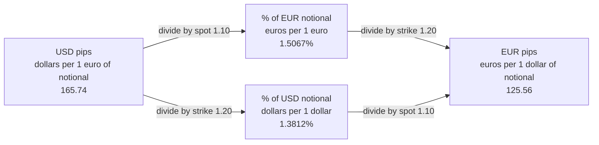
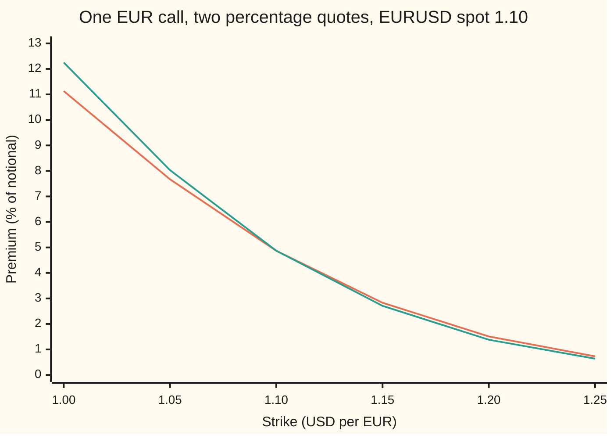

# One option, two currencies: the same contract seen from the other side, and the four ways its premium is quoted

[Syllabus](../../../SYLLABUS.md) → [Financial mathematics](../README.md) → [FX vanilla options - Garman-Kohlhagen and the desk conventions](../README.md#s21) → One option, two currencies

---

## General Overview

An importer in Chicago owes a supplier in Milan 10 million euros, due in one year. Today one euro costs 1.10 dollars. The importer buys the right, not the obligation, to buy those euros in a year at 1.20 dollars each. Dollars in a bank earn 5 percent a year, euros earn 3 percent, and the exchange rate wobbles about 10 percent a year.

That right is a **EUR call / USD put** (a call on euros is a put on dollars, since buying euros with dollars is selling dollars for euros). A dealer in Frankfurt books the same contract as the right to sell 12 million dollars for 10 million euros: a put on dollars, priced in euros. Same cash, same date, two descriptions.

The premium, the price of the right, is 165,741.21 dollars. On the phone it may arrive as 166, as 1.51, as 1.38 or as 126. All four are that one price. Each counts it in a different currency, per unit of a different notional (the contract's size, stated in one of the two currencies). A trader who agrees "1.51" without the unit can pay the wrong amount.

This card proves that the two descriptions must carry the same price, and gives the four quotes with the conversions between them.

**A currency option is one contract read two ways: a call on euros priced in dollars, and a put on dollars priced in euros; the two prices agree once converted at today's rate, and each premium quote is that one price in a different pair of units.**

**What kind of fact this is:** a theorem, the symmetry, proved on this card in Why it works; the four quotes are conventions, each a change of units.

### The picture: four quotes, one price

Each box is the same premium for the 1.20 strike. An arrow marked spot changes the currency the premium is paid in, at today's rate. An arrow marked strike changes the currency the notional is counted in, at the strike.



The top-left box is the Chicago price. The bottom-right box is the Frankfurt price. The two middle boxes are the percentages.

---

## The formula

A reminder of the pricing formula from [Garman-Kohlhagen](01-garman-kohlhagen.md): $C(S, K, r_d, r_f)$ is the price of the right to buy one unit of the **foreign** currency (the one with the price tag, here the euro) for $K$ units of the **domestic** currency (the one the price is counted in, here the dollar). $P$ is the matching right to sell. The symmetry says:

$$C(S, K, r_d, r_f) \;=\; S \cdot K \cdot P\!\left(\tfrac{1}{S},\ \tfrac{1}{K},\ r_f,\ r_d\right)$$

**Read it aloud: the dollar price of the right to buy one euro at K dollars equals S times K times the euro price of the right to sell one dollar at 1/K euros, with the two interest rates trading places.**

The mirror line, proved the same way, says a EUR put is a USD call:

$$P(S, K, r_d, r_f) \;=\; S \cdot K \cdot C\!\left(\tfrac{1}{S},\ \tfrac{1}{K},\ r_f,\ r_d\right)$$

The four quotes, from the dollar price $C$ per one euro of notional:

$$\text{USD pips} = 10^4\,C, \qquad \%\,\text{EUR} = \frac{C}{S}, \qquad \%\,\text{USD} = \frac{C}{K}, \qquad \text{EUR pips} = 10^4\,\frac{C}{S\,K}$$

A **pip** is 0.0001 of the quoting currency, so 0.0166 dollars per euro is 166 USD pips. The percentages are written as percents: 0.015067 is 1.5067%.

| Symbol | Plain meaning | In our example | Push it up and the answer… |
| --- | --- | --- | --- |
| $S$ | spot: dollars per euro today | 1.10 | USD pips rise; EUR pips rise by less, since they divide by $S$ |
| $K$ | strike: dollars per euro fixed in the contract | 1.20 | every quote falls; % USD and EUR pips fastest, since they also divide by $K$ |
| $\tfrac{1}{S}$, $\tfrac{1}{K}$ | the same two rates quoted the other way: euros per dollar | 0.9091 and 0.8333 | — |
| $S_T$ | the exchange rate on expiry day, unknown today | — | — |
| $r_d$, $r_f$ | domestic and foreign interest rates, continuously compounded | USD 5%, EUR 3% | on the EUR side they swap: $r_f$ becomes domestic |
| $\sigma$ | volatility: the yearly wobble of the log of the rate | 10% | every quote rises |
| $T$, $t$ | time to expiry, and time elapsed so far, in years | 1, and 0 today | every quote rises |
| $C$ | call price, domestic per 1 unit of foreign | 0.01657412 USD per EUR | — |
| $P$ | put price, same units | EUR side: 0.01255615 EUR per USD | — |
| $N(x)$ | bell-curve area left of $x$: a probability | — | — |
| $d_1$, $d_2$ | distance from strike in wobble units, as on the garman-kohlhagen card | −0.6201, −0.7201 | — |
| $e^{-r_d T}$, $e^{-r_f T}$ | discount factors: today's value of one unit due at $T$ | 0.9512, 0.9704 | — |

The helpers, unchanged from the garman-kohlhagen card: $d_1 = \big(\ln(S/K) + (r_d - r_f + \tfrac12\sigma^2)T\big)/(\sigma\sqrt{T})$, the distance to the strike plus half a wobble unit's drift; $d_2 = d_1 - \sigma\sqrt{T}$, one wobble unit less.

Conventions checked 27 Sep 2026: the four definitions above are changes of units and cannot drift. Which one a desk uses by default for a given currency pair is market practice, surveyed by Reiswich and Wystup (Sources), and belongs on the trade ticket.

### When it holds

- **The payoff identity needs no model.** Step 1 below is arithmetic on the contract. It holds whatever the exchange rate does.
- **Both sides use the same volatility, read at matching strikes.** The log of $1/S$ is minus the log of $S$, so both wobble by the same $\sigma$. With a volatility smile (a different $\sigma$ at each strike), the vol for strike $K$ in EURUSD is the vol for strike $1/K$ in USDEUR. Read it at the wrong strike and the two prices differ by about vega (price change per unit of vol) times the vol gap.
- **Rates are fixed for the life of the option.** The two rates only trade places; nothing else about them changes.
- **The premium converts at the rate on the day it is paid.** This card takes that as today's spot, $S$.
- **European exercise, on the expiry date only.** The card makes no claim about options that can be exercised early.

---

## Why it works

### Step 0: one exchange, two descriptions

On expiry day the option, if used, swaps 10 million euros for 12 million dollars. Chicago calls that buying euros. Frankfurt calls it selling dollars. A price cannot depend on which word is used. If the two readings carried different prices, a dealer would buy the cheap reading, sell the dear one, and pocket the gap: the two positions cancel on every path. So the prices must agree. The rest of this section checks that the pricing formula respects that, and says exactly how to convert.

### Step 1: the payoffs agree on every path

Per euro of notional, the Chicago payoff is $(S_T - K)^+$ dollars, writing $(x)^+$ for $\max(x, 0)$: the gain if positive, zero otherwise.

From Frankfurt the euro is the money. The dollar is the thing with a price tag, worth $1/S_T$ euros on expiry day. The contract is the right to sell $K$ dollars at $1/K$ euros each. A put on $K$ dollars pays

$$K\left(\tfrac{1}{K} - \tfrac{1}{S_T}\right)^+ = \left(1 - \tfrac{K}{S_T}\right)^+ = \frac{(S_T - K)^+}{S_T}\ \text{euros}.$$

Turn those euros into dollars at the expiry rate $S_T$ and the $S_T$ cancels: $(S_T - K)^+$ dollars. Same payoff, every path. The check tests this at 81 expiry rates from 0.80 to 1.60 and all 81 agree.

### Step 2: price the Frankfurt reading with Frankfurt's rates

Frankfurt runs the same formula with the roles swapped. Spot is $1/S$ = 0.90909091 euros per dollar. Strike is $1/K$ = 0.83333333. The domestic rate is now the euro rate, 3 percent. The foreign rate is the dollar rate, 5 percent: a dollar in a US bank earns 5 percent, which is its "dividend" seen from Frankfurt. The wobble is the same $\sigma$, since flipping a rate upside down only flips the sign of its log.

That gives $P(1/S, 1/K, r_f, r_d)$ = 0.01255615 euros per dollar of notional. Three conversions finish the job:

- The notional is $K$ dollars per euro, so multiply by $K$: euros per euro of notional.
- The premium is paid today, so multiply by $S$: dollars per euro of notional.
- $1.10 \times 1.20 \times 0.01255615$ = 0.01657412, the Chicago price to eight decimals.

### Step 3: the algebra, in one line

On the Frankfurt side the top line of $d_1$ is $\ln(K/S) + (r_f - r_d + \tfrac12\sigma^2)T$. That is minus the top line of Chicago's $d_2$, $\ln(S/K) + (r_d - r_f - \tfrac12\sigma^2)T$. So Frankfurt's $d_1$ is Chicago's $-d_2$, and Frankfurt's $d_2$ is Chicago's $-d_1$: −0.6201 and −0.7201 become 0.7201 and 0.6201.

Put those into the put formula, $P = k\,e^{-r_d' T} N(-d_2') - x\,e^{-r_f' T} N(-d_1')$, where the primes mark Frankfurt's inputs: $x = 1/S$, $k = 1/K$, $r_d' = r_f$, $r_f' = r_d$. Then $-d_2' = d_1$ and $-d_1' = d_2$:

$$P' = \tfrac{1}{K}\,e^{-r_f T} N(d_1) - \tfrac{1}{S}\,e^{-r_d T} N(d_2).$$

Multiply by $S K$ and the fractions clear: $S\,e^{-r_f T} N(d_1) - K\,e^{-r_d T} N(d_2)$, which is $C$. The mirror line follows the same way, starting from Frankfurt's call.

<details>
<summary>Detailed proof: the Frankfurt side has its own pricing world</summary>

The garman-kohlhagen card prices by averaging the payoff in a pricing world where every dollar-valued holding grows at $r_d$ once its income is reinvested. A euro deposit is worth $S_t e^{r_f t}$ dollars once $t$ years have passed, so $S$ must drift at $r_d - r_f$ there.

Frankfurt needs its own world, where every euro-valued holding grows at $r_f$. A dollar deposit is worth $e^{r_d t}/S_t$ euros, so the euro price of a dollar, $1/S$, must drift at $r_f - r_d$. Its log is $-\ln S$, so its random part is the same bell-curve draw with the sign flipped. A bell curve is symmetric, so the wobble is $\sigma$ again. In that world
$$\frac{1}{S_T} = \frac{1}{S}\exp\!\big((r_f - r_d - \tfrac12\sigma^2)T + \sigma\sqrt{T}\,Z\big),$$
with $Z$ a standard bell-curve draw. Frankfurt's put price is $e^{-r_f T}$ times the average of $K(1/K - 1/S_T)^+$, which is the Garman-Kohlhagen put with $r_f$ as domestic rate. Road 5 in the code does this average directly, by Simpson's rule, with no $d_1$, $d_2$ or $N$, and lands on 0.01657412 after multiplying by $S K$.

The two worlds weight the same futures differently: one counts in dollars, the other in euros. Step 1 shows the payoff is the same cash in either count, and today's conversion at $S$ is the only link the two prices need. That the two averages agree is a change of counting unit, known as a change of numeraire; here it is checked by computation. $\blacksquare$

</details>

### Step 4: a EUR put is a USD call

Run Steps 1 to 3 on the put. The right to sell one euro for $K$ dollars is the right to buy $K$ dollars for one euro: a call on dollars from Frankfurt. At strike 1.10 the house EUR put is 0.03241805 dollars per euro; $S K$ times Frankfurt's USD call gives 0.03241805; averaging the put payoff directly gives 0.03241805. So any call formula gives every put: invert the inputs, swap the rates, multiply by $S K$.

### Step 5: the four quotes are two prices in two units

The quotes form a two-by-two grid. One axis is the currency the premium is paid in. The other is the currency the notional is counted in.

- Changing the **currency paid** uses today's spot $S$, because the premium changes hands today.
- Changing the **notional** uses the strike $K$, because the contract ties the two notionals at the strike: 10 million euros against 12 million dollars, fixed.

So % EUR is $C/S$ and % USD is $C/K$. EUR pips are $C/(SK)$, which Step 2 showed is Frankfurt's own price per dollar of notional. The grid holds exactly two prices, Chicago's and Frankfurt's, each also written as a percentage of its own notional.

When $K = S$ the two percentages coincide, since dividing by $S$ and by $K$ is the same division. When $K$ is above $S$, as at 1.20, % EUR is the larger. Below, % USD is.

A second road to the whole result prices both readings by averaging, with no formula at all: roads 4 and 5 in the code. The averaging method itself is set out on [Garman-Kohlhagen](01-garman-kohlhagen.md).

---

## Worked numbers, by hand

The house market: EURUSD 1.10, USD 5%, EUR 3%, vol 10%, one year, strike 1.20. Chicago first.

| Step | Arithmetic | Value |
| --- | --- | --- |
| $\ln(S/K)$ | $\ln(1.10/1.20)$ | −0.08701138 |
| $d_1$ | $(-0.08701138 + 0.05 - 0.03 + 0.005)/0.10$ | −0.62011377 |
| $d_2$ | $-0.62011377 - 0.10$ | −0.72011377 |
| $N(d_1)$, $N(d_2)$ | bell-curve areas | 0.26759144, 0.23572748 |
| share half | $1.10 \times 0.97044553 \times 0.26759144$ | 0.28565121 |
| cash half | $1.20 \times 0.95122942 \times 0.23572748$ | 0.26907709 |
| **Chicago's price, $C$** | $0.28565121 - 0.26907709$ | **0.01657412 USD per EUR** |

Now Frankfurt, with spot 0.90909091, strike 0.83333333 and the rates swapped.

| Step | Arithmetic | Value |
| --- | --- | --- |
| Frankfurt's $d_1$, $d_2$ | Chicago's $-d_2$ and $-d_1$ | 0.72011377, 0.62011377 |
| **Frankfurt's price, $P'$** | Garman-Kohlhagen put | **0.01255615 EUR per USD** |
| back to Chicago | $1.10 \times 1.20 \times 0.01255615$ | 0.01657412 |

And the four quotes, each reached from both sides in the check:

| Quote | From Chicago's price | Value |
| --- | --- | --- |
| USD pips | $10^4 \times 0.01657412$ | 165.74 |
| % of EUR notional | $0.01657412 / 1.10$ | 1.5067% |
| % of USD notional | $0.01657412 / 1.20$ | 1.3812% |
| EUR pips | $10^4 \times 0.01657412 / 1.32$ | 125.56 |

On the 10-million-euro ticket that is 165,741.21 dollars, or 150,673.83 euros, for protection on 12,000,000.00 dollars of notional. At strike 1.10 the same grid reads 535.56 USD pips, 4.8687% and 4.8687%, and 442.61 EUR pips: the two percentages coincide.

### Across strikes: where the percentages cross



Orange: premium as a percentage of the EUR notional. Green: premium as a percentage of the USD notional. They meet at 4.87 where the strike equals spot, 1.10. Left of that the USD percentage is higher; right of it the EUR percentage is.

### What breaks if you drop a piece

Same option, strike 1.20, right answer 0.01657412 dollars per euro, or 1.3812% of USD notional.

| Mistake | Comes out at | What went wrong |
| --- | --- | --- |
| USD notional converted at spot, not strike | 1.5067% "of USD" | The notionals are tied at the strike; dividing by 1.10 gives the EUR percentage under the wrong label |
| Frankfurt's inputs inverted, rates not swapped | 0.00802656 USD per EUR | Frankfurt discounted its euro strike at the dollar rate; less than half the right price |
| 1.51% read as a percentage of USD notional | 0.01808086 USD per EUR | Too much by the factor $K/S$ |
| 166 USD pips read as EUR pips | 0.02187784 USD per EUR | Too much by the factor $S K$ = 1.32 |

---

## Code, from first principles, and it actually runs

The scripts price the 1.20 option five ways. Road 1 is the formula from Chicago. Roads 2 and 3 price it from Frankfurt and convert. Road 4 averages the dollar payoff over the bell curve by Simpson's rule, with no $d_1$, $d_2$ or $N$. Road 5 averages Frankfurt's euro payoff in Frankfurt's own pricing world and converts. Each quote is then computed from both sides, the mirror put is priced three ways, the payoff identity is tested at 81 expiry rates, and every number on the card is printed. Python builds its bell-curve area from a series; Rust builds it by Simpson's rule. Ten asserts, each comparing two roads.

### Python

```python
# One option, two currencies -- the check behind the card.  Standard library only.
# Every number quoted on the card is printed here.  The normal CDF is built from
# its own series, the integrals are Simpson's rule written out, nothing is imported
# that already knows the answer.
from math import log, sqrt, exp, pi

def phi(x): return exp(-0.5 * x * x) / sqrt(2.0 * pi)      # bell-curve height at x

def N(x):   # bell-curve area left of x: 1/2 + phi(x)(x + x^3/3 + x^5/15 + ...), all terms one sign
    if abs(x) > 9.0: return 1.0 if x > 0 else 0.0
    term, total, k = x, x, 1
    while abs(term) > 1e-17 * abs(total) and k < 500:
        term *= x * x / (2 * k + 1); total += term; k += 1
    return 0.5 + phi(x) * total

def gk(S, K, rd, rf, vol, T, call):   # Garman-Kohlhagen: premium in domestic per 1 unit of foreign
    v = vol * sqrt(T)
    d1 = (log(S / K) + (rd - rf + 0.5 * vol * vol) * T) / v
    d2 = d1 - v
    if call: return S * exp(-rf * T) * N(d1) - K * exp(-rd * T) * N(d2)
    return K * exp(-rd * T) * N(-d2) - S * exp(-rf * T) * N(-d1)

def by_integral(S, K, rd, rf, vol, T, call, n=2000):
    # Average the payoff over the bell curve, discount at the domestic rate.  No d1, d2 or N.
    # The payoff switches on at z0; integrate only where it pays, so Simpson sees no kink.
    m, v = (rd - rf - 0.5 * vol * vol) * T, vol * sqrt(T)
    z0 = (log(K / S) - m) / v
    a, b = (z0, 12.0) if call else (-12.0, z0)
    h = (b - a) / n
    def f(z):
        ST = S * exp(m + v * z)
        return (ST - K if call else K - ST) * phi(z)
    total = f(a) + f(b) + sum((4 if i % 2 else 2) * f(a + i * h) for i in range(1, n))
    return exp(-rd * T) * total * h / 3.0

S, rd, rf, vol, T = 1.10, 0.05, 0.03, 0.10, 1.0          # EURUSD, USD rate, EUR rate
rows = []
def out(label, v): rows.append(f"{label:<34} {v:>14.8f}")
def money(label, v): rows.append(f"{label:<34} {v:>14.2f}")

def four_quotes(K, tag):
    C = gk(S, K, rd, rf, vol, T, True)                     # road 1: USD side, USD per EUR
    p_eur = gk(1 / S, 1 / K, rf, rd, vol, T, False)          # road 2: EUR side, EUR per USD
    out(f"{tag} 1 GK call, USD per EUR", C)
    out(f"{tag} 2 USD put from EUR side", p_eur)
    out(f"{tag} 3 S*K*(2), USD per EUR", S * K * p_eur)
    out(f"{tag} 4 integral, USD side", by_integral(S, K, rd, rf, vol, T, True))
    pe_int = by_integral(1 / S, 1 / K, rf, rd, vol, T, False)
    out(f"{tag} 5 integral, EUR side, *S*K", S * K * pe_int)
    for name, a, b in (("USD pips", C * 1e4, S * K * p_eur * 1e4), ("% EUR notional", C / S * 100, K * p_eur * 100),
                       ("% USD notional", C / K * 100, S * p_eur * 100), ("EUR pips", C / (S * K) * 1e4, p_eur * 1e4)):
        rows.append(f"{tag}   {name:<16} {a:>12.4f} {b:>12.4f}")
    assert abs(by_integral(S, K, rd, rf, vol, T, True) - C) < 1e-11, "integral road, USD side"
    assert abs(S * K * pe_int - C) < 1e-11, "integral road, EUR side, converted"
    assert abs(S * K * p_eur - C) < 1e-12, "symmetry: C(S,K,rd,rf) = S K P(1/S,1/K,rf,rd)"
    return C, p_eur

# the hand table at strike 1.20, both sides
v = vol * sqrt(T)
lnSK = log(S / 1.20)
d1 = (lnSK + (rd - rf + 0.5 * vol * vol) * T) / v
e1 = (log((1 / S) / (1 / 1.20)) + (rf - rd + 0.5 * vol * vol) * T) / v    # EUR side: 1/S, 1/K, rates swapped
for label, x in (("hand 1/S, EUR per USD", 1 / S), ("hand 1/K, EUR per USD", 1 / 1.20), ("hand ln(S/K)", lnSK), ("hand d1, USD side", d1), ("hand d2, USD side", d1 - v),
                 ("hand N(d1)", N(d1)), ("hand N(d2)", N(d1 - v)), ("hand e^-rfT", exp(-rf * T)),
                 ("hand e^-rdT", exp(-rd * T)), ("hand share half S e^-rfT N(d1)", S * exp(-rf * T) * N(d1)),
                 ("hand cash half K e^-rdT N(d2)", 1.20 * exp(-rd * T) * N(d1 - v)),
                 ("hand d1, EUR side", e1), ("hand d2, EUR side", e1 - v)):
    out(label, x)
C12, p12 = four_quotes(1.20, "K1.20")
C11, p11 = four_quotes(1.10, "K1.10")
assert abs(C11 - 0.053556) < 5e-7, "house call at strike 1.10"

# the mirror: EUR put / USD call, priced three ways
P11 = gk(S, 1.10, rd, rf, vol, T, False)
out("mirror EUR put, USD per EUR", P11)
P11_eur = S * 1.10 * gk(1 / S, 1 / 1.10, rf, rd, vol, T, True)
out("mirror S*K*USD call from EUR side", P11_eur)
out("mirror integral, USD side", by_integral(S, 1.10, rd, rf, vol, T, False))
assert abs(P11 - 0.032418) < 5e-7, "house put at strike 1.10"
assert abs(P11_eur - P11) < 1e-12, "mirror: a EUR put is a USD call"

# the payoff identity, path by path, at strike 1.20
agree = 0
for i in range(81):
    ST = 0.80 + 0.01 * i
    usd = max(ST - 1.20, 0.0)                              # EUR call, paid in USD per 1 EUR
    eur = 1.20 * max(1 / 1.20 - 1 / ST, 0.0)               # USD put on 1.20 USD, paid in EUR
    agree += abs(eur * ST - usd) < 1e-14
rows.append(f"{'payoffs agree, of 81 expiry rates':<34} {agree:>14d}")
assert agree == 81, "the two payoffs agree at every expiry rate"

out("S*K, USD pips per EUR pip", S * 1.20)
# a 10 million EUR ticket at strike 1.20
money("ticket USD notional", 1.20 * 1e7)
money("ticket premium, USD", C12 * 1e7)
money("ticket premium, EUR", C12 / S * 1e7)

# what breaks, strike 1.20
out("wrong: USD notional at spot, %", C12 / S * 100)
out("wrong: rates not swapped, USD", S * 1.20 * gk(1 / S, 1 / 1.20, rd, rf, vol, T, False))
out("wrong: %EUR read as %USD, USD", C12 / S * 1.20)
out("wrong: USD pips read as EUR pips", C12 * S * 1.20)

# try changing
C10 = gk(S, 1.00, rd, rf, vol, T, True)
out("try: K 1.00, % EUR notional", C10 / S * 100)
out("try: K 1.00, % USD notional", C10 / 1.00 * 100)
C20v = gk(S, 1.20, rd, rf, 0.20, T, True)
out("try: vol 20%, K 1.20, USD pips", C20v * 1e4)
out("try: vol 20%, K 1.20, EUR pips", C20v / (S * 1.20) * 1e4)
C1212 = gk(1.20, 1.20, rd, rf, vol, T, True)
out("try: S 1.20, K 1.20, % EUR", C1212 / 1.20 * 100)
out("try: S 1.20, K 1.20, % USD", C1212 / 1.20 * 100)

# chart: the two percentages across strikes
ks = [1.00 + 0.05 * i for i in range(6)]
rows.append("chart, strike      " + " ".join(f"{k:6.2f}" for k in ks))
rows.append("chart, % EUR       " + " ".join(f"{gk(S, k, rd, rf, vol, T, True) / S * 100:6.2f}" for k in ks))
rows.append("chart, % USD       " + " ".join(f"{gk(S, k, rd, rf, vol, T, True) / k * 100:6.2f}" for k in ks))
print("\n".join(rows))
print("ALL CHECKS PASS")
```

**Ran 2026-09-27 on macOS, Python 3.14.6, standard library only. All checks passed. Output, pasted from the run:**

```
hand 1/S, EUR per USD                  0.90909091
hand 1/K, EUR per USD                  0.83333333
hand ln(S/K)                          -0.08701138
hand d1, USD side                     -0.62011377
hand d2, USD side                     -0.72011377
hand N(d1)                             0.26759144
hand N(d2)                             0.23572748
hand e^-rfT                            0.97044553
hand e^-rdT                            0.95122942
hand share half S e^-rfT N(d1)         0.28565121
hand cash half K e^-rdT N(d2)          0.26907709
hand d1, EUR side                      0.72011377
hand d2, EUR side                      0.62011377
K1.20 1 GK call, USD per EUR           0.01657412
K1.20 2 USD put from EUR side          0.01255615
K1.20 3 S*K*(2), USD per EUR           0.01657412
K1.20 4 integral, USD side             0.01657412
K1.20 5 integral, EUR side, *S*K       0.01657412
K1.20   USD pips             165.7412     165.7412
K1.20   % EUR notional         1.5067       1.5067
K1.20   % USD notional         1.3812       1.3812
K1.20   EUR pips             125.5615     125.5615
K1.10 1 GK call, USD per EUR           0.05355577
K1.10 2 USD put from EUR side          0.04426097
K1.10 3 S*K*(2), USD per EUR           0.05355577
K1.10 4 integral, USD side             0.05355577
K1.10 5 integral, EUR side, *S*K       0.05355577
K1.10   USD pips             535.5577     535.5577
K1.10   % EUR notional         4.8687       4.8687
K1.10   % USD notional         4.8687       4.8687
K1.10   EUR pips             442.6097     442.6097
mirror EUR put, USD per EUR            0.03241805
mirror S*K*USD call from EUR side      0.03241805
mirror integral, USD side              0.03241805
payoffs agree, of 81 expiry rates              81
S*K, USD pips per EUR pip              1.32000000
ticket USD notional                   12000000.00
ticket premium, USD                     165741.21
ticket premium, EUR                     150673.83
wrong: USD notional at spot, %         1.50673826
wrong: rates not swapped, USD          0.00802656
wrong: %EUR read as %USD, USD          0.01808086
wrong: USD pips read as EUR pips       0.02187784
try: K 1.00, % EUR notional           11.13405262
try: K 1.00, % USD notional           12.24745788
try: vol 20%, K 1.20, USD pips       558.59812242
try: vol 20%, K 1.20, EUR pips       423.18039578
try: S 1.20, K 1.20, % EUR             4.86870642
try: S 1.20, K 1.20, % USD             4.86870642
chart, strike        1.00   1.05   1.10   1.15   1.20   1.25
chart, % EUR        11.13   7.67   4.87   2.83   1.51   0.73
chart, % USD        12.25   8.03   4.87   2.71   1.38   0.64
ALL CHECKS PASS
```

### Rust

```rust
// One option, two currencies -- the check behind the card.  Rust std only.
// Same rows and labels as the Python check.  The normal CDF here is a different
// road: Simpson's rule over the bell curve from 0 to x, not a series.
const S: f64 = 1.10; // EURUSD: USD per 1 EUR
const RD: f64 = 0.05; // USD rate, continuously compounded
const RF: f64 = 0.03; // EUR rate
const VOL: f64 = 0.10;
const T: f64 = 1.0;

fn phi(x: f64) -> f64 { (-0.5 * x * x).exp() / (2.0 * std::f64::consts::PI).sqrt() }

fn simpson<F: Fn(f64) -> f64>(f: F, a: f64, b: f64, n: usize) -> f64 {
    let h = (b - a) / n as f64;
    let mut total = f(a) + f(b);
    for i in 1..n {
        total += if i % 2 == 1 { 4.0 } else { 2.0 } * f(a + i as f64 * h);
    }
    total * h / 3.0
}

fn n_cdf(x: f64) -> f64 {
    if x.abs() > 9.0 { return if x > 0.0 { 1.0 } else { 0.0 }; }
    0.5 + simpson(phi, 0.0, x, 2000)
}

// Garman-Kohlhagen: premium in domestic per 1 unit of foreign
fn gk(s: f64, k: f64, rd: f64, rf: f64, vol: f64, t: f64, call: bool) -> f64 {
    let v = vol * t.sqrt();
    let d1 = ((s / k).ln() + (rd - rf + 0.5 * vol * vol) * t) / v;
    let d2 = d1 - v;
    if call { s * (-rf * t).exp() * n_cdf(d1) - k * (-rd * t).exp() * n_cdf(d2) }
    else { k * (-rd * t).exp() * n_cdf(-d2) - s * (-rf * t).exp() * n_cdf(-d1) }
}

// Average the payoff over the bell curve where it pays, discount at the domestic rate.
fn by_integral(s: f64, k: f64, rd: f64, rf: f64, vol: f64, t: f64, call: bool) -> f64 {
    let (m, v) = ((rd - rf - 0.5 * vol * vol) * t, vol * t.sqrt());
    let z0 = ((k / s).ln() - m) / v;
    let (a, b) = if call { (z0, 12.0) } else { (-12.0, z0) };
    let f = |z: f64| {
        let st = s * (m + v * z).exp();
        (if call { st - k } else { k - st }) * phi(z)
    };
    (-rd * t).exp() * simpson(f, a, b, 2000)
}

fn out(rows: &mut Vec<String>, label: &str, v: f64) { rows.push(format!("{:<34} {:>14.8}", label, v)); }
fn money(rows: &mut Vec<String>, label: &str, v: f64) { rows.push(format!("{:<34} {:>14.2}", label, v)); }

fn four_quotes(rows: &mut Vec<String>, k: f64, tag: &str) -> f64 {
    let c = gk(S, k, RD, RF, VOL, T, true); // road 1: USD side
    let p_eur = gk(1.0 / S, 1.0 / k, RF, RD, VOL, T, false); // road 2: EUR side, EUR per USD
    let c_int = by_integral(S, k, RD, RF, VOL, T, true);
    let pe_int = by_integral(1.0 / S, 1.0 / k, RF, RD, VOL, T, false);
    out(rows, &format!("{} 1 GK call, USD per EUR", tag), c);
    out(rows, &format!("{} 2 USD put from EUR side", tag), p_eur);
    out(rows, &format!("{} 3 S*K*(2), USD per EUR", tag), S * k * p_eur);
    out(rows, &format!("{} 4 integral, USD side", tag), c_int);
    out(rows, &format!("{} 5 integral, EUR side, *S*K", tag), S * k * pe_int);
    let quotes = [
        ("USD pips", c * 1e4, S * k * p_eur * 1e4),
        ("% EUR notional", c / S * 100.0, k * p_eur * 100.0),
        ("% USD notional", c / k * 100.0, S * p_eur * 100.0),
        ("EUR pips", c / (S * k) * 1e4, p_eur * 1e4),
    ];
    for (name, a, b) in quotes.iter() {
        rows.push(format!("{}   {:<16} {:>12.4} {:>12.4}", tag, name, a, b));
    }
    assert!((c_int - c).abs() < 1e-11, "integral road, USD side");
    assert!((S * k * pe_int - c).abs() < 1e-11, "integral road, EUR side, converted");
    assert!((S * k * p_eur - c).abs() < 1e-12, "symmetry: C(S,K,rd,rf) = S K P(1/S,1/K,rf,rd)");
    c
}

fn main() {
    let mut rows: Vec<String> = Vec::new();
    // the hand table at strike 1.20, both sides
    let v = VOL * T.sqrt();
    let ln_sk = (S / 1.20f64).ln();
    let d1 = (ln_sk + (RD - RF + 0.5 * VOL * VOL) * T) / v;
    let e1 = (((1.0 / S) / (1.0 / 1.20f64)).ln() + (RF - RD + 0.5 * VOL * VOL) * T) / v; // EUR side
    let hand = [
        ("hand 1/S, EUR per USD", 1.0 / S), ("hand 1/K, EUR per USD", 1.0 / 1.20), ("hand ln(S/K)", ln_sk), ("hand d1, USD side", d1), ("hand d2, USD side", d1 - v),
        ("hand N(d1)", n_cdf(d1)), ("hand N(d2)", n_cdf(d1 - v)), ("hand e^-rfT", (-RF * T).exp()),
        ("hand e^-rdT", (-RD * T).exp()), ("hand share half S e^-rfT N(d1)", S * (-RF * T).exp() * n_cdf(d1)),
        ("hand cash half K e^-rdT N(d2)", 1.20 * (-RD * T).exp() * n_cdf(d1 - v)),
        ("hand d1, EUR side", e1), ("hand d2, EUR side", e1 - v),
    ];
    for (label, x) in hand.iter() { out(&mut rows, label, *x); }
    let c12 = four_quotes(&mut rows, 1.20, "K1.20");
    let c11 = four_quotes(&mut rows, 1.10, "K1.10");
    assert!((c11 - 0.053556).abs() < 5e-7, "house call at strike 1.10");

    // the mirror: EUR put / USD call, priced three ways
    let p11 = gk(S, 1.10, RD, RF, VOL, T, false);
    let p11_eur = S * 1.10 * gk(1.0 / S, 1.0 / 1.10, RF, RD, VOL, T, true);
    out(&mut rows, "mirror EUR put, USD per EUR", p11);
    out(&mut rows, "mirror S*K*USD call from EUR side", p11_eur);
    out(&mut rows, "mirror integral, USD side", by_integral(S, 1.10, RD, RF, VOL, T, false));
    assert!((p11 - 0.032418).abs() < 5e-7, "house put at strike 1.10");
    assert!((p11_eur - p11).abs() < 1e-12, "mirror: a EUR put is a USD call");

    // the payoff identity, path by path, at strike 1.20
    let mut agree = 0;
    for i in 0..81 {
        let st = 0.80 + 0.01 * i as f64;
        let usd = (st - 1.20f64).max(0.0); // EUR call, paid in USD per 1 EUR
        let eur = 1.20 * (1.0 / 1.20 - 1.0 / st).max(0.0); // USD put on 1.20 USD, paid in EUR
        if (eur * st - usd).abs() < 1e-14 { agree += 1; }
    }
    rows.push(format!("{:<34} {:>14}", "payoffs agree, of 81 expiry rates", agree));
    assert!(agree == 81, "the two payoffs agree at every expiry rate");

    out(&mut rows, "S*K, USD pips per EUR pip", S * 1.20);
    // a 10 million EUR ticket at strike 1.20
    money(&mut rows, "ticket USD notional", 1.20 * 1e7);
    money(&mut rows, "ticket premium, USD", c12 * 1e7);
    money(&mut rows, "ticket premium, EUR", c12 / S * 1e7);

    // what breaks, strike 1.20
    out(&mut rows, "wrong: USD notional at spot, %", c12 / S * 100.0);
    out(&mut rows, "wrong: rates not swapped, USD", S * 1.20 * gk(1.0 / S, 1.0 / 1.20, RD, RF, VOL, T, false));
    out(&mut rows, "wrong: %EUR read as %USD, USD", c12 / S * 1.20);
    out(&mut rows, "wrong: USD pips read as EUR pips", c12 * S * 1.20);

    // try changing
    let c10 = gk(S, 1.00, RD, RF, VOL, T, true);
    out(&mut rows, "try: K 1.00, % EUR notional", c10 / S * 100.0);
    out(&mut rows, "try: K 1.00, % USD notional", c10 / 1.00 * 100.0);
    let c20v = gk(S, 1.20, RD, RF, 0.20, T, true);
    out(&mut rows, "try: vol 20%, K 1.20, USD pips", c20v * 1e4);
    out(&mut rows, "try: vol 20%, K 1.20, EUR pips", c20v / (S * 1.20) * 1e4);
    let c1212 = gk(1.20, 1.20, RD, RF, VOL, T, true);
    out(&mut rows, "try: S 1.20, K 1.20, % EUR", c1212 / 1.20 * 100.0);
    out(&mut rows, "try: S 1.20, K 1.20, % USD", c1212 / 1.20 * 100.0);

    // chart: the two percentages across strikes
    let ks: Vec<f64> = (0..6).map(|i| 1.00 + 0.05 * i as f64).collect();
    let line = |f: &dyn Fn(f64) -> f64| ks.iter().map(|&k| format!("{:6.2}", f(k))).collect::<Vec<_>>().join(" ");
    rows.push(format!("chart, strike      {}", line(&|k| k)));
    rows.push(format!("chart, % EUR       {}", line(&|k| gk(S, k, RD, RF, VOL, T, true) / S * 100.0)));
    rows.push(format!("chart, % USD       {}", line(&|k| gk(S, k, RD, RF, VOL, T, true) / k * 100.0)));
    println!("{}", rows.join("\n"));
    println!("ALL CHECKS PASS");
}
```

**Ran 2026-09-27 on macOS, rustc 1.98.1, no crates. All checks passed. Output, pasted from the run:**

```
hand 1/S, EUR per USD                  0.90909091
hand 1/K, EUR per USD                  0.83333333
hand ln(S/K)                          -0.08701138
hand d1, USD side                     -0.62011377
hand d2, USD side                     -0.72011377
hand N(d1)                             0.26759144
hand N(d2)                             0.23572748
hand e^-rfT                            0.97044553
hand e^-rdT                            0.95122942
hand share half S e^-rfT N(d1)         0.28565121
hand cash half K e^-rdT N(d2)          0.26907709
hand d1, EUR side                      0.72011377
hand d2, EUR side                      0.62011377
K1.20 1 GK call, USD per EUR           0.01657412
K1.20 2 USD put from EUR side          0.01255615
K1.20 3 S*K*(2), USD per EUR           0.01657412
K1.20 4 integral, USD side             0.01657412
K1.20 5 integral, EUR side, *S*K       0.01657412
K1.20   USD pips             165.7412     165.7412
K1.20   % EUR notional         1.5067       1.5067
K1.20   % USD notional         1.3812       1.3812
K1.20   EUR pips             125.5615     125.5615
K1.10 1 GK call, USD per EUR           0.05355577
K1.10 2 USD put from EUR side          0.04426097
K1.10 3 S*K*(2), USD per EUR           0.05355577
K1.10 4 integral, USD side             0.05355577
K1.10 5 integral, EUR side, *S*K       0.05355577
K1.10   USD pips             535.5577     535.5577
K1.10   % EUR notional         4.8687       4.8687
K1.10   % USD notional         4.8687       4.8687
K1.10   EUR pips             442.6097     442.6097
mirror EUR put, USD per EUR            0.03241805
mirror S*K*USD call from EUR side      0.03241805
mirror integral, USD side              0.03241805
payoffs agree, of 81 expiry rates              81
S*K, USD pips per EUR pip              1.32000000
ticket USD notional                   12000000.00
ticket premium, USD                     165741.21
ticket premium, EUR                     150673.83
wrong: USD notional at spot, %         1.50673826
wrong: rates not swapped, USD          0.00802656
wrong: %EUR read as %USD, USD          0.01808086
wrong: USD pips read as EUR pips       0.02187784
try: K 1.00, % EUR notional           11.13405262
try: K 1.00, % USD notional           12.24745788
try: vol 20%, K 1.20, USD pips       558.59812242
try: vol 20%, K 1.20, EUR pips       423.18039578
try: S 1.20, K 1.20, % EUR             4.86870642
try: S 1.20, K 1.20, % USD             4.86870642
chart, strike        1.00   1.05   1.10   1.15   1.20   1.25
chart, % EUR        11.13   7.67   4.87   2.83   1.51   0.73
chart, % USD        12.25   8.03   4.87   2.71   1.38   0.64
ALL CHECKS PASS
```

The two outputs agree line for line, from different bell-curve areas and different code.

> [!TIP]
> **Try changing**
> Guess first, then read the answer off the output.
> - **Strike below spot.** At strike 1.00, which percentage is bigger? The USD one: 12.2475% against 11.1341%, since dividing by 1.00 leaves more than dividing by 1.10.
> - **Double the volatility to 20% at strike 1.20.** The option costs 558.60 USD pips and 423.18 EUR pips. The price more than triples, but the ratio of the two pip quotes stays $S K$ = 1.32: the conversion knows nothing about volatility.
> - **Move spot and strike together to 1.20.** Both percentages read 4.8687%, the same as at 1.10. Scaling both rates by the same factor scales the premium with them, so a percentage of notional does not change.
> - **Forget to swap the rates on the Frankfurt side.** In `four_quotes`, change `rf, rd` to `rd, rf` in road 2. The symmetry assert fails; the converted price is 0.00802656.

---

## The usual mistake

> [!warning]
> **Agreeing a number without its unit.** "1.51" and "1.38" are both correct quotes for the 1.20 call, and so are 166 and 126. A counterparty who means 1.51% of EUR notional and hears it applied to USD notional charges 0.01808086 dollars per euro instead of 0.01657412. Every premium needs two words attached: the currency paid, and the currency of the notional.
>
> Smaller traps:
> - **Converting the notional at spot.** Premium currency changes at $S$; notional currency changes at $K$. Using $S$ for both makes % USD equal % EUR at every strike, and gives 1.5067% where 1.3812% is right.
> - **Inverting the rates but not swapping the interest rates.** From Frankfurt the euro rate is domestic. Keeping the dollar rate there gives 0.00802656, under half the price.
> - **Reading "domestic" as home.** Domestic is the currency the price is counted in. From Chicago that is the dollar; from Frankfurt, the euro. Neither is about where the trader sits.
> - **Assuming one pip size.** A pip is 0.0001 in EURUSD. In pairs quoted in yen it is 0.01. Pips count the quote's last conventional digit, so check the pair.

---

## Where you meet it in real life

- **The premium line on a trade ticket.** Every FX option confirmation states the premium amount and currency. The four quotes are how that amount is negotiated before it is written down.
- **Pricing code.** A routine that prices calls only can get every put from the mirror line: a EUR put is a USD call with the inputs inverted and the rates swapped.
- **Hedge ratios.** When the premium is paid in the foreign currency, it changes how much currency a hedge must hold. That adjustment is on [Four deltas for one option](04-fx-delta-conventions.md).
- **Strike and delta quoting.** The at-the-money strike and the strike behind a delta quote both depend on which premium convention is in force: [Three meanings of at-the-money](05-at-the-money-conventions.md) and [Strike from delta](06-fx-strike-from-delta.md).
- **Backing out volatility.** Solving for the vol behind a quoted premium needs the premium in the formula's own units first: [Implied vol for a currency option](07-fx-implied-volatility.md).

> **Say it back**
> A currency option exchanges one currency for another, so it is a call on one and a put on the other. Priced from either side, with the spot and strike inverted and the two interest rates swapped, it has the same value once converted at today's rate. That is $C(S, K, r_d, r_f) = S K P(1/S, 1/K, r_f, r_d)$. The premium can be quoted in either currency, per unit of either notional: premium currency converts at spot, notional converts at strike. Four numbers, one price, and the two percentages agree only when the strike equals spot.

---

## What this builds on

- [Garman-Kohlhagen](01-garman-kohlhagen.md): the call and put formulas, domestic and foreign, and the house EURUSD market that this card reads from both sides.
- [Fractions](../../01-Foundations/01-Everyday%20Arithmetic/07-fractions.md): turning a rate upside down, and why $K(1/K - 1/S_T)$ clears to $1 - K/S_T$.
- [Ratios and rates](../../01-Foundations/01-Everyday%20Arithmetic/09-ratios-and-rates.md): a rate carries two units, and converting means multiplying or dividing by the right one.

## Where this goes next

- [The Greeks of a currency option](03-garman-kohlhagen-greeks.md): how the price moves with spot, vol and time; the mirror line halves the work.
- [Implied vol for a currency option](07-fx-implied-volatility.md): running the formula backwards from a quoted premium, which starts by putting the quote into USD pips.
- [Currency digitals](../23-FX%20exotics%20as%20desks%20use%20them%20-%20digitals%2C%20touches%20and%20barriers/01-fx-digitals.md): a bet that pays a fixed amount of one currency; paying in euros instead of dollars is the Frankfurt reading of the same bet.
- [The eight single barriers in one table](../23-FX%20exotics%20as%20desks%20use%20them%20-%20digitals%2C%20touches%20and%20barriers/03-the-eight-barrier-types.md): options that switch on or off at a level; the symmetry turns an up-barrier in EURUSD into a down-barrier in USDEUR.

The price is now fixed in any unit; what is still open is how fast it moves when spot, vol and time move, and the Greeks card answers that.

---

## Sources

Verified 2026-09-27: every link below resolves to the publisher's page.

- Garman, Mark B., and Steven W. Kohlhagen. "Foreign Currency Option Values." *Journal of International Money and Finance* 2, no. 3 (1983): 231–237. [doi:10.1016/S0261-5606(83)80001-1](https://doi.org/10.1016/S0261-5606(83)80001-1). The formula both sides of this card run.
- Reiswich, Dimitri, and Uwe Wystup. "A Guide to FX Options Quoting Conventions." *Journal of Derivatives* 18, no. 2 (2010): 58–68. [doi:10.3905/jod.2010.18.2.058](https://doi.org/10.3905/jod.2010.18.2.058). The premium quotes, which currency pays, and the foreign-domestic symmetry as desks use it.
- Wystup, Uwe. *FX Options and Structured Products*, 2nd ed. Wiley, 2017. [doi:10.1002/9781119192183](https://doi.org/10.1002/9781119192183). Foreign-domestic symmetry and premium conventions, with worked trades.
- Clark, Iain J. *Foreign Exchange Option Pricing: A Practitioner's Guide*. Wiley, 2011. [doi:10.1002/9781119208679](https://doi.org/10.1002/9781119208679). Market conventions for quoting FX vanillas.
