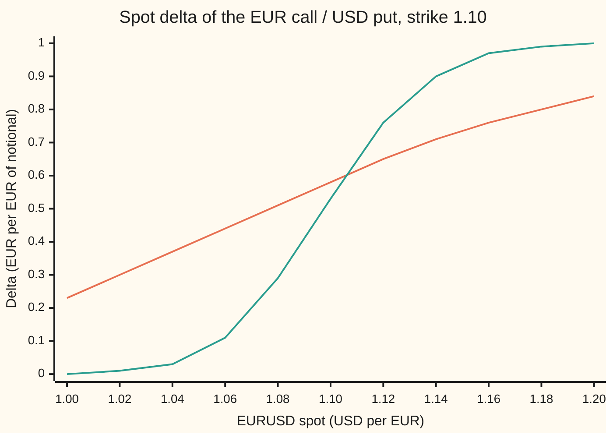

# The Greeks of a currency option: delta in euros, gamma and vega in dollars, and one rho for each currency

Financial mathematics → FX vanilla options - Garman-Kohlhagen and the desk conventions → Sensitivities in two currencies → The Greeks of a currency option

---

## General Overview

A bank has sold a client a one-year option on EUR 10 million. The option gives the client the right to buy those euros in a year at 1.1000 dollars each. Today one euro costs 1.1000 dollars. Dollar cash earns 5 percent a year, euro cash earns 3 percent, and the market prices the exchange rate's volatility (the yearly spread of its swings) at 10 percent. The premium is USD 535,558.

Five things can move under this option: the exchange rate, its volatility, the calendar, the dollar rate and the euro rate. The price change per unit move in one of them, the rest frozen, is a **Greek**; gamma, the change in delta, is the one second-order Greek here. The equity versions are on the Greeks shelf ([delta](../09-The%20Greeks%2C%20one%20each/01-delta.md) onward). A currency option adds two twists.

First, two interest rates pull in opposite directions: a higher dollar rate makes this option dearer, a higher euro rate cheaper. So there are two rhos, one per currency, with opposite signs. Second, each Greek comes out in its own currency. Delta is a number of euros. Vega and theta are dollars. And a bank that counts profit in euros sees one of them change in a way no exchange-rate conversion captures.

Per EUR 10 million, the option's Greeks read as follows, and the bank's own position is the opposite of each: delta EUR 5,810,119 (the euros the holder would sell to hedge); delta moves by 0.037524 for each 1 percent move in the exchange rate; USD 41,276 per point of volatility; USD −842 a day from the calendar; USD +585.56 per basis point on the dollar rate and USD −639.11 per basis point on the euro rate.

**Each Greek of a currency option is one partial derivative of the Garman-Kohlhagen price; the dollar rate reaches the price only through the discounted strike and the euro rate only through the discounted euros, so the two rhos have opposite signs, and a bank counting in euros hedges the same option with fewer euros, by exactly the premium.**

**What kind of fact this is:** a theorem inside the Garman-Kohlhagen model, proved on this card in Why it works. The model itself (constant volatility, an exchange rate that follows geometric Brownian motion) is an assumption about markets, not a law.

### The picture: how many euros hedge the option, as the rate moves

Freeze everything but the exchange rate and slide it from 1.00 to 1.20. The delta is the hedge ratio: the euros a holder of the option sells per euro of notional.



The gentle line (orange) is the option with twelve months left. The steep line (green) is the same option with one month left. At spot 1.10 with a year to go the hedge is 0.58 of the notional. The slope of the line is gamma. With a month left the slope near the strike is far steeper: the hedge flips from almost nothing to almost everything within a few cents of the rate.

---

## The formula

Notation first, in words. The currency pair EURUSD is quoted as dollars per euro, so the euro is the **foreign** currency (the thing being priced) and the dollar is the **domestic** currency (the money doing the pricing). A partial derivative, written with a curly d as in $\partial C/\partial S$, is the slope of the price against one input with every other input frozen ([partial-derivatives](../../06-Calculus%20and%20analysis/07-Several%20Variables/01-partial-derivatives.md)). $N(x)$ is the area under the standard bell curve to the left of $x$, and $\varphi(x)$ is the curve's height at $x$.

The price being differentiated is the Garman-Kohlhagen call ([garman-kohlhagen](01-garman-kohlhagen.md)), in dollars per euro of notional:

$$C = S\,e^{-r_f T}N(d_1) - K\,e^{-r_d T}N(d_2)$$

Its six Greeks:

$$\Delta = \frac{\partial C}{\partial S} = e^{-r_f T}N(d_1), \qquad \Gamma = \frac{\partial^2 C}{\partial S^2} = \frac{e^{-r_f T}\varphi(d_1)}{S\sigma\sqrt{T}}, \qquad \mathcal{V} = \frac{\partial C}{\partial \sigma} = S\,e^{-r_f T}\varphi(d_1)\sqrt{T}$$

$$\Theta = -\frac{\partial C}{\partial T} = -\frac{S\,e^{-r_f T}\varphi(d_1)\,\sigma}{2\sqrt{T}} + r_f\,S\,e^{-r_f T}N(d_1) - r_d\,K\,e^{-r_d T}N(d_2)$$

$$\rho_d = \frac{\partial C}{\partial r_d} = K\,T\,e^{-r_d T}N(d_2), \qquad \rho_f = \frac{\partial C}{\partial r_f} = -\,S\,T\,e^{-r_f T}N(d_1)$$

**Read it aloud:** delta is the discounted euros times their chance, gamma and vega are both the bell curve's height at the strike's distance, theta is decay plus euro carry minus dollar carry, and each rho is the years to expiry times the leg of the price that its own currency discounts.

| Symbol | Plain meaning | In our example | Push it up and the answer… |
| --- | --- | --- | --- |
| $S$ | spot: dollars per euro today | 1.1000 | delta rises toward $e^{-r_f T}$; vega peaks near the strike |
| $K$ | strike: dollars per euro the holder may pay | 1.1000 | delta falls |
| $T$ | years to expiry | 1 | both rhos grow roughly in step with $T$ |
| $r_d$, $r$ | the domestic rate: dollar interest, continuously compounded; it plays the part of the equity cards' $r$ | 5% | call price rises: $\rho_d$ is positive |
| $r_f$, $q$ | the foreign rate: euro interest, continuously compounded; it plays the part of the equity cards' dividend yield $q$ | 3% | call price falls: $\rho_f$ is negative |
| $\sigma$ | volatility: the yearly spread of the log exchange rate | 10% | price rises by vega per unit |
| $C$ | call price, dollars per euro of notional | 0.053556 | — |
| $N(x)$, $\varphi(x)$ | bell-curve area to the left of $x$; bell-curve height at $x$ | $N(d_1)$ = 0.598706, $\varphi(d_1)$ = 0.386668 | — |
| $d_1$, $d_2$ | the strike's distance in units of $\sigma\sqrt{T}$, counted in euros and in dollars | 0.25 and 0.15 | — |
| $e^{-r_f T}$, $e^{-r_d T}$ | what one euro, and one dollar, due at expiry are worth today | 0.970446 and 0.951229 | — |
| $\Delta$, $\Gamma$, $\mathcal{V}$ | delta, gamma, vega | 0.581012, 3.411276, 0.412764 | — |
| $\Theta$, $\rho_d$, $\rho_f$ | theta per year; dollar rho and euro rho per unit of rate | −0.030743, 0.585557, −0.639113 | — |

The helper distances, as on the pricing card:

$$d_1 = \frac{\ln(S/K) + (r_d - r_f + \tfrac12\sigma^2)T}{\sigma\sqrt{T}}, \qquad d_2 = d_1 - \sigma\sqrt{T}$$

In words: $d_2$ is how many spreads of room the rate has to end above the strike, in the world where dollars are the unit of account; $d_1$ is one spread more.

**Desk units, dated 2026-09-27.** Raw Greeks are per unit of each input, and a unit of volatility or of rate is 100 percentage points, which never happens. Desks rescale: vega per vol point (divide by 100), rho per basis point (divide by 10,000; a basis point is a hundredth of a percentage point), theta per calendar day (divide by 365), gamma as the change in delta for a 1 percent move in spot (multiply by $S$ and by 0.01). Then everything is multiplied by the notional. These are habits, not laws; a risk report states its own units, and the number means nothing without them.

### When it holds

- **Constant volatility.** The model uses one $\sigma$ for every strike. Real currency markets price a smile (a different volatility for each strike), so vega here is the slope for a parallel lift of the whole smile, and it misses the risk that the smile tilts; that is [vanna-and-volga-on-the-smile](../22-The%20FX%20smile%20-%20risk%20reversals%2C%20butterflies%20and%20vanna-volga/03-vanna-and-volga-on-the-smile.md).
- **Flat, constant interest rates.** One $r_d$ and one $r_f$ for the whole year. With a real yield curve, rho spreads across maturities; a single number per currency is the total of those buckets.
- **Small moves, one at a time.** Each Greek is a slope. A 1 percent move in spot is small; a 5 percent move needs gamma too, and a big move needs a full reprice.
- **European exercise.** The option pays only at expiry. Barriers break the smooth shape: [barrier-and-touch-greeks](../23-FX%20exotics%20as%20desks%20use%20them%20-%20digitals%2C%20touches%20and%20barriers/06-barrier-and-touch-greeks.md).

---

## Why it works

### Step 0: every Greek is a slope of one formula

The price is one formula in six inputs. Freeze five, move the sixth a little, and the ratio of the price change to the input change is that input's Greek. The tool is the [chain-rule](../../06-Calculus%20and%20analysis/02-Derivatives/03-chain-rule.md). Holding euros earns $r_f$, just as holding a share earns its dividend yield $q$, so every equity result carries over with $r_f$ for $q$ and $r_d$ for $r$. What is new is what two rates and two currencies mean for a desk.

### Step 1: one identity that makes the messy terms vanish

Every input except the strike sits inside $d_1$ and $d_2$, so every derivative produces terms like $S e^{-r_f T}\varphi(d_1)\,\partial d_1/\partial x$. They cancel because of one identity:

$$S\,e^{-r_f T}\varphi(d_1) = K\,e^{-r_d T}\varphi(d_2).$$

On the house numbers both sides are 1.1 × 0.970446 × 0.386668 and 1.1 × 0.951229 × $\varphi(0.15)$, and both equal 0.412764, which is also vega.

<details>
<summary>The algebra behind the identity</summary>

$\varphi(d_2)/\varphi(d_1) = e^{(d_1^2 - d_2^2)/2} = e^{(d_1 - d_2)(d_1 + d_2)/2}$. Here $d_1 - d_2 = \sigma\sqrt{T}$ and $d_1 + d_2 = 2\ln(S/K)/(\sigma\sqrt{T}) + 2(r_d - r_f)T/(\sigma\sqrt{T})$. Multiply: the exponent is $\ln(S/K) + (r_d - r_f)T$. So $\varphi(d_2) = \varphi(d_1)\,(S/K)\,e^{(r_d - r_f)T}$, which rearranges to the identity.

</details>

### Step 2: delta and gamma

Differentiate $C$ in $S$. The first term gives $e^{-r_f T}N(d_1)$ plus $S e^{-r_f T}\varphi(d_1)\,\partial d_1/\partial S$. The second term gives $-K e^{-r_d T}\varphi(d_2)\,\partial d_2/\partial S$. Since $d_1 - d_2$ does not depend on $S$, the two partial derivatives of $d$ are equal, and by Step 1 the two $\varphi$ terms cancel. What is left is $\Delta = e^{-r_f T}N(d_1)$ = 0.970446 × 0.598706 = 0.581012.

Its unit: $C$ is dollars per euro of notional and $S$ is dollars per euro, so their ratio is euros per euro of notional. Delta is a count of euros. On EUR 10 million the desk that sold this call buys EUR 5,810,119 against it (the client, long the call, would sell that many). The discount $e^{-r_f T}$ is there because the hedge is done in spot euros, which earn euro interest until expiry: 0.97 of a euro today grows into one euro at 3 percent.

Differentiate delta once more in $S$. Only $N(d_1)$ moves, and $\partial d_1/\partial S = 1/(S\sigma\sqrt{T})$. So $\Gamma = e^{-r_f T}\varphi(d_1)/(S\sigma\sqrt{T})$ = 3.411276. Its unit is euros of hedge per euro of notional, per one-dollar change in the price of a euro. A full dollar move in EURUSD is absurd, so desks quote the change in delta for a 1 percent spot move: 3.411276 × 1.10 × 0.01 = 0.037524, or EUR 375,240 of extra hedge on the 10 million.

### Step 3: vega

Differentiate in $\sigma$. Both $d$'s move, by different amounts this time, since $d_1 - d_2 = \sigma\sqrt{T}$ grows with $\sigma$. The identity turns the two $\varphi$ terms into $S e^{-r_f T}\varphi(d_1)$ times $\partial(d_1 - d_2)/\partial\sigma = \sqrt{T}$. So $\mathcal{V} = S e^{-r_f T}\varphi(d_1)\sqrt{T}$ = 0.412764 dollars per euro per unit of volatility. Per vol point, 0.004128; on the 10 million, USD 41,276. Vega is a dollar amount because the price is.

### Step 4: the two rhos, and why their signs differ

Differentiate in $r_d$. The dollar rate enters $d_1$ and $d_2$ equally, so by Step 1 those terms cancel, exactly as on [rho-and-dividend-rho](../09-The%20Greeks%2C%20one%20each/05-rho-and-dividend-rho.md). Only the explicit $e^{-r_d T}$ on the strike is left: $\rho_d = K T e^{-r_d T}N(d_2)$ = 0.585557. The call holder may pay USD 1.10 a year from now. A higher dollar rate makes that future payment cheaper today, so the call gains.

Differentiate in $r_f$. Again only the explicit discount survives, this time on the euros: $\rho_f = -S T e^{-r_f T}N(d_1)$ = −0.639113. The call holder may receive a euro a year from now. A higher euro rate makes that future euro worth less today, so the call loses.

So a currency option has one rho for each currency, and each rho belongs to one leg of the formula. Per basis point on the 10 million: USD +585.56 and USD −639.11.

Add them. $\rho_d + \rho_f = T\,(K e^{-r_d T}N(d_2) - S e^{-r_f T}N(d_1)) = -T C$ = −0.053556. When both rates rise together, the forward $S e^{(r_d - r_f)T}$ does not move, and the only effect left is heavier dollar discounting of the whole premium. That is the number a desk sees when the two central banks move in step: USD −53.56 per basis point, not the +585.56 of the dollar rho alone.

### Step 5: theta

Differentiate in $T$ and flip the sign, since time passing shortens $T$. Three terms survive, each with a meaning:

- $-S e^{-r_f T}\varphi(d_1)\sigma/(2\sqrt{T})$ = −0.020638 per year: the option's "maybe" melting, the same decay as on [theta](../09-The%20Greeks%2C%20one%20each/04-theta.md).
- $+r_f S e^{-r_f T}N(d_1)$: the euros the holder may receive are discounted for one day less, so they are worth a little more.
- $-r_d K e^{-r_d T}N(d_2)$: the dollars the holder may pay are discounted for one day less, so they cost a little more.

Together: −0.030743 per year. Per calendar day, −0.00008423 dollars per euro; on the 10 million, USD −842.

The three terms are not independent of the others. The option price satisfies the pricing equation $\Theta + \tfrac12\sigma^2 S^2\Gamma + (r_d - r_f)S\Delta - r_d C = 0$ ([black-scholes-equation](../08-The%20Black-Scholes%20call%20and%20put/07-black-scholes-equation.md), with $r_d$ for $r$ and $r_f$ for $q$). The checks rebuild theta from that equation using a delta and gamma found by an independent road, and land on −0.030743 again.

<details>
<summary>Detailed proof: the decay term (the only messy derivative)</summary>

Write $C = e^{-r_d T}(F N(d_1) - K N(d_2))$ with the forward $F = S e^{(r_d - r_f)T}$. Then $\partial C/\partial T = -r_d C + e^{-r_d T}(\partial F/\partial T)N(d_1) + e^{-r_d T}(F\varphi(d_1)\partial d_1/\partial T - K\varphi(d_2)\partial d_2/\partial T)$. The identity of Step 1 in forward form, $F\varphi(d_1) = K\varphi(d_2)$, collapses the bracket to $F\varphi(d_1)\,\partial(d_1 - d_2)/\partial T = F\varphi(d_1)\,\sigma/(2\sqrt{T})$. With $\partial F/\partial T = (r_d - r_f)F$ and $e^{-r_d T}F = S e^{-r_f T}$, expand $-r_d C$ and collect: $\partial C/\partial T = S e^{-r_f T}\varphi(d_1)\sigma/(2\sqrt{T}) - r_f S e^{-r_f T}N(d_1) + r_d K e^{-r_d T}N(d_2)$. Theta is minus this.

</details>

### Step 6: the same Greeks, counted in euros

A bank in Frankfurt holds the same contract. For it, the contract is a put on dollars, paid for in euros: the right to hand over USD 1.10 and receive EUR 1. The symmetry card proves the price in euros is $C/S$ ([premium-currency-and-foreign-domestic-symmetry](02-premium-currency-and-foreign-domestic-symmetry.md)): that is the same Garman-Kohlhagen put formula with spot $1/S$, strike $1/K$, domestic rate $r_f$ and foreign rate $r_d$, on USD 1.10 per euro of notional. The checks price it both ways and get 0.048687 euros per euro.

Now differentiate. Two different things happen.

**Greeks that hold spot still convert at spot.** Vega, theta and both rhos move one input other than $S$, and $S$ is a fixed number while they are taken. So the euro figure is the dollar figure divided by 1.10: vega 0.375240, theta −0.027948, euro-rate rho −0.581012, dollar-rate rho 0.532325. The checks get each three ways: put formula, dollar figure over spot, and bumps of an independent euro-side price. The labels swap (for Frankfurt the euro rate is domestic), but the directions do not: a higher dollar rate still helps the holder and a higher euro rate still hurts, in whichever currency the loss is counted.

**Delta does not convert at spot.** Spot is the thing being moved, and the euro value $C/S$ contains spot twice: once inside $C$ and once in the division. By the quotient rule, $\partial(C/S)/\partial S = \Delta/S - C/S^2$. Setting the Frankfurt bank's total exposure to zero gives a hedge of $\Delta - C/S$ euros per euro of notional: 0.581012 − 0.048687 = 0.532325, or EUR 5,323,248 on the 10 million, against EUR 5,810,119 for the New York bank. The gap is the premium itself, counted in euros: the option's value is a sum of dollars, and a bank counting in euros must hedge that sum too. The same number falls out of the put formula's own delta, $e^{-r_d T}N(d_2)$ scaled by $K/S$. This is the **premium-adjusted delta**, and when each convention is used is [fx-delta-conventions](04-fx-delta-conventions.md).

Gamma changes the same way, for the same reason; this card stops at delta.

---

## Worked numbers, by hand

House market: EURUSD spot 1.1000, strike 1.1000, USD rate 5%, EUR rate 3%, volatility 10%, one year, EUR 10 million.

| Step | Arithmetic | Value |
| --- | --- | --- |
| $d_1$ | $(0 + (0.05 - 0.03 + 0.005) \times 1)/0.10$ | 0.25 |
| $d_2$ | $0.25 - 0.10$ | 0.15 |
| $N(d_1)$, $N(d_2)$, $\varphi(d_1)$ | bell-curve table | 0.598706, 0.559618, 0.386668 |
| $e^{-r_f T}$, $e^{-r_d T}$ | $e^{-0.03}$, $e^{-0.05}$ | 0.970446, 0.951229 |
| premium | $1.1 \times 0.970446 \times 0.598706 - 1.1 \times 0.951229 \times 0.559618$ | 0.053556, USD 535,558 |
| delta | $0.970446 \times 0.598706$ | 0.581012 → EUR 5,810,119 |
| gamma | $0.970446 \times 0.386668 / (1.1 \times 0.10)$ | 3.411276 |
| gamma, 1% spot move | $3.411276 \times 1.1 \times 0.01$ | 0.037524 → EUR 375,240 |
| vega | $1.1 \times 0.970446 \times 0.386668$ | 0.412764 → USD 41,276 per vol point |
| theta | $-0.020638 + 0.03 \times 1.1 \times 0.581012 - 0.05 \times 1.1 \times 0.951229 \times 0.559618$ | −0.030743 → USD −842 a day |
| dollar rho | $1.1 \times 0.951229 \times 0.559618$ | 0.585557 → USD +585.56 per bp |
| euro rho | $-1.1 \times 0.970446 \times 0.598706$ | −0.639113 → USD −639.11 per bp |
| both rates up 1 bp | $-T \times 0.053556$ per unit | USD −53.56 |
| **hedge counted in euros** | $0.581012 - 0.053556/1.1$ | **0.532325 → EUR 5,323,248** |

In the world: a New York bank short this option buys EUR 5,810,119 today, loses USD 41,276 if implied volatility rises one point, earns USD 842 a day if nothing moves, and gains USD 53.56 per basis point if both central banks hike together.

### What breaks if you drop a piece

| Mistake | Comes out at | What went wrong |
| --- | --- | --- |
| Delta without $e^{-r_f T}$ | 0.598706, EUR 5,987,063 | That is the forward delta: the hedge in euros delivered at expiry, not in spot euros that earn 3 percent meanwhile |
| Vega per unit of volatility read as per point | USD 4,127,644 | A hundred times too big: one unit of volatility is 100 points |
| Report only the dollar rho for a move in both rates | USD +585.56 (true USD −53.56) | The euro rate moved too; the parallel move leaves the forward alone and only discounts the premium |
| Gamma with $\varphi(d_2)$ | 3.480188 (true 3.411276) | Gamma is the slope of $N(d_1)$, so it carries the height at $d_1$ |
| Theta without the euro carry term | −0.049916 (true −0.030743) | The equity habit with no dividend: it forgets that the euros discount too |

---

## How the Greeks move

The Greeks are not constants. Each is a snapshot at today's spot and today's time to expiry.

### Vega is a hump around the strike

Vega on the 10 million, per vol point, twelve months left, as spot moves:

```
spot   vega per vol point, USD, EUR 10m, 12 months (one block = USD 1,000, rounded)
1.00   ██████████████████████████████            30,237
1.05   ████████████████████████████████████████  39,720
1.10   █████████████████████████████████████████ 41,276
1.15   ███████████████████████████████████       34,981
1.20   █████████████████████████                 24,809
```

Far from the strike the outcome is nearly settled either way, so volatility matters little. Near the strike it matters most.

### Rho grows with the years, and the euro rho grows faster

Rho per basis point on the 10 million, spot and strike 1.10, sizes only (the dollar-rate rho is a gain, the euro-rate rho a loss):

```
maturity, rate      rho per bp, USD, EUR 10m (one block = USD 100)
0.25 yr, dollar     █                                     144
0.25 yr, euro       ██                                   -150
1.00 yr, dollar     ██████                                586
1.00 yr, euro       ██████                               -639
2.00 yr, dollar     ████████████                        1,163
2.00 yr, euro       █████████████                      -1,322
5.00 yr, dollar     ███████████████████████████         2,704
5.00 yr, euro       ██████████████████████████████████ -3,370
```

Each rho carries a factor $T$, so both grow with maturity. The euro rho grows faster here because the at-the-money call's delta rises with maturity when the dollar rate is the higher one: more euros at stake, more euro rate risk. On a three-month option rates barely register; on a five-year option they are among the largest risks on the sheet.

---

## Code, from first principles, and it actually runs

Both programs reach every Greek by three roads. Road 1 is the closed forms above. Road 2 bumps the closed-form price up and down and divides. Road 3 bumps a second price that never uses $d_1$ or $d_2$: an average of the payoff over the bell curve, added up by Simpson's rule (a way of adding thin slices). The normal area is a series written out in the file; nothing imported knows the answer. Then theta is rebuilt from the pricing equation, the parallel-rate identity is checked, and the whole contract is repriced from the euro side as a dollar put, where every euro-side Greek is found by its own formula and by its own bumps. Every number on the card is printed by both.

### Python

```python
# Garman-Kohlhagen Greeks -- the check behind the card.  Standard library only.
# EUR call / USD put.  Prices in USD per EUR of notional.  Three roads to every
# Greek: the closed forms, bumps of the closed-form price, bumps of a Simpson
# integral that never uses d1 or d2.  Then the other currency, via the symmetry.
from math import log, sqrt, exp, pi

def phi(x): return exp(-0.5 * x * x) / sqrt(2.0 * pi)      # bell-curve height
def N(x):                                                   # bell-curve area, own series
    if x < 0: return 1.0 - N(-x)
    term, total, n = x, x, 0
    while abs(term) > 1e-17 * abs(total):
        n += 1; term *= x * x / (2 * n + 1); total += term
    return 0.5 + phi(x) * total

def d12(S, K, rd, rf, v, T):
    d1 = (log(S / K) + (rd - rf + 0.5 * v * v) * T) / (v * sqrt(T))
    return d1, d1 - v * sqrt(T)

def gk(S, K, rd, rf, v, T, call=True):                      # road 1 price
    d1, d2 = d12(S, K, rd, rf, v, T)
    if call: return S * exp(-rf * T) * N(d1) - K * exp(-rd * T) * N(d2)
    return K * exp(-rd * T) * N(-d2) - S * exp(-rf * T) * N(-d1)

def gk_int(S, K, rd, rf, v, T, call=True, n=4000):          # road 3 price: no d1, no d2
    m, s = (rd - rf - 0.5 * v * v) * T, v * sqrt(T)
    zs = (log(K / S) - m) / s                                # where the payoff hits zero
    a, b = (zs, 12.0) if call else (-12.0, zs)
    h, tot = (b - a) / n, 0.0
    for i in range(n + 1):
        z = a + i * h
        w = 1 if i in (0, n) else (4 if i % 2 else 2)
        tot += w * (S * exp(m + s * z) - K) * phi(z)
    return (1 if call else -1) * exp(-rd * T) * tot * h / 3.0

def formulas(S, K, rd, rf, v, T, call=True):                # road 1 Greeks; w = +1 call, -1 put
    d1, d2 = d12(S, K, rd, rf, v, T)
    ef, ed, w = exp(-rf * T), exp(-rd * T), (1 if call else -1)
    return {"delta": w * ef * N(w * d1), "gamma": ef * phi(d1) / (S * v * sqrt(T)),
            "vega": S * ef * phi(d1) * sqrt(T),
            "theta": -S * ef * phi(d1) * v / (2 * sqrt(T)) + w * (rf * S * ef * N(w * d1) - rd * K * ed * N(w * d2)),
            "rho USD": w * K * T * ed * N(w * d2), "rho EUR": -w * S * T * ef * N(w * d1)}

def bumps(price, S, K, rd, rf, v, T, call=True):            # roads 2 and 3 Greeks
    p = lambda S=S, rd=rd, rf=rf, v=v, T=T: price(S, K, rd, rf, v, T, call)
    hS, e = 1e-4 * S, 1e-4
    return {"delta": (p(S=S + hS) - p(S=S - hS)) / (2 * hS),
            "gamma": (p(S=S + hS) - 2 * p() + p(S=S - hS)) / hS ** 2,
            "vega": (p(v=v + e) - p(v=v - e)) / (2 * e),
            "theta": -(p(T=T + e) - p(T=T - e)) / (2 * e),
            "rho USD": (p(rd=rd + e) - p(rd=rd - e)) / (2 * e),
            "rho EUR": (p(rf=rf + e) - p(rf=rf - e)) / (2 * e)}

S, K, rd, rf, v, T, NOT = 1.10, 1.10, 0.05, 0.03, 0.10, 1.0, 10_000_000
d1, d2 = d12(S, K, rd, rf, v, T)
C, P = gk(S, K, rd, rf, v, T), gk(S, K, rd, rf, v, T, False)
g1, g2, g3 = formulas(S, K, rd, rf, v, T), bumps(gk, S, K, rd, rf, v, T), bumps(gk_int, S, K, rd, rf, v, T)
print(f"d1 {d1:.6f}  d2 {d2:.6f}  N(d1) {N(d1):.6f}  N(d2) {N(d2):.6f}  phi(d1) {phi(d1):.6f}")
print(f"e^-rfT {exp(-rf * T):.6f}  e^-rdT {exp(-rd * T):.6f}  forward {S * exp((rd - rf) * T):.6f}")
print(f"call {C:.6f}  put {P:.6f}  call by integral {gk_int(S, K, rd, rf, v, T):.6f}")
print(f"{'Greek':<9}{'1 formula':>12}{'2 bump formula':>16}{'3 bump integral':>17}")
for k in g1: print(f"{k:<9}{g1[k]:>12.6f}{g2[k]:>16.6f}{g3[k]:>17.6f}")
# the PDE ties theta to the others: theta = rd C - (rd - rf) S delta - 0.5 v^2 S^2 gamma
th_pde = rd * C - (rd - rf) * S * g3["delta"] - 0.5 * v * v * S * S * g3["gamma"]
print(f"theta decay term {-S * exp(-rf * T) * phi(d1) * v / (2 * sqrt(T)):.6f}")
print(f"theta from the PDE, road-3 delta and gamma {th_pde:.6f}")
print(f"rho USD + rho EUR {g1['rho USD'] + g1['rho EUR']:.6f}   -T x call {-T * C:.6f}")
print("desk units on EUR 10m notional")
print(f"  premium                      USD {C * NOT:>12,.0f}")
print(f"  delta hedge, sell            EUR {g1['delta'] * NOT:>12,.0f}")
print(f"  gamma, delta change per 1% spot move {g1['gamma'] * S * 0.01:.6f} = EUR {g1['gamma'] * S * 0.01 * NOT:,.0f}")
print(f"  vega per vol point {g1['vega'] / 100:.6f} USD per EUR = USD {g1['vega'] / 100 * NOT:,.0f}")
print(f"  theta per day {g1['theta'] / 365:.8f} USD per EUR = USD {g1['theta'] / 365 * NOT:,.0f}")
print(f"  rho USD per bp USD {g1['rho USD'] * 1e-4 * NOT:,.2f}   rho EUR per bp USD {g1['rho EUR'] * 1e-4 * NOT:,.2f}")
# the other currency: the same contract is a USD put / EUR call for a EUR-based holder,
# spot 1/S EUR per USD, strike 1/K, domestic rate rf, foreign rate rd, on K USD per EUR notional
x, k = 1 / S, 1 / K
h1, h3 = formulas(x, k, rf, rd, v, T, False), bumps(gk_int, x, k, rf, rd, v, T, False)
print("seen from EUR, per EUR of notional, in EUR   [USD figure / spot]  [EUR-side bumps]")
print(f"  premium       {gk(x, k, rf, rd, v, T, False) * K:.6f}   [{C / S:.6f}]  [{gk_int(x, k, rf, rd, v, T, False) * K:.6f}]")
print(f"  vega          {h1['vega'] * K:.6f}   [{g1['vega'] / S:.6f}]  [{h3['vega'] * K:.6f}]")
print(f"  theta         {h1['theta'] * K:.6f}   [{g1['theta'] / S:.6f}]  [{h3['theta'] * K:.6f}]")
print(f"  rho EUR rate  {h1['rho USD'] * K:.6f}   [{g1['rho EUR'] / S:.6f}]  [{h3['rho USD'] * K:.6f}]")
print(f"  rho USD rate  {h1['rho EUR'] * K:.6f}   [{g1['rho USD'] / S:.6f}]  [{h3['rho EUR'] * K:.6f}]")
pa = -h1["delta"] * K / S                                    # EUR sold per EUR of notional
print(f"  EUR-side hedge, sell EUR per EUR {pa:.6f}   [delta - C/S {g1['delta'] - C / S:.6f}]  = EUR {pa * NOT:,.0f}")
print("what breaks")
print(f"  delta without e^-rfT (N(d1))        {N(d1):.6f}  EUR {N(d1) * NOT:,.0f}")
print(f"  vega per unit read as per point     USD {g1['vega'] * NOT:,.0f}")
print(f"  both rates up 1bp, only rho USD     USD {g1['rho USD'] * 1e-4 * NOT:,.2f}  true USD {(g2['rho USD'] + g2['rho EUR']) * 1e-4 * NOT:,.2f}")
print(f"  gamma with phi(d2)                  {exp(-rf * T) * phi(d2) / (S * v * sqrt(T)):.6f}")
print(f"  theta without the EUR carry term    {g1['theta'] - rf * S * exp(-rf * T) * N(d1):.6f}")
print("chart: spot delta across spot")
spots = [1.00 + 0.02 * i for i in range(11)]
print("  spot     " + " ".join(f"{s:.2f}" for s in spots))
for lab, t in (("12 months", 1.0), ("1 month  ", 1 / 12)):
    print(f"  {lab} " + " ".join(f"{formulas(s, K, rd, rf, v, t)['delta']:.2f}" for s in spots))
print("bars: vega per vol point on EUR 10m, USD, 12 months")
for s in (1.00, 1.05, 1.10, 1.15, 1.20):
    print(f"  spot {s:.2f}  USD {formulas(s, K, rd, rf, v, T)['vega'] / 100 * NOT:>7,.0f}")
print("bars: rho per bp on EUR 10m, USD, by maturity, spot and strike 1.10")
for t in (0.25, 1.0, 2.0, 5.0):
    f = formulas(S, K, rd, rf, v, t)
    print(f"  {t:>4.2f} yr  USD rate {f['rho USD'] * 1e-4 * NOT:>8,.0f}   EUR rate {f['rho EUR'] * 1e-4 * NOT:>8,.0f}")

for sp, tt in ((S, T), (1.12, 0.25)):                       # the house case and a 3-month one
    fa, fb = formulas(sp, K, rd, rf, v, tt), bumps(gk_int, sp, K, rd, rf, v, tt)
    for key in fa: assert abs(fa[key] - fb[key]) < 1e-5 * max(1, abs(fa[key])), key + ": formula vs integral road"
assert abs(C - 0.053556) < 5e-7, "house premium from the shelf"
assert abs(th_pde - g1["theta"]) < 1e-6, "theta: closed form vs PDE built from road 3"
assert abs(h1["vega"] * K - g3["vega"] / S) < 1e-6, "vega: EUR-side formula vs USD-side integral bump"
assert abs(pa - (g3["delta"] - C / S)) < 1e-6, "EUR-side hedge vs delta minus premium"
for j, u in (("vega", "vega"), ("theta", "theta"), ("rho USD", "rho EUR"), ("rho EUR", "rho USD")):
    assert abs(h1[j] * K - g1[u] / S) < 1e-9 and abs(h3[j] * K - g1[u] / S) < 1e-6, j + ": EUR side vs USD figure / spot"
assert abs(gk_int(x, k, rf, rd, v, T, False) * K - C / S) < 1e-6, "EUR premium: EUR-side integral vs C / S"
assert abs(g2["rho USD"] + g2["rho EUR"] + T * C) < 1e-6, "parallel rate shift = -T x price"
print("ALL CHECKS PASS")
```

**Ran 2026-09-27 on macOS, Python 3.14.6, standard library only. All checks passed. Output, pasted from the run:**

```
d1 0.250000  d2 0.150000  N(d1) 0.598706  N(d2) 0.559618  phi(d1) 0.386668
e^-rfT 0.970446  e^-rdT 0.951229  forward 1.122221
call 0.053556  put 0.032418  call by integral 0.053556
Greek       1 formula  2 bump formula  3 bump integral
delta        0.581012        0.581012         0.581012
gamma        3.411276        3.411276         3.411276
vega         0.412764        0.412764         0.412764
theta       -0.030743       -0.030743        -0.030743
rho USD      0.585557        0.585557         0.585557
rho EUR     -0.639113       -0.639113        -0.639113
theta decay term -0.020638
theta from the PDE, road-3 delta and gamma -0.030743
rho USD + rho EUR -0.053556   -T x call -0.053556
desk units on EUR 10m notional
  premium                      USD      535,558
  delta hedge, sell            EUR    5,810,119
  gamma, delta change per 1% spot move 0.037524 = EUR 375,240
  vega per vol point 0.004128 USD per EUR = USD 41,276
  theta per day -0.00008423 USD per EUR = USD -842
  rho USD per bp USD 585.56   rho EUR per bp USD -639.11
seen from EUR, per EUR of notional, in EUR   [USD figure / spot]  [EUR-side bumps]
  premium       0.048687   [0.048687]  [0.048687]
  vega          0.375240   [0.375240]  [0.375240]
  theta         -0.027948   [-0.027948]  [-0.027948]
  rho EUR rate  -0.581012   [-0.581012]  [-0.581012]
  rho USD rate  0.532325   [0.532325]  [0.532325]
  EUR-side hedge, sell EUR per EUR 0.532325   [delta - C/S 0.532325]  = EUR 5,323,248
what breaks
  delta without e^-rfT (N(d1))        0.598706  EUR 5,987,063
  vega per unit read as per point     USD 4,127,644
  both rates up 1bp, only rho USD     USD 585.56  true USD -53.56
  gamma with phi(d2)                  3.480188
  theta without the EUR carry term    -0.049916
chart: spot delta across spot
  spot     1.00 1.02 1.04 1.06 1.08 1.10 1.12 1.14 1.16 1.18 1.20
  12 months 0.23 0.30 0.37 0.44 0.51 0.58 0.65 0.71 0.76 0.80 0.84
  1 month   0.00 0.01 0.03 0.11 0.29 0.53 0.76 0.90 0.97 0.99 1.00
bars: vega per vol point on EUR 10m, USD, 12 months
  spot 1.00  USD  30,237
  spot 1.05  USD  39,720
  spot 1.10  USD  41,276
  spot 1.15  USD  34,981
  spot 1.20  USD  24,809
bars: rho per bp on EUR 10m, USD, by maturity, spot and strike 1.10
  0.25 yr  USD rate      144   EUR rate     -150
  1.00 yr  USD rate      586   EUR rate     -639
  2.00 yr  USD rate    1,163   EUR rate   -1,322
  5.00 yr  USD rate    2,704   EUR rate   -3,370
ALL CHECKS PASS
```

### Rust

```rust
// Garman-Kohlhagen Greeks -- the check behind the card.  Rust std only.
// EUR call / USD put.  Prices in USD per EUR of notional.  Three roads to every
// Greek: the closed forms, bumps of the closed-form price, bumps of a Simpson
// integral that never uses d1 or d2.  Then the other currency, via the symmetry.
use std::f64::consts::PI;

type Pricer = fn(f64, f64, f64, f64, f64, f64, bool) -> f64;
const NAMES: [&str; 6] = ["delta", "gamma", "vega", "theta", "rho USD", "rho EUR"];

fn phi(x: f64) -> f64 { (-0.5 * x * x).exp() / (2.0 * PI).sqrt() }
fn n(x: f64) -> f64 {                                       // bell-curve area, own series
    if x < 0.0 { return 1.0 - n(-x); }
    let (mut term, mut total, mut k) = (x, x, 0.0);
    while term.abs() > 1e-17 * total.abs() { k += 1.0; term *= x * x / (2.0 * k + 1.0); total += term; }
    0.5 + phi(x) * total
}
fn d12(s: f64, k: f64, rd: f64, rf: f64, v: f64, t: f64) -> (f64, f64) {
    let d1 = ((s / k).ln() + (rd - rf + 0.5 * v * v) * t) / (v * t.sqrt());
    (d1, d1 - v * t.sqrt())
}
fn gk(s: f64, k: f64, rd: f64, rf: f64, v: f64, t: f64, call: bool) -> f64 {   // road 1 price
    let (d1, d2) = d12(s, k, rd, rf, v, t);
    if call { s * (-rf * t).exp() * n(d1) - k * (-rd * t).exp() * n(d2) }
    else { k * (-rd * t).exp() * n(-d2) - s * (-rf * t).exp() * n(-d1) }
}
fn gk_int(s: f64, k: f64, rd: f64, rf: f64, v: f64, t: f64, call: bool) -> f64 { // road 3: no d1, no d2
    let (m, sd, steps) = ((rd - rf - 0.5 * v * v) * t, v * t.sqrt(), 4000usize);
    let zs = ((k / s).ln() - m) / sd;                        // where the payoff hits zero
    let (a, b) = if call { (zs, 12.0) } else { (-12.0, zs) };
    let h = (b - a) / steps as f64;
    let mut tot = 0.0;
    for i in 0..=steps {
        let z = a + i as f64 * h;
        let w = if i == 0 || i == steps { 1.0 } else if i % 2 == 1 { 4.0 } else { 2.0 };
        tot += w * (s * (m + sd * z).exp() - k) * phi(z);
    }
    (if call { 1.0 } else { -1.0 }) * (-rd * t).exp() * tot * h / 3.0
}
fn formulas(s: f64, k: f64, rd: f64, rf: f64, v: f64, t: f64, call: bool) -> [f64; 6] {
    let (d1, d2) = d12(s, k, rd, rf, v, t);
    let (ef, ed, w) = ((-rf * t).exp(), (-rd * t).exp(), if call { 1.0 } else { -1.0 });
    [w * ef * n(w * d1), ef * phi(d1) / (s * v * t.sqrt()), s * ef * phi(d1) * t.sqrt(),
     -s * ef * phi(d1) * v / (2.0 * t.sqrt()) + w * (rf * s * ef * n(w * d1) - rd * k * ed * n(w * d2)),
     w * k * t * ed * n(w * d2), -w * s * t * ef * n(w * d1)]
}
fn bumps(p: Pricer, s: f64, k: f64, rd: f64, rf: f64, v: f64, t: f64, call: bool) -> [f64; 6] {
    let (hs, e) = (1e-4 * s, 1e-4);
    let f = |s: f64, rd: f64, rf: f64, v: f64, t: f64| p(s, k, rd, rf, v, t, call);
    [(f(s + hs, rd, rf, v, t) - f(s - hs, rd, rf, v, t)) / (2.0 * hs),
     (f(s + hs, rd, rf, v, t) - 2.0 * f(s, rd, rf, v, t) + f(s - hs, rd, rf, v, t)) / (hs * hs),
     (f(s, rd, rf, v + e, t) - f(s, rd, rf, v - e, t)) / (2.0 * e),
     -(f(s, rd, rf, v, t + e) - f(s, rd, rf, v, t - e)) / (2.0 * e),
     (f(s, rd + e, rf, v, t) - f(s, rd - e, rf, v, t)) / (2.0 * e),
     (f(s, rd, rf + e, v, t) - f(s, rd, rf - e, v, t)) / (2.0 * e)]
}
fn commas(x: f64, dp: usize) -> String {                    // 1234567.8 -> "1,234,568"
    let raw = format!("{:.*}", dp, x.abs());
    let (int, frac) = match raw.find('.') { Some(i) => (&raw[..i], &raw[i..]), None => (&raw[..], "") };
    let mut out = String::new();
    for (i, c) in int.chars().enumerate() {
        if i > 0 && (int.len() - i) % 3 == 0 { out.push(','); }
        out.push(c);
    }
    format!("{}{}{}", if x < 0.0 && raw.trim_matches(|c| c == '0' || c == '.') != "" { "-" } else { "" }, out, frac)
}

fn main() {
    let (s, k, rd, rf, v, t, not) = (1.10, 1.10, 0.05, 0.03, 0.10, 1.0, 10_000_000.0);
    let (d1, d2) = d12(s, k, rd, rf, v, t);
    let (c, p) = (gk(s, k, rd, rf, v, t, true), gk(s, k, rd, rf, v, t, false));
    let g1 = formulas(s, k, rd, rf, v, t, true);
    let g2 = bumps(gk, s, k, rd, rf, v, t, true);
    let g3 = bumps(gk_int, s, k, rd, rf, v, t, true);
    println!("d1 {:.6}  d2 {:.6}  N(d1) {:.6}  N(d2) {:.6}  phi(d1) {:.6}", d1, d2, n(d1), n(d2), phi(d1));
    println!("e^-rfT {:.6}  e^-rdT {:.6}  forward {:.6}", (-rf * t).exp(), (-rd * t).exp(), s * ((rd - rf) * t).exp());
    println!("call {:.6}  put {:.6}  call by integral {:.6}", c, p, gk_int(s, k, rd, rf, v, t, true));
    println!("{:<9}{:>12}{:>16}{:>17}", "Greek", "1 formula", "2 bump formula", "3 bump integral");
    for i in 0..6 { println!("{:<9}{:>12.6}{:>16.6}{:>17.6}", NAMES[i], g1[i], g2[i], g3[i]); }
    let th_pde = rd * c - (rd - rf) * s * g3[0] - 0.5 * v * v * s * s * g3[1];
    println!("theta decay term {:.6}", -s * (-rf * t).exp() * phi(d1) * v / (2.0 * t.sqrt()));
    println!("theta from the PDE, road-3 delta and gamma {:.6}", th_pde);
    println!("rho USD + rho EUR {:.6}   -T x call {:.6}", g1[4] + g1[5], -t * c);
    println!("desk units on EUR 10m notional");
    println!("  premium                      USD {:>12}", commas(c * not, 0));
    println!("  delta hedge, sell            EUR {:>12}", commas(g1[0] * not, 0));
    println!("  gamma, delta change per 1% spot move {:.6} = EUR {}", g1[1] * s * 0.01, commas(g1[1] * s * 0.01 * not, 0));
    println!("  vega per vol point {:.6} USD per EUR = USD {}", g1[2] / 100.0, commas(g1[2] / 100.0 * not, 0));
    println!("  theta per day {:.8} USD per EUR = USD {}", g1[3] / 365.0, commas(g1[3] / 365.0 * not, 0));
    println!("  rho USD per bp USD {}   rho EUR per bp USD {}", commas(g1[4] * 1e-4 * not, 2), commas(g1[5] * 1e-4 * not, 2));
    // the other currency: a USD put / EUR call for a EUR-based holder, spot 1/S, strike 1/K,
    // domestic rate rf, foreign rate rd, on K USD per EUR of notional
    let (x, kk) = (1.0 / s, 1.0 / k);
    let h1 = formulas(x, kk, rf, rd, v, t, false);
    let h3 = bumps(gk_int, x, kk, rf, rd, v, t, false);
    println!("seen from EUR, per EUR of notional, in EUR   [USD figure / spot]  [EUR-side bumps]");
    println!("  premium       {:.6}   [{:.6}]  [{:.6}]", gk(x, kk, rf, rd, v, t, false) * k, c / s, gk_int(x, kk, rf, rd, v, t, false) * k);
    println!("  vega          {:.6}   [{:.6}]  [{:.6}]", h1[2] * k, g1[2] / s, h3[2] * k);
    println!("  theta         {:.6}   [{:.6}]  [{:.6}]", h1[3] * k, g1[3] / s, h3[3] * k);
    println!("  rho EUR rate  {:.6}   [{:.6}]  [{:.6}]", h1[4] * k, g1[5] / s, h3[4] * k);
    println!("  rho USD rate  {:.6}   [{:.6}]  [{:.6}]", h1[5] * k, g1[4] / s, h3[5] * k);
    let pa = -h1[0] * k / s;                                  // EUR sold per EUR of notional
    println!("  EUR-side hedge, sell EUR per EUR {:.6}   [delta - C/S {:.6}]  = EUR {}", pa, g1[0] - c / s, commas(pa * not, 0));
    println!("what breaks");
    println!("  delta without e^-rfT (N(d1))        {:.6}  EUR {}", n(d1), commas(n(d1) * not, 0));
    println!("  vega per unit read as per point     USD {}", commas(g1[2] * not, 0));
    println!("  both rates up 1bp, only rho USD     USD {}  true USD {}", commas(g1[4] * 1e-4 * not, 2), commas((g2[4] + g2[5]) * 1e-4 * not, 2));
    println!("  gamma with phi(d2)                  {:.6}", (-rf * t).exp() * phi(d2) / (s * v * t.sqrt()));
    println!("  theta without the EUR carry term    {:.6}", g1[3] - rf * s * (-rf * t).exp() * n(d1));
    println!("chart: spot delta across spot");
    let spots: Vec<f64> = (0..11).map(|i| 1.00 + 0.02 * i as f64).collect();
    println!("  spot     {}", spots.iter().map(|x| format!("{:.2}", x)).collect::<Vec<_>>().join(" "));
    for (lab, tt) in [("12 months", 1.0), ("1 month  ", 1.0 / 12.0)] {
        let row: Vec<String> = spots.iter().map(|&sp| format!("{:.2}", formulas(sp, k, rd, rf, v, tt, true)[0])).collect();
        println!("  {} {}", lab, row.join(" "));
    }
    println!("bars: vega per vol point on EUR 10m, USD, 12 months");
    for sp in [1.00, 1.05, 1.10, 1.15, 1.20] {
        println!("  spot {:.2}  USD {:>7}", sp, commas(formulas(sp, k, rd, rf, v, t, true)[2] / 100.0 * not, 0));
    }
    println!("bars: rho per bp on EUR 10m, USD, by maturity, spot and strike 1.10");
    for tt in [0.25, 1.0, 2.0, 5.0] {
        let f = formulas(s, k, rd, rf, v, tt, true);
        println!("  {:>4.2} yr  USD rate {:>8}   EUR rate {:>8}", tt, commas(f[4] * 1e-4 * not, 0), commas(f[5] * 1e-4 * not, 0));
    }

    for (sp, tt) in [(s, t), (1.12, 0.25)] {                 // the house case and a 3-month one
        let (fa, fb) = (formulas(sp, k, rd, rf, v, tt, true), bumps(gk_int, sp, k, rd, rf, v, tt, true));
        for i in 0..6 { assert!((fa[i] - fb[i]).abs() < 1e-5 * fa[i].abs().max(1.0), "{}: formula vs integral road", NAMES[i]); }
    }
    assert!((c - 0.053556).abs() < 5e-7, "house premium from the shelf");
    assert!((th_pde - g1[3]).abs() < 1e-6, "theta: closed form vs PDE built from road 3");
    assert!((h1[2] * k - g3[2] / s).abs() < 1e-6, "vega: EUR-side formula vs USD-side integral bump");
    assert!((pa - (g3[0] - c / s)).abs() < 1e-6, "EUR-side hedge vs delta minus premium");
    for (j, u) in [(2, 2), (3, 3), (4, 5), (5, 4)] {
        assert!((h1[j] * k - g1[u] / s).abs() < 1e-9 && (h3[j] * k - g1[u] / s).abs() < 1e-6, "{}: EUR side vs USD figure / spot", NAMES[j]);
    }
    assert!((gk_int(x, kk, rf, rd, v, t, false) * k - c / s).abs() < 1e-6, "EUR premium: EUR-side integral vs C / S");
    assert!((g2[4] + g2[5] + t * c).abs() < 1e-6, "parallel rate shift = -T x price");
    println!("ALL CHECKS PASS");
}
```

**Ran 2026-09-27 on macOS, rustc 1.98.1, no crates. All checks passed. Output, pasted from the run:**

```
d1 0.250000  d2 0.150000  N(d1) 0.598706  N(d2) 0.559618  phi(d1) 0.386668
e^-rfT 0.970446  e^-rdT 0.951229  forward 1.122221
call 0.053556  put 0.032418  call by integral 0.053556
Greek       1 formula  2 bump formula  3 bump integral
delta        0.581012        0.581012         0.581012
gamma        3.411276        3.411276         3.411276
vega         0.412764        0.412764         0.412764
theta       -0.030743       -0.030743        -0.030743
rho USD      0.585557        0.585557         0.585557
rho EUR     -0.639113       -0.639113        -0.639113
theta decay term -0.020638
theta from the PDE, road-3 delta and gamma -0.030743
rho USD + rho EUR -0.053556   -T x call -0.053556
desk units on EUR 10m notional
  premium                      USD      535,558
  delta hedge, sell            EUR    5,810,119
  gamma, delta change per 1% spot move 0.037524 = EUR 375,240
  vega per vol point 0.004128 USD per EUR = USD 41,276
  theta per day -0.00008423 USD per EUR = USD -842
  rho USD per bp USD 585.56   rho EUR per bp USD -639.11
seen from EUR, per EUR of notional, in EUR   [USD figure / spot]  [EUR-side bumps]
  premium       0.048687   [0.048687]  [0.048687]
  vega          0.375240   [0.375240]  [0.375240]
  theta         -0.027948   [-0.027948]  [-0.027948]
  rho EUR rate  -0.581012   [-0.581012]  [-0.581012]
  rho USD rate  0.532325   [0.532325]  [0.532325]
  EUR-side hedge, sell EUR per EUR 0.532325   [delta - C/S 0.532325]  = EUR 5,323,248
what breaks
  delta without e^-rfT (N(d1))        0.598706  EUR 5,987,063
  vega per unit read as per point     USD 4,127,644
  both rates up 1bp, only rho USD     USD 585.56  true USD -53.56
  gamma with phi(d2)                  3.480188
  theta without the EUR carry term    -0.049916
chart: spot delta across spot
  spot     1.00 1.02 1.04 1.06 1.08 1.10 1.12 1.14 1.16 1.18 1.20
  12 months 0.23 0.30 0.37 0.44 0.51 0.58 0.65 0.71 0.76 0.80 0.84
  1 month   0.00 0.01 0.03 0.11 0.29 0.53 0.76 0.90 0.97 0.99 1.00
bars: vega per vol point on EUR 10m, USD, 12 months
  spot 1.00  USD  30,237
  spot 1.05  USD  39,720
  spot 1.10  USD  41,276
  spot 1.15  USD  34,981
  spot 1.20  USD  24,809
bars: rho per bp on EUR 10m, USD, by maturity, spot and strike 1.10
  0.25 yr  USD rate      144   EUR rate     -150
  1.00 yr  USD rate      586   EUR rate     -639
  2.00 yr  USD rate    1,163   EUR rate   -1,322
  5.00 yr  USD rate    2,704   EUR rate   -3,370
ALL CHECKS PASS
```

The two outputs are identical to the printed precision.

> [!TIP]
> **Try changing**
> - **Guess first:** at one month left and spot 1.00, does the hedge matter? Read the chart row: delta 0.00, so the option barely moves with spot. At 1.20 it is 1.00: the option behaves like euros.
> - **Guess first:** both rates rise by one basis point together. Does the call gain, since its dollar rho is the positive one? It loses: the two rhos sum to minus the years times the price, USD −53.56 on the 10 million. Bump both `rd` and `rf` by 0.0001 to see it.
> - **Guess first:** at five years, which rate matters more? The rho bars answer: USD −3,370 per basis point on the euro rate against USD +2,704 on the dollar rate.

---

## The usual mistake

> [!warning]
> **Treating a currency option as having one rho.** An equity option has one interest rate and a dividend yield that desks often ignore. A currency option has two interest rates of equal standing, and they push the price in opposite directions. Reporting only the dollar rho says the option gains USD 585.56 per basis point when both rates rise; it actually loses USD 53.56. Hedging the dollar rate alone leaves the euro rate risk, USD −639.11 per basis point, fully open.
>
> - **Delta in the wrong currency.** Delta is a count of euros. Hedging with 5,810,119 dollars instead of euros under-hedges, because at 1.10 a dollar buys less than a euro.
> - **Converting delta at spot.** Vega, theta and rho convert between currencies by dividing by spot; delta does not. The euro-counting hedge is 0.532325, not 0.581012 / 1.10.
> - **Forward delta for a spot hedge.** $N(d_1)$ = 0.598706 is the hedge in euros delivered at expiry; in spot euros it is 0.581012.
> - **Vega units.** Per unit of volatility, 0.412764; per point, 0.004128. On the 10 million the difference is USD 4,127,644 against USD 41,276.

---

## Where you meet it in real life

- **An FX options desk's risk sheet.** Every morning each position is summarised as delta in the foreign currency, gamma per 1 percent, vega per vol point, theta per day and a rho per currency, then summed across the book. A pair's two rhos are listed separately because two central banks set them.
- **Corporate hedging.** A European exporter buying a dollar put to protect its dollar receipts counts in euros. Its bank's quote uses the premium-adjusted delta for exactly the reason of Step 6: [fx-delta-conventions](04-fx-delta-conventions.md).
- **Volatility trading.** Vega in dollars per point is how a trader sizes a view on implied volatility; turning a price back into a volatility is [fx-implied-volatility](07-fx-implied-volatility.md).

> **Say it back**
> Each Greek of a currency option is one slope of the Garman-Kohlhagen price. Delta is a number of euros, and vega and theta are dollar amounts. There are two rhos: the dollar rate helps a EUR call through its discounted strike, the euro rate hurts it through its discounted euros, and together they equal minus the years times the price. Seen from the euro side, every Greek that holds spot still converts at spot. Delta does not: a bank counting in euros hedges with fewer euros, fewer by the premium.

---

## What this builds on

- [garman-kohlhagen](01-garman-kohlhagen.md): the price this card differentiates.
- [premium-currency-and-foreign-domestic-symmetry](02-premium-currency-and-foreign-domestic-symmetry.md): the symmetry used in Step 6 to restate the Greeks in euros.
- [partial-derivatives](../../06-Calculus%20and%20analysis/07-Several%20Variables/01-partial-derivatives.md): slopes with every other input frozen.
- [chain-rule](../../06-Calculus%20and%20analysis/02-Derivatives/03-chain-rule.md): how each input reaches the price through $d_1$ and $d_2$.
- [delta](../09-The%20Greeks%2C%20one%20each/01-delta.md): the hedge ratio, derived for a share.
- [gamma](../09-The%20Greeks%2C%20one%20each/02-gamma.md): the slope of delta.
- [vega](../09-The%20Greeks%2C%20one%20each/03-vega.md): sensitivity to volatility.
- [theta](../09-The%20Greeks%2C%20one%20each/04-theta.md): sensitivity to the calendar.
- [rho-and-dividend-rho](../09-The%20Greeks%2C%20one%20each/05-rho-and-dividend-rho.md): the rate and dividend slopes whose FX form is the two rhos.

## Where this goes next

- [fx-delta-conventions](04-fx-delta-conventions.md): spot, forward and premium-adjusted deltas, and which one a quote means.
- [fx-implied-volatility](07-fx-implied-volatility.md): solving for volatility, with vega as the step size.
- [vanna-and-volga-on-the-smile](../22-The%20FX%20smile%20-%20risk%20reversals%2C%20butterflies%20and%20vanna-volga/03-vanna-and-volga-on-the-smile.md): the second-order Greeks that price the smile.
- [fx-digitals](../23-FX%20exotics%20as%20desks%20use%20them%20-%20digitals%2C%20touches%20and%20barriers/01-fx-digitals.md): an option whose price is close to a delta, and whose Greeks are sharper.
- [barrier-and-touch-greeks](../23-FX%20exotics%20as%20desks%20use%20them%20-%20digitals%2C%20touches%20and%20barriers/06-barrier-and-touch-greeks.md): Greeks that jump at a barrier.
- [quanto-greeks-and-hedging](../24-Quantos%20and%20composites/03-quanto-greeks-and-hedging.md): Greeks when the payoff is paid in a third currency.

Two banks hedge one option with different amounts of euros; which amount a quoted "25 delta" means, and so which strike it names, is the question the delta conventions answer.

---

## Sources

Verified 2026-09-27: every link below resolves to the publisher's page.

- Garman, Mark B., and Steven W. Kohlhagen. "Foreign Currency Option Values." *Journal of International Money and Finance* 2, no. 3 (1983): 231–237. [doi:10.1016/S0261-5606(83)80001-1](https://doi.org/10.1016/S0261-5606(83)80001-1). The model whose price this card differentiates.
- Reiswich, Dimitri, and Uwe Wystup. "A Guide to FX Options Quoting Conventions." *Journal of Derivatives* 18, no. 2 (2010): 58–68. [doi:10.3905/jod.2010.18.2.058](https://doi.org/10.3905/jod.2010.18.2.058). Spot, forward and premium-adjusted deltas, and why the premium currency changes the hedge.
- Wystup, Uwe. *FX Options and Structured Products*, 2nd ed. Wiley, 2017. [doi:10.1002/9781119192183](https://doi.org/10.1002/9781119192183). The Greeks of vanilla currency options in both currencies.
- Clark, Iain J. *Foreign Exchange Option Pricing: A Practitioner's Guide*. Wiley, 2011. [doi:10.1002/9781119208679](https://doi.org/10.1002/9781119208679). Desk units and risk reporting for FX options.
