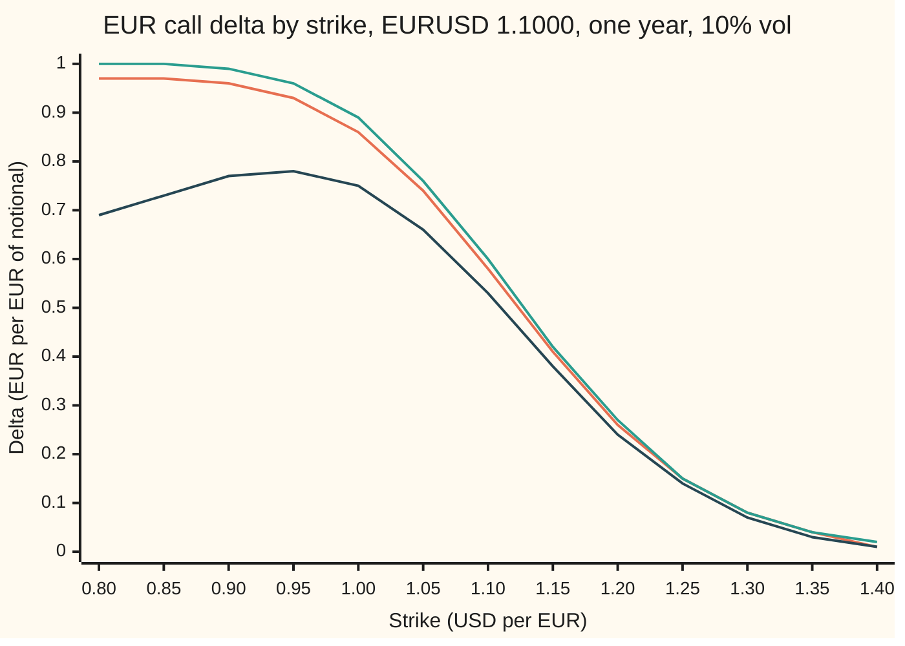
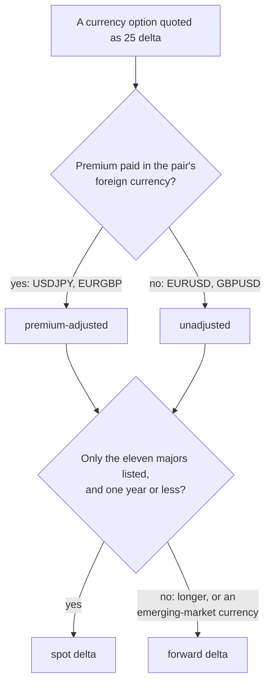

# Four deltas for one option: spot, forward, and premium-adjusted, and which one a currency desk means

[Syllabus](../../../SYLLABUS.md) → [Financial mathematics](../README.md) → [FX vanilla options - Garman-Kohlhagen and the desk conventions](../README.md#s21) → Four deltas for one option

---

## General Overview

A dealer sells a one-year option on EUR 10,000,000. It gives the buyer the right to buy those euros at 1.1000 dollars each. Today one euro costs 1.1000 dollars. Dollar interest is 5 percent a year, euro interest 3 percent, and the market prices the euro's jumpiness (its volatility) at 10 percent a year. This is the shelf's house market, priced on [Garman-Kohlhagen](01-garman-kohlhagen.md) at 0.053556 dollars per euro of notional (the amount the contract covers): USD 535,558 in all.

Having sold it, the dealer buys euros so that a small move in the exchange rate leaves the book flat. How many? Four answers are all correct, each for a different question:

```
Euros to buy against the sold EUR call, EUR 10,000,000 notional (one █ = EUR 200,000)
spot delta          █████████████████████████████      5,810,119
forward delta       ██████████████████████████████     5,987,063
premium-adj. spot   ███████████████████████████        5,323,248
premium-adj. fwd    ███████████████████████████        5,485,365
```

The top two differ in *what the dealer hedges with*: euros bought today, or euros bought for delivery in a year (a forward contract). The bottom two differ in *what currency the premium arrived in*: if the buyer paid in euros, the dealer already holds EUR 486,871 of them, and the hedge shrinks by exactly that much.

The number matters beyond hedging. Currency dealers quote options by delta, not by strike: "25-delta call at such-and-such volatility." The label "25 delta" picks a strike. For this market the four conventions put that strike at 1.20368, 1.20654, 1.19782 and 1.20082. Measured from the spot-delta reading, the others sit 28.6 pips higher, 58.6 pips lower and 28.6 pips lower (a pip is 0.0001 in the exchange rate), for the same two words.

**A currency option has one price but four deltas: the hedge in euros today, the hedge in forward euros, and each of those less the premium when the premium is paid in euros; a quote in delta means whichever one the market has agreed for that pair and maturity.**

**What kind of fact this is:** a convention: the four formulas are derived on this card in Why it works, but which one a quote means is market agreement, dated below.

---

## The formula

Notation first, in words. The Greek capital delta, $\Delta$, is the hedge ratio: euros to hold per euro of notional. A subscript says what the hedge is made of, S for spot (euros for delivery now) and F for forward (euros for delivery on the expiry date). The superscript "pa" marks the premium-adjusted versions.

$$\Delta_S = e^{-r_f T}N(d_1), \qquad \Delta_F = N(d_1)$$

$$\Delta_S^{\text{pa}} = \Delta_S - \frac{C}{S} = \frac{K}{S}\,e^{-r_d T}N(d_2), \qquad \Delta_F^{\text{pa}} = \frac{K}{F}\,N(d_2)$$

**Read it aloud:** the spot delta is $N(d_1)$ euros, shrunk by a year of euro interest; the forward delta drops the shrinking; the premium-adjusted delta takes away the premium, counted in euros, and what remains is the cash leg of the option measured in euros.

For a put (the right to sell euros at the strike) replace $N(d_1)$ by $-N(-d_1)$ and $N(d_2)$ by $-N(-d_2)$. The formulas are otherwise unchanged.

| Symbol | Plain meaning | In our example | Push it up and the deltas… |
| --- | --- | --- | --- |
| $S$ | spot rate: dollars per euro today | 1.1000 | rise on the out-of-the-money side, where quotes live |
| $K$ | strike: the dollars per euro the buyer may pay | 1.1000 | fall (the premium-adjusted call delta only right of its peak, Step 5) |
| $T$ | time to expiry, in years | 1 | spot and forward drift apart; the premium gap widens |
| $r_d$, $r_f$ | domestic (dollar) and foreign (euro) interest rates, continuously compounded | 5%, 3% | $r_f$ up lowers $\Delta_S$ through $e^{-r_f T}$ |
| $\sigma$ | volatility of the exchange rate, per year | 10% | here all four fall; the premium-adjusted ones fall fastest |
| $F$, $F_0$ | forward rate: $S\,e^{(r_d - r_f)T}$, the rate agreed today for exchange at $T$ ($F_0$: one fixed in an existing contract) | 1.122221 | |
| $d_1$, $d_2$ | distance to the strike in volatility units, $d_2 = d_1 - \sigma\sqrt{T}$ | 0.25, 0.15 | |
| $N(x)$, $n(x)$ | bell-curve area left of $x$, and the bell-curve height at $x$ | $N(d_1) = 0.598706$ | |
| $C$, $P$ | call and put premium, dollars per euro of notional | 0.053556, 0.032418 | |
| $e^{-r_f T}$, $e^{-r_d T}$ | euro and dollar discount factors: what one unit due at $T$ is worth today | 0.970446, 0.951229 | |
| $\Delta$, $\Delta_S$, $\Delta_F$ | delta in general; spot delta and forward delta, euros per euro of notional | 0.581012, 0.598706 | |
| $\Delta_S^{\text{pa}}$, $\Delta_F^{\text{pa}}$ | the same two, premium-adjusted | 0.532325, 0.548537 | |

The helper numbers, as on the Garman-Kohlhagen card:

$$d_1 = \frac{\ln(S/K) + (r_d - r_f + \tfrac12\sigma^2)\,T}{\sigma\sqrt{T}}, \qquad d_2 = d_1 - \sigma\sqrt{T}.$$

In words: $d_2$ is how many volatility units the forward sits above the strike, after the drag that volatility puts on the typical outcome; $d_1$ is one volatility unit further.

### When it holds

A convention is an agreement, not a claim that could fail; the formulas it names rest on the Garman-Kohlhagen model, and those assumptions carry over.

- **One volatility for all strikes.** Real markets charge a different volatility at each strike (the smile). The deltas above then miss the slope of that smile; [Hedging with the smile](../22-The%20FX%20smile%20-%20risk%20reversals%2C%20butterflies%20and%20vanna-volga/06-smile-adjusted-delta-and-sticky-delta.md) adds it back.
- **Constant, continuously compounded rates.** A desk reads its two discount factors off curves rather than flat rates; the formulas take those factors unchanged, but a quoted simple rate fed in as continuous gives slightly wrong ones.
- **European exercise.** One exercise date. Early exercise changes the price and every delta with it.
- **Premium paid today.** Real premiums settle on the spot date, usually two business days later; the discounting over those days is left out here.

---

## Why it works

### Step 0: a delta is a quantity of euros, and the question is what it is measured against

The option's price moves when the exchange rate moves. The dealer who sold it wants a holding of euros that moves by the same amount the other way. How many euros that takes depends on two things the formula cannot see: whether the euros are bought for delivery now or for delivery in a year, and whether the dealer's premium sits in dollars or in euros. Each answer to those two questions gives one of the four deltas. The option's price is the same in all four.

### Step 1: spot delta is the slope of the price

Buy one euro today and hold it. Its dollar value moves one-for-one with the rate, and the euro earns euro interest, so a euro due at expiry costs $e^{-r_f T}$ euros today. The slope of the call's price in the spot rate is (from [The Greeks of a currency option](03-garman-kohlhagen-greeks.md)):

$$\frac{\partial C}{\partial S} = e^{-r_f T}N(d_1) = 0.970446 \times 0.598706 = 0.581012.$$

The dealer buys 0.581012 euros per euro of notional: EUR 5,810,119. That is $\Delta_S$, the spot delta.

### Step 2: forward delta counts forward contracts instead

A forward contract to buy one euro at $T$ for a fixed $F_0$ dollars is worth $S\,e^{-r_f T} - F_0\,e^{-r_d T}$ dollars today. Move the spot a little and its value moves by $e^{-r_f T}$ times as much: less than a euro held today, because the euro arrives a year late and misses a year of euro interest. To match the option's slope with forward contracts takes

$$\Delta_F = \frac{e^{-r_f T}N(d_1)}{e^{-r_f T}} = N(d_1) = 0.598706$$

contracts per euro of notional. Same exposure, a bigger number, because each contract moves less than a euro in hand.

The forward delta has a tidy property. For a call and a put at the same strike, $N(d_1) - (-N(-d_1)) = 1$: the call's forward delta and the put's add to one in size. So a 25-delta call has the same strike as a 75-delta put, and a smile quoted in forward deltas uses one volatility for both. Spot deltas add to $e^{-r_f T}$ instead, which breaks the pairing slightly.

### Step 3: a premium paid in euros is already part of the hedge

Suppose the buyer pays the premium in euros: $C/S = 0.053556/1.1000 = 0.048687$ euros per euro of notional, EUR 486,871 in all. The dealer now holds those euros. Their dollar value moves with the rate exactly as bought euros would. They are already a hedge of 0.048687, so the dealer buys only

$$\Delta_S^{\text{pa}} = \Delta_S - \frac{C}{S} = 0.581012 - 0.048687 = 0.532325.$$

The same result comes from measuring the whole book in euros. The option is worth $C/S$ euros. Keeping its euro value flat, per euro of notional, needs $S$ times the slope of $C/S$:

$$S\,\frac{\partial}{\partial S}\!\left(\frac{C}{S}\right) = \frac{\partial C}{\partial S} - \frac{C}{S}.$$

This is the reason the adjustment exists: a hedge quoted in euros, for a premium paid in euros, must leave the euro account flat, not the dollar account.

### Step 4: the share half cancels, leaving the cash leg

Write out $C$ and subtract:

$$e^{-r_f T}N(d_1) - \frac{S e^{-r_f T}N(d_1) - K e^{-r_d T}N(d_2)}{S} = \frac{K}{S}\,e^{-r_d T}N(d_2).$$

The euro-leg term cancels exactly. What is left is the dollar strike the buyer pays, $K\,e^{-r_d T}N(d_2)$, turned into euros at today's rate. For the house call: $1 \times 0.951229 \times 0.559618 = 0.532325$, matching Step 3. Dividing by $e^{-r_f T}$, as in Step 2, gives the forward version $\frac{K}{F}N(d_2) = 0.548537$.

The adjustment always shrinks a call's delta, because $C/S$ is positive. For a put it makes the negative delta more negative: the spot delta $-0.389434$ less the put premium in euros is $-0.418905$.

### Step 5: the premium-adjusted call delta turns round

The unadjusted call delta falls steadily as the strike rises, so each delta names one strike. The premium-adjusted one does not. At very low strikes the call is almost certain to be exercised, so the dealer is paid almost the whole forward's value in euros and needs almost no further hedge. The adjusted delta climbs from zero, peaks, then falls. For the house market the peak is at strike 0.94288, with delta 0.778348.

<details>
<summary>Detailed proof: where the peak sits</summary>

Hold everything but $K$ fixed. The adjusted spot delta is $\frac{e^{-r_d T}}{S}\,K N(d_2)$, so it peaks where $K N(d_2)$ does. Since $d_2$ contains $-\ln K/(\sigma\sqrt{T})$, its slope in $K$ is $-1/(K\sigma\sqrt{T})$. Then
$$\frac{d}{dK}\big(K N(d_2)\big) = N(d_2) + K\,n(d_2)\cdot\frac{-1}{K\sigma\sqrt{T}} = N(d_2) - \frac{n(d_2)}{\sigma\sqrt{T}}.$$
Setting this to zero gives $\sigma\sqrt{T}\,N(d_2) = n(d_2)$, the condition in Reiswich and Wystup. Left of the peak the slope is positive; right of it, negative, because $N(d_2)$ falls and $n(d_2)/N(d_2)$ rises as $d_2$ falls. The forward version is the spot version divided by the constant $e^{-r_f T}$, so it peaks at the same strike. The check solves the condition for $d_2$ by bisection, turns it into a strike, and separately searches the delta itself by golden section; both land on 0.94288.

</details>

So an adjusted call delta above 0.778348 names no strike, and one below it names two. Desks mean the strike right of the peak, on the out-of-the-money side. A premium-adjusted put delta has no such turn: it falls steadily with the strike.

The inversion itself, and its bracket, belong to [Strike from delta](06-fx-strike-from-delta.md).

---

## Worked numbers, by hand

House market: $S = K = 1.1000$, $r_d = 5\%$, $r_f = 3\%$, $\sigma = 10\%$, $T = 1$.

| Step | Arithmetic | Value |
| --- | --- | --- |
| $d_1$ | $(0 + 0.05 - 0.03 + 0.005)/0.10$ | 0.25 |
| $d_2$ | $0.25 - 0.10$ | 0.15 |
| $N(d_1)$, $N(d_2)$ | bell-curve areas | 0.598706, 0.559618 |
| $F$ | $1.1 \times e^{0.02}$ | 1.122221 |
| $\Delta_F$ | $N(d_1)$ | 0.598706 |
| $\Delta_S$ | $0.970446 \times 0.598706$ | 0.581012 |
| premium in euros, $C/S$ | $0.053556 / 1.1$ | 0.048687 |
| $\Delta_S^{\text{pa}}$ | $0.581012 - 0.048687$, or $0.951229 \times 0.559618$ | 0.532325 |
| $\Delta_F^{\text{pa}}$ | $(1.1/1.122221) \times 0.559618$ | **0.548537** |

On EUR 10,000,000 the dealer buys EUR 5,810,119 spot, or 5,987,063 forward, or, with the premium received in euros, 5,323,248 spot or 5,485,365 forward.

The quote is where the label bites. Ask each convention for the 25-delta call strike:

| Convention | 25-delta call strike | Pips from the spot-delta strike | 25-delta put strike | Pips |
| --- | --- | --- | --- | --- |
| spot delta | 1.20368 | 0.0 | 1.05679 | 0.0 |
| forward delta | 1.20654 | 28.6 | 1.05428 | -25.1 |
| premium-adjusted spot | 1.19782 | -58.6 | 1.05179 | -50.0 |
| premium-adjusted forward | 1.20082 | -28.6 | 1.04941 | -73.9 |

Every strike in the table was found by bisection and then checked by repricing: nudge the spot, reprice by numerical integration, and the measured delta comes back as 0.250000 in that convention (printed for the calls; the puts pass the same test inside the asserts).

The adjustment always pulls strikes down. A call's adjusted delta is smaller, so reaching 25 needs a less out-of-the-money call. A put's adjusted delta is larger in size, so reaching 25 needs a more out-of-the-money put. Both move left.

### What breaks if you drop a piece

| Mistake | Comes out at | What went wrong |
| --- | --- | --- |
| hedge a spot book with the forward delta | 176,944 euros too many on EUR 10,000,000 | $N(d_1)$ counts forward contracts, not euros today |
| discount $N(d_1)$ at the dollar rate | 0.569507 instead of 0.581012 | the euro leg earns euro interest; $e^{-r_f T}$ belongs there |
| subtract the premium in dollars, $\Delta_S - C$ | 0.527456 instead of 0.532325 | the premium must be converted to euros first: $C/S$ |
| read a premium-adjusted 25-delta quote as spot delta | strike 58.6 pips too high | the wrong strike gets the quoted volatility |

### Why maturity decides the convention

The gap between spot and forward delta is the factor $e^{-r_f T}$, and the premium gap grows with $\sigma\sqrt{T}$. At the at-the-money-forward strike ($K = F$ for each maturity):

| Maturity | $\Delta_S$ | $\Delta_F$ | $\Delta_S^{\text{pa}}$ | $\Delta_F^{\text{pa}}$ |
| --- | --- | --- | --- | --- |
| 1 month | 0.5045 | 0.5058 | 0.4930 | 0.4942 |
| 1 year | 0.5046 | 0.5199 | 0.4659 | 0.4801 |
| 5 years | 0.4687 | 0.5445 | 0.3920 | 0.4555 |

At one month the four sit between 0.4930 and 0.5058. At five years the spot and forward deltas are 0.4687 and 0.5445, and the adjusted spot delta has fallen to 0.3920. Long-dated quotes use forward deltas, which do not carry the shrinking euro discount factor and keep the call-put pairing of Step 2 exact.

---

## Code, from first principles, and it actually runs

The code prices the house call, then reaches every delta by three independent roads. Road 1 is the closed forms, with a bell-curve area the code builds itself (Python sums its series; Rust integrates the bell-curve height by Simpson's rule). Road 2 never uses a delta formula: it prices the option by Simpson's rule over the payoff, nudges the spot one hundred-thousandth each way, and reads each delta off the change, dividing by the forward contract's own nudged value for the forward versions. Road 3 is a Monte Carlo of 400,000 paths from a hand-written random number generator, averaging "euro received if exercised" and "dollars paid if exercised, in euros", which are the spot and adjusted deltas by Step 4. Strikes come by bisection, closed forms where they exist, and a repricing check. The peak of the adjusted delta comes from its equation and from a direct search.

### Python

```python
# FX delta conventions -- the check behind the card.  Standard library only.
# The bell-curve area is its own series, prices come by Simpson's rule, strikes by
# bisection, and the Monte Carlo uses its own xorshift generator.  Nothing imported knows the answer.
from math import exp, log, sqrt, pi, cos
S, K, rd, rf, vol, T = 1.10, 1.10, 0.05, 0.03, 0.10, 1.0      # EURUSD house market: USD 5%, EUR 3%

def n(x): return exp(-0.5 * x * x) / sqrt(2 * pi)
def N(x):                                   # 0.5 + n(x) * (x + x^3/3 + x^5/15 + ...)
    if x < -9: return 0.0
    if x > 9: return 1.0
    term, total, k = x, x, 1
    while abs(term) > 1e-17 * abs(total) + 1e-300:
        term *= x * x / (2 * k + 1); total += term; k += 1
    return 0.5 + n(x) * total
def Ninv(p):                                 # Newton on the series N
    x = 0.0
    for _ in range(60): x -= (N(x) - p) / n(x)
    return x
def d12(s, k, t, v):
    d1 = (log(s / k) + (rd - rf + 0.5 * v * v) * t) / (v * sqrt(t))
    return d1, d1 - v * sqrt(t)
def deltas(s, k, t, v, phi=1):               # spot, forward, premium-adjusted spot and forward
    d1, d2 = d12(s, k, t, v); f = s * exp((rd - rf) * t)
    return (phi * exp(-rf * t) * N(phi * d1), phi * N(phi * d1),
            phi * exp(-rd * t) * k / s * N(phi * d2), phi * k / f * N(phi * d2))
def gk(s, k, t, v, phi=1):
    d1, d2 = d12(s, k, t, v)
    return phi * (s * exp(-rf * t) * N(phi * d1) - k * exp(-rd * t) * N(phi * d2))
def simpson_price(s, k, t, v, phi=1, m=4000):  # Road 2: average the payoff over the bell curve, no N
    zk = (log(k / s) - (rd - rf - 0.5 * v * v) * t) / (v * sqrt(t))
    a, b = (zk, 9.0) if phi == 1 else (-9.0, zk)
    h = (b - a) / m; tot = 0.0
    for i in range(m + 1):
        z = a + i * h; w = 1 if i in (0, m) else (4 if i % 2 else 2)
        tot += w * max(phi * (s * exp((rd - rf - 0.5 * v * v) * t + v * sqrt(t) * z) - k), 0.0) * n(z)
    return exp(-rd * t) * tot * h / 3
def bumped(k, phi=1, h=1e-5):                # Road 2: bump spot, reprice by Simpson
    up, dn = simpson_price(S + h, k, T, vol, phi), simpson_price(S - h, k, T, vol, phi)
    fwd_contract = (exp(-rf * T) * (S + h) - exp(-rf * T) * (S - h)) / (2 * h)   # one EUR forward
    spot = (up - dn) / (2 * h)
    pa = S * (up / (S + h) - dn / (S - h)) / (2 * h)
    return spot, spot / fwd_contract, pa, pa / fwd_contract
def monte_carlo(paths=400000):               # Road 3: pathwise averages, xorshift + Box-Muller
    st = 88172645463325252; acc_s = acc_c = 0.0
    def u():
        nonlocal st
        st ^= (st << 13) & 0xFFFFFFFFFFFFFFFF; st ^= st >> 7; st ^= (st << 17) & 0xFFFFFFFFFFFFFFFF
        return ((st >> 11) + 0.5) / 9007199254740992.0
    for _ in range(paths // 2):
        z = sqrt(-2 * log(u())) * cos(2 * pi * u())
        for zz in (z, -z):                   # antithetic pair
            sT = S * exp((rd - rf - 0.5 * vol * vol) * T + vol * sqrt(T) * zz)
            if sT > K: acc_s += sT / S; acc_c += K / S
    ms, mc = exp(-rd * T) * acc_s / paths, exp(-rd * T) * acc_c / paths
    return ms, ms / exp(-rf * T), mc, mc / exp(-rf * T)
def strike_for(target, which, phi=1):        # bisection on strike, any convention
    lo, hi = 0.95, 2.5                        # right of the premium-adjusted peak
    if phi == -1: lo, hi = 0.5, 1.5
    for _ in range(200):
        mid = 0.5 * (lo + hi)
        if deltas(S, mid, T, vol, phi)[which] > target: lo = mid
        else: hi = mid
    return 0.5 * (lo + hi)

names = ("spot delta", "forward delta", "pa spot delta", "pa forward delta")
d1, d2 = d12(S, K, T, vol); F = S * exp((rd - rf) * T); C, P = gk(S, K, T, vol), gk(S, K, T, vol, -1)
print(f"d1 {d1:.6f}   d2 {d2:.6f}   N(d1) {N(d1):.6f}   N(d2) {N(d2):.6f}")
print(f"forward F {F:.6f}   e^-rf T {exp(-rf * T):.6f}   e^-rd T {exp(-rd * T):.6f}")
Cs = simpson_price(S, K, T, vol)
print(f"call C formula {C:.6f}   Simpson {Cs:.6f}   in EUR C/S {C / S:.6f}   put P {P:.6f}")
form, bump, mc = deltas(S, K, T, vol), bumped(K), monte_carlo()
print("call deltas          formula    bump      Monte Carlo")
for i in range(4): print(f"  {names[i]:<18}{form[i]:9.6f}{bump[i]:10.6f}{mc[i]:10.4f}")
pf, pb = deltas(S, K, T, vol, -1), bumped(K, -1)
print("put deltas           formula    bump")
for i in range(4): print(f"  {names[i]:<18}{pf[i]:9.6f}{pb[i]:10.6f}")
print("hedge for a sold EUR 10,000,000 call, EUR to buy")
for i in range(4): print(f"  {names[i]:<18}{1e7 * form[i]:12.0f}")
print(f"  premium received  EUR {1e7 * C / S:.0f} = USD {1e7 * C:.0f}")
print("25-delta call strike  closed form  bisection  pips vs spot  Simpson delta")
ks = [strike_for(0.25, i) for i in range(4)]
closed = [F * exp(-vol * sqrt(T) * Ninv(0.25 / exp(-rf * T)) + 0.5 * vol * vol * T),
          F * exp(-vol * sqrt(T) * Ninv(0.25) + 0.5 * vol * vol * T)]
for i in range(4):
    cf = f"{closed[i]:11.5f}" if i < 2 else f"{'-':>11}"
    print(f"  {names[i]:<18}{cf}{ks[i]:11.5f}{(ks[i] - ks[0]) * 1e4:10.1f}{bumped(ks[i])[i]:12.6f}")
print("25-delta put strike   bisection  pips vs spot")
kp = [strike_for(-0.25, i, -1) for i in range(4)]
for i in range(4): print(f"  {names[i]:<18}{kp[i]:11.5f}{(kp[i] - kp[0]) * 1e4:10.1f}")
lo, hi = 0.0, 5.0                              # peak of pa call delta: vol sqrt(T) N(d2) = n(d2)
for _ in range(200):
    mid = 0.5 * (lo + hi)
    if vol * sqrt(T) * N(mid) - n(mid) < 0: lo = mid
    else: hi = mid
k_peak = F * exp(-mid * vol * sqrt(T) - 0.5 * vol * vol * T)
a, b = 0.5, 1.10                               # golden-section search on the pa spot delta itself
for _ in range(200):
    c1, c2 = b - 0.618034 * (b - a), a + 0.618034 * (b - a)
    if deltas(S, c1, T, vol)[2] < deltas(S, c2, T, vol)[2]: a = c1
    else: b = c2
print(f"pa call delta peak: strike {k_peak:.5f} (equation) {0.5 * (a + b):.5f} (search), delta {deltas(S, k_peak, T, vol)[2]:.6f}")
print("what breaks")
print(f"  forward delta used as spot hedge, extra EUR {1e7 * (form[1] - form[0]):.0f}")
print(f"  e^-rd T in spot delta          {exp(-rd * T) * N(d1):.6f}")
print(f"  premium subtracted in USD      {form[0] - C:.6f}")
print(f"  pa read as spot, 25d call pips {(ks[0] - ks[2]) * 1e4:.1f}")
print("at-the-money-forward strike: spot, forward, pa spot, pa forward")
for lab, t in (("1 month", 1 / 12), ("1 year", 1.0), ("5 years", 5.0)):
    ft = S * exp((rd - rf) * t)
    print(f"  {lab:<8}" + "".join(f"{x:9.4f}" for x in deltas(S, ft, t, vol)))
print(f"try: vol 20%        " + "".join(f"{x:9.4f}" for x in deltas(S, K, T, 0.20)))
grid = [0.80 + 0.05 * i for i in range(13)]
print("chart, strike    " + " ".join(f"{k:5.2f}" for k in grid))
for i, lab in ((0, "chart, spot     "), (1, "chart, forward  "), (2, "chart, pa spot  ")):
    print(lab + " " + " ".join(f"{deltas(S, k, T, vol)[i]:5.2f}" for k in grid))

assert abs(Cs - C) < 1e-10, "formula vs Simpson premium"
assert all(abs(form[i] - bump[i]) < 1e-7 for i in range(4)), "closed forms vs bump-and-reprice"
assert all(abs(form[i] - mc[i]) < 4e-3 for i in range(4)), "closed forms vs Monte Carlo"
assert all(abs(pf[i] - pb[i]) < 1e-7 for i in range(4)), "put deltas vs bump"
assert all(abs(closed[i] - ks[i]) < 1e-9 for i in range(2)), "closed-form strikes vs bisection"
assert all(abs(bumped(ks[i])[i] - 0.25) < 1e-6 for i in range(4)), "each strike really is 25 delta"
assert all(abs(bumped(kp[i], -1)[i] + 0.25) < 1e-6 for i in range(4)), "each put strike really is -25 delta"
assert abs(k_peak - 0.5 * (a + b)) < 1e-6, "peak by equation vs by search"
print("ALL CHECKS PASS")
```

**Ran 2026-09-27 on macOS, Python 3.14.6, standard library only. All checks passed. Output, pasted from the run:**

```
d1 0.250000   d2 0.150000   N(d1) 0.598706   N(d2) 0.559618
forward F 1.122221   e^-rf T 0.970446   e^-rd T 0.951229
call C formula 0.053556   Simpson 0.053556   in EUR C/S 0.048687   put P 0.032418
call deltas          formula    bump      Monte Carlo
  spot delta         0.581012  0.581012    0.5815
  forward delta      0.598706  0.598706    0.5992
  pa spot delta      0.532325  0.532325    0.5330
  pa forward delta   0.548537  0.548537    0.5492
put deltas           formula    bump
  spot delta        -0.389434 -0.389434
  forward delta     -0.401294 -0.401294
  pa spot delta     -0.418905 -0.418905
  pa forward delta  -0.431662 -0.431662
hedge for a sold EUR 10,000,000 call, EUR to buy
  spot delta             5810119
  forward delta          5987063
  pa spot delta          5323248
  pa forward delta       5485365
  premium received  EUR 486871 = USD 535558
25-delta call strike  closed form  bisection  pips vs spot  Simpson delta
  spot delta            1.20368    1.20368       0.0    0.250000
  forward delta         1.20654    1.20654      28.6    0.250000
  pa spot delta               -    1.19782     -58.6    0.250000
  pa forward delta            -    1.20082     -28.6    0.250000
25-delta put strike   bisection  pips vs spot
  spot delta            1.05679       0.0
  forward delta         1.05428     -25.1
  pa spot delta         1.05179     -50.0
  pa forward delta      1.04941     -73.9
pa call delta peak: strike 0.94288 (equation) 0.94288 (search), delta 0.778348
what breaks
  forward delta used as spot hedge, extra EUR 176944
  e^-rd T in spot delta          0.569507
  premium subtracted in USD      0.527456
  pa read as spot, 25d call pips 58.6
at-the-money-forward strike: spot, forward, pa spot, pa forward
  1 month    0.5045   0.5058   0.4930   0.4942
  1 year     0.5046   0.5199   0.4659   0.4801
  5 years    0.4687   0.5445   0.3920   0.4555
try: vol 20%           0.5621   0.5793   0.4756   0.4901
chart, strike     0.80  0.85  0.90  0.95  1.00  1.05  1.10  1.15  1.20  1.25  1.30  1.35  1.40
chart, spot       0.97  0.97  0.96  0.93  0.86  0.74  0.58  0.41  0.26  0.15  0.08  0.04  0.01
chart, forward    1.00  1.00  0.99  0.96  0.89  0.76  0.60  0.42  0.27  0.15  0.08  0.04  0.02
chart, pa spot    0.69  0.73  0.77  0.78  0.75  0.66  0.53  0.38  0.24  0.14  0.07  0.03  0.01
ALL CHECKS PASS
```

### Rust

```rust
// FX delta conventions -- the check behind the card.  Rust std only, no crates.
// The bell-curve area is Simpson's rule under the density, prices come by Simpson's rule
// over the payoff, strikes by bisection, and the Monte Carlo uses its own xorshift generator.
use std::f64::consts::PI;
const S: f64 = 1.10; const K: f64 = 1.10; const RD: f64 = 0.05; const RF: f64 = 0.03;
const VOL: f64 = 0.10; const T: f64 = 1.0;

fn n(x: f64) -> f64 { (-0.5 * x * x).exp() / (2.0 * PI).sqrt() }
fn nn(x: f64) -> f64 {                       // 0.5 plus the area under n from 0 to x
    if x.abs() > 9.0 { return if x > 0.0 { 1.0 } else { 0.0 }; }
    let m = 4000; let h = x / m as f64; let mut tot = 0.0;
    for i in 0..=m { let w = if i == 0 || i == m { 1.0 } else if i % 2 == 1 { 4.0 } else { 2.0 }; tot += w * n(i as f64 * h); }
    0.5 + tot * h / 3.0
}
fn ninv(p: f64) -> f64 { let mut x = 0.0; for _ in 0..60 { x -= (nn(x) - p) / n(x); } x }
fn d12(s: f64, k: f64, t: f64, v: f64) -> (f64, f64) {
    let d1 = ((s / k).ln() + (RD - RF + 0.5 * v * v) * t) / (v * t.sqrt()); (d1, d1 - v * t.sqrt())
}
fn deltas(s: f64, k: f64, t: f64, v: f64, phi: f64) -> [f64; 4] {
    let (d1, d2) = d12(s, k, t, v); let f = s * ((RD - RF) * t).exp();
    [phi * (-RF * t).exp() * nn(phi * d1), phi * nn(phi * d1),
     phi * (-RD * t).exp() * k / s * nn(phi * d2), phi * k / f * nn(phi * d2)]
}
fn gk(s: f64, k: f64, t: f64, v: f64, phi: f64) -> f64 {
    let (d1, d2) = d12(s, k, t, v);
    phi * (s * (-RF * t).exp() * nn(phi * d1) - k * (-RD * t).exp() * nn(phi * d2))
}
fn simpson_price(s: f64, k: f64, t: f64, v: f64, phi: f64) -> f64 {   // Road 2, no N
    let m = 4000; let zk = ((k / s).ln() - (RD - RF - 0.5 * v * v) * t) / (v * t.sqrt());
    let (a, b) = if phi > 0.0 { (zk, 9.0) } else { (-9.0, zk) };
    let h = (b - a) / m as f64; let mut tot = 0.0;
    for i in 0..=m {
        let z = a + i as f64 * h; let w = if i == 0 || i == m { 1.0 } else if i % 2 == 1 { 4.0 } else { 2.0 };
        let st = s * ((RD - RF - 0.5 * v * v) * t + v * t.sqrt() * z).exp();
        tot += w * (phi * (st - k)).max(0.0) * n(z);
    }
    (-RD * t).exp() * tot * h / 3.0
}
fn bumped(k: f64, phi: f64) -> [f64; 4] {    // Road 2: bump spot, reprice by Simpson
    let h = 1e-5;
    let (up, dn) = (simpson_price(S + h, k, T, VOL, phi), simpson_price(S - h, k, T, VOL, phi));
    let fwd_contract = ((-RF * T).exp() * (S + h) - (-RF * T).exp() * (S - h)) / (2.0 * h);
    let spot = (up - dn) / (2.0 * h); let pa = S * (up / (S + h) - dn / (S - h)) / (2.0 * h);
    [spot, spot / fwd_contract, pa, pa / fwd_contract]
}
fn monte_carlo(paths: usize) -> [f64; 4] {  // Road 3: pathwise averages, xorshift + Box-Muller
    let mut st: u64 = 88172645463325252; let (mut acc_s, mut acc_c) = (0.0, 0.0);
    let mut u = || { st ^= st << 13; st ^= st >> 7; st ^= st << 17; ((st >> 11) as f64 + 0.5) / 9007199254740992.0 };
    for _ in 0..paths / 2 {
        let z = (-2.0 * u().ln()).sqrt() * (2.0 * PI * u()).cos();
        for zz in [z, -z] {
            let st_t = S * ((RD - RF - 0.5 * VOL * VOL) * T + VOL * T.sqrt() * zz).exp();
            if st_t > K { acc_s += st_t / S; acc_c += K / S; }
        }
    }
    let ms = (-RD * T).exp() * acc_s / paths as f64; let mc = (-RD * T).exp() * acc_c / paths as f64;
    [ms, ms / (-RF * T).exp(), mc, mc / (-RF * T).exp()]
}
fn strike_for(target: f64, which: usize, phi: f64) -> f64 {
    let (mut lo, mut hi) = if phi > 0.0 { (0.95, 2.5) } else { (0.5, 1.5) };
    for _ in 0..200 {
        let mid = 0.5 * (lo + hi);
        if deltas(S, mid, T, VOL, phi)[which] > target { lo = mid } else { hi = mid }
    }
    0.5 * (lo + hi)
}
fn row(v: [f64; 4]) -> String { v.iter().map(|x| format!("{:9.4}", x)).collect() }

fn main() {
    let names = ["spot delta", "forward delta", "pa spot delta", "pa forward delta"];
    let (d1, d2) = d12(S, K, T, VOL); let f = S * ((RD - RF) * T).exp();
    let (c, p) = (gk(S, K, T, VOL, 1.0), gk(S, K, T, VOL, -1.0));
    println!("d1 {:.6}   d2 {:.6}   N(d1) {:.6}   N(d2) {:.6}", d1, d2, nn(d1), nn(d2));
    println!("forward F {:.6}   e^-rf T {:.6}   e^-rd T {:.6}", f, (-RF * T).exp(), (-RD * T).exp());
    let cs = simpson_price(S, K, T, VOL, 1.0);
    println!("call C formula {:.6}   Simpson {:.6}   in EUR C/S {:.6}   put P {:.6}", c, cs, c / S, p);
    let (form, bump, mc) = (deltas(S, K, T, VOL, 1.0), bumped(K, 1.0), monte_carlo(400000));
    println!("call deltas          formula    bump      Monte Carlo");
    for i in 0..4 { println!("  {:<18}{:9.6}{:10.6}{:10.4}", names[i], form[i], bump[i], mc[i]); }
    let (pf, pb) = (deltas(S, K, T, VOL, -1.0), bumped(K, -1.0));
    println!("put deltas           formula    bump");
    for i in 0..4 { println!("  {:<18}{:9.6}{:10.6}", names[i], pf[i], pb[i]); }
    println!("hedge for a sold EUR 10,000,000 call, EUR to buy");
    for i in 0..4 { println!("  {:<18}{:12.0}", names[i], 1e7 * form[i]); }
    println!("  premium received  EUR {:.0} = USD {:.0}", 1e7 * c / S, 1e7 * c);
    println!("25-delta call strike  closed form  bisection  pips vs spot  Simpson delta");
    let ks: Vec<f64> = (0..4).map(|i| strike_for(0.25, i, 1.0)).collect();
    let closed = [f * (-VOL * T.sqrt() * ninv(0.25 / (-RF * T).exp()) + 0.5 * VOL * VOL * T).exp(),
                  f * (-VOL * T.sqrt() * ninv(0.25) + 0.5 * VOL * VOL * T).exp()];
    for i in 0..4 {
        let cf = if i < 2 { format!("{:11.5}", closed[i]) } else { format!("{:>11}", "-") };
        println!("  {:<18}{}{:11.5}{:10.1}{:12.6}", names[i], cf, ks[i], (ks[i] - ks[0]) * 1e4, bumped(ks[i], 1.0)[i]);
    }
    println!("25-delta put strike   bisection  pips vs spot");
    let kp: Vec<f64> = (0..4).map(|i| strike_for(-0.25, i, -1.0)).collect();
    for i in 0..4 { println!("  {:<18}{:11.5}{:10.1}", names[i], kp[i], (kp[i] - kp[0]) * 1e4); }
    let (mut lo, mut hi, mut mid) = (0.0, 5.0, 0.0);   // peak of pa call delta: vol sqrt(T) N(d2) = n(d2)
    for _ in 0..200 { mid = 0.5 * (lo + hi); if VOL * T.sqrt() * nn(mid) - n(mid) < 0.0 { lo = mid } else { hi = mid } }
    let k_peak = f * (-mid * VOL * T.sqrt() - 0.5 * VOL * VOL * T).exp();
    let (mut a, mut b) = (0.5, 1.10);              // golden-section search on the pa spot delta itself
    for _ in 0..200 {
        let (c1, c2) = (b - 0.618034 * (b - a), a + 0.618034 * (b - a));
        if deltas(S, c1, T, VOL, 1.0)[2] < deltas(S, c2, T, VOL, 1.0)[2] { a = c1 } else { b = c2 }
    }
    println!("pa call delta peak: strike {:.5} (equation) {:.5} (search), delta {:.6}", k_peak, 0.5 * (a + b), deltas(S, k_peak, T, VOL, 1.0)[2]);
    println!("what breaks");
    println!("  forward delta used as spot hedge, extra EUR {:.0}", 1e7 * (form[1] - form[0]));
    println!("  e^-rd T in spot delta          {:.6}", (-RD * T).exp() * nn(d1));
    println!("  premium subtracted in USD      {:.6}", form[0] - c);
    println!("  pa read as spot, 25d call pips {:.1}", (ks[0] - ks[2]) * 1e4);
    println!("at-the-money-forward strike: spot, forward, pa spot, pa forward");
    for (lab, t) in [("1 month", 1.0 / 12.0), ("1 year", 1.0), ("5 years", 5.0)] {
        let ft = S * ((RD - RF) * t).exp();
        println!("  {:<8}{}", lab, row(deltas(S, ft, t, VOL, 1.0)));
    }
    println!("try: vol 20%        {}", row(deltas(S, K, T, 0.20, 1.0)));
    let grid: Vec<f64> = (0..13).map(|i| 0.80 + 0.05 * i as f64).collect();
    println!("chart, strike    {}", grid.iter().map(|k| format!("{:5.2}", k)).collect::<Vec<_>>().join(" "));
    for (i, lab) in [(0, "chart, spot     "), (1, "chart, forward  "), (2, "chart, pa spot  ")] {
        println!("{} {}", lab, grid.iter().map(|k| format!("{:5.2}", deltas(S, *k, T, VOL, 1.0)[i])).collect::<Vec<_>>().join(" "));
    }

    assert!((cs - c).abs() < 1e-10, "formula vs Simpson premium");
    assert!((0..4).all(|i| (form[i] - bump[i]).abs() < 1e-7), "closed forms vs bump-and-reprice");
    assert!((0..4).all(|i| (form[i] - mc[i]).abs() < 4e-3), "closed forms vs Monte Carlo");
    assert!((0..4).all(|i| (pf[i] - pb[i]).abs() < 1e-7), "put deltas vs bump");
    assert!((0..2).all(|i| (closed[i] - ks[i]).abs() < 1e-9), "closed-form strikes vs bisection");
    assert!((0..4).all(|i| (bumped(ks[i], 1.0)[i] - 0.25).abs() < 1e-6), "each strike really is 25 delta");
    assert!((0..4).all(|i| (bumped(kp[i], -1.0)[i] + 0.25).abs() < 1e-6), "each put strike really is -25 delta");
    assert!((k_peak - 0.5 * (a + b)).abs() < 1e-6, "peak by equation vs by search");
    println!("ALL CHECKS PASS");
}
```

**Ran 2026-09-27 on macOS, rustc 1.98.1, no crates. All checks passed. Output, pasted from the run:**

```
d1 0.250000   d2 0.150000   N(d1) 0.598706   N(d2) 0.559618
forward F 1.122221   e^-rf T 0.970446   e^-rd T 0.951229
call C formula 0.053556   Simpson 0.053556   in EUR C/S 0.048687   put P 0.032418
call deltas          formula    bump      Monte Carlo
  spot delta         0.581012  0.581012    0.5815
  forward delta      0.598706  0.598706    0.5992
  pa spot delta      0.532325  0.532325    0.5330
  pa forward delta   0.548537  0.548537    0.5492
put deltas           formula    bump
  spot delta        -0.389434 -0.389434
  forward delta     -0.401294 -0.401294
  pa spot delta     -0.418905 -0.418905
  pa forward delta  -0.431662 -0.431662
hedge for a sold EUR 10,000,000 call, EUR to buy
  spot delta             5810119
  forward delta          5987063
  pa spot delta          5323248
  pa forward delta       5485365
  premium received  EUR 486871 = USD 535558
25-delta call strike  closed form  bisection  pips vs spot  Simpson delta
  spot delta            1.20368    1.20368       0.0    0.250000
  forward delta         1.20654    1.20654      28.6    0.250000
  pa spot delta               -    1.19782     -58.6    0.250000
  pa forward delta            -    1.20082     -28.6    0.250000
25-delta put strike   bisection  pips vs spot
  spot delta            1.05679       0.0
  forward delta         1.05428     -25.1
  pa spot delta         1.05179     -50.0
  pa forward delta      1.04941     -73.9
pa call delta peak: strike 0.94288 (equation) 0.94288 (search), delta 0.778348
what breaks
  forward delta used as spot hedge, extra EUR 176944
  e^-rd T in spot delta          0.569507
  premium subtracted in USD      0.527456
  pa read as spot, 25d call pips 58.6
at-the-money-forward strike: spot, forward, pa spot, pa forward
  1 month    0.5045   0.5058   0.4930   0.4942
  1 year     0.5046   0.5199   0.4659   0.4801
  5 years    0.4687   0.5445   0.3920   0.4555
try: vol 20%           0.5621   0.5793   0.4756   0.4901
chart, strike     0.80  0.85  0.90  0.95  1.00  1.05  1.10  1.15  1.20  1.25  1.30  1.35  1.40
chart, spot       0.97  0.97  0.96  0.93  0.86  0.74  0.58  0.41  0.26  0.15  0.08  0.04  0.01
chart, forward    1.00  1.00  0.99  0.96  0.89  0.76  0.60  0.42  0.27  0.15  0.08  0.04  0.02
chart, pa spot    0.69  0.73  0.77  0.78  0.75  0.66  0.53  0.38  0.24  0.14  0.07  0.03  0.01
ALL CHECKS PASS
```

The two outputs agree line for line. They share no bell-curve code: Python's area is a series, Rust's an integral. The Monte Carlo column uses the same generator in both and agrees with the closed forms to within its sampling error, which is what its assert allows.

### How the four deltas move with the strike



Orange: spot delta. Green: forward delta, which starts at 1.00 for deep in-the-money strikes. Dark blue: premium-adjusted spot delta, which peaks near strike 0.95 at 0.78 and falls away to the left. The premium-adjusted forward delta, left off for clarity, is the dark blue line divided by 0.970446. On the right, where the 25-delta strikes live, the three lines are close; the few hundredths between them are the 28.6 to 58.6 pips of the strike table.

> [!TIP]
> **Try changing**
> Guess the direction first.
> - **Double the volatility.** Set `vol` to 0.20 in the call to `deltas`. The spot delta goes from 0.5810 to **0.5621**, the adjusted spot delta from 0.5323 to **0.4756**. A richer premium means a bigger deduction.
> - **Stretch the maturity to five years** at the at-the-money-forward strike. Spot delta **0.4687**, forward delta **0.5445**: the euro-interest factor now matters in the second decimal.
> - **Shrink it to one month.** All four deltas sit between **0.4930** and **0.5058**. Short-dated, the convention barely matters for the hedge, but it still moves the quoted strikes.
> - **Move the strike down to 0.90.** Spot delta **0.96**, adjusted spot delta **0.77** (the chart row). Deep in the money the premium is most of the hedge, and the adjusted delta is on its rising side.

---

## The usual mistake

> [!warning]
> **Treating "delta" as one number.** A delta figure without its convention is not a hedge and not a strike. The same EURUSD call has spot delta 0.5810, forward delta 0.5987 and premium-adjusted spot delta 0.5323; a 25-delta call strike moves 58.6 pips between the spot and adjusted readings. Ask two questions before using any delta: hedged with what, and premium paid in which currency.
>
> Smaller traps:
> - **Using $N(d_1)$ as the spot hedge.** That is the forward delta. On EUR 10,000,000 it over-hedges by 176,944 euros.
> - **Discounting the euro leg at the dollar rate.** $e^{-r_d T}N(d_1) = 0.569507$ is no delta at all. The euro leg earns euro interest.
> - **Subtracting the premium in dollars.** $\Delta_S - C = 0.527456$ mixes units. The premium must be in euros, $C/S$, before it comes off a hedge counted in euros.
> - **Taking the wrong strike for an adjusted call delta.** Below 0.778348 two strikes share each adjusted delta. The quote means the out-of-the-money one, right of the peak at 0.94288.

---

## Where you meet it in real life

- **The interbank volatility screen.** Currency smiles are quoted at the 10-delta and 25-delta points plus at the money. Before any of those can be priced, the screen's delta convention turns each label into a strike.
- **Which convention, by pair.** The published defaults: the delta is premium-adjusted when the premium is paid in the pair's foreign currency (the one being bought or sold). EURUSD, GBPUSD and AUDUSD pay in dollars and use regular deltas. USDJPY, USDCHF, USDCAD, EURJPY, EURCHF, EURGBP and AUDJPY pay in the foreign currency and use adjusted deltas. The premium usually goes in the more traded currency, in the order USD, EUR, GBP, AUD, NZD, CAD, CHF, then NOK, SEK and DKK, with the yen last. Which currency pays is the subject of [One option, two currencies](02-premium-currency-and-foreign-domestic-symmetry.md).
- **Which convention, by maturity.** Pairs made only of the currencies USD, EUR, JPY, GBP, AUD, NZD, CAD, CHF, NOK, SEK and DKK use spot deltas up to and including one year and forward deltas beyond. A pair with an emerging-market currency, such as USDMXN or USDZAR, uses forward deltas at every maturity. The house EURUSD one-year option is therefore quoted in unadjusted spot delta: 0.5810.
- **Risk reversals and butterflies.** The 25-delta risk reversal is the volatility of the 25-delta call minus that of the 25-delta put. With forward deltas the call and put deltas pair up to one (Step 2), one reason long-dated smiles use them.
- **Trade confirmations.** A delta-quoted trade books a strike. The confirmation states the strike and premium currency; the convention only matters until that strike is agreed.

Conventions verified 2026-09-27 against the tables in Reiswich and Wystup, which take them from Clark; these are interbank defaults, and a trade's own terms override them.



> **Say it back**
> A delta is the number of euros that hedges the option, and a currency option has four of them. Hedging with forward contracts instead of euros today divides out the euro discount factor, so the forward delta is $N(d_1)$. If the premium arrives in euros it is already part of the hedge, so it comes off: what remains is the option's dollar leg counted in euros. The adjusted call delta rises then falls in the strike, so it names two strikes, and quotes mean the out-of-the-money one. Which delta a "25 delta" quote means is a market default set by pair and maturity, and the choice moves the strike by tens of pips.

---

## What this builds on

- [The Greeks of a currency option](03-garman-kohlhagen-greeks.md): the spot delta $e^{-r_f T}N(d_1)$ as the slope of the Garman-Kohlhagen price, which Step 1 takes as given and every other delta here rescales or adjusts.

## Where this goes next

- [Three meanings of at-the-money](05-at-the-money-conventions.md): "at the money" has three meanings, and one of them, the strike where call and put deltas cancel, depends on which of these four deltas is in use.
- [Strike from delta](06-fx-strike-from-delta.md): the inversion from a delta label back to a strike, done properly for each convention, including the two-strike bracket of Step 5.
- [Hedging with the smile](../22-The%20FX%20smile%20-%20risk%20reversals%2C%20butterflies%20and%20vanna-volga/06-smile-adjusted-delta-and-sticky-delta.md): when volatility differs by strike, the true hedge adds the smile's slope to these formulas.

The four deltas settle what a "25 delta" quote measures; the question left open is which strike counts as "at the money" when each convention gives a different answer.

---

## Sources

Verified 2026-09-27: every link below resolves to the publisher's page or the authors' own paper.

- Garman, Mark B., and Steven W. Kohlhagen. "Foreign Currency Option Values." *Journal of International Money and Finance* 2, no. 3 (1983): 231–237. [doi:10.1016/S0261-5606(83)80001-1](https://doi.org/10.1016/S0261-5606(83)80001-1). The price whose slope is the spot delta.
- Reiswich, Dimitri, and Uwe Wystup. "A Guide to FX Options Quoting Conventions." *Journal of Derivatives* 18, no. 2 (2010): 58–68. [doi:10.3905/jod.2010.18.2.058](https://doi.org/10.3905/jod.2010.18.2.058). The four deltas, the premium-currency rule and the maturity rule.
- Reiswich, Dimitri, and Uwe Wystup. "FX Volatility Smile Construction." *Wilmott* 2012, no. 60: 58–69. [doi:10.1002/wilm.10132](https://doi.org/10.1002/wilm.10132); working-paper version, Frankfurt School CPQF no. 20: [PDF](https://www.mathfinance.com/wp-content/uploads/2025/04/FXVolatility-Smile-Construction_CPQF_Arbeits20_neu2.pdf). The table of pairs by premium currency, the OECD-and-one-year rule, and the peak condition of Step 5.
- Clark, Iain J. *Foreign Exchange Option Pricing: A Practitioner's Guide*. Wiley, 2011. [Publisher page](https://www.wiley.com/en-us/Foreign+Exchange+Option+Pricing%3A+A+Practitioner%27s+Guide-p-9780470683682). The source of the market-default tables, and the premium-currency order.
