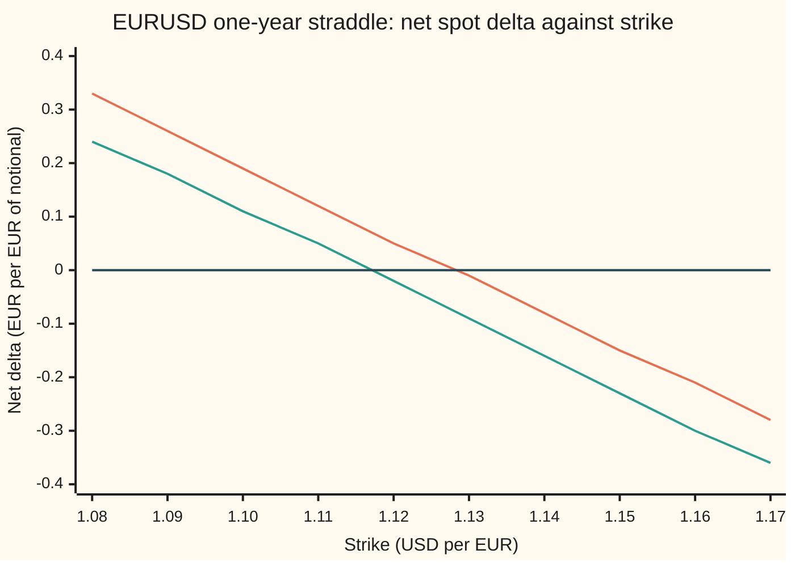
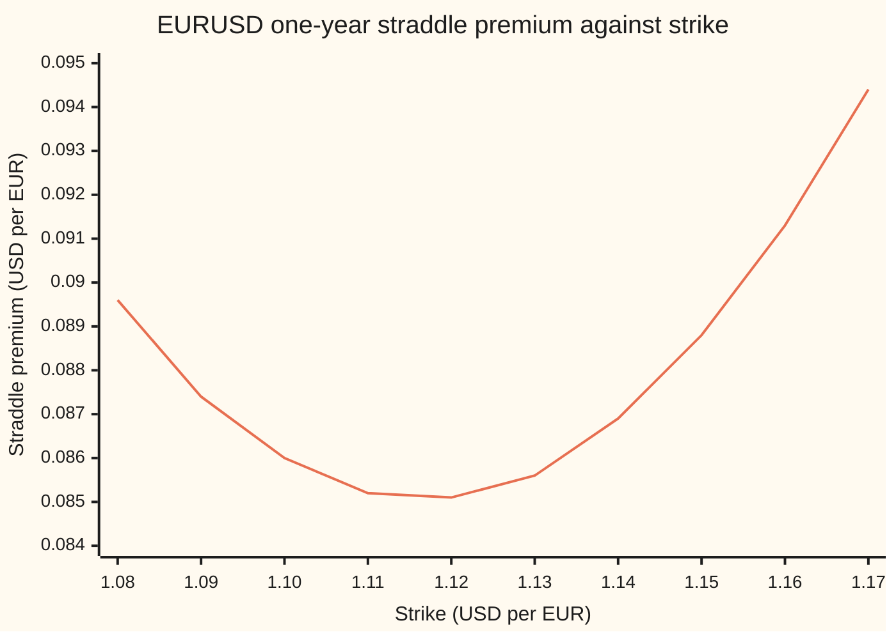

# Three meanings of at-the-money: spot, forward, and the delta-neutral straddle the FX market actually uses

[Syllabus](../../../SYLLABUS.md) → [Financial mathematics](../../../SYLLABUS.md#w12) → [FX vanilla options - Garman-Kohlhagen and the desk conventions](../../../SYLLABUS.md#w12-s21) → Three meanings of at-the-money

---

## General Overview

One euro costs 1.1000 US dollars today. Dollar cash earns 5 percent a year, euro cash 3 percent. A currency desk is asked to price a one-year "at-the-money" option on the euro, and the market's screen says the at-the-money volatility is 10 percent.

At-the-money, ATM for short, means "the strike sits where the market is". The strike is the exchange rate written into the contract. But "where the market is" has at least three readings. Today's rate, 1.1000, is one. The one-year forward rate, 1.122221, the rate a bank will lock in today for exchange in a year, is another. The one currency desks actually use is a third: the strike at which a straddle has no exposure to the exchange rate. A **straddle** is one call plus one put at the same strike: it pays when the rate moves far either way. At 1.127847, the delta-neutral straddle (DNS) strike, the call and the put pull equally in opposite directions, and the pair is flat to small moves in the rate.

A pip, 0.0001 dollars per euro, is the market's unit of rate. The spot and DNS strikes lie 278.5 pips apart. A fourth variant, 1.116624, appears when the option's premium is paid in euros rather than dollars. Picking the wrong one does not misprice by a rounding error; it buys a different option. Unhedged, the straddle struck at today's rate carries 0.1916 euros of exchange-rate exposure per euro of notional.

**At-the-money in currency options names a rule for choosing the strike, and the market's rule is the strike where a straddle's delta is zero: the forward times $e^{\sigma^2 T/2}$, or times $e^{-\sigma^2 T/2}$ when the premium is paid in the foreign currency.**

**What kind of fact this is:** a convention, the market's agreed meaning of a word; the strike each convention picks is then a theorem, proved on this card in Why it works.

### The picture: where a straddle's delta crosses zero

Hold today's rate, rates and volatility fixed. Slide the strike. The straddle's net delta, its exposure to a small move in the rate in euros per euro of notional, falls from positive to negative. It crosses zero once.



Orange: the plain spot delta, used when the premium is paid in dollars. It crosses zero at 1.127847, the delta-neutral straddle strike. Green: the premium-adjusted delta, used when the premium is paid in euros. It crosses at 1.116624. Dark: zero. Today's rate, 1.10, sits well up the orange line at 0.19 (0.1916 to four places): that straddle is long euros.

---

## The formula

Four rules, four strikes:

$$K_{\text{spot}} = S, \qquad K_{\text{fwd}} = F = S\,e^{(r_d - r_f)T}, \qquad K_{\text{DNS}} = F\,e^{\sigma^2 T/2}, \qquad K_{\text{DNS,pa}} = F\,e^{-\sigma^2 T/2}$$

**Read it aloud:** spot ATM strikes at today's rate; forward ATM strikes at the forward; the delta-neutral straddle strikes at the forward pushed up by half the variance, and pushed down by half the variance when the premium is paid in the foreign currency.

"pa" abbreviates premium-adjusted. The variance $\sigma^2 T$ is the volatility squared times the time: the variance of the log of the future rate.

| Symbol | Plain meaning | In our example | Push it up and the ATM strike… |
| --- | --- | --- | --- |
| $S$ | spot: dollars per euro today | 1.1000 | rises one for one, under every rule |
| $K$ | strike: the rate written into the option | 1.127847 under DNS | (the output) |
| $F$ | forward: the rate locked today for exchange at $T$ | 1.122221 | forward and DNS strikes rise with it |
| $T$ | time to expiry, in years | 1 | forward drifts; DNS and pa strikes spread apart |
| $r_d$ | domestic rate: dollar cash, continuously compounded | 5% | forward rises |
| $r_f$ | foreign rate: euro cash, continuously compounded | 3% | forward falls |
| $\sigma$ | volatility: yearly spread of the log rate, quoted as the ATM vol | 10% | DNS rises, pa DNS falls |
| $d_1$ | distance to the strike in volatility units, counted in euros | 0 at the DNS strike | — |
| $d_2$ | $d_1 - \sigma\sqrt{T}$, the same distance counted in dollars | 0 at the pa strike | — |
| $N(x)$ | normal CDF: the area under the bell curve left of $x$ | $N(0) = 0.5$ | — |
| $\Delta$ | spot delta: euros to hold against one euro of option, $e^{-r_f T}N(d_1)$ for a call | +0.4852 call, −0.4852 put | — |
| $C$, $P$ | call and put premiums, dollars per euro | 0.040054 and 0.045404 at DNS | — |

The helper formulas are the Garman-Kohlhagen ones from [Garman-Kohlhagen](01-garman-kohlhagen.md):

$$d_1 = \frac{\ln(F/K) + \tfrac12\sigma^2 T}{\sigma\sqrt{T}}, \qquad d_2 = d_1 - \sigma\sqrt{T}$$

In words: $d_1$ is the log-distance from the strike up to the forward, $\ln(F/K)$, in units of $\sigma\sqrt{T}$, plus half of $\sigma\sqrt{T}$. At spot ATM: $0.02/0.10 + 0.05 = 0.25$.

### When it holds

A convention holds by agreement, not by proof. Three things fix which one applies:

- **The currency pair and tenor.** Liquid pairs up to about one year quote DNS ATM. Long-dated options and many emerging-market pairs quote forward ATM instead. Reading a forward-ATM quote as DNS misplaces the strike by 56.3 pips at our numbers.
- **The premium currency.** A premium paid in the foreign currency (the euro here, the dollar in USDJPY) makes the desk's delta premium-adjusted, and the DNS strike moves below the forward.
- **One volatility at the strike.** The formula uses a single $\sigma$. Under a smile, the vol that belongs in it is the vol at the ATM strike itself, which is exactly the number quoted. Using any other vol shifts the strike.

Conventions verified 27 Sep 2026 against Reiswich and Wystup (2012) and Clark (2011), not against a live dealer screen; market practice can change.

---

## Why it works

### Step 0: at-the-money is a choice of strike, fixed by one number

A volatility quote on its own names no option. The desk must know which strike the number belongs to. Each ATM rule is an equation in the strike: strike equals spot, strike equals forward, or net delta equals zero. The first two need no mathematics. The third is the one worth deriving, because it is the one the market uses and its answer is not obvious: 1.127847 lies above both today's rate and the forward.

### Step 1: forward ATM makes the call and the put cost the same

Put-call parity, with two discount factors, says

$$C - P = e^{-r_d T}(F - K).$$

At $K = F$ the right side is zero, so the call and the put cost the same: 0.042569 dollars per euro each. That is the forward rule's appeal: neither side of the straddle is the dearer one. It is not delta-neutral. The straddle struck at the forward still has a net delta of 0.0387.

### Step 2: the straddle's net delta, and where it vanishes

From [Four deltas for one option](04-fx-delta-conventions.md), the call's spot delta is $e^{-r_f T}N(d_1)$ and the put's is $-e^{-r_f T}N(-d_1)$. The bell curve is symmetric, so $N(-d_1) = 1 - N(d_1)$. Add them:

$$\Delta_{\text{straddle}} = e^{-r_f T}\,\big(2N(d_1) - 1\big).$$

That is zero exactly when $N(d_1) = \tfrac12$, which means $d_1 = 0$. Set the top of $d_1$ to zero:

$$\ln(F/K) + \tfrac12\sigma^2 T = 0 \quad\Longrightarrow\quad K = F\,e^{\sigma^2 T/2}.$$

At that strike each leg's delta is $e^{-r_f T} \times 0.5 = 0.970446 \times 0.5$: +0.4852 for the call and −0.4852 for the put.

**Existence and uniqueness.** As the strike rises, $d_1$ falls, so $N(d_1)$ falls, strictly. For a strike near zero the net delta tends to $+e^{-r_f T}$, the call is certain to be used; for a huge strike it tends to $-e^{-r_f T}$. A strictly falling function that runs from a positive value to a negative one crosses zero exactly once. The boundary case is zero volatility: the net delta then jumps from $+e^{-r_f T}$ to $-e^{-r_f T}$ at the forward without passing through zero, and the formula's limit, the forward itself, is the only sensible reading.

### Step 3: why the answer sits above the forward

$N(d_1)$ has a meaning of its own. It is the probability that the rate finishes above the strike, when outcomes are counted in euros rather than in dollars: a euro is worth more, in dollars, in exactly the outcomes where the rate is high, so counting in euros tilts the odds upward. Delta-neutral is the strike where that euro-counted chance is one half. It is the median of the future rate in the euro-counted world, and that median is $F e^{\sigma^2 T/2}$.

Counting in dollars instead gives $N(d_2)$, whose median is $F e^{-\sigma^2 T/2}$. The forward sits between them: it is the average, not a median. Three natural centres of one lognormal spread (a spread whose log follows a bell curve): the dollar median 1.116624, the average 1.122221, the euro median 1.127847.

### Step 4: premium in euros moves the strike to the dollar median

When the premium is paid in euros, the euro hedge must also cover the euros spent on the premium. The premium-adjusted call delta is $e^{-r_f T}N(d_1) - C/S$. The Garman-Kohlhagen formula turns this into $\tfrac{K}{S}e^{-r_d T}N(d_2)$, and the put's into $-\tfrac{K}{S}e^{-r_d T}N(-d_2)$. Their sum,

$$\Delta_{\text{straddle,pa}} = \frac{K}{S}\,e^{-r_d T}\,\big(2N(d_2) - 1\big),$$

vanishes exactly when $d_2 = 0$, that is at $K = F e^{-\sigma^2 T/2} = 1.116624$. The factor $K/S$ is positive, so the zero is again unique. Each leg's premium-adjusted delta there is ±0.4828.

<details>
<summary>Detailed proof: the premium-adjusted delta in one line</summary>

The Garman-Kohlhagen call is $C = S e^{-r_f T}N(d_1) - K e^{-r_d T}N(d_2)$. Divide by $S$ and subtract from the spot delta:
$$e^{-r_f T}N(d_1) - \frac{C}{S} = e^{-r_f T}N(d_1) - e^{-r_f T}N(d_1) + \frac{K}{S}e^{-r_d T}N(d_2) = \frac{K}{S}e^{-r_d T}N(d_2).$$
The put is $P = K e^{-r_d T}N(-d_2) - S e^{-r_f T}N(-d_1)$, with spot delta $-e^{-r_f T}N(-d_1)$; the same subtraction leaves $-\tfrac{K}{S}e^{-r_d T}N(-d_2)$. Adding the two and using $N(-d_2) = 1 - N(d_2)$ gives the net formula above. Its sign is the sign of $2N(d_2) - 1$, and $d_2$ falls strictly as $K$ rises, so the zero at $d_2 = 0$ is the only one.

The same strike is the cheapest straddle. The straddle's price changes with the strike at the rate $-e^{-r_d T}N(d_2) + e^{-r_d T}N(-d_2) = e^{-r_d T}(1 - 2N(d_2))$, which is negative below the strike where $d_2 = 0$ and positive above it. So the premium-adjusted DNS straddle, at 0.085032, is the cheapest straddle of any strike. The code finds that minimum by search, as a third road.

</details>

The straddle's price against its strike, from the "chart, straddle" line of the code:



One line: the straddle's price at each strike. Its floor sits between 1.11 and 1.12, at the premium-adjusted DNS strike 1.116624, price 0.085032.

### Step 5: how the quoted ATM vol attaches to a strike

The screen says "1Y EURUSD ATM 10.00". The convention turns that number into a strike: $K = F e^{\sigma^2 T/2}$ with $\sigma = 10\%$. No loop is needed, even when the volatility differs strike by strike (a **smile**: implied vol plotted against strike is curved). Under a smile the DNS condition reads $K = F e^{\sigma(K)^2 T/2}$, with $\sigma(K)$ the vol at strike $K$. The quote is $\sigma$ at the solution, so plugging the quote in gives the solution directly.

The code checks this on an invented smile whose vol at the forward is 10 percent. Solving by repeated substitution gives an ATM strike of 1.127739, where the smile's vol is 9.9043 percent; the one-line formula at 9.9043 percent returns 1.127739. Reading the vol at the forward instead, 10 percent, returns 1.127847: the right formula at the wrong vol, a different strike.

A second road to every strike on this card is brute force: price the straddle by averaging its payoff over the bell curve, measure its delta by nudging spot, and search for the strike where the nudged delta vanishes. The code does exactly this. How a strike follows from any other delta, 25-delta calls and puts for instance, is the next card, [Strike from delta](06-fx-strike-from-delta.md).

---

## Worked numbers, by hand

EURUSD: $S = 1.10$, $r_d = 5\%$, $r_f = 3\%$, $\sigma = 10\%$, $T = 1$ year.

| Step | Arithmetic | Value |
| --- | --- | --- |
| carry factor $e^{(r_d - r_f)T}$ | $e^{0.02}$ | 1.020201 |
| forward $F$ | 1.10 × 1.020201 | 1.122221 |
| half the variance, $\tfrac12\sigma^2 T$ | 0.5 × 0.01 × 1 | 0.005 |
| push up, $e^{0.005}$ | | 1.005013 |
| **DNS strike** | 1.122221 × 1.005013 | **1.127847** |
| push down, $e^{-0.005}$ | | 0.995012 |
| **premium-adjusted DNS strike** | 1.122221 × 0.995012 | **1.116624** |
| $d_1$ at the DNS strike | $(\ln(1/1.005013) + 0.005)/0.10$ | 0 |
| foreign discount $e^{-r_f T}$ | $e^{-0.03}$ | 0.970446 |
| call and put spot deltas | ±0.970446 × $N(0)$ = ±0.970446 × 0.5 | **+0.4852, −0.4852** |

The four strikes, and the straddle at each:

| Rule | Strike | $d_1$ | Call | Put | Straddle | Net spot delta |
| --- | --- | --- | --- | --- | --- | --- |
| Spot ATM | 1.100000 | 0.25 | 0.053556 | 0.032418 | 0.085974 | 0.1916 |
| Forward ATM | 1.122221 | 0.05 | 0.042569 | 0.042569 | 0.085138 | 0.0387 |
| DNS | 1.127847 | 0 | 0.040054 | 0.045404 | 0.085458 | 0 |
| DNS, premium-adjusted | 1.116624 | 0.10 | 0.045178 | 0.039854 | 0.085032 | 0 (pa delta) |

Prices are in dollars per euro. The spot-ATM straddle leaves the desk long 0.1916 euros per euro of notional until it hedges; the DNS straddle leaves nothing to hedge.

### What breaks if you drop a piece

| Mistake | Comes out at | What went wrong |
| --- | --- | --- |
| Strike the "ATM" straddle at the forward | net delta 0.0387 | Forward ATM equalises the premiums, not the deltas |
| Use spot in place of the forward, $S e^{\sigma^2 T/2}$ | strike 1.105514, net delta 0.1538 | The carry $e^{(r_d - r_f)T}$ was left out |
| Use the premium-adjusted strike for a dollar-premium pair | net delta 0.0773 | The dollar median replaced the euro median |
| Forget to square the vol, $F e^{\sigma T/2}$ | strike 1.179759, net delta −0.3370 | The shift is half the variance, not half the volatility |

---

## Code, from first principles, and it actually runs

The scripts compute every strike, price and delta on this card by three roads. Road one is the closed forms, with a normal CDF built from its Taylor series. Road two prices each straddle by averaging the payoff over the bell curve with Simpson's rule (thin-slice integration), measures its delta by nudging spot up and down with the strike fixed, and finds the delta-neutral strikes by bisection on those nudged deltas. Road three searches for the cheapest straddle by golden-section search and lands on the premium-adjusted strike. Six asserts compare the roads.

### Python

```python
# Three meanings of at-the-money on EURUSD: spot, forward, delta-neutral straddle.
# Road 1: closed forms. Road 2: prices by integrating the payoff, deltas by nudging spot,
# strikes by bisection on those nudged deltas. Road 3: the cheapest straddle by golden section.
import math

S, RD, RF, VOL, T = 1.10, 0.05, 0.03, 0.10, 1.0

def ncdf(x):  # normal CDF from its Taylor series, no library erf
    term, total, n = x, x, 0
    while abs(term) > 1e-17 * max(1.0, abs(total)):
        n += 1
        term *= x * x / (2 * n + 1)
        total += term
    return 0.5 + math.exp(-0.5 * x * x) / math.sqrt(2 * math.pi) * total

def d1d2(s, k, vol=VOL, t=T):
    w = vol * math.sqrt(t)
    d1 = (math.log(s / k) + (RD - RF + 0.5 * vol * vol) * t) / w
    return d1, d1 - w

def gk(s, k, vol=VOL):  # road 1: Garman-Kohlhagen call and put, USD per EUR
    d1, d2 = d1d2(s, k, vol)
    c = s * math.exp(-RF * T) * ncdf(d1) - k * math.exp(-RD * T) * ncdf(d2)
    return c, c - s * math.exp(-RF * T) + k * math.exp(-RD * T)

def net_delta(k, vol=VOL):  # straddle spot delta, premium not adjusted
    return math.exp(-RF * T) * (2 * ncdf(d1d2(S, k, vol)[0]) - 1)

def net_pa(k, vol=VOL):  # straddle spot delta, premium-adjusted
    return k * math.exp(-RD * T) / S * (2 * ncdf(d1d2(S, k, vol)[1]) - 1)

def simpson(f, a, b, n=1200):
    h = (b - a) / n
    return h / 3 * (f(a) + f(b) + sum((4 if i % 2 else 2) * f(a + i * h) for i in range(1, n)))

def integ(s, k):  # road 2: average the payoffs over the bell curve, split at the kink
    w, fwd = VOL * math.sqrt(T), s * math.exp((RD - RF) * T)
    st = lambda z: fwd * math.exp(w * z - 0.5 * w * w)
    phi = lambda z: math.exp(-0.5 * z * z) / math.sqrt(2 * math.pi)
    zk = (math.log(k / fwd) + 0.5 * w * w) / w
    put = simpson(lambda z: (k - st(z)) * phi(z), -12.0, zk)
    call = simpson(lambda z: (st(z) - k) * phi(z), zk, 12.0)
    return math.exp(-RD * T) * call, math.exp(-RD * T) * put

def bump(k, adjusted, h=1e-4):  # straddle delta by nudging spot, strike held fixed
    v = lambda s: sum(integ(s, k)) / (s if adjusted else 1.0)
    return (S if adjusted else 1.0) * (v(S + h) - v(S - h)) / (2 * h)

def bisect(f, lo, hi):
    for _ in range(40):
        mid = 0.5 * (lo + hi)
        lo, hi = (mid, hi) if f(lo) * f(mid) > 0 else (lo, mid)
    return 0.5 * (lo + hi)

def golden(f, lo, hi):
    g = (math.sqrt(5) - 1) / 2
    for _ in range(50):
        a, b = hi - g * (hi - lo), lo + g * (hi - lo)
        lo, hi = (lo, b) if f(a) < f(b) else (a, hi)
    return 0.5 * (lo + hi)

def row(label, *vals, p=6):  # a value that rounds to zero prints as 0, never -0
    print(f"{label:<34}" + "".join(f"{(v if abs(v) >= 0.5 * 10**-p else 0.0):>11.{p}f}" for v in vals))

F = S * math.exp((RD - RF) * T)
k_dns = F * math.exp(0.5 * VOL * VOL * T)
k_pa = F * math.exp(-0.5 * VOL * VOL * T)
k_dns2 = bisect(lambda k: bump(k, False), 1.05, 1.20)
k_pa2 = bisect(lambda k: bump(k, True), 1.05, 1.20)
k_min = golden(lambda k: sum(integ(S, k)), 1.05, 1.20)
row("forward F = S e^(rd-rf)T", F)
row("strike: spot ATM, K = S", S)
row("strike: forward ATM, K = F", F)
row("strike: DNS, formula | bisection", k_dns, k_dns2)
row("strike: DNS p.a., formula | bisect", k_pa, k_pa2)
row("strike: cheapest straddle, golden", k_min)
row("e^.02, e^.005, e^-.005, e^-.03", F / S, k_dns / F, k_pa / F, math.exp(-RF * T))
row("gaps in pips: DNS-S DNS-F F-p.a.", 1e4 * (k_dns - S), 1e4 * (k_dns - F), 1e4 * (F - k_pa), p=1)
names = [("spot ATM", S), ("forward ATM", F), ("DNS", k_dns), ("DNS p.a.", k_pa)]
print("at each strike                     d1         call       put        straddle   by integral")
for nm, k in names:
    c, p = gk(S, k)
    row(f"  {nm}", d1d2(S, k)[0], c, p, c + p, sum(integ(S, k)))
print("net straddle delta                 formula    by nudge   p.a. form  p.a. nudge")
for nm, k in names:
    row(f"  {nm}", net_delta(k), bump(k, False), net_pa(k), bump(k, True))
row("DNS call, put spot delta", math.exp(-RF * T) * ncdf(0.0), -math.exp(-RF * T) * ncdf(0.0), p=4)
half = k_pa * math.exp(-RD * T) / S * ncdf(0.0)
row("p.a. call, put delta at DNS p.a.", half, -half, p=4)
row("  same by e^-rfT N(d1) - C/S", math.exp(-RF * T) * ncdf(d1d2(S, k_pa)[0]) - gk(S, k_pa)[0] / S, p=4)
k_wrong = S * math.exp(0.5 * VOL * VOL * T)
row("wrong: S in place of F, strike", k_wrong)
row("  its net delta", net_delta(k_wrong), p=4)
row("wrong: p.a. strike, USD premium", net_delta(k_pa), p=4)
k_nosq = F * math.exp(0.5 * VOL * T)
row("wrong: vol not squared, strike", k_nosq)
row("  its net delta", net_delta(k_nosq), p=4)
for v in (0.05, 0.20):
    row(f"try: vol {v:.2f}, DNS | DNS p.a.", F * math.exp(0.5 * v * v * T), F * math.exp(-0.5 * v * v * T))
f5 = S * math.exp((RD - RF) * 5.0)
row("try: 5 years, F | DNS | DNS p.a.", f5, f5 * math.exp(0.5 * VOL * VOL * 5.0), f5 * math.exp(-0.5 * VOL * VOL * 5.0))
row("try: rd = rf = 3%, F | DNS", S, S * math.exp(0.5 * VOL * VOL * T))
smile = lambda k: 0.10 - 0.20 * math.log(k / F) + 1.0 * math.log(k / F) ** 2
k_s = F
for _ in range(60):
    k_s = F * math.exp(0.5 * smile(k_s) ** 2 * T)
row("smile: ATM strike by iteration", k_s)
row("  vol there | vol at F", smile(k_s), smile(F))
row("  formula at that quoted vol", F * math.exp(0.5 * smile(k_s) ** 2 * T))
row("  formula at vol read at F", F * math.exp(0.5 * smile(F) ** 2 * T))
grid = [1.08 + 0.01 * i for i in range(10)]
print("chart, strike    " + "".join(f"{k:>8.2f}" for k in grid))
print("chart, net delta " + "".join(f"{net_delta(k):>8.2f}" for k in grid))
print("chart, p.a. net  " + "".join(f"{net_pa(k):>8.2f}" for k in grid))
print("chart, straddle  " + "".join(f"{sum(gk(S, k)):>8.4f}" for k in grid))
assert abs(k_dns - k_dns2) < 1e-6 and abs(k_pa - k_pa2) < 1e-6, (k_dns2, k_pa2)
assert abs(k_min - k_pa) < 1e-6, k_min
assert abs(sum(gk(S, k_dns)) - sum(integ(S, k_dns))) < 1e-9
assert abs(gk(S, F)[0] - integ(S, F)[1]) < 1e-9
assert abs(bump(k_dns, False)) < 1e-6 and abs(net_delta(S) - bump(S, False)) < 1e-6
assert abs(net_pa(k_pa2)) < 1e-6 and abs(net_pa(S) - bump(S, True)) < 1e-6
print("ALL CHECKS PASS")
```

**Ran 2026-09-27 on macOS, Python 3.14.6, standard library only. All checks passed. Output, pasted from the run:**

```
forward F = S e^(rd-rf)T             1.122221
strike: spot ATM, K = S              1.100000
strike: forward ATM, K = F           1.122221
strike: DNS, formula | bisection     1.127847   1.127847
strike: DNS p.a., formula | bisect   1.116624   1.116624
strike: cheapest straddle, golden    1.116624
e^.02, e^.005, e^-.005, e^-.03       1.020201   1.005013   0.995012   0.970446
gaps in pips: DNS-S DNS-F F-p.a.        278.5       56.3       56.0
at each strike                     d1         call       put        straddle   by integral
  spot ATM                           0.250000   0.053556   0.032418   0.085974   0.085974
  forward ATM                        0.050000   0.042569   0.042569   0.085138   0.085138
  DNS                                0.000000   0.040054   0.045404   0.085458   0.085458
  DNS p.a.                           0.100000   0.045178   0.039854   0.085032   0.085032
net straddle delta                 formula    by nudge   p.a. form  p.a. nudge
  spot ATM                           0.191578   0.191578   0.113420   0.113420
  forward ATM                        0.038699   0.038699  -0.038699  -0.038699
  DNS                                0.000000   0.000000  -0.077689  -0.077689
  DNS p.a.                           0.077301   0.077301   0.000000   0.000000
DNS call, put spot delta               0.4852    -0.4852
p.a. call, put delta at DNS p.a.       0.4828    -0.4828
  same by e^-rfT N(d1) - C/S           0.4828
wrong: S in place of F, strike       1.105514
  its net delta                        0.1538
wrong: p.a. strike, USD premium        0.0773
wrong: vol not squared, strike       1.179759
  its net delta                       -0.3370
try: vol 0.05, DNS | DNS p.a.        1.123625   1.120820
try: vol 0.20, DNS | DNS p.a.        1.144892   1.100000
try: 5 years, F | DNS | DNS p.a.     1.215688   1.246463   1.185673
try: rd = rf = 3%, F | DNS           1.100000   1.105514
smile: ATM strike by iteration       1.127739
  vol there | vol at F               0.099043   0.100000
  formula at that quoted vol         1.127739
  formula at vol read at F           1.127847
chart, strike        1.08    1.09    1.10    1.11    1.12    1.13    1.14    1.15    1.16    1.17
chart, net delta     0.33    0.26    0.19    0.12    0.05   -0.01   -0.08   -0.15   -0.21   -0.28
chart, p.a. net      0.24    0.18    0.11    0.05   -0.02   -0.09   -0.16   -0.23   -0.30   -0.36
chart, straddle    0.0896  0.0874  0.0860  0.0852  0.0851  0.0856  0.0869  0.0888  0.0913  0.0944
ALL CHECKS PASS
```

The bisection strikes agree with the formulas to six decimals, and the integrated straddle prices agree to the last digit printed. The nudged deltas match the formula deltas under both conventions, so the zeros in the net-delta block come from two separate computations.

### Rust

Same roads, same labels, std only.

```rust
// Three meanings of at-the-money on EURUSD: spot, forward, delta-neutral straddle.
// Road 1: closed forms. Road 2: prices by integrating the payoff, deltas by nudging spot,
// strikes by bisection on those nudged deltas. Road 3: the cheapest straddle by golden section.
const S: f64 = 1.10;
const RD: f64 = 0.05;
const RF: f64 = 0.03;
const VOL: f64 = 0.10;
const T: f64 = 1.0;

fn ncdf(x: f64) -> f64 {
    // normal CDF from its Taylor series, no library erf
    let (mut term, mut total, mut n) = (x, x, 0.0);
    while term.abs() > 1e-17 * total.abs().max(1.0) {
        n += 1.0;
        term *= x * x / (2.0 * n + 1.0);
        total += term;
    }
    0.5 + (-0.5 * x * x).exp() / (2.0 * std::f64::consts::PI).sqrt() * total
}

fn d1d2(s: f64, k: f64, vol: f64) -> (f64, f64) {
    let w = vol * T.sqrt();
    let d1 = ((s / k).ln() + (RD - RF + 0.5 * vol * vol) * T) / w;
    (d1, d1 - w)
}

fn gk(s: f64, k: f64) -> (f64, f64) {
    // road 1: Garman-Kohlhagen call and put, USD per EUR
    let (d1, d2) = d1d2(s, k, VOL);
    let c = s * (-RF * T).exp() * ncdf(d1) - k * (-RD * T).exp() * ncdf(d2);
    (c, c - s * (-RF * T).exp() + k * (-RD * T).exp())
}

fn net_delta(k: f64) -> f64 {
    (-RF * T).exp() * (2.0 * ncdf(d1d2(S, k, VOL).0) - 1.0)
}

fn net_pa(k: f64) -> f64 {
    k * (-RD * T).exp() / S * (2.0 * ncdf(d1d2(S, k, VOL).1) - 1.0)
}

fn simpson(f: &dyn Fn(f64) -> f64, a: f64, b: f64) -> f64 {
    let n = 1200;
    let h = (b - a) / n as f64;
    let inner: f64 = (1..n).map(|i| if i % 2 == 1 { 4.0 } else { 2.0 } * f(a + i as f64 * h)).sum();
    h / 3.0 * (f(a) + f(b) + inner)
}

fn integ(s: f64, k: f64) -> (f64, f64) {
    // road 2: average the payoffs over the bell curve, split at the kink
    let (w, fwd) = (VOL * T.sqrt(), s * ((RD - RF) * T).exp());
    let st = move |z: f64| fwd * (w * z - 0.5 * w * w).exp();
    let phi = |z: f64| (-0.5 * z * z).exp() / (2.0 * std::f64::consts::PI).sqrt();
    let zk = ((k / fwd).ln() + 0.5 * w * w) / w;
    let put = simpson(&|z| (k - st(z)) * phi(z), -12.0, zk);
    let call = simpson(&|z| (st(z) - k) * phi(z), zk, 12.0);
    ((-RD * T).exp() * call, (-RD * T).exp() * put)
}

fn bump(k: f64, adjusted: bool) -> f64 {
    // straddle delta by nudging spot, strike held fixed
    let h = 1e-4;
    let v = |s: f64| { let (c, p) = integ(s, k); (c + p) / if adjusted { s } else { 1.0 } };
    (if adjusted { S } else { 1.0 }) * (v(S + h) - v(S - h)) / (2.0 * h)
}

fn bisect(f: &dyn Fn(f64) -> f64, mut lo: f64, mut hi: f64) -> f64 {
    for _ in 0..40 {
        let mid = 0.5 * (lo + hi);
        if f(lo) * f(mid) > 0.0 { lo = mid } else { hi = mid }
    }
    0.5 * (lo + hi)
}

fn golden(f: &dyn Fn(f64) -> f64, mut lo: f64, mut hi: f64) -> f64 {
    let g = (5f64.sqrt() - 1.0) / 2.0;
    for _ in 0..50 {
        let (a, b) = (hi - g * (hi - lo), lo + g * (hi - lo));
        if f(a) < f(b) { hi = b } else { lo = a }
    }
    0.5 * (lo + hi)
}

fn row(label: &str, vals: &[f64], p: usize) {
    // a value that rounds to zero prints as 0, never -0
    let cut = 0.5 * 10f64.powi(-(p as i32));
    let cells: String = vals.iter().map(|&v| format!("{:>11.*}", p, if v.abs() >= cut { v } else { 0.0 })).collect();
    println!("{:<34}{}", label, cells);
}

fn main() {
    let f = S * ((RD - RF) * T).exp();
    let k_dns = f * (0.5 * VOL * VOL * T).exp();
    let k_pa = f * (-0.5 * VOL * VOL * T).exp();
    let k_dns2 = bisect(&|k| bump(k, false), 1.05, 1.20);
    let k_pa2 = bisect(&|k| bump(k, true), 1.05, 1.20);
    let k_min = golden(&|k| { let (c, p) = integ(S, k); c + p }, 1.05, 1.20);
    row("forward F = S e^(rd-rf)T", &[f], 6);
    row("strike: spot ATM, K = S", &[S], 6);
    row("strike: forward ATM, K = F", &[f], 6);
    row("strike: DNS, formula | bisection", &[k_dns, k_dns2], 6);
    row("strike: DNS p.a., formula | bisect", &[k_pa, k_pa2], 6);
    row("strike: cheapest straddle, golden", &[k_min], 6);
    row("e^.02, e^.005, e^-.005, e^-.03", &[f / S, k_dns / f, k_pa / f, (-RF * T).exp()], 6);
    row("gaps in pips: DNS-S DNS-F F-p.a.", &[1e4 * (k_dns - S), 1e4 * (k_dns - f), 1e4 * (f - k_pa)], 1);
    let names = [("spot ATM", S), ("forward ATM", f), ("DNS", k_dns), ("DNS p.a.", k_pa)];
    println!("at each strike                     d1         call       put        straddle   by integral");
    for (nm, k) in names {
        let ((c, p), (ci, pi)) = (gk(S, k), integ(S, k));
        row(&format!("  {nm}"), &[d1d2(S, k, VOL).0, c, p, c + p, ci + pi], 6);
    }
    println!("net straddle delta                 formula    by nudge   p.a. form  p.a. nudge");
    for (nm, k) in names {
        row(&format!("  {nm}"), &[net_delta(k), bump(k, false), net_pa(k), bump(k, true)], 6);
    }
    let dfr = (-RF * T).exp();
    row("DNS call, put spot delta", &[dfr * ncdf(0.0), -dfr * ncdf(0.0)], 4);
    let half = k_pa * (-RD * T).exp() / S * ncdf(0.0);
    row("p.a. call, put delta at DNS p.a.", &[half, -half], 4);
    row("  same by e^-rfT N(d1) - C/S", &[dfr * ncdf(d1d2(S, k_pa, VOL).0) - gk(S, k_pa).0 / S], 4);
    let k_wrong = S * (0.5 * VOL * VOL * T).exp();
    row("wrong: S in place of F, strike", &[k_wrong], 6);
    row("  its net delta", &[net_delta(k_wrong)], 4);
    row("wrong: p.a. strike, USD premium", &[net_delta(k_pa)], 4);
    let k_nosq = f * (0.5 * VOL * T).exp();
    row("wrong: vol not squared, strike", &[k_nosq], 6);
    row("  its net delta", &[net_delta(k_nosq)], 4);
    for v in [0.05, 0.20] {
        row(&format!("try: vol {v:.2}, DNS | DNS p.a."), &[f * (0.5 * v * v * T).exp(), f * (-0.5 * v * v * T).exp()], 6);
    }
    let f5 = S * ((RD - RF) * 5.0).exp();
    row("try: 5 years, F | DNS | DNS p.a.", &[f5, f5 * (0.5 * VOL * VOL * 5.0).exp(), f5 * (-0.5 * VOL * VOL * 5.0).exp()], 6);
    row("try: rd = rf = 3%, F | DNS", &[S, S * (0.5 * VOL * VOL * T).exp()], 6);
    let smile = |k: f64| 0.10 - 0.20 * (k / f).ln() + 1.0 * (k / f).ln().powi(2);
    let mut k_s = f;
    for _ in 0..60 { k_s = f * (0.5 * smile(k_s).powi(2) * T).exp(); }
    row("smile: ATM strike by iteration", &[k_s], 6);
    row("  vol there | vol at F", &[smile(k_s), smile(f)], 6);
    row("  formula at that quoted vol", &[f * (0.5 * smile(k_s).powi(2) * T).exp()], 6);
    row("  formula at vol read at F", &[f * (0.5 * smile(f).powi(2) * T).exp()], 6);
    let grid: Vec<f64> = (0..10).map(|i| 1.08 + 0.01 * i as f64).collect();
    let line = |lab: &str, g: &dyn Fn(f64) -> f64, p: usize| {
        println!("{lab}{}", grid.iter().map(|&k| format!("{:>8.*}", p, g(k))).collect::<String>());
    };
    line("chart, strike    ", &|k| k, 2);
    line("chart, net delta ", &|k| net_delta(k), 2);
    line("chart, p.a. net  ", &|k| net_pa(k), 2);
    line("chart, straddle  ", &|k| { let (c, p) = gk(S, k); c + p }, 4);
    assert!((k_dns - k_dns2).abs() < 1e-6 && (k_pa - k_pa2).abs() < 1e-6, "{} {}", k_dns2, k_pa2);
    assert!((k_min - k_pa).abs() < 1e-6, "{}", k_min);
    let (ci, pi) = integ(S, k_dns);
    let (c, p) = gk(S, k_dns);
    assert!((c + p - ci - pi).abs() < 1e-9);
    assert!((gk(S, f).0 - integ(S, f).1).abs() < 1e-9);
    assert!(bump(k_dns, false).abs() < 1e-6 && (net_delta(S) - bump(S, false)).abs() < 1e-6);
    assert!(net_pa(k_pa2).abs() < 1e-6 && (net_pa(S) - bump(S, true)).abs() < 1e-6);
    println!("ALL CHECKS PASS");
}
```

**Ran 2026-09-27 on macOS, rustc 1.98.1, no crates. All checks passed. Output, pasted from the run:**

```
forward F = S e^(rd-rf)T             1.122221
strike: spot ATM, K = S              1.100000
strike: forward ATM, K = F           1.122221
strike: DNS, formula | bisection     1.127847   1.127847
strike: DNS p.a., formula | bisect   1.116624   1.116624
strike: cheapest straddle, golden    1.116624
e^.02, e^.005, e^-.005, e^-.03       1.020201   1.005013   0.995012   0.970446
gaps in pips: DNS-S DNS-F F-p.a.        278.5       56.3       56.0
at each strike                     d1         call       put        straddle   by integral
  spot ATM                           0.250000   0.053556   0.032418   0.085974   0.085974
  forward ATM                        0.050000   0.042569   0.042569   0.085138   0.085138
  DNS                                0.000000   0.040054   0.045404   0.085458   0.085458
  DNS p.a.                           0.100000   0.045178   0.039854   0.085032   0.085032
net straddle delta                 formula    by nudge   p.a. form  p.a. nudge
  spot ATM                           0.191578   0.191578   0.113420   0.113420
  forward ATM                        0.038699   0.038699  -0.038699  -0.038699
  DNS                                0.000000   0.000000  -0.077689  -0.077689
  DNS p.a.                           0.077301   0.077301   0.000000   0.000000
DNS call, put spot delta               0.4852    -0.4852
p.a. call, put delta at DNS p.a.       0.4828    -0.4828
  same by e^-rfT N(d1) - C/S           0.4828
wrong: S in place of F, strike       1.105514
  its net delta                        0.1538
wrong: p.a. strike, USD premium        0.0773
wrong: vol not squared, strike       1.179759
  its net delta                       -0.3370
try: vol 0.05, DNS | DNS p.a.        1.123625   1.120820
try: vol 0.20, DNS | DNS p.a.        1.144892   1.100000
try: 5 years, F | DNS | DNS p.a.     1.215688   1.246463   1.185673
try: rd = rf = 3%, F | DNS           1.100000   1.105514
smile: ATM strike by iteration       1.127739
  vol there | vol at F               0.099043   0.100000
  formula at that quoted vol         1.127739
  formula at vol read at F           1.127847
chart, strike        1.08    1.09    1.10    1.11    1.12    1.13    1.14    1.15    1.16    1.17
chart, net delta     0.33    0.26    0.19    0.12    0.05   -0.01   -0.08   -0.15   -0.21   -0.28
chart, p.a. net      0.24    0.18    0.11    0.05   -0.02   -0.09   -0.16   -0.23   -0.30   -0.36
chart, straddle    0.0896  0.0874  0.0860  0.0852  0.0851  0.0856  0.0869  0.0888  0.0913  0.0944
ALL CHECKS PASS
```

The two outputs are identical line for line.

> [!TIP]
> **Try changing**
> - **Double the vol to 20%.** Guess first: which strike lands on today's rate? The premium-adjusted DNS strike, 1.100000, because half the variance, 0.02, equals the carry $r_d - r_f$. The DNS strike moves to 1.144892.
> - **Halve the vol to 5%.** The DNS and premium-adjusted strikes close in on the forward: 1.123625 and 1.120820.
> - **Five years instead of one.** The forward is 1.215688; DNS 1.246463 and premium-adjusted 1.185673. The gap grows with $\sigma^2 T$, which is why long-dated quotes often switch to forward ATM.
> - **Equal rates, both 3%.** Spot and forward coincide at 1.100000, and the DNS strike is 1.105514: still above spot, because the half-variance shift never goes away.

---

## The usual mistake

> [!warning]
> **Treating "ATM" as one strike.** A quote of "ATM 10.00" is a volatility plus a rule. Under the DNS rule it belongs to 1.127847; priced at spot, the same 10 percent buys an option with 0.1916 of net delta and a straddle 0.085974 instead of 0.085458. The rule is part of the quote.
>
> - **ATM means the forward.** In some markets it does. For liquid currency pairs up to a year it does not: the forward straddle carries 0.0387 of net delta.
> - **Ignoring the premium currency.** For USDJPY-style pairs, where the premium is in the foreign currency, the DNS strike sits below the forward. Using the unadjusted strike there leaves a premium-adjusted net delta of −0.0777 per unit.
> - **Reading the ATM vol off the wrong strike.** Under a smile, the quote is the vol at the DNS strike. Taking the vol at the forward, 10 percent in the smile example, places the strike at 1.127847 instead of 1.127739.
> - **Half the vol instead of half the variance.** The shift is $\tfrac12\sigma^2 T = 0.005$, not $\tfrac12\sigma T = 0.05$. The wrong strike, 1.179759, carries −0.3370 of net delta.

---

## Where you meet it in real life

- **The FX volatility screen.** Every tenor row shows ATM, 25-delta risk reversal and 25-delta butterfly. The ATM column is, for liquid pairs, the vol at the DNS strike of this card.
- **Straddles as the vega trade.** Desks buy and sell ATM straddles to trade volatility itself. Struck at DNS, the straddle has no first-order exposure to the rate, so its profit and loss is mostly the vol: vega, the price's sensitivity to volatility, from [The Greeks of a currency option](03-garman-kohlhagen-greeks.md).
- **Premium currency by pair.** Which currency pays, and so which delta the desk uses, is the subject of [One option, two currencies](02-premium-currency-and-foreign-domestic-symmetry.md).
- **Building a smile from three quotes.** Vanna-volga and other smile builders take the ATM strike as their anchor point; getting it wrong shifts every interpolated vol.
- **Backing out the vol.** A traded ATM straddle price is turned into a vol by running the pricing formula backwards at the DNS strike: [Implied vol for a currency option](07-fx-implied-volatility.md).

> **Say it back**
> At-the-money is a rule for choosing a strike, not a single number. Spot ATM strikes at today's rate, forward ATM at the forward, where call and put cost the same. The currency market's rule is the delta-neutral straddle: the strike where the call's and the put's deltas cancel, $F e^{\sigma^2 T/2}$, or $F e^{-\sigma^2 T/2}$ when the premium is paid in the foreign currency. For EURUSD at 1.1000 with a 10 percent vol, that is 1.127847, with deltas of +0.4852 and −0.4852. The quoted ATM vol is the vol at that strike, which the formula turns into the strike in one line.

---

## What this builds on

- [Four deltas for one option](04-fx-delta-conventions.md): the four deltas of one currency option, spot, forward and their premium-adjusted versions. Each ATM rule on this card is a zero of one of them.

## Where this goes next

- [Strike from delta](06-fx-strike-from-delta.md): the ATM strike is the zero of a straddle's delta; that card turns any quoted delta, such as 25, into a strike under each convention.

This card fixes where the middle of the smile sits; which strikes the 25-delta wings name, and whether a premium-adjusted delta has one strike or two, is the question it leaves open.

---

## Sources

Verified 27 Sep 2026: every link below resolves to the publisher's page or the paper's DOI record.

- Garman, Mark B., and Steven W. Kohlhagen. "Foreign Currency Option Values." *Journal of International Money and Finance* 2, no. 3 (1983): 231–237. [doi:10.1016/S0261-5606(83)80001-1](https://doi.org/10.1016/S0261-5606(83)80001-1). The currency option formula whose deltas this card sets to zero.
- Reiswich, Dimitri, and Uwe Wystup. "FX Volatility Smile Construction." *Wilmott* 2012, no. 60 (2012): 58–69. [doi:10.1002/wilm.10132](https://doi.org/10.1002/wilm.10132). The ATM conventions, the premium-adjusted DNS strike, and which pairs use which.
- Clark, Iain J. *Foreign Exchange Option Pricing: A Practitioner's Guide*. Wiley, 2011. [Publisher page](https://www.wiley.com/en-us/Foreign+Exchange+Option+Pricing%3A+A+Practitioner%27s+Guide-p-9780470683682). Market quoting conventions, ATM definitions and premium currency, from the desk's side.
- Wystup, Uwe. *FX Options and Structured Products*, 2nd ed. Wiley, 2017. [Publisher page](https://www.wiley.com/en-us/FX+Options+and+Structured+Products%2C+2nd+Edition-p-9781118471067). Delta and ATM conventions alongside the products that use them.
