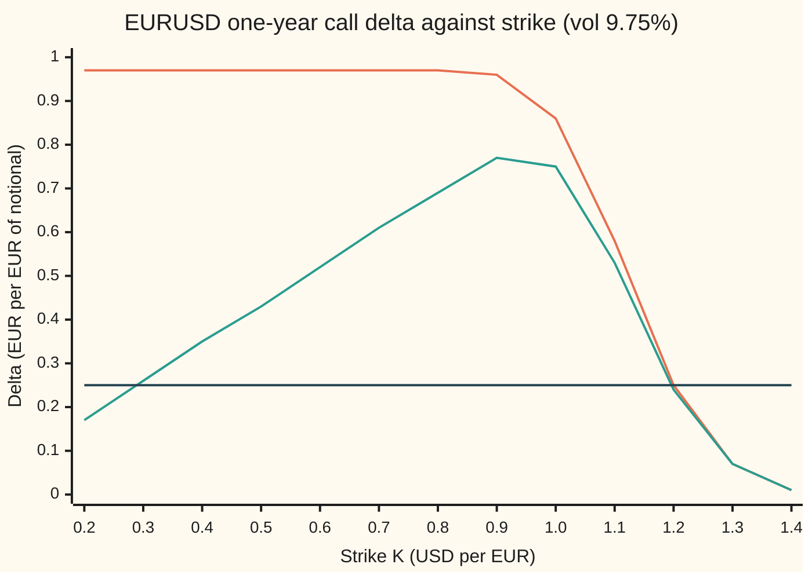

# Strike from delta: turning a delta-quoted option into a strike you can price

[Syllabus](../../../SYLLABUS.md) → [Financial mathematics](../../../SYLLABUS.md#w12) → [FX vanilla options - Garman-Kohlhagen and the desk conventions](../../../SYLLABUS.md#w12-s21) → Strike from delta

---

## General Overview

The euro trades at 1.1000 dollars. A currency dealer's screen shows one-year volatilities for EURUSD, but not by strike. It shows them by delta: 10.75 percent for "the 25-delta put", 9.75 percent for "the 25-delta call". Delta is the change in the option's value per small change in the exchange rate; it reads as the number of euros to hold as a hedge. A 25-delta call behaves like a quarter of a euro.

A trade cannot be booked on a delta. The contract needs a strike: the exchange rate at which the holder may buy or sell euros at expiry. So the desk runs the delta formula backwards. Given the quoted delta, the volatility attached to it and the market (dollar rate 5 percent, euro rate 3 percent, one year), it finds the one strike with that delta. On spot delta the 25-delta put is struck at **1.052466** and the 25-delta call at **1.201425**. On forward delta the same labels name **1.049780** and **1.204213**.

Currency desks use four deltas for one option ([Four deltas for one option](04-fx-delta-conventions.md)). Two of them invert in one line. The other two include the premium, and there the call has a surprise: its delta rises and then falls as the strike rises, so one quote can name two strikes, or none. The desk rule is to take the higher one.

**For spot and forward deltas the strike is one line: a bell-curve lookup turned into a distance from the forward; for premium-adjusted deltas it is a root-find, unique for a put, and for a call a choice between two roots, where the desk takes the higher.**

**What kind of fact this is:** a method, resting on a theorem proved on this card in Why it works: each delta is strictly monotone in the strike, except the premium-adjusted call's, which has exactly one peak.

### The picture: two deltas against strike



Orange: spot delta, falling all the way from its ceiling, 0.970446, to zero. It meets the flat line once, at 1.201425. Green: premium-adjusted spot delta. It climbs from zero, peaks at 0.781852 when the strike is 0.945813, then falls. It meets the flat line twice: at 0.289100 and at 1.195870. Dark flat line: the target, 0.25.

---

## The formula

Notation first, in words. $S$ is the exchange rate today, dollars per euro. $F$ is the forward rate: the rate agreed today for delivery in one year, $F = S\,e^{(r_d - r_f)T}$ ([Garman-Kohlhagen](01-garman-kohlhagen.md)). $r_d$ is the dollar (domestic) interest rate, $r_f$ the euro (foreign) rate, both continuously compounded. $\sigma$ (sigma) is the volatility attached to the quote. $N(x)$ is the area under the standard bell curve left of $x$; $N^{-1}(p)$ runs it backwards, the normal quantile ([Normal quantiles](../../09-Probability%20and%20statistics/04-Continuous%20Distributions/05-normal-quantile.md)).

The helpers, as on the Garman-Kohlhagen card:

$$d_1 = \frac{\ln(F/K) + \tfrac12\sigma^2 T}{\sigma\sqrt{T}}, \qquad d_2 = d_1 - \sigma\sqrt{T}$$

In words: the log-distance from strike to forward, nudged by half the variance, counted in units of $\sigma\sqrt{T}$.

The four call deltas, and the puts beside them:

| Convention | Call | Put |
| --- | --- | --- |
| spot | `e^{-rf T} N(d1)` | `-e^{-rf T} N(-d1)` |
| forward | `N(d1)` | `-N(-d1)` |
| premium-adjusted spot | `e^{-rf T} (K/F) N(d2)` | `-e^{-rf T} (K/F) N(-d2)` |
| premium-adjusted forward | `(K/F) N(d2)` | `-(K/F) N(-d2)` |

**Spot and forward: one line.** Set the delta to its quote $\Delta$ and undo it:

$$K = F\,\exp\!\Big(-d_1^{*}\,\sigma\sqrt{T} + \tfrac12\sigma^2 T\Big)$$

$$d_1^{*} = N^{-1}\!\big(\Delta\,e^{r_f T}\big)\ \text{(spot call)}, \qquad d_1^{*} = N^{-1}(\Delta)\ \text{(forward call)}$$

For a put, $d_1^{*}$ is minus the quantile of $\lvert\Delta\rvert e^{r_f T}$ (spot) or of $\lvert\Delta\rvert$ (forward).

**Read it aloud:** undo the euro-rate drag on the delta, find where that area sits on the bell curve, turn that point into a log-distance from the forward, and step that far.

**Premium-adjusted: a root-find.** Solve $e^{-r_f T}(K/F)N(d_2) = \Delta$ for $K$ (drop $e^{-r_f T}$ for the forward version). $K$ appears both outside and inside $N$, so no quantile frees it. For a call the root is sought only above the peak strike $K_{\text{peak}}$, where

$$\sigma\sqrt{T}\;N(d_2) = \varphi(d_2)$$

with $\varphi$ the bell curve's height.

**Read it aloud:** the premium-adjusted call delta stops rising exactly where the strike's pull on the premium outweighs its pull on the chance of exercise.

| Symbol | Plain meaning | In our example | Push it up and the strike… |
| --- | --- | --- | --- |
| $S$ | exchange rate today, USD per EUR | 1.1000 | rises in proportion |
| $F$ | forward rate for one year | 1.122221 | rises in proportion |
| $K$, $K_{\text{peak}}$ | strike; the strike where the premium-adjusted call delta peaks | spot 25-delta call 1.201425; peak 0.945813 | (the answer) |
| $T$ | years to expiry | 1 | call strike moves further out |
| $r_d$ | dollar interest rate | 5% | rises, through $F$ |
| $r_f$ | euro interest rate; $e^{-r_f T}$ is the drag on spot delta | 3%; drag 0.970446 | falls through $F$; the spot ceiling drops |
| $\sigma$ | volatility attached to the quote | 10.75% put, 9.75% call | the two wings spread apart |
| $\Delta$, $d_1^{*}$ | the quoted delta; the $d_1$ that produces it | 0.25 and −0.25; −0.650720 | a call strike moves toward the forward |
| $N$, $N^{-1}$, $\varphi$ | bell-curve area left of a point; the point with a given area; the curve's height | $N(d_1) = 0.257614$ | |
| $V$ | the option's premium, dollars per euro | house call 0.053556 | the premium-adjusted call delta falls further below spot delta |
| $d_1$, $d_2$ | log-distance from strike to forward in units of $\sigma\sqrt{T}$; $d_2$ one unit lower | $d_1 = -0.650720$ at the spot 25-delta call | |

### When it holds

- **The volatility belongs to the strike being found.** A smile (a different volatility at each strike) makes $\sigma$ depend on $K$. Quotes sidestep this by attaching the volatility to the delta itself, as the screen above does. A volatility read off a fitted smile instead turns the one-liner into a repeat-until-settled loop.
- **The quote's convention is known.** The same "25" names four strikes. Solving with the wrong convention moves the strike, as What breaks shows.
- **Garman-Kohlhagen dynamics.** Rates constant, the exchange rate a geometric Brownian motion. The delta is the model's; the quoting convention uses it even where the model is wrong.
- **The delta is inside its range.** Spot call deltas lie strictly between 0 and $e^{-r_f T} = 0.970446$, spot puts between $-0.970446$ and 0; forward calls between 0 and 1, forward puts between $-1$ and 0. Premium-adjusted calls reach only up to the peak, 0.781852 spot and 0.805663 forward; premium-adjusted puts take any negative value. At the open ends (0, the ceiling) and above the peak, no strike exists; exactly at the peak there is one.

Conventions verified 2026-09-27 against Reiswich and Wystup (2010): EURUSD, premium paid in dollars, quotes spot delta without premium adjustment for expiries up to one year and forward delta beyond; pairs whose premium is paid in the first-named currency, such as USDJPY, quote premium-adjusted deltas.

---

## Why it works

### Step 0: an inverse needs a one-way street, or a rule at the fork

Running a formula backwards is safe only where no two strikes share a delta. So the card first finds, for each convention, whether delta moves one way as the strike rises, and what range it covers. Where it does, one strike exists for each delta in range. Where it does not, the card counts the strikes and says which one the market means.

### Step 1: spot and forward deltas fall as the strike rises

Raise $K$ and $\ln(F/K)$ falls, so $d_1$ falls, at rate $-1/(K\sigma\sqrt{T})$. The area $N$ rises with its argument, because the bell curve's height is positive everywhere. So $N(d_1)$ falls strictly, and so does any positive multiple of it. The put's delta is the call's minus a constant ($N(-x) = 1 - N(x)$), so it falls too.

At the ends: $K \to 0$ sends $d_1$ to plus infinity and the spot call delta up toward $e^{-r_f T}$; $K \to \infty$ sends it to 0. The delta moves without jumps, so by the intermediate value theorem ([Intermediate value theorem](../../06-Calculus%20and%20analysis/01-Limits%20and%20Continuity/06-intermediate-value-theorem.md)) every value strictly between is hit, and because the delta only falls, exactly once.

### Step 2: peel the formula

Undo the layers from the outside. Divide by the drag: $N(d_1) = \Delta e^{r_f T}$. Apply the quantile: $d_1 = N^{-1}(\Delta e^{r_f T})$. Solve the definition of $d_1$ for $K$: $\ln(K/F) = -d_1\sigma\sqrt{T} + \tfrac12\sigma^2 T$. That is the formula. For a forward delta the first step has no drag to undo.

### Step 3: the premium changes the hedge

Why subtract the premium at all? The Garman-Kohlhagen price $V$ is in dollars. If it is paid in euros instead, the seller receives $V/S$ euros up front. Those euros are already part of the hedge, so the extra euros still needed are the spot delta minus $V/S$. Written out, $e^{-r_f T}N(d_1) - V/S$ collapses to $e^{-r_f T}(K/F)N(d_2)$ ([One option, two currencies](02-premium-currency-and-foreign-domestic-symmetry.md)).

That factor $K/F$ breaks monotonicity for the call. At a tiny strike the call is almost certain to pay, $N(d_2)$ is near 1, but the premium is nearly the whole euro, so the leftover hedge $K/F$ is tiny. At a huge strike $N(d_2)$ is near 0. Zero at both ends and positive between: the delta must rise and then fall.

### Step 4: exactly one peak, so at most two roots

Differentiate $(K/F)N(d_2)$ in $K$: the result is $\big(N(d_2) - \varphi(d_2)/(\sigma\sqrt{T})\big)/F$. It is zero exactly where $\sigma\sqrt{T}N(d_2) = \varphi(d_2)$, and that equation has one solution, so the delta has one peak. For the call at 9.75 percent the peak sits at $K_{\text{peak}} = 0.945813$, with premium-adjusted spot delta 0.781852 (forward: 0.805663).

So a premium-adjusted call delta below the peak value has two strikes, one each side. At the peak it has one. Above it has none. The 25-delta quote has two: **1.195870** and **0.289100**. The lower one is a call so deep in the money that its premium, paid in euros, cancels almost all of its hedge. Nobody quoting a smile means that option. The desk rule is to take the root above the peak.

<details>
<summary>Detailed proof: one peak, and the put has none</summary>

Write $v = \sigma\sqrt{T} > 0$ and $g(x) = vN(x) - \varphi(x)$. Since $\varphi'(x) = -x\varphi(x)$, $g'(x) = \varphi(x)(v + x)$: negative for $x < -v$, positive for $x > -v$. As $x \to -\infty$, $N(x)/\varphi(x) \to 0$ (the Mills ratio: $N(x) < \varphi(x)/\lvert x\rvert$ for $x < 0$), so $g(x) < 0$ far left; $g(x)$ falls while $x < -v$, so stays negative there; then rises strictly to the limit $v > 0$. By continuity it crosses zero exactly once, at some $x^{*} > -v$.

The call's premium-adjusted delta is $D(K) = c\,(K/F)N(d_2)$ with $c > 0$, and $D'(K) = (c/F)\,g(d_2)/v$. $d_2$ falls strictly as $K$ rises. For small $K$, $d_2 > x^{*}$, $g(d_2) > 0$, $D(K)$ rises; for large $K$, $d_2 < x^{*}$, $D(K)$ falls. $D(K) \to 0$ at both ends (at $K \to 0$ because $K/F \to 0$ and $N \le 1$; at $K \to \infty$ because $K N(d_2) \le K e^{-d_2^2/2}$ decays in $\ln K$ faster than $K$ grows). By the intermediate value theorem on each side of the peak, each value in $(0, D_{\max})$ is taken exactly twice.

The put: $\lvert D_p(K)\rvert = c\,(K/F)N(-d_2)$. Both factors rise strictly with $K$, so it rises strictly from 0 (as $K \to 0$) to infinity (as $K \to \infty$, $N(-d_2) \to 1$). Every negative delta has exactly one strike. A premium-adjusted put delta can pass −1: a deep put's euro premium adds to its hedge.

</details>

### Step 5: finding the right-hand root

With no closed form, the root comes from Newton's method ([Newton's method](../../06-Calculus%20and%20analysis/03-What%20Derivatives%20Tell%20You/06-newtons-method.md)): start at a guess, follow the tangent line of the delta curve down to the target, repeat. The derivative is the one in Step 4. A good start is the spot-delta strike, 1.201425: the premium only lowers a call's delta, so the premium-adjusted root lies below it, and above the peak. That gives the bracket from $K_{\text{peak}}$ to the unadjusted strike, which bisection (halving the bracket until it is tiny) also uses; the code runs both.

The equity version of this inverse, with a dividend yield where $r_f$ sits, is [Strike from delta](../11-Implied%20volatility%20and%20the%20vanilla%20inverses/03-strike-from-delta.md).

---

## Worked numbers, by hand

EURUSD 1.1000, $r_d = 5\%$, $r_f = 3\%$, $T = 1$. Target: the spot 25-delta call at 9.75 percent.

| Step | Arithmetic | Value |
| --- | --- | --- |
| forward $F$ | $1.1 \times e^{0.02}$ | 1.122221 |
| ceiling $e^{-r_f T}$ | $e^{-0.03}$ | 0.970446 |
| is 0.25 inside $(0, 0.970446)$? | yes | one strike |
| target area $N(d_1)$ | $0.25 \times e^{0.03}$ | 0.257614 |
| $d_1^{*} = N^{-1}(0.257614)$ | bell-curve table, backwards | −0.650720 |
| $d_1^{*}\sigma\sqrt{T}$ | $-0.650720 \times 0.0975$ | −0.063445 |
| $\tfrac12\sigma^2 T$ | $0.5 \times 0.0975^2$ | 0.004753 |
| $\ln(K/F)$ | $0.063445 + 0.004753$ | 0.068198 |
| **strike** | $1.122221 \times e^{0.068198}$ | **1.201425** |

The spot 25-delta put runs the same table at 10.75 percent with the quantile's sign flipped and lands at 1.052466. A buyer of the 25-delta call holds the right to buy euros at 1.201425 dollars, well above today's 1.1000, and the dealer hedges it with a quarter of a euro per euro of notional.

All eight strikes, each at its own volatility:

| Convention | 25-delta put (10.75%) | 25-delta call (9.75%) |
| --- | --- | --- |
| spot | 1.052466 | 1.201425 |
| forward | 1.049780 | 1.204213 |
| premium-adjusted spot | 1.046716 | 1.195870 |
| premium-adjusted forward | 1.044175 | 1.198782 |

Forward delta drops the drag, so the call's delta is larger at every strike and the 25 is reached further out. Premium adjustment lowers a call's delta and makes a put's more negative, so both strikes move down.

Cross-check against the shelf's house option (strike 1.1000, volatility 10 percent): the code's integral prices its call at 0.053556 and put at 0.032418 dollars per euro, and its spot delta is 0.581012, as on [Garman-Kohlhagen](01-garman-kohlhagen.md).

### What breaks if you drop a piece

Right answer, spot 25-delta call: 1.201425.

| Mistake | Comes out at | What went wrong |
| --- | --- | --- |
| Forget the drag, solve $N(d_1) = 0.25$ | 1.204213 | That is the forward-delta strike: the quote was read in the wrong convention. |
| Use $e^{r_d T}$ where $e^{r_f T}$ belongs | 1.199548 | The drag is the euro rate, because the hedge is held in euros. |
| Spot formula on a premium-adjusted quote | 1.201425, not 1.195870 | The premium, paid in euros, was left out of the hedge. |
| Premium-adjusted call, the lower root | 0.289100 | A deep in-the-money call; the smile means the root above the peak. |

---

## Code, from first principles, and it actually runs

The code solves all eight strikes by two independent roads and then checks what each strike means. Road 1 is the closed form for spot and forward deltas, and Newton's method with the analytic slope for the premium-adjusted ones. Road 2 is bisection on the forward map, strike in and delta out, with the premium-adjusted call confined to the bracket above its peak. Road 3 never touches $N(d_1)$ or $N(d_2)$: it prices the option at the found strike by Simpson's rule (adding thin slices of payoff times bell curve), nudges the exchange rate each way, reads the spot delta off the change in price, subtracts the premium in euros where the convention asks, and scales by $e^{r_f T}$ for a forward delta. Every strike comes back with delta ±0.25. Python's bell-curve area is the error function's Taylor series written out; Rust's is Simpson's rule under the bell curve, so the two languages share no $N$.

### Python

```python
# FX strike from delta -- the check behind the card.  Standard library only.
# Nothing imported knows the answer: N(x) is the erf Taylor series written out,
# the quantile is Newton on it, the premium is Simpson's rule over the bell curve.
from math import log, sqrt, exp, pi, factorial

def N(x):                                     # bell-curve area left of x (series good for |x| <= 5)
    if abs(x) > 5.0: return 0.0 if x < 0 else 1.0
    y = x / sqrt(2.0)
    s = sum((-1) ** n * y ** (2 * n + 1) / (factorial(n) * (2 * n + 1)) for n in range(90))
    return 0.5 + s / sqrt(pi)

def phi(x): return exp(-0.5 * x * x) / sqrt(2.0 * pi)   # bell-curve height at x

def N_inv(p):                                 # Newton on N; None when p is outside (0, 1)
    if not 0.0 < p < 1.0: return None
    x = 0.0
    for _ in range(60): x -= (N(x) - p) / phi(x)
    return x

S, rd, rf, T = 1.10, 0.05, 0.03, 1.0          # EURUSD, USD rate, EUR rate, years
F = S * exp((rd - rf) * T)                    # forward
VOL = {"put": 0.1075, "call": 0.0975}         # each 25-delta strike at its own vol
W = {"call": 1.0, "put": -1.0}
CONVS = ("spot", "fwd", "pa spot", "pa fwd")

def delta(K, sg, kind, conv):                 # the forward map: strike in, delta out
    vt, w = sg * sqrt(T), W[kind]
    d1 = (log(F / K) + 0.5 * vt * vt) / vt
    core = w * (K / F) * N(w * (d1 - vt)) if conv.startswith("pa") else w * N(w * d1)
    return core * exp(-rf * T) if conv.endswith("spot") else core

def slope(K, sg, kind, conv):                 # d(delta)/dK for the premium-adjusted deltas
    vt, w = sg * sqrt(T), W[kind]
    d2 = (log(F / K) - 0.5 * vt * vt) / vt
    g = (w * N(w * d2) - phi(d2) / vt) / F
    return g * exp(-rf * T) if conv.endswith("spot") else g

def strike_closed(target, sg, kind, conv):    # Road 1, spot and forward deltas
    z = N_inv(abs(target) * (exp(rf * T) if conv == "spot" else 1.0))
    if z is None: return None
    return F * exp(-W[kind] * z * sg * sqrt(T) + 0.5 * sg * sg * T)

def strike_newton(target, sg, kind, conv, K):  # Road 1, premium-adjusted: Newton from K
    for _ in range(50): K -= (delta(K, sg, kind, conv) - target) / slope(K, sg, kind, conv)
    return K

def bisect(f, lo, hi):                        # Road 2: halve a bracket whose ends differ in sign
    flo = f(lo)
    assert (flo > 0) != (f(hi) > 0), "bracket must straddle the target"
    for _ in range(200):
        mid = sqrt(lo * hi)
        if (f(mid) > 0) == (flo > 0): lo = mid
        else: hi = mid
    return sqrt(lo * hi)

def peak(sg):                                 # pa call delta peaks where vt N(d2) = phi(d2)
    vt = sg * sqrt(T)
    d2 = bisect(lambda x: vt * N(x - 3.0) - phi(x - 3.0), 1.0, 9.0) - 3.0
    return F * exp(-d2 * vt - 0.5 * vt * vt)

def price(s0, K, sg, kind, n=2000):           # Road 3: premium in USD by Simpson
    f0, vt, w = s0 * exp((rd - rf) * T), sg * sqrt(T), W[kind]
    zs = (log(K / f0) + 0.5 * vt * vt) / vt   # where the option starts to pay
    a, b = (zs, zs + 12.0) if kind == "call" else (zs - 12.0, zs)
    g = lambda z: w * (f0 * exp(-0.5 * vt * vt + vt * z) - K) * phi(z)
    h = (b - a) / n
    tot = g(a) + g(b) + sum((4 if i % 2 else 2) * g(a + i * h) for i in range(1, n))
    return exp(-rd * T) * tot * h / 3.0

def bump(K, sg, kind, conv, h=1e-4):          # delta from its definition, never from N(d1)
    d = (price(S + h, K, sg, kind) - price(S - h, K, sg, kind)) / (2 * h)
    if conv.startswith("pa"): d -= price(S, K, sg, kind) / S       # premium paid in EUR
    return d * exp(rf * T) if conv.endswith("fwd") else d

res = {}
for conv in CONVS:
    for kind in ("put", "call"):
        sg, t = VOL[kind], 0.25 * W[kind]
        f = lambda K: delta(K, sg, kind, conv) - t
        if kind == "call" and conv.startswith("pa"):
            k1 = strike_newton(t, sg, kind, conv, strike_closed(t, sg, kind, conv[3:]))
            k2 = bisect(f, peak(sg), 3.0)     # the right-hand branch
        elif conv.startswith("pa"):
            k1 = strike_newton(t, sg, kind, conv, strike_closed(t, sg, kind, conv[3:]))
            k2 = bisect(f, 0.3, 3.0)
        else:
            k1, k2 = strike_closed(t, sg, kind, conv), bisect(f, 0.3, 3.0)
        res[(conv, kind)] = (k1, k2, bump(k1, sg, kind, conv))
        print(f"{conv + ' ' + kind:<14} road1 {k1:.6f}  road2 {k2:.6f}  bumped delta {res[(conv, kind)][2]:+.6f}")

sc = VOL["call"]
Kpk = peak(sc)
lower = bisect(lambda K: delta(K, sc, "call", "pa spot") - 0.25, 0.05, Kpk)
rows = [
    ("forward F", F), ("drag e^-rf T", exp(-rf * T)), ("spot target N(d1) = 0.25 e^rf T", 0.25 * exp(rf * T)),
    ("d1 at the spot 25-delta call", N_inv(0.25 * exp(rf * T))), ("d1 times vol, spot 25-delta call", N_inv(0.25 * exp(rf * T)) * sc),
    ("half vol^2 T, call", 0.5 * sc * sc),
    ("ln(K/F), spot 25-delta call", log(res[("spot", "call")][0] / F)),
    ("house call K 1.10 vol 10%, Simpson", price(S, 1.10, 0.10, "call")),
    ("house put  K 1.10 vol 10%, Simpson", price(S, 1.10, 0.10, "put")),
    ("house spot delta", delta(1.10, 0.10, "call", "spot")),
    ("pa call peak strike", Kpk), ("pa spot call delta at peak", delta(Kpk, sc, "call", "pa spot")),
    ("pa fwd call delta at peak", delta(Kpk, sc, "call", "pa fwd")),
    ("pa spot 25-delta call, lower root", lower),
    ("wrong: spot formula, no e^rf T", strike_closed(0.25, sc, "call", "fwd")),
    ("wrong: e^rd T in place of e^rf T", F * exp(-N_inv(0.25 * exp(rd * T)) * sc + 0.5 * sc * sc)),
    ("wrong: 10% vol on both, call", strike_closed(0.25, 0.10, "call", "spot")),
    ("wrong: 10% vol on both, put", strike_closed(-0.25, 0.10, "put", "spot")),
]
for name, v in rows: print(f"{name:<36} {v:>12.6f}")
none = strike_closed(0.98, sc, "call", "spot") is None and delta(Kpk, sc, "call", "pa spot") < 0.80
print(f"{'spot 0.98 / pa spot 0.80 call':<36} {'none' if none else 'found':>12}")
for label, sg, tt in (("try: vol 20%", 0.20, 1.0), ("try: 3 months", sc, 0.25), ("try: vol 60%, 5y", 0.60, 5.0)):
    T, F = tt, S * exp((rd - rf) * tt)          # move the clock, and the forward with it
    kp = peak(sg)
    print(f"{label:<17} spot {strike_closed(0.25, sg, 'call', 'spot'):.6f}  pa peak {kp:.6f}"
          f"  peak delta {delta(kp, sg, 'call', 'pa spot'):.6f}")
T, F = 1.0, S * exp((rd - rf) * 1.0)
ks = [0.2 + 0.1 * i for i in range(13)]
print(f"{'chart, strike':<18}" + "".join(f"{k:6.1f}" for k in ks))
print(f"{'chart, spot delta':<18}" + "".join(f"{delta(k, sc, 'call', 'spot'):6.2f}" for k in ks))
print(f"{'chart, pa spot':<18}" + "".join(f"{delta(k, sc, 'call', 'pa spot'):6.2f}" for k in ks))

SPEC = {("spot", "put"): 1.052466, ("spot", "call"): 1.201425, ("fwd", "put"): 1.049780, ("fwd", "call"): 1.204213}
for key, k in SPEC.items(): assert abs(res[key][0] - k) < 5e-7, f"spec: {key}"
for (conv, kind), (k1, k2, bd) in res.items():
    assert abs(k1 - k2) < 1e-8, f"{conv} {kind}: road 1 vs road 2"
    assert abs(bd - 0.25 * W[kind]) < 1e-6, f"{conv} {kind}: bumped delta must be the quote"
assert abs(price(S, 1.10, 0.10, "call") - 0.053556) < 5e-7, "Simpson premium vs the shelf's house call"
assert lower < Kpk < res[("pa spot", "call")][0], "two pa roots either side of the peak"
assert all(delta(Kpk, sc, "call", "pa spot") > delta(Kpk * m, sc, "call", "pa spot") for m in (0.999, 1.001)), "peak is a maximum"
assert none, "deltas above the ceiling or the peak have no strike"
print("ALL CHECKS PASS")
```

**Ran 2026-09-27 on macOS, Python 3.14.6, standard library only. All checks passed. Output, pasted from the run:**

```
spot put       road1 1.052466  road2 1.052466  bumped delta -0.250000
spot call      road1 1.201425  road2 1.201425  bumped delta +0.250000
fwd put        road1 1.049780  road2 1.049780  bumped delta -0.250000
fwd call       road1 1.204213  road2 1.204213  bumped delta +0.250000
pa spot put    road1 1.046716  road2 1.046716  bumped delta -0.250000
pa spot call   road1 1.195870  road2 1.195870  bumped delta +0.250000
pa fwd put     road1 1.044175  road2 1.044175  bumped delta -0.250000
pa fwd call    road1 1.198782  road2 1.198782  bumped delta +0.250000
forward F                                1.122221
drag e^-rf T                             0.970446
spot target N(d1) = 0.25 e^rf T          0.257614
d1 at the spot 25-delta call            -0.650720
d1 times vol, spot 25-delta call        -0.063445
half vol^2 T, call                       0.004753
ln(K/F), spot 25-delta call              0.068198
house call K 1.10 vol 10%, Simpson       0.053556
house put  K 1.10 vol 10%, Simpson       0.032418
house spot delta                         0.581012
pa call peak strike                      0.945813
pa spot call delta at peak               0.781852
pa fwd call delta at peak                0.805663
pa spot 25-delta call, lower root        0.289100
wrong: spot formula, no e^rf T           1.204213
wrong: e^rd T in place of e^rf T         1.199548
wrong: 10% vol on both, call             1.203678
wrong: 10% vol on both, put              1.056792
spot 0.98 / pa spot 0.80 call                none
try: vol 20%      spot 1.304023  pa peak 0.854230  peak delta 0.662571
try: 3 months     spot 1.143498  pa peak 0.998693  peak delta 0.878966
try: vol 60%, 5y  spot 6.271133  pa peak 1.382573  peak delta 0.216945
chart, strike        0.2   0.3   0.4   0.5   0.6   0.7   0.8   0.9   1.0   1.1   1.2   1.3   1.4
chart, spot delta   0.97  0.97  0.97  0.97  0.97  0.97  0.97  0.96  0.86  0.58  0.25  0.07  0.01
chart, pa spot      0.17  0.26  0.35  0.43  0.52  0.61  0.69  0.77  0.75  0.53  0.24  0.07  0.01
ALL CHECKS PASS
```

Roads 1 and 2 agree to six decimals on every strike, and the bumped delta returns the quote on each of the eight.

### Rust

```rust
// FX strike from delta -- the same check as fx_strike_from_delta_check.py, in Rust.
// Standard library only, no crates.  Rust has no erf, so N(x) is built by adding thin
// slices under the bell curve (Simpson); the quantile is Newton; the premium is Simpson.
use std::f64::consts::PI;

const S: f64 = 1.10;
const RD: f64 = 0.05;
const RF: f64 = 0.03;
const CONVS: [&str; 4] = ["spot", "fwd", "pa spot", "pa fwd"];

fn phi(x: f64) -> f64 { (-0.5 * x * x).exp() / (2.0 * PI).sqrt() }

fn simpson<G: Fn(f64) -> f64>(g: G, a: f64, b: f64, n: usize) -> f64 {
    let h = (b - a) / n as f64;
    let mut s = g(a) + g(b);
    for i in 1..n { s += if i % 2 == 1 { 4.0 } else { 2.0 } * g(a + i as f64 * h); }
    s * h / 3.0
}

fn n_cdf(x: f64) -> f64 {
    if x < -12.0 { return 0.0; }
    if x > 12.0 { return 1.0; }
    0.5 + simpson(phi, 0.0, x, 4000)
}

fn n_inv(p: f64) -> Option<f64> {
    if !(p > 0.0 && p < 1.0) { return None; }
    let mut x = 0.0;
    for _ in 0..60 { x -= (n_cdf(x) - p) / phi(x); }
    Some(x)
}

fn fwd(t: f64) -> f64 { S * ((RD - RF) * t).exp() }
fn w(call: bool) -> f64 { if call { 1.0 } else { -1.0 } }
fn vol(call: bool) -> f64 { if call { 0.0975 } else { 0.1075 } }

fn delta(k: f64, sg: f64, call: bool, conv: &str, t: f64) -> f64 {   // strike in, delta out
    let (vt, w, f) = (sg * t.sqrt(), w(call), fwd(t));
    let d1 = ((f / k).ln() + 0.5 * vt * vt) / vt;
    let core = if conv.starts_with("pa") { w * (k / f) * n_cdf(w * (d1 - vt)) } else { w * n_cdf(w * d1) };
    if conv.ends_with("spot") { core * (-RF * t).exp() } else { core }
}

fn slope(k: f64, sg: f64, call: bool, conv: &str, t: f64) -> f64 {   // d(delta)/dK, pa deltas
    let (vt, w, f) = (sg * t.sqrt(), w(call), fwd(t));
    let d2 = ((f / k).ln() - 0.5 * vt * vt) / vt;
    let g = (w * n_cdf(w * d2) - phi(d2) / vt) / f;
    if conv.ends_with("spot") { g * (-RF * t).exp() } else { g }
}

fn strike_closed(target: f64, sg: f64, call: bool, conv: &str, t: f64) -> Option<f64> {  // Road 1
    let z = n_inv(target.abs() * if conv == "spot" { (RF * t).exp() } else { 1.0 })?;
    Some(fwd(t) * (-w(call) * z * sg * t.sqrt() + 0.5 * sg * sg * t).exp())
}

fn strike_newton(target: f64, sg: f64, call: bool, conv: &str, mut k: f64) -> f64 {  // Road 1, pa
    for _ in 0..50 { k -= (delta(k, sg, call, conv, 1.0) - target) / slope(k, sg, call, conv, 1.0); }
    k
}

fn bisect<G: Fn(f64) -> f64>(g: G, mut lo: f64, mut hi: f64) -> f64 {   // Road 2
    let flo = g(lo);
    assert!((flo > 0.0) != (g(hi) > 0.0), "bracket must straddle the target");
    for _ in 0..200 {
        let mid = (lo * hi).sqrt();
        if (g(mid) > 0.0) == (flo > 0.0) { lo = mid; } else { hi = mid; }
    }
    (lo * hi).sqrt()
}

fn peak(sg: f64, t: f64) -> f64 {        // pa call delta peaks where vt N(d2) = phi(d2)
    let vt = sg * t.sqrt();
    let d2 = bisect(|x| vt * n_cdf(x - 3.0) - phi(x - 3.0), 1.0, 9.0) - 3.0;
    fwd(t) * (-d2 * vt - 0.5 * vt * vt).exp()
}

fn price(s0: f64, k: f64, sg: f64, call: bool) -> f64 {   // Road 3: premium in USD
    let (f0, vt, w) = (s0 * (RD - RF).exp(), sg, w(call));
    let zs = ((k / f0).ln() + 0.5 * vt * vt) / vt;
    let (a, b) = if call { (zs, zs + 12.0) } else { (zs - 12.0, zs) };
    (-RD).exp() * simpson(|z| w * (f0 * (-0.5 * vt * vt + vt * z).exp() - k) * phi(z), a, b, 2000)
}

fn bump(k: f64, sg: f64, call: bool, conv: &str) -> f64 {   // delta from its definition
    let h = 1e-4;
    let mut d = (price(S + h, k, sg, call) - price(S - h, k, sg, call)) / (2.0 * h);
    if conv.starts_with("pa") { d -= price(S, k, sg, call) / S; }   // premium paid in EUR
    if conv.ends_with("fwd") { d * RF.exp() } else { d }
}

fn main() {
    let mut res: Vec<(&str, bool, f64, f64, f64)> = Vec::new();
    for conv in CONVS {
        for call in [false, true] {
            let (sg, tg) = (vol(call), 0.25 * w(call));
            let f = |k: f64| delta(k, sg, call, conv, 1.0) - tg;
            let (k1, k2) = if conv.starts_with("pa") {
                let start = strike_closed(tg, sg, call, &conv[3..], 1.0).unwrap();
                let lo = if call { peak(sg, 1.0) } else { 0.3 };
                (strike_newton(tg, sg, call, conv, start), bisect(f, lo, 3.0))
            } else {
                (strike_closed(tg, sg, call, conv, 1.0).unwrap(), bisect(f, 0.3, 3.0))
            };
            let bd = bump(k1, sg, call, conv);
            res.push((conv, call, k1, k2, bd));
            let name = format!("{} {}", conv, if call { "call" } else { "put" });
            println!("{:<14} road1 {:.6}  road2 {:.6}  bumped delta {:+.6}", name, k1, k2, bd);
        }
    }
    let sc = vol(true);
    let kpk = peak(sc, 1.0);
    let lower = bisect(|k| delta(k, sc, true, "pa spot", 1.0) - 0.25, 0.05, kpk);
    let f1 = fwd(1.0);
    let rows: Vec<(&str, f64)> = vec![
        ("forward F", f1), ("drag e^-rf T", (-RF).exp()), ("spot target N(d1) = 0.25 e^rf T", 0.25 * RF.exp()),
        ("d1 at the spot 25-delta call", n_inv(0.25 * RF.exp()).unwrap()), ("d1 times vol, spot 25-delta call", n_inv(0.25 * RF.exp()).unwrap() * sc),
        ("half vol^2 T, call", 0.5 * sc * sc),
        ("ln(K/F), spot 25-delta call", (res[1].2 / f1).ln()),
        ("house call K 1.10 vol 10%, Simpson", price(S, 1.10, 0.10, true)),
        ("house put  K 1.10 vol 10%, Simpson", price(S, 1.10, 0.10, false)),
        ("house spot delta", delta(1.10, 0.10, true, "spot", 1.0)),
        ("pa call peak strike", kpk), ("pa spot call delta at peak", delta(kpk, sc, true, "pa spot", 1.0)),
        ("pa fwd call delta at peak", delta(kpk, sc, true, "pa fwd", 1.0)),
        ("pa spot 25-delta call, lower root", lower),
        ("wrong: spot formula, no e^rf T", strike_closed(0.25, sc, true, "fwd", 1.0).unwrap()),
        ("wrong: e^rd T in place of e^rf T", f1 * (-n_inv(0.25 * RD.exp()).unwrap() * sc + 0.5 * sc * sc).exp()),
        ("wrong: 10% vol on both, call", strike_closed(0.25, 0.10, true, "spot", 1.0).unwrap()),
        ("wrong: 10% vol on both, put", strike_closed(-0.25, 0.10, false, "spot", 1.0).unwrap()),
    ];
    for (name, v) in &rows { println!("{:<36} {:>12.6}", name, v); }
    let none = strike_closed(0.98, sc, true, "spot", 1.0).is_none() && delta(kpk, sc, true, "pa spot", 1.0) < 0.80;
    println!("{:<36} {:>12}", "spot 0.98 / pa spot 0.80 call", if none { "none" } else { "found" });
    for (label, sg, tt) in [("try: vol 20%", 0.20, 1.0), ("try: 3 months", sc, 0.25), ("try: vol 60%, 5y", 0.60, 5.0)] {
        let kp = peak(sg, tt);
        println!("{:<17} spot {:.6}  pa peak {:.6}  peak delta {:.6}", label,
                 strike_closed(0.25, sg, true, "spot", tt).unwrap(), kp, delta(kp, sg, true, "pa spot", tt));
    }
    let ks: Vec<f64> = (0..13).map(|i| 0.2 + 0.1 * i as f64).collect();
    let line = |label: &str, g: &dyn Fn(f64) -> String| println!("{:<18}{}", label, ks.iter().map(|k| g(*k)).collect::<String>());
    line("chart, strike", &|k| format!("{:6.1}", k));
    line("chart, spot delta", &|k| format!("{:6.2}", delta(k, sc, true, "spot", 1.0)));
    line("chart, pa spot", &|k| format!("{:6.2}", delta(k, sc, true, "pa spot", 1.0)));

    for (i, k) in [(0, 1.052466), (1, 1.201425), (2, 1.049780), (3, 1.204213)] {
        assert!((res[i].2 - k).abs() < 5e-7, "spec: {} {}", res[i].0, res[i].1);
    }
    for (conv, call, k1, k2, bd) in &res {
        assert!((k1 - k2).abs() < 1e-8, "{} {}: road 1 vs road 2", conv, call);
        assert!((bd - 0.25 * w(*call)).abs() < 1e-6, "{} {}: bumped delta must be the quote", conv, call);
    }
    assert!((price(S, 1.10, 0.10, true) - 0.053556).abs() < 5e-7, "Simpson premium vs the shelf's house call");
    assert!(lower < kpk && kpk < res[5].2, "two pa roots either side of the peak");
    let dpk = |k: f64| delta(k, sc, true, "pa spot", 1.0);
    assert!(dpk(kpk) > dpk(kpk * 0.999) && dpk(kpk) > dpk(kpk * 1.001), "peak is a maximum");
    assert!(none, "deltas above the ceiling or the peak have no strike");
    println!("ALL CHECKS PASS");
}
```

**Ran 2026-09-27 on macOS, rustc 1.98.1, no crates. All checks passed. Output, pasted from the run:**

```
spot put       road1 1.052466  road2 1.052466  bumped delta -0.250000
spot call      road1 1.201425  road2 1.201425  bumped delta +0.250000
fwd put        road1 1.049780  road2 1.049780  bumped delta -0.250000
fwd call       road1 1.204213  road2 1.204213  bumped delta +0.250000
pa spot put    road1 1.046716  road2 1.046716  bumped delta -0.250000
pa spot call   road1 1.195870  road2 1.195870  bumped delta +0.250000
pa fwd put     road1 1.044175  road2 1.044175  bumped delta -0.250000
pa fwd call    road1 1.198782  road2 1.198782  bumped delta +0.250000
forward F                                1.122221
drag e^-rf T                             0.970446
spot target N(d1) = 0.25 e^rf T          0.257614
d1 at the spot 25-delta call            -0.650720
d1 times vol, spot 25-delta call        -0.063445
half vol^2 T, call                       0.004753
ln(K/F), spot 25-delta call              0.068198
house call K 1.10 vol 10%, Simpson       0.053556
house put  K 1.10 vol 10%, Simpson       0.032418
house spot delta                         0.581012
pa call peak strike                      0.945813
pa spot call delta at peak               0.781852
pa fwd call delta at peak                0.805663
pa spot 25-delta call, lower root        0.289100
wrong: spot formula, no e^rf T           1.204213
wrong: e^rd T in place of e^rf T         1.199548
wrong: 10% vol on both, call             1.203678
wrong: 10% vol on both, put              1.056792
spot 0.98 / pa spot 0.80 call                none
try: vol 20%      spot 1.304023  pa peak 0.854230  peak delta 0.662571
try: 3 months     spot 1.143498  pa peak 0.998693  peak delta 0.878966
try: vol 60%, 5y  spot 6.271133  pa peak 1.382573  peak delta 0.216945
chart, strike        0.2   0.3   0.4   0.5   0.6   0.7   0.8   0.9   1.0   1.1   1.2   1.3   1.4
chart, spot delta   0.97  0.97  0.97  0.97  0.97  0.97  0.97  0.96  0.86  0.58  0.25  0.07  0.01
chart, pa spot      0.17  0.26  0.35  0.43  0.52  0.61  0.69  0.77  0.75  0.53  0.24  0.07  0.01
ALL CHECKS PASS
```

The two outputs agree line for line.

> [!TIP]
> **Try changing**
> Guess the direction first, then run it. Each row keeps the dollar and euro rates and moves one thing.
> - **Raise the call's volatility to 20 percent.** The spot 25-delta call moves out to **1.304023**. The premium-adjusted peak drops to **0.662571**, at strike **0.854230**: more volatility, a dearer option, more premium eaten from the hedge.
> - **Shorten to three months.** The spot 25-delta call pulls in to **1.143498**, the peak rises to **0.878966** at **0.998693**.
> - **Volatility 60 percent, five years.** The peak falls to **0.216945**, at **1.382573**. A premium-adjusted 25-delta call no longer exists: no strike gives it. The spot strike, **6.271133**, still does.
> - **Ask for a spot 0.98-delta call.** The quantile is asked for an area above 1 and returns nothing; the output's `none` row records it, alongside a premium-adjusted 0.80 call, which is above the 0.781852 peak.

---

## The usual mistake

> [!warning]
> **Treating "25-delta" as one strike.** It is four, one per convention, and the premium-adjusted call has a second, absurd one besides. The spot and forward 25-delta calls here are 1.201425 and 1.204213; premium adjustment moves the call to 1.195870. A smile built from quotes in one convention and read in another puts every volatility at the wrong strike.
>
> - **One volatility for both wings.** Solving both strikes at a flat 10 percent gives 1.203678 and 1.056792, not 1.201425 and 1.052466: the risk reversal (the gap between the wings' volatilities) moves each strike.
> - **Starting Newton at the forward on a premium-adjusted call.** The forward sits above the peak here, but a longer or more volatile option puts the peak above the forward; Newton started below the peak can slide to the lower root. Start at the unadjusted strike, which is always above both.
> - **Asking for a delta out of range.** A spot call delta of 0.98 against a ceiling of 0.970446 has no strike; a solver that skips the range check returns garbage or crashes.
> - **The domestic rate in the drag.** Using $e^{r_d T}$ gives 1.199548.

---

## Where you meet it in real life

- **Currency option screens.** Brokers quote EURUSD, USDJPY and the rest as volatilities at 10 and 25 delta and at the money ([Three meanings of at-the-money](05-at-the-money-conventions.md)). Every one becomes a strike this way before it is priced.
- **Booking a trade.** A client asks for "one-year 25-delta EUR call"; the ticket that settles has 1.201425 on it, computed at the moment of trading.
- **Building the smile.** The three quoted points become three strikes, and the smile between them is fitted in strike space ([Risk reversal and butterfly](../22-The%20FX%20smile%20-%20risk%20reversals%2C%20butterflies%20and%20vanna-volga/01-risk-reversal-and-butterfly.md)).
- **Implied volatility the other way round.** Given a strike and a price, the desk solves for the volatility instead ([Implied vol for a currency option](07-fx-implied-volatility.md)); the Greeks at each strike come from [The Greeks of a currency option](03-garman-kohlhagen-greeks.md).

> **Say it back**
> Currency options are quoted by delta, but traded by strike, so the delta formula is run backwards. For spot and forward deltas, delta falls steadily as the strike rises, so the bell-curve quantile gives the one strike in a line. With the premium included, a put's delta still moves one way, but a call's rises, peaks and falls. A premium-adjusted call quote then names two strikes or none, and the market means the higher. The code finds every strike two ways and confirms each by pricing the option and nudging the rate.

---

## What this builds on

- [Four deltas for one option](04-fx-delta-conventions.md): the four deltas this card inverts.
- [Three meanings of at-the-money](05-at-the-money-conventions.md): the middle quote of the smile, whose strike is fixed by its own rule rather than by this inversion.
- [Normal quantiles](../../09-Probability%20and%20statistics/04-Continuous%20Distributions/05-normal-quantile.md): the backwards bell-curve lookup at the heart of the closed form.
- [Newton's method](../../06-Calculus%20and%20analysis/03-What%20Derivatives%20Tell%20You/06-newtons-method.md): the root-finder for the premium-adjusted deltas.
- [Intermediate value theorem](../../06-Calculus%20and%20analysis/01-Limits%20and%20Continuity/06-intermediate-value-theorem.md): why a strike exists for every delta in range.

---

## Where this goes next

- [Risk reversal and butterfly](../22-The%20FX%20smile%20-%20risk%20reversals%2C%20butterflies%20and%20vanna-volga/01-risk-reversal-and-butterfly.md): how the market packs the three quoted volatilities into a level, a tilt and a curvature, and unpacks them.
- [Vanna-volga pricing](../22-The%20FX%20smile%20-%20risk%20reversals%2C%20butterflies%20and%20vanna-volga/04-vanna-volga-pricing.md): pricing any option off the three quoted strikes this card produces.

Three quotes now sit at three strikes; what the smile does between and beyond them is the question those cards answer.

---

## Sources

Verified 2026-09-27: every link below resolves to the publisher's page for the work; DOIs checked against Crossref.

- Reiswich, Dimitri, and Uwe Wystup. "A Guide to FX Options Quoting Conventions." *The Journal of Derivatives* 18, no. 2 (2010): 58–68. [doi:10.3905/jod.2010.18.2.058](https://doi.org/10.3905/jod.2010.18.2.058). The four deltas, their ranges, the premium-adjusted call's peak and the rule of taking the root above it.
- Garman, Mark B., and Steven W. Kohlhagen. "Foreign Currency Option Values." *Journal of International Money and Finance* 2, no. 3 (1983): 231–237. [doi:10.1016/S0261-5606(83)80001-1](https://doi.org/10.1016/S0261-5606(83)80001-1). The pricing model whose deltas are inverted here.
- Clark, Iain J. *Foreign Exchange Option Pricing: A Practitioner's Guide*. Wiley, 2011. [Publisher page](https://www.wiley.com/en-us/Foreign+Exchange+Option+Pricing%3A+A+Practitioner%27s+Guide-p-9780470683682). Delta conventions by currency pair, and strikes from delta before building a surface.
- Wystup, Uwe. *FX Options and Structured Products*, 2nd ed. Wiley, 2017. [doi:10.1002/9781119192183](https://doi.org/10.1002/9781119192183). Desk practice for delta-quoted smiles and the premium currency.
