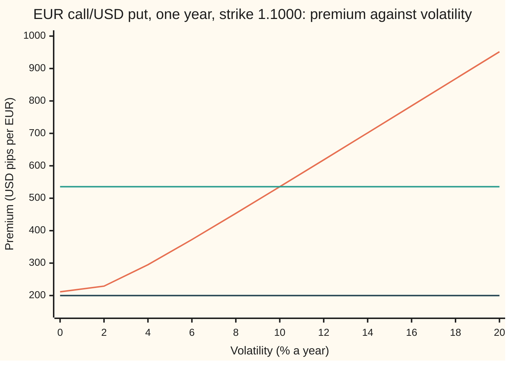
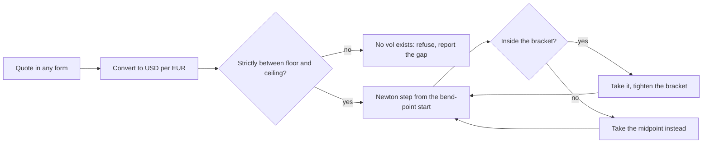

# Implied vol for a currency option: from a premium in any quote to the one vol, and the bounds that say when none exists

[Syllabus](../../../SYLLABUS.md) → [Financial mathematics](../../../SYLLABUS.md#w12) → [FX vanilla options - Garman-Kohlhagen and the desk conventions](../../../SYLLABUS.md#w12-s21) → Implied vol for a currency option

---

## General Overview

The euro trades at 1.1000 US dollars. A bank sells a one-year option on it: the right, not the duty, to buy one euro for 1.1000 dollars in a year. That is a EUR call/USD put, since buying euros with dollars is the same act as selling dollars for euros. Dollars earn 5 percent a year, euros 3 percent, both continuously compounded.

The same premium reaches three desks in three forms. One screen shows 0.053556 dollars per euro. A second shows 535.6 dollar pips, where a pip is a ten-thousandth of a dollar per euro. A third shows 4.869 percent of the euro amount. Each is one price. Traders do not argue about any of them. They argue about the volatility: how widely the exchange rate is expected to swing, as a yearly percentage. Here it is 10 percent.

Getting from the premium to that 10 percent takes three moves. Convert the quote to dollars per euro. Check it lies inside the range a sane market allows. Then run the Garman-Kohlhagen formula backwards, with a solver that cannot run off the end. A quote of 0.0200 dollars per euro fails the second move: it sits below the floor of 0.021138, and no volatility at all reproduces it.

**Implied vol for a currency option is the one volatility at which the Garman-Kohlhagen price, in dollars per euro, equals the quoted premium; it exists and is unique exactly when the premium lies strictly between the discounted forward payoff and the cost today of a euro delivered at expiry.**

**What kind of fact this is:** a method, made safe by a theorem (a vol exists inside the bounds, and only one) proved on this card in Why it works.

### The picture: one curve, one crossing, one miss



Rising curve: the option's price as the volatility dial turns, in dollar pips. Middle flat line: the house quote, 535.56 pips. Bottom flat line: the bad quote, 200.00 pips. The curve starts at the floor, 211.38 pips, at zero volatility, and only climbs. It crosses the house quote once, at 10 percent. It never comes down to 200.00, so that quote has no answer.

---

## The formula

Notation first, in words. A subscript d marks the domestic currency, the one the price is counted in: dollars. A subscript f marks the foreign currency, the one being bought: euros. The spot $S$ is dollars per euro.

$$C(\sigma) = S\,e^{-r_f T}\,N(d_1) - K\,e^{-r_d T}\,N(d_2), \qquad \text{find } \sigma_{\text{imp}} \text{ with } C(\sigma_{\text{imp}}) = C_{\text{mkt}}.$$

**Read it aloud:** the implied vol is the setting of the volatility dial at which the Garman-Kohlhagen price of the euro call, in dollars per euro, equals the quote converted to dollars per euro.

The answer exists exactly inside this range:

$$\max(A - B,\,0) \;<\; C_{\text{mkt}} \;<\; A, \qquad A = S\,e^{-r_f T}, \quad B = K\,e^{-r_d T}.$$

**Read it aloud:** the quote must beat what the option is worth when nothing is random, and must stay below what a euro delivered at expiry costs today.

| Symbol | Plain meaning | In our example | Push it up and the answer… |
| --- | --- | --- | --- |
| $S$ | spot: dollars paid for one euro today | 1.1000 | implied vol falls for the same quote |
| $K$ | strike: dollars per euro fixed in the contract | 1.1000 | implied vol rises for the same quote |
| $r_d$, $r_f$ | dollar and euro interest rates, continuously compounded, per year | 5%, 3% | move the floor and ceiling |
| $T$ | time to expiry, in years | 1 | the same quote implies a lower vol |
| $\sigma$, $w$, $w_0$, $w_1$, $m$ | volatility: the yearly spread of the log exchange rate, a decimal; in the proof, $w = \sigma\sqrt{T}$ is the total swing, $w_0$ and $w_1$ a small and a large one, $m = \ln(F/K)$ | the dial being turned; $m = 0.02$ | the price rises |
| $\sigma_{\text{imp}}$ | implied vol: the $\sigma$ that matches the quote | 0.100000 | |
| $C_{\text{mkt}}$, $C$, $P$ | the quote in dollars per euro; the formula's call price $C(\sigma)$; the matching put's price | 0.053556; 0.053556 at 10%; 0.032418 | implied vol rises |
| $A$, $B$, $F$ | $A$: a euro delivered at expiry, costed today. $B$: the strike's dollars, discounted. $F = S e^{(r_d - r_f)T}$: the forward rate | 1.067490, 1.046352, 1.122221 | |
| $d_1$, $d_2$ | the formula's two distances to the strike, in units of $\sigma\sqrt{T}$ | 0.25, 0.15 at 10% | |
| $N(x)$, $\varphi(x)$ | bell-curve area left of $x$, and the bell curve's height at $x$ | $N(0.25) = 0.598706$ | |
| $\nu$ | vega: dollars per euro gained per unit of $\sigma$ | 0.412764 | Newton's steps shrink |
| $\sigma_0$ | the solver's starting guess | 0.20 | |

The helpers, as on [Garman-Kohlhagen](01-garman-kohlhagen.md):

$$d_1 = \frac{\ln(S/K) + (r_d - r_f + \tfrac12\sigma^2)T}{\sigma\sqrt{T}}, \qquad d_2 = d_1 - \sigma\sqrt{T}, \qquad \nu = S\,e^{-r_f T}\,\varphi(d_1)\sqrt{T}.$$

In words: $d_2$ counts how many standard swings separate the strike from where the rate is expected to end; $d_1$ is one swing more. Vega, from [The Greeks of a currency option](03-garman-kohlhagen-greeks.md), is a euro's discounted cost times a bell-curve height times a square root: every factor positive.

The solver's start is the volatility where the price curve bends from curving up to curving down:

$$\sigma_0 = \sqrt{\frac{2\,\lvert \ln(F/K) \rvert}{T}}.$$

In words: the larger the gap between forward and strike, in logs, the higher the start. Here $\ln(F/K) = 0.02$, so the start is 0.20. When $F = K$ the formula gives zero, and the solver starts at the bracket's midpoint instead.

### When it holds

Implied vol is defined, not assumed, so it is never false; it is available or not. It gives one clean answer when:

- **The quote is in dollars per euro before solving.** Pips, percent of euros and euro pips are the same price in other units. Fed raw, 4.869 percent read as 0.04869 dollars per euro implies 8.8182 percent instead of 10.
- **The option is European**, exercisable on the last day only. An early-exercise premium can push a quote past the ceiling, where no answer exists.
- **Both rates are fixed first, each on its own currency.** Swap them and the same premium implies 15.0903 percent. Implied vol absorbs every error in the other inputs.
- **Time and strike are positive.** On expiry day the price is the payoff whatever the volatility.

Conventions verified 2026-09-27: the four premium forms and their conversions below are fixed by arithmetic; which form a currency pair uses by default is a desk convention, set out on [One option, two currencies](02-premium-currency-and-foreign-domestic-symmetry.md).

---

## Why it works

### Step 0: one currency, one curve, one crossing

A solver needs a single unknown and a single price to hit. So every quote is first turned into dollars per euro. Then the price is a curve in one variable, the volatility. If that curve has no jumps and only climbs, each height between its ends is reached exactly once. The whole card is that sentence, made precise for currencies.

### Step 1: every quote becomes dollars per euro

The option is written on one euro and struck in dollars. The four forms of its premium, from the sibling card on premium currency:

| Form | What it counts | Convert to dollars per euro | House value |
| --- | --- | --- | --- |
| USD pips | ten-thousandths of a dollar, per euro | divide by 10,000 | 535.557706 |
| % of EUR | euros paid, per 100 euros of notional | divide by 100, times $S$ | 4.868706% |
| % of USD | dollars paid, per 100 dollars of notional ($K$ dollars per euro) | divide by 100, times $K$ | 4.868706% |
| EUR pips | ten-thousandths of a euro, per dollar of notional | divide by 10,000, times $S$ and $K$ | 442.609675 |

The two percentages agree here only because the strike equals the spot. The quotes 535.6 pips and 4.869 percent are rounded forms of the exact premium. Rounding moves them off it by a few millionths of a dollar per euro, and a few millionths of a dollar are about a thousandth of a vol point. Solved, they give 10.0010 and 10.0008 percent. All three read 10.00 percent.

### Step 2: the floor and the ceiling

Turn volatility to zero. The euro then grows like a deposit, at the dollar rate minus the euro rate, and lands on the forward $F = 1.122221$. The call pays $F - K$ for certain. Discounted, that is $A - B = 1.067490 - 1.046352 = 0.021138$ dollars per euro: the floor. When the forward sits below the strike, the floor is zero instead. Hence the $\max$.

Turn volatility up without limit. Now $d_1$ runs to plus infinity and $d_2$ to minus infinity, so the price tends to $A = 1.067490$: the cost today of a euro delivered in a year. The call pays less than the euro it could deliver, so it costs less than $A$.

Both bounds are also arbitrage bounds, the edges of risk-free profit. Suppose a bank quotes 0.0200. Buy the call. Borrow 0.970446 euros, which grow to exactly one euro owed in a year, and sell them for 1.067490 dollars. Deposit 1.046352 of those dollars, which grow to 1.1000. The 0.0200 premium leaves 0.001138 dollars in hand today. At expiry, if the euro is above 1.1000, exercise: pay the deposit's 1.1000 for the euro that repays the loan. If below, buy the euro in the market for less than 1.1000 and keep the change. Nothing can go wrong, and 0.001138 was taken on day one. A quote above $A$ gives the mirror trade: sell the call, buy the prepaid euro, deliver it if asked.

### Step 3: the price always climbs

Vega, $\nu = A\,\varphi(d_1)\sqrt{T}$, is a positive cost times a positive height times a positive root. So vega is strictly positive at every volatility, and two different volatilities never give the same price. At 10 percent it is 0.412764 dollars per euro per unit of volatility; bumping the dial to 10.01 and 9.99 percent gives the same slope, 0.412764.

<details>
<summary>Detailed proof: a vol exists exactly inside the bounds, and only one</summary>

Write $w = \sigma\sqrt{T} > 0$ for the total swing and $m = \ln(A/B) = \ln(F/K)$ for the forward's distance above the strike, in logs. Then $d_1 = m/w + w/2$, $d_2 = m/w - w/2$ and $C(w) = A\,N(d_1) - B\,N(d_2)$.

**An identity.** $d_1^2 - d_2^2 = (d_1 + d_2)(d_1 - d_2) = (2m/w)\,w = 2m$. So $\varphi(d_1)/\varphi(d_2) = e^{-m} = B/A$, which gives $A\,\varphi(d_1) = B\,\varphi(d_2)$.

**The slope.** $N$ has slope $\varphi$. So $C'(w) = A\varphi(d_1)\,d_1' - B\varphi(d_2)\,d_2' = A\varphi(d_1)(d_1' - d_2') = A\varphi(d_1)$, since $d_1 - d_2 = w$. Hence $\partial C/\partial\sigma = A\,\varphi(d_1)\sqrt{T} > 0$. The put, $P(w) = B\,N(-d_2) - A\,N(-d_1)$, has the same slope.

**Small swing.** If $m > 0$, both $d$ values go to $+\infty$ as $w \to 0$, so $C \to A - B$. If $m < 0$, both go to $-\infty$ and $C \to 0$. If $m = 0$, both go to 0 and $C \to (A - B)/2 = 0$. In each case $C \to \max(A - B, 0)$.

**Large swing.** As $w \to \infty$, $m/w \to 0$, so $d_1 \to +\infty$, $d_2 \to -\infty$ and $C \to A$.

**Existence.** Take $\max(A - B, 0) < C_{\text{mkt}} < A$. By the two limits, some small $w_0$ prices below the quote and some large $w_1$ above. $C$ is continuous, so the intermediate value theorem gives a $w$ between them with $C(w) = C_{\text{mkt}}$.

**Uniqueness.** If $w < w'$ both matched, the mean value theorem would give a point between with $C' = 0$, against $C' > 0$.

**The ends are never reached.** For each $w$, $C(w/2) < C(w) < C(2w)$ by strict increase, and the outer two stay within the limits. So every price lies strictly inside, and a quote at or outside either end has no positive, finite volatility. Then $\sigma_{\text{imp}} = w/\sqrt{T}$.

</details>

### Step 4: bracketed Newton finds the crossing

Newton's method ([Newton's method](../../06-Calculus%20and%20analysis/03-What%20Derivatives%20Tell%20You/06-newtons-method.md)) slides down the tangent: next guess = guess minus (price error divided by vega). From a good start it doubles the correct digits each step. From a bad one it can leap out of range. A bracket fixes that: keep a low volatility whose price is too low and a high one whose price is too high. Each step, tighten the bracket using the sign of the error. If Newton's next guess lands outside the bracket, take the bracket's midpoint instead.

From the start 0.20, Newton needs three steps to reach 0.100000555683 for the quote 0.053556, with the price error falling from 0.041621814093 to 0.000120022626 to 0.000000006501 and then below a trillionth. Started at 1.5 with no bracket, one Newton step lands on −0.180907, a negative volatility with no meaning. With the bracket, the path is 1.5, 0.75, 0.072669, 0.100277, 0.100000: one halving, then Newton takes over.



The loop ends when the price error falls below a hundred-trillionth. The refusal branch is the one most solvers lack.

### Step 5: the same vol from the euro side

The option to buy one euro for 1.1000 dollars is also the option to sell 1.1000 dollars for one euro. Seen from Frankfurt, it is a put on the dollar. There the spot is 0.909091 euros per dollar, the strike is its reciprocal, the domestic rate is the euro's 3 percent and the foreign rate is the dollar's 5 percent. Its premium, per dollar of notional, is 442.609675 euro pips.

Inverting that put on its own formula gives 0.100000 again. The reason: the log of euros-per-dollar is minus the log of dollars-per-euro, so the two spreads are the same size. The full symmetry is on [One option, two currencies](02-premium-currency-and-foreign-domestic-symmetry.md). A third road uses parity: the dollar put at the same strike costs $C - (A - B) = 0.032418$, and inverting it on the put formula gives 0.100000 too.

The general inverse, with a share and a dividend in place of the euro and its rate, is [Implied volatility](../11-Implied%20volatility%20and%20the%20vanilla%20inverses/01-implied-volatility.md); root-finders in general, bracketing included, are on [Solving backwards](../07-Greeks%20by%20Numbers%20and%20Calibration/05-root-finding-for-inverses.md).

---

## Worked numbers, by hand

EURUSD: $S = K = 1.1000$, $r_d = 5\%$, $r_f = 3\%$, $T = 1$, quote 535.6 USD pips.

| Step | Arithmetic | Value |
| --- | --- | --- |
| quote in USD per EUR | 535.6 ÷ 10,000 | 0.05356 |
| euro delivered at expiry, $A$ | $1.1 \times e^{-0.03} = 1.1 \times 0.970446$ | 1.067490 |
| strike's dollars today, $B$ | $1.1 \times e^{-0.05} = 1.1 \times 0.951229$ | 1.046352 |
| floor, $\max(A - B, 0)$ | $1.067490 - 1.046352$ | 0.021138 |
| inside? | $0.021138 < 0.05356 < 1.067490$ | yes: one answer |
| start, $\sigma_0$ | $\sqrt{2 \times 0.02}$ | 0.20 |
| check 10% (Step 4 shows the path from 0.20): $d_1$, $d_2$ | $(0 + 0.02 + 0.005)/0.10$, then less 0.10 | 0.25, 0.15 |
| $N(d_1)$, $N(d_2)$ | bell-curve table | 0.598706, 0.559618 |
| price at 10% | $1.067490 \times 0.598706 - 1.046352 \times 0.559618$ | 0.053556 |
| vega at 10% | $1.067490 \times \varphi(0.25) \times 1$ | 0.412764 |
| Newton from 10% | $0.10 + (0.05356 - 0.053556)/0.412764$ | 0.100010 |
| **implied vol** | | **10.00%** |

The market is charging for a euro-dollar rate that swings about 10 percent a year. One vol point, 0.01 of volatility, moves this premium by a hundredth of vega: 0.004128 dollars per euro, about 41 pips.

The same inputs turn a ladder of pip quotes into vols:

| USD pips | Implied vol |
| --- | --- |
| 200.00 | none: below the floor |
| 250.00 | 2.7185% |
| 400.00 | 6.6844% |
| 535.56 | 10.0001% |
| 800.00 | 16.3631% |
| 1500.00 | 33.1598% |
| 10000.00 | 370.6323% |
| 10700.00 | none: above the ceiling |

Near the floor, 250 pips already imply 2.7185 percent while 200 imply nothing. Near the ceiling, 10000 pips imply 370.6323 percent: a quote there says almost nothing about volatility.

### What breaks if you drop a piece

| Mistake | Comes out at | What went wrong |
| --- | --- | --- |
| 4.869% of EUR fed in as 0.04869 USD per EUR | 8.8182% | Percent of euros is not dollars per euro; multiply by the spot |
| Dollar and euro rates swapped | 15.0903% | The domestic rate discounts the strike, the foreign rate the euro |
| 442.6 EUR pips read as USD pips | 7.7353% | Wrong currency in the premium; the euro-side quote needs its own formula |
| 0.0200 solved with no bounds check | 0.000001 | No root exists; the solver stops at its search edge |
| 535.6 left unscaled, no bounds check | 5.000000, i.e. 500% | Above the ceiling; the solver stops at the other edge |

At the strike equal to spot, swapping the rates prices the call exactly as the dollar put, so this mistake is the same as inverting the wrong contract. The last two rows are the dangerous ones: the solver returns a number, not an error.

---

## Code, from first principles, and it actually runs

The code reaches the implied vol by four roads. Road 1 is the bracketed Newton solver on the Garman-Kohlhagen formula, fed the exact premium and each of the three rounded quotes; the bell-curve area comes from a series in Python and from Simpson's rule in Rust. Road 2 halves the volatility range on a price built by averaging the payoff over the bell curve, with no $d_1$ or $d_2$. Road 3 inverts the mirror put from the euro side. Road 4 inverts the dollar put that parity gives. The code also refuses the 0.0200 quote, checks vega by bumping, prints every wrong answer above, and prints every chart point. Eight mutations were tried (swapping $N(d_1)$ and $N(d_2)$, halving the gap between $d_1$ and $d_2$, leaving the rates unswapped in the mirror, breaking the averaging drift, discounting vega at the wrong rate, flipping the bracket rule, lowering the floor, and letting a quote on a bound through); each one stops the run.

### Python

```python
# FX implied volatility -- the check behind the card.  Standard library only.
# EURUSD: spot 1.1000 USD per EUR, strike 1.1000, USD (domestic) 5%, EUR (foreign) 3%, one year.
# Nothing imported knows the answer: the normal CDF is a series written out, the root finder
# is bracketed Newton written out, the second price comes from Simpson's rule on the payoff.
from math import log, sqrt, exp, pi

def phi(x): return exp(-0.5 * x * x) / sqrt(2.0 * pi)          # bell-curve height
def N(x):                                                       # bell-curve area left of x, by series
    if x < -9.0: return 0.0
    if x > 9.0: return 1.0
    term, total, n = x, x, 0
    while abs(term) > 1e-18:
        n += 1
        term *= x * x / (2 * n + 1)
        total += term
    return 0.5 + phi(x) * total

def gk(S, K, rd, rf, v, T, call=True):                          # Garman-Kohlhagen, domestic per foreign
    A, B = S * exp(-rf * T), K * exp(-rd * T)
    if v <= 0.0: return max(A - B, 0.0) if call else max(B - A, 0.0)
    d1 = (log(S / K) + (rd - rf + 0.5 * v * v) * T) / (v * sqrt(T))
    d2 = d1 - v * sqrt(T)
    return A * N(d1) - B * N(d2) if call else B * N(-d2) - A * N(-d1)

def vega(S, K, rd, rf, v, T):
    d1 = (log(S / K) + (rd - rf + 0.5 * v * v) * T) / (v * sqrt(T))
    return S * exp(-rf * T) * phi(d1) * sqrt(T)

def bounds(S, K, rd, rf, T, call=True):                         # floor and ceiling of the price
    A, B = S * exp(-rf * T), K * exp(-rd * T)
    return (max(A - B, 0.0), A) if call else (max(B - A, 0.0), B)

def implied(p, S, K, rd, rf, T, call=True, v0=None, trace=None):
    lo_p, hi_p = bounds(S, K, rd, rf, T, call)
    if not lo_p < p < hi_p: return None                          # no volatility exists: refuse
    lo, hi = 0.0, 4.0
    while gk(S, K, rd, rf, hi, T, call) < p: hi *= 2.0           # grow the bracket until it straddles
    v = v0 if v0 is not None else sqrt(2.0 * abs(log(S / K) + (rd - rf) * T) / T)   # inflection seed
    if not lo < v < hi: v = 0.5 * (lo + hi)
    for i in range(200):
        f = gk(S, K, rd, rf, v, T, call) - p
        if trace is not None: trace.append((i, v, f))
        if abs(f) < 1e-14: break
        if f > 0: hi = v
        else: lo = v
        g = vega(S, K, rd, rf, v, T)
        step = v - f / g if g > 0.0 else lo                      # flat curve: no tangent, so halve
        v = step if lo < step < hi else 0.5 * (lo + hi)          # Newton inside the bracket, else halve
    return v

def by_integral(S, K, rd, rf, v, T, n=20000):                  # road 2: average the payoff, no d1 or d2
    a, b = -10.0, 10.0
    h = (b - a) / n
    def f(z):
        ST = S * exp((rd - rf - 0.5 * v * v) * T + v * sqrt(T) * z)
        return max(ST - K, 0.0) * phi(z)
    s = f(a) + f(b) + sum((4 if i % 2 else 2) * f(a + i * h) for i in range(1, n))
    return exp(-rd * T) * s * h / 3.0

def bisect(fn, target, lo, hi, n=50):
    for _ in range(n):
        mid = 0.5 * (lo + hi)
        if fn(mid) < target: lo = mid
        else: hi = mid
    return 0.5 * (lo + hi)

S, K, rd, rf, T = 1.10, 1.10, 0.05, 0.03, 1.0
C = gk(S, K, rd, rf, 0.10, T)                                   # the house premium at 10% vol
P = gk(S, K, rd, rf, 0.10, T, call=False)
floor, ceil = bounds(S, K, rd, rf, T)
q_house, q_pips, q_pct = 0.053556, 535.6, 4.869                 # three quotes of one premium
from_pips, from_pct = q_pips / 1e4, q_pct / 100.0 * S           # both to USD per EUR
tr = []
v_house = implied(q_house, S, K, rd, rf, T, trace=tr)
v_exact = implied(C, S, K, rd, rf, T)
v_road2 = bisect(lambda v: by_integral(S, K, rd, rf, v, T), C, 0.0001, 1.0)
eur_put = C / (S * K)                                           # EUR per USD, for one USD of notional
v_mirror = implied(eur_put, 1 / S, 1 / K, rf, rd, T, call=False)  # the mirror: USD put seen from EUR
v_parity = implied(C - (S * exp(-rf * T) - K * exp(-rd * T)), S, K, rd, rf, T, call=False)
tr_bad = []
implied(C, S, K, rd, rf, T, v0=1.5, trace=tr_bad)
bare = 1.5 - (gk(S, K, rd, rf, 1.5, T) - C) / vega(S, K, rd, rf, 1.5, T)   # one unguarded Newton step
naive = lambda p: bisect(lambda v: gk(S, K, rd, rf, v, T), p, 1e-6, 5.0)   # a solver with no bounds check
bump = (gk(S, K, rd, rf, 0.1001, T) - gk(S, K, rd, rf, 0.0999, T)) / 0.0002

rows = [("forward F = S e^((rd-rf)T)", S * exp((rd - rf) * T)), ("USD discount e^(-rd T)", exp(-rd * T)),
        ("EUR discount e^(-rf T)", exp(-rf * T)), ("discounted strike K e^-rdT", K * exp(-rd * T)),
        ("ln(F/K), the seed's input", log(S / K) + (rd - rf) * T), ("floor  (S e^-rfT - K e^-rdT)+", floor),
        ("ceiling  S e^-rfT", ceil), ("call at 10% vol, USD per EUR", C), ("put at 10% vol, USD per EUR", P),
        ("call in USD pips", C * 1e4), ("call in % of EUR", C / S * 100), ("call in % of USD", C / K * 100),
        ("mirror spot 1/S, EUR per USD", 1 / S), ("call in EUR pips (EUR per USD)", eur_put * 1e4), ("vega at 10%, USD per EUR per unit", vega(S, K, rd, rf, 0.10, T)),
        ("vega by bump", bump), ("1 Newton, exact premium", v_exact), ("1 Newton, quote 0.053556", v_house),
        ("1 Newton, quote 535.6 pips", implied(from_pips, S, K, rd, rf, T)),
        ("1 Newton, quote 4.869% of EUR", implied(from_pct, S, K, rd, rf, T)),
        ("2 bisection on Simpson price", v_road2), ("3 mirror USD put, EUR terms", v_mirror),
        ("4 USD-put from parity, inverted", v_parity), ("gap to floor at quote 0.0200", floor - 0.0200),
        ("wrong: 4.869% fed as USD per EUR", implied(0.04869, S, K, rd, rf, T)),
        ("wrong: rates swapped", implied(C, S, K, rf, rd, T)),
        ("wrong: 442.6 EUR pips read as USD", implied(0.04426, S, K, rd, rf, T)),
        ("wrong: 0.0200, no bounds check", naive(0.0200)), ("wrong: 535.6 unscaled, no check", naive(535.6)),
        ("try: quote 600 pips", implied(0.0600, S, K, rd, rf, T)), ("try: rates both 5%", implied(C, S, K, rd, rd, T)),
        ("try: half a year", implied(C, S, K, rd, rf, 0.5))]
for name, v in rows:
    print(f"{name:<36} " + ("          none" if v is None else f"{v:>14.6f}"))
d1 = (log(S / K) + (rd - rf + 0.005) * T) / 0.10
print(f"d1, d2 at 10%:        {d1:.6f}  {d1 - 0.10:.6f}")
print(f"N(d1), N(d2) at 10%:  {N(d1):.6f}  {N(d1 - 0.10):.6f}")
print("Newton from the seed:  step, vol, |price error| USD per EUR")
for i, v, f in tr: print(f"  {i:>2}  {v:.12f}  {abs(f):.12f}")
print(f"bare Newton from 1.5, first step: {bare:.6f}")
print("guarded Newton from 1.5: " + " ".join(f"{v:.6f}" for _, v, _ in tr_bad[:6]))
print("ladder, USD pips -> vol %:")
for qp in (200.0, 250.0, 400.0, 535.56, 800.0, 1500.0, 10000.0, 10700.0):
    v = implied(qp / 1e4, S, K, rd, rf, T)
    print(f"  {qp:>8.2f}  " + ("none" if v is None else f"{100 * v:.4f}"))
print("chart, vol %        " + " ".join(f"{2 * i:7d}" for i in range(11)))
print("chart, call pips    " + " ".join(f"{gk(S, K, rd, rf, 0.02 * i, T) * 1e4:7.2f}" for i in range(11)))
print(f"chart, lines: quote {C * 1e4:.2f}  floor {floor * 1e4:.2f}  bad quote {200:.2f}")

assert abs(v_exact - 0.10) < 1e-10, "Newton must recover the 10% that made the premium"
assert abs(v_road2 - v_exact) < 1e-6, "bisection on an integral price must land on the same vol"
assert abs(v_mirror - v_exact) < 1e-9, "the mirror put from the EUR side must imply the same vol"
assert abs(v_parity - v_exact) < 1e-9, "the parity put must imply the same vol"
assert abs(bump - vega(S, K, rd, rf, 0.10, T)) < 1e-6, "vega by bump vs formula"
assert implied(0.0200, S, K, rd, rf, T) is None, "a quote below the floor must be refused"
assert abs(gk(S, K, rd, rf, 0.003, T) - floor) < 1e-9, "tiny vol must price at the floor"
assert abs(C - 0.053556) < 5e-7 and abs(P - 0.032418) < 5e-7, "house call and put, USD per EUR"
assert abs(floor - 0.021138) < 5e-7 and abs(S * exp((rd - rf) * T) - 1.122221) < 5e-7, "house floor and forward"
assert all(abs(implied(q, S, K, rd, rf, T) - 0.10) < 2e-5 for q in (from_pips, from_pct)), "rounded quotes give 10.00%"
assert implied(ceil, S, K, rd, rf, T) is None and implied(1.07, S, K, rd, rf, T) is None, "at or above the ceiling: refuse"
assert bare < 0.0 and abs(tr_bad[-1][1] - 0.10) < 1e-9, "bare Newton goes negative; the bracketed one still lands"
print("ALL CHECKS PASS")
```

**Ran 2026-09-27 on macOS, Python 3.14.6, standard library only. All checks passed. Output, pasted from the run:**

```
forward F = S e^((rd-rf)T)                 1.122221
USD discount e^(-rd T)                     0.951229
EUR discount e^(-rf T)                     0.970446
discounted strike K e^-rdT                 1.046352
ln(F/K), the seed's input                  0.020000
floor  (S e^-rfT - K e^-rdT)+              0.021138
ceiling  S e^-rfT                          1.067490
call at 10% vol, USD per EUR               0.053556
put at 10% vol, USD per EUR                0.032418
call in USD pips                         535.557706
call in % of EUR                           4.868706
call in % of USD                           4.868706
mirror spot 1/S, EUR per USD               0.909091
call in EUR pips (EUR per USD)           442.609675
vega at 10%, USD per EUR per unit          0.412764
vega by bump                               0.412764
1 Newton, exact premium                    0.100000
1 Newton, quote 0.053556                   0.100001
1 Newton, quote 535.6 pips                 0.100010
1 Newton, quote 4.869% of EUR              0.100008
2 bisection on Simpson price               0.100000
3 mirror USD put, EUR terms                0.100000
4 USD-put from parity, inverted            0.100000
gap to floor at quote 0.0200               0.001138
wrong: 4.869% fed as USD per EUR           0.088182
wrong: rates swapped                       0.150903
wrong: 442.6 EUR pips read as USD          0.077353
wrong: 0.0200, no bounds check             0.000001
wrong: 535.6 unscaled, no check            5.000000
try: quote 600 pips                        0.115574
try: rates both 5%                         0.128386
try: half a year                           0.157801
d1, d2 at 10%:        0.250000  0.150000
N(d1), N(d2) at 10%:  0.598706  0.559618
Newton from the seed:  step, vol, |price error| USD per EUR
   0  0.200000000000  0.041621814093
   1  0.100291317396  0.000120022626
   2  0.100000571434  0.000000006501
   3  0.100000555683  0.000000000000
bare Newton from 1.5, first step: -0.180907
guarded Newton from 1.5: 1.500000 0.750000 0.072669 0.100277 0.100000 0.100000
ladder, USD pips -> vol %:
    200.00  none
    250.00  2.7185
    400.00  6.6844
    535.56  10.0001
    800.00  16.3631
   1500.00  33.1598
  10000.00  370.6323
  10700.00  none
chart, vol %              0       2       4       6       8      10      12      14      16      18      20
chart, call pips     211.38  228.99  294.99  372.56  453.40  535.56  618.36  701.52  784.86  868.30  951.78
chart, lines: quote 535.56  floor 211.38  bad quote 200.00
ALL CHECKS PASS
```

Four roads, one vol: 0.100000 from the formula, from the averaged payoff, from the euro side and from the parity put. The rounded quotes land within 0.000010 of it.

### Rust

Same checks, same inputs, same labels. The bell-curve area here is Simpson's rule on the curve's height, a different route from Python's series.

```rust
// FX implied volatility -- the same check as fx_implied_volatility_check.py, in Rust.
// Standard library only, no crates.  Rust has no erf, so the bell-curve area N(x) is built
// by adding thin slices under the curve (Simpson).  The root finder is written out.
// Compile: rustc --edition 2021 -O fx_implied_volatility_check.rs -o /tmp/fx_iv_check
use std::f64::consts::PI;

fn phi(x: f64) -> f64 { (-0.5 * x * x).exp() / (2.0 * PI).sqrt() }

fn simpson<F: Fn(f64) -> f64>(f: F, a: f64, b: f64, n: usize) -> f64 {
    let h = (b - a) / n as f64;
    let mut s = f(a) + f(b);
    for i in 1..n { s += if i % 2 == 1 { 4.0 } else { 2.0 } * f(a + i as f64 * h); }
    s * h / 3.0
}

fn n_cdf(x: f64) -> f64 {
    if x < -9.0 { return 0.0; }
    if x > 9.0 { return 1.0; }
    0.5 + simpson(phi, 0.0, x, 4000)
}

fn gk(s: f64, k: f64, rd: f64, rf: f64, v: f64, t: f64, call: bool) -> f64 {
    let (a, b) = (s * (-rf * t).exp(), k * (-rd * t).exp());
    if v <= 0.0 { return if call { (a - b).max(0.0) } else { (b - a).max(0.0) }; }
    let d1 = ((s / k).ln() + (rd - rf + 0.5 * v * v) * t) / (v * t.sqrt());
    let d2 = d1 - v * t.sqrt();
    if call { a * n_cdf(d1) - b * n_cdf(d2) } else { b * n_cdf(-d2) - a * n_cdf(-d1) }
}

fn vega(s: f64, k: f64, rd: f64, rf: f64, v: f64, t: f64) -> f64 {
    let d1 = ((s / k).ln() + (rd - rf + 0.5 * v * v) * t) / (v * t.sqrt());
    s * (-rf * t).exp() * phi(d1) * t.sqrt()
}

fn bounds(s: f64, k: f64, rd: f64, rf: f64, t: f64, call: bool) -> (f64, f64) {
    let (a, b) = (s * (-rf * t).exp(), k * (-rd * t).exp());
    if call { ((a - b).max(0.0), a) } else { ((b - a).max(0.0), b) }
}

fn implied(p: f64, s: f64, k: f64, rd: f64, rf: f64, t: f64, call: bool, v0: Option<f64>,
           trace: &mut Vec<(usize, f64, f64)>) -> Option<f64> {
    let (lo_p, hi_p) = bounds(s, k, rd, rf, t, call);
    if !(lo_p < p && p < hi_p) { return None; }                  // no volatility exists: refuse
    let (mut lo, mut hi) = (0.0_f64, 4.0_f64);
    while gk(s, k, rd, rf, hi, t, call) < p { hi *= 2.0; }
    let mut v = v0.unwrap_or((2.0 * ((s / k).ln() + (rd - rf) * t).abs() / t).sqrt());
    if !(lo < v && v < hi) { v = 0.5 * (lo + hi); }
    for i in 0..200 {
        let f = gk(s, k, rd, rf, v, t, call) - p;
        trace.push((i, v, f));
        if f.abs() < 1e-14 { break; }
        if f > 0.0 { hi = v; } else { lo = v; }
        let g = vega(s, k, rd, rf, v, t);
        let step = if g > 0.0 { v - f / g } else { lo };           // flat curve: no tangent, so halve
        v = if lo < step && step < hi { step } else { 0.5 * (lo + hi) };   // Newton in the bracket, else halve
    }
    Some(v)
}

fn iv(p: f64, s: f64, k: f64, rd: f64, rf: f64, t: f64, call: bool) -> Option<f64> {
    implied(p, s, k, rd, rf, t, call, None, &mut Vec::new())
}

fn by_integral(s: f64, k: f64, rd: f64, rf: f64, v: f64, t: f64) -> f64 {   // road 2: no d1, no d2
    let f = |z: f64| {
        let st = s * ((rd - rf - 0.5 * v * v) * t + v * t.sqrt() * z).exp();
        (st - k).max(0.0) * phi(z)
    };
    (-rd * t).exp() * simpson(f, -10.0, 10.0, 20000)
}

fn bisect<F: Fn(f64) -> f64>(f: F, target: f64, mut lo: f64, mut hi: f64) -> f64 {
    for _ in 0..50 {
        let mid = 0.5 * (lo + hi);
        if f(mid) < target { lo = mid; } else { hi = mid; }
    }
    0.5 * (lo + hi)
}

fn main() {
    let (s, k, rd, rf, t) = (1.10_f64, 1.10_f64, 0.05_f64, 0.03_f64, 1.0_f64);
    let c = gk(s, k, rd, rf, 0.10, t, true);
    let p = gk(s, k, rd, rf, 0.10, t, false);
    let (floor, ceil) = bounds(s, k, rd, rf, t, true);
    let (from_pips, from_pct) = (535.6 / 1e4, 4.869 / 100.0 * s);
    let mut tr = Vec::new();
    let v_house = implied(0.053556, s, k, rd, rf, t, true, None, &mut tr);
    let v_exact = iv(c, s, k, rd, rf, t, true).unwrap();
    let v_road2 = bisect(|v| by_integral(s, k, rd, rf, v, t), c, 0.0001, 1.0);
    let eur_put = c / (s * k);
    let v_mirror = iv(eur_put, 1.0 / s, 1.0 / k, rf, rd, t, false).unwrap();
    let v_parity = iv(c - (s * (-rf * t).exp() - k * (-rd * t).exp()), s, k, rd, rf, t, false).unwrap();
    let mut tr_bad = Vec::new();
    implied(c, s, k, rd, rf, t, true, Some(1.5), &mut tr_bad);
    let bare = 1.5 - (gk(s, k, rd, rf, 1.5, t, true) - c) / vega(s, k, rd, rf, 1.5, t);
    let naive = |q: f64| bisect(|v| gk(s, k, rd, rf, v, t, true), q, 1e-6, 5.0);
    let bump = (gk(s, k, rd, rf, 0.1001, t, true) - gk(s, k, rd, rf, 0.0999, t, true)) / 0.0002;

    let rows: Vec<(&str, Option<f64>)> = vec![
        ("forward F = S e^((rd-rf)T)", Some(s * ((rd - rf) * t).exp())), ("USD discount e^(-rd T)", Some((-rd * t).exp())),
        ("EUR discount e^(-rf T)", Some((-rf * t).exp())), ("discounted strike K e^-rdT", Some(k * (-rd * t).exp())),
        ("ln(F/K), the seed's input", Some((s / k).ln() + (rd - rf) * t)), ("floor  (S e^-rfT - K e^-rdT)+", Some(floor)),
        ("ceiling  S e^-rfT", Some(ceil)), ("call at 10% vol, USD per EUR", Some(c)), ("put at 10% vol, USD per EUR", Some(p)),
        ("call in USD pips", Some(c * 1e4)), ("call in % of EUR", Some(c / s * 100.0)), ("call in % of USD", Some(c / k * 100.0)),
        ("mirror spot 1/S, EUR per USD", Some(1.0 / s)), ("call in EUR pips (EUR per USD)", Some(eur_put * 1e4)), ("vega at 10%, USD per EUR per unit", Some(vega(s, k, rd, rf, 0.10, t))),
        ("vega by bump", Some(bump)), ("1 Newton, exact premium", Some(v_exact)), ("1 Newton, quote 0.053556", v_house),
        ("1 Newton, quote 535.6 pips", iv(from_pips, s, k, rd, rf, t, true)),
        ("1 Newton, quote 4.869% of EUR", iv(from_pct, s, k, rd, rf, t, true)),
        ("2 bisection on Simpson price", Some(v_road2)), ("3 mirror USD put, EUR terms", Some(v_mirror)),
        ("4 USD-put from parity, inverted", Some(v_parity)), ("gap to floor at quote 0.0200", Some(floor - 0.0200)),
        ("wrong: 4.869% fed as USD per EUR", iv(0.04869, s, k, rd, rf, t, true)),
        ("wrong: rates swapped", iv(c, s, k, rf, rd, t, true)),
        ("wrong: 442.6 EUR pips read as USD", iv(0.04426, s, k, rd, rf, t, true)),
        ("wrong: 0.0200, no bounds check", Some(naive(0.0200))), ("wrong: 535.6 unscaled, no check", Some(naive(535.6))),
        ("try: quote 600 pips", iv(0.0600, s, k, rd, rf, t, true)), ("try: rates both 5%", iv(c, s, k, rd, rd, t, true)),
        ("try: half a year", iv(c, s, k, rd, rf, 0.5, true)),
    ];
    for (name, v) in &rows {
        match v { None => println!("{:<36}           none", name), Some(x) => println!("{:<36} {:>14.6}", name, x) }
    }
    let d1 = ((s / k).ln() + (rd - rf + 0.005) * t) / 0.10;
    println!("d1, d2 at 10%:        {:.6}  {:.6}", d1, d1 - 0.10);
    println!("N(d1), N(d2) at 10%:  {:.6}  {:.6}", n_cdf(d1), n_cdf(d1 - 0.10));
    println!("Newton from the seed:  step, vol, |price error| USD per EUR");
    for (i, v, f) in &tr { println!("  {:>2}  {:.12}  {:.12}", i, v, f.abs()); }
    println!("bare Newton from 1.5, first step: {:.6}", bare);
    let path: Vec<String> = tr_bad.iter().take(6).map(|x| format!("{:.6}", x.1)).collect();
    println!("guarded Newton from 1.5: {}", path.join(" "));
    println!("ladder, USD pips -> vol %:");
    for qp in [200.0_f64, 250.0, 400.0, 535.56, 800.0, 1500.0, 10000.0, 10700.0] {
        match iv(qp / 1e4, s, k, rd, rf, t, true) {
            None => println!("  {:>8.2}  none", qp),
            Some(v) => println!("  {:>8.2}  {:.4}", qp, 100.0 * v),
        }
    }
    let vols: Vec<String> = (0..11).map(|i| format!("{:7}", 2 * i)).collect();
    println!("chart, vol %        {}", vols.join(" "));
    let pips: Vec<String> = (0..11).map(|i| format!("{:7.2}", gk(s, k, rd, rf, 0.02 * i as f64, t, true) * 1e4)).collect();
    println!("chart, call pips    {}", pips.join(" "));
    println!("chart, lines: quote {:.2}  floor {:.2}  bad quote {:.2}", c * 1e4, floor * 1e4, 200.0);

    assert!((v_exact - 0.10).abs() < 1e-10, "Newton must recover the 10% that made the premium");
    assert!((v_road2 - v_exact).abs() < 1e-6, "bisection on an integral price must land on the same vol");
    assert!((v_mirror - v_exact).abs() < 1e-9, "the mirror put from the EUR side must imply the same vol");
    assert!((v_parity - v_exact).abs() < 1e-9, "the parity put must imply the same vol");
    assert!((bump - vega(s, k, rd, rf, 0.10, t)).abs() < 1e-6, "vega by bump vs formula");
    assert!(iv(0.0200, s, k, rd, rf, t, true).is_none(), "a quote below the floor must be refused");
    assert!((gk(s, k, rd, rf, 0.003, t, true) - floor).abs() < 1e-9, "tiny vol must price at the floor");
    assert!((c - 0.053556).abs() < 5e-7 && (p - 0.032418).abs() < 5e-7, "house call and put, USD per EUR");
    assert!((floor - 0.021138).abs() < 5e-7 && (s * ((rd - rf) * t).exp() - 1.122221).abs() < 5e-7, "house floor and forward");
    for q in [from_pips, from_pct] { assert!((iv(q, s, k, rd, rf, t, true).unwrap() - 0.10).abs() < 2e-5, "rounded quotes give 10.00%"); }
    assert!(iv(ceil, s, k, rd, rf, t, true).is_none() && iv(1.07, s, k, rd, rf, t, true).is_none(), "at or above the ceiling: refuse");
    assert!(bare < 0.0 && (tr_bad.last().unwrap().1 - 0.10).abs() < 1e-9, "bare Newton goes negative; the bracketed one still lands");
    println!("ALL CHECKS PASS");
}
```

**Ran 2026-09-27 on macOS, rustc 1.98.1, no crates. All checks passed. Output, pasted from the run:**

```
forward F = S e^((rd-rf)T)                 1.122221
USD discount e^(-rd T)                     0.951229
EUR discount e^(-rf T)                     0.970446
discounted strike K e^-rdT                 1.046352
ln(F/K), the seed's input                  0.020000
floor  (S e^-rfT - K e^-rdT)+              0.021138
ceiling  S e^-rfT                          1.067490
call at 10% vol, USD per EUR               0.053556
put at 10% vol, USD per EUR                0.032418
call in USD pips                         535.557706
call in % of EUR                           4.868706
call in % of USD                           4.868706
mirror spot 1/S, EUR per USD               0.909091
call in EUR pips (EUR per USD)           442.609675
vega at 10%, USD per EUR per unit          0.412764
vega by bump                               0.412764
1 Newton, exact premium                    0.100000
1 Newton, quote 0.053556                   0.100001
1 Newton, quote 535.6 pips                 0.100010
1 Newton, quote 4.869% of EUR              0.100008
2 bisection on Simpson price               0.100000
3 mirror USD put, EUR terms                0.100000
4 USD-put from parity, inverted            0.100000
gap to floor at quote 0.0200               0.001138
wrong: 4.869% fed as USD per EUR           0.088182
wrong: rates swapped                       0.150903
wrong: 442.6 EUR pips read as USD          0.077353
wrong: 0.0200, no bounds check             0.000001
wrong: 535.6 unscaled, no check            5.000000
try: quote 600 pips                        0.115574
try: rates both 5%                         0.128386
try: half a year                           0.157801
d1, d2 at 10%:        0.250000  0.150000
N(d1), N(d2) at 10%:  0.598706  0.559618
Newton from the seed:  step, vol, |price error| USD per EUR
   0  0.200000000000  0.041621814093
   1  0.100291317396  0.000120022626
   2  0.100000571434  0.000000006501
   3  0.100000555683  0.000000000000
bare Newton from 1.5, first step: -0.180907
guarded Newton from 1.5: 1.500000 0.750000 0.072669 0.100277 0.100000 0.100000
ladder, USD pips -> vol %:
    200.00  none
    250.00  2.7185
    400.00  6.6844
    535.56  10.0001
    800.00  16.3631
   1500.00  33.1598
  10000.00  370.6323
  10700.00  none
chart, vol %              0       2       4       6       8      10      12      14      16      18      20
chart, call pips     211.38  228.99  294.99  372.56  453.40  535.56  618.36  701.52  784.86  868.30  951.78
chart, lines: quote 535.56  floor 211.38  bad quote 200.00
ALL CHECKS PASS
```

The two outputs agree line for line, including the twelve-decimal Newton path.

> [!TIP]
> **Try changing**
> Guess the direction first.
> - **Raise the quote to 600 pips.** Set the quote to 0.0600. Implied vol rises to **11.5574%**.
> - **Give the euro the dollar's rate.** Set both rates to 5 percent with the same premium. Implied vol is **12.8386%**. The forward drops to the strike, the zero-volatility floor vanishes, and more of the premium must be paid for by swings.
> - **Halve the time.** Keep the premium, set $T = 0.5$. Implied vol is **15.7801%**. Less time to swing, so the same price needs a bigger yearly swing.
> - **Remove the bracket.** Start plain Newton at 1.5. The first step lands on **−0.180907**, a negative volatility that means nothing.

---

## The usual mistake

> [!warning]
> **Solving before converting.** A currency premium comes in four forms and two currencies. Each one, fed raw into the formula, lies inside the floor and ceiling often enough that the solver runs and returns a plausible number: 8.8182 percent for the euro-percent quote, 7.7353 percent for the euro-pip quote. Nothing flags it. Convert to dollars per euro first, every time, then solve.
>
> Smaller traps:
> - **Skipping the bounds check.** The quote 0.0200 sits 0.001138 below the floor. A plain bisection returns 0.000001; with a pip quote left unscaled it returns its upper edge, 500 percent. Both are search edges, not answers.
> - **Rates on the wrong currency.** The dollar rate discounts the strike, the euro rate discounts the euro. Swapped, 10 percent becomes 15.0903 percent.
> - **Unguarded Newton.** From a start of 1.5 it steps to −0.180907. The bracket costs one halving here and never leaves the range.
> - **Reading the vol as a forecast.** 10 percent is the price of the option in other units. It includes the seller's hedging costs and the demand for protection.

---

## Where you meet it in real life

- **Currency option screens.** Interbank brokers show vols, not premiums. A 1-year EURUSD at 10.00 is the number traders move; the premium is worked out on the ticket.
- **The trade ticket.** It turns the agreed vol back into money in the premium currency the client asked for. This card runs the ticket in reverse, from any of the four forms.
- **Strikes from deltas.** Currency options are quoted by delta, not strike, and the strike follows from the vol: [Strike from delta](06-fx-strike-from-delta.md), using the deltas of [Four deltas for one option](04-fx-delta-conventions.md) and the at-the-money strike of [Three meanings of at-the-money](05-at-the-money-conventions.md).
- **Risk control.** A risk system reprices every option in a book from its vol each night. A premium that lands outside the bounds is a data error or a free trade, and the bounds check finds it before a solver hides it.
- **The smile.** Invert quotes at several strikes of one expiry and the vols differ. The pattern they trace is quoted as risk reversals and butterflies.

> **Say it back**
> A currency option's premium comes in several forms; convert it to dollars per euro before anything else. The Garman-Kohlhagen price climbs with volatility, from the discounted forward payoff toward the cost of a euro delivered at expiry, because vega is always positive. So a quote strictly between has exactly one implied vol, and a quote outside has none but offers free money. Bracketed Newton finds it in a few steps without leaving the range. The euro side, inverting the mirror dollar put, gives the same 10 percent.

---

## What this builds on

- [Garman-Kohlhagen](01-garman-kohlhagen.md): the formula run backwards, and the house premium 0.053556.
- [One option, two currencies](02-premium-currency-and-foreign-domestic-symmetry.md): the four premium forms, and the mirror option seen from the euro side.
- [The Greeks of a currency option](03-garman-kohlhagen-greeks.md): vega, the positive slope that makes the answer unique and drives Newton.
- [Implied volatility](../11-Implied%20volatility%20and%20the%20vanilla%20inverses/01-implied-volatility.md): the same inverse on a share, with its floor and ceiling.
- [Solving backwards](../07-Greeks%20by%20Numbers%20and%20Calibration/05-root-finding-for-inverses.md): brackets, halving and safeguarded steps in general.
- [Newton's method](../../06-Calculus%20and%20analysis/03-What%20Derivatives%20Tell%20You/06-newtons-method.md): stepping along the tangent, and why it can overshoot.

## Where this goes next

- [Risk reversal and butterfly](../22-The%20FX%20smile%20-%20risk%20reversals%2C%20butterflies%20and%20vanna-volga/01-risk-reversal-and-butterfly.md): implied vols read at several deltas of one expiry, and the two numbers desks use to quote their shape.

This card turns one premium into one vol; why the vols of the same pair differ from strike to strike, and how the market quotes that difference, is the question the smile answers.

---

## Sources

Verified 2026-09-27: every link below resolves to the publisher's page.

- Garman, Mark B., and Steven W. Kohlhagen. "Foreign Currency Option Values." *Journal of International Money and Finance* 2, no. 3 (1983): 231–237. [doi:10.1016/S0261-5606(83)80001-1](https://doi.org/10.1016/S0261-5606(83)80001-1). The formula this card inverts.
- Manaster, Steven, and Gary J. Koehler. "The Calculation of Implied Variances from the Black-Scholes Model: A Note." *Journal of Finance* 37, no. 1 (1982): 227–230. [doi:10.1111/j.1540-6261.1982.tb01105.x](https://doi.org/10.1111/j.1540-6261.1982.tb01105.x). Uniqueness, and the bend-point start that makes Newton converge.
- Jäckel, Peter. "Let's Be Rational." *Wilmott* 2015, no. 75 (2015): 40–53. [doi:10.1002/wilm.10395](https://doi.org/10.1002/wilm.10395). How production code inverts the formula to machine precision near the bounds.
- Clark, Iain J. *Foreign Exchange Option Pricing: A Practitioner's Guide*. Wiley, 2011. [doi:10.1002/9781119208679](https://doi.org/10.1002/9781119208679). Premium forms, quoting conventions and the foreign-domestic symmetry.
- Wystup, Uwe. *FX Options and Structured Products*, 2nd ed. Wiley, 2017. [doi:10.1002/9781119192183](https://doi.org/10.1002/9781119192183). Desk conventions for vanilla currency options and their quotes.
