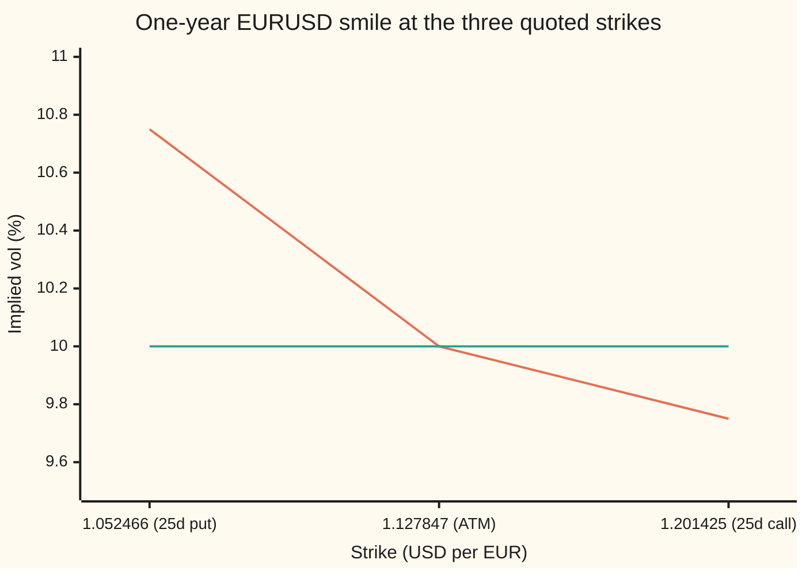
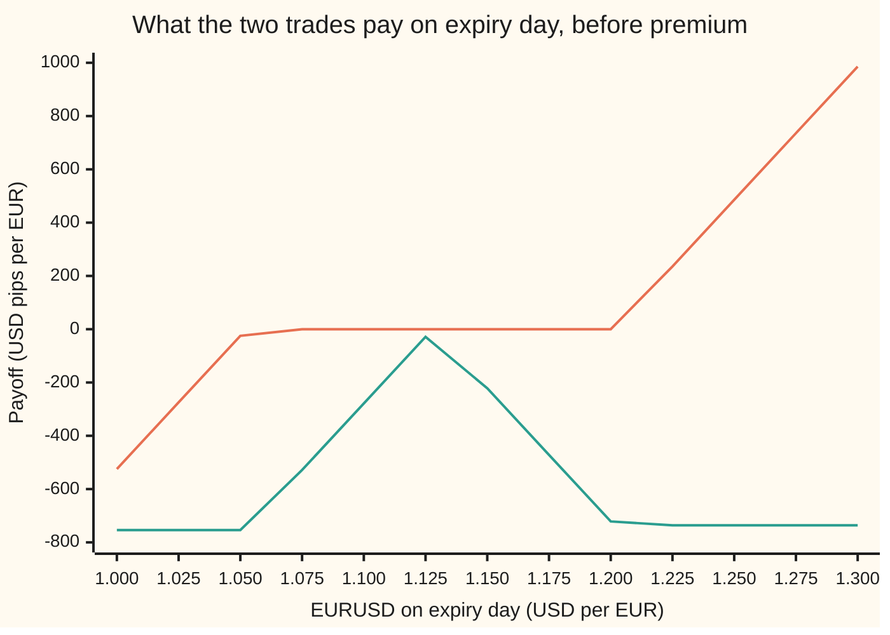

# Risk reversal and butterfly: quoting a smile as its tilt and its curvature, and turning the quotes back into three vols

[Syllabus](../../../SYLLABUS.md) → [Financial mathematics](../README.md) → [The FX smile - risk reversals, butterflies and vanna-volga](../README.md#s22) → Risk reversal and butterfly

---

## General Overview

A broker's screen for one-year euro-dollar options (EURUSD, dollars per euro, spot 1.1000) shows three numbers and no prices: **ATM 10.00, 25-delta risk reversal −1.00, 25-delta butterfly +0.25**. All three are in vol points: one vol point is one percentage point of implied volatility. Nothing on the screen names a strike, and nothing is in dollars.

A dealer asked to sell a euro put struck below the market needs a volatility for it, then a price. The screen gives neither directly. It gives the market's **smile** (the pattern of implied vols across strikes, from [The volatility smile and skew](../12-The%20smile%20and%20the%20surface/01-volatility-smile-and-skew.md)) in a compressed form.

Picture a plank resting on three posts. Three numbers pin it down: how high it sits in the middle, how much it tips from left to right, and how much it sags or bows between the ends. From here on the real names take over. The height is the **at-the-money vol** (ATM), the vol of the option struck in the middle. The tip is the **risk reversal**: the vol of a euro call minus the vol of a euro put, at matched distances from the middle. The bow is the **butterfly**: how far the average of those two wing vols sits above the middle one.

"Matched distance" is measured in delta, the number of euros a dealer must hold to hedge one euro of option. A **25-delta** call is the call whose hedge is 0.25 euros per euro; a 25-delta put needs a hedge of −0.25. Unpacking the screen gives three vols: **10.75 for the 25-delta put, 10.00 at the money, 9.75 for the 25-delta call**. Euro puts are dearer than euro calls at the same delta. The market pays more for protection against a falling euro than against a rising one.

**Three quotes are three vols in other coordinates: level, tilt and bow; add and subtract to get the vols back, then price each leg at its own vol.**

**What kind of fact this is:** a convention: the market chose to quote this way, and the recovery of the three vols is algebra proved on this card. The prices of the two trades then follow from the Garman-Kohlhagen model (Black-Scholes for a currency, with the euro rate in the dividend's place), which is an assumption about how the rate moves, not a law.

### The picture: the smile the three quotes describe



The sloping line is the smile: 10.75 percent at the 25-delta put strike, 10.00 at the money, 9.75 at the 25-delta call strike. The flat line is the ATM vol carried across, which is what one Garman-Kohlhagen vol would say. The drop from left to right is the tilt, the risk reversal. The average of the two ends sits a quarter point above the middle: that is the bow, the butterfly.

---

## The formula

$$\text{RR} = \sigma_{25c} - \sigma_{25p}, \qquad \text{BF} = \tfrac12\big(\sigma_{25c} + \sigma_{25p}\big) - \sigma_{\text{ATM}}$$

and, solved the other way,

$$\sigma_{25c} = \sigma_{\text{ATM}} + \text{BF} + \tfrac12\text{RR}, \qquad \sigma_{25p} = \sigma_{\text{ATM}} + \text{BF} - \tfrac12\text{RR}$$

**Read it aloud: the risk reversal is the call wing's vol minus the put wing's vol; the butterfly is how far the wings' average sits above the middle; so each wing is the middle, plus the bow, plus or minus half the tilt.**

The two trades that carry the same names, each leg priced by Garman-Kohlhagen at its own vol:

$$\text{RR trade} = C(K_{25c};\sigma_{25c}) - P(K_{25p};\sigma_{25p})$$

$$\text{BF trade} = \big[C(K_{25c};\sigma_{25c}) + P(K_{25p};\sigma_{25p})\big] - \big[C(K_{\text{ATM}};\sigma_{\text{ATM}}) + P(K_{\text{ATM}};\sigma_{\text{ATM}})\big]$$

The risk reversal trade buys the 25-delta call and sells the 25-delta put. The butterfly trade buys the **strangle** (the two wing options together) and sells the **straddle** (a call and a put at the ATM strike).

| Symbol | Plain meaning | In our example | Push it up and… |
| --- | --- | --- | --- |
| $\sigma_{\text{ATM}}$ | the at-the-money vol: the smile's height in the middle | 10.00% | every vol and every option price rises |
| $\sigma_{25c}$, $\sigma_{25p}$ | the implied vols of the 25-delta euro call and euro put | 9.75%, 10.75% | that leg's price rises |
| $\text{RR}$ | the risk reversal: call vol minus put vol, the smile's tilt | −1.00 | the call wing rises, the put wing falls, the RR trade gets dearer |
| $\text{BF}$ | the butterfly: wing average minus ATM, the smile's bow | +0.25 | both wings rise together, the strangle gets dearer |
| $K_{25c}$, $K_{25p}$, $K_{\text{ATM}}$ | the three strikes, in dollars per euro | 1.201425, 1.052466, 1.127847 | — |
| $C(K;\sigma)$, $P(K;\sigma)$ | a euro call or euro put at strike $K$, priced by Garman-Kohlhagen at vol $\sigma$, in dollars per euro | 0.015390 (call), 0.018823 (put) | — |
| $S$, $F$ | spot EURUSD today; the one-year forward $S\,e^{(r_d - r_f)T}$ | 1.1000, 1.122221 | — |
| $r_d$, $r_f$ | the dollar and euro interest rates, continuously compounded | 5%, 3% | — |
| $T$ | time to expiry, in years | 1 | — |
| $N(x)$, $\varphi(x)$ | the bell-curve area to the left of $x$, and the bell curve's height at $x$ | — | — |
| $d_1$ | $\ln(F/K)/(\sigma\sqrt{T}) + \tfrac12\sigma\sqrt{T}$: how far the forward sits above the strike, in units of $\sigma\sqrt{T}$, plus a half-unit shift | — | — |
| $\mathcal{V}$ | vega: dollars per euro gained per one vol point, $S\,e^{-r_f T}\varphi(d_1)\sqrt{T}/100$ | 0.003446 at each wing | — |

The strikes come from the deltas, each at its own vol ([Strike from delta](../21-FX%20vanilla%20options%20-%20Garman-Kohlhagen%20and%20the%20desk%20conventions/06-fx-strike-from-delta.md) derives them):

$$K_{25} = F\exp\!\big(-d_1\,\sigma\sqrt{T} + \tfrac12\sigma^2 T\big), \qquad K_{\text{ATM}} = F\,e^{\sigma_{\text{ATM}}^2 T/2}$$

In words: a 25-delta strike is the forward moved by the $d_1$ that makes the hedge 0.25, in steps of $\sigma\sqrt{T}$; the ATM strike is the one where a call and a put together need no hedge at all. For the call, $d_1$ is the point where $e^{-r_f T}N(d_1) = 0.25$; for the put, it is the same number with its sign flipped.

### When it holds

The two quote definitions are conventions: they hold because the market uses them. What can break is how they are read and priced.

- **The right delta.** For EURUSD up to one year, the 25-delta strikes are set on spot delta with the premium not adjusted. A different delta convention lands the same "25" on strikes tens of pips away (a pip is 0.0001 dollars per euro), and every price moves with it.
- **The butterfly as a smile strangle.** This card reads BF as the bow of the smile itself. Brokers quote a *market* strangle, priced at one vol, $\sigma_{\text{ATM}} + \text{BF}$, for both wings; its smile bow differs by a fraction of a vol point, as [The broker butterfly](02-market-strangle-and-smile-strangle.md) shows.
- **Positive wings.** Both recovered vols must be positive: $\sigma_{\text{ATM}} + \text{BF} > \tfrac12|\text{RR}|$. A quote that breaks this has no smile behind it.
- **Three points, not a curve.** The quotes fix the smile at three strikes only. A vol for any other strike needs an interpolation rule, and each rule gives a different answer.

Conventions verified 27 Sep 2026, as set out in Reiswich and Wystup (2012): risk reversal quoted as call vol minus put vol, the delta-neutral straddle as at the money, spot delta without premium adjustment for EURUSD up to one year.

---

## Why it works

### Step 0: three numbers in, three numbers out

Three vols describe three points of a smile. Any three independent combinations of them describe the same three points. The market picked combinations that each answer one question. Is the smile high or low? Does it tip? Does it bow? A trader who thinks "the put wing will get dearer" moves one number, the risk reversal, and nothing else.

Inverting the quotes needs three facts before it solves. **Existence:** any three numbers give three vols, because the inverse below is written out. **Uniqueness:** there is only one answer, because the change of coordinates can be undone. **Boundary:** the answer is a usable smile only if both wing vols come out positive.

### Step 1: add and subtract to get the wings back

Double the butterfly and add twice the ATM vol:

$$2\,\text{BF} + 2\,\sigma_{\text{ATM}} = \sigma_{25c} + \sigma_{25p}.$$

That is the sum of the wings. The risk reversal is their difference. A sum and a difference pin down two numbers: half the sum plus half the difference is the call vol, half the sum minus half the difference is the put vol. That gives the two formulas above, and on the house quotes a call vol of 9.75 and a put vol of 10.75.

<details>
<summary>Detailed proof: the map from vols to quotes can always be undone</summary>

Write the three vols as a column (put, ATM, call) and the three quotes as a column (ATM, RR, BF). The quotes are the vols multiplied by one fixed matrix:
$$\begin{pmatrix}\sigma_{\text{ATM}}\\ \text{RR}\\ \text{BF}\end{pmatrix} = \begin{pmatrix}0 & 1 & 0\\ -1 & 0 & 1\\ \tfrac12 & -1 & \tfrac12\end{pmatrix}\begin{pmatrix}\sigma_{25p}\\ \sigma_{\text{ATM}}\\ \sigma_{25c}\end{pmatrix}.$$
Expanding along the first row, its determinant (the factor by which the map scales volume) is $-1 \times \big((-1)\cdot\tfrac12 - 1\cdot\tfrac12\big) = 1$. A determinant that is not zero means the matrix has an inverse, so every quote triple comes from exactly one vol triple: existence and uniqueness at once. The inverse is the pair of formulas in Step 1 together with $\sigma_{\text{ATM}} = \sigma_{\text{ATM}}$. Nothing in the algebra forces the answers to be positive, which is why the boundary condition has to be checked separately.

</details>

### Step 2: vols first, strikes second

A delta depends on the vol. The 25-delta put at 10.75 percent sits at a different strike from the 25-delta put at 10.00 percent. So the order is fixed: recover the wing vols, then find each wing's strike at its own vol. The check finds the strikes two ways, by the closed form and by searching strike by strike until the delta hits 0.25, and both land on 1.052466 for the put and 1.201425 for the call. The ATM strike, 1.127847, is where a call and a put at 10 percent have deltas that cancel; the search finds that too.

### Step 3: the risk reversal as a trade

Buy the 25-delta call, sell the 25-delta put, one euro of each. At expiry the position pays the call's payoff minus the put's: it loses below 1.052466, pays nothing between the strikes, and gains above 1.201425. Before expiry it has three properties worth knowing.

**Its delta is 0.50.** The call brings +0.25. Selling the put removes −0.25, which is +0.25. A risk reversal is half a euro long, plus a view on the smile. The check confirms it by nudging spot and repricing: 0.500000.

**Its vega is zero to first order.** Vega at a strike depends on the vol only through $d_1$, and a 25-delta strike is defined by its $d_1$. The call's $d_1$ and the put's $d_1$ are the same number with opposite signs, and the bell curve is symmetric, so the two vegas are equal: 0.003446 dollars per euro per vol point at each wing. Long one, short the other: the vegas cancel. The trade does not care if all vols rise together. It cares if the tilt changes.

**At its strikes, its price is almost all tilt.** Price each leg at its own vol and each moves from its ATM-vol price by about vega times the gap between its vol and the ATM vol. Subtract:

$$\text{RR price} - \text{RR price at one vol} \approx \mathcal{V}\,(\sigma_{25c} - \sigma_{\text{ATM}}) - \mathcal{V}\,(\sigma_{25p} - \sigma_{\text{ATM}}) = \mathcal{V}\times\text{RR}.$$

With one vol for both legs, the house strikes give a risk reversal worth −0.000015 dollars per euro: almost nothing. With the smile, it is worth −0.003433. The exact gap is −0.003417; vega times RR gives 0.003446 × (−1.00) = −0.003446, within 1 percent.

### Step 4: the butterfly as a trade

Buy the strangle, sell the straddle. The straddle's delta is zero by the choice of its strike. The strangle's is 0.25 − 0.25 = 0. So the butterfly trade has no delta. The same vega argument, with a plus sign where the risk reversal had a minus, gives the wings' premium over one flat vol:

$$\text{strangle} - \text{strangle at one vol} \approx \mathcal{V}\,(\sigma_{25c} - \sigma_{\text{ATM}}) + \mathcal{V}\,(\sigma_{25p} - \sigma_{\text{ATM}}) = 2\,\mathcal{V}\times\text{BF}.$$

Exact: 0.001684 dollars per euro. Estimate: 0.001723. The tilt cancels; only the bow is left.

One euro of strangle against one euro of straddle is not vega-flat: the straddle's vega, 0.008517, exceeds the two wings' 0.003446 each, so the unit trade is short 0.001625 of vega. Desks scale the strangle up until vega cancels; what is left then is exposure to vol moving vol, which [Vanna and volga](03-vanna-and-volga-on-the-smile.md) measures.

### Step 5: reading the signs

A negative risk reversal says the put wing is dearer than the call wing. Buyers pay more to be protected against the euro falling than against it rising. That is the market's fear, priced: a sharp fall is expected to come with rising vol. A positive risk reversal says the reverse: the feared move is up. A positive butterfly says both wings are dearer than the middle: large moves either way are priced as more likely than one flat vol allows. Butterflies are nearly always positive; the sign of the risk reversal is the one that flips with the news.

### The other door

A dealer can start from option prices instead: price the three pillar options on a broker's run, back out each one's implied vol with a root finder, and form RR and BF from the vols. The check does exactly that from the brute-force prices and gets −1.000000 and 0.250000 back. Backing out the vols is [Implied vol for a currency option](../21-FX%20vanilla%20options%20-%20Garman-Kohlhagen%20and%20the%20desk%20conventions/07-fx-implied-volatility.md).

---

## Worked numbers, by hand

House market: EURUSD 1.1000, dollar rate 5 percent, euro rate 3 percent, one year; quotes ATM 10.00, RR −1.00, BF +0.25. Prices in dollars per euro; a pip is 0.0001 of that.

| Step | Arithmetic | Value |
| --- | --- | --- |
| forward $F$ | $1.10\,e^{0.05 - 0.03}$ | 1.122221 |
| call vol | $10.00 + 0.25 - 0.50$ | 9.75% |
| put vol | $10.00 + 0.25 + 0.50$ | 10.75% |
| put strike, 25 delta at 10.75% | from [Strike from delta](../21-FX%20vanilla%20options%20-%20Garman-Kohlhagen%20and%20the%20desk%20conventions/06-fx-strike-from-delta.md) | 1.052466 |
| ATM strike | $1.122221 \times e^{0.01/2}$ | 1.127847 |
| call strike, 25 delta at 9.75% | same card | 1.201425 |
| 25-delta call at 9.75% | Garman-Kohlhagen | 0.015390 |
| 25-delta put at 10.75% | Garman-Kohlhagen | 0.018823 |
| **RR trade** | $0.015390 - 0.018823$ | **−0.003433** |
| ATM straddle at 10% | $0.040054 + 0.045404$ | 0.085458 |
| strangle at own vols | $0.015390 + 0.018823$ | 0.034213 |
| **BF trade** | $0.034213 - 0.085458$ | **−0.051245** |
| on EUR 10 million | RR, BF | USD −34,325.07, −512,448.85 |

The risk reversal costs less than nothing: its buyer receives 34.33 pips, because the put sold is worth more than the call bought. At these same strikes, one flat vol nets the two legs to −0.15 pips, so the tilt carries almost all of the premium. The butterfly trade receives 512.45 pips because a straddle is worth far more than a strangle; the smile makes that strangle 16.84 pips dearer than one flat vol would.

### What breaks if you drop a piece

| Mistake | Comes out at | What went wrong |
| --- | --- | --- |
| Read RR as put minus call | RR trade −0.96 pips, not −34.33 | The vols land on the wrong wings: the call gets 10.75 and the put 9.75, and the fear points the wrong way |
| Drop the butterfly | strangle 333.75 pips, not 342.13 | Both wings lose the quarter-point bow: the tails are priced too cheap |
| Put the whole RR on each wing | RR trade −51.14 pips, not −34.33 | The wings end up twice as far apart as the quote says: the tilt is doubled |
| Price every leg at the ATM vol | RR −0.15 pips; BF −529.29 pips, not −512.45 | The smile is thrown away; the quotes told the market's view and it was ignored |

Every number in that table is printed by the checks below.

---

## Code, from first principles, and it actually runs

The script unpacks the three quotes into three vols, finds the three strikes, and prices both trades. It takes **three independent roads**: the Garman-Kohlhagen formula for each leg; a brute-force average of each payoff over the bell curve, by Simpson's rule, which uses no $d_1$ at all; and a round trip that backs each leg's vol out of the brute-force price by bisection and rebuilds RR and BF from them. Strikes are found twice, by the closed form and by searching on delta. The bell-curve area is itself Simpson's rule written out, so nothing imported knows an answer. It also prints the Greeks, the vega estimates of Steps 3 and 4, every "what breaks" number and the chart points.

### Python

```python
# Risk reversal and butterfly -- the check behind the card.  Standard library only.
# Nothing imported knows the answer: the bell-curve area N(x) is Simpson's rule
# written out, the root finder is bisection, the integral road is Simpson again.
from math import log, sqrt, exp, pi

S, RD, RF, T = 1.10, 0.05, 0.03, 1.0            # EURUSD spot, USD rate, EUR rate, years
ATM, RR, BF = 0.10, -0.01, 0.0025               # the three broker quotes
F, DD, DF = S * exp((RD - RF) * T), exp(-RD * T), exp(-RF * T)

def phi(x): return exp(-0.5 * x * x) / sqrt(2.0 * pi)            # bell-curve height
def simpson(f, a, b, n):
    h = (b - a) / n
    s = f(a) + f(b)
    for i in range(1, n): s += (4.0 if i % 2 else 2.0) * f(a + i * h)
    return s * h / 3.0
def N(x):                                                         # bell-curve area left of x
    if x < -12.0: return 0.0
    if x > 12.0: return 1.0
    return 0.5 + simpson(phi, 0.0, x, 2000)
def bisect(g, lo, hi):                                            # g(lo), g(hi) of opposite sign
    glo = g(lo)
    for _ in range(200):
        mid = 0.5 * (lo + hi)
        if (g(mid) > 0.0) == (glo > 0.0): lo, glo = mid, g(mid)
        else: hi = mid
    return 0.5 * (lo + hi)

def d1(s, K, sig): return (log(s / K) + (RD - RF + 0.5 * sig * sig) * T) / (sig * sqrt(T))
def gk(K, sig, w, s=S):                                           # w = +1 EUR call, -1 EUR put
    a = d1(s, K, sig)
    return w * (s * DF * N(w * a) - K * DD * N(w * (a - sig * sqrt(T))))
def delta(K, sig, w): return w * DF * N(w * d1(S, K, sig))        # spot delta, premium not adjusted
def vega(K, sig): return S * DF * phi(d1(S, K, sig)) * sqrt(T)
def by_integral(K, sig, w):                                       # road 2: average the payoff
    def f(z):
        ST = S * exp((RD - RF - 0.5 * sig * sig) * T + sig * sqrt(T) * z)
        return max(w * (ST - K), 0.0) * phi(z)
    return DD * simpson(f, -10.0, 10.0, 40000)

def wing_vols(atm, rr, bf): return atm + bf + 0.5 * rr, atm + bf - 0.5 * rr   # call, put
def strike_closed(sig, w):                                        # K from |delta| = 0.25
    a = w * bisect(lambda x: N(x) - 0.25 / DF, -10.0, 10.0)
    return F * exp(-a * sig * sqrt(T) + 0.5 * sig * sig * T)
def trades(atm, rr, bf):                                          # RR and BF prices, per EUR
    sc, sp = wing_vols(atm, rr, bf)
    kc, kp, ka = strike_closed(sc, 1), strike_closed(sp, -1), F * exp(0.5 * atm * atm * T)
    c, p = gk(kc, sc, 1), gk(kp, sp, -1)
    return c - p, (c + p) - (gk(ka, atm, 1) + gk(ka, atm, -1)), c + p

sc, sp = wing_vols(ATM, RR, BF)
Kc, Kp, Ka = strike_closed(sc, 1), strike_closed(sp, -1), F * exp(0.5 * ATM * ATM * T)
Kc2 = bisect(lambda k: delta(k, sc, 1) - 0.25, 0.5, 2.0)          # road 2 for strikes
Kp2 = bisect(lambda k: delta(k, sp, -1) + 0.25, 0.5, 2.0)
Ka2 = bisect(lambda k: delta(k, ATM, 1) + delta(k, ATM, -1), 0.5, 2.0)
c25, p25, ca, pa = gk(Kc, sc, 1), gk(Kp, sp, -1), gk(Ka, ATM, 1), gk(Ka, ATM, -1)
rr_px, bf_px = c25 - p25, (c25 + p25) - (ca + pa)
ic, ip, ica, ipa = by_integral(Kc, sc, 1), by_integral(Kp, sp, -1), by_integral(Ka, ATM, 1), by_integral(Ka, ATM, -1)
rr_int, bf_int = ic - ip, (ic + ip) - (ica + ipa)
# road 3: back out each leg's vol from the integral prices, then rebuild the quotes
iv = lambda K, px, w: bisect(lambda v: gk(K, v, w) - px, 0.001, 1.0)
vc, vp, va = iv(Kc, ic, 1), iv(Kp, ip, -1), iv(Ka, ica, 1)
# what the tilt costs: same strikes, everything at the ATM vol
rr_flat = gk(Kc, ATM, 1) - gk(Kp, ATM, -1)
strangle_flat = gk(Kc, ATM, 1) + gk(Kp, ATM, -1)
rr_vega_est = vega(Kc, sc) * (sc - ATM) - vega(Kp, sp) * (sp - ATM)     # first order: vega x RR
st_vega_est = vega(Kc, sc) * (sc - ATM) + vega(Kp, sp) * (sp - ATM)     # first order: 2 vega x BF
h = 1e-4
rr_delta_bump = ((gk(Kc, sc, 1, S + h) - gk(Kp, sp, -1, S + h)) - (gk(Kc, sc, 1, S - h) - gk(Kp, sp, -1, S - h))) / (2 * h)
# what breaks
flip = trades(ATM, -RR, BF)                 # read RR as put minus call
nobf = trades(ATM, RR, 0.0)                 # dropped the butterfly
full = trades(ATM, 2 * RR, BF)              # put the whole RR on each wing
tries = [("try: RR -0.50", trades(ATM, 0.5 * RR, BF)[0]), ("try: BF +0.50", trades(ATM, RR, 2 * BF)[1]),
         ("try: ATM 15.00, strangle", trades(0.15, RR, BF)[2])]

rows = [("forward F", F), ("vol 25d call  %", 100 * sc), ("vol ATM       %", 100 * ATM), ("vol 25d put   %", 100 * sp),
        ("K 25d put, closed form", Kp), ("K 25d put, delta bisection", Kp2), ("K ATM, F e^(s^2 T/2)", Ka),
        ("K ATM, zero-delta straddle", Ka2), ("K 25d call, closed form", Kc), ("K 25d call, delta bisection", Kc2),
        ("25d call at 9.75", c25), ("25d put at 10.75", p25), ("ATM call at 10.00", ca), ("ATM put at 10.00", pa),
        ("RR trade, formula", rr_px), ("RR trade, integral", rr_int), ("BF trade, formula", bf_px), ("BF trade, integral", bf_int),
        ("RR trade on EUR 10m, USD", 1e7 * rr_px), ("BF trade on EUR 10m, USD", 1e7 * bf_px),
        ("back-out vol call  %", 100 * vc), ("back-out vol ATM   %", 100 * va), ("back-out vol put   %", 100 * vp),
        ("back-out RR  %", 100 * (vc - vp)), ("back-out BF  %", 100 * (0.5 * (vc + vp) - va)),
        ("RR trade, all at 10%", rr_flat), ("skew cost, exact", rr_px - rr_flat), ("skew cost, vega estimate", rr_vega_est),
        ("strangle at own vols", c25 + p25), ("strangle, all at 10%", strangle_flat), ("straddle at 10%", ca + pa),
        ("wing premium, exact", c25 + p25 - strangle_flat), ("wing premium, vega estimate", st_vega_est),
        ("delta: 25d call", delta(Kc, sc, 1)), ("delta: 25d put", delta(Kp, sp, -1)), ("delta: ATM straddle", delta(Ka, ATM, 1) + delta(Ka, ATM, -1)),
        ("delta: RR trade", delta(Kc, sc, 1) - delta(Kp, sp, -1)), ("delta: RR trade, bump", rr_delta_bump),
        ("vega/pt: 25d call", vega(Kc, sc) / 100), ("vega/pt: 25d put", vega(Kp, sp) / 100), ("vega/pt: ATM straddle", 2 * vega(Ka, ATM) / 100),
        ("vega/pt: BF trade", (vega(Kc, sc) + vega(Kp, sp) - 2 * vega(Ka, ATM)) / 100),
        ("wrong: RR sign flipped, RR", flip[0]), ("wrong: BF dropped, strangle", nobf[2]), ("wrong: full RR each wing, RR", full[0]),
        ("wrong: one vol, BF", strangle_flat - (ca + pa))] + tries
for name, v in rows: print(f"{name:<30} {v:>14.6f}")
xs = [1.0 + 0.025 * i for i in range(13)]
pay_rr = [max(x - Kc, 0.0) - max(Kp - x, 0.0) for x in xs]
pay_bf = [max(x - Kc, 0.0) + max(Kp - x, 0.0) - abs(x - Ka) for x in xs]
print("chart, EURUSD at expiry " + " ".join(f"{x:.3f}" for x in xs))
print("chart, RR payoff, pips  " + " ".join(f"{1e4 * v:.2f}" for v in pay_rr))
print("chart, BF payoff, pips  " + " ".join(f"{1e4 * v:.2f}" for v in pay_bf))

assert abs(Kp - 1.052466) < 5e-7, "25d put strike vs the strike-from-delta card"
assert abs(Kc - 1.201425) < 5e-7, "25d call strike vs the strike-from-delta card"
assert abs(Kc - Kc2) < 1e-9 and abs(Kp - Kp2) < 1e-9 and abs(Ka - Ka2) < 1e-9, "closed-form strikes vs bisection on delta"
assert abs(rr_px - rr_int) < 1e-8 and abs(bf_px - bf_int) < 1e-8, "formula vs brute-force average"
assert abs((vc - vp) - RR) < 1e-8 and abs(0.5 * (vc + vp) - va - BF) < 1e-8, "quotes rebuilt from backed-out vols"
assert abs(rr_delta_bump - 0.50) < 1e-6, "a 25-delta RR carries half a euro of delta"
assert abs(rr_vega_est / (rr_px - rr_flat) - 1.0) < 0.02, "first-order vega estimate of the skew cost"
assert abs(st_vega_est / (c25 + p25 - strangle_flat) - 1.0) < 0.05, "first-order vega estimate of the wing premium"
print("ALL CHECKS PASS")
```

**Ran 2026-09-27 on macOS, Python 3.14.6, standard library only. All checks passed. Output, pasted from the run:**

```
forward F                            1.122221
vol 25d call  %                      9.750000
vol ATM       %                     10.000000
vol 25d put   %                     10.750000
K 25d put, closed form               1.052466
K 25d put, delta bisection           1.052466
K ATM, F e^(s^2 T/2)                 1.127847
K ATM, zero-delta straddle           1.127847
K 25d call, closed form              1.201425
K 25d call, delta bisection          1.201425
25d call at 9.75                     0.015390
25d put at 10.75                     0.018823
ATM call at 10.00                    0.040054
ATM put at 10.00                     0.045404
RR trade, formula                   -0.003433
RR trade, integral                  -0.003433
BF trade, formula                   -0.051245
BF trade, integral                  -0.051245
RR trade on EUR 10m, USD        -34325.068924
BF trade on EUR 10m, USD       -512448.850842
back-out vol call  %                 9.750000
back-out vol ATM   %                10.000000
back-out vol put   %                10.750000
back-out RR  %                      -1.000000
back-out BF  %                       0.250000
RR trade, all at 10%                -0.000015
skew cost, exact                    -0.003417
skew cost, vega estimate            -0.003446
strangle at own vols                 0.034213
strangle, all at 10%                 0.032529
straddle at 10%                      0.085458
wing premium, exact                  0.001684
wing premium, vega estimate          0.001723
delta: 25d call                      0.250000
delta: 25d put                      -0.250000
delta: ATM straddle                  0.000000
delta: RR trade                      0.500000
delta: RR trade, bump                0.500000
vega/pt: 25d call                    0.003446
vega/pt: 25d put                     0.003446
vega/pt: ATM straddle                0.008517
vega/pt: BF trade                   -0.001625
wrong: RR sign flipped, RR          -0.000096
wrong: BF dropped, strangle          0.033375
wrong: full RR each wing, RR        -0.005114
wrong: one vol, BF                  -0.052929
try: RR -0.50                       -0.002595
try: BF +0.50                       -0.050406
try: ATM 15.00, strangle             0.051048
chart, EURUSD at expiry 1.000 1.025 1.050 1.075 1.100 1.125 1.150 1.175 1.200 1.225 1.250 1.275 1.300
chart, RR payoff, pips  -524.66 -274.66 -24.66 0.00 0.00 0.00 0.00 0.00 0.00 235.75 485.75 735.75 985.75
chart, BF payoff, pips  -753.81 -753.81 -753.81 -528.47 -278.47 -28.47 -221.53 -471.53 -721.53 -735.79 -735.79 -735.79 -735.79
ALL CHECKS PASS
```

The formula and the brute-force average agree to six decimals on both trades. The two strike searches land on the closed form and on the strike-from-delta card's numbers. The vols backed out of the brute-force prices rebuild the quotes exactly.

### Rust

Same algorithm for the bell-curve area and the root finder, written again in Rust, no crates.

```rust
// Risk reversal and butterfly -- the same check as risk_reversal_and_butterfly_check.py, in Rust.
// Standard library only, no crates.  N(x) is Simpson's rule written out, roots come from bisection.
// Compile: rustc --edition 2021 -O risk_reversal_and_butterfly_check.rs -o /tmp/rr_bf_check
use std::f64::consts::PI;

const S: f64 = 1.10; const RD: f64 = 0.05; const RF: f64 = 0.03; const T: f64 = 1.0;
const ATM: f64 = 0.10; const RR: f64 = -0.01; const BF: f64 = 0.0025;
fn fwd() -> f64 { S * ((RD - RF) * T).exp() }
fn dd() -> f64 { (-RD * T).exp() }
fn df() -> f64 { (-RF * T).exp() }

fn phi(x: f64) -> f64 { (-0.5 * x * x).exp() / (2.0 * PI).sqrt() }     // bell-curve height
fn simpson<G: Fn(f64) -> f64>(f: G, a: f64, b: f64, n: usize) -> f64 {
    let h = (b - a) / n as f64;
    let mut s = f(a) + f(b);
    for i in 1..n { s += if i % 2 == 1 { 4.0 } else { 2.0 } * f(a + i as f64 * h); }
    s * h / 3.0
}
fn n_cdf(x: f64) -> f64 {                                                // bell-curve area left of x
    if x < -12.0 { return 0.0; }
    if x > 12.0 { return 1.0; }
    0.5 + simpson(phi, 0.0, x, 2000)
}
fn bisect<G: Fn(f64) -> f64>(g: G, mut lo: f64, mut hi: f64) -> f64 {   // g(lo), g(hi) of opposite sign
    let mut glo = g(lo);
    for _ in 0..200 {
        let mid = 0.5 * (lo + hi);
        let gm = g(mid);
        if (gm > 0.0) == (glo > 0.0) { lo = mid; glo = gm; } else { hi = mid; }
    }
    0.5 * (lo + hi)
}
fn d1(s: f64, k: f64, sig: f64) -> f64 { ((s / k).ln() + (RD - RF + 0.5 * sig * sig) * T) / (sig * T.sqrt()) }
fn gk_at(k: f64, sig: f64, w: f64, s: f64) -> f64 {                      // w = +1 EUR call, -1 EUR put
    let a = d1(s, k, sig);
    w * (s * df() * n_cdf(w * a) - k * dd() * n_cdf(w * (a - sig * T.sqrt())))
}
fn gk(k: f64, sig: f64, w: f64) -> f64 { gk_at(k, sig, w, S) }
fn delta(k: f64, sig: f64, w: f64) -> f64 { w * df() * n_cdf(w * d1(S, k, sig)) }
fn vega(k: f64, sig: f64) -> f64 { S * df() * phi(d1(S, k, sig)) * T.sqrt() }
fn by_integral(k: f64, sig: f64, w: f64) -> f64 {                        // road 2: average the payoff
    let f = |z: f64| {
        let st = S * ((RD - RF - 0.5 * sig * sig) * T + sig * T.sqrt() * z).exp();
        (w * (st - k)).max(0.0) * phi(z)
    };
    dd() * simpson(f, -10.0, 10.0, 40000)
}
fn wing_vols(atm: f64, rr: f64, bf: f64) -> (f64, f64) { (atm + bf + 0.5 * rr, atm + bf - 0.5 * rr) }
fn strike_closed(sig: f64, w: f64) -> f64 {                               // K from |delta| = 0.25
    let a = w * bisect(|x| n_cdf(x) - 0.25 / df(), -10.0, 10.0);
    fwd() * (-a * sig * T.sqrt() + 0.5 * sig * sig * T).exp()
}
fn trades(atm: f64, rr: f64, bf: f64) -> (f64, f64, f64) {                // RR and BF prices, per EUR
    let (sc, sp) = wing_vols(atm, rr, bf);
    let (kc, kp, ka) = (strike_closed(sc, 1.0), strike_closed(sp, -1.0), fwd() * (0.5 * atm * atm * T).exp());
    let (c, p) = (gk(kc, sc, 1.0), gk(kp, sp, -1.0));
    (c - p, (c + p) - (gk(ka, atm, 1.0) + gk(ka, atm, -1.0)), c + p)
}

fn main() {
    let f = fwd();
    let (sc, sp) = wing_vols(ATM, RR, BF);
    let (kc, kp, ka) = (strike_closed(sc, 1.0), strike_closed(sp, -1.0), f * (0.5 * ATM * ATM * T).exp());
    let kc2 = bisect(|k| delta(k, sc, 1.0) - 0.25, 0.5, 2.0);           // road 2 for strikes
    let kp2 = bisect(|k| delta(k, sp, -1.0) + 0.25, 0.5, 2.0);
    let ka2 = bisect(|k| delta(k, ATM, 1.0) + delta(k, ATM, -1.0), 0.5, 2.0);
    let (c25, p25, ca, pa) = (gk(kc, sc, 1.0), gk(kp, sp, -1.0), gk(ka, ATM, 1.0), gk(ka, ATM, -1.0));
    let (rr_px, bf_px) = (c25 - p25, (c25 + p25) - (ca + pa));
    let (ic, ip) = (by_integral(kc, sc, 1.0), by_integral(kp, sp, -1.0));
    let (ica, ipa) = (by_integral(ka, ATM, 1.0), by_integral(ka, ATM, -1.0));
    let (rr_int, bf_int) = (ic - ip, (ic + ip) - (ica + ipa));
    // road 3: back out each leg's vol from the integral prices, then rebuild the quotes
    let iv = |k: f64, px: f64, w: f64| bisect(|v| gk(k, v, w) - px, 0.001, 1.0);
    let (vc, vp, va) = (iv(kc, ic, 1.0), iv(kp, ip, -1.0), iv(ka, ica, 1.0));
    // what the tilt costs: same strikes, everything at the ATM vol
    let rr_flat = gk(kc, ATM, 1.0) - gk(kp, ATM, -1.0);
    let strangle_flat = gk(kc, ATM, 1.0) + gk(kp, ATM, -1.0);
    let rr_vega_est = vega(kc, sc) * (sc - ATM) - vega(kp, sp) * (sp - ATM);   // first order: vega x RR
    let st_vega_est = vega(kc, sc) * (sc - ATM) + vega(kp, sp) * (sp - ATM);   // first order: 2 vega x BF
    let h = 1e-4;
    let rr_delta_bump = ((gk_at(kc, sc, 1.0, S + h) - gk_at(kp, sp, -1.0, S + h))
        - (gk_at(kc, sc, 1.0, S - h) - gk_at(kp, sp, -1.0, S - h))) / (2.0 * h);
    // what breaks
    let flip = trades(ATM, -RR, BF);
    let nobf = trades(ATM, RR, 0.0);
    let full = trades(ATM, 2.0 * RR, BF);

    let rows: Vec<(&str, f64)> = vec![
        ("forward F", f), ("vol 25d call  %", 100.0 * sc), ("vol ATM       %", 100.0 * ATM), ("vol 25d put   %", 100.0 * sp),
        ("K 25d put, closed form", kp), ("K 25d put, delta bisection", kp2), ("K ATM, F e^(s^2 T/2)", ka),
        ("K ATM, zero-delta straddle", ka2), ("K 25d call, closed form", kc), ("K 25d call, delta bisection", kc2),
        ("25d call at 9.75", c25), ("25d put at 10.75", p25), ("ATM call at 10.00", ca), ("ATM put at 10.00", pa),
        ("RR trade, formula", rr_px), ("RR trade, integral", rr_int), ("BF trade, formula", bf_px), ("BF trade, integral", bf_int),
        ("RR trade on EUR 10m, USD", 1e7 * rr_px), ("BF trade on EUR 10m, USD", 1e7 * bf_px),
        ("back-out vol call  %", 100.0 * vc), ("back-out vol ATM   %", 100.0 * va), ("back-out vol put   %", 100.0 * vp),
        ("back-out RR  %", 100.0 * (vc - vp)), ("back-out BF  %", 100.0 * (0.5 * (vc + vp) - va)),
        ("RR trade, all at 10%", rr_flat), ("skew cost, exact", rr_px - rr_flat), ("skew cost, vega estimate", rr_vega_est),
        ("strangle at own vols", c25 + p25), ("strangle, all at 10%", strangle_flat), ("straddle at 10%", ca + pa),
        ("wing premium, exact", c25 + p25 - strangle_flat), ("wing premium, vega estimate", st_vega_est),
        ("delta: 25d call", delta(kc, sc, 1.0)), ("delta: 25d put", delta(kp, sp, -1.0)),
        ("delta: ATM straddle", delta(ka, ATM, 1.0) + delta(ka, ATM, -1.0)),
        ("delta: RR trade", delta(kc, sc, 1.0) - delta(kp, sp, -1.0)), ("delta: RR trade, bump", rr_delta_bump),
        ("vega/pt: 25d call", vega(kc, sc) / 100.0), ("vega/pt: 25d put", vega(kp, sp) / 100.0),
        ("vega/pt: ATM straddle", 2.0 * vega(ka, ATM) / 100.0),
        ("vega/pt: BF trade", (vega(kc, sc) + vega(kp, sp) - 2.0 * vega(ka, ATM)) / 100.0),
        ("wrong: RR sign flipped, RR", flip.0), ("wrong: BF dropped, strangle", nobf.2), ("wrong: full RR each wing, RR", full.0),
        ("wrong: one vol, BF", strangle_flat - (ca + pa)),
        ("try: RR -0.50", trades(ATM, 0.5 * RR, BF).0), ("try: BF +0.50", trades(ATM, RR, 2.0 * BF).1),
        ("try: ATM 15.00, strangle", trades(0.15, RR, BF).2),
    ];
    for (name, v) in &rows { println!("{:<30} {:>14.6}", name, v); }
    let xs: Vec<f64> = (0..13).map(|i| 1.0 + 0.025 * i as f64).collect();
    let pay_rr: Vec<f64> = xs.iter().map(|x| (x - kc).max(0.0) - (kp - x).max(0.0)).collect();
    let pay_bf: Vec<f64> = xs.iter().map(|x| (x - kc).max(0.0) + (kp - x).max(0.0) - (x - ka).abs()).collect();
    let join = |v: &Vec<f64>, d: usize, m: f64| v.iter().map(|x| format!("{:.*}", d, m * x)).collect::<Vec<_>>().join(" ");
    println!("chart, EURUSD at expiry {}", join(&xs, 3, 1.0));
    println!("chart, RR payoff, pips  {}", join(&pay_rr, 2, 1e4));
    println!("chart, BF payoff, pips  {}", join(&pay_bf, 2, 1e4));

    assert!((kp - 1.052466).abs() < 5e-7, "25d put strike vs the strike-from-delta card");
    assert!((kc - 1.201425).abs() < 5e-7, "25d call strike vs the strike-from-delta card");
    assert!((kc - kc2).abs() < 1e-9 && (kp - kp2).abs() < 1e-9 && (ka - ka2).abs() < 1e-9, "closed-form strikes vs bisection");
    assert!((rr_px - rr_int).abs() < 1e-8 && (bf_px - bf_int).abs() < 1e-8, "formula vs brute-force average");
    assert!(((vc - vp) - RR).abs() < 1e-8 && (0.5 * (vc + vp) - va - BF).abs() < 1e-8, "quotes rebuilt from backed-out vols");
    assert!((rr_delta_bump - 0.50).abs() < 1e-6, "a 25-delta RR carries half a euro of delta");
    assert!((rr_vega_est / (rr_px - rr_flat) - 1.0).abs() < 0.02, "first-order vega estimate of the skew cost");
    assert!((st_vega_est / (c25 + p25 - strangle_flat) - 1.0).abs() < 0.05, "first-order vega estimate of the wing premium");
    println!("ALL CHECKS PASS");
}
```

**Ran 2026-09-27 on macOS, rustc 1.98.1, no crates. All checks passed. Output, pasted from the run:**

```
forward F                            1.122221
vol 25d call  %                      9.750000
vol ATM       %                     10.000000
vol 25d put   %                     10.750000
K 25d put, closed form               1.052466
K 25d put, delta bisection           1.052466
K ATM, F e^(s^2 T/2)                 1.127847
K ATM, zero-delta straddle           1.127847
K 25d call, closed form              1.201425
K 25d call, delta bisection          1.201425
25d call at 9.75                     0.015390
25d put at 10.75                     0.018823
ATM call at 10.00                    0.040054
ATM put at 10.00                     0.045404
RR trade, formula                   -0.003433
RR trade, integral                  -0.003433
BF trade, formula                   -0.051245
BF trade, integral                  -0.051245
RR trade on EUR 10m, USD        -34325.068924
BF trade on EUR 10m, USD       -512448.850842
back-out vol call  %                 9.750000
back-out vol ATM   %                10.000000
back-out vol put   %                10.750000
back-out RR  %                      -1.000000
back-out BF  %                       0.250000
RR trade, all at 10%                -0.000015
skew cost, exact                    -0.003417
skew cost, vega estimate            -0.003446
strangle at own vols                 0.034213
strangle, all at 10%                 0.032529
straddle at 10%                      0.085458
wing premium, exact                  0.001684
wing premium, vega estimate          0.001723
delta: 25d call                      0.250000
delta: 25d put                      -0.250000
delta: ATM straddle                  0.000000
delta: RR trade                      0.500000
delta: RR trade, bump                0.500000
vega/pt: 25d call                    0.003446
vega/pt: 25d put                     0.003446
vega/pt: ATM straddle                0.008517
vega/pt: BF trade                   -0.001625
wrong: RR sign flipped, RR          -0.000096
wrong: BF dropped, strangle          0.033375
wrong: full RR each wing, RR        -0.005114
wrong: one vol, BF                  -0.052929
try: RR -0.50                       -0.002595
try: BF +0.50                       -0.050406
try: ATM 15.00, strangle             0.051048
chart, EURUSD at expiry 1.000 1.025 1.050 1.075 1.100 1.125 1.150 1.175 1.200 1.225 1.250 1.275 1.300
chart, RR payoff, pips  -524.66 -274.66 -24.66 0.00 0.00 0.00 0.00 0.00 0.00 235.75 485.75 735.75 985.75
chart, BF payoff, pips  -753.81 -753.81 -753.81 -528.47 -278.47 -28.47 -221.53 -471.53 -721.53 -735.79 -735.79 -735.79 -735.79
ALL CHECKS PASS
```

The two outputs agree line for line.

### Greeks and payoffs of the two trades

| Position, one euro of notional | Delta (EUR per EUR) | Vega (USD per EUR per vol point) |
| --- | --- | --- |
| long 25-delta call at 9.75% | 0.25 | 0.003446 |
| short 25-delta put at 10.75% | +0.25 (the put's −0.25, sold) | −0.003446 |
| **RR trade** | **0.50** | **zero: the two vegas cancel** |
| ATM straddle at 10% | 0.00 | 0.008517 |
| **BF trade**, strangle minus straddle | **0.00** | **−0.001625** |



The first line is the risk reversal: a loss below the put strike 1.052466, flat between the strikes, a gain above the call strike 1.201425. It is half a forward with a hole in the middle. The second line is the butterfly trade: zero at the ATM strike 1.127847, falling to its floor at each wing strike, flat beyond. The 512.45 pips received up front pay for it. Its owner keeps most of that if EURUSD ends near the ATM strike, and pays out at most 753.81 pips if it ends in the tails.

> [!TIP]
> **Try changing**
> Guess the direction first. Then run it.
> - **Halve the fear.** Set the risk reversal to −0.50. The RR trade moves from −34.33 pips to **−25.95**. Not half: moving the vols moves the 25-delta strikes too, and equal deltas do not mean equal premiums even with no tilt.
> - **Double the bow.** Set the butterfly to +0.50. The BF trade moves from −512.45 pips to **−504.06**: the strangle gains, the straddle does not.
> - **Raise the level.** Set ATM to 15.00 with the same RR and BF. The strangle rises from 342.13 pips to **510.48**. At a fixed delta, a wing's premium grows roughly in line with the vol.

---

## The usual mistake

> [!warning]
> **Treating the risk reversal as a price.** It is a difference of two vols, not dollars. −1.00 does not mean the trade costs one percent of anything. The trade's price comes only after the vols are unpacked, the strikes found at each vol, and each leg priced: −34.33 pips here.
>
> Smaller traps:
> - **Pricing the wings at the ATM vol.** Each wing has its own vol. Price the house legs at 10 percent instead and the risk reversal comes out at −0.15 pips instead of −34.33.
> - **Getting the sign backwards.** RR is call vol minus put vol. Read it as put minus call and the trade prices at −0.96 pips: the dealer quotes the market's fear upside down.
> - **Forgetting the risk reversal has delta.** A 25-delta risk reversal is 0.50 euros long per euro. Booking it as a pure smile trade leaves half the notional unhedged against a spot move.
> - **Reading the broker's BF as the smile's bow.** The broker quote is a market strangle, priced at one vol; the smile's own bow is a different number, as [The broker butterfly](02-market-strangle-and-smile-strangle.md) shows.

---

## Where you meet it in real life

- **The broker's vol run.** For each expiry a currency pair's screen shows ATM, 25-delta and 10-delta risk reversals and butterflies. The whole smile is traded in those numbers; strikes and prices are worked out afterwards.
- **Market commentary.** "Risk reversals moved further in favour of puts" means RR fell: the market paid up for downside protection. It is read as a gauge of fear in that currency.
- **Corporate hedging.** An exporter paid in euros buys a euro put and sells a euro call to pay for it: a risk reversal from the other side, often called a collar. With a negative RR the call it sells is worth less than the put it buys, so it must sell the call closer in, giving up more upside.
- **Smile models.** The three unpacked vols and strikes are the input to vanna-volga pricing, which fills in a vol for every other strike: [Vanna-volga pricing](04-vanna-volga-pricing.md) and [The vanna-volga smile](05-vanna-volga-smile-curve.md).
- **Hedging a book.** When spot moves, the strike of "25 delta" moves with it, and so does the vol a strike is marked at: [Hedging with the smile](06-smile-adjusted-delta-and-sticky-delta.md).

> **Say it back**
> FX brokers quote a smile as three numbers: the ATM vol, the risk reversal (call vol minus put vol) and the butterfly (the wings' average above ATM). Each wing's vol is ATM plus BF plus or minus half the RR, and the map can always be undone. With the vols in hand, each 25-delta strike is found at its own vol and each leg is priced by Garman-Kohlhagen. The risk reversal trade has delta 0.50 and no vega, and costs about vega times RR more than it would at one vol; the butterfly trade's wings cost about twice vega times BF extra. A negative RR means the put wing is dearer: the market fears a fall.

---

## What this builds on

- [Strike from delta](../21-FX%20vanilla%20options%20-%20Garman-Kohlhagen%20and%20the%20desk%20conventions/06-fx-strike-from-delta.md): turns a 25-delta label and a vol into a strike, the step every wing here needs.
- [Implied vol for a currency option](../21-FX%20vanilla%20options%20-%20Garman-Kohlhagen%20and%20the%20desk%20conventions/07-fx-implied-volatility.md): turns a price into a vol, the road the check uses to rebuild the quotes.
- [The volatility smile and skew](../12-The%20smile%20and%20the%20surface/01-volatility-smile-and-skew.md): why implied vol differs by strike at all, which these quotes compress into three numbers.

## Where this goes next

- [The broker butterfly](02-market-strangle-and-smile-strangle.md): the broker's butterfly is a market strangle priced at one vol; solving for the smile bow that reprices it.
- [Vanna and volga](03-vanna-and-volga-on-the-smile.md): why the risk reversal is the trade that carries vanna and the butterfly the one that carries volga.

The quotes fix the smile at three strikes, and the broker's butterfly is not quite the bow used here; how far apart the two readings sit is what [The broker butterfly](02-market-strangle-and-smile-strangle.md) settles.

---

## Sources

Verified 27 Sep 2026: every link below resolves to the publisher's page.

- Reiswich, Dimitri, and Uwe Wystup. "FX Volatility Smile Construction." *Wilmott* 2012, no. 60: 58–69. [doi:10.1002/wilm.10132](https://doi.org/10.1002/wilm.10132). The quote conventions, delta conventions and the market-strangle subtlety, stated carefully.
- Clark, Iain J. *Foreign Exchange Option Pricing: A Practitioner's Guide*. Wiley, 2011. [Publisher page](https://www.wiley.com/en-us/Foreign+Exchange+Option+Pricing%3A+A+Practitioner%27s+Guide-p-9780470683682). The desk view of ATM, risk reversal and butterfly quotes and how the smile is built from them.
- Wystup, Uwe. *FX Options and Structured Products*, 2nd ed. Wiley, 2017. [Publisher page](https://www.wiley.com/en-us/FX+Options+and+Structured+Products%2C+2nd+Edition-p-9781118471067). Risk reversals and butterflies as traded products, with their Greeks.
- Garman, Mark B., and Steven W. Kohlhagen. "Foreign Currency Option Values." *Journal of International Money and Finance* 2, no. 3 (1983): 231–237. [doi:10.1016/S0261-5606(83)80001-1](https://doi.org/10.1016/S0261-5606(83)80001-1). The formula that prices each leg.
