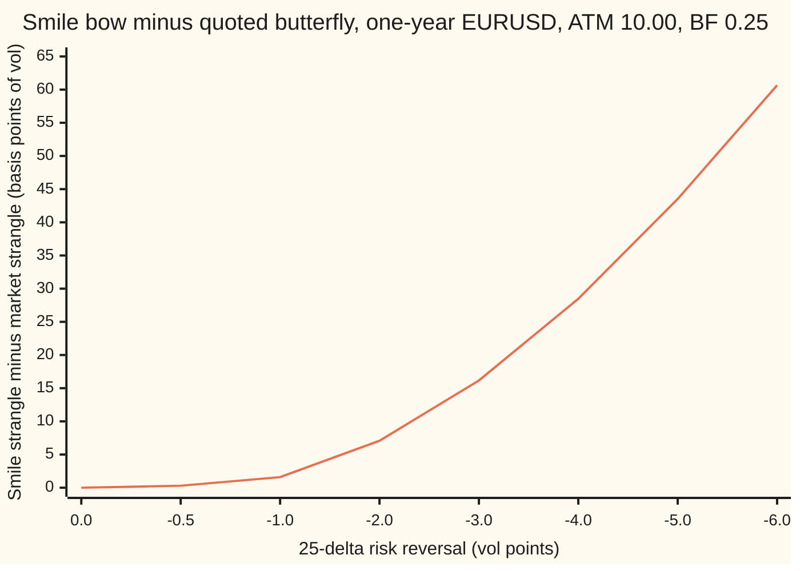
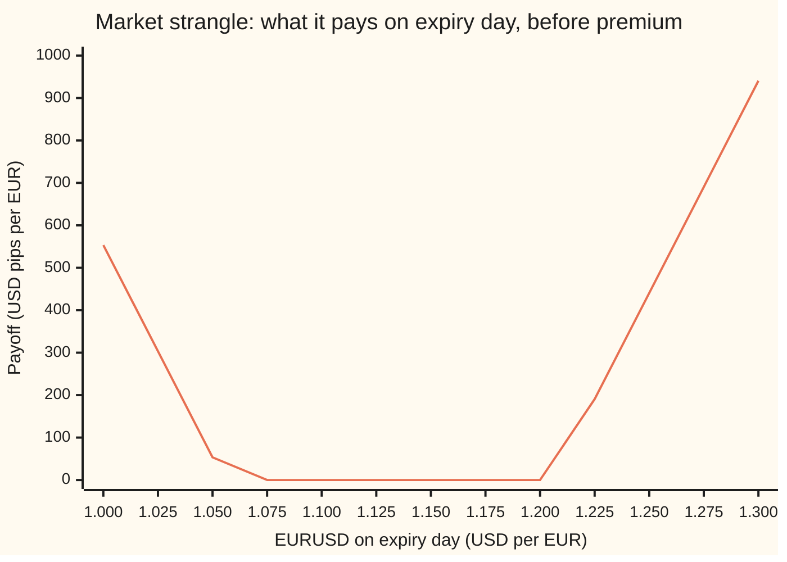
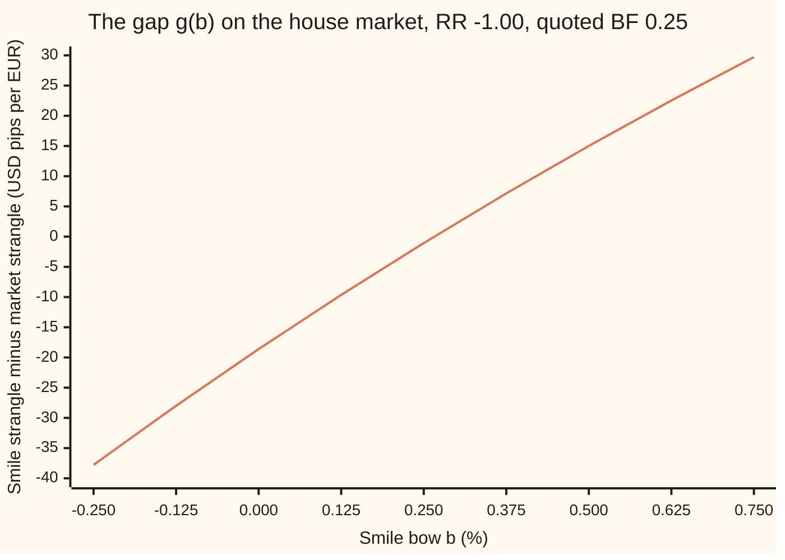

# The broker butterfly: a strangle quoted at one vol, and the one-unknown solve that turns it into smile vols

Financial mathematics → The FX smile - risk reversals, butterflies and vanna-volga → Reading the broker's strangle → The broker butterfly

---

## General Overview

The broker's screen for one-year EURUSD options (dollars per euro, spot 1.1000) reads **ATM 10.00, 25-delta risk reversal −1.00, 25-delta butterfly +0.25**, all in vol points (a vol point is one percentage point of volatility). The previous card on this shelf, [risk-reversal-and-butterfly](01-risk-reversal-and-butterfly.md), read the 0.25 as the smile's own bow: the two wing vols average a quarter point above the middle. That reading is tidy. It is not what the broker means.

The broker means a price. The butterfly quote describes one trade, the **market strangle**: buy a 25-delta euro call and a 25-delta euro put, find both strikes at one single vol, 10.00 + 0.25 = 10.25 percent, and price both legs at that same vol. The answer is 0.034040 dollars per euro, 340.40 pips (a pip is 0.0001 dollars per euro). No smile appears anywhere in that calculation.

Think of a restaurant's set menu: two dishes at one flat rate. The à-la-carte prices, dish by dish, must add up to the same bill for the same two dishes, or a diner could order one way and resell the other. From here on the real names take over. The set menu is the market strangle. The à-la-carte list is the **smile**, a vol for every strike. The smile's bow that makes its bill for those two strikes equal 340.40 pips is the **smile strangle**, written BF with a subscript ss. On the house market it comes out at **0.265924 percent**, 1.59 basis points above the quote (a basis point is a hundredth of a vol point). At a risk reversal of −2.00 the gap is 7.07 basis points; at −6.00 it is 60.65.

**The broker's butterfly is the price of one strangle priced at one vol; the smile's bow is the one unknown that makes the smile reprice that strangle, found by a one-dimensional root solve that works when the tilt is modest and can fail when it is not.**

**What kind of fact this is:** a convention (how brokers quote the butterfly) and a method (the solve that reads it). The existence of the answer is proved on this card in Why it works; its uniqueness is checked numerically for the house market, not proved in general.

### The picture: how far the two readings drift apart as the tilt grows



One line: how many basis points of vol the smile's bow must sit above the broker's 0.25 to reprice the market strangle, at each risk reversal. With no tilt the two readings agree exactly. At the house tilt, −1.00, they differ by 1.59. Doubling the tilt roughly quadruples the gap: the curve is close to a parabola.

---

## The formula

The broker's strangle, at one vol:

$$\sigma_{\text{ms}} = \sigma_{\text{ATM}} + \text{BF}_{\text{ms}}, \qquad V_{\text{ms}} = C\big(K^{\text{ms}}_c;\sigma_{\text{ms}}\big) + P\big(K^{\text{ms}}_p;\sigma_{\text{ms}}\big)$$

where both strikes are the 25-delta strikes found at that one vol. The smile, with its bow $b$ left unknown:

$$\sigma_{25c}(b) = \sigma_{\text{ATM}} + b + \tfrac12\text{RR}, \qquad \sigma_{25p}(b) = \sigma_{\text{ATM}} + b - \tfrac12\text{RR}$$

and the equation that fixes $b$:

$$g(b) = C\big(K^{\text{ms}}_c;\,\sigma(K^{\text{ms}}_c;b)\big) + P\big(K^{\text{ms}}_p;\,\sigma(K^{\text{ms}}_p;b)\big) - V_{\text{ms}} = 0 .$$

Its root is the smile strangle, $\text{BF}_{\text{ss}}$.

**Read it aloud: price the broker's strangle with both legs at ATM plus the quote; then find the bow that, drawn into the smile, makes the same two strikes cost the same total at the smile's own vols.**

| Symbol | Plain meaning | In our example | Push it up and the answer… |
| --- | --- | --- | --- |
| $S$, $F$, $T$, $r_d$, $r_f$ | spot; the forward $S\,e^{(r_d-r_f)T}$; years to expiry; dollar and euro rates, continuously compounded | 1.1000, 1.122221, 1, 5%, 3% | — |
| $\sigma_{\text{ATM}}$ | the at-the-money vol: the smile's height in the middle | 10.00% | the market strangle and the smile rise together |
| $\text{RR}$ | the 25-delta risk reversal: call-wing vol minus put-wing vol, the smile's tilt | −1.00 | a larger tilt either way widens the gap |
| $\text{BF}_{\text{ms}}$ | the broker's butterfly: the market strangle's vol above ATM | +0.25 | the market strangle gets dearer, and so does the bow that reprices it |
| $\sigma_{\text{ms}}$ | the one vol both legs of the market strangle use | 10.25% | — |
| $K^{\text{ms}}_c$, $K^{\text{ms}}_p$ | the market strangle's strikes: 25-delta call and put, both found at $\sigma_{\text{ms}}$ | 1.205943, 1.055342 | — |
| $V_{\text{ms}}$ | the market strangle's price, dollars per euro | 0.034040 | the root moves up |
| $b$, $\text{BF}_{\text{ss}}$ | the smile's bow, unknown; its solved value, the smile strangle | 0.265924% | — |
| $\sigma_{25c}(b)$, $\sigma_{25p}(b)$ | the smile's wing vols at its own 25-delta strikes | 9.765924%, 10.765924% at the root | — |
| $\sigma(K;b)$, $K$, $x$ | the smile's vol at strike $K$; $x = \ln(K/F)$, the strike measured as a log distance from the forward | 9.766000% and 10.724407% at the two market strikes | — |
| $g(b)$ | the gap: smile price of the strangle minus the broker's price | −1.07 pips at $b$ = 0.25% | rises with $b$ |
| $C(K;\sigma)$, $P(K;\sigma)$, $\sigma$, $N(z)$ | a euro call or put priced by Garman-Kohlhagen (Black-Scholes with the euro rate as the dividend yield) at a vol $\sigma$; the bell-curve area left of $z$ | 0.016140, 0.017900 at 10.25% | — |

The 25-delta strikes at a vol $\sigma$, with the upper sign for the call ([risk-reversal-and-butterfly](01-risk-reversal-and-butterfly.md) uses the same step):

$$K_{25} = F\exp\!\big(\mp d\,\sigma\sqrt{T} + \tfrac12\sigma^2 T\big), \qquad e^{-r_f T}N(d) = 0.25 .$$

In words: a 25-delta strike is the forward pushed out by a fixed number of standard deviations, so a higher vol pushes it further out.

The smile between its three pillars (the three strikes where the smile's vol is known: the 25-delta put, ATM and the 25-delta call) is drawn on this card as the parabola in $x$ through them. Written with Lagrange's formula, where the capital sigma means "add up the three terms" and the capital pi means "multiply the two factors":

$$\sigma(K;b) = \sum_{i}\sigma_i\prod_{j\ne i}\frac{x - x_j}{x_i - x_j},$$

with the pillars $(x_p, \sigma_{25p}(b))$, $(x_a, \sigma_{\text{ATM}})$, $(x_c, \sigma_{25c}(b))$. The ATM pillar is the strike where a straddle's delta is zero, $x_a = \tfrac12\sigma_{\text{ATM}}^2T$, strike 1.127847. Each wing's $x$ is found at that wing's own vol, so moving $b$ moves the wing strikes too.

### When it holds

- **The broker means a market strangle.** EURUSD brokers quote the butterfly this way. Some screens quote the smile strangle directly; reading one as the other costs 1.59 basis points of vol here, and more when the tilt is large.
- **The delta convention is the one the strikes assume.** Spot delta without premium adjustment for EURUSD up to one year. A pair quoted with premium-adjusted delta places all four strikes differently, and the whole solve shifts.
- **The smile rule is named.** The answer depends on how the smile is drawn between pillars. A parabola in log-strike gives 0.265924; a vanna-volga smile ([vanna-volga-smile-curve](05-vanna-volga-smile-curve.md)) gives a slightly different bow. A smile strangle quoted without its rule is half a number.
- **The tilt is modest.** At a risk reversal of −12.00 no bow from −3 to +9 percent works: every positive smile among them prices the strangle too dear. Step 4 shows it.

Conventions verified 27 Sep 2026, as set out in Reiswich and Wystup (2010, 2012) and Clark (2011): EURUSD butterflies quoted as a market strangle priced at ATM plus BF, the delta-neutral straddle as at the money, spot delta without premium adjustment up to one year.

---

## Why it works

### Step 0: three pillars, three quotes, one unknown

The smile's three pillar vols carry three unknowns. The ATM quote fixes the middle one. The risk reversal fixes the difference of the other two. That leaves one free number, the bow $b$, which lifts both wings together. The market strangle's price is one more fact. One fact, one unknown: a single equation in a single variable, solved by a root finder. Before solving, three questions: does a root exist, is there only one, and where does it fail?

### Step 1: the market strangle as a contract

Buy a euro call struck at 1.205943 and a euro put struck at 1.055342, both found as 25-delta strikes at 10.25 percent, both priced at 10.25 percent. The call costs 0.016140 and the put 0.017900 dollars per euro; together 0.034040.

| Market strangle, one euro of each leg | Delta (EUR per EUR) | Vega (USD per EUR per vol point) |
| --- | --- | --- |
| long 25-delta call at 10.25% | 0.25 | 0.003446 |
| long 25-delta put at 10.25% | −0.25 | 0.003446 |
| **market strangle** | **0.000000** | **both legs' vegas, equal** |

The deltas cancel because each leg was chosen to have a hedge of 0.25 euros, with opposite signs. The vegas are equal because both legs sit the same number of standard deviations from the forward, on opposite sides, and the bell curve is symmetric.



One line: the strangle's payoff. It pays below the put strike 1.055342 and above the call strike 1.205943, and nothing between. The buyer pays 340.40 pips up front for that shape.

### Step 2: why the naive wings misprice it

The naive reading sets the bow equal to the quote: $b$ = 0.25 percent. The smile's wings are then 9.75 and 10.75 percent, at their own 25-delta strikes 1.201425 and 1.052466. Those are the pillar strikes of [risk-reversal-and-butterfly](01-risk-reversal-and-butterfly.md).

The market strangle's strikes are elsewhere. Its put was placed at 10.25 percent, a lower vol than the smile's 10.75, so it sits closer to the middle: 1.055342, not 1.052466. Its call was placed at 10.25, a higher vol than the smile's 9.75, so it sits further out: 1.205943, not 1.201425. Now read the smile at those two strikes. The put moved inward, toward where the smile is lower: 10.710984 percent. The call moved outward, where the tilted smile keeps falling: 9.748225 percent. Both legs land on vols below the pillars. Their average is 10.229605 percent, not 10.25.

So the smile prices the strangle at 0.033934, short of the broker's 0.034040 by 1.07 pips. On EUR 10 million that is USD 1,066.81. A dealer who marks the smile with the naive bow sells strangles 1.07 pips cheaper than the market, and buys them 1.07 pips dearer.

The mechanism has two factors, and both come from the tilt. How far each market strike sits from its pillar grows with the gap between 10.25 and that wing's vol, which is half the risk reversal. How much the smile's vol changes across that distance grows with the smile's slope, which is also set by the risk reversal. Two factors, each in proportion to RR: the vol shortfall grows with RR times RR.

### Step 3: the root exists, and on the house market it is unique

Write the gap as $g(b)$. Three facts make a root exist.

1. **Continuity.** Each piece of $g$ is a continuous function of $b$: the wing vols, the wing strikes (an exponential of the vol), the parabola through three distinct points, and the Garman-Kohlhagen price. So $g$ is continuous wherever the three pillars stay distinct and the vols stay positive.
2. **A negative end.** At the naive bow, $g$(0.25%) = −1.07 pips.
3. **A positive end.** At a bow of 0.375 percent, $g$ = +7.15 pips.

A continuous function that is negative at one end of an interval and positive at the other crosses zero in between: the intermediate value theorem ([intermediate-value-theorem](../../06-Calculus%20and%20analysis/01-Limits%20and%20Continuity/06-intermediate-value-theorem.md)). Bisection (halving the interval, keeping the half whose ends still differ in sign) finds it: **0.265924 percent**.



One line: the gap at nine trial bows. It rises steadily and crosses zero once, between 0.250 and 0.375.

**Uniqueness** would follow if $g$ always rose with $b$. Raising $b$ lifts both pillar wing vols, and near the pillars the parabola follows them up, so both legs get dearer. Near the quote each basis point of bow adds 0.671815 pips, close to the two legs' vegas combined. The check confirms the rise on the scan above. It is not a general proof: for very large tilts the parabola bends hard between its pillars and the rise can fail, which is the region Step 4 visits.

<details>
<summary>Detailed proof: no tilt means no gap, and the existence argument written out</summary>

**Claim 1: if RR = 0, the smile strangle equals the market strangle.** Put $b = \text{BF}_{\text{ms}}$. Both wing vols are $\sigma_{\text{ATM}} + \text{BF}_{\text{ms}} = \sigma_{\text{ms}}$. A wing's 25-delta strike depends only on its vol, so each smile pillar strike is exactly the market strangle's strike. The parabola passes through its pillars, so at each market strike the smile's vol is $\sigma_{\text{ms}}$. Each leg is then priced at exactly the vol the broker used, and $g(\text{BF}_{\text{ms}}) = 0$. The check's solve returns the quote to ten decimal places.

**Claim 2: a sign change on an interval where the smile is defined gives a root.** Take an interval of bows on which both pillar wing vols are positive, the three pillar strikes are in order, and the parabola is positive at both market strikes. On it every piece of $g(b)$ is a composition of continuous functions, so $g(b)$ is continuous. If one bow in the interval gives a negative gap and another a positive one, the intermediate value theorem gives a bow between them with $g(b) = 0$. On the house market 0.25% and 0.375% qualify.

**Claim 3: the gap grows like RR squared, to first order.** Write $\delta\sigma = \tfrac12\lvert\text{RR}\rvert$. A market strike sits from its pillar by an amount proportional to the vol difference between them, which is $\delta\sigma$ up to the small bow difference. The smile's slope in $x$ is RR divided by the distance between the wing pillars, also proportional to RR. The vol shortfall at each market strike is slope times distance, so of order RR squared; the bow needed to repair it is that shortfall, so it is of order RR squared too. The chart on the overview shows it: 1.59 at −1.00, 7.07 at −2.00, 28.48 at −4.00, each doubling of the tilt about four times the gap.

</details>

### Step 4: where the root does not exist

Set the risk reversal to −12.00, ATM 10.00, quoted butterfly 0.25. The naive smile's call wing is now far below its put wing. Drawn as a parabola, it dips to −10.659262 percent at one market strike: not a smile at all. Raise the bow until the smile is positive at both market strikes with its pillars in order; the check tries 742 such bows. Across all of them the smallest gap is +32.551809 pips. Every positive smile tried prices the strangle too dear. No bow in that range reprices it, and bisection has no negative end to start from.

The broker's quotes are then inconsistent with this smile rule. A desk either draws the smile with a different rule (a vanna-volga smile, or one built in delta) or treats the quote as stale.

### Step 5: the root as seen by the smile

At the root the smile's wings are 9.765924 and 10.765924 percent at their pillar strikes 1.201568 and 1.052375. The risk reversal is still exactly −1.00 and the ATM vol still 10.00: the check rebuilds both from the fitted smile, searching on the smile's own vols for the strikes where delta is 0.25 and where a straddle's delta is zero. At the market strikes the smile reads 9.766000 and 10.724407 percent. Neither is 10.25. The prices match, not the vols: an option's price bends with its vol, so two legs whose vol errors roughly cancel still leave a price difference.

### The other door

One step of Newton's method (a straight-line jump from the naive bow, using the slope of $g$ there) gives 0.265879 percent, within 0.1 percent of the root. That is the vega view: the missing 1.07 pips, divided by 0.671815 pips per basis point of bow, is about 1.59 basis points. A desk with a vanna-volga smile solves the same one-unknown equation with that smile in place of the parabola: [vanna-volga-pricing](04-vanna-volga-pricing.md) builds the price for any strike from the three pillars.

---

## Worked numbers, by hand

House FX market: EURUSD 1.1000, dollar rate 5 percent, euro rate 3 percent, one year; quotes ATM 10.00, RR −1.00, broker BF +0.25. Prices in dollars per euro.

| Step | Arithmetic | Value |
| --- | --- | --- |
| forward $F$ | $1.10\,e^{0.05-0.03}$ | 1.122221 |
| market strangle vol | $10.00 + 0.25$ | 10.25% |
| market call strike | 25 delta at 10.25% | 1.205943 |
| market put strike | 25 delta at 10.25% | 1.055342 |
| market call, put | Garman-Kohlhagen at 10.25% | 0.016140, 0.017900 |
| **market strangle** $V_{\text{ms}}$ | $0.016140 + 0.017900$ | **0.034040** |
| naive smile at the two market strikes | parabola with $b$ = 0.25% | 9.748225%, 10.710984% |
| naive smile's strangle | each leg at its smile vol | 0.033934 |
| naive gap | $0.033934 - 0.034040$ | −1.07 pips |
| slope of $g$ near the root | per basis point of bow | 0.671815 pips |
| one Newton step | $0.25\% + 1.07/0.671815$ bp | 0.265879% |
| **smile strangle** $\text{BF}_{\text{ss}}$ | bisection on $g(b) = 0$ | **0.265924%** |
| smile wing vols | $10.00 + 0.265924 \mp 0.50$ | 9.765924%, 10.765924% |

The broker's 0.25 butterfly asks a smile whose wings are 1.59 basis points higher than the naive reading. On one euro the naive smile misprices the strangle by 1.07 pips; on EUR 10 million, by USD 1,066.81.

### What breaks if you drop a piece

| Mistake | Comes out at | What went wrong |
| --- | --- | --- |
| Read BF as the smile's bow | smile strangle 0.033934, not 0.034040; bow 0.25%, not 0.265924% | The broker's strangle was never priced on a smile; its strikes and vol differ from the pillars |
| Price the market strangle at the smile's pillar strikes 1.052466 and 1.201425 | 0.034248, not 0.034040 | The market strangle's strikes must be found at 10.25%, not at each wing's own vol |
| Find the market strikes at the ATM vol, then price at 10.25% | 0.034938, not 0.034040 | Strikes and price must use the same single vol; strikes at 10% sit closer in and cost more |

Every number in that table is printed by the checks below.

---

## Code, from first principles, and it actually runs

The script prices the broker's strangle, draws the smile for any bow, and solves $g(b) = 0$. It takes **three roads to the root**. Road 1: closed-form strikes, Garman-Kohlhagen prices, bisection. Road 2: every strike found by searching strike by strike until the delta is 0.25, every price by averaging the payoff over the bell curve with Simpson's rule, and the root by the secant method. Road 3: one Newton step from the naive bow. Two further facts are checked independently: with no tilt the root equals the quote, and the fitted smile still returns the ATM and risk-reversal quotes when its 25-delta and zero-delta-straddle strikes are searched on the smile's own vols. The bell-curve area is itself Simpson's rule written out, so nothing imported knows an answer. It also prints the risk-reversal sweep, the scan of $g$, the payoff, the no-root case and every "what breaks" number.

### Python

```python
# The broker butterfly -- the check behind the card.  Standard library only.
# Nothing imported knows the answer: the bell-curve area N(x) is Simpson's rule written out,
# roots come from bisection (road 1) and from the secant method (road 2).
from math import log, sqrt, exp, pi

S, RD, RF, T = 1.10, 0.05, 0.03, 1.0            # EURUSD spot, USD rate, EUR rate, years
ATM, RR, BFM = 0.10, -0.01, 0.0025              # broker quotes; BFM is the market-strangle butterfly
F, DD, DF = S * exp((RD - RF) * T), exp(-RD * T), exp(-RF * T)

def phi(x): return exp(-0.5 * x * x) / sqrt(2.0 * pi)            # bell-curve height
def simpson(f, a, b, n):
    h = (b - a) / n
    s = f(a) + f(b)
    for i in range(1, n): s += (4.0 if i % 2 else 2.0) * f(a + i * h)
    return s * h / 3.0
def N(x):                                                         # bell-curve area left of x
    if x < -12.0: return 0.0
    if x > 12.0: return 1.0
    return 0.5 + simpson(phi, 0.0, x, 2000)
def bisect(g, lo, hi, it=100):                                    # g(lo), g(hi) of opposite sign
    glo = g(lo)
    for _ in range(it):
        mid = 0.5 * (lo + hi); gm = g(mid)
        if (gm > 0.0) == (glo > 0.0): lo, glo = mid, gm
        else: hi = mid
    return 0.5 * (lo + hi)
def secant(g, a, b):
    ga, gb = g(a), g(b)
    for _ in range(30):
        if gb == ga: break
        a, b, ga = b, b - gb * (b - a) / (gb - ga), gb; gb = g(b)
        if abs(b - a) < 1e-13: break
    return b

def d1(K, sig): return (log(S / K) + (RD - RF + 0.5 * sig * sig) * T) / (sig * sqrt(T))
def gk(K, sig, w):                                                # w = +1 EUR call, -1 EUR put
    a = d1(K, sig)
    return w * (S * DF * N(w * a) - K * DD * N(w * (a - sig * sqrt(T))))
def delta(K, sig, w): return w * DF * N(w * d1(K, sig))           # spot delta, premium not adjusted
def vega(K, sig): return S * DF * phi(d1(K, sig)) * sqrt(T)
def by_integral(K, sig, w):                                       # road 2: average the payoff
    def f(z):
        ST = S * exp((RD - RF - 0.5 * sig * sig) * T + sig * sqrt(T) * z)
        return max(w * (ST - K), 0.0) * phi(z)
    return DD * simpson(f, -10.0, 10.0, 40000)

D25 = bisect(lambda x: N(x) - 0.25 / DF, -10.0, 10.0)             # e^{-rf T} N(D25) = 0.25
def k25(sig, w): return F * exp(-w * D25 * sig * sqrt(T) + 0.5 * sig * sig * T)
def k25_search(sig, w): return bisect(lambda k: delta(k, sig, w) - 0.25 * w, 0.5, 2.0)
def smile(atm, rr, b, kfind=k25):                                 # quadratic in ln(K/F) through 3 pillars
    sc, sp = atm + b + 0.5 * rr, atm + b - 0.5 * rr
    xs = [log(kfind(sp, -1) / F), 0.5 * atm * atm * T, log(kfind(sc, 1) / F)]
    ys = [sp, atm, sc]
    def vol(K):
        x, v = log(K / F), 0.0
        for i in range(3):
            l = 1.0
            for j in range(3):
                if j != i: l *= (x - xs[j]) / (xs[i] - xs[j])
            v += l * ys[i]
        return v
    return vol, xs
def market(atm, bfm, kfind=k25, price=gk):                        # the broker's strangle: one vol
    sm = atm + bfm
    kc, kp = kfind(sm, 1), kfind(sm, -1)
    return kc, kp, price(kc, sm, 1) + price(kp, sm, -1)
def gap(atm, rr, bfm, b, kfind=k25, price=gk):                    # smile strangle minus market strangle
    kc, kp, V = market(atm, bfm, kfind, price)
    vol = smile(atm, rr, b, kfind)[0]
    return price(kc, vol(kc), 1) + price(kp, vol(kp), -1) - V
def solve(atm, rr, bfm): return bisect(lambda b: gap(atm, rr, bfm, b), bfm - 0.01, bfm + 0.02)

Kmc, Kmp, V = market(ATM, BFM)
Kmc2, Kmp2, V2 = k25_search(ATM + BFM, 1), k25_search(ATM + BFM, -1), market(ATM, BFM, k25_search, by_integral)[2]
g_naive = gap(ATM, RR, BFM, BFM)
b1 = solve(ATM, RR, BFM)                                          # road 1: formula + bisection
b2 = secant(lambda b: gap(ATM, RR, BFM, b, k25_search, by_integral), BFM, BFM + 0.001)   # road 2
slope = (gap(ATM, RR, BFM, BFM + 1e-5) - gap(ATM, RR, BFM, BFM - 1e-5)) / 2e-5
b3 = BFM - g_naive / slope                                        # road 3: one vega step from the naive guess
vol, xs = smile(ATM, RR, b1)
Kc_s, Kp_s = F * exp(xs[2]), F * exp(xs[0])
Kc_fp = bisect(lambda k: delta(k, vol(k), 1) - 0.25, Kmc - 0.05, Kmc + 0.05)   # 25 delta read off the smile
Kp_fp = bisect(lambda k: delta(k, vol(k), -1) + 0.25, Kmp - 0.05, Kmp + 0.05)
Ka = bisect(lambda k: delta(k, vol(k), 1) + delta(k, vol(k), -1), Kmp, Kmc)   # delta-neutral straddle on the smile
nvol, nx = smile(ATM, RR, BFM)
rows = [("forward F", F), ("market vol ATM+BF  %", 100 * (ATM + BFM)),
        ("K market call, closed form", Kmc), ("K market call, delta search", Kmc2),
        ("K market put, closed form", Kmp), ("K market put, delta search", Kmp2),
        ("market call at 10.25", gk(Kmc, ATM + BFM, 1)), ("market put at 10.25", gk(Kmp, ATM + BFM, -1)),
        ("market strangle V, formula", V), ("market strangle V, integral", V2),
        ("delta: market strangle", delta(Kmc, ATM + BFM, 1) + delta(Kmp, ATM + BFM, -1)),
        ("vega/pt: market call", vega(Kmc, ATM + BFM) / 100), ("vega/pt: market put", vega(Kmp, ATM + BFM) / 100),
        ("naive smile vol at K call %", 100 * nvol(Kmc)), ("naive smile vol at K put  %", 100 * nvol(Kmp)),
        ("naive avg vol at market K %", 50 * (nvol(Kmc) + nvol(Kmp))),
        ("naive smile strangle", V + g_naive), ("naive gap, pips", 1e4 * g_naive), ("naive gap on EUR 10m, USD", 1e7 * g_naive),
        ("smile BF, bisection  %", 100 * b1), ("smile BF, secant+integral %", 100 * b2), ("smile BF, one vega step %", 100 * b3),
        ("smile BF - market BF, bp", 1e4 * (b1 - BFM)), ("d gap / d b, pips per bp", slope * 1e-4 * 1e4),
        ("smile vol 25d call  %", 100 * vol(Kc_s)), ("smile vol 25d put   %", 100 * vol(Kp_s)),
        ("K 25d call on smile", Kc_s), ("K 25d call, smile delta search", Kc_fp),
        ("K 25d put on smile", Kp_s), ("K 25d put, smile delta search", Kp_fp),
        ("smile vol at K market call %", 100 * vol(Kmc)), ("smile vol at K market put  %", 100 * vol(Kmp)),
        ("rebuilt RR  %", 100 * (vol(Kc_fp) - vol(Kp_fp))), ("rebuilt ATM %", 100 * vol(Ka)),
        ("naive pillar K put", F * exp(nx[0])), ("naive pillar K call", F * exp(nx[2])),
        ("wrong: V on naive pillar K", gk(F * exp(nx[2]), ATM + BFM, 1) + gk(F * exp(nx[0]), ATM + BFM, -1)),
        ("wrong: V strikes found at ATM", gk(k25(ATM, 1), ATM + BFM, 1) + gk(k25(ATM, -1), ATM + BFM, -1)),
        ("try: RR +1.00, gap bp", 1e4 * (solve(ATM, -RR, BFM) - BFM)), ("try: BF 0.50, gap bp", 1e4 * (solve(ATM, RR, 0.005) - 0.005)),
        ("try: ATM 15.00, gap bp", 1e4 * (solve(0.15, RR, BFM) - BFM))]
for name, v in rows: print(f"{name:<32} {v:>14.6f}")
rrs = [0.0, -0.005, -0.01, -0.02, -0.03, -0.04, -0.05, -0.06]
gaps = [1e4 * (solve(ATM, r, BFM) - BFM) for r in rrs]
print("chart, RR %            " + " ".join(f"{100 * r:.1f}" for r in rrs))
print("chart, BF gap, bp      " + " ".join(f"{x:.2f}" for x in gaps))
bs = [-0.0025 + 0.00125 * i for i in range(9)]
print("chart, smile BF %      " + " ".join(f"{100 * b:.3f}" for b in bs))
gs = [gap(ATM, RR, BFM, b) for b in bs]
print("chart, gap, pips       " + " ".join(f"{1e4 * g:.2f}" for g in gs))
xs = [1.0 + 0.025 * i for i in range(13)]
print("chart, EURUSD expiry   " + " ".join(f"{x:.3f}" for x in xs))
print("chart, strangle, pips  " + " ".join(f"{1e4 * (max(x - Kmc, 0) + max(Kmp - x, 0)):.2f}" for x in xs))
# no root: RR -12%.  The naive smile goes negative; every positive smile overprices the strangle.
RRX = -0.12; lowest_naive = min(smile(ATM, RRX, BFM)[0](k) for k in market(ATM, BFM)[:2])
ok = []
for i in range(1201):
    b = -0.03 + 0.0001 * i
    v2, x2 = smile(ATM, RRX, b)
    if ATM + b - 0.5 * abs(RRX) > 0 and x2[0] < x2[1] < x2[2] and min(v2(Kmc), v2(Kmp)) > 0:
        ok.append(gap(ATM, RRX, BFM, b))
print(f"{'RR -12: naive smile, low vol %':<32} {100 * lowest_naive:>14.6f}")
print(f"{'RR -12: positive smiles tried':<32} {len(ok):>14d}")
print(f"{'RR -12: smallest gap, pips':<32} {1e4 * min(ok):>14.6f}")

assert abs(Kmc - Kmc2) < 1e-9 and abs(Kmp - Kmp2) < 1e-9 and abs(V - V2) < 1e-8, "market strangle: formula vs search + integral"
assert abs(b1 - b2) < 1e-8, "bisection on formula prices vs secant on brute-force prices"
assert abs(b3 / b1 - 1.0) < 1e-3, "one vega step lands within 0.1 percent of the root"
assert abs(solve(ATM, 0.0, BFM) - BFM) < 1e-10, "no tilt: smile BF equals market BF"
assert abs(vol(Kc_fp) - vol(Kp_fp) - RR) < 1e-9 and abs(vol(Ka) - ATM) < 1e-12, "smile still honours ATM and RR"
assert all(x < y for x, y in zip(gaps, gaps[1:])), "the gap grows with the size of the tilt"
assert all(x < y for x, y in zip(gs, gs[1:])) and gs[4] < 0 < gs[5], "g rises on the scan, one sign change"
assert lowest_naive < 0 and min(ok) > 0, "RR -12%: no positive smile reprices the strangle"
print("ALL CHECKS PASS")
```

**Ran 2026-09-27 on macOS, Python 3.14.6, standard library only. All checks passed. Output, pasted from the run:**

```
forward F                              1.122221
market vol ATM+BF  %                  10.250000
K market call, closed form             1.205943
K market call, delta search            1.205943
K market put, closed form              1.055342
K market put, delta search             1.055342
market call at 10.25                   0.016140
market put at 10.25                    0.017900
market strangle V, formula             0.034040
market strangle V, integral            0.034040
delta: market strangle                 0.000000
vega/pt: market call                   0.003446
vega/pt: market put                    0.003446
naive smile vol at K call %            9.748225
naive smile vol at K put  %           10.710984
naive avg vol at market K %           10.229605
naive smile strangle                   0.033934
naive gap, pips                       -1.066807
naive gap on EUR 10m, USD          -1066.807085
smile BF, bisection  %                 0.265924
smile BF, secant+integral %            0.265924
smile BF, one vega step %              0.265879
smile BF - market BF, bp               1.592408
d gap / d b, pips per bp               0.671815
smile vol 25d call  %                  9.765924
smile vol 25d put   %                 10.765924
K 25d call on smile                    1.201568
K 25d call, smile delta search         1.201568
K 25d put on smile                     1.052375
K 25d put, smile delta search          1.052375
smile vol at K market call %           9.766000
smile vol at K market put  %          10.724407
rebuilt RR  %                         -1.000000
rebuilt ATM %                         10.000000
naive pillar K put                     1.052466
naive pillar K call                    1.201425
wrong: V on naive pillar K             0.034248
wrong: V strikes found at ATM          0.034938
try: RR +1.00, gap bp                  2.420351
try: BF 0.50, gap bp                   1.190172
try: ATM 15.00, gap bp                 0.927467
chart, RR %            0.0 -0.5 -1.0 -2.0 -3.0 -4.0 -5.0 -6.0
chart, BF gap, bp      0.00 0.30 1.59 7.07 16.16 28.48 43.52 60.65
chart, smile BF %      -0.250 -0.125 0.000 0.125 0.250 0.375 0.500 0.625 0.750
chart, gap, pips       -37.77 -27.99 -18.62 -9.65 -1.07 7.15 15.01 22.53 29.72
chart, EURUSD expiry   1.000 1.025 1.050 1.075 1.100 1.125 1.150 1.175 1.200 1.225 1.250 1.275 1.300
chart, strangle, pips  553.42 303.42 53.42 0.00 0.00 0.00 0.00 0.00 0.00 190.57 440.57 690.57 940.57
RR -12: naive smile, low vol %       -10.659262
RR -12: positive smiles tried               742
RR -12: smallest gap, pips            32.551809
ALL CHECKS PASS
```

The formula road and the brute-force road agree on the market strangle to six decimals and on the root to eight. The one Newton step lands within 0.1 percent of the root.

### Rust

Same algorithm for the bell-curve area, the root finders and the parabola, written again in Rust, no crates.

```rust
// The broker butterfly -- the same check as market_strangle_and_smile_strangle_check.py, in Rust.
// Standard library only, no crates.  N(x) is Simpson's rule written out; roots come from
// bisection (road 1) and the secant method (road 2).
use std::f64::consts::PI;

const S: f64 = 1.10; const RD: f64 = 0.05; const RF: f64 = 0.03; const T: f64 = 1.0;
const ATM: f64 = 0.10; const RR: f64 = -0.01; const BFM: f64 = 0.0025;
fn fwd() -> f64 { S * ((RD - RF) * T).exp() }
fn dd() -> f64 { (-RD * T).exp() }  fn df() -> f64 { (-RF * T).exp() }

fn phi(x: f64) -> f64 { (-0.5 * x * x).exp() / (2.0 * PI).sqrt() }     // bell-curve height
fn simpson<G: Fn(f64) -> f64>(f: G, a: f64, b: f64, n: usize) -> f64 {
    let h = (b - a) / n as f64;
    let mut s = f(a) + f(b);
    for i in 1..n { s += if i % 2 == 1 { 4.0 } else { 2.0 } * f(a + i as f64 * h); }
    s * h / 3.0
}
fn n_cdf(x: f64) -> f64 {                                                // bell-curve area left of x
    if x < -12.0 { 0.0 } else if x > 12.0 { 1.0 } else { 0.5 + simpson(phi, 0.0, x, 2000) }
}
fn bisect<G: Fn(f64) -> f64>(g: G, mut lo: f64, mut hi: f64) -> f64 {   // g(lo), g(hi) of opposite sign
    let mut glo = g(lo);
    for _ in 0..100 {
        let mid = 0.5 * (lo + hi); let gm = g(mid);
        if (gm > 0.0) == (glo > 0.0) { lo = mid; glo = gm; } else { hi = mid; }
    }
    0.5 * (lo + hi)
}
fn secant<G: Fn(f64) -> f64>(g: G, mut a: f64, mut b: f64) -> f64 {
    let (mut ga, mut gb) = (g(a), g(b));
    for _ in 0..30 {
        if gb == ga { break; }
        let nb = b - gb * (b - a) / (gb - ga); a = b; ga = gb; b = nb; gb = g(b);
        if (b - a).abs() < 1e-13 { break; }
    }
    b
}
fn d1(k: f64, sig: f64) -> f64 { ((S / k).ln() + (RD - RF + 0.5 * sig * sig) * T) / (sig * T.sqrt()) }
fn gk(k: f64, sig: f64, w: f64) -> f64 {                                 // w = +1 EUR call, -1 EUR put
    let a = d1(k, sig);
    w * (S * df() * n_cdf(w * a) - k * dd() * n_cdf(w * (a - sig * T.sqrt())))
}
fn delta(k: f64, sig: f64, w: f64) -> f64 { w * df() * n_cdf(w * d1(k, sig)) }
fn vega(k: f64, sig: f64) -> f64 { S * df() * phi(d1(k, sig)) * T.sqrt() }
fn by_integral(k: f64, sig: f64, w: f64) -> f64 {                        // road 2: average the payoff
    let f = |z: f64| {
        let st = S * ((RD - RF - 0.5 * sig * sig) * T + sig * T.sqrt() * z).exp();
        (w * (st - k)).max(0.0) * phi(z)
    };
    dd() * simpson(f, -10.0, 10.0, 40000)
}
type Kf = fn(f64, f64) -> f64;
fn k25(sig: f64, w: f64) -> f64 {
    let d25 = bisect(|x| n_cdf(x) - 0.25 / df(), -10.0, 10.0);         // e^{-rf T} N(d25) = 0.25
    fwd() * (-w * d25 * sig * T.sqrt() + 0.5 * sig * sig * T).exp()
}
fn k25_search(sig: f64, w: f64) -> f64 { bisect(|k| delta(k, sig, w) - 0.25 * w, 0.5, 2.0) }
struct Smile { xs: [f64; 3], ys: [f64; 3] }                              // quadratic in ln(K/F) through 3 pillars
impl Smile {
    fn new(atm: f64, rr: f64, b: f64, kf: Kf) -> Smile {
        let (sc, sp) = (atm + b + 0.5 * rr, atm + b - 0.5 * rr);
        Smile { xs: [(kf(sp, -1.0) / fwd()).ln(), 0.5 * atm * atm * T, (kf(sc, 1.0) / fwd()).ln()], ys: [sp, atm, sc] }
    }
    fn vol(&self, k: f64) -> f64 {
        let x = (k / fwd()).ln();
        let mut v = 0.0;
        for i in 0..3 {
            let mut l = 1.0;
            for j in 0..3 { if j != i { l *= (x - self.xs[j]) / (self.xs[i] - self.xs[j]); } }
            v += l * self.ys[i];
        }
        v
    }
}
fn market(atm: f64, bfm: f64, kf: Kf, price: Kf3) -> (f64, f64, f64) {     // the broker's strangle: one vol
    let sm = atm + bfm;
    let (kc, kp) = (kf(sm, 1.0), kf(sm, -1.0));
    (kc, kp, price(kc, sm, 1.0) + price(kp, sm, -1.0))
}
type Kf3 = fn(f64, f64, f64) -> f64;
fn gap_with(atm: f64, rr: f64, bfm: f64, b: f64, kf: Kf, price: Kf3) -> f64 {  // smile strangle minus market
    let (kc, kp, v) = market(atm, bfm, kf, price);
    let sm = Smile::new(atm, rr, b, kf);
    price(kc, sm.vol(kc), 1.0) + price(kp, sm.vol(kp), -1.0) - v
}
fn gap(atm: f64, rr: f64, bfm: f64, b: f64) -> f64 { gap_with(atm, rr, bfm, b, k25, gk) }
fn solve(atm: f64, rr: f64, bfm: f64) -> f64 { bisect(|b| gap(atm, rr, bfm, b), bfm - 0.01, bfm + 0.02) }

fn main() {
    let f = fwd();
    let sm = ATM + BFM;
    let (kmc, kmp, v) = market(ATM, BFM, k25, gk);
    let (kmc2, kmp2, v2) = (k25_search(sm, 1.0), k25_search(sm, -1.0), market(ATM, BFM, k25_search, by_integral).2);
    let g_naive = gap(ATM, RR, BFM, BFM);
    let b1 = solve(ATM, RR, BFM);                                         // road 1: formula + bisection
    let b2 = secant(|b| gap_with(ATM, RR, BFM, b, k25_search, by_integral), BFM, BFM + 0.001);   // road 2
    let slope = (gap(ATM, RR, BFM, BFM + 1e-5) - gap(ATM, RR, BFM, BFM - 1e-5)) / 2e-5;
    let b3 = BFM - g_naive / slope;                                       // road 3: one vega step
    let sml = Smile::new(ATM, RR, b1, k25);
    let (kc_s, kp_s) = (f * sml.xs[2].exp(), f * sml.xs[0].exp());
    let kc_fp = bisect(|k| delta(k, sml.vol(k), 1.0) - 0.25, kmc - 0.05, kmc + 0.05);   // 25 delta read off the smile
    let kp_fp = bisect(|k| delta(k, sml.vol(k), -1.0) + 0.25, kmp - 0.05, kmp + 0.05);
    let ka = bisect(|k| delta(k, sml.vol(k), 1.0) + delta(k, sml.vol(k), -1.0), kmp, kmc);   // delta-neutral straddle on the smile
    let nv = Smile::new(ATM, RR, BFM, k25);
    let (npk, nck) = (f * nv.xs[0].exp(), f * nv.xs[2].exp());
    let rows: Vec<(&str, f64)> = vec![
        ("forward F", f), ("market vol ATM+BF  %", 100.0 * sm),
        ("K market call, closed form", kmc), ("K market call, delta search", kmc2),
        ("K market put, closed form", kmp), ("K market put, delta search", kmp2),
        ("market call at 10.25", gk(kmc, sm, 1.0)), ("market put at 10.25", gk(kmp, sm, -1.0)),
        ("market strangle V, formula", v), ("market strangle V, integral", v2),
        ("delta: market strangle", delta(kmc, sm, 1.0) + delta(kmp, sm, -1.0)),
        ("vega/pt: market call", vega(kmc, sm) / 100.0), ("vega/pt: market put", vega(kmp, sm) / 100.0),
        ("naive smile vol at K call %", 100.0 * nv.vol(kmc)), ("naive smile vol at K put  %", 100.0 * nv.vol(kmp)),
        ("naive avg vol at market K %", 50.0 * (nv.vol(kmc) + nv.vol(kmp))),
        ("naive smile strangle", v + g_naive), ("naive gap, pips", 1e4 * g_naive), ("naive gap on EUR 10m, USD", 1e7 * g_naive),
        ("smile BF, bisection  %", 100.0 * b1), ("smile BF, secant+integral %", 100.0 * b2), ("smile BF, one vega step %", 100.0 * b3),
        ("smile BF - market BF, bp", 1e4 * (b1 - BFM)), ("d gap / d b, pips per bp", slope * 1e-4 * 1e4),
        ("smile vol 25d call  %", 100.0 * sml.vol(kc_s)), ("smile vol 25d put   %", 100.0 * sml.vol(kp_s)),
        ("K 25d call on smile", kc_s), ("K 25d call, smile delta search", kc_fp),
        ("K 25d put on smile", kp_s), ("K 25d put, smile delta search", kp_fp),
        ("smile vol at K market call %", 100.0 * sml.vol(kmc)), ("smile vol at K market put  %", 100.0 * sml.vol(kmp)),
        ("rebuilt RR  %", 100.0 * (sml.vol(kc_fp) - sml.vol(kp_fp))), ("rebuilt ATM %", 100.0 * sml.vol(ka)),
        ("naive pillar K put", npk), ("naive pillar K call", nck),
        ("wrong: V on naive pillar K", gk(nck, sm, 1.0) + gk(npk, sm, -1.0)),
        ("wrong: V strikes found at ATM", gk(k25(ATM, 1.0), sm, 1.0) + gk(k25(ATM, -1.0), sm, -1.0)),
        ("try: RR +1.00, gap bp", 1e4 * (solve(ATM, -RR, BFM) - BFM)), ("try: BF 0.50, gap bp", 1e4 * (solve(ATM, RR, 0.005) - 0.005)),
        ("try: ATM 15.00, gap bp", 1e4 * (solve(0.15, RR, BFM) - BFM)),
    ];
    for (name, x) in &rows { println!("{:<32} {:>14.6}", name, x); }
    let rrs = [0.0, -0.005, -0.01, -0.02, -0.03, -0.04, -0.05, -0.06];
    let gaps: Vec<f64> = rrs.iter().map(|&r| 1e4 * (solve(ATM, r, BFM) - BFM)).collect();
    let join = |v: &[f64], d: usize, m: f64| v.iter().map(|x| format!("{:.*}", d, m * x)).collect::<Vec<_>>().join(" ");
    println!("chart, RR %            {}", join(&rrs, 1, 100.0));
    println!("chart, BF gap, bp      {}", join(&gaps, 2, 1.0));
    let bs: Vec<f64> = (0..9).map(|i| -0.0025 + 0.00125 * i as f64).collect();
    let gs: Vec<f64> = bs.iter().map(|&b| gap(ATM, RR, BFM, b)).collect();
    println!("chart, smile BF %      {}", join(&bs, 3, 100.0));
    println!("chart, gap, pips       {}", join(&gs, 2, 1e4));
    let xs: Vec<f64> = (0..13).map(|i| 1.0 + 0.025 * i as f64).collect();
    let pay: Vec<f64> = xs.iter().map(|&x| (x - kmc).max(0.0) + (kmp - x).max(0.0)).collect();
    println!("chart, EURUSD expiry   {}", join(&xs, 3, 1.0));
    println!("chart, strangle, pips  {}", join(&pay, 2, 1e4));
    // no root: RR -12%.  The naive smile goes negative; every positive smile overprices the strangle.
    let rrx = -0.12;
    let nx = Smile::new(ATM, rrx, BFM, k25);
    let lowest_naive = nx.vol(kmc).min(nx.vol(kmp));
    let mut ok: Vec<f64> = Vec::new();
    for i in 0..1201 {
        let b = -0.03 + 0.0001 * i as f64;
        let s2 = Smile::new(ATM, rrx, b, k25);
        if ATM + b - 0.5 * rrx.abs() > 0.0 && s2.xs[0] < s2.xs[1] && s2.xs[1] < s2.xs[2] && s2.vol(kmc).min(s2.vol(kmp)) > 0.0 {
            ok.push(gap(ATM, rrx, BFM, b));
        }
    }
    let min_ok = ok.iter().cloned().fold(f64::INFINITY, f64::min);
    println!("{:<32} {:>14.6}", "RR -12: naive smile, low vol %", 100.0 * lowest_naive);
    println!("{:<32} {:>14}", "RR -12: positive smiles tried", ok.len());
    println!("{:<32} {:>14.6}", "RR -12: smallest gap, pips", 1e4 * min_ok);

    assert!((kmc - kmc2).abs() < 1e-9 && (kmp - kmp2).abs() < 1e-9 && (v - v2).abs() < 1e-8, "market strangle: formula vs search + integral");
    assert!((b1 - b2).abs() < 1e-8, "bisection on formula prices vs secant on brute-force prices");
    assert!((b3 / b1 - 1.0).abs() < 1e-3, "one vega step lands within 0.1 percent of the root");
    assert!((solve(ATM, 0.0, BFM) - BFM).abs() < 1e-10, "no tilt: smile BF equals market BF");
    assert!((sml.vol(kc_fp) - sml.vol(kp_fp) - RR).abs() < 1e-9 && (sml.vol(ka) - ATM).abs() < 1e-12, "smile still honours ATM and RR");
    assert!(gaps.windows(2).all(|w| w[0] < w[1]), "the gap grows with the size of the tilt");
    assert!(gs.windows(2).all(|w| w[0] < w[1]) && gs[4] < 0.0 && 0.0 < gs[5], "g rises on the scan, one sign change");
    assert!(lowest_naive < 0.0 && min_ok > 0.0, "RR -12%: no positive smile reprices the strangle");
    println!("ALL CHECKS PASS");
}
```

**Ran 2026-09-27 on macOS, rustc 1.98.1, no crates. All checks passed. Output, pasted from the run:**

```
forward F                              1.122221
market vol ATM+BF  %                  10.250000
K market call, closed form             1.205943
K market call, delta search            1.205943
K market put, closed form              1.055342
K market put, delta search             1.055342
market call at 10.25                   0.016140
market put at 10.25                    0.017900
market strangle V, formula             0.034040
market strangle V, integral            0.034040
delta: market strangle                 0.000000
vega/pt: market call                   0.003446
vega/pt: market put                    0.003446
naive smile vol at K call %            9.748225
naive smile vol at K put  %           10.710984
naive avg vol at market K %           10.229605
naive smile strangle                   0.033934
naive gap, pips                       -1.066807
naive gap on EUR 10m, USD          -1066.807085
smile BF, bisection  %                 0.265924
smile BF, secant+integral %            0.265924
smile BF, one vega step %              0.265879
smile BF - market BF, bp               1.592408
d gap / d b, pips per bp               0.671815
smile vol 25d call  %                  9.765924
smile vol 25d put   %                 10.765924
K 25d call on smile                    1.201568
K 25d call, smile delta search         1.201568
K 25d put on smile                     1.052375
K 25d put, smile delta search          1.052375
smile vol at K market call %           9.766000
smile vol at K market put  %          10.724407
rebuilt RR  %                         -1.000000
rebuilt ATM %                         10.000000
naive pillar K put                     1.052466
naive pillar K call                    1.201425
wrong: V on naive pillar K             0.034248
wrong: V strikes found at ATM          0.034938
try: RR +1.00, gap bp                  2.420351
try: BF 0.50, gap bp                   1.190172
try: ATM 15.00, gap bp                 0.927467
chart, RR %            0.0 -0.5 -1.0 -2.0 -3.0 -4.0 -5.0 -6.0
chart, BF gap, bp      0.00 0.30 1.59 7.07 16.16 28.48 43.52 60.65
chart, smile BF %      -0.250 -0.125 0.000 0.125 0.250 0.375 0.500 0.625 0.750
chart, gap, pips       -37.77 -27.99 -18.62 -9.65 -1.07 7.15 15.01 22.53 29.72
chart, EURUSD expiry   1.000 1.025 1.050 1.075 1.100 1.125 1.150 1.175 1.200 1.225 1.250 1.275 1.300
chart, strangle, pips  553.42 303.42 53.42 0.00 0.00 0.00 0.00 0.00 0.00 190.57 440.57 690.57 940.57
RR -12: naive smile, low vol %       -10.659262
RR -12: positive smiles tried               742
RR -12: smallest gap, pips            32.551809
ALL CHECKS PASS
```

The two outputs agree line for line.

> [!TIP]
> **Try changing**
> Guess the direction first. Then run it.
> - **Flip the tilt.** Set the risk reversal to +1.00. The gap moves from 1.59 to **2.420351** basis points, not back to 1.59. Every strike carries the half-variance shift, which pushes both wings the same way, so the call and put wings are not mirror images in log-strike.
> - **Double the quoted bow.** Set the butterfly to 0.50. The gap shrinks slightly, to **1.190172** basis points. The gap is driven by the tilt; the bow's own size barely moves it.
> - **Raise the level.** Set ATM to 15.00 with the same RR and BF. The gap falls to **0.927467** basis points: the same one-point tilt is a smaller share of a larger vol.

---

## The usual mistake

> [!warning]
> **Treating the broker's butterfly as the smile's bow.** The quote is a trade priced at one vol, 10.25 percent, with both strikes found at that vol. A smile drawn with a bow of exactly 0.25 prices the same strangle 1.07 pips cheaper. The smile's bow is the root of $g(b) = 0$: 0.265924 here.
>
> Smaller traps:
> - **Matching vols instead of prices.** At the root the smile reads 9.766000 and 10.724407 at the market strikes, not 10.25. Forcing the average vol to 10.25 solves the wrong equation.
> - **Reusing the pillar strikes.** The market strangle's strikes are found at 10.25 percent. Priced at the smile's pillars 1.052466 and 1.201425, it comes out at 0.034248, not 0.034040.
> - **Mixing vols inside the market strangle.** Strikes found at 10.00 and priced at 10.25 give 0.034938.
> - **Assuming the solve always succeeds.** At a risk reversal of −12.00 no positive smile of this shape reprices the strangle. A solver that returns a number there has returned a bracket end, not a root.

---

## Where you meet it in real life

- **The broker's vol run.** EURUSD and most major pairs quote the 25-delta and 10-delta butterflies as market strangles. Every smile a desk marks from those screens starts with this solve, once per delta and expiry.
- **Pricing a strangle for a client.** A client asking for "the 25-delta strangle" is quoted the market strangle: one vol, two strikes. Pricing it off a naively built smile costs 1.07 pips per euro on the house market, more in markets with steep risk reversals.
- **Currencies with steep risk reversals.** Pairs where one direction of move is feared far more than the other carry large risk reversals, and the gap between market and smile strangle grows with the tilt squared. There the naive reading is not a rounding error.
- **Smile models.** The smile strangle's wings and strikes are the pillars vanna-volga works from: [vanna-and-volga-on-the-smile](03-vanna-and-volga-on-the-smile.md), [vanna-volga-pricing](04-vanna-volga-pricing.md) and [vanna-volga-smile-curve](05-vanna-volga-smile-curve.md).
- **Hedging a book.** When spot moves, the market strangle's strikes move with it, and the solve is redone: [smile-adjusted-delta-and-sticky-delta](06-smile-adjusted-delta-and-sticky-delta.md).

> **Say it back**
> The broker's butterfly is not the smile's bow. It is the price of a market strangle: 25-delta call and put, both strikes found and both legs priced at ATM plus the quote. A smile with ATM and risk reversal fixed has one free number, its bow, and the smile strangle is the bow that makes the smile reprice that strangle. The gap is zero with no tilt and grows with the tilt squared: 1.59 basis points on the house market. The root exists by the intermediate value theorem when the naive bow underprices and a larger one overprices, and can vanish when the tilt is large.

---

## What this builds on

- [risk-reversal-and-butterfly](01-risk-reversal-and-butterfly.md): the three quotes, the wings as ATM plus bow plus or minus half the tilt, and the 25-delta strikes at each wing's vol.
- [intermediate-value-theorem](../../06-Calculus%20and%20analysis/01-Limits%20and%20Continuity/06-intermediate-value-theorem.md): a continuous function that changes sign has a root, which is why the solve has an answer.

## Where this goes next

- [vanna-and-volga-on-the-smile](03-vanna-and-volga-on-the-smile.md): the risk reversal and the butterfly as the trades that carry sensitivity to spot-and-vol together and to vol-of-vol.
- [vanna-volga-smile-curve](05-vanna-volga-smile-curve.md): a smile drawn through the three pillars by hedging cost rather than by a parabola, the other rule this solve can run on.

The solve gives three pillar vols and strikes that the market agrees with; what vol belongs at every other strike, and why, is what [vanna-and-volga-on-the-smile](03-vanna-and-volga-on-the-smile.md) begins to answer.

---

## Sources

Verified 27 Sep 2026: every link below resolves to the publisher's page.

- Reiswich, Dimitri, and Uwe Wystup. "A Guide to FX Options Quoting Conventions." *The Journal of Derivatives* 18, no. 2 (2010): 58–68. [doi:10.3905/jod.2010.18.2.058](https://doi.org/10.3905/jod.2010.18.2.058). The spot, forward and premium-adjusted delta conventions and the ATM definitions that fix every strike on this card.
- Reiswich, Dimitri, and Uwe Wystup. "FX Volatility Smile Construction." *Wilmott* 2012, no. 60: 58–69. [doi:10.1002/wilm.10132](https://doi.org/10.1002/wilm.10132). How the market strangle enters smile calibration, with the one-dimensional solve.
- Clark, Iain J. *Foreign Exchange Option Pricing: A Practitioner's Guide*. Wiley, 2011. [Publisher page](https://www.wiley.com/en-us/Foreign+Exchange+Option+Pricing%3A+A+Practitioner%27s+Guide-p-9780470683682). The desk's distinction between market strangle and smile strangle, and why the two differ when the risk reversal is large.
