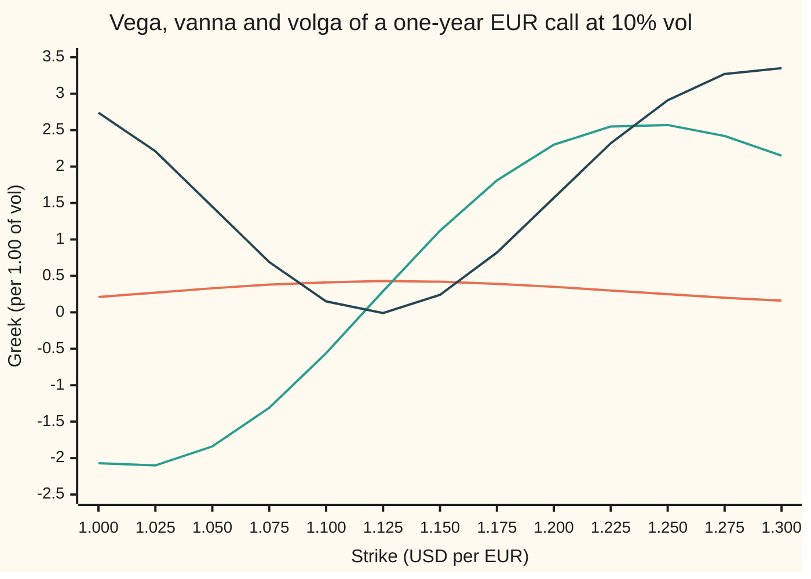

# Vanna and volga: the two second-order vol Greeks, and why the risk reversal trades vanna and the butterfly trades volga

[Syllabus](../../../SYLLABUS.md) → [Financial mathematics](../../../SYLLABUS.md#w12) → [The FX smile - risk reversals, butterflies and vanna-volga](../../../SYLLABUS.md#w12-s22) → Vanna and volga

---

## General Overview

EURUSD trades at 1.1000: one euro costs 1.10 US dollars. Dollar cash earns 5 percent a year, euro cash 3 percent. A dealer holds a one-year euro call struck at 1.10, priced by Garman-Kohlhagen (the currency version of Black-Scholes) at a flat 10 percent volatility.

The dealer's risk report shows its **vega**: how much the option's price moves when volatility moves. Here it is 0.412764 dollars per euro per unit of volatility, where one unit is 100 percentage points; this unit keeps the formulas clean. A one-point move, 10 to 11 percent, changes the price by about 0.0041 dollars. Vega is not a fixed number. It is a reading on a dial, and two things turn the dial: the euro moves, carrying the option toward or away from the money where vega peaks; or volatility moves. A dealer who hedged vega this morning is unhedged by lunch if either happens.

The two turns have names. **Vanna** is how fast vega changes when spot moves. **Volga** is how fast vega changes when volatility moves. For the 1.10 call, vanna is −0.562861 and volga is 0.154787. A rising euro takes this call deeper into the money and away from its peak vega; a rise in volatility adds a little vega.

The FX market quotes three things: the at-the-money vol, the 25-delta risk reversal and the 25-delta butterfly ([Risk reversal and butterfly](01-risk-reversal-and-butterfly.md)). Each quote is the price of a trade. The straddle is mostly vega. The risk reversal is mostly vanna. The butterfly, scaled to carry no vega, is mostly volga. That match is why the three quotes carry the three numbers a smile needs.

**Vanna and volga are the two slopes of vega, one against spot and one against volatility; the straddle, the risk reversal and the vega-neutral butterfly each load mainly on one of vega, vanna and volga.**

**What kind of fact this is:** a theorem inside the Garman-Kohlhagen model: the two formulas and the trade decomposition are proved on this card in Why it works. The model itself is an assumption about how the rate moves, not a law.

### The picture: vega, vanna and volga across strikes

All three Greeks of a one-year euro call at the flat 10 percent vol, for strikes from 1.00 to 1.30. Spot is 1.10 and the one-year forward is 1.122221.



Orange: vega, a low hump that peaks near the forward. Green: vanna, negative for low strikes, positive for high ones, crossing zero just below the forward. Dark: volga, a valley that dips just below zero near the money and climbs in both wings. Vanna separates the two sides; volga separates the middle from the wings. A smile has a tilt and a bow, and these are the two Greeks that see them.

---

## The formula

$$\mathrm{Va} = \frac{\partial \mathcal{V}}{\partial S} = -\,e^{-r_f T}\,\varphi(d_1)\,\frac{d_2}{\sigma}, \qquad \mathrm{Vo} = \frac{\partial \mathcal{V}}{\partial \sigma} = \mathcal{V}\,\frac{d_1 d_2}{\sigma}, \qquad \mathcal{V} = S\,e^{-r_f T}\varphi(d_1)\sqrt{T}$$

**Read it aloud: vanna is minus the discounted bell-curve height at d1, times d2, per unit of vol; volga is vega times d1 times d2, per unit of vol.**

The symbol $\partial$ means a partial derivative: the slope in one input with every other input held fixed ([Partial derivatives](../../06-Calculus%20and%20analysis/07-Several%20Variables/01-partial-derivatives.md)). Both formulas hold for a call and for a put at the same strike.

| Symbol | Plain meaning | In our example | Push it up and vanna, volga… |
| --- | --- | --- | --- |
| $S$, $F$ | spot, dollars per euro today; the forward $F = S e^{(r_d - r_f)T}$ | 1.10; 1.122221 | spot up at fixed strike: $d_1$, $d_2$ rise, vanna turns more negative |
| $K$ | the strike, dollars per euro | 1.10 in the worked example | a higher strike lowers $d_1$, $d_2$: vanna rises through zero |
| $K_{25p}$, $K_{\text{ATM}}$, $K_{25c}$ | the three pillar strikes: 25-delta put, delta-neutral straddle, 25-delta call | 1.052466, 1.127847, 1.201425 | — |
| $r_d$, $r_f$, $e^{-r_f T}$, $T$ | dollar rate, euro rate, continuously compounded; the euro discount factor; years to expiry | 5%, 3%; 0.970446; 1 | — |
| $\sigma$, $\sigma_{25p}$, $\sigma_{25c}$ | the flat vol all Greeks are taken at; the wing vols the market quotes | 10.00%; 10.75%, 9.75% | at strike 1.10, vol 15%: vanna −0.147327 |
| $d_1$, $d_2$ | distances from strike to forward in units of $\sigma\sqrt{T}$, with the half-variance shift; $d_2 = d_1 - \sigma\sqrt{T}$ | 0.25, 0.15 | — |
| $\varphi$, $N$ | the bell curve's height $\varphi(x)$, and its area to the left, $N(x)$ | $\varphi(0.25)$ = 0.386668 | — |
| $\mathcal{V}$ | vega: price change per 1.00 of vol, dollars per euro | 0.412764 | — |
| $\mathrm{Va}$ | vanna: vega's change per 1.00 of spot; equally, delta's change per 1.00 of vol | −0.562861 | — |
| $\mathrm{Vo}$ | volga: vega's change per 1.00 of vol | 0.154787 | at strike 1.30: 3.353794 |
| $a$, $w$, $\Delta$ | the 25-delta distance, $e^{-r_f T}N(-a) = 0.25$; straddles sold per strangle to cancel vega; delta, the euro hedge per euro of option | 0.650720; 0.803095 | — |
| $C$, $P$, $\partial$, $dS$, $d\sigma$ | a euro call and a euro put, priced by Garman-Kohlhagen; the partial-derivative sign; a small move in spot, in vol | — | — |

The helper distances, as on [The Greeks of a currency option](../21-FX%20vanilla%20options%20-%20Garman-Kohlhagen%20and%20the%20desk%20conventions/03-garman-kohlhagen-greeks.md):

$$d_1 = \frac{\ln(S/K) + (r_d - r_f + \tfrac12\sigma^2)T}{\sigma\sqrt{T}}, \qquad d_2 = d_1 - \sigma\sqrt{T}$$

In words: $d_1$ counts steps of size $\sigma\sqrt{T}$ from strike to forward, plus half a step; $d_2$ is the same count minus half a step. The signs of vanna and volga come from these two numbers alone.

The desk trades, written as combinations of options, all Greeks taken at the flat vol:

$$\text{straddle} = C(K_{\text{ATM}}) + P(K_{\text{ATM}}), \quad \text{RR} = C(K_{25c}) - P(K_{25p}), \quad \text{BF} = C(K_{25c}) + P(K_{25p}) - w\,\text{straddle}$$

Here $C$ and $P$ are a euro call and a euro put. The risk reversal buys the call wing and sells the put wing. The butterfly buys the strangle (both wings) and sells $w$ straddles, with $w$ chosen so the butterfly carries no vega.

**Conventions verified 2026-09-27:** spot delta with the premium not adjusted, ATM as the delta-neutral straddle, risk reversal as call vol minus put vol, butterfly as a smile strangle. These are the house conventions of [Risk reversal and butterfly](01-risk-reversal-and-butterfly.md); the checks rebuild the three pillar strikes from the quotes to six decimals. The broker's butterfly quote is converted on [The broker butterfly](02-market-strangle-and-smile-strangle.md).

### When it holds

- **Garman-Kohlhagen at one vol.** The formulas are slopes of the model price. On a smile each option has its own implied vol, and the Greeks change with the vol chosen: the risk reversal's vega is 0.013526 at the flat 10 percent and exactly zero with each leg at its own vol.
- **Strike held fixed.** Vanna moves spot and keeps the strike. If the smile is marked by delta instead of strike, spot moving also moves each option's vol, and the true hedge differs; that is [Hedging with the smile](06-smile-adjusted-delta-and-sticky-delta.md).
- **Small moves.** Vanna and volga are second-order terms of a Taylor expansion (a polynomial stand-in for the price near today's inputs). For a large vol jump the third-order terms matter and the second-order estimate drifts off by roughly those terms.
- **Away from expiry.** As $T$ shrinks, $\sigma\sqrt{T}$ shrinks, $d_1$ and $d_2$ blow up away from the strike and pile together at it; near expiry both Greeks spike at the strike and vanish elsewhere.
- **The house delta convention.** The trade Greeks depend on where the 25-delta strikes sit. A premium-adjusted or forward delta moves the strikes and every trade number with them.

---

## Why it works

### Step 0: vega is a function too, and it has slopes

The option's price depends on spot $S$ and vol $\sigma$ (and on the strike, rates and time, which stay fixed here). Vega is the slope of the price in $\sigma$. That slope is itself a function of $S$ and $\sigma$, so it has two slopes of its own: one in $S$ (vanna) and one in $\sigma$ (volga). Nothing more is needed than the chain rule and three small facts.

These are exactly the terms a flat-vol hedge leaves open. Expand a price change to second order in a spot move $dS$ and a vol move $d\sigma$: the three terms with $d\sigma$ in them are $\mathcal{V}\,d\sigma$, $\mathrm{Va}\,dS\,d\sigma$ and $\tfrac12\mathrm{Vo}\,d\sigma^2$. A model that believes vol never moves prices none of them. The same expansion drives [Vanna-volga pricing](04-vanna-volga-pricing.md); this card computes the three numbers it needs.

### Step 1: three facts to differentiate with

- **The bell curve's slope.** $\varphi(x) = e^{-x^2/2}/\sqrt{2\pi}$, so its slope is $\varphi'(x) = -x\,\varphi(x)$. The curve falls on the right of zero and rises on the left.
- **$d_1$ against spot.** Only $\ln S$ contains $S$, and the slope of $\ln S$ is $1/S$. So $\partial d_1/\partial S = 1/(S\sigma\sqrt{T})$.
- **$d_1$ against vol.** Write $d_1 = \ln(F/K)/(\sigma\sqrt{T}) + \tfrac12\sigma\sqrt{T}$. Its slope in $\sigma$ is $-\ln(F/K)/(\sigma^2\sqrt{T}) + \tfrac12\sqrt{T}$, which is $-d_2/\sigma$. Check: $d_2/\sigma = \ln(F/K)/(\sigma^2\sqrt{T}) - \tfrac12\sqrt{T}$.

### Step 2: vanna, the slope of vega in spot

Vega is $S\,e^{-r_f T}\varphi(d_1)\sqrt{T}$. Spot appears twice: in front, and inside $d_1$. The product rule takes the slope of each in turn:

$$\frac{\partial \mathcal{V}}{\partial S} = e^{-r_f T}\sqrt{T}\Big[\varphi(d_1) + S\,\varphi'(d_1)\frac{1}{S\sigma\sqrt{T}}\Big] = e^{-r_f T}\sqrt{T}\,\varphi(d_1)\Big[1 - \frac{d_1}{\sigma\sqrt{T}}\Big]$$

The bracket is $(\sigma\sqrt{T} - d_1)/(\sigma\sqrt{T}) = -d_2/(\sigma\sqrt{T})$. The $\sqrt{T}$ cancels:

$$\mathrm{Va} = -\,e^{-r_f T}\varphi(d_1)\,\frac{d_2}{\sigma}$$

Everything in front of $d_2$ is positive. **Vanna has the sign of $-d_2$.**

### Step 3: volga, the slope of vega in vol

Now only $d_1$ contains $\sigma$ (the front factor $S\,e^{-r_f T}\sqrt{T}$ does not). One chain rule:

$$\frac{\partial \mathcal{V}}{\partial \sigma} = S\,e^{-r_f T}\sqrt{T}\,\varphi'(d_1)\,\frac{\partial d_1}{\partial \sigma} = S\,e^{-r_f T}\sqrt{T}\,\big(-d_1\varphi(d_1)\big)\Big(-\frac{d_2}{\sigma}\Big) = \mathcal{V}\,\frac{d_1 d_2}{\sigma}$$

Vega is positive. **Volga has the sign of $d_1 d_2$.**

### Step 4: a call and a put share all three

Put-call parity says $C - P = S e^{-r_f T} - K e^{-r_d T}$. The right-hand side has no $\sigma$ in it. So its slope in $\sigma$ is zero, and every slope of that slope is zero too: the call and put at the same strike have the same vega, the same vanna and the same volga. The checks confirm it by bumping the put's price on its own: −0.562861 and 0.154787, the call's values. This is why a straddle's Greeks are twice the call's, and why a risk reversal's are "call wing minus put wing" with no sign fuss.

### Step 5: the signs, strike by strike

Both $d_1$ and $d_2$ fall as the strike rises. $d_2$ crosses zero at $K = F e^{-\sigma^2 T/2}$, which is 1.116624. $d_1$ crosses zero at $K = F e^{\sigma^2 T/2}$, which is 1.127847, the delta-neutral ATM strike. That splits the strikes into three bands:

| Strike band | $d_1$, $d_2$ | Vanna | Volga |
| --- | --- | --- | --- |
| below 1.116624 (low strikes, the put wing) | both positive | negative | positive |
| 1.116624 to 1.127847 (a sliver around the forward) | $d_1$ positive, $d_2$ negative | positive | negative, and tiny: −0.010633 at the forward |
| above 1.127847 (the call wing) | both negative | positive | positive |

Volga is zero at both ends of the sliver, so it is zero at the delta-neutral strike. Vanna is zero only at the lower end, where $d_2 = 0$.

In words: as a function of spot, vega peaks where $d_2 = 0$. For a strike below 1.116624, spot is already past that peak, so a rising euro lowers vega; for a strike above it, a rising euro climbs toward the peak, so vega rises. Volga is positive in both wings because extra vol is what brings a far option into play. At the money vega already sits on its peak, and more vol barely changes it.

### Step 6: the three trades, when the wings are symmetric

Take the clean case first. Suppose every leg is at one vol $\sigma$, and the 25-delta wings sit symmetric in $d_1$: the call wing at $d_1 = -a$, the put wing at $d_1 = +a$, where $e^{-r_f T}N(-a) = 0.25$ gives $a$ = 0.650720. The ATM strike has $d_1 = 0$. Plug into Steps 2 and 3:

| Trade | Vega | Vanna | Volga |
| --- | --- | --- | --- |
| ATM straddle | $2\mathcal{V}_0$ | $\mathcal{V}_{\text{straddle}}/S$ | 0 |
| risk reversal | 0 | $2e^{-r_f T}\varphi(a)\,a/\sigma$ | $2\mathcal{V}_a\,a\sqrt{T}$ |
| vega-neutral butterfly | 0 | 0 | $2\mathcal{V}_a\,a^2/\sigma$ |

Here $\mathcal{V}_0$ is one ATM option's vega and $\mathcal{V}_a$ one wing option's. On the house numbers the risk reversal's vanna is 4.077156 and its volga 0.448487; the butterfly's volga is 2.918395 with vega and vanna exactly zero.

So in the symmetric case the butterfly is a pure volga trade. The risk reversal has no vega and carries a volga only $\sigma\sqrt{T}/a$ times the butterfly's: 0.448487 against 2.918395. The straddle has no volga; its vanna is tied to its vega, one divided by spot.

<details>
<summary>Detailed proof</summary>

**Straddle.** At $d_1 = 0$, $d_2 = -\sigma\sqrt{T}$. Volga is $\mathcal{V}\,d_1 d_2/\sigma = 0$ for each leg. Vanna per leg is $-e^{-r_f T}\varphi(0)(-\sigma\sqrt{T})/\sigma = e^{-r_f T}\varphi(0)\sqrt{T}$, which is the leg's vega divided by $S$. Two legs double both.

**Wing legs.** The two wing options share $\varphi(\pm a) = \varphi(a)$, so they share vega $\mathcal{V}_a$. Call wing, $d_1 = -a$, $d_2 = -a - \sigma\sqrt{T}$: vanna $e^{-r_f T}\varphi(a)(a + \sigma\sqrt{T})/\sigma$, volga $\mathcal{V}_a\,a(a + \sigma\sqrt{T})/\sigma$. Put wing, $d_1 = a$, $d_2 = a - \sigma\sqrt{T}$: vanna $-e^{-r_f T}\varphi(a)(a - \sigma\sqrt{T})/\sigma$, volga $\mathcal{V}_a\,a(a - \sigma\sqrt{T})/\sigma$.

**Risk reversal = call wing minus put wing.** Vega: $\mathcal{V}_a - \mathcal{V}_a = 0$. Vanna: $e^{-r_f T}\varphi(a)\big[(a + \sigma\sqrt{T}) + (a - \sigma\sqrt{T})\big]/\sigma = 2e^{-r_f T}\varphi(a)\,a/\sigma$. Volga: $\mathcal{V}_a\,a\big[(a + \sigma\sqrt{T}) - (a - \sigma\sqrt{T})\big]/\sigma = 2\mathcal{V}_a\,a\sqrt{T}$.

**Strangle = call wing plus put wing.** Vega $2\mathcal{V}_a$. Vanna: $e^{-r_f T}\varphi(a)\big[(a + \sigma\sqrt{T}) - (a - \sigma\sqrt{T})\big]/\sigma = 2e^{-r_f T}\varphi(a)\sqrt{T} = 2\mathcal{V}_a/S$. Volga: $\mathcal{V}_a\,a\big[(a + \sigma\sqrt{T}) + (a - \sigma\sqrt{T})\big]/\sigma = 2\mathcal{V}_a a^2/\sigma$.

**Butterfly = strangle minus $w$ straddles, $w = 2\mathcal{V}_a/(2\mathcal{V}_0)$.** Vega: $2\mathcal{V}_a - w\cdot 2\mathcal{V}_0 = 0$ by the choice of $w$. Vanna: $2\mathcal{V}_a/S - w\cdot 2\mathcal{V}_0/S = 0$, because both the strangle's and the straddle's vanna are their vega over $S$. Volga: $2\mathcal{V}_a a^2/\sigma - w\cdot 0$.

The one fact doing the work: at one vol and symmetric $d_1$, any symmetric pair of legs has vanna equal to its vega over $S$. Cancel the vega and the vanna goes with it.

</details>

### Step 7: the house smile breaks the symmetry a little

The market's wing strikes are not built at one vol. The put wing is set at 10.75 percent, the call wing at 9.75 percent, which places them at 1.052466 and 1.201425. Taken at the flat 10 percent, their $d_1$ values are no longer exactly $\pm a$. The clean zeros of Step 6 become small leaks:

- the risk reversal's vega is 0.013526, against the straddle's 0.851734;
- the vega-neutral butterfly, selling $w$ = 0.803095 straddles per strangle, keeps a vanna of −0.104421;
- the risk reversal's volga is 0.241148.

The pattern survives. The risk reversal carries 39.497347 times the butterfly's vanna. The butterfly carries 12.381266 times the risk reversal's volga. Each trade still loads mainly on one Greek, and the leaks are what [Vanna-volga pricing](04-vanna-volga-pricing.md) handles by solving for exact weights instead of assuming purity.

### Another road: vanna as the slope of delta

Vanna has a second reading. Delta, the euro hedge per euro of option, is $\Delta = e^{-r_f T}N(d_1)$. Its slope in $\sigma$ is $e^{-r_f T}\varphi(d_1)\cdot(-d_2/\sigma)$, which is vanna again. Mixed partial derivatives of a smooth function do not care about order: the slope of vega in spot equals the slope of delta in vol. On a desk this is the more useful reading. A vol move changes the delta hedge by vanna times the move; the single-Greek treatment is on [Vanna](../09-The%20Greeks%2C%20one%20each/06-vanna.md).

---

## Worked numbers, by hand

EURUSD: $S = 1.10$, $K = 1.10$, $r_d = 5\%$, $r_f = 3\%$, $T = 1$, $\sigma = 10\%$.

| Step | Arithmetic | Value |
| --- | --- | --- |
| forward $F$ | $1.10 \times e^{0.05 - 0.03}$ | 1.122221 |
| $d_1$ | $(\ln 1 + (0.02 + 0.005)) / 0.10$ | 0.25 |
| $d_2$ | $0.25 - 0.10$ | 0.15 |
| $\varphi(d_1)$ | $e^{-0.03125}/\sqrt{2\pi}$ | 0.386668 |
| $e^{-r_f T}$ | $e^{-0.03}$ | 0.970446 |
| vega $\mathcal{V}$ | $1.10 \times 0.970446 \times 0.386668$ | 0.412764 |
| **vanna** | $-0.970446 \times 0.386668 \times 0.15 / 0.10$ | **−0.562861** |
| **volga** | $0.412764 \times 0.25 \times 0.15 / 0.10$ | **0.154787** |

Both $d$'s are positive, so the 1.10 call sits in the low-strike band of Step 5: vanna negative, volga positive. In the world: if the euro rises, this call's vega falls by about vanna times the move, so a vega hedge sized this morning is now too big.

The pillars and the two zero points, all Greeks at the flat 10 percent:

| Strike | $K$ | Vega | Vanna | Volga |
| --- | --- | --- | --- | --- |
| 25-delta put pillar | 1.052466 | 0.335249 | −1.803464 | 1.372286 |
| spot | 1.100000 | 0.412764 | −0.562861 | 0.154787 |
| $d_2 = 0$ | 1.116624 | 0.423743 | 0.000000 | 0.000000 |
| forward | 1.122221 | 0.425335 | 0.193334 | −0.010633 |
| ATM pillar, $d_1 = 0$ | 1.127847 | 0.425867 | 0.387152 | 0.000000 |
| 25-delta call pillar | 1.201425 | 0.348774 | 2.320882 | 1.613435 |

The three trades, built from those rows (a put leg shares its call's Greeks):

| Trade | Vega | Vanna | Volga |
| --- | --- | --- | --- |
| ATM straddle | 0.851734 | 0.774304 | 0.000000 |
| risk reversal | 0.013526 | 4.124346 | 0.241148 |
| strangle | 0.684023 | 0.517418 | 2.985721 |
| unit butterfly (strangle minus one straddle) | −0.167711 | −0.256885 | 2.985721 |
| vega-neutral butterfly ($w$ = 0.803095) | 0.000000 | −0.104421 | 2.985721 |

**The straddle is the vega trade, the risk reversal the vanna trade, the vega-neutral butterfly the volga trade.** The straddle's volga is zero to machine precision: the checks confirm it is below one part in a trillion.

The same numbers as bars, one block per Greek, per 1.00 of vol:

```
vega, one █ = 0.2
  ATM straddle      ████                   0.851734
  risk reversal                            0.013526
  vega-neutral BF                          0.000000
vanna, one █ = 0.2
  ATM straddle      ████                   0.774304
  risk reversal     █████████████████████  4.124346
  vega-neutral BF   ▏                     -0.104421
volga, one █ = 0.2
  ATM straddle                             0.000000
  risk reversal     █                      0.241148
  vega-neutral BF   ███████████████        2.985721
```

The straddle's vanna bar is not empty: at the delta-neutral strike, vanna equals vega divided by spot, 0.774304. It is a vega trade with vanna attached in a fixed ratio, which is why the straddle alone cannot hedge a tilt.

### What breaks if you drop a piece

Correct values at strike 1.10: vanna −0.562861, volga 0.154787.

| Mistake | Comes out at | What went wrong |
| --- | --- | --- |
| Drop the minus sign in vanna | +0.562861 | Every sign in Step 5 flips: the risk reversal would look short vanna when it is long. |
| Write $d_1$ where vanna needs $d_2$ | −0.938101 | The zero moves to the ATM strike, so the straddle would show no vanna at all. |
| Forget the euro discount $e^{-r_f T}$ | −0.580002 | Too big by the factor $e^{0.03}$: vega is built on a euro amount due in a year, discounted at the euro rate. |
| Volga as vega times $d_1^2/\sigma$ | 0.257978 | The zero at $d_2 = 0$ vanishes and volga is never negative; the sliver around the forward disappears. |

---

## Code, from first principles, and it actually runs

The scripts reach vanna and volga at strike 1.10 by four independent roads. Road 1 is the closed forms. Road 2 bumps the Garman-Kohlhagen price itself, call and put separately, and takes second differences. Road 3 takes the vol-slope of delta and the spot- and vol-slopes of vega. Road 4 builds symmetric wings and checks the trade formulas of Step 6. Then they rebuild the three pillars from the quotes, tabulate the Greeks, add up the trades and print the chart points. Python builds the bell-curve area from its Taylor series; Rust adds thin slices under the curve (Simpson's rule). Six asserts; four deliberate breaks (vanna's sign flipped, volga with $d_1^2$, the euro discount dropped, the ATM strike moved) each tripped one.

### Python

```python
# Vanna and volga on the FX smile -- the check behind the card.  Standard library only.
# House FX market: EURUSD spot 1.10, USD rate 5%, EUR rate 3%, one year; ATM 10.00%,
# 25-delta risk reversal -1.00%, 25-delta butterfly +0.25%.  Greeks per 1.00 of vol.
# Roads: (1) the closed forms; (2) bumping the Garman-Kohlhagen price itself;
# (3) vanna as the vol-slope of delta, volga as the vol-slope of vega; (4) the symmetric-wing algebra.
from math import log, sqrt, exp, pi

S, RD, RF, T = 1.10, 0.05, 0.03, 1.0
ATM, RR, BF = 0.10, -0.01, 0.0025
F = S * exp((RD - RF) * T)

def phi(x): return exp(-0.5 * x * x) / sqrt(2 * pi)               # bell-curve height
def N(x):                                                           # bell-curve area, by its Taylor series
    if abs(x) > 8: return 0.0 if x < 0 else 1.0
    term = s = x; n = 0
    while abs(term) > 1e-17:
        n += 1; term *= x * x / (2 * n + 1); s += term
    return 0.5 + phi(x) * s
def bisect(f, target, lo, hi):                                      # f increasing
    for _ in range(200):
        mid = 0.5 * (lo + hi)
        lo, hi = (mid, hi) if f(mid) < target else (lo, mid)
    return 0.5 * (lo + hi)
def z0(v): return 0.0 if abs(v) < 5e-7 else v                       # print a machine zero as 0

def d12(K, v, s=S):
    d1 = (log(s / K) + (RD - RF + 0.5 * v * v) * T) / (v * sqrt(T))
    return d1, d1 - v * sqrt(T)
def call(K, v, s=S):
    d1, d2 = d12(K, v, s); return s * exp(-RF * T) * N(d1) - K * exp(-RD * T) * N(d2)
def put(K, v, s=S):
    d1, d2 = d12(K, v, s); return K * exp(-RD * T) * N(-d2) - s * exp(-RF * T) * N(-d1)
def delta(K, v): return exp(-RF * T) * N(d12(K, v)[0])
def vega(K, v, s=S): return s * exp(-RF * T) * phi(d12(K, v, s)[0]) * sqrt(T)
def vanna(K, v): d1, d2 = d12(K, v); return -exp(-RF * T) * phi(d1) * d2 / v
def volga(K, v): d1, d2 = d12(K, v); return vega(K, v) * d1 * d2 / v
def G(K, v=ATM): return [vega(K, v), vanna(K, v), volga(K, v)]
def comb(a, x, b, y): return [a * p + b * q for p, q in zip(x, y)]

# ---- road 1: the closed forms at strike 1.10, and the pillars rebuilt from the three quotes ----
K0 = 1.10
d1, d2 = d12(K0, ATM)
vp, vc = ATM + BF - RR / 2, ATM + BF + RR / 2
a = -bisect(N, 0.25 * exp(RF * T), -10, 10)                         # e^{-rf T} N(-a) = 0.25
Kp = F * exp(-a * vp * sqrt(T) + 0.5 * vp * vp * T)
Ka = F * exp(0.5 * ATM * ATM * T)
Kc = F * exp(a * vc * sqrt(T) + 0.5 * vc * vc * T)
Kz = F * exp(-0.5 * ATM * ATM * T)                                  # where d2 = 0
# ---- road 2: bump the price.  road 3: slope of delta in vol, slope of vega in spot and in vol ----
h = 1e-4
def mixed(p): return (p(K0, ATM + h, S + h) - p(K0, ATM - h, S + h) - p(K0, ATM + h, S - h) + p(K0, ATM - h, S - h)) / (4 * h * h)
def second(p): return (p(K0, ATM + h) - 2 * p(K0, ATM) + p(K0, ATM - h)) / (h * h)
b_vega = (call(K0, ATM + h) - call(K0, ATM - h)) / (2 * h)
b_vanna, p_vanna, b_volga, p_volga = mixed(call), mixed(put), second(call), second(put)
s_vanna = (delta(K0, ATM + h) - delta(K0, ATM - h)) / (2 * h)
s_vanna2 = (vega(K0, ATM, S + h) - vega(K0, ATM, S - h)) / (2 * h)
s_volga = (vega(K0, ATM + h) - vega(K0, ATM - h)) / (2 * h)
# ---- the three trades, every leg's Greeks at the flat 10% (a put shares its call's three Greeks) ----
straddle = comb(2, G(Ka), 0, G(Ka))
rrisk = comb(1, G(Kc), -1, G(Kp))
strangle = comb(1, G(Kc), 1, G(Kp))
bf_unit = comb(1, strangle, -1, straddle)
w = strangle[0] / straddle[0]                                       # straddles sold per strangle
bf_vn = comb(1, strangle, -w, straddle)
rr_own_vega = vega(Kc, vc) - vega(Kp, vp)
# ---- road 4: symmetric wings at a flat 10% vol, against the formulas the proof derives ----
Ksc, Ksp = F * exp(a * ATM * sqrt(T) + 0.5 * ATM * ATM * T), F * exp(-a * ATM * sqrt(T) + 0.5 * ATM * ATM * T)
sym_rr, sym_str = comb(1, G(Ksc), -1, G(Ksp)), comb(1, G(Ksc), 1, G(Ksp))
sym_bf = comb(1, sym_str, -sym_str[0] / straddle[0], straddle)
Vw = S * exp(-RF * T) * phi(a) * sqrt(T)
f_rr = [0.0, 2 * exp(-RF * T) * phi(a) * a / ATM, 2 * Vw * a * sqrt(T)]
f_bf = [0.0, 0.0, 2 * Vw * a * a / ATM]

rows = [("forward F", F), ("d1 at 1.10", d1), ("d2 at 1.10", d2), ("phi(d1)", phi(d1)), ("e^-rfT", exp(-RF * T)),
        ("1 vega  closed form", vega(K0, ATM)), ("2 vega  price bump", b_vega),
        ("1 vanna closed form", vanna(K0, ATM)), ("2 vanna call price bump", b_vanna), ("2 vanna put price bump", p_vanna),
        ("3 vanna vol-slope of delta", s_vanna), ("3 vanna spot-slope of vega", s_vanna2),
        ("1 volga closed form", volga(K0, ATM)), ("2 volga call price bump", b_volga), ("2 volga put price bump", p_volga),
        ("3 volga vol-slope of vega", s_volga), ("25d distance a", a),
        ("volga at the forward", volga(F, ATM)), ("straddle vega / S", straddle[0] / S),
        ("straddles per strangle w", w), ("RR vega, legs at own vols", z0(rr_own_vega)),
        ("RR vanna / |BF vanna|", rrisk[1] / abs(bf_vn[1])), ("BF volga / RR volga", bf_vn[2] / rrisk[2]),
        ("wrong: vanna sign dropped", -vanna(K0, ATM)),
        ("wrong: vanna with d1 for d2", -exp(-RF * T) * phi(d1) * d1 / ATM),
        ("wrong: vanna without e^-rfT", -phi(d1) * d2 / ATM),
        ("wrong: volga with d1^2", vega(K0, ATM) * d1 * d1 / ATM),
        ("try: vanna 1.10 at 15% vol", vanna(K0, 0.15)), ("try: volga 1.30 at 10% vol", volga(1.30, ATM))]
for name, v in rows: print(f"{name:<30}{v:>12.6f}")
print()
print(f"{'strike':<22}{'K':>10}{'vega':>11}{'vanna':>11}{'volga':>11}")
for name, K in (("25d put pillar", Kp), ("spot", K0), ("d2 = 0", Kz), ("forward", F),
                ("ATM pillar, d1 = 0", Ka), ("25d call pillar", Kc)):
    print(f"{name:<22}{K:>10.6f}" + "".join(f"{z0(x):>11.6f}" for x in G(K)))
print()
for name, g in (("ATM straddle", straddle), ("risk reversal", rrisk), ("strangle", strangle),
                ("unit butterfly", bf_unit), ("vega-neutral BF", bf_vn),
                ("sym RR", sym_rr), ("sym RR formula", f_rr), ("sym BF", sym_bf), ("sym BF formula", f_bf)):
    print(f"{name:<32}" + "".join(f"{z0(x):>11.6f}" for x in g))
print()
grid = [1.0 + 0.025 * i for i in range(13)]
print("chart, strike " + " ".join(f"{k:5.3f}" for k in grid))
for i, name in ((0, "vega "), (1, "vanna"), (2, "volga")):
    print(f"chart, {name}  " + " ".join(f"{z0(G(k)[i]):5.2f}" for k in grid))
print(f"ATM straddle volga below 1e-12: {'yes' if abs(straddle[2]) < 1e-12 else 'no'}")

assert all(abs(vanna(K0, ATM) - x) < 2e-6 for x in (b_vanna, s_vanna, s_vanna2)), "vanna: formula vs three bumps"
assert all(abs(volga(K0, ATM) - x) < 2e-6 for x in (b_volga, s_volga)), "volga: formula vs two bumps"
assert abs(p_vanna - b_vanna) < 1e-6 and abs(p_volga - b_volga) < 1e-6, "put and call share vanna and volga"
assert abs(Kp - 1.052466) < 5e-7 and abs(Ka - 1.127847) < 5e-7 and abs(Kc - 1.201425) < 5e-7, "house pillars"
assert all(abs(x - y) < 1e-9 for x, y in zip(sym_rr[1:] + sym_bf[1:], f_rr[1:] + f_bf[1:])), "symmetric algebra"
assert abs(straddle[2]) < 1e-12 and abs(straddle[1] - straddle[0] / S) < 1e-12, "straddle: no volga, vanna = vega/S"
print("ALL CHECKS PASS")
```

**Ran 2026-09-27 on macOS, Python 3.14.6, standard library only. All checks passed. Output, pasted from the run:**

```
forward F                         1.122221
d1 at 1.10                        0.250000
d2 at 1.10                        0.150000
phi(d1)                           0.386668
e^-rfT                            0.970446
1 vega  closed form               0.412764
2 vega  price bump                0.412764
1 vanna closed form              -0.562861
2 vanna call price bump          -0.562861
2 vanna put price bump           -0.562861
3 vanna vol-slope of delta       -0.562861
3 vanna spot-slope of vega       -0.562860
1 volga closed form               0.154787
2 volga call price bump           0.154787
2 volga put price bump            0.154787
3 volga vol-slope of vega         0.154787
25d distance a                    0.650720
volga at the forward             -0.010633
straddle vega / S                 0.774304
straddles per strangle w          0.803095
RR vega, legs at own vols         0.000000
RR vanna / |BF vanna|            39.497347
BF volga / RR volga              12.381266
wrong: vanna sign dropped         0.562861
wrong: vanna with d1 for d2      -0.938101
wrong: vanna without e^-rfT      -0.580002
wrong: volga with d1^2            0.257978
try: vanna 1.10 at 15% vol       -0.147327
try: volga 1.30 at 10% vol        3.353794

strike                         K       vega      vanna      volga
25d put pillar          1.052466   0.335249  -1.803464   1.372286
spot                    1.100000   0.412764  -0.562861   0.154787
d2 = 0                  1.116624   0.423743   0.000000   0.000000
forward                 1.122221   0.425335   0.193334  -0.010633
ATM pillar, d1 = 0      1.127847   0.425867   0.387152   0.000000
25d call pillar         1.201425   0.348774   2.320882   1.613435

ATM straddle                       0.851734   0.774304   0.000000
risk reversal                      0.013526   4.124346   0.241148
strangle                           0.684023   0.517418   2.985721
unit butterfly                    -0.167711  -0.256885   2.985721
vega-neutral BF                    0.000000  -0.104421   2.985721
sym RR                             0.000000   4.077156   0.448487
sym RR formula                     0.000000   4.077156   0.448487
sym BF                             0.000000   0.000000   2.918395
sym BF formula                     0.000000   0.000000   2.918395

chart, strike 1.000 1.025 1.050 1.075 1.100 1.125 1.150 1.175 1.200 1.225 1.250 1.275 1.300
chart, vega    0.21  0.27  0.33  0.38  0.41  0.43  0.42  0.39  0.35  0.30  0.25  0.20  0.16
chart, vanna  -2.07 -2.10 -1.84 -1.31 -0.56  0.29  1.12  1.81  2.30  2.55  2.57  2.42  2.15
chart, volga   2.74  2.21  1.45  0.69  0.15 -0.01  0.24  0.82  1.57  2.32  2.91  3.27  3.35
ATM straddle volga below 1e-12: yes
ALL CHECKS PASS
```

The four roads agree to six decimals except where a bump's own error shows: the spot-slope of vega reads −0.562860, a step-size effect of under a millionth. The put, bumped on its own, returns the call's vanna and volga, as Step 4 says it must. The symmetric trades land on the Step 6 formulas exactly.

### Rust

Same inputs, same rows, same labels. Rust has no `erf`, so the bell-curve area is built by adding up thin slices under the curve. No crates.

```rust
// Vanna and volga on the FX smile -- the same check as vanna_and_volga_on_the_smile_check.py, in Rust.
// Standard library only, no crates.  Rust has no erf, so the bell-curve area N(x) is built
// by adding up thin slices under the curve (Simpson's rule); the root finder is a bisection.
// Compile: rustc --edition 2021 -O vanna_and_volga_on_the_smile_check.rs -o /tmp/vv_greeks
use std::f64::consts::PI;

const S: f64 = 1.10;
const RD: f64 = 0.05;
const RF: f64 = 0.03;
const T: f64 = 1.0;
const ATM: f64 = 0.10;
const RR: f64 = -0.01;
const BF: f64 = 0.0025;

fn phi(x: f64) -> f64 { (-0.5 * x * x).exp() / (2.0 * PI).sqrt() }
fn n_cdf(x: f64) -> f64 {                                   // 0.5 plus the slices from 0 to x
    if x.abs() > 8.0 { return if x < 0.0 { 0.0 } else { 1.0 }; }
    let n = 4000;
    let h = x / n as f64;
    let mut s = phi(0.0) + phi(x);
    for i in 1..n { s += if i % 2 == 1 { 4.0 } else { 2.0 } * phi(i as f64 * h); }
    0.5 + s * h / 3.0
}
fn bisect<Fn1: Fn(f64) -> f64>(f: Fn1, target: f64, mut lo: f64, mut hi: f64) -> f64 {
    for _ in 0..200 {
        let mid = 0.5 * (lo + hi);
        if f(mid) < target { lo = mid; } else { hi = mid; }
    }
    0.5 * (lo + hi)
}
fn z0(v: f64) -> f64 { if v.abs() < 5e-7 { 0.0 } else { v } }
fn fw() -> f64 { S * ((RD - RF) * T).exp() }
fn d12(k: f64, v: f64, s: f64) -> (f64, f64) {
    let d1 = ((s / k).ln() + (RD - RF + 0.5 * v * v) * T) / (v * T.sqrt());
    (d1, d1 - v * T.sqrt())
}
fn call(k: f64, v: f64, s: f64) -> f64 {
    let (d1, d2) = d12(k, v, s);
    s * (-RF * T).exp() * n_cdf(d1) - k * (-RD * T).exp() * n_cdf(d2)
}
fn put(k: f64, v: f64, s: f64) -> f64 {
    let (d1, d2) = d12(k, v, s);
    k * (-RD * T).exp() * n_cdf(-d2) - s * (-RF * T).exp() * n_cdf(-d1)
}
fn delta(k: f64, v: f64) -> f64 { (-RF * T).exp() * n_cdf(d12(k, v, S).0) }
fn vega(k: f64, v: f64, s: f64) -> f64 { s * (-RF * T).exp() * phi(d12(k, v, s).0) * T.sqrt() }
fn vanna(k: f64, v: f64) -> f64 { let (d1, d2) = d12(k, v, S); -(-RF * T).exp() * phi(d1) * d2 / v }
fn volga(k: f64, v: f64) -> f64 { let (d1, d2) = d12(k, v, S); vega(k, v, S) * d1 * d2 / v }
fn g(k: f64) -> [f64; 3] { [vega(k, ATM, S), vanna(k, ATM), volga(k, ATM)] }
fn comb(a: f64, x: [f64; 3], b: f64, y: [f64; 3]) -> [f64; 3] { [0, 1, 2].map(|i| a * x[i] + b * y[i]) }

fn main() {
    let f = fw();
    let k0 = 1.10;
    let (d1, d2) = d12(k0, ATM, S);
    let (vp, vc) = (ATM + BF - RR / 2.0, ATM + BF + RR / 2.0);
    let a = -bisect(n_cdf, 0.25 * (RF * T).exp(), -10.0, 10.0);          // e^{-rf T} N(-a) = 0.25
    let kp = f * (-a * vp * T.sqrt() + 0.5 * vp * vp * T).exp();
    let ka = f * (0.5 * ATM * ATM * T).exp();
    let kc = f * (a * vc * T.sqrt() + 0.5 * vc * vc * T).exp();
    let kz = f * (-0.5 * ATM * ATM * T).exp();                            // where d2 = 0
    // road 2: bump the price.  road 3: slope of delta in vol, slope of vega in spot and in vol
    let h = 1e-4;
    let mixed = |p: &dyn Fn(f64, f64, f64) -> f64| (p(k0, ATM + h, S + h) - p(k0, ATM - h, S + h) - p(k0, ATM + h, S - h) + p(k0, ATM - h, S - h)) / (4.0 * h * h);
    let second = |p: &dyn Fn(f64, f64, f64) -> f64| (p(k0, ATM + h, S) - 2.0 * p(k0, ATM, S) + p(k0, ATM - h, S)) / (h * h);
    let b_vega = (call(k0, ATM + h, S) - call(k0, ATM - h, S)) / (2.0 * h);
    let (b_vanna, p_vanna, b_volga, p_volga) = (mixed(&call), mixed(&put), second(&call), second(&put));
    let s_vanna = (delta(k0, ATM + h) - delta(k0, ATM - h)) / (2.0 * h);
    let s_vanna2 = (vega(k0, ATM, S + h) - vega(k0, ATM, S - h)) / (2.0 * h);
    let s_volga = (vega(k0, ATM + h, S) - vega(k0, ATM - h, S)) / (2.0 * h);
    // the three trades, every leg's Greeks at the flat 10% (a put shares its call's three Greeks)
    let straddle = comb(2.0, g(ka), 0.0, g(ka));
    let rrisk = comb(1.0, g(kc), -1.0, g(kp));
    let strangle = comb(1.0, g(kc), 1.0, g(kp));
    let bf_unit = comb(1.0, strangle, -1.0, straddle);
    let w = strangle[0] / straddle[0];                                   // straddles sold per strangle
    let bf_vn = comb(1.0, strangle, -w, straddle);
    let rr_own_vega = vega(kc, vc, S) - vega(kp, vp, S);
    // road 4: symmetric wings at a flat 10% vol, against the formulas the proof derives
    let ksc = f * (a * ATM * T.sqrt() + 0.5 * ATM * ATM * T).exp();
    let ksp = f * (-a * ATM * T.sqrt() + 0.5 * ATM * ATM * T).exp();
    let (sym_rr, sym_str) = (comb(1.0, g(ksc), -1.0, g(ksp)), comb(1.0, g(ksc), 1.0, g(ksp)));
    let sym_bf = comb(1.0, sym_str, -sym_str[0] / straddle[0], straddle);
    let vw = S * (-RF * T).exp() * phi(a) * T.sqrt();
    let f_rr = [0.0, 2.0 * (-RF * T).exp() * phi(a) * a / ATM, 2.0 * vw * a * T.sqrt()];
    let f_bf = [0.0, 0.0, 2.0 * vw * a * a / ATM];

    let rows: Vec<(&str, f64)> = vec![
        ("forward F", f), ("d1 at 1.10", d1), ("d2 at 1.10", d2), ("phi(d1)", phi(d1)), ("e^-rfT", (-RF * T).exp()),
        ("1 vega  closed form", vega(k0, ATM, S)), ("2 vega  price bump", b_vega),
        ("1 vanna closed form", vanna(k0, ATM)), ("2 vanna call price bump", b_vanna), ("2 vanna put price bump", p_vanna),
        ("3 vanna vol-slope of delta", s_vanna), ("3 vanna spot-slope of vega", s_vanna2),
        ("1 volga closed form", volga(k0, ATM)), ("2 volga call price bump", b_volga), ("2 volga put price bump", p_volga),
        ("3 volga vol-slope of vega", s_volga), ("25d distance a", a),
        ("volga at the forward", volga(f, ATM)), ("straddle vega / S", straddle[0] / S),
        ("straddles per strangle w", w), ("RR vega, legs at own vols", z0(rr_own_vega)),
        ("RR vanna / |BF vanna|", rrisk[1] / bf_vn[1].abs()), ("BF volga / RR volga", bf_vn[2] / rrisk[2]),
        ("wrong: vanna sign dropped", -vanna(k0, ATM)),
        ("wrong: vanna with d1 for d2", -(-RF * T).exp() * phi(d1) * d1 / ATM),
        ("wrong: vanna without e^-rfT", -phi(d1) * d2 / ATM),
        ("wrong: volga with d1^2", vega(k0, ATM, S) * d1 * d1 / ATM),
        ("try: vanna 1.10 at 15% vol", vanna(k0, 0.15)), ("try: volga 1.30 at 10% vol", volga(1.30, ATM)),
    ];
    for (name, v) in &rows { println!("{:<30}{:>12.6}", name, v); }
    println!();
    println!("{:<22}{:>10}{:>11}{:>11}{:>11}", "strike", "K", "vega", "vanna", "volga");
    for (name, k) in [("25d put pillar", kp), ("spot", k0), ("d2 = 0", kz), ("forward", f),
                      ("ATM pillar, d1 = 0", ka), ("25d call pillar", kc)] {
        let x = g(k);
        println!("{:<22}{:>10.6}{:>11.6}{:>11.6}{:>11.6}", name, k, z0(x[0]), z0(x[1]), z0(x[2]));
    }
    println!();
    for (name, x) in [("ATM straddle", straddle), ("risk reversal", rrisk), ("strangle", strangle),
                      ("unit butterfly", bf_unit), ("vega-neutral BF", bf_vn),
                      ("sym RR", sym_rr), ("sym RR formula", f_rr), ("sym BF", sym_bf), ("sym BF formula", f_bf)] {
        println!("{:<32}{:>11.6}{:>11.6}{:>11.6}", name, z0(x[0]), z0(x[1]), z0(x[2]));
    }
    println!();
    let grid: Vec<f64> = (0..13).map(|i| 1.0 + 0.025 * i as f64).collect();
    println!("chart, strike {}", grid.iter().map(|k| format!("{:5.3}", k)).collect::<Vec<_>>().join(" "));
    for (i, name) in [(0usize, "vega "), (1, "vanna"), (2, "volga")] {
        println!("chart, {}  {}", name, grid.iter().map(|k| format!("{:5.2}", z0(g(*k)[i]))).collect::<Vec<_>>().join(" "));
    }
    println!("ATM straddle volga below 1e-12: {}", if straddle[2].abs() < 1e-12 { "yes" } else { "no" });

    let v0 = vanna(k0, ATM);
    assert!([b_vanna, s_vanna, s_vanna2].iter().all(|x| (v0 - x).abs() < 2e-6), "vanna: formula vs three bumps");
    assert!([b_volga, s_volga].iter().all(|x| (volga(k0, ATM) - x).abs() < 2e-6), "volga: formula vs two bumps");
    assert!((p_vanna - b_vanna).abs() < 1e-6 && (p_volga - b_volga).abs() < 1e-6, "put and call share vanna and volga");
    assert!((kp - 1.052466).abs() < 5e-7 && (ka - 1.127847).abs() < 5e-7 && (kc - 1.201425).abs() < 5e-7, "house pillars");
    let got = [sym_rr[1], sym_rr[2], sym_bf[1], sym_bf[2]];
    let want = [f_rr[1], f_rr[2], f_bf[1], f_bf[2]];
    assert!((0..4).all(|i| (got[i] - want[i]).abs() < 1e-9), "symmetric algebra");
    assert!(straddle[2].abs() < 1e-12 && (straddle[1] - straddle[0] / S).abs() < 1e-12, "straddle: no volga, vanna = vega/S");
    println!("ALL CHECKS PASS");
}
```

**Ran 2026-09-27 on macOS, rustc 1.98.1, no crates. All checks passed. Output, pasted from the run:**

```
forward F                         1.122221
d1 at 1.10                        0.250000
d2 at 1.10                        0.150000
phi(d1)                           0.386668
e^-rfT                            0.970446
1 vega  closed form               0.412764
2 vega  price bump                0.412764
1 vanna closed form              -0.562861
2 vanna call price bump          -0.562861
2 vanna put price bump           -0.562861
3 vanna vol-slope of delta       -0.562861
3 vanna spot-slope of vega       -0.562860
1 volga closed form               0.154787
2 volga call price bump           0.154787
2 volga put price bump            0.154787
3 volga vol-slope of vega         0.154787
25d distance a                    0.650720
volga at the forward             -0.010633
straddle vega / S                 0.774304
straddles per strangle w          0.803095
RR vega, legs at own vols         0.000000
RR vanna / |BF vanna|            39.497347
BF volga / RR volga              12.381266
wrong: vanna sign dropped         0.562861
wrong: vanna with d1 for d2      -0.938101
wrong: vanna without e^-rfT      -0.580002
wrong: volga with d1^2            0.257978
try: vanna 1.10 at 15% vol       -0.147327
try: volga 1.30 at 10% vol        3.353794

strike                         K       vega      vanna      volga
25d put pillar          1.052466   0.335249  -1.803464   1.372286
spot                    1.100000   0.412764  -0.562861   0.154787
d2 = 0                  1.116624   0.423743   0.000000   0.000000
forward                 1.122221   0.425335   0.193334  -0.010633
ATM pillar, d1 = 0      1.127847   0.425867   0.387152   0.000000
25d call pillar         1.201425   0.348774   2.320882   1.613435

ATM straddle                       0.851734   0.774304   0.000000
risk reversal                      0.013526   4.124346   0.241148
strangle                           0.684023   0.517418   2.985721
unit butterfly                    -0.167711  -0.256885   2.985721
vega-neutral BF                    0.000000  -0.104421   2.985721
sym RR                             0.000000   4.077156   0.448487
sym RR formula                     0.000000   4.077156   0.448487
sym BF                             0.000000   0.000000   2.918395
sym BF formula                     0.000000   0.000000   2.918395

chart, strike 1.000 1.025 1.050 1.075 1.100 1.125 1.150 1.175 1.200 1.225 1.250 1.275 1.300
chart, vega    0.21  0.27  0.33  0.38  0.41  0.43  0.42  0.39  0.35  0.30  0.25  0.20  0.16
chart, vanna  -2.07 -2.10 -1.84 -1.31 -0.56  0.29  1.12  1.81  2.30  2.55  2.57  2.42  2.15
chart, volga   2.74  2.21  1.45  0.69  0.15 -0.01  0.24  0.82  1.57  2.32  2.91  3.27  3.35
ATM straddle volga below 1e-12: yes
ALL CHECKS PASS
```

The two outputs agree line for line. They reach the bell-curve area by different routes, a series in one and summed slices in the other, which is the point.

> [!TIP]
> **Try changing**
> Guess the direction first. Then run it.
> - **Raise the vol to 15 percent at strike 1.10.** Replace `ATM` by `0.15` in `vanna(K0, ATM)`. Vanna shrinks from −0.562861 to **−0.147327**. More vol drags $d_2$ toward zero, and the strike 1.10 slides toward the zero-vanna band.
> - **Go far into the call wing.** Evaluate `volga(1.30, ATM)`. It is **3.353794**, against 0.154787 at 1.10. Far wings are almost pure vol-of-vol exposure: the option matters only if vol rises.
> - **Make the smile symmetric.** Set `RR = 0` and `BF = 0`. The wing strikes become the symmetric pair of Step 6, and the vega-neutral butterfly's vanna goes from −0.104421 to **0.000000**, with volga **2.918395**. The leak in Step 7 was the smile's own tilt.

---

## The usual mistake

> [!warning]
> **Treating the three trades as pure.** The risk reversal is not only vanna and the butterfly is not only volga. A unit butterfly, one strangle against one straddle, is short 0.167711 of vega: a dealer who buys it to go long vol-of-vol is also short vol. Only after scaling to $w$ = 0.803095 straddles does the vega go, and even then 0.104421 of vanna stays behind on the house smile. The labels name each trade's main load, not its only one.
>
> Four smaller traps:
> - **"Volga is zero at the money, so the straddle is pure vega."** The straddle's volga is zero, but its vanna is 0.774304, vega divided by spot. A straddle cannot hedge a tilt without dragging vanna along.
> - **Mixing vols.** Greeks at the flat 10 percent and Greeks at each leg's own vol are different numbers: the risk reversal's vega is 0.013526 on one basis and zero on the other. A hedge sized on one basis and marked on the other leaks.
> - **Reading the risk reversal as put minus call.** Some screens quote it that way round. Every vanna sign on the book then flips.
> - **Units.** Formulas here are per 1.00 of vol. Desk reports quote vega per vol point (one hundredth of 1.00) and volga per vol point squared (one ten-thousandth). A volga read in the wrong unit is off by a factor of a hundred.

---

## Where you meet it in real life

- **The FX options risk report.** Books show vega, vanna and volga beside delta and gamma, by expiry. Long risk reversals means long vanna; long butterflies means long volga.
- **What the quotes are pricing.** A negative risk reversal says the market charges more for options whose vega grows as the euro falls: a view that spot and vol move against each other. A positive butterfly says wing options cost more than one vol implies: a view that vol itself is uncertain. Vanna and volga are the exposures those two views touch.
- **Pricing anything off the smile.** Match a target's vega, vanna and volga with the three pillars and charge the market's price for each: [Vanna-volga pricing](04-vanna-volga-pricing.md), and the smile it implies, [The vanna-volga smile](05-vanna-volga-smile-curve.md).
- **The broker's butterfly.** The volga trade on the screen is quoted as a market strangle, converted to the smile's own bow on [The broker butterfly](02-market-strangle-and-smile-strangle.md).
- **Hedging on a smile.** When spot moves, vanna is why the delta hedge of a smile-marked option differs from the flat-vol one: [Hedging with the smile](06-smile-adjusted-delta-and-sticky-delta.md).
- **Stock options too.** Read the euro rate as a dividend yield and this is the equity version; volga alone is on [Volga](../09-The%20Greeks%2C%20one%20each/07-volga.md).

> **Say it back**
> Vega is not fixed: it moves when spot moves and when vol moves. Vanna, $-e^{-r_f T}\varphi(d_1)d_2/\sigma$, is its slope in spot and has the sign of $-d_2$. Volga, $\mathcal{V}d_1d_2/\sigma$, is its slope in vol and has the sign of $d_1 d_2$, zero at the delta-neutral strike. With symmetric wings at one vol, the straddle carries vega, the risk reversal vanna with no vega, and the vega-neutral butterfly volga alone. On the real smile the pattern holds with small leaks, which is why three quotes are enough to price the three risks.

---

## What this builds on

- [Risk reversal and butterfly](01-risk-reversal-and-butterfly.md): the three quotes, the three pillar vols and strikes, and the trades named after the quotes.
- [The Greeks of a currency option](../21-FX%20vanilla%20options%20-%20Garman-Kohlhagen%20and%20the%20desk%20conventions/03-garman-kohlhagen-greeks.md): delta and vega of a currency option, which this card differentiates once more.
- [Vanna](../09-The%20Greeks%2C%20one%20each/06-vanna.md): the single Greek on a stock option, as the slope of delta in vol.
- [Partial derivatives](../../06-Calculus%20and%20analysis/07-Several%20Variables/01-partial-derivatives.md): slopes in one input with the others held fixed, and why mixed slopes can be taken in either order.

## Where this goes next

- [Vanna-volga pricing](04-vanna-volga-pricing.md): solves for the basket of three pillars with a target's exact vega, vanna and volga, leaks included, and charges the market's price for it.

The three trades each carry mainly one risk, and the market prices each trade; what one unit of vanna or volga is worth, and what that makes any other option cost, is the question vanna-volga pricing answers.

---

## Sources

Verified 2026-09-27: every link below resolves to the publisher's page, and each DOI's registry record names the work.

- Garman, Mark B., and Steven W. Kohlhagen. "Foreign Currency Option Values." *Journal of International Money and Finance* 2, no. 3 (1983): 231–237. [doi:10.1016/S0261-5606(83)80001-1](https://doi.org/10.1016/S0261-5606(83)80001-1). The two-rate price whose slopes this card takes.
- Castagna, Antonio, and Fabio Mercurio. "Consistent Pricing of FX Options." Working paper, 2006. [doi:10.2139/ssrn.873788](https://doi.org/10.2139/ssrn.873788). Vega, vanna and volga as the three exposures the three quotes price.
- Castagna, Antonio. *FX Options and Smile Risk*. Wiley, 2010. [doi:10.1002/9781119207085](https://doi.org/10.1002/9781119207085). The risk reversal and butterfly as vanna and volga trades on a desk.
- Wystup, Uwe. *FX Options and Structured Products*, 2nd ed. Wiley, 2017. [doi:10.1002/9781119192183](https://doi.org/10.1002/9781119192183). The Greeks of currency vanillas, and risk reversals and butterflies as traded products.
- Reiswich, Dimitri, and Uwe Wystup. "FX Volatility Smile Construction." *Wilmott* 2012, no. 60: 58–69. [doi:10.1002/wilm.10132](https://doi.org/10.1002/wilm.10132). The delta, at-the-money and strangle conventions behind the pillar strikes.
