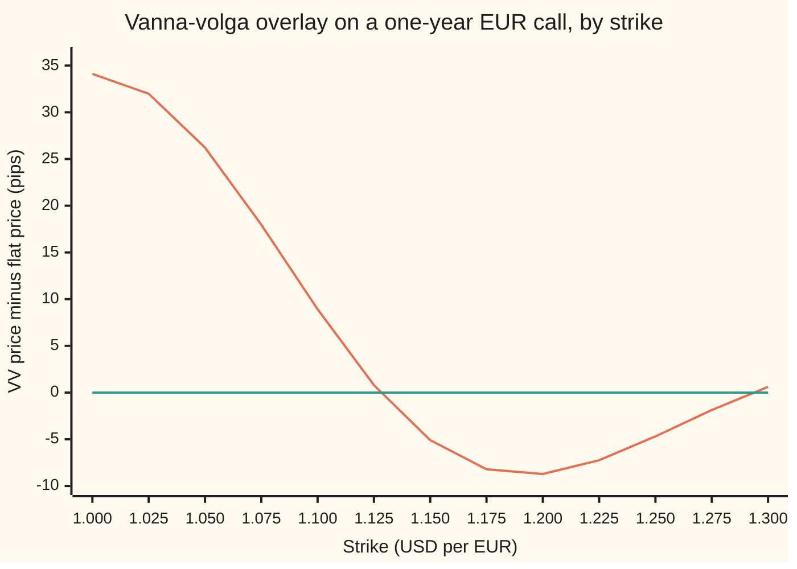
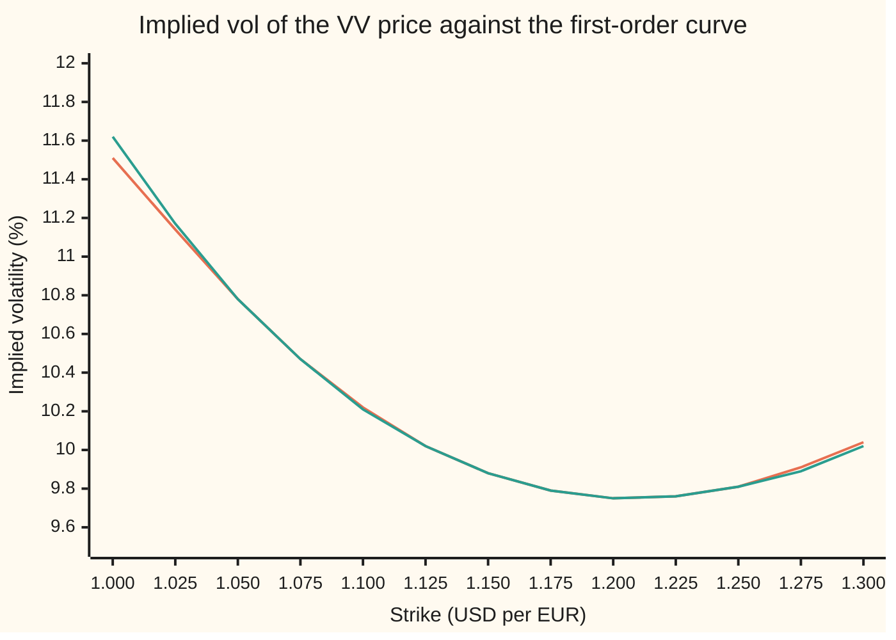

# Vanna-volga pricing: charge for the three vol risks Black-Scholes cannot see, using the three quotes the market gives you

[Syllabus](../../../SYLLABUS.md) → [Financial mathematics](../../../SYLLABUS.md#w12) → [The FX smile - risk reversals, butterflies and vanna-volga](../../../SYLLABUS.md#w12-s22) → Vanna-volga pricing

---

## General Overview

EURUSD trades at 1.1000: one euro costs 1.10 US dollars. Dollar cash earns 5 percent a year, euro cash 3 percent. A client asks a bank for a one-year EUR call struck at 1.15: the right to buy euros at 1.15 dollars each in a year. The contract is on 10 million euros.

The option desk's screen does not show one volatility for this pair. It shows three quotes, each a volatility: the jumpiness figure that, fed into the currency version of Black-Scholes (Garman-Kohlhagen), returns a traded price. At-the-money (ATM) trades at 10.00 percent. The 25-delta put, a strike well below the market, trades at 10.75 percent. The 25-delta call, a strike well above, trades at 9.75 percent. These three strikes are the **pillars**: 1.052466, 1.127847 and 1.201425. The client's 1.15 sits between the second and the third, and no quote covers it.

Garman-Kohlhagen has room for one volatility. Priced at the flat 10 percent, the 1.15 call costs 311.65 pips, where a **pip** is 0.0001 dollars per euro: 311,647.34 dollars on the contract. That figure ignores what the three quotes say. The method on this card corrects it. It builds a small basket of the three pillar options that carries the same exposure to volatility as the 1.15 call, in three senses. It then asks what that basket costs at the market's three volatilities and what it costs at the flat 10 percent. The difference is added to the flat price. The result here is 306.55 pips, or 306,552.66 dollars: 5.09 pips below the flat price.

The three senses are the three Greeks named in the method: **vega**, how much the price moves when volatility moves; **vanna**, how much vega moves when the exchange rate moves; **volga**, how much vega moves when volatility itself moves. A flat-volatility model treats volatility as fixed, so it prices none of the three. The market prices all three, through the three quotes.

**Vanna-volga price = flat-vol price + (what the market charges for a basket of the three quoted options with the target's vega, vanna and volga) − (what the flat model charges for the same basket).**

**What kind of fact this is:** a method: a desk recipe resting on a second-order hedging argument, not a model of how volatility moves. Two parts of it are theorems, proved in Why it works: it returns each pillar's market price exactly, and for a vanilla target its hedge weights have a closed form.

### The picture: the correction across strikes

The overlay, VV price minus flat price, for a one-year EUR call at each strike from 1.00 to 1.30.



Orange: the overlay in pips. Green: zero. Low strikes carry a large positive overlay, because the put pillar trades above 10 percent. Near the ATM pillar the overlay is close to zero; near the call pillar it approaches that pillar's own gap. The client's 1.15 lands at −5.09.

---

## The formula

$$O^{\text{VV}} = O^{\text{BS}}(\sigma_{\text{ATM}}) + \sum_{i=1}^{3} x_i\,\big[C_i^{\text{mkt}} - C_i^{\text{BS}}\big], \qquad A\,x = g$$

**Read it aloud: the flat price, plus, for each of the three quoted options, how much of it the hedge holds times how much dearer the market sells it than the flat model does; the amounts are the ones that give the hedge the target's vega, vanna and volga.**

Written out, the system $A\,x = g$ is three equations in three unknowns: row one says the basket's vega equals the target's, row two its vanna, row three its volga. Every Greek is taken at the flat volatility.

$$\begin{pmatrix} \mathcal{V}_1 & \mathcal{V}_2 & \mathcal{V}_3\\ \mathrm{Va}_1 & \mathrm{Va}_2 & \mathrm{Va}_3\\ \mathrm{Vo}_1 & \mathrm{Vo}_2 & \mathrm{Vo}_3 \end{pmatrix} \begin{pmatrix} x_1\\ x_2\\ x_3 \end{pmatrix} = \begin{pmatrix} \mathcal{V}_O\\ \mathrm{Va}_O\\ \mathrm{Vo}_O \end{pmatrix}$$

| Symbol | Plain meaning | In our example | Push it up and the VV price… |
| --- | --- | --- | --- |
| $O^{\text{BS}}$, $O^{\text{VV}}$ | the target's price: flat at the ATM vol, then with the overlay | 311.65 and 306.55 pips | moves one for one |
| $K$, $K_i$ | the target's strike; the three pillar strikes, $i = 1, 2, 3$ | 1.15; 1.052466, 1.127847, 1.201425 | a higher $K$ lowers the price |
| $S$, $F$ | spot, dollars per euro today; the one-year forward, $F = S e^{(r_d - r_f)T}$ | 1.10; 1.122221 | raises the call's price |
| $r_d$, $r_f$, $T$ | dollar rate, euro rate, both continuously compounded; years to expiry | 5%, 3%, 1 | — |
| $\sigma_i$, $\sigma_1$, $\sigma_2$, $\sigma_3$, $\sigma_{\text{ATM}}$ | the pillars' market vols; the flat vol, which equals the ATM pillar's | 10.75%, 10.00%, 9.75% | a higher $\sigma_1$ raises low-strike prices most |
| $C_i^{\text{mkt}}$, $C_i^{\text{BS}}$, $\Delta p_i$ | each pillar as a call, priced at its own vol and at the flat vol; the gap between the two | 851.76, 400.54, 153.90 against 826.26, 400.54, 162.57; gaps +25.51, 0.00, −8.67 pips | a bigger gap adds its weight times the push |
| $x_i$ | how many euros of each pillar the hedge holds per euro of target | −0.115838, 0.870240, 0.246905 | — |
| $\mathcal{V}$, $\mathrm{Va}$, $\mathrm{Vo}$, $\Theta$, $\Delta$, $\Gamma$, $dS$ | vega, vanna, volga, per 1.00 of vol, subscript O for the target; theta, delta, gamma; a small move in spot | target: 0.417886, 1.118861, 0.239402 | — |
| $A$, $g$ | the 3×3 table of pillar Greeks; the target's Greek column | $\det A$ = 2.619639 | — |
| $y_j$, $y_1$, $y_2$, $y_3$ | the market price of one unit of vega, of vanna, of volga | 0.00078397, −0.00086237, 0.00053379 | — |
| $d_1$, $d_2$, $\varphi$, $N$ | the Black-Scholes distances; bell-curve height and area | as on the Garman-Kohlhagen card | — |
| $\ell_i$, $\ell_1$, $\ell_2$, $\ell_3$, $z_i$ | the three weights that fit a parabola in log-strike through the pillars; $z_i = \ln K_i$ | 1.15 sits between pillars 2 and 3 | — |

The three Greeks of a call, from [Vanna and volga](03-vanna-and-volga-on-the-smile.md), one line each:

$$\mathcal{V} = S e^{-r_f T}\varphi(d_1)\sqrt{T}, \qquad \mathrm{Va} = -\,\frac{\mathcal{V}\,d_2}{S\,\sigma\sqrt{T}}, \qquad \mathrm{Vo} = \frac{\mathcal{V}\,d_1 d_2}{\sigma}$$

Vega is largest near the money. Vanna has the sign of $-d_2$: positive wherever $d_2 < 0$, which covers the ATM pillar, the call pillar and the 1.15 target; there a rising euro brings the option toward the money and lifts its vega. Volga carries the factor $d_1 d_2$, so it vanishes where $d_1 = 0$, which is the ATM pillar's defining property.

**Conventions verified 2026-09-27:** spot delta with the premium paid in dollars, ATM as the delta-neutral straddle, butterfly read as a smile strangle, risk reversal as call vol minus put vol. These are the house conventions fixed on [Strike from delta](../21-FX%20vanilla%20options%20-%20Garman-Kohlhagen%20and%20the%20desk%20conventions/06-fx-strike-from-delta.md) and [Risk reversal and butterfly](01-risk-reversal-and-butterfly.md); the checks reproduce the house pillar strikes to six decimals. Many pairs quote a broker butterfly instead, which needs the conversion on [The broker butterfly](02-market-strangle-and-smile-strangle.md) first.

### When it holds

- **Volatility moves only a little over the hedge's life.** The argument matches three terms of a Taylor expansion (a polynomial approximation). A large vol move brings in third-order terms nobody hedged, and the price is off by roughly those terms.
- **The three pillars are genuinely different options.** The system needs $\det A \neq 0$. If two pillar strikes merge, two columns of $A$ coincide, the determinant is zero, and the weights do not exist. Here it is 2.619639.
- **The target sits between or near the pillars.** Outside the 25-delta strikes the overlay extrapolates a curve through three points, and nothing holds it down: at 1.50 it is +1.65 pips on a flat price of 0.66. Nothing in the method rules out arbitrage between strikes.
- **The Greeks are taken at the flat vol.** Taking each pillar's Greeks at its own market vol loses the exact fit to the pillars (see What breaks).
- **The target's risk is vol risk of the kind a vanilla has.** For a barrier that can knock out tomorrow, a hedge sized today overstates the vol risk still alive; desks shrink the overlay for that, on [Barriers on a smile](../23-FX%20exotics%20as%20desks%20use%20them%20-%20digitals%2C%20touches%20and%20barriers/07-barriers-with-the-smile.md).

---

## Why it works

### Step 0: price what the model gets wrong by hedging it away

A flat-vol model is wrong about one thing: it thinks volatility never moves. Its error on the target comes from exposure to moving volatility. Build a basket of the three quoted options with the same exposure. Hold the target and sell the basket. The combination has no exposure to moving volatility, to the order the method tracks, so the flat model has nothing left to misprice on it. Its model price is taken as its market price. The basket's market price can be read off the screen. Subtraction then gives the target's market price.

### Step 1: name the three risks

Over a short interval, let the exchange rate move by $dS$ and the volatility by $d\sigma$. Expand the target's price change to second order (a Taylor expansion, which keeps first and second powers of the small moves):

$$dO \approx \Theta\,dt + \Delta\,dS + \tfrac12\Gamma\,dS^2 + \mathcal{V}\,d\sigma + \mathrm{Va}\,dS\,d\sigma + \tfrac12\mathrm{Vo}\,d\sigma^2$$

Here $\Theta$ (theta) is decay with time, $\Delta$ (delta) and $\Gamma$ (gamma) are the first and second sensitivities to the exchange rate. The first three terms are the ones Black-Scholes already balances: the delta hedge removes $\Delta\,dS$, and theta pays for gamma. The last three involve $d\sigma$. In a flat-vol world $d\sigma = 0$ and they vanish, so the flat model charges nothing for them. Those three are the risks it cannot see: vega, vanna, volga.

### Step 2: build the hedge by solving three equations

The basket holds $x_1, x_2, x_3$ euros of the three pillar calls. Its vega is $x_1\mathcal{V}_1 + x_2\mathcal{V}_2 + x_3\mathcal{V}_3$, and the same for vanna and volga. Setting each equal to the target's gives $A\,x = g$.

A 3×3 system has exactly one solution when its determinant is not zero ([Determinants](../../03-Algebra/05-Solving%20Systems/04-determinants.md)). Here $\det A = 2.619639$. The Python check finds $x$ by elimination ([Gaussian elimination](../../03-Algebra/05-Solving%20Systems/02-gaussian-elimination.md)); the Rust check by Cramer's rule, a ratio of determinants. Both give −0.115838, 0.870240, 0.246905: sell a little of the put pillar, buy most of an ATM, buy a quarter of the call pillar.

### Step 3: charge the hedge's market-minus-model cost

The hedged book is target minus basket. Step 0 says the flat model prices it right, so with $O^{\text{mkt}}$ the target's market price:

$$O^{\text{mkt}} - \sum_i x_i C_i^{\text{mkt}} = O^{\text{BS}} - \sum_i x_i C_i^{\text{BS}}$$

Move the basket to the right-hand side and this is the formula. For the 1.15 call the three terms $x_i\,\Delta p_i$ are −2.95, 0.00 and −2.14 pips. The middle one is zero because the ATM pillar trades at the flat vol, so its gap is zero. The overlay is −5.09 pips.

### Step 4: the three pillars come back exactly

Feed the method one of its own pillars, say pillar 1. Its Greek column $g$ is the first column of $A$. The unique solution is $x = (1, 0, 0)$: hold one of itself. The formula returns $C_1^{\text{BS}} + (C_1^{\text{mkt}} - C_1^{\text{BS}}) = C_1^{\text{mkt}}$. The same holds for pillars 2 and 3. The checks price all three this way and get 851.76, 400.54 and 153.90 pips, the market prices, to twelve decimals. This is a theorem, with no approximation in it, and it is the first test of any implementation.

### Step 5: read the overlay as three market prices of risk

The overlay is $x \cdot \Delta p$, the sum of $x_i\,\Delta p_i$. Since $x = A^{-1} g$ ([The inverse matrix](../../03-Algebra/05-Solving%20Systems/03-inverse-matrix.md)), regroup the same sum around $g$:

$$\sum_i x_i\,\Delta p_i = \sum_j g_j\,y_j, \qquad \text{where } A^{\mathsf T} y = \Delta p$$

$A^{\mathsf T}$ is $A$ with rows and columns swapped. The three numbers $y_j$ do not depend on the target. They are fixed by the three quotes: $y_1$ is what the market charges, above the flat model, for one unit of vega; $y_2$ for one unit of vanna; $y_3$ for one unit of volga. Any target's overlay is then its own three Greeks times those three prices.

```
charge for each risk, 1.15 EUR call, pips (one █ = 0.5 pip)
vega    +   ███████                    +3.28
vanna   −   ███████████████████        -9.65
volga   +   ███                        +1.28
total                                  -5.09
```

The vanna charge dominates. The risk reversal is negative: the 25-delta put trades above the 25-delta call. The market therefore pays less, relative to the flat model, for options whose vega grows as the euro rises. The 1.15 call is exactly such an option, with vanna 1.118861. Volga is priced positive, because the butterfly is positive: options away from the money cost more than the flat model says. The call's volga is small and adds 1.28 pips. The vega price is positive although the ATM gap is zero: the ATM pillar carries vanna, which is priced negative, and its zero gap forces the vega price to offset that vanna exactly.

### Step 6: the closed form for a vanilla target

For a vanilla call at strike $K$ the weights need no solve. With $z = \ln K$ and $z_i = \ln K_i$, let $\ell_i$ be the three weights that fit a curve $a + bz + cz^2$ through three points (Lagrange weights):

$$x_i = \frac{\mathcal{V}(K)}{\mathcal{V}(K_i)}\,\ell_i(z), \qquad \ell_1(z) = \frac{(z - z_2)(z - z_3)}{(z_1 - z_2)(z_1 - z_3)}$$

and $\ell_2$, $\ell_3$ by cycling the indices. The checks compute both and they agree to ten decimals.

<details>
<summary>Detailed proof</summary>

Substitute the proposed $x_i$ into each row of $A\,x = g$.

**Vega row.** $\sum_i x_i\mathcal{V}_i = \mathcal{V}(K)\sum_i \ell_i(z)$. Lagrange weights reproduce any curve of degree at most two through the three points; the constant 1 is one, so $\sum_i \ell_i = 1$. The row holds.

**Vanna row.** $\mathrm{Va} = -\mathcal{V}\,d_2/(S\sigma\sqrt{T})$, and every factor except $\mathcal{V}$ and $d_2$ is the same for all strikes at the flat vol. So the row reads $\sum_i \ell_i(z)\,d_2(z_i) = d_2(z)$. Now $d_2 = (\ln S - z + (r_d - r_f - \tfrac12\sigma^2)T)/(\sigma\sqrt{T})$ is a straight line in $z$, degree one. The weights reproduce it. The row holds.

**Volga row.** $\mathrm{Vo} = \mathcal{V}\,d_1 d_2/\sigma$. The row reads $\sum_i \ell_i(z)\,d_1(z_i)d_2(z_i) = d_1(z)d_2(z)$. Both $d_1$ and $d_2$ are straight lines in $z$, so their product is degree two. The weights reproduce it. The row holds.

All three rows hold, and $\det A \neq 0$ makes the solution unique, so these are the weights. The proof used only that vega, vanna and volga are vega times 1, a line in $\ln K$, and a quadratic in $\ln K$. A target whose Greeks lack that shape, such as a digital, needs the full solve.

</details>

### Step 7: the implied vol it produces, to first order

Each gap is, to first order, vega times the vol difference: $\Delta p_i \approx \mathcal{V}_i(\sigma_i - \sigma_{\text{ATM}})$. Put that and the Step 6 weights into the overlay: $\sum_i x_i\Delta p_i \approx \mathcal{V}(K)\sum_i \ell_i(z)(\sigma_i - \sigma_{\text{ATM}})$. A call priced at vol $\sigma(K)$ is, to first order, $O^{\text{BS}} + \mathcal{V}(K)(\sigma(K) - \sigma_{\text{ATM}})$. Equate and cancel vega:

$$\sigma(K) \approx \sum_i \ell_i(\ln K)\,\sigma_i$$

a parabola in log-strike through the three quotes. At 1.15 it gives 9.8788 percent. A call's price rises strictly with vol, from its floor $\max(Se^{-r_fT} - Ke^{-r_dT}, 0)$ toward $Se^{-r_fT}$, so any price strictly between has exactly one implied vol. Bisection finds it for 306.55 pips: 9.8780 percent. The gap is 0.0743 basis points of vol, where a basis point is 0.01 percentage point. The next card, [The vanna-volga smile](05-vanna-volga-smile-curve.md), builds this curve properly, with its second-order correction.



Orange: the vol implied by the vanna-volga price. Green: the first-order parabola. Between the pillars the two cannot be told apart at two decimals. At 1.00, beyond the put pillar, they part by a tenth of a vol point: the first-order step is losing its grip.

---

## Worked numbers, by hand

EURUSD: $S = 1.10$, $r_d = 5\%$, $r_f = 3\%$, $T = 1$; ATM 10.00%, risk reversal −1.00%, butterfly +0.25%. Target: EUR call at $K = 1.15$. Prices in pips, 0.0001 dollars per euro.

| Step | Arithmetic | Value |
| --- | --- | --- |
| forward $F$ | $1.10 \times e^{0.05 - 0.03}$ | 1.122221 |
| pillar vols | $10 + 0.25 + 0.5$, $10$, $10 + 0.25 - 0.5$ | 10.75%, 10.00%, 9.75% |
| pillar strikes | from delta, [Strike from delta](../21-FX%20vanilla%20options%20-%20Garman-Kohlhagen%20and%20the%20desk%20conventions/06-fx-strike-from-delta.md) | 1.052466, 1.127847, 1.201425 |
| pillars at market vols | Garman-Kohlhagen, each at its own vol | 851.76, 400.54, 153.90 |
| pillars at 10% | Garman-Kohlhagen, all at 10% | 826.26, 400.54, 162.57 |
| gaps $\Delta p_i$ | market minus flat | +25.51, 0.00, −8.67 |
| target Greeks $g$ | vega, vanna, volga at 10% | 0.417886, 1.118861, 0.239402 |
| weights $x$ | solve $A\,x = g$ | −0.115838, 0.870240, 0.246905 |
| $x_i\,\Delta p_i$ | $-0.115838 \times 25.51$; $0$; $0.246905 \times (-8.67)$ | −2.95, 0.00, −2.14 |
| overlay | $-2.95 + 0 - 2.14$ | −5.09 |
| flat price $O^{\text{BS}}$ | Garman-Kohlhagen at 10% | 311.65 |
| **VV price** | $311.647 - 5.095$, unrounded | **306.55** |
| on 10 million euros | price in dollars per euro, times 10,000,000 | 306,552.66 dollars |
| its implied vol | bisection on the price | 9.8780% |

The pillar matrix $A$, one row per Greek, one column per pillar, all at 10 percent:

| | put pillar 1.052466 | ATM 1.127847 | call pillar 1.201425 | target 1.15 |
| --- | --- | --- | --- | --- |
| vega | 0.335249 | 0.425867 | 0.348774 | 0.417886 |
| vanna | −1.803464 | 0.387152 | 2.320882 | 1.118861 |
| volga | 1.372286 | −0.000000 | 1.613435 | 0.239402 |

The ATM pillar's volga prints as zero: its strike is where $d_1 = 0$. The bank quotes 306,552.66 dollars, not 311,647.34: the negative risk reversal makes calls above the forward cheaper than a flat 10 percent says.

### What breaks if you drop a piece

Correct answer 306.55 pips.

| Mistake | Comes out at | What went wrong |
| --- | --- | --- |
| Price at the smile vol 9.8788%, then add the overlay | 301.49 pips | The smile was counted twice. The flat term takes the ATM vol and nothing else. |
| Hedge vega only, with the ATM pillar | 311.65 pips | The ATM gap is zero, so no correction at all. Vega alone cannot see the tilt or the curvature. |
| Greeks taken at each pillar's own vol | 306.17 pips; pillar 1 comes back at 855.35, not 851.76 | Exactness on the pillars is lost: $g$ for a pillar is no longer a column of $A$. |
| Risk reversal read as put minus call | 318.30 pips | Put and call vols swap to 9.75% and 10.75%; the tilt runs the wrong way. |

---

## Code, from first principles, and it actually runs

The scripts rebuild the pillars from the three quotes, then reach the price by independent roads: weights by elimination (Python) or Cramer's rule (Rust), and again by the closed form of Step 6; the overlay again as Greeks times prices of risk; the flat price again by Simpson's rule (summing thin slices under the curve); the Greeks again by nudging the price; the pillars priced back through the method; the implied vol against the first-order curve. Python builds the bell-curve area from its Taylor series, Rust from thin slices. Seven asserts; three deliberate breaks (vanna's sign flipped, volga's $d_1 d_2$ made $d_1^2$, the ATM strike moved) each tripped one.

### Python

```python
# Vanna-volga pricing -- the check behind the card.  Standard library only.
# House FX market: EURUSD spot 1.10, USD rate 5%, EUR rate 3%, one year; ATM 10%,
# 25-delta risk reversal -1%, 25-delta butterfly +0.25%.  Target: EUR call at 1.15.
# Normal CDF from its Taylor series; strikes and vols by bisection; weights by
# Gaussian elimination AND by a closed form; prices of risk by Cramer's rule.
from math import log, sqrt, exp, pi

S, RD, RF, T = 1.10, 0.05, 0.03, 1.0
ATM, RR, BF, KT = 0.10, -0.01, 0.0025, 1.15

def phi(x): return exp(-0.5 * x * x) / sqrt(2 * pi)            # bell-curve height
def N(x):                                                        # bell-curve area, by series
    if abs(x) > 8: return 0.0 if x < 0 else 1.0
    term = s = x; n = 0
    while abs(term) > 1e-17:
        n += 1; term *= x * x / (2 * n + 1); s += term
    return 0.5 + phi(x) * s
def bisect(f, target, lo, hi):                                   # f increasing
    for _ in range(200):
        mid = 0.5 * (lo + hi)
        lo, hi = (mid, hi) if f(mid) < target else (lo, mid)
    return 0.5 * (lo + hi)

F = S * exp((RD - RF) * T)
def d12(K, v, s=S):
    d1 = (log(s / K) + (RD - RF + 0.5 * v * v) * T) / (v * sqrt(T))
    return d1, d1 - v * sqrt(T)
def call(K, v, s=S):                                             # Garman-Kohlhagen, USD per EUR
    d1, d2 = d12(K, v, s)
    return s * exp(-RF * T) * N(d1) - K * exp(-RD * T) * N(d2)
def vega(K, v):  d1, d2 = d12(K, v); return S * exp(-RF * T) * phi(d1) * sqrt(T)
def vanna(K, v): d1, d2 = d12(K, v); return -exp(-RF * T) * phi(d1) * d2 / v
def volga(K, v): d1, d2 = d12(K, v); return vega(K, v) * d1 * d2 / v
def greeks(K): return [vega(K, ATM), vanna(K, ATM), volga(K, ATM)]

def pillars(atm, rr, bf):                                        # quotes -> three vols, three strikes
    vols = [atm + bf - rr / 2, atm, atm + bf + rr / 2]
    d1 = bisect(N, 0.25 * exp(RF * T), -10, 10)                  # N(d1) = 0.25 e^{rf T}
    ks = [F * exp(d1 * vols[0] * sqrt(T) + 0.5 * vols[0] ** 2 * T), F * exp(0.5 * atm * atm * T),
          F * exp(-d1 * vols[2] * sqrt(T) + 0.5 * vols[2] ** 2 * T)]
    return ks, vols

def gauss(A, b):                                                 # Gaussian elimination, partial pivots
    M = [A[i][:] + [b[i]] for i in range(3)]
    for c in range(3):
        p = max(range(c, 3), key=lambda r: abs(M[r][c])); M[c], M[p] = M[p], M[c]
        for r in range(c + 1, 3):
            f = M[r][c] / M[c][c]
            M[r] = [M[r][j] - f * M[c][j] for j in range(4)]
    x = [0.0] * 3
    for r in (2, 1, 0): x[r] = (M[r][3] - sum(M[r][j] * x[j] for j in range(r + 1, 3))) / M[r][r]
    return x
def det3(m): return (m[0][0] * (m[1][1] * m[2][2] - m[1][2] * m[2][1]) - m[0][1] * (m[1][0] * m[2][2]
                     - m[1][2] * m[2][0]) + m[0][2] * (m[1][0] * m[2][1] - m[1][1] * m[2][0]))
def cramer(A, b): return [det3([[b[r] if j == c else A[r][j] for j in range(3)] for r in range(3)]) / det3(A) for c in range(3)]

def vv(K, ks, vols, at_mkt=False):                               # flat price + market cost of the hedge
    A = [[g(k, v if at_mkt else ATM) for k, v in zip(ks, vols)] for g in (vega, vanna, volga)]
    x = gauss(A, greeks(K))
    gaps = [call(k, v) - call(k, ATM) for k, v in zip(ks, vols)]
    return call(K, ATM) + sum(xi * gi for xi, gi in zip(x, gaps)), x, gaps, A
def lagrange(K, ks):                                             # weights of a quadratic in ln K
    z, L = log(K), [log(k) for k in ks]
    return [(z - L[j]) * (z - L[k]) / ((L[i] - L[j]) * (L[i] - L[k])) for i, j, k in ((0, 1, 2), (1, 0, 2), (2, 0, 1))]
def first_order(K, ks, vols): return sum(w * v for w, v in zip(lagrange(K, ks), vols))
def iv(p, K): return bisect(lambda v: call(K, v), p, 0.001, 1.0)

ks, vols = pillars(ATM, RR, BF)
price, x, gaps, A = vv(KT, ks, vols)
flat = call(KT, ATM); g = greeks(KT)
x_cf = [vega(KT, ATM) / vega(k, ATM) * w for k, w in zip(ks, lagrange(KT, ks))]    # road 2: closed form
y = cramer([[A[r][c] for r in range(3)] for c in range(3)], gaps)               # A^T y = gaps
charges = [gi * yi for gi, yi in zip(g, y)]
n, b = 4000, 10.0                                                # road 3: flat price by Simpson,
a = (log(KT / S) - (RD - RF - 0.5 * ATM * ATM) * T) / (ATM * sqrt(T))   # from the kink upward
f = lambda z: (S * exp((RD - RF - 0.5 * ATM * ATM) * T + ATM * sqrt(T) * z) - KT) * phi(z)
flat_int = exp(-RD * T) * (b - a) / n / 3 * sum((1 if i in (0, n) else 4 if i % 2 else 2) * f(a + i * (b - a) / n) for i in range(n + 1))
h = 1e-4                                                         # Greeks of the target by bumping the price
bump = [(call(KT, ATM + h) - call(KT, ATM - h)) / (2 * h),
        (call(KT, ATM + h, S + h) - call(KT, ATM - h, S + h) - call(KT, ATM + h, S - h) + call(KT, ATM - h, S - h)) / (4 * h * h),
        (call(KT, ATM + h) - 2 * flat + call(KT, ATM - h)) / (h * h)]
iv_vv, iv_1 = iv(price, KT), first_order(KT, ks, vols)
back = [vv(k, ks, vols) for k in ks]                             # each pillar priced by the method itself
ks_f, vols_f = pillars(ATM, -RR, BF)                             # risk reversal read with the wrong sign

P = lambda v: f"{v * 1e4:.2f}"                                   # USD per EUR -> pips
print(f"forward F {F:.6f}   det A {det3(A):.6f}")
for i, nm in enumerate(("25d put ", "ATM     ", "25d call")):
    print(f"pillar {i+1} {nm}  K {ks[i]:.6f}  vol {vols[i]*100:.2f}%  mkt {P(call(ks[i], vols[i]))}  flat {P(call(ks[i], ATM))}  gap {P(gaps[i])}")
for r, nm in enumerate(("vega ", "vanna", "volga")):
    print(f"A {nm} " + " ".join(f"{v:10.6f}" for v in A[r]) + f"   target {g[r]:10.6f}  bumped {bump[r]:10.6f}")
print("weights, Gaussian elimination " + " ".join(f"{v:.6f}" for v in x))
print("weights, closed form          " + " ".join(f"{v:.6f}" for v in x_cf))
print("x_i times gap (pips)          " + " ".join(P(xi * gi) for xi, gi in zip(x, gaps)))
print("price of one unit, y_j        " + " ".join(f"{v:.8f}" for v in y))
print("charge g_j y_j (pips)         " + " ".join(P(c) for c in charges))
print(f"flat price at 10%   {P(flat)} pips   by Simpson {P(flat_int)} pips")
print(f"overlay, weights    {P(price - flat)} pips   by prices of risk {P(sum(charges))} pips")
print(f"vanna-volga price   {P(price)} pips  = USD {price * 1e7:,.2f} on EUR 10 million (flat USD {flat * 1e7:,.2f})")
print(f"implied vol of it   {iv_vv*100:.4f}%   first-order smile {iv_1*100:.4f}%   gap {(iv_vv-iv_1)*1e4:.4f} bp")
print("pillars back, pips            " + " ".join(P(p[0]) for p in back))
print(f"wrong: smile vol + overlay     {P(call(KT, iv_1) + price - flat)}")
print(f"wrong: ATM vega hedge only     {P(flat + vega(KT, ATM) / vega(ks[1], ATM) * gaps[1])}")
print(f"wrong: Greeks at pillar vols   {P(vv(KT, ks, vols, True)[0])}   pillar 1 back {P(vv(ks[0], ks, vols, True)[0])}")
print(f"wrong: risk reversal flipped   {P(vv(KT, ks_f, vols_f)[0])}")
print(f"try: K = 1.20                  {P(vv(1.20, ks, vols)[0] - call(1.20, ATM))} overlay")
print(f"try: K = 1.50                  {P(vv(1.50, ks, vols)[0] - call(1.50, ATM))} overlay on flat {P(call(1.50, ATM))}")
print(f"try: butterfly 0               {P(vv(KT, *pillars(ATM, RR, 0.0))[0] - flat)} overlay")
print(f"try: risk reversal 0           {P(vv(KT, *pillars(ATM, 0.0, BF))[0] - flat)} overlay")
grid = [1.00 + 0.025 * i for i in range(13)]
print("chart strike " + " ".join(f"{k:6.3f}" for k in grid))
print("chart overlay pips " + " ".join(P(vv(k, ks, vols)[0] - call(k, ATM)) for k in grid))
print("chart vv vol % " + " ".join(f"{iv(vv(k, ks, vols)[0], k)*100:.2f}" for k in grid))
print("chart 1st-order % " + " ".join(f"{first_order(k, ks, vols)*100:.2f}" for k in grid))

house = [1.052466, 1.127847, 1.201425]
assert all(abs(k - hk) < 5e-7 for k, hk in zip(ks, house)), "pillar strikes must match the house market"
assert all(abs(u - w) < 1e-10 for u, w in zip(x, x_cf)), "elimination and closed-form weights agree"
assert all(abs(p[0] - call(k, v)) < 1e-12 for p, k, v in zip(back, ks, vols)), "pillars priced back exactly"
assert abs((price - flat) - sum(charges)) < 1e-12, "weights road and prices-of-risk road agree"
assert abs(flat_int - flat) < 1e-9, "Simpson flat price equals the formula"
assert all(abs(u - w) < 1e-5 * max(1, abs(w)) for u, w in zip(bump, g)), "bumped Greeks equal closed forms"
assert abs(iv_vv - iv_1) < 1e-4, "implied vol within one basis point of the first-order smile"
print("ALL CHECKS PASS")
```

**Ran 2026-09-27 on macOS, Python 3.14.6, standard library only. All checks passed. Output, pasted from the run:**

```
forward F 1.122221   det A 2.619639
pillar 1 25d put   K 1.052466  vol 10.75%  mkt 851.76  flat 826.26  gap 25.51
pillar 2 ATM       K 1.127847  vol 10.00%  mkt 400.54  flat 400.54  gap 0.00
pillar 3 25d call  K 1.201425  vol 9.75%  mkt 153.90  flat 162.57  gap -8.67
A vega    0.335249   0.425867   0.348774   target   0.417886  bumped   0.417886
A vanna  -1.803464   0.387152   2.320882   target   1.118861  bumped   1.118862
A volga   1.372286  -0.000000   1.613435   target   0.239402  bumped   0.239402
weights, Gaussian elimination -0.115838 0.870240 0.246905
weights, closed form          -0.115838 0.870240 0.246905
x_i times gap (pips)          -2.95 0.00 -2.14
price of one unit, y_j        0.00078397 -0.00086237 0.00053379
charge g_j y_j (pips)         3.28 -9.65 1.28
flat price at 10%   311.65 pips   by Simpson 311.65 pips
overlay, weights    -5.09 pips   by prices of risk -5.09 pips
vanna-volga price   306.55 pips  = USD 306,552.66 on EUR 10 million (flat USD 311,647.34)
implied vol of it   9.8780%   first-order smile 9.8788%   gap -0.0743 bp
pillars back, pips            851.76 400.54 153.90
wrong: smile vol + overlay     301.49
wrong: ATM vega hedge only     311.65
wrong: Greeks at pillar vols   306.17   pillar 1 back 855.35
wrong: risk reversal flipped   318.30
try: K = 1.20                  -8.71 overlay
try: K = 1.50                  1.65 overlay on flat 0.66
try: butterfly 0               -6.39 overlay
try: risk reversal 0           0.87 overlay
chart strike  1.000  1.025  1.050  1.075  1.100  1.125  1.150  1.175  1.200  1.225  1.250  1.275  1.300
chart overlay pips 34.11 31.99 26.23 17.97 8.92 0.80 -5.09 -8.21 -8.71 -7.24 -4.69 -1.87 0.61
chart vv vol % 11.51 11.14 10.78 10.47 10.22 10.02 9.88 9.79 9.75 9.76 9.81 9.91 10.04
chart 1st-order % 11.62 11.17 10.78 10.47 10.21 10.02 9.88 9.79 9.75 9.76 9.81 9.89 10.02
ALL CHECKS PASS
```

### Rust

```rust
// Vanna-volga pricing -- the same check as vanna_volga_pricing_check.py, in Rust.  std only.
// House FX market: EURUSD spot 1.10, USD rate 5%, EUR rate 3%, one year; ATM 10%,
// 25-delta risk reversal -1%, 25-delta butterfly +0.25%.  Target: EUR call at 1.15.
// Different roads from the Python: the normal CDF adds thin slices under the curve,
// the weights come from Cramer's rule, the prices of risk from Gaussian elimination.
use std::f64::consts::PI;
const S: f64 = 1.10; const RD: f64 = 0.05; const RF: f64 = 0.03; const T: f64 = 1.0;
const ATM: f64 = 0.10; const RR: f64 = -0.01; const BF: f64 = 0.0025; const KT: f64 = 1.15;
type M3 = [[f64; 3]; 3];

fn phi(x: f64) -> f64 { (-0.5 * x * x).exp() / (2.0 * PI).sqrt() }
fn simpson<G: Fn(f64) -> f64>(f: G, a: f64, b: f64, n: usize) -> f64 {
    let h = (b - a) / n as f64;
    let mut s = f(a) + f(b);
    for i in 1..n { s += if i % 2 == 1 { 4.0 } else { 2.0 } * f(a + i as f64 * h); }
    s * h / 3.0
}
fn ncdf(x: f64) -> f64 { if x.abs() > 8.0 { if x < 0.0 { 0.0 } else { 1.0 } } else { 0.5 + simpson(phi, 0.0, x, 2000) } }
fn bisect<G: Fn(f64) -> f64>(f: G, target: f64, mut lo: f64, mut hi: f64) -> f64 {
    for _ in 0..200 { let m = 0.5 * (lo + hi); if f(m) < target { lo = m } else { hi = m } }
    0.5 * (lo + hi)
}
fn fwd() -> f64 { S * ((RD - RF) * T).exp() }
fn d12(k: f64, v: f64, s: f64) -> (f64, f64) {
    let d1 = ((s / k).ln() + (RD - RF + 0.5 * v * v) * T) / (v * T.sqrt()); (d1, d1 - v * T.sqrt())
}
fn call_s(k: f64, v: f64, s: f64) -> f64 { let (d1, d2) = d12(k, v, s); s * (-RF * T).exp() * ncdf(d1) - k * (-RD * T).exp() * ncdf(d2) }
fn call(k: f64, v: f64) -> f64 { call_s(k, v, S) }
fn vega(k: f64, v: f64) -> f64 { let (d1, _) = d12(k, v, S); S * (-RF * T).exp() * phi(d1) * T.sqrt() }
fn vanna(k: f64, v: f64) -> f64 { let (d1, d2) = d12(k, v, S); -(-RF * T).exp() * phi(d1) * d2 / v }
fn volga(k: f64, v: f64) -> f64 { let (d1, d2) = d12(k, v, S); vega(k, v) * d1 * d2 / v }
fn greeks(k: f64) -> [f64; 3] { [vega(k, ATM), vanna(k, ATM), volga(k, ATM)] }
fn pillars(atm: f64, rr: f64, bf: f64) -> ([f64; 3], [f64; 3]) {
    let v = [atm + bf - rr / 2.0, atm, atm + bf + rr / 2.0];
    let d1 = bisect(ncdf, 0.25 * (RF * T).exp(), -10.0, 10.0);
    let f = fwd();
    ([f * (d1 * v[0] * T.sqrt() + 0.5 * v[0] * v[0] * T).exp(), f * (0.5 * atm * atm * T).exp(),
      f * (-d1 * v[2] * T.sqrt() + 0.5 * v[2] * v[2] * T).exp()], v)
}
fn det3(m: &M3) -> f64 {
    m[0][0] * (m[1][1] * m[2][2] - m[1][2] * m[2][1]) - m[0][1] * (m[1][0] * m[2][2] - m[1][2] * m[2][0])
        + m[0][2] * (m[1][0] * m[2][1] - m[1][1] * m[2][0])
}
fn cramer(a: &M3, b: &[f64; 3]) -> [f64; 3] {
    let mut x = [0.0; 3];
    for c in 0..3 { let mut m = *a; for r in 0..3 { m[r][c] = b[r]; } x[c] = det3(&m) / det3(a); }
    x
}
fn gauss(a: &M3, b: &[f64; 3]) -> [f64; 3] {
    let mut m = [[0.0; 4]; 3];
    for i in 0..3 { for j in 0..3 { m[i][j] = a[i][j]; } m[i][3] = b[i]; }
    for c in 0..3 {
        let p = (c..3).max_by(|&i, &j| m[i][c].abs().partial_cmp(&m[j][c].abs()).unwrap()).unwrap();
        m.swap(c, p);
        for r in c + 1..3 { let f = m[r][c] / m[c][c]; for j in 0..4 { m[r][j] -= f * m[c][j]; } }
    }
    let mut x = [0.0; 3];
    for r in (0..3).rev() { let mut s = m[r][3]; for j in r + 1..3 { s -= m[r][j] * x[j]; } x[r] = s / m[r][r]; }
    x
}
fn vv(k: f64, ks: &[f64; 3], vols: &[f64; 3], at_mkt: bool) -> (f64, [f64; 3], [f64; 3], M3) {
    let mut a = [[0.0; 3]; 3];
    for i in 0..3 { let v = if at_mkt { vols[i] } else { ATM };
        a[0][i] = vega(ks[i], v); a[1][i] = vanna(ks[i], v); a[2][i] = volga(ks[i], v); }
    let x = cramer(&a, &greeks(k));
    let gaps = [0, 1, 2].map(|i| call(ks[i], vols[i]) - call(ks[i], ATM));
    (call(k, ATM) + (0..3).map(|i| x[i] * gaps[i]).sum::<f64>(), x, gaps, a)
}
fn lagrange(k: f64, ks: &[f64; 3]) -> [f64; 3] {
    let (z, l) = (k.ln(), ks.map(|q| q.ln()));
    [(0, 1, 2), (1, 0, 2), (2, 0, 1)].map(|(i, j, m)| (z - l[j]) * (z - l[m]) / ((l[i] - l[j]) * (l[i] - l[m])))
}
fn first_order(k: f64, ks: &[f64; 3], v: &[f64; 3]) -> f64 { let w = lagrange(k, ks); (0..3).map(|i| w[i] * v[i]).sum() }
fn iv(p: f64, k: f64) -> f64 { bisect(|v| call(k, v), p, 0.001, 1.0) }
fn pp(v: f64) -> String { format!("{:.2}", v * 1e4) }
fn usd(v: f64) -> String {
    let s = format!("{:.2}", v); let (int, dec) = s.split_at(s.len() - 3);
    let mut out = String::new();
    for (i, ch) in int.chars().enumerate() { if i > 0 && (int.len() - i) % 3 == 0 { out.push(','); } out.push(ch); }
    out + dec
}
fn row<G: Fn(f64) -> String>(v: &[f64], f: G) -> String { v.iter().map(|&q| f(q)).collect::<Vec<_>>().join(" ") }

fn main() {
    let (ks, vols) = pillars(ATM, RR, BF);
    let (price, x, gaps, a) = vv(KT, &ks, &vols, false);
    let (flat, g) = (call(KT, ATM), greeks(KT));
    let lw = lagrange(KT, &ks);
    let x_cf = [0, 1, 2].map(|i| vega(KT, ATM) / vega(ks[i], ATM) * lw[i]);
    let mut at = [[0.0; 3]; 3];
    for r in 0..3 { for c in 0..3 { at[c][r] = a[r][c]; } }
    let y = gauss(&at, &gaps);
    let charges = [0, 1, 2].map(|i| g[i] * y[i]);
    let z0 = ((KT / S).ln() - (RD - RF - 0.5 * ATM * ATM) * T) / (ATM * T.sqrt());
    let flat_int = (-RD * T).exp() * simpson(|z| (S * ((RD - RF - 0.5 * ATM * ATM) * T + ATM * T.sqrt() * z).exp() - KT) * phi(z), z0, 10.0, 4000);
    let h = 1e-4;
    let bump = [(call(KT, ATM + h) - call(KT, ATM - h)) / (2.0 * h),
        (call_s(KT, ATM + h, S + h) - call_s(KT, ATM - h, S + h) - call_s(KT, ATM + h, S - h) + call_s(KT, ATM - h, S - h)) / (4.0 * h * h),
        (call(KT, ATM + h) - 2.0 * flat + call(KT, ATM - h)) / (h * h)];
    let (iv_vv, iv_1) = (iv(price, KT), first_order(KT, &ks, &vols));
    let back = ks.map(|k| vv(k, &ks, &vols, false).0);
    let (ks_f, vols_f) = pillars(ATM, -RR, BF);

    println!("forward F {:.6}   det A {:.6}", fwd(), det3(&a));
    for (i, nm) in ["25d put ", "ATM     ", "25d call"].iter().enumerate() {
        println!("pillar {} {}  K {:.6}  vol {:.2}%  mkt {}  flat {}  gap {}", i + 1, nm, ks[i], vols[i] * 100.0,
                 pp(call(ks[i], vols[i])), pp(call(ks[i], ATM)), pp(gaps[i]));
    }
    for (r, nm) in ["vega ", "vanna", "volga"].iter().enumerate() {
        println!("A {} {}   target {:10.6}  bumped {:10.6}", nm, row(&a[r], |v| format!("{:10.6}", v)), g[r], bump[r]);
    }
    println!("weights, Gaussian elimination {}", row(&x, |v| format!("{:.6}", v)));
    println!("weights, closed form          {}", row(&x_cf, |v| format!("{:.6}", v)));
    println!("x_i times gap (pips)          {}", row(&[0, 1, 2].map(|i| x[i] * gaps[i]), pp));
    println!("price of one unit, y_j        {}", row(&y, |v| format!("{:.8}", v)));
    println!("charge g_j y_j (pips)         {}", row(&charges, pp));
    println!("flat price at 10%   {} pips   by Simpson {} pips", pp(flat), pp(flat_int));
    println!("overlay, weights    {} pips   by prices of risk {} pips", pp(price - flat), pp(charges.iter().sum()));
    println!("vanna-volga price   {} pips  = USD {} on EUR 10 million (flat USD {})", pp(price), usd(price * 1e7), usd(flat * 1e7));
    println!("implied vol of it   {:.4}%   first-order smile {:.4}%   gap {:.4} bp", iv_vv * 100.0, iv_1 * 100.0, (iv_vv - iv_1) * 1e4);
    println!("pillars back, pips            {}", row(&back, pp));
    println!("wrong: smile vol + overlay     {}", pp(call(KT, iv_1) + price - flat));
    println!("wrong: ATM vega hedge only     {}", pp(flat + vega(KT, ATM) / vega(ks[1], ATM) * gaps[1]));
    println!("wrong: Greeks at pillar vols   {}   pillar 1 back {}", pp(vv(KT, &ks, &vols, true).0), pp(vv(ks[0], &ks, &vols, true).0));
    println!("wrong: risk reversal flipped   {}", pp(vv(KT, &ks_f, &vols_f, false).0));
    println!("try: K = 1.20                  {} overlay", pp(vv(1.20, &ks, &vols, false).0 - call(1.20, ATM)));
    println!("try: K = 1.50                  {} overlay on flat {}", pp(vv(1.50, &ks, &vols, false).0 - call(1.50, ATM)), pp(call(1.50, ATM)));
    let (k0, v0) = pillars(ATM, RR, 0.0);
    println!("try: butterfly 0               {} overlay", pp(vv(KT, &k0, &v0, false).0 - flat));
    let (k1, v1) = pillars(ATM, 0.0, BF);
    println!("try: risk reversal 0           {} overlay", pp(vv(KT, &k1, &v1, false).0 - flat));
    let grid: Vec<f64> = (0..13).map(|i| 1.00 + 0.025 * i as f64).collect();
    println!("chart strike {}", row(&grid, |k| format!("{:6.3}", k)));
    println!("chart overlay pips {}", row(&grid, |k| pp(vv(k, &ks, &vols, false).0 - call(k, ATM))));
    println!("chart vv vol % {}", row(&grid, |k| format!("{:.2}", iv(vv(k, &ks, &vols, false).0, k) * 100.0)));
    println!("chart 1st-order % {}", row(&grid, |k| format!("{:.2}", first_order(k, &ks, &vols) * 100.0)));

    let house = [1.052466, 1.127847, 1.201425];
    assert!((0..3).all(|i| (ks[i] - house[i]).abs() < 5e-7), "pillar strikes must match the house market");
    assert!((0..3).all(|i| (x[i] - x_cf[i]).abs() < 1e-10), "elimination and closed-form weights agree");
    assert!((0..3).all(|i| (back[i] - call(ks[i], vols[i])).abs() < 1e-12), "pillars priced back exactly");
    assert!(((price - flat) - charges.iter().sum::<f64>()).abs() < 1e-12, "weights road and prices-of-risk road agree");
    assert!((flat_int - flat).abs() < 1e-9, "Simpson flat price equals the formula");
    assert!((0..3).all(|i| (bump[i] - g[i]).abs() < 1e-5 * g[i].abs().max(1.0)), "bumped Greeks equal closed forms");
    assert!((iv_vv - iv_1).abs() < 1e-4, "implied vol within one basis point of the first-order smile");
    println!("ALL CHECKS PASS");
}
```

**Ran 2026-09-27 on macOS, rustc 1.98.1, no crates. All checks passed. Output, pasted from the run:**

```
forward F 1.122221   det A 2.619639
pillar 1 25d put   K 1.052466  vol 10.75%  mkt 851.76  flat 826.26  gap 25.51
pillar 2 ATM       K 1.127847  vol 10.00%  mkt 400.54  flat 400.54  gap 0.00
pillar 3 25d call  K 1.201425  vol 9.75%  mkt 153.90  flat 162.57  gap -8.67
A vega    0.335249   0.425867   0.348774   target   0.417886  bumped   0.417886
A vanna  -1.803464   0.387152   2.320882   target   1.118861  bumped   1.118862
A volga   1.372286  -0.000000   1.613435   target   0.239402  bumped   0.239402
weights, Gaussian elimination -0.115838 0.870240 0.246905
weights, closed form          -0.115838 0.870240 0.246905
x_i times gap (pips)          -2.95 0.00 -2.14
price of one unit, y_j        0.00078397 -0.00086237 0.00053379
charge g_j y_j (pips)         3.28 -9.65 1.28
flat price at 10%   311.65 pips   by Simpson 311.65 pips
overlay, weights    -5.09 pips   by prices of risk -5.09 pips
vanna-volga price   306.55 pips  = USD 306,552.66 on EUR 10 million (flat USD 311,647.34)
implied vol of it   9.8780%   first-order smile 9.8788%   gap -0.0743 bp
pillars back, pips            851.76 400.54 153.90
wrong: smile vol + overlay     301.49
wrong: ATM vega hedge only     311.65
wrong: Greeks at pillar vols   306.17   pillar 1 back 855.35
wrong: risk reversal flipped   318.30
try: K = 1.20                  -8.71 overlay
try: K = 1.50                  1.65 overlay on flat 0.66
try: butterfly 0               -6.39 overlay
try: risk reversal 0           0.87 overlay
chart strike  1.000  1.025  1.050  1.075  1.100  1.125  1.150  1.175  1.200  1.225  1.250  1.275  1.300
chart overlay pips 34.11 31.99 26.23 17.97 8.92 0.80 -5.09 -8.21 -8.71 -7.24 -4.69 -1.87 0.61
chart vv vol % 11.51 11.14 10.78 10.47 10.22 10.02 9.88 9.79 9.75 9.76 9.81 9.91 10.04
chart 1st-order % 11.62 11.17 10.78 10.47 10.21 10.02 9.88 9.79 9.75 9.76 9.81 9.89 10.02
ALL CHECKS PASS
```

The two outputs are identical line for line, from different normal CDFs and different linear solvers.

> [!TIP]
> **Try changing**
> Guess the direction first.
> - **Move the strike onto the call pillar.** Set `KT = 1.20`. The overlay becomes −8.71 pips, close to that pillar's own gap of −8.67: near a pillar the hedge is mostly that pillar.
> - **Flatten the butterfly.** Set `BF = 0.0`. The overlay at 1.15 goes from −5.09 to −6.39 pips: the volga charge that was adding back has gone.
> - **Remove the risk reversal.** Set `RR = 0.0`. The overlay turns to +0.87 pips: with no tilt, only the curvature is left, and it makes options away from the money dearer.
> - **Flip the risk reversal.** Set `RR = 0.01`. The price rises to 318.30 pips: calls above the forward are now the expensive side.

---

## The usual mistake

> [!warning]
> **Treating the overlay as a correction to be added to a smile price.** The flat term is priced at the ATM vol, always. The overlay is the whole smile correction. Priced at the smile vol and then corrected, the 1.15 call comes out at 301.49 pips instead of 306.55: 5 pips wrong, in a number that looks plausible.
>
> - **Reading the price of vega as "the ATM vol is off".** The ATM gap is zero, yet $y_1 = 0.00078397$. The vega price is set by all three quotes together, here mainly by the ATM option's vanna.
> - **Mixing Greek units.** Vega per 1.00 of vol and vega per vol point differ by 100; volga by 10,000. Scaling all Greeks the same way leaves the weights unchanged; scaling only the target's row does not.
> - **Trusting the far wings.** Outside the 25-delta strikes the method extrapolates. At 1.00 the implied vol already differs from the first-order curve by a tenth of a point, and further out the overlay can dwarf the flat price.
> - **Using the wrong butterfly.** A broker butterfly fixes one strangle's price, not the two wing vols; feeding it in as a smile strangle mis-states $\sigma_1$ and $\sigma_3$ before the method starts.

---

## Where you meet it in real life

- **FX option desks.** Vanilla strikes between the pillars, digitals, touches and barriers are marked this way, because the three quotes are what the broker screen shows. The barrier version is [Barriers on a smile](../23-FX%20exotics%20as%20desks%20use%20them%20-%20digitals%2C%20touches%20and%20barriers/07-barriers-with-the-smile.md).
- **Building a smile from three points.** Run the method on vanillas at every strike and back out the vol: a full smile that passes through the three quotes. That curve is [The vanna-volga smile](05-vanna-volga-smile-curve.md).
- **Hedging after the trade.** The weights are a real hedge: sell 0.115838 of the put pillar, buy 0.870240 of the ATM and 0.246905 of the call pillar per euro. How the hedge's delta changes when the smile moves is [Hedging with the smile](06-smile-adjusted-delta-and-sticky-delta.md).

> **Say it back**
> A flat-vol model misprices exactly the risks that need volatility to move: vega, vanna and volga. Three quoted options carry those risks in different mixes, so a 3×3 solve finds a basket with the target's three. The target minus the basket is priced right by the flat model, so the target's price is the flat price plus the basket's market-minus-model cost. Fed a pillar, the method returns its market price exactly. The same overlay reads as the target's Greeks times three market prices of risk; for the 1.15 EUR call it takes 311.65 pips down to 306.55.

---

## What this builds on

- [Vanna and volga](03-vanna-and-volga-on-the-smile.md): the three Greeks, their closed forms, and why each quote carries one of them.
- [Strike from delta](../21-FX%20vanilla%20options%20-%20Garman-Kohlhagen%20and%20the%20desk%20conventions/06-fx-strike-from-delta.md): how 25-delta and ATM quotes become the strikes 1.052466, 1.127847, 1.201425.
- [Gaussian elimination](../../03-Algebra/05-Solving%20Systems/02-gaussian-elimination.md): the solve for the weights.
- [The inverse matrix](../../03-Algebra/05-Solving%20Systems/03-inverse-matrix.md): $x = A^{-1}g$, and the swap to $A^{\mathsf T}y = \Delta p$ that gives the prices of risk.
- [Determinants](../../03-Algebra/05-Solving%20Systems/04-determinants.md): why $\det A \neq 0$ means one hedge and one price, and Cramer's rule in the Rust check.

## Where this goes next

- [The vanna-volga smile](05-vanna-volga-smile-curve.md): the method run at every strike, turned into an implied-vol curve, with the second-order term that Step 7 dropped.
- [Barriers on a smile](../23-FX%20exotics%20as%20desks%20use%20them%20-%20digitals%2C%20touches%20and%20barriers/07-barriers-with-the-smile.md): the same overlay on a barrier, and the weighting desks add because a knocked-out option has no vol risk left.

This card prices one option at one strike; what curve of implied vols the method draws across all strikes, and how far it can be trusted, is [The vanna-volga smile](05-vanna-volga-smile-curve.md).

---

## Sources

Verified 2026-09-27: every link below resolves to the publisher's page, and each DOI's registry record names the work.

- Castagna, Antonio, and Fabio Mercurio. "Consistent Pricing of FX Options." Working paper, 2006. [doi:10.2139/ssrn.873788](https://doi.org/10.2139/ssrn.873788). The hedging argument, the closed-form weights for vanillas, and the first-order smile.
- Castagna, Antonio. *FX Options and Smile Risk*. Wiley, 2010. [doi:10.1002/9781119207085](https://doi.org/10.1002/9781119207085). Book-length treatment of the three quotes and the method on a desk.
- Bossens, Frédéric, Grégory Rayée, Nikos S. Skantzos, and Griselda Deelstra. "Vanna-Volga Methods Applied to FX Derivatives: From Theory to Market Practice." *International Journal of Theoretical and Applied Finance* 13, no. 8 (2010): 1293–1324. [doi:10.1142/S0219024910006212](https://doi.org/10.1142/S0219024910006212). Where the method holds up, where it fails, and the barrier adjustments.
- Wystup, Uwe. *FX Options and Structured Products*, 2nd ed. Wiley, 2017. [doi:10.1002/9781119192183](https://doi.org/10.1002/9781119192183). Quote and delta conventions, and the overlay as used for exotics.
- Garman, Mark B., and Steven W. Kohlhagen. "Foreign Currency Option Values." *Journal of International Money and Finance* 2, no. 3 (1983): 231–237. [doi:10.1016/S0261-5606(83)80001-1](https://doi.org/10.1016/S0261-5606(83)80001-1). The two-rate Black-Scholes formula behind every price here.
