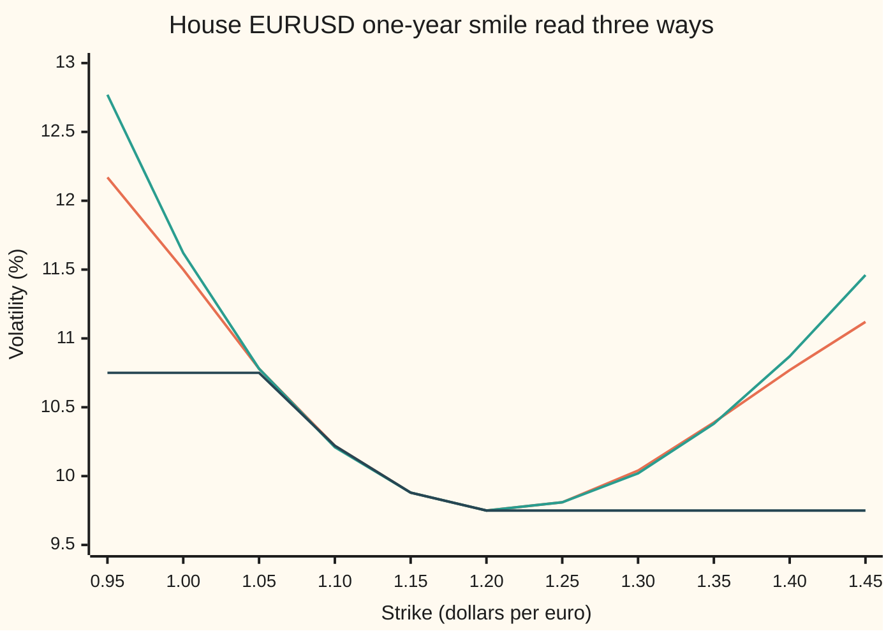
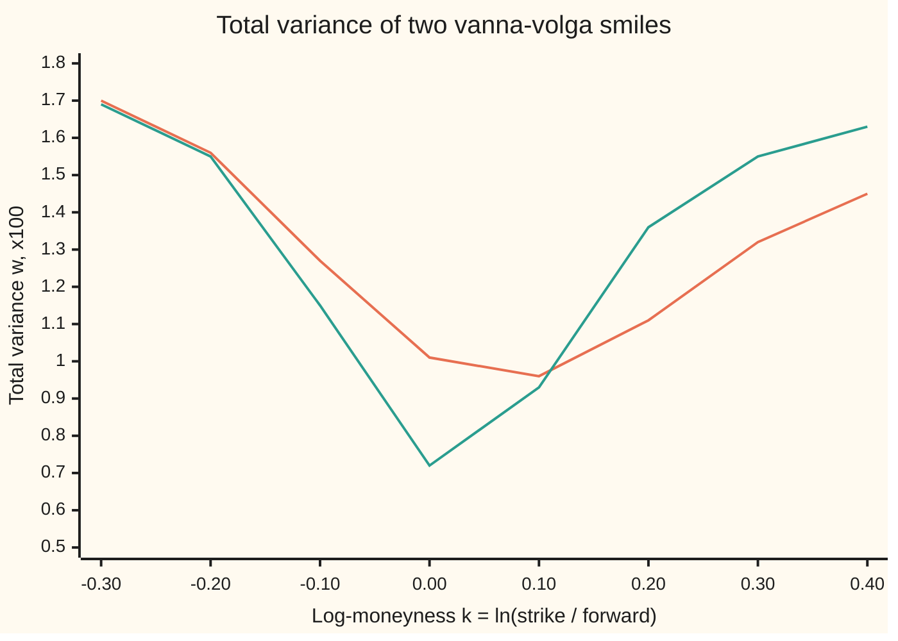

# The vanna-volga smile: a closed-form vol at any strike from three pillars, and where it breaks in the wings

Financial mathematics → The FX smile - risk reversals, butterflies and vanna-volga → Reading a vol between and beyond the quotes → The vanna-volga smile

---

## General Overview

The euro trades at 1.10 dollars. A one-year dollar rate is 5%, a one-year euro rate 3%, so the one-year forward rate, the rate a bank locks in today for exchange in a year, is 1.122221. A currency dealer's screen quotes three one-year volatilities for EURUSD: 10.00% at the money, a risk reversal of −1.00% and a butterfly of +0.25%. Unpacked ([risk-reversal-and-butterfly](01-risk-reversal-and-butterfly.md)), that is 10.75% for the 25-delta put and 9.75% for the 25-delta call: the options whose value moves a quarter as much as the exchange rate. Turned into strikes ([fx-strike-from-delta](../21-FX%20vanilla%20options%20-%20Garman-Kohlhagen%20and%20the%20desk%20conventions/06-fx-strike-from-delta.md)), the three quotes sit at 1.052466, 1.127847 and 1.201425. These three points are the **pillars**.

A client asks for a call struck at 1.15. No quote exists there. It sits between the at-the-money pillar and the 25-delta call pillar, so its volatility should land between 10.00% and 9.75%. It does: 9.8780%. The same recipe gives a number at 1.40, far past the last pillar. There it says 10.77%, higher than at the money, although every quote on this side of the smile says volatility falls as the strike rises.

This card writes the recipe out. It is a closed form: three pillar vols and a handful of logarithms in, one vol out, with no root finder. It comes from the vanna-volga price ([vanna-volga-pricing](04-vanna-volga-pricing.md)) read back as a volatility. Antonio Castagna and Fabio Mercurio published it in 2006.

**The vanna-volga smile reads a vol at any strike as a weighted average of the three pillar vols, with weights built from log-strike ratios, plus a small second-order correction; it passes through all three quotes exactly, is excellent between them, and past them it extrapolates a curve no quote supports and guarantees nothing against butterfly or calendar arbitrage.**

**What kind of fact this is:** an approximation, with its error stated: the second-order formula reads 9.8780% at 1.15, the same to six decimals as the full vanna-volga price, and 10.7717% at 1.40 against the full price's 10.7654%. The weights behind it are a theorem, proved on this card in Why it works.

### The picture: the curve, and what it does past the last pillar



Orange: the second-order vanna-volga curve, the one this card recommends. Green: the first-order curve, the plain weighted average. Dark blue: the same curve between the pillars, held flat at the outer quote past each end. Between 1.05 and 1.20 the three agree to within a hundredth of a point. Past 1.20 the vanna-volga curves turn up and leave the flat line behind; by 1.40 they sit a full point above it. Below 1.05 the first-order curve climbs faster than the second-order one: 12.77% against 12.17% at 0.95.

---

## The formula

The first-order reading is a weighted average of the three pillar vols:

$$\sigma^{(1)}(K) = y_1(K)\,\sigma_1 + y_2(K)\,\sigma_2 + y_3(K)\,\sigma_3$$

with weights built from logarithms of strike ratios:

$$y_1(K) = \frac{\ln\frac{K_2}{K}\,\ln\frac{K_3}{K}}{\ln\frac{K_2}{K_1}\,\ln\frac{K_3}{K_1}},\qquad y_2(K) = \frac{\ln\frac{K}{K_1}\,\ln\frac{K_3}{K}}{\ln\frac{K_2}{K_1}\,\ln\frac{K_3}{K_2}},\qquad y_3(K) = \frac{\ln\frac{K}{K_1}\,\ln\frac{K}{K_2}}{\ln\frac{K_3}{K_1}\,\ln\frac{K_3}{K_2}}.$$

The second-order reading, the one to use, corrects it:

$$\sigma(K) = \sigma_2 + \frac{-\sigma_2 + \sqrt{\sigma_2^2 + d_1(K)\,d_2(K)\,\big(2\sigma_2 D_1(K) + D_2(K)\big)}}{d_1(K)\,d_2(K)}$$

**Read it aloud: "Start from the at-the-money vol. Average the three pillar vols with log-strike weights to get the first-order shift. Then bend that shift slightly for the curvature of each option's value in volatility, which is the square root."**

| Symbol | Plain meaning | In our example | Push it up and the answer… |
| --- | --- | --- | --- |
| $K$ | the strike being read: the rate written into the contract, dollars per euro | 1.15 | moves along the curve |
| $K_1$, $K_2$, $K_3$ | the pillar strikes: 25-delta put, at the money (delta-neutral straddle), 25-delta call | 1.052466, 1.127847, 1.201425 | shifts the whole curve sideways |
| $\sigma_1$, $\sigma_2$, $\sigma_3$ | the pillar vols, one quote each | 10.75%, 10.00%, 9.75% | raises the curve most near that pillar |
| $\sigma(K)$, $e$ | the curve's volatility at strike $K$, and its gap $e = \sigma(K) - \sigma_2$ from the at-the-money vol; $\sigma^{(1)}(K)$ is the first-order reading | 9.8780% at 1.15 | (the output) |
| $y_1$, $y_2$, $y_3$ | the log-strike weights; they always add up to 1 | −0.092931, 0.886860, 0.206071 | a pillar with a bigger weight pulls harder |
| $D_1$ | the first-order shift away from the at-the-money vol: $\sigma^{(1)}(K) - \sigma_2$ | −0.001212 | raises $\sigma(K)$ almost one for one |
| $D_2$ | the second-order term: $y_1\,d_1(K_1)d_2(K_1)(\sigma_1-\sigma_2)^2 + y_3\,d_1(K_3)d_2(K_3)(\sigma_3-\sigma_2)^2$ | −1.543932 millionths | raises $\sigma(K)$ slightly |
| $d_1$, $d_2$ | the Black-Scholes distances, always taken at the at-the-money vol $\sigma_2$: $d_1(x) = \big(\ln(F/x) + \tfrac12\sigma_2^2T\big)/(\sigma_2\sqrt{T})$, $d_2(x) = d_1(x) - \sigma_2\sqrt{T}$ | $d_1(K)\,d_2(K)$ = 0.057289 at 1.15 | sets how strongly curvature bends the reading |
| $F$ | the forward rate, $S\,e^{(r_d-r_f)T}$ | 1.122221 | moves the pillar strikes with it |
| $S$, $r_d$, $r_f$, $T$ | spot rate, dollar rate, euro rate (continuously compounded), years to expiry | 1.10, 5%, 3%, 1 | through $F$ and the pillars |
| $x_1$, $x_2$, $x_3$, $\nu$, $\phi$ | the full vanna-volga price's weights; vega, the change in an option's value per unit of volatility; the bell-curve height | −0.115838, 0.870240, 0.246905 at 1.15 | (used in Why it works) |
| $k$ and $w$ | log-moneyness $\ln(K/F)$ and total variance $\sigma^2T$, the coordinates of the calendar test | $k$ = 0.3: $w$ times 100 = 1.320809 for one year | (used in the breakage checks) |

The product $d_1(K)\,d_2(K)$ decides how much the correction matters. It is zero at the at-the-money pillar and small near it. It grows like the square of the log-distance from the forward. So the square root does almost nothing between the pillars and a great deal in the wings.

Conventions verified 27 Sep 2026 against the house cards: pillars on spot delta with the premium in dollars; at the money as the delta-neutral straddle; the butterfly read as a smile strangle ([market-strangle-and-smile-strangle](02-market-strangle-and-smile-strangle.md)). A different delta convention moves the pillar strikes and so every number here.

### When it holds

- **The three quotes are clean and come from one expiry.** The curve reproduces them exactly, errors included. A mistyped 25-delta vol moves every strike's reading, most near its own pillar.
- **The strike sits between the outer pillars, or not far past them.** At 1.15 the curve and the full vanna-volga price agree to six decimals. Past 1.20 it follows a parabola in log-strike that no quote pins down; at 1.40 the call it implies is worth roughly double the flat-extrapolated one.
- **The skew is moderate.** With the risk reversal steepened to −3%, the number under the square root turns negative at 1.286412 and the formula returns no vol at all.
- **Nobody needs a guarantee of no arbitrage.** The formula never looks at the density across strikes or at other expiries. It can pass the butterfly test, as the house curve does on 0.80 to 1.60, or fail it; and nothing ties one expiry's curve to the next. It has to be tested, every time.

---

## Why it works

### Step 0: the idea — price a plain call with vanna-volga, then read the price back as a vol

The vanna-volga price ([vanna-volga-pricing](04-vanna-volga-pricing.md)) values any option as its flat-vol price plus the market cost of a hedge. The hedge is three pillar options, in amounts chosen so the hedge carries the same vega, vanna and volga as the target ([vanna-and-volga-on-the-smile](03-vanna-and-volga-on-the-smile.md)). Vega is the change in value per unit of volatility; vanna is how vega changes with the exchange rate; volga is how vega changes with volatility.

Apply that price to a plain call at strike $K$. The answer is a dollar price. Every dollar price of a call inside its no-arbitrage bounds has exactly one Black-Scholes volatility that reproduces it (for a currency the formula is Garman-Kohlhagen: [garman-kohlhagen](../21-FX%20vanilla%20options%20-%20Garman-Kohlhagen%20and%20the%20desk%20conventions/01-garman-kohlhagen.md)). Do that at every strike and a smile appears. Castagna and Mercurio's contribution is to skip the price and the root finder: the weights have a closed form, and expanding the price in small vol gaps gives the vol directly.

### Step 1: the hedge weights are log-strike weights

Write $x_1$, $x_2$, $x_3$ for the amounts of the three pillar calls, all valued at the flat vol $\sigma_2$. They solve three equations: matched vega, matched vanna, matched volga.

For a Black-Scholes call at one vol, vanna and volga are vega times something simple. Vanna is vega times $-d_2/(S\sigma_2\sqrt{T})$. Volga is vega times $d_1d_2/\sigma_2$. Divide each equation by the target's vega and set $u_i = x_i\,\nu(K_i)/\nu(K)$. The three equations become

$$u_1 + u_2 + u_3 = 1,\qquad \sum_i u_i\,d_2(K_i) = d_2(K),\qquad \sum_i u_i\,d_1(K_i)d_2(K_i) = d_1(K)d_2(K).$$

Now look at what the $d$'s are as functions of the log-strike $\ln K$. $d_2$ is a straight line in $\ln K$. $d_1d_2$ is a parabola in $\ln K$: its leading term is $(\ln K)^2/(\sigma_2^2T)$. So the three equations say: the combination $u$ reproduces a constant, a straight line and a parabola in $\ln K$. Any combination that does that reproduces every parabola in $\ln K$. There is exactly one such combination of three points: the Lagrange weights, the weights that fit a parabola through three points. Those are $y_1$, $y_2$, $y_3$ in The formula. So

$$x_i(K) = \frac{\nu(K)}{\nu(K_i)}\,y_i(K).$$

At 1.15 the 3×3 solve gives −0.115838, 0.870240 and 0.246905. The closed form gives the same three numbers.

<details>
<summary>Detailed proof</summary>

Let $z = \ln K$ and $z_i = \ln K_i$. With $a = \ln F + \tfrac12\sigma_2^2T$ and $b = \sigma_2\sqrt{T}$, $d_1 = (a - z)/b$ and $d_2 = d_1 - b$. So $d_2$ is affine in $z$, and $d_1d_2 = d_1^2 - b\,d_1 = (a-z)^2/b^2 - (a-z)$, a quadratic in $z$ with leading coefficient $1/b^2 \ne 0$.

Black-Scholes gives $\partial_S d_1 = \partial_S d_2 = 1/(S b)$ and $\partial_\sigma d_1 = -d_2/\sigma$, $\partial_\sigma d_2 = -d_1/\sigma$. Differentiating vega, $\nu = S e^{-r_fT}\phi(d_1)\sqrt{T}$, gives vanna $= -\nu\,d_2/(S b)$ and volga $= \nu\,d_1d_2/\sigma$. Dividing the three matching equations by $\nu(K)$ and by the constants $-1/(Sb)$ and $1/\sigma$ leaves the system for $u$ in Step 1.

The span of $1$, $d_2(z)$ and $d_1d_2(z)$ is the space of all quadratics in $z$, since the three have degrees 0, 1 and 2. So the system says $\sum_i u_i\,p(z_i) = p(z)$ for every quadratic $p(z)$. Take for $p(z)$ each Lagrange basis polynomial $\ell_j(z)$, the quadratic equal to 1 at one pillar's log-strike and 0 at the other two. That gives $u_j = \ell_j(z)$. Since $\ell_1(z) = (z - z_2)(z - z_3)/((z_1 - z_2)(z_1 - z_3))$, and $z - z_2 = \ln(K/K_2)$, this is $y_1$. The same for $y_2$, $y_3$. The three pillars have distinct strikes, so the system has exactly this one solution.

</details>

### Step 2: first order — the vol is the weighted average

The target call priced by vanna-volga is

$$C(K) = C_{BS}(K, \sigma_2) + \sum_i x_i(K)\,\big[C_{BS}(K_i, \sigma_i) - C_{BS}(K_i, \sigma_2)\big],$$

where $C_{BS}(K,\sigma)$ is the Garman-Kohlhagen call price at strike $K$ and vol $\sigma$. Each bracket is a pillar's market price minus its flat-vol price. For small vol gaps it is close to vega times the gap: $\nu(K_i)(\sigma_i - \sigma_2)$. Put in $x_i = y_i\,\nu(K)/\nu(K_i)$ and the pillar vegas cancel:

$$C(K) \approx C_{BS}(K,\sigma_2) + \nu(K)\sum_i y_i(\sigma_i - \sigma_2).$$

The call at its own smile vol is, to the same order, $C_{BS}(K,\sigma_2) + \nu(K)(\sigma(K) - \sigma_2)$. Match the two, divide by $\nu(K)$, and use $y_1 + y_2 + y_3 = 1$:

$$\sigma(K) \approx \sigma_2 + D_1(K) = y_1\sigma_1 + y_2\sigma_2 + y_3\sigma_3.$$

The first-order vanna-volga smile is the parabola in log-strike through the three quotes. Nothing more.

### Step 3: second order — keep the curvature, solve a quadratic

Take one more term in each expansion. A price's second derivative in vol is volga, which is vega times $d_1d_2/\sigma_2$. The pillar brackets become $\nu(K_i)\big[(\sigma_i-\sigma_2) + \tfrac{1}{2\sigma_2}d_1d_2(K_i)(\sigma_i-\sigma_2)^2\big]$. Summed with the weights, the hedge side is $\nu(K)\big[D_1 + D_2/(2\sigma_2)\big]$. The target side, with $e = \sigma(K) - \sigma_2$, is $\nu(K)\big[e + \tfrac{1}{2\sigma_2}d_1d_2(K)\,e^2\big]$. Setting them equal gives a quadratic in the gap $e$:

$$\frac{d_1d_2(K)}{2\sigma_2}\,e^2 + e - \Big(D_1 + \frac{D_2}{2\sigma_2}\Big) = 0.$$

Its roots are $e = \big(-\sigma_2 \pm \sqrt{\sigma_2^2 + d_1d_2(K)(2\sigma_2D_1 + D_2)}\big)/d_1d_2(K)$. That is the formula.

**Existence, uniqueness, boundary cases.** A real root exists exactly when the number under the square root is not negative. Of the two roots, only the plus sign shrinks to the first-order answer $D_1$ as the smile flattens; the minus root runs off to about $-2\sigma_2/(d_1d_2)$, a nonsense vol, so the plus root is the unique sensible one. When $d_1d_2(K) = 0$ the formula reads 0/0. That happens at the at-the-money pillar and at the strike where $d_2 = 0$, just below the forward. There the quadratic is linear and the answer is its limit, $\sigma_2 + D_1 + D_2/(2\sigma_2)$. The checks take that branch at the pillar and read back 10.00% exactly.

### Step 4: why it breaks past the pillars

Between the pillars the weights are modest and the vol gaps small, so the expansions of Steps 2 and 3 are accurate. Outside, two things fail. The weights stop being an average: past $K_3$, $y_2$ turns negative while $y_1$ and $y_3$ grow like the square of the log-distance, so the first-order curve is a parabola in $\ln K$, with one lowest point and a climb after it, and the second-order curve follows it, slightly bent. And $d_1(K)\,d_2(K)$ grows without bound, so if $2\sigma_2D_1 + D_2$ is negative enough the square root's argument crosses zero and the quadratic of Step 3 has no real root. Neither step ever asks whether call prices are convex in strike or whether total variance grows with expiry, the two no-arbitrage tests of [volatility-surface-and-its-arbitrage-rules](../12-The%20smile%20and%20the%20surface/03-volatility-surface-and-its-arbitrage-rules.md). The worked numbers below show all three failures.

<details>
<summary>Why log-strikes and not strikes?</summary>

Three reasons. The Black-Scholes distances $d_1$ and $d_2$ are straight lines in $\ln K$, not in $K$, so the matching equations of Step 1 are polynomial only in $\ln K$. Exchange rates move by percentages, so a log-strike treats 1.10 to 1.21 the same as 1.00 to 1.10. And flipping the quote, euros per dollar instead of dollars per euro, turns $\ln K$ into $-\ln K$; a parabola in $\ln K$ stays a parabola, so the curve survives the flip.

</details>

An alternative route to a full smile from quotes is to fit a parametric curve, such as SVI, that is built to pass the butterfly test: [svi-smile-fit](../12-The%20smile%20and%20the%20surface/04-svi-smile-fit.md). It needs more quotes and a fitter; vanna-volga needs three quotes and a calculator.

---

## Worked numbers, by hand

House market: spot 1.10, dollar rate 5%, euro rate 3%, one year. Pillars 1.052466 at 10.75%, 1.127847 at 10.00%, 1.201425 at 9.75%. Read the vol at 1.15.

| Step | Arithmetic | Value |
| --- | --- | --- |
| gaps between pillars | $\ln(K_2/K_1)$, $\ln(K_3/K_2)$, $\ln(K_3/K_1)$ | 0.069174, 0.063198, 0.132373 |
| gaps from 1.15 | $\ln(1.15/K_1)$, $\ln(1.15/K_2)$, $\ln(1.15/K_3)$ | 0.088626, 0.019452, −0.043747 |
| $y_1$ | $(-0.019452)(0.043747)\,/\,(0.069174 \times 0.132373)$ | −0.092931 |
| $y_2$ | $(0.088626)(0.043747)\,/\,(0.069174 \times 0.063198)$ | 0.886860 |
| $y_3$ | $(0.088626)(0.019452)\,/\,(0.132373 \times 0.063198)$ | 0.206071 |
| first order | $-0.092931 \times 10.75\% + 0.886860 \times 10.00\% + 0.206071 \times 9.75\%$ | 9.8788% |
| $D_1$ | $9.8788\% - 10.00\%$ | −0.001212 |
| $d_1d_2$ at the pillars | at $K_1$ and $K_3$, at the 10% vol | 0.409334, 0.462601 |
| $D_2$ | $-0.092931 \times 0.409334 \times 0.0075^2 + 0.206071 \times 0.462601 \times 0.0025^2$ | −1.543932 millionths |
| $d_1d_2$ at 1.15 | at the 10% vol | 0.057289 |
| under the root | $0.01 + 0.057289 \times (2 \times 0.10 \times (-0.001212) + D_2)$ | 0.009986 |
| its square root | unrounded 0.09993009 | 0.099930 |
| **second order** | $0.10 + (-0.00006991)/0.057289 = 0.10 - 0.001220$ | **9.8780%** |

The vol at 1.15 is 9.8780%, between 10.00% and 9.75% as it should be. The square root moved the first-order answer by less than a thousandth of a vol point. Between the pillars the first-order average is already the answer.

The full vanna-volga price of the 1.15 call, from the 3×3 hedge, is 0.030655 dollars per euro. Its implied vol is 9.8780%. The closed form and the full price agree to the six printed decimals.

### What breaks if you drop a piece

| Mistake | Comes out at | What went wrong |
| --- | --- | --- |
| Build all three pillar strikes at the 10% vol | 9.8721% at 1.15 (right: 9.8780%) | Each 25-delta strike depends on its own vol. At 10% the pillars sit at the wrong strikes, and the parabola runs through the right vols at the wrong places. |
| Use the first order in the far put wing | 18.6244% at 0.80 (second order: 13.1466%) | The parabola in log-strike climbs fast; the square root is what tames it out there. |
| Drop $D_2$ | 10.7335% at 1.40 (right: 10.7717%) | Small inside the pillars, the curvature term is worth four hundredths of a point in the wing. |
| Trust the curve at 1.40 | call 0.000943 dollars per euro (flat at 9.75%: 0.000466) | Nothing quoted supports the upturn; the price roughly doubles on the parabola's say-so. |

### Past the last pillar: the wing bends the wrong way

The call-side quotes say volatility falls as the strike rises, from 10.00% at 1.127847 to 9.75% at 1.201425. A sane extrapolation carries that on: hold 9.75% flat, or drift gently lower. The vanna-volga curve bottoms at 9.7483% at 1.208205, barely past the pillar, and climbs. At 1.40 the second-order formula says 10.7717%, the full vanna-volga price 10.7654%, the first-order average 10.8650%. All three sit above the at-the-money vol: the cheap side of the smile has become dearer than the middle.

In money, the 1.40 call is worth 0.000943 dollars per euro on the curve and 0.000466 held flat at 9.75%. Neither is "right". The factor of about two between them is decided by a parabola, not by the market.

### The butterfly test: passed here, not promised

A smile is free of butterfly arbitrage when call prices bend upward in strike. The measure is the density: the dollar rate compounded forward, $e^{r_dT}$, times the second derivative of the call price in strike. It is the market's probability density for the rate at expiry, and it must never be negative.

On the house quotes the density stays positive on the whole range 0.80 to 1.60; its lowest value there is 0.013168. That is luck of the quotes, not a property of the method. Steepen the risk reversal to −3% (vols 11.75%, 10.00%, 8.75%; the call pillar moves to 1.192529). The curve now plunges past the call pillar: 7.4722% at 1.25, then 5.5001% at 0.002 short of the end, where the density is −0.959924. A negative density means a butterfly of calls with a negative price: a buyer is paid to take a position that never loses. At 1.286412 the number under the square root reaches zero, and past it the formula returns no vol at all.

### The calendar test: nothing links two expiries

The calendar test fixes a log-moneyness $k$ and asks that total variance $w = \sigma^2T$ never falls as expiry lengthens. Vanna-volga builds each expiry from that expiry's three quotes alone. Take a six-month market quoted at 12.00% at the money, −1.00% risk reversal, +1.00% butterfly, next to the one-year house quotes.



Orange: one year. Green: six months. At the money the six-month line sits well below, 0.723730 against 1.007593 (times 100), as it must. Between $k$ = 0.10 and 0.20 the green line crosses above: at $k$ = 0.3 it is 1.549041 against 1.320809. The shorter option carries more variance than the longer one at the same moneyness. Selling the six-month and buying the one-year there is a calendar spread with a negative price. Each smile is built correctly from its own quotes. The failure lives between them.

---

## Code, from first principles, and it actually runs

The scripts build the house pillars from the quotes, then read the vol at 1.15 and 1.40 by two independent roads. Road 1 is the closed form of this card. Road 2 is the full vanna-volga price: the 3×3 hedge solved by Cramer's rule with no closed form for the weights, the pillars' market-minus-model gaps added, and the price inverted to a vol by halving. The 3×3 weights are also checked against the closed-form weights $\nu(K)y_i/\nu(K_i)$. Then the scripts push the curve into the wings, run the butterfly test by second differences, run the calendar test against a six-month market, and print every number and chart point on this card. The bell-curve area comes from an all-positive series for the error function in Python and from Simpson slices in Rust.

### Python

```python
# The vanna-volga smile -- the check behind the card.  Standard library only.
# House FX market: EURUSD spot 1.10 dollars per euro, USD rate 5%, EUR rate 3%, one year;
# ATM 10.00%, 25-delta risk reversal -1.00%, 25-delta butterfly +0.25%.
# Nothing imported knows the answer: N(x) is summed from a series, roots are found by halving.
from math import log, sqrt, exp, pi

def N(x):                                   # bell-curve area left of x: erf from its all-positive series
    if abs(x) > 9.0: return 0.0 if x < 0 else 1.0
    z = abs(x) / sqrt(2.0); term = s = z; n = 0
    while term > 1e-17 * s:
        n += 1; term *= 2.0 * z * z / (2 * n + 1); s += term
    e = 2.0 / sqrt(pi) * exp(-z * z) * s
    return 0.5 * (1.0 + e) if x >= 0 else 0.5 * (1.0 - e)
def phi(x): return exp(-0.5 * x * x) / sqrt(2.0 * pi)
def halve(f, lo, hi):                       # f increasing, f(lo) < 0 < f(hi)
    for _ in range(200):
        mid = 0.5 * (lo + hi)
        if f(mid) < 0: lo = mid
        else: hi = mid
    return 0.5 * (lo + hi)

S, rd, rf = 1.10, 0.05, 0.03
def market(T, atm, rr, bf):                 # quotes -> forward, pillar strikes (each at its own vol), pillar vols
    F = S * exp((rd - rf) * T)
    vs = [atm + bf - rr / 2, atm, atm + bf + rr / 2]
    a = halve(lambda d: exp(-rf * T) * N(d) - 0.25, -8.0, 8.0)   # spot delta 0.25 -> the call's d1
    Ks = [F * exp(a * vs[0] * sqrt(T) + vs[0] ** 2 * T / 2), F * exp(vs[1] ** 2 * T / 2),
          F * exp(-a * vs[2] * sqrt(T) + vs[2] ** 2 * T / 2)]
    return F, T, Ks, vs
def d12(m, K, v):
    F, T = m[0], m[1]; d1 = (log(F / K) + 0.5 * v * v * T) / (v * sqrt(T)); return d1, d1 - v * sqrt(T)
def call(m, K, v):
    d1, d2 = d12(m, K, v); return S * exp(-rf * m[1]) * N(d1) - K * exp(-rd * m[1]) * N(d2)
def vega(m, K, v): return S * exp(-rf * m[1]) * phi(d12(m, K, v)[0]) * sqrt(m[1])
def vanna(m, K, v): d1, d2 = d12(m, K, v); return -exp(-rf * m[1]) * phi(d1) * d2 / v
def volga(m, K, v): d1, d2 = d12(m, K, v); return vega(m, K, v) * d1 * d2 / v

def ys(m, x):                               # the log-strike weights y1, y2, y3
    K1, K2, K3 = m[2]
    return [log(K2 / x) * log(K3 / x) / (log(K2 / K1) * log(K3 / K1)),
            log(x / K1) * log(K3 / x) / (log(K2 / K1) * log(K3 / K2)),
            log(x / K1) * log(x / K2) / (log(K3 / K1) * log(K3 / K2))]
def first(m, x): return sum(y * v for y, v in zip(ys(m, x), m[3]))
def second(m, x, keep_D2=True):             # Road 1: Castagna-Mercurio second order -> (vol or None, discriminant)
    y, s2 = ys(m, x), m[3][1]
    D1 = first(m, x) - s2
    D2 = sum(y[i] * d12(m, m[2][i], s2)[0] * d12(m, m[2][i], s2)[1] * (m[3][i] - s2) ** 2 for i in (0, 2))
    D2 = D2 if keep_D2 else 0.0
    ab = d12(m, x, s2)[0] * d12(m, x, s2)[1]
    if abs(ab) < 1e-9: return s2 + D1 + D2 / (2 * s2), 1.0      # the 0/0 point: take the limit
    disc = s2 * s2 + ab * (2 * s2 * D1 + D2)
    return (s2 + (-s2 + sqrt(disc)) / ab if disc >= 0 else None), disc

def det3(A): return (A[0][0] * (A[1][1] * A[2][2] - A[1][2] * A[2][1]) - A[0][1] * (A[1][0] * A[2][2] - A[1][2] * A[2][0])
                     + A[0][2] * (A[1][0] * A[2][1] - A[1][1] * A[2][0]))
def vv_price(m, x):                         # Road 2: the full vanna-volga price, weights by a 3x3 solve
    s2, Ks, vs = m[3][1], m[2], m[3]
    A = [[g(m, K, s2) for K in Ks] for g in (vega, vanna, volga)]
    b = [g(m, x, s2) for g in (vega, vanna, volga)]
    w = [det3([[b[r] if j == c else A[r][j] for j in range(3)] for r in range(3)]) / det3(A) for c in range(3)]
    return call(m, x, s2) + sum(w[i] * (call(m, Ks[i], vs[i]) - call(m, Ks[i], s2)) for i in range(3)), w
def implied(m, x, p): return halve(lambda v: call(m, x, v) - p, 1e-4, 1.0)
def density(m, x, h=1e-3):                  # e^{rd T} d2C/dK2 along the curve: must never be negative
    C = lambda k: call(m, k, second(m, k)[0])
    return exp(rd * m[1]) * (C(x - h) - 2 * C(x) + C(x + h)) / (h * h)

H = market(1.0, 0.10, -0.01, 0.0025)
F, T, Ks, vs = H
def row(name, *v): print(f"{name:<38}" + "".join(f" {u:>12.6f}" for u in v))
row("forward F", F)
for i, lab in enumerate(("25d put", "ATM", "25d call")):
    row(f"pillar {lab}: strike, vol read back", Ks[i], second(H, Ks[i])[0])
x = 1.15
y = ys(H, x); s2 = vs[1]
row("ln(K2/K1), ln(K3/K2), ln(K3/K1)", log(Ks[1] / Ks[0]), log(Ks[2] / Ks[1]), log(Ks[2] / Ks[0]))
row("K=1.15  ln(K/K1), ln(K/K2), ln(K/K3)", *[log(x / K) for K in Ks])
for i in range(3): row(f"K=1.15  weight y{i+1}", y[i])
row("K=1.15  first order  sum y_i sigma_i", first(H, x))
row("K=1.15  D1", first(H, x) - s2)
row("d1 d2 at K1 and at K3, ATM vol", *[d12(H, Ks[i], s2)[0] * d12(H, Ks[i], s2)[1] for i in (0, 2)])
row("K=1.15  D2, in millionths", 1e6 * sum(y[i] * d12(H, Ks[i], s2)[0] * d12(H, Ks[i], s2)[1] * (vs[i] - s2) ** 2 for i in (0, 2)))
row("K=1.15  d1 d2 at the ATM vol", d12(H, x, s2)[0] * d12(H, x, s2)[1])
row("K=1.15  discriminant, its square root", second(H, x)[1], sqrt(second(H, x)[1]))
row("K=1.15  1 second order", second(H, x)[0])
p115, w = vv_price(H, x)
row("K=1.15  2 full VV price", p115); row("K=1.15  2 full VV, implied vol", implied(H, x, p115))
cm = [vega(H, x, s2) / vega(H, Ks[i], s2) * y[i] for i in range(3)]
for i in range(3): row(f"K=1.15  weight x{i+1}: 3x3 solve", w[i]); row(f"K=1.15  weight x{i+1}: nu(K)/nu(K{i+1}) y{i+1}", cm[i])
x = 1.40
p140 = vv_price(H, x)[0]
row("K=1.40  first order", first(H, x)); row("K=1.40  1 second order", second(H, x)[0])
row("K=1.40  2 full VV, implied vol", implied(H, x, p140))
row("K=1.40  call on the VV curve", call(H, x, second(H, x)[0])); row("K=1.40  call, flat 9.75% past K3", call(H, x, vs[2]))
kmin = halve(lambda k: second(H, k + 1e-6)[0] - second(H, k - 1e-6)[0], 1.13, 1.35)
row("curve's lowest point, strike", kmin); row("curve's lowest point, vol", second(H, kmin)[0])
row("K=0.80  first order", first(H, 0.80)); row("K=0.80  second order", second(H, 0.80)[0])
row("wrong: pillars all at 10%, K=1.15", second((F, T, market(1.0, 0.10, 0.0, 0.0)[2], vs), 1.15)[0])
row("wrong: drop D2, K=1.40", second(H, 1.40, False)[0])
row("house density, lowest on 0.80..1.60", min(density(H, 0.80 + 0.01 * i) for i in range(81)))
St = market(1.0, 0.10, -0.03, 0.0025)       # a steep skew: risk reversal -3%
kb = halve(lambda k: -second(St, k)[1], 1.21, 1.40)
row("steep skew: vols K1, K3; strike K3", St[3][0], St[3][2], St[2][2]); row("steep skew: vol at K=1.25", second(St, 1.25)[0]); row("steep skew: density at K=1.25", density(St, 1.25))
row("steep skew: vol at end - 0.002", second(St, kb - 0.002)[0]); row("steep skew: density at end - 0.002", density(St, kb - 0.002))
row("steep skew: curve ends at strike", kb)
M6 = market(0.5, 0.12, -0.01, 0.01)         # a 6-month market: ATM 12%, RR -1%, BF +1%
tv = lambda m, k: second(m, m[0] * exp(k))[0] ** 2 * m[1] * 100
for k in (0.0, 0.3): row(f"total var x100, k={k:.1f}: 1y", tv(H, k)); row(f"total var x100, k={k:.1f}: 6m", tv(M6, k))
print(f"{'chart, strike':<27}" + "".join(f"{0.95 + 0.05 * i:6.2f}" for i in range(11)))
grid = [0.95 + 0.05 * i for i in range(11)]
print(f"{'chart, VV curve %':<27}" + "".join(f"{100 * second(H, k)[0]:6.2f}" for k in grid))
print(f"{'chart, first order %':<27}" + "".join(f"{100 * first(H, k):6.2f}" for k in grid))
print(f"{'chart, flat past pillars %':<27}" + "".join(f"{100 * (vs[0] if k < Ks[0] else vs[2] if k > Ks[2] else second(H, k)[0]):6.2f}" for k in grid))
print(f"{'chart, k':<27}" + "".join(f"{-0.3 + 0.1 * i:6.2f}" for i in range(8)))
print(f"{'chart, 1y total var x100':<27}" + "".join(f"{tv(H, -0.3 + 0.1 * i):6.2f}" for i in range(8)))
print(f"{'chart, 6m total var x100':<27}" + "".join(f"{tv(M6, -0.3 + 0.1 * i):6.2f}" for i in range(8)))

assert all(abs(K - k0) < 5e-7 for K, k0 in zip(Ks, (1.052466, 1.127847, 1.201425))), "house pillar strikes"
assert all(abs(second(H, Ks[i])[0] - vs[i]) < 1e-12 for i in range(3)), "the curve passes through its three quotes"
assert abs(second(H, 1.15)[0] - implied(H, 1.15, p115)) < 1e-6, "road 1 (closed form) meets road 2 (full VV price)"
assert all(abs(w - c) < 1e-9 for w, c in zip(vv_price(H, 1.15)[1], cm)), "3x3 weights equal the closed-form weights"
assert 0.0975 < second(H, 1.15)[0] < 0.10, "1.15 lands between the ATM and 25d call vols"
assert second(H, 1.40)[0] > vs[1] and call(H, 1.40, second(H, 1.40)[0]) > 1.5 * call(H, 1.40, vs[2]), "the wing turns up"
assert min(density(H, 0.80 + 0.01 * i) for i in range(81)) > 0, "the house curve passes the butterfly test"
assert density(St, kb - 0.002) < 0 and second(St, kb + 0.001)[0] is None, "steep skew: negative density, then no vol"
assert tv(M6, 0.0) < tv(H, 0.0), "at the money the 6m total variance sits below the 1y"
assert tv(M6, 0.3) > tv(H, 0.3), "in the wing it crosses above: calendar arbitrage"
print("ALL CHECKS PASS")
```

**Ran 2026-09-27 on macOS, Python 3.14.6, standard library only. All checks passed. Output, pasted from the run:**

```
forward F                                  1.122221
pillar 25d put: strike, vol read back      1.052466     0.107500
pillar ATM: strike, vol read back          1.127847     0.100000
pillar 25d call: strike, vol read back     1.201425     0.097500
ln(K2/K1), ln(K3/K2), ln(K3/K1)            0.069174     0.063198     0.132373
K=1.15  ln(K/K1), ln(K/K2), ln(K/K3)       0.088626     0.019452    -0.043747
K=1.15  weight y1                         -0.092931
K=1.15  weight y2                          0.886860
K=1.15  weight y3                          0.206071
K=1.15  first order  sum y_i sigma_i       0.098788
K=1.15  D1                                -0.001212
d1 d2 at K1 and at K3, ATM vol             0.409334     0.462601
K=1.15  D2, in millionths                 -1.543932
K=1.15  d1 d2 at the ATM vol               0.057289
K=1.15  discriminant, its square root      0.009986     0.099930
K=1.15  1 second order                     0.098780
K=1.15  2 full VV price                    0.030655
K=1.15  2 full VV, implied vol             0.098780
K=1.15  weight x1: 3x3 solve              -0.115838
K=1.15  weight x1: nu(K)/nu(K1) y1        -0.115838
K=1.15  weight x2: 3x3 solve               0.870240
K=1.15  weight x2: nu(K)/nu(K2) y2         0.870240
K=1.15  weight x3: 3x3 solve               0.246905
K=1.15  weight x3: nu(K)/nu(K3) y3         0.246905
K=1.40  first order                        0.108650
K=1.40  1 second order                     0.107717
K=1.40  2 full VV, implied vol             0.107654
K=1.40  call on the VV curve               0.000943
K=1.40  call, flat 9.75% past K3           0.000466
curve's lowest point, strike               1.208205
curve's lowest point, vol                  0.097483
K=0.80  first order                        0.186244
K=0.80  second order                       0.131466
wrong: pillars all at 10%, K=1.15          0.098721
wrong: drop D2, K=1.40                     0.107335
house density, lowest on 0.80..1.60        0.013168
steep skew: vols K1, K3; strike K3         0.117500     0.087500     1.192529
steep skew: vol at K=1.25                  0.074722
steep skew: density at K=1.25              2.458657
steep skew: vol at end - 0.002             0.055001
steep skew: density at end - 0.002        -0.959924
steep skew: curve ends at strike           1.286412
total var x100, k=0.0: 1y                  1.007593
total var x100, k=0.0: 6m                  0.723730
total var x100, k=0.3: 1y                  1.320809
total var x100, k=0.3: 6m                  1.549041
chart, strike                0.95  1.00  1.05  1.10  1.15  1.20  1.25  1.30  1.35  1.40  1.45
chart, VV curve %           12.17 11.50 10.78 10.22  9.88  9.75  9.81 10.04 10.39 10.77 11.12
chart, first order %        12.77 11.62 10.78 10.21  9.88  9.75  9.81 10.02 10.38 10.87 11.46
chart, flat past pillars %  10.75 10.75 10.75 10.22  9.88  9.75  9.75  9.75  9.75  9.75  9.75
chart, k                    -0.30 -0.20 -0.10  0.00  0.10  0.20  0.30  0.40
chart, 1y total var x100     1.70  1.56  1.27  1.01  0.96  1.11  1.32  1.45
chart, 6m total var x100     1.69  1.55  1.15  0.72  0.93  1.36  1.55  1.63
ALL CHECKS PASS
```

### Rust

```rust
// The vanna-volga smile -- the same check as vanna_volga_smile_curve_check.py, in Rust.
// Standard library only, no crates.  Rust has no erf, so N(x) is built by adding thin
// slices under the bell curve (Simpson); roots are found by halving.
use std::f64::consts::PI;

const S: f64 = 1.10;
const RD: f64 = 0.05;
const RF: f64 = 0.03;

fn phi(x: f64) -> f64 { (-0.5 * x * x).exp() / (2.0 * PI).sqrt() }
fn n_cdf(x: f64) -> f64 {
    if x < -12.0 { return 0.0; }
    if x > 12.0 { return 1.0; }
    let n = 2000; let h = x / n as f64;
    let mut s = phi(0.0) + phi(x);
    for i in 1..n { s += if i % 2 == 1 { 4.0 } else { 2.0 } * phi(i as f64 * h); }
    0.5 + s * h / 3.0
}
fn halve<F: Fn(f64) -> f64>(f: F, mut lo: f64, mut hi: f64) -> f64 {
    for _ in 0..200 { let mid = 0.5 * (lo + hi); if f(mid) < 0.0 { lo = mid; } else { hi = mid; } }
    0.5 * (lo + hi)
}
#[derive(Clone, Copy)]
struct Mkt { f: f64, t: f64, ks: [f64; 3], vs: [f64; 3] }
fn market(t: f64, atm: f64, rr: f64, bf: f64) -> Mkt {
    let f = S * ((RD - RF) * t).exp();
    let vs = [atm + bf - rr / 2.0, atm, atm + bf + rr / 2.0];
    let a = halve(|d| (-RF * t).exp() * n_cdf(d) - 0.25, -8.0, 8.0);   // spot delta 0.25 -> call's d1
    let ks = [f * (a * vs[0] * t.sqrt() + vs[0] * vs[0] * t / 2.0).exp(), f * (vs[1] * vs[1] * t / 2.0).exp(),
              f * (-a * vs[2] * t.sqrt() + vs[2] * vs[2] * t / 2.0).exp()];
    Mkt { f, t, ks, vs }
}
fn d12(m: &Mkt, k: f64, v: f64) -> (f64, f64) {
    let d1 = ((m.f / k).ln() + 0.5 * v * v * m.t) / (v * m.t.sqrt()); (d1, d1 - v * m.t.sqrt())
}
fn call(m: &Mkt, k: f64, v: f64) -> f64 {
    let (d1, d2) = d12(m, k, v); S * (-RF * m.t).exp() * n_cdf(d1) - k * (-RD * m.t).exp() * n_cdf(d2)
}
fn vega(m: &Mkt, k: f64, v: f64) -> f64 { S * (-RF * m.t).exp() * phi(d12(m, k, v).0) * m.t.sqrt() }
fn vanna(m: &Mkt, k: f64, v: f64) -> f64 { let (d1, d2) = d12(m, k, v); -(-RF * m.t).exp() * phi(d1) * d2 / v }
fn volga(m: &Mkt, k: f64, v: f64) -> f64 { let (d1, d2) = d12(m, k, v); vega(m, k, v) * d1 * d2 / v }
fn ys(m: &Mkt, x: f64) -> [f64; 3] {
    let [k1, k2, k3] = m.ks;
    [(k2 / x).ln() * (k3 / x).ln() / ((k2 / k1).ln() * (k3 / k1).ln()),
     (x / k1).ln() * (k3 / x).ln() / ((k2 / k1).ln() * (k3 / k2).ln()),
     (x / k1).ln() * (x / k2).ln() / ((k3 / k1).ln() * (k3 / k2).ln())]
}
fn first(m: &Mkt, x: f64) -> f64 { let y = ys(m, x); y[0] * m.vs[0] + y[1] * m.vs[1] + y[2] * m.vs[2] }
fn dd(m: &Mkt, k: f64, v: f64) -> f64 { let (a, b) = d12(m, k, v); a * b }
fn d2_term(m: &Mkt, x: f64) -> f64 {
    let (y, s2) = (ys(m, x), m.vs[1]);
    [0usize, 2].iter().map(|&i| y[i] * dd(m, m.ks[i], s2) * (m.vs[i] - s2).powi(2)).sum()
}
// Road 1: Castagna-Mercurio second order -> (vol, or None past the end; the discriminant)
fn second(m: &Mkt, x: f64, keep_d2: bool) -> (Option<f64>, f64) {
    let s2 = m.vs[1];
    let d1 = first(m, x) - s2;
    let d2 = if keep_d2 { d2_term(m, x) } else { 0.0 };
    let ab = dd(m, x, s2);
    if ab.abs() < 1e-9 { return (Some(s2 + d1 + d2 / (2.0 * s2)), 1.0); }   // the 0/0 point: the limit
    let disc = s2 * s2 + ab * (2.0 * s2 * d1 + d2);
    (if disc >= 0.0 { Some(s2 + (-s2 + disc.sqrt()) / ab) } else { None }, disc)
}
fn sv(m: &Mkt, x: f64) -> f64 { second(m, x, true).0.unwrap() }
fn det3(a: &[[f64; 3]; 3]) -> f64 {
    a[0][0] * (a[1][1] * a[2][2] - a[1][2] * a[2][1]) - a[0][1] * (a[1][0] * a[2][2] - a[1][2] * a[2][0])
        + a[0][2] * (a[1][0] * a[2][1] - a[1][1] * a[2][0])
}
// Road 2: the full vanna-volga price, weights from a 3x3 solve (Cramer's rule)
fn vv_price(m: &Mkt, x: f64) -> (f64, [f64; 3]) {
    let s2 = m.vs[1];
    let gs: [fn(&Mkt, f64, f64) -> f64; 3] = [vega, vanna, volga];
    let mut a = [[0.0; 3]; 3]; let mut b = [0.0; 3];
    for r in 0..3 { for c in 0..3 { a[r][c] = gs[r](m, m.ks[c], s2); } b[r] = gs[r](m, x, s2); }
    let mut w = [0.0; 3];
    for c in 0..3 { let mut ac = a; for r in 0..3 { ac[r][c] = b[r]; } w[c] = det3(&ac) / det3(&a); }
    let p = call(m, x, s2) + (0..3).map(|i| w[i] * (call(m, m.ks[i], m.vs[i]) - call(m, m.ks[i], s2))).sum::<f64>();
    (p, w)
}
fn implied(m: &Mkt, x: f64, p: f64) -> f64 { halve(|v| call(m, x, v) - p, 1e-4, 1.0) }
fn density(m: &Mkt, x: f64) -> f64 {           // e^{rd T} d2C/dK2 along the curve
    let h = 1e-3; let c = |k: f64| call(m, k, sv(m, k));
    (RD * m.t).exp() * (c(x - h) - 2.0 * c(x) + c(x + h)) / (h * h)
}
fn row(name: &str, v: &[f64]) {
    let mut s = format!("{:<38}", name);
    for u in v { s.push_str(&format!(" {:>12.6}", u)); }
    println!("{}", s);
}
fn line(name: &str, v: &[f64]) {
    let mut s = format!("{:<27}", name);
    for u in v { s.push_str(&format!("{:6.2}", u)); }
    println!("{}", s);
}

fn main() {
    let h = market(1.0, 0.10, -0.01, 0.0025);
    let (ks, vs, s2) = (h.ks, h.vs, h.vs[1]);
    row("forward F", &[h.f]);
    for (i, lab) in ["25d put", "ATM", "25d call"].iter().enumerate() {
        row(&format!("pillar {}: strike, vol read back", lab), &[ks[i], sv(&h, ks[i])]);
    }
    let x = 1.15; let y = ys(&h, x);
    row("ln(K2/K1), ln(K3/K2), ln(K3/K1)", &[(ks[1] / ks[0]).ln(), (ks[2] / ks[1]).ln(), (ks[2] / ks[0]).ln()]);
    row("K=1.15  ln(K/K1), ln(K/K2), ln(K/K3)", &[(x / ks[0]).ln(), (x / ks[1]).ln(), (x / ks[2]).ln()]);
    for i in 0..3 { row(&format!("K=1.15  weight y{}", i + 1), &[y[i]]); }
    row("K=1.15  first order  sum y_i sigma_i", &[first(&h, x)]);
    row("K=1.15  D1", &[first(&h, x) - s2]);
    row("d1 d2 at K1 and at K3, ATM vol", &[dd(&h, ks[0], s2), dd(&h, ks[2], s2)]);
    row("K=1.15  D2, in millionths", &[1e6 * d2_term(&h, x)]);
    row("K=1.15  d1 d2 at the ATM vol", &[dd(&h, x, s2)]);
    let disc = second(&h, x, true).1;
    row("K=1.15  discriminant, its square root", &[disc, disc.sqrt()]);
    row("K=1.15  1 second order", &[sv(&h, x)]);
    let (p115, w) = vv_price(&h, x);
    row("K=1.15  2 full VV price", &[p115]); row("K=1.15  2 full VV, implied vol", &[implied(&h, x, p115)]);
    let cm: Vec<f64> = (0..3).map(|i| vega(&h, x, s2) / vega(&h, ks[i], s2) * y[i]).collect();
    for i in 0..3 {
        row(&format!("K=1.15  weight x{}: 3x3 solve", i + 1), &[w[i]]);
        row(&format!("K=1.15  weight x{}: nu(K)/nu(K{}) y{}", i + 1, i + 1, i + 1), &[cm[i]]);
    }
    let x = 1.40; let p140 = vv_price(&h, x).0;
    row("K=1.40  first order", &[first(&h, x)]); row("K=1.40  1 second order", &[sv(&h, x)]);
    row("K=1.40  2 full VV, implied vol", &[implied(&h, x, p140)]);
    row("K=1.40  call on the VV curve", &[call(&h, x, sv(&h, x))]); row("K=1.40  call, flat 9.75% past K3", &[call(&h, x, vs[2])]);
    let kmin = halve(|k| sv(&h, k + 1e-6) - sv(&h, k - 1e-6), 1.13, 1.35);
    row("curve's lowest point, strike", &[kmin]); row("curve's lowest point, vol", &[sv(&h, kmin)]);
    row("K=0.80  first order", &[first(&h, 0.80)]); row("K=0.80  second order", &[sv(&h, 0.80)]);
    let wrong = Mkt { ks: market(1.0, 0.10, 0.0, 0.0).ks, ..h };
    row("wrong: pillars all at 10%, K=1.15", &[sv(&wrong, 1.15)]);
    row("wrong: drop D2, K=1.40", &[second(&h, 1.40, false).0.unwrap()]);
    let dmin = (0..81).map(|i| density(&h, 0.80 + 0.01 * i as f64)).fold(f64::INFINITY, f64::min);
    row("house density, lowest on 0.80..1.60", &[dmin]);
    let st = market(1.0, 0.10, -0.03, 0.0025);                    // a steep skew: risk reversal -3%
    let kb = halve(|k| -second(&st, k, true).1, 1.21, 1.40);
    row("steep skew: vols K1, K3; strike K3", &[st.vs[0], st.vs[2], st.ks[2]]); row("steep skew: vol at K=1.25", &[sv(&st, 1.25)]);
    row("steep skew: density at K=1.25", &[density(&st, 1.25)]);
    row("steep skew: vol at end - 0.002", &[sv(&st, kb - 0.002)]); row("steep skew: density at end - 0.002", &[density(&st, kb - 0.002)]);
    row("steep skew: curve ends at strike", &[kb]);
    let m6 = market(0.5, 0.12, -0.01, 0.01);                     // a 6-month market: ATM 12%, RR -1%, BF +1%
    let tv = |m: &Mkt, k: f64| sv(m, m.f * k.exp()).powi(2) * m.t * 100.0;
    for k in [0.0, 0.3] {
        row(&format!("total var x100, k={:.1}: 1y", k), &[tv(&h, k)]);
        row(&format!("total var x100, k={:.1}: 6m", k), &[tv(&m6, k)]);
    }
    let grid: Vec<f64> = (0..11).map(|i| 0.95 + 0.05 * i as f64).collect();
    line("chart, strike", &grid);
    line("chart, VV curve %", &grid.iter().map(|&k| 100.0 * sv(&h, k)).collect::<Vec<_>>());
    line("chart, first order %", &grid.iter().map(|&k| 100.0 * first(&h, k)).collect::<Vec<_>>());
    line("chart, flat past pillars %", &grid.iter().map(|&k| 100.0 * if k < ks[0] { vs[0] } else if k > ks[2] { vs[2] } else { sv(&h, k) }).collect::<Vec<_>>());
    let kg: Vec<f64> = (0..8).map(|i| -0.3 + 0.1 * i as f64).collect();
    line("chart, k", &kg);
    line("chart, 1y total var x100", &kg.iter().map(|&k| tv(&h, k)).collect::<Vec<_>>());
    line("chart, 6m total var x100", &kg.iter().map(|&k| tv(&m6, k)).collect::<Vec<_>>());

    assert!(ks.iter().zip([1.052466, 1.127847, 1.201425]).all(|(k, k0)| (k - k0).abs() < 5e-7), "house pillar strikes");
    assert!((0..3).all(|i| (sv(&h, ks[i]) - vs[i]).abs() < 1e-12), "the curve passes through its three quotes");
    assert!((sv(&h, 1.15) - implied(&h, 1.15, p115)).abs() < 1e-6, "road 1 (closed form) meets road 2 (full VV price)");
    assert!((0..3).all(|i| (w[i] - cm[i]).abs() < 1e-9), "3x3 weights equal the closed-form weights");
    assert!(sv(&h, 1.15) > 0.0975 && sv(&h, 1.15) < 0.10, "1.15 lands between the ATM and 25d call vols");
    assert!(sv(&h, 1.40) > vs[1] && call(&h, 1.40, sv(&h, 1.40)) > 1.5 * call(&h, 1.40, vs[2]), "the wing turns up");
    assert!(dmin > 0.0, "the house curve passes the butterfly test");
    assert!(density(&st, kb - 0.002) < 0.0 && second(&st, kb + 0.001, true).0.is_none(), "steep skew: negative density, then no vol");
    assert!(tv(&m6, 0.0) < tv(&h, 0.0), "at the money the 6m total variance sits below the 1y");
    assert!(tv(&m6, 0.3) > tv(&h, 0.3), "in the wing it crosses above: calendar arbitrage");
    println!("ALL CHECKS PASS");
}
```

**Ran 2026-09-27 on macOS, rustc 1.98.1, no crates. All checks passed. Output, pasted from the run:**

```
forward F                                  1.122221
pillar 25d put: strike, vol read back      1.052466     0.107500
pillar ATM: strike, vol read back          1.127847     0.100000
pillar 25d call: strike, vol read back     1.201425     0.097500
ln(K2/K1), ln(K3/K2), ln(K3/K1)            0.069174     0.063198     0.132373
K=1.15  ln(K/K1), ln(K/K2), ln(K/K3)       0.088626     0.019452    -0.043747
K=1.15  weight y1                         -0.092931
K=1.15  weight y2                          0.886860
K=1.15  weight y3                          0.206071
K=1.15  first order  sum y_i sigma_i       0.098788
K=1.15  D1                                -0.001212
d1 d2 at K1 and at K3, ATM vol             0.409334     0.462601
K=1.15  D2, in millionths                 -1.543932
K=1.15  d1 d2 at the ATM vol               0.057289
K=1.15  discriminant, its square root      0.009986     0.099930
K=1.15  1 second order                     0.098780
K=1.15  2 full VV price                    0.030655
K=1.15  2 full VV, implied vol             0.098780
K=1.15  weight x1: 3x3 solve              -0.115838
K=1.15  weight x1: nu(K)/nu(K1) y1        -0.115838
K=1.15  weight x2: 3x3 solve               0.870240
K=1.15  weight x2: nu(K)/nu(K2) y2         0.870240
K=1.15  weight x3: 3x3 solve               0.246905
K=1.15  weight x3: nu(K)/nu(K3) y3         0.246905
K=1.40  first order                        0.108650
K=1.40  1 second order                     0.107717
K=1.40  2 full VV, implied vol             0.107654
K=1.40  call on the VV curve               0.000943
K=1.40  call, flat 9.75% past K3           0.000466
curve's lowest point, strike               1.208205
curve's lowest point, vol                  0.097483
K=0.80  first order                        0.186244
K=0.80  second order                       0.131466
wrong: pillars all at 10%, K=1.15          0.098721
wrong: drop D2, K=1.40                     0.107335
house density, lowest on 0.80..1.60        0.013168
steep skew: vols K1, K3; strike K3         0.117500     0.087500     1.192529
steep skew: vol at K=1.25                  0.074722
steep skew: density at K=1.25              2.458657
steep skew: vol at end - 0.002             0.055001
steep skew: density at end - 0.002        -0.959924
steep skew: curve ends at strike           1.286412
total var x100, k=0.0: 1y                  1.007593
total var x100, k=0.0: 6m                  0.723730
total var x100, k=0.3: 1y                  1.320809
total var x100, k=0.3: 6m                  1.549041
chart, strike                0.95  1.00  1.05  1.10  1.15  1.20  1.25  1.30  1.35  1.40  1.45
chart, VV curve %           12.17 11.50 10.78 10.22  9.88  9.75  9.81 10.04 10.39 10.77 11.12
chart, first order %        12.77 11.62 10.78 10.21  9.88  9.75  9.81 10.02 10.38 10.87 11.46
chart, flat past pillars %  10.75 10.75 10.75 10.22  9.88  9.75  9.75  9.75  9.75  9.75  9.75
chart, k                    -0.30 -0.20 -0.10  0.00  0.10  0.20  0.30  0.40
chart, 1y total var x100     1.70  1.56  1.27  1.01  0.96  1.11  1.32  1.45
chart, 6m total var x100     1.69  1.55  1.15  0.72  0.93  1.36  1.55  1.63
ALL CHECKS PASS
```

The two outputs agree line for line. They reach the bell-curve area by different routes, which is the point.

> [!TIP]
> **Try changing**
> Guess the direction first. Then run it.
> - **Flatten the smile.** Set the house risk reversal and butterfly to 0 in `market(1.0, 0.10, -0.01, 0.0025)`. Every weight still exists, but every vol gap is zero, so the curve reads 10.00% at every strike. The first assert fails: with the vols changed, the 25-delta strikes move off 1.052466 and 1.201425.
> - **Make the risk reversal −3%.** Already in the code as the steep skew: the curve ends at 1.286412 and the density just before the end is −0.959924.
> - **Drop the butterfly on the six-month market to +0.25%.** Guess: less curvature, less wing. The calendar assert fails; the two expiries no longer cross at $k$ = 0.3.
> - **Replace log-strikes with strikes in `ys`.** The curve still passes through the three quotes, but at 1.15 it no longer agrees with the full vanna-volga price and the road 1 against road 2 assert fails: the theorem of Step 1 is a statement about log-strikes.

---

## The usual mistake

> [!warning]
> **Treating the curve as a smile model.** It is an interpolation with a derivation behind it. Between the 25-delta pillars it is excellent: 9.8780% at 1.15, identical to the full vanna-volga price. Past them it extrapolates a parabola in log-strike that no quote supports: 10.7717% at 1.40 where the market's own direction says below 9.75%. Price a 1.40 call off it and the premium, 0.000943 against 0.000466 flat, is the parabola's opinion.
>
> Smaller traps:
> - **Assuming no arbitrage because the inputs have none.** Clean quotes can give a negative density (−0.959924 with a −3% risk reversal) or crossing expiries (1.549041 at six months against 1.320809 at a year, at $k$ = 0.3). Run both tests on the curves themselves.
> - **Evaluating $d_1$ and $d_2$ at the target's own vol.** Every $d$ in the formula is at the at-the-money vol $\sigma_2$. Using the answer inside its own formula makes it circular and changes the wing.
> - **Taking the minus root, or ignoring a negative square root.** The minus root is not a second smile; it is nonsense. A negative argument means the method has run out, not that a vol of zero applies.

---

## Where you meet it in real life

- **FX option desks.** Screens quote three vols per expiry; the vanna-volga curve is a common first reading of the strikes in between, such as the 1.15 call.
- **Pricing digitals and barriers.** A digital's value depends on the smile's slope at its strike, read off this curve: [fx-digitals](../23-FX%20exotics%20as%20desks%20use%20them%20-%20digitals%2C%20touches%20and%20barriers/01-fx-digitals.md).
- **Hedging.** When spot moves, the pillars move with it and the vol at a fixed strike changes; how a desk accounts for that is [smile-adjusted-delta-and-sticky-delta](06-smile-adjusted-delta-and-sticky-delta.md).
- **Risk systems.** A quick, closed-form smile used for marking and sanity checks, with a heavier model such as SVI ([svi-smile-fit](../12-The%20smile%20and%20the%20surface/04-svi-smile-fit.md)) taking over where arbitrage-free wings matter.

> **Say it back**
> Three quotes give three pillars: a strike and a vol each. The vanna-volga smile reads the vol at any other strike as the pillar vols averaged with log-strike weights, which are exactly the weights of the vanna-volga hedge, and then bends that average with a square-root correction for curvature. It passes through every quote and matches the full vanna-volga price between them. Past the outer pillars it follows a parabola the market never quoted, can end where the square root turns negative, and promises nothing about butterfly or calendar arbitrage. Use it inside the pillars; test it outside.

---

## What this builds on

- [vanna-volga-pricing](04-vanna-volga-pricing.md): the full price with its 3×3 hedge. This card reads that price back as a volatility and finds a closed form for it.
- [volatility-surface-and-its-arbitrage-rules](../12-The%20smile%20and%20the%20surface/03-volatility-surface-and-its-arbitrage-rules.md): the butterfly and calendar tests this card runs on the curve, and the density they rest on.

## Where this goes next

- [smile-adjusted-delta-and-sticky-delta](06-smile-adjusted-delta-and-sticky-delta.md): what happens to this curve when the exchange rate moves, and what that does to the hedge ratio.
- [fx-digitals](../23-FX%20exotics%20as%20desks%20use%20them%20-%20digitals%2C%20touches%20and%20barriers/01-fx-digitals.md): the first exotic priced off this curve, where its slope at a strike becomes money.

This card gives a vol at every strike for a fixed exchange rate; the open question is how that curve should move when the rate itself moves, and the answer decides how many euros a desk holds against a smile-priced option.

---

## Sources

Verified 27 Sep 2026: every link below resolves to the publisher's page.

- Castagna, Antonio, and Fabio Mercurio. "Consistent Pricing of FX Options." Working paper, 2006. [doi:10.2139/ssrn.873788](https://doi.org/10.2139/ssrn.873788). The vanna-volga price, the closed-form weights and the first- and second-order vol approximations of this card.
- Castagna, Antonio. *FX Options and Smile Risk*. Wiley, 2010. [doi:10.1002/9781119207085](https://doi.org/10.1002/9781119207085). Book-length treatment of the three-quote market and the vanna-volga smile.
- Bossens, Frédéric, Grégory Rayée, Nikos S. Skantzos, and Griselda Deelstra. "Vanna-Volga Methods Applied to FX Derivatives: From Theory to Market Practice." *International Journal of Theoretical and Applied Finance* 13, no. 8 (2010): 1293–1324. [doi:10.1142/S0219024910006212](https://doi.org/10.1142/S0219024910006212). Where the method holds, where it fails, and its arbitrage limits.
- Reiswich, Dimitri, and Uwe Wystup. "FX Volatility Smile Construction." *Wilmott* 2012, no. 60: 58–69. [doi:10.1002/wilm.10132](https://doi.org/10.1002/wilm.10132). The delta, at-the-money and strangle conventions that turn quotes into pillars.
- Gatheral, Jim, and Antoine Jacquier. "Arbitrage-Free SVI Volatility Surfaces." *Quantitative Finance* 14, no. 1 (2014): 59–71. [doi:10.1080/14697688.2013.819986](https://doi.org/10.1080/14697688.2013.819986). The butterfly and calendar conditions in the coordinates used here.
